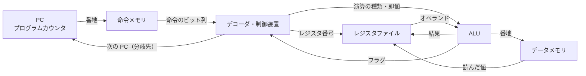

# 1.2 論理回路とCPUの仕組み

> あなたが書いた `total += price` は、最終的にトランジスタという小さなスイッチの ON/OFF の組み合わせで計算されます。スイッチの組み合わせがなぜ「計算」になり、なぜ「記憶」になり、なぜ命令の列を「実行」できるのでしょうか。この章では、論理ゲートから CPU までを一段ずつ組み上げ、最後に現代の CPU が速さのために行っている工夫と、その工夫が生んだ脆弱性までをたどります。

| 項目 | 内容 |
|---|---|
| 学習時間の目安 | 本文 4h ＋ 演習 6h |
| 前提となる章 | [1.1 情報の表現](../01-data-representation/README.md)（2 進数・2 の補数・オーバーフロー） |
| 演習 | [exercises/](exercises/)（Python） |
| キーワード | ブール代数, NAND, 全加算器, フリップフロップ, ALU, フラグ, 命令セット（ISA）, CISC/RISC, アセンブリ, パイプライン, 分岐予測, アウトオブオーダー実行, SIMD, GPU, Spectre |

## この章のゴール

- [ ] ブール代数とド・モルガンの法則を使って論理式を変形し、NAND だけで任意の論理回路を作れる理由を説明できる
- [ ] 加算器・マルチプレクサ・フリップフロップから、ALU とレジスタが組み立てられる仕組みを説明できる
- [ ] ALU のフラグ（Z/N/C/V）の意味と、符号付き・符号なしの比較が条件分岐にどうつながるかを説明できる
- [ ] 小さな CPU のエミュレータとアセンブラを実装し、フェッチ・デコード・実行のサイクルを説明できる
- [ ] コンパイラが出力した x86-64 のアセンブリを読み、ARM64・RISC-V との違い（CISC と RISC）を説明できる
- [ ] パイプライン・分岐予測・アウトオブオーダー実行・SIMD が性能に与える影響を、性能方程式を使って説明できる
- [ ] CPU アーキテクチャの選択（x86 か Arm か、CPU か GPU か）や CPU 脆弱性への対応を、コストとリスクの観点から判断できる

## なぜ学ぶのか

「CPU の中身はハードウェアの専門家の仕事で、ソフトウェアエンジニアには関係ない」と思うかもしれません。しかし CPU の仕組みは、性能・セキュリティ・コストの判断に直接効いてきます。

- **高速化の仕組みが脆弱性になった**: 2018 年 1 月に公表された Spectre と Meltdown は、CPU が速さのために行う「投機的実行」を悪用して、本来読めないはずのメモリの内容を盗み出す攻撃でした。ソフトウェアのバグではなく CPU の設計に由来するため、OS・ブラウザ・クラウド基盤が一斉に緩和策を入れることになり、ワークロードによっては無視できない性能低下を伴いました。CPU の内部構造が、セキュリティとキャパシティ計画の問題になった例です。
- **同じコード・同じデータでも 10 倍速さが違う**: 7.3 節では、約 100 万個の数から条件に合うものを合計するだけのプログラムが、データを並べ替えておくだけで約 10 倍速くなることを実測します。原因は CPU の分岐予測です。Stack Overflow で最も有名な質問の一つ "Why is processing a sorted array faster than processing an unsorted array?" も、この現象を扱っています。
- **x86 か Arm かが日常の技術判断になった**: Apple は 2020 年から Mac を Arm ベースの独自チップに移行し、主要なクラウドも Arm ベースのインスタンスを提供しています。開発者のラップトップと本番サーバーの CPU アーキテクチャが異なるのは、もはや珍しくありません。コンテナイメージを複数アーキテクチャ向けにビルドするか、Arm に移行してコストを下げるか、といった判断には命令セットの理解が要ります。
- **AI の計算コストは GPU で決まる**: 機械学習の学習と推論のコストの大部分は、GPU での行列演算です。なぜ GPU が行列演算に向くのかを知らないと、GPU の調達やクラウド費用の議論ができません。

## 1. ブール代数と論理ゲート

### 1.1 0 と 1 の代数

**ブール代数（Boolean algebra）** は、値が 0（偽）と 1（真）の 2 つだけの代数です。基本の演算は次の 4 つです。

| a | b | NOT a | a AND b | a OR b | a XOR b |
|---|---|---|---|---|---|
| 0 | 0 | 1 | 0 | 0 | 0 |
| 0 | 1 | 1 | 0 | 1 | 1 |
| 1 | 0 | 0 | 0 | 1 | 1 |
| 1 | 1 | 0 | 1 | 1 | 0 |

XOR（排他的論理和）は「2 つが異なるときだけ 1」です。1 ビットの足し算 1 + 1 = 10（2 進数）の下の桁は 0 なので、XOR は足し算の「和の桁」そのものです。

ブール代数には普通の代数と同じ交換・結合・分配法則があり、それに加えて実務で特によく使うのが **ド・モルガンの法則（De Morgan's laws）** です。

```text
NOT (a AND b) = (NOT a) OR (NOT b)
NOT (a OR b)  = (NOT a) AND (NOT b)
```

「かつ」の否定は「または」に、「または」の否定は「かつ」になります。プログラムの条件式の書き換えでも頻繁に使います。

```python
# 「管理者かつ有効」でなければ拒否する — 2 行は同じ意味
if not (user.is_admin and user.is_active): deny()
if not user.is_admin or not user.is_active: deny()
```

条件を否定するときに `and` を `or` に変え忘れるのは、よくあるバグです。迷ったら、すべての入力の組み合わせ（真理値表）で確かめるのが確実です。

### 1.2 トランジスタからゲートへ

現代の CPU は、電圧で ON/OFF を切り替えられるスイッチである **トランジスタ（transistor）** でできています。電圧の高低を 1 と 0 に対応させ、スイッチを直列（両方 ON のときだけ導通）や並列（どちらかが ON なら導通）に組み合わせると、論理演算をする **論理ゲート（logic gate）** ができます。

現在主流の CMOS という方式では、**NAND（NOT AND）ゲートはトランジスタ 4 個で作れる** のに対し、AND ゲートは NAND の後ろに NOT を付けるので 6 個必要です。回路の構造上、「否定付き」のゲートの方が小さく速いのです。このため NAND や NOR は、チップ設計の基本部品として使われます。

### 1.3 NAND だけで何でも作れる

NAND には、**それだけでどんな論理回路でも作れる** という性質があります（関数的完全性、functional completeness）。

```text
NOT a   = NAND(a, a)             … NAND 1 個
a AND b = NOT(NAND(a, b))        … NAND 2 個
a OR b  = NAND(NOT a, NOT b)     … NAND 3 個（ド・モルガンの法則）
```

ド・モルガンの法則と、NAND 3 個で作った OR を、すべての入力で確かめてみましょう。

```python
from itertools import product

def nand(a, b):
    return 1 - (a & b)

for a, b in product((0, 1), repeat=2):
    de_morgan = (1 - (a & b)) == ((1 - a) | (1 - b))  # NOT(a AND b) == (NOT a) OR (NOT b)
    or_by_nand = nand(nand(a, a), nand(b, b))         # NAND 3 個で作った OR
    print(a, b, de_morgan, or_by_nand, a | b)
```

```text
0 0 True 0 0
0 1 True 1 1
1 0 True 1 1
1 1 True 1 1
```

なぜ「どんな回路でも」と言い切れるのでしょうか。どんな真理値表も、出力が 1 になる行ごとに「その行のときだけ 1 になる AND の項」を作り、それらを OR でつなげば表せます（**積和形**、sum of products）。例えば XOR は `(a AND NOT b) OR (NOT a AND b)` です。AND・OR・NOT で任意の真理値表を作れ、その 3 つを NAND で作れるので、NAND だけで何でも作れます。演習 1 では、この手順をプログラムにして、任意の真理値表から NAND だけの回路を合成します。

ここには **抽象化の階段** という大切な考え方も表れています。トランジスタ → ゲート → 加算器 → ALU → CPU と、各段では下の段の中身を忘れて「部品」として使います。ソフトウェアで関数やモジュールを積み重ねるのと同じ考え方が、ハードウェアの根元から貫かれているのです。

## 2. 計算する回路と記憶する回路

論理回路には、入力だけで出力が決まる **組み合わせ回路（combinational circuit）** と、過去の入力（状態）にも出力が依存する **順序回路（sequential circuit）** があります。前者が「計算」を、後者が「記憶」を担います。

### 2.1 半加算器と全加算器

1 ビットの足し算 a + b の結果は 0〜2 なので、2 ビット（桁上がりと和）で表せます。1.1 節の真理値表と見比べると、和は a XOR b、桁上がりは a AND b です。この 2 つのゲートの組が **半加算器（half adder）** です。多ビットの足し算では下の桁からの桁上がりも足す必要があるので、3 つの入力 a + b + c_in を足す **全加算器（full adder）** を使います。全加算器は半加算器 2 個と OR 1 個で作れます。

```text
和       s     = a XOR b XOR c_in
桁上がり c_out = (a AND b) OR (c_in AND (a XOR b))    … 3 つのうち 2 つ以上が 1 なら 1
```

### 2.2 リップルキャリー加算器と、その遅さ

全加算器を n 個並べ、桁上がりを下の桁から上の桁へ渡していけば、n ビットの加算器になります。桁上がりが波紋（ripple）のように伝わるので **リップルキャリー加算器（ripple-carry adder）** と呼びます。

```text
 桁上がりは右（下位）から左（上位）へ、1 段ずつ伝わる

        a3 b3          a2 b2          a1 b1          a0 b0
         |  |           |  |           |  |           |  |
       +------+       +------+       +------+       +------+
 c4 <--|  FA  |<--c3--|  FA  |<--c2--|  FA  |<--c1--|  FA  |<-- c0（減算のときは 1）
       +------+       +------+       +------+       +------+
          |              |              |              |
          s3             s2             s1             s0          FA = 全加算器
```

この回路は小さく単純ですが、**最上位ビットの和は、桁上がりが最下位から n 段伝わってくるまで確定しません**。64 ビットなら 64 段ぶんの遅延です。次の 2.5 節で見るように、CPU のクロック周期は「最も遅い回路が計算を終える時間」より短くできないので、加算器の遅さはそのまま CPU の最高クロック周波数を制限します。

そこで実際の CPU は、桁上がりを先読みする **桁上げ先見加算器（carry-lookahead adder）** や、それを発展させたプレフィックス加算器を使います。各桁について「この桁で桁上がりが生まれるか（a AND b）」と「下からの桁上がりを通すか（a XOR b）」を並列に求め、木構造でまとめることで、遅延を n に比例から log n に比例にまで縮めます。その代わり回路は大きくなります。**回路の面積（コスト）と速度のトレードオフ** は、ハードウェア設計の至るところに現れます。

引き算に専用の回路は要りません。1.1 章で見たとおり a − b = a + (b のビット反転) + 1 なので、b を反転する回路を足し、最下位の桁上がり入力 c0 を 1 にするだけで、同じ加算器が減算器になります。2 の補数の本当のありがたみはここにあります。

### 2.3 マルチプレクサとデコーダ

**マルチプレクサ（multiplexer, MUX）** は、選択信号 sel に応じて複数の入力から 1 つを選んで出力する回路で、ハードウェアにおける `if` にあたります。2 入力の MUX は `(a AND NOT sel) OR (b AND sel)` です。**デコーダ（decoder）** はその逆向きの回路で、n ビットの番号を受け取り、2ⁿ 本の出力のうち 1 本だけを 1 にします。

CPU の中では、MUX が「どのレジスタの値を ALU に送るか」「ALU のどの演算結果を使うか」を選び、デコーダが「どのレジスタに書き込むか」を決めます。

### 2.4 フィードバックが記憶を生む: SR ラッチ

ここまでの回路は、入力が変わると出力もすぐに変わり、何も覚えていません。記憶を作る鍵は、**出力を入力に戻す（フィードバック）** ことです。NOR ゲート 2 個をたすき掛けにつないだ **SR ラッチ（SR latch）** は、1 ビットを記憶します。

```text
              +-------+
  R --------->|       |
              |  NOR  |-----+-----> Q
        +---->|       |     |
        |     +-------+     |
     Q' |                   |       上の NOR の出力 Q は下の NOR へ、
        |     +-------+     |       下の NOR の出力 Q' は上の NOR へ戻る
        |     |       |<----+       （たすき掛けのフィードバック）
        +-----|  NOR  |
              |       |<--------- S
              +-------+
```

| S | R | Q | 意味 |
|---|---|---|---|
| 0 | 0 | 直前の値のまま | 記憶（保持） |
| 1 | 0 | 1 | セット |
| 0 | 1 | 0 | リセット |
| 1 | 1 | （使用禁止） | Q と Q' がともに 0 になり、両方を同時に 0 へ戻すと状態が定まらない |

S を一瞬 1 にすると Q が 1 になり、S を 0 に戻しても、Q が下の NOR を通って自分自身を支え続けるので 1 のままです。**電源が入っている限り、回路の状態として値が残り続ける** —— これが記憶の正体です。

### 2.5 D フリップフロップとクロック

SR ラッチは入力が変わるとすぐに反応するため、多数の回路がそれぞれ勝手なタイミングで状態を変えると、計算途中の値を拾って誤動作します。そこで、回路全体に共通の **クロック（clock）** 信号（0 と 1 を一定の周期で繰り返す信号）を配り、**クロックが 0 から 1 に変わる瞬間（立ち上がり）にだけ入力 D を取り込み、次の立ち上がりまで保持する** 素子を使います。これが **D フリップフロップ（D flip-flop）** で、ラッチを 2 段組み合わせて作れます。

```text
  +------------+      組み合わせ回路         +------------+
  |  レジスタ  |----> （加算器・ALU など） ---->|  レジスタ  |
  | （D-FF 群）|       遅延 t_logic           | （D-FF 群）|
  +------------+                              +------------+
        ^                                            ^
        +---------------- クロック -----------------+

  クロック周期 >= 最も遅い経路（クリティカルパス）の遅延 + フリップフロップ自体の時間
```

CPU の回路は、この「レジスタ → 組み合わせ回路 → レジスタ」の繰り返しでできています。1 クロックの間に組み合わせ回路が計算を終え、次の立ち上がりで結果がレジスタに取り込まれます。したがって **クロック周期は、レジスタの間で最も遅い経路（クリティカルパス、critical path）の遅延より長くなければなりません**。クロック周波数 3 GHz なら周期は約 0.33 ns で、その間に信号が通り抜けられるゲートの段数はわずかです。

### 2.6 レジスタとレジスタファイル

D フリップフロップを 64 個並べれば、64 ビットの値を 1 つ記憶する **レジスタ（register）** になります。レジスタを数十本まとめ、読み出し側に MUX、書き込み側にデコーダを付けたものが **レジスタファイル（register file）** です。「r3 と r5 を読み、結果を r1 に書く」という操作は、番号を MUX とデコーダに与えるだけで実現できます。

CPU のキャッシュには 1 ビットを 6 個のトランジスタで記憶する SRAM が、メインメモリには 1 ビットをトランジスタ 1 個とコンデンサ 1 個で記憶する DRAM が使われます。この構造の違いが、速さと容量の大きな差を生みます（[1.3 メモリ階層とキャッシュ](../03-memory-hierarchy/README.md)）。

## 3. ALU とフラグ

### 3.1 ALU の構成

**ALU（Arithmetic Logic Unit, 算術論理演算装置）** は、加算・減算・論理演算などをまとめた組み合わせ回路です。単純な構成では、すべての演算を並列に計算しておき、命令が指定した演算の結果を MUX で選びます。

```text
        +--> 加算器（SUB のときは b を反転し c0 = 1） --+
  a --->+--> AND -------------------------------------+
        +--> OR ------------------------------------- +--> MUX --> 結果、フラグ
  b --->+--> XOR -------------------------------------+     ^
                                                             |
                                      演算の種類（命令のデコード結果）
```

### 3.2 4 つのフラグ

ALU は結果と一緒に、結果の性質を表す **フラグ（flag）** を出力します。多くの CPU に共通する次の 4 つを覚えましょう（x86 では ZF・SF・CF・OF と呼びます）。

| フラグ | 名前 | 意味 | 何に使うか |
|---|---|---|---|
| Z | Zero | 結果が 0 | 等しいかどうか（a − b = 0 ⇔ a = b） |
| N | Negative | 結果の最上位ビットが 1 | 符号付きとして負か |
| C | Carry | 最上位ビットからの桁上がり | **符号なし** の桁あふれ、大小比較 |
| V | oVerflow | 符号付きとしてのオーバーフロー | **符号付き** の溢れ、大小比較 |

1.1 章で学んだとおり、ビットパターンそのものには符号の有無の情報がありません。そこで ALU は **1 回の加算について、符号なしとして見た結果（C）と、符号付きとして見た結果（V）の両方を報告** し、どちらを使うかはプログラム（コンパイラ）が決めます。8 ビットの例を見てみましょう（演習 2 の ALU の解答例で計算した値です）。

| 演算 | 結果 | Z | N | C | V | 解説 |
|---|---|---|---|---|---|---|
| 0x70 + 0x70 | 0xE0 | 0 | 1 | 0 | 1 | 符号なしの 112 + 112 = 224 は正しい。符号付きでは正 + 正 = 負になり溢れ |
| 0xF0 + 0x20 | 0x10 | 0 | 0 | 1 | 0 | 符号なしの 240 + 32 は溢れる。符号付きの −16 + 32 = 16 は正しい |
| 0x80 + 0x80 | 0x00 | 1 | 0 | 1 | 1 | どちらとして見ても溢れる（符号付きでは −128 + −128） |
| 0x05 − 0x07 | 0xFE | 0 | 1 | 0 | 0 | 符号付きの 5 − 7 = −2 は正しい。符号なしでは借りが発生（C = 0） |

V は「同じ符号の数を足したのに結果の符号が変わった」ときに 1 になります。回路では「最上位ビットへの桁上がり」と「最上位ビットからの桁上がり」の XOR として求められます。

減算の C フラグには 2 つの流儀があるので注意してください。a + (b の反転) + 1 の桁上がりをそのまま使う ARM では、「借りが **なかった**（符号なしで a ≥ b）」とき C = 1 になります。x86 はこれを反転し、「借りが **あった**（a < b）」とき CF = 1 にします。この章の演習は ARM の方式です。

### 3.3 比較と条件分岐

CPU の比較命令（x86 や ARM の `cmp`）は、**引き算をして結果を捨て、フラグだけを残す** 命令です。続く条件分岐命令が、フラグを見て飛ぶかどうかを決めます。

| 条件（a と b を比較） | 符号なし整数 | 符号付き整数 | x86（符号なし / 符号付き） | ARM64（符号なし / 符号付き） |
|---|---|---|---|---|
| a = b | Z = 1 | Z = 1 | `je` | `b.eq` |
| a ≠ b | Z = 0 | Z = 0 | `jne` | `b.ne` |
| a < b | 借りあり | N ≠ V | `jb` / `jl` | `b.lo` / `b.lt` |
| a ≥ b | 借りなし | N = V | `jae` / `jge` | `b.hs` / `b.ge` |

**符号なしと符号付きで、使うフラグも命令も違う** ことに注目してください。符号付きの a < b を N だけで判定すると、a − b がオーバーフローしたときに間違えます（8 ビットで 100 − (−100) = 200 は溢れて負に見える）。そこで「N ≠ V」で判定します。

この区別は、そのまま言語の落とし穴にもなっています。C で符号付きと符号なしの整数を比較すると、符号付きの側が符号なしに変換されてから比較されます。

```c
int a = -1;
unsigned int b = 1;
printf("%s\n", a < b ? "-1 < 1u" : "-1 >= 1u");   /* 実行すると -1 >= 1u と表示される */
```

`a` が符号なしの 4294967295 に変換されてから比較されるためです。gcc 13.3 では、この比較に `-Wall` だけでは警告が出ず、`-Wextra`（に含まれる `-Wsign-compare`）を付けると `comparison of integer expressions of different signedness` と警告されます。

## 4. CPU の構成と命令セット

### 4.1 プログラム内蔵方式

現代のコンピュータは、**プログラム（命令の列）もデータと同じようにメモリに置き、CPU がそれを 1 つずつ読んで実行する** 方式をとっています。これを **プログラム内蔵方式（stored-program）** と呼び、1945 年のジョン・フォン・ノイマンの報告書（EDVAC に関する報告書の草稿）で広く知られたことから **フォン・ノイマン型** とも呼びます。プログラムを入れ替えるだけで別の仕事ができる、コンピュータの汎用性の源です。

命令もデータも同じメモリとの通り道を使うので、そこが性能のボトルネックになりがちです（フォン・ノイマン・ボトルネック）。命令用とデータ用の通り道を分ける方式を **ハーバード・アーキテクチャ** と呼びます。現代の CPU は、メインメモリは共通のまま、CPU に最も近い L1 キャッシュを命令用とデータ用に分けています（筆者の環境では、L1 命令キャッシュ 32 KiB と L1 データキャッシュ 48 KiB）。演習 3 の TinyCPU は、簡単のため命令メモリとデータメモリそのものを分けたハーバード型にしています。

### 4.2 CPU の部品



| 部品 | 役割 |
|---|---|
| プログラムカウンタ（PC） | 次に実行する命令の番地を保持するレジスタ。x86-64 では `rip` と呼ぶ |
| デコーダ（instruction decoder） | 命令のビット列を分解し、どのレジスタを読み、何を演算し、結果をどこへ書くかを割り出す |
| 制御装置（control unit） | デコードの結果に従って、各部品への制御信号（MUX の選択、書き込みの許可など）を出す |
| レジスタファイル | 計算中の値を置く、CPU 内で最も速い記憶 |
| ALU | 演算を行う |
| データパス（datapath） | レジスタ・ALU・メモリをつなぐ配線と MUX の全体。データが流れる道 |

### 4.3 命令セットアーキテクチャ（ISA）

**命令セットアーキテクチャ（Instruction Set Architecture, ISA）** は、ソフトウェアとハードウェアの間の契約です。どんな命令があり、それぞれがどんなビット列で表され（エンコーディング）、実行するとレジスタ・メモリ・フラグがどう変わるかを定めます。コンパイラや OS は、ISA だけを頼りに作られます。

ISA と、それを回路としてどう実現するか（**マイクロアーキテクチャ**、microarchitecture）は別物です。Intel と AMD の CPU は同じ x86-64 の ISA を実装していますが、内部構造はまったく違います。ISA が同じなら内部はいくらでも改良できるので、**古いバイナリが新しい CPU でそのまま速く動く**。これが ISA という抽象化の価値であり、x86 が 40 年以上にわたって互換性を保ってきた理由でもあります。

### 4.4 CISC と RISC — x86-64・ARM64・RISC-V

ISA の設計思想は、大きく **CISC（Complex Instruction Set Computer）** と **RISC（Reduced Instruction Set Computer）** に分けられます。メモリが高価だった 1970 年代までは、1 命令で多くの仕事をする複雑な命令が好まれました（CISC）。1980 年代に提唱された RISC は、命令を単純で規則的なものに絞り、次節以降のパイプラインで高速に実行しやすくする考え方です。

| | x86-64 | ARM64（AArch64） | RISC-V（RV64） |
|---|---|---|---|
| 分類 | CISC | RISC | RISC |
| 命令の長さ | 可変長（1〜15 バイト） | 固定長 4 バイト | 基本は 4 バイト（圧縮命令拡張を使うと 2 バイトの命令も） |
| 演算命令のオペランド | メモリを直接指定できる（`add rdx, [rax]`） | レジスタのみ（ロード/ストア・アーキテクチャ） | レジスタのみ |
| 汎用レジスタ | 16 本 | 31 本 ＋ ゼロレジスタ | 32 本（x0 は常に 0） |
| 条件分岐 | フラグを見る | フラグを見る | フラグがなく、比較と分岐を 1 命令で行う |
| ライセンス | Intel と AMD が中心 | Arm 社がライセンスを提供 | オープンな標準（誰でも実装できる） |
| 主な用途（2026 年時点） | PC・サーバー | スマートフォン、Apple の Mac、クラウドのサーバー、スパコン | 組み込み機器・マイコンを中心に広がりつつある |

ただし現代では、この区別は ISA の表面上のものです。x86 の CPU は 1990 年代半ばから、複雑な命令を内部で RISC 風の単純な **マイクロ命令（μop）** に分解してから実行しています。一方で ARM64 にも、ロードとポインタの更新を 1 命令で行うような「便利な」命令があります。**性能の差は、ISA そのものよりも、マイクロアーキテクチャ・製造プロセス・設計の目標（消費電力あたりの性能を重視するかなど）で決まる部分が大きい** と考えるのが実態に近いでしょう。

日本では、理化学研究所と富士通が開発したスーパーコンピュータ「富岳」が、Arm の命令セットとそのベクトル拡張 SVE を実装した CPU（富士通 A64FX）を採用し、2020 年に TOP500（スパコンの性能ランキング）で世界 1 位になりました。

## 5. 機械語とアセンブリ — コンパイラの出力を読む

### 5.1 C の関数をアセンブリにする

CPU が実行するのは **機械語（machine code）** のビット列です。それを人間が読める記号で書いたものが **アセンブリ言語（assembly language）** で、両者はほぼ 1 対 1 に対応します。コンパイラの出力を読めると、「このコードは実際に何をしているのか」を自分で確かめられます。配列の合計を求める C の関数で試してみましょう。

```c
long sum_array(const long *a, long n) {
    long s = 0;
    for (long i = 0; i < n; i++) {
        s += a[i];
    }
    return s;
}
```

```bash
gcc -O1 -S -masm=intel -fno-asynchronous-unwind-tables -o - sum.c
```

GCC は既定で AT&T 記法（`addq (%rax), %rdx` のように書き込み先が右、レジスタ名に `%`）で出力します。ここでは Intel のマニュアルと同じ **Intel 記法（書き込み先が左）** にするため `-masm=intel` を付け、デバッガ・例外処理用の `.cfi` 指示を省くため `-fno-asynchronous-unwind-tables` を付けています。筆者の環境（x86-64、gcc 13.3、Ubuntu 24.04）での実際の出力から、アセンブラへの指示（`.file` など）の行を省き、右側に `;` で注釈を加えたものが次です。

```text
sum_array:
        endbr64                        ; 間接分岐の正しい飛び先を示す印（後述）
        test    rsi, rsi               ; n AND n を計算してフラグだけ更新
        jle     .L4                    ; n <= 0（符号付き）なら .L4 へ
        mov     rax, rdi               ; p = a（引数 a は rdi、n は rsi に入って届く）
        lea     rcx, [rdi+rsi*8]       ; end = a + n*8（配列の終わりの番地）
        mov     edx, 0                 ; s = 0
.L3:
        add     rdx, QWORD PTR [rax]   ; s += *p（メモリから読んで足すのを 1 命令で）
        add     rax, 8                 ; p を 8 バイト（long 1 個）進める
        cmp     rax, rcx               ; p と end を比較（引き算してフラグだけ残す）
        jne     .L3                    ; 等しくなければループの先頭へ
.L1:
        mov     rax, rdx               ; 戻り値は rax に入れて返す
        ret
.L4:
        mov     edx, 0
        jmp     .L1
```

読みどころは次のとおりです。

- **引数と戻り値の置き場所は決まっている**: 第 1 引数は `rdi`、第 2 引数は `rsi`、戻り値は `rax`。これは System V AMD64 ABI という呼び出し規約の取り決めです（[1.4 プログラムが動く仕組み](../04-how-programs-run/README.md) で詳しく扱います）。
- **コンパイラはコードを書き換えている**: C では `a[i]` と添字で書きましたが、出力では添字 `i` が消え、ポインタ `rax` を 8 ずつ進めて終わりの番地 `rcx` と比べるループになっています。掛け算（`i * 8`）を足し算に置き換える、**強度低減（strength reduction）** という最適化です。
- **ループ本体は 4 命令**: `add`（メモリから読んで加算）・`add`・`cmp`・`jne`。`add rdx, QWORD PTR [rax]` のように演算命令がメモリを直接読めるのが、CISC である x86 の特徴です。
- **`lea` は番地計算の回路を使った計算**: `lea rcx, [rdi+rsi*8]` はメモリを読まず、`rdi + rsi × 8` を計算するだけです。コンパイラは掛け算と足し算を 1 命令でこなす手段としてよく使います。
- **`endbr64`**: Ubuntu の gcc は既定で `-fcf-protection` が有効で、関数の先頭に `endbr64` を置きます。Intel の CET（Control-flow Enforcement Technology）という仕組みで「間接分岐の正しい飛び先」を示す印で、対応していない CPU では何もしない命令として扱われます。攻撃者がプログラムの途中に制御を飛ばす攻撃を防ぐためのものです（[1.4 章](../04-how-programs-run/README.md) の緩和策の節も参照）。

`-O0`（最適化なし）でコンパイルすると、すべての変数をいちいちメモリ（スタック）に読み書きする、ずっと長いコードになります。性能を議論するときは、必ず最適化を有効にしたコードを見ましょう。

### 5.2 機械語のバイト列

`objdump` で、アセンブリと機械語のバイト列を並べて見られます（`gcc -O1 -c sum.c && objdump -d -M intel sum.o`、実際の出力）。

```text
0000000000000000 <sum_array>:
   0:	f3 0f 1e fa          	endbr64
   4:	48 85 f6             	test   rsi,rsi
   7:	7e 1c                	jle    25 <sum_array+0x25>
   9:	48 89 f8             	mov    rax,rdi
   c:	48 8d 0c f7          	lea    rcx,[rdi+rsi*8]
  10:	ba 00 00 00 00       	mov    edx,0x0
  15:	48 03 10             	add    rdx,QWORD PTR [rax]
  18:	48 83 c0 08          	add    rax,0x8
  1c:	48 39 c8             	cmp    rax,rcx
  1f:	75 f4                	jne    15 <sum_array+0x15>
  21:	48 89 d0             	mov    rax,rdx
  24:	c3                   	ret
  25:	ba 00 00 00 00       	mov    edx,0x0
  2a:	eb f5                	jmp    21 <sum_array+0x21>
```

- **命令の長さがばらばら**: `ret` は 1 バイト（`c3`）、`mov edx, 0` は 5 バイトです。x86 の命令は 1〜15 バイトの可変長で、CPU は命令の境界を見つけるだけでも一仕事です。多くの命令の先頭にある `48` は「64 ビットで演算せよ」という接頭辞（REX.W）です。
- **分岐先は相対位置で書かれている**: `jne` の機械語 `75 f4` の `f4` は、8 ビットの 2 の補数で −12 です。次の命令の番地 0x21 から 12 戻った 0x15 がループの先頭です。相対位置で書くので、プログラムをメモリのどこに置いても書き換えずに動きます。
- **即値はリトルエンディアン**: `mov edx, 0` の即値 0 は、32 ビット分の `00 00 00 00` として命令に埋め込まれています。

### 5.3 ARM64 と RISC-V ではどうなるか

同じ関数を、clang（18.1）で ARM64 と RISC-V 向けにコンパイルした実際の出力です（`clang --target=aarch64-linux-gnu -O1 -S` など。指示の行を省略）。clang は他のアーキテクチャ向けのコードも生成できるので、手元が x86 でも試せます。

```text
; ARM64                                   # RISC-V（RV64）
sum_array:                                sum_array:
        cmp     x1, #1                            li      a2, 0
        b.lt    .LBB0_4                           blez    a1, .LBB0_3
        mov     x8, xzr                           slli    a1, a1, 3
.LBB0_2:                                          add     a1, a1, a0
        ldr     x9, [x0], #8              .LBB0_2:
        subs    x1, x1, #1                        ld      a3, 0(a0)
        add     x8, x9, x8                        addi    a0, a0, 8
        b.ne    .LBB0_2                           add     a2, a2, a3
        mov     x0, x8                            bne     a0, a1, .LBB0_2
        ret                               .LBB0_3:
.LBB0_4:                                          mv      a0, a2
        mov     x8, xzr                           ret
        mov     x0, x8
        ret
```

- **ロード/ストア・アーキテクチャ**: ARM64 も RISC-V も、メモリを読むのは `ldr` / `ld` だけで、`add` はレジスタどうしでしか演算できません。x86 の `add rdx, [rax]` 1 命令が、「ロード」と「加算」の 2 命令になります。命令数は増えますが、各命令は単純で、パイプラインで扱いやすくなります。
- **3 オペランド**: `add x8, x9, x8` は「x8 = x9 + x8」。x86 の 2 オペランド形式（`add rdx, rax` は rdx を上書き）と違い、入力を壊さずに結果を別のレジスタに置けます。
- **フラグの扱い**: ARM64 では、フラグを変えるのは基本的に `subs` のように末尾に `s` の付いた命令（と、その別名である `cmp` など）だけです。RISC-V にはそもそもフラグがなく、`bne a0, a1, …`（a0 ≠ a1 なら分岐）のように、比較と分岐を 1 命令で行います。
- **ゼロレジスタ**: ARM64 の `xzr` は読むと常に 0 のレジスタです（RISC-V では `x0`）。`mov x8, xzr` で 0 を代入しています。
- **固定長**: `llvm-objdump` で見ると、ARM64 の命令はすべて 4 バイトです（例えば `ret` は `d65f03c0`）。命令の境界がすぐ分かるので、複数の命令を並列にデコードしやすくなります。
- **コンパイラによる違いもある**: ARM64 版は `n` を 1 ずつ減らして 0 になったら終わる形、gcc の x86 版はポインタを終わりの番地と比べる形です。この違いは ISA ではなくコンパイラ（gcc と clang）の判断によるものです。

いろいろなコンパイラと CPU での出力をブラウザで見比べられる Compiler Explorer（https://godbolt.org）も、アセンブリを読む練習に便利です。

## 6. 命令の実行と性能方程式

### 6.1 フェッチ・デコード・実行

CPU がしていることは、驚くほど単純な繰り返しです。

1. **フェッチ（fetch）**: PC が指す番地から命令を読み、PC を次の命令へ進める
2. **デコード（decode）**: 命令のビット列を分解し、読むレジスタと演算の種類を決める
3. **実行（execute）**: ALU で演算する、またはメモリの番地を計算する
4. **メモリアクセス（memory）**: ロード・ストア命令ならメモリを読み書きする
5. **書き戻し（write back）**: 結果をレジスタに書く

分岐命令は、PC を書き換えることで「次に実行する命令」を変えます。ループも `if` も関数呼び出しも、最終的にはすべて PC の書き換えです。

演習 3・4 で作る TinyCPU（16 ビット、レジスタ 8 本、32 ビット固定長の命令）で、1〜10 の和を計算するプログラムを見てみましょう。演習を完成させると（ここでは解答例を使っています）、次のように動きます。

```python
from tinycpu import assemble, CPU

src = """
        LOADI r0, 0      ; 合計
        LOADI r1, 10     ; n
        LOADI r2, 1      ; 定数 1
loop:   ADD   r0, r1     ; 合計 += n
        SUB   r1, r2     ; n -= 1。0 になると Z=1
        JNZ   loop       ; Z=0 ならループの先頭へ
        HALT
"""
code = assemble(src)
print(" ".join(f"{w:08X}" for w in code))
cpu = CPU(code)
print("steps:", cpu.run(), " r0 =", cpu.regs[0])
```

```text
01000000 0110000A 01200001 03010000 04120000 0D000003 00000000
steps: 34  r0 = 55
```

`0110000A` は、上位から「命令の種類 01（LOADI）・レジスタ 1・未使用 0・即値 000A（10）」と読めます。`0D000003` は「Z フラグが 0 なら 3 番地（`loop`）へ飛べ」という JNZ 命令です。アセンブラはラベル `loop` を番地 3 に置き換え、CPU はビット列を分解（デコード）して実行します。**機械語は数値の列にすぎず、それに意味を与えるのは CPU のデコーダ** だということが、自分で作ると実感できます。

### 6.2 性能方程式

プログラムの実行時間は、次の 3 つの積に分解できます。**性能方程式（CPU performance equation）** と呼ばれ、性能を議論するときの基本の道具です。

```text
CPU 時間 = 命令数 × CPI × クロック周期 = 命令数 × CPI ÷ クロック周波数
```

| 要素 | 意味 | 何で決まるか |
|---|---|---|
| 命令数（instruction count） | プログラムが実行する命令の総数 | アルゴリズム、コンパイラの最適化、ISA |
| CPI（Cycles Per Instruction） | 1 命令あたりの平均サイクル数。逆数は IPC（1 サイクルあたりの命令数） | マイクロアーキテクチャ、キャッシュミス、分岐予測ミス |
| クロック周期 | 1 サイクルの時間（クロック周波数の逆数） | 回路のクリティカルパス、製造プロセス、消費電力の上限 |

例: 10 億（10⁹）命令のプログラムを、次の 2 つの CPU で実行します。

- CPU A: 3.0 GHz、CPI 1.5 → 10⁹ × 1.5 ÷ (3.0 × 10⁹) = **0.50 秒**
- CPU B: 2.5 GHz、CPI 1.0 → 10⁹ × 1.0 ÷ (2.5 × 10⁹) = **0.40 秒**

クロック周波数が低い B の方が速いのです。**GHz だけで CPU を比べてはいけない** 理由がここにあります。ISA が違えば同じプログラムでも命令数が変わるので、「1 秒あたりの命令数（MIPS）」で異なるアーキテクチャを比べるのも誤りです。比べるべきは、自分のワークロードの実行時間（あるいは費用あたりの処理量）です。

性能方程式は、最適化がどこに効くかの整理にも使えます。アルゴリズムの改善（[2.3 計算量とアルゴリズム解析](../../02-math-and-algorithms/03-complexity/README.md)）は命令数を、キャッシュに優しいデータ配置（[1.3 章](../03-memory-hierarchy/README.md)）や予測しやすい分岐（7.3 節）は CPI を下げます。現代の CPU は 1 サイクルに複数の命令を実行できるので、CPI は 1 より小さくなりえます（7.4 節）。

## 7. 速くする工夫 — パイプラインから投機的実行まで

### 7.1 パイプライン

6.1 節の 5 つの段階を 1 命令ずつ順番に行うと、各段の回路は 5 サイクルのうち 4 サイクルは遊んでいます。洗濯物を「洗う・乾かす・畳む」とき、1 回目を乾かしている間に 2 回目を洗うのと同じく、段階をずらして重ねれば回路を休ませずに済みます。これが **パイプライン（pipeline）** です。

```text
サイクル:   1    2    3    4    5    6    7    8
命令 1     IF   ID   EX  MEM   WB
命令 2          IF   ID   EX  MEM   WB
命令 3               IF   ID   EX  MEM   WB
命令 4                    IF   ID   EX  MEM   WB
```

1 命令にかかる時間（**レイテンシ**、latency）は 5 サイクルのままですが、毎サイクル 1 命令が完了するので、単位時間あたりに処理できる命令数（**スループット**、throughput）は最大 5 倍になります。レイテンシとスループットの区別は、CPU からネットワーク、分散システムまで、性能を語るすべての場面で出てきます。

段数を増やせば 1 段あたりの仕事が減ってクロック周波数を上げられますが、次に述べるハザードによる損失も大きくなります。2000 年代前半の Intel の Pentium 4 は 20〜30 段を超える深いパイプラインで高いクロック周波数を狙いましたが、消費電力と分岐予測ミスによる損失の大きさから、後継の設計では方針が改められました。

### 7.2 ハザード

パイプラインが理想どおりに流れない状況を **ハザード（hazard）** と呼びます。

| 種類 | 原因 | 例 | 主な対策 |
|---|---|---|---|
| 構造ハザード（structural） | 同じ回路を 2 つの命令が同時に使おうとする | メモリの読み書き口が 1 つしかない | 回路を増やす（命令用とデータ用の L1 キャッシュを分ける） |
| データハザード（data） | 前の命令の結果が、まだ出ていないのに必要になる | `add x1, …` の直後に `x1` を使う | フォワーディング、命令の並べ替え、待機（ストール） |
| 制御ハザード（control） | 分岐の行き先が決まるまで、次にフェッチする命令が分からない | 条件分岐、関数からの戻り | 分岐予測（7.3 節） |

データハザードの対策の中心は **フォワーディング（forwarding、バイパス）** です。計算結果がレジスタに書き戻される（WB）のを待たず、ALU の出力を次の命令の ALU の入力へ直接回します。ただしロード命令の値はメモリアクセス（MEM）が終わるまで分からないので、直後の命令がその値を使うと、フォワーディングがあっても 1 サイクル待たされます（**ロードユース・ハザード**）。

演習 5 のシミュレータの解答例で、教科書（Patterson と Hennessy の『コンピュータの構成と設計』）でおなじみの例 `a = b + e; c = b + f;` を見てみましょう。`--` はストール（前の段で待たされている）サイクルです。

```text
                 1   2   3   4   5   6   7   8   9  10  11  12  13
load t1<-gp     IF  ID  EX MEM  WB
load t2<-gp         IF  ID  EX MEM  WB
alu t3<-t1,t2           IF  ID  --  EX MEM  WB
store <-t3,gp               IF  --  ID  EX MEM  WB
load t4<-gp                         IF  ID  EX MEM  WB
alu t5<-t1,t4                           IF  ID  --  EX MEM  WB
store <-t5,gp                               IF  --  ID  EX MEM  WB
```

`t2` と `t4` をロードした直後にそれを使うので、フォワーディングがあっても 2 回ストールし、7 命令に 13 サイクルかかります。3 つ目のロード（`load t4`）を前に移すだけで、ストールは消えます。

```text
                 1   2   3   4   5   6   7   8   9  10  11
load t1<-gp     IF  ID  EX MEM  WB
load t2<-gp         IF  ID  EX MEM  WB
load t4<-gp             IF  ID  EX MEM  WB
alu t3<-t1,t2               IF  ID  EX MEM  WB
store <-t3,gp                   IF  ID  EX MEM  WB
alu t5<-t1,t4                       IF  ID  EX MEM  WB
store <-t5,gp                           IF  ID  EX MEM  WB
```

意味を変えずに命令を並べ替えて待ち時間を隠すのは、コンパイラの重要な仕事の一つです（**命令スケジューリング**）。フォワーディングがない場合は、同じ例で 8 回もストールします（演習 5 で確かめます）。

### 7.3 分岐予測

条件分岐の行き先は、比較の結果が出るまで分かりません。しかしパイプラインは、その間も次の命令をフェッチし続けなければなりません。そこで CPU は、**分岐の結果を予測して先に進み、外れたら途中まで進めた命令を捨ててやり直す** という方法をとります。これが **分岐予測（branch prediction）** です。現代の分岐予測器は、過去の分岐の履歴から「この分岐は 3 回成立したら 1 回不成立」のようなパターンを学習し、規則的なコードではほとんど外しません。しかし予測が外れると、パイプラインに詰め込んだ命令を捨てるため、1 回ごとに 20 サイクル前後を失います（CPU によって異なります）。

実際に測ってみましょう。0〜255 のランダムな整数約 100 万個のうち、128 以上のものを合計する処理を 20 回繰り返し、並べ替える前と後で時間を比べます。

```c
#include <stdio.h>
#include <stdlib.h>
#include <time.h>
#define N (1 << 20)   /* 約 100 万要素 */

static int cmp_int(const void *a, const void *b) { return *(const int *)a - *(const int *)b; }
static double now(void) {
    struct timespec ts;
    clock_gettime(CLOCK_MONOTONIC, &ts);
    return ts.tv_sec + ts.tv_nsec * 1e-9;
}
static long long run(const int *data) {
    long long sum = 0;
    for (int r = 0; r < 20; r++)            /* 同じ処理を 20 回繰り返す */
        for (int i = 0; i < N; i++)
            if (data[i] >= 128)             /* ここが条件分岐になる */
                sum += data[i];
    return sum;
}
int main(void) {
    int *data = malloc(sizeof(int) * N);
    srand(1);
    for (int i = 0; i < N; i++) data[i] = rand() % 256;
    double t0 = now();
    long long s1 = run(data);
    double t1 = now();
    qsort(data, N, sizeof(int), cmp_int);   /* 並べ替えると分岐のパターンが単純になる */
    double t2 = now();
    long long s2 = run(data);
    double t3 = now();
    printf("unsorted: %.1f ms (sum=%lld)\n", (t1 - t0) * 1e3, s1);
    printf("sorted  : %.1f ms (sum=%lld)\n", (t3 - t2) * 1e3, s2);
    return 0;
}
```

筆者の環境（クラウドの仮想マシン、Intel Xeon、gcc 13.3）での代表的な結果です（実行ごとに 1〜2 割ほどばらつきます）。時間は環境によって大きく変わるので、ご自分の環境で試してください。

| コンパイル方法 | 並べ替え前 | 並べ替え後 |
|---|---|---|
| `gcc -O1 -fno-if-conversion -fno-if-conversion2`（分岐のまま） | 100.3 ms | 10.2 ms |
| `gcc -O1`（既定） | 15.7 ms | 15.1 ms |
| `gcc -O2` | 7.9 ms | 7.4 ms |

分岐が残っているコード（1 行目）では、同じデータ・同じ計算なのに **約 10 倍** の差がつきました。ランダムなデータでは「128 以上か」がコイン投げと同じで、予測器が学習できず、半分近く外れます。並べ替えた後は「前半はずっと不成立、後半はずっと成立」なので、ほぼ完全に当たります。約 2,100 万回の繰り返しの半分で予測が外れたとすると、1 回の予測ミスあたり約 8.6 ns、この環境の実効クロック（依存関係のある加算命令を連ねたループの速さから推定して約 2.8 GHz）で 20 数サイクルを失っている計算になります。逆に並べ替えた後は、1 回の繰り返し（6〜9 命令）をおよそ 1.3 サイクルでこなしています。1 サイクルに 4 命令以上を実行しているわけで、これが次の節のスーパースカラの効果です。

一方、既定の `-O1` では差がほとんどありません。アセンブリを見ると、GCC が `if` を条件付き転送命令 `cmovg`（条件が成り立つときだけ値をコピーする命令）に置き換え、**分岐そのものを消している** からです（if 変換、if-conversion）。予測できない分岐が遅いのは事実ですが、実際にどうなるかはコンパイラ次第です。**推測で書き換えず、測ってから判断する** のが鉄則です。

### 7.4 スーパースカラとアウトオブオーダー実行

現代の高性能な CPU は、パイプラインをさらに押し進めた次の技術を組み合わせています。

- **スーパースカラ（superscalar）**: デコーダや ALU を複数持ち、1 サイクルに複数の命令を同時に実行する。
- **アウトオブオーダー実行（out-of-order execution）**: 命令をプログラムの順番どおりではなく、**入力がそろったものから** 実行する。メモリの読み込みを待っている命令を後回しにして、その後ろの独立した命令を先に進める。
- **レジスタリネーミング（register renaming）**: ISA のレジスタ（x86-64 なら 16 本）を、内部の数百本の物理レジスタに割り当て直す。同じレジスタ名を使い回しているだけで実は独立した命令どうしを、並列に実行できるようにする。
- **投機的実行（speculative execution）**: 分岐予測の結果を信じて、分岐の先の命令まで実行してしまう。予測が外れたら結果を捨てる。


実行の順番はばらばらでも、結果は **リオーダーバッファ（reorder buffer）** に貯められ、プログラムの順番どおりに確定（リタイア）されます。予測が外れた分岐より後ろの命令の結果は、確定される前に捨てられます。こうして、**プログラムから見える結果は、1 命令ずつ順番に実行した場合とまったく同じになる** よう保証されています。現代の CPU は数百命令を「実行中」として抱え、その中から実行できるものを探し続けています。

この仕組みは ISA からは見えません。見えないはずでした —— それが次の話です。

### 7.5 Spectre と Meltdown — 高速化の仕組みが脆弱性になった

2018 年 1 月、Google の Project Zero と複数の大学の研究者が独立に発見した、投機的実行に関する一連の脆弱性が公表されました。**Spectre** と **Meltdown** です。

Spectre（の最初の変種）の論文で紹介された典型的なコードは、次のような形をしています（簡略化）。

```c
if (x < array1_size) {                 // 境界チェック
    y = array2[array1[x] * 4096];      // array1[x] の値によって、読む番地が変わる
}
```

1. 攻撃者はまず、範囲内の `x` で何度も呼び出し、分岐予測器に「この条件は成立する」と学習させる。
2. 次に、範囲外の `x`（秘密のデータがある番地を指すように細工した値）を渡す。CPU は予測に従って、境界チェックの結果が出る前に中身を投機的に実行し、秘密の値 `array1[x]` を読んで、それに応じた `array2` の番地をキャッシュに読み込む。
3. 予測が外れたことが分かり、レジスタの結果は捨てられる。しかし **キャッシュに読み込まれたという痕跡は残る**。
4. 攻撃者は `array2` の各所を読む時間を測り、1 か所だけ速い（キャッシュに載っている）番地から、秘密の値を逆算する。

キャッシュのヒット・ミスによる時間差を利用するこの手口は、**サイドチャネル攻撃**（副次的な情報から秘密を盗む攻撃）の一種です（キャッシュの仕組みは [1.3 章](../03-memory-hierarchy/README.md)）。Meltdown は、主に当時の Intel の CPU で、ユーザープログラムが OS カーネルのメモリを投機的に読めてしまった問題です（権限の検査が、投機的な読み出しより後で行われていた）。

対策は、ハードウェア・OS・コンパイラ・アプリケーションのすべての層で行われました。

- **OS**: Meltdown に対して、ユーザー空間とカーネル空間のページテーブルを分ける KPTI（Kernel Page-Table Isolation）が Linux に入った。システムコールのたびに余分な処理が増えるため、システムコールや I/O の多いワークロードほど性能への影響が大きいと報告された。
- **CPU**: マイクロコードの更新で、分岐予測を制御する機能（IBRS など）が追加された。後の世代の CPU では、一部の問題がハードウェアで修正されている。
- **コンパイラ**: 間接分岐を投機的実行されにくい形に変換する retpoline などの手法が導入された。
- **ブラウザ**: 時間を精密に測る手段（高精度タイマーや `SharedArrayBuffer`）の精度を落としたり一時的に無効にしたりした。また、サイトごとにプロセスを分離する仕組み（Chrome の Site Isolation など）の導入が進んだ。

Linux では、今動いている CPU への対策の状況を確認できます。筆者の環境での実際の出力（一部）です。

```text
$ grep . /sys/devices/system/cpu/vulnerabilities/{meltdown,spectre_v1,spectre_v2}
/sys/devices/system/cpu/vulnerabilities/meltdown:Not affected
/sys/devices/system/cpu/vulnerabilities/spectre_v1:Mitigation: usercopy/swapgs barriers and __user pointer sanitization
/sys/devices/system/cpu/vulnerabilities/spectre_v2:Mitigation: Enhanced / Automatic IBRS; IBPB: conditional; PBRSB-eIBRS: SW sequence; BHI: Vulnerable
```

新しい世代の CPU なので Meltdown の影響は受けず（Not affected）、Spectre にはソフトウェアとハードウェアの緩和策が有効になっています。

この事件の教訓は 3 つあります。第一に、**抽象化は漏れる**。ISA は「結果は順番どおりに実行したのと同じ」と約束しますが、「かかる時間」までは約束していません。第二に、**性能とセキュリティはトレードオフになりうる**。第三に、**マイクロコードやファームウェアの更新も、運用として管理すべき対象である**。クラウドのように、他社のプログラムと同じ物理 CPU を共有する環境では特に重要です（[第11部 セキュリティ](../../11-security/01-security-principles/README.md)）。

## 8. 並列の時代 — マルチコア・SIMD・GPU

### 8.1 デナード則の終わりとマルチコア

1974 年、IBM のロバート・デナードらは、トランジスタを小さくすると電圧も下げられるので、**面積あたりの消費電力を一定に保ったまま、速く多くのトランジスタを使える** ことを示しました（**デナード則**、Dennard scaling）。1990 年代までは、製造プロセスが微細化するたびにクロック周波数が上がり、ソフトウェアは何もしなくても速くなりました。

回路の消費電力のうち、スイッチングによる分はおおよそ次の式で表されます。

```text
動的消費電力 ∝ 容量 C × 電圧 V² × 周波数 f
```

しかし 2000 年代半ば、トランジスタが小さくなりすぎて、スイッチを切っていても流れる漏れ電流が無視できなくなり、電圧をそれ以上下げられなくなりました。電圧を下げずに周波数を上げると、消費電力と発熱が急増します（**電力の壁**）。こうしてクロック周波数の伸びは数 GHz で頭打ちになり、CPU メーカーは増え続けるトランジスタを **1 つのチップに複数のコア（マルチコア）** を載せることに使うようになりました。

C++ の専門家ハーブ・サッターは 2005 年の記事 "The Free Lunch Is Over"（ただ飯の時代は終わった）で、これからはソフトウェアが自ら並列化しなければ速くならない、と指摘しました。ただし、並列化には限界があります。処理全体のうち並列化できる割合を p、コア数を n とすると、速くなる倍率は最大でも次の値です（**アムダールの法則**、Amdahl's law）。

```text
速度向上率 = 1 / ((1 − p) + p / n)

p = 0.9, n = 16  →  1 / (0.1 + 0.05625) = 6.4 倍
p = 0.9, n = ∞   →  1 / 0.1           = 10 倍（上限）
```

9 割を並列化できても、残り 1 割の逐次処理が足かせになり、コアをいくら増やしても 10 倍以上にはなりません。並列処理の難しさは [4.4 並行処理と同期](../../04-operating-systems/04-concurrency/README.md) で、システム全体のスケーラビリティは [9.5 スケーラビリティとパフォーマンス](../../09-architecture/05-scalability-and-performance/README.md) で扱います。

### 8.2 ムーアの法則はどうなったか

インテルの共同創業者ゴードン・ムーアは 1965 年、集積回路に載せられる部品の数が毎年約 2 倍になっていると指摘し、1975 年にこれを約 2 年ごとに 2 倍と修正しました。これが **ムーアの法則（Moore's law）** で、物理法則ではなく業界の経験則と目標です。

2026 年時点でも、微細化、トランジスタの立体化、複数の小さなチップ（チップレット）を 1 つのパッケージにまとめる技術などによって、チップ上のトランジスタ数は増え続けています。一方で、微細化のペースは鈍り、最先端の工場の建設費は巨額になり、トランジスタ 1 個あたりのコストの下がり方も以前ほどではない、という見方が一般的です。「3 nm」のようなプロセスの名前も、もはや特定の物理的な寸法を表すものではありません。**性能向上の源泉は、クロック周波数から、並列化と、特定の処理に特化した回路（アクセラレータ）へと移っています**。

### 8.3 SIMD

**SIMD（Single Instruction, Multiple Data）** は、1 つの命令で複数のデータに同じ演算をする仕組みです。x86 の SSE（128 ビット）・AVX/AVX2（256 ビット）・AVX-512（512 ビット）、ARM の NEON（128 ビット）や SVE（ベクトル長可変）があります。256 ビットのレジスタには 32 ビットの float が 8 個入るので、1 命令で 8 個の足し算ができます。

```c
void vadd(float *restrict c, const float *restrict a, const float *restrict b, long n) {
    for (long i = 0; i < n; i++)
        c[i] = a[i] + b[i];
}
```

gcc 13.3 でのループ本体の主な命令（実際の出力の抜粋）です。

```text
-O2                  : addss   xmm0, DWORD PTR [rdx+rax*4]            ; float 1 個（ss = scalar single）
-O3 -march=native    : vaddps  ymm0, ymm1, YMMWORD PTR [rdx+rax]      ; float 8 個（ps = packed single）
-O3 -march=native -mprefer-vector-width=512
                     : vaddps  zmm0, zmm1, ZMMWORD PTR [rdx+rax]      ; float 16 個
```

コンパイラがループを SIMD 命令に変換することを **自動ベクトル化（auto-vectorization）** と呼びます。`-march=native` は「このマシンの CPU が持つ命令をすべて使ってよい」という指定なので、**そうして作ったバイナリは、古い CPU や別の種類の CPU では「不正な命令」で落ちることがあります**。配布用のバイナリは、どの CPU の世代まで対応するかを決めてビルドする必要があります（x86-64 には、x86-64-v2・v3・v4 という対応命令のレベルが定義されています）。

筆者の環境の CPU は、`lscpu` の出力によると AVX-512 に加えて AMX（行列演算用の命令）も備えています。CPU 自身も、機械学習向けの行列演算を取り込みつつあるのです。

### 8.4 GPU とアクセラレータ

**GPU（Graphics Processing Unit）** は、もともと画面の各画素の色を並列に計算するための装置でした。CPU とは設計の目標が正反対です。

| | CPU | GPU |
|---|---|---|
| コア | 数個〜百数十個の強力なコア | 数千個の単純な演算器 |
| 得意なこと | 1 つのスレッドをできるだけ速く（低レイテンシ） | 大量の同じ計算をまとめて（高スループット） |
| 速さの源 | 大きなキャッシュ、分岐予測、アウトオブオーダー実行 | 大量の演算器、多数のスレッドの切り替えでメモリ待ちを隠す、広帯域のメモリ |
| 苦手なこと | 大量の単純な並列計算 | 分岐の多い逐次処理、小さな処理（データ転送の手間が勝る） |

GPU は、多数のスレッドに同じ命令を一斉に実行させる方式（NVIDIA の用語で SIMT）をとります。メモリの読み込みで待たされるスレッドがあれば、すぐ別のスレッドに切り替えて演算器を休ませません。CPU が「待ち時間を短くする」ために大きなキャッシュや予測に投資するのに対し、GPU は「待ち時間を別の仕事で埋める」ことで性能を出すのです。

**機械学習、特に深層学習の計算の大部分は、巨大な行列の掛け算** です。行列の掛け算は、(1) 同じ演算を膨大な数のデータに対して行い、(2) 分岐がほとんどなく、(3) n × n の行列どうしの掛け算では、n² 個のデータに対して n³ 回の演算をするので、1 回読んだデータを何度も使える（演算密度が高い）。まさに GPU の得意分野です。さらに NVIDIA は 2017 年の Volta 世代から、小さな行列の積和をまとめて計算する専用回路（Tensor Core）を載せ、16 ビットなどの低精度の数値形式（[1.1 章](../01-data-representation/README.md) の bfloat16 など）で処理量を大きく伸ばしました。Google が 2016 年に発表した TPU のように、機械学習専用のチップ（アクセラレータ）も各社が開発しています。深層学習の計算の中身は [12.3 深層学習と Transformer](../../12-data-and-ai/03-deep-learning/README.md) で扱います。

GPU は万能ではありません。CPU と GPU の間のデータ転送は遅いので、小さな処理を GPU に送ると転送の時間が計算の時間を上回ります。「GPU を使えば速くなる」ではなく、「この処理は大量で規則的な並列計算か」を問うべきです。

## よくある落とし穴

1. **クロック周波数（GHz）やコア数だけで CPU の性能を比べる**。性能は命令数 × CPI × クロック周期で決まり、CPI は世代や設計で大きく違います。コア数も、並列化できない処理には効きません（アムダールの法則）。自分のワークロードで測った実行時間やコストあたりの処理量で比べましょう。
2. **「アセンブリで書けば速くなる」と考える**。現代のコンパイラは、強度低減・命令スケジューリング・if 変換・自動ベクトル化などを人間より確実に行います。性能問題の多くは、アルゴリズムとメモリアクセスのパターン（1.3 章）に原因があります。まずプロファイラで測り、コンパイラの出力を読んで確かめるのが先です。
3. **符号なし整数と符号付き整数を混ぜて比較する**。C/C++ では `-1 < 1u` が偽になります。CPU レベルでは使うフラグ（C か N・V か）が違う別の比較です。`-Wextra` などの警告を有効にし、比較する値の型をそろえましょう。
4. **最適化なしのビルドや、最適化で消えたコードを測る**。`-O0` の性能は本番と無関係です。逆に、結果を使わない計算はコンパイラに丸ごと消されて、「0 秒で終わった」ように見えることがあります。ベンチマークは最適化を有効にし、結果を出力するなどして計算が実行されたことを確かめ、複数回測ってばらつきを見ます。
5. **`-march=native` でビルドしたバイナリを配布する**。ビルドしたマシンより古い CPU や、別の種類の CPU では「不正な命令」で落ちます。配布物は対応する CPU の世代（x86-64-v2 など）を明示してビルドし、実行環境で動作確認をします。
6. **x86 でしかテストしていないマルチスレッドのコードを Arm で動かす**。x86 はメモリへの書き込みの順序を比較的強く保証しますが、Arm はより弱い保証しかしません。同期が不十分なコードは、x86 ではたまたま動いても Arm で壊れることがあります。共有データは言語の同期機構（ロック、アトミック変数）で正しく守りましょう（[4.4 並行処理と同期](../../04-operating-systems/04-concurrency/README.md)）。
7. **性能のために CPU 脆弱性の緩和策を無効にする**。Linux にはカーネルの起動オプションで緩和策を無効にする方法がありますが、同じ物理マシンで信頼できないコードが動く可能性がある環境（マルチテナント、ブラウザ、外部入力を処理するサーバー）では危険です。無効にするなら、隔離された環境であることを確認し、リスクを受け入れる判断を記録に残すべきです。
8. **GPU に回せば何でも速くなると思い込む**。GPU が速いのは、大量で規則的な並列計算だけです。データの転送時間、GPU の確保・待ち時間、実装と運用の複雑さを含めて評価しないと、高価な GPU が遊んだまま費用だけがかかります。

## CTOの視点

1. **Arm への移行は「測ってから、戻れる形で」判断する**。クラウドの Arm インスタンスは、ベンダーが同世代の x86 より価格性能比が高いとうたうことが多く、有力な選択肢です。しかし判断材料は、自社のワークロードでの実測（費用あたりのリクエスト数、p99 レイテンシ）でなければなりません。隠れたコストも見積もります。コンテナイメージのマルチアーキテクチャ化と CI の二重化、ネイティブ拡張を含む依存ライブラリ（Python の C 拡張、JNI など）の Arm 対応、監視エージェントやセキュリティ製品などサードパーティ製ソフトの対応、そして落とし穴 6 のメモリ順序の違いによる潜在的な並行性バグです。まずステートレスな一部のサービスで試し、イメージをマルチアーキテクチャにしておけばいつでも x86 に戻せる「両開きのドア」にできます。
2. **GPU は「持つ」前に「使い切れるか」を問う**。GPU は高価で、需要が集中すると確保自体が難しくなります。問うべきは、GPU の稼働率をどれだけ上げられるか、モデルが GPU のメモリに収まるか（パラメータ数 × 1 パラメータあたりのバイト数で概算できます）、オンデマンド・予約・スポットのどれで確保するか、そして自前で持つのか外部の API やマネージドサービスを使うのかです。「ピーク性能（FLOPS）」ではなく「費用あたりの学習ステップ数や推論トークン数」で比べましょう（[12.5 AIシステムの本番運用](../../12-data-and-ai/05-mlops-llmops/README.md)、[10.6 クラウドコスト管理](../../10-cloud-and-sre/06-finops/README.md)）。
3. **ベンダーのベンチマークは条件を問いただす**。「前世代比 1.5 倍」と聞いたら、どのワークロードで、比較対象はどの世代のどの構成か、コンパイラと最適化オプションは同じか、シングルスレッドかマルチスレッドか、性能なのか価格性能比なのかを確認します。SPEC CPU のような標準ベンチマークは参考になりますが、自社のアプリケーションを代表する小さなベンチマークを用意し、候補の環境で再現するのが最も確実です。
4. **CPU 脆弱性への対応は、キャパシティ計画に含める**。Spectre・Meltdown 以降も、投機的実行に関する脆弱性は繰り返し見つかっています。緩和策を入れた OS やマイクロコードへの更新で、性能が下がることがあります。性能に余裕（ヘッドルーム）を持たせておくこと、更新の前後で性能を測る仕組みを持つこと、機密性の高い処理は他社と物理ホストを共有しない選択肢（専有ホストなど）を検討することが、CTO の判断事項になります。
5. **採用では「測って、説明できるか」を見る**。「このループはなぜ遅いのか」という問いに、推測で答えるのではなく、「プロファイラで測る」「アセンブリを見る」「性能方程式のどの項の問題か考える」と答えられるエンジニアは貴重です。そういう人がいる組織では、性能の議論が根拠のある議論になります。

## 演習

演習コードは [exercises/](exercises/) にあります。各ファイルの docstring に仕様が書いてあるので、`raise NotImplementedError(...)` を実装に置き換えてください。解答例は [solutions/](solutions/) にありますが、まずは自力で取り組みましょう。

```bash
python3 tools/check.py 1.2        # リポジトリのルートで実行。合格数と失敗したテストが表示される
python3 tools/check.py -v 1.2     # 詳しい出力
```

| # | 難易度 | 内容 | ファイル / 関数 |
|---|---|---|---|
| 1 | ★☆☆ | NAND だけで NOT・AND・OR・XOR・MUX を作る（最少の個数で）。発展: 任意の真理値表から回路を合成する | `gates.py`: `not_`, `and_`, `or_`, `xor`, `mux`, `synthesize` |
| 2 | ★★☆ | 半加算器・全加算器・リップルキャリー加算器と、Z/N/C/V フラグを出す ALU | `alu.py`: `half_adder`, `full_adder`, `ripple_carry_add`, `alu` |
| 3 | ★★★ | TinyCPU: 命令のデコードと、フェッチ・デコード・実行のループ | `tinycpu.py`: `decode`, `CPU.step`, `CPU.run` |
| 4 | ★★☆ | ラベル付きのアセンブリを機械語にする 2 パスアセンブラと、シフトと加算による掛け算プログラム | `tinycpu.py`: `assemble`, `MULTIPLY_PROGRAM` |
| 5 | ★★☆ | 5 段パイプラインのストール数の計算（フォワーディングあり・なし） | `pipesim.py`: `schedule` |
| 6 | ★★☆ | 記述: Arm インスタンスへの移行の評価計画（下記） | — |

演習 3 と 4 は、TinyCPU の命令セットの表（`tinycpu.py` の docstring）をよく読んでから始めてください。演習 4 の掛け算プログラムは、TinyCPU に掛け算命令がない中で、筆算と同じ「シフトと加算」で掛け算を組み立てるものです。ハードウェアの掛け算回路も、基本はこの考え方です。

### 演習 6（記述）: Arm インスタンスへの移行の評価計画

あなたは SaaS 企業のテックリードです。本番環境は x86 のクラウドインスタンスで、Python（Django）の API サーバー 40 台、Go 製のバックグラウンドワーカー 10 台、Java の夜間バッチ、Redis で構成されています。財務部門から「クラウドベンダーによると Arm インスタンスは価格性能比が高いらしい。移行すればコストが下がるのではないか」と相談されました。

移行の判断に必要な評価計画を作ってください。(1) 何をどう測るか、(2) 移行のリスクと確認すべきこと、(3) 進め方（順序と、失敗したときの戻し方）、(4) 移行するかどうかの判断基準、を含めること。

<details>
<summary>解答例</summary>

**(1) 測定**

- 本番のトラフィックを再現する負荷試験（本番のアクセスログの再生など）で、x86 と Arm の同等のインスタンスを比べる。指標は「一定の p99 レイテンシを守れる最大のリクエスト数/秒」と「1 時間あたりの費用」から計算した **費用あたりの処理量**。平均レイテンシだけでなく、テールレイテンシも見る。
- ワークロードごとに別々に測る。Python・Go・Java・Redis では、ISA の違いの効き方が異なる。Java は JIT が生成するコードの質、Python は C 拡張のビルドのされ方が影響する。
- 測定は複数回行い、ばらつきを見る。ベンダーの公表値は参考にとどめる。

**(2) リスクと確認事項**

- 依存ライブラリ: Python の C 拡張（暗号、画像処理、DB ドライバなど）が Arm 用のビルド済みパッケージ（wheel）を提供しているか。なければソースからのビルドが必要になり、CI の時間と失敗のリスクが増える。
- コンテナイメージ: ベースイメージとすべてのイメージをマルチアーキテクチャ対応にする必要がある。CI で両方のアーキテクチャをビルド・テストするコスト。
- サードパーティのエージェント（監視・ログ収集・セキュリティ製品）が Arm に対応しているか。
- 並行性: x86 と Arm のメモリ順序の違いで、潜在的なデータ競合が表面化する可能性。Go のレースディテクタなどで事前に調べる。
- 運用: 障害時に x86 と Arm が混在する環境での調査のしやすさ、チームの習熟。

**(3) 進め方**

1. CI をマルチアーキテクチャ化し、すべてのテストを両方で実行する（ここで大半の問題が見つかる）。
2. 最もリスクの低いステートレスなサービス（Go のワーカーなど）から、一部の台数だけ Arm に切り替える（カナリアリリース）。
3. 指標を比べながら割合を増やす。イメージがマルチアーキテクチャなら、インスタンスの種類を戻すだけで x86 に戻せる。
4. ステートフルな Redis は最後に、フェイルオーバーの手順を確認してから。

**(4) 判断基準**

- 費用あたりの処理量が一定以上（例えば 15% 以上）改善し、p99 レイテンシの SLO を満たすこと。
- 移行にかかる一時的な費用（エンジニアの工数、CI の費用の増加分）を、何か月で回収できるか。
- 改善が小さい、または依存関係の問題が多いワークロードは、無理に移行しない。全部を移行するか何もしないかの二択にしない。

採点の観点:

- 「自社のワークロードで、費用あたりの処理量を測る」ことが明確なら合格ラインです。
- 依存ライブラリ・イメージ・エージェントといった具体的なリスクの洗い出し、段階的な移行と戻し方、移行コストの回収期間まで書けていれば、実際の意思決定を任せられる水準です。

</details>

## 理解度チェック

**Q1. NAND ゲートだけで OR ゲートを作る方法を示し、それがド・モルガンの法則とどう関係するか説明してください。**

<details>
<summary>解答</summary>

`a OR b = NAND(NAND(a, a), NAND(b, b))` です。`NAND(a, a) = NOT a` なので、右辺は `NOT(NOT a AND NOT b)` です。ド・モルガンの法則 `NOT(x AND y) = (NOT x) OR (NOT y)` に x = NOT a、y = NOT b を当てはめると `NOT(NOT a) OR NOT(NOT b) = a OR b` となり、OR に等しいことが分かります。NAND 3 個で作れます。

</details>

**Q2. 8 ビットの ALU で 0x70 + 0x70 を計算したときの結果と、Z・N・C・V の各フラグを答えてください。また、符号なしと符号付きのどちらとして見たときに「結果が正しくない」か説明してください。**

<details>
<summary>解答</summary>

0x70 + 0x70 = 0xE0 で、Z = 0、N = 1、C = 0、V = 1 です。符号なしとして見ると 112 + 112 = 224 で、8 ビット（0〜255）に収まるので正しい（C = 0）。符号付きとして見ると 112 + 112 = 224 は −128〜127 に収まらず、結果の 0xE0 は −32 と解釈されてしまいます（正 + 正 = 負、V = 1）。同じ加算の結果を、C は符号なしの観点から、V は符号付きの観点から報告しています。

</details>

**Q3. リップルキャリー加算器の遅延がビット数に比例するのはなぜですか。それがなぜ CPU のクロック周波数に影響するのか、またどう高速化するのかも説明してください。**

<details>
<summary>解答</summary>

各桁の全加算器は、下の桁からの桁上がりが届くまで自分の結果を確定できません。最悪の場合（例: 0111…1 + 1）、桁上がりが最下位から最上位まで 1 段ずつ伝わるので、遅延はビット数 n に比例します。

CPU では、レジスタからレジスタまでの組み合わせ回路の計算が 1 クロックの間に終わる必要があるので、クロック周期は最も遅い経路（クリティカルパス）の遅延より短くできません。加算器は多くの命令で使う中心的な回路なので、その遅さが最高クロック周波数を制限します。

高速化には、各桁で「桁上がりを生むか（a AND b）」「桁上がりを通すか（a XOR b）」を並列に計算し、木構造でまとめて桁上がりを先に求める桁上げ先見加算器（プレフィックス加算器）を使います。遅延は log n に比例まで短くなりますが、回路は大きくなります。

</details>

**Q4. 同じプログラム（10 億命令）を、CPU A（3.0 GHz、CPI 1.5）と CPU B（2.5 GHz、CPI 1.0）で実行したときの実行時間を求めてください。この例から何が言えますか。**

<details>
<summary>解答</summary>

A: 10⁹ × 1.5 ÷ (3.0 × 10⁹) = 0.5 秒。B: 10⁹ × 1.0 ÷ (2.5 × 10⁹) = 0.4 秒。クロック周波数が低い B の方が 20% 速く終わります。性能は「命令数 × CPI × クロック周期」の積で決まるので、クロック周波数だけで CPU を比べると判断を誤ります。さらに、ISA が異なれば同じプログラムでも命令数が変わるので、実際のワークロードの実行時間で比べる必要があります。

</details>

**Q5. 5 段パイプラインで、`load x1 ← [x2]` の直後に `add x3 ← x1 + x4` を実行します。フォワーディングがある場合とない場合で、それぞれ何サイクルのストールが生じますか。理由も説明してください。**

<details>
<summary>解答</summary>

フォワーディングあり: 1 サイクル。ロードの値はメモリアクセス（MEM）の終わりにようやく分かるので、直後の `add` の EX には間に合わず、1 サイクル待ってから MEM の出力を EX へ転送します（ロードユース・ハザード）。

フォワーディングなし: 2 サイクル。レジスタファイルに値が書き込まれる WB（前半で書き込み）まで待ち、同じサイクルの後半に ID で読み出す必要があるためです。

どちらの場合も、間に独立した命令を置けば（命令スケジューリング）、ストールを減らせます。

</details>

**Q6. 7.3 節の実験で、並べ替えたデータの方が約 10 倍速くなった理由を説明してください。また、既定の `gcc -O1` でコンパイルすると差がほとんどなくなったのはなぜですか。**

<details>
<summary>解答</summary>

CPU は条件分岐の結果を予測して先の命令を実行し、外れると途中まで進めた命令を捨ててやり直すため、大きな損失（20 サイクル前後）が生じます。ランダムなデータでは「128 以上か」がコイン投げと同じで予測できず、半分近くで外れます。並べ替えると「しばらく不成立が続き、ある地点から成立が続く」単純なパターンになり、ほぼ完全に予測できるので、損失がなくなります。

既定の `-O1` では、GCC が `if` の分岐を条件付き転送命令（`cmovg`）に置き換えた（if 変換）ため、そもそも予測すべき分岐がなくなり、データの順序に関係なく同じ時間になりました。コンパイラによる変換の有無で結果が変わるので、推測ではなく測定とアセンブリの確認で判断する必要があります。

</details>

**Q7. Spectre がソフトウェアのバグではなく「CPU の設計に由来する」問題と言われるのはなぜですか。攻撃の流れを、分岐予測とキャッシュという言葉を使って説明してください。**

<details>
<summary>解答</summary>

Spectre が悪用するのは、分岐予測と投機的実行という、CPU が性能のために正しく設計どおり行っている動作だからです。攻撃者はまず分岐予測器を「境界チェックは成立する」と学習させ、次に範囲外の値を与えます。CPU は予測に従って境界チェックの結果を待たずに先の命令を投機的に実行し、秘密の値に応じた番地のデータをキャッシュに読み込みます。予測外れが分かると計算結果は捨てられますが、キャッシュに読み込んだという痕跡は残ります。攻撃者はメモリを読む時間の差（キャッシュのヒット・ミス）を測って、秘密の値を割り出します。

ISA は「結果は順番どおりに実行した場合と同じ」ことは保証しますが、「かかる時間」までは保証しません。その隙間を突く攻撃なので、ソフトウェア側のバグを直すだけでは防げず、OS・コンパイラ・ブラウザ・マイクロコードにまたがる緩和策が必要になりました。

</details>

**Q8. 深層学習の計算に GPU が向いている理由を 3 つ挙げてください。また、GPU に回しても速くならない処理の例を挙げてください。**

<details>
<summary>解答</summary>

向いている理由:

1. 深層学習の計算の大部分は行列の掛け算で、膨大な数のデータに同じ演算を行うため、数千個の演算器を並列に働かせられる。
2. 分岐がほとんどなく規則的なので、多数のスレッドに同じ命令を一斉に実行させる GPU の方式に合う。
3. n × n の行列の積は n² 個のデータに対して n³ 回の演算を行い、読み込んだデータを何度も再利用できる（演算密度が高い）ため、GPU の演算能力を使い切りやすい。さらに Tensor Core のような行列演算の専用回路と、低精度の数値形式が効く。

速くならない例: 分岐が多く逐次的な処理（構文解析、複雑なビジネスロジック）、1 件ずつの小さな処理（CPU と GPU の間のデータ転送の時間が計算の時間を上回る）、ランダムなメモリアクセスが中心の処理など。

</details>

## さらに学ぶために

- David A. Patterson, John L. Hennessy "Computer Organization and Design"（邦訳『コンピュータの構成と設計』日経BP）— 論理回路からパイプライン・メモリ階層までを、この章よりはるかに丁寧に積み上げる定番の教科書。7.2 節のパイプラインの例もこの本から。
- John L. Hennessy, David A. Patterson "Computer Architecture: A Quantitative Approach"（邦訳『コンピュータアーキテクチャ 定量的アプローチ』翔泳社）— 同じ著者による上級編。アウトオブオーダー実行や性能評価の考え方を定量的に学べる。
- Noam Nisan, Shimon Schocken "The Elements of Computing Systems"（邦訳『コンピュータシステムの理論と実装』オライリー・ジャパン）— NAND ゲートから CPU・アセンブラ・コンパイラ・OS までを自分で作り上げる本。無料の講義と教材が「Nand2Tetris」（https://www.nand2tetris.org）として公開されている。この章の演習の延長として最適。
- Randal E. Bryant, David R. O'Hallaron『コンピュータ・システム プログラマの視点から』（1.1 章で紹介）の第 3 章・第 4 章 — x86-64 のアセンブリの読み方と、パイプライン化したプロセッサの設計。
- Paul Kocher ほか "Spectre Attacks: Exploiting Speculative Execution"（IEEE Symposium on Security and Privacy, 2019）と Moritz Lipp ほか "Meltdown: Reading Kernel Memory from User Space"（USENIX Security Symposium, 2018）— 7.5 節の一次資料。攻撃の仕組みを正確に理解したい人に。
- Herb Sutter "The Free Lunch Is Over: A Fundamental Turn Toward Concurrency in Software"（Dr. Dobb's Journal, 2005）— マルチコアの時代にソフトウェアがどう変わるべきかを論じた有名な記事。
- Compiler Explorer（https://godbolt.org）— 様々なコンパイラ・CPU 向けのアセンブリをブラウザで確認できるツール。自分のコードがどう翻訳されるかを見る習慣をつけよう。

## まとめ

- すべての論理回路は AND・OR・NOT で作れ、それらはすべて **NAND だけ** で作れる。ド・モルガンの法則は回路設計にも条件式の書き換えにも使う。
- 全加算器をつないだ加算器は 2 の補数のおかげで減算器にもなる。リップルキャリー加算器の遅延は n に比例し、**クリティカルパスの遅延がクロック周波数の上限を決める**。
- **フィードバック** が記憶を生む。クロックの立ち上がりで値を取り込むフリップフロップを並べたものがレジスタで、CPU は「レジスタ → 組み合わせ回路 → レジスタ」の繰り返しでできている。
- ALU は結果と一緒に Z/N/C/V のフラグを出す。**C は符号なし、V は符号付き** の溢れを表し、比較と条件分岐はフラグで実現される。
- ISA はソフトウェアとハードウェアの契約。x86-64（CISC、可変長、メモリオペランド）と ARM64・RISC-V（RISC、固定長、ロード/ストア）の違いは、コンパイラの出力を読むと具体的に分かる。
- 性能は **命令数 × CPI × クロック周期**。パイプライン・分岐予測・スーパースカラ・アウトオブオーダー実行は CPI を下げる工夫で、投機的実行は Spectre のような脆弱性も生んだ。
- デナード則の終わりでクロック周波数は頭打ちになり、性能向上は **マルチコア・SIMD・GPU などの並列化と専用化** から得る時代になった。GPU は行列演算のような大量で規則的な計算に強い。
