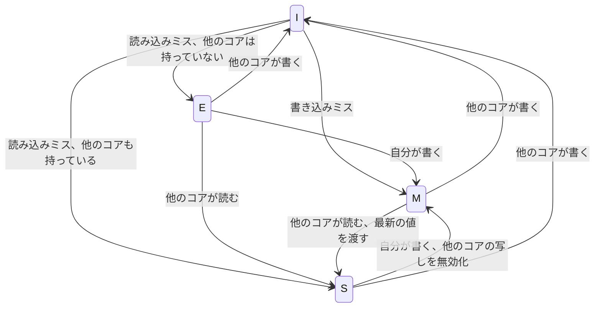

# 1.3 メモリ階層とキャッシュ

> CPU は 1 ナノ秒の間に数個の命令を実行できますが、メインメモリからデータを 1 つ取ってくるには 100 ナノ秒以上かかることがあります。この数百倍の差を埋めているのが、キャッシュを中心とする「メモリ階層」です。この章では、同じ計算量のプログラムがデータのたどり方だけで 10 倍以上速さが変わる理由を、実測とシミュレーションで確かめます。そして、CPU のキャッシュで学んだ考え方が、OS・データベース・CDN まで、あらゆる層のキャッシュに通じることを見ていきます。

| 項目 | 内容 |
|---|---|
| 学習時間の目安 | 本文 4h ＋ 演習 5h |
| 前提となる章 | [1.1 情報の表現](../01-data-representation/README.md)（ビット演算）、[1.2 論理回路とCPUの仕組み](../02-logic-and-cpu/README.md) |
| 演習 | [exercises/](exercises/)（Python） |
| キーワード | メモリ階層, レイテンシ, 帯域幅, 局所性, キャッシュライン, セットアソシアティブ, LRU, ライトバック, MESI, フォールスシェアリング, プリフェッチ, TLB, ブロック化, SSD, 書き込み増幅 |

## この章のゴール

- [ ] メモリ階層の各層のレイテンシの桁を言え、それを使って設計の概算（見積もり）ができる
- [ ] 時間的局所性と空間的局所性を説明し、コードのアクセスパターンから性能への影響を予測できる
- [ ] キャッシュの構成（ライン・セット・ウェイ・タグ）と置き換え・書き込みの方式を説明し、キャッシュのシミュレータを実装できる
- [ ] コヒーレンスとフォールスシェアリングを説明し、マルチスレッドの性能問題の原因として疑える
- [ ] SSD の特性（消去の単位、書き込み増幅）を説明し、ストレージを使うソフトウェアの設計に活かせる
- [ ] キャッシュが CPU から CDN まであらゆる層に現れる共通のパターンであることを説明し、キャッシュを足すかどうかを一貫性のコストも含めて判断できる

## なぜ学ぶのか

- **同じ計算量でも 10 倍以上違う**: 2.2 節では、同じ行列の要素をすべて足すだけの C のプログラムが、ループの順番を入れ替えるだけで 10 倍以上遅くなることを実測します。どちらも計算量は O(n²) で、命令数もほぼ同じです。違うのは、データがメモリからどう運ばれてくるかだけです。計算量の解析（[2.3 章](../../02-math-and-algorithms/03-complexity/README.md)）では見えない、しかし実務では決定的な差です。
- **CPU とメモリの速度差は広がり続けてきた**: 1995 年、ウルフとマッキーは論文 "Hitting the Memory Wall" で、CPU の速度向上にメモリの速度が追いつかず、いずれメモリの速さが性能を決めるようになると指摘しました（**メモリの壁**）。現代の CPU の設計の多くは、この差を隠すための工夫です。
- **性能問題の多くは「データの移動」の問題**: CPU とメモリの間だけではありません。データベースへの問い合わせを 1 件ずつ何百回も繰り返す（いわゆる N+1 問題）、別のリージョンのサーバーを何度も呼ぶ、といったシステムの性能問題も、本質は同じ「遠くにあるデータを何度も取りに行く」ことです。レイテンシの桁を知っていれば、設計の段階で気づけます。
- **キャッシュはあらゆる層にあり、しかも一貫性の問題を生む**: OS のページキャッシュ、データベースのバッファプール、アプリケーションのキャッシュ、CDN。どれも「速いが小さい記憶に、よく使うデータの写しを置く」という同じ考え方です。写しがあれば、元のデータとずれる可能性があります。「コンピュータサイエンスで難しいことは 2 つだけ。キャッシュの無効化と名前付けだ」という、フィル・カールトンの言葉とされる有名な冗談は、この難しさを表しています。

## 1. メモリ階層 — 速さ・容量・価格のトレードオフ

### 1.1 なぜ階層にするのか

理想のメモリは「速くて、大きくて、安くて、電源を切っても消えない」ものですが、そんな技術はありません。速い記憶ほど 1 ビットあたりの回路が大きく高価で、大容量にできないのです。

| 層 | 技術 | 典型的な容量 | 特徴 |
|---|---|---|---|
| レジスタ | フリップフロップ（[1.2 章](../02-logic-and-cpu/README.md)） | 数百バイト〜数 KiB | CPU の演算器の隣。1 サイクル以内に読める |
| L1・L2・L3 キャッシュ | SRAM（1 ビット = トランジスタ 6 個） | 数十 KiB 〜 数百 MiB | CPU のチップ上。速いが大きな面積を食う |
| メインメモリ | DRAM（1 ビット = トランジスタ 1 個 + コンデンサ 1 個） | 数 GiB 〜 数 TiB | 高密度で安いが、読み出しに時間がかかる。電源を切ると消える |
| SSD | NAND フラッシュ | 数百 GB 〜 数十 TB | 電源を切っても消えない。書き込みに制約がある（6 節） |
| HDD | 磁気ディスク | 数 TB 〜 数十 TB | 容量あたりが安い。機械的に動くのでランダムアクセスが遅い |
| ネットワークの先 | 他のサーバー、オブジェクトストレージ | 事実上無限 | 光の速さと通信の往復が効いてくる |

そこで、**小さくて速い記憶に、よく使うデータの写し（キャッシュ）を置き、使われなくなったら大きくて遅い記憶に任せる** という階層を作ります。うまく働けば、「速い記憶の速さ」と「遅い記憶の容量」をいいとこ取りできます。それがうまく働くかどうかを決めるのが、2 節の **局所性** です。

### 1.2 レイテンシの桁を知る

Google の Jeff Dean が講演で紹介し、"Latency Numbers Every Programmer Should Know"（プログラマが知っておくべきレイテンシの数字）という名前で広まった表があります（Peter Norvig のエッセイにも同様の表があります）。主な行を抜き出し、1 ns を 1 秒に引き伸ばした感覚を添えました。

| 操作 | レイテンシ（表の値） | 1 ns を 1 秒とすると |
|---|---|---|
| L1 キャッシュの参照 | 0.5 ns | 0.5 秒 |
| 分岐予測ミス | 5 ns | 5 秒 |
| L2 キャッシュの参照 | 7 ns | 7 秒 |
| メインメモリの参照 | 100 ns | 1 分 40 秒 |
| 1 KB を 1 Gbps のネットワークで送る | 10 µs | 約 3 時間 |
| SSD から 4 KB をランダムに読む | 150 µs | 約 1.7 日 |
| 同じデータセンター内の往復 | 500 µs | 約 5.8 日 |
| HDD のシーク | 10 ms | 約 4 か月 |
| カリフォルニア → オランダ → カリフォルニアのパケット往復 | 150 ms | 約 4.8 年 |

**これは 2010 年前後の値で、正確な数字としてではなく「桁」の感覚をつかむために使うもの** です。その後、SSD（特に NVMe）やネットワークは大きく速くなりましたが、メモリのレイテンシはあまり縮んでいません。そして大陸間の往復は、光の速さで決まる下限があるので、今後もほとんど縮みません。覚えるべきは次の比です。

- レジスタ・L1 と DRAM の間に **約 100 倍**
- DRAM と SSD の間に **約 1,000 倍**
- SSD と HDD のシーク、データセンター内の往復と大陸間の往復の間に、それぞれ **数十〜数百倍**

### 1.3 自分のマシンで測る

表の数字をうのみにせず、自分の環境で測ってみましょう。次のプログラムは、大きさを変えた領域に「次に読む場所」をランダムにつないだ輪を作ってたどり、1 回の読み出しにかかる時間を測ります。次に読む場所が今読んだ値で決まるので、CPU は読み出しを先回りも並列化もできず、**レイテンシがそのまま見えます**。

```c
#include <stdio.h>
#include <stdlib.h>
#include <time.h>

static volatile size_t sink;   /* 結果を使ったことにして、ループが最適化で消えるのを防ぐ */

/* 大きさ size の領域に、64 バイトに 1 つずつ「次の場所」を書いたランダムな輪を作り、たどる。
   次に読む場所は今読んだ値で決まるので、読み出しを重ねられず、1 回のレイテンシがそのまま見える */
int main(void) {
    const long steps = 20000000;
    for (size_t size = 16 << 10; size <= ((size_t)1 << 30); size <<= 1) {
        size_t n = size / 64, *buf = malloc(size), *perm = malloc(n * sizeof(size_t));
        for (size_t i = 0; i < n; i++) perm[i] = i;
        srand(42);
        for (size_t i = n - 1; i > 0; i--) {          /* Sattolo のアルゴリズム: 全体を 1 周する順列 */
            size_t j = ((size_t)rand() * RAND_MAX + rand()) % i, t = perm[i];
            perm[i] = perm[j]; perm[j] = t;
        }
        for (size_t i = 0; i < n; i++) buf[i * 8] = perm[i] * 8;   /* 8 要素 = 64 バイトごとに 1 つ */
        size_t p = 0;
        struct timespec t0, t1;
        clock_gettime(CLOCK_MONOTONIC, &t0);
        for (long i = 0; i < steps; i++) p = buf[p];
        clock_gettime(CLOCK_MONOTONIC, &t1);
        double ns = ((t1.tv_sec - t0.tv_sec) * 1e9 + (t1.tv_nsec - t0.tv_nsec)) / steps;
        sink = p;
        printf("%8zu KiB: %6.1f ns\n", size >> 10, ns);
        free(buf); free(perm);
    }
    return 0;
}
```

筆者の環境（クラウドの仮想マシン、Intel Xeon、`gcc -O2`）での実際の出力です。

```text
      16 KiB:    1.8 ns
      32 KiB:    1.8 ns
      64 KiB:    5.8 ns
     128 KiB:    5.7 ns
     256 KiB:    5.8 ns
     512 KiB:    6.4 ns
    1024 KiB:    7.6 ns
    2048 KiB:   26.2 ns
    4096 KiB:   38.2 ns
    8192 KiB:   39.3 ns
   16384 KiB:   48.1 ns
   32768 KiB:  121.0 ns
   65536 KiB:  144.1 ns
  131072 KiB:  148.9 ns
  262144 KiB:  159.5 ns
  524288 KiB:  184.7 ns
 1048576 KiB:  200.2 ns
```

`lscpu` によると、この CPU の L1 データキャッシュは 48 KiB、L2 は 2 MiB です。**階段がはっきり見えます**。32 KiB までは L1 に収まって 1.8 ns（この環境の実効クロック約 2.8 GHz（[1.2 章](../02-logic-and-cpu/README.md) の 7.3 節）で約 5 サイクル）、64 KiB〜1 MiB は L2 で約 6〜8 ns（約 16〜21 サイクル）、4〜16 MiB は L3 で約 40〜50 ns、32 MiB を超えると DRAM で 120〜200 ns（約 340〜560 サイクル）です。L1 と DRAM の差は約 100 倍で、1.2 節の表の比とよく合っています。

この測定からは、もう 2 つの教訓が得られます。

- **カタログの値と実効値は違う**: `lscpu` はこの CPU の L3 を 260 MiB と表示しますが、実測では 32 MiB を超えたあたりで DRAM の速さに落ちました。L3 は物理的な CPU 全体で共有されるもので、仮想マシンから実際に速く使える量はずっと少なかったのです（他の仮想マシンとの共有や、クラウド側でのキャッシュの割り当ての設定などが理由として考えられますが、ゲスト OS からは確かめられません）。**推測せず、測る** ことの大切さがよく分かります。
- **大きな領域では TLB のミスも効いてくる**: 大きさとともに DRAM の領域でも時間が伸び続ける主な理由の一つは、アドレス変換のキャッシュ（TLB、5.2 節）にも収まらなくなり、変換の手間が加わることです。2 MiB の大きなページ（ヒュージページ）を使うように変えて測ると、1 GiB の場合は約 150 ns まで縮みました。

### 1.4 帯域幅とレイテンシ

**レイテンシ（latency）** は 1 回のアクセスにかかる時間、**帯域幅（bandwidth）** は単位時間あたりに運べるデータの量です。この環境で 1 GiB を `memcpy` でコピーすると約 129 ms かかり、読み書き合わせて約 16.6 GB/s でした（1 スレッド）。

デイビッド・パターソンの論文 "Latency Lags Bandwidth"（2004 年）が指摘したとおり、帯域幅は技術の進歩で大きく伸びる一方、レイテンシはそれよりずっと改善が遅れてきました。そのため現代の CPU は、**多数のメモリアクセスを同時に進めることで、長いレイテンシを隠して帯域幅を稼ぎます**。必要な同時実行数は、次の関係（リトルの法則、[9.5 章](../../09-architecture/05-scalability-and-performance/README.md) でも扱います）で見積もれます。

```text
同時に進行中のデータ量 = 帯域幅 × レイテンシ
例: 10 GB/s × 100 ns = 1,000 バイト ≈ 64 バイトのラインが約 16 本、常に取り寄せ中である必要がある
```

1.3 節のポインタをたどるプログラムは、次の番地が分かるまで次の読み出しを始められないので、この「同時に進める」ことができず、レイテンシを丸ごと払っていました。連結リストや木をたどる処理が、配列を順に読む処理よりずっと遅くなりがちな理由です。

## 2. 局所性 — キャッシュが効く理由

### 2.1 時間的局所性と空間的局所性

キャッシュが効くのは、多くのプログラムのメモリアクセスに次の 2 つの偏りがあるからです。

- **時間的局所性（temporal locality）**: 最近使ったデータは、近いうちにまた使われやすい。ループの中で何度も使う変数、よく呼ばれる関数のコード、人気の商品のデータ。
- **空間的局所性（spatial locality）**: 使ったデータの近くにあるデータは、近いうちに使われやすい。配列の順次アクセス、構造体のフィールド、命令の順次実行。

キャッシュは、時間的局所性に対しては「使ったデータを残しておく」ことで、空間的局所性に対しては「欲しいバイトだけでなく、周り（1 ライン、例えば 64 バイト）をまとめて持ってくる」ことで応えます。逆に言えば、**局所性のないアクセス（巨大なデータへのランダムアクセス）には、キャッシュはほとんど効きません**。

### 2.2 行優先と列優先

C や NumPy（既定）では、2 次元配列は **行優先（row-major）** でメモリに置かれます。`a[i][j]` の隣（番地が次）は `a[i][j+1]` です。ではこの行列を、行ごとにたどる場合と列ごとにたどる場合で、速さはどれだけ違うでしょうか。

```c
#include <stdio.h>
#include <stdlib.h>
#include <time.h>

static double now(void) {
    struct timespec ts;
    clock_gettime(CLOCK_MONOTONIC, &ts);
    return ts.tv_sec + ts.tv_nsec * 1e-9;
}

int main(int argc, char **argv) {
    size_t n = argc > 1 ? strtoul(argv[1], NULL, 10) : 4096;
    int *a = malloc(n * n * sizeof(int));        /* n×n の行列を 1 本の配列に行優先で置く */
    for (size_t i = 0; i < n * n; i++) a[i] = (int)(i & 0xff);

    double t0 = now();
    long long s1 = 0;
    for (size_t i = 0; i < n; i++)               /* 行優先: メモリ上の順番どおり */
        for (size_t j = 0; j < n; j++)
            s1 += a[i * n + j];
    double t1 = now();
    long long s2 = 0;
    for (size_t j = 0; j < n; j++)               /* 列優先: n 要素ずつ飛び飛びに */
        for (size_t i = 0; i < n; i++)
            s2 += a[i * n + j];
    double t2 = now();

    printf("n=%zu (%zu MiB)\n", n, n * n * sizeof(int) >> 20);
    printf("row-major   : %7.1f ms (%.2f ns/要素) sum=%lld\n", (t1 - t0) * 1e3, (t1 - t0) * 1e9 / (n * n), s1);
    printf("column-major: %7.1f ms (%.2f ns/要素) sum=%lld\n", (t2 - t1) * 1e3, (t2 - t1) * 1e9 / (n * n), s2);
    free(a);
    return 0;
}
```

`gcc -O2` でコンパイルし、筆者の環境で実行した結果です（環境によって大きく変わります）。

| n（行列の大きさ） | 行優先 | 列優先 | 比 |
|---|---|---|---|
| 1,024（4 MiB） | 0.8 ms（0.79 ns/要素） | 5.0 ms（4.80 ns/要素） | 約 6 倍 |
| 4,096（64 MiB） | 12.7 ms（0.76 ns/要素） | 146.1 ms（8.71 ns/要素） | 約 11 倍 |
| 8,192（256 MiB） | 51.0 ms（0.76 ns/要素） | 733.5 ms（10.93 ns/要素） | 約 14 倍 |
| 16,384（1 GiB） | 207.1 ms（0.77 ns/要素） | 4,526.9 ms（16.86 ns/要素） | 約 22 倍 |

計算の中身も結果も同じなのに、**列優先は最大で 20 倍以上遅くなりました**。行優先では、64 バイトのライン 1 本に `int` が 16 個入っているので、ミス 1 回で 16 要素ぶんのデータが手に入り、さらにハードウェアのプリフェッチ（5.1 節）が次のラインを先回りして持ってきます。列優先では、次の要素が n × 4 バイト先にあるので、アクセスのたびに別のラインが必要になります。行列が大きくなると、同じラインに戻ってくる（次の列）までにそのラインは追い出されていて、1 要素ごとにキャッシュミスと、さらに TLB ミス（5.2 節）が起きます。

同じ実験を Python で行うとどうなるでしょうか。

```python
import time

n = 2000
a = [[(i * n + j) & 0xFF for j in range(n)] for i in range(n)]  # n×n のリストのリスト

t0 = time.perf_counter()
s1 = 0
for i in range(n):          # 行優先
    for j in range(n):
        s1 += a[i][j]
t1 = time.perf_counter()
s2 = 0
for j in range(n):          # 列優先
    for i in range(n):
        s2 += a[i][j]
t2 = time.perf_counter()

print(f"row-major   : {(t1 - t0) * 1e3:4.0f} ms ({(t1 - t0) * 1e9 / n**2:5.1f} ns/要素)")
print(f"column-major: {(t2 - t1) * 1e3:4.0f} ms ({(t2 - t1) * 1e9 / n**2:5.1f} ns/要素)")
```

```text
row-major   :  384 ms ( 96.1 ns/要素)
column-major:  414 ms (103.6 ns/要素)
```

（Python 3.11、筆者の環境での 1 回の実行結果。数回の実行で、差は 0〜15% 程度でばらつきました。）

Python では差がほとんど見えません。1 要素あたり約 100 ns と、C の行優先（0.8 ns）の 100 倍以上の時間がかかっていて、その大半はインタプリタが命令を解釈し、整数オブジェクトを扱う手間です（[1.4 章](../04-how-programs-run/README.md)）。キャッシュミスの差は、この大きな固定費に埋もれてしまいます。ただし、NumPy のように数値を連続したメモリに詰めて C のループで処理するライブラリでは、C と同じ効果がはっきり現れます。**どの層のコストが支配的かによって、効く最適化は変わる** のです。

### 2.3 データの並べ方: AoS と SoA

空間的局所性は、データ構造の設計でも大きな差を生みます。例えば、100 万個の粒子の位置・速度・色を持つとき、構造体の配列（**AoS**, Array of Structures）と、配列の構造体（**SoA**, Structure of Arrays）の 2 つの置き方があります。

```text
AoS: [x y z vx vy vz r g b][x y z vx vy vz r g b][x y z …]     ← 1 粒子のデータがまとまっている
SoA: [x x x x …][y y y y …][z z z z …] … [r r r …][g g g …][b b b …]   ← 同じ種類のデータがまとまっている
```

「全粒子の x 座標の平均を求める」処理では、AoS だと、読み込んだラインに入っているデータのうち x 以外の 8 つのフィールド（全体の 9 分の 8）が使われずに無駄になります。SoA なら読み込んだデータがすべて x で、無駄がありません。SIMD（[1.2 章](../02-logic-and-cpu/README.md)）でまとめて処理するのにも向きます。逆に「1 つの粒子の全情報を使う」処理が多いなら AoS が有利です。**どちらが良いかは、データがどう使われるかで決まります**。

この考え方は、ゲーム業界などでデータ指向設計（data-oriented design）として広まりました。データベースでも、行ごとにデータを置く行指向と、列ごとに置く列指向（カラムナ）の違いとして現れます。集計クエリが中心の分析用データベースが列指向を採用するのは、SoA と同じ理由です（[6.5 データモデルの多様性とデータストアの選定](../../06-databases/05-beyond-relational/README.md)、[12.1 データ基盤とデータエンジニアリング](../../12-data-and-ai/01-data-engineering/README.md)）。

## 3. キャッシュの仕組み

### 3.1 キャッシュライン

キャッシュとメモリの間のデータのやり取りは、**キャッシュライン（cache line、ブロック）** という固定の大きさの単位で行われます。x86-64 や多くの Arm の CPU では 64 バイトです（Apple の M シリーズのように 128 バイトの CPU もあります）。1 バイトだけ読みたいときでも、それを含む 64 バイトがまるごと運ばれます。これが空間的局所性を活かす仕組みであり、同時に、無関係なデータが同じラインに同居することによる問題（4.2 節のフォールスシェアリング）の原因にもなります。

### 3.2 アドレスの分解: タグ・インデックス・オフセット

キャッシュは、アドレスのビットを 3 つに分けて使います。

```text
 上位ビット                                     下位ビット
+--------------------------+----------------+-------------+
|           タグ           |  インデックス  |  オフセット  |
+--------------------------+----------------+-------------+
  同じセットに入るラインを    どのセットに       ライン内の
  見分ける                    入れるか           何バイト目か
```

- **オフセット**: ライン内の位置。64 バイトのラインなら log₂ 64 = 6 ビット。
- **インデックス**: そのラインを置く **セット**（置き場所の候補のグループ）の番号。セット数が 64 なら 6 ビット。
- **タグ**: 残りの上位ビット。同じセットに入りうる多数のラインのうち、今どれが入っているかを見分けるために、ラインと一緒に保存しておく。

例として、32 KiB、64 バイトのライン、8 ウェイ（1 セットに 8 ライン）のキャッシュを考えます。セット数は 32 KiB ÷ (64 × 8) = 64 です。アドレス 0x12345 は次のように分解されます。

```text
0x12345 = 0b 010010 001101 000101
             ^^^^^^ ^^^^^^ ^^^^^^
             タグ=18 セット=13 オフセット=5
```

この環境の L1 データキャッシュ（48 KiB、12 ウェイ、64 バイトのライン）も、セット数は 48 KiB ÷ (64 × 12) = 64 で、同じくオフセット 6 ビット・インデックス 6 ビットです。容量が 2 のべき乗でなくても、セット数が 2 のべき乗なら、この方式で分解できます。演習 1 で実装します。

### 3.3 どこに置けるか: 連想度

ラインを置ける場所の自由度を **連想度（associativity）** と呼びます。

| 方式 | ラインを置ける場所 | 長所 | 短所 |
|---|---|---|---|
| ダイレクトマップ（direct-mapped） | インデックスで決まるただ 1 か所（1 ウェイ） | 回路が単純で速い | 同じセットに当たるデータが交互に使われると、追い出し合う |
| セットアソシアティブ（set-associative） | インデックスで決まるセットの中の W か所（W ウェイ） | 両者の中間 | ウェイ数だけタグを並列に比較する回路が要る |
| フルアソシアティブ（fully associative） | どこでも（セットが 1 つ） | 置き場所による衝突がない | 全ラインのタグを比較するので、大きなキャッシュには使えない |

現代の CPU の L1〜L3 はセットアソシアティブ（8〜20 ウェイ程度）です。TLB の一部など、小さくて衝突を避けたいものにはフルアソシアティブが使われます。

### 3.4 ミスの 3 つの原因

キャッシュミスは、原因によって 3 つに分類できます（**3C モデル**）。対策が違うので、区別して考えることが大切です。

| 種類 | 原因 | 対策 |
|---|---|---|
| 初期参照ミス（compulsory） | 初めて触るデータは、キャッシュにあるはずがない | プリフェッチ、1 回で運ぶ量を増やす（ラインを大きく） |
| 容量ミス（capacity） | 使うデータ全体（作業セット）がキャッシュより大きい | 作業セットを小さくする（ブロック化、5.3 節）、データを小さくする |
| 競合ミス（conflict） | 容量には余裕があるのに、同じセットに集中して追い出し合う | 連想度を上げる、データの配置をずらす（パディング） |

マルチコアでは、他のコアの書き込みによって無効化されることによる 4 つ目のミス（コヒーレンスミス、4 節）も加わります。

競合ミスは、**2 のべき乗の間隔でデータを飛び飛びに使う** ときに起きやすくなります。インデックスはアドレスの一部のビットなので、ちょうど「セット数 × ライン長」の倍数だけ離れたアドレスは、すべて同じセットに入るからです。演習のシミュレータの解答例で試してみましょう。32 行 × 64 列の double（8 バイト）の行列を列ごとにたどり、4 KiB・64 バイトのラインのキャッシュでヒット率を測ります。1 行の長さを 64 要素（512 バイト）から 65 要素（520 バイト）に、1 要素だけ水増し（パディング）した場合と比べます。

```python
from cachesim import Cache, replay

def column_walk(rows, cols, row_len, elem=8):
    """行の長さ row_len 要素の行列を、列ごとにたどる番地の列"""
    return [(i * row_len + j) * elem for j in range(cols) for i in range(rows)]

for label, ways in [("ダイレクトマップ", 1), ("2 ウェイ", 2), ("フルアソシアティブ", 64)]:
    rates = [replay(Cache(4096, 64, ways), column_walk(32, 64, row_len)) for row_len in (64, 65)]
    print(f"{label}: 行の長さ 64 → {rates[0]:.3f}, 65 → {rates[1]:.3f}")
```

```text
ダイレクトマップ: 行の長さ 64 → 0.000, 65 → 0.861
2 ウェイ: 行の長さ 64 → 0.000, 65 → 0.769
フルアソシアティブ: 行の長さ 64 → 0.875, 65 → 0.861
```

行の長さが 512 バイトのとき、各行の同じ列の要素は 512 バイトおきに並び、64 セットのうち 8 セットにしか入りません。32 行ぶんのラインが 8 か所を奪い合うので、ヒット率は 0 です。フルアソシアティブなら同じデータで 0.875 まで上がるので、これが **容量不足ではなく、置き場所の衝突（競合ミス）** だったことが分かります。1 要素ぶん行を長くするだけで、ラインが全セットに散らばり、ダイレクトマップでも 0.861 になりました。実際の CPU でも同じことが起きます。5.3 節の転置の実験では、n = 4,096 の行列の素朴な転置が、要素数が 5% 少ないだけの n = 4,000 より約 1.4 倍遅くなりました。ただし効果の大きさはキャッシュの構成によって変わるので、パディングの量は測って決めます。

### 3.5 置き換え方式

セットが満杯のときに新しいラインを入れるには、どれか 1 本を追い出す必要があります。

- **LRU（Least Recently Used）**: 最も長く使われていないラインを追い出す。時間的局所性に素直に従う方式で、多くの場合よく働く。ただしウェイ数が多いと、使われた順番を正確に記録する回路が大きくなる。
- **擬似 LRU（pseudo-LRU）**: 二分木のビットなどで「だいたい古いもの」を近似的に選ぶ。回路が小さく、実際の CPU でよく使われる。
- **ランダム**: 回路が最も単純。意外に悪くない。

LRU にも弱点があります。キャッシュよりわずかに大きなデータを繰り返し順番にたどると、LRU は「次に使う予定のライン」から順に追い出してしまい、ヒット率がほぼ 0 になります。最近の CPU の L3 などは、このような状況に強い、より複雑な適応的な方式を使っているとされます。この問題はデータベースのバッファプールでも起き、大きなテーブルの全件走査がキャッシュを押し流す対策が、データベースごとに工夫されています（[6.4 ストレージエンジンと障害回復](../../06-databases/04-storage-and-recovery/README.md)）。

なお、ソフトウェアで LRU キャッシュを作るとき（ハッシュ表と連結リストの組み合わせ）は、[2.4 基本データ構造](../../02-math-and-algorithms/04-basic-data-structures/README.md) で扱います。この章の演習では、ハードウェアのキャッシュの動きのシミュレーションに集中します。

### 3.6 書き込み方式

読み込みより厄介なのが書き込みです。キャッシュ上のデータを書き換えたとき、メモリにいつ反映するかで 2 つの方式があります。

| 方式 | 動作 | 長所 | 短所 |
|---|---|---|---|
| ライトスルー（write-through） | 書き込みのたびにメモリにも書く | キャッシュとメモリが常に一致。単純 | 書き込みのたびにメモリへの通信が発生する |
| ライトバック（write-back） | キャッシュだけを書き換え、変更済み（dirty）の印を付ける。追い出すときにライン全体を書き戻す | 同じ場所への繰り返しの書き込みが 1 回の書き戻しにまとまる | 追い出すときに書き戻しが必要。キャッシュとメモリが一時的に食い違う |

書き込みミスのときにラインを読み込んで確保するか（**ライトアロケート**）、確保せずメモリに直接書くか（**ノーライトアロケート**）という選択もあります。現代の CPU の L1〜L3 は、一般にライトバック＋ライトアロケートです。

演習 4 のシミュレータで、512 バイトの配列（カウンタの配列など）を 1 万回書き換える処理を比べると、ライトスルーではメモリへの書き込みが 80,000 バイト（1 回 8 バイト × 1 万回）になるのに対し、ライトバックでは最後にライン 8 本ぶんの 512 バイトを書き戻すだけでした。**同じ場所への書き込みをまとめる** というライトバックの考え方は、OS のページキャッシュ（[4.3 ファイルシステムとI/O](../../04-operating-systems/03-filesystems-and-io/README.md)）やデータベースにも現れます。その代償は、「メモリ（やディスク）上の値が最新とは限らない」ことです。電源断に備えるには、明示的に書き戻す操作（ディスクなら `fsync`）が必要になります。

## 4. マルチコアとキャッシュ

### 4.1 コヒーレンス: 写しが複数あるときの一貫性

マルチコアの CPU では、各コアが自分専用の L1・L2 キャッシュを持ちます。コア 0 とコア 1 が同じ変数を読むと、写しが 2 つできます。ここでコア 0 が書き換えたら、コア 1 の写しは古くなります。これを防ぎ、**すべてのコアから見て、1 つの番地の値が矛盾しないようにする** 仕組みが **キャッシュコヒーレンス（cache coherence）** です。

代表的なプロトコルの **MESI** では、各ラインが 4 つの状態のどれかを持ちます。

| 状態 | 意味 |
|---|---|
| M（Modified） | このコアだけが持ち、書き換え済み（メモリの値は古い） |
| E（Exclusive） | このコアだけが持ち、メモリと同じ内容 |
| S（Shared） | 複数のコアが持ち、メモリと同じ内容（読み取り専用） |
| I（Invalid） | 無効（持っていない） |

主な状態の変化を、1 つのコアのキャッシュから見た図にすると次のようになります（簡略化しています）。



あるコアが S 状態のラインに書き込むには、まず他のコアの写しを I（無効）にさせてから、自分のラインを M にします。他のコアがそのラインを読もうとすると、M を持つコアから最新の値を受け取ります。こうした状態の変化は、コアの間で通知をやり取りして実現されます（Intel は MESIF、AMD は MOESI という拡張版を使っています）。**書き込みのたびに他のコアへの通知と無効化が起きうる** ことが、次のフォールスシェアリングの原因です。

なお、コヒーレンスは「1 つの番地」についての一貫性です。複数の番地への書き込みが他のコアからどの順番で見えるか（**メモリモデル**）は別の問題で、[4.4 並行処理と同期](../../04-operating-systems/04-concurrency/README.md) で扱います。

### 4.2 フォールスシェアリング

2 つのスレッドがそれぞれ **別の変数** を更新しているのに、それらが **同じキャッシュライン** に載っていると、コヒーレンスの仕組みはライン単位で動くので、2 つのコアの間でラインの所有権が行ったり来たりします。論理的には何も共有していないのに、共有しているかのような遅さになる。これが **フォールスシェアリング（false sharing）** です。

```c
#include <pthread.h>
#include <stdio.h>
#include <time.h>

#define ITER 50000000L

/* 2 つのカウンタ。packed は同じ 64 バイトの行に、padded は別々の行に載る */
static struct { long a; long b; } packed __attribute__((aligned(64)));
static struct { long a; char pad[56]; long b; } padded __attribute__((aligned(64)));

static void *worker(void *arg) {
    long *counter = arg;
    for (long i = 0; i < ITER; i++)
        __atomic_fetch_add(counter, 1, __ATOMIC_RELAXED);   /* lock add 命令になる */
    return NULL;
}

static double run_ms(long *x, long *y) {
    struct timespec t0, t1;
    pthread_t th1, th2;
    clock_gettime(CLOCK_MONOTONIC, &t0);
    pthread_create(&th1, NULL, worker, x);
    pthread_create(&th2, NULL, worker, y);
    pthread_join(th1, NULL);
    pthread_join(th2, NULL);
    clock_gettime(CLOCK_MONOTONIC, &t1);
    return (t1.tv_sec - t0.tv_sec) * 1e3 + (t1.tv_nsec - t0.tv_nsec) / 1e6;
}

int main(void) {
    printf("同じキャッシュライン: %5.0f ms\n", run_ms(&packed.a, &packed.b));
    printf("別のキャッシュライン: %5.0f ms\n", run_ms(&padded.a, &padded.b));
    return 0;
}
```

`gcc -O2 -pthread` でコンパイルし、4 コアの仮想マシンで実行した結果です（4 回の実行で、前者は 1,772〜1,914 ms、後者は 326〜344 ms でした）。

```text
同じキャッシュライン:  1850 ms
別のキャッシュライン:   344 ms
```

変数の間に 56 バイトの詰め物を入れて別々のラインに分けるだけで、**5 倍以上** 速くなりました。スレッドごとの統計カウンタ、ワーカーごとの状態を並べた配列、ロックとそれが守るデータを隣り合わせに置いた構造体などで、実際によく起きます。

対策は次のとおりです。

- **ラインの境界にそろえて離す**: 上の例のように詰め物を入れる、または変数を 64 バイト境界にそろえる。Intel の一部の CPU は隣り合う 2 本のラインをまとめて取ってくるため、128 バイト離すことを勧める資料もあります。C++17 の `std::hardware_destructive_interference_size`、Java（JDK 内部）の `@Contended` アノテーションのように、言語やライブラリが手段を用意していることもあります。
- **共有をやめる**: スレッドごとに手元の変数で集計し、最後に 1 回だけ合計する。これが最も効果的です。

フォールスシェアリングは、プロファイラで見ても「普通のメモリアクセスが遅い」ようにしか見えず、原因にたどり着きにくい問題です。**スレッドを増やしたのにスケールしない** ときに、疑うべき候補として覚えておきましょう。

## 5. ハードウェアの先回りとブロック化

### 5.1 プリフェッチ

CPU は、アクセスのパターンから次に必要になりそうなラインを予測し、要求される前にキャッシュへ運び込みます。これが **ハードウェア・プリフェッチ（prefetch）** です。順次アクセスや、一定の間隔（ストライド）で飛ぶアクセスはよく予測され、2.2 節の行優先の走査が 1 要素 0.8 ns で済んだのは、ラインを使い切る前に次のラインが届いていたからです。

一方、**ポインタをたどる処理は予測できません**。連結リストの次のノードの番地は、今のノードを読むまで分からないからです（1.3 節の測定がまさにそれでした）。同じ O(n) の走査でも、配列は連結リストより桁違いに速くなることがあるのはこのためです。コンパイラの組み込み関数（GCC の `__builtin_prefetch` など）でソフトウェアから先読みを指示することもできますが、効果は測って確かめる必要があります。

### 5.2 TLB

プログラムが使う番地は、実際のメモリの番地（物理アドレス）ではなく、OS が用意した仮想的な番地（仮想アドレス）です。メモリにアクセスするたびに、仮想アドレスを物理アドレスに変換する必要があり、その対応表（ページテーブル）自体もメモリ上にあります。毎回表を引いていては遅すぎるので、最近使った変換結果を覚えておく専用のキャッシュ **TLB（Translation Lookaside Buffer）** があります。

TLB のエントリ数は数十〜数千程度で、1 エントリが 1 ページ（通常 4 KiB）の変換を担います。4 KiB のページで数千エントリなら、ミスせずに扱えるのは数 MiB〜十数 MiB 程度です。巨大なデータをランダムにアクセスすると、キャッシュミスに加えて TLB ミスによる変換の手間も払うことになります。2 MiB や 1 GiB の **ヒュージページ（huge page）** を使うと 1 エントリで扱える範囲が広がり、1.3 節の測定では 1 GiB の場合に約 200 ns が約 150 ns に縮みました。大きなメモリを使うデータベースなどで、ヒュージページの設定が性能チューニングの項目になっているのはこのためです。仮想メモリの仕組みは [4.2 仮想メモリ](../../04-operating-systems/02-virtual-memory/README.md) で詳しく扱います。

### 5.3 ブロック化（タイリング）

大きな行列の転置 `dst[j][i] = src[i][j]` を考えます。`src` を行ごとに読むと、`dst` への書き込みは列ごと（n 要素おき）になります。どちらのループ順にしても、片方は必ず飛び飛びになるのです。

解決策は、行列を小さな正方形（タイル）に分け、**タイルの中で転置を済ませてから次のタイルへ進む** ことです。タイルに含まれる `src` と `dst` のラインが一度にキャッシュに収まる大きさなら、読み込んだラインを追い出される前に使い切れます。これを **ブロック化（blocking、タイリング）** と呼びます。

```c
static void transpose_naive(const double *src, double *dst, size_t n) {
    for (size_t i = 0; i < n; i++)
        for (size_t j = 0; j < n; j++)
            dst[j * n + i] = src[i * n + j];      /* 書き込みが n 要素おきに飛ぶ */
}

static void transpose_blocked(const double *src, double *dst, size_t n, size_t b) {
    for (size_t ii = 0; ii < n; ii += b)
        for (size_t jj = 0; jj < n; jj += b)      /* b×b の小さなタイルごとに処理する */
            for (size_t i = ii; i < ii + b && i < n; i++)
                for (size_t j = jj; j < jj + b && j < n; j++)
                    dst[j * n + i] = src[i * n + j];
}
```

2.2 節と同じ方法で時間を測った結果（`gcc -O2`、筆者の環境）と、演習のシミュレータの解答例で求めたヒット率（n = 256、32 KiB・8 ウェイ・64 バイトのラインのキャッシュ）です。

| 方法 | 実測 n = 4,096 | 実測 n = 4,000 | シミュレーションのヒット率（n = 256） |
|---|---|---|---|
| 素朴な転置 | 191〜201 ms | 136〜138 ms | 0.438 |
| タイル 8 × 8 | 89〜92 ms | 68〜69 ms | 0.875 |
| タイル 16 × 16 | 約 82 ms | 62〜63 ms | 0.855 |
| タイル 32 × 32 | 約 81 ms | 54〜64 ms | 0.438 |

実測では、ブロック化で **2 倍以上** 速くなりました。シミュレーションを見ると理由がよく分かります。素朴な転置では、`src` の読み込みは 8 回に 7 回ヒットしますが、`dst` への書き込みが毎回ミスして、全体のヒット率は (7/8 + 0) ÷ 2 ≈ 0.44 です。8 × 8 のタイル（double 8 個 = ちょうど 1 ライン）なら、読み書きともにラインを使い切れて 0.875 になります。**タイルが大きすぎると（32 × 32）、タイルのラインがキャッシュに収まらず、素朴な版と同じに戻ってしまいます**。実機では L1 だけでなく L2 もあるので最適な大きさは少し違いますが、「キャッシュの大きさに合わせる」という原理は同じです。

ブロック化は、行列の掛け算をはじめとする数値計算ライブラリ（BLAS など）の高速化の中心的な技法で、データベースの結合処理やソートの外部アルゴリズムにも同じ発想が現れます。演習 3 では、このアクセスパターンを生成してシミュレータで確かめます。

## 6. ストレージ — HDD と SSD

### 6.1 HDD: 動く部品の遅さ

HDD（ハードディスク）は、回転する磁気ディスクの上でヘッドを動かして読み書きします。ランダムな読み書きには、ヘッドを目的のトラックへ動かす時間（シーク、数 ms）と、目的の位置が回ってくるまでの待ち時間（7,200 rpm なら 1 回転 8.3 ms の半分で平均約 4.2 ms）がかかり、1 秒あたりのランダムな I/O の回数（IOPS）は、7,200 rpm のディスクで 100 回前後（回転の速い製品でも 200 回程度）にとどまります。一方、連続した領域の読み書き（シーケンシャルアクセス）なら、ヘッドを動かさずに高速に処理できます。**HDD では、ランダムアクセスを避けて連続した読み書きにまとめることが、性能の鍵** でした。

### 6.2 SSD: 消してからでないと書けない

SSD は NAND フラッシュメモリでできていて、機械的な部品がないので、ランダムな読み出しも HDD よりはるかに速くなります。しかし、NAND フラッシュには独特の制約があります。

- 読み書きの単位は **ページ**（数 KiB〜十数 KiB 程度）。
- **一度書いたページは、上書きできない**。書き直すには、先に消去が必要。
- 消去の単位は、多数のページを束ねた **ブロック**（数百ページ、数 MiB 程度）で、ページより桁違いに大きい。
- 消去と書き込みを繰り返すとセルが劣化し、書き換えられる回数に上限がある。

そこで SSD の内部のコントローラ（**FTL**, Flash Translation Layer）は、書き込みが来るたびに空いているページに新しいデータを書き、「論理的な番地 → 物理的なページ」の対応表を更新します。古いページは無効の印を付けておくだけです。やがて空きブロックが足りなくなると、無効なページの多いブロックを選び、まだ有効なページを別の場所へコピーしてから、ブロックごと消去します（**ガベージコレクション**）。

このコピーのぶん、ホスト（OS）が書いた量より多くのデータが実際にはフラッシュに書かれます。その比を **書き込み増幅（write amplification）** と呼びます。

```text
書き込み増幅率 = フラッシュに実際に書かれたデータ量 ÷ ホストが書いたデータ量（1 以上）
```

書き込み増幅が大きいと、性能が落ち、寿命も縮みます。小さなランダム書き込みを大量に行うと、ブロックの中に有効なページと無効なページが入り混じり、ガベージコレクションのコピーが増えて、書き込み増幅が大きくなりがちです。OS やファイルシステムから「このページはもう使わない」と通知する **TRIM**（Linux では discard）は、不要なコピーを減らす仕組みです。製品によっては、空き容量が少なくなったときや、高速な書き込み用の領域を使い切ったときに、書き込み性能が大きく落ちることもあります。SSD の寿命は、TBW（総書き込み量の上限）や DWPD（1 日に容量の何倍まで書けるか）といった指標で示されます。

### 6.3 ソフトウェア設計への影響

HDD でも SSD でも、**小さなランダム書き込みより、大きなシーケンシャル書き込みの方が有利** という点は共通しています。この性質が、ソフトウェアの設計を大きく左右してきました。

- **ログ構造・追記型の設計**: データベースの先行書き込みログ（WAL）、LSM 木を使うストレージエンジン、Kafka のようなログ中心のメッセージングは、書き込みをファイルの末尾への追記にまとめます（[6.4 ストレージエンジンと障害回復](../../06-databases/04-storage-and-recovery/README.md)、[7.5 メッセージングとイベント駆動](../../07-distributed-systems/05-messaging-and-events/README.md)）。
- **まとめて書く**: 小さな書き込みをバッファに貯めてから書く。ただし、電源断で失われては困るデータは、`fsync` でディスクへの反映を確かめる必要があり、その回数がそのまま性能を左右します（[4.3 ファイルシステムとI/O](../../04-operating-systems/03-filesystems-and-io/README.md)）。
- **SSD の並列性を活かす**: SSD は内部に多数のフラッシュチップを持ち、同時に多くの要求を処理できます。NVMe は多数のキューで並列に要求を送れるように設計されていて、要求を 1 つずつ待つより、複数の要求を並行して出す（キューの深さを増やす）方が全体の処理量は増えます。

## 7. キャッシュは至るところにある

### 7.1 層ごとのキャッシュ

「速くて小さい記憶に、遅くて大きい記憶の写しを置く」という考え方は、CPU の中にとどまりません。

| 層 | キャッシュ | 元のデータ | 単位 | 詳しくは |
|---|---|---|---|---|
| CPU | L1〜L3 キャッシュ | メインメモリ | ライン（64 バイト） | この章 |
| CPU | TLB | ページテーブル | ページの変換 | [4.2 仮想メモリ](../../04-operating-systems/02-virtual-memory/README.md) |
| OS | ページキャッシュ | ディスク上のファイル | ページ（4 KiB） | [4.3 ファイルシステムとI/O](../../04-operating-systems/03-filesystems-and-io/README.md) |
| データベース | バッファプール | データファイル | ページ（8 KiB、16 KiB など） | [6.4 ストレージエンジンと障害回復](../../06-databases/04-storage-and-recovery/README.md) |
| アプリケーション | インメモリキャッシュ（Redis など） | データベース・外部 API | キーと値 | [9.5 スケーラビリティとパフォーマンス](../../09-architecture/05-scalability-and-performance/README.md) |
| ネットワーク | CDN、ブラウザのキャッシュ | オリジンサーバー | HTTP のレスポンス | [5.4 Webの仕組みとネットワーク構成](../../05-networking/04-web-architecture/README.md) |
| 名前解決 | DNS キャッシュ | 権威 DNS サーバー | レコード（TTL 付き） | [5.3 DNS・HTTP・TLS](../../05-networking/03-dns-http-tls/README.md) |

どの層でも、同じ問いが繰り返し現れます。**何を単位に写すか**（ライン、ページ、キー）、**満杯になったら何を追い出すか**（LRU など）、**書き込みをいつ元に反映するか**（ライトスルーかライトバックか）、**元のデータが変わったら写しをどう無効にするか**（コヒーレンス、TTL、明示的な削除）。CPU のキャッシュで学んだ言葉で、Redis や CDN の設計を議論できるのです。

### 7.2 平均アクセス時間で考える

キャッシュの効果は、**平均メモリアクセス時間（AMAT, Average Memory Access Time）** で見積もれます。

```text
平均アクセス時間 = ヒット時間 + ミス率 × ミスペナルティ
```

CPU の例: ヒット 1 ns、ミスペナルティ 100 ns のとき、ヒット率 95%（ミス率 5%）なら 1 + 0.05 × 100 = 6 ns、ヒット率 99% なら 1 + 0.01 × 100 = 2 ns です。**ヒット率がわずか 4 ポイント上がるだけで、平均は 3 倍速くなります**。ミスペナルティが大きいほど、ヒット率の小さな差が効いてきます。

アプリケーションのキャッシュでも同じです。キャッシュのヒットに 1 ms、データベースへの問い合わせに 20 ms かかるなら、ヒット率 90% で平均 3 ms、99% で平均 1.2 ms です。そしてキャッシュが空になると（再起動直後など）平均は 21 ms になり、しかも全リクエストがデータベースに押し寄せます。「平均」だけでなく、**ミスしたときに下の層が耐えられるか** まで考える必要があります。

### 7.3 キャッシュの代償

キャッシュは強力ですが、足すたびに新しい問題も持ち込みます。

- **一貫性**: 写しは古くなりえます。どれくらい古くてよいか（数秒か、絶対に許されないか）は、ビジネス上の要件として決める必要があります。
- **無効化**: 元のデータが変わったとき、写しを確実に消すのは難しい問題です。更新の順序や、複数のキャッシュの間の食い違いで、古いデータが残り続けるバグが起きます。
- **コールドスタートと殺到**: キャッシュが空の状態では、全リクエストが下の層に押し寄せます。人気のキーの有効期限が切れた瞬間に、同じデータを求める大量のリクエストが一斉に下の層へ向かう現象は、thundering herd（あるいは cache stampede）と呼ばれます。
- **容量と追い出し**: どのデータが追い出されたかで性能が変わるので、性能が予測しにくくなります。

CPU のキャッシュは、コヒーレンスをハードウェアが完璧に処理してくれるので、プログラマは一貫性をほとんど意識せずに済みます。**アプリケーションのキャッシュでは、この仕事をすべて自分たちでやらなければならない** ことを忘れないでください。

## よくある落とし穴

1. **計算量だけで性能を判断する**。O(n) どうしでも、配列の順次走査と連結リストの走査では、キャッシュとプリフェッチの効き方が違うため桁違いの差が出ることがあります。計算量は出発点で、実際の速さはデータの置き方とアクセスパターンで決まります。
2. **大量のデータをポインタでつないだ構造（連結リスト、ノードを個別に確保した木）で持つ**。1 ノードごとにキャッシュミスとなり、プリフェッチも効きません。配列ベースの構造や、ノードを大きくして 1 回の読み込みで多くのデータを得る構造（B 木など）を検討しましょう。
3. **スレッドごとのカウンタや状態を、隣り合わせに並べる**。フォールスシェアリングで、スレッドを増やすほど遅くなることがあります。ラインの境界で分けるか、スレッドごとに集計して最後に合算します。
4. **ベンチマークのデータがキャッシュに収まってしまう**。小さなテストデータでは全部が L2 や L3 に収まり、本番の大きなデータでは DRAM を待つことになります。キャッシュが温まった状態と冷えた状態の違いも大きいので、本番に近いデータ量と状態で測りましょう。
5. **2 のべき乗の大きさで配列を並べる**。行の長さが 4,096 要素のような行列を列方向にたどると、同じセットにアクセスが集中して競合ミスが増えることがあります。3.4 節のように、わずかなパディングで改善することがあります。
6. **SSD なら書き込みはいくらでも速く、何度でもできると思い込む**。小さなランダム書き込みの多用は書き込み増幅を招き、性能と寿命を損ないます。`fsync` の回数も性能を大きく左右します。ログのような追記型の設計や、書き込みのまとめ方を考えましょう。
7. **キャッシュを足せば速くなると考える**。キャッシュは一貫性・無効化・コールドスタート・運用のコストを持ち込みます。まずボトルネックを測り、ヒット率の見込みと、キャッシュが空になったときに下の層が耐えられるかを確かめてから導入します。
8. **Python で C と同じ最適化を期待する**。インタプリタの固定費（1 要素あたり約 100 ns）がキャッシュミスの差を覆い隠します。Python では、処理を NumPy などの C で書かれたライブラリにまとめて任せることが、キャッシュを活かす近道です。

## CTOの視点

1. **「推測するな、計測せよ」を組織の習慣にする**。1.3 節で、カタログ上は 260 MiB ある L3 が、実測ではその 1 割にも満たない量しか速く使えなかったように、性能は環境の細部に左右されます。設計レビューや性能改善の議論では、「どう測ったのか」「本番と同じデータ量・構成か」を必ず問いましょう。プロファイラやフレームグラフで裏付けのない最適化は、効果がないばかりか複雑さだけを残します（[10.4 オブザーバビリティ](../../10-cloud-and-sre/04-observability/README.md)）。
2. **レイテンシの桁で、設計を素早く見積もる**。設計レビューで「このページを表示するのに、ネットワークを何往復しますか」と問うだけで、多くの問題が見つかります。同じデータセンター内の往復を 0.5 ms とすると、1 リクエストでデータベースに 100 回問い合わせる設計（N+1 問題）は、それだけで 50 ms を費やします。リージョンをまたぐ呼び出しは 1 回で数十〜百数十 ms です。数字を覚えている人は、実装する前に危ない設計に気づけます。
3. **インスタンスの種類は、作業セットとメモリで選ぶ**。クラウドのインスタンスには、vCPU あたりのメモリが多い「メモリ最適化」や、演算性能重視の「コンピュート最適化」などの種類があります。データベースやキャッシュサーバーの性能は、作業セットがメモリ（とバッファプール）に収まるかでほぼ決まり、収まらなければ CPU をいくら増やしても速くなりません。vCPU の数だけでなく、作業セットの大きさ、メモリ帯域、キャッシュの大きさを意識して選び、必ず自社のワークロードで測りましょう。
4. **データと計算は近くに置く**。データを遠くへ運ぶことは、遅いだけでなく費用もかかります。多くのクラウドでは、同じリージョン内でもアベイラビリティゾーンをまたぐ通信やリージョン外への通信に料金がかかります（2026 年時点。料金体系は各社の資料で確認してください）。アプリケーションとデータベースの配置、分析基盤へのデータの流れを、レイテンシとデータ転送料金の両面で設計します（[10.6 クラウドコスト管理](../../10-cloud-and-sre/06-finops/README.md)）。
5. **キャッシュの導入は、一貫性の設計とセットで承認する**。「遅いのでキャッシュを入れます」という提案には、「どれくらい古いデータを返してよいのか」「元データが更新されたら、誰がどうやって無効化するのか」「キャッシュが全部消えたとき、データベースは耐えられるのか」を問いましょう。これに答えられないキャッシュは、将来の障害とデータ不整合の種になります。

## 演習

演習コードは [exercises/cachesim.py](exercises/cachesim.py) にあります。docstring に仕様が書いてあるので、`raise NotImplementedError(...)` を実装に置き換えてください。解答例は [solutions/cachesim.py](solutions/cachesim.py) にあります。

```bash
python3 tools/check.py 1.3        # リポジトリのルートで実行。合格数と失敗したテストが表示される
python3 tools/check.py -v 1.3     # 詳しい出力
```

| # | 難易度 | 内容 | 関数 |
|---|---|---|---|
| 1 | ★☆☆ | キャッシュの形からセット数とビット数を求め、アドレスをタグ・インデックス・オフセットに分解する | `cache_geometry`, `split_address` |
| 2 | ★★☆ | セットアソシアティブ・キャッシュ（LRU）のシミュレータ。ダイレクトマップとフルアソシアティブは特別な場合として扱える | `Cache.access`, `Cache.contains` |
| 3 | ★★★ | 行優先・列優先の走査と、素朴な転置・ブロック化した転置のアクセスパターン（トレース）を生成し、ヒット率の違いを確かめる | `row_major_trace`, `column_major_trace`, `transpose_naive_trace`, `transpose_blocked_trace` |
| 4 | ★★☆ | ライトバック・ライトスルーとライトアロケートの有無による、メモリへの通信量の違いを数える | `Cache.access`, `Cache.flush` |
| 5 | ★★☆ | 記述: レイテンシの数字を使った設計の見積もり（下記） | — |

演習を終えたら、3.4 節や 5.3 節の実験をシミュレータで再現し、キャッシュの大きさ・ウェイ数・ラインの長さを変えてヒット率がどう変わるかを試してみましょう。

### 演習 5（記述）: レイテンシの数字で設計を見積もる

EC サイトの「注文履歴」ページの設計案をレビューしています。案は次のとおりです。

- アプリケーションサーバーとデータベースは同じリージョンにあるが、アベイラビリティゾーンは別（往復 1 ms とする）。
- ページを開くと、まず直近 50 件の注文を 1 回のクエリで取得する。次に、注文ごとに「注文明細」を 1 回ずつ、明細の商品ごとに「商品情報」を 1 回ずつ取得する（1 注文あたり平均 3 商品）。各クエリのデータベース内の処理時間は 0.2 ms とする。
- 商品情報は別のリージョンにある商品マスタの API から取得する案もある（往復 80 ms とする）。

(1) 現在の案で、1 ページの表示にかかるデータベースへの問い合わせの時間を見積もってください。(2) 商品情報を別リージョンの API から 1 件ずつ取得した場合はどうなりますか。(3) 改善案を 3 つ挙げ、それぞれの効果とトレードオフを述べてください。

<details>
<summary>解答例</summary>

**(1)** 問い合わせの回数は、注文一覧 1 回 + 明細 50 回 + 商品 150 回 = 201 回。1 回あたり往復 1 ms + 処理 0.2 ms = 1.2 ms なので、201 × 1.2 ms ≈ **241 ms**。すべてを順番に待つと、それだけで 0.24 秒かかる。処理時間（0.2 ms × 201 ≈ 40 ms）より、往復の時間（201 ms）の方が支配的であることに注目する。

**(2)** 商品情報 150 件を 80 ms の往復で 1 件ずつ取得すると、150 × 80 ms = **12 秒**。明らかに使えない。レイテンシの大きな呼び出しを繰り返すと、1 回ごとの処理が軽くても破綻する。

**(3)** 改善案の例:

- **まとめて取得する**: 明細は注文 ID の一覧で 1 回（`WHERE order_id IN (...)`）、商品情報も商品 ID の一覧で 1 回にまとめる。問い合わせは 3 回（約 4 ms）になる。トレードオフ: 1 回のクエリが大きくなるので、件数の上限（ページング）を設ける必要がある。ORM の使い方をチームで統一する必要もある。
- **並行して取得する**: まとめられない呼び出しは並行して発行し、待ち時間を重ねる。全体の時間は最も遅い 1 回に近づく。トレードオフ: データベースや API への同時接続数が増え、相手の負荷と、実装の複雑さ（エラー処理、タイムアウト）が増す。
- **データを近くに置く・キャッシュする**: 別リージョンの商品マスタは、同じリージョンに複製（読み取り用のレプリカや、同期したテーブル）を置くか、アプリケーションのキャッシュに保持する。商品情報は頻繁には変わらないので、キャッシュに向く。トレードオフ: 価格や在庫など、古いデータを表示してはいけない項目の扱い（どれくらいの古さを許すか、更新時にどう無効化するか）を決める必要がある。注文履歴のような過去の記録では、注文時点の商品名や価格を注文明細に保存しておく（非正規化）方が、正しさの点でも適切なことが多い。

採点の観点:

- 回数 × 往復時間で (1) と (2) を桁まで正しく見積もり、「処理時間ではなく往復の回数が支配的」と指摘できれば合格ラインです。
- まとめる・並行化する・近くに置く／キャッシュする、の 3 方向を挙げ、それぞれのトレードオフ（負荷、複雑さ、一貫性）まで述べられれば、設計レビューを主導できる水準です。

</details>

## 理解度チェック

**Q1. 1.2 節の表の数字を使って、「L1 キャッシュの参照」と「メインメモリの参照」の差、「データセンター内の往復」と「大陸間の往復」の差を、それぞれ何倍か答えてください。また、これらの数字を使うときに注意すべきことを述べてください。**

<details>
<summary>解答</summary>

L1（0.5 ns）とメインメモリ（100 ns）は 200 倍、データセンター内の往復（500 µs）と大陸間の往復（150 ms）は 300 倍です。

注意点: 表の値は 2010 年前後のもので、正確な値ではなく桁の感覚をつかむためのものです。SSD やネットワークは大きく速くなった一方、メモリのレイテンシはあまり縮んでおらず、大陸間の往復は光の速さによる下限があります。実際の設計判断では、自分たちの環境で測った値を使います（1.3 節の実測では、L1 と DRAM の差は約 100 倍でした）。

</details>

**Q2. C の 2 次元配列を列ごとにたどると、行ごとにたどるより大幅に遅くなる理由を、キャッシュラインとプリフェッチという言葉を使って説明してください。Python のリストのリストで同じ実験をすると差がほとんど見えないのはなぜですか。**

<details>
<summary>解答</summary>

C の 2 次元配列は行優先で置かれるので、行ごとにたどると番地が連続し、64 バイトのライン 1 本を読み込むと続く複数の要素（`int` なら 16 個）がまとめて手に入ります。順次アクセスはハードウェアのプリフェッチにも予測されるので、ほとんど待たされません。列ごとにたどると、次の要素は 1 行ぶん先にあるので毎回別のラインが必要になり、行列が大きいと、同じラインに戻ってくる前に追い出されてしまいます。結果として 1 要素ごとにキャッシュミス（と TLB ミス）が起きます。

Python では、1 要素の処理にインタプリタの実行や整数オブジェクトの扱いで約 100 ns かかり、キャッシュミスの差（数 ns）はその固定費に埋もれてしまうからです。

</details>

**Q3. 容量 32 KiB、ラインの長さ 64 バイト、4 ウェイのセットアソシアティブ・キャッシュについて、セット数、オフセットとインデックスのビット数を求めてください。また、アドレス 0x1F0C8 のインデックスとオフセットを求めてください。**

<details>
<summary>解答</summary>

セット数 = 32,768 ÷ (64 × 4) = 128。オフセットは log₂ 64 = 6 ビット、インデックスは log₂ 128 = 7 ビット。

0x1F0C8 = 0b 1111 1000011 001000 と区切ると、オフセットは下位 6 ビットの `001000` = 8、インデックスはその上の 7 ビットの `1000011` = 67、残りのタグは `1111` = 15 です。式で書けば、オフセット = 0x1F0C8 & 0x3F = 8、インデックス = (0x1F0C8 >> 6) & 0x7F = 0x7C3 & 0x7F = 0x43 = 67 です。

</details>

**Q4. 競合ミスとは何ですか。容量ミスとの違いと、それぞれの対策を説明してください。**

<details>
<summary>解答</summary>

競合ミスは、キャッシュ全体には空きがあるのに、アクセスが特定のセットに集中して、同じセットのラインどうしが追い出し合うことで起きるミスです。2 のべき乗の間隔で飛び飛びにアクセスするときによく起きます。対策は、連想度（ウェイ数）を上げる、データの配置をずらす（パディング）などです。

容量ミスは、使うデータ全体（作業セット）がキャッシュの容量より大きいために起きるミスで、フルアソシアティブにしても減りません。対策は、ブロック化などで一度に扱うデータを小さくする、データ構造を小さくする、などです。3.4 節の実験のように、フルアソシアティブにしてミスが消えるなら競合ミス、消えないなら容量ミス（または初期参照ミス）と見分けられます。

</details>

**Q5. ライトバック方式がライトスルー方式よりメモリへの通信量を減らせる理由を説明してください。ライトバックの欠点は何ですか。**

<details>
<summary>解答</summary>

ライトバックでは、書き込みはキャッシュ上のラインだけを更新して dirty の印を付け、メモリへはラインを追い出すとき（や明示的に書き戻すとき）に 1 回だけ書きます。同じラインに何度書き込んでも、メモリへの書き込みは 1 回にまとまります。ライトスルーでは書き込みのたびにメモリにも書くので、通信量は書き込みの回数に比例します。

欠点は、キャッシュとメモリの内容が一時的に食い違うことです。追い出しのときに書き戻しの手間がかかり、仕組みも複雑になります。同じ考え方をディスクに適用した OS のページキャッシュでは、電源断で書き戻していないデータが失われうるので、`fsync` のような明示的な書き戻しが必要になります。

</details>

**Q6. 2 つのスレッドが、それぞれ別の変数をインクリメントしているだけなのに、1 スレッドのときより遅くなりました。考えられる原因と、確かめ方、対策を述べてください。**

<details>
<summary>解答</summary>

原因として、2 つの変数が同じキャッシュラインに載っているフォールスシェアリングが考えられます。コヒーレンスはライン単位で管理されるので、一方のコアが書き込むたびに他方のコアの写しが無効になり、ラインの所有権がコアの間を行き来します。

確かめ方: 変数の番地を表示して 64 バイト以内に同居していないか調べる、変数の間に詰め物を入れて速さが変わるかを試す、CPU の性能カウンタを読めるプロファイラ（Linux の perf など）でキャッシュの共有に関するイベントを見る、など。

対策: 変数をキャッシュラインの境界にそろえて別々のラインに置く（詰め物、アラインメント指定）、あるいはスレッドごとに手元の変数で集計し、最後に 1 回だけ合計する。

</details>

**Q7. SSD の「書き込み増幅」とは何ですか。なぜ起きるのか、ソフトウェアの設計でどう減らせるのかを説明してください。**

<details>
<summary>解答</summary>

ホスト（OS）が書き込んだデータ量よりも、SSD 内部で実際にフラッシュに書き込まれるデータ量の方が多くなる現象で、その比を書き込み増幅率と呼びます。NAND フラッシュはページを上書きできず、消去は多数のページをまとめたブロック単位でしか行えないため、SSD のコントローラは新しいデータを空きページに書き、古いページを無効にしていきます。空きが足りなくなると、ブロック内の有効なページを別の場所へコピーしてからブロックを消去する（ガベージコレクション）ため、そのコピーの分だけ余分な書き込みが発生します。

ソフトウェアでは、小さなランダム書き込みを避け、追記型の設計（ログ、LSM 木）や書き込みのバッファリングで大きなシーケンシャル書き込みにまとめる、不要になった領域を TRIM で通知する、などで減らせます。

</details>

**Q8. アプリケーションのキャッシュのヒット率が 95% から 99% に上がると、平均レイテンシはどう変わりますか。キャッシュのヒットに 1 ms、ミスしたときのデータベースへの問い合わせに 50 ms かかるとして計算してください。また、この計算から分かる運用上の注意点を述べてください。**

<details>
<summary>解答</summary>

平均アクセス時間 = ヒット時間 + ミス率 × ミスペナルティ として、95% のとき 1 + 0.05 × 50 = 3.5 ms、99% のとき 1 + 0.01 × 50 = 1.5 ms です。ヒット率が 4 ポイント上がるだけで、平均レイテンシは半分以下になります。

運用上の注意点: 逆に言えば、ヒット率が少し下がるだけで平均レイテンシとデータベースの負荷は大きく増えます。キャッシュが空になると（再起動、障害、キーの一斉失効）、平均は 51 ms になり、全リクエストがデータベースに押し寄せます。ヒット率を監視し、キャッシュが冷えた状態でもデータベースが耐えられるか（または段階的に温める仕組みがあるか）を確認しておく必要があります。

</details>

## さらに学ぶために

- Randal E. Bryant, David R. O'Hallaron『コンピュータ・システム プログラマの視点から』（1.1 章で紹介）の第 6 章 — メモリ階層、キャッシュの構成、局所性を活かすプログラミング、ブロック化を、演習を通して学べる。この章の内容を最も深く補ってくれる。
- Ulrich Drepper "What Every Programmer Should Know About Memory"（2007）— DRAM の仕組みから、キャッシュ、TLB、NUMA、プログラムの最適化までを詳しく解説した長大な文書。書かれてから時間は経っているが、原理の説明は今も価値がある。
- David A. Patterson, John L. Hennessy『コンピュータの構成と設計』（1.2 章で紹介）のメモリ階層の章 — キャッシュの構成と性能の見積もりを、教科書として丁寧に学べる。
- William A. Wulf, Sally A. McKee "Hitting the Memory Wall: Implications of the Obvious"（ACM SIGARCH Computer Architecture News, 1995）と David A. Patterson "Latency Lags Bandwidth"（Communications of the ACM, 2004）— メモリの速度の問題が性能を支配していく流れを予見した短い論文。
- Mike Acton "Data-Oriented Design and C++"（CppCon 2014 の講演）— データの置き方から設計を考えるデータ指向設計を、ゲーム開発の現場の視点から語った有名な講演。

## まとめ

- メモリは「速いが小さい」から「遅いが大きい」までの **階層** になっている。L1 と DRAM の差は約 100 倍、DRAM と SSD は約 1,000 倍で、この **桁の感覚** が設計の見積もりの基礎になる。
- キャッシュが効くのは **時間的局所性と空間的局所性** があるから。行列を列ごとにたどるだけで、C では 10 倍以上遅くなる。データの置き方（AoS と SoA、行指向と列指向）も局所性の問題。
- キャッシュはアドレスを **タグ・インデックス・オフセット** に分けて使う。連想度・置き換え（LRU）・書き込み（ライトバック）の方式にはそれぞれトレードオフがあり、ミスは初期参照・容量・競合の 3 つに分けて対策を考える。
- マルチコアでは **コヒーレンス** がライン単位で写しの一貫性を保ち、その副作用として **フォールスシェアリング** が起きる。
- プリフェッチは規則的なアクセスを速くし、ポインタをたどる処理には効かない。**ブロック化** は作業セットをキャッシュに収め、転置を 2 倍以上速くした。
- SSD は「消してからでないと書けない」ため **書き込み増幅** が起きる。HDD でも SSD でも、追記型のシーケンシャルな書き込みが有利。
- キャッシュは CPU から CDN まで **あらゆる層に現れる共通のパターン** で、平均アクセス時間で効果を見積もれる。そして、足すたびに **一貫性・無効化・コールドスタート** の問題を持ち込む。**推測せず、測る**。
