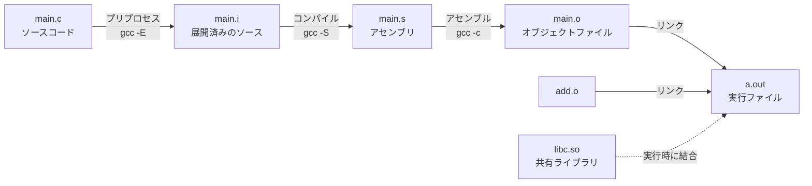
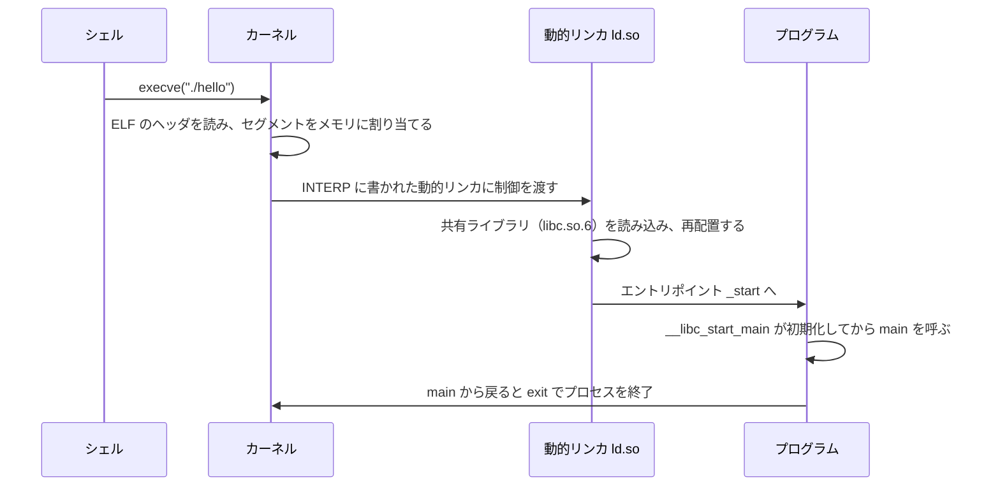

# 1.4 プログラムが動く仕組み

> `gcc hello.c && ./a.out` や `python3 app.py` と打ってから、プログラムが動き出すまでに何が起きているのでしょうか。ソースコードはどうやって機械語になり、別々のファイルに書いた関数はどうやってつながり、実行中のプログラムはメモリのどこに何を置いているのでしょうか。この章では、ビルドから実行までの流れを実際のツールの出力で確かめ、関数呼び出し・インタプリタ・メモリ安全性という、実務の障害やセキュリティに直結する話題までをつなげます。

| 項目 | 内容 |
|---|---|
| 学習時間の目安 | 本文 4h ＋ 演習 6h |
| 前提となる章 | [1.2 論理回路とCPUの仕組み](../02-logic-and-cpu/README.md)（アセンブリ、レジスタ）、[1.3 メモリ階層とキャッシュ](../03-memory-hierarchy/README.md) |
| 演習 | [exercises/](exercises/)（Python） |
| キーワード | プリプロセス, コンパイル, アセンブル, リンク, シンボル, 再配置, 静的リンク, 動的リンク, ELF, ローダ, スタックフレーム, 呼び出し規約, ヒープ, バイトコード, JIT, ABI, バッファオーバーフロー, ASLR, メモリ安全性 |

## この章のゴール

- [ ] ソースコードが実行ファイルになるまでの 4 つの段階を説明し、各段階の成果物を `nm`・`objdump`・`readelf` で調べられる
- [ ] 静的リンクと動的リンクの違いと、それぞれが配布・セキュリティ更新・移植性に与える影響を説明できる
- [ ] プロセスのメモリ配置と、関数呼び出しでスタックフレームが積まれる仕組み（呼び出し規約を含む）を説明できる
- [ ] インタプリタ・コンパイラ・JIT の違いを説明し、フレームを持つスタックマシン型の VM を実装できる
- [ ] シンボル解決と再配置を行うリンカの仕組みを説明し、小さなリンカを実装できる
- [ ] スタックバッファオーバーフローの仕組みと緩和策を説明し、メモリ安全な言語の採用を判断できる

## なぜ学ぶのか

- **深刻な脆弱性の多くはメモリの扱いの誤り**: Microsoft は、同社が毎年セキュリティ更新で修正する脆弱性の約 70% がメモリ安全性の問題だと報告しています（2019 年の講演）。Chromium（Google Chrome のもとになるプロジェクト）も、深刻度の高いセキュリティバグの約 70% がメモリ安全性の問題だと公表しています。こうした状況を受けて、米国の NSA（国家安全保障局）は 2022 年にメモリ安全な言語の採用を勧める文書を公表し、2023 年には CISA（サイバーセキュリティ・インフラストラクチャ安全保障庁）が NSA・FBI や各国の機関と共同で、ソフトウェアのメモリ安全性への移行計画（ロードマップ）を作るよう企業に促す文書を出しました。
- **依存ライブラリの脆弱性は、どうリンクしたかで対応が変わる**: 2014 年に見つかった OpenSSL の脆弱性 Heartbleed は、範囲外のメモリを読み出してしまうバグで、サーバーの秘密鍵などが漏れるおそれがありました。共有ライブラリとして使っていたシステムはライブラリを更新して再起動すれば済みましたが、静的にリンクしたり製品に同梱したりしていたソフトウェアは、再ビルドと再配布が必要でした。自分たちのシステムの「どこに」そのライブラリが入っているかを知っているかどうかで、対応の速さが大きく変わりました。
- **ネイティブコードのメモリの誤りは、システム全体を止める**: 2024 年 7 月、CrowdStrike 社のセキュリティ製品のコンテンツ更新をきっかけに、世界中の Windows 機が起動できなくなりました（Microsoft は影響を受けた端末を約 850 万台と推定しています）。同社が公表した根本原因分析によると、新しい種類のコンテンツは 21 個の入力項目を前提にしていたのに、それを処理するコードには 20 個しか渡されておらず、存在しない 21 番目を読もうとして範囲外のメモリを読み出したことが、カーネル内でのクラッシュにつながりました。
- **「自分の環境では動いた」の多くは、実行環境の違い**: 開発機ではビルドできたのに、本番のコンテナで「ファイルが見つからない」と言われて起動しない。新しい環境でビルドしたバイナリが、古い本番サーバーで `GLIBC_2.34' not found` と言って動かない。CPU アーキテクチャの違う環境で動かない。どれも、この章で学ぶリンクとローダの仕組みを知っていれば、原因の見当がすぐにつきます。

## 1. ソースコードから実行ファイルへ

### 1.1 4 つの段階

C のプログラムは、`gcc` 1 回の実行の裏で、次の 4 つの段階を経て実行ファイルになります。



2 つのファイルからなる小さなプログラムで、各段階を見ていきましょう。まず `main.c` です。

```c
#include <stdio.h>

#define GREETING "Hello"

int counter = 41;          /* 初期値あり → .data */
static int calls;          /* 初期値なし → .bss   */

int add(int a, int b);     /* 宣言だけ。定義は add.c */

int main(void) {
    calls++;
    printf("%s, %d (calls=%d)\n", GREETING, add(counter, 1), calls);
    return 0;
}
```

次に `add.c` です。

```c
int add(int a, int b) {
    return a + b;
}
```

以下の出力は、筆者の環境（x86-64、Ubuntu 24.04、gcc 13.3）での実際の出力です（長いものは一部を省略しています）。

### 1.2 プリプロセス

**プリプロセス（preprocess）** は、`#include` でヘッダファイルの中身をそのまま貼り込み、`#define` のマクロを置き換える、テキストの加工です。

```text
$ gcc -E main.c | wc -l
827
$ gcc -E main.c | tail -6
int main(void) {
    calls++;
    printf("%s, %d (calls=%d)\n", "Hello", add(counter, 1), calls);
    return 0;
}
```

14 行のソースが 827 行になりました。増えた分はほとんどが `stdio.h` の中身です。`GREETING` は `"Hello"` に置き換わっています。C/C++ のビルドが遅くなりがちな理由の一つは、多くのファイルが同じ巨大なヘッダを毎回読み込んで処理することです。

### 1.3 コンパイル

**コンパイル（compile）** は、C のソースをアセンブリに翻訳する段階で、最適化もここで行います（`gcc -O1 -S main.c`。出力は GCC の既定の AT&T 記法です）。

```text
main:
        ...（前略）
        movl    $1, %esi
        movl    counter(%rip), %edi
        call    add@PLT
        ...（中略）
        call    __printf_chk@PLT
```

`add(counter, 1)` の引数が `edi` と `esi` に入れられ、`call add@PLT` で呼ばれています（4.2 節の呼び出し規約）。`printf` が `__printf_chk` に変わっているのは、Ubuntu の gcc が最適化時に既定で `_FORTIFY_SOURCE` を有効にし、書式文字列やバッファの大きさを実行時に検査する版の関数に置き換えるためです（8.2 節）。コンパイラは `add` の中身を知りません。別のファイルにあるからです。

### 1.4 アセンブル: オブジェクトファイルとシンボル

**アセンブル（assemble）** は、アセンブリを機械語に変換し、**オブジェクトファイル（object file、`.o`）** を作る段階です。オブジェクトファイルには、機械語のほかに **シンボル表（symbol table）** が入っています。`nm` で見てみましょう（`gcc -O1 -c main.c add.c` の後）。

```text
$ nm main.o
0000000000000000 r .LC0
0000000000000006 r .LC1
                 U __printf_chk
                 U add
0000000000000000 b calls
0000000000000000 D counter
0000000000000000 T main
$ nm add.o
0000000000000000 T add
```

| 記号 | 意味 | この例 |
|---|---|---|
| T | コード（.text）で定義されている | `main`、`add.o` の `add` |
| D | 初期値ありのデータ（.data） | `counter` |
| B / b | 初期値なしのデータ（.bss） | `calls`（小文字はファイル内だけで見える `static`） |
| r | 読み取り専用データ（.rodata） | 文字列リテラル |
| U | **未定義**（このファイルでは使っているが、定義は別の場所） | `add`、`__printf_chk` |

大文字は他のファイルから見える（グローバル）シンボル、小文字はファイル内だけのシンボルです。`main.o` から見て `add` は「使っているが、どこにあるか分からない」状態です。番地がすべて 0 から始まっているのも、まだ最終的な置き場所が決まっていないからです。

### 1.5 再配置: 「あとでここに番地を入れて」というメモ

では、`main.o` の機械語の中で、`add` を呼ぶ命令はどうなっているのでしょうか。`objdump -dr` で、機械語と一緒に **再配置情報（relocation）** を表示します。

```text
$ objdump -dr -M intel --no-show-raw-insn main.o
（抜粋）
  14:	mov    esi,0x1
  19:	mov    edi,DWORD PTR [rip+0x0]        # 1f <main+0x1f>
			1b: R_X86_64_PC32	counter-0x4
  1f:	call   24 <main+0x24>
			20: R_X86_64_PLT32	add-0x4
```

`call` 命令の飛び先は、とりあえず 0（「次の命令へ」）で埋められています。その下の `20: R_X86_64_PLT32 add-0x4` が再配置情報で、「オフセット 0x20 にある 4 バイトに、`add` の番地を使って計算した値を入れてほしい」というリンカへのメモです。x86-64 の `call` は飛び先を **次の命令からの相対位置** で持つ（1.2 章 5.2 節）ので、書き込む値は「`add` の番地 −（0x20 の番地 + 4）」になります。`-0x4` は、4 バイトの欄の先頭から次の命令の先頭までの差を補正するためのものです。`counter` を読む命令にも、同じように再配置情報が付いています。

### 1.6 リンク: シンボル解決と再配置

**リンク（link）** は、複数のオブジェクトファイルとライブラリを 1 つの実行ファイルにまとめる段階です。リンカ（`ld`。`gcc` が裏で呼び出す）は主に 2 つの仕事をします。

1. **シンボル解決（symbol resolution）**: 各ファイルの未定義のシンボル（U）を、どこかのファイルの定義と結びつける。
2. **再配置（relocation）**: 全体の配置（各関数・変数の最終的な番地）を決め、再配置情報に従って機械語の中の番地を書き換える。

```text
$ gcc main.o add.o -o hello && ./hello
Hello, 42 (calls=1)
$ objdump -d -M intel --no-show-raw-insn hello | grep call
（main の部分から抜粋）
    1168:	call   1196 <add>
    118a:	call   1050 <__printf_chk@plt>
```

`add` への `call` は、最終的な番地 `0x1196` を指すように書き換えられました。一方、`__printf_chk` は実行ファイルの中にはなく、実行時に共有ライブラリ（`libc.so.6`）と結びつけるための「PLT」という中継地点を指しています（2.2 節）。

リンクに失敗したときのエラーメッセージも、この 2 つの仕事に対応しています。

```text
$ gcc main.o -o x
/usr/bin/ld: main.o: in function `main':
main.c:(.text+0x20): undefined reference to `add'
collect2: error: ld returned 1 exit status

$ gcc main.o add.o add2.o -o x      # add2.c にも add を定義した場合
/usr/bin/ld: add2.o: in function `add':
add2.c:(.text+0x0): multiple definition of `add'; add.o:add.c:(.text+0x0): first defined here
collect2: error: ld returned 1 exit status
```

`undefined reference` はシンボルの定義が見つからない、`multiple definition` は同じシンボルが 2 か所で定義されている、というシンボル解決の失敗です。`(.text+0x20)` は、1.5 節で見た再配置の位置そのものです。演習 5 では、この 2 つの仕事をするリンカを、演習 1 の VM 向けに作ります。

## 2. 静的リンクと動的リンク

### 2.1 比べてみる

ライブラリ（ここでは C の標準ライブラリ libc）の結合の仕方には 2 通りあります。

- **静的リンク（static linking）**: ライブラリの機械語を、リンク時に実行ファイルの中へコピーする。
- **動的リンク（dynamic linking）**: 実行ファイルには「どの共有ライブラリのどのシンボルが必要か」だけを記録し、実行時に共有ライブラリ（Linux では `.so`、Windows では `.dll`）と結びつける。

```text
$ gcc main.o add.o -o hello                  # 既定は動的リンク
$ gcc -static main.o add.o -o hello_static   # 静的リンク
$ ls -l hello hello_static                   # （サイズの列だけ抜粋）
16096 hello
785416 hello_static
$ ldd hello
	linux-vdso.so.1 (0x00007f3ed4f49000)
	libc.so.6 => /lib/x86_64-linux-gnu/libc.so.6 (0x00007f3ed4c00000)
	/lib64/ld-linux-x86-64.so.2 (0x00007f3ed4f4b000)
$ ldd hello_static
	not a dynamic executable
```

動的リンクの実行ファイルは約 16 KB、静的リンクは約 785 KB です。`ldd` は、動的リンクの実行ファイルが実行時に必要とする共有ライブラリを表示します。`ld-linux-x86-64.so.2` は **動的リンカ（dynamic linker）** と呼ばれる特別な共有ライブラリで、実行時の結合を担当します。

### 2.2 共有ライブラリの仕組み

共有ライブラリは、どのプロセスのどの番地に読み込まれても動くように、**位置独立コード（PIC, Position-Independent Code）** で作られます。1.2 章で見た相対位置の分岐がその基礎です。外部の関数の呼び出しは **PLT（Procedure Linkage Table）** という中継地点を経由し、実際の番地は **GOT（Global Offset Table）** という表から読み出します。動的リンカは、プログラムの起動時（または最初の呼び出し時）に GOT へ本当の番地を書き込みます（筆者の環境の実行ファイルは、`readelf -d` で見ると `BIND_NOW` が指定されていて、起動時にすべて解決する設定でした。8.2 節の RELRO と組み合わせるためです）。

同じ共有ライブラリの機械語の部分は、それを使う全プロセスで物理メモリ上の 1 つの写しを共有できます（仕組みは [4.2 仮想メモリ](../../04-operating-systems/02-virtual-memory/README.md)）。これが「共有」ライブラリの名前の由来です。

動的リンクの実行ファイルのシンボルを `nm` で見ると、必要なシンボルにバージョンが付いています。

```text
$ nm hello | grep " U "
                 U __libc_start_main@GLIBC_2.34
                 U __printf_chk@GLIBC_2.3.4
```

glibc（Linux で最も一般的な C の標準ライブラリ）は、シンボルごとにバージョンを付けて、古いバイナリとの互換性を保っています。この実行ファイルは「バージョン 2.34 以降の glibc にある `__libc_start_main`」を要求しているので、それより古い glibc のシステムでは `version 'GLIBC_2.34' not found` というエラーで起動しません。**新しい環境でビルドしたバイナリは、古い環境で動くとは限らない** のです。配布用のバイナリを、対応する中で最も古い環境でビルドする習慣（Python のビルド済みパッケージの manylinux の規約など）は、このためにあります。

### 2.3 トレードオフ

| 観点 | 静的リンク | 動的リンク |
|---|---|---|
| 配布 | 実行ファイル 1 つで動く。依存関係の問題が起きにくい | 実行環境に、適切なバージョンの共有ライブラリが必要 |
| サイズ | 大きい（ライブラリを丸ごと含む） | 小さい |
| メモリ | プロセスごとに同じコードの写しを持つ | 複数のプロセスで共有できる |
| セキュリティ更新 | ライブラリに脆弱性が見つかったら、**使っているすべてのプログラムを再ビルド・再配布** | 共有ライブラリを更新して、プロセスを再起動すれば直る |
| 起動 | 動的リンクの手間がなく速い | 起動時に結合の処理がある |
| 可搬性 | カーネルのシステムコールの互換性に依存する | ライブラリのバージョン（ABI）の互換性に依存する |

Go のプログラム（cgo を使わない場合）は、既定で外部の共有ライブラリに依存しない単一のバイナリになり、これがコンテナのイメージを小さくできる理由の一つです。その代わり、Go の標準ライブラリに脆弱性が見つかったときは、修正された版の Go でアプリケーションを再ビルドする必要があります。**静的リンクは、依存関係の管理を「ビルド時」に寄せ、動的リンクは「実行環境」に寄せる** と整理できます。どちらを選んでも、「どのバイナリに、どのバージョンのライブラリが入っているか」の目録（SBOM、[11.5 セキュリティ運用とサプライチェーン](../../11-security/05-security-operations/README.md)）が必要なことに変わりはありません。

ライブラリのライセンスによって、静的リンクと動的リンクで配布時の義務が変わる場合もあります（例: LGPL のライブラリ）。具体的な判断は専門家に確認してください。

## 3. プログラムがメモリに載るまで

### 3.1 ELF: 実行ファイルの形式

Linux の実行ファイル・オブジェクトファイル・共有ライブラリは、**ELF（Executable and Linkable Format）** という形式です（Windows は PE、macOS は Mach-O という別の形式を使います）。`readelf` で中身を見られます。

```text
$ readelf -h hello
  Magic:   7f 45 4c 46 02 01 01 00 00 00 00 00 00 00 00 00
  Type:                              DYN (Position-Independent Executable file)
  Entry point address:               0x1060
（抜粋）
```

先頭の 4 バイト `7f 45 4c 46` は `\x7fELF` で、ファイルの種類を示す目印（マジックナンバー）です。`Entry point address` は、プログラムが最初に実行する番地で、`main` ではなく `_start` という起動用のコードです（3.2 節）。`Type: DYN (Position-Independent Executable file)` は、実行ファイル自身も位置独立（PIE）で作られていることを示します。Ubuntu の gcc は既定で PIE を作ります（8.2 節の ASLR のため）。

OS がプログラムを読み込むときに使うのは、**プログラムヘッダ**（セグメントの一覧）です。

```text
$ readelf -lW hello
（抜粋）
  Type           Offset   VirtAddr           ...  FileSiz  MemSiz   Flg Align
  INTERP         0x000318 0x0000000000000318 ...  0x00001c 0x00001c R   0x1
      [Requesting program interpreter: /lib64/ld-linux-x86-64.so.2]
  LOAD           0x000000 0x0000000000000000 ...  0x000648 0x000648 R   0x1000
  LOAD           0x001000 0x0000000000001000 ...  0x0001ad 0x0001ad R E 0x1000
  LOAD           0x002000 0x0000000000002000 ...  0x000120 0x000120 R   0x1000
  LOAD           0x002db8 0x0000000000003db8 ...  0x00025c 0x000268 RW  0x1000
  GNU_STACK      0x000000 0x0000000000000000 ...  0x000000 0x000000 RW  0x10
```

- `LOAD` の各行が、メモリに読み込む領域です。`Flg` がその領域の権限で、機械語の領域は `R E`（読み取り・実行）、データの領域は `RW`（読み書き）です。**書き込める領域は実行できず、実行できる領域は書き込めない** ように分けられています（8.2 節の NX）。
- 最後の `LOAD` は `MemSiz`（0x268）が `FileSiz`（0x25c）より大きくなっています。差の部分が `.bss`（初期値なしのグローバル変数）で、ファイルには中身を持たず、読み込み時に 0 で埋めた領域を用意するだけです。
- `INTERP` は、このプログラムを起動する動的リンカのパスです。
- `GNU_STACK` の `RW` は、スタックを実行不可にすることを示します。

### 3.2 ローダ: 起動の流れ

シェルで `./hello` と打つと、次のような流れでプログラムが動き出します（Linux の動的リンクの場合、簡略化しています）。



プログラムをメモリに読み込んで実行を始める仕組みを **ローダ（loader）** と呼び、Linux ではカーネルと動的リンカがその役割を分担しています。プロセスの作成やシステムコールそのものは [4.1 プロセス・スレッド・システムコール](../../04-operating-systems/01-processes-and-syscalls/README.md) で扱います。

### 3.3 プロセスのメモリ配置

実行中のプロセスのメモリ（仮想アドレス空間）は、おおよそ次のように使われています（x86-64 の Linux の典型、簡略化しています）。

```text
高い番地
  | スタック          ← ローカル変数・戻り番地。関数を呼ぶたびに下（低い番地）へ伸びる
  |     ↓
  |
  | 共有ライブラリ、mmap した領域（libc.so、ld.so、大きな malloc など）
  |
  |     ↑
  | ヒープ            ← malloc / new で確保。上へ伸びる
  | .bss              ← 初期値なしのグローバル変数（0 で初期化）
  | .data             ← 初期値ありのグローバル変数
  | .rodata           ← 定数、文字列リテラル
  | .text             ← 機械語
低い番地
```

各領域の変数の番地を表示するプログラムで確かめてみましょう。

```c
#include <stdio.h>
#include <stdlib.h>

int initialized = 1;      /* .data */
int uninitialized;        /* .bss  */
const char *message = "hi";  /* 文字列リテラル本体は .rodata */

int main(void) {
    int local = 0;                        /* スタック */
    int *heap = malloc(sizeof(int));      /* ヒープ   */
    printf("text   (main)       : %p\n", (void *)main);
    printf("rodata (\"hi\")       : %p\n", (void *)message);
    printf("data   (initialized): %p\n", (void *)&initialized);
    printf("bss    (uninit)     : %p\n", (void *)&uninitialized);
    printf("heap   (malloc)     : %p\n", (void *)heap);
    printf("libc   (printf)     : %p\n", (void *)printf);
    printf("stack  (local)      : %p\n", (void *)&local);
    free(heap);
    return 0;
}
```

2 回続けて実行した結果です。

```text
text   (main)       : 0x55cdd63eb199      |  text   (main)       : 0x564c96a33199
rodata ("hi")       : 0x55cdd63ec004      |  rodata ("hi")       : 0x564c96a34004
data   (initialized): 0x55cdd63ee010      |  data   (initialized): 0x564c96a36010
bss    (uninit)     : 0x55cdd63ee024      |  bss    (uninit)     : 0x564c96a36024
heap   (malloc)     : 0x55cdec49a2a0      |  heap   (malloc)     : 0x564cc699d2a0
libc   (printf)     : 0x7ff0f1660100      |  libc   (printf)     : 0x7f0858860100
stack  (local)      : 0x7ffcd07fcb0c      |  stack  (local)      : 0x7ffddaa26adc
```

（1 回目を左、2 回目を右に並べています。）

番地の並びが図のとおりであることに加え、**実行するたびに番地が変わっている** ことに注目してください。これが **ASLR（Address Space Layout Randomization）** で、攻撃者が番地を予測しにくくするための仕組みです（8.2 節）。ただしスタック以外は、下位 3 桁（`199`、`004` など）が変わっていません。これらの領域をずらす単位がページ（4 KiB = 0x1000）だからです（スタックは、ページより細かい単位でもずらされるので、下位の桁も変わっています）。

Linux では、`/proc/self/maps` で、今のプロセスのメモリの使われ方を直接見られます（`cat /proc/self/maps` は `cat` 自身のメモリ配置を表示します。抜粋）。

```text
55d3f9bcb000-55d3f9bd0000 r-xp 00002000 fe:00 151456                     /usr/bin/cat
55d3f9bd3000-55d3f9bd4000 rw-p 00009000 fe:00 151456                     /usr/bin/cat
55d4076e4000-55d407705000 rw-p 00000000 00:00 0                          [heap]
7fd5c4028000-7fd5c41b0000 r-xp 00028000 fe:00 152035                     /usr/lib/x86_64-linux-gnu/libc.so.6
7fd5c4203000-7fd5c4205000 rw-p 00202000 fe:00 152035                     /usr/lib/x86_64-linux-gnu/libc.so.6
7fd5c425f000-7fd5c428a000 r-xp 00001000 fe:00 152017                     /usr/lib/x86_64-linux-gnu/ld-linux-x86-64.so.2
7ffcde146000-7ffcde168000 rw-p 00000000 00:00 0                          [stack]
```

`r-xp` の領域が機械語（読み取り・実行）、`rw-p` がデータ（読み書き）で、3.1 節のセグメントの権限がそのまま反映されています。こうした仮想アドレス空間の仕組みは [4.2 仮想メモリ](../../04-operating-systems/02-virtual-memory/README.md) で詳しく学びます。

## 4. 関数呼び出しとスタック

### 4.1 スタックフレーム

関数を呼ぶとき、CPU と コンパイラは次のことをします。

1. 呼び出し側が、引数を決められた場所（レジスタやスタック）に置く。
2. `call` 命令が、**戻り番地**（`call` の次の命令の番地）をスタックに積んで、関数の先頭へ飛ぶ。
3. 呼ばれた関数が、自分のローカル変数のための領域をスタック上に確保する。この、関数 1 回の呼び出しが使うスタックの領域を **スタックフレーム（stack frame）** と呼ぶ。
4. 関数が終わると、フレームを片付け、`ret` 命令が戻り番地をスタックから取り出してそこへ飛ぶ。

再帰で階乗を求める関数を、最適化なし（`gcc -O0 -S -masm=intel -fcf-protection=none`。`endbr64` を省くため最後のオプションを付けています）でコンパイルした実際の出力です（指示の行を省き、`;` 以降に注釈を加えています）。

```c
long fact(long n) {
    if (n <= 1)
        return 1;
    return n * fact(n - 1);
}
```

```text
fact:
        push    rbp                     ; 呼び出し元の rbp（フレームの基準）を保存
        mov     rbp, rsp                ; 自分のフレームの基準を設定
        sub     rsp, 16                 ; ローカル変数の領域を確保
        mov     QWORD PTR -8[rbp], rdi  ; 引数 n（rdi で届く）をフレームに保存
        cmp     QWORD PTR -8[rbp], 1
        jg      .L2
        mov     eax, 1                  ; return 1
        jmp     .L3
.L2:
        mov     rax, QWORD PTR -8[rbp]
        sub     rax, 1
        mov     rdi, rax                ; 引数 n - 1 を rdi に
        call    fact                    ; 戻り番地を積んで再帰呼び出し
        imul    rax, QWORD PTR -8[rbp]  ; 戻り値（rax）× n
.L3:
        leave                           ; フレームを片付ける（rsp = rbp; pop rbp）
        ret                             ; 戻り番地を取り出して戻る
```

このとき、1 回の呼び出しのフレームは次のようになっています。

```text
高い番地
  | ……呼び出し元のフレーム……
  | 戻り番地                 ← call 命令が積んだもの
  | 呼び出し元の rbp         ← push rbp で保存。今の rbp はここを指す
  | n（[rbp-8]）             ← ローカル変数
  | （16 バイトにそろえるための領域）   ← 今の rsp
低い番地（次に関数を呼ぶと、フレームはさらに下へ積まれる）
```

`fact(5)` を呼ぶと、`fact(4)`、`fact(3)`、… とフレームが 5 段積み重なり、戻るたびに 1 段ずつ片付けられます。**スタックとは、呼び出しの「途中経過」を積み上げた記録** です。障害のときにデバッガやクラッシュレポートが表示する **スタックトレース（バックトレース）** は、この戻り番地の連なりをたどったものです。

### 4.2 呼び出し規約

引数をどのレジスタに入れるか、戻り値をどこに置くか、どのレジスタを呼ばれた側が保存するか、といった取り決めを **呼び出し規約（calling convention）** と呼びます。別々にコンパイルされた関数やライブラリどうしが正しく呼び合えるのは、全員がこの規約を守っているからです。x86-64 の Linux や macOS では **System V AMD64 ABI** の規約が使われています。

引数が 7 つある関数を呼ぶ例で確かめてみましょう（`gcc -O1 -S -masm=intel -fcf-protection=none` の実際の出力に注釈を加えたもの。`sum7` のインライン展開は禁止しています）。

```c
__attribute__((noinline))
long sum7(long a, long b, long c, long d, long e, long f, long g) {
    return a + b + c + d + e + f + g;
}

long caller(void) {
    return sum7(1, 2, 3, 4, 5, 6, 7) * 10;
}
```

```text
sum7:
        add     rdi, rsi
        add     rdi, rdx
        add     rdi, rcx
        add     rdi, r8
        lea     rax, [rdi+r9]
        add     rax, QWORD PTR 8[rsp]    ; 7 番目の引数はスタックにある
        ret
caller:
        push    7                        ; 7 番目の引数をスタックに積む
        mov     r9d, 6
        mov     r8d, 5
        mov     ecx, 4
        mov     edx, 3
        mov     esi, 2
        mov     edi, 1
        call    sum7
        add     rsp, 8                   ; 積んだ引数を片付ける
        lea     rax, [rax+rax*4]         ; rax * 5
        add     rax, rax                 ; さらに 2 倍 → × 10
        ret
```

| 項目 | System V AMD64（Linux・macOS） | 参考: Windows x64 | 参考: ARM64 |
|---|---|---|---|
| 整数の引数 | `rdi`, `rsi`, `rdx`, `rcx`, `r8`, `r9` の順。7 個目以降はスタック | `rcx`, `rdx`, `r8`, `r9` | `x0`〜`x7` |
| 戻り値 | `rax` | `rax` | `x0` |
| 呼ばれた側が保存するレジスタ | `rbx`, `rbp`, `r12`〜`r15` | `rbx`, `rbp`, `rdi`, `rsi`, `r12`〜`r15` など | `x19`〜`x28` など |
| 戻り番地 | `call` がスタックに積む | 同左 | リンクレジスタ `x30` に入る |

`sum7` の中の `QWORD PTR 8[rsp]` の 8 は、スタックの一番上（`rsp`）には `call` が積んだ戻り番地（8 バイト）があり、7 番目の引数はその 1 つ上にあるためです。また、`× 10` が `lea` と `add` に置き換えられているのは、掛け算より速い命令の組み合わせをコンパイラが選んだ結果です。

同じ x86-64 でも、OS によって呼び出し規約が違います。**CPU アーキテクチャと OS と呼び出し規約などの取り決めの組が ABI（7.1 節）** で、これが違うと、同じ CPU でもバイナリはそのままでは動きません。

### 4.3 再帰とスタックオーバーフロー

同じ `fact` を `-O2` で最適化すると、ループの本体は次のようになりました（実際の出力の抜粋）。

```text
.L2:
        mov     rdx, rdi
        sub     rdi, 1
        imul    rax, rdx
        cmp     rdi, 1
        jne     .L2
```

`call` が消え、**再帰がループに変換されました**。スタックも消費しません。便利ですが、「最適化の有無で、深い再帰が落ちたり落ちなかったりする」ことも意味します。

スタックの大きさには上限があります。Linux のメインスレッドの既定の上限は `ulimit -s` で確かめられ、筆者の環境では 8,192 KiB（8 MiB）でした。1 回の呼び出しで 300 バイト近くのフレームを使う、終わりのない再帰のプログラムを `-O0` でコンパイルして実行してみます。

```c
#include <stdio.h>
static long depth(long n) {
    char pad[256];                     /* 1 フレームを大きくする */
    pad[0] = (char)n;
    if (n % 10000 == 0) { printf("depth=%ld\n", n); fflush(stdout); }
    return depth(n + 1) + pad[0];      /* 末尾呼び出しではない再帰 */
}
int main(void) { return (int)depth(1); }
```

```text
$ ./overflow
depth=10000
depth=20000
Segmentation fault             （bash の表示を簡略化。終了コードは 139）
```

2 万段を超えたところで落ちました（8 MiB ÷ 約 300 バイト ≈ 2.8 万段）。
スタックの上限を超えると、その先にある、アクセスを禁止された領域（ガードページ）に触れて、OS からシグナル（SIGSEGV）が送られてプロセスが強制終了します。終了コード 139 は 128 + 11（SIGSEGV の番号）です。**C のスタックオーバーフローは、例外として捕まえられるエラーではなく、プロセスの死** です。

Python は、これを避けるために再帰の深さに上限を設けています。

```python
import sys
print(sys.getrecursionlimit())

def f(n):
    return f(n + 1)

try:
    f(0)
except RecursionError as e:
    print(type(e).__name__, e)
```

```text
1000
RecursionError maximum recursion depth exceeded
```

（Python 3.10 と 3.11 での出力。）Python の関数呼び出しは、インタプリタの中の Python 用のフレームとして管理されていて、上限の 1,000 段で `RecursionError` という普通の例外になります。`sys.setrecursionlimit()` で上限を上げられますが、インタプリタ自身の C のスタックが先に尽きると、Python でもプロセスが落ちることがあります（この点の内部の仕組みは Python 3.12 以降で変更されています）。

**入力の大きさに応じて再帰が深くなるコード**（深くネストした JSON のパース、木構造のたどり方など）は、悪意のある入力でスタックを溢れさせられる危険があります。スレッドのスタックはメインスレッドより小さく設定されていることも多いので、深さが入力に依存する処理は、明示的なスタック（リスト）を使ったループに書き換えるのが安全です。演習 1・2 の VM も、呼び出しを Python の再帰ではなく自前のフレームのリストで管理し、深さの上限を超えたら `StackOverflowError` を送出します。

## 5. ヒープ

関数から戻った後も残しておきたいデータや、大きさが実行時まで分からないデータは、**ヒープ（heap）** に置きます。C では `malloc(n * sizeof(int))` のように確保し（失敗すると `NULL` が返る）、使い終わったら `free` で解放します。

`malloc` は OS から大きなまとまりでメモリを受け取り（Linux では `brk` や `mmap` というシステムコール。glibc では、おおむね 128 KiB 以上の大きな確保は直接 `mmap` で行う）、それを小さく切り分けて渡します。確保と解放を繰り返すと、空き領域が細かく分断される **断片化（fragmentation）** が起き、空きの合計は十分なのに大きな領域を確保できない、メモリ使用量が減らない、といった問題が生じます。

手動のメモリ管理には、典型的な誤りがあります。

| 誤り | 内容 | 結果 |
|---|---|---|
| メモリリーク | 解放し忘れる | 長時間動くサーバーのメモリ使用量が増え続ける |
| 解放後の使用（use-after-free） | 解放した領域を使い続ける | 別の用途に再利用された領域を壊す。深刻な脆弱性になりやすい |
| 二重解放（double free） | 同じ領域を 2 回解放する | アロケータの管理情報が壊れる |
| バッファオーバーフロー | 確保した大きさを超えて書く | 隣のデータや管理情報を壊す（8 節） |

Java・Python・Go などは、使われなくなったオブジェクトを自動で回収する **ガベージコレクション（GC）** でこれらの誤りの多くを防ぎ、Rust は所有権という仕組みでコンパイル時に防ぎます。メモリ管理の方式とトレードオフは [3.3 メモリ管理とランタイム](../../03-programming-languages/03-memory-management/README.md) で詳しく扱います。

## 6. インタプリタ・コンパイラ・JIT

### 6.1 3 つの実行方式

| 方式 | 仕組み | 代表例 | 長所 | 短所 |
|---|---|---|---|---|
| 事前コンパイル（AOT） | 実行前に機械語へ翻訳しておく | C, C++, Rust, Go | 実行が速い。起動が速い | ビルドが必要。CPU・OS ごとにバイナリが要る |
| インタプリタ | 実行時にプログラムを 1 命令ずつ解釈して実行する（多くはバイトコードを経由） | CPython, Ruby（既定） | 移植性が高い。手軽 | 解釈の手間の分だけ遅い |
| JIT コンパイル | 実行中に、よく使われる部分を機械語へ翻訳する | Java（HotSpot）, JavaScript（V8）, C#（.NET）, PyPy | 実行時の情報を使った最適化で速くなる | ウォームアップに時間がかかる。メモリを多く使う |

多くの言語処理系は、ソースコードをいったん **バイトコード（bytecode）**、つまり仮想的な CPU（**仮想マシン、VM**）向けの命令列に翻訳し、それを実行します。1.2 章の TinyCPU が「本物の CPU の模型」なら、バイトコードの VM は「ソフトウェアで作った CPU」です。

### 6.2 バイトコードとスタックマシン

CPython のバイトコードは、標準ライブラリの `dis` モジュールで見られます。

```python
import dis
import sys

def add_tax(price, rate):
    total = price + price * rate
    return total

print(sys.version.split()[0])
dis.dis(add_tax)
```

Python のバージョンによって出力が変わります。筆者の環境の Python 3.11 での実際の出力です。

```text
3.11.15
  4           0 RESUME                   0

  5           2 LOAD_FAST                0 (price)
              4 LOAD_FAST                0 (price)
              6 LOAD_FAST                1 (rate)
              8 BINARY_OP                5 (*)
             12 BINARY_OP                0 (+)
             16 STORE_FAST               2 (total)

  6          18 LOAD_FAST                2 (total)
             20 RETURN_VALUE
```

同じ関数を 3.10 と 3.13 で逆アセンブルすると、次の部分が違っていました（実際の出力の抜粋。3.12 は 3.11 と同じでした）。

```text
3.10.20:     6 BINARY_MULTIPLY                              ← 演算ごとに別の命令。RESUME もない
             8 BINARY_ADD
3.13.12:       LOAD_FAST_LOAD_FAST      0 (price, price)    ← 2 つの LOAD_FAST が 1 命令に
```

CPython の VM は **スタックマシン** です。`LOAD_FAST` はローカル変数の値をスタックに積み、`BINARY_OP` はスタックから 2 つ取り出して演算し、結果を積みます。`price + price * rate` の計算中のスタックは次のように変化します。

```text
LOAD_FAST price     [price]
LOAD_FAST price     [price, price]
LOAD_FAST rate      [price, price, rate]
BINARY_OP *         [price, price*rate]
BINARY_OP +         [price + price*rate]
STORE_FAST total    []
```

レジスタの番号を指定しなくてよいので命令が短く、コンパイラも作りやすいのがスタックマシンの利点です。JVM や WebAssembly もスタックマシン型、一方で Lua（5.0 以降）や Android の旧来の VM（Dalvik）は、レジスタを持つレジスタマシン型の VM です。

バージョンごとの違いも興味深いものです。3.11 では演算ごとに別々だった命令が `BINARY_OP` にまとめられ、実行中に型に応じて特殊化された命令へ書き換える仕組み（specializing adaptive interpreter）が入りました。3.13 では、よく続けて現れる 2 つの `LOAD_FAST` を 1 つにまとめた命令（`LOAD_FAST_LOAD_FAST`）が使われています。命令の数を減らすことは、インタプリタの高速化の定番の手法です。**バイトコードは言語の仕様ではなく実装の詳細** で、バージョンごとに変わるので、それに依存したコードを書いてはいけません。

演習 1 では、ローカル変数とオペランドスタックを持つフレームで関数呼び出しを実現する、スタックマシン型の VM を作ります。これは CPython や JVM の VM の構造そのものです。なお、構文木を直接たどって実行する（木を歩く）インタプリタは、[3.4 言語処理系を作る](../../03-programming-languages/04-build-an-interpreter/README.md) で作ります。

### 6.3 JIT コンパイル

インタプリタは、同じ命令を何百万回実行しても、毎回「この命令は何か」を解釈し直します。そこで、**よく実行される部分（ホットスポット）を実行中に見つけ、機械語に翻訳して、以後はそれを直接実行する** のが JIT（Just-In-Time）コンパイルです。

- **Java の HotSpot VM** は、最初はインタプリタで実行し、よく呼ばれるメソッドを軽い最適化のコンパイラ（C1）で、さらに頻繁なものを強力な最適化のコンパイラ（C2）で翻訳する、段階的な方式をとります。
- **JavaScript の V8**（Chrome、Node.js）も、インタプリタ（Ignition）から始め、段階的により強い最適化のコンパイラ（Sparkplug、Maglev、TurboFan）へ引き上げます（2026 年時点の構成。エンジンの構成は数年単位で変わるので、最新の情報は公式の資料で確認してください）。
- JIT は、実行時に観察した情報（「この変数には整数しか来ない」など）を前提に大胆に最適化できます。前提が崩れたら、最適化したコードを捨ててインタプリタに戻ります（**脱最適化**、deoptimization）。
- Python では、PyPy が JIT で CPython より大幅に速く動くことがあります。CPython も 3.13 で実験的な JIT を導入しましたが、2026 年時点でも既定では無効の実験的な機能で、今後の扱いは議論が続いています（最新の状況は公式の資料で確認してください）。

JIT の代償は、**ウォームアップ**（起動直後は遅く、十分に実行されてから速くなる）と、翻訳のための CPU 時間とメモリです。長時間動くサーバーには有利ですが、短時間で終わる処理や、起動の速さが重要なサーバーレスの関数では不利になります。ベンチマークを取るときは、ウォームアップの前か後かを必ず区別しましょう。

## 7. ABI と移植性

### 7.1 API と ABI

**API（Application Programming Interface）** はソースコードの水準の約束（関数名・引数・型）で、**ABI（Application Binary Interface）** は機械語の水準の約束です。ABI には、呼び出し規約（4.2 節）、データ型の大きさと構造体のメモリ上の並び、シンボルの名前の付け方（C++ の名前修飾など）、システムコールの呼び方、実行ファイルの形式などが含まれます。

**API が同じなら再コンパイルすれば動き、ABI が同じなら再コンパイルせずに動きます**。共有ライブラリのバージョンアップで ABI を壊すと（構造体にフィールドを追加するなど）、そのライブラリを使う既存のバイナリが、再コンパイルするまで壊れた動きをします。

### 7.2 glibc と musl

Linux の C の標準ライブラリには、主流の **glibc** のほかに、小さく簡潔な **musl** があります。コンテナのベースイメージとして人気の Alpine Linux は musl を使っています。glibc 向けに動的リンクしたバイナリは、musl の環境では動きません。動的リンカの名前と場所からして違うからです。

存在しない動的リンカを要求するバイナリを作って、何が起きるか見てみましょう（musl 用の動的リンカのパスを指定してリンクし、musl のない環境で実行しています）。

```text
$ gcc -o hello_musl_interp -Wl,--dynamic-linker=/lib/ld-musl-x86_64.so.1 hello.c
$ readelf -l hello_musl_interp | grep interpreter
      [Requesting program interpreter: /lib/ld-musl-x86_64.so.1]
$ ./hello_musl_interp
bash: ./hello_musl_interp: cannot execute: required file not found
```

ファイルは確かに存在するのに「見つからない」と言われます。見つからないのは実行ファイルではなく、`INTERP` に書かれた動的リンカです。Alpine のシェル（BusyBox の `sh`）では、glibc 向けのバイナリを実行すると `not found` とだけ表示されることが多く、原因にたどり着きにくい典型例です。

Python のようなインタプリタ言語でも、この問題とは無縁ではありません。C で書かれた拡張モジュールを含むパッケージのビルド済みバイナリ（wheel）は、glibc 向け（manylinux）と musl 向け（musllinux）で別々に用意されていて、musl 向けがなければ、インストール時にソースからのビルドが必要になります。ほかにも、glibc と musl ではメモリアロケータや名前解決（DNS）などの実装が異なり、性能や挙動が変わることがあります。**ベースイメージを変えることは、実行環境の ABI を変えること** だと認識して、十分にテストしましょう。

### 7.3 CPU アーキテクチャ

x86-64 向けのバイナリは、ARM64 の CPU では（エミュレーションなしには）動きません。Apple の Arm ベースの Mac では、x86-64 用のアプリを Rosetta 2 という仕組みで変換して実行しています。コンテナの世界では、1 つのイメージ名に複数のアーキテクチャ用のイメージを束ねる **マルチアーキテクチャイメージ** を作るのが一般的になりました。ビルドするマシンと違うアーキテクチャのイメージは、エミュレーション（QEMU など）でビルドすると時間がかかるので、それぞれのアーキテクチャのマシンでビルドする構成もよく使われます（[1.2 章](../02-logic-and-cpu/README.md) の CTO の視点も参照）。

## 8. メモリ安全性 — バッファオーバーフローと緩和策

### 8.1 スタックバッファオーバーフロー

C は、配列の範囲を超えた書き込みを検査しません。次の関数は、16 バイトの配列に、長さを確かめずに文字列をコピーしています。

```c
#include <stdio.h>
#include <string.h>

static void greet(const char *name) {
    char buf[16];                 /* 16 バイトしかない */
    strcpy(buf, name);            /* 長さを確かめずにコピー（脆弱） */
    printf("hello, %s\n", buf);
}

int main(int argc, char **argv) {
    greet(argc > 1 ? argv[1] : "world");
    return 0;
}
```

`buf` はスタックフレームの中にあり、その上（高い番地）には戻り番地があります（4.1 節）。実際のコンパイラの出力から配置を読み取ると、次のようになっていました。

```text
高い番地
  | 戻り番地        [rbp+8]      ← ここを書き換えられると、ret で好きな場所へ飛ばされる
  | 保存した rbp    [rbp]
  | カナリア        [rbp-8]      ← 関数の出口で、値が変わっていないか確かめる（8.2 節）
  | （すき間）      [rbp-16]
  | buf[16]         [rbp-32]     ← strcpy はここから高い番地に向かって書いていく
低い番地
```

16 バイトを超える文字列を渡すと、`buf` の外側まで書き込まれます。攻撃者が文字列の中身を工夫すれば、戻り番地を好きな値に書き換え、関数から戻るときにプログラムの制御を奪えます。これが古典的な **スタックバッファオーバーフロー（stack buffer overflow）** の攻撃です。Ubuntu の gcc の既定の設定でコンパイルした場合と、スタックの保護を無効にした場合で、48 文字の入力を与えてみます。

```text
$ gcc -O0 -o smash smash.c
$ ./smash alice
hello, alice
$ ./smash AAAAAAAAAAAAAAAAAAAAAAAAAAAAAAAAAAAAAAAAAAAAAAAA
*** stack smashing detected ***: terminated
Aborted                        （bash の表示を簡略化。終了コード 134 = 128 + 6、SIGABRT）

$ gcc -O0 -fno-stack-protector -o smash_nossp smash.c
$ ./smash_nossp AAAAAAAAAAAAAAAAAAAAAAAAAAAAAAAAAAAAAAAAAAAAAAAA
Segmentation fault             （終了コード 139。戻り番地が 0x4141414141414141 に書き換わった）
```

既定の設定では、戻り番地が使われる前に破壊が検知され、プログラムは安全側に倒れて止まりました。保護を外すと、`A`（0x41）で埋められた戻り番地へ飛ぼうとして落ちています。攻撃者が文字列の中身を工夫すれば、落ちる代わりに乗っ取られるかもしれない、ということです。

### 8.2 緩和策

長年の攻防の結果、OS・コンパイラ・CPU には多層の緩和策（mitigation）が入っています。

| 緩和策 | 仕組み | 防げること |
|---|---|---|
| スタックカナリア（stack protector） | 関数の入口でフレームにランダムな値を置き、出口で変わっていないか確かめる。変わっていたら強制終了 | 連続した上書きによる戻り番地の書き換え |
| NX / DEP | 書き込める領域（スタック・ヒープ）を実行不可にする（CPU のページごとの実行禁止ビット） | 送り込んだ機械語をそのまま実行させる攻撃 |
| ASLR と PIE | プログラム・ライブラリ・スタック・ヒープの番地を毎回ランダムにする | 飛び先の番地を事前に知っている前提の攻撃 |
| RELRO | 動的リンクの後、GOT などを読み取り専用にする | 関数ポインタの表の書き換え |
| `_FORTIFY_SOURCE` | `strcpy` や `printf` などを、大きさを検査する版に置き換える | 一部のバッファオーバーフロー |
| CET（シャドースタック、IBT） | 戻り番地の写しを別の保護された場所に持ち、食い違えば停止する。間接分岐の飛び先を `endbr64` の位置に限る | 戻り番地や関数ポインタの書き換えによる制御の乗っ取り |

8.1 節の `smash` で、カナリアを設定・確認している部分のアセンブリ（`gcc -O0` の実際の出力の抜粋に注釈を加えたもの）です。

```text
        mov     rax, QWORD PTR fs:40        ; スレッドごとに用意されたランダムな値を読む
        mov     QWORD PTR -8[rbp], rax      ; フレームに置く（カナリア）
        ……（strcpy と printf）……
        mov     rax, QWORD PTR -8[rbp]
        sub     rax, QWORD PTR fs:40        ; 変わっていないか比べる
        je      .L2
        call    __stack_chk_fail@PLT        ; 変わっていたら「stack smashing detected」で強制終了
```

GCC のスタックカナリアの機能（`-fstack-protector`）は、IBM 東京基礎研究所の Hiroaki Etoh 氏らが 2000 年ごろに開発した ProPolice（Stack-Smashing Protector）の考え方を取り入れたものです。筆者の環境の Ubuntu 24.04 の gcc 13.3 では、`-fstack-protector-strong`（カナリア）、PIE、`-fcf-protection`（CET 用の `endbr64` など）、`-fstack-clash-protection` が既定で有効で、最適化時には `_FORTIFY_SOURCE=3` も定義されていました（`gcc -Q --help=common` や `gcc -dM -E` で確かめられます。既定値はディストリビューションとバージョンで異なります）。

ただし、緩和策は **攻撃を難しくするもので、バグをなくすものではありません**。番地の情報が漏れれば ASLR は破られ、既存の機械語の断片をつなぎ合わせて実行させる手法（ROP, Return-Oriented Programming）は NX をすり抜けます。カナリアは、ヒープ上のオーバーフローや、戻り番地以外のデータの書き換えは防げません。

### 8.3 メモリ安全な言語へ

根本的な対策は、**範囲外アクセスや解放後の使用が、そもそも起きない（起きたら安全に止まる）言語を使う** ことです。Python・Java・Go・C# などのガベージコレクションを持つ言語や、所有権の仕組みでコンパイル時に保証する Rust が、メモリ安全な言語（memory-safe language）の代表です。

「なぜ学ぶのか」で見たとおり、Microsoft や Chromium は深刻な脆弱性の約 70% がメモリ安全性の問題だと報告し、米国の政府機関も移行を勧めています。Google は 2024 年、Android で新しいコードをメモリ安全な言語で書く方針に切り替えた結果、脆弱性全体に占めるメモリ安全性の問題の割合が、2019 年の 76% から 2024 年の 24% まで下がったと報告しました。既存のコードを書き直さなくても、**新しいコードをメモリ安全な言語で書くだけで** 効果があった、という点が重要です。Linux カーネルも、2022 年のバージョン 6.1 から、一部で Rust を使えるようになっています。

とはいえ、C/C++ で書かれた膨大な既存資産（OS、データベース、ブラウザ、組み込み機器）をすぐに置き換えることはできません。現実の戦略は次の組み合わせになります。

- 新しいコンポーネント、特に信頼できない入力を処理する部分（パーサー、ネットワーク処理）は、メモリ安全な言語で書く。
- 既存の C/C++ には、コンパイラの緩和策を有効にし、AddressSanitizer などの検出ツールとファジング（ランダムな入力を大量に与えるテスト）を CI に組み込む。
- 危険な部分をサンドボックスで隔離し、侵害されても被害が広がらないようにする。

セキュリティの原則と運用は [第11部](../../11-security/README.md) で扱います。

## よくある落とし穴

1. **開発環境と本番環境のベースイメージや CPU アーキテクチャを揃えない**。glibc と musl、ライブラリのバージョン、x86-64 と ARM64 の違いは、「自分の環境では動いた」の典型的な原因です。本番と同じイメージで CI のテストを実行しましょう。
2. **静的リンクすれば依存関係の管理が不要になると考える**。静的リンクしたライブラリの脆弱性は、再ビルドしない限り直りません。どのバイナリがどのバージョンのライブラリを含むかを SBOM などで把握し、再ビルドの仕組みを用意しておく必要があります。
3. **新しい環境でビルドしたバイナリを、古い環境に配布する**。glibc のシンボルのバージョンのため、`GLIBC_2.xx not found` で起動しません。配布するバイナリは、対応する最も古い環境でビルドします。
4. **入力の大きさに比例して深くなる再帰を書く**。深くネストしたデータで、C 系の言語ではプロセスが落ち、Python では `RecursionError` になります。サービス拒否（DoS）の攻撃にも使われます。深さに上限を設けるか、明示的なスタックを使ったループに書き換えましょう。
5. **未定義動作を「たまたま動いている」まま放置する**。範囲外アクセスや初期化していない変数の読み出しは、最適化のレベルやコンパイラのバージョンを変えた途端に別の動きをします。警告を有効にし、AddressSanitizer（`-fsanitize=address`）などでテストしましょう。
6. **本番のバイナリからデバッグ情報を完全に捨ててしまう**。サイズを減らすためにシンボルを取り除くのはよくあることですが、デバッグ情報を別ファイルとして保存しておかないと、障害時のクラッシュダンプやスタックトレースを読み解けません。ビルド ID と対応づけて保管しましょう。
7. **JIT の言語をウォームアップなしで評価する**。起動直後の遅さを見て「遅い言語」と判断したり、逆にウォームアップ後の数字だけを見てサーバーレスでのコールドスタートの遅さを見落としたりします。どちらの状態の性能が必要かをはっきりさせて測りましょう。
8. **緩和策があるから C/C++ のメモリバグは危険ではないと考える**。緩和策は攻撃を難しくするだけで、情報の漏えいや別の手法と組み合わせると突破されます。バグそのものを減らす取り組み（メモリ安全な言語、検出ツール、ファジング）が本筋です。

## CTOの視点

1. **ランタイムの選択は、性能・運用・採用のトレードオフ**。Go は単一の静的バイナリで起動が速く、コンテナのイメージも小さくできます。JVM はウォームアップ後のスループットと成熟したエコシステムが強みですが、メモリの消費とコールドスタートに注意が要ります。Python は開発の速さと AI・データ分野の資産が強みですが、CPU を使う処理の速さと、GIL による並列性の制約（2026 年時点で、GIL のないビルドの導入が進められています）を理解しておく必要があります。「どの言語が速いか」ではなく、レイテンシの目標、サーバーレスかどうか、インスタンスあたりのメモリの費用、採用できる人材の層から判断しましょう。
2. **ネイティブ依存のパッチ運用を仕組みにする**。OpenSSL や glibc、zlib のような基盤のライブラリに重大な脆弱性が見つかったとき、「どのサービスの、どのイメージの、どのバイナリに入っているか」を数時間で答えられるかが問われます。SBOM による目録、ベースイメージの定期的な更新、再ビルドと再デプロイを自動で回せるパイプラインを、平時から整えておくのが CTO の仕事です（[8.4 CI/CDとリリースエンジニアリング](../../08-software-engineering/04-ci-cd-and-release/README.md)）。
3. **再現可能なビルドとマルチアーキテクチャを前提にする**。同じソースから同じバイナリが得られる（再現可能なビルド）状態は、サプライチェーン攻撃の検知と障害時の調査の両方に効きます。ツールチェーンとベースイメージのバージョンを固定し、x86-64 と ARM64 の両方でビルド・テストする費用を、あらかじめ計画に含めましょう。
4. **障害時にクラッシュダンプを読める体制を持つ**。ネイティブコードのクラッシュでは、コアダンプやミニダンプとデバッグ情報があれば、どの関数のどの行で落ちたかが分かります。デバッグ情報の保管、ダンプの収集方法、読み方を知っている人の育成を用意しておきましょう。同時に、ダンプにはメモリの内容（個人情報や秘密鍵を含みうる）がそのまま入るので、収集・保管・アクセスのルールも必要です。
5. **メモリ安全性の方針を明文化する**。新規のシステムはメモリ安全な言語で作ることを原則にし、C/C++ を使う場合は理由と対策（緩和策、検出ツール、ファジング、隔離）を設計レビューで確認する。既存の資産については、信頼できない入力に触れる部分から優先して置き換える計画を立てる。購入するソフトウェアやベンダーにも、メモリ安全性への取り組みを確認する。こうした方針は、セキュリティの投資判断として経営層に説明できる形にしておきましょう（[14.5 ガバナンス・リスク・コンプライアンスと法務](../../14-cto/05-governance-risk-compliance/README.md)）。

## 演習

演習コードは [exercises/](exercises/) にあります。各ファイルの docstring に仕様が書いてあるので、`raise NotImplementedError(...)` を実装に置き換えてください。解答例は [solutions/](solutions/) にあります。

```bash
python3 tools/check.py 1.4        # リポジトリのルートで実行。合格数と失敗したテストが表示される
python3 tools/check.py -v 1.4     # 詳しい出力
```

| # | 難易度 | 内容 | ファイル / 関数 |
|---|---|---|---|
| 1 | ★★☆ | スタックマシン型の VM: フェッチ・デコード・実行と、ローカル変数・戻り番地を持つフレームによる関数呼び出し | `stackvm.py`: `VM.step`, `VM.run` |
| 2 | ★☆☆ | 呼び出しの深さの上限を超えたら `StackOverflowError` を送出する（Python の再帰に頼らない） | `stackvm.py`: `VM.step` の `CALL` |
| 3 | ★★☆ | ラベル付きのアセンブリを命令列に変換するアセンブラ | `stackvm.py`: `assemble` |
| 4 | ★★☆ | VM のプログラムを書く: 階乗（反復・再帰）、フィボナッチ数 | `stackvm.py`: `factorial_iterative`, `factorial_recursive`, `fibonacci` |
| 5 | ★★★ | オブジェクトモジュールのシンボル解決と再配置を行う小さなリンカ | `minilinker.py`: `link` |
| 6 | ★★☆ | 記述: ベースイメージの変更のレビュー（下記） | — |

演習 5 のオブジェクトモジュールは、1.5 節で見た `.o` ファイルの「シンボル表」と「再配置情報」を、そのまま小さくしたものです。`objdump -dr` の出力と見比べながら取り組むと、本物のリンカが何をしているかがよく分かります。

### 演習 6（記述）: ベースイメージの変更をレビューする

あなたは、Python（3.12）の Web API のコンテナイメージについて、次の変更提案のレビューを頼まれました。

> 「イメージのサイズを減らすため、ベースイメージを Debian ベースの公式イメージから Alpine ベースのものに変更します。あわせて、コストを下げるため、本番を ARM64 のインスタンスに移行します。依存パッケージは、画像処理のライブラリ、PostgreSQL のドライバ、暗号ライブラリなどです。」

この章の知識を使って、(1) 起こりうる問題、(2) 確認すべきこと・テスト計画、(3) 代わりの選択肢、を挙げてください。

<details>
<summary>解答例</summary>

**(1) 起こりうる問題**

- Alpine は C の標準ライブラリに musl を使うので、glibc 向けのビルド済みパッケージ（manylinux の wheel）が使えない。musl 向け（musllinux）がなければソースからのビルドになり、ビルド時間が延び、コンパイラなどを入れるとイメージもかえって大きくなりうる。ビルドが失敗することもある。
- glibc と musl ではメモリアロケータや名前解決（DNS）などの実装が違い、性能や挙動が変わりうる。glibc 向けのバイナリ（監視エージェントなど）は「not found」で起動しない。
- ARM64 への移行も同時なので、「musl かつ ARM64」のビルド済みパッケージの有無が問題になる。2 つの大きな変更を同時に行うと、問題が起きたときに原因を切り分けにくい。

**(2) 確認すべきこと・テスト計画**

- 全依存パッケージについて、対象の組み合わせ（musllinux / manylinux × x86-64 / aarch64）のビルド済みパッケージの有無を確認する。
- CI で新しいイメージを両方のアーキテクチャでビルドして全テストを実行し、ビルド時間とイメージサイズも比べる（本当に小さくなるのか）。
- 本番に近い負荷試験で、レイテンシ（DNS を使う外部接続、メモリ確保の多い処理）とメモリ使用量を比べる。障害調査のツールが使えるかも確認する。

**(3) 代わりの選択肢**

- Debian ベースの slim 版のイメージ（glibc のまま小さくできる）、マルチステージビルド、distroless 系のイメージを検討する。
- 変更は 1 つずつ行う。例えば、先に今のベースイメージのまま ARM64 に移行して効果を測り、イメージの変更は別の提案として評価する。

採点の観点:

- 「Alpine は musl なので、glibc 向けのバイナリやビルド済みパッケージが使えない」ことを指摘できれば合格ラインです。
- アーキテクチャとの組み合わせの問題、性能・挙動の違い、変更を分けて行うこと、slim やマルチステージビルドなどの代替案まで挙げられれば、レビューを任せられる水準です。

</details>

## 理解度チェック

**Q1. `nm main.o` の出力で、`add` に `U`、`main` に `T`、`counter` に `D`、`calls` に `b` と表示されました。それぞれの意味と、`add` が `U` になる理由を説明してください。**

<details>
<summary>解答</summary>

`T` はコード（.text）に定義があるシンボル、`D` は初期値ありのデータ（.data）、`b` は初期値なしのデータ（.bss）で、小文字はファイル内だけで見える（`static`）シンボルです。`U` は未定義で、「このファイルの中で使っているが、定義は別の場所にある」ことを示します。`main.c` は `add` を宣言して呼び出しているだけで、定義は `add.c` にあるので、`main.o` の時点では `add` がどこにあるか分からず `U` になります。リンカがシンボル解決で `add.o` の `T add` と結びつけます。

</details>

**Q2. OpenSSL に深刻な脆弱性が見つかりました。OpenSSL を動的リンクしているサービスと、静的リンクしている（またはバイナリに同梱している）サービスで、対応はどう違いますか。**

<details>
<summary>解答</summary>

動的リンクしている場合は、OS やイメージの共有ライブラリ（libssl など）を修正版に更新し、それを使うプロセスを再起動すれば、アプリケーションを再ビルドせずに修正を反映できます。ただし、どのプロセスが古いライブラリを読み込んだまま動いているかを確認し、確実に再起動する必要があります。

静的リンクしている場合は、ライブラリの機械語が各バイナリの中にコピーされているので、修正版のライブラリでアプリケーションを再ビルドし、再配布・再デプロイする必要があります。どのバイナリにどのバージョンが入っているかを把握していないと、対応漏れが起きます。どちらの場合も、SBOM などの目録が対応の速さを左右します。

</details>

**Q3. `objdump -dr main.o` に表示された `20: R_X86_64_PLT32 add-0x4` という再配置情報は、何を意味していますか。`-0x4` の理由も説明してください。**

<details>
<summary>解答</summary>

「`main.o` の .text の 0x20 番目から始まる 4 バイトに、シンボル `add` の番地を使って計算した値を書き込んでほしい」というリンカへの指示です。その 4 バイトは、0x1f にある `call` 命令の飛び先の欄です。x86-64 の `call` は飛び先を「次の命令の先頭からの相対位置」で持つので、書き込む値は「`add` の番地 − 次の命令の番地」です。次の命令は、4 バイトの欄の先頭（0x20）から 4 バイト先（0x24）から始まるので、「`add` − 欄の番地 − 4」となり、この −4 が `-0x4`（加数）として記録されています。

</details>

**Q4. x86-64 の Linux で `long f(long a, long b, long c, long d, long e, long f, long g)` を呼ぶとき、各引数はどこに置かれ、戻り値はどこに入りますか。呼ばれた関数の中で 7 番目の引数が `[rsp+8]` にあるのはなぜですか。**

<details>
<summary>解答</summary>

System V AMD64 ABI の呼び出し規約に従い、a〜f は順に `rdi`、`rsi`、`rdx`、`rcx`、`r8`、`r9` に入り、7 番目の g はスタックに積まれます。戻り値は `rax` に入ります。呼び出し側が g を積んだ後に `call` 命令が戻り番地（8 バイト）を積むので、呼ばれた関数に入った直後は、`[rsp]` が戻り番地、その上の `[rsp+8]` が g になります。

</details>

**Q5. C で深い再帰を行うと `Segmentation fault` で落ちるのに、Python では `RecursionError` という例外になるのはなぜですか。また、`gcc -O2` で階乗の再帰関数をコンパイルしたらスタックを使わないループになったことは、何を意味しますか。**

<details>
<summary>解答</summary>

C の関数呼び出しは、OS が用意したスタック（Linux のメインスレッドの既定の上限は多くの場合 8 MiB）を直接使います。上限を超えると、その先のアクセス禁止の領域に触れて OS から SIGSEGV が送られ、プロセスが強制終了します。言語として検査する仕組みはありません。Python（CPython）は、Python の関数呼び出しの深さを数えていて、上限（既定 1,000）を超えると、C のスタックが尽きる前に `RecursionError` という通常の例外を送出します。

`-O2` でループになったのは、コンパイラが再帰をループに変換する最適化を行ったためで、このとき深い再帰でもスタックを消費しません。逆に言えば、同じコードでも最適化の有無やコンパイラによって「深い再帰で落ちるかどうか」が変わるということで、スタックの深さに依存した動作をあてにしてはいけません。

</details>

**Q6. JIT コンパイルの利点と欠点を説明し、サーバーレスの関数（リクエストのたびに起動することがある）で問題になりやすい理由を述べてください。**

<details>
<summary>解答</summary>

利点: 実行中によく使われる部分だけを機械語に翻訳するので、インタプリタより大幅に速くなる。実行時に観察した型や分岐の傾向を前提に、事前コンパイルでは難しい大胆な最適化ができる（前提が崩れたら脱最適化して戻る）。

欠点: 起動直後はインタプリタで遅く、十分に実行されてから速くなる（ウォームアップ）。翻訳のために CPU 時間とメモリを使う。性能が実行の履歴に依存し、予測しにくい。

サーバーレスの関数は、起動してすぐに少量の処理をして終わることがあり、JIT が効く前に処理が終わってしまうので、ウォームアップの遅さ（コールドスタート）だけを払うことになりやすいからです。

</details>

**Q7. スタックカナリアはどのようにスタックバッファオーバーフローを検出しますか。カナリアだけでは不十分な理由も述べてください。**

<details>
<summary>解答</summary>

関数の入口で、推測されにくいランダムな値（カナリア）をローカル変数と戻り番地の間に置き、関数の出口で `ret` の前にその値が変わっていないかを確かめます。バッファを溢れさせて戻り番地まで連続して上書きすると、途中にあるカナリアも書き換わるので、戻り番地が使われる前に検出して強制終了できます。

不十分な理由: カナリアの値が何らかの方法で漏れれば、それを書き戻して回避できる。連続した上書きでない書き換え（ポインタを使った任意の番地への書き込み）や、ヒープ上のオーバーフロー、戻り番地以外のデータ（関数ポインタなど）の書き換えは防げない。そのため NX・ASLR・CET などを組み合わせた多層防御が必要で、根本的にはメモリ安全な言語や検出ツールでバグそのものを減らすことが重要です。

</details>

## さらに学ぶために

- Randal E. Bryant, David R. O'Hallaron『コンピュータ・システム プログラマの視点から』（1.1 章で紹介）の第 3 章・第 7 章・第 9 章 — 機械語レベルの関数呼び出しとバッファオーバーフロー、リンク、仮想メモリと動的メモリ確保を、この章よりずっと詳しく扱う。
- John R. Levine "Linkers and Loaders"（邦訳『Linkers & Loaders』オーム社）— リンカとローダの仕組みを正面から扱った数少ない本。オブジェクトファイルの形式、シンボル解決、再配置、共有ライブラリを体系的に学べる。
- 坂井弘亮『ハロー“Hello, World” OSと標準ライブラリのシゴトとしくみ』（秀和システム）— 「Hello, World」が表示されるまでに、コンパイラ・リンカ・標準ライブラリ・OS の中で何が起きているかを、実際に追いかけていく日本語の本。
- Robert Nystrom "Crafting Interpreters"（Web で無料公開）— 木を歩くインタプリタと、バイトコードの VM の両方を一から作る、とても読みやすい本。演習 1 の VM と [3.4 言語処理系を作る](../../03-programming-languages/04-build-an-interpreter/README.md) の橋渡しになる。
- "System V Application Binary Interface: AMD64 Architecture Processor Supplement" — 4.2 節の呼び出し規約の一次資料。レジスタの使い方やスタックのそろえ方の正確な定義はここにある。
- CISA ほか "The Case for Memory Safe Roadmaps"（2023）と、NSA "Software Memory Safety"（2022）— メモリ安全性についての米国政府機関の文書。技術的な背景と、組織としてどう移行を進めるかが短くまとまっている。

## まとめ

- C のプログラムは **プリプロセス → コンパイル → アセンブル → リンク** を経て実行ファイルになる。各段階の成果物は `gcc -E` / `-S` / `-c`、`nm`、`objdump`、`readelf` で確かめられる。
- オブジェクトファイルは機械語に加えて **シンボル表** と **再配置情報** を持ち、リンカが **シンボル解決** と **再配置** で 1 つにまとめる。`undefined reference` と `multiple definition` はシンボル解決の失敗。
- **静的リンク** は依存をビルド時に閉じ込め、**動的リンク** は実行環境の共有ライブラリに頼る。セキュリティ更新・サイズ・可搬性のトレードオフがあり、どちらでも依存関係の目録が要る。
- プロセスのメモリは text・rodata・data・bss・ヒープ・共有ライブラリ・スタックに分かれ、ASLR で毎回ずらされる。関数呼び出しは **戻り番地とスタックフレーム** を積み、引数や戻り値の置き場所は **呼び出し規約（ABI）** で決まる。
- インタプリタ・事前コンパイル・JIT にはそれぞれ得失があり、CPython や JVM は **バイトコードを実行するスタックマシン型の VM** を持つ。バイトコードはバージョンで変わる実装の詳細。
- glibc と musl、x86-64 と ARM64 の違いは **ABI の違い** で、「自分の環境では動いた」問題の典型的な原因になる。
- C のバッファオーバーフローは戻り番地を書き換えて制御を奪う攻撃につながる。カナリア・NX・ASLR・CET などの **緩和策は攻撃を難しくするだけ** で、根本的な対策は **メモリ安全な言語** への移行と、既存コードへの検出ツール・ファジングの適用。
