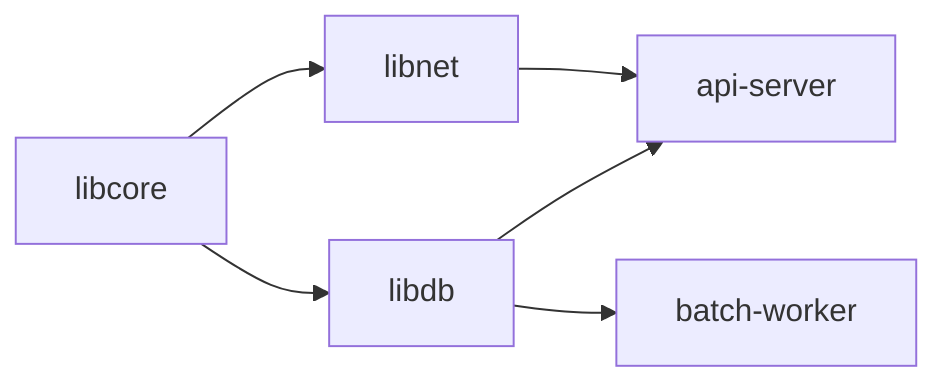

# 2.1 計算機科学のための離散数学

> `if` 文の条件、仕様書の「すべての〜について」、ID の桁数、ハッシュの衝突、暗号、シャーディング。一見ばらばらなこれらの話題は、すべて離散数学という同じ道具で説明できます。この章では、プログラムと仕様を「なんとなく」ではなく正確に考えるための、論理・集合・証明・数え上げ・整数論を身につけます。

| 項目 | 内容 |
|---|---|
| 学習時間の目安 | 本文 4h ＋ 演習 5h |
| 前提となる章 | なし（高校数学の基礎があれば十分。[1.1 情報の表現](../../01-computer-systems/01-data-representation/README.md) を読んでいると剰余の節が分かりやすい） |
| 演習 | [exercises/](exercises/)（Python） |
| キーワード | 命題論理, 述語論理, 量化子, 集合, 関係, 写像, 数学的帰納法, ループ不変条件, 組合せ, 鳩の巣原理, 包除原理, 剰余, ユークリッドの互除法, 素数 |

## この章のゴール

- [ ] 論理式を真理値表で評価し、ド・モルガンの法則などを使ってコードの条件式を安全に書き換えられる
- [ ] 「すべての」「ある」を含む仕様を量化子で書き下し、その否定から反例（テストケース）を作れる
- [ ] 関係と写像の性質（同値関係・半順序・単射・全射）を使って、ハッシュ・ID・依存関係の設計を議論できる
- [ ] 数学的帰納法とループ不変条件で、ループや再帰が必ず停止し正しい結果を返すことを論証できる
- [ ] 順列・組合せ・鳩の巣原理・包除原理で、ID 空間やテストケースの数を見積もれる
- [ ] ユークリッドの互除法・モジュラ逆数・高速べき乗・エラトステネスの篩を実装し、暗号やシャーディングとの関係を説明できる

## なぜ学ぶのか

離散数学は「数学の一分野」である前に、**ソフトウェアの正しさを議論するための共通語** です。これを知らないと、次のような問題に気づけません。

- **止まらないループ**: 2008 年 12 月 31 日、Microsoft の携帯音楽プレーヤー Zune の 30GB モデルが世界中で一斉にフリーズしました。Microsoft は原因を「うるう年の扱いに関する時計ドライバのバグ」と発表しています。広く分析されたコードでは、日付を計算するループが、うるう年の 366 日目にだけ変数を何も変化させずに回り続けていました（4.3 節で再現します）。「このループは必ず止まるか」を論証する習慣があれば防げた典型例です。
- **ハッシュは必ず衝突する**: 2017 年、Google と CWI Amsterdam の研究者は、SHA-1 のハッシュ値が一致する 2 つの異なる PDF ファイルを公開しました（SHAttered）。ハッシュ値の種類よりはるかに多くの入力を、有限個のハッシュ値に写す以上、衝突は **鳩の巣原理** によって必ず存在します。安全性の問題は「衝突が存在するか」ではなく「現実的な計算量で見つけられるか」であり、SHA-1 はその防御線を破られたのです。
- **仕様を論理で書くとバグが設計段階で見つかる**: Amazon Web Services のエンジニアは、S3 や DynamoDB などの設計を、述語論理と集合論に基づく仕様記述言語 TLA+ で記述して検査し、テストでは見つけにくい微妙なバグを本番に出る前に発見したと報告しています（Newcombe ほか "How Amazon Web Services Uses Formal Methods", Communications of the ACM, 2015）。
- **SQL の NULL**: `WHERE country <> 'JP'` が NULL の行を返さない、`NOT IN` の中に NULL が 1 つ混ざると結果が 0 件になる。これらは SQL が「真・偽・不明」の 3 値論理を使うことから論理的に導かれる動作で、知らないと集計漏れやデータ不整合の原因になります。

この章の内容は、アルゴリズム（2.3〜2.6）、計算理論（2.7）、暗号（11.2）、分散システム（第7部）の土台になります。

## 1. 命題論理 — 条件式の意味を正確にする

### 1.1 命題と論理演算子

**命題（proposition）** は、真（true）か偽（false）かが定まる文です。「在庫がある」「ユーザーは管理者である」は命題で、コードでは真偽値の式になります。命題を組み合わせる演算子と、Python での書き方は次の通りです。

| 記号 | 読み方 | Python | 真になる条件 |
|---|---|---|---|
| ¬P | P でない（否定） | `not p` | P が偽 |
| P ∧ Q | P かつ Q（論理積） | `p and q` | 両方とも真 |
| P ∨ Q | P または Q（論理和） | `p or q` | 少なくとも一方が真 |
| P ⊕ Q | 排他的論理和（XOR） | `p != q` | ちょうど一方だけが真 |
| P → Q | P ならば Q（含意） | `(not p) or q` | P が真で Q が偽の場合 **以外** |
| P ↔ Q | P と Q は同値 | `p == q` | 両方の真偽が一致 |

演算子の意味は **真理値表（truth table）** で完全に定義できます。n 個の変数があれば、真偽の組合せは 2ⁿ 行です。

### 1.2 含意と「空虚な真」

直感とずれやすいのが含意 P → Q です。

```python
from itertools import product

def implies(p, q):
    return (not p) or q

print("P      Q      P→Q")
for p, q in product([True, False], repeat=2):
    print(f"{p!s:6} {q!s:6} {implies(p, q)}")
```

```text
P      Q      P→Q
True   True   True
True   False  False
False  True   True
False  False  True
```

「P ならば Q」は、**P が偽のときは Q が何であっても真** になります。「会員ならば送料無料」という規則は、会員でない人の送料について何も述べていない（だから違反もしていない）と考えるとよいでしょう。

この性質の極端な形が **空虚な真（vacuous truth）** です。「空の集合のすべての要素は条件を満たす」は常に真になります。Python の `all()` はまさにこの定義に従います。

```python
orders = []
all(o["shipped"] for o in orders)   # True  ← 注文が 0 件でも「全件発送済み」
any(o["shipped"] for o in orders)   # False
```

「全件の検証に合格したら次の工程へ進む」という処理は、対象が 0 件のときに素通りします。テストが 1 件も見つからなかった CI が「成功」になる事故はこの形です（pytest はテストが 1 件も収集されないと終了コード 5 を返すので、CI で失敗として扱えます）。**「すべて」を判定するコードでは、0 件のときにどうすべきかを必ず仕様として決めてください。**

含意には、よく混同される 3 つの「親戚」があります。

| 名前 | 形 | 元の P → Q と同値か |
|---|---|---|
| 対偶（contrapositive） | ¬Q → ¬P | **同値** |
| 逆（converse） | Q → P | 同値ではない |
| 裏（inverse） | ¬P → ¬Q | 同値ではない（逆の対偶なので逆と同値） |

「本番環境ならば TLS 必須」と「TLS なしなら本番環境ではない」は同じことを言っています（対偶）。しかし「TLS を使っているなら本番環境だ」（逆）は言っていません。

### 1.3 同値変形の法則

2 つの論理式がすべての入力で同じ真偽になるとき、**論理的に同値（logically equivalent）** といい、≡ で表します。コードの条件式を書き換えるときに使う主な法則です。

| 法則 | 式 |
|---|---|
| 二重否定 | ¬¬P ≡ P |
| ド・モルガンの法則 | ¬(P ∧ Q) ≡ ¬P ∨ ¬Q、¬(P ∨ Q) ≡ ¬P ∧ ¬Q |
| 分配法則 | P ∧ (Q ∨ R) ≡ (P ∧ Q) ∨ (P ∧ R) |
| 吸収法則 | P ∨ (P ∧ Q) ≡ P |
| 含意の書き換え | P → Q ≡ ¬P ∨ Q |
| 対偶 | P → Q ≡ ¬Q → ¬P |

常に真になる式を **恒真式（tautology）**、常に偽になる式を **矛盾式**、真になる入力が少なくとも 1 つある式を **充足可能（satisfiable）** といいます。変数が少なければ、真理値表を総当たりすれば機械的に判定できます。

```python
def equivalent(f, g, n):
    """n 変数の論理関数 f と g が、すべての入力で一致するかを総当たりで調べる"""
    return all(f(*v) == g(*v) for v in product([False, True], repeat=n))

equivalent(lambda a, b: not (a and b), lambda a, b: (not a) or (not b), 2)   # True（ド・モルガン）
equivalent(lambda a, b: not (a and b), lambda a, b: (not a) and (not b), 2)  # False（よくある誤り）
equivalent(lambda p, q: implies(p, q), lambda p, q: implies(not q, not p), 2)  # True（対偶）
equivalent(lambda p, q: implies(p, q), lambda p, q: implies(q, p), 2)          # False（逆）
```

総当たりは 2ⁿ 行を調べるので、変数が 50 個あれば 10¹⁵ 行を超えて現実的ではありません。「論理式を真にする入力があるか」を判定する **充足可能性問題（SAT）** は、効率的な解法が知られていない問題（NP 完全問題）の代表です（[2.7 計算理論](../07-theory-of-computation/README.md)）。それでも実用上は、賢い探索を行う **SAT ソルバー** が大規模な問題を現実的な時間で解けることが多く、Linux のパッケージ管理（Fedora の DNF や openSUSE の zypper が使う libsolv など）の依存関係解決にも使われています。

### 1.4 コードの条件式に応用する

同値変形は、条件式のリファクタリングで毎日使います。

```python
# 変更前: 二重否定が読みにくい
if not (user.is_admin or user.is_owner):
    raise PermissionError

# ド・モルガンで変形: ¬(A ∨ B) ≡ ¬A ∧ ¬B
if not user.is_admin and not user.is_owner:
    raise PermissionError
```

ただし、**論理的な同値とプログラムとしての同値は別物** です。Python の `and` / `or` は短絡評価（short-circuit evaluation）を行うので、`x is not None and x.value > 0` の左右を入れ替えると、`x` が `None` のときに例外が発生します。論理学では P ∧ Q ≡ Q ∧ P ですが、評価順序・副作用・例外がある式では入れ替えられません。

もう 1 つの落とし穴は、比較演算子の否定です。整数なら `not (x > 0)` は `x <= 0` と同じですが、浮動小数点数の NaN はどの比較でも偽になる（[1.1 情報の表現](../../01-computer-systems/01-data-representation/README.md) の 4.3 節）ので、`x = float("nan")` のとき `not (x > 0)` は `True`、`x <= 0` は `False` です。「全順序」（3.3 節）が成り立たない値に対しては、否定の書き換えが成り立ちません。

### 1.5 要件の「または」は 2 種類ある

自然言語の要件は、論理的に曖昧なことがよくあります。実装する前に、次のような表現の意味を確認しましょう。

| 要件の表現 | 解釈 1 | 解釈 2 | 確認すべきこと |
|---|---|---|---|
| 「クーポン A または B を使える」 | 包含的 OR: A と B の併用も可 | 排他的 OR: どちらか一方だけ | 併用の可否 |
| 「管理者でなければ編集できない」 | 編集 → 管理者（必要条件） | 管理者 ↔ 編集（管理者なら必ず編集可） | 管理者でも編集できない場合はあるか |
| 「A かつ B でない場合はエラー」 | ¬(A ∧ B) | A ∧ ¬B | どこまでが否定の範囲か |
| 「全員が参加しなかった」 | ∀x ¬参加(x)（誰も参加しなかった） | ¬∀x 参加(x)（参加しない人もいた） | 部分否定か全否定か |
| 「30 分以内に」 | 経過時間 ≤ 30 分 | 経過時間 < 30 分 | ちょうど 30 分のとき |

日常語の「または」は排他的な意味で使われることも多いのに対し、プログラムの `or` は包含的です。「〜でなければ〜できない」は **必要条件**（編集できるなら管理者である）を述べているだけで、十分条件（管理者なら編集できる）までは述べていません。こうした違いをレビューで指摘できると、実装後の手戻りを大きく減らせます。

### 1.6 実例: SQL の NULL と 3 値論理

SQL は、値が不明であることを表す **NULL** のために、真（TRUE）・偽（FALSE）・**不明（UNKNOWN）** の 3 値論理を使います。NULL との比較（`=` や `<>`）は、どちらも UNKNOWN になります。

| AND | TRUE | UNKNOWN | FALSE |
|---|---|---|---|
| **TRUE** | TRUE | UNKNOWN | FALSE |
| **UNKNOWN** | UNKNOWN | UNKNOWN | FALSE |
| **FALSE** | FALSE | FALSE | FALSE |

| OR | TRUE | UNKNOWN | FALSE |
|---|---|---|---|
| **TRUE** | TRUE | TRUE | TRUE |
| **UNKNOWN** | TRUE | UNKNOWN | UNKNOWN |
| **FALSE** | TRUE | UNKNOWN | FALSE |

NOT UNKNOWN は UNKNOWN です。そして **`WHERE` 句は条件が TRUE の行だけを返し、FALSE と UNKNOWN の行はどちらも捨てます**。ここから、直感に反する結果が導かれます。

```python
import sqlite3

con = sqlite3.connect(":memory:")
con.executescript("""
CREATE TABLE users (id INTEGER, name TEXT, country TEXT);
INSERT INTO users VALUES (1, 'Aoi', 'JP'), (2, 'Ben', 'US'), (3, 'Chen', NULL);
CREATE TABLE blocked (country TEXT);
INSERT INTO blocked VALUES ('US'), (NULL);
""")
q = lambda sql: print(con.execute(sql).fetchall())
q("SELECT NULL = NULL, NULL <> NULL, NULL IS NULL")
q("SELECT name FROM users WHERE country <> 'JP'")
q("SELECT name FROM users WHERE country = 'JP' OR country <> 'JP'")
q("SELECT name FROM users WHERE country NOT IN (SELECT country FROM blocked)")
q("SELECT name FROM users WHERE country IS DISTINCT FROM 'JP'")
```

```text
[(None, None, 1)]
[('Ben',)]
[('Aoi',), ('Ben',)]
[]
[('Ben',), ('Chen',)]
```

- `NULL = NULL` ですら UNKNOWN（Python では `None` と表示）です。NULL の判定には `IS NULL` を使います。
- 「P ∨ ¬P」は 2 値論理では恒真式ですが、3 値論理では P が UNKNOWN のとき UNKNOWN です。だから `country = 'JP' OR country <> 'JP'` でも Chen の行は返りません。
- `x NOT IN (a, b, NULL)` は `x <> a AND x <> b AND x <> NULL` と同じ意味で、最後の項が常に UNKNOWN なので、全体が TRUE になることはありません。**サブクエリに NULL が 1 つ混ざるだけで結果が 0 件になります**。`NOT EXISTS` を使うか、サブクエリで NULL を除外します。
- NULL を値として比較したいときは、標準 SQL の `IS DISTINCT FROM`（PostgreSQL、SQLite 3.39 以降など）や、MySQL の `<=>`（NULL 安全な等価比較）を使います。

NULL を許すカラムは、それを参照するすべてのクエリに 3 値論理を持ち込みます。**NULL が本当に必要なカラム以外は `NOT NULL` 制約を付ける** のが、設計段階でできる最大の防御です（[6.1 リレーショナルモデルとSQL](../../06-databases/01-relational-model-and-sql/README.md) で詳しく扱います）。

## 2. 述語論理 — 仕様を曖昧さなく書く

### 2.1 述語と量化子

「x は在庫がある」のように、変数を含み、変数に値を入れると命題になるものを **述語（predicate）** といいます。述語に「すべての」「ある」を付けるのが **量化子（quantifier）** です。

| 記号 | 意味 | Python | 例 |
|---|---|---|---|
| ∀x ∈ S. P(x) | S のすべての x について P(x)（全称量化） | `all(P(x) for x in S)` | すべての注文が発送済み |
| ∃x ∈ S. P(x) | S のある x について P(x)（存在量化） | `any(P(x) for x in S)` | 未発送の注文がある |

量化子には必ず **範囲（domain）** があります。「すべての注文」は、キャンセル済みの注文を含むのか、今月の注文だけなのか。範囲が曖昧な仕様は、実装者によって結果が変わります。

### 2.2 量化子の否定と反例

量化子の否定は、ド・モルガンの法則の一般化です。

```text
¬(∀x. P(x)) ≡ ∃x. ¬P(x)    「すべてが P」ではない ⇔ P でないものが存在する
¬(∃x. P(x)) ≡ ∀x. ¬P(x)    P であるものは存在しない ⇔ すべてが P でない
```

これはテストの本質を表しています。「すべての入力で正しく動く」（∀）という主張は、テストをいくら通しても証明できませんが、**反例が 1 つ見つかれば否定できます**（∃x. ¬P(x)）。テストとは反例を探す活動であり、ランダムな入力で反例を探すプロパティベーステスト（[8.2 テスト戦略](../../08-software-engineering/02-testing/README.md)）はこの考え方を自動化したものです。

### 2.3 量化子の順序

量化子が複数あるとき、**順序を入れ替えると意味が変わります**。

```text
∀f ∈ 障害. ∃m ∈ 監視. detects(m, f)   どの障害にも、それを検知できる監視が（それぞれ）ある
∃m ∈ 監視. ∀f ∈ 障害. detects(m, f)   すべての障害を 1 つで検知できる監視がある
```

後者は前者よりずっと強い主張です。「すべてのリクエストに応答できるサーバーがある」も同じように 2 通りに読めます。レビューで「それは『それぞれに何かがある』のか『全部に共通の 1 つがある』のか」と問うだけで、多くの曖昧さを取り除けます。2.3 章で学ぶ O 記法の定義「ある c と n₀ が存在して、n₀ 以上のすべての n について f(n) ≤ c·g(n)」も、∃∃∀ の順序に意味があります。

### 2.4 受け入れ条件を論理式で書く

実務では、要件を一度論理式に翻訳してみると、曖昧な点とテストケースが同時に見つかります。

> 要件: パスワードリセット用のトークンは、発行から 30 分以内で、かつ未使用の場合に限り有効とする。

```text
valid(t, now) ↔ (now − issued_at(t) ≤ 30分) ∧ ¬used(t)
```

「限り」は「そのときだけ」という意味なので → ではなく ↔ です。翻訳すると、次の質問が自然に出てきます。

- ちょうど 30 分（≤ か <）は有効か。時刻はどの時計（アプリサーバー・DB）で測るか。
- 「使用」とは、リセットが完了したときか、リンクを開いたときか。
- 有効でない場合（↔ の否定側）: 期限切れ・使用済み・存在しないトークンを、利用者に区別して伝えるか（伝えると攻撃者に情報を与える）。

論理式の各項の真偽を組み合わせると、テストケースの一覧になります。

| 経過時間 | 使用済み | 期待される結果 |
|---|---|---|
| 29 分 59 秒 | いいえ | 有効 |
| ちょうど 30 分 | いいえ | 有効（≤ と決めた場合） |
| 30 分 1 秒 | いいえ | 無効 |
| 5 分 | はい | 無効 |

## 3. 集合・関係・写像

### 3.1 集合とその演算

**集合（set）** は、要素の重複と順序を区別しない「もの」の集まりです。

| 記号 | 意味 | Python |
|---|---|---|
| x ∈ A | x は A の要素 | `x in A` |
| A ⊆ B | A は B の部分集合 | `A <= B` |
| A ∪ B | 和集合 | `A \| B` |
| A ∩ B | 共通部分 | `A & B` |
| A \ B | 差集合 | `A - B` |
| A △ B | 対称差（どちらか一方だけ） | `A ^ B` |
| \|A\| | 要素数（濃度） | `len(A)` |

```python
A, B = {1, 2, 3}, {3, 4}
print(A | B, A & B, A - B, A ^ B)   # {1, 2, 3, 4} {3} {1, 2} {1, 2, 4}
```

権限の計算は集合演算そのものです。「ロールの権限 ∪ 個別に付与された権限 \ 明示的に拒否された権限」のように書けば、仕様とコードが一対一に対応します。

### 3.2 直積と冪集合 — 組合せ爆発

2 つの集合の **直積（Cartesian product）** A × B は、すべての組 (a, b) の集合で、|A × B| = |A|·|B| です。テストの組合せを考えるとき、直積は一瞬で大きくなります。

```python
len(list(product(["iOS", "Android", "Web"], ["ja", "en"], ["free", "paid"])))   # 12
```

集合 A のすべての部分集合の集合を **冪集合（power set）** といい、要素数は 2^|A| です。n 個の機能フラグ（feature flag）の ON/OFF の組合せは冪集合なので 2ⁿ 通りあり、10 個で 1,024 通り、30 個で約 10 億通りになります。すべての組合せはテストできないので、「任意の 2 つのフラグの組合せをすべて網羅する」ペアワイズテストのような技法を使ったり、不要になったフラグを速やかに削除して組合せの数そのものを減らしたりします。

### 3.3 関係 — 同値関係と順序

集合 A の上の **関係（relation）** R は、A × A の部分集合です。(a, b) ∈ R を a R b と書きます。関係が持ちうる性質は次の通りです。

| 性質 | 定義 | 例 |
|---|---|---|
| 反射律 | すべての a で a R a | a = a |
| 対称律 | a R b なら b R a | 「同じ部署に所属」 |
| 反対称律 | a R b かつ b R a なら a = b | a ⊆ b |
| 推移律 | a R b かつ b R c なら a R c | a < b < c |

**同値関係（equivalence relation）** は、反射律・対称律・推移律を満たす関係です。同値関係は集合を **同値類** という互いに重ならないグループに分割します。「正規化すると同じメールアドレスになる」「n で割った余りが等しい」「ネットワークで互いに到達できる」はいずれも同値関係で、重複排除・グルーピング・連結成分の計算（[2.5 木・ヒープ・グラフ](../05-trees-heaps-graphs/README.md) の Union-Find）の土台です。

**半順序（partial order）** は、反射律・反対称律・推移律を満たす関係です。「部分集合である」「タスク A はタスク B より前に実行する必要がある」のように、比較できない組（どちらが先でもよいタスク）があってもかまいません。どの 2 つも比較できる半順序を **全順序（total order）** といいます。依存関係を満たす実行順序を求めるのがトポロジカルソート（2.5）で、分散システムで出来事の前後関係を表す Lamport の happened-before 関係も半順序の一種です（正確には、反射律の代わりに「a R a となる a はない」という非反射律を満たす **狭義の半順序（strict partial order）**）（[7.1 分散システムの本質](../../07-distributed-systems/01-fundamentals/README.md)）。

ソートは、比較関数が「矛盾のない順序」であることを前提にしています。NaN はどの値と比べても `<` が偽になるので、1.0 と NaN、NaN と 3.0 はそれぞれ「比較できない（同順位）」のに、1.0 < 3.0 という矛盾した構造になります。そのため Python の `sorted([3.0, nan, 1.0, 2.0])` は並べ替わらないまま返ります（1.1 章）。Java の `Collections.sort` は、推移律を満たさない比較関数を検出すると「Comparison method violates its general contract!」という例外を投げることがあります。**独自の比較関数を書くときは、推移律を満たしているかを確かめてください**。

### 3.4 写像 — 単射・全射・全単射

**写像（関数、function）** f: A → B は、A のそれぞれの要素に B の要素をちょうど 1 つ対応させる規則です。A を定義域、B を終域といいます。

| 性質 | 定義 | 意味 |
|---|---|---|
| 単射（injective） | f(a₁) = f(a₂) なら a₁ = a₂ | 異なる入力は異なる出力になる（情報が失われない） |
| 全射（surjective） | すべての b ∈ B に、f(a) = b となる a がある | 終域のすべての値に到達する |
| 全単射（bijective） | 単射かつ全射 | 一対一対応。逆写像 f⁻¹ が存在する |

システムに現れる写像を、この観点で見てみましょう。

| 写像 | 単射か | コメント |
|---|---|---|
| 暗号化（鍵を固定） | 単射でなければならない | 2 つの平文が同じ暗号文になったら復号できない |
| ハッシュ関数（任意長 → 256 ビット） | **単射ではありえない** | 入力になりうるバイト列は 2²⁵⁶ 通りよりはるかに多い。衝突は必ず存在する（5.3 節） |
| n ビット列 → 2 の補数の整数 | 全単射 | [1.1 情報の表現](../../01-computer-systems/01-data-representation/README.md) の符号なし整数と 2 の補数はどちらも全単射（浮動小数点数は +0 と −0 が等しく NaN が多数あるので全単射ではない） |
| 連番 ID → Base62 の短縮 URL | 単射（元に戻せる） | 連番を推測されやすいという別の問題はある |
| ユーザー → 所属部署 | 一般に単射でない | 同じ部署に複数人いる |

有限集合では、**単射 A → B が存在する ⇔ |A| ≤ |B|** です。この事実の対偶が、5.3 節で学ぶ鳩の巣原理です。

## 4. 証明の技法 — 「たぶん正しい」を「必ず正しい」に

テストは有限個の入力しか確かめられません。**証明（proof）** は、無限にある入力のすべてについて正しいことを示す方法です。エンジニアが論文のような証明を書く機会は多くありませんが、「なぜ正しいと言えるのか」を筋道立てて説明する力は、設計レビューやコードレビューの質を決めます。

### 4.1 直接証明・対偶による証明・背理法

**直接証明**: 仮定から結論を順に導きます。例:「奇数と奇数の和は偶数」。奇数を 2a + 1、2b + 1 と書くと、和は 2(a + b + 1) で偶数です。

**対偶による証明**: P → Q の代わりに、同値な ¬Q → ¬P を示します。例:「n² が偶数なら n は偶数」。対偶「n が奇数なら n² は奇数」は、n = 2k + 1 のとき n² = 2(2k² + 2k) + 1 なので明らかです。

**背理法（proof by contradiction）**: 結論が偽だと仮定して矛盾を導きます。有名な例が「素数は無限に存在する」（ユークリッド）です。素数が有限個 p₁, …, pₖ しかないと仮定し、N = p₁p₂…pₖ + 1 を考えます。N はどの pᵢ で割っても 1 余るので、N の素因数はリストにない素数であり、仮定に矛盾します。2.7 章で学ぶ「停止性問題は解けない」という定理も背理法で証明されます。

### 4.2 数学的帰納法

自然数 n についての命題 P(n) がすべての n ≥ 0 で成り立つことを、次の 2 段階で示すのが **数学的帰納法（mathematical induction）** です。

1. **基底（base case）**: P(0) が成り立つ。
2. **帰納段階（inductive step）**: 任意の k について、P(k) が成り立つなら P(k + 1) も成り立つ。

ドミノ倒しと同じで、最初が倒れ、どれかが倒れれば次も倒れるので、すべてが倒れます。例として、2.3 章の動的配列の解析で使う等式を証明します。

```text
命題 P(n): 2⁰ + 2¹ + … + 2ⁿ⁻¹ = 2ⁿ − 1

基底: n = 0 のとき、左辺は空の和で 0、右辺は 2⁰ − 1 = 0。成り立つ。
帰納段階: P(k) を仮定すると
    2⁰ + … + 2ᵏ⁻¹ + 2ᵏ = (2ᵏ − 1) + 2ᵏ = 2ᵏ⁺¹ − 1
  となり P(k + 1) が成り立つ。
```

この等式は「n ビットの 2 進数の最大値は 2ⁿ − 1」（1.1 章）と同じことを言っています。

**強い帰納法（strong induction）** は、帰納段階で「P(0), …, P(k) のすべてが成り立つなら P(k + 1)」を示す形です。「2 以上のすべての整数は素数の積で表せる」は強い帰納法で示せます。n が素数ならそれ自身が積です。合成数なら n = ab（2 ≤ a, b < n）と分解でき、a と b は n より小さいので仮定より素数の積で表せ、n もそうなります。演習 2 の素因数分解は、この証明をそのままアルゴリズムにしたものです。

### 4.3 ループ不変条件 — プログラムのための帰納法

ループの正しさは、**ループ不変条件（loop invariant）** という「ループの各反復の開始時に必ず成り立つ性質」を使って示します。構造は帰納法と同じです。

| 段階 | 示すこと | 帰納法との対応 |
|---|---|---|
| 初期化 | ループに入る前に不変条件が成り立つ | 基底 |
| 維持 | ある反復の開始時に成り立てば、次の反復の開始時にも成り立つ | 帰納段階 |
| 終了 | ループを抜けたとき、不変条件と終了条件から目的の結果が導ける | 結論 |
| 停止 | 反復ごとに真に減少する非負整数（**変量、variant**）がある | — |

繰り返し二乗法（6.6 節）で aⁿ を求めるループで確かめてみましょう。`assert` で不変条件を実行時に検査しています。

```python
def power(a: int, n: int) -> int:
    result, base, e = 1, a, n
    while e > 0:
        assert result * base**e == a**n          # 不変条件（確認用。本番コードでは重い）
        if e % 2 == 1:
            result *= base
        base *= base
        e //= 2
    assert result * base**e == a**n and e == 0   # 終了時: result == a^n
    return result

print(power(3, 13), power(2, 100) == 2**100)     # 1594323 True
```

- **初期化**: result = 1、base = a、e = n なので、1 · aⁿ = aⁿ。
- **維持**: e が偶数なら、base を 2 乗して e を半分にしても base^e は変わらない。e が奇数なら、先に base を 1 つ result に移す（result·base · base^(e−1) = result · base^e）ので変わらない。
- **終了**: e = 0 なので、result · base⁰ = result = aⁿ。
- **停止**: 変量 e は非負整数で、反復ごとに半分以下に減る。

最後の「停止」を怠った例が、冒頭の Zune のバグです。広く分析されたロジックを Python で再現します（無限ループを避けるため反復回数に上限を付けています）。

```python
import datetime

def is_leap(year: int) -> bool:
    return year % 4 == 0 and (year % 100 != 0 or year % 400 == 0)

def year_from_days(days: int, origin: int = 1980, max_iter: int = 1000) -> tuple[int, int]:
    """1980-01-01 を 1 日目とする通算日数から (年, その年の何日目か) を求める（バグ入り）"""
    year = origin
    for _ in range(max_iter):          # 元のコードは while (days > 365) ループ
        if not days > 365:
            return year, days
        if is_leap(year):
            if days > 366:
                days -= 366
                year += 1
            # days == 366 のとき、days も year も変化しない！
        else:
            days -= 365
            year += 1
    raise RuntimeError(f"ループが終わらない: year={year}, days={days}")

d = (datetime.date(2008, 12, 31) - datetime.date(1980, 1, 1)).days + 1
print(d)
print(year_from_days(d))
```

```text
10593
Traceback (most recent call last):
  ...
RuntimeError: ループが終わらない: year=2008, days=366
```

うるう年の 366 日目（12 月 31 日）には、どの分岐でも days が減らないので、変量が存在しません。「各反復で days は真に減るか」と一度でも問えば、この分岐の抜けに気づけたはずです。演習 5 では、不変条件と変量をテストで検査できる形で整数平方根を実装します。

### 4.4 再帰的定義と構造的帰納法

コンピュータサイエンスで扱うデータの多くは、**再帰的（帰納的）に定義** されます。

```text
リスト     ::= 空 | (先頭の要素, リスト)
二分木     ::= 空 | (左の二分木, 値, 右の二分木)
算術式     ::= 数 | (算術式 + 算術式) | (算術式 × 算術式)
JSON の値  ::= null | 真偽値 | 数 | 文字列 | JSON の値の配列 | 文字列から JSON の値へのオブジェクト
```

再帰的に定義されたデータを処理する関数は、定義と同じ形の再帰関数になります（[3.4 言語処理系を作る](../../03-programming-languages/04-build-an-interpreter/README.md) の構文木の評価はその典型です）。そして、その関数の正しさは **構造的帰納法（structural induction）** で示します。「空のときに成り立ち、部分構造で成り立つなら全体でも成り立つ」ことを示すのです。

例:「どのノードも 0 個か 2 個の子を持つ二分木（全二分木）では、葉の数 = 内部ノードの数 + 1」。葉 1 つだけの木では 1 = 0 + 1。内部ノードの下に 2 つの部分木（葉 L₁, L₂ 個、内部ノード I₁, I₂ 個）があるとき、仮定より Lᵢ = Iᵢ + 1 なので、全体の葉は L₁ + L₂ = I₁ + I₂ + 2 = (I₁ + I₂ + 1) + 1 で、全体の内部ノードの数 + 1 に等しくなります。

再帰関数が停止するのは、再帰呼び出しのたびに引数が「小さく」なり、無限に小さくなり続けることができないからです。これもループの変量と同じ考え方です。

## 5. 数え上げ — 組合せ論

### 5.1 和の法則と積の法則

- **和の法則**: 重なりのない選択肢 A か B のどちらかを選ぶ方法は |A| + |B| 通り。
- **積の法則**: A を選んでから B を選ぶ方法は |A| × |B| 通り（直積の大きさ）。

英大文字・小文字・数字（62 種類）からなる 8 文字のパスワードは 62⁸ ≈ 2.18 × 10¹⁴ 通りです。4 桁の暗証番号は 10⁴ 通りしかないので、試行回数を制限しなければ総当たりで破られます。「空間の大きさ」はセキュリティの議論の出発点です（[11.3 認証と認可](../../11-security/03-authn-authz/README.md)）。

### 5.2 順列と組合せ

n 個から k 個を選んで **並べる** 方法（順列）と、**選ぶだけ** の方法（組合せ）の数は次の通りです。

```text
P(n, k) = n × (n−1) × … × (n−k+1) = n! / (n−k)!
C(n, k) = P(n, k) / k! = n! / (k! (n−k)!)      「n 個から k 個を選ぶ」、二項係数
```

C(n, k) には **パスカルの法則** C(n, k) = C(n−1, k−1) + C(n−1, k) という再帰的な関係があります（特定の 1 個を含む選び方と含まない選び方に分ける）。

組合せの数は、組織論にも現れます。n 人のチームで 1 対 1 のコミュニケーション経路は C(n, 2) = n(n−1)/2 本あり、5 人なら 10 本、50 人なら 1,225 本です。Frederick Brooks は『人月の神話』で、この二乗的な増加を「遅れているプロジェクトに人を追加するとさらに遅れる」理由の 1 つに挙げました。チームを小さく保ち、チーム間のインターフェースを設計するという組織設計の原則（[13.6 チームと組織の設計](../../13-technical-leadership/06-team-and-org-design/README.md)）は、この数え上げに裏付けられています。

二項係数を計算するとき、階乗を浮動小数点数で割ると桁が失われます。

```python
import math
print(math.comb(100, 50))                                    # 100891344545564193334812497256
print(int(math.factorial(100) / math.factorial(50) ** 2))    # 100891344545564202071714955264（誤り）
math.factorial(2000) / math.factorial(1000) ** 2             # OverflowError
```

Python の整数は任意精度なので、C(n, i+1) = C(n, i) × (n−i) ÷ (i+1)（途中の値は常に割り切れる）を整数のまま計算すれば正確に求まります（演習 4）。

### 5.3 鳩の巣原理

> **鳩の巣原理（pigeonhole principle）**: n 個の箱に n + 1 羽の鳩を入れると、少なくとも 1 つの箱に 2 羽以上が入る。
> 一般化: N 個のものを k 個の箱に入れると、少なくとも 1 つの箱に ⌈N/k⌉ 個以上が入る。

当たり前に見えますが、強力な結論を導きます。

- **ハッシュの衝突は必ず存在する**: SHA-256 の値は 2²⁵⁶ 通りしかないので、2²⁵⁶ + 1 個の異なる入力があれば必ず衝突します。「衝突しないハッシュ関数」は原理的に作れません。
- **すべての入力を縮める可逆圧縮は存在しない**: 長さ n ビットの列は 2ⁿ 通りありますが、n ビット未満の列は 2⁰ + 2¹ + … + 2ⁿ⁻¹ = 2ⁿ − 1 通り（4.2 節の等式）しかありません。すべてを短くしようとすると、どこかで 2 つの入力が同じ出力になり、元に戻せなくなります。
- **ID・コードの空間**: 4 桁の数字のクーポンコードは 10⁴ 通りなので、10,001 枚発行すれば必ず重複します。逆に、N 個に重複なくコードを割り当てるには、文字種 a、長さ L として aᴸ ≥ N が必要です（演習 4 の `min_code_length`）。

ただし、鳩の巣原理が教えるのは「確実に衝突する上限」です。**ランダムに割り当てると、衝突はそれよりずっと早く起きます**。365 日の誕生日で、同じ誕生日の 2 人が確実にいるには 366 人必要ですが、23 人いれば 50% を超える確率で存在します（誕生日のパラドックス）。ID 空間を設計するときは、この確率的な見積もりが本当に重要です（[2.2 確率・統計と定量的思考](../02-probability-statistics/README.md)）。

### 5.4 包除原理

2 つの集合の和集合の大きさは、共通部分を二重に数えないように引きます。

```text
|A ∪ B| = |A| + |B| − |A ∩ B|
|A ∪ B ∪ C| = |A| + |B| + |C| − |A∩B| − |A∩C| − |B∩C| + |A∩B∩C|
```

一般に、奇数個の共通部分は足し、偶数個の共通部分は引きます。これを **包除原理（inclusion–exclusion principle）** といいます。

例: 1〜1000 のうち、2・3・5 のいずれかで割り切れる数は、500 + 333 + 200 − 166 − 100 − 66 + 33 = 734 個です（6 で割り切れる数が 166 個、というように共通部分を数えます）。総当たりの結果と一致することを確かめてみてください。

包除原理の重要な応用が **全射の数え上げ** です。「5 つのジョブを 3 台のワーカーに、どのワーカーにも少なくとも 1 つは割り当てる方法は何通りか」を考えます。すべての割り当ては 3⁵ 通りで、そこから「ワーカー j が空になる割り当て」の和集合を包除原理で引きます。

```text
全射の数 = 3⁵ − C(3,1)·2⁵ + C(3,2)·1⁵ − C(3,3)·0⁵ = 243 − 96 + 3 − 0 = 150
```

一般に、n 要素から k 要素への全射は Σᵢ₌₀ᵏ (−1)ⁱ C(k, i) (k − i)ⁿ 個あります（演習 4）。

## 6. 整数論の基礎 — 剰余の世界

### 6.1 割り算と剰余 — 言語による違い

整数 a と正の整数 b について、a = qb + r（0 ≤ r < b）を満たす商 q と余り r がただ 1 組存在します（除法の原理）。ところが、**a が負のとき、プログラミング言語の `%` はこの定義に従うとは限りません**。

```python
-7 % 3, -7 // 3        # (2, -3)   Python は「床関数」の割り算: -7 = (-3)×3 + 2
```

```c
printf("%d %d\n", -7 % 3, -7 / 3);   // -1 -2   C は 0 方向への切り捨て: -7 = (-2)×3 + (-1)
```

| 言語 | `-7 % 3` | 余りの符号 |
|---|---|---|
| Python, Ruby | 2 | 割る数と同じ |
| C (C99 以降), C++, Java, JavaScript, Go | −1 | 割られる数と同じ |

この違いは、ハッシュ値でバケットやシャードを選ぶコードで事故になります。Java の `hashCode()` は負の値を返しうるので、`key.hashCode() % n` は負のインデックスを生みます。`Math.abs(key.hashCode()) % n` と直しても、`hashCode()` が `Integer.MIN_VALUE` のときは `Math.abs` が負のまま返す（1.1 章で見た 2 の補数の非対称性）ので、まれに失敗します。`Math.floorMod(key.hashCode(), n)` のように、**常に 0 以上を返す剰余を明示的に使う** のが正解です。

### 6.2 合同式

a と b を n で割った余りが等しいとき、**a と b は n を法として合同** といい、a ≡ b (mod n) と書きます。合同は同値関係で、足し算・掛け算と両立します。

```text
a ≡ a', b ≡ b' (mod n) ならば  a + b ≡ a' + b',  a × b ≡ a' × b'  (mod n)
```

だから、巨大な数の計算でも、途中で何度も余りをとって数を小さく保てます。時計の計算（23 時の 3 時間後は 2 時）、リングバッファの添字 `(head + i) % capacity`（[2.4 基本データ構造](../04-basic-data-structures/README.md)）、ハッシュテーブルのバケット選択は、すべて合同式の計算です。

身近な応用が **検査数字（check digit）** です。商品のバーコードの JAN コード（国際的には EAN-13。日本の事業者のコードは 45 または 49 で始まる）は、13 桁すべてを「左から奇数番目の桁は 1 倍、偶数番目の桁は 3 倍」して足した和が 10 の倍数になるように、13 桁目（検査数字）が決められています。

```python
def jan_check_digit(first12: str) -> int:
    """JAN（EAN-13）コードの先頭 12 桁から検査数字を求める"""
    total = sum(int(d) * (1 if i % 2 == 0 else 3) for i, d in enumerate(first12))
    return (10 - total % 10) % 10

def is_valid_jan(code13: str) -> bool:
    return jan_check_digit(code13[:12]) == int(code13[12])

print(is_valid_jan("4901234567894"))   # True   正しいコード
print(is_valid_jan("4901234567804"))   # False  1 桁の誤り（9 → 0）を検出
print(is_valid_jan("4901234567984"))   # False  隣り合う 8 と 9 の入れ替えを検出
print(is_valid_jan("9401234567894"))   # True   4 と 9 の入れ替えは見逃す
```

1 桁の誤りは、和を w × (差) だけ変えます（w は 1 か 3）。gcd(3, 10) = 1 なので、差が 1〜9 ならこの変化は 10 の倍数にならず、必ず検出できます。隣り合う 2 桁 x, y の入れ替えは和を ±2(x − y) 変えるので、|x − y| = 5 のときだけ 10 の倍数になって見逃されます。このように、**検出できる誤りの種類は合同式の性質から正確に分かります**。マイナンバー（個人番号）の 12 桁目も、11 を法とする計算で求める検査用数字です。

### 6.3 最大公約数とユークリッドの互除法

2 つの整数の **最大公約数（greatest common divisor, gcd）** は、**ユークリッドの互除法** で効率よく求まります。

```text
gcd(a, b) = gcd(b, a mod b)、  gcd(a, 0) = a
```

a と b の公約数は、b と a − qb の公約数でもあり、その逆も成り立つので、公約数の集合が変わらないからです。

```python
def gcd_trace(a, b):
    while b:
        print(f"{a} = {a // b} × {b} + {a % b}")
        a, b = b, a % b
    return a

print(gcd_trace(1071, 462))
```

```text
1071 = 2 × 462 + 147
462 = 3 × 147 + 21
147 = 7 × 21 + 0
21
```

余りは 2 回の反復で少なくとも半分になるので、反復回数は O(log min(a, b)) です（最悪のケースは隣り合うフィボナッチ数で、ステップ数は小さい方の 10 進桁数の 5 倍以下であることが知られています — ラメの定理）。何百桁の数でも一瞬で終わります。最小公倍数は lcm(a, b) = a·b / gcd(a, b) で求まり、「6 分ごとと 10 分ごとに動くバッチが同時に動くのは 30 分ごと」のような計算に使えます。

### 6.4 拡張ユークリッドの互除法とモジュラ逆数

互除法の過程を記録しておくと、**ax + by = gcd(a, b)** を満たす整数 x, y も求まります（ベズーの等式）。これを **拡張ユークリッドの互除法** といいます。

```text
extended_gcd(240, 46) = (2, −9, 47)      240 × (−9) + 46 × 47 = −2160 + 2162 = 2
```

これが重要なのは、**法 m での割り算** を可能にするからです。a × x ≡ 1 (mod m) を満たす x を、a の **モジュラ逆数（modular inverse）** a⁻¹ といいます。ax + my = 1 となる x, y が見つかれば、両辺の m を法とする余りをとって ax ≡ 1 です。したがって、**逆数が存在するのは gcd(a, m) = 1 のとき、そのときに限ります**。

```python
pow(17, -1, 3120)      # 2753（Python 3.8 以降。17 × 2753 = 46801 = 15 × 3120 + 1）
pow(6, -1, 9)          # ValueError: base is not invertible for the given modulus
```

### 6.5 中国剰余定理

「3 で割ると 2 余り、5 で割ると 3 余り、7 で割ると 2 余る数は何か」（古代中国の数学書『孫子算経』の問題として知られる）。答えは 23 です。一般に次が成り立ちます。

> **中国剰余定理（Chinese remainder theorem, CRT）**: m₁, …, mₖ がどの 2 つも互いに素なら、連立合同式 x ≡ r₁ (mod m₁), …, x ≡ rₖ (mod mₖ) の解は、M = m₁m₂…mₖ を法としてただ 1 つ存在する。

解は、モジュラ逆数を使って 1 本ずつ合成すれば求まります（x ≡ a (mod m) の解 x に m の倍数 m·t を足して、次の条件 x + m·t ≡ b (mod n) を満たす t ≡ (b − x)·m⁻¹ (mod n) を選ぶ。演習 6）。

見方を変えると、CRT は「0〜M−1 の整数」と「余りの組 (x mod m₁, …, x mod mₖ)」の間の **全単射** です（3.4 節）。大きな法 M での計算を、小さな法での独立な計算に分割し、最後に 1 つにまとめられるということで、RSA の復号の高速化（6.8 節）や、6.9 節のシャーディングの分析に使います。

### 6.6 高速べき乗（繰り返し二乗法）

aᵉ mod m を、a を e 回掛けて求めると O(e) 回の乗算が必要です。暗号で使う指数（RSA の秘密指数 d や、Diffie–Hellman 鍵共有の指数）は数百桁あるので、これでは宇宙の寿命が尽きても終わりません。**繰り返し二乗法（square-and-multiply）** は、指数を 2 進数で考えて O(log e) 回の乗算で求めます。

```text
3¹³:  13 = 1101₂ = 8 + 4 + 1  なので  3¹³ = 3⁸ × 3⁴ × 3¹
      3¹ → 3² → 3⁴ → 3⁸ と 2 乗を繰り返し、ビットが 1 の位置のものだけ掛ける
```

4.3 節の `power` がこのアルゴリズムで、不変条件は result × baseᵉ = aⁿ でした。剰余版では、掛けるたびに m で割った余りをとって数を小さく保ちます（6.2 節の性質により結果は変わりません）。Python の組み込み `pow(a, e, m)` はこれを実装しています（演習 3 では自分で実装します）。

### 6.7 素数とエラトステネスの篩

1 と自分自身以外に約数を持たない 2 以上の整数を **素数（prime）** といいます。

**試し割り**: n が素数かどうかは、2 から √n までの整数で割り切れるかを調べれば分かります。n = ab（a ≤ b）なら a ≤ √n だからです。10⁹ 程度の数なら約 3 万回の割り算で済みます。

**エラトステネスの篩（sieve of Eratosthenes）**: n 以下の素数をすべて求めるときは、素数 p が見つかるたびに p の倍数を候補から消していきます。p² 未満の倍数はより小さい素因数ですでに消えているので、p² から消し始めればよく、p は √n まで調べれば十分です。計算量は O(n log log n) で、ほぼ線形です（演習 2）。

n 以下の素数の個数 π(n) は、おおよそ n / ln n です（素数定理）。π(10⁶) = 78,498 に対し、10⁶ / ln 10⁶ ≈ 72,382 です。素数は大きくなるほどまばらになりますが、決してなくなりません（4.1 節）。

暗号で使う数百桁の素数は、試し割りでは判定できません。フェルマーの小定理（p が素数で a が p の倍数でなければ aᵖ⁻¹ ≡ 1 (mod p)）を発展させた **ミラー–ラビン素数判定法** のような確率的判定法で、高速に「ほぼ確実に素数」であることを確かめます。

### 6.8 応用 1: RSA 暗号の数学（玩具版）

1977 年に Rivest・Shamir・Adleman が発表した **RSA** は、ここまでの道具だけで仕組みを説明できます。

```python
p, q = 61, 53
n = p * q                  # 公開する法
phi = (p - 1) * (q - 1)    # φ(n)。p と q を知らないと計算できない
e = 17                     # 公開指数（gcd(e, φ) = 1 となるように選ぶ）
d = pow(e, -1, phi)        # 秘密指数 = e の φ(n) を法とする逆数
print(n, phi, d)           # 3233 3120 2753

m = 65                     # 平文（n 未満の整数）
c = pow(m, e, n)           # 暗号化: c = m^e mod n
print(c, pow(c, d, n))     # 2790 65   復号: c^d mod n で元に戻る
```

復号できる理由はオイラーの定理（gcd(m, n) = 1 なら m^φ(n) ≡ 1 (mod n)）にあります。ed = 1 + kφ(n) なので、c^d = m^(ed) = m · (m^φ(n))ᵏ ≡ m (mod n) です（gcd(m, n) ≠ 1 の場合も中国剰余定理を使って成り立つことが示せます）。安全性は、「n から p と q を求める（素因数分解する）のは、n が十分大きければ現実的な時間では不可能」と信じられていることに依存しています。秘密鍵を持つ側は p と q を知っているので、法 p と法 q で別々にべき乗して中国剰余定理でまとめることで、復号を数倍高速化できます（演習 6 の `rsa_decrypt_crt`）。

> **警告**: 上のコードは数学を確かめるための玩具です。本物の RSA では 2048 ビット以上の鍵が推奨され（2026 年時点）、さらに **パディング**（OAEP など）が不可欠です。パディングのない「教科書的な RSA」は、同じ平文が常に同じ暗号文になり、暗号文同士を掛け合わせると平文の積の暗号文が作れてしまいます（演習 6 のテストで確かめます）。**暗号は自分で実装せず、検証済みのライブラリを使ってください**（[11.2 暗号技術の基礎](../../11-security/02-cryptography/README.md)）。

### 6.9 応用 2: 剰余によるシャーディングの罠

データを N 台のサーバーに分散する最も素朴な方法は、`hash(key) % N` 番目のサーバーに置くことです。ところが、N を変えると大部分のキーの置き場所が変わります。

```python
import hashlib

def shard_of(key: str, n: int) -> int:
    h = int.from_bytes(hashlib.sha256(key.encode()).digest()[:8], "big")
    return h % n

keys = [f"user:{i}" for i in range(100_000)]
for n in (2, 4, 8, 16):
    moved = sum(shard_of(k, n) != shard_of(k, n + 1) for k in keys)
    print(f"{n:2d} → {n + 1:2d} 台: {moved / len(keys):.1%} のキーが移動")
```

```text
 2 →  3 台: 66.8% のキーが移動
 4 →  5 台: 79.9% のキーが移動
 8 →  9 台: 89.0% のキーが移動
16 → 17 台: 94.1% のキーが移動
```

なぜでしょうか。キーが動かないのは h mod N = h mod (N+1) のときです。N と N+1 は互いに素なので、中国剰余定理により、連続する N(N+1) 個の h のうちこれを満たすのは h mod N(N+1) が 0〜N−1 の N 個だけです。したがって **動かないキーは 1/(N+1)、動くキーは N/(N+1)** で、台数が多いほど悪化します。1 台増やすたびにほぼ全データを移動するのは現実的ではありません。この問題を解決するのが、追加したサーバーの分（約 1/(N+1)）だけを移動するコンシステントハッシュ法などの手法です（[7.3 パーティショニング](../../07-distributed-systems/03-partitioning/README.md)）。

## 7. グラフの用語 — 2.5 章への橋渡し

**グラフ（graph）** G = (V, E) は、頂点（vertex、ノード）の集合 V と、頂点の組である辺（edge）の集合 E からなります。関係（3.3 節）を図にしたものと考えることもできます。

| 用語 | 意味 | システムでの例 |
|---|---|---|
| 無向グラフ / 有向グラフ | 辺に向きがない / ある | 友人関係 / フォロー関係・依存関係 |
| 重み付きグラフ | 辺に数値（距離・コスト）がある | ネットワークの遅延、道路の距離 |
| 次数（degree） | 頂点につながる辺の数 | フォロワー数 |
| 経路（path）・閉路（cycle） | 辺をたどる頂点の列 / 始点に戻る経路 | 循環依存は依存グラフの閉路 |
| 連結 | すべての頂点の間に経路がある | ネットワーク分断は連結性の喪失 |
| DAG | 閉路のない有向グラフ（directed acyclic graph） | ビルドの依存関係、ワークフロー、Git のコミット履歴 |
| 木（tree） | 閉路のない連結な無向グラフ。頂点 n 個なら辺は n − 1 本 | ファイルシステム、組織図、DOM |



上の図は「矢印の元がビルドされてから、矢印の先をビルドできる」という依存関係の DAG です。libcore → libnet → api-server のような経路が、ビルドの順序の制約（半順序）を表しています。

グラフの最も基本的な事実の 1 つが **握手補題** です。無向グラフのすべての頂点の次数の和は、辺の数の 2 倍になります（各辺は両端の 2 頂点の次数に 1 ずつ数えられるから）。n 頂点のすべての組を結ぶ完全グラフの辺は C(n, 2) 本で、5.2 節のコミュニケーション経路の数と同じです。グラフの表現方法と探索・最短経路などのアルゴリズムは、[2.5 木・ヒープ・グラフ](../05-trees-heaps-graphs/README.md) で扱います。

## よくある落とし穴

1. **`all()` や「すべて〜なら」を 0 件で評価する**。空虚な真により、対象が 0 件でも条件が成立します。「0 件なら何をすべきか」を仕様で決め、コードで明示的に扱いましょう。
2. **`not (a and b)` を `not a and not b` と書き換える**。正しくは `not a or not b` です。条件式を書き換えたら、真理値表や演習 1 の `find_counterexample` のような総当たりで確かめる習慣を付けましょう。
3. **要件の「または」「以内」「〜でなければ」を確認せずに実装する**。包含的か排他的か、境界を含むか、必要条件か十分条件かは、書いた人に確認するまで分かりません。論理式に翻訳して質問に変えましょう。
4. **SQL で `NOT IN` や `<>` を NULL を含む列に使う**。3 値論理により、行が黙って消えます。`NOT EXISTS`・`IS DISTINCT FROM` を使い、不要な NULL は `NOT NULL` 制約で排除しましょう。
5. **負の数の剰余の言語差を忘れる**。C・Java・Go・JavaScript の `%` は、割られる数が負だと負の値を返します。バケット選択には `Math.floorMod` のような非負の剰余を使いましょう。
6. **`hash(key) % N` でシャーディングし、あとから N を変える**。キーの N/(N+1) が移動します。台数の変更を前提にするなら、最初からコンシステントハッシュや論理パーティション方式を選びましょう。
7. **ハッシュ値や短いコードを「一意」とみなす**。鳩の巣原理により衝突は必ず存在し、ランダムな割り当てでは誕生日のパラドックスによりずっと早く起きます。一意性が必要なら、DB の一意制約で検出して再生成する仕組みを用意しましょう。
8. **ループの停止性を確かめない**。すべての分岐で変量が真に減るかを確認しましょう。特に「条件によっては何も更新しない分岐」が危険です。
9. **教科書の RSA や自作のハッシュで本番のセキュリティを実装する**。数学的に動くことと安全であることはまったく別です。検証済みのライブラリを使いましょう。

## CTOの視点

1. **仕様の曖昧さを設計レビューで潰す**。「または」「すべて」「以内」の解釈違いは、リリース後に見つかると手戻りとお客様対応のコストが桁違いに大きくなります。設計レビューでは「この条件の否定は何か（どういうときに拒否されるのか）」「対象が 0 件のときはどうなるか」「ちょうど境界の値は含むか」を定型の質問にし、受け入れ条件を表や論理式で書く文化をチームに根付かせましょう。
2. **ID・コードの空間は数え上げで決める**。クーポンコード、招待コード、短縮 URL、注文番号の桁数と文字種は、「最大何件発行するか（鳩の巣原理）」「ランダム生成なら衝突確率はどれくらいか（2.2 章）」「推測されにくさはどれくらいか（空間に占める発行済みの割合）」の 3 つで決まります。印刷物・外部連携・DB スキーマに広がった桁数を後から変えるのは、「一方通行のドア」です。
3. **データの分散方式は「台数を変えたら何 % 動くか」で評価する**。`hash % N` は、スケールアウトのたびに全データ移行を強いる設計です。パーティション数や分散方式の決定は、将来のキャパシティ計画と運用コストに直結するので、設計時に移動量を数字で問いましょう（7.3 章）。
4. **形式手法やプロパティベーステストへの投資を判断する**。全システムの形式検証は過剰ですが、分散プロトコル、課金、権限、状態遷移のように「状態の組合せが多く、バグ 1 件のコストが大きい」中核ロジックには、TLA+ のような仕様記述やモデル検査、プロパティベーステストへの投資が見合うことがあります（AWS の事例）。判断の軸は「失敗したときのコスト × 人間が網羅できない組合せの多さ」です。
5. **暗号と乱数は自作させない**。RSA は数十行で「動く」ものが書けますが、安全な実装にはパディング、サイドチャネル対策、暗号論的に安全な乱数などの専門知識が必要です。レビューで独自の暗号処理やトークン生成を見つけたら、検証済みのライブラリへの置き換えを求めるのが CTO の役割です。
6. **採用では「論理を道具として使えるか」を見る**。「このループはなぜ必ず止まるのか」「この条件式の否定を書いてください」「6 文字の英数字コードで何件まで重複なく発行できますか」といった質問は、暗記ではなく、仕様とコードを正確に考える力を測れます。

## 演習

演習コードは [exercises/discrete.py](exercises/discrete.py) にあります。関数の docstring に仕様が書いてあるので、`raise NotImplementedError(...)` を実装に置き換えてください。解答例は [solutions/discrete.py](solutions/discrete.py) にありますが、まずは自力で取り組みましょう。

```bash
python3 tools/check.py 2.1        # リポジトリのルートで実行
python3 tools/check.py -v 2.1     # 詳しい出力
```

| # | 難易度 | 内容 | 関数 |
|---|---|---|---|
| 1 | ★☆☆ | 真理値表の生成と、恒真式・充足可能性・同値の判定、反例の発見 | `truth_table`, `is_tautology`, `is_satisfiable`, `are_equivalent`, `find_counterexample` |
| 2 | ★☆☆ | エラトステネスの篩、試し割りによる素数判定、素因数分解 | `primes_up_to`, `is_prime`, `factorize` |
| 3 | ★★☆ | ユークリッドの互除法、拡張ユークリッド、モジュラ逆数、繰り返し二乗法 | `gcd`, `extended_gcd`, `mod_inverse`, `mod_pow` |
| 4 | ★★☆ | 正確な二項係数、冪集合、包除原理による全射の数、鳩の巣原理による ID 空間の見積もり | `n_choose_k`, `power_set`, `count_surjections`, `min_items_for_collision`, `min_code_length` |
| 5 | ★★☆ | 不変条件と変量をテストで検査できる整数平方根 | `isqrt_trace`, `isqrt` |
| 6 | ★★★ | 中国剰余定理と、CRT で高速化した玩具の RSA | `crt`, `rsa_generate`, `rsa_encrypt`, `rsa_decrypt`, `rsa_decrypt_crt` |
| 7 | ★★☆ | 記述: 要件を論理式に翻訳し、曖昧さとテストケースを洗い出す（下記） | — |

演習 3 の `mod_pow` のテストは、剰余演算の回数を数えて、指数に比例する回数の実装を不合格にします。「時間を測る」のではなく「基本操作の回数を数える」という考え方は、[2.3 計算量とアルゴリズム解析](../03-complexity/README.md) の出発点です。

### 演習 7（記述）: 要件の論理式化

EC サイトの企画担当者から、次の要件を受け取りました。

> 会員ランクがゴールド、または購入金額が 5,000 円以上の注文には、送料無料クーポンを適用する。ただし、セール商品のみの注文、および離島への配送は対象外とする。クーポンは発行から 30 日以内に使用できる。

1. 「送料無料クーポンを適用できる」を、述語（`gold(u)`, `amount(o)`, `sale(i)`, `remote(o)` など）と論理記号で書いてください。
2. 論理式に翻訳する過程で見つかった曖昧な点を、企画担当者への質問の形で 4 つ以上挙げてください。
3. 境界値と否定の側を含むテストケースを 6 つ以上、表で挙げてください。

<details>
<summary>解答例</summary>

**1. 論理式**（注文 o、その購入者 u(o)、注文の商品の集合 items(o)、使おうとしているクーポン c）

```text
eligible(o, c) ↔ (gold(u(o)) ∨ amount(o) ≥ 5000)
                 ∧ ¬(∀i ∈ items(o). sale(i))
                 ∧ ¬remote(o)
                 ∧ (ordered_at(o) − issued_at(c) ≤ 30日)
```

「ただし A および B は対象外」は ¬(A ∨ B) で、ド・モルガンの法則により ¬A ∧ ¬B です。最後の項の ≤ と「30日」の測り方は、下の質問で確認するまで仮置きです。「セール商品のみの注文」は「すべての商品がセール品」という全称量化です（商品が 0 件の注文は空虚な真により「セール商品のみ」に該当してしまうので、そもそも 0 件の注文がありえないことも確認しておくとよい）。

**2. 質問の例**

- 「ゴールド、または 5,000 円以上」の両方を満たす場合も、適用は 1 回だけですか（包含的 OR で、効果は重複しない）。
- 5,000 円は税込ですか、税抜ですか。送料や他のクーポンの割引を引く前ですか、後ですか。
- セール品と通常品が混在する注文は対象ですか。そのとき 5,000 円の判定にセール品の金額を含めますか。
- 「30 日以内」は発行時刻から 30 × 24 時間ですか、発行日を 1 日目として 30 日目の終わり（何時、どのタイムゾーン）までですか。
- 注文後に会員ランクが変わった場合や、返品で金額が 5,000 円を下回った場合、適用済みのクーポンはどうなりますか。
- 「離島」の判定はどのデータ（郵便番号の一覧など）で行い、誰が保守しますか。

**3. テストケースの例**

| # | ランク | 金額 | 商品 | 配送先 | 期待 |
|---|---|---|---|---|---|
| 1 | 一般 | 4,999 円 | 通常品 | 本州 | 対象外（金額の境界の直前） |
| 2 | 一般 | 5,000 円 | 通常品 | 本州 | 対象（境界ちょうど） |
| 3 | ゴールド | 1,000 円 | 通常品 | 本州 | 対象（OR の左側だけが真） |
| 4 | ゴールド | 8,000 円 | 通常品 | 本州 | 対象、ただし 1 回だけ（OR の両側が真） |
| 5 | ゴールド | 8,000 円 | すべてセール品 | 本州 | 対象外 |
| 6 | ゴールド | 8,000 円 | セール品と通常品 | 本州 | 対象（「のみ」の否定） |
| 7 | ゴールド | 8,000 円 | 通常品 | 離島 | 対象外 |
| 8 | 一般 | 6,000 円 | 通常品 | 本州（発行から 30 日後ちょうど） | 質問の回答に従う |

採点の観点:

- 論理式で「または」を包含的 OR として扱い、「ただし〜および〜は対象外」を否定の和（またはド・モルガンで変形した積）として正しく書けていれば合格です。
- 「セール商品のみ」を全称量化として捉え、混在注文のケースと 0 件の扱いに気づけていれば、仕様レビューをリードできる水準です。
- テストケースに境界値（4,999 / 5,000 円、30 日ちょうど）と、否定の側（対象外になる各理由）がそろっているかを確認してください。

</details>

## 理解度チェック

**Q1. 「P → Q」が真になるのはどのような場合ですか。また、Python の `all([])` が `True` を返すことと、どのような関係がありますか。**

<details>
<summary>解答</summary>

P → Q が偽になるのは「P が真で Q が偽」の場合だけで、それ以外の 3 通り（P が偽のときはすべて）は真です。

`all(xs)` は「∀x ∈ xs. x は真」、つまり「x ∈ xs → x は真」がすべての x で成り立つかを判定します。xs が空なら、前提「x ∈ xs」が常に偽なので、含意は常に真になり、`True` が返ります。これを空虚な真といいます。「全件成功ならデプロイ」のような判定では、0 件のときの扱いを明示的に決める必要があります。

</details>

**Q2. `if not (x > 0 and y > 0):` をド・モルガンの法則で書き換えてください。また、x と y が浮動小数点数のとき、`x <= 0 or y <= 0` と書き換えてよいでしょうか。**

<details>
<summary>解答</summary>

ド・モルガンの法則で `if not (x > 0) or not (y > 0):` と書き換えられます。

整数なら `not (x > 0)` は `x <= 0` と同値なので `x <= 0 or y <= 0` と書けますが、浮動小数点数では NaN があるため同値ではありません。x が NaN のとき `not (x > 0)` は `True`、`x <= 0` は `False` です。NaN がありうる値では、比較演算子の否定を反対の比較演算子に置き換えてはいけません（NaN を先に検査して除外するのが安全です）。

</details>

**Q3. 「すべてのサーバーで、ある監視エージェントが動いている」という文には 2 通りの解釈があります。それぞれを量化子で書き、それぞれの否定（反例の形）を述べてください。**

<details>
<summary>解答</summary>

- 解釈 A: ∀s ∈ サーバー. ∃a ∈ エージェント. runs(a, s)（どのサーバーにも、何らかのエージェントが動いている）。否定は ∃s. ∀a. ¬runs(a, s)、つまり「エージェントが 1 つも動いていないサーバーがある」。
- 解釈 B: ∃a. ∀s. runs(a, s)（ある特定のエージェントが、全サーバーで動いている）。否定は ∀a. ∃s. ¬runs(a, s)、つまり「どのエージェントにも、それが動いていないサーバーがある」。

B は A より強い主張です。量化子の順序で意味が変わるので、仕様では「それぞれに何かがある」のか「全部に共通の 1 つがある」のかを明示します。

</details>

**Q4. ビルドタスクの「A は B より前に実行する必要がある」という関係は、どのような順序関係ですか。依存関係に循環（閉路）があると何が起きますか。**

<details>
<summary>解答</summary>

推移律（A が B より前で、B が C より前なら、A は C より前）と反対称律を満たし、どちらが先でもよい組（比較できない組）を許すので、半順序の一種です（厳密には、どのタスクも自分自身より前ではないので、反射律の代わりに非反射律を満たす狭義の半順序）。この関係を有向グラフで表すと DAG になり、トポロジカルソートで実行順序を 1 つ求められます。

循環があると、A が B より前で B が A より前という矛盾が生じ、反対称律が破れて順序になりません。どのタスクからも実行を始められず、ビルドツールは「循環依存」としてエラーにします。

</details>

**Q5. 英小文字と数字（36 種類）の 8 文字のコードは、最大何件まで重複なく発行できますか。ランダムに生成して発行する場合、その上限の近くまで安全に使えるでしょうか。**

<details>
<summary>解答</summary>

36⁸ = 2,821,109,907,456（約 2.8 兆）件です。鳩の巣原理により、それを 1 件でも超えると必ず重複します。

ただし、ランダムに生成すると、誕生日のパラドックスにより、上限よりずっと少ない件数で衝突が起き始めます。衝突確率が 50% になるのはおよそ 1.18 × √(36⁸) ≈ 200 万件です（2.2 章で計算します）。ランダム生成なら、DB の一意制約で重複を検出して再生成する仕組みを必ず用意し、発行数が増えたら桁数を増やす計画を立てます。

</details>

**Q6. ユークリッドの互除法で gcd(252, 105) を求め、拡張ユークリッドの互除法で 252x + 105y = gcd(252, 105) を満たす整数 x, y を 1 組求めてください。**

<details>
<summary>解答</summary>

252 = 2 × 105 + 42、105 = 2 × 42 + 21、42 = 2 × 21 + 0 なので、gcd = 21 です。

逆にたどると、21 = 105 − 2 × 42 = 105 − 2 × (252 − 2 × 105) = 5 × 105 − 2 × 252 なので、x = −2、y = 5 です（252 × (−2) + 105 × 5 = −504 + 525 = 21）。解は無数にあり、x = −2 + 5t、y = 5 − 12t（t は任意の整数）もすべて解です。

</details>

**Q7. ループの「変量（variant）」とは何ですか。Zune のバグでは、なぜ変量による停止性の議論が破綻したのですか。**

<details>
<summary>解答</summary>

変量は、ループの各反復で真に減少し、かつ下限がある（非負整数など）量です。そのような量があれば、ループは有限回で必ず停止します。

Zune のループでは、通算日数 days が変量の候補でした。しかし、うるう年で days がちょうど 366 のとき、`days > 366` が偽のため days も year も更新されない分岐があり、その反復では変量が減りません。条件 `days > 365` は真のままなので、同じ状態でループが永遠に繰り返されました。すべての分岐で変量が真に減ることを確かめていれば、この分岐の抜けに気づけました。

</details>

**Q8. `hash(key) % N` でデータを N 台に分散しています。10 台から 11 台に増やすと、およそ何割のキーの置き場所が変わりますか。理由も説明してください。**

<details>
<summary>解答</summary>

およそ 10/11 ≈ 91% です。

キーが動かないのは h mod 10 = h mod 11 のときです。10 と 11 は互いに素なので、中国剰余定理により、h を 110 で割った余りが 0〜9 のとき、そのときに限りこれが成り立ちます。ハッシュ値が一様に分布していれば、動かないキーは 10/110 = 1/11 で、残りの 10/11 が移動します。一般に N 台から N+1 台にすると N/(N+1) が動くので、台数が多いほど悪化します。

</details>

## さらに学ぶために

- Eric Lehman, F. Thomson Leighton, Albert R. Meyer "Mathematics for Computer Science"（MIT の講義 6.042J の教科書。PDF が無料で公開されている）— 証明・帰納法・整数論・数え上げ・グラフ・確率を、計算機科学の題材で丁寧に解説。この章と次の 2.2 章の主教科書として薦める。
- 結城浩『プログラマの数学 第2版』（SBクリエイティブ）— 論理・剰余・数学的帰納法・順列と組合せ・再帰を、プログラマの視点で平易に説明。数学に苦手意識があるならここから。
- Ronald L. Graham, Donald E. Knuth, Oren Patashnik "Concrete Mathematics"（邦訳『コンピュータの数学』共立出版）— 和・漸化式・整数論・二項係数を本格的に学べる古典。2.3 章の漸化式の解析にも役立つ。
- Kenneth H. Rosen "Discrete Mathematics and Its Applications"（McGraw-Hill）— 離散数学の定番の網羅的な教科書。演習問題が非常に豊富。
- Leslie Lamport "Specifying Systems"（Addison-Wesley, 2002）— 述語論理と集合でシステムの仕様を書く TLA+ の教科書。分散システムの設計を厳密に考えたい人へ。
- Chris Newcombe ほか "How Amazon Web Services Uses Formal Methods"（Communications of the ACM, 2015）— 形式手法を実務に導入した経験と費用対効果を、エンジニアの視点で論じた論文。

## まとめ

- 命題論理は条件式の意味を正確にする道具。**含意は前提が偽なら真**（空虚な真）で、`all([])` は `True`。条件式の書き換えにはド・モルガンの法則を使い、短絡評価や NaN による「論理とプログラムの違い」に注意する。
- 述語論理（∀・∃）で仕様を書くと曖昧さが見える。**∀ の否定は ∃ の反例** であり、テストは反例探しである。量化子の順序で意味が変わる。
- SQL の NULL は 3 値論理を持ち込む。`WHERE` は TRUE の行だけを返すので、`<>` や `NOT IN` で行が黙って消える。
- 同値関係は分類、半順序は依存関係を表す。写像の単射性は「情報が失われないか」を表し、ハッシュ関数は単射になりえない。
- 帰納法とループ不変条件は「なぜ正しいか」を示す方法。**初期化・維持・終了・停止（変量）** の 4 点を確かめる。
- 数え上げ（積の法則・組合せ・鳩の巣原理・包除原理）で、ID 空間・テストの組合せ・コミュニケーション経路を見積もる。衝突は鳩の巣原理の上限よりずっと早く起きる（2.2 章）。
- 剰余の世界では、互除法・モジュラ逆数・繰り返し二乗法が O(log n) で動き、RSA 暗号を支える。`hash % N` によるシャーディングは、台数を変えると N/(N+1) のキーが移動する。
