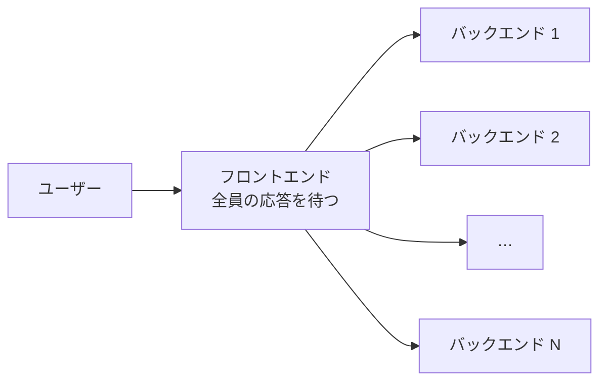

# 2.2 確率・統計と定量的思考

> 「アラートが鳴った。本当に障害だろうか」「平均レイテンシは 40 ms だから問題ないはず」「新機能で購入率が 1 ポイント上がった」「CPU 利用率は 90% だからまだ余裕がある」。どれも、確率と統計を知らないと簡単に判断を誤る問いです。この章では、不確実性を数字で扱い、データから正しく結論を引き出し、見積もりを範囲と確信度で伝えるための道具を身につけます。

| 項目 | 内容 |
|---|---|
| 学習時間の目安 | 本文 5h ＋ 演習 5h |
| 前提となる章 | [2.1 計算機科学のための離散数学](../01-discrete-math/README.md)（集合・数え上げ） |
| 演習 | [exercises/](exercises/)（Python） |
| キーワード | 条件付き確率, ベイズの定理, 基準率の誤り, 期待値, 分散, ポアソン分布, 裾の重い分布, パーセンタイル, テールレイテンシ, 誕生日のパラドックス, 信頼区間, p値, A/Bテスト, リトルの法則, 待ち行列, モンテカルロ法, フェルミ推定 |

## この章のゴール

- [ ] 条件付き確率とベイズの定理で、アラートや検知システムが「鳴ったときに本物である確率」を計算し、基準率の誤りを説明できる
- [ ] 主要な確率分布がシステムのどこに現れるかを説明し、裾の重い分布では平均が当てにならない理由を説明できる
- [ ] レイテンシを平均ではなくパーセンタイルで評価し、ファンアウトによるテールの増幅を計算できる
- [ ] 誕生日のパラドックスを使って、ID やハッシュ値の衝突確率を見積もれる
- [ ] A/B テストの結果を p 値・信頼区間・検出力で正しく解釈し、必要なサンプルサイズを計算し、のぞき見や SRM などの落とし穴を指摘できる
- [ ] リトルの法則と M/M/1 モデルで、利用率とレイテンシの関係を説明し、容量計画に使える
- [ ] モンテカルロ法とフェルミ推定で見積もりを作り、不確実性を範囲と確信度で伝えられる

## なぜ学ぶのか

システムも組織も、不確実性の中で動いています。確率と統計の誤解は、次のような形で現れます。

- **テールレイテンシ**: Google の Jeffrey Dean と Luiz André Barroso は論文 "The Tail at Scale"（Communications of the ACM, 2013）で、1 台のサーバーが 1% の確率で 1 秒以上かかるとき、1 つのリクエストが 100 台に並列に問い合わせるなら、ユーザーのリクエストの 63% が 1 秒以上かかることを示しました。「99% は速い」サーバーを集めても、ユーザーから見ると遅いシステムになるのです（3.4 節）。
- **基準率の誤り**: 「精度 99% の検知器」が鳴ったとき、それが本物である確率は 99% ではありません。異常がまれなら、アラートの大半は誤報になります。侵入検知でこの問題が本質的な難しさであることは、Stefan Axelsson の論文 "The Base-Rate Fallacy and the Difficulty of Intrusion Detection"（ACM TISSEC, 2000）で論じられています（1.3 節）。
- **p 値の誤解**: 米国統計学会（ASA）は 2016 年、p 値が広く誤解・誤用されていることを受けて、「p 値は仮説が正しい確率ではない」などの原則をまとめた声明を異例の形で発表しました。A/B テストの結果を誤読すると、効果のない施策に投資し続けることになります（第 5 節）。
- **利用率の罠**: 「CPU 利用率 90% ならあと 10% 余裕がある」は誤りです。待ち行列の理論によれば、利用率が 1 に近づくと待ち時間は発散します（第 7 節）。

## 1. 確率の基礎 — 条件付き確率とベイズの定理

### 1.1 確率の基本ルール

起こりうる結果全体を **標本空間**、その部分集合を **事象** と呼び、事象 A の確率を P(A) と書きます（集合の言葉は 2.1 章の第 3 節）。実務で使うルールは次の 4 つでほぼ足ります。

| ルール | 式 | 使いどころ |
|---|---|---|
| 余事象 | P(A でない) = 1 − P(A) | 「少なくとも 1 回」は「1 回も起きない」の余事象で計算する |
| 和の法則 | P(A ∪ B) = P(A) + P(B) − P(A ∩ B) | 包除原理（2.1 章）の確率版 |
| 条件付き確率 | P(A \| B) = P(A ∩ B) / P(B) | 「B が起きたと分かったときの A の確率」 |
| 独立 | P(A ∩ B) = P(A) × P(B) | A と B が互いに影響しないとき **だけ** 使える |

### 1.2 独立性の仮定は最も危険な仮定

可用性 99.9%（停止確率 0.1%）のサーバーを 2 台並べると、両方が同時に止まる確率は 0.001² = 10⁻⁶ で、可用性は 99.9999% になる、という計算をよく見かけます。これは **2 台の故障が独立** な場合に限った話です。

現実には、同じラック・同じ電源・同じアベイラビリティゾーン・同じ設定変更・同じソフトウェアのバグによって、**複数台が同時に壊れる共通原因故障（common-mode failure）** が起きます。共通原因で両方が止まる確率を p_c とすると、同時停止の確率はおよそ p_c + p² です。

| 共通原因で同時に止まる確率 p_c | 同時停止の確率 | 可用性 |
|---|---|---|
| 0（完全に独立） | 1.0 × 10⁻⁶ | 99.9999% |
| 0.01% | 1.0 × 10⁻⁴ | 99.99% |
| 0.05% | 5.0 × 10⁻⁴ | 99.95% |

冗長化の効果は、ほぼ p_c だけで決まってしまいます。だから信頼性設計の議論は「何台並べるか」より「**何を共有しているか**」（電源、ネットワーク、デプロイの仕組み、設定、依存サービス）に向けるべきです（[10.3 信頼性設計とSLO](../../10-cloud-and-sre/03-reliability-engineering/README.md)）。

### 1.3 ベイズの定理と基準率の誤り

条件付き確率の定義を 2 通りに書くと、**ベイズの定理（Bayes' theorem）** が得られます。

```text
P(H | E) = P(E | H) × P(H) / P(E)
P(E)     = P(E | H) × P(H) + P(E | ¬H) × P(¬H)      （全確率の公式）
```

H を「本当に障害が起きている」、E を「アラートが鳴った」とします。P(E | H) は **感度（sensitivity、再現率）**、P(E | ¬H) は **偽陽性率**、P(H) は **基準率（base rate、事前確率）** です。私たちが知りたいのは P(H | E)、つまり **アラートの適合率（precision）** です。

具体的な数字で計算します。5 分ごとに監視の判定をしていて、障害が起きているのは全体の 0.1% の時間、アラートの感度は 99%、偽陽性率は 1% とします。「精度 99%」と言いたくなる性能です。

```python
def posterior(prior, sensitivity, fpr):
    """ベイズの定理: アラートが鳴ったとき、本当に障害である確率"""
    p_alert = sensitivity * prior + fpr * (1 - prior)   # 全確率の公式
    return sensitivity * prior / p_alert

print(f"{posterior(0.001, 0.99, 0.01):.3f}")    # 0.090
print(f"{posterior(0.001, 0.99, 0.001):.3f}")   # 0.498（偽陽性率を 1/10 にした場合）
```

**鳴ったアラートのうち本物は 9% だけ** です。確率より「件数」で考える（自然頻度）と、理由がすぐ分かります。1 年はおよそ 10 万個の 5 分間です。

| | アラートが鳴った | 鳴らなかった | 計 |
|---|---|---|---|
| 障害あり（0.1%） | 99 | 1 | 100 |
| 障害なし | 999 | 98,901 | 99,900 |
| 計 | **1,098** | 98,902 | 100,000 |

年に 1,098 回（1 日約 3 回）鳴り、そのうち 999 回は誤報です。当番のエンジニアはすぐにアラートを信用しなくなり、本物の 99 回も見過ごされるようになります（アラート疲れ）。異常がまれな領域ほどこの効果は極端で、100 万回のログイン試行のうち不正が 10 回、感度 99%・偽陽性率 0.1% の検知器なら、本物 9.9 件に対して誤報が約 1,000 件、適合率は約 1% です（演習 3 の `alert_confusion`）。

上のコードの 2 行目が示すように、基準率が低いときは **感度を上げるより偽陽性率を下げる方がはるかに効きます**。実務では次のような手を組み合わせます。

- **症状にアラートを出す**: CPU 使用率のような原因の候補ではなく、エラー率やレイテンシのようなユーザーが実際に被る症状にアラートを出すと、「障害あり」の基準率が上がり、誤報が減ります（[10.4 オブザーバビリティ](../../10-cloud-and-sre/04-observability/README.md)）。
- **持続時間や複数の信号で絞る**: 「5 分間続いたら」「2 つの指標がそろったら」鳴らすことで、偽陽性率を桁で下げられます（感度や検知の速さとのトレードオフ）。
- **検知と対応を分ける**: 低い適合率の検知は自動の追加調査やチケットにとどめ、人を起こすのは高い適合率のものだけにします（[11.5 セキュリティ運用とサプライチェーン](../../11-security/05-security-operations/README.md)）。

### 1.4 確率変数・期待値・分散

値が確率的に決まる量を **確率変数** と呼びます。**期待値** E[X] は「平均的な値」、**分散** Var(X) = E[(X − E[X])²] は「期待値からのばらつき」、その平方根が **標準偏差** です。

期待値の最も便利な性質は **線形性** です。E[X + Y] = E[X] + E[Y] は、X と Y が独立でなくても常に成り立ちます。例えば、n 個のデータを m 個のバケットにランダムに入れたとき、「同じバケットに入る組」の数の期待値は、C(n, 2) 個の組それぞれが確率 1/m で衝突するので **C(n, 2)/m** です。組同士の衝突は独立ではありませんが、期待値の計算には関係ありません（第 4 節で使います）。

一方、分散が足し算になる Var(X + Y) = Var(X) + Var(Y) は、**独立なときだけ** 成り立ちます。

## 2. システムに現れる確率分布

### 2.1 代表的な分布

| 分布 | 意味 | 平均 | 分散 | システムでの例 |
|---|---|---|---|---|
| ベルヌーイ分布 | 確率 p で 1、それ以外 0 | p | p(1−p) | 1 件のリクエストの成功・失敗、1 人のユーザーの購入 |
| 二項分布 B(n, p) | n 回の独立な試行の成功回数 | np | np(1−p) | 100 台のうち故障している台数、1 万人のうち購入者数 |
| 幾何分布 | 初めて成功するまでの試行回数 | 1/p | (1−p)/p² | 成功率 90% の処理をリトライし続けたときの平均試行回数 1.11 回 |
| ポアソン分布 | 単位時間あたりの独立な出来事の回数（平均 λ） | λ | λ | 1 秒あたりのリクエスト数、1 日あたりのディスク故障数 |
| 指数分布 | ポアソン到着の「次の到着までの時間」 | 1/λ | 1/λ² | リクエストの到着間隔、（単純なモデルでの）故障までの時間 |
| 正規分布 N(μ, σ²) | 多数の独立な小さい要因の和 | μ | σ² | 測定誤差、多数の標本の平均（2.3 節） |
| 対数正規分布 | 多数の独立な要因の **積** | e^(μ+σ²/2) | — | レイテンシ、ファイルサイズ、タスクの所要時間 |
| べき乗則（パレート分布、Zipf 則） | 「ごく一部が大部分を占める」 | α ≤ 1 なら無限大 | α ≤ 2 なら無限大 | アクセスの集中（人気の商品・キー）、ファイルサイズ、ユーザーごとの利用量 |

**ポアソン分布** は、多数の利用者がそれぞれ独立に、まれに行動するときの到着数のモデルです。その到着間隔は **指数分布** で、「すでに t 秒待った」ことが「あと何秒待つか」に影響しない **無記憶性** を持ちます。ただし、現実のトラフィックは日次の周期、キャンペーン、リトライの連鎖、毎時 0 分に一斉に動くバッチなどで、ポアソン過程よりずっと **バースト的（突発的に集中する）** です。ポアソンは出発点のモデルと考えてください。

### 2.2 裾の重い分布 — 平均が当てにならない世界

平均がほぼ同じ 3 つの分布から 10 万個ずつ標本をとり、比べてみます。

```python
import math
import random
import statistics

rng = random.Random(42)
n = 100_000
samples = {
    "exponential": [rng.expovariate(1 / 100) for _ in range(n)],             # 平均 100 の指数分布
    "lognormal": [rng.lognormvariate(math.log(60), 1.0) for _ in range(n)],  # 中央値 60, σ=1
    "pareto": [40 * rng.paretovariate(1.5) for _ in range(n)],                # 最小 40, α=1.5
}
for name, xs in samples.items():
    xs.sort()
    top1 = sum(xs[int(0.99 * n):]) / sum(xs)   # 上位 1% の値が合計に占める割合
    print(f"{name:12} mean={statistics.fmean(xs):5.0f} median={statistics.median(xs):4.0f} "
          f"p99={xs[int(0.99 * (n - 1))]:4.0f} max={xs[-1]:6.0f} top1%share={top1:.0%}")
```

```text
exponential  mean=  100 median=  69 p99= 464 max=  1305 top1%share=6%
lognormal    mean=   99 median=  60 p99= 605 max=  5521 top1%share=9%
pareto       mean=  120 median=  64 p99= 871 max= 58369 top1%share=21%
```

平均や中央値は似ていても、**裾（まれな大きい値）の重さがまったく違います**。パレート分布（α = 1.5）では、上位 1% の値が合計の 21% を占め、最大値は中央値の 900 倍を超えます。α ≤ 2 のパレート分布は分散が無限大です。α > 1 なら平均は存在するので、標本平均は大数の法則によりいずれ真の平均に近づきますが、その近づき方は次の節で見る √n の法則よりずっと遅く、まれな巨大値が 1 つ入るたびに大きく跳ねます。

裾の重い分布は、システムのあちこちに現れます。

- **レイテンシ**: GC の停止、ロック待ち、キャッシュミス、リトライが重なると、まれに極端に遅いリクエストが生まれます。だからレイテンシは平均ではなくパーセンタイルで見ます（第 3 節）。
- **アクセスの集中**: 商品やキーへのアクセス数は Zipf 則に近いことが多く、少数の人気キーにアクセスが集中します。キャッシュが効く理由であると同時に、特定のシャードだけが過負荷になる **ホットキー問題** の原因です（[7.3 パーティショニング](../../07-distributed-systems/03-partitioning/README.md)）。
- **ユーザーごとの利用量**: 少数の大口顧客がリソースの大半を使うことは珍しくありません。「平均的なユーザー」で容量や料金を設計すると、大口顧客で破綻します。

### 2.3 大数の法則と中心極限定理

**大数の法則**: 独立な標本の平均は、標本数を増やすと真の期待値に近づきます。**中心極限定理（CLT）**: 分散が有限なら、標本平均の分布は標本数 n が大きいとき正規分布に近づき、そのばらつき（**標準誤差**）は σ/√n です。

```python
import random
import statistics

rng = random.Random(3)
def spread_of_means(draw, n, reps=300):
    """大きさ n の標本平均を reps 回求め、そのばらつき（標準偏差）を返す"""
    return statistics.stdev(statistics.fmean(draw() for _ in range(n)) for _ in range(reps))

expo = lambda: rng.expovariate(1 / 100)        # 平均 100、標準偏差 100
pareto = lambda: 40 * rng.paretovariate(1.5)   # 平均 120、分散は無限大
for n in (10, 100, 1000):
    print(f"n={n:5d}  指数分布: {spread_of_means(expo, n):6.1f}（理論 {100 / n ** 0.5:5.1f}）"
          f"  パレート分布: {spread_of_means(pareto, n):6.1f}")
```

```text
n=   10  指数分布:   31.6（理論  31.6）  パレート分布:   52.5
n=  100  指数分布:    9.4（理論  10.0）  パレート分布:   32.6
n= 1000  指数分布:    3.3（理論   3.2）  パレート分布:   22.5
```

指数分布では、標本を 100 倍にすると誤差が 1/10 になる **√n の法則** どおりです。**誤差を半分にするには標本が 4 倍必要** という事実は、A/B テストの期間や計測の回数を決めるときの基本です。一方、分散が無限大のパレート分布では、平均の誤差がなかなか縮みません。裾の重いデータの平均は、標本を増やしても信頼できないことがあるのです。

## 3. 記述統計 — 平均はレイテンシについて嘘をつく

### 3.1 平均・中央値・パーセンタイル

10 件のリクエストのレイテンシ（ミリ秒）を考えます。1 件だけが遅かったとします。

```python
import statistics

def percentile(xs, p):
    """線形補間によるパーセンタイル（NumPy の既定 method="linear" と同じ定義）"""
    s = sorted(xs)
    h = (len(s) - 1) * p / 100          # 0 始まりの「位置」を実数で求める
    lo = int(h)
    if lo + 1 >= len(s):
        return float(s[-1])
    return s[lo] + (h - lo) * (s[lo + 1] - s[lo])

lat = [12, 15, 11, 14, 13, 250, 12, 16, 13, 14]    # ms。1 件だけ遅い
print(statistics.fmean(lat), statistics.median(lat))                       # 37.0 13.5
print(round(percentile(lat, 90), 1), round(percentile(lat, 99), 1))        # 39.4 228.9
print(round(statistics.quantiles(lat, n=100)[89], 1))                      # 226.6
print(round(statistics.quantiles(lat, n=100, method="inclusive")[89], 1))  # 39.4
```

平均 37 ms は、実際のどのリクエストの体験とも一致しません。9 件は 16 ms 以下で、1 件は 250 ms です。

**p パーセンタイル** は「全体の p% がそれ以下になる値」です。ところが、有限個のデータからこれを計算する方法は 1 つではありません。上の `percentile` は、並べた値の位置 h = (n−1)·p/100 を両隣の値で線形補間する方法で、NumPy の既定や Excel の `PERCENTILE.INC` と同じです。**Python の `statistics.quantiles` の既定（exclusive 法）は別の定義** で、同じデータの 90 パーセンタイルが 39.4 ではなく 226.6 になります。

この差は、データが少ないときにパーセンタイルがいかに不安定かを示しています。10 件のデータで「p99」を語ることにはほとんど意味がありません。p99 を超えるのはデータの 1% だけなので、1,000 件あってもその推定は 10 件ほどの値に左右されます。目安として、**p99 には少なくとも数千件、p99.9 には数万件のデータ** が欲しいところです。ダッシュボードの p99 がリクエストの少ない深夜に跳ねるのは、多くの場合この効果です。

### 3.2 レイテンシはパーセンタイルで見る

レイテンシの SLO（サービスレベル目標）は、「p99 が 300 ms 以下」のようにパーセンタイルで定義するのが一般的です（[10.3 信頼性設計とSLO](../../10-cloud-and-sre/03-reliability-engineering/README.md)）。平均を目標にすると、一部のユーザーが極端に遅い体験をしていても気づけません。しかも、リクエストを多く送るユーザー（ヘビーユーザー）ほど遅いリクエストに当たる回数が多くなります。

パーセンタイルの扱いで最もよくある誤りが、**パーセンタイルの平均をとること** です。サーバーごとの p99 を平均しても、全体の p99 にはなりません（上の `percentile` を使います）。

```python
import math
import random

rng = random.Random(7)
for n_fast, n_slow, slow_median in [(5000, 5000, 80), (9900, 100, 200)]:
    fast = [rng.lognormvariate(math.log(20), 0.5) for _ in range(n_fast)]
    slow = [rng.lognormvariate(math.log(slow_median), 0.5) for _ in range(n_slow)]
    avg_of_p99 = (percentile(fast, 99) + percentile(slow, 99)) / 2
    true_p99 = percentile(fast + slow, 99)
    print(f"件数 {n_fast}:{n_slow}  p99 の平均 = {avg_of_p99:.0f} ms, 全体の本当の p99 = {true_p99:.0f} ms")
```

```text
件数 5000:5000  p99 の平均 = 156 ms, 全体の本当の p99 = 221 ms
件数 9900:100  p99 の平均 = 313 ms, 全体の本当の p99 = 102 ms
```

p99 の平均は、過小評価にも過大評価にもなります。正しく集約するには、各サーバーで **ヒストグラム（値の範囲ごとの件数）** を集計し、ヒストグラムを足し合わせてからパーセンタイルを計算します。Prometheus のヒストグラム型や、HDR Histogram、t-digest といった手法はこのためにあります。

計測方法そのものにも罠があります。負荷試験ツールが「前のリクエストの応答を待ってから次を送る」作りだと、サーバーが止まっている間はリクエストを送らないので、遅延が記録されにくくなります。Gil Tene はこれを **coordinated omission** と呼び、レイテンシの計測で広く見られる誤りとして注意を促しています。

### 3.3 分散と標準偏差 — n で割るか n−1 で割るか

データのばらつきは分散と標準偏差で表します。手元のデータが **母集団そのもの** なら n で割り（母分散）、**母集団からの標本** で母集団の分散を推定したいなら n − 1 で割ります（標本分散、ベッセルの補正）。標本平均は母平均より標本に「寄っている」ので、n で割ると母分散を系統的に小さく見積もってしまうからです。Python では `statistics.pvariance` と `statistics.variance` がそれぞれに対応します。

計算方法にも注意が必要です。「2 乗の平均 − 平均の 2 乗」という公式は、値が大きく分散が小さいデータ（例: 10⁹ 前後のタイムスタンプ）で桁落ちを起こし、負の分散のような無意味な結果になります（[1.1 情報の表現](../../01-computer-systems/01-data-representation/README.md) の浮動小数点数の節）。先に平均を求めてから偏差の 2 乗を足す方法（演習 1）や、1 パスで安定に計算できる Welford のアルゴリズムを使います。

### 3.4 テールレイテンシの増幅 — ファンアウトの数学

1 つのユーザーリクエストが N 個のバックエンドに並列に問い合わせ、**全部の応答がそろってから** 返す構成（ファンアウト）を考えます。検索（インデックスを分割した各シャードに問い合わせる）や、多数のマイクロサービスを呼んで 1 つの画面を組み立てる API がこの形です。



各バックエンドが独立に確率 p で遅いとき、少なくとも 1 つが遅い確率は余事象で計算できます。

```text
P(ユーザーのリクエストが遅い) = 1 − (1 − p)^N
```

| ファンアウト N | p = 1%（各サーバーの p99 を超える） | p = 0.1%（p99.9） | p = 0.01%（p99.99） |
|---|---|---|---|
| 1 | 1.0% | 0.1% | 0.01% |
| 10 | 9.6% | 1.0% | 0.1% |
| 100 | **63.4%** | 9.5% | 1.0% |
| 1,000 | 99.996% | 63.2% | 9.5% |

ファンアウトが 100 なら、各サーバーにとっては 100 回に 1 回の遅さを、**ユーザーのリクエストの 6 割以上が経験します**。逆に、ユーザーの遅いリクエストを 1% に抑えたいなら、各サーバーの遅い確率を 1 − 0.99^(1/100) ≈ 0.01% に抑える、つまり **p99.99 で目標を満たす** 必要があります（演習 2 の `per_call_budget`）。

Dean と Barroso は、こうした「テールに強い」設計の技法として、一定時間応答がなければ別のレプリカにも同じリクエストを送る **ヘッジリクエスト（hedged request）** などを紹介し、わずかな追加負荷でテールを大きく改善できたと報告しています（[9.5 スケーラビリティとパフォーマンス](../../09-architecture/05-scalability-and-performance/README.md)）。

## 4. 衝突の確率 — 誕生日のパラドックス

2.1 章の鳩の巣原理によれば、365 通りの誕生日で確実に重複が出るには 366 人必要です。しかし、ランダムな 23 人のうち誕生日が同じ 2 人がいる確率は 50% を超えます（**誕生日のパラドックス**）。組の数は人数の 2 乗で増える（23 人なら C(23, 2) = 253 組）からです。

m 通りの値から n 個を一様ランダムに選んだとき、衝突が起きない確率は次の通りです。

```text
P(衝突なし) = 1 × (1 − 1/m) × (1 − 2/m) × … × (1 − (n−1)/m)  ≈  exp(−n(n−1) / (2m))
```

近似式から、**衝突確率が 50% になる個数はおよそ 1.18 √m** です。値の種類が m 通りあっても、√m 個程度で衝突が現実的になります。

```python
import math

def collision_prob(n, m):
    """m 通りの値から n 個をランダムに選んで、どれか 2 つが一致する確率（近似）"""
    return -math.expm1(-n * (n - 1) / (2 * m))   # 1 - exp(-x) を精度よく計算する

def n_for_half(m):
    return math.sqrt(2 * m * math.log(2))        # 衝突確率が約 50% になる個数

print(f"{collision_prob(23, 365):.3f}")          # 誕生日（厳密な値は 0.507）
print(f"{n_for_half(2**32):,.0f}")               # 32 ビットのハッシュ値
print(f"{n_for_half(62**6):,.0f}")               # 英大小文字＋数字 6 文字のランダムなコード
print(f"{n_for_half(2**122):.2e}")               # UUIDv4（ランダムな 122 ビット）
print(f"{collision_prob(10**12, 2**122):.1e}")   # UUIDv4 を 1 兆個作ったとき
```

```text
0.500
77,163
280,610
2.71e+18
9.4e-14
```

実務での意味を整理します。

- **32 ビットのハッシュ値（CRC32 など）を重複検出の鍵にしてはいけません**。約 7.7 万件で衝突確率が 50% になり、100 万件なら衝突する組の数の期待値は C(10⁶, 2)/2³² ≈ 116 組です（1.4 節の期待値の線形性）。
- **ランダムな短いコード**: 英数字 6 文字（62⁶ ≈ 568 億通り）でも、約 28 万件で衝突確率が 50% です。短縮 URL やクーポンコードをランダムに生成するなら、一意制約で衝突を検出して再生成する処理が必須です。
- **UUIDv4** は 128 ビットのうち 122 ビットがランダムです（UUID の規格は 2024 年に RFC 9562 として改訂されました）。1 兆個作っても衝突確率は約 10⁻¹³、50% に達するのは約 2.7 × 10¹⁸ 個（毎秒 10 億個作り続けて約 86 年）です。ただしこれは **乱数生成器が正しい** 場合の話で、仮想マシンの複製などで乱数の状態が重複すると前提が崩れます。
- **ハッシュ関数の強度**: n ビットのハッシュ値は、衝突を探す攻撃（誕生日攻撃）に対しておよそ 2^(n/2) の計算量しか耐えません。SHA-256 の衝突耐性が「128 ビット安全」と言われるのはこのためです（[11.2 暗号技術の基礎](../../11-security/02-cryptography/README.md)）。

コードで `1 - math.exp(-x)` ではなく `-math.expm1(-x)` を使っているのには理由があります。x が 10⁻²⁰ 程度だと `math.exp(-x)` は 1.0 に丸められ、`1 - math.exp(-x)` は 0 になってしまいます（UUIDv4 を 10 億個作ったときの衝突確率がこれにあたります）。1 に近い値の引き算による **桁落ち** を避ける `math.expm1` と `math.log1p` は、確率の計算で頻繁に使います（演習 2）。

## 5. 推定と仮説検定

### 5.1 標本から母集団を推定する

私たちが知りたいのは「全ユーザーの購入率」（母集団の値）ですが、観測できるのは「実験に参加したユーザーの購入率」（標本の値）だけです。標本から計算した推定値には、2.3 節の標準誤差の分だけ揺らぎがあります。

比率 p̂ を n 人から推定したとき、標準誤差は √(p̂(1−p̂)/n) で、**95% 信頼区間** は p̂ ± 1.96 × 標準誤差です（正規分布の 97.5 パーセンタイルが 1.96）。10,000 人中 1,000 人が購入したなら、p̂ = 10%、標準誤差 0.3 ポイント、95% 信頼区間は約 9.4%〜10.6% です。

信頼区間の意味は正確に理解しておく必要があります。**「この手続きで区間を作ることを何度も繰り返すと、そのうち 95% の区間が真の値を含む」** という意味で、「真の値がこの区間に入っている確率が 95%」という意味ではありません（後者はベイズ統計の信用区間の考え方です）。実務では、区間の **幅** が「どれくらい分かっていないか」を表す、と押さえておけば十分です。

### 5.2 仮説検定と p 値

**仮説検定** は、「差がない」という **帰無仮説（H₀）** のもとで、観測されたデータがどれくらい珍しいかを評価します。

- **p 値**: 帰無仮説が正しいと仮定したとき、観測された以上に極端なデータが得られる確率。
- **有意水準 α**: 「p < α なら帰無仮説を棄却する」と事前に決める閾値。慣例的に 0.05。

| | 本当は差がない | 本当は差がある |
|---|---|---|
| 「差がある」と判断 | **第 1 種の過誤**（偽陽性、確率 α） | 正しい検出（確率 = **検出力** 1 − β） |
| 「差がない」と判断 | 正しい | **第 2 種の過誤**（偽陰性、確率 β） |

p 値について、ASA の声明が強調する誤解を押さえておきましょう。

- p 値は「帰無仮説が正しい確率」でも「結果が偶然である確率」でもありません。
- p 値は効果の **大きさ** を表しません。巨大なサンプルなら、実務的に無意味な差でも p 値は小さくなります。
- **「有意でない」は「差がない」ことを意味しません**。多くの場合、単にデータが足りないだけです。

### 5.3 A/B テストを読む

ユーザーをランダムに A（現行）と B（新しいデザイン）に分け、購入率を比べます。2 群の比率の差の検定（z 検定）は次のように計算します（演習 4）。

```python
import math
from statistics import NormalDist

def ab_test(conv_a, n_a, conv_b, n_b, alpha=0.05):
    pa, pb = conv_a / n_a, conv_b / n_b
    pooled = (conv_a + conv_b) / (n_a + n_b)                    # 帰無仮説のもとでの共通の率
    z = (pb - pa) / math.sqrt(pooled * (1 - pooled) * (1 / n_a + 1 / n_b))
    p_value = 2 * (1 - NormalDist().cdf(abs(z)))                 # 両側検定
    se = math.sqrt(pa * (1 - pa) / n_a + pb * (1 - pb) / n_b)    # 差の標準誤差
    zc = NormalDist().inv_cdf(1 - alpha / 2)                     # 1.96
    return z, p_value, (pb - pa - zc * se, pb - pa + zc * se)

print(ab_test(1000, 10_000, 1100, 10_000))
print(ab_test(100, 1_000, 110, 1_000))
```

```text
(2.3066347738170103, 0.0210751892737977, (0.0015040591315121157, 0.018495940868487874))
(0.7294219615409074, 0.46574358793363535, (-0.016866524010530765, 0.036866524010530755))
```

1 万人ずつで 10.0% → 11.0% なら、p = 0.021 で有意、差の 95% 信頼区間は +0.15〜+1.85 ポイントです。同じ率でも 1,000 人ずつなら p = 0.47 で有意ではありませんが、信頼区間は −1.7〜+3.7 ポイントと広く、「効果がない」とはまったく言えません。**結果は p 値ではなく信頼区間で報告する** と、「どれくらい分かっていて、どれくらい分かっていないか」が伝わります。統計的に有意でも、区間の下限の +0.15 ポイントが実装・運用コストに見合わないなら、事業的な判断は別です。

### 5.4 検出力とサンプルサイズ — 実験は始める前に設計する

**検出力（power）** は、本当に差があるときにそれを検出できる確率です。慣例では 80% 以上を目指します。基準の率 p₁ から差 δ（検出したい最小の効果、MDE: minimum detectable effect）を、有意水準 α・検出力 1 − β で検出するのに必要な 1 群あたりの人数は、次の式で計算できます（p̄ = (p₁ + p₂)/2、p₂ = p₁ + δ）。

```text
n = ( z₁₋α/₂ √(2 p̄(1−p̄)) + z₁₋β √(p₁(1−p₁) + p₂(1−p₂)) )² / δ²
```

| 基準の率 | 検出したい差（絶対値） | 1 群あたりの必要人数（α = 0.05、検出力 80%） |
|---|---|---|
| 10% | +2 ポイント | 3,841 |
| 10% | +1 ポイント | 14,751 |
| 10% | +0.5 ポイント | 57,763 |
| 2% | +0.2 ポイント（相対 10%） | 80,682 |

**検出したい差を半分にすると、必要な人数は約 4 倍** になります（√n の法則）。概算には n ≈ 16 p(1−p)/δ² という覚えやすい近似が使えます。トラフィックの少ないサービスでは、小さな改善は原理的に検出できません。その場合は、効果の大きい変更に絞って実験する、より感度の高い指標を使う、実験以外の方法（ユーザーインタビューなど）で判断する、といった選択になります。

### 5.5 A/B テストの落とし穴

**のぞき見（peeking）**: 実験中に何度も結果を見て、有意になった時点で止めると、偽陽性率が α を大きく超えます。差のない A/A テストでシミュレーションしてみます。

```python
import math
import random
from statistics import NormalDist

def p_value(conv_a, n_a, conv_b, n_b):
    pooled = (conv_a + conv_b) / (n_a + n_b)
    se = math.sqrt(pooled * (1 - pooled) * (1 / n_a + 1 / n_b))
    z = (conv_b / n_b - conv_a / n_a) / se
    return 2 * (1 - NormalDist().cdf(abs(z)))

def aa_test(rng, peeks, users_per_peek, rate=0.10):
    """差のない A/A テスト。peeks 回データを見て、1 回でも p < 0.05 なら「有意」と判定する"""
    ca = cb = n = 0
    for _ in range(peeks):
        ca += sum(rng.random() < rate for _ in range(users_per_peek))
        cb += sum(rng.random() < rate for _ in range(users_per_peek))
        n += users_per_peek
        if p_value(ca, n, cb, n) < 0.05:
            return True
    return False

rng = random.Random(2026)
trials = 1000
for peeks in (1, 5, 20):
    hits = sum(aa_test(rng, peeks, 5000 // peeks) for _ in range(trials))
    print(f"データを {peeks:2d} 回見る: 偽陽性率 {hits / trials:.1%}")
```

```text
データを  1 回見る: 偽陽性率 4.9%
データを  5 回見る: 偽陽性率 14.3%
データを 20 回見る: 偽陽性率 23.4%
```

差がまったくないのに、20 回のぞけば約 4 回に 1 回は「有意な改善」が見つかります。対策は、サンプルサイズを事前に決めてそこまで待つか、途中で見ることを前提に設計された逐次検定の手法（群逐次デザインなど）を使うことです。

ほかにも、次の落とし穴がよく知られています。

- **SRM（sample ratio mismatch）**: 50:50 で割り当てたはずが、A 50,000 人・B 49,000 人だった場合、カイ二乗検定の p 値は約 0.0015 で、偶然とは考えにくいずれです。B だけでページの読み込みが失敗して計測されない、ボットの除外が片側だけに効いているなど、**実験の仕組みそのものが壊れている** 兆候で、結果を信用してはいけません（演習 4 の `srm_p_value`）。
- **多重比較**: 20 個の指標をそれぞれ α = 0.05 で検定すると、差がなくても少なくとも 1 つが有意になる確率は 1 − 0.95²⁰ ≈ 64% です。判断に使う主要指標を事前に 1〜2 個決め、それ以外は参考扱いにするか、Bonferroni 補正（α を検定の数で割る）などで調整します。
- **新奇効果と初頭効果**: 新しいデザインは物珍しさで一時的にクリックが増えたり（新奇効果）、慣れるまで一時的に数字が下がったり（初頭効果）します。曜日の影響も含めて最低 1〜2 週間は回し、効果の時間的な推移を確認します。
- **トワイマンの法則**: 「興味深く見える数字は、たいてい間違っている」。A/B テストの第一人者 Ron Kohavi らが繰り返し強調する経験則で、予想外に良い結果ほど、計測やデータ処理の誤りを先に疑います。

## 6. 相関と因果

「キャッシュのヒット率が高い日ほど、エラー率も高い」というダッシュボードを見て、キャッシュを減らすべきだと考えるのは早計です。アクセスが多い日は、同じキーへのアクセスが増えてヒット率が上がり、同時に負荷でエラーも増えるのかもしれません。両方に影響する第 3 の要因を **交絡因子（confounder）** といいます。

交絡の極端な例が **シンプソンのパラドックス** です。次の表は、新しい購入フローを評価した架空のデータです。新フローは主にスマホアプリの利用者に先行リリースされました。

| デバイス | 旧フロー | 新フロー |
|---|---|---|
| PC | 1,200 / 8,000 = **15.0%** | 330 / 2,000 = **16.5%** |
| スマホ | 100 / 2,000 = **5.0%** | 480 / 8,000 = **6.0%** |
| 合計 | 1,300 / 10,000 = **13.0%** | 810 / 10,000 = **8.1%** |

新フローは **PC でもスマホでも** 旧フローより購入率が高いのに、合計では大きく負けています。新フローの利用者の 8 割が、もともと購入率の低いスマホ利用者だったからです。どちらの数字を信じるべきかは、データの生成過程（なぜ偏りが生じたか）を理解して初めて判断できます。現実の有名な例としては、腎結石の 2 つの治療法を比較した研究（Charig ほか, 1986）がよく引用されます。

**ランダム化** は、この問題を根本から解決します。ユーザーをランダムに割り当てれば、デバイスを含むあらゆる交絡因子が両群に均等に分かれるので、差を施策の効果とみなせます。A/B テストが因果を語れる理由はここにあります。ランダム化できない場合は、層別（上の表のように分けて比較する）や、施策の前後と対照群の変化を比べる差分の差分法などの手法がありますが、どれも仮定に依存するので、結論は慎重に扱います。

## 7. 待ち行列の基礎 — 利用率 100% が破綻する理由

### 7.1 リトルの法則

待ち行列の理論で最も重要で、最も使い勝手のよい法則が **リトルの法則（Little's law）** です。

```text
L = λ W
L: 系の中にいる平均の数、λ: 平均到着率（= 安定していればスループット）、W: 平均滞在時間
```

驚くべきことに、この法則は到着や処理時間の分布によらず、**安定したシステムならほぼ何にでも** 成り立ちます。

- 毎秒 2,000 リクエストが来て、平均 150 ms かかる API サーバーでは、平均 2,000 × 0.15 = **300 リクエストが同時に処理中** です。スレッドプールや接続数の上限がこれより小さければ、リクエストは待たされます。
- 毎秒 500 クエリを平均 20 ms で処理するなら、DB 接続は平均 10 本使用中です。接続プールのサイズを決める出発点になります。
- 開発チームの仕掛かり中のタスク（WIP）が 30 件で、週に 10 件完了するなら、1 件の平均リードタイムは 3 週間です。リードタイムを短くするには、WIP を減らすのが最も直接的です（[13.7 デリバリーと生産性](../../13-technical-leadership/07-delivery-and-productivity/README.md)）。

### 7.2 M/M/1 モデル — 利用率とレイテンシの関係

最も基本的なモデル **M/M/1** は、到着がポアソン過程（到着率 λ）、処理時間が指数分布（処理率 μ、平均処理時間 1/μ）、窓口が 1 つの待ち行列です。**利用率** ρ = λ/μ < 1 のとき、次の式が成り立ちます。

```text
平均滞在時間  W  = 1 / (μ − λ) = (1/μ) / (1 − ρ)
平均待ち時間  Wq = ρ / (μ − λ)
平均系内人数  L  = ρ / (1 − ρ)、  待ち行列の平均長 Lq = ρ² / (1 − ρ)
```

平均処理時間 10 ms（μ = 100 件/秒）のサーバーで計算すると、次のようになります（M/M/1 の滞在時間は指数分布なので、p99 は平均の ln 100 ≈ 4.6 倍です）。

| 利用率 ρ | 平均滞在時間 W | p99 滞在時間 | 待ち行列の平均長 Lq |
|---|---|---|---|
| 50% | 20 ms | 92 ms | 0.5 |
| 70% | 33 ms | 154 ms | 1.6 |
| 80% | 50 ms | 230 ms | 3.2 |
| 90% | 100 ms | 461 ms | 8.1 |
| 95% | 200 ms | 921 ms | 18.1 |
| 99% | 1,000 ms | 4,605 ms | 98.0 |

```text
平均滞在時間（処理時間の何倍か。縦軸は対数目盛の概念図）
100 ┤                                                 ● 99%
    │
 20 ┤                                               ● 95%
 10 ┤                                            ● 90%
  5 ┤                                       ● 80%
  2 ┤                        ● 50%
  1 ┼─────────────────────────────────────────────────── 利用率 ρ
    0%                      50%                     100%
```

利用率 50% から 90% への変化で平均滞在時間は 5 倍、90% から 99% でさらに 10 倍になります。1 − ρ が分母にあるので、**利用率が 1 に近づくとレイテンシは発散** します。これが、多くのチームが CPU やワーカーの目標利用率を 70〜80% 程度に置く理由です。この余裕は、トラフィックの揺らぎ（2.1 節のバースト性）を吸収し、1 台が故障したときに残りのサーバーで負荷を引き受けるためのものでもあります。

M/M/1 は単純化したモデルで、現実のシステムとの違いも押さえておきましょう。

- **ばらつきが大きいほど悪化する**: 到着間隔と処理時間の変動係数をそれぞれ c_a、c_s とすると、平均待ち時間はおよそ ρ/(1−ρ) × (c_a² + c_s²)/2 × 平均処理時間 です（キングマンの近似式）。指数分布は c = 1 なので M/M/1 と一致します。処理時間がまちまちなリクエストを混ぜると、同じ利用率でも待ち時間が伸びます。重い処理を別のキューに分けるのはこのためです。
- **窓口が複数あるとき**: c 個の窓口が 1 つの待ち行列を共有する（M/M/c）と、窓口ごとに別々の行列を作るより待ち時間が大幅に短くなります（プーリングの効果）。
- **待ち行列が長いこと自体がリスク**: 利用者はタイムアウトしてリトライするので、過負荷時は負荷がさらに増えます。キューの長さに上限を設け、あふれたら早めに断る（ロードシェディング）設計が必要です（[9.5 スケーラビリティとパフォーマンス](../../09-architecture/05-scalability-and-performance/README.md)）。

### 7.3 シミュレーションで確かめる

理論式が正しいか、シミュレーションで確かめましょう。FIFO の窓口 1 つの待ち行列では、次の客の待ち時間 = max(0, 今の客の待ち時間 + 処理時間 − 到着間隔) という **リンドレーの漸化式** で、待ち時間を順に計算できます。

```python
import random

def simulate_mean_sojourn(lam, mu, n, seed):
    """M/M/1 の平均滞在時間をリンドレーの漸化式でシミュレーションする"""
    rng = random.Random(seed)
    wait = total = 0.0
    for _ in range(n):
        service = rng.expovariate(mu)
        total += wait + service                   # 滞在時間 = 待ち時間 + 処理時間
        gap = rng.expovariate(lam)                # 次の客が来るまでの時間
        wait = max(0.0, wait + service - gap)     # 次の客の待ち時間
    return total / n

mu = 100.0
for rho in (0.5, 0.8, 0.9, 0.95):
    sim = simulate_mean_sojourn(rho * mu, mu, 200_000, seed=1)
    print(f"ρ={rho:.2f}: 理論 {1000 / (mu - rho * mu):6.1f} ms, シミュレーション {sim * 1000:6.1f} ms")
```

```text
ρ=0.50: 理論   20.0 ms, シミュレーション   19.9 ms
ρ=0.80: 理論   50.0 ms, シミュレーション   49.5 ms
ρ=0.90: 理論  100.0 ms, シミュレーション   95.8 ms
ρ=0.95: 理論  200.0 ms, シミュレーション  195.7 ms
```

利用率が高いほど理論値とのずれが大きいことに気づいたでしょうか。高負荷の待ち行列は、状態の揺らぎが大きく長く続くため、平均が収束するまでにずっと多くの標本が必要です。これ自体が「高負荷のシステムは予測しにくい」という教訓です。演習 5 では、到着と退去の事象を時刻順に処理する **離散事象シミュレーション** を実装し、時間平均の系内人数などを測って、リトルの法則を観測データで確かめます。

## 8. モンテカルロ法・フェルミ推定・不確実性の伝え方

### 8.1 モンテカルロ法 — 計算できないものは試してみる

**モンテカルロ法** は、乱数でシナリオを大量に生成して、結果の分布を調べる方法です。数式で解けない問題でも、モデルさえ書ければ答えが出ます。

プロジェクトのスケジュールで試してみましょう。8 つのタスクがあり、それぞれ「たぶんこのくらい」という見積もり（中央値）があります。タスクの所要時間は、予定より大幅に遅れることはあっても大幅に早まることは少ないので、右に裾の長い対数正規分布でモデル化します。

```python
import math
import random

rng = random.Random(1)
medians = [3, 5, 5, 8, 4, 6, 5, 4]     # 各タスクの「たぶんこのくらい」（日）= 中央値の見積もり
trials = 100_000
totals = sorted(
    sum(rng.lognormvariate(math.log(m), 0.5) for m in medians)   # 右に裾が長い分布
    for _ in range(trials)
)
plan = sum(medians)
p_on_time = sum(t <= plan for t in totals) / trials
print(f"中央値の合計（素朴な見積もり）: {plan} 日")
print(f"計画どおりに終わる確率: {p_on_time:.0%}")
for q in (50, 80, 90):
    print(f"P{q}: {totals[int(q / 100 * trials)]:.1f} 日")
```

```text
中央値の合計（素朴な見積もり）: 40 日
計画どおりに終わる確率: 29%
P50: 44.5 日
P80: 52.2 日
P90: 57.0 日
```

各タスクの見積もりが「五分五分で当たる」妥当なものでも、それを足した 40 日で終わる確率は 29% しかありません。右に裾の長い分布の和は、中央値の和より大きくなるからです。**見積もりを足し算すると、系統的に楽観的な計画になる** のです。「P50 で 45 日、P90 で 57 日」と伝えれば、意思決定者はリスクをどこまで取るかを自分で選べます。

### 8.2 フェルミ推定 — 桁を外さない見積もり

**フェルミ推定** は、直接分からない量を、推測できる量の掛け算に分解して概算する方法です。設計の初期段階では「10 GB か 10 TB か」という桁が合っていれば十分なことが多く、それが分かれば構成の選択肢が絞れます。

例: 新しいチャット機能のストレージを見積もります（数値はすべて仮定です）。

```text
日次アクティブユーザー 100 万人 × 1 人 1 日 20 メッセージ = 2,000 万メッセージ/日
平均 2 × 10⁷ ÷ 86,400 秒 ≈ 230 件/秒（ピークは平均の数倍と仮定して 1,000 件/秒程度に備える）
1 件 500 バイト（本文・メタデータ・インデックス込み）× 2,000 万件 = 10 GB/日 ≈ 3.7 TB/年（複製前）
```

覚えておくと便利な数字は、「1 日 ≈ 10⁵ 秒（86,400）」「1 年 ≈ 3 × 10⁷ 秒」「1 か月 ≈ 2.6 × 10⁶ 秒」です。

仮定のそれぞれに幅を持たせ、モンテカルロ法と組み合わせると、見積もりを範囲で表せます。

```python
import math
import random

rng = random.Random(5)
def between(lo, hi):
    """lo〜hi の範囲で、桁（対数）が一様になるように値を選ぶ"""
    return math.exp(rng.uniform(math.log(lo), math.log(hi)))

samples = sorted(
    between(0.5e6, 2e6)      # DAU（人）
    * between(10, 40)        # 1 人 1 日あたりのメッセージ数
    * between(300, 1000)     # 1 件あたりの保存サイズ（バイト、インデックス込み）
    / 1e9                    # GB に換算
    for _ in range(100_000)
)
print(f"P10 = {samples[10_000]:.1f} GB/日, P50 = {samples[50_000]:.1f} GB/日, P90 = {samples[90_000]:.1f} GB/日")
```

```text
P10 = 4.6 GB/日, P50 = 10.9 GB/日, P90 = 26.1 GB/日
```

「1 日 5〜26 GB（80% の確率）」と分かれば、単一の DB で当面足りるのか、最初から分散を考えるべきかを議論できます。

### 8.3 不確実性を伝える

CTO は、技術的な見積もりを経営陣や取締役会に伝える立場になります（[14.4 経営陣・取締役会・投資家とのコミュニケーション](../../14-cto/04-executive-communication/README.md)）。そのときの原則は次の通りです。

- **点ではなく範囲で伝える**: 「6 週間」ではなく「80% の確率で 6〜10 週間」。点推定は、聞き手の頭の中で「確実な約束」に変換されます。
- **意思決定に効く分位点を選ぶ**: 締め切りのある案件なら P90、予算の上限を決めるならその状況で許容できるリスクに対応する分位点を示します。
- **確率は頻度で言い換える**: 「成功確率 90%」より「10 回やれば 1 回は失敗する」の方が、リスクの大きさが伝わります。気象庁は、降水確率 30% を「30% という予報が 100 回出されたとき、およそ 30 回は 1 mm 以上の降水がある」という意味だと説明しています。予報が当たっているかどうかは、このように頻度で検証できます（**較正**、calibration）。
- **見積もりは更新する**: 不確実性はプロジェクトが進むにつれて小さくなります。範囲を定期的に見直し、狭まった範囲と、その根拠（何が分かったか）を共有します。
- **偽の精度を避ける**: 「生産性が 23.7% 向上」のような有効数字は、その数字の確からしさを誤って伝えます。

## よくある落とし穴

1. **平均レイテンシだけを見る、あるいはパーセンタイルを平均する**。平均は裾を隠し、パーセンタイルの平均は正しい集約になりません。パーセンタイルで見て、集約はヒストグラムで行いましょう。
2. **検知器の「精度 99%」を、鳴ったときに正しい確率だと思う**。基準率が低いと適合率は極端に下がります。アラートを設計するときは、自然頻度で「1 日何回鳴り、そのうち何回が本物か」を見積もりましょう。
3. **冗長化の効果を独立性の仮定で計算する**。共通原因故障が可用性を決めます。「2 台が同時に止まるのはどんなときか」を列挙しましょう。
4. **p 値を「仮説が正しい確率」、有意でない結果を「効果がない」と解釈する**。効果の大きさと不確かさは信頼区間で報告しましょう。
5. **A/B テストを途中でのぞいて、有意になったら止める**。サンプルサイズを事前に決めるか、逐次検定の手法を使いましょう。SRM のチェックも忘れずに。
6. **相関を因果と取り違える**。交絡因子とシンプソンのパラドックスを疑い、可能ならランダム化した実験で確かめましょう。
7. **利用率 90% 以上を「効率的」と考える**。待ち時間は 1/(1−ρ) で増えます。レイテンシの目標とトラフィックの揺らぎから、目標利用率を決めましょう。
8. **ランダムな ID やハッシュ値を「十分長いから衝突しない」と思い込む**。誕生日のパラドックスで √m 個程度から衝突が現実的になります。桁数は計算で決め、一意制約で守りましょう。
9. **見積もりを中央値の足し算で作る**。右に裾の長い作業時間の和は、中央値の和より系統的に大きくなります。範囲とその確率で伝えましょう。

## CTOの視点

1. **意思決定を分布で語る文化をつくる**。スケジュール、容量計画、コスト予測を点推定で報告させると、組織は常に楽観的な約束をし、常に遅れます。「P50 と P90 はいくつか」「その範囲の根拠は何か」を定型の質問にし、自分自身も経営陣へ範囲で報告しましょう。見積もりの精度は、過去の見積もりと実績を比べて較正していくものです。
2. **アラートとオンコールの負荷を確率で設計する**。アラートの適合率が低いと、エンジニアの睡眠と注意力という希少な資源が失われ、本物の障害を見逃します。レビューでは「このアラートは月に何回鳴り、そのうち何回が対応の必要なものか」を問い、症状ベースのアラートと SLO に基づく設計へ誘導しましょう。
3. **実験基盤に投資し、統計の誤用を仕組みで防ぐ**。A/B テストを各チームが手作業で集計すると、のぞき見、多重比較、SRM の見落としが必ず起きます。事前のサンプルサイズ設計、主要指標の事前登録、SRM の自動チェックを備えた実験基盤は、誤った意思決定を減らす投資です。一方、トラフィックが少ない段階では小さな効果は検出できないので、何でも A/B テストにするのではなく、大きな賭けと定性的な検証に集中する判断も CTO の役割です。
4. **容量計画では利用率とレイテンシのトレードオフを明示する**。利用率を上げればインフラ費は下がりますが、テールレイテンシと障害時の余力が失われます。「目標利用率 70% と 85% で、コストと p99 はそれぞれどうなるか」を数字で比較して選ぶのが、FinOps と信頼性の両立です（[10.6 クラウドコスト管理（FinOps）](../../10-cloud-and-sre/06-finops/README.md)）。
5. **ファンアウトの深いアーキテクチャに警戒する**。マイクロサービスで 1 つのリクエストが数十のサービスを呼ぶ構成では、各サービスが p99 の SLO を守っていても、ユーザーの体験は悪化します。設計レビューでは「このリクエストは何個のバックエンドの応答を待つか」「各依存先に必要なパーセンタイルの目標は何か」を問いましょう。
6. **採用では定量的に考える力を見る**。「このアラートが鳴ったら本物である確率は？」「このサービスに必要なサーバー台数を 5 分で見積もってください」「A/B テストで p = 0.04 でした。リリースしますか？」といった質問は、統計の知識よりも、不確実性を扱う思考の習慣を測れます。

## 演習

演習コードは [exercises/quant.py](exercises/quant.py) にあります。関数の docstring に仕様が書いてあるので、`raise NotImplementedError(...)` を実装に置き換えてください。解答例は [solutions/quant.py](solutions/quant.py) にありますが、まずは自力で取り組みましょう。

```bash
python3 tools/check.py 2.2        # リポジトリのルートで実行
python3 tools/check.py -v 2.2     # 詳しい出力
```

| # | 難易度 | 内容 | 関数 |
|---|---|---|---|
| 1 | ★☆☆ | 平均・中央値・線形補間のパーセンタイル・標本分散と母分散（数値的に安定な方法で） | `mean`, `median`, `percentile`, `variance`, `stdev` |
| 2 | ★☆☆ | ファンアウトによるテールの増幅と、各サーバーに必要な目標。誕生日のパラドックスの厳密な値と近似 | `prob_at_least_one`, `per_call_budget`, `birthday_collision_exact`, `birthday_collision_approx`, `items_for_collision_probability` |
| 3 | ★☆☆ | ベイズの定理と、自然頻度による混同行列（アラートの適合率） | `bayes_posterior`, `alert_confusion` |
| 4 | ★★☆ | 2 群の比率の差の z 検定と信頼区間、必要サンプルサイズ、SRM の検定 | `two_proportion_ztest`, `sample_size_per_group`, `srm_p_value` |
| 5 | ★★★ | M/M/1 の公式と、離散事象シミュレーション（理論値・リトルの法則との照合） | `mm1_metrics`, `max_arrival_rate_for_latency`, `simulate_mm1` |
| 6 | ★★☆ | 記述: A/B テストの報告をレビューする（下記） | — |

演習 5 のテストは、同じシードで結果が再現すること、観測データでリトルの法則が成り立つこと、長いシミュレーションで理論値に近づくことを確かめます。乱数を使うプログラムも、シードを固定すれば決定的にテストできます。

### 演習 6（記述）: A/B テストの報告をレビューする

あるプロダクトチームから、次の報告が上がってきました。

> 新しい商品推薦アルゴリズム（B）の A/B テストの結果です。ユーザーを 50:50 に割り当て、購入率・クリック率・滞在時間・カート投入率など 12 の指標を毎日確認していました。4 日目に購入率が A 5.20%（48,000 人中 2,496 人）→ B 5.55%（46,500 人中 2,580 人）となり、p = 0.02 で有意になったので実験を終了しました。購入率が 6.7% 向上したので、全ユーザーに展開します。

この報告の問題点を指摘し、展開の判断のために追加で確認すべきこと・やり直すべきことを提案してください。

<details>
<summary>解答例</summary>

**問題点**

1. **のぞき見**: 毎日結果を確認し、有意になった時点で止めています。5.5 節のシミュレーションのとおり、偽陽性率は名目の 5% より大きくなっています。
2. **多重比較**: 12 の指標を見ていれば、差がなくても少なくとも 1 つが有意になる確率は 1 − 0.95¹² ≈ 46% です。購入率が事前に決めた主要指標だったのかが不明です。
3. **SRM**: 50:50 の割り当てで 48,000 人と 46,500 人は、カイ二乗検定の p 値が約 1 × 10⁻⁶ で、偶然のずれとは考えにくい水準です。B で推薦の表示が遅くて計測前に離脱している、B のエラーで記録が欠けているなど、実験の仕組みの不具合を疑うべきで、この状態では購入率の比較自体が信用できません。
4. **期間**: 4 日間では曜日の影響を含まず、新しい推薦への新奇効果も区別できません。
5. **効果の報告の仕方**: 「6.7% 向上」は相対値の点推定だけで、不確かさが示されていません。p = 0.02 程度なら、差の 95% 信頼区間の下限は 0 に近く、真の効果はごく小さい可能性があります（本問の数字で計算すると、差 +0.35 ポイントの 95% 信頼区間はおよそ +0.06〜+0.64 ポイント、相対値では +1% 程度から +12% 程度まで）。

**提案**

- SRM の原因を調査して修正し、実験をやり直す。
- 主要指標（購入率）と、悪化させてはいけないガードレール指標（レイテンシ、エラー率、売上など）を事前に決める。
- 検出したい最小の効果（例: +0.3 ポイント）から必要なサンプルサイズを計算し、曜日を含む 1〜2 週間以上の期間を確保して、途中で止めない（または逐次検定を使う）。
- 結果は差の信頼区間で報告し、展開の判断は区間の下限でも実装・運用コストに見合うかで行う。
- 推薦アルゴリズムの計算コストの増加（インフラ費）も判断材料に含める。

採点の観点:

- のぞき見・多重比較・SRM の 3 点を指摘できていれば合格ラインです。特に SRM は、他の数字を議論する前に実験の妥当性を否定するものなので、最優先で扱えているかを見ます。
- 信頼区間による報告、期間と新奇効果、ガードレール指標、事前のサンプルサイズ設計まで提案できていれば、実験文化をリードできる水準です。

</details>

## 理解度チェック

**Q1. ある不正検知の仕組みは、不正の 95% を検知し（感度）、正常な取引の 2% を誤って検知します（偽陽性率）。不正は全取引の 0.5% です。検知された取引が本当に不正である確率を求めてください。**

<details>
<summary>解答</summary>

ベイズの定理より、P(不正 | 検知) = 0.95 × 0.005 / (0.95 × 0.005 + 0.02 × 0.995) = 0.00475 / (0.00475 + 0.0199) ≈ **19%** です。

自然頻度で考えると、10 万件の取引のうち不正は 500 件で、そのうち 475 件が検知されます。正常な 99,500 件のうち 1,990 件が誤検知されます。検知された 2,465 件のうち本物は 475 件で、約 19% です。検知の約 8 割は誤報なので、検知した取引を即座に止めるのか、追加の確認に回すのかを、誤報のコストも含めて設計する必要があります。

</details>

**Q2. 3 台のサーバーの p99 レイテンシがそれぞれ 80 ms、120 ms、400 ms でした。サービス全体の p99 を (80 + 120 + 400) / 3 = 200 ms と報告してよいでしょうか。**

<details>
<summary>解答</summary>

よくありません。パーセンタイルの平均は、全体のパーセンタイルとは一般に一致しません。各サーバーが処理するリクエスト数や分布の形によって、全体の p99 は 200 ms より大きくも小さくもなりえます（3.2 節の例では、同じ手順で過小評価にも過大評価にもなりました）。

正しくは、各サーバーでレイテンシのヒストグラム（範囲ごとの件数）を記録し、それを足し合わせてから全体の p99 を計算します。また、400 ms のサーバーがあること自体が調査すべき兆候です。

</details>

**Q3. ユーザーのリクエストごとに 50 個のバックエンドへ並列に問い合わせ、すべての応答を待って返すサービスがあります。各バックエンドは独立に 1% の確率で 100 ms を超えます。ユーザーのリクエストのうち、100 ms を超えるものは何 % ですか。**

<details>
<summary>解答</summary>

1 − 0.99⁵⁰ ≈ **39.5%** です。各バックエンドの p99 が 100 ms でも、ユーザーから見るとおよそ 5 回に 2 回が 100 ms を超えます。ユーザーの遅いリクエストを 1% に抑えるには、各バックエンドの遅い確率を約 0.02%（1 − 0.99^(1/50)）に下げるか、ファンアウトを減らす、ヘッジリクエストを使う、部分的な結果で返す、といった設計の変更が必要です。

</details>

**Q4. 100 万件のファイルの重複排除に、32 ビットのハッシュ値だけを比較するコードがあります。問題はありますか。64 ビットならどうですか。**

<details>
<summary>解答</summary>

32 ビット（2³² ≈ 43 億通り）では、衝突確率が 50% になるのは約 7.7 万件です。100 万件なら衝突する組の数の期待値は C(10⁶, 2)/2³² ≈ 116 組で、**異なるファイルを重複とみなして削除する** 事故がほぼ確実に起きます。

64 ビットなら、100 万件での衝突確率はおよそ 2.7 × 10⁻⁸ まで下がります。ただし、悪意のある入力（わざと衝突を作る攻撃）を想定するなら暗号学的ハッシュ関数（SHA-256 など）を使い、データを失う処理では、ハッシュ値が一致したときに中身を実際に比較するのが安全です。

</details>

**Q5. A/B テストの結果が p = 0.03 でした。次のうち正しい解釈はどれですか。(a) 施策に効果がない確率は 3% (b) 効果がないと仮定すると、観測された以上に極端な差が出る確率は 3% (c) 施策の効果は大きい (d) 同じ実験をやり直すと 97% の確率でまた有意になる**

<details>
<summary>解答</summary>

**(b)** だけが正しい解釈です。

- (a) p 値は帰無仮説が正しい確率ではありません。それを求めるには事前確率が必要です（ベイズの定理）。実際に効果のある施策がまれな領域では、p = 0.03 でも効果がない確率は 3% よりずっと高くなりえます。
- (c) p 値は効果の大きさを表しません。大きさは差とその信頼区間で判断します。
- (d) 再現の確率は検出力に依存し、p 値からは直接決まりません。p = 0.03 程度の結果は、やり直すと有意にならないことも珍しくありません。

</details>

**Q6. 毎秒 1,200 リクエストを受け、平均 250 ms で応答する API サーバー群があります。同時に処理中のリクエストは平均いくつですか。ワーカースレッドの合計が 200 だと何が起きますか。**

<details>
<summary>解答</summary>

リトルの法則より、L = λW = 1,200 × 0.25 = **300** です。スレッドが 200 しかなければ、平均的にも処理能力が足りず、リクエストがキューにたまって待ち時間が増え続けます（待ち時間が増えると W が増え、さらに L が増える悪循環）。少なくとも 300 を超えるスレッド（または非同期 I/O による同時処理数）が必要で、トラフィックの揺らぎと利用率の目標（70〜80%）を考えると 400 程度を確保するのが妥当です。もちろん、スレッドを増やしても DB などの下流がボトルネックなら解決しないので、下流の容量もリトルの法則で確認します。

</details>

**Q7. M/M/1 モデルで、利用率が 90% から 95% に上がると、平均滞在時間は何倍になりますか。この性質から、容量計画について何が言えますか。**

<details>
<summary>解答</summary>

平均滞在時間は (1/μ)/(1 − ρ) なので、1/(1 − 0.9) = 10 倍 から 1/(1 − 0.95) = 20 倍（いずれも処理時間に対して）になり、**2 倍** です。利用率が 5 ポイント上がっただけで、レイテンシが倍増します。

容量計画では、利用率が高い領域ではわずかな負荷の増加（キャンペーン、1 台の故障による負荷の再配分、リトライ）でレイテンシが急激に悪化することを前提に、目標利用率に余裕を持たせる必要があります。コスト削減のために利用率を上げる判断は、この非線形性を理解したうえで、レイテンシの目標と照らして行います。

</details>

**Q8. 8 つのタスクの見積もり（それぞれ「たぶん 5 日」）を足して「40 日で完了」と報告するのは、なぜ危険なのですか。代わりにどう報告すべきですか。**

<details>
<summary>解答</summary>

タスクの所要時間は、大幅に遅れることはあっても大幅に早まることは少ない、右に裾の長い分布をしています。そのような分布の中央値を足しても、合計の中央値にはならず、合計は中央値の和より系統的に大きくなります（8.1 節の例では、中央値の和の 40 日で終わる確率は 29%）。さらに、タスク間の依存や共通の遅延要因（仕様変更、主要メンバーの不在）があると、遅れは相関して重なります。

代わりに、モンテカルロ法などで合計の分布を見積もり、「P50 で 45 日、P90 で 57 日」のように範囲と確率で報告します。締め切りが重要なら P90 を約束の基準にし、プロジェクトが進むにつれて範囲を更新します。

</details>

## さらに学ぶために

- Eric Lehman, F. Thomson Leighton, Albert R. Meyer "Mathematics for Computer Science"（MIT 6.042J の教科書。PDF が無料で公開されている）— 後半の確率の章が、条件付き確率・期待値・偏差の上界を計算機科学の例で丁寧に扱う。2.1 章から続けて読める。
- Ron Kohavi, Diane Tang, Ya Xu "Trustworthy Online Controlled Experiments"（邦訳『A/Bテスト実践ガイド 真のデータドリブンへ至る信用できる実験とは』KADOKAWA）— オンライン実験の設計・落とし穴・組織づくりを、Microsoft や Google などでの経験から体系化した定番書。
- Jeffrey Dean, Luiz André Barroso "The Tail at Scale"（Communications of the ACM, 2013）— テールレイテンシの増幅と、それに強いシステムを作る技法を示した短い論文。大規模システムに関わるなら必読。
- Mor Harchol-Balter "Performance Modeling and Design of Computer Systems: Queueing Theory in Action"（Cambridge University Press, 2013）— 待ち行列理論を、サーバーやスケジューリングの設計に使える形で解説した教科書。
- Betsy Beyer ほか編 "Site Reliability Engineering"（邦訳『SRE サイトリライアビリティエンジニアリング』オライリー・ジャパン）— 監視・アラート・SLO の章が、この章の基準率やパーセンタイルの議論を実務に落とし込む助けになる。
- Ronald L. Wasserstein, Nicole A. Lazar "The ASA Statement on p-Values: Context, Process, and Purpose"（The American Statistician, 2016）— p 値の正しい解釈を 6 つの原則にまとめた短い声明。
- Darrell Huff "How to Lie with Statistics"（邦訳『統計でウソをつく法』講談社ブルーバックス）— グラフや平均による誤誘導の古典。データを読む側の防御術として今も有効。

## まとめ

- 確率の計算では **独立性の仮定** が最も危険。冗長化の効果は共通原因故障で決まる。
- ベイズの定理より、基準率が低い事象の検知では **アラートの大半が誤報** になる。自然頻度で考え、偽陽性率を下げる設計をする。
- システムには **裾の重い分布** が多く、平均は当てにならない。レイテンシはパーセンタイルで見て、ヒストグラムで集約する。ファンアウトはテールを 1 − (1 − p)^N で増幅する。
- **誕生日のパラドックス** により、m 通りの値でも約 1.18√m 個で衝突確率が 50% になる。ID やハッシュの桁数は計算で決める。
- p 値は仮説が正しい確率ではない。A/B テストは **事前にサンプルサイズを設計** し、のぞき見・多重比較・SRM・新奇効果に注意し、結果は信頼区間で報告する。
- 相関は因果ではない。交絡とシンプソンのパラドックスを疑い、ランダム化で因果を確かめる。
- **リトルの法則 L = λW** で同時実行数を見積もり、M/M/1 の **W = (1/μ)/(1 − ρ)** から、利用率が 1 に近づくとレイテンシが発散することを理解して目標利用率を決める。
- 見積もりは **範囲と確率** で伝える。モンテカルロ法とフェルミ推定は、不確実性を定量化するための実用的な道具である。
