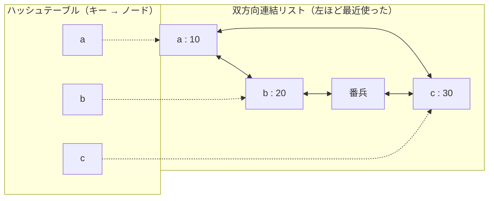

# 2.4 基本データ構造

> 同じ「データを入れて、探して、取り出す」処理でも、配列・連結リスト・ハッシュテーブルのどれを使うかで、速さが 100 倍以上変わることがあります。この章では、現場で毎日使う基本データ構造が「メモリの上でどう並んでいるか」から出発して、計算量の表だけでは見えない実際の速さ、ハッシュテーブルが攻撃で遅くなる仕組み、そして LRU キャッシュやブルームフィルタのような「組み合わせ」の設計までを身につけます。

| 項目 | 内容 |
|---|---|
| 学習時間の目安 | 本文 4h ＋ 演習 6h |
| 前提となる章 | [2.3 計算量とアルゴリズム解析](../03-complexity/README.md)、[1.3 メモリ階層とキャッシュ](../../01-computer-systems/03-memory-hierarchy/README.md)（並行して読んでもよい） |
| 演習 | [exercises/](exercises/)（Python） |
| キーワード | 配列, 動的配列, 連結リスト, スタック, キュー, 両端キュー, リングバッファ, ハッシュテーブル, 負荷率, 墓標, HashDoS, LRU キャッシュ, ブルームフィルタ |

## この章のゴール

- [ ] 配列と連結リストの違いを、計算量とメモリ階層（キャッシュ）の両面から説明し、使い分けられる
- [ ] スタック・キュー・両端キュー・リングバッファを用途に応じて選び、Python の標準コレクションで正しく使える
- [ ] ハッシュテーブルの仕組み（ハッシュ関数・衝突解決・負荷率・再ハッシュ）を説明し、連鎖法とオープンアドレス法を実装できる
- [ ] ハッシュテーブルの最悪ケースと HashDoS 攻撃、ハッシュのランダム化による対策を説明できる
- [ ] LRU キャッシュを O(1) で実装し、容量や追い出し方針を含めたキャッシュの設計を議論できる
- [ ] ブルームフィルタの偽陽性率を見積もり、LSM ツリーや CDN での使われ方を説明できる

## なぜ学ぶのか

データ構造の選択を誤ったときの損失は、「少し遅い」では済まないことがよくあります。

- **キューに list を使うだけで二乗時間になる**: Python の `list.pop(0)` は先頭の要素を取り出すたびに残り全部を 1 つずつ前に詰めるので O(n) です。[2.3](../03-complexity/README.md) の 8 節の計測では、10 万件を取り出すのに `collections.deque` の約 180 倍の時間がかかりました。件数が 2 倍になると時間は 4 倍になるので、テストでは気づかず、本番のデータ量で初めて問題が表面化します。
- **ハッシュテーブルは攻撃で遅くなる**: 2003 年に Crosby と Wallach は、ハッシュ値が衝突する入力を意図的に送り込むと、平均 O(1) のハッシュテーブルが O(n) に劣化し、少ない通信量でサーバーの CPU を使い切らせられることを示しました（"Denial of Service via Algorithmic Complexity Attacks", USENIX Security 2003）。2011 年には Klink と Wälde が、多くの言語・Web フレームワークが HTTP リクエストのパラメータをハッシュテーブルに格納するため、この攻撃（HashDoS）が広く通用することを発表し、Python・PHP・Java などが相次いで対策を入れました。
- **同じ O(n) でも 100 倍違う**: 1,000 万要素を順にたどる処理を C で書いて計測すると、配列なら約 13 ミリ秒、メモリ上に散らばった連結リストなら約 1.4 秒かかりました（1.2 節）。計算量はどちらも O(n) です。差を生んだのは、[1.3 メモリ階層とキャッシュ](../../01-computer-systems/03-memory-hierarchy/README.md) で学ぶキャッシュです。
- **「たぶんある」を安く知る技術がインフラを支えている**: RocksDB や Cassandra のようなデータベースは、ディスク上のファイルごとにブルームフィルタを持ち、「このファイルにはキーが確実にない」と分かれば読みに行きません。キーが存在しない検索のディスク I/O を大きく減らせます（[6.4 ストレージエンジンと障害回復](../../06-databases/04-storage-and-recovery/README.md)）。

データ構造は「どの操作を速くし、どの操作を諦めるか」の設計判断です。この章では、その判断を計算量とハードウェアの両方の言葉で説明できるようになることを目指します。

## 1. 配列 — 連続したメモリの力

### 1.1 添字アクセスが O(1) である理由

**配列（array）** は、同じ大きさの要素をメモリ上に隙間なく並べたものです。先頭アドレスが分かれば、i 番目の要素のアドレスは掛け算と足し算 1 回ずつで求まります。

```text
先頭アドレス base = 0x1000、要素 8 バイト（64 ビット整数）の配列

添字:       0        1        2        3        4
          ┌────────┬────────┬────────┬────────┬────────┐
          │   10   │   20   │   30   │   40   │   50   │
          └────────┴────────┴────────┴────────┴────────┘
アドレス: 0x1000   0x1008   0x1010   0x1018   0x1020

i 番目のアドレス = base + i × 8     （i = 3 なら 0x1000 + 24 = 0x1018）
```

要素数が 10 個でも 10 億個でも計算は同じなので、添字アクセスは O(1) です。これが配列の最大の強みで、二分探索（[2.6](../06-algorithm-design/README.md)）やヒープ（[2.5](../05-trees-heaps-graphs/README.md)）も、この性質の上に成り立っています。

Python の `list` は少し事情が違います。要素そのものではなく、**各オブジェクトへのポインタ（8 バイト）** を連続して並べた配列です。添字アクセスが O(1) なのは同じですが、整数や文字列の本体はヒープのあちこちに置かれます。数値を大量に扱うなら、値を詰めて格納する `array` モジュールや NumPy の配列の方が、メモリ効率もキャッシュ効率も良くなります。

### 1.2 キャッシュに優しいということ

CPU はメモリを 1 バイトずつではなく、**キャッシュライン**（一般的な x86-64 では 64 バイト）単位で読み込みます。配列を先頭から順に読むと、1 回の読み込みで後続の 7 要素（8 バイト × 8 = 64 バイト）も一緒にキャッシュに入り、さらに CPU の **プリフェッチ**（次に読みそうな場所を先回りして読み込む機能）が働きます。メモリ本体へのアクセスは L1 キャッシュより 2 桁ほど遅いので、この差は決定的です。

実際に、1,000 万要素の配列と連結リストを走査する時間を C で比べてみます（連結リストは 2 章で説明します）。

```c
// gcc -O2 walk.c -o walk && ./walk
#include <stdio.h>
#include <stdlib.h>
#include <time.h>

typedef struct Node { long value; struct Node *next; } Node;

static double now_ms(void) {
    struct timespec ts;
    clock_gettime(CLOCK_MONOTONIC, &ts);
    return ts.tv_sec * 1e3 + ts.tv_nsec / 1e6;
}

// order[0], order[1], ... の順にノードをつなぎ、先頭からたどって合計する時間を測る
static void walk(const char *label, Node *pool, long *order, long n) {
    for (long i = 0; i < n; i++) {
        pool[order[i]].value = i;
        pool[order[i]].next = i + 1 < n ? &pool[order[i + 1]] : NULL;
    }
    double t = now_ms();
    long sum = 0;
    for (Node *p = &pool[order[0]]; p; p = p->next) sum += p->value;
    printf("%s: %7.1f ms (sum=%ld)\n", label, now_ms() - t, sum);
}

int main(void) {
    const long n = 10000000;                              // 1,000 万要素
    long *array = malloc(n * sizeof(long)), *order = malloc(n * sizeof(long));
    Node *pool = malloc(n * sizeof(Node));
    for (long i = 0; i < n; i++) array[i] = order[i] = i;

    double t = now_ms();
    long sum = 0;
    for (long i = 0; i < n; i++) sum += array[i];         // 配列: アドレス順に読むだけ
    printf("配列                      : %7.1f ms (sum=%ld)\n", now_ms() - t, sum);

    walk("連結リスト（ノードが連続）", pool, order, n);    // メモリ上の並び順どおりにつなぐ
    srand(1);                                             // つなぐ順番をシャッフルする
    for (long i = n - 1; i > 0; i--) {
        long j = ((long)rand() * RAND_MAX + rand()) % (i + 1), tmp = order[i];
        order[i] = order[j];
        order[j] = tmp;
    }
    walk("連結リスト（ノードが散在）", pool, order, n);
    return 0;
}
```

```text
配列                      :    13.2 ms (sum=49999995000000)
連結リスト（ノードが連続）:    34.5 ms (sum=49999995000000)
連結リスト（ノードが散在）:  1381.6 ms (sum=49999995000000)
```

（筆者の環境: Intel Xeon 2.1GHz、gcc 13.3 の `-O2`。数値は環境によって変わりますが、桁の関係はほぼ同じになります。）

3 つとも O(n) ですが、散在した連結リストは配列の約 100 倍遅くなりました。次のノードのアドレスは、今のノードを読み終えるまで分からないので、プリフェッチが効かず、ほぼ毎回メモリ本体まで取りに行って待たされるためです（**ポインタ追跡**, pointer chasing）。ノードが連続していても 2〜3 倍遅いのは、ノードが値の 2 倍の大きさで、しかも前の読み込みが終わるまで次の読み込みを始められないからです。計算量は「操作の回数」を数えますが、**1 回の操作のコストはデータの並び方で 2 桁変わる** ことを覚えておきましょう。

### 1.3 途中への挿入・削除は O(n)

配列の弱点は、途中に要素を挿入・削除すると、後ろの要素をすべて 1 つずつずらす必要があることです。先頭への挿入・削除は最悪で、要素数に比例する時間がかかります。末尾への追加・削除だけなら O(1) です。

### 1.4 動的配列と償却 O(1)

固定長の配列は、作るときに大きさを決める必要があります。要素数が分からないときに使うのが **動的配列（dynamic array）** で、Python の `list`、Java の `ArrayList`、Go のスライス、C++ の `std::vector` がこれにあたります。

容量が足りなくなったら、**一回り大きな領域を確保して全要素をコピー** します。コピーは O(n) ですが、容量を定数倍（1.5 倍や 2 倍）ずつ増やせば、n 回の追加で行うコピーの総量は O(n) に収まり、1 回あたりでは **償却 O(1)**（ならし O(1)）になります。「100 ずつ」のように定数を足して増やすと、コピーの総量は O(n²) です。この計算と、CPython の `list` が実際に容量を増やすタイミングの観察は、[2.3 計算量とアルゴリズム解析](../03-complexity/README.md) の 4 節で扱いました。

成長率は実装ごとに異なります。CPython の `list` は大きくなると約 1.125 倍ずつ、Java の `ArrayList` は 1.5 倍（`old + (old >> 1)`）、Go の `append` は小さいうちは 2 倍で、大きくなると 1.25 倍程度に近づけます（Go 1.18 以降の実装。仕様ではありません）。**成長率が大きいほどコピーの回数は減り、確保したまま使わないメモリは増える**、というトレードオフです。要素数が事前に分かっているなら、最初にその大きさで確保する（Java の `new ArrayList<>(n)`、Go の `make([]T, 0, n)`）のが最も効率的です。

## 2. 連結リスト — 理論と実際のギャップ

### 2.1 単方向リストと双方向リスト

**連結リスト（linked list）** は、各要素（ノード）が「値」と「次のノードへのポインタ」を持ち、鎖のようにつながったデータ構造です。前のノードへのポインタも持つものを **双方向連結リスト（doubly linked list）** と呼びます。

```text
単方向:  head → [10 | •]→[20 | •]→[30 | •]→ None

双方向:  None ←[• | 10 | •]⇄[• | 20 | •]⇄[• | 30 | •]→ None
```

### 2.2 計算量の比較

| 操作 | 配列（動的配列） | 単方向リスト | 双方向リスト |
|---|---|---|---|
| i 番目の要素を読む | **O(1)** | O(i) | O(i) |
| 末尾に追加 | 償却 O(1) | O(1)（末尾ポインタを持てば） | O(1) |
| 先頭に追加・先頭を削除 | O(n) | **O(1)** | **O(1)** |
| 位置の分かっているノードの後ろに挿入 | O(n) | **O(1)** | **O(1)** |
| 位置の分かっているノード自身を削除 | O(n) | O(n)（前のノードを探す必要がある） | **O(1)** |
| 値で検索 | O(n) | O(n) | O(n) |
| 1 要素あたりの追加メモリ | ほぼ 0（＋未使用の予備領域） | ポインタ 1 個 | ポインタ 2 個 |

表だけを見ると、挿入・削除の多い処理では連結リストが有利に見えます。

### 2.3 なぜ実際には遅いことが多いのか

しかし実務では、連結リストが配列より速くなる場面は意外なほど少ないのです。

1. **挿入の前に「位置を探す」必要がある**: 「途中に挿入」が O(1) なのは、挿入する位置のノードをすでに持っている場合だけです。値や順位で位置を探すなら O(n) の走査が必要で、しかもその走査は 1.2 節で見たとおり、キャッシュミスのせいで配列の走査より何十倍も遅くなります。
2. **メモリの無駄が多い**: 8 バイトの整数 1 つを格納するのに、ポインタとメモリ確保の管理情報で何倍ものメモリを使います。メモリが増えればキャッシュに載る量が減り、さらに遅くなります。
3. **メモリ確保のコスト**: ノードを 1 つ追加するたびにメモリを確保します（Python ならオブジェクトの生成）。配列の追加は、ほとんどの場合、確保済みの領域に書き込むだけです。

配列の途中への挿入は O(n) ですが、中身は連続したメモリのコピー（`memmove`）なので非常に速く、数千要素程度なら連結リストで位置を探すより速いことがよくあります。**迷ったら配列（動的配列）を使い、計測して問題があれば変える** のが現代のハードウェアでの定石です。

### 2.4 それでも連結リストが活きる場面

連結リストが本当に力を発揮するのは、「**ノードへの参照を別の手段ですでに持っている**」場合です。

- **LRU キャッシュ**（7 章）: ハッシュテーブルでキーからノードを直接引き、双方向リストの中での位置を O(1) で付け替える。
- **OS カーネル**: Linux カーネルは `struct list_head` という双方向リストを構造体に埋め込む（intrusive list）方式を多用しています。プロセスやページなどのオブジェクトを、メモリを確保し直すことなく複数のリストにつなぎ替えられます。
- **メモリアロケータの空きリスト**: 空いているブロックそのものに「次の空きブロック」へのポインタを書き込めば、追加のメモリなしで空き領域を管理できます。

## 3. スタック・キュー・両端キュー・リングバッファ

データを「どの順番で取り出すか」だけを決めた抽象データ型です。中身の実装（配列か連結リストか）とは分けて考えます。

### 3.1 スタック（LIFO）

**スタック（stack）** は、最後に入れたものを最初に取り出す（Last In, First Out）構造です。関数呼び出しのコールスタック、エディタの「元に戻す」、深さ優先探索（[2.5](../05-trees-heaps-graphs/README.md)）、括弧の対応の検査（[2.7](../07-theory-of-computation/README.md)）など、「入れ子」や「後戻り」を扱う場面で必ず登場します。Python では `list` の `append()` と `pop()`（どちらも末尾への操作なので O(1)）でそのまま使えます。

### 3.2 キュー（FIFO）と list.pop(0) の罠

**キュー（queue）** は、最初に入れたものを最初に取り出す（First In, First Out）構造です。ジョブの処理待ち行列、幅優先探索、ネットワークのパケットの送信待ちなどで使います。

Python でキューを `list` の `append()` と `pop(0)` で作ると、`pop(0)` のたびに残りの要素を全部ずらすので、全体が O(n²) になります。[2.3 計算量とアルゴリズム解析](../03-complexity/README.md) の 8 節の計測では、10 万件を取り出すのに `list.pop(0)` は約 0.9 秒、`deque.popleft()` は約 5 ミリ秒で、件数を 2 倍にすると前者だけが 4 倍になりました。二乗時間の典型的な症状で、テストデータが小さいと気づけません。**キューには最初から `collections.deque` を使う** と決めておきましょう。

### 3.3 両端キュー（deque）

**両端キュー（double-ended queue, deque）** は、両端での追加・削除がどちらも O(1) の構造で、スタックとしてもキューとしても使えます。CPython の `collections.deque` は、64 要素ずつのブロックを双方向リストでつないだ構造で実装されており、連結リストの「両端 O(1)」と配列の「キャッシュ効率」の折衷になっています。ただし、Python のドキュメントにあるとおり、添字アクセスは両端では O(1) ですが、中央付近では O(n) に遅くなります。途中の要素を頻繁に読むなら `list` の方が適しています。

`deque(maxlen=n)` とすると、満杯のときに追加すると反対側の端の要素が自動的に捨てられます。「直近 n 件のログを保持する」ような用途に便利です。

### 3.4 リングバッファ

**リングバッファ（ring buffer, 循環バッファ）** は、固定長の配列の端と端をつないで環状に使う FIFO キューです。「先頭の位置」と「要素数」の 2 つの整数だけで状態を表し、末尾の位置は `(先頭 + 要素数) % 容量` で求まります。

```text
容量 5、先頭 = 3、要素数 = 4 のとき（A が最も古い）

添字:   0     1     2     3     4
      ┌─────┬─────┬─────┬─────┬─────┐
      │  C  │  D  │     │  A  │  B  │
      └─────┴─────┴─────┴─────┴─────┘
                    ↑     ↑
             次に書く位置  先頭（次に読む位置）
             (3 + 4) % 5 = 2
```

最初に確保した領域だけを使い、メモリの確保も要素の移動も一切起きないので、処理時間とメモリ使用量が **予測可能** です。そのため、次のような「止まってはいけない」場所で好まれます。

- ネットワークカードの送受信キュー（ディスクリプタリング）や、Linux の非同期 I/O インターフェース io_uring の投入キュー・完了キュー
- 音声・動画のストリーミングバッファ、組み込み機器のログ
- 監視エージェントやトレーサが「直近の N 件」だけを保持するバッファ

リングバッファで必ず決めなければならないのが、**満杯になったときの方針** です。「古いものを上書きする（最新を優先）」「新しいものを捨てる」「書き込み側を待たせる（背圧, backpressure）」「エラーにする」のどれが正しいかは、データの性質で決まります。ログのサンプリングなら上書きでよいですが、決済のイベントを黙って捨てることは許されません。演習 1 では「エラーにする」と「上書きする」の 2 つのモードを実装します。

## 4. ハッシュテーブル

### 4.1 アイデア: キーから格納場所を計算する

配列の添字アクセスが O(1) なのは、位置を計算で求められるからでした。**ハッシュテーブル（hash table）** はこの発想を任意のキーに広げたものです。キーを **ハッシュ関数（hash function）** で整数に変換し、配列の大きさで割った余りを格納場所（**バケット**, bucket）にします。

```text
            hash("apple")  → (大きな整数) % 8 = 3        ※値は説明用の例
            hash("banana") → (大きな整数) % 8 = 6

バケット:   0     1     2     3        4     5     6         7
          ┌─────┬─────┬─────┬────────┬─────┬─────┬─────────┬─────┐
          │     │     │     │ apple  │     │     │ banana  │     │
          │     │     │     │  100   │     │     │  200    │     │
          └─────┴─────┴─────┴────────┴─────┴─────┴─────────┴─────┘
```

キーの数に関係なく、ハッシュ値の計算と配列アクセス 1 回で目的の場所に着くので、検索・挿入・削除が **平均 O(1)** になります。Python の `dict` と `set`、Java の `HashMap`、Go の `map` は、すべてハッシュテーブルです。

### 4.2 良いハッシュ関数の条件

ハッシュテーブル用のハッシュ関数には、次の性質が求められます。

1. **決定的**: 同じキーからは必ず同じ値が出る。そして **等しいキー（`a == b`）は必ず同じハッシュ値になる**。
2. **一様に散らばる**: 似たキー（`user1`, `user2`, …）でも、ハッシュ値がばらばらに分布する。偏るとバケットに要素が集中する。
3. **速い**: 検索のたびに計算するので、キーの長さに比例する程度の時間で計算できる。

SHA-256 のような **暗号学的ハッシュ関数** は、さらに「入力の逆算や、衝突する入力の発見が現実的に不可能」という強い性質を持ちますが、ハッシュテーブルには遅すぎることが多いので、専用の高速なハッシュ関数が使われます（暗号学的ハッシュ関数は [11.2 暗号技術の基礎](../../11-security/02-cryptography/README.md) で扱います）。ただし 4.6 節で見るように、攻撃者が入力を選べる場合は「速いだけ」のハッシュ関数では危険です。

### 4.3 衝突の解決 1: 連鎖法

異なるキーが同じバケットに割り当てられることを **衝突（collision）** と呼びます。キーの種類はバケット数よりはるかに多いので、衝突は必ず起きます（鳩の巣原理）。

**連鎖法（separate chaining）** は、各バケットにリストを持たせ、同じバケットに来たキーをつないでおく方法です。

```text
バケット 0: → (orange, 50)
バケット 1:
バケット 2: → (apple, 100) → (grape, 300)     ← 衝突したキーは連鎖でつなぐ
バケット 3: → (banana, 200)
```

検索では、バケットの連鎖を先頭から `==` で比較していきます。実装が単純で、削除も「連鎖から取り除くだけ」で済みます。Java の `HashMap` は連鎖法を基本にしています（演習 2 で実装します）。

### 4.4 衝突の解決 2: オープンアドレス法と墓標

**オープンアドレス法（open addressing）** は、リストを使わず、衝突したら配列の別のスロットを探す方法です。最も単純な **線形探査（linear probing）** では、隣のスロットを順に調べます。

```text
A, B, C はすべてハッシュ値 % 8 = 3（衝突）

挿入後:  [ ][ ][ ][A][B][C][ ][ ]      A は 3、B は 4、C は 5 に入る
          0  1  2  3  4  5  6  7

C の検索: 3 (A ≠ C) → 4 (B ≠ C) → 5 (C 発見)
空きスロットに着いたら「存在しない」と判断できる（挿入時に空きを飛ばして置くことはないため）
```

ポインタをたどらずに配列を連続して読むのでキャッシュ効率が良く、CPython の `dict` や多くの高性能なハッシュテーブル（Google の SwissTable など）がオープンアドレス法を採用しています。

難しいのは **削除** です。B を消してスロット 4 を空きに戻すと、C を探すときにスロット 4 で「空き＝存在しない」と判断してしまい、C が見つからなくなります。そこで、削除したスロットには **墓標（tombstone）** という「ここは空いているが、探査はこの先へ続けよ」という印を置きます。

```text
B を削除:  [ ][ ][ ][A][†][C][ ][ ]      † = 墓標
C の検索: 3 → 4（墓標なので続ける）→ 5（C 発見）
```

墓標には、もう 2 つ注意点があります。

- **挿入時の再利用と重複**: 新しいキーは途中で見つけた最初の墓標に入れてよいのですが、**その前に、探査の終わりまでキーが存在しないことを確かめる** 必要があります。先に墓標へ入れると、同じキーが 2 か所に入ってしまいます。
- **墓標の蓄積**: 削除と挿入を繰り返すと墓標が増え、探査が長くなり、最悪は空きスロットがなくなって探査が止まらなくなります。そのため負荷の計算に墓標も含め、一定以上になったら墓標を捨てて全要素を入れ直します（再構築）。

演習 3 では、この 2 つの落とし穴をテストで確かめながら実装します。

### 4.5 負荷率と再ハッシュ

要素数 ÷ バケット数を **負荷率（load factor）** と呼びます。負荷率が高いほどメモリの無駄は減りますが、衝突が増えて遅くなります。そこで、負荷率が上限を超えたらバケット数を（通常 2 倍に）増やし、全要素を新しい配列に入れ直します（**再ハッシュ**, rehash）。動的配列と同じ理屈で、1 回あたり償却 O(1) です。

| 実装 | 方式 | 負荷率の上限（既定） |
|---|---|---|
| Java `HashMap` | 連鎖法（衝突が多いバケットは木に変換） | 0.75（初期容量 16） |
| CPython `dict` | オープンアドレス法 | 約 2/3 |
| 演習 2 | 連鎖法 | 0.75 |
| 演習 3 | 線形探査 | 0.5（墓標を含めて数える） |

CPython の `dict` の再ハッシュのタイミングも観察できます。

```python
import sys

d = {}
prev = sys.getsizeof(d)                    # 空の dict は 64 バイト
for i in range(1, 50):
    d[i] = i
    size = sys.getsizeof(d)
    if size != prev:
        print(f"{i} 個目の挿入で {prev} → {size} バイト")
        prev = size
```

```text
1 個目の挿入で 64 → 224 バイト
6 個目の挿入で 224 → 352 バイト
11 個目の挿入で 352 → 632 バイト
22 個目の挿入で 632 → 1168 バイト
43 個目の挿入で 1168 → 2264 バイト
```

（Python 3.11 の出力。バイト数はバージョンで少し異なります。）8 スロットに 5 個、16 スロットに 10 個、32 スロットに 21 個まで入れた後、次の挿入で拡張されています。いずれも約 2/3 です。

再ハッシュは償却では O(1) でも、**起きた瞬間の 1 回の挿入は O(n)** です。数千万件を持つハッシュテーブルでは、その 1 回がレイテンシの跳ね上がり（スパイク）として現れます。Redis のように応答時間が重要なシステムでは、2 つのテーブルを並べて持ち、通常の操作のたびに少しずつ要素を移す **段階的な再ハッシュ（incremental rehashing）** が使われています（ならし計算量と個々の操作の遅さの関係は [2.3](../03-complexity/README.md) の 4.4 節を参照）。

### 4.6 最悪ケースと HashDoS

すべてのキーが同じバケットに集まると、ハッシュテーブルは連結リストと同じになり、1 回の操作が O(n)、n 個の挿入が O(n²) になります。わざと同じハッシュ値を返すキーで確かめてみます。

```python
import time

class Key:
    def __init__(self, v, bad):
        self.v, self.bad = v, bad
    def __hash__(self):
        return 42 if self.bad else hash(self.v)   # bad なら全キーが同じハッシュ値になる
    def __eq__(self, other):
        return self.v == other.v

for n in (1_000, 2_000, 4_000):
    for bad in (False, True):
        keys = [Key(i, bad) for i in range(n)]
        t = time.perf_counter()
        d = {k: True for k in keys}
        label = "衝突あり" if bad else "衝突なし"
        print(f"{label} n={n:>5,}: {time.perf_counter() - t:.4f} 秒")
```

```text
衝突なし n=1,000: 0.0002 秒
衝突あり n=1,000: 0.0242 秒
衝突なし n=2,000: 0.0002 秒
衝突あり n=2,000: 0.0970 秒
衝突なし n=4,000: 0.0005 秒
衝突あり n=4,000: 0.3881 秒
```

4,000 個で約 800 倍の差になり、衝突ありの方は件数が 2 倍になるごとに約 4 倍に増えています。

この例ではクラスを自分で書き換えましたが、**攻撃者は文字列を選ぶだけで同じことを起こせます**。ハッシュ関数が公開されていて毎回同じ値を返すなら、同じバケットに入る文字列を大量に計算して用意し、HTTP のフォームパラメータや JSON のキーとして送り込めばよいのです。これが「なぜ学ぶのか」で触れた **HashDoS** です。

主な対策は次のとおりです。

| 対策 | 内容 | 例 |
|---|---|---|
| ハッシュのランダム化 | プロセスごとにランダムな鍵（シード）をハッシュ関数に混ぜ、攻撃者が衝突する入力を事前に計算できないようにする | Python 3.3 以降は `str`・`bytes` のハッシュが既定でランダム化。3.4 以降は鍵付きハッシュ関数 SipHash（PEP 456）を使う |
| 最悪ケースの緩和 | 衝突の多いバケットを平衡二分探索木に変え、最悪でも O(log n) にする | Java 8 以降の `HashMap`（表が十分大きく、1 つのバケットの要素が 8 個を超えると木に変換） |
| 入力の制限 | 1 リクエストあたりのパラメータ数や JSON のサイズに上限を設ける | PHP の `max_input_vars` 設定 |

Python のハッシュのランダム化は、プロセスを起動し直すと値が変わることで確かめられます。

```text
$ for i in 1 2 3; do python3 -c 'print(hash("abc"), hash(42), hash(-1), hash((1, 2)))'; done
4188483929691501661 42 -2 -3550055125485641917
-164742770987321505 42 -2 -3550055125485641917
4467334685199791755 42 -2 -3550055125485641917
$ PYTHONHASHSEED=0 python3 -c 'print(hash("abc"))'     # シードを固定すると毎回同じ値
-4594863902769663758
```

文字列のハッシュ値は毎回変わりますが、整数やタプル（中身が整数）は変わりません。整数の `hash(42)` は 42 そのものです（`hash(-1)` が `-2` なのは、CPython の内部で -1 がエラーを表す値として予約されているためです）。なお、`sys.hash_info.algorithm` で使われているアルゴリズムを確認でき、Python 3.11 からは既定が SipHash-2-4 より高速な SipHash-1-3 に変わりました（3.10 では `siphash24`、3.11 では `siphash13` と表示されます）。

この性質から、**組み込みの `hash()` は、プロセスをまたいで使う値（ファイルに保存する値、シャーディングの振り分け先、キャッシュのキーの一部など）に使ってはいけません**。そのような用途には `hashlib` のような決定的なハッシュ関数を使います（演習 5 のブルームフィルタはこのためにハッシュ値を `hashlib.sha256` で作ります）。サーバーを増減しても再配置を最小限にする振り分け方法は、[7.3 パーティショニング](../../07-distributed-systems/03-partitioning/README.md) で学ぶコンシステントハッシュ法です。

### 4.7 CPython の dict の中身

CPython 3.6 から、`dict` は **コンパクトな辞書（compact dict）** と呼ばれる 2 段構成になりました（考え方の概略です。実装の詳細はバージョンで変わります）。

```text
d = {"apple": 100, "banana": 200, "cherry": 300}        ※スロットの位置は説明用の例

indices（ハッシュ表。小さな整数だけを持つ疎な配列）
  スロット:  0     1     2     3     4     5     6     7
          ┌─────┬─────┬─────┬─────┬─────┬─────┬─────┬─────┐
          │  -  │  2  │  -  │  0  │  -  │  -  │  1  │  -  │
          └─────┴─────┴─────┴─────┴─────┴─────┴─────┴─────┘
                   │           │                 │
                   ▼           ▼                 ▼
entries（挿入順に詰めて並べた、密な配列）
  0: (hash("apple"),  "apple",  100)
  1: (hash("banana"), "banana", 200)
  2: (hash("cherry"), "cherry", 300)
```

- ハッシュ表（indices）はエントリ番号という小さな整数だけを持つので、空きスロットがあってもメモリの無駄が小さくなります。
- エントリは挿入順に詰めて並ぶので、**反復の順序が挿入順** になり、しかも反復は密な配列を先頭から読むだけで済みます。挿入順の保持は 3.6 では実装上の性質でしたが、**Python 3.7 から言語仕様として保証** されました。
- 衝突したときは、線形探査ではなく、ハッシュ値の上位ビットを少しずつ混ぜながら次のスロットを決める探査を行います。削除したスロットには墓標にあたる印を置きます。
- 各エントリにハッシュ値を保存しているので、比較の前に整数でふるいにかけられ、再ハッシュでハッシュ関数を呼び直す必要もありません（演習 2・3 でも同じ工夫をします）。

一方、`set` は別の実装で、**挿入順は保証されません**。順序が必要なら `dict.fromkeys(items)` で重複を除く、という書き方がよく使われます。

### 4.8 ハッシュ可能性と `==` の約束

ハッシュテーブルは「等しいキーは同じハッシュ値を持つ」ことを前提に動いています。この約束が破れると、要素が「入っているのに見つからない」状態になります。

```python
d = {1: "int", 1.0: "float", True: "bool"}
print(d)                      # 1 == 1.0 == True で、ハッシュ値も等しいので同じキー扱い

class Point:
    def __init__(self, x, y):
        self.x, self.y = x, y
    def __eq__(self, other):
        return (self.x, self.y) == (other.x, other.y)
    def __hash__(self):
        return hash((self.x, self.y))

p = Point(1, 2)
visited = {p}
p.x = 100                     # キーとして使った後で中身を変える
print(p in visited)           # 新しいハッシュ値で探すので見つからない
print(Point(1, 2) in visited) # 元の値で探しても、中身が一致しないので見つからない
print(len(visited))           # でも要素は残っている（取り出せない幽霊）

try:
    {[1, 2]: "list"}
except TypeError as e:
    print("TypeError:", e)
```

```text
{1: 'bool'}
False
False
1
TypeError: unhashable type: 'list'
```

最初の例では、キーは最初に入れた `1` のまま、値だけが最後の `'bool'` で上書きされています。`Point` の例は、キーの中身を変えたために、どの方法でも取り出せない要素が残ってしまった状態です。Python が `list` や `dict` をキーにできない（ハッシュ不可能にしている）のは、この事故を防ぐためです。自分でキーのクラスを作るなら、`@dataclass(frozen=True)` のように **不変（immutable）にしてから** `__eq__` と `__hash__` を定義します。なお、`__eq__` だけを定義して `__hash__` を定義しないクラスは、Python が自動的にハッシュ不可能にします。

## 5. 集合・写像と各言語の標準コレクション

### 5.1 集合と写像

**集合（set）** は重複のない要素の集まり、**写像（map、連想配列、辞書）** はキーから値への対応です。どちらも「ハッシュテーブルで作る」か「平衡二分探索木で作る」かで性質が変わります。

| | ハッシュテーブル版 | 平衡探索木版（[2.5](../05-trees-heaps-graphs/README.md)） |
|---|---|---|
| 検索・挿入・削除 | 平均 O(1)、最悪 O(n) | 最悪でも O(log n) |
| キーの順序での反復・範囲検索 | できない（順序がない） | **できる**（「3 月の注文すべて」など） |
| キーに必要な性質 | ハッシュ可能・`==` | 大小比較ができる |
| 例 | Python `dict`/`set`、Java `HashMap`、Go `map` | Java `TreeMap`、C++ `std::map` |

範囲検索や「ある値以上で最小のキー」が必要ならハッシュテーブルは使えません。データベースのインデックスが主に B+木で作られているのも、範囲検索のためです（[2.5](../05-trees-heaps-graphs/README.md)、[6.2 インデックスとクエリ処理](../../06-databases/02-indexes-and-query-processing/README.md)）。Python の標準ライブラリには平衡探索木がないので、整列済みの `list` と `bisect` モジュールで代用するか、サードパーティの `sortedcontainers` などを使います。

### 5.2 言語ごとの標準コレクション

| 用途 | Python | Java | Go |
|---|---|---|---|
| 動的配列 | `list` | `ArrayList` | スライス `[]T` |
| スタック | `list`（`append`/`pop`） | `ArrayDeque`（`push`/`pop`） | スライス |
| キュー・両端キュー | `collections.deque` | `ArrayDeque` | スライス、または `container/list` |
| スレッド間のキュー | `queue.Queue` | `ArrayBlockingQueue` など | チャネル `chan T` |
| ハッシュ写像・集合 | `dict`・`set` | `HashMap`・`HashSet` | `map[K]V`（集合は `map[K]struct{}`） |
| 挿入順を保つ写像 | `dict`（3.7 以降） | `LinkedHashMap` | なし（キーの順序を別に持つ） |
| 順序付き写像 | なし（`bisect` で代用） | `TreeMap` | なし |
| 優先度付きキュー | `heapq` | `PriorityQueue` | `container/heap` |
| 数え上げ・既定値 | `collections.Counter`・`defaultdict` | `HashMap.merge` など | `map` |

Java の `LinkedList` はキューにも使えますが、2.3 節の理由から、ほとんどの場合 `ArrayDeque` の方が速くなります。Go の `map` は、反復の順序が **意図的に毎回ランダムに変わる** ように作られています。順序に依存したコードを書かせないための設計です（Go 1.24 からは SwissTable 方式の実装に変わったとされています）。Java の `HashMap` の反復順序も規定されていません。

### 5.3 Python の計算量

CPython の組み込みコンテナの各操作の計算量は、[2.3 計算量とアルゴリズム解析](../03-complexity/README.md) の 9 節に一覧があります。この章の内容と合わせて特に押さえたいのは、「`list` の先頭への追加・削除と `x in list` は O(n)、`deque` の両端と `dict`・`set` の検索は O(1)（`dict`・`set` は平均）」の 2 点です。「`x in list` をループの中で使う」のは O(n²) の典型的な原因なので、検索が多いなら先に `set(list)` を作っておきます。

## 6. 不変データ構造と永続データ構造

**不変（immutable）なデータ構造** は、作った後で中身を変えられないものです。Python の `tuple`、`str`、`frozenset` がこれにあたります。不変であれば、4.8 節のようなハッシュの事故が起きず、複数のスレッドから同時に読んでも壊れず、「誰がいつ書き換えたのか」を追う必要もありません。

問題は、「1 か所だけ変えた版」を作るたびに全体をコピーすると O(n) かかることです。**永続データ構造（persistent data structure）** は、変更前の版と変更後の版が、変更されていない部分を **共有** することで、この問題を解決します。

```text
木で表した列の 1 要素を変更する（経路コピー, path copying）

 変更前の根 v1              変更後の根 v2
     ●                          ◎            ◎ = 新しく作ったノード（根から変更箇所までの経路だけ）
   /   \                      /   \
  ●     ●  ◀──── 共有 ────   ●     ◎
 / \   / \                       / \
●   ● ●   ●  ◀── 共有 ──────── ●   ◎  ← 変更した葉
```

根から変更箇所までの O(log n) 個のノードだけを作り直し、残りは古い版と共有します。Clojure や Scala の不変コレクションはこの考え方で作られており、Git のコミットも、変更のないファイルやディレクトリを前の版と共有する点で同じ発想です。不変性と関数型プログラミングの利点は [3.1 プログラミングパラダイムと抽象化](../../03-programming-languages/01-paradigms/README.md) で扱います。

## 7. LRU キャッシュ — ハッシュマップと双方向連結リストの組み合わせ

### 7.1 何を作りたいのか

**キャッシュ（cache）** は、計算やデータベースへの問い合わせの結果を手元に取っておき、次に同じ要求が来たら再利用する仕組みです。メモリには限りがあるので、満杯になったら何かを捨てなければなりません。**LRU（Least Recently Used）** は「最も長く使われていないものから捨てる」方針で、「最近使われたものは、また近いうちに使われやすい」という経験則（時間的局所性）に基づいています。

必要な操作は次の 2 つで、どちらも O(1) にしたいのです。

- `get(key)`: 値を返し、その要素を「最も最近使った」ことにする。
- `put(key, value)`: 追加し、容量を超えたら最も長く使われていない要素を捨てる。

### 7.2 2 つのデータ構造を組み合わせる

「使った順」を管理するには並びが必要で、「キーで探す」にはハッシュテーブルが必要です。1 つのデータ構造ではどちらかが O(n) になります。

- 配列で使用順を持つと、途中の要素を末尾へ移すのが O(n)。
- 連結リストだけだと、キーでノードを探すのが O(n)。

そこで、**ハッシュテーブル（キー → リストのノード）** と **双方向連結リスト（使った順）** を組み合わせます。



- `get("a")`: ハッシュテーブルでノードを O(1) で見つけ、そのノードをリストから外して先頭につなぎ直す（ポインタの付け替え数回で O(1)）。
- 容量超過: 末尾（番兵の 1 つ手前）のノードを外し、そのキーをハッシュテーブルからも消す。O(1)。

ここで **双方向** であることが本質的です。単方向リストでは、ノードを途中から外すのに「1 つ前のノード」が必要で、それを探すのに O(n) かかります。また、**番兵（sentinel）ノード** を 1 つ置いて環状にすると、「リストが空」「先頭のノード」「末尾のノード」といった場合分けが消え、バグが減ります（演習 4）。

### 7.3 Python の標準ライブラリでは

Python には、この組み合わせがすでに用意されています。`collections.OrderedDict` は、ハッシュテーブルと双方向連結リストで順序を管理しており、`move_to_end()` と `popitem(last=False)` が O(1) です。

```python
from collections import OrderedDict

class LRU:
    def __init__(self, capacity):
        self.capacity = capacity
        self.data = OrderedDict()

    def get(self, key):
        if key not in self.data:
            return None
        self.data.move_to_end(key)          # 最近使ったものを末尾へ（O(1)）
        return self.data[key]

    def put(self, key, value):
        self.data[key] = value
        self.data.move_to_end(key)
        if len(self.data) > self.capacity:
            self.data.popitem(last=False)   # 先頭 = 最も長く使われていないもの（O(1)）

cache = LRU(2)
cache.put("a", 1); cache.put("b", 2); cache.get("a"); cache.put("c", 3)
print(list(cache.data))                     # ['a', 'c']（b が追い出された）
```

関数の結果をキャッシュするデコレータ `functools.lru_cache(maxsize=128)` も、C で書かれた実装の中で辞書と循環する双方向連結リストを使っています（C 実装が使えない環境向けの Python 版のコードが `functools.py` にあり、読むと構造がよく分かります）。デコレートした関数の `cache_info()` でヒット数・ミス数を確認できます。Java では `LinkedHashMap` をアクセス順モードで作り、`removeEldestEntry` を上書きするのが LRU キャッシュの定番の書き方です。

### 7.4 実務でのキャッシュ設計

LRU の実装は小さくても、キャッシュの導入はシステムに新しい難しさを持ち込みます。

- **容量を何で測るか**: 件数で制限しても、1 件の大きさがばらつけばメモリ使用量は制御できません。バイト数で制限する、値の大きさに上限を設ける、といった判断が必要です。
- **古さ（鮮度）**: 元のデータが更新されたとき、キャッシュをどう無効化するか。有効期限（TTL）を付けるのが最も単純ですが、期限内は古い値を返すことを受け入れる判断でもあります。
- **LRU が苦手なアクセス**: 全件を 1 回ずつ読むバッチ処理（スキャン）が走ると、よく使われる要素がすべて追い出されます。アクセス頻度も考慮する LFU 系の方式や、スキャンに強い工夫をした方式（ARC、CLOCK の変種など）が、OS のページキャッシュやデータベースのバッファプールで使われています。
- **ヒット率を計測する**: `cache_info()` のようにヒット数・ミス数を数え、監視できるようにします。ヒット率が低いキャッシュは、メモリと複雑さを消費するだけです。

キャッシュの一貫性や、キャッシュが一斉に切れたときにバックエンドへ要求が殺到する問題は、[9.5 スケーラビリティとパフォーマンス](../../09-architecture/05-scalability-and-performance/README.md) で扱います。

## 8. 確率的データ構造 — ブルームフィルタ

### 8.1 「確実にない」を安く知りたい

1 億個のキーの集合に対して「このキーは含まれるか」を答えたいとします。すべてのキーをメモリ上の `set` に持つと、キー 1 個あたり数十〜百バイト以上、全体で数 GB から十数 GB のメモリが必要になります。しかし多くの場面では、「**確実に含まれていない**」ことさえ安く分かれば十分です。含まれている可能性があるときだけ、遅いけれど正確な方法（ディスクやネットワークの読み取り）で確かめればよいからです。

### 8.2 仕組み

**ブルームフィルタ（Bloom filter）** は、Burton Bloom が 1970 年に考案したデータ構造で、m ビットのビット配列と k 個のハッシュ関数からなります。

```text
m = 16 ビット、k = 3

"alice" を追加:  h1 = 2, h2 = 7, h3 = 13 のビットを 1 にする
"bob"   を追加:  h1 = 7, h2 = 10, h3 = 4 のビットを 1 にする

位置:    0 1 2 3 4 5 6 7 8 9 10 11 12 13 14 15
ビット:  0 0 1 0 1 0 0 1 0 0 1  0  0  1  0  0

"carol" を検索:  h = 2, 5, 13 → 5 番が 0 なので「確実に含まれていない」
"dave"  を検索:  h = 4, 10, 13 → すべて 1 なので「たぶん含まれている」
                  （実際には追加していない = 偽陽性）
```

- **偽陰性（false negative）はない**: 追加した要素の k 個のビットは必ず 1 なので、「含まれていない」と誤って答えることはありません。
- **偽陽性（false positive）はある**: 他の要素がたまたま同じビットを立てていると、追加していない要素にも「たぶん含まれている」と答えます。
- **削除できない**: あるビットを 0 に戻すと、同じビットを使っている別の要素まで「含まれていない」ことになり、偽陰性が生じてしまいます。削除が必要なら、ビットの代わりにカウンタを持つ計数ブルームフィルタや、カッコウフィルタ（cuckoo filter）を検討します。

k 個のハッシュ関数を本当に k 種類用意する必要はありません。2 つのハッシュ値 h1、h2 から `g_i(x) = h1(x) + i × h2(x) (mod m)` で k 個の位置を作る **ダブルハッシング** でも、偽陽性率が漸近的に変わらないことが知られています（Kirsch と Mitzenmacher, 2006）。演習 5 ではこの方法で、`hashlib.sha256` の出力から位置を作ります。

### 8.3 偽陽性率の見積もり

n 個の要素を追加した後、ある特定のビットが 0 のままである確率は、k × n 回のビット立てのどれにも選ばれない確率なので、

```text
(1 − 1/m)^(k n)  ≈  e^(−k n / m)
```

です。追加していない要素の k 個のビットがすべて 1 になる確率（偽陽性率）は、各ビットを独立とみなして近似すると、

```text
p  ≈  (1 − e^(−k n / m))^k
```

となります。m と n を固定して p を最小にする k は **k = (m / n) ln 2** で、このとき各ビットがほぼ半分の確率で 1 になり、`p ≈ 0.6185^(m/n)` です。逆に、目標の偽陽性率 p から、必要なビット数は `m / n = −ln p / (ln 2)² ≈ 1.44 log₂(1/p)` と求まります。

```python
import math

print(" 目標の偽陽性率 | 1 要素あたりのビット数 m/n | 最適な k")
for p in (0.1, 0.01, 0.001, 0.0001):
    bits = -math.log(p) / math.log(2) ** 2
    k = bits * math.log(2)
    print(f"{p:>14} | {bits:>24.2f} | {k:.2f}")

n = 100_000_000                      # 1 億個のキー
bits = -n * math.log(0.01) / math.log(2) ** 2
print(f"1 億キー・偽陽性率 1%: {bits / 8 / 2**20:.0f} MiB")
```

```text
 目標の偽陽性率 | 1 要素あたりのビット数 m/n | 最適な k
           0.1 |                     4.79 | 3.32
          0.01 |                     9.59 | 6.64
         0.001 |                    14.38 | 9.97
        0.0001 |                    19.17 | 13.29
1 億キー・偽陽性率 1%: 114 MiB
```

**1 要素あたり約 10 ビット（1.2 バイト強）で偽陽性率 1%、1 ビット増やすごとに偽陽性率は約 0.6 倍** になります。キーそのものの長さには依存しないので、長い URL やメールアドレスの集合でも同じです。1 億キーで 114 MiB なら、1 台のサーバーのメモリに余裕で載ります。

ただしこの計算は **n が設計どおりである** ことが前提です。想定の何倍もの要素を入れると、ビットがほとんど 1 になり、偽陽性率は急速に 100% に近づきます（演習 5 のテストで確かめます）。要素数が増え続けるなら、定期的に作り直すか、フィルタを追加していく方式を採ります。

### 8.4 どこで使われているか

- **LSM ツリーのデータベース**: LevelDB・RocksDB・Cassandra などは、ディスク上の整列済みファイル（SSTable）ごとにブルームフィルタを持ちます。キーを探すとき、フィルタが「ない」と答えたファイルは読まずに済むので、存在しないキーの検索や、多数のファイルにまたがる検索のディスク I/O が大幅に減ります（[6.4 ストレージエンジンと障害回復](../../06-databases/04-storage-and-recovery/README.md)）。
- **キャッシュ・CDN**: 一度しか要求されないオブジェクト（one-hit wonder）でキャッシュが埋まるのを防ぐため、「2 回目の要求で初めてキャッシュに入れる」判定にブルームフィルタを使った事例が、Akamai の研究者によって報告されています（Maggs と Sitaraman, "Algorithmic Nuggets in Content Delivery", 2015）。
- **高コストな検索の前段**: 「このユーザー名は使われているか」「この URL はクロール済みか」「この要素は別のサーバーにあるか」のように、確実な確認が高くつく処理の前に置き、大半の「ない」を安く判定します。

いずれも「偽陽性のときは、あとで正確に確認するので害がない」使い方です。**偽陽性がそのまま誤った処理につながる用途（例: 重複と判定したメッセージを捨てる）には、そのままでは使えません**。

### 8.5 さらに: HyperLogLog と Count-Min スケッチ

ブルームフィルタと同じく、「少しの誤差を許して、メモリを劇的に減らす」データ構造がほかにもあります。

- **HyperLogLog**: 集合の **異なる要素の数**（ユニークユーザー数など）を推定します（Flajolet ら, 2007）。Redis の `PFADD`/`PFCOUNT` はこれを実装しており、Redis のドキュメントでは、最大 12KB 程度のメモリで標準誤差 0.81% と説明されています。
- **Count-Min スケッチ**: ストリーム中の各要素の **出現回数** を、過大評価の方向にだけ誤差がある形で推定します（Cormode と Muthukrishnan, 2005）。アクセスの多い URL や IP アドレス（heavy hitters）の検出に使われます。

これらはデータ基盤の集計（[12.1 データ基盤とデータエンジニアリング](../../12-data-and-ai/01-data-engineering/README.md)）でもよく登場します。

## よくある落とし穴

1. **`list` をキューとして使う**。`pop(0)` や `insert(0, x)` は O(n) なので、全体が O(n²) になる。キューには `collections.deque` を使う。
2. **「連結リストは挿入が O(1) だから速い」と思い込む**。挿入位置を探す走査は O(n) で、しかもキャッシュミスで配列の走査より何十倍も遅い。まず動的配列を使い、計測してから判断する。
3. **ハッシュテーブルは常に O(1) だと思い込む**。平均の話であり、最悪は O(n)。攻撃者が入力を選べる場所（HTTP パラメータ、JSON のキー、ユーザー名）では最悪ケースを前提にし、入力サイズの上限を設ける。再ハッシュによる一時的なレイテンシのスパイクも忘れない。
4. **可変なオブジェクトをキーにする、`__eq__` と `__hash__` が食い違う**。要素が「入っているのに見つからない」状態になる。キーには不変なオブジェクト（`tuple`、`frozenset`、`@dataclass(frozen=True)`）を使う。
5. **組み込みの `hash()` を永続化やシャーディングに使う**。`str` のハッシュ値はプロセスごとに変わるので、再起動のたびに振り分けが変わる。`hashlib` などの決定的なハッシュ関数を使う。
6. **反復の順序に依存する**。Python の `dict` は挿入順が保証されるが、`set` は保証されない。Go の `map` は毎回ランダム、Java の `HashMap` は規定なし。順序が必要なら明示的に並べ替える。
7. **キャッシュの大きさを制限しない**。上限のない辞書をキャッシュ代わりに使うと、メモリリークと同じ結果になる。`lru_cache(maxsize=None)` やインスタンスメソッドへの `lru_cache` は、引数や `self` への参照を保持し続けて、オブジェクトが解放されない原因にもなる。
8. **ブルームフィルタの「含まれる」を確定と扱う、または削除しようとする**。偽陽性は必ず起きる前提で設計し、削除が必要なら別の構造を選ぶ。想定要素数を超えると偽陽性率が急増することも監視する。

## CTOの視点

1. **データ構造の選択はクラウドの請求額に直結する**。同じ 1 億件でも、Python のオブジェクトの `dict` に載せるか、整数の配列や列指向の形式に詰めるかで、必要なメモリは数倍〜10 倍以上変わり、それがそのままインスタンスの大きさと台数になります。設計レビューでは「1 件あたり何バイトで、何件まで増えるか」「それはメモリに載る前提か」を数字で確認しましょう。計算量だけでなく、この章の 1.2 節のような「定数倍」の議論ができるエンジニアは貴重です。
2. **攻撃者が入力を選べる場所では、平均ではなく最悪の計算量で考える**。HashDoS や、[2.7](../07-theory-of-computation/README.md) で扱う正規表現の ReDoS は、「平均的には速い」処理が特定の入力で爆発する例です。レビューでは「この処理に、攻撃者が選んだ 1MB の入力を渡したら、CPU 時間はいくらになるか」と問い、リクエストサイズ・要素数・処理時間の上限をプラットフォームの既定値として組み込ませます。
3. **キャッシュの導入は「性能改善」ではなく「一貫性とのトレードオフ」の意思決定**。キャッシュを入れる提案には、「ヒット率はどれくらいを見込むか」「元データが更新されたとき、どれくらい古い値を返してよいか」「キャッシュが空になったとき（再起動・障害）にバックエンドは耐えられるか」の 3 つを答えさせましょう。答えられないキャッシュは、障害時に問題を増幅させます。
4. **確率的データ構造は、誤差を事業側と合意してから使う**。HyperLogLog によるユニークユーザー数は、1% 未満の誤差と引き換えにメモリと計算を劇的に減らしますが、その数字が課金や広告の請求、契約上の KPI に使われるなら話は別です。「どの数字が推定値で、誤差はどれくらいか」をダッシュボードと社内の定義に明記させるのは、技術責任者の仕事です。
5. **採用面接では「実装できるか」より「選べるか・説明できるか」を見る**。LRU キャッシュの実装は暗記でも書けます。それよりも「なぜハッシュマップと双方向連結リストなのか」「キャッシュのキーに何を含めるべきか」「容量はどう決め、何を監視するか」と掘り下げると、実務でのデータ構造の判断力が見えます。

## 演習

演習コードは [exercises/structures.py](exercises/structures.py) にあります。クラスの docstring に仕様が書いてあるので、`raise NotImplementedError(...)` を実装に置き換えてください。解答例は [solutions/structures.py](solutions/structures.py) にありますが、まずは自力で取り組みましょう。

```bash
python3 tools/check.py 2.4        # リポジトリのルートで実行。合格数と失敗したテストが表示される
python3 tools/check.py -v 2.4     # 詳しい出力
```

| # | 難易度 | 内容 | クラス |
|---|---|---|---|
| 1 | ★☆☆ | 固定長の配列だけで作る FIFO キュー（満杯時にエラー／上書きの 2 モード） | `RingBuffer` |
| 2 | ★★☆ | 連鎖法のハッシュマップ（衝突・削除・負荷率による拡張・反復） | `ChainedHashMap` |
| 3 | ★★★ | 線形探査のハッシュマップ（墓標による削除、墓標の再利用と重複の防止、再構築） | `LinearProbingHashMap` |
| 4 | ★★☆ | 自作の双方向連結リストと辞書による O(1) の LRU キャッシュ | `LRUCache` |
| 5 | ★★☆ | ダブルハッシングによるブルームフィルタ（偽陰性なし・偽陽性率が理論値に近いことを確認） | `BloomFilter` |
| 6 | ★★☆ | 記述: データ構造の選定（下記） | — |

演習 3 と 4 のテストには、実装の「速さ」を比較回数や打ち切り時間で確かめるものがあります。失敗したら、どの操作が O(n) になっているかを考えてみてください。

### 演習 6（記述）: データ構造の選定

あなたはあるサービスの設計レビューを担当しています。次の 5 つの要件それぞれについて、使うデータ構造（またはその組み合わせ）と、その理由、注意点を書いてください。

1. Web サーバーのプロセス内で、受け付けたジョブを到着順に 1 つずつ処理する。
2. 直近 10,000 件のリクエストの応答時間を保持し、1 分ごとに 99 パーセンタイル値を計算して監視システムに送る。
3. 商品 ID から商品情報（平均 2KB）を引くインメモリキャッシュ。商品は 500 万件あるが、アプリのメモリは 2GB しか使えない。
4. 外部から届くイベントの重複を除きたい。イベント ID は 1 日に約 5 億件届き、同じイベントが最大 24 時間以内に再送されることがある。
5. 「指定した時刻以前で最新の為替レート」を返す API（レートは 1 分ごとに 1 件、数年分ある）。

<details>
<summary>解答例</summary>

| # | 選択 | 理由と注意点 |
|---|---|---|
| 1 | `collections.deque`（スレッド間で受け渡すなら `queue.Queue`） | 先頭からの取り出しが O(1)。`list.pop(0)` は O(n)。プロセスが落ちるとジョブが消えるので、失ってはいけないジョブなら外部のメッセージキュー（[7.5](../../07-distributed-systems/05-messaging-and-events/README.md)）を使う判断も必要 |
| 2 | リングバッファ（`deque(maxlen=10000)` または演習 1） | メモリが一定で、古いものから自動的に捨てられる。パーセンタイルの計算は 1 分に 1 回コピーして整列すれば十分（10,000 件の整列は一瞬）。多数のサーバーの値を合算するなら、パーセンタイルは平均できないので、ヒストグラムやスケッチで集計する（[10.4](../../10-cloud-and-sre/04-observability/README.md)） |
| 3 | LRU キャッシュ（辞書 + 双方向連結リスト）。容量は **件数ではなくバイト数** で制限 | 全件は 500 万 × 2KB = 10GB で載らない。Python ではオブジェクトの管理情報も加わるので、実測して上限を決める。更新時の無効化または TTL、ヒット率の監視が必要 |
| 4 | 厳密な重複排除が必要なら、ID を有効期限付きで保存する外部ストア（例: 24 時間の TTL 付きのキー、またはデータベースの一意制約）。ブルームフィルタは前段の「確実に初見」の判定にだけ使う | 5 億件 × ID の長さを `set` でメモリに持つのは現実的でない。ブルームフィルタ単体だと、偽陽性のイベントを「重複」として **捨ててしまう**（データ欠損）ので不可。フィルタが「たぶん見た」と答えたものだけを正確なストアで確認する。時間の窓は、1 時間ごとのフィルタを 24 個回すなどで表現できる |
| 5 | 時刻で整列した配列 + 二分探索（`bisect`）、またはデータベースの B+木インデックス | 「指定した時刻以前で最大」は順序が必要な検索で、ハッシュテーブルではできない。数年分でも 1 分 1 件なら数百万件なので、メモリ上の整列済み配列で十分。範囲検索はデータベースのインデックス（[6.2](../../06-databases/02-indexes-and-query-processing/README.md)）の得意分野 |

採点の観点:

- 1・3・5 で「キュー」「LRU + 容量の単位」「順序が必要なのでハッシュではない」を指摘できていれば合格ラインです。
- 4 で「ブルームフィルタの偽陽性がデータの欠損につながる」ことに気づき、正確な確認と組み合わせる設計ができていれば、実務の設計レビューをリードできる水準です。

</details>

## 理解度チェック

**Q1. リングバッファが満杯になったときの方針を 4 つ挙げ、それぞれに向いているデータの例を答えてください。**

<details>
<summary>解答</summary>

- **最も古いものを上書きする**: 最新の状態だけが重要なデータ。直近 N 件のログやメトリクス、デバッグ用のトレース。
- **新しいものを捨てる**: すでに溜まっている分を優先して確実に処理したいが、あふれた分は失ってもよいデータ。サンプリングしてよい統計情報など。
- **書き込み側を待たせる（背圧）**: 1 件も失ってはいけないデータ。決済や注文のイベント。書き込み側が遅くなることを受け入れ、上流に「待て」を伝える。
- **エラーにする**: 呼び出し側に判断を委ねたい場合。再試行や別経路への退避を呼び出し側で行う。

どれが正しいかはデータの性質で決まり、実装ではなく仕様として決めるべき事項です。黙って捨てる方針を選ぶなら、捨てた件数を必ずメトリクスとして記録します。

</details>

**Q2. 1,000 万要素を順にたどる処理で、配列と「メモリ上に散らばった連結リスト」では 100 倍近い差が出ました。どちらも O(n) なのに差が出る理由を説明してください。**

<details>
<summary>解答</summary>

配列は要素が連続して並んでいるので、1 回のメモリ読み込み（キャッシュライン 64 バイト）で複数の要素がキャッシュに入り、さらに CPU のプリフェッチが次の領域を先回りして読み込みます。一方、散在した連結リストでは、次のノードのアドレスが今のノードを読むまで分からない（ポインタ追跡）ので、プリフェッチが効かず、ほぼ毎回キャッシュミスしてメモリ本体の読み込みを待つことになります。キャッシュミス 1 回はキャッシュヒットの数十〜百倍以上の時間がかかるため、計算量が同じでも実行時間が 2 桁変わります。

</details>

**Q3. 線形探査のハッシュテーブルで、要素を削除したスロットを「空き」に戻してはいけないのはなぜですか。墓標が増えすぎると何が起き、どう対処しますか。**

<details>
<summary>解答</summary>

検索は「空きスロットに着いたらキーは存在しない」と判断して止まります。削除したスロットを空きに戻すと、そのスロットより後ろに（衝突して）置かれたキーを探すとき、途中で探査が止まって「存在しない」と誤判定してしまいます。そこで「空いているが探査は続ける」という墓標を置きます。

墓標が増えると探査が長くなり、最悪は空きスロットがなくなって、存在しないキーの探査が止まらなくなります。対処として、負荷の計算に墓標も含め、一定以上になったら墓標を捨てて生きている要素だけを入れ直します（再構築）。再構築後に十分な余裕を残しておけば、削除と挿入を繰り返しても償却 O(1) を保てます。

</details>

**Q4. HashDoS 攻撃とは何ですか。ハッシュ関数のランダム化がなぜ対策になるのかを説明してください。**

<details>
<summary>解答</summary>

ハッシュテーブルに格納されることが分かっている入力（HTTP のパラメータ名、JSON のキーなど）として、同じバケットに入る（ハッシュ値が衝突する）キーを大量に送り込み、平均 O(1) の操作を O(n)、全体を O(n²) に劣化させて、少ない通信量でサーバーの CPU を使い切らせる攻撃です。

ハッシュ関数が固定だと、攻撃者は衝突するキーの集合を手元で事前に計算できます。プロセスごとにランダムな秘密の鍵をハッシュ関数に混ぜる（Python 3.3 以降の既定の動作。3.4 以降は鍵付きハッシュの SipHash）と、攻撃者はサーバーのハッシュ値を予測できないので、衝突するキーを用意できなくなります。

</details>

**Q5. 同僚が、ユーザー ID（文字列）の保存先シャードを `hash(user_id) % 4` で決めるコードを書いたところ、アプリを再起動するたびに「データが見つからない」という障害が起きました。原因と対策を説明してください。**

<details>
<summary>解答</summary>

Python の組み込み `hash()` は、`str` と `bytes` について、プロセスごとにランダムなシードを使ってハッシュ値を計算します（HashDoS 対策のハッシュのランダム化）。そのため、再起動するたびに同じユーザー ID でも別のシードで計算され、別のシードの値に振り分けられてしまいます。

対策は、`hashlib`（例: `int.from_bytes(hashlib.sha256(user_id.encode()).digest()[:8], "big") % 4`）のように、プロセスやマシンによらず同じ値を返す決定的なハッシュ関数を使うことです。さらに、シャードの数を 4 から 5 に変えると大半のデータの振り分け先が変わる問題があるので、将来の増設を考えるならコンシステントハッシュ法（[7.3](../../07-distributed-systems/03-partitioning/README.md)）を検討します。

</details>

**Q6. LRU キャッシュの `get`・`put` を O(1) にするのに、なぜ「ハッシュマップ + 双方向連結リスト」が必要なのですか。単方向リストでは何が困りますか。**

<details>
<summary>解答</summary>

「キーから要素を探す」にはハッシュマップが、「使った順を保ち、任意の要素を最新に移し、最古を取り除く」には連結リストが必要です。ハッシュマップにノードへの参照を持たせれば、キーからノードに O(1) でたどり着け、リストの途中からの取り外しと先頭への挿入はポインタの付け替えだけで O(1) です。

単方向リストでは、あるノードを取り外すのに「1 つ前のノード」の `next` を書き換える必要がありますが、前のノードを知る方法がないので、先頭から探すと O(n) になります。双方向リストなら `node.prev` で前のノードが直接分かります。

</details>

**Q7. ブルームフィルタで、1 要素あたり 10 ビット（m/n = 10）、ハッシュ関数 k = 7 個のとき、偽陽性率はおよそいくつですか。また、要素を削除できない理由を説明してください。**

<details>
<summary>解答</summary>

`p ≈ (1 − e^(−k n / m))^k = (1 − e^(−0.7))^7 ≈ (1 − 0.497)^7 ≈ 0.503^7 ≈ 0.0082`、つまり **約 0.8%** です（k = 7 は最適値 (m/n) ln 2 ≈ 6.9 に近い）。

削除するために要素の k 個のビットを 0 に戻すと、そのビットを共有している別の要素のビットも 0 になり、その要素について「確実に含まれていない」と誤答する（偽陰性）ようになります。ブルームフィルタの「偽陰性がない」という最も重要な性質が壊れるため、削除はできません。

</details>

## さらに学ぶために

- Thomas H. Cormen ほか "Introduction to Algorithms"（邦訳『アルゴリズムイントロダクション』近代科学社）— ハッシュテーブル（連鎖法・オープンアドレス法の解析）とデータ構造の標準的な教科書。第 2 部全体の辞書として手元に置く価値がある。
- Python ドキュメント「collections — コンテナデータ型」と、Python Wiki の "TimeComplexity" ページ — `list`・`deque`・`dict`・`set` の各操作の計算量が一覧できる。実務で最もよく参照する資料の 1 つ。
- Raymond Hettinger「Modern Python Dictionaries: A confluence of a dozen great ideas」（PyCon 2017 の講演）— compact dict に至るまでの設計の変遷を、コードで分かりやすく説明している。
- Scott A. Crosby, Dan S. Wallach "Denial of Service via Algorithmic Complexity Attacks"（USENIX Security 2003）— 計算量攻撃の古典。ハッシュテーブル以外の例も含み、「最悪計算量はセキュリティの問題である」ことがよく分かる。
- Burton H. Bloom "Space/Time Trade-offs in Hash Coding with Allowable Errors"（Communications of the ACM, 1970）と、Andrei Broder, Michael Mitzenmacher "Network Applications of Bloom Filters: A Survey"（Internet Mathematics, 2004）— ブルームフィルタの原論文と、その応用の見取り図。
- Ulrich Drepper "What Every Programmer Should Know About Memory"（2007）— キャッシュとメモリの性能を、プログラマの立場から詳しく解説した長文の資料。1.2 節の計測結果の背景を深く知りたい人に。

## まとめ

- 配列は「先頭アドレス + 添字 × 要素サイズ」で O(1) の添字アクセスができ、連続したメモリなのでキャッシュ効率が非常に高い。動的配列は定数倍で拡張することで末尾への追加が償却 O(1) になる。
- 連結リストは「ノードを手に持っているとき」の挿入・削除が O(1) だが、探索はキャッシュミスで遅い。迷ったら動的配列を使い、LRU キャッシュのように参照を別に持てる場面で連結リストを使う。
- スタック・キュー・両端キュー・リングバッファは「取り出す順番」の約束。Python のキューには `deque` を使い、`list.pop(0)` を避ける。リングバッファは満杯時の方針（上書き・破棄・待機・エラー）を必ず決める。
- ハッシュテーブルはハッシュ関数・衝突解決（連鎖法／オープンアドレス法と墓標）・負荷率と再ハッシュで平均 O(1) を実現する。最悪は O(n) で、HashDoS への対策としてハッシュのランダム化があるため、組み込みの `hash()` を永続化や振り分けに使ってはいけない。
- CPython の `dict` はハッシュ表とエントリ配列の 2 段構成で、Python 3.7 から挿入順が保証されている（`set` は保証されない）。キーは不変にし、`__eq__` と `__hash__` を一致させる。
- LRU キャッシュは「ハッシュマップ + 双方向連結リスト」で O(1) になる。実務では容量の単位・鮮度・ヒット率の監視まで含めて設計する。
- ブルームフィルタは偽陰性なし・偽陽性ありの集合で、1 要素約 10 ビットで偽陽性率 1% を実現する。LSM ツリーや CDN で「確実にない」を安く判定するのに使われる。
