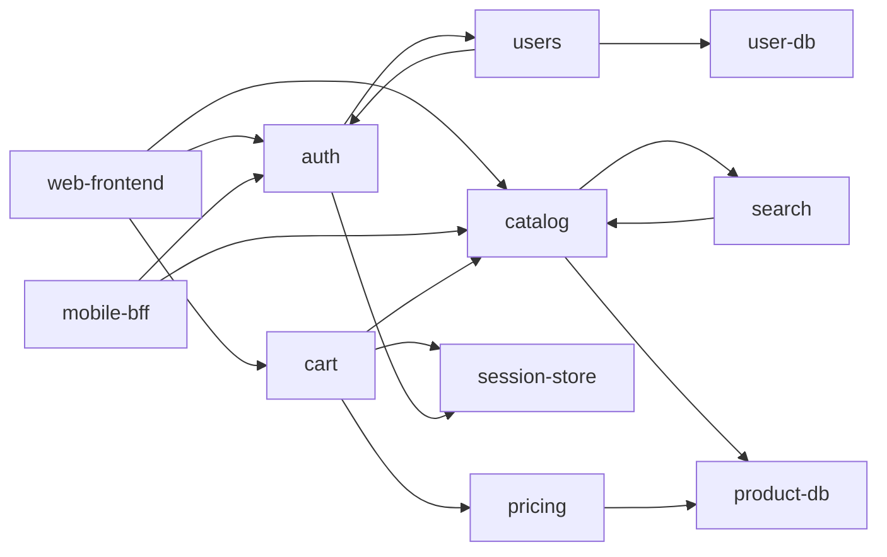

# 2.5 木・ヒープ・グラフ

> データベースのインデックス、ジョブの優先度付け、ビルドの実行順序、ネットワークの経路、SNS のつながり、マイクロサービスの依存関係 — これらはすべて「木」か「グラフ」です。この章では、二分探索木からデータベースの B+木、ヒープによる優先度付きキュー、そして BFS・トポロジカルソート・ダイクストラ法・Union-Find といったグラフアルゴリズムまでを、「現実のシステムのどこで動いているか」と結びつけて身につけます。

| 項目 | 内容 |
|---|---|
| 学習時間の目安 | 本文 5h ＋ 演習 8h |
| 前提となる章 | [2.4 基本データ構造](../04-basic-data-structures/README.md)、[2.3 計算量とアルゴリズム解析](../03-complexity/README.md)、[2.1 計算機科学のための離散数学](../01-discrete-math/README.md)（グラフの用語） |
| 演習 | [exercises/](exercises/)（Python） |
| キーワード | 二分探索木, 平衡木, 回転, B+木, ファンアウト, ヒープ, 優先度付きキュー, トライ木, 隣接リスト, BFS, DFS, トポロジカルソート, ダイクストラ法, 最小全域木, Union-Find, 強連結成分 |

## この章のゴール

- [ ] 木の用語を使って構造を説明し、二分探索木の探索・挿入・削除を実装できる
- [ ] 二分探索木が退化する理由と、平衡木が回転でバランスを保つ仕組みを説明できる
- [ ] データベースが B+木を使う理由を、ページの大きさとファンアウトの数値で説明できる
- [ ] ヒープで優先度付きキューを実装し、top-k・ヒープソート・スケジューラに応用できる
- [ ] グラフを適切に表現し、BFS・DFS・トポロジカルソート・ダイクストラ法・クラスカル法を実装できる
- [ ] サービスの依存関係グラフから循環や障害の影響範囲を分析し、設計の議論に使える

## なぜ学ぶのか

木とグラフのアルゴリズムは、意識しないうちに毎日使っています。

- **10 億行から 1 行を数回の読み込みで見つける**: 主要なリレーショナルデータベースの標準のインデックスは B+木です。後で計算するように、1 ページ 16KB の B+木なら、高さ 4 で数千億行を扱えます。インデックスの仕組みを知らないと、「インデックスを張ったのに遅い」「書き込みが遅くなった」理由を説明できません（[6.2 インデックスとクエリ処理](../../06-databases/02-indexes-and-query-processing/README.md)）。
- **依存関係は有向グラフで、実行順序はトポロジカルソートで決まる**: make や Bazel のようなビルドツール、パッケージマネージャ、CI のジョブ、Terraform のリソース作成は、すべて「依存関係のグラフ」を作り、矛盾のない順序を計算しています。循環があると順序が決まらないので、どのツールも循環を検出してエラーにします。Spring Boot は 2.6 から Bean の循環参照を既定で禁止しました。
- **ネットワークの経路はダイクストラ法で計算される**: インターネットの組織内ルーティングで広く使われる OSPF は、各ルーターがネットワーク全体の地図（グラフ）を持ち、ダイクストラ法で最短経路を計算します（[5.1 階層モデルとIP](../../05-networking/01-layers-and-ip/README.md)）。
- **障害の影響範囲はグラフの到達可能性で決まる**: マイクロサービスが増えると、認証・設定配布・セッションストアのような共有の依存先が止まったとき、どのサービスが巻き込まれるかを人間が把握しきれなくなります。依存関係をグラフとして扱えれば、「推移的に依存しているサービス全部」を機械的に計算できます（演習 5）。

## 1. 木と二分探索木

### 1.1 木の用語

**木（tree）** は、1 つの **根（root）** から枝分かれして広がり、閉路（ぐるっと回って元に戻る経路）を持たない構造です。グラフの言葉で言えば「連結で閉路のないグラフ」で、頂点が n 個なら辺はちょうど n − 1 本です。

```text
            /                 ← 根（root）。親を持たない唯一のノード
          /   \
       home    etc            ← home は / の子（child）、/ は home の親（parent）
       /  \      \
    alice  bob   hosts        ← 子を持たないノードは葉（leaf）
      |
   notes.txt                  ← 根からの辺の数が深さ（depth）。notes.txt の深さは 3
```

- **部分木（subtree）**: あるノードとその子孫すべてからなる木。
- **高さ（height）**: 根から最も深い葉までの長さ。この章と演習では、経路上の **ノード数** で数えます（空の木は 0、根だけなら 1）。辺の数で数える流儀もあるので、文献を読むときは定義を確認してください。
- **二分木（binary tree）**: 各ノードの子が高々 2 つ（左の子・右の子）の木。

ファイルシステムのディレクトリ、HTML の DOM、JSON のデータ、組織図、プログラムの構文木（[3.4 言語処理系を作る](../../03-programming-languages/04-build-an-interpreter/README.md)）は、すべて木です。

### 1.2 二分探索木

**二分探索木（binary search tree, BST）** は、すべてのノードについて「**左部分木のキー < ノードのキー < 右部分木のキー**」が成り立つ二分木です。

```text
              50
            /    \
          30      70
         /  \    /  \
       20   40  60   80
```

- **探索**: 根から始め、探すキーが小さければ左、大きければ右へ進みます。1 回の比較で探す範囲の片側を丸ごと捨てられるので、ソート済み配列の二分探索と同じ発想です。
- **挿入**: 探索と同じようにたどり、行き止まり（空の子）の位置に新しいノードを置きます。
- **中間順走査（in-order traversal）**: 「左部分木 → 自分 → 右部分木」の順に訪れると、キーが昇順に並びます。
- **削除**: 3 つの場合があります。葉ならそのまま消す。子が 1 つならその子で置き換える。子が 2 つなら、右部分木の最小ノード（**後続ノード**, successor）のキーを写し、後続ノードの方を消す（後続ノードは左の子を持たないので、前の 2 つの場合に帰着する）。

探索・挿入・削除はすべて O(木の高さ) です。ソート済み配列と比べると、二分探索の速さを保ったまま、挿入・削除も配列の要素をずらさずにできる点が利点です。さらに、ハッシュテーブルにはできない **範囲検索**（「30 以上 60 未満のキー全部」）や「ある値以上で最小のキー」も、木の形を利用して効率よく求められます（演習 1 の `range_keys`）。

### 1.3 退化 — 挿入順しだいで O(n) になる

BST の弱点は、**木の形が挿入の順序で決まる** ことです。昇順に挿入すると、毎回右の子にしか進まないので、木は一本道（連結リストと同じ形）になります。

```python
import random

def insert(root, key):
    """二分探索木に key を挿入し、根を返す（ノードは [key, left, right] のリスト）。"""
    node = [key, None, None]
    if root is None:
        return node
    cur = root
    while True:
        side = 1 if key < cur[0] else 2        # 小さければ左（1）、大きければ右（2）
        if cur[side] is None:
            cur[side] = node
            return root
        cur = cur[side]

def height(root):
    h, level = 0, [root] if root else []
    while level:                               # 1 段ずつ下へ数える
        h += 1
        level = [c for n in level for c in (n[1], n[2]) if c]
    return h

n = 1000
keys = list(range(n))
for label, order in [("昇順に挿入", keys), ("ランダムな順に挿入", random.Random(1).sample(keys, n))]:
    root = None
    for k in order:
        root = insert(root, k)
    print(f"{label}: 高さ {height(root)}")
```

```text
昇順に挿入: 高さ 1000
ランダムな順に挿入: 高さ 20
```

同じ 1,000 個のキーでも、高さは 1000 と 20 で 50 倍違います。ランダムな順なら高さは平均して O(log n) に収まりますが、実際のデータは「ID が単調に増える」「時刻順に届く」など、**整列済みに近いことが多い** のです。つまり素朴な BST は、実務で最もよくある入力で最悪になります。

## 2. 平衡木と B+木

### 2.1 平衡二分探索木と回転

挿入・削除のたびに形を整えて、高さを常に O(log n) に保つ木を **平衡二分探索木（balanced BST）** と呼びます。代表的なものが 2 つあります。

| | AVL 木 | 赤黒木（red-black tree） |
|---|---|---|
| バランスの条件 | どのノードでも、左右の部分木の高さの差が 1 以下 | 各ノードを赤か黒に塗り、「赤が連続しない」「どの葉までの経路でも黒の数が同じ」を保つ |
| 高さの上限 | 約 1.44 log₂ n | 2 log₂(n + 1) |
| 特徴 | より厳密に平衡するので検索が速い | 挿入・削除時の修正が少なく、更新が多い用途に向く |
| 使われている例 | — | Java の `TreeMap`、主要な C++ 標準ライブラリの `std::map`、Linux カーネルの各所（従来のプロセススケジューラ CFS など） |

どちらも、バランスが崩れたら **回転（rotation）** という操作で形を直します。回転は数本のポインタを付け替えるだけの O(1) の操作で、**中間順の並び（BST 条件）を保ったまま、部分木の高さを変えます**。

```text
右回転: 左の子 x を持ち上げ、y を右下に下ろす（左回転はこの逆）

          y                        x
         / \                      / \
        x   C      ──────→       A   y
       / \                          / \
      A   B                        B   C

どちらの形でも、中間順の並びは A < x < B < y < C のまま
（部分木 B は x の右から y の左へ付け替わるだけ）
```

たとえば AVL 木に 1, 2, 3 を順に挿入すると、1 → 2 → 3 の一本道になった時点で根の左右の高さの差が 2 になるので、1 を中心に左回転して、2 を根、1 と 3 を子にします。どの場合にどちらへ何回回転するかの規則は教科書に譲りますが、「**回転で高さを直し、1 回の操作あたり O(log n) を保証する**」という考え方を押さえてください。

平衡木の代わりに **スキップリスト（skip list）** を使う選択肢もあります。確率的に作った多段の連結リストで、期待値で O(log n) の検索ができ、実装が単純です。Redis のソート済み集合（sorted set）はスキップリストとハッシュテーブルを組み合わせて実装されています。

### 2.2 なぜデータベースは二分木を使わないのか

データがディスク（SSD を含む）にある場合、事情が一変します。ディスクは 1 バイト単位ではなく **ページ**（MySQL の InnoDB の既定は 16KB、PostgreSQL は 8KB）単位で読み書きし、1 回の読み込みはメモリへのアクセスより桁違いに遅いからです。10 億件を平衡二分木に入れると高さは約 30 で、1 件を探すのに最大 30 回のランダムなページ読み込みが必要になります。

そこで、**1 つのノードを 1 ページの大きさにし、その中にキーを何百個も詰める** のが **B木（B-tree）** です（Bayer と McCreight, 1970 年代初め）。1 つのノードから出る枝の数（**ファンアウト**, fanout）が数百〜千以上になるので、木の高さが劇的に低くなります。

現在のデータベースで主に使われるのは、その変種の **B+木（B+ tree）** です。

```text
                         [ 30 | 60 ]                        ← 内部ノード: キーと子ページへのポインタだけ
                       /      |      \
       [10 | 20] ⇄ [30 | 40 | 50] ⇄ [60 | 70 | 80]          ← 葉: キーと行データ（または行の位置）
                                                               隣の葉とつながっている
```

- **内部ノードはキーと子へのポインタだけ** を持つので、1 ページに入るキーの数（ファンアウト）が最大になります。
- **データは葉にだけ** あり、葉どうしが連結リストでつながっています。範囲検索（`WHERE created_at BETWEEN …`）は、始点の葉を 1 回探したら、あとは葉を横にたどるだけです。

ファンアウトを見積もってみましょう。

```python
import math

page = 16 * 1024                  # 1 ページ 16KiB（MySQL InnoDB の既定）
fanout = page // (8 + 6)          # 内部ノード: 8 バイトのキー + 6 バイトの子ページ番号
rows_per_leaf = page // 100       # 葉: 1 行 100 バイトの行を詰める
print(f"内部ノードのファンアウト: {fanout}、葉 1 ページの行数: {rows_per_leaf}")
for height in (1, 2, 3, 4):
    rows = fanout ** (height - 1) * rows_per_leaf
    print(f"高さ {height}: 約 {rows:,} 行")
print(f"二分木で 10 億件を探すときの高さ: 約 {math.ceil(math.log2(1e9))}")
```

```text
内部ノードのファンアウト: 1170、葉 1 ページの行数: 163
高さ 1: 約 163 行
高さ 2: 約 190,710 行
高さ 3: 約 223,130,700 行
高さ 4: 約 261,062,919,000 行
二分木で 10 億件を探すときの高さ: 約 30
```

（ページのヘッダや空き領域を無視した概算です。実際のファンアウトはキーの型や充填率で変わります。）

**高さ 3 で約 2 億行、高さ 4 で約 2,600 億行** です。しかも上の数段の内部ノードはアクセスが集中するので、ほぼ常にメモリ（バッファプール）に載っています。結果として、10 億行のテーブルからでも、1 行を探すのに必要なディスクの読み込みは 1〜2 回程度で済みます。これが、インデックスのある検索が速い理由です。

裏返すと、インデックスは **書き込みのたびに更新が必要な、もう 1 本の木** です。InnoDB のように表そのものも B+木で持つデータベースでは、セカンダリインデックスを 5 本張ったテーブルへの 1 行の INSERT で、6 本の木を更新します。インデックスの設計とクエリの実行計画は [6.2 インデックスとクエリ処理](../../06-databases/02-indexes-and-query-processing/README.md) で、書き込みに強い別の構造（LSM ツリー）は [6.4 ストレージエンジンと障害回復](../../06-databases/04-storage-and-recovery/README.md) で扱います。

## 3. ヒープと優先度付きキュー

### 3.1 優先度付きキュー

**優先度付きキュー（priority queue）** は、「最も優先度の高い（値の小さい）要素を取り出す」ことに特化したデータ構造です。必要な操作は「追加」と「最小の要素の取り出し」だけで、全体を整列しておく必要はありません。

| 用途 | 何を取り出すか |
|---|---|
| タイマー・ジョブスケジューラ | 実行時刻が最も早いタスク（Python の `asyncio` のイベントループや `sched` モジュールは、予約された処理を `heapq` で管理しています） |
| ダイクストラ法（7 章） | 暫定の距離が最も小さい頂点 |
| k-way マージ（[2.6](../06-algorithm-design/README.md)） | 複数の整列済みの列の先頭のうち最小のもの |
| top-k | 大量のデータのうち上位 k 件 |

### 3.2 二分ヒープ

**二分ヒープ（binary heap）** は、「どのノードも自分の子以下の値を持つ」（**ヒープ条件**、最小ヒープの場合）を満たす完全二分木です。ポインタを使わず、**配列にそのまま詰めて** 表せるのが最大の特徴です。

```text
配列:  [1, 3, 2, 7, 4, 5, 9]
添字:   0  1  2  3  4  5  6

木として見ると:        1            ← a[0]（常に最小）
                    /   \
                   3     2          ← a[1], a[2]
                  / \   / \
                 7   4 5   9        ← a[3] … a[6]

添字 i の子は 2i+1 と 2i+2、親は (i-1)//2
```

- **追加（push）**: 末尾に置き、親より小さい間は親と入れ替えて上へ移動する（**sift up**）。O(log n)。
- **最小の取り出し（pop）**: 根を取り出し、末尾の要素を根に移して、子より大きい間は **小さい方の子** と入れ替えて下へ移動する（**sift down**）。O(log n)。
- **参照（peek）**: `a[0]` を見るだけ。O(1)。

ヒープは「全体の順序」ではなく「親子の順序」だけを保つので、整列済み配列より更新が安く、それでいて最小値にはすぐ手が届きます。

### 3.3 ヒープの構築は O(n)

n 個の要素からヒープを作るとき、1 個ずつ push すると O(n log n) かかります。ところが、配列をそのまま木とみなし、**最後の内部ノードから根に向かって順に sift down する**（ボトムアップ構築、Floyd の方法）と O(n) で済みます。

直感的には、木のノードの半分は葉で移動がなく、1/4 は高さ 1 で最大 1 段、1/8 は最大 2 段……と、**ノードの多い下の方ほど移動距離が短い** からです。合計は `n × (1/4 + 2/8 + 3/16 + …) ≤ n` 段程度に収まります。演習 2 のテストでは、比較回数が 2n 以下であることを実際に数えて確かめます。

### 3.4 ヒープの応用

Python の `heapq` モジュールは、ふつうの `list` の上で最小ヒープを操作する関数群です。

```python
import heapq
import itertools

tasks = []                                   # (優先度, 通し番号, 名前) の最小ヒープ
seq = itertools.count()                      # 同じ優先度なら先に入れたものが先
for priority, name in [(3, "レポート生成"), (1, "障害アラート送信"), (2, "メール送信"), (1, "決済の確定")]:
    heapq.heappush(tasks, (priority, next(seq), name))
while tasks:
    priority, _, name = heapq.heappop(tasks)
    print(priority, name)

latencies_ms = [120, 35, 980, 42, 51, 1500, 38, 610, 47, 33]
print(heapq.nlargest(3, latencies_ms))       # 上位 k 件: O(n log k)
```

```text
1 障害アラート送信
1 決済の確定
2 メール送信
3 レポート生成
[1500, 980, 610]
```

タプルに **通し番号** をはさんでいるのは、優先度が同じときに到着順を保つためと、名前（や比較できないオブジェクト）どうしが比較されるのを防ぐためです。

- **top-k**: 全体を整列すると O(n log n) ですが、「サイズ k の最小ヒープを保ち、根より大きい要素が来たら入れ替える」と O(n log k) 時間・O(k) メモリで済みます。ログのストリームから「応答の遅い上位 100 件」を求めるような、全件をメモリに載せられない場面で有効です（演習 2）。
- **ヒープソート**: 配列をヒープにして最大値を末尾へ移すことを繰り返すと、追加のメモリなしで最悪 O(n log n) の整列ができます。安定ではなく、キャッシュ効率も悪いので、実務ではクイックソートやマージソートの方がよく使われます（[2.6](../06-algorithm-design/README.md)）。

## 4. トライ木

**トライ木（trie、接頭辞木）** は、文字列を 1 文字ずつの枝で表す木です。共通の接頭辞を持つ単語は、途中まで同じ道を共有します。

```text
"car", "card", "care", "cat", "dog" を格納したトライ木（● は単語の終わり）

        (根)
        /   \
       c     d
       |     |
       a     o
      / \    |
    ●r   ●t  ●g
    / \
  ●d   ●e
```

- 検索・挿入は、格納している単語の数ではなく **文字列の長さ** に比例する時間で終わります。
- 「接頭辞が `ca` の単語すべて」は、`c → a` とたどった先の部分木をたどるだけで列挙できます。子を文字の順にたどれば辞書順になり、必要な件数に達したら打ち切れます。これが **オートコンプリート（入力補完）** の基本形です（演習 3）。

素朴なトライ木はノードの数が多く、メモリを大量に使います。子が 1 つしかないノードの連なりを 1 本の枝にまとめた **基数木（radix tree、Patricia 木）** などの圧縮版がよく使われます。IP アドレスの経路表で「最も長く一致する接頭辞（longest prefix match）」を探す処理にもトライ木の仲間が使われており、Linux の IPv4 の経路表は fib_trie と呼ばれる圧縮されたトライ木で実装されています（[5.1 階層モデルとIP](../../05-networking/01-layers-and-ip/README.md)）。実際の検索サービスの入力補完では、候補を人気順に並べる必要があるため、各ノードに上位の候補をあらかじめ持たせるなどの工夫をします（[9.6 システム設計ケーススタディ](../../09-architecture/06-system-design-cases/README.md)）。

## 5. グラフの表現と探索

### 5.1 グラフの用語と表現

**グラフ（graph）** は、**頂点（vertex, node）** と、頂点どうしを結ぶ **辺（edge）** の集まりです。辺に向きがあれば **有向グラフ**、なければ **無向グラフ**、辺に重み（距離・コスト）があれば **重み付きグラフ** と呼びます。閉路のない有向グラフは **DAG（directed acyclic graph）** と呼ばれ、依存関係を表すのに使われます（6 章）。用語の定義は [2.1 計算機科学のための離散数学](../01-discrete-math/README.md) の 7 節にまとめてあります。

グラフをプログラムで表す方法は主に 2 つです。

```text
有向グラフ  A → B, A → C, B → C, C → D

隣接リスト（adjacency list）          隣接行列（adjacency matrix）
  A: [B, C]                              A  B  C  D
  B: [C]                             A [ 0  1  1  0 ]
  C: [D]                             B [ 0  0  1  0 ]
  D: []                              C [ 0  0  0  1 ]
                                     D [ 0  0  0  0 ]
```

| | 隣接リスト | 隣接行列 |
|---|---|---|
| メモリ | O(V + E) | O(V²) |
| 辺 u → v があるか | O(u の次数)（隣接先を集合で持てば O(1)） | **O(1)** |
| u から出る辺を列挙 | **O(u の次数)** | O(V) |
| 向いているグラフ | 疎（辺が少ない）。**実世界のグラフのほとんど** | 密（辺が多い）、小さい、行列演算を使う |

実世界のグラフは圧倒的に疎です。10 億人が平均 200 人とつながる SNS を考えると、隣接行列は 10¹⁸ ビット（約 125PB）必要ですが、隣接リストなら友人関係 2,000 億件分（1 件 8 バイトとして約 1.6TB）で済みます（いずれも概算）。Python では `dict` と `list` で隣接リストを作るのが基本で、この章の演習もその形を使います。

### 5.2 幅優先探索（BFS）と深さ優先探索（DFS）

グラフのすべての頂点を系統的に訪ねる方法が 2 つあります。

- **幅優先探索（breadth-first search, BFS）**: 始点から近い順に、同心円状に広げていく。**キュー** を使う。
- **深さ優先探索（depth-first search, DFS）**: 行けるところまで深く進み、行き止まったら戻る。**スタック**（または再帰）を使う。

```python
import sys
from collections import deque

graph = {                       # 有向グラフの隣接リスト
    "A": ["B", "C"],
    "B": ["D"],
    "C": ["D", "E"],
    "D": ["F"],
    "E": ["F"],
    "F": [],
}

def bfs(graph, start):
    """start からの距離（辺の数）を返す。キューで「近い順」に広げる。"""
    dist = {start: 0}
    queue = deque([start])
    while queue:
        u = queue.popleft()
        for v in graph[u]:
            if v not in dist:           # 初めて見つけたときの距離が最短
                dist[v] = dist[u] + 1
                queue.append(v)
    return dist

def dfs(graph, start):
    """訪問順を返す。スタックで「行けるところまで深く」進む（反復版）。"""
    order, seen, stack = [], set(), [start]
    while stack:
        u = stack.pop()
        if u in seen:
            continue
        seen.add(u)
        order.append(u)
        for v in reversed(graph[u]):    # 隣接リストの先頭から訪ねるために逆順に積む
            if v not in seen:
                stack.append(v)
    return order

print(bfs(graph, "A"))
print(dfs(graph, "A"))

def dfs_recursive(graph, u, seen):
    seen.add(u)
    for v in graph[u]:
        if v not in seen:
            dfs_recursive(graph, v, seen)

chain = {i: [i + 1] for i in range(5000)}   # 5000 頂点が一列につながったグラフ
chain[5000] = []
print(sys.getrecursionlimit())
try:
    dfs_recursive(chain, 0, set())
except RecursionError as e:
    print("RecursionError:", e)
print(len(dfs(chain, 0)))
```

```text
{'A': 0, 'B': 1, 'C': 1, 'D': 2, 'E': 2, 'F': 3}
['A', 'B', 'D', 'F', 'C', 'E']
1000
RecursionError: maximum recursion depth exceeded while calling a Python object
5001
```

BFS は始点から近い順に頂点を発見するので、**重みのないグラフの最短経路**（辺の数が最小の経路）がそのまま求まります。どの頂点から発見したかを記録しておけば、経路も復元できます（演習 4a）。DFS は、到達可能性の判定、連結成分の分解、閉路の検出、トポロジカルソートなど、グラフの構造を調べる多くのアルゴリズムの土台です。どちらも各頂点と各辺を 1 回ずつ調べるので O(V + E) です。

実務上の注意として、Python の再帰の深さには上限（既定 1000）があります。再帰で書いた DFS は、深さ 1000 を超える一本道で `RecursionError` になります。依存関係やリンクのたどり方のように、深さを事前に制限できないグラフでは、**明示的なスタックを使った反復版** で書きましょう（演習でも反復版を求めるテストがあります）。

## 6. 依存関係のグラフ — トポロジカルソートと循環

### 6.1 トポロジカルソート

DAG の頂点を、「**すべての辺 u → v について u が v より前に来る**」ように一列に並べることを **トポロジカルソート（topological sort）** と呼びます。「u は v の前提である」という関係を辺で表せば、並べた順が「矛盾のない実行順序」になります。順序は一般に 1 通りではありません。

代表的なアルゴリズムは 2 つあり、どちらも O(V + E) です。

- **Kahn のアルゴリズム**: 入次数（入ってくる辺の数）が 0 の頂点、つまり「前提がすべて満たされた」頂点を取り出して出力し、その頂点から出る辺を消す、を繰り返す。最後に出力できない頂点が残れば、それらは循環に含まれるか、循環の先にある（演習 4b）。
- **DFS による方法**: DFS で各頂点を「その先をすべて調べ終えた順（帰りがけ順）」に記録し、その逆順を出力する。調べている途中の頂点に再び出会ったら、それは循環です。

Python 3.9 以降では、標準ライブラリの `graphlib` で使えます。

```python
from graphlib import CycleError, TopologicalSorter

# キー: タスク、値: そのタスクの前に終わっていなければならないタスク（前提）
build = {
    "app": ["lib_core", "lib_http"],
    "lib_http": ["lib_core"],
    "tests": ["app"],
    "docs": [],
}
print(list(TopologicalSorter(build).static_order()))

build["lib_core"] = ["tests"]                # うっかり循環を作ってしまった
try:
    list(TopologicalSorter(build).static_order())
except CycleError as e:
    print("循環:", e.args[1])
```

```text
['lib_core', 'docs', 'lib_http', 'app', 'tests']
循環: ['app', 'tests', 'lib_core', 'app']
```

`graphlib` は「前提の一覧」を渡す形で、演習の `topological_sort`（「u の後に来る頂点」を渡す形）とは辺の向きの書き方が逆である点に注意してください。**どちらの向きで辺を書いているのか** を取り違えるのは、グラフのコードで最もよくあるバグの 1 つです。

循環を報告するときは、「循環があります」だけでなく **循環の経路そのもの** を示すことが重要です。依存関係が数百あるシステムで、利用者が自力で循環を探すのは困難だからです。`graphlib` も演習 4b も、経路を返すようにしています。

トポロジカルソートは次のような場面で動いています。

- ビルドツール（make、Bazel など）: ファイルやターゲットの依存関係から、ビルドする順序と、並列に実行できる組を決める
- パッケージマネージャ: インストールする順序を決める（どのバージョンを選ぶかという「依存関係の解決」は別の、はるかに難しい問題です。[2.7](../07-theory-of-computation/README.md) で扱います）
- CI/CD のパイプライン、ワークフローエンジン（Apache Airflow の DAG など）、Terraform のリソース作成・削除の順序
- データベースのマイグレーション、表計算ソフトのセルの再計算

### 6.2 強連結成分 — 循環をまとめて見る

有向グラフで、互いに行き来できる頂点の極大な集まりを **強連結成分（strongly connected component, SCC）** と呼びます。サービス A が B を呼び、B が C を呼び、C が A を呼ぶなら、A・B・C は 1 つの強連結成分です。

強連結成分を 1 つの頂点に縮めると、元のグラフは必ず DAG になります。つまり、強連結成分を求めると「**どこに循環があり、循環どうしがどう依存しているか**」が一目で分かります。Tarjan のアルゴリズムや Kosaraju のアルゴリズムで O(V + E) で求まります（演習 5 の `dependency_cycles`）。

### 6.3 マイクロサービスの依存関係グラフ

演習 5 で扱うサービス群を図にしてみます（矢印は「呼び出している＝依存している」）。



このグラフから、次のような設計上の問いに機械的に答えられます。

- **循環はどこか**: `catalog ⇄ search` と `auth ⇄ users` は強連結成分です。循環依存があると、どちらを先にデプロイ・起動すべきかが決まらず、障害時には互いの再試行が増幅し合うことがあります。
- **ある依存先が止まったら、どこまで影響するか（blast radius）**: 辺を逆向きにたどって到達できるサービスすべてです。演習 5 で計算すると、`product-db` の停止は 6 サービスに、`session-store` の停止は 5 サービスに波及します。図を眺めただけでは、共有のセッションストアがデータベースと同じくらい重要な単一障害点であることに気づきにくいはずです。

依存関係のグラフは、分散トレーシング（[10.4 オブザーバビリティ](../../10-cloud-and-sre/04-observability/README.md)）のデータから自動的に作ることもできます。障害訓練や設計レビューでは、このような計算結果をもとに「影響範囲の大きい依存先から冗長化する」「循環を断ち切る」といった優先順位を決めます。

## 7. 最短経路

### 7.1 ダイクストラ法

重み付きグラフで、始点から各頂点への最短距離を求める最も有名な方法が **ダイクストラ法（Dijkstra's algorithm）** です（1959 年）。辺の重みが **非負** であることが前提です。

1. 始点の距離を 0、他を ∞ とする。
2. まだ確定していない頂点のうち、暫定の距離が最小の頂点 u を選んで **確定** する。
3. u から出る各辺 u → v について、`dist[u] + w(u, v) < dist[v]` なら dist[v] を更新する（**緩和**, relaxation）。
4. すべての頂点が確定するまで 2・3 を繰り返す。

「未確定の中で最小の頂点」を選ぶのに優先度付きキュー（ヒープ）を使うと、全体で O((V + E) log V) になります。Python の `heapq` には「ヒープ内の値を減らす」操作がないので、距離が更新されるたびに新しいエントリを追加し、取り出したときにすでに確定済みなら読み捨てる（**遅延削除**）のが定番の実装です（演習 4c）。

なぜ最小の頂点を確定してよいのでしょうか。u より遠回りして u に着く経路は、途中で「u 以上の距離の頂点」を必ず通ります。**重みが非負なら**、そこから先で距離が減ることはないので、u の距離はこれ以上短くなりません。これは各段階で最善の選択を確定させる **貪欲法**（[2.6](../06-algorithm-design/README.md)）の一例です。

### 7.2 負の重みで壊れる例

重みが負の辺があると、この論証が崩れます。

```text
S → A (重み 2)、S → B (重み 5)、B → A (重み −4)

ダイクストラ法の動き:
  S を確定（0）。A = 2、B = 5 に更新
  最小の A を確定（2）  ← ここで A の距離を 2 と確定してしまう
  B を確定（5）。B → A で 5 + (−4) = 1 < 2 だが、A はすでに確定済み
結果: A = 2（誤り）。正しくは S → B → A の 1
```

負の重みがありうるなら **ベルマン–フォード法（Bellman–Ford algorithm）** を使います。すべての辺の緩和を V − 1 回繰り返す単純な方法で O(VE) かかりますが、負の重みを扱えます。さらに V 回目にもまだ更新が起きれば、**負の閉路**（1 周するたびに距離が減り続ける閉路）が存在すると分かります。為替レートの対数をとって辺の重みにすると、負の閉路が「一周すると得をする為替の組み合わせ（裁定取引の機会）」に対応する、という応用が知られています。

### 7.3 ネットワークの経路制御と地図

- **OSPF や IS-IS**（リンクステート型のルーティングプロトコル）: 各ルーターがネットワーク全体のトポロジーを共有し、自分を始点にダイクストラ法で最短経路木を計算します。
- **RIP**（距離ベクトル型）: 隣のルーターから届く距離の情報で自分の表を更新していく方式で、ベルマン–フォード法を分散して実行しているとみなせます。
- **BGP**（インターネットの組織間の経路制御）: 最短経路ではなく、組織の方針（どの経路を好み、どこに広報するか）で経路を選ぶ経路ベクトル型です。

これらは [5.1 階層モデルとIP](../../05-networking/01-layers-and-ip/README.md) で詳しく扱います。道路網のような巨大なグラフでは、ダイクストラ法をそのまま使うと遅すぎるため、目的地の方向を優先して探す A* 探索や、事前計算で近道を作っておく contraction hierarchies などの手法が使われます（オープンソースの経路探索エンジン OSRM は後者を採用しています）。

## 8. 最小全域木と Union-Find

### 8.1 最小全域木

無向の重み付きグラフで、**すべての頂点をつなぐ辺の集まりのうち、重みの合計が最小のもの** を **最小全域木（minimum spanning tree, MST）** と呼びます。「全拠点をつなぐネットワーク回線の総コストを最小にする」「似たデータどうしをつないでクラスタに分ける」といった問題の基本形です。

**クラスカル法（Kruskal's algorithm）** は、辺を重みの小さい順に見て、「**すでにつながっている 2 頂点を結ぶ辺（閉路を作る辺）でなければ採用する**」を繰り返す貪欲法です。辺の整列が O(E log E) で、全体の計算量もこれで決まります。

```text
辺を軽い順に: A-C(1) B-C(2) D-E(3) A-B(4) B-D(5) C-D(8) C-E(9)

A-C(1) 採用      {A,C} {B} {D} {E}
B-C(2) 採用      {A,B,C} {D} {E}
D-E(3) 採用      {A,B,C} {D,E}
A-B(4) 不採用    A と B はすでに同じ集合（採用すると閉路 A-B-C-A ができる）
B-D(5) 採用      {A,B,C,D,E}  ← 全頂点がつながったので終了（辺は 5 - 1 = 4 本）
合計: 1 + 2 + 3 + 5 = 11
```

もう 1 つの代表的な方法、**プリム法（Prim's algorithm）** は、1 つの頂点から始めて、「今の木とまだ木に入っていない頂点を結ぶ最も軽い辺」を追加していきます。ダイクストラ法とほぼ同じ形で、ヒープを使って実装できます。どちらも「ある切り方で 2 つに分けたとき、両側をつなぐ最も軽い辺は、ある最小全域木に必ず含まれる」（カット性）という性質で正しさが示されます。

### 8.2 Union-Find

クラスカル法の「2 頂点がすでに同じ集合か」の判定と「2 つの集合の併合」を高速に行うのが **Union-Find（素集合データ構造, disjoint-set）** です。各集合を木で表し、根を集合の代表とします。

- `find(x)`: 親をたどって根（代表）を返す。
- `union(a, b)`: a と b の根を求め、一方の根をもう一方の根の子にする。

そのままでは木が細長く伸びて `find` が O(n) になりますが、次の 2 つの工夫を組み合わせると、1 回あたりの計算量が **ほぼ定数**（逆アッカーマン関数 α(n)。現実的な n では 4 以下）になることが知られています（Tarjan, 1975）。

- **経路圧縮（path compression）**: `find` でたどったノードを、根に直接つなぎ直す。
- **サイズ（またはランク）による併合（union by size / rank）**: 小さい木を大きい木の下につなぐ。木の高さが O(log n) に抑えられる。

Union-Find は、ネットワークの接続性の判定、画像の領域分割、「同じ人物のアカウントをまとめる（名寄せ）」ような、**要素を次々に同一視していく** 処理で活躍します。演習 4d で、どちらかの工夫を省くとテストの速さの確認に失敗することを体験してください。

### 8.3 実世界のグラフについて

最後に、実務で出会うグラフの特徴をまとめておきます。

- **ソーシャルグラフ**: 頂点の次数が極端に偏ります（ほとんどの人のつながりは少なく、ごく一部の有名人が膨大なフォロワーを持つ）。有名人への書き込みや読み込みが 1 つのサーバーに集中する「ホットスポット」は、データの分割（[7.3 パーティショニング](../../07-distributed-systems/03-partitioning/README.md)）で必ず問題になります。Facebook は、ソーシャルグラフを「オブジェクト」と「関連（association）」として保存する専用のデータストア TAO の設計を論文で公開しています（Bronson ら, USENIX ATC 2013）。
- **Web のリンク構造**: Google の創業者による PageRank（Brin と Page, 1998）は、リンクのグラフの上の「ランダムな移動」で各ページの重要度を計算しました。
- **グラフデータベース**: 関係のたどり方そのものが問い合わせの中心なら、グラフ専用のデータベースを使う選択肢もあります（[6.5 データモデルの多様性とデータストアの選定](../../06-databases/05-beyond-relational/README.md)）。

## よくある落とし穴

1. **整列済みに近いデータを素朴な二分探索木に入れる**。ID や時刻のように単調に増えるキーで、木が一本道になり O(n) に退化する。標準ライブラリの平衡木（Java の `TreeMap` など）やデータベースのインデックスを使い、自作の BST を本番で使わない。
2. **インデックスはタダだと思う**。B+木のインデックスは検索を速くする代わりに、書き込みのたびに更新が必要で、ディスクとメモリも消費する。「読み込みのパターン」と「書き込みの量」の両方から本数を決める。
3. **再帰の DFS を本番のデータに使う**。Python の再帰の上限（既定 1000）や、他言語のスタックの大きさで落ちる。深さが事前に分からないグラフは反復で書く。
4. **辺の向きを取り違える**。「A は B に依存する」を A → B と書くか B → A と書くかで、トポロジカル順序も影響範囲も逆になる。関数の docstring やデータの定義に、辺の意味を必ず書く。
5. **訪問済みの印を付けるタイミングを誤る**。BFS でキューから「取り出したとき」に印を付けると、同じ頂点を何度もキューに入れてしまい、密なグラフで計算量が悪化する。キューに「入れたとき」に印を付ける。
6. **負の重みがあるのにダイクストラ法を使う**。エラーにならずに誤った答えを返すので気づきにくい。重みの定義域をチェックし、負がありうるならベルマン–フォード法を使う。
7. **heapq に比較できない要素を入れる**。優先度が同じとき、タプルの次の要素（辞書やオブジェクト）どうしが比較されて `TypeError` になる。`(優先度, 通し番号, 要素)` の形にする。
8. **循環を「エラーです」とだけ報告する**。依存関係が大きいと、利用者は循環を自力で見つけられない。循環の経路そのものを出力する。

## CTOの視点

1. **依存関係グラフを「資産」として管理する**。サービス・データストア・外部 SaaS の依存関係を、トレーシングや構成管理から自動生成したグラフとして持っている組織は、障害時に影響範囲を数分で特定でき、設計レビューでは循環や単一障害点を数字で議論できます。「このサービスが止まったら何が止まるか、一覧を出せますか」と問い、出せないなら、それ自体を信頼性のリスクとして扱いましょう（[10.3 信頼性設計とSLO](../../10-cloud-and-sre/03-reliability-engineering/README.md)）。
2. **循環依存は技術的負債の中でも利子が高い**。サービス間やモジュール間の循環は、独立したデプロイ・起動順序・障害の切り分けをすべて難しくします。新しい依存関係の追加を CI で検査し、循環を作る変更を機械的に止める仕組みは、少ないコストで長期的な効果があります。
3. **データベースのインデックスは「読み込みの速さ」と「書き込みのコスト」の取引**。インデックスの追加は、ストレージ費用・書き込みのレイテンシ・レプリケーションの遅延に効きます。「このインデックスはどのクエリのためで、書き込みがどれだけ増えるか」を説明できない追加は、後で誰も消せないインデックスとして積み上がります。
4. **グラフ問題は「規模」で解き方が変わる**。1 万頂点なら 1 台のメモリで一瞬で解ける問題が、100 億辺では分散処理やグラフ専用の基盤が必要になります。「今の規模」と「3 年後の規模」を見積もったうえで、汎用のデータベース・グラフデータベース・バッチでの計算のどれを選ぶかを判断しましょう。
5. **面接では「どのアルゴリズムを知っているか」より「問題をグラフとして捉えられるか」を見る**。ダイクストラ法の実装を暗記している人より、「このワークフローの順序付けはトポロジカルソートだ」「この名寄せは Union-Find だ」と問題を既知の形に落とし込める人の方が、実務で価値を生みます。

## 演習

演習コードは [exercises/trees.py](exercises/trees.py)（演習 1〜3）と [exercises/graphs.py](exercises/graphs.py)（演習 4・5）にあります。docstring に仕様が書いてあるので、`raise NotImplementedError(...)` を実装に置き換えてください。解答例は [solutions/](solutions/) にありますが、まずは自力で取り組みましょう。

```bash
python3 tools/check.py 2.5        # リポジトリのルートで実行。合格数と失敗したテストが表示される
python3 tools/check.py -v 2.5     # 詳しい出力
```

| # | 難易度 | 内容 | 関数・クラス |
|---|---|---|---|
| 1 | ★★☆ | 二分探索木（挿入・探索・3 つの場合の削除・中間順走査・高さ・範囲検索） | `trees.BST` |
| 2 | ★★☆ | 配列による最小ヒープ（O(n) の構築）と、サイズ k のヒープによる top-k | `trees.MinHeap`, `trees.top_k` |
| 3 | ★★☆ | トライ木によるオートコンプリート（辞書順・件数制限） | `trees.Trie` |
| 4 | ★★★ | BFS による最短経路、循環の経路を報告するトポロジカルソート、経路を復元するダイクストラ法、Union-Find とクラスカル法 | `graphs.bfs_shortest_path`, `topological_sort`, `dijkstra`, `shortest_path`, `UnionFind`, `kruskal_mst` |
| 5 | ★★☆ | マイクロサービスの依存グラフ: 循環（強連結成分）の検出、障害の影響範囲、影響の大きさの順位付け | `graphs.dependency_cycles`, `blast_radius`, `rank_by_blast_radius` |
| 6 | ★★☆ | 記述: B+木のインデックスの見積もり（下記） | — |

テストの一部は、比較回数（ヒープの構築・top-k）や処理時間の上限（Union-Find、各グラフの探索）で計算量を確かめます。無限ループや指数時間になっている実装は、5 秒で打ち切られて失敗します。

### 演習 6（記述）: B+木のインデックスの見積もり

あなたのチームは、注文テーブル（現在 20 億行、1 日 500 万行ずつ増加）に次のインデックスを持つ MySQL（InnoDB、ページ 16KB）を運用しています。

- 主キー `id BIGINT`（クラスタ化インデックス。葉に行データが入る。1 行は平均 400 バイト）
- セカンダリインデックス `(user_id BIGINT, created_at DATETIME)`（葉には主キーの値が入る）

次の問いに、計算の過程を示して答えてください（ページのヘッダ・充填率は無視してよい。子ページへのポインタは 6 バイト、`DATETIME` は 8 バイトとする）。

1. 主キーのインデックスの内部ノードのファンアウトと、葉 1 ページあたりの行数を見積もり、現在の木の高さを求めてください。
2. 「あるユーザーの直近 30 日の注文」を取得するクエリで、セカンダリインデックスと主キーのインデックスをそれぞれ何回たどることになるか、ユーザーの注文が 30 件のときについて説明してください。
3. プロダクトマネージャーから「検索が速くなるなら、よく使う列に全部インデックスを張ればいい」と提案されました。技術的な観点から、どう返答しますか。

<details>
<summary>解答例</summary>

1. 内部ノード: 1 エントリ = キー 8 バイト + ポインタ 6 バイト = 14 バイトなので、ファンアウトは 16384 ÷ 14 ≈ 1170。葉: 16384 ÷ 400 ≈ 40 行。高さ h の木に入る行数は約 1170^(h−1) × 40 なので、高さ 3 で約 5,500 万行、高さ 4 で約 640 億行。20 億行は **高さ 4** に収まる（あと 10 年以上、高さ 4 のまま増やせる）。上位 2〜3 段はバッファプールに載っていることが多いので、実際のディスク読み込みは 1 件あたり 1〜2 回程度になる。
2. セカンダリインデックスのエントリは 8 + 8 + 8（主キー）= 24 バイトで、葉 1 ページに約 680 エントリ入る。`(user_id, created_at)` の複合インデックスなので、「user_id が一致し created_at が 30 日以内」のエントリは葉の上で連続しており、根から 1 回たどって始点の葉に着いたら、葉を横に読むだけで 30 件の主キーが得られる（多くの場合 1 ページに収まる）。その後、主キーのインデックスを **30 回**（1 件ずつ）たどって行データを読む。この「主キーで引き直す」コストを避けるため、必要な列をすべてインデックスに含める（カバリングインデックス）設計もある（[6.2](../../06-databases/02-indexes-and-query-processing/README.md)）。
3. 返答の例: 「インデックスは検索を速くしますが、1 本ごとに挿入・更新のたびに更新する木が 1 本増え、書き込みのレイテンシ・ディスク容量・バックアップとレプリケーションの量が増えます。1 日 500 万行の書き込みがあるこのテーブルでは影響が大きいので、実際に遅いクエリを実行計画で特定し、そのクエリに必要な複合インデックスだけを追加しましょう。使われていないインデックスは定期的に棚卸しします。」

採点の観点:

- 1 で「ファンアウトが 1000 前後になるので、数十億行でも高さ 4 程度」という結論を、計算で導けていれば合格ラインです。
- 2 で「複合インデックスの葉が連続している」「主キーでの引き直しが件数分発生する」の両方を説明でき、3 で書き込み側のコストを具体的に挙げられれば、データベースの設計レビューをリードできる水準です。

</details>

## 理解度チェック

**Q1. 二分探索木にキーを昇順に挿入すると、なぜ探索が遅くなるのですか。平衡二分探索木はこれをどう防いでいますか。**

<details>
<summary>解答</summary>

昇順に挿入すると、新しいキーは常に既存のすべてのキーより大きいので、毎回右の子へ進み、木は一本道（高さ n）になります。探索・挿入・削除は O(高さ) なので O(n) に退化します。

平衡二分探索木（AVL 木・赤黒木など）は、挿入・削除のたびにバランスの条件（AVL 木なら左右の高さの差が 1 以下）を検査し、崩れていれば **回転** で形を直します。回転は中間順の並び（BST 条件）を保ったまま部分木の高さを変える O(1) の操作なので、高さを常に O(log n) に保てます。

</details>

**Q2. データベースのインデックスに、二分探索木ではなく B+木が使われる理由を説明してください。**

<details>
<summary>解答</summary>

ディスクはページ（例: 16KB）単位で読み書きし、1 回の読み込みのコストが大きいので、「木をたどるときに読むページ数」を減らすことが最も重要です。二分木では 10 億件で高さ約 30、つまり最大 30 回のページ読み込みが必要です。B+木は 1 ノードを 1 ページにして数百〜千以上のキーを詰めるため、ファンアウトが大きく、10 億件でも高さ 3〜4 に収まります。さらに上位の段はメモリに載っていることが多いため、実際のディスク読み込みはごくわずかです。

また、B+木はデータを葉にだけ持ち、葉どうしを連結しているので、範囲検索が「始点の葉を探して横にたどる」だけで効率よく行えます。

</details>

**Q3. n 個の要素からヒープを作るとき、1 個ずつ push すると O(n log n) なのに、ボトムアップ構築なら O(n) で済むのはなぜですか。**

<details>
<summary>解答</summary>

ボトムアップ構築では、各ノードを「そのノードの高さ」の分だけ sift down します。完全二分木では、高さ 0（葉）のノードが約 n/2 個、高さ 1 が約 n/4 個、高さ 2 が約 n/8 個……と、高さが大きいノードほど少なくなります。移動の総量は `n/4 × 1 + n/8 × 2 + n/16 × 3 + … ≤ n` となり O(n) です。

1 個ずつ push する方法では、多くの要素（下の方の段に入る要素）が根の近くまで上がる可能性があり、最悪で各要素 O(log n) 段、合計 O(n log n) になります。

</details>

**Q4. BFS で重みなしグラフの最短経路が求まる理由を説明してください。また、訪問済みの印を「キューから取り出したとき」ではなく「キューに入れたとき」に付けるのはなぜですか。**

<details>
<summary>解答</summary>

BFS はキュー（先入れ先出し）を使うので、始点からの距離が 0 の頂点、距離 1 の頂点、距離 2 の頂点……の順に処理します。距離 d の頂点を処理している間に初めて見つかった頂点の距離は d + 1 で、それより短い経路があるならもっと前に見つかっているはずなので、**初めて見つけたときの距離が最短** です。

印を「取り出したとき」に付けると、まだ取り出されていない頂点を、別の頂点から見つけるたびに何度もキューに入れてしまいます。結果は正しくても、キューの長さが辺の数に比例して増え、無駄な処理が増えます。「入れたとき」に印を付ければ、各頂点はちょうど 1 回だけキューに入り、全体が O(V + E) になります。

</details>

**Q5. ダイクストラ法が負の重みの辺を含むグラフで誤った答えを返す理由を、具体例で説明してください。**

<details>
<summary>解答</summary>

ダイクストラ法は「未確定の中で最小の距離の頂点は、これ以上短くならない」として確定させます。これは「遠回りすると距離は増えることはあっても減らない」、つまり重みが非負であることに依存しています。

例: S → A（2）、S → B（5）、B → A（−4）。ダイクストラ法は、A の暫定距離 2 が最小なので A を確定しますが、実際には S → B → A の距離 5 + (−4) = 1 の方が短い経路があります。B を処理したときにはすでに A は確定済みなので、誤った距離 2 が答えになります。負の重みがありうるならベルマン–フォード法を使います。

</details>

**Q6. クラスカル法で Union-Find を使う理由と、経路圧縮とサイズによる併合がそれぞれ何を防いでいるかを説明してください。**

<details>
<summary>解答</summary>

クラスカル法は、辺を軽い順に見て「両端がまだ別の連結成分にあるなら採用する」を繰り返します。そのために必要な「2 頂点が同じ成分か（find）」と「2 つの成分をつなぐ（union）」を、Union-Find はほぼ定数時間で行えます。毎回 BFS で連結性を調べると O(V) かかり、全体が O(EV) になってしまいます。

- サイズによる併合: 小さい木を大きい木の下につなぐので、木の高さが O(log n) を超えず、細長い鎖ができるのを防ぎます。
- 経路圧縮: find でたどったノードを根に直接つなぎ直すので、同じ経路を二度たどる無駄を防ぎます。

両方を組み合わせると、1 回あたりの計算量は逆アッカーマン関数 α(n) となり、実用上は定数とみなせます。

</details>

**Q7. 次の依存関係（矢印は「呼び出している」）で、`db` が停止したときに影響を受けるサービスをすべて挙げ、求め方を説明してください。`web → api`、`api → db`、`api → cache`、`batch → db`、`admin → api`、`report → batch`**

<details>
<summary>解答</summary>

影響を受けるのは、`db` に直接または間接に依存しているサービスです。辺を逆向きにしたグラフ（「誰に呼ばれているか」）で `db` から BFS/DFS すると、`db` ← `api`、`batch`、`api` ← `web`、`admin`、`batch` ← `report` とたどれるので、**api・batch・web・admin・report の 5 つ** です。`cache` は `db` に依存していないので影響を受けません。

依存関係のグラフでは「影響範囲 = 逆向きのグラフでの到達可能な頂点の集合」であり、O(V + E) で計算できます。

</details>

## さらに学ぶために

- Thomas H. Cormen ほか "Introduction to Algorithms"（邦訳『アルゴリズムイントロダクション』近代科学社）— 二分探索木・赤黒木・B木・ヒープ・グラフアルゴリズム（BFS・DFS・強連結成分・最小全域木・最短経路）を厳密な証明付きで解説した定番の教科書。
- Robert Sedgewick, Kevin Wayne "Algorithms, 4th Edition" と、著者による Coursera の無料講義 "Algorithms, Part I / Part II" — 平衡木（左傾赤黒木）とグラフアルゴリズムを、図と Java のコードで直感的に学べる。
- Douglas Comer "The Ubiquitous B-Tree"（ACM Computing Surveys, 1979）— B木とその変種がなぜデータベースやファイルシステムの標準になったのかを概観する古典的なサーベイ。
- Alex Petrov "Database Internals"（O'Reilly, 2019）— B木の実装（ページの分割・併合、並行制御）を実際のデータベースの設計と結びつけて解説。第 6 部の予習にもなる。
- Python ドキュメント「heapq — ヒープキューアルゴリズム」「graphlib — グラフ構造を操作する機能」— 標準ライブラリで使えるヒープとトポロジカルソートの仕様と、優先度付きキューの実装上の注意（同順位の扱いなど）が書かれている。
- Nathan Bronson ほか "TAO: Facebook's Distributed Data Store for the Social Graph"（USENIX ATC 2013）— 巨大なソーシャルグラフを実際にどう保存・キャッシュしているかを知ることができる論文。

## まとめ

- 木は閉路のない連結な構造で、二分探索木は「左 < 自分 < 右」によって探索・挿入・削除を O(高さ) で行う。範囲検索ができるのがハッシュテーブルとの大きな違い。
- 素朴な BST は整列済みのデータで高さ n に退化する。AVL 木・赤黒木は回転で高さを O(log n) に保つ。
- ディスク上のデータには、1 ノード = 1 ページで数百〜千以上に枝分かれする B+木を使う。10 億行でも高さ 3〜4 で、範囲検索は葉を横にたどるだけで済む。インデックスは書き込みのコストとの取引である。
- 二分ヒープは配列で表した完全二分木で、優先度付きキュー（スケジューラ・ダイクストラ法・k-way マージ・top-k）の基盤になる。ボトムアップ構築は O(n)。
- トライ木は接頭辞の検索（オートコンプリート・IP の経路表）に向く。
- 実世界のグラフは疎なので隣接リストで表す。BFS は重みなしの最短経路、DFS は構造の解析の土台で、どちらも O(V + E)。深いグラフでは反復で書く。
- 依存関係は DAG で表し、トポロジカルソートで実行順序を決める。循環は経路つきで報告し、強連結成分でまとめて把握する。影響範囲は逆向きグラフの到達可能性で求まる。
- 最短経路はダイクストラ法（非負の重み）とベルマン–フォード法（負の重み・負の閉路の検出）、最小全域木はクラスカル法と Union-Find（経路圧縮 + サイズによる併合）で解く。
