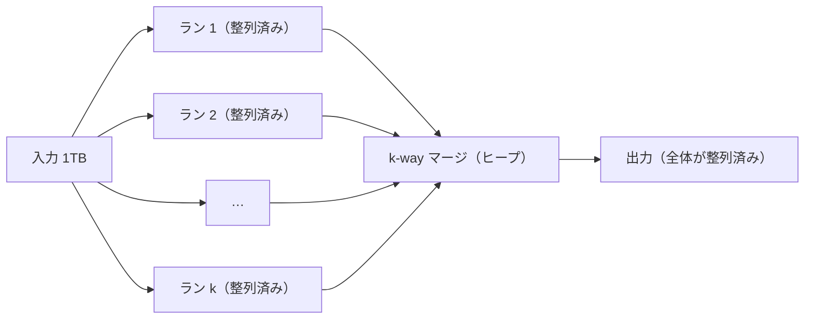

# 2.6 アルゴリズム設計技法

> 新しい問題に出会ったとき、ゼロから解き方をひねり出す必要はありません。「半分に分けて解く」「その場で最善を選ぶ」「小さな問題の答えを表に覚える」「見込みのない枝を切って探す」「乱数に任せる」— アルゴリズムの設計には、何十年も使われてきた定石があります。この章では、ソートと二分探索を題材に定石の使い方を学び、`diff` や外部ソートのような実務の道具がどの定石でできているかを見ていきます。

| 項目 | 内容 |
|---|---|
| 学習時間の目安 | 本文 5h ＋ 演習 9h |
| 前提となる章 | [2.3 計算量とアルゴリズム解析](../03-complexity/README.md)、[2.5 木・ヒープ・グラフ](../05-trees-heaps-graphs/README.md) |
| 演習 | [exercises/](exercises/)（Python） |
| キーワード | 安定ソート, マージソート, クイックソート, Timsort, 比較ソートの下界, 基数ソート, 二分探索, 分割統治, 貪欲法, 交換論法, 動的計画法, 編集距離, LCS, バックトラッキング, 乱択アルゴリズム, 外部ソート |

## この章のゴール

- [ ] 主要なソートの仕組み・計算量・安定性を説明し、言語の組み込みソートの性質を踏まえて使い分けられる
- [ ] 比較ソートの下界 Ω(n log n) を決定木で説明し、それを超える計数ソート・基数ソートが使える条件を説明できる
- [ ] 境界条件まで正しい二分探索を書き、「答えを二分探索する」手法を応用できる
- [ ] 貪欲法が正しいことを交換論法で示せ、正しくない場合を反例で示せる
- [ ] 編集距離・最長共通部分列・ナップサックを動的計画法で解き、解そのものを復元できる
- [ ] バックトラッキングと枝刈り、乱択アルゴリズム、外部ソートを、問題の規模と性質に応じて使い分けられる

## なぜ学ぶのか

アルゴリズムの定石は、教科書の中だけでなく、毎日使う道具やシステムの障害の中に現れます。

- **ソートの「安定性」は仕様の一部になる**: JavaScript の `Array.prototype.sort` は、長い間、同じキーの要素の順序を保つ（安定である）ことが仕様で保証されておらず、ブラウザによって結果の並びが違うことがありました。Chrome や Node.js のエンジン V8 は 2018 年に安定な TimSort に切り替え、2019 年版の仕様（ES2019）で安定性が必須になりました。どのアルゴリズムを使うかは、性能だけでなく **画面に出る結果そのもの** を左右します（1.6 節）。
- **`git diff` は動的計画法の親戚でできている**: 差分表示は「2 つのファイルの最長共通部分列（LCS）」を求める問題で、Git は既定で Myers のアルゴリズム（1986 年）を使っています。差分が思ったとおりに表示されないとき、その理由を理解するには、この問題の構造を知っている必要があります。
- **貪欲法は、正しいときと間違うときがある**: 日本の硬貨（1・5・10・50・100・500 円）でおつりの枚数を最小にするなら「大きい硬貨から使う」で最適ですが、硬貨が 1・3・4 円なら、6 円を 4 + 1 + 1 の 3 枚にしてしまい、最適な 3 + 3 の 2 枚を逃します（4 章）。直感で選んだ方法が正しいかどうかを、証明か反例で確かめる習慣が必要です。
- **データがメモリに載らないとき、アルゴリズムの選び方が変わる**: 1TB のログを 16GB のメモリで整列するには、ディスクとのやりとりの回数を設計する外部ソートが必要です。これは MapReduce の中核でもあり、データベースもメモリに収まらない `ORDER BY` をこの方法で処理しています（8 章）。

## 1. ソート — 分割統治の代表例

### 1.1 なぜソートを学ぶのか

整列（ソート）は、それ自体がよく使われるだけでなく、多くの問題の前処理になります。整列済みなら二分探索ができ、重複の検出は隣どうしの比較で済み、2 つの集合の共通部分は先頭から同時に走査するだけで求まります。「まず並べ替えてから考える」は、最も汎用的な設計の定石の 1 つです。

### 1.2 挿入ソート

**挿入ソート（insertion sort）** は、左から順に、各要素を「すでに整列済みの左側」の正しい位置まで移動させます。トランプの手札を並べるときのやり方です。

- 最悪・平均 O(n²) ですが、**ほぼ整列済みのデータなら O(n) に近い**（移動がほとんど起きない）。
- 要素数が数十個程度なら、単純さと定数倍の小ささで高度なアルゴリズムより速いことが多いので、実用的なソートは **小さな部分だけ挿入ソートに切り替える** のが普通です。

### 1.3 マージソート

**分割統治（divide and conquer）** は、「問題を小さな部分問題に **分割** し、それぞれを（再帰的に）解き、答えを **統合** する」という設計法です。**マージソート（merge sort）** はその代表例です。

```text
[38, 27, 43, 3, 9, 82, 10]
        分割 ↓
[38, 27, 43]        [3, 9, 82, 10]
   ↓ 再帰的に整列        ↓
[27, 38, 43]        [3, 9, 10, 82]
        統合（併合, merge）↓  2 つの列の先頭どうしを比べて、小さい方を取り出していく
[3, 9, 10, 27, 38, 43, 82]
```

- 分割の深さは log₂ n 段で、各段の併合は合計 O(n) なので、**入力によらず常に O(n log n)**。
- 併合で、値が等しいときに左側を先に取れば **安定**（1.6 節）。
- 併合に O(n) の追加メモリが必要。
- 先頭から順に読んで順に書くだけなので、**連結リストやディスク上のファイルの整列にも向く**（8 章の外部ソートの基礎）。

分割統治の計算量 `T(n) = 2T(n/2) + O(n)` を解くと O(n log n) になる、という計算の一般的な方法（マスター定理）は [2.3](../03-complexity/README.md) で扱います。

### 1.4 クイックソート

**クイックソート（quicksort）** は、**ピボット（pivot）** と呼ぶ要素を 1 つ選び、「ピボット未満」と「ピボット以上」に配列を分ける（**分割**, partition）操作を、それぞれの側に再帰的に適用します（Hoare, 1961 年）。

- 分割が毎回ほぼ半々なら O(n log n)。追加メモリがほとんど要らず（その場で並べ替える）、連続したメモリを順に読むのでキャッシュ効率が良く、平均的には最速クラスです。
- しかし分割が毎回偏ると O(n²) になります。**配列の先頭をピボットにする実装に整列済みのデータを渡す** と、毎回「0 個と残り全部」に分かれてこの最悪ケースになります。整列済みのデータは現実によくあるので、これは実害のある弱点です。

対策は次のとおりです。

| 対策 | 内容 |
|---|---|
| ランダムなピボット | ピボットを乱数で選ぶと、どんな入力に対しても **期待** 計算量が O(n log n) になる。最悪ケースを「特定の入力」から「運の悪さ」に変える（7 章） |
| 3 つの値の中央値 | 先頭・中央・末尾の中央値をピボットにし、整列済みの入力での偏りを避ける |
| 3-way 分割 | 「未満・等しい・超える」の 3 つに分ける。**同じ値が大量にある入力** で、素朴な 2 分割が O(n²) になるのを防ぐ（Bentley と McIlroy, 1993） |
| イントロソート | 再帰が深くなりすぎたらヒープソートに切り替え、最悪でも O(n log n) を保証する（Musser, 1997）。多くの C++ 標準ライブラリの `std::sort` が採用 |

固定のピボット選択の規則は、攻撃者に知られると O(n²) を引き起こす入力を作られるおそれがあります（McIlroy "A Killer Adversary for Quicksort", 1999）。[2.4](../04-basic-data-structures/README.md) の HashDoS と同じ構図で、「平均で速い」アルゴリズムを外部入力に使うときの注意点です。演習 1 では、注入した乱数でピボットを選び、3-way 分割で重複に強いクイックソートを実装します。

### 1.5 ヒープソート

**ヒープソート（heap sort）** は、配列をヒープ（[2.5](../05-trees-heaps-graphs/README.md)）にして、最大値を末尾に移すことを繰り返します。最悪でも O(n log n) で追加メモリも要りませんが、安定ではなく、配列のあちこちを飛び回って読むのでキャッシュ効率が悪く、実測ではクイックソートより遅いことが多いです。イントロソートの「最後の砦」として使われます。

### 1.6 安定性

**安定なソート（stable sort）** は、キーが等しい要素の **元の順序を保つ** ソートです。安定性があると、**副キーで並べてから主キーで並べる** という 2 段階の整列で、複数のキーによる整列ができます。

```python
orders = [
    ("2026-09-01", "tanaka", 3000),
    ("2026-09-01", "sato", 5000),
    ("2026-09-02", "tanaka", 1200),
    ("2026-09-02", "sato", 800),
    ("2026-09-03", "suzuki", 5000),
]
# 「金額の降順、同じ金額なら日付の昇順」: 副キーで先に並べ、主キーで安定ソートする
by_date = sorted(orders, key=lambda o: o[0])
result = sorted(by_date, key=lambda o: o[2], reverse=True)
for o in result:
    print(o)
```

```text
('2026-09-01', 'sato', 5000)
('2026-09-03', 'suzuki', 5000)
('2026-09-01', 'tanaka', 3000)
('2026-09-02', 'tanaka', 1200)
('2026-09-02', 'sato', 800)
```

金額 5000 の 2 件は、1 回目に並べた日付の順を保っています（`reverse=True` でも安定性は保たれます）。安定でないソートでは、画面上で「同じ値の行の順序が毎回変わる」「ページ送りすると同じ行が 2 回出る」といった不具合の原因になります。データベースの `ORDER BY` も一般には安定ではないので、ページングでは一意な列（ID など）を最後のキーに加えるのが定石です。

## 2. 比較ソートの限界と、それを超える方法

### 2.1 比較ソートの下界 Ω(n log n)

要素どうしの **比較だけ** で順序を決めるソートは、最悪の場合、少なくとも約 n log₂ n 回の比較が必要です。

理由は **決定木（decision tree）** で説明できます。比較ソートの動きは、「a < b か？」という質問を節点に、Yes/No で枝分かれする二分木とみなせます。n 個の要素の並べ方は n! 通りあり、どの並べ方にも正しく対応するには、葉が n! 個以上必要です。高さ h の二分木の葉は 2ʰ 個以下なので、`2ʰ ≥ n!`、つまり `h ≥ log₂(n!)` です。スターリングの近似により `log₂(n!) ≈ n log₂ n − 1.44 n` なので、最悪の比較回数は Ω(n log n) になります。

```python
import math

for n in (10, 1_000, 1_000_000):
    need = math.lgamma(n + 1) / math.log(2)          # log2(n!)
    print(f"n={n:>9,}: log2(n!) ≈ {need:>14,.0f}   n log2 n ≈ {n * math.log2(n):>14,.0f}")
```

```text
n=       10: log2(n!) ≈             22   n log2 n ≈             33
n=    1,000: log2(n!) ≈          8,529   n log2 n ≈          9,966
n=1,000,000: log2(n!) ≈     18,488,885   n log2 n ≈     19,931,569
```

マージソートやヒープソートは、この下界に定数倍の範囲で一致しており、比較ソートとしては「これ以上は本質的に速くならない」ことが分かります。

### 2.2 計数ソートと基数ソート

下界は「比較だけを使う」場合の話です。キーが **小さな範囲の整数** なら、比較せずに整列できます。

- **計数ソート（counting sort）**: 値が 0〜k の整数なら、各値の出現回数を数えて、小さい値から出現回数分並べるだけ。O(n + k)。
- **基数ソート（radix sort）**: 整数を b 進数の桁に分け、**下の桁から順に、各桁で安定な分配** を繰り返す（LSD 基数ソート）。d 桁なら O(d × (n + b))。下の桁で並べた順序が上の桁が等しい要素どうしで保たれるので、**各段が安定であることが本質** です（演習 1）。

64 ビット整数を 256 進（1 バイトずつ）で並べると 8 回の分配で済み、要素数が非常に多いときは比較ソートより速くなりえます。ただし、値の範囲や桁数に依存し、メモリも多く使うので、「整数や固定長のキーを大量に並べる」場面（データベースの内部処理、GPU での整列など）で使われます。

### 2.3 実際の言語のソート

実務では、ソートを自分で書くことはまずありません。重要なのは、**使っているソートが安定か、どんな入力に強いか** を知っておくことです（2026 年時点の概要。詳細は各言語のドキュメントで確認してください）。

| 言語 | 標準のソート | 安定か |
|---|---|---|
| Python | `list.sort()`・`sorted()`: Timsort（マージソートと挿入ソートの組み合わせ）。3.11 で、ラン（後述）を併合する順序の決め方が Powersort に由来する方式に変わった | **安定**（言語仕様で保証） |
| Java | オブジェクトの配列・`List`: TimSort。基本型の配列: デュアルピボットのクイックソート | オブジェクトは安定、基本型は（区別できないので）問題にならない |
| JavaScript | V8（Chrome・Node.js）は 2018 年に TimSort に移行。ES2019 から `Array.prototype.sort` の安定性が仕様で要求される | 安定 |
| Go | `sort.Sort`・`slices.Sort`: pdqsort（`sort` は Go 1.19 から。`slices` パッケージは Go 1.21 で追加） | **安定ではない**（安定が必要なら `sort.Stable`・`slices.SortStableFunc`） |
| C++ | `std::sort`: 多くの実装でイントロソート。`std::stable_sort` は別途 | `std::sort` は安定ではない |

Python の **Timsort**（Tim Peters が 2002 年に Python 2.3 のために設計）は、「現実のデータには、すでに整列済みの連続部分（**ラン**, run）が多い」ことを利用する **適応型（adaptive）** のソートです。ランを検出し（降順のランは反転する）、短いランは二分挿入ソートで伸ばしてから、ランどうしを併合します。併合では、一方の列から連続して要素が取られ続けるときに一気に先を探す「ギャロッピング」も行います。比較回数を数えると、その効果がよく分かります。

```python
import math
import random

class Counted:
    """比較の回数を数えるための値"""
    count = 0
    def __init__(self, v):
        self.v = v
    def __lt__(self, other):
        Counted.count += 1
        return self.v < other.v

n = 100_000
rng = random.Random(0)
data = list(range(n))
almost = data[:]
for _ in range(100):                          # 100 か所だけ入れ替えた「ほぼ整列済み」
    i, j = rng.randrange(n), rng.randrange(n)
    almost[i], almost[j] = almost[j], almost[i]
cases = {
    "整列済み": data,
    "逆順": data[::-1],
    "ほぼ整列済み": almost,
    "ランダム": rng.sample(data, n),
}
print(f"n = {n:,}、n log2 n ≈ {n * math.log2(n):,.0f}")
for label, xs in cases.items():
    items = [Counted(x) for x in xs]
    Counted.count = 0
    items.sort()
    print(f"{label}: 比較 {Counted.count:,} 回")
```

```text
n = 100,000、n log2 n ≈ 1,660,964
整列済み: 比較 99,999 回
逆順: 比較 99,999 回
ほぼ整列済み: 比較 111,781 回
ランダム: 比較 1,528,677 回
```

（Python 3.11 の出力。同じデータでも Python 3.10 では「ほぼ整列済み」が 111,901 回、「ランダム」が 1,528,893 回で、3.11 での併合順序の変更の影響が見えます。）

整列済みと逆順は n − 1 回の比較だけで終わり、ほぼ整列済みでも n log₂ n の 1/15 程度です。「追記されていくログを時刻順に保つ」「少しだけ更新されたリストを並べ直す」といった実務の入力で、組み込みのソートが非常に速い理由です。

## 3. 二分探索

### 3.1 境界を不変条件で決める

**二分探索（binary search）** は、整列済みの列で「探す範囲を毎回半分にする」方法で、O(log n) で目的の位置を見つけます。100 万要素でも約 20 回、10 億要素でも約 30 回の比較で済みます。アイデアは単純ですが、`<` と `<=`、`mid` と `mid + 1` の取り違えで、無限ループや 1 つずれた答えになりやすく、Java の標準ライブラリにも中央の位置の計算 `(low + high) / 2` がオーバーフローするバグが長年潜んでいました。正しさを **ループ不変条件** で論証する方法は、[2.3 計算量とアルゴリズム解析](../03-complexity/README.md) の 1 節で扱いました。ここでは、境界の決め方の定石だけを確認します。

```text
問題: 整列済み配列 a で、x 以上になる最初の位置（lower bound）を求める

不変条件: 答えは常に半開区間 [lo, hi) の中にある … 初期値 lo = 0, hi = len(a)
  mid = (lo + hi) // 2
  a[mid] <  x なら、答えは mid より右 → lo = mid + 1
  a[mid] >= x なら、mid は答えの候補  → hi = mid
lo == hi になったら区間が 1 点に縮んだので、それが答え（x がすべてより大きければ len(a)）
```

区間を半開区間 `[lo, hi)` で持つと、空の区間（`lo == hi`）や要素数（`hi − lo`）が自然に表せ、境界の扱いがぶれにくくなります。Python では、この lower bound が `bisect.bisect_left`、「x より大きい最初の位置」が `bisect.bisect_right` として用意されており、自分で書くより標準ライブラリを使うべきです。

### 3.2 答えを二分探索する

二分探索の対象は配列だけではありません。**「条件を満たすかどうか」が、ある値を境に偽から真へ一度だけ切り替わる（単調である）** なら、その境目を二分探索できます。これを「答えを二分探索する」と呼びます。

例として、到着順に並んだ荷物を、順番を変えずに毎日トラック 1 台で運ぶとき、D 日以内に運び終えるのに必要な最小の積載量を求めます。「積載量 c で D 日以内に運べるか」は、c を大きくすれば一度真になったら真のままなので、二分探索できます。

```python
def days_needed(weights, capacity):
    """積載量 capacity のトラックで、荷物を到着順に毎日 1 便ずつ運ぶときの日数"""
    days, load = 1, 0
    for w in weights:
        if load + w > capacity:            # 今日の便に載らなければ翌日の便へ
            days, load = days + 1, 0
        load += w
    return days

def min_capacity(weights, deadline):
    lo, hi = max(weights), sum(weights)    # 答えは必ずこの範囲にある
    while lo < hi:                         # 「間に合う」最小の積載量を探す
        mid = (lo + hi) // 2
        if days_needed(weights, mid) <= deadline:
            hi = mid                       # mid で間に合う → 答えは mid 以下
        else:
            lo = mid + 1                   # mid では間に合わない → 答えは mid より大きい
    return lo

weights = [120, 80, 300, 45, 200, 150, 90, 60, 310, 75]   # 到着順の荷物の重さ（kg）
for d in (2, 3, 5):
    c = min_capacity(weights, d)
    print(f"{d} 日以内に運ぶための最小の積載量: {c} kg（{days_needed(weights, c)} 日で完了）")
```

```text
2 日以内に運ぶための最小の積載量: 745 kg（2 日で完了）
3 日以内に運ぶための最小の積載量: 500 kg（3 日で完了）
5 日以内に運ぶための最小の積載量: 385 kg（5 日で完了）
```

「最小の積載量を直接計算する式」は思いつかなくても、「この積載量で間に合うか」の判定は簡単に書けます（「条件が真になる最初の値」を探す部品は、[2.3](../03-complexity/README.md) の演習 2 の `first_true` として実装しました）。判定が O(n) なら、全体は O(n log(重さの合計)) です。「SLO を満たす最小のサーバー台数」「タイムアウトに収まる最大のバッチサイズ」など、キャパシティ計画の問題にも同じ形がよく現れます。

**`git bisect`** も二分探索です。「このコミットではテストが通るか」が、ある時点を境に真から偽に変わる（バグが入った）とき、1,000 コミットの中から原因のコミットを約 10 回のテストで特定できます。

## 4. 貪欲法

### 4.1 その場で最善を選ぶ

**貪欲法（greedy algorithm）** は、各段階で「今この時点で最善に見える選択」をして、後戻りしない方法です。単純で速いのが利点ですが、**いつも正しいとは限りません**。

```python
def greedy_coins(amount, coins):
    """大きい硬貨から使えるだけ使う（貪欲法）"""
    used = []
    for c in sorted(coins, reverse=True):
        while amount >= c:
            amount -= c
            used.append(c)
    return used

def min_coins(amount, coins):
    """動的計画法: best[x] = 金額 x を払う最小の枚数"""
    best = [0] + [float("inf")] * amount
    for x in range(1, amount + 1):
        best[x] = min((best[x - c] + 1 for c in coins if c <= x), default=float("inf"))
    return best[amount]

print(greedy_coins(6, [1, 3, 4]), min_coins(6, [1, 3, 4]))   # 貪欲法は 3 枚、最適は 2 枚（3 + 3）

yen = [1, 5, 10, 50, 100, 500]
worse = [x for x in range(1, 2001) if len(greedy_coins(x, yen)) != min_coins(x, yen)]
print("日本の硬貨で貪欲法が最適でない金額（1〜2000 円）:", worse)
```

```text
[4, 1, 1] 2
日本の硬貨で貪欲法が最適でない金額（1〜2000 円）: []
```

同じ「大きい硬貨から使う」でも、硬貨の組み合わせによって最適だったり、そうでなかったりします。貪欲法を使うなら、**正しさを証明するか、反例がないことを網羅的に確かめる** 必要があります。

### 4.2 交換論法 — 区間スケジューリング

貪欲法の正しさを示す代表的な方法が **交換論法（exchange argument）** です。「最適解があるとして、その一部を貪欲法の選択に取り替えても悪くならない」ことを示します。

**区間スケジューリング**: 1 つの会議室に、時間の重ならない会議をできるだけ多く入れたい。貪欲法は「**終わるのが最も早い会議を選び、それと重ならないものから同じことを繰り返す**」です（演習 2）。

```text
会議（開始, 終了）: A(9,12) B(10,11) C(11,13) D(12,14) E(13,15) F(9,10)

終了の早い順: F(9,10) → B(10,11) → A(9,12) → C(11,13) → D(12,14) → E(13,15)
選ぶ:         F ✓      B ✓（10 から）  A ✗（重なる）  C ✓        D ✗          E ✓
結果: F, B, C, E の 4 件
```

**証明の骨子**: 最適解 O の中で最も早く終わる会議を o₁、貪欲法が最初に選ぶ会議（全体で最も早く終わる会議）を g₁ とします。g₁ の終了は o₁ の終了以前なので、O の o₁ を g₁ に取り替えても、O の他の会議とは重なりません（O の他の会議はどれも o₁ の終了以降に始まり、それは g₁ の終了以降でもあるから）。取り替えた解も最適で、しかも最初の選択が貪欲法と一致しています。残りの部分についても同じ議論を繰り返せば、貪欲法の解が最適解と同じ件数になることが示せます。

一方、「**短い会議から選ぶ**」「**早く始まる会議から選ぶ**」という一見もっともらしい貪欲法は、どちらも反例があります（考えてみてください）。貪欲法の設計では、**何を基準に選ぶか** がすべてです。

必要な会議室の数（すべての会議を開くには何部屋要るか）も貪欲法で求まります。開始時刻の順に会議を見て、「最も早く空く部屋」が空いていれば再利用し、空いていなければ部屋を増やします。「最も早く空く部屋」をヒープで管理すると O(n log n) です（演習 2）。

### 4.3 他の貪欲法

- **ダイクストラ法・プリム法・クラスカル法**（[2.5](../05-trees-heaps-graphs/README.md)）: どれも「今確定できる最善」を選び続ける貪欲法で、それぞれ正しさの証明があります。
- **ハフマン符号**（Huffman, 1952）: 出現頻度の低い 2 つの記号を繰り返し併合して、平均の符号長が最小になる接頭符号を作ります。圧縮形式 DEFLATE（ZIP・gzip）の一部に使われています。

## 5. 動的計画法

### 5.1 部分問題の答えを表に覚える

**動的計画法（dynamic programming, DP）** は、次の 2 つの性質を持つ問題に使う設計法です。

- **最適部分構造**: 問題の最適解が、部分問題の最適解から組み立てられる。
- **部分問題の重複**: 同じ部分問題が何度も現れる。

同じ部分問題を何度も解き直すと指数時間になりますが、一度解いた答えを表に覚えておけば、部分問題の数 × 1 つあたりの計算量で済みます。フィボナッチ数で比べてみます。

```python
from functools import lru_cache

calls = 0
def fib_naive(n):
    global calls
    calls += 1
    return n if n < 2 else fib_naive(n - 1) + fib_naive(n - 2)

@lru_cache(maxsize=None)                  # メモ化: 一度計算した結果を覚えておく
def fib_memo(n):
    return n if n < 2 else fib_memo(n - 1) + fib_memo(n - 2)

def fib_table(n):                         # 表を下から埋める（ボトムアップ）。O(1) メモリ
    a, b = 0, 1
    for _ in range(n):
        a, b = b, a + b
    return a

print(fib_naive(30), f"素朴な再帰: {calls:,} 回の呼び出し")
print(fib_memo(30), fib_memo.cache_info())
print(fib_table(30), fib_table(300) % 10**9)
```

```text
832040 素朴な再帰: 2,692,537 回の呼び出し
832040 CacheInfo(hits=28, misses=31, maxsize=None, currsize=31)
832040 990979600
```

素朴な再帰は 269 万回呼ばれますが、メモ化すると実際に計算するのは 31 通りだけです。実装の流儀は 2 つあります。

| | メモ化（トップダウン） | 表の計算（ボトムアップ, tabulation） |
|---|---|---|
| 書き方 | 再帰関数の結果をキャッシュする | 小さい部分問題から順に表を埋める |
| 利点 | 再帰の定義をほぼそのまま書ける。必要な部分問題だけを計算する | 再帰の深さの制限がない。計算順が明確で、使い終わった行を捨ててメモリを節約できる |
| 注意点 | Python の再帰の上限（既定 1000）に当たりうる | 計算順（どの部分問題が先に必要か）を自分で決める必要がある |

DP の設計で考えることは、いつも同じ 3 つです。**(1) 部分問題（表の各マスが何を意味するか）を定義する、(2) 漸化式（マスどうしの関係）を立てる、(3) 計算順と、最後に答えがどのマスに入るかを決める**。

### 5.2 0/1 ナップサック問題

重さと価値の決まった品物から、重さの合計が容量 W 以下になるように選び、価値の合計を最大にする問題です（各品物は 0 個か 1 個）。

- 部分問題: `dp[i][c]` = 先頭 i 個の品物だけを使い、容量 c で得られる最大の価値
- 漸化式: `dp[i][c] = max(dp[i−1][c], dp[i−1][c − wᵢ] + vᵢ)`（品物 i を入れない／入れる。後者は wᵢ ≤ c のとき）
- 答え: `dp[n][W]`。**どの品物を選んだか** は、表を i = n から逆にたどり、`dp[i][c] ≠ dp[i−1][c]` なら品物 i を入れた、として復元する（演習 4）

計算量は O(nW) です。「重さあたりの価値が大きい順に詰める」貪欲法は、この問題では最適になりません（演習 4 のテストに反例があります）。

ここで注意したいのは、O(nW) は **入力の「大きさ」に対しては多項式時間ではない** ことです。W は数値の **値** であり、W を表す桁数（ビット数）が 1 増えるだけで W は 2 倍になります。このような計算量を **擬多項式時間（pseudo-polynomial time）** と呼びます。ナップサック問題は、[2.7](../07-theory-of-computation/README.md) で学ぶ NP 困難な問題の代表例ですが、容量が現実的な大きさなら DP で十分速く解けます。「理論的に難しい問題」と「現実のインスタンスが難しいかどうか」は別の話です。

### 5.3 編集距離

2 つの文字列の **編集距離（レーベンシュタイン距離, Levenshtein distance）** は、1 文字の挿入・削除・置換を何回行えば一方を他方に変えられるかの最小回数です。スペルミスの修正候補、レコードの名寄せ、DNA 配列の比較などで使われます。

- 部分問題: `dp[i][j]` = a の先頭 i 文字を b の先頭 j 文字に変える最小回数
- 漸化式: `dp[i][j] = min(dp[i−1][j−1] + (aᵢ ≠ bⱼ なら 1), dp[i−1][j] + 1, dp[i][j−1] + 1)`（一致または置換／削除／挿入）

"kitten" を "sitting" に変える表は次のようになります（右下が答え）。

```text
      ε  s  i  t  t  i  n  g
ε     0  1  2  3  4  5  6  7
k     1  1  2  3  4  5  6  7
i     2  2  1  2  3  4  5  6
t     3  3  2  1  2  3  4  5
t     4  4  3  2  1  2  3  4
e     5  5  4  3  2  2  3  4
n     6  6  5  4  3  3  2  3
```

距離は 3 です。表を右下から「どのマスから来たか」を逆にたどると、操作の列（k→s の置換、e→i の置換、g の挿入）が復元できます（演習 3）。O(nm) の時間とメモリを使いますが、距離だけが必要なら直前の 1 行だけを覚えれば O(m) のメモリで済みます。

### 5.4 最長共通部分列と diff

**最長共通部分列（longest common subsequence, LCS）** は、2 つの列の両方に（連続でなくてよいので）順序どおり含まれる、最も長い列です。行を要素とする 2 つのファイルの LCS を「変わらなかった行」とみなし、それ以外を「削除された行」「追加された行」とするのが、`diff` の基本的な考え方です。LCS が最長なら、差分は最小になります。

実際のツールはさらに工夫しています。最初の Unix の `diff` は Hunt と McIlroy のアルゴリズム（1976 年）を使い、現在の GNU diff や Git の既定は、差分の大きさ D に対して O(ND) で動く Myers のアルゴリズムです。似たファイルどうし（D が小さい）では非常に速く動きます。Git には、人間に読みやすい差分を優先する patience や histogram という方式もあります。

Python の `difflib` は、最小の差分を保証しない別の方式（最長の「連続した」一致を再帰的に探す）を使っています。ドキュメントにも、最小の編集列にはならないが、人に「それらしく見える」一致になりやすい、と書かれています。

```python
import difflib

old, new = ["a", "a", "a"], ["a", "b", "a", "a"]
print(list(difflib.ndiff(old, new)))
print(difflib.SequenceMatcher(None, old, new).get_matching_blocks())
```

```text
['+ a', '+ b', '  a', '  a', '- a']
[Match(a=0, b=2, size=2), Match(a=3, b=4, size=0)]
```

`difflib` は 3 行の変更（2 行追加・1 行削除）として表示しましたが、LCS に基づく最小の差分なら `[' a', '+b', ' a', ' a']`、つまり 1 行の追加だけです（演習 3 で実装する `line_diff` の出力）。**「最小」と「読みやすい」は別の基準** であり、ツールがどちらを優先しているかを知っておくと、コードレビューで奇妙な差分に出会っても慌てずに済みます。

### 5.5 最長増加部分列 — DP を二分探索で速くする

列の中で、値が単調に増える最長の部分列を **最長増加部分列（longest increasing subsequence, LIS）** と呼びます。素直な DP は O(n²) ですが、「長さ k の増加部分列の末尾として可能な最小値」を配列で持つと、その配列は常に整列済みなので二分探索が使え、O(n log n) になります。

```python
from bisect import bisect_left

def lis_length(xs):
    """最長増加部分列の長さ。tails[k] = 長さ k+1 の増加部分列の末尾の最小値"""
    tails = []
    for x in xs:
        i = bisect_left(tails, x)       # x を置ける最初の位置を二分探索
        if i == len(tails):
            tails.append(x)             # 最長を 1 伸ばせる
        else:
            tails[i] = x                # 同じ長さで、より小さい末尾に置き換える
    return len(tails)

print(lis_length([3, 1, 4, 1, 5, 9, 2, 6, 5, 3, 5, 8, 9, 7, 9]))
```

```text
6
```

（たとえば 1, 4, 5, 6, 8, 9 が長さ 6 の増加部分列です。）DP の表の「持ち方」を工夫すると、別の定石（二分探索）と組み合わせられる、という例です。

## 6. バックトラッキングと枝刈り

### 6.1 解の候補を系統的に試す

**バックトラッキング（backtracking）** は、解を 1 つずつ要素を決めながら組み立て、**途中で条件を満たさないと分かったら、その先を調べずに 1 つ前に戻る** 探索です。全候補をしらみつぶしに試す全探索に、「見込みのない枝を切る」工夫を加えたものといえます。

```text
バックトラッキングの型（擬似コード）

def search(部分解):
    if 部分解が完全な解:
        記録する（または True を返す）
        return
    for 次の選択 in 候補:
        if 選択が制約を満たす（枝刈り）:
            部分解に選択を加える
            search(部分解)
            部分解から選択を取り除く（元に戻す = バックトラック）
```

**N クイーン問題**（n × n の盤に、互いに取り合わない n 個のクイーンを置く方法を数える）では、1 行に 1 個ずつ置きながら、同じ列・同じ斜めに置けないマスを記録しておき、置けるマスがなくなった時点で戻ります。8 × 8 の盤でマスを選ぶ組み合わせは約 44 億通り（64 マスから 8 マス）ありますが、この枝刈りのおかげで、調べる局面（途中まで矛盾なく置けた状態）は 2,057 個で済みます（解は 92 通り）。

**部分和問題**（正の整数の集合から、合計がちょうど目標値になる組を探す）では、次の 2 つの枝刈りが効きます（演習 5）。

- 足すと目標を超える要素は試さない（正の数なので、足すほど合計は増える一方）。
- 残りの要素を全部足しても目標に届かないなら、その枝をあきらめる。

### 6.2 厳密解をあきらめるとき

バックトラッキングで枝刈りをしても、最悪の場合は指数時間のままです。部分和問題も N クイーン問題の一般化も、[2.7](../07-theory-of-computation/README.md) で学ぶ NP 困難な問題の仲間で、入力が大きくなると厳密に解くことは現実的でなくなります。そのとき実務で取る道は、おおむね次のどれかです。

| 方法 | 内容 | 例 |
|---|---|---|
| 分枝限定法（branch and bound） | 「この枝の最良値の見積もり」が暫定の最良解より悪ければ切る。バックトラッキングを最適化問題に拡張したもの | 整数計画ソルバの内部 |
| 近似アルゴリズム | 最適解の何倍以内かを **保証** する解を多項式時間で求める | 頂点被覆の 2 倍近似、三角不等式を満たす巡回セールスマン問題の 1.5 倍近似（Christofides） |
| ヒューリスティクス・局所探索 | 保証はないが、実用上よい解を速く見つける。一定時間で打ち切る | 巡回セールスマン問題の 2-opt による経路の改善、焼きなまし法 |
| 問題を制限する | 実際の入力が持つ特別な構造（小さい値・木構造など）を使う | ナップサックの擬多項式時間 DP |

どれを選ぶかの考え方と、SAT ソルバのような汎用の道具は、[2.7](../07-theory-of-computation/README.md) で扱います。

## 7. 乱択アルゴリズム

### 7.1 乱数を使う理由

**乱択アルゴリズム（randomized algorithm）** は、処理の途中で乱数を使うアルゴリズムです。2 つの種類があります。

- **ラスベガス型**: 答えは常に正しく、**かかる時間** が乱数で変わる。例: ランダムなピボットのクイックソート（期待 O(n log n)）。
- **モンテカルロ型**: 時間は決まっているが、**答えが確率的に誤りうる**（誤り確率は繰り返しで小さくできる）。例: 暗号の鍵生成などで使われる素数判定のミラー–ラビン法。

乱数を使う最大の利点は、**「悪い入力」を「悪い運」に変えられる** ことです。決定的なアルゴリズムには、それを最悪にする特定の入力が存在し、攻撃者やたまたまの偏ったデータがそれを踏みます。乱数を使えば、どんな入力に対しても期待値で良い性能が保証されます。

実装上の注意が 2 つあります。

- **乱数を引数で受け取る（注入する）**: テストでシードを固定した `random.Random(42)` を渡せば、結果を再現できます（演習 1・6）。グローバルな `random` 関数に依存すると、テストが不安定になります。
- **セキュリティには `random` を使わない**: `random` モジュールの乱数は予測可能で、暗号用途（トークン・パスワードリセットの URL・鍵）には使えません。Python では `secrets` モジュールを使います（[11.2 暗号技術の基礎](../../11-security/02-cryptography/README.md)）。

### 7.2 クイックセレクト

整列済みの配列なら k 番目に小さい値はすぐ分かりますが、そのために O(n log n) かけて全体を整列する必要はありません。**クイックセレクト（quickselect）** は、クイックソートと同じ分割をして、**答えのある側だけ** を調べ続けます。探す範囲が期待値で毎回半分程度になるので、`n + n/2 + n/4 + … ≈ 2n` で、期待 O(n) です。

```python
import random

def quickselect(xs, k, rng):
    """xs の中で k 番目（0 始まり）に小さい値を返す。期待 O(n)"""
    xs = list(xs)
    while True:
        pivot = xs[rng.randrange(len(xs))]
        lows = [x for x in xs if x < pivot]
        n_pivots = sum(1 for x in xs if x == pivot)
        if k < len(lows):
            xs = lows                           # 答えは pivot より小さい側にある
        elif k < len(lows) + n_pivots:
            return pivot
        else:
            k -= len(lows) + n_pivots
            xs = [x for x in xs if x > pivot]   # 大きい側だけを調べ続ける

rng = random.Random(1)
latencies = [rng.expovariate(1 / 50) for _ in range(100_001)]   # 平均 50ms の応答時間
median = quickselect(latencies, len(latencies) // 2, random.Random(2))
print(round(median, 3), round(sorted(latencies)[len(latencies) // 2], 3))
```

```text
34.618 34.618
```

（Python 3.10・3.11 で同じ出力。）中央値やパーセンタイルの計算、`heapq.nlargest` では遅い「上位 k 件の境目」の計算などに使えます。最悪 O(n) を保証する決定的な方法（中央値の中央値, Blum ら, 1973）もありますが、定数倍が大きく、実務では乱択版が使われます。

### 7.3 リザーバサンプリング

ログのストリームのように **長さの分からない（あるいはメモリに載らない）データ** から、k 件を一様ランダムに選びたいとします。**リザーバサンプリング（reservoir sampling）** は、データを 1 回だけ読み、O(k) のメモリで、どの要素も同じ確率で選ばれるサンプルを作ります（Vitter の 1985 年の論文などで知られるアルゴリズム R）。

1. 最初の k 個をそのままリザーバに入れる。
2. i 番目（0 始まり、i ≥ k）の要素は、確率 k/(i+1) でリザーバに入れ、そのとき既存の k 個のうち 1 つを等確率で追い出す。

帰納法で、「i 番目まで読んだ時点で、どの要素もリザーバに残っている確率が k/(i+1)」を示せます。次の要素が来たとき、既存の要素が残る確率は「新しい要素が採用されない（1 − k/(i+2)）」か「採用されたが自分は追い出されない（k/(i+2) × (k−1)/k）」の和なので、`k/(i+1) × (1 − 1/(i+2)) = k/(i+2)` となり、新しい要素の確率 k/(i+2) と一致します。ログの抽出、A/B テストの監査用サンプル、巨大なテーブルからの検証用データの抜き出しなどに使えます（演習 6）。

## 8. メモリに載らないデータ — 外部ソートと k-way マージ

### 8.1 外部ソート

データがメモリより大きいとき、クイックソートのような「どこでもランダムに読み書きする」アルゴリズムは、ディスクへのランダムアクセスだらけになって使えません。**外部ソート（external sort）** は、ディスクを **順番に読み書きする** ことだけで整列します。

1. **ランの生成**: メモリに収まる分ずつ読み込み、メモリ上で整列して、一時ファイル（**ラン**, run）に書き出す。
2. **k-way マージ**: すべてのランの先頭を同時に読みながら、最小のものを出力することを繰り返す。「k 本のランの先頭のうち最小のもの」はヒープで O(log k) で求まる（[2.5](../05-trees-heaps-graphs/README.md)）。



1TB のデータを、ランの生成に 8GB のメモリを使って整列すると見積もってみます（概算）。

- ランの数: 1TB ÷ 8GB = 128 本。ランの生成で 1TB を読んで 1TB を書く。
- 128 本を 1 回の k-way マージで併合するなら、ランを 1 本あたり 64MB のバッファで読みながら 1TB を読んで 1TB を書く。
- 合計で読み 2TB・書き 2TB。すべて順次アクセスなので、ディスクの順次読み書きの性能をそのまま使える。

もし 2 本ずつ併合（2-way マージ）していたら、128 本を 1 本にするのに log₂ 128 = 7 回、全データを読み書きし直すことになります。**一度に併合する本数 k を増やすほど、データ全体を読み書きする回数（パス数）が減る** のが、k-way マージの価値です。ただし、k を増やすと 1 本あたりのバッファが小さくなり、同時に開くファイルの数も増えるので、ランが非常に多いときは何段かに分けて併合します。

外部ソートは、あちこちで動いています。

- Unix の `sort` コマンド（GNU coreutils）は、メモリに収まらない入力を一時ファイルに分けて併合します（`-S` でバッファの大きさ、`-T` で一時ファイルの場所を指定できます）。
- データベースは、メモリに収まらない `ORDER BY` や、インデックスの作成を外部ソートで処理します。PostgreSQL の `EXPLAIN ANALYZE` に `Sort Method: external merge` と表示されたら、ソートがメモリ（`work_mem`）からあふれてディスクを使ったという意味です。
- MapReduce や、その後継の分散処理基盤の「シャッフル」は、各マシンで整列したランをネットワーク越しに併合する、分散版の外部ソートです（[12.1 データ基盤とデータエンジニアリング](../../12-data-and-ai/01-data-engineering/README.md)）。

### 8.2 k-way マージをストリームで書く

k-way マージは、入力をすべて読んでから処理するのではなく、**必要な分だけ読む（遅延評価）** ように書くのが重要です。Python ではジェネレータで自然に書け、標準ライブラリにも `heapq.merge` があります。演習 6 では、キーが等しいときに入力の順番を保つ（安定な）k-way マージと、それを使った外部ソートを実装します。無限に続く入力に対しても、先頭から必要な分だけ結果を取り出せることをテストで確かめます。

## よくある落とし穴

1. **二分探索を「なんとなく」書く**。`lo <= hi` と `lo < hi`、`hi = mid` と `hi = mid − 1` の組み合わせを誤ると、無限ループや 1 つずれた答えになる。区間の意味（半開区間など）と不変条件を先に決めるか、`bisect` を使う。
2. **安定性を前提にしてよいか確かめない**。Go の `sort.Sort` や C++ の `std::sort`、データベースの `ORDER BY` は安定ではない。同順位の並びが画面やページングに影響するなら、安定ソートを使うか、一意なキーを最後に加える。
3. **クイックソートを自作して、整列済みや重複の多い入力で O(n²) にする**。自作せずに標準のソートを使う。どうしても書くなら、ランダムなピボットと 3-way 分割を使う。
4. **貪欲法を証明なしに使う**。硬貨の問題のように、もっともらしい貪欲法が最適でないことはよくある。交換論法で示すか、小さな入力で全探索の結果と比べるテストを書く。
5. **DP の表の意味をあいまいにしたまま書き始める**。「`dp[i][j]` が何を表すか」を 1 文で言えないまま漸化式を書くと、境界（i = 0 の行など）でほぼ確実に間違える。表の意味・漸化式・計算順・答えの位置を先に書き出す。
6. **メモ化した再帰を深い入力で使う**。Python の再帰の上限（既定 1000）で落ちる。深さが大きくなるならボトムアップの表に書き直す。
7. **「全部メモリに読んでからソート」を前提にする**。データが増えると、ある日突然メモリ不足で処理が落ちる。データ量の上限が分からない処理は、最初からストリーム（`heapq.merge`、外部ソート、リザーバサンプリング）で設計する。
8. **テストや業務ロジックで、乱数を注入せずに使う**。再現できないテストの失敗や、「たまにだけ起きる不具合」の原因になる。乱数生成器を引数で受け取り、テストではシードを固定する。

## CTOの視点

1. **「どの定石の問題か」を見抜ければ、見積もりの精度が上がる**。「推薦のために全ユーザー間の類似度を計算したい」は O(n²) の問題で、ユーザーが 1,000 万人なら 10¹⁴ 回の計算です。設計レビューでは、提案された処理が O(n)・O(n log n)・O(n²)・指数時間のどれで、データが 10 倍になったらどうなるかを必ず問いましょう。その場で「これは区間スケジューリングだから貪欲法で解ける」「これはナップサック型だから、容量が小さいうちは DP で解ける」と言えるチームは、無駄な試行錯誤を大きく減らせます。
2. **最適化問題は「厳密さ」と「コスト」を事業側と握る**。配送計画・シフト作成・広告の配信計画のような組合せ最適化は、厳密な最適解を求めると計算時間が爆発しがちです。「最適から数% 以内でよいか」「毎回何秒以内に答えが必要か」を事業側と先に合意すれば、近似アルゴリズムや時間で打ち切るヒューリスティクスを堂々と選べます。
3. **データ量の成長に耐える設計を既定にする**。バッチ処理が「全件をメモリに載せてから処理する」書き方になっていると、データの成長に伴ってある日突然落ち、インスタンスを大きくし続けるコストが発生します。ストリーム処理・外部ソート・サンプリングを使う設計を、コーディング規約やレビューの観点として定着させましょう。
4. **標準ライブラリの性質を知ることは、障害対応の速さに直結する**。「Python のソートは安定で、ほぼ整列済みのデータに非常に速い」「Go の標準のソートは安定ではない」「difflib の差分は最小ではない」といった知識は、再現性のない表示順の不具合や性能問題の原因を、ログを見た瞬間に推測する助けになります。
5. **採用では、定石の暗記より「正しさをどう確かめるか」を見る**。アルゴリズムの問題を出すなら、解けたかどうかだけでなく、「なぜ正しいと言えるか（不変条件・交換論法）」「どんな入力で最悪になるか」「どうテストするか（全探索との比較、ランダムテスト）」を説明させましょう。本番で事故を起こさないエンジニアの特徴はそこに表れます。

## 演習

演習コードは [exercises/algorithms.py](exercises/algorithms.py) にあります。関数の docstring に仕様が書いてあるので、`raise NotImplementedError(...)` を実装に置き換えてください。解答例は [solutions/algorithms.py](solutions/algorithms.py) にありますが、まずは自力で取り組みましょう。

```bash
python3 tools/check.py 2.6        # リポジトリのルートで実行。合格数と失敗したテストが表示される
python3 tools/check.py -v 2.6     # 詳しい出力
```

| # | 難易度 | 内容 | 関数 |
|---|---|---|---|
| 1 | ★★☆ | 安定なマージソート（キー関数付き）、乱数を注入するその場のクイックソート（3-way 分割）、計数ソートと基数ソート | `merge_sort`, `quicksort`, `counting_sort`, `radix_sort` |
| 2 | ★★☆ | 貪欲法: 区間スケジューリングと、必要な会議室の最小数 | `max_non_overlapping`, `min_meeting_rooms` |
| 3 | ★★★ | 動的計画法: 操作列を復元する編集距離、LCS、unified diff に似た行単位の差分 | `edit_distance`, `lcs`, `line_diff` |
| 4 | ★★☆ | 0/1 ナップサック（選んだ品物の復元つき） | `knapsack` |
| 5 | ★★☆ | バックトラッキング: N クイーンの解の数、枝刈りつきの部分和 | `n_queens`, `subset_sum` |
| 6 | ★★☆ | リザーバサンプリング、ヒープによる遅延評価の k-way マージ、一時ファイルを使う外部ソート | `reservoir_sample`, `kway_merge`, `external_sort` |
| 7 | ★★☆ | 記述: 設計技法の選択（下記） | — |

テストの多くは、全探索や標準ライブラリによる「遅いが確実な」答えとランダムな入力で比較します。比較回数や処理時間を数えるテストは、計算量の設計が正しいかを確かめています。

### 演習 7（記述）: 設計技法の選択

次の 4 つの課題それぞれについて、(a) どの設計技法（または既知の問題）に当てはまるか、(b) 計算量の見積もり、(c) 実装や運用で注意すべき点、を書いてください。

1. 1 日分のアクセスログ（約 50 億行、1 行 200 バイト）から、URL ごとのアクセス数の上位 100 件を求めたい。使えるマシンのメモリは 32GB。
2. 社内の会議室予約システムで、1 日分の会議の申請（数百件）から、各会議室に入れる会議の組み合わせを決めたい。まずは「何部屋あれば全部の会議を開けるか」を知りたい。
3. EC サイトの商品名の検索で、ユーザーの入力に誤字があっても候補を出したい（商品は 100 万件）。
4. 月末のバッチで、取引先ごとの請求明細を、取引先 ID・日付の順に並べた CSV（約 2TB）を作りたい。

<details>
<summary>解答例</summary>

1. **ハッシュによる集計 + top-k（ヒープ）、または外部ソート**。ログ全体は 50 億 × 200 バイト = 1TB で載らないが、集計に必要なのは URL の種類数ぶんの `URL → 件数` の表。種類数が数千万程度なら 1 台のメモリに載るので、1 回の走査で数えて、サイズ 100 のヒープで上位を取る（O(n + u log 100)、u は URL の種類数）。種類数が多すぎて載らないなら、URL のハッシュ値で複数のファイルに振り分けてから（同じ URL は同じファイルに入る）ファイルごとに集計するか、外部ソートで URL 順に並べて数える。概数でよければ Count-Min スケッチ（[2.4](../04-basic-data-structures/README.md)）も選択肢。
2. **貪欲法（必要な会議室の数は区間スケジューリングの変種）**。開始時刻の順に見て、最も早く空く部屋をヒープで管理すれば O(n log n)。数百件なら一瞬。実運用では「会議室の定員」「設備」「優先度」などの制約が加わると単純な貪欲法では最適にならないので、要件が増えたら整数計画ソルバなどを検討する（[2.7](../07-theory-of-computation/README.md)）。
3. **編集距離（動的計画法）**。ただし 100 万件すべてと編集距離を計算すると、1 件あたり O(文字数²) で 1 回の検索に時間がかかりすぎる。実際には、文字の n-gram による転置インデックスで候補を数百件に絞ってから編集距離で並べ替える、全文検索エンジンのあいまい検索機能を使う、などの 2 段構えにする。計算量の議論が「アルゴリズム単体」ではなく「システム全体」で必要になる例。
4. **外部ソート（複数キーの安定な整列）**。2TB はメモリに載らないので、メモリに収まるランに分けて整列し、k-way マージで併合する。キーは (取引先 ID, 日付, 明細 ID) のように一意になるまで並べ、同順位の順序が実行ごとに変わらないようにする（再実行時の差分確認や監査のため）。ディスクの読み書きは「ラン生成で 1 往復 + マージで 1 往復」程度に抑えるよう、ランの本数とマージの並列度を設計する。

採点の観点:

- 4 つの課題で、当てはまる技法（集計 + ヒープ、貪欲法、動的計画法、外部ソート）を正しく挙げられていれば合格ラインです。
- 1・3 で「データ量から素朴な方法の限界を見積もり、前処理や分割で現実的な計算量にする」ことまで書けていれば、実務の設計ができる水準です。

</details>

## 理解度チェック

**Q1. マージソートとクイックソートを、計算量（最悪・平均）、追加メモリ、安定性、キャッシュ効率の観点で比較してください。**

<details>
<summary>解答</summary>

| | マージソート | クイックソート |
|---|---|---|
| 最悪 | O(n log n) | O(n²)（ピボットの選び方が悪いとき） |
| 平均 | O(n log n) | O(n log n)（定数倍が小さく、実測で速いことが多い） |
| 追加メモリ | O(n)（併合用の領域） | O(log n)（再帰のスタック。小さい側だけ再帰する場合） |
| 安定性 | 安定（等しいとき左を先に取る） | 一般に安定でない |
| キャッシュ効率 | 順に読み書きするので良い。外部ソートにも使える | その場で連続領域を扱うので非常に良い |

安定性が必要なら、マージソート系（Timsort を含む）を使います。最悪ケースを避けたいクイックソートでは、ランダムなピボットやイントロソートを使います。

</details>

**Q2. 比較ソートの計算量が Ω(n log n) より良くならない理由を、決定木を使って説明してください。また、計数ソートがこの下界に縛られないのはなぜですか。**

<details>
<summary>解答</summary>

比較ソートの動きは、各節点で「a < b か？」を問い、答えによって枝分かれする二分木（決定木）で表せます。n 個の要素の並べ方は n! 通りあり、それぞれを区別して正しく並べるには葉が n! 個以上必要です。高さ h の二分木の葉は高々 2ʰ 個なので `h ≥ log₂(n!) ≈ n log₂ n − 1.44n` となり、最悪の比較回数は Ω(n log n) です。

計数ソートは、要素どうしを比較せず、値そのものを配列の添字として使って出現回数を数えます。「比較だけで情報を得る」という決定木の前提に当てはまらないので、この下界に縛られません。その代わり、値の範囲 k が小さい整数であることが必要で、計算量は O(n + k) になります。

</details>

**Q3. 「答えを二分探索する」手法が使える条件を説明してください。また、「ピーク時の負荷で p99 レイテンシが目標以内に収まる最小のサーバー台数」を求める問題に、どう適用できますか。**

<details>
<summary>解答</summary>

条件は、探したい値 x について「x で条件を満たすか」という判定が **単調** であること、つまり、ある値を境に偽から真へ一度だけ切り替わる（x を大きくして一度満たしたら、それ以上では常に満たす）ことです。このとき、判定を O(log(探索範囲)) 回呼ぶだけで境目が求まります。

サーバー台数の例では、「台数 k でピーク時の p99 が目標以内か」を判定関数にします。台数を増やしてレイテンシが悪化することはない（と仮定できる）ので単調です。探索範囲は、下限 1 台、上限は「確実に足りる台数」（現在の台数の数倍など）とし、判定には負荷試験やシミュレーション（待ち行列のモデルなど、[2.2](../02-probability-statistics/README.md)）を使います。判定 1 回のコストが大きい（負荷試験は数十分かかる）場合ほど、試す回数を log まで減らせる価値が大きくなります。ただし、台数を増やすとロックの競合などで逆に遅くなるシステムでは単調性が崩れるので、前提を確かめる必要があります。

</details>

**Q4. 区間スケジューリングで「終わるのが最も早い会議から選ぶ」貪欲法が最適である理由を、交換論法で説明してください。また「短い会議から選ぶ」方法の反例を挙げてください。**

<details>
<summary>解答</summary>

最適解 O の中で最も早く終わる会議 o₁ を、全体で最も早く終わる会議 g₁（貪欲法の最初の選択）に取り替えます。g₁ の終了は o₁ の終了以前なので、O の他の会議（すべて o₁ の終了以降に始まる）とは重なりません。したがって取り替えた解も同じ件数で実行可能、つまり最適です。残りの時間帯についても同じ議論を繰り返すと、貪欲法の選ぶ件数が最適解と等しいことが示せます。

「短い会議から選ぶ」の反例: A(1, 5)、B(4, 7)、C(6, 10)。最も短いのは B（長さ 3）ですが、B を選ぶと A と C の両方と重なるので 1 件しか入りません。A と C を選べば 2 件入ります。

</details>

**Q5. 動的計画法が使える問題の 2 つの性質を挙げ、メモ化（トップダウン）と表の計算（ボトムアップ）の違いを説明してください。**

<details>
<summary>解答</summary>

- **最適部分構造**: 問題の最適解が、部分問題の最適解から組み立てられる。
- **部分問題の重複**: 同じ部分問題が何度も現れる（だから答えを覚えておく価値がある）。

メモ化は、再帰関数の結果をキャッシュする書き方で、定義をそのまま書け、実際に必要な部分問題だけを計算します。ただし Python では再帰の上限（既定 1000）に当たることがあります。表の計算は、小さい部分問題から順に表を埋める書き方で、再帰を使わず、計算順が明確なので、使い終わった行を捨ててメモリを節約するといった最適化がしやすくなります。

</details>

**Q6. 0/1 ナップサック問題の DP は O(nW) で動くのに、「NP 困難な問題を多項式時間で解いた」ことにならないのはなぜですか。**

<details>
<summary>解答</summary>

計算量は入力の「大きさ」（入力を表すのに必要なビット数）に対して測ります。容量 W は数値であり、それを表すビット数は log₂ W 程度です。O(nW) は W の値に比例するので、ビット数に対しては指数的（W のビット数が 1 増えると計算量が 2 倍）になります。このような計算量を擬多項式時間と呼び、多項式時間ではありません。ただし、W が現実的な大きさ（たとえば数万）なら、DP で十分に速く解けます。

</details>

**Q7. 1TB のデータを 8GB のメモリで整列するとき、2-way マージではなく k-way マージを使う利点を、ディスクの読み書きの量で説明してください。**

<details>
<summary>解答</summary>

8GB ずつ整列すると 128 本のランができます。2-way マージで 1 本にまとめるには、log₂ 128 = 7 回、データ全体（1TB）を読んで書き直す必要があります。128-way マージなら、ヒープで 128 本の先頭の最小値を O(log 128) で取り出しながら、1 回の読み書きで全体を併合できます。ランの生成を含めても、データ全体の読み書きは 2 往復で済み、2-way マージ（8 往復）の約 1/4 になります。ディスクの読み書きは外部ソートの時間のほとんどを占めるので、パス数を減らすことが直接の高速化になります。

</details>

**Q8. リザーバサンプリング（k = 1）で、n 個目まで読んだ時点で各要素が選ばれている確率がすべて 1/n になることを示してください。**

<details>
<summary>解答</summary>

k = 1 のアルゴリズムは「i 番目（1 始まり）の要素を確率 1/i で採用し、採用したらそれまでの選択を捨てる」です。i 番目の要素が最後まで選ばれている確率は、i 番目で採用され（1/i）、その後の i+1, …, n 番目のどれにも置き換えられない確率です。

`1/i × (1 − 1/(i+1)) × (1 − 1/(i+2)) × … × (1 − 1/n) = 1/i × i/(i+1) × (i+1)/(i+2) × … × (n−1)/n = 1/n`

となり、i によらず 1/n です。したがって、どの要素も等しい確率で選ばれます。

</details>

## さらに学ぶために

- Jon Kleinberg, Éva Tardos "Algorithm Design"（Pearson, 2005）— 貪欲法・分割統治・動的計画法・ネットワークフロー・NP 困難性・近似と、「設計技法ごと」に章が立っている教科書。交換論法などの証明の書き方が丁寧で、この章の構成に最も近い。
- Steven S. Skiena "The Algorithm Design Manual"（Springer）— 前半は設計技法の解説、後半は「こういう問題にはこのアルゴリズム」というカタログ。実務で問題を既知の形に落とし込む練習に最適。
- Jon Bentley "Programming Pearls"（邦訳『珠玉のプログラミング』）— 二分探索の正しさの検証、問題の定式化、見積もりの技術を、短い章で味わい深く解説した古典。
- Thomas H. Cormen ほか "Introduction to Algorithms"（邦訳『アルゴリズムイントロダクション』近代科学社）— ソートの下界、動的計画法、貪欲法の正しさの証明の標準的な参照先。
- Tim Peters による Timsort の解説文書（CPython のソースコード中の `Objects/listsort.txt`）— 実データの性質を利用する実用的なソートの設計を、設計者自身が詳しく説明している。
- Eugene W. Myers "An O(ND) Difference Algorithm and Its Variations"（Algorithmica, 1986）— Git や GNU diff の差分アルゴリズムの原論文。LCS と最短経路の関係が分かる。

## まとめ

- ソートは多くの問題の前処理になる。マージソートは常に O(n log n) で安定、クイックソートは平均最速だが、ランダムなピボット・3-way 分割・イントロソートで最悪ケースを防ぐ。
- 比較ソートは決定木により Ω(n log n) が下界。キーが小さな整数なら計数ソート・基数ソートで超えられる。Python の Timsort は安定かつ適応型で、ほぼ整列済みのデータに非常に速い。
- 二分探索は不変条件（半開区間）で書き、可能なら `bisect` を使う。「判定が単調なら答えを二分探索できる」は、キャパシティ計画にも使える強力な定石。
- 貪欲法は速いが常に正しいとは限らない。交換論法で証明するか、反例がないことを確かめる。
- 動的計画法は「表のマスの意味・漸化式・計算順・答えの位置」を決めて設計する。編集距離・LCS（diff）・ナップサックが代表例で、解の復元は表を逆にたどる。
- バックトラッキングは枝刈りで探索を減らすが、最悪は指数時間。大きな問題では分枝限定法・近似・ヒューリスティクス・問題の制限を検討する。
- 乱択アルゴリズムは「悪い入力」を「悪い運」に変える。乱数は注入してテストを再現可能にし、セキュリティ用途には `secrets` を使う。
- メモリに載らないデータは、ラン生成と k-way マージの外部ソートで扱う。データベースや MapReduce の中でも同じ仕組みが動いている。
