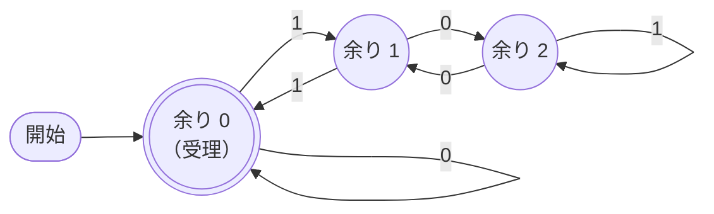
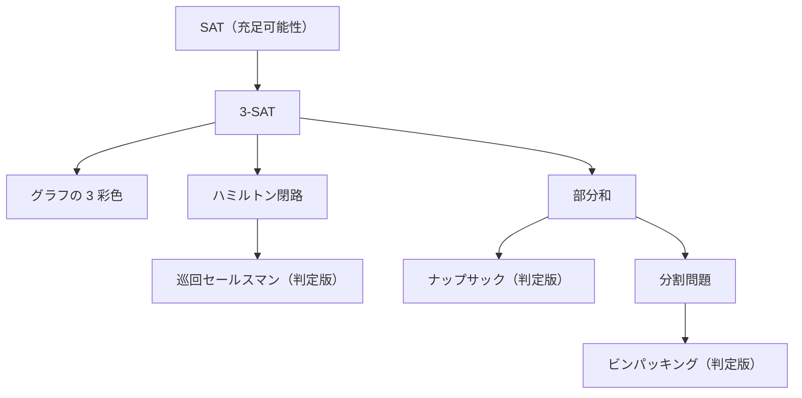

# 2.7 計算理論 — 計算できること・できないこと

> 1 行の正規表現が、世界中の Web サイトを止めることがあります。静的解析ツールが「すべてのバグ」を見つけられないのには、数学的な理由があります。配送計画やサーバーの配置が「どれだけ計算機を足しても厳密には解けない」ことがあるのも、偶然ではありません。この章では、オートマトンから停止性問題、P と NP までの計算理論を、正規表現エンジン・静的解析・最適化問題という実務の題材と結びつけて学びます。

| 項目 | 内容 |
|---|---|
| 学習時間の目安 | 本文 5h ＋ 演習 8h |
| 前提となる章 | [2.1 計算機科学のための離散数学](../01-discrete-math/README.md)（集合・論理・証明）、[2.3 計算量とアルゴリズム解析](../03-complexity/README.md)、[2.5 木・ヒープ・グラフ](../05-trees-heaps-graphs/README.md) |
| 演習 | [exercises/](exercises/)（Python） |
| キーワード | 有限オートマトン, DFA, NFA, 部分集合構成法, 正規言語, Thompson の構成法, ReDoS, 文脈自由文法, プッシュダウンオートマトン, チューリング機械, 停止性問題, ライスの定理, P と NP, NP 完全, 帰着, SAT ソルバ |

## この章のゴール

- [ ] DFA と NFA で文字列の集合（言語）を定義し、NFA を部分集合構成法で DFA に変換できる
- [ ] 正規表現と有限オートマトンの関係を説明し、Thompson の構成法で線形時間の正規表現エンジンを実装できる
- [ ] バックトラッキング型の正規表現エンジンで ReDoS が起きる仕組みと、その防ぎ方を説明できる
- [ ] 正規表現では扱えない構造（入れ子）を、文脈自由文法とプッシュダウンオートマトンで説明できる
- [ ] 停止性問題が決定不能であることを対角線論法で説明し、ライスの定理から静的解析ツールの限界を評価できる
- [ ] P・NP・NP 完全・NP 困難を区別し、NP 困難な問題に出会ったときの現実的な対処法を選べる

## なぜ学ぶのか

計算理論は抽象的に見えますが、その帰結は実際の障害や設計判断に直結しています。

- **正規表現 1 行で世界規模の障害**: 2019 年 7 月 2 日、Cloudflare は、WAF（Web アプリケーションファイアウォール）に追加したルールの正規表現が過剰なバックトラッキングを起こし、世界中で HTTP/HTTPS を処理するサーバーの CPU を使い切ったため、約 30 分にわたって多数のサイトが 502 エラーを返したと、公開したポストモーテムで説明しています。問題の部分は `.*(?:.*=.*)` という短い式でした。同社は再発防止策として、実行時間の上限が保証された正規表現エンジンへの移行などを挙げています。2016 年 7 月には Stack Overflow も、行頭・行末の空白を取り除く正規表現が、大量の連続した空白を含む 1 件の投稿で膨大な時間を要し、サイトが停止したと公表しています。どちらも、この章で学ぶ「正規表現エンジンの 2 つの方式」の違いから説明できます。
- **「すべてのバグを見つけるツール」は作れない**: 「任意のプログラムが停止するかどうかを判定するプログラム」は存在しないことが、1936 年に Turing によって証明されています。その帰結（ライスの定理）により、静的解析ツールは必ず「見逃し」か「誤検知」のどちらかを許容しています。ツールの宣伝文句を評価し、適切に導入するには、この限界を知っておく必要があります。
- **計算機を増やしても解けない問題がある**: 配送ルート、シフト作成、仮想マシンの配置、パッケージの依存関係の解決の多くは NP 困難と呼ばれる問題の仲間で、規模が大きくなると厳密な最適解を求めることが現実的でなくなります。そうと知らずに「最適な解を求める機能」を約束すると、開発が泥沼化します。
- **暗号は「解くのが難しい」ことに賭けている**: 公開鍵暗号の安全性は、素因数分解などの問題を効率よく解く方法が知られていない、という計算量の仮定の上に成り立っています（[11.2 暗号技術の基礎](../../11-security/02-cryptography/README.md)）。

## 1. 有限オートマトン — 有限の記憶で判定する

### 1.1 DFA

**決定性有限オートマトン（deterministic finite automaton, DFA）** は、有限個の **状態** を持ち、入力の記号を 1 つ読むたびに、現在の状態と記号だけで決まる次の状態へ移る機械です。入力を読み終えたときに **受理状態** にいれば、その文字列を「受理する」と言います。受理する文字列の集合を、そのオートマトンが認識する **言語（language）** と呼びます。

形式的には、状態の集合 Q、入力記号の集合（アルファベット）Σ、遷移関数 δ: Q × Σ → Q、開始状態 q₀、受理状態の集合 F の 5 つ組 (Q, Σ, δ, q₀, F) です。

例として、「2 進数として読んだ値が 3 で割り切れる」文字列を受理する DFA を考えます。状態を「ここまでに読んだ値を 3 で割った余り」とすると、値 v の後ろにビット b を付けた値は 2v + b なので、余り r の状態で b を読んだら (2r + b) mod 3 の状態へ移ればよいことが分かります。



`110`（6）を読むと、余り 0 →（1）→ 1 →（1）→ 0 →（0）→ 0 で受理、`111`（7）は 0 → 1 → 0 → 1 で受理しません。どれほど長い数でも、覚えておく必要があるのは「余り」という 3 通りの情報だけです（演習 1）。

DFA の重要な性質は次の 2 つです。

- **入力の長さ n に対して O(n) 時間**（1 文字につき表を 1 回引くだけ）で、メモリは入力の長さによらず一定。
- 覚えておける情報が **状態の数という有限の量** に限られる。この「記憶の限界」が、DFA にできないことを決めます（2.3 節）。

状態機械は、理論だけの存在ではありません。TCP の接続状態、注文のステータス（未払い → 支払済み → 発送済み …）、UI の画面遷移、字句解析器（トークンの切り出し）など、実務で「ありえない遷移を防ぎたい」ものの多くは、状態と遷移の表として設計するとバグが減ります。

### 1.2 NFA — 非決定性

**非決定性有限オートマトン（nondeterministic finite automaton, NFA）** は、DFA の 2 つの制約を外したものです。

- ある状態で同じ記号を読んだときに、**移れる先が複数あってもよい**（0 個でもよい）。
- 記号を読まずに移れる **ε 遷移（イプシロン遷移）** があってもよい。

NFA は「移れる先のどれかを選んで進み、**どれか 1 つの選び方で** 受理状態に着けば受理」と定義されます。「後ろから 3 番目の文字が 1 である 0/1 の列」は、NFA なら「最初の状態で読み進めながら、ここが後ろから 3 番目だと“予想”したら 1 を読んで次の状態へ」という 4 状態で素直に書けます。

計算機は「予想」できないので、NFA を動かすには工夫が要ります。素朴には、分岐のたびに 1 つを選んで進み、失敗したら戻って別の選択肢を試す（**バックトラック**）方法が考えられますが、分岐が重なると試す組み合わせが指数的に増えます。もう 1 つの方法は、**「今いる可能性のある状態の集合」を 1 つ持って、すべての可能性を同時に進める** ことです。

```text
「後ろから 3 番目が 1」の NFA（状態 0〜3、3 が受理）
  0 --0,1--> 0      0 --1--> 1      1 --0,1--> 2      2 --0,1--> 3

入力 "0110" を状態の集合で読む:
  開始      {0}
  "0" の後  {0}
  "1" の後  {0, 1}        ← 0 に留まる可能性と、1 に進む可能性の両方を持つ
  "1" の後  {0, 1, 2}
  "0" の後  {0, 2, 3}     ← 3 を含むので受理（後ろから 3 番目の文字は 1）
```

集合の大きさは状態数 m 以下なので、1 文字あたり O(m)（遷移の数に比例）、全体で O(nm) の時間で済みます。ε 遷移がある場合は、各段階で「ε 遷移だけでたどれる状態」も集合に加えます（**ε 閉包**, epsilon closure。演習 2）。この「集合で同時に進める」考え方が、2.2 節と演習 5 で扱う線形時間の正規表現エンジンの核心です。

### 1.3 部分集合構成法 — NFA を DFA に変える

NFA のシミュレーションで現れる「状態の集合」を、それぞれ 1 つの状態とみなすと、DFA が作れます。これが **部分集合構成法（subset construction）** で（Rabin と Scott, 1959 年）、**NFA と DFA が認識できる言語の範囲は同じ** であることを示しています。

1. 開始状態の ε 閉包を、DFA の開始状態とする。
2. まだ調べていない DFA の状態（= NFA の状態の集合）S と記号 a について、S から a で移れる状態の ε 閉包 T を求め、S →a→ T という遷移を加える。T が新しい集合なら、DFA の状態として追加する。
3. 新しい集合が出てこなくなるまで繰り返す。NFA の受理状態を含む集合が、DFA の受理状態になる。

ただし、DFA の状態数は最悪で **2^(NFA の状態数)** になります。上の「後ろから n 番目が 1」の言語は、NFA なら n + 1 状態ですが、DFA では「直近 n 文字」をすべて覚えておく必要があるため、ちょうど 2ⁿ 状態が必要です（演習 3 のテストで確かめます）。DFA は照合が最も速い代わりに、作るのに時間とメモリがかかることがある、というトレードオフです。実用的なエンジンは、DFA の状態を必要になったときだけ作ってキャッシュする（遅延 DFA）といった工夫をしています。なお、同じ言語を認識する DFA の中で状態数が最小のものは一意に決まり、効率よく求められます（Hopcroft のアルゴリズムなど）。

## 2. 正規表現と正規言語

### 2.1 正規表現は有限オートマトンと同じ力を持つ

**正規表現（regular expression）** は、文字列の集合を次の 3 つの操作で組み立てる記法です。

| 操作 | 書き方 | 意味 |
|---|---|---|
| 連結 | `AB` | A にマッチする文字列の後に、B にマッチする文字列が続く |
| 選択 | `A\|B` | A か B のどちらか |
| 繰り返し（クリーネ閉包） | `A*` | A を 0 回以上繰り返す |

`A+`（1 回以上）や `A?`（0 回か 1 回）、`.`（任意の 1 文字）などは、これらの組み合わせの略記です。Kleene は 1956 年に、**正規表現で表せる言語と、有限オートマトンで認識できる言語はちょうど一致する** ことを示しました。この言語のクラスを **正規言語（regular language）** と呼びます。

### 2.2 Thompson の構成法

正規表現から NFA を機械的に作る方法が、Ken Thompson による **Thompson の構成法**（1968 年）です。正規表現の構文木を下から組み立て、各部分を「入口が 1 つ、出口が 1 つの NFA の断片」に変換して、ε 遷移でつなぎます。

```text
文字 a:          ─→ ( ) ──a──→ ( ) ─→

連結 AB:         ─→ [ A ] ──ε──→ [ B ] ─→

選択 A|B:                ┌──ε──→ [ A ] ──ε──┐
                 ─→ ( ) ─┤                   ├─→ ( ) ─→
                         └──ε──→ [ B ] ──ε──┘

繰り返し A*:          ┌───────── ε ─────────┐
                      ▼                      │
                 ─→ (分岐) ──ε──→ [ A ] ──ε──┘
                      │
                      └──ε──→（次へ）
```

各構文要素が作る状態は定数個なので、**NFA の状態数はパターンの長さに比例** します。この NFA を 1.2 節の「状態の集合」で動かせば、パターンの長さ m、入力の長さ n に対して **O(mn) 時間で必ず終わる** 正規表現エンジンになります。演習 5 では、構文解析器（実装済み）が作る構文木から Thompson の NFA を作り、状態の集合でシミュレーションするエンジンを実装します。

### 2.3 正規表現にできないこと — 入れ子

有限オートマトンの記憶は有限なので、「**いくつ数えたか**」を無制限には覚えられません。その典型が、`a` を n 個並べた後に `b` を同じ n 個並べた文字列の集合 {aⁿbⁿ | n ≥ 0} です。

**正規言語でないことの証明の考え方**（反復補題の考え方の簡略版）: この言語を認識する DFA があり、状態数が k だとします。a⁰, a¹, …, aᵏ という k + 1 通りの入力を読んだ後の状態を考えると、状態は k 個しかないので、鳩の巣原理により、ある i < j について「aⁱ を読んだ後」と「aʲ を読んだ後」に同じ状態 q にいることになります。DFA はそれ以降、どちらを読んだ後かを区別できないので、aⁱbⁱ を受理するなら aʲbⁱ も受理してしまい、矛盾します。

aⁿbⁿ は「開き括弧を n 個、閉じ括弧を n 個」と同じ構造です。したがって、**任意の深さの入れ子の括弧が正しく対応しているか** は、正規表現では判定できません。HTML・JSON・プログラムのソースコードのように入れ子を持つ言語を、正規表現だけで正しく解析しようとしてはいけない、と言われるのはこのためです（深さに上限があるなら、理屈の上では正規表現で書けますが、式が急激に複雑になります）。

## 3. 正規表現エンジンの 2 つの方式と ReDoS

### 3.1 バックトラッキング型と、オートマトン型

実際の正規表現エンジンは、大きく 2 つの方式に分かれます。

| | バックトラッキング型 | オートマトン型（Thompson NFA / DFA） |
|---|---|---|
| 仕組み | 構文木を再帰的にたどり、失敗したら直前の選択に戻って別の選択肢を試す | 状態の集合で全候補を同時に進める（または DFA に変換する） |
| 最悪の計算時間 | パターンによっては入力の長さに対して **指数時間** | パターンの長さ × 入力の長さに比例（**線形時間**） |
| 後方参照 `\1`、先読み・後読み | 使える | 使えない（または制限される） |
| 採用例 | Perl、PCRE、Java、JavaScript、Python の `re`、.NET（既定） | Go の `regexp`、Google の RE2、Rust の `regex` クレート、`grep` や `awk` の多くの実装 |

バックトラッキング型が広く使われているのは、後方参照のような便利な機能を実装しやすいからです。ところで、後方参照を含む「正規表現」は、もはや正規言語の範囲を超えています。後方参照付きのパターンのマッチ判定は NP 完全であることが知られており（6 章）、線形時間のエンジンがこの機能を提供しないのは、手抜きではなく原理的な理由があります。

### 3.2 破局的バックトラッキング

バックトラッキング型のエンジンに `(a+)+b` を与え、`b` のない `aaaa…a` と照合させると、「a の並びを外側の `+` の各回にどう分けるか」の組み合わせ（n 個の a なら 2ⁿ⁻¹ 通り）をすべて試してから失敗します。これが **破局的バックトラッキング（catastrophic backtracking）** です。Python の `re` で確かめてみます。

```python
import re
import time

pattern = re.compile(r"(a+)+b")
for n in (18, 20, 22, 24):
    text = "a" * n                     # 最後に b がないので、マッチは必ず失敗する
    t = time.perf_counter()
    pattern.fullmatch(text)
    print(f"n={n}: {time.perf_counter() - t:.3f} 秒")
```

```text
n=18: 0.011 秒
n=20: 0.044 秒
n=22: 0.177 秒
n=24: 0.709 秒
```

（Python 3.11 の出力。3.10 もほぼ同じです。）文字が 2 つ増えるごとに 4 倍、つまり指数時間です。この調子では、30 文字で 40 秒以上、40 文字なら十数時間かかる計算になります。

指数時間でなくても危険です。Cloudflare の障害の原因となった式の中心部分 `.*(?:.*=.*)` を簡略化した `.*.*=.*` で、`=` を含まない文字列を検索すると、次のようになります。

```python
import re
import time

pattern = re.compile(r".*.*=.*")            # Cloudflare の障害の原因部分を簡略化したもの
for n in (500, 1_000, 2_000):
    text = "x" * n                          # "=" を含まない入力
    t = time.perf_counter()
    pattern.search(text)
    print(f"n={n:>5,}: {time.perf_counter() - t:.3f} 秒")
```

```text
n=  500: 0.029 秒
n=1,000: 0.211 秒
n=2,000: 1.642 秒
```

入力が 2 倍になると約 8 倍、つまり O(n³) です。検索の開始位置 n 通りのそれぞれで、2 つの `.*` への文字の割り振り方を O(n²) 通り試してから失敗するためです。わずか 2,000 文字の入力で 1.6 秒 CPU を占有するなら、そのような入力を含むリクエストが少し届くだけで、サーバーの CPU は簡単に飽和します。攻撃者がこの性質を狙って入力を送り込むことを **ReDoS（Regular expression Denial of Service）** と呼びます（[11.4 Webアプリケーションセキュリティ](../../11-security/04-web-security/README.md)）。

同じ入力を、演習 5 で作る Thompson の NFA によるエンジン（純粋な Python で書いた解答例）で処理すると、次のようになります（「ステップ」は状態を訪れた回数）。

| パターン | 入力の長さ | 状態数 | ステップ | 時間 |
|---|---|---|---|---|
| `(a+)+b` | 30 | 5 | 121 | 0.000 秒 |
| `(a+)+b` | 10,000 | 5 | 40,001 | 0.009 秒 |
| `.*.*=.*` | 2,000 | 8 | 10,005 | 0.003 秒 |
| `.*.*=.*` | 100,000 | 8 | 500,005 | 0.171 秒 |

ステップ数は入力の長さに比例しており、C で書かれた Python の `re` が 1.6 秒かかった入力を、Python で書いたエンジンが 3 ミリ秒で処理しています。**アルゴリズムの違いは、実装言語の速さの違いを簡単に覆します**。

### 3.3 ReDoS の防ぎ方

| 対策 | 内容 |
|---|---|
| 線形時間のエンジンを使う | 外部から来た入力や、外部から来たパターンを扱うなら、RE2・Go の `regexp`・Rust の `regex` のように線形時間が保証されたエンジンを選ぶ。.NET 7 以降には、バックトラッキングしない `RegexOptions.NonBacktracking` オプションがある |
| 危険なパターンを避ける | 量指定子の入れ子（`(a+)+`、`(a*)*`）、重なり合う選択肢の繰り返し（`(a\|a)*`、`(\w\|\d)+`）、連続する `.*` は要注意。静的解析ツールで検出できるものもある |
| バックトラックを禁止する構文 | 所有量指定子 `a++` やアトミックグループ `(?>…)` を使うと、一度マッチした部分を戻らせない。Python では 3.11 から使える（3.10 ではエラー） |
| 上限を設ける | 入力の長さを制限する。照合にタイムアウトを設定する（.NET の `Regex.MatchTimeout` など）、バックトラックの回数に上限を設ける（PHP の `pcre.backtrack_limit` など） |

所有量指定子の効果を、Python 3.11 で確かめます。

```python
import re
import time

text = "a" * 30
for p in [r"(a++)+b", r"(?>a+)+b"]:          # 所有量指定子とアトミックグループ（Python 3.11 以降）
    t = time.perf_counter()
    print(p, re.fullmatch(p, text), f"{time.perf_counter() - t:.5f} 秒")
```

```text
(a++)+b None 0.00069 秒
(?>a+)+b None 0.00007 秒
```

（Python 3.11 の出力。3.10 では `re.error: multiple repeat at position 3` になります。）同じ 30 文字でも、`(a+)+b` なら 40 秒以上かかるはずの照合が、一瞬で終わっています。

## 4. 文脈自由文法とプッシュダウンオートマトン

### 4.1 文脈自由文法

入れ子の構造を表すには、**文脈自由文法（context-free grammar, CFG）** を使います。文法は「ある記号を、別の記号の並びに書き換えてよい」という **生成規則** の集まりです。

```text
正しく対応した括弧の列:
  S → ε          （空の列）
  S → ( S ) S    （括弧で囲んだ列の後に、また列が続く）

四則演算の式（掛け算を足し算より強く結びつける）:
  式   → 式 + 項 | 式 - 項 | 項
  項   → 項 * 因子 | 項 / 因子 | 因子
  因子 → 数 | ( 式 )
```

右辺に左辺と同じ記号が現れる（再帰している）ことで、任意の深さの入れ子を表せます。このような規則の書き方を **BNF（バッカス・ナウア記法）** と呼び、プログラミング言語の仕様や、JSON・HTTP のようなデータ形式・プロトコルの仕様（RFC など）で広く使われています。文法から構文解析器（パーサ）を作る方法は、[3.4 言語処理系を作る](../../03-programming-languages/04-build-an-interpreter/README.md) で扱います。演習 5 で使う正規表現の構文解析器も、文法（`parse` の docstring 参照）をそのまま再帰関数にした **再帰下降構文解析** です。

### 4.2 プッシュダウンオートマトン

文脈自由言語を認識する機械が **プッシュダウンオートマトン（pushdown automaton, PDA）** で、有限オートマトンに **スタック** を 1 本加えたものです。括弧の対応なら、「開き括弧を読んだら積む、閉じ括弧を読んだら取り出して種類を照合する、最後にスタックが空なら受理」で判定できます（演習 4）。スタックは深さに上限がないので、有限状態では数えきれなかった入れ子を扱えます。関数呼び出しのコールスタックや、再帰下降構文解析の再帰は、まさにこのスタックです。

### 4.3 チョムスキー階層

言語のクラスと、それを認識する機械の関係は、次の階層にまとめられます（Chomsky, 1956 年）。

| 言語のクラス | 認識する機械 | 記憶 | 例 |
|---|---|---|---|
| 正規言語 | 有限オートマトン（DFA・NFA） | 有限（状態だけ） | 識別子、数値リテラル、ログの形式、「3 の倍数の 2 進数」 |
| 文脈自由言語 | プッシュダウンオートマトン | スタック 1 本 | 括弧の対応、四則演算の式、JSON、多くのプログラミング言語の構文 |
| 文脈依存言語 | 線形拘束オートマトン | 入力の長さに比例するテープ | aⁿbⁿcⁿ |
| 帰納的可算言語 | チューリング機械 | 無限のテープ | あらゆる「計算」 |

上の段の言語はすべて下の段に含まれ、下に行くほど表現力が高く、解析は難しくなります。実務では、「字句解析（トークンの切り出し）は正規言語、構文解析は文脈自由言語、変数の宣言や型の一致の検査はそれ以上」というように、階層ごとに道具を使い分けます。

## 5. チューリング機械と計算の限界

### 5.1 チューリング機械とチャーチ–チューリングのテーゼ

**チューリング機械（Turing machine）** は、Alan Turing が 1936 年に提案した計算のモデルです。無限に長いテープと、テープ上を動くヘッド、有限個の状態からなり、「現在の状態と、ヘッドの下の記号」から「書き込む記号、ヘッドを動かす向き、次の状態」を決める規則表に従って動きます。単純ですが、**現代のコンピュータで計算できることは、すべてチューリング機械でも計算できる** と考えられています。

「直観的に計算できる（アルゴリズムで計算できる）関数は、チューリング機械で計算できる関数と一致する」という主張を **チャーチ–チューリングのテーゼ** と呼びます。「直観的に計算できる」は数学的に定義できないので証明はできませんが、Church のラムダ計算など、独立に提案された計算のモデルがすべて同じ能力を持つと示されたことが、このテーゼを強く支持しています。チューリング機械と同じ計算能力を持つことを **チューリング完全** と呼び、ほとんどのプログラミング言語はチューリング完全です（C++ のテンプレートのように、意図せずチューリング完全になった仕組みもあります）。

さらに Turing は、**他のチューリング機械の規則表を入力として受け取り、その動作を真似る「万能チューリング機械」** が作れることを示しました。これは「プログラムもデータである」というプログラム内蔵方式の考え方そのもので、インタプリタ・エミュレータ・仮想マシンの理論的な原型です。

### 5.2 停止性問題

「プログラムとその入力を受け取り、そのプログラムがその入力で **いつか停止するか、永遠に動き続けるか** を必ず正しく答えるプログラム」は作れるでしょうか。これを **停止性問題（halting problem）** と呼び、Turing は 1936 年に、そのようなプログラムは存在しないことを証明しました。対角線論法による証明を、Python 風の擬似コードで追ってみます。

```python
# 擬似コード: halts は「存在すると仮定した」関数（実際には書けないことを示すための思考実験）
def halts(program_source: str, input_data: str) -> bool:
    """program_source を input_data で実行すると停止するなら True、停止しないなら False を必ず返す"""
    ...

def paradox(program_source: str) -> None:
    if halts(program_source, program_source):   # 自分自身を入力にしたら停止する？
        while True:                             # 停止するなら、無限ループする
            pass
    else:
        return                                  # 停止しないなら、すぐ停止する

# paradox 自身のソースコードを P として、paradox(P) は停止するか？
```

`paradox(P)` が停止すると仮定すると、`halts(P, P)` は True なので、`paradox` は無限ループに入り、停止しません。停止しないと仮定すると、`halts(P, P)` は False なので、`paradox` はすぐに停止します。どちらでも矛盾するので、最初の仮定「`halts` が存在する」が誤りです。

ポイントは、`halts` が「どんなに賢い方法を使っても」この議論が成り立つことです。つまり停止性問題は、計算機の性能や人間の工夫が足りないのではなく、**原理的に** 解けない問題、**決定不能（undecidable）** な問題です。なお、「特定のプログラムが停止するか」を個別に証明することや、「多くの場合に」正しく判定することは可能です。不可能なのは、「**すべての** プログラムについて **必ず** 正しく答える」ことです。

### 5.3 ライスの定理と静的解析の限界

停止性問題の結果は、はるかに一般化できます。**ライスの定理（Rice's theorem）**（1953 年）は、「プログラムが計算する関数（入出力の振る舞い）についての自明でない性質は、すべて決定不能である」と述べます。たとえば次のような性質です。

- このプログラムは、ある入力でゼロ除算を起こすか
- この関数は、どんな入力に対しても `None` を返さないか
- この 2 つのプログラムは、同じ入出力の振る舞いをするか（リファクタリングの前後で振る舞いが変わっていないか）
- このコードは、個人情報を外部に送信することがあるか

これは、**「すべてのバグを、誤検知なしに見つける静的解析ツール」は作れない** ことを意味します。実際のツールは、次のどちらか（または両方）の妥協をしています。

| 妥協の方向 | 性質 | 例 |
|---|---|---|
| 健全（sound）な解析 | 問題を見逃さない代わりに、実際には問題のないコードも警告する（誤検知） | 型チェッカーは、実行すれば問題なく動くコードも、型が証明できなければ拒否する |
| 完全（complete）寄りの解析（実用的なバグ検出） | 報告したものは本当の問題である（誤検知が少ない）代わりに、見逃しがある | 多くのリンターやバグ検出ツールは、誤検知を減らすために典型的なパターンに絞る |

ツールの導入を検討するときは、「誤検知はどれくらいで、何を見逃すのか」を必ず確認しましょう。誤検知が多すぎるツールは、開発者に無視されるようになり、結局何も守らなくなります。一方、型システムのように「表現を制限する代わりに、ある種の誤りを必ず防ぐ」仕組みは、ライスの定理の枠内で最大の効果を得る賢い設計です（[3.2 型システム](../../03-programming-languages/02-type-systems/README.md)）。

## 6. 計算量クラス — P と NP

### 6.1 「解ける」と「現実的な時間で解ける」

停止性問題は「どんなに時間をかけても解けない」問題でした。一方、解けることは分かっていても、**現実的な時間では解けない** 問題があります。巡回セールスマン問題（すべての都市を 1 回ずつ訪れて戻る最短の巡回路）を、全順列を試して解いてみます。

```python
import itertools
import math
import random
import time

def tsp_brute_force(dist):
    """都市 0 から出発して全都市を 1 回ずつ回って戻る最短の巡回路を、全順列で探す"""
    n = len(dist)
    best = math.inf
    for perm in itertools.permutations(range(1, n)):
        route = (0,) + perm + (0,)
        best = min(best, sum(dist[a][b] for a, b in zip(route, route[1:])))
    return best

rng = random.Random(0)
for n in (8, 9, 10, 11):
    pts = [(rng.random(), rng.random()) for _ in range(n)]
    dist = [[math.dist(p, q) for q in pts] for p in pts]
    t = time.perf_counter()
    tsp_brute_force(dist)
    print(f"{n} 都市: {math.factorial(n - 1):>10,} 通り  {time.perf_counter() - t:7.3f} 秒")
```

```text
8 都市:      5,040 通り    0.005 秒
9 都市:     40,320 通り    0.040 秒
10 都市:    362,880 通り    0.390 秒
11 都市:  3,628,800 通り    3.972 秒
```

都市が 1 つ増えるごとに約 10 倍になります。20 都市なら 19! ≈ 1.2 × 10¹⁷ 通りで、同じペースだと約 4,000 年かかります。計算機を 1,000 倍速くしても、扱える都市の数は 2〜3 個増えるだけです。**指数時間（や階乗時間）のアルゴリズムに対しては、ハードウェアの進歩はほとんど助けにならない** のです（計算量の増え方の比較は [2.3](../03-complexity/README.md)）。

### 6.2 P と NP

ここで、問題を「はい／いいえ」で答える形（**判定問題**）にそろえて分類します。最適化問題「最短の巡回路の長さは？」は、判定問題「長さ L 以下の巡回路はあるか？」に言い換えられます。

- **P**: 多項式時間（O(nᵏ)）で **解ける** 判定問題のクラス。整列、最短経路、最小全域木、線形計画法、2-SAT（[2.5](../05-trees-heaps-graphs/README.md) の強連結成分で解ける）など。
- **NP**: 「はい」の場合に、その **証拠（証明書）が与えられれば、正しいかを多項式時間で検証できる** 判定問題のクラス。巡回セールスマン問題なら、巡回路そのものが証拠で、長さを足して L 以下か確かめるのは簡単です。

P の問題は、証拠がなくても自分で解けるので、すべて NP に含まれます（P ⊆ NP）。「**解くのは難しそうでも、答えを確かめるのは簡単**」な問題が NP には大量に含まれており、それらが本当に「解くのも簡単（P = NP）」なのかどうかは分かっていません。これが **P vs NP 問題** で、クレイ数学研究所が 2000 年に 100 万ドルの懸賞をかけたミレニアム懸賞問題の 1 つです。多くの研究者は P ≠ NP だと考えていますが、証明されていません。

### 6.3 帰着と NP 完全

問題 A の任意の入力を、多項式時間で問題 B の入力に変換でき、B の答えがそのまま A の答えになるとき、「**A は B に帰着できる**（A ≤ B）」と言います。B を解く方法があれば A も解けるので、B は A **以上に難しい** といえます。

- **NP 困難（NP-hard）**: NP のすべての問題が帰着できる問題。「少なくとも NP のどの問題以上に難しい」。NP に属する必要はない（最適化問題や、停止性問題も NP 困難です）。
- **NP 完全（NP-complete）**: NP に属し、かつ NP 困難な問題。NP の中で最も難しい問題たち。

最初の NP 完全問題は、**充足可能性問題（SAT）**: 「論理式（変数の AND・OR・NOT の組み合わせ）を真にする変数の割り当てはあるか」です。Stephen Cook（1971 年）と Leonid Levin（独立に 1973 年）が、NP のどの問題も SAT に帰着できることを示しました（**クック–レビンの定理**）。翌 1972 年に Richard Karp が、グラフの彩色やナップサックなど 21 の問題が NP 完全であることを示し、以来、数千の問題が NP 完全だと分かっています。



（矢印 A → B は「A を B に帰着できる」。B が多項式時間で解ければ A も解けるので、B も NP 困難であることが分かる。）

帰着は、理論のための道具であるだけでなく、**実務の強力な武器** です。問題を SAT に帰着できれば、高度に最適化された SAT ソルバで解けます。グラフの 3 彩色を SAT に変換してみましょう（ここでは全探索で解きます）。

```python
import itertools

def coloring_to_cnf(nodes, edges, k):
    """グラフの k 彩色問題を SAT（CNF: 節の AND、各節はリテラルの OR）に変換する。
    変数 (v, c) = 「頂点 v を色 c で塗る」。正のリテラルは +番号、否定は -番号で表す。"""
    var = {(v, c): i + 1 for i, (v, c) in enumerate(itertools.product(nodes, range(k)))}
    clauses = []
    for v in nodes:
        clauses.append([var[v, c] for c in range(k)])                  # 各頂点は少なくとも 1 色
        for c1, c2 in itertools.combinations(range(k), 2):
            clauses.append([-var[v, c1], -var[v, c2]])                 # 2 色以上は塗らない
    for u, v in edges:
        for c in range(k):
            clauses.append([-var[u, c], -var[v, c]])                   # 隣どうしは同じ色にしない
    return var, clauses

def brute_force_sat(num_vars, clauses):
    """全 2^n 通りの真偽値の割り当てを試す（指数時間）"""
    for bits in itertools.product([False, True], repeat=num_vars):
        if all(any(bits[abs(l) - 1] == (l > 0) for l in cl) for cl in clauses):
            return bits
    return None

cycle5 = (range(5), [(i, (i + 1) % 5) for i in range(5)])            # 5 頂点の輪
for k in (2, 3):
    var, clauses = coloring_to_cnf(*cycle5, k)
    model = brute_force_sat(len(var), clauses)
    colors = None if model is None else {v: c for (v, c), i in var.items() if model[i - 1]}
    print(f"5 頂点の輪を {k} 色で: 変数 {len(var)} 個, 節 {len(clauses)} 個 → {colors}")
```

```text
5 頂点の輪を 2 色で: 変数 10 個, 節 20 個 → None
5 頂点の輪を 3 色で: 変数 15 個, 節 35 個 → {0: 2, 1: 1, 2: 2, 3: 1, 4: 0}
```

奇数個の頂点の輪は 2 色では塗れず（充足不能）、3 色なら塗れる（充足可能）ことが、SAT の答えとして得られました。全探索の部分を本物の SAT ソルバに差し替えれば、変数が数十万個ある問題も解けることがあります。

### 6.4 実務に現れる NP 困難な問題

| 実務の問題 | 対応する NP 困難な問題 |
|---|---|
| 仮想マシンやコンテナをサーバーに詰め込む、倉庫の荷物をトラックに積む | ビンパッキング問題（多次元の場合はさらに難しい） |
| 配送・巡回のルート計画 | 巡回セールスマン問題・配送計画問題 |
| 試験の時間割、会議の日程調整、コンパイラのレジスタ割り当て | グラフ彩色問題 |
| シフト作成、工場の生産スケジューリング | さまざまなスケジューリング問題 |
| パッケージの依存関係の解決（バージョン制約と競合がある場合） | SAT（一般の場合 NP 完全であることが示されている） |
| 予算内での施策の選択 | ナップサック問題 |

依存関係の解決は良い例です。Debian のパッケージのインストール可能性の判定が NP 完全であることは、2006 年の論文（Mancinelli ら）で示されています。そのため、dnf や zypper が使うライブラリ libsolv のように、SAT ソルバの技術を使って解決するパッケージマネージャがあります。一方、Go のモジュールシステムは、「満たすべき最小のバージョンを選ぶ」（Minimal Version Selection）という規則に **問題を制限** することで、SAT を解かずに多項式時間で依存関係を決められるように設計されています（Russ Cox による設計文書, 2018 年）。どちらも、問題の難しさを理解したうえでの設計判断です。

## 7. 難しい問題との付き合い方

### 7.1 現実的な対処法

問題が NP 困難だと分かっても、あきらめる必要はありません。「**最悪の場合** に、**すべての入力** に対して、**厳密な最適解** を、**多項式時間で** 求める」ことが（P ≠ NP なら）できないだけです。どれか 1 つの条件を緩めれば、道は開けます。

| 緩める条件 | 方法 | 例 |
|---|---|---|
| 厳密な最適解 | **近似アルゴリズム**: 最適解の何倍以内かを保証する | 頂点被覆の 2 倍近似、三角不等式を満たす巡回セールスマン問題の 1.5 倍近似（Christofides） |
| 解の質の保証 | **ヒューリスティクス・局所探索**: 保証はないが、実用上よい解を速く求める | 箱詰めの First-Fit Decreasing、2-opt、焼きなまし法、遺伝的アルゴリズム |
| 最悪の場合の時間 | **汎用ソルバ**: SAT・SMT・混合整数計画（MIP）・制約プログラミングのソルバに任せる。最悪は指数時間だが、現実の問題は驚くほど速く解けることが多い | SAT ソルバ、SMT ソルバ Z3（Microsoft Research）、Google OR-Tools の CP-SAT、商用・オープンソースの MIP ソルバ |
| すべての入力 | **問題を制限する**: 実際の入力が持つ構造（木構造・小さな数値・変数の数が少ない）を利用する | ナップサックの擬多項式時間 DP（[2.6](../06-algorithm-design/README.md)）、Go の Minimal Version Selection |
| 時間の保証 | **打ち切り**: 一定時間で探索をやめ、それまでの最良解を使う | 多くのスケジューラや最適化エンジン |

Kubernetes のスケジューラも、Pod をどのノードに置くかを厳密な最適化としては解いていません。条件を満たすノードを絞り込み（フィルタリング）、点数を付けて（スコアリング）最良のものを選ぶ、というヒューリスティクスで、1 つずつ高速に決めています（[10.2 コンテナオーケストレーションとKubernetes](../../10-cloud-and-sre/02-containers-and-kubernetes/README.md)）。

なお、近似にも限界があります。三角不等式を満たさない一般の巡回セールスマン問題は、P ≠ NP なら、どんな定数倍の近似も多項式時間では不可能であることが知られています。「近似できるかどうか」も問題ごとに違うのです。

### 7.2 暗号は計算の難しさに賭けている

公開鍵暗号の安全性は、「大きな数の素因数分解」や「離散対数問題」を効率よく解く方法が知られていない、という **計算量の仮定** に基づいています。暗号が安全であるためには、少なくとも P ≠ NP である必要がありますが、それだけでは足りません（NP 完全な問題でも「多くの入力では簡単」なことがあり、暗号には「ほとんどの入力で難しい」ことが必要です）。また、素因数分解は NP 完全であるとは考えられていません。

量子コンピュータ上で動く Shor のアルゴリズム（1994 年）は、素因数分解と離散対数を多項式時間で解けるため、十分な規模の量子コンピュータが実現すれば、現在広く使われている RSA や楕円曲線暗号は破られます。そのため、量子コンピュータでも難しいと考えられている問題に基づく **耐量子暗号** への移行が進んでおり、米国 NIST は 2024 年 8 月に最初の標準（FIPS 203・204・205）を公表しました。詳しくは [11.2 暗号技術の基礎](../../11-security/02-cryptography/README.md) で扱います。

### 7.3 形式手法 — 決定不能でも「証明」はできる

ライスの定理は「すべてのプログラムについて自動で判定する」ことを否定しますが、「**特定のシステムの設計や実装が正しいことを、人間の助けを借りて証明する**」ことは否定しません。これが **形式手法（formal methods）** です。

- **仕様記述とモデル検査**: Amazon Web Services の技術者たちは、S3 や DynamoDB などの分散システムの設計を仕様記述言語 TLA+ で書き、モデル検査で状態を網羅的に調べることで、通常のテストやレビューでは見つけにくい微妙な並行性のバグを設計段階で発見した、と報告しています（Newcombe ら "How Amazon Web Services Uses Formal Methods", Communications of the ACM, 2015）。
- **既存のコードの検証**: 2015 年には、研究者が定理証明の支援ツール KeY で Java の TimSort の実装を検証しようとして、特定の入力で配列の範囲外アクセスを起こしうるバグを発見し、同じ設計の Python などの実装も含めて修正につながったと報告されています（de Gouw ら, 2015）。
- **検証済みのソフトウェア**: OS のマイクロカーネル seL4 や、C コンパイラ CompCert のように、実装全体が仕様どおりであることを機械的に証明したソフトウェアもあります。

形式手法はコストが高いので、すべてに使うものではありません。しかし、分散システムの合意プロトコル（[7.4 合意と協調](../../07-distributed-systems/04-consensus-and-coordination/README.md)）や決済の状態遷移のように、「バグが起きたら取り返しがつかず、テストで再現しにくい」部分には、投資に見合う価値があります。

## よくある落とし穴

1. **外部からの入力に、バックトラッキング型の正規表現をそのまま使う**。`(a+)+`、`(a|a)*`、`.*.*` のような形は、特定の入力で指数時間や多項式時間の爆発を起こす。入力長の制限、線形時間のエンジン、所有量指定子、タイムアウトを組み合わせる。
2. **正規表現で入れ子の構造（HTML・JSON・プログラム）を解析しようとする**。正規言語では任意の深さの入れ子を扱えない。専用のパーサ（`json`・`html.parser` モジュールなど）を使う。
3. **ユーザーが入力した正規表現を、そのままサーバーで実行する**。検索機能などでユーザーにパターンを書かせるなら、それ自体が ReDoS の入り口になる。線形時間のエンジンを使うか、機能を制限する。
4. **「このツールを入れればバグ（脆弱性）がなくなる」と考える**。ライスの定理により、静的解析は必ず見逃しか誤検知を伴う。ツールは多層防御の 1 つとして位置づけ、誤検知率と見逃しの傾向を把握して運用する。
5. **NP 困難な問題に「最適解」を約束する**。仕様に「最適な配送ルート」「最適なシフト」と書くと、規模が大きくなったときに計算が終わらない。「最適から数% 以内」「N 秒以内の最良解」のように、達成可能な目標として合意する。
6. **逆に、「NP 困難だから無理」と早々にあきらめる**。実際の入力の規模が小さい、特別な構造がある、汎用ソルバが速く解ける、といった理由で、実務上は問題なく解けることが多い。まず規模と構造を調べ、ソルバや近似を試す。
7. **最悪の場合と平均の場合を混同する**。NP 困難は「最悪の場合」の話で、正規表現の破局的バックトラッキングも「特定の入力」で起きる。逆に、平均的に速いことは、攻撃者が選んだ入力でも速いことを意味しない。

## CTOの視点

1. **「外部入力 × 最悪計算量」を、セキュリティレビューの定番の問いにする**。ReDoS、HashDoS（[2.4](../04-basic-data-structures/README.md)）、巨大な JSON のネスト、XML の実体展開など、少ない入力で大きな計算を引き起こす攻撃は繰り返し現れます。「この処理は攻撃者が選んだ入力で何秒かかりうるか」「上限はどこで強制しているか」をレビューで問い、WAF のルールや入力検証の正規表現には、テストと CPU 時間の上限を必須にしましょう。Cloudflare の事例は、防御のための仕組みそのものが障害の原因になりうることも示しています。
2. **ツールの導入判断では「何を見逃し、何を誤検知するか」を評価する**。静的解析や脆弱性スキャナの営業資料が「すべての〜を検出」と書いていたら、それは原理的に不可能な主張です。自社のコードで試験導入し、誤検知率・見逃しの傾向・開発者の対応工数を測ってから、どこまでを CI の必須条件にするかを決めます。
3. **最適化の機能は、要件定義の段階で「解の質」と「計算時間」の契約にする**。配送計画・シフト作成・広告配信・リソース配置のような機能は、NP 困難な問題を含むことが多く、「最適な」という言葉が入った瞬間にプロジェクトのリスクになります。事業側と「どの程度の質の解を、何秒以内に、どの規模まで」を合意し、ソルバやヒューリスティクスを選ぶ判断を、技術チームが根拠を持って説明できる状態を作りましょう。
4. **形式手法は「保険」として、狙いを定めて使う**。全社的に導入するものではありませんが、合意プロトコル・課金・権限管理・金融取引の状態遷移のように、バグが致命的でテストが難しい部分では、TLA+ などによる設計の検証が、障害 1 件分のコストで十分に元を取ることがあります。担当できる人材を育てるか、外部の専門家を確保しておくことも CTO の選択肢です。
5. **暗号の移行計画を持つ**。耐量子暗号への移行は、暗号ライブラリの入れ替えだけでなく、証明書・プロトコル・保存データ・取引先との互換性に及ぶ長期の計画です。「どこでどの暗号を使っているか」の棚卸し（暗号資産の台帳）は、今から始められる準備です。

## 演習

演習コードは [exercises/automata.py](exercises/automata.py)（演習 1〜4）と [exercises/thompson_regex.py](exercises/thompson_regex.py)（演習 5）にあります。docstring に仕様が書いてあるので、`raise NotImplementedError(...)` を実装に置き換えてください。解答例は [solutions/](solutions/) にありますが、まずは自力で取り組みましょう。

```bash
python3 tools/check.py 2.7        # リポジトリのルートで実行。合格数と失敗したテストが表示される
python3 tools/check.py -v 2.7     # 詳しい出力
```

| # | 難易度 | 内容 | 関数・クラス |
|---|---|---|---|
| 1 | ★☆☆ | DFA のシミュレータと、「k で割り切れる 2 進数」を受理する DFA | `automata.DFA.accepts`, `divisible_by_dfa` |
| 2 | ★★☆ | ε 遷移つき NFA を「状態の集合」でシミュレーションする | `automata.NFA.epsilon_closure`, `step`, `accepts` |
| 3 | ★★★ | 部分集合構成法（NFA → DFA）。状態数が 2ⁿ になる例も確かめる | `automata.nfa_to_dfa` |
| 4 | ★☆☆ | スタックによる括弧の対応の検査と、誤りの位置の報告 | `automata.first_error_index`, `is_balanced` |
| 5 | ★★★ | (a) Thompson の構成法による線形時間の正規表現エンジン（全体一致・部分一致）、(b) 比較用の素朴なバックトラッキング型マッチャ。`(a+)+b` を 30 文字の入力で一瞬で処理できること、バックトラッキング型が指数的に遅くなることをテストで確かめる | `thompson_regex.compile_nfa`, `Regex`, `backtrack_fullmatch` |
| 6 | ★★☆ | 記述: NP 困難な問題への対処（下記） | — |

演習 5 のテストは、Python の `re` とランダムなパターン・入力で結果を比較します。状態を訪れた回数 `steps` が「状態数 × (入力の長さ + 1)」以下であること（= 線形時間）も確かめます。無限ループや指数時間になった実装は、5 秒で打ち切られて失敗します。

### 演習 6（記述）: 仮想マシン配置の最適化

あなたはクラウドサービスの技術責任者です。事業部から次の要望が届きました。

> 「社内のプライベートクラウドで、毎晩 3,000 台の仮想マシン（CPU・メモリの要求量がそれぞれ異なる）を 400 台の物理サーバーに配置し直している。**使う物理サーバーの台数を最小にする最適な配置** を毎晩自動で計算して、電気代を削減したい。計算は 30 分以内に終わらせたい。」

次の問いに答えてください。

1. この問題は、計算理論の観点からどのような問題か。なぜ「最適な配置を毎晩必ず求める」ことが難しいのか。
2. 現実的な解決策を 2〜3 案挙げ、それぞれの長所・短所を説明してください。
3. 事業部に対して、要件をどのように言い換えて合意すべきか。

<details>
<summary>解答例</summary>

1. 各仮想マシンを「大きさ（CPU・メモリの 2 次元）」を持つ品物、物理サーバーを「容量」を持つ箱とみなすと、**多次元のビンパッキング問題** で、NP 困難です。P ≠ NP と考えられている限り、どんな入力に対しても最適解を多項式時間で求めるアルゴリズムは期待できません。3,000 個の品物の配置の組み合わせは天文学的な数になり、全探索は不可能です。さらに、配置換えに伴うライブマイグレーションの回数やネットワーク帯域、冗長性（同じサービスの VM を同じサーバーに置かない）といった制約も加わります。

2. 解決策の例:
   - **ヒューリスティクス（First-Fit Decreasing など）**: 大きい VM から順に、入る最初のサーバーに入れる。数千台なら一瞬で終わり、1 次元の場合は最適解の約 11/9 倍に収まることが知られている。実装が簡単で説明しやすいが、多次元では質の保証が弱く、改善の余地が残る。
   - **混合整数計画（MIP）ソルバや制約プログラミング（CP-SAT など）**: 目的関数（使うサーバー数）と制約（容量・冗長性・移動数の上限）を宣言的に書いて、汎用ソルバに解かせる。30 分の時間制限を設ければ、その時点の最良解と「最適解との差（ギャップ）の上限」が得られる。モデル化のスキルと、場合によっては商用ソルバのライセンス費用が必要。
   - **局所探索による改善**: FFD の解を初期解とし、VM の入れ替えを繰り返して改善する（焼きなまし法など）。時間いっぱいまで改善を続けられる。解の質の保証はない。
   - いずれの場合も、下界（例: 全 VM の CPU の合計 ÷ 1 台の CPU 容量）を計算しておくと、得られた解が最適からどれだけ離れうるかを評価できる。

3. 言い換えの例: 「毎晩 30 分以内に、**理論上の下限から 5% 以内** の台数に収まる配置を求める（それを達成できない夜は、その時点での最良の配置を使い、下限との差をレポートする）。移動させる VM の数は 1 晩あたり N 台以内とする。」のように、**解の質（下限との差）・時間・運用上の制約** を測定可能な形で合意する。さらに「削減できる電気代の見込み」と「開発・運用コスト（ソルバのライセンスを含む）」を並べて、投資判断ができる形にする。

採点の観点:

- 1 で「ビンパッキング問題（NP 困難）なので、規模が大きいと最適解の保証は現実的でない」と説明できていれば合格ラインです。
- 2 で「ヒューリスティクス／ソルバ（時間制限つき）／局所探索」のような複数の選択肢をトレードオフ付きで比較し、3 で「最適」を測定可能な目標に言い換えられていれば、CTO として事業部と対話できる水準です。

</details>

## 理解度チェック

**Q1. DFA と NFA の違いを説明してください。NFA は DFA より多くの言語を認識できますか。**

<details>
<summary>解答</summary>

DFA は、各状態で各記号に対して次の状態がちょうど 1 つに決まります。NFA は、次の状態が複数（または 0 個）でもよく、記号を読まずに移る ε 遷移も持てます。NFA は「どれか 1 つの選び方で受理状態に着けば受理」です。

認識できる言語の範囲は同じです。部分集合構成法により、任意の NFA を「NFA の状態の集合」を状態とする DFA に変換できるからです。ただし、DFA の状態数は最悪で 2^(NFA の状態数) になることがあり、NFA の方がはるかに小さく書けることがあります。

</details>

**Q2. 正規表現 `(a|b)*abb` を、バックトラッキング型のエンジンと Thompson の NFA によるエンジンで照合するとき、それぞれの最悪の計算時間はどうなりますか。一般のパターンではどうですか。**

<details>
<summary>解答</summary>

Thompson の NFA によるエンジンは、各入力位置で各状態を高々 1 回しか処理しないので、パターンの長さ m、入力の長さ n に対して、どんなパターンでも O(mn) です。`(a|b)*abb` でも同じです。

バックトラッキング型は、選択肢を 1 つずつ試して失敗したら戻るので、パターンによって最悪の計算時間が大きく変わります。`(a|b)*abb` は比較的おとなしいパターンですが、`(a+)+b` や `(a|a)*b` のように、同じ文字列を複数の方法で分割できるパターンでは、入力の長さに対して指数時間になりえます。

</details>

**Q3. 「任意の深さの入れ子の括弧が正しく対応しているか」を正規表現で判定できない理由を説明してください。**

<details>
<summary>解答</summary>

正規表現で表せる言語は、有限オートマトンで認識できる言語（正規言語）と一致し、有限オートマトンの記憶は有限個の状態に限られます。括弧の対応を判定するには、「まだ閉じていない開き括弧がいくつあるか」を無制限に覚える必要があります。状態数 k の DFA に開き括弧を k + 1 個読ませると、鳩の巣原理により、異なる個数 i < j を読んだ後に同じ状態にいる時点ができます。そこから閉じ括弧を i 個読ませると、DFA は「i 個開いた後」と「j 個開いた後」を区別できないので、正しい列と誤った列の両方に同じ答えを出してしまいます。スタックを持つプッシュダウンオートマトンなら判定できます。

</details>

**Q4. 停止性問題が決定不能であることを、対角線論法の考え方で説明してください。**

<details>
<summary>解答</summary>

任意のプログラム P と入力 x について「P(x) が停止するか」を必ず正しく答える関数 `halts(P, x)` があると仮定します。これを使って、「`halts(P, P)` が True なら無限ループし、False ならすぐ停止する」プログラム `paradox(P)` を作ります。`paradox` 自身のソースを入力として `paradox(paradox)` を考えると、停止するなら `halts` は True を返すので無限ループし、停止しないなら `halts` は False を返すのですぐ停止します。どちらでも矛盾するので、`halts` は存在しえません。自分自身を入力として与え、答えを反転させる構成が、対角線論法の核心です。

</details>

**Q5. ライスの定理は、静的解析ツールにどんな限界を課しますか。実際のツールはどう対処していますか。**

<details>
<summary>解答</summary>

ライスの定理は、プログラムの振る舞い（計算する関数）についての自明でない性質は決定不能だと述べます。したがって、「ゼロ除算が起きるか」「null 参照が起きるか」「機密データが漏れるか」といった性質を、すべてのプログラムについて誤りなく判定するツールは作れません。

実際のツールは近似で妥協しています。健全な解析（型チェッカーなど）は、問題を見逃さない代わりに、実際には安全なコードも警告・拒否します（誤検知）。多くのバグ検出ツールやリンターは、誤検知を減らすために典型的なパターンに絞り、見逃しを許容します。導入時には、どちらの誤りをどの程度許容するかを評価する必要があります。

</details>

**Q6. P、NP、NP 完全、NP 困難の違いを説明してください。巡回セールスマン問題はどれに当たりますか。**

<details>
<summary>解答</summary>

- **P**: 多項式時間で解ける判定問題。
- **NP**: 「はい」の場合の証拠が与えられれば、多項式時間で検証できる判定問題。P ⊆ NP。
- **NP 困難**: NP のすべての問題が多項式時間で帰着できる問題（NP に属さなくてもよい）。
- **NP 完全**: NP に属し、かつ NP 困難な問題。

巡回セールスマン問題の判定版「長さ L 以下の巡回路はあるか」は、巡回路を証拠にすれば簡単に検証できるので NP に属し、ハミルトン閉路問題などから帰着できるので NP 困難、つまり **NP 完全** です。最適化版「最短の巡回路を求めよ」は、判定問題ではないので NP には属しませんが、**NP 困難** です。

</details>

**Q7. 「NP 困難な問題は解けない」という主張の誤りを指摘し、NP 困難な最適化問題に対する現実的なアプローチを 3 つ挙げてください。**

<details>
<summary>解答</summary>

NP 困難が意味するのは（P ≠ NP と仮定して）「**すべての入力に対して**、**最悪の場合でも**、**厳密な最適解を多項式時間で** 求めるアルゴリズムはない」ということだけです。小さな入力や、構造のある入力、近似解でよい場合は、実用的に解けることがよくあります。

現実的なアプローチ:

1. **近似アルゴリズム**: 最適解の何倍以内かを保証する（例: 頂点被覆の 2 倍近似）。
2. **ヒューリスティクス・局所探索**: 保証はないが実用上よい解を速く求める（例: First-Fit Decreasing、焼きなまし法）。
3. **汎用ソルバ**: SAT・MIP・制約プログラミングのソルバに問題を帰着して解かせ、時間制限で打ち切る。
4. （ほかに）問題を制限する: 実際の入力の特別な構造（値の範囲が小さい、木構造など）を利用する。

</details>

## さらに学ぶために

- Michael Sipser "Introduction to the Theory of Computation"（邦訳『計算理論の基礎』共立出版）— オートマトン・計算可能性・計算量理論を、証明の「考え方」から丁寧に説明する定番の教科書。この章の内容をすべて厳密に学び直せる。
- Russ Cox "Regular Expression Matching Can Be Simple And Fast"（2007 年の Web 記事）とその続編 — Thompson の NFA による正規表現エンジンの仕組みと、バックトラッキング型との性能差を、コードとグラフで示した記事。演習 5 の最良の副読本で、RE2 の設計の背景も分かる。
- Cloudflare "Details of the Cloudflare outage on July 2, 2019"（同社ブログのポストモーテム）— 問題の正規表現がなぜ CPU を使い切ったのかを、バックトラッキングの手順まで含めて解説している。障害報告書の書き方の手本としても読む価値がある。
- Michael R. Garey, David S. Johnson "Computers and Intractability: A Guide to the Theory of NP-Completeness"（1979）— NP 完全性の古典。後半の NP 完全問題のカタログは、自分の問題が既知の難問かどうかを調べるときに今でも役立つ。
- Chris Newcombe ほか "How Amazon Web Services Uses Formal Methods"（Communications of the ACM, 2015）— 実務のエンジニアが TLA+ をどう導入し、何を得たかを具体的に述べた論文。形式手法の費用対効果を考える材料になる。
- Scott Aaronson "Why Philosophers Should Care About Computational Complexity"（2011）— 計算量理論が「何が現実的に知りうるか」という問いにどう関わるかを論じたエッセイ。P vs NP の意味を広い視点で理解できる。

## まとめ

- 有限オートマトンは有限の記憶で文字列を判定する機械で、DFA は O(n) 時間・一定のメモリで動く。NFA は「状態の集合」で同時に進めれば効率よくシミュレーションでき、部分集合構成法で DFA に変換できる（状態数は最悪 2ⁿ）。
- 正規表現と有限オートマトンは同じ力を持つ（正規言語）。Thompson の構成法で作った NFA を状態の集合で動かせば、どんなパターンでも入力の長さに比例する時間で照合できる。
- バックトラッキング型のエンジン（Python の `re` を含む多くの実装）は、パターンによって指数時間や多項式時間の爆発を起こし、ReDoS や大規模障害の原因になる。外部入力には、線形時間のエンジン・危険なパターンの回避・所有量指定子・入力長とタイムアウトの制限で備える。
- 入れ子の構造は正規言語の範囲を超え、文脈自由文法とプッシュダウンオートマトン（スタック）が必要になる。HTML や JSON は専用のパーサで扱う。
- 停止性問題は決定不能であり、ライスの定理により、プログラムの振る舞いについての自明でない性質は自動では判定しきれない。静的解析ツールは必ず見逃しか誤検知を伴う。
- P は多項式時間で解ける問題、NP は答えを多項式時間で検証できる問題。SAT は最初の NP 完全問題で、帰着によって多くの実務の問題（ビンパッキング・巡回セールスマン・彩色・依存関係の解決）が NP 困難だと分かる。
- NP 困難な問題には、近似・ヒューリスティクス・汎用ソルバ・問題の制限・打ち切りで対処する。「最適」を約束せず、解の質と時間を測定可能な目標として合意する。暗号は計算の難しさという仮定に依存しており、形式手法は決定不能性の限界の中で重要な部分の正しさを証明する。
