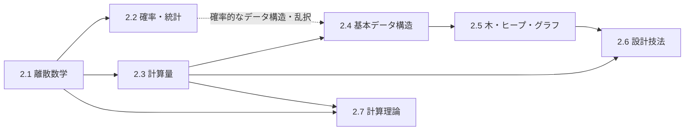

# 第2部 数学とアルゴリズム

> 「この処理は 100 万件で何秒かかるか」「このアラートは本当に障害を示しているか」「このランダムな ID は衝突しないか」「この問題はそもそも効率よく解けるのか」。こうした問いに、勘ではなく根拠を持って答えるための道具が、離散数学・確率統計・アルゴリズム・計算理論です。この部では、問題を抽象化し、アルゴリズムとデータ構造で解き、計算量で効率を議論できるようになること、そして確率・統計を使って不確実性を定量的に扱えるようになることを目指します。

## この部で身につくこと

- **論理で正確に考える**: 仕様を論理式と量化子で書き下して曖昧さをなくし、条件式を安全に変形し、ループや再帰の正しさを不変条件で論証できる（2.1）。
- **数えて見積もる**: 鳩の巣原理・組合せ・誕生日のパラドックス・フェルミ推定で、ID の桁数、衝突確率、テストの組合せ、ストレージの容量を桁で見積もれる（2.1、2.2）。
- **不確実性を扱う**: ベイズの定理、確率分布、パーセンタイル、A/B テスト、待ち行列の理論を使ってデータから正しく結論を引き出し、見積もりを範囲と確率で伝えられる（2.2）。
- **効率を議論する**: O・Θ 記法、漸化式とマスター定理、ならし解析で計算量を評価し、プロファイラと倍増実験で実測と照合し、うっかり二乗を見抜いて直せる（2.3）。
- **データ構造を選ぶ**: 配列・連結リスト・ハッシュテーブル・木・ヒープ・グラフがメモリ上でどう実現されているかを理解し、要件に合わせて選び、組み合わせられる（2.4、2.5）。
- **設計の定石を使う**: 分割統治・貪欲法・動的計画法・バックトラッキング・乱択アルゴリズムを、問題の構造に応じて使い分けられる（2.6）。
- **計算の限界を知る**: 有限オートマトンと正規表現の関係、計算できない問題、効率よく解けそうにない問題（NP 完全）を理解し、現実的な代替策を選べる（2.7）。

## 章の一覧

| 章 | タイトル | 学習時間 | 主な演習 | キーワード |
|---|---|---|---|---|
| 2.1 | [計算機科学のための離散数学](01-discrete-math/README.md) | 本文 4h ＋ 演習 5h | `discrete.py`（真理値表と同値判定、エラトステネスの篩、互除法と繰り返し二乗法、数え上げ、不変条件を検査できる整数平方根、中国剰余定理と玩具の RSA）、記述: 要件の論理式化 | 命題論理, 述語論理, 集合・関係・写像, 帰納法, ループ不変条件, 鳩の巣原理, 包除原理, 剰余, RSA |
| 2.2 | [確率・統計と定量的思考](02-probability-statistics/README.md) | 本文 5h ＋ 演習 5h | `quant.py`（記述統計、テールの増幅と衝突確率、ベイズの定理、A/B テストの検定とサンプルサイズ、M/M/1 の離散事象シミュレーション）、記述: A/B テストの報告のレビュー | ベイズの定理, 基準率の誤り, 裾の重い分布, パーセンタイル, 誕生日のパラドックス, p値, A/Bテスト, リトルの法則, 待ち行列 |
| 2.3 | [計算量とアルゴリズム解析](03-complexity/README.md) | 本文 4h ＋ 演習 5h | `complexity_lab.py`（うっかり二乗の修正、二分探索の変種、動的配列とならし解析、実測からの計算量の推定、カラツバ法とマスター定理）、記述: 夜間バッチの計算量レビュー | O/Θ記法, 最悪計算量, 漸化式, マスター定理, ならし解析, プロファイリング, うっかり二乗 |
| 2.4 | [基本データ構造](04-basic-data-structures/README.md) | 本文 4h ＋ 演習 6h | `structures.py`（リングバッファ、連鎖法と線形探査のハッシュマップ、LRU キャッシュ、ブルームフィルタ）、記述: データ構造の選定 | 配列, 連結リスト, リングバッファ, ハッシュテーブル, HashDoS, LRU キャッシュ, ブルームフィルタ |
| 2.5 | [木・ヒープ・グラフ](05-trees-heaps-graphs/README.md) | 本文 5h ＋ 演習 8h | `trees.py`（二分探索木、ヒープ、トライ木）・`graphs.py`（BFS、トポロジカルソート、ダイクストラ法、Union-Find、依存グラフの分析）、記述: B+木のインデックスの見積もり | 二分探索木, B+木, ヒープ, トライ木, BFS/DFS, トポロジカルソート, ダイクストラ法, Union-Find |
| 2.6 | [アルゴリズム設計技法](06-algorithm-design/README.md) | 本文 5h ＋ 演習 9h | `algorithms.py`（各種ソート、貪欲法、編集距離と行単位の diff、ナップサック、バックトラッキング、外部ソート）、記述: 設計技法の選択 | 分割統治, 貪欲法, 動的計画法, バックトラッキング, 乱択アルゴリズム, 外部ソート |
| 2.7 | [計算理論 — 計算できること・できないこと](07-theory-of-computation/README.md) | 本文 4h ＋ 演習 6h | `automata.py`（DFA・NFA・部分集合構成・括弧の対応）・`thompson_regex.py`（Thompson の構成法による正規表現エンジンと、バックトラッキング方式との比較） | 有限オートマトン, 正規表現, ReDoS, 停止性問題, 計算可能性, P と NP, NP 完全 |

合計の目安は、本文 約 31 時間、演習 約 44 時間です。コード演習は `python3 tools/check.py 2` でまとめてテストできます（章を指定するなら `python3 tools/check.py 2.3` のように）。

## 学習の進め方

### 章の順序と依存関係

- **2.1 は土台**: 論理・集合・帰納法・数え上げは、以降のすべての章で使います。特に 4.3 節の **ループ不変条件** は、2.3 以降でアルゴリズムの正しさを考えるときの共通の道具なので、2.3 の前に必ず読んでください。
- **2.2 は 2.3 と並行してよい**: 確率・統計は第2部の中では独立性が高く、2.3〜2.7 と並行して進められます。2.4 のブルームフィルタや 2.6 の乱択アルゴリズムを読む前に、2.2 の第 1〜2 節（条件付き確率・期待値・分布）と第 4 節（誕生日のパラドックス）を済ませておくと理解が深まります。
- **2.3 → 2.4 → 2.5 → 2.6 は一続き**: 計算量の言葉で、データ構造（2.4、2.5）とアルゴリズムの設計（2.6）を評価していく流れです。2.3 の動的配列とならし解析は 2.4 の、2.3 のマスター定理は 2.6 の分割統治の前提になっています。
- **2.7 は最後に**: 計算量（2.3）と帰納法・背理法（2.1）を前提に、「効率よく解けない」「そもそも解けない」問題の世界を扱います。2.3 で紹介した正規表現の障害事例（ReDoS）の理論的な背景もここで分かります。
- **第1部とのつながり**: 2.3 の 7 節と 2.4 は、[1.3 メモリ階層とキャッシュ](../01-computer-systems/03-memory-hierarchy/README.md) と合わせて読むと、「計算量は同じなのに速さが違う」理由が分かります。

目的別の進め方は次の通りです（詳しくは [学習ガイド](../00-guide/README.md)）。

| トラック | 進め方 |
|---|---|
| フルトラック | 2.1 から順に。2.2 は 2.3〜2.5 と並行してもよい。第1部と第2部を並行して進めるのもよい |
| 経験者トラック | 各章の「理解度チェック」に答えてみて、答えられない章を重点的に。実務経験が長い人ほど 2.2（統計の解釈）と 2.3（計測と計算量の突き合わせ）に発見が多い |
| CTO 準備トラック | 2.2 と 2.3 は必修。2.1 は 1〜3 節（論理・仕様）と 5 節（数え上げ）、2.4〜2.7 は各章の「CTOの視点」と「よくある落とし穴」を中心に |

### この部の学び方

- **数式は小さな数とコードで確かめる**: 式を見て手が止まったら、n = 3 や n = 10 を代入してみる、Python で数行書いて計算してみる、のが最も確実な理解の方法です。本文のコード例はすべて実行して出力を確かめてあるので、自分でも動かし、数字を変えて試してください。
- **演習は「時間」ではなく「回数」でテストされる**: 2.1 と 2.3 の演習の一部は、比較や剰余演算の回数を数えて計算量を確かめます。テストが失敗したら、メッセージに表示される回数が n に対してどう増えているかを見てください。それ自体が計算量の学習です。
- **乱数を使う演習はシードで再現する**: 2.2 のシミュレーションのように乱数を使うプログラムも、`random.Random(seed)` を使えば毎回同じ結果になり、テストもデバッグもできます。これは実務で乱数を使うコードをテストするときの基本です。
- **公式より導き方を覚える**: マスター定理は再帰木から、誕生日のパラドックスは余事象と指数関数の近似から、ベイズの定理は条件付き確率の定義から導けます。導き方を理解していれば、公式を忘れても困りません。

### つまずきやすい点

- **証明への苦手意識**: 2.1 の第 4 節は、最初は例を追うだけでも構いません。ただし「ループ不変条件」と「変量による停止性」だけは、コードを書くときに使えるまで練習してください（2.1 の演習 5、2.3 の演習 2）。
- **p 値と信頼区間の解釈**: 定義を言葉で正確に言えるようになるまで、2.2 の 5 節と理解度チェックを繰り返してください。実務の議論で最も誤用が多い概念です。
- **O 記法の誤解**: 「O は最悪計算量」「O(1) なら速い」はどちらも誤りです。2.3 の 2 節で、定義（量化子の順序）から確認してください。
- **動的計画法**: 2.6 では、「部分問題を何と定義するか」が最大の山場です。表を手で埋めてから実装すると見通しがよくなります。
- **計算理論の抽象度**: 2.7 は抽象的に感じやすい章です。演習の正規表現エンジンを動かし、バックトラッキング方式が特定の入力で急に遅くなる様子を観察してから理論に戻ると、具体的なイメージを持てます。

## 到達度チェック

この部を修了したと言えるのは、次のことができるときです。

- [ ] 自然言語の要件を論理式に翻訳し、曖昧な点を質問に変え、境界値と否定の側を含むテストケースを作れる
- [ ] ループや再帰の正しさを、不変条件（初期化・維持・終了）と変量による停止性で説明できる
- [ ] ID・コード・ハッシュ値の桁数を、鳩の巣原理と誕生日のパラドックスで根拠を持って決められる
- [ ] 剰余演算・ユークリッドの互除法・繰り返し二乗法が暗号とシャーディングのどこで使われるかを説明できる
- [ ] アラートや検知の適合率をベイズの定理で見積もり、誤報を減らす設計を提案できる
- [ ] レイテンシをパーセンタイルで評価し、ファンアウトによるテールの増幅と各サービスに必要な目標を計算できる
- [ ] A/B テストのサンプルサイズを設計し、結果を信頼区間で報告し、のぞき見・SRM・多重比較・交絡を指摘できる
- [ ] リトルの法則と M/M/1 モデルで、必要な同時実行数と目標利用率を見積もれる
- [ ] コードを読んで計算量を見積もり、本番の最大データ量で現実的な時間に終わるかを桁で判断し、計測で確かめられる
- [ ] 操作の種類と頻度・メモリ・最悪ケースの要件からデータ構造を選び、ハッシュテーブルや LRU キャッシュを自分で実装できる
- [ ] 依存関係・経路・連結性の問題をグラフとして定式化し、適切なアルゴリズムを選べる
- [ ] 問題の構造から、分割統治・貪欲法・動的計画法・バックトラッキングのどれが使えるかを判断できる
- [ ] 正規表現のバックトラッキングによる計算量の爆発を説明でき、NP 困難な問題に出会ったときに、近似・問題の制限・ソルバーの利用といった現実的な代替策を提案できる

## この部の推薦図書・教材

- Eric Lehman, F. Thomson Leighton, Albert R. Meyer "Mathematics for Computer Science"（MIT 6.042J の教科書。PDF が無料で公開されている）— 論理・証明・整数論・数え上げ・グラフ・確率を、計算機科学の題材で一冊にまとめた教科書。2.1 と 2.2 の主教科書として。
- 結城浩『プログラマの数学 第2版』（SBクリエイティブ）— 論理・剰余・帰納法・組合せ・再帰を平易に解説。数学から離れていた人の最初の一冊に。
- Thomas H. Cormen ほか "Introduction to Algorithms"（邦訳『アルゴリズムイントロダクション』近代科学社）— 計算量、データ構造、設計技法、NP 完全性までを厳密に扱う定番の教科書。辞書的に使うとよい。
- 大槻兼資『問題解決力を鍛える! アルゴリズムとデータ構造』（講談社）— 計算量の考え方から設計技法までを、日本語で丁寧に解説した入門書。2.3〜2.6 の副読本に。
- Robert Sedgewick, Kevin Wayne "Algorithms"（第 4 版）と、Coursera の講義 "Algorithms, Part I / II"（Princeton 大学、無料で受講できる）— 実装と実験を重視したアルゴリズムの教材。
- Michael Sipser "Introduction to the Theory of Computation"（邦訳『計算理論の基礎』共立出版）— オートマトン・計算可能性・計算複雑性の標準的な教科書。2.7 をさらに深めるなら。
- Ron Kohavi, Diane Tang, Ya Xu "Trustworthy Online Controlled Experiments"（邦訳『A/Bテスト実践ガイド 真のデータドリブンへ至る信用できる実験とは』KADOKAWA）— 2.2 の A/B テストの内容を、実務の規模で学び直すための定番書。
- AtCoder などの競技プログラミングの過去問 — 制約（n の上限）から必要な計算量を見積もり、適切なアルゴリズムを選ぶ練習に向いています。面接対策ではなく、「見積もってから書く」習慣を身につける目的で使うとよいでしょう。

## 次に進む

- [第3部 プログラミング言語](../03-programming-languages/README.md) では、この部で学んだ再帰的な定義（2.1）、木（2.5）、オートマトンと構文解析（2.7）を使って、[3.4 言語処理系を作る](../03-programming-languages/04-build-an-interpreter/README.md) で小さなインタプリタを実装します。
- この部の内容は、後の部の多くの章の前提になっています。例えば、B+木とハッシュは [6.2 インデックスとクエリ処理](../06-databases/02-indexes-and-query-processing/README.md)、剰余とハッシュによるデータの分散は [7.3 パーティショニング](../07-distributed-systems/03-partitioning/README.md)、パーセンタイル・待ち行列・アラートの適合率は [10.3 信頼性設計とSLO](../10-cloud-and-sre/03-reliability-engineering/README.md) と [10.4 オブザーバビリティ](../10-cloud-and-sre/04-observability/README.md)、整数論は [11.2 暗号技術の基礎](../11-security/02-cryptography/README.md)、統計的な推定と検定は [12.2 機械学習の基礎](../12-data-and-ai/02-machine-learning/README.md) で使います。
- 後の章で「なぜそうなるのか」が分からなくなったら、この部の該当する節に戻ってください。数学とアルゴリズムは、一度で身につけるものではなく、使うたびに理解が深まるものです。
