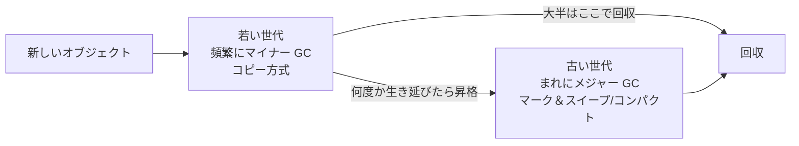

# 3.3 メモリ管理とランタイム

> プログラムが使うメモリは、誰かが確保し、使い終わったら誰かが返さなければなりません。それをプログラマが手で行うのか、実行時に参照を数えるのか、到達できるものを探すのか、コンパイラが所有者を追跡するのか。この選択は、性能・レイテンシ・メモリ使用量・安全性、そしてセキュリティ脆弱性の数にまで直結します。この章では、malloc の中身からガベージコレクタのアルゴリズム、Rust の所有権、コンテナでの OOM までを、実装しながら理解します。

| 項目 | 内容 |
|---|---|
| 学習時間の目安 | 本文 3.5h ＋ 演習 6h |
| 前提となる章 | [1.4 プログラムが動く仕組み](../../01-computer-systems/04-how-programs-run/README.md)（スタックとヒープ）、[3.1 プログラミングパラダイムと抽象化](../01-paradigms/README.md) |
| 演習 | [exercises/](exercises/)（Python） |
| キーワード | スタック, ヒープ, malloc/free, 断片化, use-after-free, 参照カウント, マーク＆スイープ, コピー GC, 世代別 GC, 所有権, RAII, メモリリーク, OOMKilled |

## この章のゴール

- [ ] スタックとヒープの使い分けと、ヒープの寿命管理が難しい理由を説明できる
- [ ] 手動管理の典型的なバグ（バッファオーバーフロー、use-after-free、二重解放、リーク）を説明し、サニタイザで検出できる
- [ ] フリーリスト方式のアロケータを実装し、内部断片化と外部断片化を説明できる
- [ ] 参照カウントとトレーシング GC（マーク＆スイープ、コピー、世代別）の仕組みとトレードオフを説明し、実装できる
- [ ] JVM・Go・CPython のメモリ管理の特徴を踏まえ、レイテンシやメモリ上限の要件に合う設定を選べる
- [ ] 所有権と借用（Rust）、RAII（C++）がメモリ安全性をどう実現するかを説明できる
- [ ] GC のある言語でのメモリリークや、コンテナの OOMKilled を調査できる

## なぜ学ぶのか

メモリ管理の誤りは、セキュリティと運用の両面で、最も大きな損失を生む原因の 1 つです。

- **セキュリティ**: Microsoft は 2019 年、同社が毎年 CVE を割り当てる脆弱性の約 70% がメモリ安全性の問題だと報告しました。Google の Chromium プロジェクトも 2020 年に、深刻度の高いセキュリティバグの約 70% がメモリ安全性の問題だと公表しています。2014 年の Heartbleed（CVE-2014-0160）は、OpenSSL の TLS ハートビート処理で、相手が申告した長さを検査せずにメモリを読み出して返していたため、1 回の要求で最大 64KB のサーバーのメモリ（秘密鍵やパスワードを含みうる）が漏れる脆弱性でした。
- **言語選択の効果**: Google は 2024 年、Android で新規コードを Rust などのメモリ安全な言語で書く方針を進めた結果、脆弱性全体に占めるメモリ安全性の問題の割合が 2019 年の 76% から 2024 年には 24% に下がったと報告しています。
- **運用**: GC のある言語でも、メモリの問題はなくなりません。上限のないキャッシュによるメモリリーク、コンテナのメモリ上限とランタイムの設定の不一致による OOMKilled（メモリ不足によるプロセスの強制終了）、GC の停止によるレイテンシの悪化は、本番障害の定番です。Discord は 2020 年のブログで、Go で書かれたあるサービスで GC に起因する周期的なレイテンシの悪化が見られ、Rust で書き直したと報告しています（Go の GC はその後も改良されており、どの言語が常に優れているという話ではありません）。

## 1. メモリの全体像 — スタックとヒープ

[1.4 プログラムが動く仕組み](../../01-computer-systems/04-how-programs-run/README.md) で見たように、プログラムのデータは主に 2 つの領域に置かれます。

| 領域 | 確保と解放 | 寿命 | 速さ | 向いているもの |
|---|---|---|---|---|
| スタック | 関数の呼び出しでフレームを積み、戻るときに丸ごと捨てる | 関数の実行中だけ | 非常に速い（ポインタを動かすだけ） | 局所変数、大きさが決まっていて関数の外に出ない値 |
| ヒープ | 必要なときに確保し、不要になったら解放する | 任意（誰かが解放するまで） | 相対的に遅い（空き領域の管理が必要） | 大きさが実行時に決まる値、関数より長く生きる値 |

スタックの管理は自明です。関数から戻れば、そのフレームの変数は不要です。難しいのは **ヒープの寿命** で、「このオブジェクトはもう誰にも使われないか」は、一般にはコンパイル時に分かりません。どこかのデータ構造やクロージャが参照を持ち続けているかもしれないからです。

Go や Java（JIT）のコンパイラは **エスケープ解析（escape analysis）** で、関数の外に出ない値をスタックに置き、ヒープの負担を減らします。Go では `-gcflags=-m` で判断を確認できます（Go 1.24 での出力）。

```go
func sum(n int) int {
	p := Point{n, n} // 関数の外に出ない → スタックに置ける
	return p.X + p.Y
}

func newPoint(n int) *Point {
	p := Point{n, n} // ポインタが関数の外に出る（エスケープする）→ ヒープに置く
	return &p
}
// $ go build -gcflags=-m
// ./main.go:13:2: moved to heap: p
```

ヒープの寿命を管理する方式は、大きく 4 つに分けられます。

| 方式 | 誰がいつ解放を決めるか | 代表例 |
|---|---|---|
| 手動管理 | プログラマが `free` を呼ぶ | C, C++（生のポインタ） |
| 参照カウント | 実行時に参照の数を数え、0 になった瞬間に解放 | CPython, Swift, C++ の `shared_ptr`, Rust の `Rc`/`Arc` |
| トレーシング GC | 実行時に、ルートから到達できないものをまとめて回収 | Java, Go, C#, JavaScript, Ruby |
| 所有権 | コンパイラが所有者を追跡し、所有者がスコープを抜けたら解放 | Rust, C++ の RAII と `unique_ptr` |

## 2. 手動管理 — malloc と free

### 2.1 malloc の中身

`malloc(n)` は、OS から大きめの領域をまとめて受け取り（`brk` や `mmap` システムコール。[4.2 仮想メモリ](../../04-operating-systems/02-virtual-memory/README.md)）、それを切り分けて返します。典型的な実装では、各ブロックの前に **ヘッダ** を置いて大きさと使用中かどうかを記録し、空きブロックを **フリーリスト** で管理します。

```text
ヒープ: [hdr|  使用中 A  ][hdr|  空き  ][hdr| 使用中 B ][hdr|        空き         ]
         ^                                  malloc が返すのはヘッダの直後のアドレス
```

- **配置方針**: 要求に合う空きブロックをどう選ぶか。最初に見つかったものを使う **first fit** と、最も小さく収まるものを使う **best fit** などがある。
- **分割（splitting）**: 大きな空きブロックから必要な分だけ切り出し、残りを新しい空きブロックにする。
- **結合（coalescing）**: 解放したブロックの前後が空いていれば 1 つにまとめる。まとめないと小さな空きばかりが増える。

ここで 2 種類の無駄が生じます。**内部断片化（internal fragmentation）** は、アラインメントや最小ブロックサイズのために、要求より大きなブロックを渡すことによる無駄です（演習 2 のアロケータでは `malloc(1)` でも 16 バイトのブロックを使います）。**外部断片化（external fragmentation）** は、空きの合計は十分なのに、細かく散らばっているために大きな要求に応えられない状態です。演習 2 のテストでは、1024 バイトのヒープで 512 バイト空いているのに 100 バイトを確保できない状況を再現します。

実際のアロケータ（glibc の malloc、jemalloc、tcmalloc、mimalloc など）は、大きさごとの区分（サイズクラス）、スレッドごとのキャッシュ、大きな要求は `mmap` で直接確保する、といった工夫で、速度・断片化・マルチスレッドでの競合のバランスを取っています。アロケータの差し替えだけでメモリ使用量や性能が大きく変わることもあります。

### 2.2 手動管理のバグ

手動管理では、確保と解放の対応をプログラマがすべて正しく書く必要があります。間違えると次のバグになります。

| バグ | 内容 | 結果 |
|---|---|---|
| バッファオーバーフロー | 確保した範囲の外に書き込む・読み出す（空間的な誤り） | 隣のデータやヒープの管理情報の破壊。Heartbleed は範囲外の読み出し |
| use-after-free | 解放済みの領域を使う（時間的な誤り） | 再利用された別のデータを読み書きする。攻撃者に悪用されやすい |
| 二重解放（double free） | 同じ領域を 2 回解放する | アロケータの管理情報が壊れ、任意のメモリ書き込みにつながることがある |
| メモリリーク | 解放を忘れる | 長時間動くプロセスのメモリが増え続け、いずれ落ちる |
| ダングリングポインタ | 寿命が終わったもの（解放済みの領域や、戻った関数の局所変数）を指すポインタ | 上記のバグの原因になる |

C では、これらの多くがコンパイルも実行も「一見正常に」通ってしまうのが怖いところです。**AddressSanitizer（ASan）** は、コンパイラが検査コードを埋め込んで、実行時にこれらを検出するツールです（GCC・Clang で `-fsanitize=address`）。以下は GCC 13 と glibc 2.39 での出力の抜粋です（アドレスは実行ごとに変わります。パスと一部の行は省略しています）。

```c
char *buf = malloc(8);
strcpy(buf, "overflow!");   /* 終端の \0 を含めて 10 バイトを 8 バイトの領域に書く */
```

```text
==5067==ERROR: AddressSanitizer: heap-buffer-overflow on address 0x502000000018 ...
WRITE of size 10 at 0x502000000018 thread T0
```

```c
int *p = malloc(4 * sizeof(int));
p[0] = 42;
free(p);
printf("%d\n", p[0]);       /* use-after-free */
```

```text
==2441==ERROR: AddressSanitizer: heap-use-after-free on address 0x502000000010 ...
READ of size 4 at 0x502000000010 thread T0
    #0 ... in main uaf.c:7
...
freed by thread T0 here:
    #0 ... in free ...
    #1 ... in main uaf.c:6
previously allocated by thread T0 here:
    #0 ... in malloc ...
    #1 ... in main uaf.c:4
```

「どこで使い、どこで解放し、どこで確保したか」の 3 か所を示してくれるので、原因の特定が格段に速くなります。リークは ASan に含まれる LeakSanitizer が、プログラムの終了時に報告します。

```c
char *make_greeting(const char *name) {
    char *s = malloc(64);
    strcpy(s, "hello, ");
    strcat(s, name);
    return s;                   /* 呼び出し側が free する責任を負う */
}
/* main で make_greeting("world") を 3 回呼び、戻り値を捨てる */
```

```text
==5076==ERROR: LeakSanitizer: detected memory leaks

Direct leak of 192 byte(s) in 3 object(s) allocated from:
    #0 ... in malloc ...
    #1 ... in make_greeting leak.c:5
    #2 ... in main leak.c:13
```

サニタイザなしでも、glibc の malloc は一部の二重解放を検出してプロセスを止めます（`free(p); free(p);` の実行結果）。

```text
free(): double free detected in tcache 2
Aborted                 （終了コード 134 = 128 + SIGABRT の 6）
```

ただし、これは検出できた場合の話で、検出されずに壊れたまま動き続けることも多いのです。関数の局所変数のアドレスを返すダングリングポインタは、GCC が `-Wall` で `function returns address of local variable` と警告します（GCC 13 はこの場合、戻り値を NULL に置き換えるので、実行すると `(nil)` と表示されます）。**C/C++ のコードは、サニタイザを有効にしたテストとファジング（[11.5 セキュリティ運用とサプライチェーン](../../11-security/05-security-operations/README.md)）を CI で常に回す** のが現代の最低限の実務です。

## 3. 参照カウント

### 3.1 仕組み

**参照カウント（reference counting）** では、各オブジェクトが「自分を指している参照の数」を持ち、参照が増えるたびに +1、消えるたびに −1 し、**0 になった瞬間に解放** します。CPython の基本の方式です。

```python
import sys

class Resource:
    def __init__(self, name):
        self.name = name
    def __del__(self):
        print(f"  解放: {self.name}")

r = Resource("A")
print(sys.getrefcount(r))   # 2（引数として渡す一時的な参照も数えるので +1。値は Python 3.11 のもの）
alias = r
print(sys.getrefcount(r))   # 3
del r                       # まだ alias が参照している
del alias                   # ここで参照カウントが 0 になり、「解放: A」が即座に表示される
```

参照カウントの長所は、**ゴミがすぐに回収され、解放のタイミングが予測できる** ことです。ファイルやソケットのようなリソースも、最後の参照が消えた時点で閉じられます。また、回収の仕事が細かく分散しているので、長い停止が起きにくい性質があります。短所は次の 3 つです。

1. **カウンタの更新コスト**: 参照をコピーするたびにメモリへの書き込みが発生する。マルチスレッドでは原子的な操作が必要になり、さらに遅くなる（Rust は単一スレッド用の `Rc` と、スレッド間で共有できる `Arc` を型で区別している）。
2. **連鎖的な解放**: 巨大なデータ構造の最後の参照が消えると、その場で全体が解放され、そこだけ時間がかかる。
3. **循環参照を回収できない**: 互いに参照し合うオブジェクトは、外から誰も参照していなくてもカウントが 0 にならない。

### 3.2 循環参照と CPython の循環 GC

```python
import gc

class Node:
    def __init__(self, name):
        self.name = name
        self.other = None
    def __del__(self):
        print(f"  解放: {self.name}")

gc.disable()                     # 説明のため、自動の循環 GC を止める
a, b = Node("a"), Node("b")
a.other, b.other = b, a          # 循環参照
del a, b
print("a と b を削除した（循環しているので解放されない）")
print("回収したオブジェクト数:", gc.collect())
```

```text
a と b を削除した（循環しているので解放されない）
  解放: a
  解放: b
回収したオブジェクト数: 2
```

（Python 3.11 での出力。3.10 では回収数が 4 と表示されます。バージョンによって、インスタンスの属性辞書を別のオブジェクトとして数えるかどうかが違うためです。）

CPython は、参照カウントを補うために **循環ガベージコレクタ** を持っています。その中心にあるのが、演習 3 で実装する **試行削除（trial deletion）** の考え方です。

1. 各オブジェクトの参照カウントを作業用にコピーする。
2. コンテナ（リスト・辞書・インスタンスなど）どうしの内部参照の分だけ、作業用のカウントを減らす。残った値は「ヒープの外（変数など）からの参照」の数になる。
3. 外から参照されているものを起点にたどって到達できるものは生きている。残りは、互いの参照だけで生き延びていたゴミである。

CPython の循環 GC は世代別に動き、新しく作られたオブジェクトほど頻繁に検査します（`gc.get_threshold()` は Python 3.11 で `(700, 10, 10)`。実装の詳細はバージョンによって変わっています）。循環を最初から作らないためには、**弱参照（weak reference）** を使います。弱参照は参照カウントに数えられない参照で、キャッシュや親への逆参照に向いています。

```python
import weakref

class Image:
    def __init__(self, path):
        self.path = path

cache = weakref.WeakValueDictionary()   # 値を弱参照で持つ辞書
img = Image("cat.png")
cache["cat.png"] = img
print(list(cache.keys()))               # ['cat.png']
del img                                 # 強い参照がなくなると、キャッシュからも自動で消える
print(list(cache.keys()))               # []
```

Swift の ARC（コンパイラが参照カウントの操作を自動で挿入する方式）でも、循環を避けるために `weak` や `unowned` を使い分けます。

## 4. トレーシング GC

### 4.1 到達可能性とマーク＆スイープ

**トレーシング GC（tracing garbage collection）** は、発想を逆にします。参照を数える代わりに、**ルート（root）** から参照をたどって到達できるオブジェクトを「生きている」とし、それ以外をまとめて回収します。ルートとは、グローバル変数、各スレッドのスタック上の局所変数、CPU のレジスタなど、プログラムが直接たどれる参照です。到達できないものは、二度と使われることがありません。循環していても、ルートから届かなければ回収されます。

最も基本的なのが **マーク＆スイープ（mark-and-sweep）** です（演習 1）。

1. **マーク**: ルートから参照をたどり、到達したオブジェクトに印を付ける。
2. **スイープ**: ヒープ全体を走査し、印のないオブジェクトを解放する。

マークの進行状況は **3 色の抽象（tri-color abstraction）** で説明されます。白は未到達（最後まで白ならゴミ）、灰色は到達したが参照先をまだ調べていないもの、黒は参照先まで調べ終えたものです。マークは「灰色がなくなるまで、灰色を 1 つ取り出して黒にし、その参照先の白を灰色にする」という作業の繰り返しです。演習 1 では、灰色の集合をスタック（作業リスト）で表します。

マーク＆スイープはオブジェクトを動かさないので、空き領域が散らばる **外部断片化** が起きます。これを解決するのが、生きているオブジェクトを片側に寄せて詰める **マーク＆コンパクト（mark-compact）** と、次に述べるコピー GC です。

### 4.2 コピー GC（Cheney のアルゴリズム）

**コピー GC（copying GC）** は、ヒープを同じ大きさの 2 つの空間（from 空間と to 空間）に分け、普段は from 空間だけを使います。GC のときは、生きているオブジェクトだけを to 空間に **コピー** し、空間の役割を入れ替えます。from 空間に残ったものは、中身を見ることすらなく丸ごと捨てられます。1970 年に C. J. Cheney が示した方法では、to 空間そのものを幅優先探索のキューとして使うので、追加のスタックが要りません（演習 4）。

```text
コピーの途中（A がルート。A→B, A→C, B→D を参照）

from: [A→A'][ゴミ][B→B'][C][D][ゴミ]     コピーしたら元の場所に転送先（→A'）を書く
to:   [A'][B'][   空き   ]
       ^scan  ^free
       scan: 次に参照を調べるオブジェクト  free: 次にコピーする場所
       scan と free の間が「コピー済みだが参照先を未処理」のオブジェクト（キュー）
```

同じオブジェクトに 2 度目に出会ったら、元の場所に書いた **転送ポインタ（forwarding pointer）** を見て、コピーせずに新しいアドレスを使います。これで共有されたオブジェクトは 1 回だけコピーされ、循環も正しく保たれます。コピー GC の性質は次の通りです。

- **断片化しない**: 生きているオブジェクトは to 空間の先頭に詰めて並ぶ。
- **確保が非常に速い**: 空き領域は常に 1 つの連続した領域なので、ポインタを進めるだけで確保できる（**バンプポインタ割り当て**）。
- **GC の時間は生きているデータの量に比例する**: ゴミがどれだけ多くても、コピーするのは生きているものだけ。
- **メモリを 2 倍使う**: 常に半分が空いている必要がある。
- **オブジェクトが移動する**: すべての参照を正確に知り、書き換える必要がある。演習 4 では、GC を起こす確保の途中に渡された参照まで更新しなければならないことを体験します。

### 4.3 世代別 GC

多くのプログラムで、**ほとんどのオブジェクトは作られてすぐに不要になる** ことが観察されています（リクエストの処理中だけ使う一時オブジェクトなど）。これを **世代仮説（generational hypothesis）** と呼びます。Ungar は 1984 年の論文 "Generation Scavenging" で、この性質を利用する GC を示しました。

**世代別 GC（generational GC）** は、ヒープを若い世代と古い世代に分け、若い世代だけを頻繁に回収します（マイナー GC）。若い世代はほとんどがゴミなので、生きているものだけをコピーするコピー GC が非常に効率的です。何度かのマイナー GC を生き延びたオブジェクトは古い世代に **昇格（promotion）** し、古い世代はまれにしか回収しません（メジャー GC）。



問題は、古い世代のオブジェクトが若いオブジェクトを参照している場合です。マイナー GC で古い世代まで調べたら意味がないので、**ライトバリア（write barrier）**（参照の書き込みのたびに実行される小さなコード）で「古い → 若い」参照が作られたことを記録し（**記憶集合**, remembered set。カードテーブルとして実装されることが多い）、それもマイナー GC のルートに加えます。

### 4.4 停止時間とテールレイテンシ

GC がマークやコピーをしている間、プログラム（GC の用語では **ミューテータ**）を止める方式を **Stop-the-World（STW）** と呼びます。停止はリクエストの処理時間にそのまま上乗せされるので、平均ではなく **テールレイテンシ**（p99、p99.9 などの遅い側の分布。[10.3 信頼性設計とSLO](../../10-cloud-and-sre/03-reliability-engineering/README.md)）に効きます。例えば 1 秒間に 1,000 件のリクエストを処理するサービスで、10 秒に 1 回 50 ミリ秒の停止があると、その間に到着した約 50 件（全体の約 0.5%）が最大 50 ミリ秒待たされます。p99 には表れにくくても、p99.9 は大きく悪化します。

停止を短くする技術が、GC の仕事を細切れにしてプログラムと交互に進める **インクリメンタル GC**、別のスレッドでプログラムと同時に進める **並行 GC（concurrent GC）** です。並行 GC では、マーク中にプログラムが参照を書き換えるので、「黒のオブジェクトが白のオブジェクトを指し、灰色からは誰も指していない」状態が生じると、生きているオブジェクトを回収してしまいます。これを防ぐのもライトバリアの役割です。並行 GC は停止時間を短くする代わりに、バリアのコストと GC 用の CPU を余分に使い、スループットをいくらか犠牲にします。**レイテンシ・スループット・メモリ使用量の 3 つは同時には最適化できない**、というのが GC のトレードオフの本質です。

| 方式 | 断片化 | 停止時間 | メモリの余裕 | 主な使われ方 |
|---|---|---|---|---|
| 参照カウント | あり | 短い（連鎖解放を除く） | 少なくてよい | CPython, Swift |
| マーク＆スイープ | あり | ヒープ全体に比例（並行化で短縮） | 少なめ | Go、古い世代 |
| マーク＆コンパクト | なし | 長め | 少なめ | 古い世代 |
| コピー | なし | 生きているデータに比例 | 2 倍必要 | 若い世代 |

## 5. 実際のランタイム

以下は 2026 年時点の概要です。GC の実装は活発に改良されているので、採用・設定の前に各ランタイムの公式ドキュメントとリリースノートを確認してください。

### 5.1 JVM

JVM は複数の GC を選べます。JDK 9 以降の既定は **G1**（Garbage-First）で、ヒープを多数の領域（リージョン）に分け、停止時間の目標を満たすよう回収する領域を選ぶ世代別 GC です。停止時間を極端に短くしたい用途には、プログラムと並行してオブジェクトを移動する **ZGC** や **Shenandoah** があり、ヒープの大きさにほとんど依存しない短い停止を目標としています（ZGC は 1 ミリ秒未満の停止を目標に掲げ、JDK 21 で世代別のモードが加わりました）。スループット重視のバッチ処理には Parallel GC、小さな環境には Serial GC が向いています。

JVM は、コンテナのメモリ上限を認識して既定のヒープ上限を決めます（JDK 10 で導入され、8u191 以降にも取り込まれた `UseContainerSupport`）。その既定値に注意が必要です。JDK 21 で確認できます。

```text
$ java -XX:+PrintFlagsFinal -version | grep -E 'UseG1GC|UseContainerSupport|MaxRAMPercentage'
   double MaxRAMPercentage       = 25.000000     {product} {default}
     bool UseContainerSupport    = true          {product} {default}
     bool UseG1GC                = true          {product} {ergonomic}
```

`MaxRAMPercentage` の既定は 25% なので、メモリ上限 4 GiB のコンテナでも、ヒープの上限は 1 GiB になります。また、この環境で `-XX:ActiveProcessorCount=1` を付けて CPU が 1 つの状況にすると、`UseSerialGC = true` に切り替わりました。**小さなコンテナでは、意図しない GC とヒープ上限で動いている** ことがよくあります。

### 5.2 Go

Go の GC は、オブジェクトを移動しない並行マーク＆スイープで、停止時間を短く保つことを重視しています。調整の主なつまみは 2 つです。

- **`GOGC`**（既定 100）: 前回の GC 後の生きているヒープに対して、何 % 増えたら次の GC を始めるか。大きくすると GC の回数（CPU）が減る代わりに、メモリを多く使う。
- **`GOMEMLIMIT`**（Go 1.19 以降）: ランタイムが使うメモリの **ソフトな上限**。上限に近づくと GC を頻繁に行って守ろうとする。

1 MiB の確保を 200 回繰り返し、そのうち 20 個だけを保持し続けるプログラムで、設定による違いを見てみましょう（Go 1.24、この環境での一例）。

| 設定 | GC の回数 | 終了時のヒープ使用量 |
|---|---|---|
| `GOGC=100`（既定） | 25 | 30 MiB |
| `GOGC=400` | 7 | 30 MiB |
| `GOGC=off` | 0 | 200 MiB |
| `GOGC=off GOMEMLIMIT=64MiB` | 4 | 41 MiB |

GC を止めればメモリは際限なく増え、`GOMEMLIMIT` を併用すれば「上限に近づくまでは GC しない」という動作になります。コンテナで動かすなら、`GOMEMLIMIT` をメモリ上限より少し低く（例えば 9 割程度に）設定するのが定石です。`GODEBUG=gctrace=1` を付けると、GC のたびに停止時間やヒープの大きさが 1 行ずつ出力されます。

### 5.3 CPython とその他

CPython は、参照カウントを主とし、循環 GC で補う方式です（3 章）。Python 3.12 では、`None` や小さな整数のように参照カウントを更新しない **不滅オブジェクト（immortal objects）** が導入され、3.13 では GIL を外したビルドが実験的に提供されるなど、マルチスレッド化に向けて参照カウントの実装も変わりつつあります。JavaScript の V8 は、若い世代をコピー方式、古い世代を並行マーク＆コンパクトで回収する世代別 GC です。.NET も世代別 GC で、サーバー向けとワークステーション向けのモードを選べます。

## 6. 所有権・RAII・アリーナ

### 6.1 RAII

C++ の **RAII**（Resource Acquisition Is Initialization）は、リソースの寿命をオブジェクトの寿命に結び付ける手法です。コンストラクタで確保し、デストラクタで解放します。デストラクタは、スコープを抜けるとき（例外で抜ける場合も含む）に必ず呼ばれます。

```cpp
struct File {
    const char *name;
    explicit File(const char *n) : name(n) { std::printf("open  %s\n", name); }
    ~File() { std::printf("close %s\n", name); }   // デストラクタで必ず解放する
};

void work(bool fail) {
    File a("a.txt");
    auto b = std::make_unique<File>("b.txt");      // ヒープ上のオブジェクトも所有者は 1 人
    if (fail) throw 42;                            // 例外で抜けても a と b は解放される
    std::printf("work done\n");
}
// work(true) の出力: open a.txt / open b.txt / close b.txt / close a.txt（作った逆順に解放）
```

`std::unique_ptr` は所有者が 1 人のポインタ、`std::shared_ptr` は参照カウント付きのポインタです。Python の `with` 文やコンテキストマネージャ、Go の `defer`、Java の try-with-resources も、「解放を確実に行う」という同じ目的の仕組みです。

### 6.2 Rust の所有権と借用

Rust は、GC を使わずに、メモリ安全性を **コンパイル時に** 保証します。規則は次の 3 つです。

1. 値には、ただ 1 つの **所有者（owner）** がいる。所有者がスコープを抜けると、値は解放される（RAII と同じ）。
2. 値の所有権は、代入や関数呼び出しで **移動（move）** する。移動した後の変数は使えない。
3. 値を移動せずに使うには **借用（borrow）** する。ある時点で、「不変の借用（`&T`）がいくつでも」か「可変の借用（`&mut T`）が 1 つだけ」のどちらかしか許されない。

次のコードは、C++ ならコンパイルが通ってしまう典型的なバグです。

```cpp
std::vector<int> scores = {10, 20, 30};
int &first = scores[0];         // 要素への参照
scores.push_back(40);           // 容量が足りず再確保 → 古い領域は解放される
std::cout << first << "\n";     // 解放済みの領域を読む（未定義動作）
```

```text
==6495==ERROR: AddressSanitizer: heap-use-after-free on address 0x502000000010 ...
```

同じことを Rust で書くと、借用の規則に反するのでコンパイルエラーになります（rustc 1.94 での出力）。

```rust
let mut scores = vec![10, 20, 30];
let first = &scores[0];         // 不変の借用
scores.push(40);                // 可変の借用が必要（再確保で要素が移動しうる）
println!("{}", first);
```

```text
error[E0502]: cannot borrow `scores` as mutable because it is also borrowed as immutable
 --> borrow.rs:4:5
  |
3 |     let first = &scores[0];         // 不変の借用
  |                  ------ immutable borrow occurs here
4 |     scores.push(40);                // 可変の借用が必要（再確保で要素が移動しうる）
  |     ^^^^^^^^^^^^^^^ mutable borrow occurs here
5 |     println!("{}", first);
  |                    ----- immutable borrow later used here
```

所有権は、use-after-free・二重解放（所有者は 1 人なので解放も 1 回）・データ競合（可変の借用は同時に 1 つ）を、実行時のコストなしに防ぎます。代償は学習コストと、借用の規則に合う設計を考える手間です。循環するデータ構造は素直には書けず、参照カウントの `Rc`/`Arc` と弱参照の `Weak`、あるいは後述のアリーナとインデックスを使います。規則を一時的に外す `unsafe` もありますが、その範囲を小さく保ち、そこだけを重点的にレビューするのが Rust の安全性の考え方です。

### 6.3 アリーナとプール

**アリーナ（arena, region）** は、大きな領域をまとめて確保し、その中にバンプポインタでオブジェクトを次々に置き、**最後にアリーナごと一度に解放する** 方式です。1 つのリクエストの処理中だけ使うデータ、コンパイラが 1 回のコンパイル中に作る構文木など、寿命がそろっているオブジェクトに向いています。個別の解放が不要なので速く、リークもしにくくなります。

**オブジェクトプール（object pool）** は、使い終わったオブジェクトを捨てずに再利用する方式です（Go の `sync.Pool` など）。確保のコストが高い場合には有効ですが、GC のある言語では、長生きするオブジェクトが増えて世代別 GC の前提を崩したり、前の利用者のデータが残ったまま再利用されるバグ（情報漏えいにもなりうる）を生んだりします。測定して効果が確認できた場合に限って使うべき道具です。

## 7. GC のある言語のメモリリークと本番運用

### 7.1 GC があってもリークは起きる

GC が回収するのは「到達できないもの」だけです。**到達できるが二度と使わないもの** は回収されません。これが GC のある言語でのメモリリークです。

| パターン | 例 |
|---|---|
| 上限のないキャッシュ | リクエスト ID やユーザー ID をキーにした辞書に追加し続け、削除しない |
| グローバルな登録簿 | シングルトンやクラス変数のリスト・辞書に、処理済みのオブジェクトを登録したまま |
| リスナー・コールバック | イベントに登録したハンドラを解除し忘れる（ハンドラが捕まえた大きなオブジェクトも生き残る） |
| クロージャ | 長生きするクロージャが、必要以上に大きなオブジェクトを捕まえている |
| スレッドローカル変数 | スレッドプールのスレッドは終わらないので、そこに置いたものも解放されない |
| メソッドのメモ化 | `functools.lru_cache` をメソッドに付けると、キャッシュが `self` を参照し続ける（[3.1](../01-paradigms/README.md)） |

Python では `tracemalloc` で、どの行で確保されたメモリが増えたかを調べられます。

```python
import tracemalloc

_cache = {}                                  # 上限のないキャッシュ（よくあるリークの原因）

def handle_request(request_id: int) -> str:
    body = f"<p>request {request_id}</p>" * 20
    _cache[request_id] = body                # 一意なキーで追加し続け、決して消さない
    return body

tracemalloc.start()
before = tracemalloc.take_snapshot()
for i in range(10_000):
    handle_request(i)
after = tracemalloc.take_snapshot()
for stat in after.compare_to(before, "lineno")[:3]:
    print(stat)
```

```text
app.py:6: size=4168 KiB (+4168 KiB), count=10000 (+10000), average=427 B
app.py:12: size=304 KiB (+304 KiB), count=9743 (+9743), average=32 B
app.py:7: size=288 KiB (+288 KiB), count=1 (+1), average=288 KiB
```

（Python 3.11 での出力。パスは省略しています。）6 行目で確保された文字列が 1 万個、合計 4 MiB 増えていることが分かります。12 行目はキーになった整数、7 行目は辞書の拡張です。対策は、キャッシュに上限（LRU など）と有効期限を設けることです。

本番環境では、ヒープダンプやヒーププロファイルを使います。Java なら `jcmd <pid> GC.heap_dump` で取得して Eclipse MAT などで解析し、Go なら `net/http/pprof` のヒーププロファイルを `go tool pprof` で見ます。**ヒープダンプにはパスワード・トークン・個人情報がそのまま含まれうる** ので、機密データとして扱う必要があります。

### 7.2 コンテナとメモリ上限

コンテナのメモリ上限は、Linux の **cgroup** で設定されます（[4.5 仮想化とコンテナ](../../04-operating-systems/05-virtualization-and-containers/README.md)）。上限を超えると、カーネルの OOM キラーがプロセスを `SIGKILL` で強制終了します。Kubernetes では、コンテナの終了理由が `OOMKilled`、終了コードが 137（128 + SIGKILL の 9）と表示されます（[10.2](../../10-cloud-and-sre/02-containers-and-kubernetes/README.md)）。

ここで大事なのは、**プロセスが使うメモリはヒープだけではない** ことです。OS から見たプロセスのメモリ使用量（RSS: resident set size）には、ヒープのほかに、スレッドのスタック、JIT のコード領域、JVM のメタスペースやダイレクトバッファ、ネイティブライブラリが確保した領域、アロケータの断片化による未返却の領域が含まれます。

| ランタイム | 押さえるべき設定・注意点 |
|---|---|
| JVM | 既定のヒープ上限はコンテナの上限の 25%。`-XX:MaxRAMPercentage` や `-Xmx` で明示し、ヒープ以外の領域の余裕を残す |
| Go | `GOMEMLIMIT` を上限より少し低く設定しないと、`GOGC=100` のもとでヒープが生きているデータの約 2 倍まで膨らみ、上限を超えうる |
| Python | ヒープの上限を設定する仕組みはない。ワーカープロセスの数 × 1 プロセスのメモリで見積もる。定期的なワーカーの再起動は、リークの緩和策として使われることがある（根本対策ではない） |

監視では、RSS・ヒープ使用量（GC 直後の値が重要）・GC の頻度と停止時間・OOMKilled の回数をダッシュボードに並べます。**GC 直後のヒープ使用量が、時間とともに右肩上がり** なら、リークを疑います（[10.4 オブザーバビリティ](../../10-cloud-and-sre/04-observability/README.md)）。

## 8. メモリ安全性とセキュリティ

**メモリ安全性（memory safety）** とは、プログラムが確保した範囲の外や、寿命の尽きた領域にアクセスしないことです。範囲外のアクセス（バッファオーバーフロー）を防ぐのが **空間的安全性**、解放済み領域へのアクセス（use-after-free）を防ぐのが **時間的安全性** です。Java・Go・Python・Rust（`unsafe` を除く）などは、境界検査と自動的なメモリ管理（または所有権）で、言語として両方を保証します。C と C++ は保証しません。

C/C++ のプログラムを守るために、OS やコンパイラは多層の緩和策を持っています。アドレス空間配置のランダム化（ASLR）、データ領域を実行不可にする NX、スタックの破壊を検出するカナリア、制御フローの乗っ取りを防ぐ CFI、ハードウェアによるメモリタギング（ARM の MTE）などです。しかし、これらは攻撃を難しくするだけで、バグそのものをなくすわけではありません。

冒頭の数字が示すように、メモリ安全性の問題は脆弱性の最大の供給源であり、米国の CISA などの政府機関も、ソフトウェアの提供者にメモリ安全な言語への移行計画を持つよう呼びかけています（2026 年時点での動向。最新の文書は各機関の公表資料を確認してください）。現実的な戦略は、既存の C/C++ を一度に書き直すことではなく、**新しいコードをメモリ安全な言語で書き、既存コードはサニタイザ・ファジング・堅牢化で守り、攻撃にさらされる部分（ネットワーク入力の解析器など）から優先して置き換える** ことです。詳しくは [第11部 セキュリティ](../../11-security/01-security-principles/README.md) で扱います。

## よくある落とし穴

1. **GC があるからメモリリークは起きないと思う**。到達できるが使わないオブジェクトは回収されない。キャッシュには上限と有効期限を設け、リスナーは解除し、GC 直後のヒープ使用量を監視する。
2. **コンテナのメモリ上限とランタイムの設定を合わせない**。JVM の既定のヒープ上限は 25%、Go は `GOMEMLIMIT` が未設定だとヒープが約 2 倍まで膨らむ。上限・ヒープ上限・ヒープ以外の余裕の 3 つをセットで設計する。
3. **ヒープ使用量と RSS を混同する**。ヒープに余裕があるのに OOMKilled になるのは、スレッドのスタック、ネイティブメモリ、断片化などヒープ以外が原因のことが多い。
4. **GC のチューニングから始める**。GC の負荷の大部分は割り当ての量で決まる。まずプロファイラで割り当ての多い箇所を見つけ、不要な割り当てを減らす方が効果が大きいことが多い。
5. **ファイナライザ（`__del__`、Java の `finalize`）でリソースを解放する**。いつ呼ばれるか、そもそも呼ばれるかが保証されない（Java の `finalize` は非推奨になっている）。`with`・try-with-resources・`defer` で明示的に解放する。
6. **測定せずにオブジェクトプールを作る**。GC の前提を崩して遅くなったり、前の利用者のデータが残るバグを生んだりする。
7. **C/C++ をサニタイザなしでテストする**。メモリのバグは、壊れたまま「正常に」動き続けることが多い。ASan・UBSan を付けたテストとファジングを CI で回す。
8. **ヒープダンプを無造作に扱う**。パスワード・トークン・個人情報が平文で含まれうる。取得・保管・共有の手順を定め、アクセスを制限する。

## CTOの視点

1. **レイテンシの要件からランタイムを選ぶ**。GC の停止はテールレイテンシに現れます。広告の入札、取引、ゲームサーバーのように p99.9 の厳しい予算を持つシステムでは、低停止の GC（ZGC など）と十分なメモリの余裕、あるいは GC のない言語（Rust、C++）を検討します。一方、一般的な業務 API の多くは既定の GC で十分です。設計レビューでは「この SLO の p99.9 に GC の停止は収まりますか？ その根拠となる測定はありますか？」と問いましょう。
2. **メモリは CPU と交換できるコストである**。GC は、メモリを多く使えば回数（CPU）を減らせるという取引をしています（`GOGC` の例）。クラウドではメモリも CPU も料金なので、ランタイムの設定はインスタンスの選択と合わせて最適化の対象になります（[10.6 クラウドコスト管理（FinOps）](../../10-cloud-and-sre/06-finops/README.md)）。コンテナの上限とランタイムの設定の組み合わせを、組織の標準テンプレートとして提供すると、OOMKilled の多くを未然に防げます。
3. **メモリ安全性のロードマップを持つ**。C/C++ の資産がある組織では、「新規コンポーネントはメモリ安全な言語で書く」「既存コードはサニタイザとファジングを CI に組み込む」「外部入力を解析する部分から置き換える」という方針を明文化します。取引先や監査で、ソフトウェアの安全性の取り組みを問われる場面も増えています。
4. **メモリ障害の対応手順を決めておく**。OOM やリークの障害では、再起動は緩和策であって解決ではありません。「再起動の前にヒーププロファイルやダンプを取る」「ダンプは機密データとして扱う」「GC 直後のヒープ使用量の傾きでリークを検知するアラートを置く」といった手順を用意しておくと、同じ障害を繰り返さずに済みます。
5. **性能を調査できる人材を育てる**。GC のログ、ヒーププロファイル、アロケータの挙動を読めるエンジニアは、障害対応とコスト削減の両方で組織に大きな価値をもたらします。採用面接では「ヒープに余裕があるのに OOMKilled になった。何を疑うか」といった質問で、原理から仮説を立てられるかを見極めましょう。

## 演習

演習コードは [exercises/gc_sim.py](exercises/gc_sim.py) と [exercises/allocator.py](exercises/allocator.py) にあります。docstring の仕様に従って実装してください。解答例は [solutions/](solutions/) にあります。

```bash
python3 tools/check.py 3.3        # リポジトリのルートで実行
python3 tools/check.py -v 3.3     # 詳しい出力

# 演習ごとに実行する（exercises/ ディレクトリで）
python3 -m unittest -v test_gc_sim.TestExercise1MarkSweep
python3 -m unittest -v test_allocator
```

| # | 難易度 | 内容 | 関数・クラス |
|---|---|---|---|
| 1 | ★★☆ | マーク＆スイープ（ルートからの到達可能性、循環の回収、再帰を使わない走査） | `mark`, `sweep`, `collect` |
| 2 | ★★☆ | フリーリスト方式のアロケータ（first fit / best fit、分割、結合、断片化の統計、二重解放とヒープ破損の検出） | `FreeListAllocator` |
| 3 | ★★★ | 参照カウント（連鎖的な解放、use-after-free の検出）と、循環参照の回収（試行削除） | `RefCountHeap` |
| 4 | ★★★ | コピー GC（Cheney のアルゴリズム、転送ポインタ、バンプポインタ割り当て、GC 中の参照の更新） | `SemiSpaceHeap.alloc`, `SemiSpaceHeap.collect` |
| 5 | ★★☆ | 記述: OOMKilled の原因分析と再発防止（下記） | — |

演習 2 では、ヘッダを bytearray の中に実際に書き込むので、テストで「確保した領域からはみ出して書く」と、隣のブロックのヘッダが壊れる様子（ヒープ破損）を観察できます。演習 4 は、`alloc` が GC を起こしたときの参照の扱いが一番の難所です。

### 演習 5（記述）: OOMKilled の原因分析

Go で書かれた API サーバーが、Kubernetes 上でメモリ上限 1 GiB のコンテナとして動いています。`GOGC` は既定値、`GOMEMLIMIT` は未設定です。平常時は安定していますが、夕方のアクセスのピークに OOMKilled で再起動することが週に数回あります。メトリクスを見ると、GC 直後のヒープ使用量は平常時 300 MiB 前後、ピーク時 550 MiB 前後で、日をまたいでも増え続けてはいません。

(1) OOMKilled が起きる仕組みを、`GOGC` の意味を使って説明してください。(2) 取るべき対策を、短期と中長期に分けて挙げてください。(3) 「リークではない」と判断した根拠と、それでも確認しておくべきことは何ですか。

<details>
<summary>解答例</summary>

(1) `GOGC=100` では、前回の GC 直後の生きているヒープの約 2 倍に達するまで次の GC を始めません。ピーク時に生きているデータが 550 MiB あると、ヒープは最大で約 1.1 GiB まで膨らみうるうえ、スレッドのスタックやランタイム自身が使うメモリも加わるので、1 GiB の上限を超えて OOM キラーに強制終了されます。Go のランタイムは、`GOMEMLIMIT` がなければコンテナの上限を考慮しません。

(2) 短期: `GOMEMLIMIT` を上限より少し低い値（例: 900MiB 前後）に設定し、上限に近づいたら GC を頻繁に行わせる。ただし生きているデータ自体が上限に近いと GC が過剰に走り続けて CPU を使い果たすので、上限の引き上げ（例: 1.5 GiB）も合わせて検討する。中長期: ピーク時に生きているデータを減らす（ヒーププロファイルで大きな割り当てを特定する。リクエストごとに大きなバッファを持っていないか、キャッシュの大きさは適切か）、負荷試験でピーク時のメモリを事前に測る、同時処理数に上限を設けて生きているデータの最大値を抑える、メモリ使用率のアラートを追加する。

(3) GC 直後のヒープ使用量が日をまたいで右肩上がりになっておらず、ピークが過ぎると 300 MiB 前後に戻っていることから、到達可能なまま溜まり続けるリークではなく、負荷に比例して生きているデータが増えていると判断できます。それでも、ピーク時のヒーププロファイルを取り、どの処理が大きな割り当てをしているかは確認すべきです。また、ヒープ以外（ゴルーチンのスタックの増加、cgo 経由のネイティブメモリ）の増加がないかも RSS とヒープの差で確認します。

採点の観点: `GOGC` による「生きているデータの約 2 倍」という動作を説明できているか、`GOMEMLIMIT` と上限の関係（余裕を残す、GC の過剰な実行のリスク）を理解しているか、リークと負荷によるメモリ増加を区別する観点（GC 直後の値の推移）を持っているか。

</details>

## 理解度チェック

**Q1. 関数の局所変数をスタックではなくヒープに置かなければならないのは、どのような場合ですか。例を挙げてください。**

<details>
<summary>解答</summary>

関数から戻った後もその値が使われる場合です。例えば、局所変数へのポインタを戻り値として返す（Go の `return &p`）、クロージャがその変数を捕まえる（[3.1](../01-paradigms/README.md) の `make_counter`）、別のスレッドやグローバルなデータ構造に渡す、といった場合です。スタックフレームは関数から戻ると捨てられるので、そのままではダングリングポインタになります。Go や JVM のコンパイラはエスケープ解析でこれを判定し、必要なものだけをヒープに置きます。

</details>

**Q2. 内部断片化と外部断片化の違いを説明してください。コピー GC で外部断片化が起きないのはなぜですか。**

<details>
<summary>解答</summary>

内部断片化は、アラインメントや最小ブロックサイズのために、要求より大きなブロックを割り当てることによる、ブロックの内側の無駄です。外部断片化は、空き領域の合計は十分なのに、細かく散らばっているために大きな要求に応えられない、ブロックの外側（ブロックの間）の無駄です。コピー GC は、生きているオブジェクトを to 空間の先頭から隙間なく詰めてコピーするので、GC の後の空き領域は常に 1 つの連続した領域になり、外部断片化が起きません。

</details>

**Q3. CPython が参照カウントと循環 GC の両方を持っているのはなぜですか。それぞれの長所を答えてください。**

<details>
<summary>解答</summary>

参照カウントは、ゴミをすぐに回収でき、解放のタイミングが予測できる（ファイルなどのリソースも最後の参照が消えた時点で閉じられる）という長所があります。しかし、互いに参照し合う循環は、外から参照されていなくてもカウントが 0 にならず回収できません。循環 GC は、試行削除によって「ヒープの外から到達できない」オブジェクトの集まりを見つけ、循環も回収できます。参照カウントで大半のゴミを即座に回収し、残った循環だけを循環 GC がまとめて回収する、という役割分担です。

</details>

**Q4. 世代別 GC で、ライトバリアと記憶集合が必要なのはなぜですか。**

<details>
<summary>解答</summary>

マイナー GC では若い世代だけを調べたいのですが、古い世代のオブジェクトが若いオブジェクトを参照していると、その若いオブジェクトは（ルートから直接は届かなくても）生きています。古い世代を毎回全部調べるとマイナー GC の意味がなくなるので、参照の書き込みのたびに実行されるライトバリアで「古い → 若い」参照が作られたことを記録しておき（記憶集合）、マイナー GC ではそれもルートとして扱います。

</details>

**Q5. JDK 21 の JVM を、メモリ上限 4 GiB のコンテナで、ヒープ関連のオプションを何も指定せずに起動しました。ヒープの上限はいくつになりますか。何が問題になりえますか。**

<details>
<summary>解答</summary>

コンテナ対応（`UseContainerSupport`）により上限 4 GiB が認識され、`MaxRAMPercentage` の既定値 25% から、ヒープの上限は約 1 GiB になります。問題は 2 つあります。1 つは、コンテナの 4 GiB のうち 3 GiB がヒープに使えず、ヒープが足りずに `OutOfMemoryError` や GC の頻発が起きうること。もう 1 つは逆に、上限を引き上げるときに `-Xmx` をコンテナの上限に近い値にすると、メタスペース・スレッドのスタック・ダイレクトバッファなどヒープ以外のメモリで上限を超え、OOMKilled になることです。ヒープ上限と、ヒープ以外の余裕の両方を考えて設定します。

</details>

**Q6. 6.2 節の例で、Rust の借用チェッカーは何を防いでいますか。同じコードを C++ で書くと何が起きますか。**

<details>
<summary>解答</summary>

`first` はベクタの要素への参照（不変の借用）です。その借用が生きている間に `push` でベクタを変更する（可変の借用）と、容量が足りない場合にベクタが別の領域に再確保され、古い領域は解放されます。すると `first` は解放済みの領域を指すダングリングポインタになります。Rust は「不変の借用がある間は可変の借用を許さない」という規則でこれをコンパイル時に拒否します。C++ ではコンパイルが通り、実行時に解放済みの領域を読む未定義動作になります（ASan を付けると heap-use-after-free として検出されます）。

</details>

**Q7. GC のある言語で起きるメモリリークの典型的なパターンを 3 つ挙げ、それぞれの見つけ方を答えてください。**

<details>
<summary>解答</summary>

- 上限のないキャッシュ（一意なキーで追加し続ける辞書）: `tracemalloc` やヒーププロファイルで、特定の行・型の確保が増え続けていることから見つける。
- 解除し忘れたイベントリスナーやコールバック: ヒープダンプで、リスナーの一覧から大きなオブジェクトへの参照の経路（GC ルートからのパス）をたどる。
- スレッドローカル変数やグローバルな登録簿に置いたまま: ヒープダンプで、長生きするオブジェクトを保持しているルート（静的フィールド、スレッド）を確認する。

いずれも、「GC 直後のヒープ使用量が時間とともに増え続ける」ことがリークの兆候です。

</details>

## さらに学ぶために

- Richard Jones, Antony Hosking, Eliot Moss "The Garbage Collection Handbook"（第 2 版 2023, CRC Press。第 1 版の邦訳『ガベージコレクション 自動的メモリ管理を構成する理論と実装』翔泳社）— GC のアルゴリズムを網羅した決定版。参照カウント、マーク＆スイープ、コピー、世代別、並行 GC、ライトバリアまで。
- 中村成洋・相川光『ガベージコレクションのアルゴリズムと実装』（秀和システム）— 日本語で読める GC の入門書。主要なアルゴリズムと、実際の処理系での実装例を解説している。
- Randal E. Bryant, David R. O'Hallaron "Computer Systems: A Programmer's Perspective"（邦訳『コンピュータ・システム プログラマの視点から』マイナビ出版）第 9 章 — 仮想メモリと、malloc の実装（暗黙のフリーリスト、境界タグ、分離フリーリスト）。演習 2 の背景。
- "The Rust Programming Language"（Rust 公式の入門書。無料で公開されており、日本語訳もある）の所有権の章 — 所有権・借用・ライフタイムを最も分かりやすく説明している。
- Go 公式ドキュメント "A Guide to the Go Garbage Collector" — `GOGC` と `GOMEMLIMIT` の意味を、図を使って丁寧に説明している。Go を本番で運用するなら必読。
- Oracle "HotSpot Virtual Machine Garbage Collection Tuning Guide" — JVM の各 GC の特徴と設定の公式ガイド。使っている JDK のバージョンのものを読むこと。

## まとめ

- スタックは関数の寿命に従って自動で管理される。難しいのは寿命が実行時に決まる **ヒープ** で、管理方式には手動・参照カウント・トレーシング GC・所有権がある。
- 手動管理ではオーバーフロー・use-after-free・二重解放・リークが起きる。**サニタイザとファジング** で検出する。malloc はヘッダとフリーリストで空きを管理し、分割・結合と断片化のトレードオフを抱える。
- **参照カウント** は即座に回収できるが循環を回収できない。CPython は試行削除による循環 GC で補い、弱参照で循環を避ける。
- **トレーシング GC** はルートから到達できないものを回収する。マーク＆スイープ、断片化しないコピー GC（Cheney）、世代仮説を使う世代別 GC があり、ライトバリアが世代別・並行 GC を支える。
- GC は **レイテンシ・スループット・メモリ** のトレードオフ。停止はテールレイテンシに効く。JVM・Go・CPython の既定値とつまみ（`MaxRAMPercentage`、`GOGC`、`GOMEMLIMIT`）を知っておく。
- **所有権と借用**（Rust）は GC なしでメモリ安全性をコンパイル時に保証する。RAII は解放を寿命に結び付ける。
- GC があってもリークは起きる（到達可能だが使わないもの）。コンテナではヒープ以外も含めてメモリを設計し、**GC 直後のヒープ使用量** を監視する。
