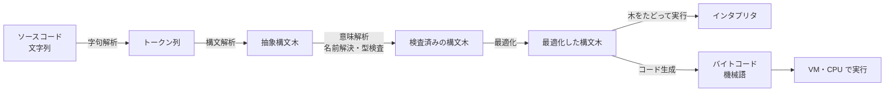
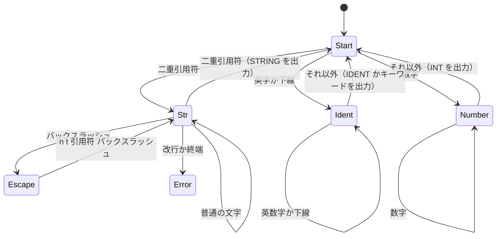

# 3.4 言語処理系を作る

> コンパイラやインタプリタは、特別な人だけが作る魔法の箱ではありません。文字列を読み、構造を取り出し、その構造に意味を与える。この 3 つを自分の手で一度書けば、SQL・テンプレート・設定ファイル・正規表現・リンタ・フォーマッタが、そしてインジェクション攻撃が「なぜそうなるのか」が見通せるようになります。この章では、変数・関数・クロージャを持つ小さな言語 MiniLang のインタプリタを、6 つの段階に分けて作ります。

| 項目 | 内容 |
|---|---|
| 学習時間の目安 | 本文 3.5h ＋ 演習 10h |
| 前提となる章 | [1.4 プログラムが動く仕組み](../../01-computer-systems/04-how-programs-run/README.md)（スタックマシン）、[3.1 プログラミングパラダイムと抽象化](../01-paradigms/README.md)（スコープとクロージャ）、[3.2 型システム](../02-type-systems/README.md) |
| 演習 | [exercises/](exercises/)（Python） |
| キーワード | 字句解析, 構文解析, EBNF, 再帰下降, 優先順位と結合性, 抽象構文木, 環境, クロージャ, バイトコード, 定数畳み込み, DSL, インジェクション |

## この章のゴール

- [ ] 言語処理系のパイプライン（字句解析・構文解析・意味解析・最適化・実行）と、各段階の入出力を説明できる
- [ ] 状態機械として字句解析器を実装し、位置情報付きのトークン列を作れる
- [ ] EBNF で文法を書き、優先順位と結合性を正しく扱う再帰下降構文解析器を実装できる
- [ ] 環境の連鎖によるスコープとクロージャを持つ、木をたどるインタプリタを実装できる
- [ ] バイトコードとスタックマシン、定数畳み込みなどの最適化の考え方と、意味を変えない条件を説明できる
- [ ] 設定言語・リンタ・コードモッドの仕組みと、インジェクションが「コードとデータの取り違え」であることを説明できる
- [ ] 「独自の言語や設定形式を作る」という提案を、コストとリスクの観点で評価できる

## なぜ学ぶのか

言語処理系の考え方は、コンパイラを書かない人の仕事にも直結しています。

- **Log4Shell**: 2021 年 12 月に公表された Apache Log4j 2 の脆弱性（CVE-2021-44228）は、ログに書き込む文字列の中の `${jndi:ldap://…}` という記法を Log4j が **小さな言語として解釈** し、外部のサーバーからコードを読み込んで実行してしまうものでした。ログには利用者が送った文字列（HTTP ヘッダなど）がそのまま書かれるので、攻撃者は細工した文字列を送るだけで、サーバー上で任意のコードを実行できました。**データとして扱うべき文字列を、コードとして解釈してしまう** という点で、SQL インジェクションと同じ構造の問題です。
- **Cloudbleed**: 2017 年 2 月、Cloudflare は、HTML を書き換えるために使っていたパーサのバッファの終端の判定の誤りによって、メモリ上の他のデータ（別の利用者の Cookie や認証情報を含みうる）が応答に混入していたと公表しました。発見したのは Google Project Zero の研究者で、混入したデータは検索エンジンのキャッシュにも残っていました。パーサは、信頼できない入力を最初に受け取る、セキュリティ上最も重要なコードの 1 つです。
- **設定ファイルの罠**: YAML 1.1 の規則では、引用符のない `NO` が真偽値の false と解釈されます。国コードの一覧にノルウェー（NO）を書いたら false になった、という「ノルウェー問題」は、設定言語の文法と意味を知らないと防げません（8.1 節で実際に確かめます）。

さらに、リンタ・フォーマッタ・SQL・テンプレートエンジン・正規表現・ビルド設定・インフラのコードは、どれも言語処理系です。Philip Greenspun の有名な冗談「十分に複雑な C や Fortran のプログラムには、場当たり的で仕様が曖昧でバグだらけで遅い Common Lisp の半分の実装が含まれている」が示すように、大きなシステムは、いつの間にか自前の小さな言語を抱え込みます。それを **意識して正しく作るか、意図せず出来損ないを作るか** の違いは、この章の知識で決まります。

## 1. 言語処理系の全体像

### 1.1 パイプライン

言語処理系は、ソースコードという文字列を、段階を追って構造化していきます。



| 段階 | 入力 → 出力 | 見つかる誤りの例 |
|---|---|---|
| 字句解析（lexing） | 文字列 → トークン列 | 閉じていない文字列、使えない文字 |
| 構文解析（parsing） | トークン列 → 構文木 | 括弧の対応、`;` の抜け、文法にない並び |
| 意味解析（semantic analysis） | 構文木 → 検査済みの構文木 | 未定義の名前、型の不一致（[3.2](../02-type-systems/README.md) の型検査器はここ） |
| 最適化（optimization） | 構文木 → 同じ意味のより速い構文木 | （誤りは見つけない。意味を変えないことが条件） |
| 実行・コード生成 | 構文木 → 実行結果、または命令列 | 実行時エラー（0 除算など） |

### 1.2 インタプリタ・コンパイラ・JIT

| 方式 | 仕組み | 長所 | 短所 |
|---|---|---|---|
| 木をたどるインタプリタ | 構文木を直接たどって実行する | 作るのが簡単。起動が速い | 遅い（ノードごとの分岐とポインタの追跡） |
| バイトコードインタプリタ | 仮想マシン（VM）用の命令列に変換してから実行する | 木より速く、移植性が高い | VM の命令ごとの分岐のコストが残る |
| 事前（AOT）コンパイラ | 実行前に機械語に変換する | 最も速い。実行時にコンパイラ不要 | ビルドが遅い。実行時の情報を最適化に使えない |
| JIT コンパイラ | 実行しながら、よく使われる部分を機械語に変換する | 実行時の型などを使って大胆に最適化できる | 実装が複雑。ウォームアップに時間がかかり、メモリも使う |

実際の処理系は、これらを組み合わせています。CPython は、ソースを字句解析し、PEG 構文解析器（Python 3.9 以降。PEP 617）で構文木を作り、バイトコードにコンパイルして VM で実行します。Java は、`javac` がバイトコードを生成し、JVM がインタプリタと JIT コンパイラを段階的に使い分けます。JavaScript の V8 は、バイトコードインタプリタ（Ignition）と最適化コンパイラ（TurboFan）を中心に、中間の段階のコンパイラも備えています（構成は改良が続いています）。LLVM は、共通の中間表現（IR）と最適化器・コード生成器を提供し、Clang（C/C++）、rustc、Swift などのコンパイラがそれを使っています。tree-sitter は、エディタでの構文強調やコードナビゲーション向けに、編集のたびに差分だけを再解析する **インクリメンタル構文解析** を提供するライブラリです。

### 1.3 この章で作る MiniLang

MiniLang は、整数・文字列・真偽値・nil・関数を持つ、C や JavaScript に似た見た目の小さな言語です。

```text
let x = 10;
fn fact(n) { if (n <= 1) { return 1; } return n * fact(n - 1); }
print(fact(x));
let make_counter = fn() { let c = 0; return fn() { c = c + 1; return c; }; };
let counter = make_counter();
counter();
print(counter());
```

`run()` にこのソースを渡すと、`print` の出力のリスト `['3628800', '2']` が返ります。演習は、パイプラインに沿って 6 段階に分かれています。

| 段階 | 内容 | 主な関数・メソッド | 本文 |
|---|---|---|---|
| 1 | 字句解析 | `tokenize` | 2 章 |
| 2 | 式の構文解析 | `Parser.parse_expression`〜`primary` | 3・4 章 |
| 3 | 式の評価 | `apply_binary`, `Interpreter.evaluate` など | 6.1 節 |
| 4 | 文・変数・スコープ・制御構造 | `Parser.statement` など、`Environment`, `Interpreter.execute` | 4.4・6.2 節 |
| 5 | 関数・クロージャ・再帰 | `Parser.fn_declaration` など、`Interpreter.call_function` | 4.4・6.3 節 |
| 6 | 定数畳み込み | `fold_constants` | 7.2 節 |

段階 3 のテストは構文木を直接組み立てるので、段階 1・2 が終わっていなくても取り組めます。

## 2. 字句解析（段階 1）

### 2.1 トークンと最長一致

**字句解析（lexical analysis）** は、文字の並びを、意味のある最小単位である **トークン（token）** の並びに変換します。空白やコメントはここで捨てます。各トークンは、種類（type）、ソース上の文字列（**字句**, lexeme）、値（整数や、エスケープを解釈した後の文字列）、位置（行と桁）を持ちます。解答例の `tokenize` の出力です。

```text
（ソース: let total = price * 2; // 税抜き）
1:1   let     'let'        None
1:5   IDENT   'total'      None
1:11  =       '='          None
1:13  IDENT   'price'      None
1:19  *       '*'          None
1:21  INT     '2'          2
1:22  ;       ';'          None
```

字句解析の基本原則は **最長一致（maximal munch）** です。`<=` は `<` と `=` ではなく 1 つのトークン、`letter` はキーワード `let` と `ter` ではなく 1 つの識別子です。演習の `tokenize` では、2 文字の演算子を 1 文字の演算子より先に試し、識別子は英数字が続く限り読んでからキーワードかどうかを判定します。

### 2.2 状態機械として書く

字句解析器は、「今どんな種類のトークンを読んでいる途中か」という **状態** を持つ **有限状態機械（finite state machine）** です。



トークンの形は **正規表現** で書ける範囲（正規言語）に収まり、正規言語は有限状態機械で認識できます（[2.7 計算理論](../../02-math-and-algorithms/07-theory-of-computation/README.md)）。演習では、この状態機械を「今の 1 文字を見て分岐し、同じ種類の文字が続く限り読む」ループとして手で書きます。解答例の数字と文字列の部分を抜粋します。

```python
elif _is_digit(c):
    start = i
    while i < n and _is_digit(source[i]):
        i += 1
    text = source[start:i]
    add("INT", text, int(text), col)
    col += i - start
elif c == '"':
    start, start_col = i, col
    i += 1
    chars: list[str] = []
    while True:
        if i >= n or source[i] == "\n":
            raise LexError("文字列が閉じていません", line)   # 報告するのは文字列が始まった行
        ch = source[i]
        if ch == '"':
            i += 1
            break
        if ch == "\\":
            ...                                               # ESCAPES に従って解釈（省略）
```

実用の字句解析器は、目的によって捨てるものが違います。Python の `tokenize` モジュールはコメントもトークンとして残します（Python 3.11 での出力）。コメントや空白を保存しないと、フォーマッタやリファクタリングツールが元のソースを復元できないからです。

```text
$ python3 -m tokenize tok.py          （tok.py の中身: x = 1 + 2  # comment）
1,0-1,1:            NAME           'x'
1,2-1,3:            OP             '='
1,4-1,5:            NUMBER         '1'
1,6-1,7:            OP             '+'
1,8-1,9:            NUMBER         '2'
1,11-1,20:          COMMENT        '# comment'
1,20-1,21:          NEWLINE        '\n'
```

### 2.3 位置情報とエラー

トークンに行と桁を記録するのは、**人間にエラーの場所を伝えるため** です。位置のないエラーメッセージしか出さない言語や設定形式は、どれほど機能が優れていても使われなくなります。MiniLang のエラーは、すべて「N行目: …」の形で報告されます（解答例での出力）。

```text
LexError: 1行目: 文字列が閉じていません                   ← let s = "abc;
MiniRuntimeError: 3行目: 0 で割ることはできません          ← 3 行目の print(a / b);
```

## 3. 文法 — BNF と EBNF

### 3.1 文法の書き方

トークンの並べ方の規則が **文法（grammar）** です。プログラミング言語の文法は、括弧の入れ子のような再帰的な構造を持つので、正規表現では書けず、**文脈自由文法（context-free grammar）** で書きます。その記法が **BNF**（Backus–Naur Form）と、繰り返しや省略を書きやすくした **EBNF**（Extended BNF）です。

| 記法 | 意味 | 例 |
|---|---|---|
| `a = b c ;` | a は b の後に c が続いたもの | `let_decl = "let" IDENT "=" expression ";" ;` |
| `a \| b` | a または b | `unary = ( "-" \| "not" ) unary \| call ;` |
| `{ a }` | a を 0 回以上繰り返す | `term = factor { ( "+" \| "-" ) factor } ;` |
| `[ a ]` | a は省略可能 | `return_stmt = "return" [ expression ] ";" ;` |
| `"x"` | そのままの字句（終端記号） | `"while"` |

### 3.2 曖昧さと優先順位

素朴に `expr = expr "+" expr | expr "*" expr | NUMBER ;` と書くと、`1 + 2 * 3` に 2 通りの構文木ができてしまいます。このような文法を **曖昧（ambiguous）** と呼びます。

```text
   正しい解釈 1 + (2 * 3) = 7        誤った解釈 (1 + 2) * 3 = 9
          +                                  *
         / \                                / \
        1   *                              +   3
           / \                            / \
          2   3                          1   2
```

曖昧さをなくすには、**優先順位（precedence）ごとに規則を分け**、弱い演算子の規則が強い演算子の規則を呼ぶように階層化します。MiniLang の文法では `term`（`+` `-`）が `factor`（`*` `/` `%`）を呼ぶので、`*` の方が先に（木の深い位置で）まとまります。同じ強さの演算子が並んだときの向きが **結合性（associativity）** で、`8 - 3 - 2` は `(8 - 3) - 2`（左結合）、代入 `a = b = 1` は `a = (b = 1)`（右結合）です。

| 優先順位 | 演算子 | 結合性 | 文法の規則 |
|---|---|---|---|
| 1（最も弱い） | `=` | 右 | `assignment` |
| 2 | `or` | 左 | `logic_or` |
| 3 | `and` | 左 | `logic_and` |
| 4 | `==` `!=` | 左 | `equality` |
| 5 | `<` `<=` `>` `>=` | 左 | `comparison` |
| 6 | `+` `-` | 左 | `term` |
| 7 | `*` `/` `%` | 左 | `factor` |
| 8 | 単項 `-` `not` | 右 | `unary` |
| 9（最も強い） | 関数呼び出し `f(...)` | 左 | `call` |

単項の `not` が比較より強いので、`not a == b` は `(not a) == b` と解釈されます（C の `!` と同じ。Python の `not` は比較より弱いので逆です）。このように、**優先順位は言語設計者が決める仕様** であり、言語ごとに違います。

曖昧さのもう 1 つの有名な例が、C の「ぶら下がり else」（`if (a) if (b) x; else y;` の else がどちらの if に属するか）です。MiniLang は if と while の本体に必ず `{ }` を要求するので、この曖昧さがありません。[3.1](../01-paradigms/README.md) で見た goto fail の脆弱性も、波括弧を省略できる文法が一因でした。文法の設計は、書き間違いの起きやすさにも影響します。

### 3.3 MiniLang の文法

MiniLang の完全な文法です（スタブ `minilang.py` の先頭にも同じものがあります）。

```text
program        = { declaration } EOF ;
declaration    = let_decl | fn_decl | statement ;
let_decl       = "let" IDENT "=" expression ";" ;
fn_decl        = "fn" IDENT "(" [ parameters ] ")" block ;
parameters     = IDENT { "," IDENT } ;
statement      = print_stmt | if_stmt | while_stmt | return_stmt | block | expr_stmt ;
print_stmt     = "print" "(" expression ")" ";" ;
if_stmt        = "if" "(" expression ")" block [ "else" ( if_stmt | block ) ] ;
while_stmt     = "while" "(" expression ")" block ;
return_stmt    = "return" [ expression ] ";" ;
block          = "{" { declaration } "}" ;
expr_stmt      = expression ";" ;

expression     = assignment ;
assignment     = IDENT "=" assignment | logic_or ;
logic_or       = logic_and { "or" logic_and } ;
logic_and      = equality { "and" equality } ;
equality       = comparison { ( "==" | "!=" ) comparison } ;
comparison     = term { ( "<" | "<=" | ">" | ">=" ) term } ;
term           = factor { ( "+" | "-" ) factor } ;
factor         = unary { ( "*" | "/" | "%" ) unary } ;
unary          = ( "-" | "not" ) unary | call ;
call           = primary { "(" [ arguments ] ")" } ;
arguments      = expression { "," expression } ;
primary        = INT | STRING | "true" | "false" | "nil" | IDENT
               | "(" expression ")" | fn_expr ;
fn_expr        = "fn" "(" [ parameters ] ")" block ;
```

`print` を関数ではなく文にしているのは、段階 4（文）のテストを、段階 5（関数）より前に書けるようにするためです。Nystrom の "Crafting Interpreters" の言語 Lox も同じ理由で print を文にしています（Python も 2 までは print が文でした）。

### 3.4 左再帰と再帰下降

左結合を素直に書くと `term = term "+" factor | factor ;` となります。これは正しい文法ですが、次節の再帰下降構文解析でこのまま実装すると、`term` が何も読まずに `term` を呼び続けて無限再帰になります（**左再帰**, left recursion）。EBNF の繰り返し `term = factor { "+" factor } ;` に書き換え、**ループで左に木を積み上げる** ことで、左再帰を避けつつ左結合を実現します。

## 4. 構文解析 — 再帰下降（段階 2・4・5）

### 4.1 規則ごとにメソッドを書く

**再帰下降構文解析（recursive descent parsing）** は、文法の規則 1 つをメソッド 1 つに対応させ、規則が別の規則を参照するところでメソッドを呼び出す、という最も素直な構文解析の方法です。手で書けて、エラーメッセージを細かく制御できるので、Clang や Go のコンパイラなど、多くの実用的なコンパイラが採用しています。`term` は次のようになります（解答例では、同じ形の 6 つの規則を補助メソッドにまとめています）。

```python
def term(self) -> Expr:
    # term = factor { ( "+" | "-" ) factor } ;
    expr = self.factor()
    while self.check("+", "-"):
        op = self.advance()
        right = self.factor()
        expr = Binary(op.type, expr, right, line=op.line)   # これまでの結果を左の子にする → 左結合
    return expr
```

`1 - 2 - 3` では、ループの 1 周目で `Binary("-", 1, 2)` が作られ、2 周目でそれが左の子になって `Binary("-", Binary("-", 1, 2), 3)` になります。一方、単項演算子は `unary = ( "-" | "not" ) unary | call ;` と **右再帰** で書くので、`--x` は `-(-x)` になります。

### 4.2 代入と先読み

`x = 1` と `x + 1` は、最初のトークン `x` だけでは区別できません。代入の左辺は変数でなければならないので、解答例では **まず右辺と同じ規則（`logic_or`）で左辺を読み、次が `=` なら代入として組み立て直す** という方法を使っています。

```python
def assignment(self) -> Expr:
    expr = self.logic_or()
    if self.check("="):
        equals = self.advance()
        value = self.assignment()            # 右再帰なので a = b = 1 は a = (b = 1)（右結合）
        if isinstance(expr, Var):
            return Assign(expr.name, value, line=expr.line)
        raise self.error("代入の左辺には変数名が必要です", equals)   # 1 = 2、a + b = c など
    return expr
```

「左辺として正しい形か」を構文木で検査するこの方法は、`a.b = 1` や `a[i] = 1` のような代入先を持つ言語でもそのまま使えます。次のトークンを何個見れば規則を選べるかを **先読み（lookahead）** と呼び、1 個で決まる文法を LL(1) 文法と呼びます。MiniLang のほとんどの規則は 1 個で決まり、例外は `fn` の後が名前か `(` かを見る `declaration`（2 個）と、この代入だけです。

### 4.3 優先順位上昇法と Pratt 構文解析

演算子が多い言語では、優先順位ごとにメソッドを書くと冗長になります。そこで、**優先順位の表** を使って 1 つの関数で二項演算子を処理する **優先順位上昇法（precedence climbing）** がよく使われます。

```python
PREC = {"+": (10, "left"), "-": (10, "left"), "*": (20, "left"), "/": (20, "left"), "^": (30, "right")}

def parse(tokens):
    pos = 0

    def primary():
        nonlocal pos
        tok = tokens[pos]
        pos += 1
        if tok == "(":
            e = expr(0)
            pos += 1                                  # ")" を読み飛ばす
            return e
        return int(tok)

    def expr(min_prec):
        nonlocal pos
        left = primary()
        # 次の演算子が min_prec 以上の強さなら、それを使って木を伸ばす
        while pos < len(tokens) and tokens[pos] in PREC and PREC[tokens[pos]][0] >= min_prec:
            op = tokens[pos]
            prec, assoc = PREC[op]
            pos += 1
            # 左結合なら右辺には「より強い」演算子だけを許し、右結合なら同じ強さも許す
            right = expr(prec + 1 if assoc == "left" else prec)
            left = (op, left, right)
        return left

    return expr(0)

print(parse("1 + 2 * 3 - 4".split()))    # ('-', ('+', 1, ('*', 2, 3)), 4)
print(parse("2 ^ 3 ^ 2".split()))        # ('^', 2, ('^', 3, 2))  右結合
```

これを一般化し、前置演算子や後置の呼び出しまで「トークンの種類ごとの解析関数の表」で扱うのが **Pratt 構文解析**（Vaughan Pratt, 1973）で、JavaScript のパーサなどで広く使われています。新しい演算子を表に 1 行足すだけで追加できるのが利点です。演習では、文法と 1 対 1 に対応して読みやすい、規則ごとのメソッドで書きます。

### 4.4 文と関数の構文解析

文の規則も同じ形で書けます。`if` の `else if` は「else の後に if 文が 1 つ続く」と解釈するので、特別な構文は要りません。

```python
def if_statement(self) -> Stmt:
    keyword = self.expect("if", "'if' が必要です")
    self.expect("(", "if の後に '(' が必要です")
    cond = self.parse_expression()
    self.expect(")", "条件の後に ')' が必要です")
    then_branch = self.block()
    else_branch = None
    if self.match("else"):
        else_branch = self.if_statement() if self.check("if") else self.block()
    return If(cond, then_branch, else_branch, line=keyword.line)
```

段階 5 では、関数の宣言・無名関数・呼び出し・`return` を加えます。`return` が関数の外にあったら、実行するまで待たずに構文解析の時点でエラーにします。Parser が「今いくつの関数本体の中にいるか」（`function_depth`）を数えておけば判定できます。このように、構文木を作りながら（あるいは作った後で）文脈に依存する規則を検査するのが **意味解析** の入り口です。本格的な処理系では、名前の解決（どの変数がどの宣言を指すか）や型検査（[3.2](../02-type-systems/README.md)）もこの段階で行います。

### 4.5 構文エラーの報告

構文解析器は、期待したトークンが来なかった時点でエラーを報告します（解答例での出力）。

```text
ParseError: 2行目: ';' が必要です（'print' の位置）      ← let x = 1（; がない）の次の行が print(x);
```

`;` を忘れたのは 1 行目ですが、それに **気付けるのは次のトークンを見たとき** なので、2 行目と報告されます。親切な処理系は「直前のトークンの後に `;` が必要」と、原因の位置を示す工夫をしています。また、実用の構文解析器は、最初のエラーで止まらずに、次の `;` や `}` まで読み飛ばして解析を再開し、複数のエラーをまとめて報告します（**パニックモードのエラー回復**）。

構文解析器を手で書かず、文法から自動生成する **パーサジェネレータ** もあります。yacc や GNU Bison（LALR(1) 構文解析）、ANTLR などです。CPython は 3.9 から、文法ファイルから生成する **PEG**（Parsing Expression Grammar）構文解析器を使っています（PEP 617）。PEG は「選択肢を書いた順に試し、最初に成功したものを採る」ので曖昧さが生じません。

## 5. 構文木の設計

**抽象構文木（AST: abstract syntax tree）** は、意味に必要な構造だけを残した木です。括弧・`;`・空白・コメントは捨てられ、`(1 + 2) * 3` の括弧は「`+` の木が `*` の左の子にある」という形で表されます。Python の `ast` モジュールで、CPython の AST を見られます（Python 3.10 と 3.11 で同じ出力）。

```text
>>> print(ast.dump(ast.parse("1 + 2 * x", mode="eval"), indent=2))
Expression(
  body=BinOp(
    left=Constant(value=1),
    op=Add(),
    right=BinOp(
      left=Constant(value=2),
      op=Mult(),
      right=Name(id='x', ctx=Load()))))
```

これに対し、括弧やコメントや空白まで含めてソースを完全に復元できる木を **具象構文木（CST: concrete syntax tree）** と呼びます。フォーマッタやリファクタリングツールには CST が必要です。AST を書き換えてソースに戻すと、コメントが消えてしまうからです。

```python
import ast
src = "total = compute(x)  # 税込み\n"
class Rename(ast.NodeTransformer):
    def visit_Name(self, node):
        if node.id == "compute":
            node.id = "compute_v2"
        return node
print(ast.unparse(Rename().visit(ast.parse(src))))   # total = compute_v2(x)  ← コメントが消えた
```

Python の LibCST や、多くの言語に対応した tree-sitter は、この問題を解決するために CST を提供しています。

MiniLang の構文木は、スタブに与えられている `frozen=True` のデータクラスです。設計上の判断をいくつか挙げます。

- **不変にする**: 最適化などの変換は、元の木を書き換えずに新しい木を返す（[3.1](../01-paradigms/README.md) の永続データ構造と同じ考え方）。`dataclasses.replace` で一部だけを変えたノードを作れる。
- **行番号を持たせるが、等しさの比較には含めない**: `line` フィールドは `compare=False` なので、テストでは木の形だけを比較できる。
- **`and` / `or` は `Binary` と分けて `Logical` にする**: 短絡評価するかどうかで評価の規則が根本的に違うため。
- **`Number` と `Boolean` を別のクラスにする**: Python では `True == 1` なので、`Literal(value)` という 1 つのクラスにすると、`true` と `1` の構文木が「等しい」ことになってしまう。**ホスト言語の意味が、作っている言語に漏れ出す** 典型例で、この後の評価器でも何度も出会います。

## 6. 評価器 — 木をたどるインタプリタ（段階 3〜5）

### 6.1 式の評価と、意味を決めること

**木をたどるインタプリタ（tree-walking interpreter）** は、構文木のノードの種類ごとに場合分けし、子を再帰的に評価して値を組み立てます。[3.1](../01-paradigms/README.md) の表現問題の言葉で言えば、ノードの種類がほぼ固定で、評価・畳み込み・表示などの操作が増えていく、関数型の設計が向いている場面です。

```python
def evaluate(self, expr: Expr, env: Environment) -> object:
    match expr:
        case Number(value) | String(value) | Boolean(value):
            return value
        case Binary(op, left, right):
            return apply_binary(op, self.evaluate(left, env), self.evaluate(right, env), expr.line)
        case Logical(op, left, right):
            lv = self.evaluate(left, env)
            # 短絡評価: 結果が左辺で決まるなら右辺は評価しない
            if op == "or":
                return lv if is_truthy(lv) else self.evaluate(right, env)
            return self.evaluate(right, env) if is_truthy(lv) else lv
        ...
```

評価器を書くと、**構文だけでは言語は決まらない** ことが分かります。同じ `a / b` や `if (x)` でも、意味は言語ごとに違います。MiniLang の決定と、他の言語との比較です。

| 論点 | MiniLang | Python | JavaScript | C / Java |
|---|---|---|---|---|
| 偽とみなす値 | `false`, `nil` だけ | `False`, `None`, `0`, `""`, 空のコンテナなど | `false`, `null`, `undefined`, `0`, `""`, `NaN` | C は 0。Java は boolean だけ |
| `-7 / 2` | -3（0 に向かって切り捨て） | `-7 // 2` は -4（負の無限大に向かって切り捨て） | -3.5（浮動小数点） | -3 |
| `-7 % 2` | -1 | 1 | -1 | -1 |
| `1 == "1"` | false（型が違えば等しくない） | False | `==` は true、`===` は false | コンパイルエラー（Java） |
| `"n=" + 1` | 実行時エラー | TypeError | `"n=1"` | Java は `"n=1"` |

ここで注意すべきなのが、**ホスト言語（インタプリタを書いている言語）の意味が漏れ出す** ことです。Python の `//` と `%` をそのまま使うと、MiniLang の除算が Python と同じ「負の無限大への切り捨て」になってしまいます。`isinstance(True, int)` が真なので、何も考えずに整数の検査を書くと `true + 1` が 2 になります。演習の `apply_binary` では、これらを明示的に扱います。**言語を作るとは、こうした意味を 1 つずつ決め、仕様として書き、テストで固定すること** です。

### 6.2 環境とスコープ

変数の値は **環境（environment）** に置きます。環境は「名前 → 値」の辞書と、外側の環境へのポインタ（`parent`）の組で、ブロックや関数呼び出しのたびに新しい環境を作り、外側の環境につなぎます。変数を探すときは、内側から外側へ鎖をたどります。

```python
def get(self, name: str, line: int = 0) -> object:
    env = self
    while env is not None:                   # 内側のスコープから外側へたどる
        if name in env.values:
            return env.values[name]
        env = env.parent
    raise MiniRuntimeError(f"未定義の変数です: {name}", line)
```

代入（`assign`）も同じ順にたどり、**見つかったスコープの** 変数を書き換えます。見つからなければ、新しい変数を作らずにエラーにします。Python の LEGB 規則（[3.1](../01-paradigms/README.md)）とは違い、MiniLang では `let` で宣言した変数だけが新しく作られるので、「代入したつもりが別の変数を作っていた」というバグが起きません。

### 6.3 関数とクロージャ

関数を定義すると、インタプリタは **関数の本体と、定義された時点の環境** を組にした値（`Function`）を作ります。呼び出すときは、その **定義された環境（closure）を親にした** 新しい環境を作り、引数を定義してから本体を実行します。

```python
def call_function(self, fn, args, line):
    ...                                        # 組み込み関数、引数の数の検査、深さの検査（省略）
    call_env = Environment(fn.closure)         # 親は「呼び出し元」ではなく「定義された場所」
    for param, arg in zip(fn.params, args):
        call_env.define(param, arg)
    self.depth += 1
    try:
        self.execute_block(fn.body, call_env)
    except ReturnSignal as ret:                # return は例外として呼び出し元まで伝わる
        return ret.value
    finally:
        self.depth -= 1
    return None                                # return がなければ nil
```

この 1 行（`Environment(fn.closure)`）が、レキシカルスコープとクロージャのすべてです。1.3 節の `make_counter` を実行した後の環境は、次のようにつながっています。

```text
globals:  { make_counter: <fn>, counter: <fn>, str: <builtin>, len: <builtin> }
   ▲ parent
make_counter() の呼び出しで作られた環境:  { c: 2 }
   ▲ closure（内側の無名関数は、この環境で定義された）
counter() の呼び出しで作られた環境:  { }   ← c はここにないので、親をたどって見つける
```

`make_counter` の実行が終わっても、返された関数がその環境を参照し続けているので、`c` は生き残ります（ガベージコレクタから見ても到達可能です。[3.3](../03-memory-management/README.md)）。もし `Environment(fn.closure)` の代わりに呼び出し元の環境を親にすると、**動的スコープ** になり、関数の意味が呼び出し元によって変わってしまいます（段階 5 のテスト `test_lexical_not_dynamic_scope` で確かめます）。再帰も特別な仕組みは要りません。`fn fact(n) {...}` は `fact` という名前を定義した環境を閉じ込めるので、本体の中の `fact` はその環境をたどって見つかります。

`return` は、関数の途中から、入れ子になった `while` や `if` をまとめて抜ける制御です。解答例では、ホスト言語の例外（`ReturnSignal`）を使って、呼び出し元の `call_function` まで一気に戻っています。

### 6.4 実行時エラーと資源の上限

実行時エラーにも行番号を付けます。構文木の各ノードが `line` を持っているので、エラーを送出するときにそれを渡すだけです。

```text
MiniRuntimeError: 1行目: + の両辺の型が不正です: str と int          ← print("n=" + 1);
MiniRuntimeError: 1行目: 呼び出しの深さが上限（200）を超えました     ← fn f(n) { return f(n + 1); } f(0);
```

`Interpreter` には、`while` の反復と関数呼び出しの回数の上限（`max_steps`）と、呼び出しの深さの上限（`max_depth`）があります。木をたどるインタプリタは、MiniLang の関数呼び出し 1 回につき Python の関数呼び出しを数段使うので、無限再帰を放置すると Python 自身のスタックが尽きます。**利用者が書いたコードを実行する処理系は、必ず CPU 時間・メモリ・再帰の深さに上限を設ける** 必要があります。設定言語やルールエンジンを外部に公開するなら、なおさらです（8 章）。

## 7. バイトコードと最適化（段階 6）

### 7.1 バイトコードとスタックマシン

木をたどるインタプリタは、ノードごとにメソッドを呼び、ポインタをたどり、`match` で分岐するので遅くなります。多くの処理系は、構文木を **バイトコード**（仮想マシン用の平らな命令列）に変換してから実行します。[1.4 プログラムが動く仕組み](../../01-computer-systems/04-how-programs-run/README.md) で見たスタックマシンを VM にすれば、コンパイラは「子を先に、演算子を後に」出力する（後置順の走査）だけで書けます。

```python
import operator

OPS = {"+": operator.add, "-": operator.sub, "*": operator.mul}

def compile_expr(node, code):
    """構文木（タプル）を、スタックマシンの命令列に変換する。子を先に、演算子を後に（後置順）。"""
    if isinstance(node, int):
        code.append(("PUSH", node))
    else:
        op, left, right = node
        compile_expr(left, code)
        compile_expr(right, code)
        code.append(("BINOP", op))
    return code

def run_vm(code):
    stack = []
    for instr, arg in code:
        if instr == "PUSH":
            stack.append(arg)
        else:                                  # BINOP: 2 つ取り出して計算し、結果を積む
            b, a = stack.pop(), stack.pop()
            stack.append(OPS[arg](a, b))
    return stack.pop()

tree = ("-", ("+", 1, ("*", 2, 3)), 4)         # 1 + 2 * 3 - 4
code = compile_expr(tree, [])
```

```text
PUSH 1 / PUSH 2 / PUSH 3 / BINOP * / BINOP + / PUSH 4 / BINOP -   （code の中身）
結果: 3                                                          （run_vm(code)）
```

CPython のバイトコードも同じ考え方のスタックマシンで、`dis` モジュールで見られます（命令の名前は Python のバージョンで変わります）。

```text
>>> def f(x):
...     return 60 * 60 * 24 * x
>>> dis.dis(f)                        （Python 3.11 での出力）
  1           0 RESUME                   0
  2           2 LOAD_CONST               1 (86400)
              4 LOAD_FAST                0 (x)
              6 BINARY_OP                5 (*)
             10 RETURN_VALUE
```

`60 * 60 * 24` が、コンパイル時に `86400` に計算されています。これが次に扱う **定数畳み込み** です（Python 3.10 でも同様で、命令名が `BINARY_MULTIPLY` になります）。

### 7.2 定数畳み込み

**定数畳み込み（constant folding）** は、実行前に値が決まる部分式を、計算結果の定数に置き換える最適化です。演習の `fold_constants` は、構文木を受け取り、畳み込んだ新しい構文木を返します（解答例での出力）。

```text
入力:  let day = 60 * 60 * 24;
       if (1 > 2) { print("never"); } else { print(day * 7); }
出力:  Let(name='day', value=Number(value=86400))
       Block(stmts=(Print(expr=Binary(op='*', left=Var(name='day'), right=Number(value=7))),))
```

条件が定数になった `if` は、実行されない側の分岐ごと取り除かれています（**死んだコードの除去**, dead code elimination）。最適化で最も大切な規則は、**プログラムの意味（出力とエラー）を変えないこと** です。そのために演習では次の点を守ります。

- **実行時と同じ関数で計算する**: 畳み込みの計算に `apply_binary` を使う。別の実装で計算すると、たとえば除算の丸め方がずれて、最適化の有無で結果が変わる。
- **エラーになる式は畳み込まない**: `1 / 0` をコンパイル時にエラーにすると、「実行されない分岐の中の `1 / 0`」までエラーになってしまう。残しておき、実行されたときに、正しい行番号でエラーにする。
- **勝手に並べ替えない**: `x + 1 + 2` は `(x + 1) + 2` なので、定数だけの部分木がなく、畳み込めない。`x + 3` に変えるには結合法則が成り立つ必要があり、それは `x` の型に依存する。

CPython も、`x * 60 * 60` は畳み込みません（Python 3.11 の `dis` では `LOAD_CONST 60` と `BINARY_OP` が 2 回ずつ残ります）。`x` が浮動小数点数なら `(x * 60) * 60` と `x * 3600` は丸めが違いうる（`1.1 * 60 * 60` は `3960.0`、`1.1 * 3600` は `3960.0000000000005`）うえ、`x` が `__mul__` を定義したオブジェクトなら、呼び出しの回数そのものが意味を持つからです。演習のテスト `test_semantics_are_preserved` は、**最適化の有無で出力が一致すること** を多数のプログラムで確かめています。最適化器のテストでは、この「両方で実行して比べる」方法（差分テスト）が非常に有効です。

### 7.3 その他の最適化と JIT

定数畳み込みの先には、変数に代入された定数を使用箇所に広げる **定数伝播**、使われない計算を消す **死んだコードの除去**、小さな関数の呼び出しを本体で置き換える **インライン展開** などがあります。JIT コンパイラは、実行中に観測した型（「この `+` はいつも整数どうし」）を前提に機械語を生成し、前提が崩れたら遅いコードに戻る（**脱最適化**）ことで、動的型付け言語を高速に実行します。どの最適化も、「意味を変えない」ことの証明、または実行時の確認が前提です。

## 8. 実務で効く場面

### 8.1 DSL と設定言語

特定の用途のための小さな言語を **DSL（domain-specific language）** と呼びます。SQL、正規表現、HTML、CSS、Makefile のように独自の文法を持つ **外部 DSL** と、Python や Ruby の構文の中で API を工夫して言語のように見せる **内部 DSL**（ORM のクエリビルダ、テストフレームワークの記法など）があります。

設定ファイルも言語です。YAML は人間が書きやすい反面、暗黙の型変換の規則が複雑です。YAML 1.1 を実装している PyYAML（6.0）で読み込むと、次のようになります。

```text
入力（YAML）                        読み込んだ結果（Python の値）
countries: [GB, IE, NO, FR]    →   ['GB', 'IE', False, 'FR']    NO が false になる
port: 22:22                    →   1342                          60 進数として解釈される
mode: 0755                     →   493                           8 進数として解釈される
version: 1.10                  →   1.1                           浮動小数点数になる
on: yes                        →   {True: True}                  キーの on まで true になる
```

YAML 1.2（2009 年）では真偽値として扱う綴りが `true` / `false` などに絞られましたが、YAML 1.1 の規則で動くライブラリやツールは今も広く使われています。対策は、**文字列は常に引用符で囲む**、**スキーマで検証する**（JSON Schema など）、そして用途によっては、型の規則が単純な形式（TOML、JSON）や、型を持つ設定言語（CUE など）を選ぶことです。

設定は、成長すると条件分岐・変数・繰り返し・関数を欲しがり、いつの間にかプログラミング言語になっていきます。その行き先を最初から設計したのが、Bazel の **Starlark**（Python に似た構文で、再帰と無制限のループを禁じて必ず停止する）、Google の **CEL**（Common Expression Language。停止性が保証された式言語で、Kubernetes のバリデーションルールなどに使われている）、Terraform の HCL、Jsonnet、CUE などです。

### 8.2 リンタ・フォーマッタ・コードモッド

リンタは構文木を歩いて、問題のあるパターンを探すプログラムです。Python の `ast` モジュールを使えば、数十行で自分のチーム専用のリンタが書けます。

```python
import ast

source = '''
def load(path):
    if path == None:
        return None
    try:
        return open(path).read()
    except:
        pass
'''

class Checker(ast.NodeVisitor):
    def visit_Compare(self, node):
        for op, right in zip(node.ops, node.comparators):
            if isinstance(op, (ast.Eq, ast.NotEq)) and isinstance(right, ast.Constant) and right.value is None:
                print(f"{node.lineno}行目: None との比較には is / is not を使ってください")
        self.generic_visit(node)

    def visit_ExceptHandler(self, node):
        if node.type is None:
            print(f"{node.lineno}行目: 素の except: はすべての例外を握りつぶします")
        self.generic_visit(node)

Checker().visit(ast.parse(source))
# 3行目: None との比較には is / is not を使ってください
# 7行目: 素の except: はすべての例外を握りつぶします
```

構文木を **書き換えて** ソースに戻せば、大規模な自動リファクタリング（**コードモッド**, codemod）になります。API の置き換えや非推奨の機能の除去を、数百のリポジトリに一斉に適用できます。Google は、ClangMR（2013 年の論文 "Large-Scale Automated Refactoring Using ClangMR"）などのツールで、巨大なコードベース全体への変更を自動化していることを報告しています。実務の道具としては、ruff・ESLint などのリンタ、Prettier・gofmt・Black などのフォーマッタ、LibCST・jscodeshift・OpenRewrite などのコードモッド基盤、構文木のパターンで検索する Semgrep などがあります。いずれも中身は、この章で作った字句解析・構文解析・木の走査です。

### 8.3 インジェクション — コードとデータの取り違え

**インジェクション（injection）** は、データとして扱うべき文字列が、何らかの言語処理系に **コードとして** 解釈されてしまう脆弱性です。SQL を文字列の連結で組み立てると、入力の中の `'` が文字列リテラルを終わらせ、その後ろが SQL の構文として解釈されます。

```python
import sqlite3

db = sqlite3.connect(":memory:")
db.execute("CREATE TABLE users (name TEXT, is_admin INTEGER)")
db.executemany("INSERT INTO users VALUES (?, ?)", [("alice", 1), ("bob", 0)])

name = "nobody' OR '1'='1"                        # 攻撃者が入力した「名前」
query = f"SELECT name FROM users WHERE name = '{name}'"
print(query)             # SELECT name FROM users WHERE name = 'nobody' OR '1'='1'
print(db.execute(query).fetchall())                                             # [('alice',), ('bob',)]
print(db.execute("SELECT name FROM users WHERE name = ?", (name,)).fetchall())  # []
```

字句解析の言葉で言えば、攻撃者は **自分の入力でトークンの境界を動かしている** のです。プレースホルダ（`?`）を使うと、SQL の構文解析はデータを入れる前に終わり、入力は最後まで 1 つの値として扱われるので、構文を変えられません。同じ構造は、シェルのコマンド（コマンドインジェクション）、HTML（クロスサイトスクリプティング）、テンプレートエンジン（テンプレートインジェクション）、そして Log4Shell のようなログの記法にも現れます。原則は 1 つで、**信頼できない入力を、文字列の連結でコードに混ぜない**。構造を保ったまま値を渡す API（プレースホルダ、引数のリストを取るプロセス起動、自動エスケープするテンプレート）を使います（[11.4 Webアプリケーションセキュリティ](../../11-security/04-web-security/README.md)）。

## よくある落とし穴

1. **正規表現で入れ子の構造を解析しようとする**。HTML・JSON・数式のような入れ子を持つ言語は正規言語ではないので、正規表現では正しく扱えない。既存のパーサを使うか、文法を書いて構文解析器を作る。
2. **文字列の連結で SQL・シェルコマンド・HTML を組み立てる**。入力がトークンの境界を動かし、インジェクションになる。プレースホルダ、引数のリスト、自動エスケープを使う。
3. **エラーメッセージに位置と理由がない**。「syntax error」だけの DSL や設定形式は、利用者の時間を大量に奪い、最終的に使われなくなる。トークンに位置を持たせ、「どこで・何を期待し・何が来たか」を伝える。
4. **構文だけ決めて意味を決めない**。真偽の判定、整数除算、比較、スコープ、評価順序を決めずに実装すると、ホスト言語の意味がそのまま漏れ出し、仕様が実装の偶然で決まってしまう。意味を仕様として書き、テストで固定する。
5. **左再帰の文法をそのまま再帰下降で実装する**。`term = term "+" factor` をそのままメソッドにすると無限再帰になる。繰り返し（`{ }`）に書き換えてループで左結合を作る。
6. **最適化で意味を変える**。エラーになる式を畳み込む、結合法則を仮定して並べ替える、副作用のある式を消す、といった変換は、特定の入力で結果を変える。最適化の有無で出力が一致するかを、差分テストで確かめる。
7. **YAML の暗黙の型変換を放置する**。`NO` や `0755` や `1.10` が意図しない値になる。文字列は引用符で囲み、スキーマで検証する。
8. **設定形式に後から条件分岐やループを足していく**。独自の設定形式が場当たり的なプログラミング言語に育ち、デバッガもテストもないまま複雑化する。条件分岐が必要になった時点で、Starlark や CEL のような既存の言語の組み込みを検討する。

## CTOの視点

1. **「独自の言語や設定形式を作る」提案は、ライフサイクル全体のコストで評価する**。構文解析器と評価器は数週間で書けますが、本当のコストはその後にあります。エディタの支援（構文強調・補完）、分かりやすいエラーメッセージ、デバッグ手段、テストの仕組み、ドキュメント、バージョン間の互換性、実行時間やメモリの上限（サンドボックス）、作った人が異動した後の保守です。提案を受けたら「既存の言語（SQL、CEL、Starlark、Lua、JSON Schema など）を組み込むのではなぜ駄目なのか」「3 年後に誰がこれを保守するのか」「利用者は誰で、その人たちのデバッグ手段は何か」を問いましょう。
2. **大規模な変更のための社内ツールに投資する**。数百のリポジトリにまたがる API の移行や非推奨機能の除去は、手作業では数か月かかり、途中で止まって新旧が混在しがちです。構文木に基づくコードモッドとリンタ（CI で新しい違反を止める）の組み合わせなら、数日から数週間で、しかも漏れなく終えられます。こうした基盤を持つチームは、技術的負債の返済（[8.5 リファクタリングと技術的負債](../../08-software-engineering/05-refactoring-and-tech-debt/README.md)）を継続的に行えます。
3. **インジェクションは「コードとデータの取り違え」として、仕組みで防ぐ**。個々のエンジニアの注意力に頼るのではなく、「SQL はプレースホルダ付きの API しか使わない」「テンプレートは自動エスケープを有効にする」「`eval` やシェル経由のコマンド実行を禁止する」を規約とリンタで強制します。設計レビューでは「信頼できない入力が、どこでパーサやインタプリタに渡りますか？」と問いましょう。ログ・設定・ルールエンジンのように、そこに言語があると気付きにくい場所こそ危険です。
4. **言語とランタイムを、技術的な好み以外の軸でも評価する**。新しい言語やランタイムの採用は、組織に 5〜10 年残る決定です。次のような軸で評価し、判断の理由を記録（ADR）しておきましょう。

   | 評価の軸 | 問うべきこと |
   |---|---|
   | エコシステム | 必要なライブラリ（DB ドライバ、認証、クラウドの SDK、監視）は成熟しているか。依存の脆弱性に対応する体制はあるか |
   | 採用市場 | その言語を書けるエンジニアを、必要な人数・水準・予算で採用できるか。社内で育成できるか |
   | 運用性 | 起動時間、メモリ使用量、コンテナとの相性（[3.3](../03-memory-management/README.md)）、監視・プロファイリングの道具はそろっているか |
   | 性能 | レイテンシとスループットの要件を、既定の設定で満たせるか。GC の停止は SLO に収まるか |
   | 安全性 | メモリ安全か。型システムで防げる誤りの範囲はどこまでか |
   | 寿命と互換性 | 言語とランタイムの後方互換性の方針は。バージョンアップ（[3.1](../01-paradigms/README.md) の Go 1.22 のような意味の変更を含む）に追従する体制はあるか |

5. **言語処理系の素養を持つ人材を評価する**。構文解析器やインタプリタを書いた経験のあるエンジニアは、DSL の設計、開発ツールの構築、性能問題（構文解析やシリアライズのボトルネック）、セキュリティ（入力の解析）で頼りになります。採用や育成では、「このログの形式を解析するコードを、正規表現ではなくどう設計するか」「この設定形式にループを足してほしいという要望にどう答えるか」といった問いで、原理から設計できるかを見極めましょう。

## 演習

演習コードは [exercises/minilang.py](exercises/minilang.py) にあります。構文木のデータクラス、エラーのクラス、Parser の補助メソッド、`run()` などは与えられているので、「段階N:」と書かれた関数・メソッドを実装してください。解答例は [solutions/minilang.py](solutions/minilang.py) にあります。

```bash
python3 tools/check.py 3.4        # リポジトリのルートで実行
python3 tools/check.py -v 3.4     # 詳しい出力

# 段階ごとに実行する（exercises/ ディレクトリで）
python3 -m unittest -v test_minilang.TestStage1Tokenizer
python3 -m unittest -v test_minilang.TestStage3ExpressionEvaluator
```

| # | 難易度 | 内容 | 関数・メソッド |
|---|---|---|---|
| 1 | ★★☆ | 字句解析（最長一致、文字列のエスケープ、コメント、行と桁、エラー） | `tokenize` |
| 2 | ★★☆ | 式の構文解析（優先順位、左結合、単項演算子、右結合の代入、構文エラー） | `Parser.parse_expression`, `assignment`, `logic_or`〜`primary` |
| 3 | ★★☆ | 式の評価（整数除算、暗黙の型変換の禁止、等価性、真偽、短絡評価） | `is_truthy`, `values_equal`, `apply_unary`, `apply_binary`, `Interpreter.evaluate` |
| 4 | ★★★ | 文・変数・スコープ・制御構造（let、代入、ブロック、if/else、while、ステップ数の上限） | `Parser.parse_program`〜`expression_statement`, `Environment`, `Interpreter.execute`, `execute_block` |
| 5 | ★★★ | 関数・クロージャ・再帰（関数の宣言と式、呼び出し、return、組み込み関数、呼び出しの深さの上限） | `Parser.fn_declaration`, `function_rest`, `return_statement`, `finish_call`, `Interpreter.call_function` |
| 6 | ★★☆ | 定数畳み込み（エラーを畳み込まない、短絡評価と if の除去、意味を変えない） | `fold_constants` |
| 7 | ★★☆ | 記述: 社内 DSL の提案を評価する（下記） | — |

### 演習の進め方

- **段階 1**: まず `tokenize("let x = 10;")` が 6 個のトークンを返すところから始め、数字・識別子・記号・文字列・コメントの順に分岐を増やします。桁（`col`）は「トークンの先頭の文字が、その行の何文字目か」です。
- **段階 2**: 文法の式の部分を、下の規則（`primary`）から上へ実装すると、少しずつテストが通ります。`call` は段階 2 では `return self.primary()` だけで構いません。
- **段階 3**: `apply_binary` の除算に注意してください。Python の `//` と `%` は負の無限大に向かって丸めます。`evaluate` は、この段階では `Number`・`String`・`Boolean`・`Nil`・`Unary`・`Binary`・`Logical` だけ扱えばテストが通ります。
- **段階 4**: `Environment` の 3 つのメソッドを先に作り、`execute` と `evaluate`（`Var`・`Assign`）に進みます。ブロックごとに `Environment(env)` を作るのを忘れると、スコープのテストが失敗します。
- **段階 5**: `call_function` の `Environment(fn.closure)` が要です。`fn` で始まる文が関数宣言か無名関数の式文かは、`peek_next()` で次の次のトークンを見て判定します。
- **段階 6**: `dataclasses.replace` を使うと、子だけを置き換えたノードを簡単に作れます。最後に `test_semantics_are_preserved` が、最適化の有無で出力が変わらないことを確かめます。

さらに挑戦したい人は、配列やループの `break`、名前解決を実行前に行う意味解析のパス（リゾルバ）、構文木からバイトコードへのコンパイラと VM（7.1 節）を加えてみてください。

### 演習 7（記述）: 社内 DSL の提案を評価する

あなたはサブスクリプション型サービスの CTO です。料金プラン（地域別の価格、期間限定の割引、紹介特典、法人向けのボリュームディスカウントなど）の組み合わせが増え、変更のたびにエンジニアがコードを修正しています。あるチームから「料金ルールを記述する独自の DSL『PriceScript』を作り、企画担当者が自分でルールを書けるようにしたい。構文解析器と評価器は 3 週間で作れる」という提案がありました。

(1) 提案を判断するために確認すべきことを挙げてください。(2) 独自 DSL 以外の選択肢を 3 つ以上挙げ、比較してください。(3) あなたの結論と、採用する場合の条件を書いてください。

<details>
<summary>解答例</summary>

**(1) 確認すべきこと**

- 誰が書くのか。企画担当者が本当に自分で書くのか、結局エンジニアが書くのか。書く人のデバッグ手段（エラーメッセージ、試算の画面、テスト）は何か。
- ルールの複雑さの見込み。条件分岐・繰り返し・再利用（関数）が必要か。今後 3 年でどこまで複雑になりそうか。
- 誤った場合の影響。料金の誤りは売上と顧客の信頼に直結する。変更のレビュー・承認・テスト・段階的な反映・巻き戻しの仕組みはあるか。
- 実行時の制約。評価にかかる時間とメモリの上限、無限ループの防止（サンドボックス）。
- 3 週間の見積もりに含まれていないもの。エディタの支援、エラーメッセージの作り込み、ドキュメント、ルールのテストの仕組み、バージョン管理と互換性、作った人が異動した後の保守。

**(2) 選択肢の比較**

| 選択肢 | 長所 | 短所 |
|---|---|---|
| 独自 DSL | 業務の言葉に合わせた構文にできる | 3 週間の後に、ツール・エラーメッセージ・保守のコストが続く。採用市場に経験者がいない |
| 既存の式言語を組み込む（CEL、Starlark、Lua など） | 構文解析・評価・停止性や安全性の検討が済んでいる。ドキュメントがある | 業務の言葉そのままにはならない。組み込みと、使える関数の設計は必要 |
| 決定表（スプレッドシートや管理画面で条件と価格の表を編集し、スキーマで検証） | 企画担当者に最も分かりやすい。検証しやすい | 表で表せない複雑なルールには向かない |
| コードのまま、構造を改善する（ルールをデータと小さな関数に分離し、テストを充実） | 新しい技術が不要。型検査とテストが使える | 変更のたびにエンジニアとデプロイが必要 |

**(3) 結論の例**

まず、現在のルールを分析し、大半が「条件と価格の表」で表せるなら決定表と管理画面（入力の検証と試算の機能付き）を採用し、表で表せない一部のルールはコードで実装する。式の記述が本当に必要なら、独自 DSL ではなく CEL のような停止性の保証された既存の式言語を組み込む。独自 DSL を採用するのは、既存の選択肢で要件を満たせないことを示せた場合に限り、その場合も「エラーメッセージの品質」「ルールのテストの仕組み」「サンドボックス」「2 人以上の保守担当者」「料金の変更の承認と巻き戻しの手順」を完成の条件にする。

採点の観点: 3 週間という見積もりの外にあるライフサイクルのコストを挙げられているか。既存の言語の組み込みや決定表など、作らない選択肢を比較できているか。料金という誤りの影響が大きい領域での、検証・承認・巻き戻しの仕組みに触れているか。

</details>

## 理解度チェック

**Q1. 次の 4 つの MiniLang のプログラムは、それぞれパイプラインのどの段階でエラーになりますか。(a) `let s = "abc;` (b) `let = 5;` (c) `print(y);`（`y` は未定義） (d) `print(1 + "a");`**

<details>
<summary>解答</summary>

- (a) 字句解析。文字列が閉じないまま行末に達する（`LexError`）。
- (b) 構文解析。`let` の後に変数名（IDENT）が来るはずのところに `=` がある（`ParseError`）。
- (c) 実行時。MiniLang の処理系には名前解決の意味解析がないので、`y` を評価したときに未定義の変数として `MiniRuntimeError` になる。実行前に名前を解決するパス（リゾルバ）を加えれば、意味解析の段階で検出できる。
- (d) 実行時。整数と文字列の `+` は `apply_binary` でエラーになる。[3.2](../02-type-systems/README.md) のような型検査器があれば、実行前（意味解析）に検出できる。

</details>

**Q2. 字句解析で最長一致の原則が必要な理由を、`a<=b` と `letter` を例に説明してください。**

<details>
<summary>解答</summary>

最長一致がないと、`a<=b` の `<=` を `<` と `=` の 2 つのトークンに分けてしまい、`a < (= b)` のような意味の通らない並びになります。`letter` も、先頭の `let` をキーワードとして切り出すと、`let ter` という別のプログラムになってしまいます。できるだけ長くトークンを読むことで、利用者の意図どおりの区切りになります。実装では、2 文字の演算子を 1 文字の演算子より先に試し、識別子は英数字が続く限り読んでからキーワードかどうかを判定します。

</details>

**Q3. `expr = expr "-" term | term ;` という規則を再帰下降構文解析でそのまま実装すると何が起きますか。どう書き直し、`8 - 3 - 2` はどんな構文木になりますか。**

<details>
<summary>解答</summary>

`expr` を解析するメソッドが、トークンを 1 つも読まずに最初に自分自身（`expr`）を呼ぶので、無限に再帰して止まりません（左再帰）。`expr = term { "-" term } ;` と繰り返しで書き直し、ループの中で「これまでの結果を左の子にした `Binary`」を作っていきます。`8 - 3 - 2` は `Binary("-", Binary("-", 8, 3), 2)`、つまり `(8 - 3) - 2` = 3 になります（左結合）。`8 - (3 - 2)` = 7 と解釈すると誤りです。

</details>

**Q4. `a = b = 1 + 2 * 3` を MiniLang の構文解析器で解析すると、どんな構文木になりますか。代入を右結合にする理由も答えてください。**

<details>
<summary>解答</summary>

`Assign("a", Assign("b", Binary("+", Number(1), Binary("*", Number(2), Number(3)))))` です。代入は最も優先順位が弱いので、右辺の `1 + 2 * 3` 全体が先にまとまり、`*` は `+` より強いので `2 * 3` が深い位置に来ます。代入を右結合にするのは、`a = b = 7` を「`b` に 7 を代入し、その値（7）を `a` に代入する」という意味にするためです。左結合の `(a = b) = 7` では、代入の結果（値）に代入することになり、意味をなしません。

</details>

**Q5. 次のプログラムは、MiniLang（レキシカルスコープ）では何を出力しますか。もし動的スコープだったら何を出力しますか。**

```text
let x = "global";
fn show() { print(x); }
fn caller() { let x = "local"; show(); }
caller();
```

<details>
<summary>解答</summary>

MiniLang では `global` を出力します。`show` は、自分が **定義された** 環境（グローバル）を閉じ込めているので、呼び出されたときの新しい環境の親はグローバルの環境であり、`x` はグローバルの `"global"` に解決されます。動的スコープ（呼び出し元の環境を親にする方式）なら、`caller` の中の `x`（`"local"`）が見えるので `local` を出力します。インタプリタでは、`call_function` で `Environment(fn.closure)` とするか、呼び出し元の環境を親にするかの 1 行の違いです。

</details>

**Q6. 定数畳み込みで `1 / 0` を畳み込んではいけないのはなぜですか。また、CPython が `60 * 60 * 24 * x` は畳み込むのに `x * 60 * 60` は畳み込まないのはなぜですか。**

<details>
<summary>解答</summary>

`1 / 0` をコンパイル時に計算するとエラーになりますが、その式が実行されない分岐（`if (false) { ... }` の中など）にあれば、元のプログラムはエラーにならずに動きます。最適化でエラーの有無やタイミングを変えてはいけないので、エラーになる式はそのまま残し、実行されたときに正しい行番号でエラーにします。

`60 * 60 * 24 * x` は左結合で `((60 * 60) * 24) * x` なので、定数だけの部分木 `(60 * 60) * 24` があり、それを畳み込めます。`x * 60 * 60` は `(x * 60) * 60` で、定数だけの部分木がありません。`x * 3600` に変えるには並べ替えが必要ですが、浮動小数点数では結果が変わりうる（`1.1 * 60 * 60` と `1.1 * 3600` は一致しない）うえ、`x` が `__mul__` を持つオブジェクトなら呼び出しの回数も意味を持つので、`x` の型が分からない限り安全ではありません。

</details>

**Q7. `f"SELECT ... WHERE name = '{name}'"` が危険な理由を、字句解析・構文解析の言葉で説明してください。プレースホルダを使うと安全になるのはなぜですか。**

<details>
<summary>解答</summary>

文字列を連結してから SQL の処理系に渡すと、入力の中の `'` が SQL の字句解析で文字列リテラルの終わりとして扱われ、その後ろの `OR '1'='1'` が SQL の構文として解析されます。つまり、攻撃者の入力がトークンの境界を動かし、構文木（プログラムの意味）を書き換えてしまいます。プレースホルダを使うと、SQL 文は値を入れる前に構文解析され、値は構文木の「値の位置」に後から結び付けられるので、値の中身がどうであっても構文は変わりません。データがコードとして解釈される経路そのものがなくなります。

</details>

**Q8. YAML の「ノルウェー問題」とは何ですか。組織として防ぐにはどうしますか。**

<details>
<summary>解答</summary>

YAML 1.1 の規則では、引用符のない `NO`・`no`・`off` などが真偽値の false として解釈されます。国コードの一覧にノルウェーの `NO` を書くと、文字列ではなく false として読み込まれてしまう問題です。同様に `0755` が 8 進数、`1.10` が浮動小数点数の 1.1 になるなど、暗黙の型変換が多くあります。防ぐには、文字列を常に引用符で囲む規約を作ってリンタで検査する、読み込み後の値をスキーマ（JSON Schema など）で検証する、YAML 1.2 準拠のパーサを使う、用途によっては TOML や型を持つ設定言語を選ぶ、といった方法を組み合わせます。

</details>

## さらに学ぶために

- Robert Nystrom "Crafting Interpreters"（Web で無料公開）— 木をたどるインタプリタとバイトコード VM を、同じ言語 Lox で 2 回実装する名著。この章の MiniLang の設計（print を文にする、代入の構文解析の方法など）もこの本に多くを負っている。
- Thorsten Ball "Writing An Interpreter In Go"（邦訳『Go言語でつくるインタプリタ』オライリー・ジャパン）— 字句解析から Pratt 構文解析、評価器、クロージャまでを、テストを書きながら段階的に実装する。
- 青木峰郎『ふつうのコンパイラをつくろう』（SBクリエイティブ）— C のサブセットのコンパイラを、構文解析から x86 のアセンブリ生成まで日本語で解説。
- Alfred V. Aho ほか "Compilers: Principles, Techniques, and Tools" 第 2 版（邦訳『コンパイラ 原理・技法・ツール』サイエンス社）— いわゆるドラゴンブック。字句解析・構文解析の理論（LL・LR）と最適化の古典的な教科書。
- Harold Abelson, Gerald Jay Sussman "Structure and Interpretation of Computer Programs"（邦訳『計算機プログラムの構造と解釈 第2版』翔泳社）第 4 章 — Scheme で Scheme の評価器を書く「超循環評価器」。環境モデルとクロージャの理解が深まる。
- OWASP Cheat Sheet Series の "Injection Prevention" と "SQL Injection Prevention" — インジェクションの種類と、プレースホルダなどの対策の実務的な一覧。

## まとめ

- 言語処理系は **字句解析 → 構文解析 → 意味解析 → 最適化 → 実行（またはコード生成）** のパイプラインで、文字列を段階的に構造化する。各段階で見つかる誤りが違う。
- 字句解析は **最長一致** の状態機械で、位置情報付きのトークンを作る。位置はエラーメッセージのためにある。
- 文法は EBNF で書き、**優先順位ごとに規則を分けて** 曖昧さをなくす。左再帰は繰り返しに書き換え、ループで左結合、再帰で右結合を作る。
- 再帰下降構文解析は規則とメソッドが 1 対 1 に対応する。優先順位上昇法や Pratt 構文解析は、表で演算子を扱う。
- 評価器を書くと **構文だけでは言語は決まらない** ことが分かる。真偽・除算・等価性の意味を決め、ホスト言語の意味が漏れないようにする。
- スコープは **環境の連鎖**、クロージャは「関数＋定義された環境」。`Environment(fn.closure)` の 1 行がレキシカルスコープを実現する。
- 最適化は **意味を変えない** ことが絶対条件。実行時と同じ関数で計算し、エラーになる式は残し、差分テストで確かめる。
- 設定言語・リンタ・コードモッドは言語処理系の応用であり、インジェクションは **コードとデータの取り違え** である。独自言語を作る前に、既存の言語を組み込む選択肢を比較する。
