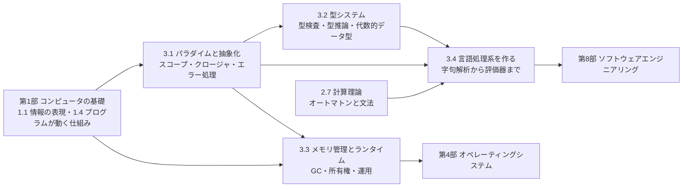

# 第3部 プログラミング言語

> プログラミング言語は、コンピュータに命令を伝える道具であると同時に、問題の分け方・誤りの防ぎ方・資源の扱い方を決める「考え方の枠組み」です。この部では、パラダイム・型・メモリ管理という言語の設計思想を原理から理解し、最後に小さな言語のインタプリタを自分の手で作ります。「なぜこのバグはこの言語では起きないのか」「この言語とランタイムを採用すると、何を得て何を払うのか」に、根拠を持って答えられるようになることが目標です。

## この部で身につくこと

- **パラダイムを使い分ける**: 命令型・オブジェクト指向・関数型・宣言型の考え方を理解し、継承と合成、例外と Result 型、クロージャとジェネレータを、問題に応じて使い分けられる。チームのスタイルとエラー処理の方針を設計できる。
- **型で誤りを防ぐ**: 静的・動的、強い・弱い、名前的・構造的、共変・反変を正確に説明し、代数的データ型と newtype で「不正な状態を表現できない」設計ができる。型検査器と型推論器を自分で書ける。
- **メモリとランタイムを理解する**: malloc の中身、参照カウント、マーク＆スイープ、コピー GC、世代別 GC、所有権と借用の仕組みとトレードオフを説明し、GC の停止やメモリリーク、コンテナの OOMKilled を原理から調査できる。
- **言語処理系を作る**: 字句解析・構文解析・評価・最適化を実装し、DSL・設定言語・リンタ・コードモッドの仕組みと、インジェクションが「コードとデータの取り違え」であることを説明できる。
- **言語とランタイムを評価する**: エコシステム・採用市場・運用性・性能・安全性・寿命の観点から、言語やランタイムの採用、独自言語や設定形式を作る提案を評価できる。

## 章の一覧

| 章 | タイトル | 学習時間 | 主な演習 | キーワード |
|---|---|---|---|---|
| 3.1 | [プログラミングパラダイムと抽象化](01-paradigms/README.md) | 本文 3h ＋ 演習 5h | `paradigms.py`（関数合成・カリー化・メモ化、ジェネレータによる遅延ストリーム、構造共有する永続リスト、Result 型と入力検証、表現問題）、記述: チームのエラー処理方針 | 抽象化, オブジェクト指向, 関数型, 宣言型, クロージャ, ジェネレータ, Result 型, 表現問題 |
| 3.2 | [型システム](02-type-systems/README.md) | 本文 3h ＋ 演習 6h | `units.py`（通貨付きの金額、次元付きの物理量）・`typechecker.py`（型検査器、単一化による型推論）、記述: 注文の状態を型で表す | 静的型付け, 型推論, 単一化, 構造的型付け, 変性, 代数的データ型, newtype, 健全性 |
| 3.3 | [メモリ管理とランタイム](03-memory-management/README.md) | 本文 3.5h ＋ 演習 6h | `gc_sim.py`（マーク＆スイープ、参照カウントと循環参照の回収、Cheney のコピー GC）・`allocator.py`（フリーリスト方式のアロケータ）、記述: OOMKilled の原因分析 | malloc/free, use-after-free, 参照カウント, トレーシング GC, 世代別 GC, 所有権, メモリリーク |
| 3.4 | [言語処理系を作る](04-build-an-interpreter/README.md) | 本文 3.5h ＋ 演習 10h | `minilang.py`（字句解析、再帰下降構文解析、木をたどるインタプリタ、クロージャ、定数畳み込み）、記述: 社内 DSL の提案の評価 | 字句解析, EBNF, 再帰下降, 優先順位と結合性, 環境, バイトコード, DSL, インジェクション |

合計の目安は、本文 約 13 時間、演習 約 27 時間です。コード演習は `python3 tools/check.py 3` でまとめてテストできます（章を指定するなら `python3 tools/check.py 3.4` のように）。3.4 の演習は 6 段階に分かれていて、段階ごとにテストを実行できます。

## 学習の進め方

### 章の順序と依存関係

- **3.1 → 3.2 → 3.3 → 3.4 の順に進むのが基本です**。3.1 のクロージャとスコープは、3.4 のインタプリタで「環境の連鎖」として実装します。3.1 の表現問題（型と操作のどちらを拡張しやすいか）は、3.2 の網羅性検査と、3.4 の構文木の設計の理由になっています。3.2 の型推論で使う単一化は、3.1 の論理型プログラミングと同じ考え方です。
- **3.3 は第1部と強くつながっています**。[1.4 プログラムが動く仕組み](../01-computer-systems/04-how-programs-run/README.md) のスタックとヒープ、メモリ安全性の話を前提に、ヒープの寿命を誰がどう管理するかを掘り下げます。3.3 は 3.2 を読んでいなくても理解できます。
- **3.4 は [2.7 計算理論](../02-math-and-algorithms/07-theory-of-computation/README.md) と相互に補い合います**。2.7 のオートマトンと文脈自由文法が、3.4 の字句解析と構文解析の理論的な背景です。どちらを先に読んでも構いません。
- **本文のコード例には、Python 以外の言語（JavaScript、Go、Rust、Java、C、C++、TypeScript）も登場します**。言語ごとの違いを実際の出力で比べるためで、それらの言語を書けなくても読めるように説明しています。実行結果はすべて本文に載せてありますが、手元に処理系があれば、ぜひ自分で動かしてみてください。

### つまずきやすい点

- **遅延束縛とイテレータの使い捨て（3.1）**: クロージャが捕まえるのは値ではなく変数であること、ジェネレータは 2 回目は空になることは、頭で分かっていても実務で繰り返し踏む罠です。本文の例を実際に実行して、出力を予想してから確かめましょう。
- **共変と反変の向き（3.2）**: 「読むだけなら共変、書き込むなら不変、関数の引数は反変」を、`list[Dog]` と `Sequence[Dog]`、Java の配列の `ArrayStoreException` の例で具体的に確かめると定着します。
- **単一化の代入の適用（3.2 の演習 4）**: 型変数に何かを割り当てた後、その型変数を含む型を比べるときは「代入をたどった先の型」で比べる必要があります。`prune` と `resolve` を分けて考えると整理できます。
- **GC 中にオブジェクトが移動すること（3.3 の演習 4）**: コピー GC の後は、ルートに入れていなかった参照がすべて無効になります。`alloc` が GC を起こしたときに、引数で渡された参照まで更新する必要がある理由を、テストを読みながら考えてみてください。
- **ホスト言語の意味が漏れること（3.4）**: Python の `True == 1` や、負の数の `//` の丸め方が、作っている言語の意味にそのまま入り込みます。演習 3 の `apply_binary` のテストは、この落とし穴を 1 つずつ確かめるように作ってあります。
- **経験者の進め方**: 理解度チェックに答えられる章は、★★★ の演習（表現問題、型検査器と型推論、参照カウントの循環回収とコピー GC、MiniLang の段階 4・5）だけ解いて先へ進んで構いません。CTO 準備トラックでは、各章の「なぜ学ぶのか」と「CTOの視点」、3.3 の 5・7 節（実際のランタイムと本番運用）、3.4 の 8 節（DSL とインジェクション）を優先しましょう（[学習ガイド](../00-guide/README.md)）。

## 到達度チェック

この部を修了したと言えるのは、次のことができるときです。

- [ ] 手続き抽象とデータ抽象、4 つのパラダイムの違いを説明し、継承と合成、例外と Result 型を状況に応じて選べる
- [ ] レキシカルスコープとクロージャの仕組みを説明し、ループ内クロージャの遅延束縛のバグを見抜いて直せる
- [ ] 静的・動的、強い・弱い、名前的・構造的、共変・反変を具体例とともに説明できる
- [ ] 代数的データ型と網羅性検査、newtype を使って、不正な状態や単位の取り違えを型で防ぐ設計ができる
- [ ] 単一化による型推論の仕組みを説明し、小さな言語の型検査器と型推論器を実装できる
- [ ] 手動管理・参照カウント・トレーシング GC・所有権のトレードオフを説明し、マーク＆スイープ、循環参照の回収、コピー GC、フリーリスト方式のアロケータを実装できる
- [ ] GC の停止とテールレイテンシ、コンテナのメモリ上限とランタイムの設定の関係を説明し、メモリリークや OOMKilled を調査できる
- [ ] 字句解析・構文解析（優先順位と結合性）・環境とクロージャを持つ評価器・定数畳み込みを備えたインタプリタを実装できる
- [ ] インジェクションを「コードとデータの取り違え」として説明し、組織として防ぐ仕組みを提案できる
- [ ] 言語・ランタイムの採用や、独自言語・設定形式を作る提案を、ライフサイクル全体のコストとリスクで評価できる
- [ ] 第3部の演習のテストがすべて通る（`python3 tools/check.py 3`）

## この部の推薦図書・教材

- Harold Abelson, Gerald Jay Sussman『計算機プログラムの構造と解釈 第2版』（和田英一訳、翔泳社）— 抽象化、クロージャ、ストリーム、評価器の自作まで、この部全体の考え方の源流。第 1〜3 章が 3.1、第 4 章が 3.4 に対応する。
- Robert Nystrom "Crafting Interpreters"（Web で無料公開）— 木をたどるインタプリタとバイトコード VM を段階的に作る。3.4 の演習の延長として最適。
- Benjamin C. Pierce『型システム入門 プログラミング言語と型の理論』（オーム社）— 型付け規則、健全性、型推論、サブタイピングの標準的な教科書。3.2 をさらに深めたい人に。
- Richard Jones ほか『ガベージコレクション 自動的メモリ管理を構成する理論と実装』（翔泳社）— GC のアルゴリズムを網羅した決定版の邦訳。3.3 の演習の背景がすべて書かれている。
- Peter Van Roy, Seif Haridi "Concepts, Techniques, and Models of Computer Programming"（MIT Press）— パラダイムを「言語が備える概念の組み合わせ」として体系的に比較する。
- "The Rust Programming Language"（Rust 公式の入門書。無料で公開されており、日本語訳もある）— 所有権と借用、代数的データ型、Result 型によるエラー処理を、実用言語で体験できる。この部の 3 つのテーマ（パラダイム・型・メモリ管理）が 1 つの言語に集約されている。

## 次に進む

- [第4部 オペレーティングシステム](../04-operating-systems/01-processes-and-syscalls/README.md) では、3.3 で扱ったヒープの下にある仮想メモリ（[4.2 仮想メモリ](../04-operating-systems/02-virtual-memory/README.md)）や、3.1 のジェネレータが土台となる非同期処理を含む並行処理（[4.4 並行処理と同期](../04-operating-systems/04-concurrency/README.md)）を学びます。
- [第8部 ソフトウェアエンジニアリング](../08-software-engineering/01-code-quality-and-design/README.md) では、3.1 の継承と合成、関数型の核と命令型の殻、3.2 の型による設計を、設計原則・テスト戦略・コードレビューの実践として深めます。
- [第11部 セキュリティ](../11-security/01-security-principles/README.md) では、3.3 のメモリ安全性と、3.4 のインジェクションを、脅威モデリングと Web アプリケーションセキュリティの観点から扱います。
