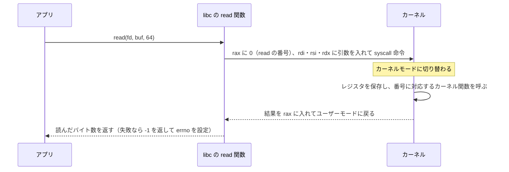
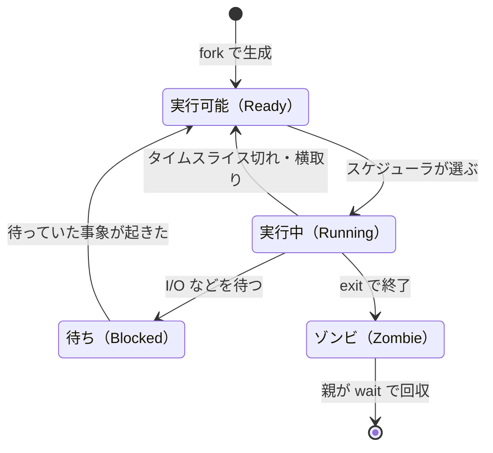

# 4.1 プロセス・スレッド・システムコール

> `python3 app.py` と打ったとき、OS の中では何が起きているのでしょうか。なぜ `kill` しても止まらないプロセスがあり、なぜコンテナの停止に 10 秒もかかることがあり、なぜ CPU がほとんど遊んでいるのにロードアベレージが 30 を超えるのでしょうか。この章では、OS が CPU を「仮想化」して多数のプログラムを同時に動かす仕組み ― システムコール・プロセス・スレッド・スケジューリング・シグナル ― を、実際に観察しながら理解します。

| 項目 | 内容 |
|---|---|
| 学習時間の目安 | 本文 4h ＋ 演習 6h |
| 前提となる章 | [1.4 プログラムが動く仕組み](../../01-computer-systems/04-how-programs-run/README.md) |
| 演習 | [exercises/](exercises/)（Python。演習4 と演習5 の一部は Unix 専用） |
| キーワード | カーネル, システムコール, strace, fork/exec, ファイルディスクリプタ, パイプ, コンテキストスイッチ, スケジューリング, MLFQ, CFS/EEVDF, シグナル, PID 1, ロードアベレージ |

## この章のゴール

- [ ] OS の役割（抽象化・仮想化・資源管理・保護）と、ユーザーモード／カーネルモードの区別を説明できる
- [ ] システムコールが呼ばれる流れとそのコストを説明し、strace で実際のプログラムの振る舞いを観察できる
- [ ] fork・exec・wait、ファイルディスクリプタ、パイプを組み合わせて、シェルのパイプラインを自分で実装できる
- [ ] スケジューリングの評価指標と代表的なアルゴリズム（FIFO・SJF・RR・MLFQ）のトレードオフを、シミュレーションで比較して説明できる
- [ ] シグナルを使ったグレースフルシャットダウンを実装し、コンテナの PID 1 問題とその対策を説明できる
- [ ] ps・top・/proc・ロードアベレージを正しく読み、「CPU が足りないのか、I/O を待っているのか」を切り分けられる

## なぜ学ぶのか

アプリケーションのコードは、実行時間のほとんどを OS の上で、OS の助けを借りて過ごしています。OS の振る舞いを知らないと、次のような問題を「謎の現象」として扱うことになります。

- **デプロイのたびにエラーが出る**: Kubernetes は Pod を止めるとき、まずコンテナのプロセスに SIGTERM を送り、猶予期間（既定 30 秒）内に終わらなければ SIGKILL で強制終了します。アプリが SIGTERM を正しく扱わないと、処理中のリクエストが失われたり、停止が毎回タイムアウトまで待たされたりします。原因の多くは、この章で扱う「シグナル」と「PID 1」の性質にあります。
- **ロードアベレージの誤読**: Linux のロードアベレージは、CPU を使っている・待っているプロセスだけでなく、ディスク I/O などで **割り込み不可能な待ち状態（D 状態）** にあるプロセスも数えます。Brendan Gregg の記事 "Linux Load Averages: Solving the Mystery"（2017）は、この仕様が 1993 年のカーネルへのパッチに由来することを突き止めて話題になりました。これを知らないと、ストレージやネットワークファイルシステムの障害を「CPU 不足」と誤診し、サーバーを増やすという的外れな対応をしてしまいます。
- **プロセスが受け継ぐものとセキュリティ**: 2014 年の Shellshock（CVE-2014-6271）は、bash が関数定義に見える環境変数を読み込む際に、その後ろに続くコマンドまで実行してしまう脆弱性でした。CGI のように「HTTP ヘッダの値を環境変数に入れて子プロセスを起動する」仕組みを通じて、リモートから任意のコマンドを実行できました。プロセスが親から何を受け継ぐのかを知ることは、セキュリティの基礎でもあります。

## 1. OS は何をしているのか

### 1.1 OS の 4 つの役割

OS、とくにその中核である **カーネル（kernel）** の仕事は、大きく 4 つに整理できます。

| 役割 | 内容 | 例 | 主に扱う章 |
|---|---|---|---|
| 抽象化 | 扱いにくいハードウェアを、使いやすい概念に置き換える | ディスクのブロック → ファイル、NIC → ソケット | 4.3、5.2 |
| 仮想化 | 1 つの物理資源を、各プログラムが独占しているように見せる | CPU → プロセス、物理メモリ → 仮想アドレス空間 | 4.1、4.2 |
| 資源管理 | 限られた資源を、公平かつ効率よく配分する | スケジューリング、メモリ割り当て、cgroups | 4.1、4.5 |
| 保護 | プログラム同士、プログラムと OS を隔離する | CPU の特権モード、メモリ保護、権限 | 4.1、4.2 |

この章の主役は **CPU の仮想化** です。CPU コアが 4 個しかないマシンでも数百のプロセスが「自分専用の CPU で動いている」かのように振る舞えるのは、OS が CPU を細かい時間に区切って順番に割り当て（**時分割、time sharing**）、切り替えのたびに各プロセスの状態を保存・復元しているからです。

### 1.2 ユーザーモードとカーネルモード

任意のプログラムがハードウェアを直接操作できると、1 つのバグや悪意あるプログラムがシステム全体を壊せてしまいます。そこで CPU は、実行中のコードの **特権レベル** をハードウェアで管理しています。

- **カーネルモード（kernel mode）**: すべての命令を実行でき、すべてのメモリとデバイスにアクセスできる。カーネルはこのモードで動く。
- **ユーザーモード（user mode）**: 特権命令（割り込みの禁止、ページテーブルの切り替え、CPU の停止など）を実行できず、許されたメモリにしかアクセスできない。アプリケーションはこのモードで動く。

x86-64 では特権レベルを「リング」と呼び、Linux はリング 0 をカーネル、リング 3 をユーザーに使います（ARM では EL0 がユーザー、EL1 がカーネル）。ユーザーモードで特権命令を実行すると、CPU は例外を発生させてカーネルに制御を移し、カーネルはそのプロセスにシグナルを送って止めます。C で試してみましょう（C の文法は分からなくても構いません）。

```c
#include <stdio.h>
int main(void) {
    puts("ユーザーモードで特権命令 hlt を実行します");
    fflush(stdout);
    __asm__ volatile("hlt");   /* CPU を停止させる特権命令 */
    puts("ここには到達しない");
    return 0;
}
```

```text
$ gcc -O2 -o priv priv.c && ./priv; echo "終了ステータス: $?"
ユーザーモードで特権命令 hlt を実行します
bash: line 1: 25635 Segmentation fault      ./priv
終了ステータス: 139
$ dmesg | tail -1
[ 2621.159235] traps: priv[25635] general protection fault ip:555af0d8d0a0 sp:7fffd9f44740 error:0 in priv[10a0,555af0d8d000+1000]
```

CPU が一般保護例外（general protection fault）を起こし、カーネルがそれを SIGSEGV（シグナル番号 11）に変換してプロセスを終了させました。終了ステータス 139 は「128 ＋ シグナル番号 11」という、シェルの慣習による表現です。

### 1.3 カーネルに入る 3 つの入り口

ユーザーモードからカーネルモードへ切り替わるきっかけは、次の 3 種類しかありません。

| 入り口 | きっかけ | 例 |
|---|---|---|
| システムコール | プログラムが意図的に OS の機能を呼ぶ | ファイルの読み書き、プロセスの生成、メモリの確保 |
| 例外（exception） | 実行中の命令が問題を起こす | ページフォールト（4.2）、ゼロ除算、特権命令の違反 |
| 割り込み（interrupt） | ハードウェアからの通知 | タイマー、パケットの到着、ディスク I/O の完了 |

とくに重要なのが **タイマー割り込み** です。プログラムが無限ループに陥っても、一定時間ごとにタイマー割り込みでカーネルに制御が戻るので、カーネルは別のプロセスに CPU を渡せます。「プログラムを CPU 上で直接（高速に）実行させつつ、特権モードとタイマーで制限をかける」この方式を、教科書 OSTEP は **制限付き直接実行（limited direct execution）** と呼んでいます。

## 2. システムコール

### 2.1 システムコールの仕組み

**システムコール（system call）** は、ユーザープログラムがカーネルに仕事を頼むための正規の窓口です。Linux には数百のシステムコールがあり、それぞれに番号が振られています。x86-64 の Linux で `read(fd, buf, 64)` を呼ぶと、次のことが起きます。



押さえておきたい点は 3 つです。

1. 普段呼んでいる `read()` や `open()` は、C ライブラリ（libc）の **ラッパー関数** です。中でレジスタに番号と引数を詰め、`syscall` 命令を実行しています。Python の `os.read()` もこのラッパーを呼びます。
2. カーネルは、ユーザーから渡されたポインタや値を信用せず、必ず検査します。ここが保護の境界です。
3. エラーは戻り値で返ります。libc はそれを `errno`（`ENOENT`、`EAGAIN` など）に変換し、Python はさらに `OSError` の派生例外（`FileNotFoundError`、`BlockingIOError` など）に変換します。

### 2.2 strace で観察する

**strace** は、プロセスが呼んだシステムコールを、引数と戻り値付きで表示するツールです。ファイルを読んで標準出力に書くだけの C プログラムを追跡してみます。

```c
#include <fcntl.h>
#include <unistd.h>

int main(void) {
    int fd = open("hello.txt", O_RDONLY);
    char buf[64];
    ssize_t n = read(fd, buf, sizeof buf);
    write(1, buf, n);
    close(fd);
    return 0;
}
```

```text
$ strace ./hello > /dev/null
execve("./hello", ["./hello"], 0x7ffed210bb80 /* 146 vars */) = 0
brk(NULL)                               = 0x5636fb48c000
mmap(NULL, 8192, PROT_READ|PROT_WRITE, MAP_PRIVATE|MAP_ANONYMOUS, -1, 0) = 0x7fe832c17000
access("/etc/ld.so.preload", R_OK)      = -1 ENOENT (No such file or directory)
openat(AT_FDCWD, "/etc/ld.so.cache", O_RDONLY|O_CLOEXEC) = 3
（中略: 24 行。動的リンカが libc.so.6 を開き、mmap でメモリに配置する）
openat(AT_FDCWD, "hello.txt", O_RDONLY) = 3
read(3, "hello\n", 64)                  = 6
write(1, "hello\n", 6)                  = 6
close(3)                                = 0
exit_group(0)                           = ?
+++ exited with 0 +++
```

読み方を確認しましょう。

- `execve` で、このプロセスの中身が `./hello` に置き換わります（3.2）。
- `execve` の後の 28 行は、`main` が始まる前に動的リンカが共有ライブラリを読み込む処理です（[1.4](../../01-computer-systems/04-how-programs-run/README.md)）。`access` が `-1 ENOENT` を返していますが、これは「preload の設定ファイルがない」という想定内の失敗です。**strace に表示されるエラーのすべてが問題とは限りません。**
- `openat` が `3` を返しています。0・1・2 番は標準入力・標準出力・標準エラー出力として最初から使われているので、空いている最小の番号 3 が割り当てられました（3.5）。
- `write(1, ...)` の 1 は標準出力です。`exit_group` はプロセス内の全スレッドを終了させます。

`strace -c` を付けると、呼び出し回数の集計が得られます。このプログラムは起動から終了までに 33 回のシステムコールを呼びました。同じ環境で `python3 -c 'pass'`（Python 3.11）を集計すると 366 回で、インタプリタの起動にはそれなりの仕事があることが分かります（回数はバージョンや環境で変わります）。

よく使うオプションは、子プロセスやスレッドも追う `-f`、種類を絞る `-e trace=file`（`network`、`process` なども指定可）、実行中のプロセスに接続する `-p PID`、各呼び出しの所要時間を出す `-T` です。

strace は ptrace という仕組みで、システムコールのたびに対象プロセスを止めて情報を読み取るため、**対象を大幅に遅くします**。本番の性能問題の調査では、オーバーヘッドの小さい `perf trace` や eBPF ベースのツール（bpftrace など）が使われることも多いです。また、コンテナの中では ptrace が権限設定で禁止されていることがあります（[4.5](../05-virtualization-and-containers/README.md)）。

### 2.3 システムコールのコスト

システムコールは、普通の関数呼び出しよりずっと高価です。C で 1,000 万回ずつ呼んで測った結果を示します（この章の測定値はすべて、執筆に使った仮想マシン（Intel Xeon 2.1GHz、Linux 6.18）でのものです。CPU・カーネル・脆弱性対策の設定で数倍変わります）。

| 操作 | 1 回あたり |
|---|---|
| 普通の関数呼び出し | 1.8 ns |
| システムコール `getppid()` | 117 ns |
| `clock_gettime()`（vDSO 経由） | 29 ns |

システムコールには、モードの切り替え、レジスタの保存と復元、カーネル側の検査に加えて、Meltdown などの CPU 脆弱性への対策（カーネルとユーザーでページテーブルを分ける KPTI など）の費用がかかります。一方 `clock_gettime()` は、カーネルがすべてのプロセスのアドレス空間にマップしている小さな共有ライブラリ **vDSO** の中で、モードを切り替えずに時刻を読むので速いのです（strace にも現れません）。

コストは積み重なると大きな差になります。1MB を 1 バイトずつ `write()` するのと、C の標準ライブラリ（stdio）のバッファを通して書くのとを比べました。

```text
write(2) を 100 万回: 0.341 秒
stdio の fputc     : 0.004 秒
```

stdio はユーザー空間に数 KB のバッファを持ち、満杯になったときだけ `write()` を呼ぶので、システムコールの回数が数千分の一になります。**システムコールは「まとめて少なく」呼ぶのが原則** で、バッファリング（[4.3](../03-filesystems-and-io/README.md)）、複数のバッファを 1 回で書く `writev`、I/O 要求をまとめて渡す io_uring（4.3）はいずれもこの原則に基づいています。

## 3. プロセス

### 3.1 プロセスとは何か

**プロセス（process）** は「実行中のプログラム」です。プログラム（ディスク上の実行ファイル）が料理のレシピだとすれば、プロセスは調理中の台所にあたり、次のような状態を含みます。

- 仮想アドレス空間（コード・データ・ヒープ・スタック。[4.2](../02-virtual-memory/README.md)）
- CPU の状態（レジスタ、プログラムカウンタ、スタックポインタ）
- 開いているファイルの一覧（ファイルディスクリプタ表）
- PID（プロセス ID）と、親プロセスの PID（PPID）
- ユーザー ID などの資格情報、カレントディレクトリ、環境変数、シグナルの設定、資源の上限（rlimit）

カーネルはこれらを **プロセス制御ブロック（PCB）** と呼ばれる構造体で管理します。Linux では `task_struct` がこれにあたり、その一部は `/proc/<PID>/` 以下のファイルとして読めます（8.1）。

### 3.2 fork・exec・wait

Unix で新しいプログラムを起動する方法は、少し変わっています。「新しいプロセスを作ってプログラムを読み込む」を一度に行うのではなく、2 段階に分けるのです。

- **fork()**: 自分自身の複製（子プロセス）を作る。子は親のアドレス空間・ファイルディスクリプタ・環境変数などのコピーを持ち、fork() の直後から実行を続ける。戻り値は、親では子の PID、子では 0。
- **exec()**（execve など）: 自分のプロセスの中身を、別のプログラムで置き換える。PID は変わらず、開いているファイルディスクリプタも（close-on-exec の印が付いていなければ）引き継ぐ。成功すると戻ってこない。
- **wait()**（waitpid など）: 子の終了を待ち、終了ステータスを受け取る。

```python
import os

print(f"親: PID={os.getpid()}")
pid = os.fork()                      # ここでプロセスが 2 つに分かれる
if pid == 0:
    # 子プロセス: fork() は 0 を返す
    print(f"子: PID={os.getpid()}, 親の PID={os.getppid()}")
    os.execvp("echo", ["echo", "exec 後は echo プログラムに置き換わった"])
    # execvp が成功すると、ここには戻ってこない
else:
    # 親プロセス: fork() は子の PID を返す
    _, status = os.waitpid(pid, 0)   # 子の終了を待ち、終了ステータスを回収する
    print(f"親: 子 {pid} が終了。exit code = {os.waitstatus_to_exitcode(status)}")
```

```text
親: PID=5752
子: PID=5753, 親の PID=5752
exec 後は echo プログラムに置き換わった
親: 子 5753 が終了。exit code = 0
```

**なぜ 2 段階に分けるのか**。fork と exec の間で、子プロセスは「自分の環境を整えてから」別のプログラムになれるからです。シェルがリダイレクト `cmd > out.txt` を実現できるのは、fork した子の中で `out.txt` を開いて標準出力（fd 1）に付け替えてから exec するからです。exec されたプログラムは、自分の出力がファイルに向いていることを知りません。パイプ、環境変数の設定、カレントディレクトリの変更、権限を落とす処理も、すべてこの隙間で行われます。

アドレス空間を丸ごと複製する fork は高価に見えますが、実際には **コピーオンライト（copy-on-write）** により、書き込まれたページだけを後からコピーします（[4.2](../02-virtual-memory/README.md)）。それでもページテーブルの複製は必要なので、数十 GB のメモリを使うプロセスの fork には目に見える時間がかかります。そのため、fork と exec をまとめて効率よく行う `posix_spawn()` や `vfork()` も用意されており、Python の `subprocess` も条件がそろえば内部でこれらを使います。

### 3.3 プロセスの状態

プロセスは、生まれてから消えるまでにいくつかの状態を行き来します。



Linux の `ps` の STAT 列には、次の記号で表示されます。

| 記号 | 状態 | 説明 |
|---|---|---|
| R | 実行中 / 実行可能 | CPU で動いている、または CPU の順番待ち（Linux は両者を区別しない） |
| S | 割り込み可能な待ち | ネットワーク・タイマー・入力などを待っている。シグナルで起こせる |
| D | 割り込み不可能な待ち | 主にディスクなどの I/O の完了を待っている。原則としてシグナルでも起こせない（SIGKILL を送ってもすぐには終わらないことがある） |
| T | 停止 | SIGSTOP・Ctrl-Z・デバッガで止められている |
| Z | ゾンビ | 終了したが、親がまだ wait していない |

D 状態のプロセスが大量にいるなら、ディスクやネットワークファイルシステムが詰まっている可能性が高く、このことが 8.2 のロードアベレージの話につながります。

### 3.4 ゾンビと孤児

子プロセスが終了しても、カーネルは親が終了ステータスを受け取るまで、その PID と終了ステータスを保持します。この「死んだが回収されていない」状態が **ゾンビ（zombie）** です。

```python
import os, subprocess, time

pid = os.fork()
if pid == 0:
    os._exit(7)                          # 子はすぐに終了する
time.sleep(0.5)                          # 親はまだ wait しない
subprocess.run(["ps", "-o", "pid,ppid,stat,cmd", "-p", str(pid)])
_, status = os.waitpid(pid, 0)           # ここで回収（reap）され、ゾンビは消える
print("回収した終了コード:", os.waitstatus_to_exitcode(status))
```

```text
  PID  PPID STAT CMD
29441 29440 Z    [python3] <defunct>
回収した終了コード: 7
```

ゾンビはメモリをほとんど使いませんが、PID を 1 つ占有し続けます。子を wait しないプログラムが長時間動くと、ゾンビが溜まり、PID の上限（`/proc/sys/kernel/pid_max`、コンテナなら cgroup の `pids.max`）に達して新しいプロセスを作れなくなります。

逆に、親が先に終了した子を **孤児（orphan）** と呼びます。孤児は PID 1 のプロセス（または `prctl` で「サブリーパー」に登録されたプロセス）に引き取られ、終了したときには PID 1 が wait して回収する約束になっています。通常のマシンでは PID 1 は systemd などの init なので問題になりませんが、**コンテナの中では、あなたのアプリが PID 1 になる** ことに注意してください（6.4）。

### 3.5 ファイルディスクリプタ

**ファイルディスクリプタ（file descriptor、fd）** は、プロセスが開いている「入出力の口」を指す小さな整数です。通常のファイルだけでなく、パイプ、ソケット、端末、デバイスも同じ fd として扱えます（「すべてはファイル」という Unix の設計）。

```python
import os

f = open("/etc/hostname")      # 空いている最小の番号（3）が割り当てられる
r, w = os.pipe()               # パイプは読み出し口と書き込み口の 2 つの fd
for fd in range(6):
    print(fd, "->", os.readlink(f"/proc/self/fd/{fd}"))
```

```text
$ python3 fds.py < /dev/null 2>/dev/null | cat
0 -> /dev/null
1 -> pipe:[433893]
2 -> /dev/null
3 -> /etc/hostname
4 -> pipe:[435333]
5 -> pipe:[435333]
```

fd は、プロセスごとの **fd 表** の添字です。fd 表の各項目は、カーネル全体で共有される「オープンファイル記述（読み書きの位置などを持つ）」を指しています（詳しくは [4.3](../03-filesystems-and-io/README.md)）。

- **fork すると fd 表はコピーされ**、親子は同じオープンファイル記述を共有します。そのため読み書きの位置（オフセット）も共有されます。
- **exec しても fd は引き継がれます**。引き継がせたくない fd には close-on-exec（`O_CLOEXEC`）の印を付けます。C でこれを忘れると、例えばサーバーの待ち受けソケットが子プロセスに漏れ、親を再起動してもポートが解放されない、といった事故が起きます。Python は 3.4 以降、作る fd に既定でこの印を付けます（PEP 446）。
- fd の数には上限があります（`ulimit -n`）。上限に達すると `open()` や `accept()` が「Too many open files」（`EMFILE`）で失敗します。**fd のリーク** は長時間動くサーバーの典型的な障害で、`ls /proc/<PID>/fd | wc -l` を監視すると早期に気づけます。

### 3.6 パイプとシェルのパイプライン

**パイプ（pipe）** は、カーネル内のバッファを介した一方向のバイト列の通り道です。書き込み端に書いたバイトが、読み出し端から同じ順で読めます。

```python
import fcntl, os
r, w = os.pipe()
print(fcntl.fcntl(w, fcntl.F_GETPIPE_SZ))   # 65536（Linux 専用。Python 3.10 以降）
```

パイプの振る舞いは 4 つの規則で理解できます。

1. バッファ（Linux の既定で 64 KiB）が満杯なら、書き手は待たされる。これが自然な **背圧（バックプレッシャー）** になる。
2. バッファが空なら、読み手は待たされる。
3. **すべての** 書き込み端が閉じられると、読み手は EOF（長さ 0 の読み出し）を受け取る。
4. 読み手が誰もいないパイプに書くと、書き手に SIGPIPE が送られる（無視していれば `EPIPE` エラーになる）。

シェルが `ls | wc -l` を実行するときの手順は次の通りです。

```text
シェル: pipe() → [読み出し端 r, 書き込み端 w]
  ├─ fork → 子1: dup2(w, 1) で標準出力を w に。r と w を閉じて exec("ls")
  ├─ fork → 子2: dup2(r, 0) で標準入力を r に。r と w を閉じて exec("wc", "-l")
  └─ 親:  r と w を閉じ、waitpid(子1)、waitpid(子2)

        ls ──fd 1──▶ [ カーネルのパイプバッファ ] ──fd 0──▶ wc -l
```

規則 3 から、**親が書き込み端 w を閉じ忘れると、wc は永遠に EOF を受け取れず、パイプライン全体が終わりません**。これは演習4で実際に確かめます。

規則 4 の SIGPIPE も、実務でよく目にします。

```text
$ yes | head -n 2; echo "PIPESTATUS: ${PIPESTATUS[@]}"
y
y
PIPESTATUS: 141 0
$ python3 -c 'for i in range(100000): print(i)' | head -n 2
0
1
Traceback (most recent call last):
  File "<string>", line 1, in <module>
BrokenPipeError: [Errno 32] Broken pipe
```

`yes` は head が終了した後の書き込みで SIGPIPE を受けて静かに終了しました（141 = 128 + 13）。一方 Python は起動時に SIGPIPE を「無視」に設定するので、シグナルの代わりに `BrokenPipeError` 例外になります。この「無視」の設定は exec 後の子プロセスにも引き継がれるため、Python の `subprocess` は子を起動する前に SIGPIPE を既定の動作に戻しています（`restore_signals=True`）。演習4でも同じことが必要になります。

### 3.7 環境変数とコマンドライン引数

プロセスは、起動時に **環境変数（environment variable）** の一覧を受け取ります。fork では親のコピーが、exec では指定した一覧が渡されます。あくまでコピーなので、子が変更しても親には影響しません。`cd` や `export` がシェルの組み込みコマンドなのは、別プロセスとして実行すると親（シェル）の状態を変えられないからです。

コンテナの世界では、設定を環境変数で渡すのが一般的です。ただし秘密情報の扱いには注意が必要です。

```text
$ ls -l /proc/self/cmdline /proc/self/environ | awk '{print $1, $NF}'
-r--r--r-- /proc/self/cmdline
-r-------- /proc/self/environ
```

コマンドライン引数（`cmdline`）は **同じマシンのすべてのユーザーが読めます**（`ps aux` で見えるのはこのためです）。パスワードをコマンドライン引数で渡してはいけません。環境変数（`environ`）は本人と root しか読めませんが、子プロセスに自動で受け継がれ、クラッシュレポートやデバッグ用のエンドポイントに出力されがちです。秘密情報はシークレット管理の仕組みを使って、権限を絞ったファイルなどで渡すのが安全です（[11.5](../../11-security/05-security-operations/README.md)）。

## 4. スレッド

### 4.1 スレッドが共有するもの・しないもの

**スレッド（thread）** は、プロセスの中の「実行の流れ」です。1 つのプロセスは複数のスレッドを持て、それらは同じアドレス空間で並行に動きます。

| スレッド間で共有する（プロセス単位） | スレッドごとに持つ |
|---|---|
| アドレス空間（コード・グローバル変数・ヒープ） | レジスタ、プログラムカウンタ |
| ファイルディスクリプタ表 | スタック |
| シグナルハンドラの設定 | シグナルマスク（どのシグナルを一時的に保留するか） |
| カレントディレクトリ、ユーザー ID | スレッド ID、スケジューリングの優先度 |
| | スレッドローカル記憶域（TLS）、`errno` |

Linux のカーネルから見ると、スレッドもプロセスも同じ「タスク」で、`clone()` システムコールの引数で「何を親と共有するか」を選んで作り分けています。3 つのスレッドを作った Python プロセスを覗いてみます。

```text
タスク一覧: [7265, 7266, 7267, 7268]
  PID   LWP NLWP STAT COMMAND
 7265  7265    4 Sl   python3
 7265  7266    4 Sl   python3
 7265  7267    4 Sl   python3
 7265  7268    4 Sl   python3
```

`/proc/<PID>/task/` にはスレッドごとのディレクトリがあり、`ps -L` はスレッドを 1 行ずつ表示します（LWP がスレッド ID、NLWP がスレッド数。STAT の `l` はマルチスレッドであることを示します）。

メモリを共有することの帰結は 2 つです。スレッド間の通信は安い（ポインタを渡すだけ）が、同じデータを同時に触ると競合状態が起きる（[4.4](../04-concurrency/README.md)）。そして、**1 つのスレッドが不正なメモリアクセスをすると、プロセス全体が落ちます**。

### 4.2 プロセスかスレッドか

| 観点 | マルチプロセス | マルチスレッド |
|---|---|---|
| 隔離 | 強い（1 つが落ちても他は無事） | 弱い（1 スレッドのクラッシュでプロセス全体が落ちる） |
| 通信 | IPC が必要（データのコピーが発生しがち） | メモリを共有（速いが同期が必要） |
| 生成と切り替え | 重い | 軽い |
| メモリ | プロセスごと（コピーオンライトで共有できる部分もある） | 共有 |

実際のソフトウェアは、目的に応じて使い分けています。

- **PostgreSQL** は 1 接続につき 1 プロセス（バックエンドプロセス）を作ります。接続ごとのメモリが大きく、数千の接続を直接張るのは苦手なので、PgBouncer などの接続プーラーを前段に置くのが定石です。MySQL は 1 接続につき 1 スレッドです。
- **Chrome** はタブやサイトごとにプロセスを分け、1 つのページのクラッシュや脆弱性の影響を閉じ込めています。
- **nginx** は CPU コア数程度のワーカープロセスを起動し、各ワーカーがイベントループで多数の接続を捌きます（[4.3](../03-filesystems-and-io/README.md)）。
- **Python** は GIL のため CPU を使う処理をスレッドで並列化できず、複数プロセスを使うのが一般的です（[4.4](../04-concurrency/README.md)）。

OS のスレッドは生成にも切り替えにもカーネルが関わるため、数十万個を作るには重すぎます。そこで、言語のランタイムが自前でスケジューリングする軽量な実行単位も広く使われています。Go の goroutine（多数の goroutine を少数の OS スレッドに割り当てる M:N スケジューリング）、JDK 21 で正式導入された Java の仮想スレッド、Erlang のプロセス、Python の asyncio のコルーチンなどです。詳しくは [4.4](../04-concurrency/README.md) で扱います。

## 5. コンテキストスイッチとスケジューリング

### 5.1 コンテキストスイッチのコスト

CPU を別のタスクに渡すことを **コンテキストスイッチ（context switch）** と呼びます。カーネルは、現在のタスクのレジスタを保存し、次に動かすタスクを選び、そのレジスタを復元します。別のプロセスへの切り替えなら、アドレス空間（ページテーブル）も切り替えます。

直接のコストに加えて、**間接的なコスト** が大きいことが重要です。切り替え直後のタスクは、CPU キャッシュや TLB（[4.2](../02-virtual-memory/README.md)）に自分のデータがほとんど残っていないため、しばらく遅く動きます。

2 つのプロセスがパイプで 1 バイトを 20 万回往復させて測ってみました（同じ CPU に固定し、往復ごとに必ず 2 回の切り替えが起きるようにしています）。

```text
$ taskset -c 0 ./pingpong
往復 1 回: 2.89 us（往復あたりコンテキストスイッチ 2 回 + システムコール 4 回）
```

システムコール 4 回分を差し引くと、切り替え 1 回はこの環境でおよそ 1 マイクロ秒強です。1 秒間に数万回の切り替えが起きれば、CPU 時間の数 % が切り替えそのものに消えます。

`/proc/<PID>/status` の `voluntary_ctxt_switches`（I/O 待ちなどで自ら CPU を手放した回数）と `nonvoluntary_ctxt_switches`（時間切れで横取りされた回数）は、診断に役立ちます。後者が急増しているなら、CPU の取り合い（あるいはコンテナの CPU 制限によるスロットリング。[4.5](../05-virtualization-and-containers/README.md)）を疑います。

### 5.2 スケジューリングの評価指標

どのタスクに、いつ、どれだけ CPU を渡すかを決めるのが **スケジューラ（scheduler）** です。良し悪しを測る主な指標は次の通りです。

| 指標 | 定義 | 重視する場面 |
|---|---|---|
| ターンアラウンド時間 | 完了時刻 − 到着時刻 | バッチ処理 |
| 待ち時間 | ターンアラウンド時間 − 実行に必要な時間 | 全般 |
| 応答時間 | 初めて実行された時刻 − 到着時刻 | 対話的な処理 |
| スループット | 単位時間あたりに完了した数 | バッチ処理 |
| 公平性 | 各タスクが受け取る CPU の偏りのなさ | 共有環境 |

これらは互いに衝突します。平均ターンアラウンド時間を最小にする方式は長いジョブを後回しにして不公平になり、応答時間を良くする方式は切り替えが増えてスループットが落ちます。**万能の方式はなく、何を優先するかの選択** がスケジューリングの本質です。

### 5.3 古典的なアルゴリズム

| 方式 | 規則 | 長所 | 短所 |
|---|---|---|---|
| FIFO（FCFS） | 到着順に最後まで実行 | 単純 | 長いジョブの後ろで短いジョブが待たされる（**護送船団効果、convoy effect**） |
| SJF | 最短のジョブから、最後まで実行 | 全員が同時に到着するなら平均ターンアラウンド時間が最小 | 実行時間を事前に知る必要がある。長いジョブが飢餓（starvation）に陥りうる |
| SRTF（STCF） | 残り時間が最短のジョブを、横取りしてでも実行 | 平均ターンアラウンド時間が最小（SJF のプリエンプティブ版） | SJF と同じ |
| ラウンドロビン（RR） | 一定時間（量子、quantum）ずつ順番に実行 | 応答時間が良く、公平 | ターンアラウンド時間が悪い。量子が小さいと切り替えが増える |
| 優先度 | 優先度の高い順に実行 | 重要な処理を先に進められる | 低優先度の飢餓。待つほど優先度を上げる **エージング** で対処 |

演習1〜3で実装するシミュレータで、4 つのプロセス（到着時刻と必要な CPU 時間: A=0 と 8、B=1 と 4、C=2 と 9、D=3 と 5）を各方式でスケジュールしてみます（解答例で実行し、出力を表に整形しました）。

```python
from sched_sim import Process as P, average, compute_metrics, fifo, format_gantt, mlfq, round_robin, sjf, srtf

procs = [P("A", 0, 8), P("B", 1, 4), P("C", 2, 9), P("D", 3, 5)]
for label, timeline in [("FIFO", fifo(procs)), ("SJF", sjf(procs)), ("SRTF", srtf(procs)),
                        ("RR (q=1)", round_robin(procs, 1)), ("RR (q=4)", round_robin(procs, 4)),
                        ("MLFQ (2,4,8)", mlfq(procs, (2, 4, 8)))]:
    a = average(compute_metrics(procs, timeline))
    print(f"{label:<14}{a.turnaround:>8.2f}{a.waiting:>8.2f}{a.response:>8.2f}")
print(format_gantt(srtf(procs)))
```

| 方式 | 平均ターンアラウンド時間 | 平均待ち時間 | 平均応答時間 |
|---|---|---|---|
| FIFO | 15.25 | 8.75 | 8.75 |
| SJF | 14.25 | 7.75 | 7.75 |
| SRTF | **13.00** | **6.50** | 4.25 |
| RR（q=1） | 19.00 | 12.50 | **0.75** |
| RR（q=4） | 18.25 | 11.75 | 4.50 |
| MLFQ（量子 2, 4, 8） | 19.50 | 13.00 | 1.50 |

SRTF のガントチャート（`format_gantt` の出力）は次の通りです。B と D が到着するたびに A が横取りされています。

```text
A |█·········███████·········|
B |·████·····················|
D |·····█████················|
C |·················█████████|
   0〜26（1 文字 = 1 単位時間）
```

SRTF はターンアラウンド時間と待ち時間で最良ですが、そのためには各ジョブの残り時間を知っている必要があります。RR は応答時間で圧勝する代わりに、ターンアラウンド時間は FIFO よりも悪くなります。MLFQ は、ジョブの長さを知らないまま RR に近い応答時間を実現しています（5.4）。

**量子の大きさ** もトレードオフです。切り替え 1 回に 1 単位時間かかるとして、同じ 4 プロセスを RR で動かすと次のようになります。

| 量子 q | 全体の完了時刻（切り替えコストなし → あり） | 平均応答時間（なし → あり） |
|---|---|---|
| 1 | 26 → 49 | 0.75 → 2.50 |
| 2 | 26 → 38 | 2.00 → 3.75 |
| 4 | 26 → 33 | 4.50 → 6.00 |
| 8 | 26 → 30 | 8.50 → 10.00 |

量子を小さくするほど応答は速くなりますが、切り替えのコストが無視できなくなります。実際の OS の量子は、切り替えコスト（マイクロ秒単位）よりずっと長いミリ秒単位に設定されています。

### 5.4 MLFQ: 未来を知らずに短いジョブを優先する

SJF・SRTF は最適ですが、ジョブの長さを知る必要があります。現実の OS はそれを知りません。**多段フィードバックキュー（MLFQ、Multi-Level Feedback Queue）** は、「過去の振る舞いから未来を予測する」ことでこの問題を解きます。OSTEP は MLFQ の規則を次のようにまとめています。

1. 優先度の高いキューのジョブを先に実行する。
2. 同じ優先度のジョブはラウンドロビンで実行する。
3. 新しいジョブは最高の優先度から始める。
4. あるレベルで割り当て時間を使い切ったら（途中で何回 CPU を手放したかに関係なく）、優先度を 1 段下げる。
5. 一定時間ごとに、すべてのジョブを最高の優先度に戻す（**優先度ブースト**）。

短いジョブや、すぐに I/O 待ちになる対話的なジョブは高い優先度に留まり、CPU を使い続ける長いジョブは下に沈んでいきます。規則 5 がないと、短いジョブが次々に来るとき長いジョブが永遠に実行されません（飢餓）。演習3の MLFQ（量子 1 と 2 の 2 段）で、長いジョブ A（5 単位）の後ろから 1 単位のジョブが 30 個続けて到着する状況を試すと、ブーストなしでは A の完了は時刻 35 まで遅れ、5 単位ごとのブーストがあれば時刻 25 に完了します。規則 4 の「途中で CPU を手放しても累積で数える」は、割り当て時間を使い切る直前にわざと I/O をして優先度を保つ「ずる（gaming）」を防ぐためのものです。

OSTEP によれば、BSD 系の Unix、Solaris、Windows NT 以降の Windows などが、MLFQ の考え方を基本にしたスケジューラを採用してきました。

### 5.5 Linux のスケジューラ

Linux は複数の **スケジューリングクラス** を持ち、締め切りを指定するリアルタイム用の `SCHED_DEADLINE`、固定優先度のリアルタイム用の `SCHED_FIFO` / `SCHED_RR`（`chrt` コマンドで設定）、そしてほぼすべてのアプリが属する通常の `SCHED_NORMAL`（`SCHED_OTHER`）などが、この優先順で CPU を受け取ります。

通常のプロセスには、長く **CFS（Completely Fair Scheduler）** が使われてきました（Linux 2.6.23、2007 年から）。CFS の考え方は「理想的には全員に CPU を均等に配りたい」というもので、各タスクが使った CPU 時間を重みで補正した **仮想実行時間（vruntime）** を記録し、それが最も小さいタスク（最も損をしているタスク）を次に選びます。タスクは vruntime の順に赤黒木（[2.5](../../02-math-and-algorithms/05-trees-heaps-graphs/README.md)）で管理されます。重みは nice 値（-20〜19）で決まり、nice 値が 1 違うと CPU の取り分がおよそ 10% 変わるように設計されています。

Linux 6.6（2023 年）からは、CFS のタスク選択の仕組みが、1995 年の論文で提案された **EEVDF（Earliest Eligible Virtual Deadline First）** に置き換えられ始めました。EEVDF は「公平な取り分をまだ受け取っていない（eligible な）タスクのうち、仮想的な締め切りが最も早いものを選ぶ」方式で、短い時間だけ CPU を使いたいタスクの遅延を制御しやすくなっています。CFS の用語やコードの多くは残っているため、資料によって呼び方が揺れています。また Linux 6.12 では、スケジューラを eBPF のプログラムで差し替えられる **sched_ext** も取り込まれました（2026 年時点。最新の状況はカーネルのドキュメントで確認してください）。

マルチコアでは、CPU ごとに実行キューを持ち、偏りが出たらタスクを移動させて負荷を均します。ただしタスクを別の CPU に移すとキャッシュの中身が無駄になるので、なるべく同じ CPU で動かす（**CPU アフィニティ**）ことも考慮されます。`taskset` で手動で固定することもできます。コンテナの CPU 制限は、この上に cgroups の仕組みで重ねられます（8.3、[4.5](../05-virtualization-and-containers/README.md)）。

## 6. シグナルとグレースフルシャットダウン

### 6.1 シグナルの基本

**シグナル（signal）** は、プロセスに非同期に届く番号付きの通知です。各シグナルには既定の動作（終了、コアダンプ付きの終了、無視、停止、再開）があり、プロセスは「既定のまま」「無視（SIG_IGN）」「ハンドラ関数で捕捉」のいずれかを選べます。ただし **SIGKILL と SIGSTOP は捕捉も無視もできません**。

| シグナル | 番号（Linux x86-64） | 既定の動作 | 主な用途 |
|---|---|---|---|
| SIGHUP | 1 | 終了 | 端末の切断。デーモンでは「設定の再読み込み」の合図に使う慣習がある |
| SIGINT | 2 | 終了 | 端末での Ctrl-C |
| SIGQUIT | 3 | コアダンプ | Ctrl-\。JVM はスレッドダンプの出力に使う |
| SIGKILL | 9 | 終了（捕捉不可） | 最終手段の強制終了。OOM killer（[4.2](../02-virtual-memory/README.md)）も使う |
| SIGSEGV | 11 | コアダンプ | 不正なメモリアクセス |
| SIGPIPE | 13 | 終了 | 読み手のいないパイプ・ソケットへの書き込み |
| SIGTERM | 15 | 終了 | 「終了してください」という依頼。`kill` の既定、`docker stop`、Kubernetes |
| SIGCHLD | 17 | 無視 | 子プロセスの終了や停止の通知 |
| SIGCONT / SIGSTOP | 18 / 19 | 再開 / 停止（SIGSTOP は捕捉不可） | ジョブ制御、デバッガ |

シグナルで終了したプロセスの終了ステータスは、シェルでは「128 ＋ シグナル番号」と表示されます。Kubernetes で見かける **終了コード 137** は SIGKILL（9）、143 は SIGTERM（15）による終了です。

### 6.2 SIGTERM と SIGKILL

SIGTERM は「そろそろ終了してください」という依頼で、アプリは後始末をしてから自分で終われます。SIGKILL はカーネルがプロセスを即座に消すので、後始末の機会はありません。処理中のリクエストは切断され、バッファ内のログは失われ、一時ファイルは残り、外部サービスへの操作は中途半端なまま、ロックやリースは有効期限が切れるまで残ります。

そのため、プロセスを止める仕組みはどれも「まず SIGTERM、猶予期間を過ぎたら SIGKILL」という手順を踏みます。猶予期間の既定値は、`docker stop` が 10 秒、Kubernetes の `terminationGracePeriodSeconds` が 30 秒、systemd の `TimeoutStopSec` が 90 秒です（いずれも設定で変えられます）。

### 6.3 グレースフルシャットダウンの設計

SIGTERM を受けたときの理想的な振る舞いを **グレースフルシャットダウン（graceful shutdown）** と呼びます。

1. **ハンドラではフラグを立てるだけにする**。シグナルハンドラは処理の途中に割り込んで実行されるため、C ではハンドラ内で安全に呼べる関数（async-signal-safe な関数）が厳しく限られています。Python のハンドラはメインスレッドのバイトコードの合間で実行されるので C よりは安全ですが、それでも割り込まれた処理と競合しえます（Python の `io` モジュールのドキュメントは、ハンドラ内で出力をすると、割り込まれた出力処理と衝突して `RuntimeError` になりうると注意しています）。
2. **新しい仕事の受け付けを止める**。待ち受けソケットを閉じる、キューからの取り出しをやめる、ヘルスチェック（readiness）を失敗させてロードバランサから外れる。
3. **処理中の仕事を終える**。ただし猶予期間より短い自前の締め切りを設ける。
4. **後始末をする**。ログやメトリクスの flush、メッセージキューのオフセットのコミット、DB 接続のクローズ、ロックの解放。
5. **終了コード 0 で終わる**。

ワーカーの骨格を擬似コードで示します（`fetch_job`・`process`・`cleanup` は架空の関数です。演習5で、テスト付きで実装します）。

```python
import signal

stop = False

def on_sigterm(signum, frame):
    global stop
    stop = True                 # ハンドラではフラグを立てるだけ

signal.signal(signal.SIGTERM, on_sigterm)
while not stop:                 # 次の仕事を取り出す「前に」確認する
    job = fetch_job(timeout=1)  # 待つときはタイムアウト付きで。永遠に待つとフラグを確認できない
    if job is not None:
        process(job)            # 処理中にシグナルが来ても、この仕事は最後までやる
cleanup()
```

Kubernetes では、Pod の削除が決まると、Service のエンドポイントからの除外と、コンテナへの停止処理（preStop フック → SIGTERM → 猶予期間後に SIGKILL）が **並行して** 進みます。ロードバランサ側への反映には時間がかかるので、SIGTERM を受け取った後にも新しいリクエストが届きえます。preStop フックで数秒待つ、SIGTERM の後もしばらくは受け付けを続ける、といった対策が広く使われています（[10.2](../../10-cloud-and-sre/02-containers-and-kubernetes/README.md)）。

### 6.4 コンテナの PID 1 問題

コンテナの中で最初に起動したプロセスは、そのコンテナ専用の PID 名前空間（[4.5](../05-virtualization-and-containers/README.md)）で **PID 1** になります。PID 1 には特別な扱いが 2 つあります。

1. **既定の動作によるシグナル処理が行われない**。カーネルは、PID 1 に届いたシグナルのうち、PID 1 がハンドラを登録していないものを配送しません（祖先の名前空間から送られた SIGKILL・SIGSTOP だけは例外）。つまり、SIGTERM のハンドラを持たないアプリが PID 1 だと、SIGTERM は **黙って無視** され、猶予期間の後に SIGKILL で殺されます。
2. **孤児を引き取り、ゾンビを回収する役目を負う**（3.4）。アプリが子プロセスを作る場合、PID 1 が wait しないとゾンビが溜まります。

Linux の `unshare` コマンドで新しい PID 名前空間を作ると、この振る舞いを再現できます（Linux・要 root）。

```bash
# (a) ハンドラを登録していない Python を PID 1 として起動する
unshare --pid --fork python3 -c 'import time; time.sleep(60)' 2>/dev/null &
sleep 0.5; PID=$(pgrep -n -f 'time.sleep\(60\)')
kill -TERM $PID; sleep 1
ps -o pid,stat,cmd -p $PID          # SIGTERM が無視されて、まだ生きている
kill -KILL $PID; wait

# (b) SIGTERM のハンドラを持つワーカー（演習5の解答例）を PID 1 として起動する
unshare --pid --fork python3 graceful_worker.py 2 2 2 &
sleep 0.5; PID=$(pgrep -n -f 'graceful_worker.py')
kill -TERM $PID; wait
```

```text
  PID STAT CMD
25543 S    python3 -c import time; time.sleep(60)
START 1
DONE 1
SHUTDOWN SIGTERM
```

Python は SIGINT にはハンドラ（`KeyboardInterrupt` を送出するもの）を登録しますが、SIGTERM には登録しません。そのため (a) では SIGTERM が無視されました。(b) ではハンドラが登録されているので、処理中のジョブを終えてから正常に終了しています。

コンテナでよく起きるもう 1 つの落とし穴が、Dockerfile の **シェル形式** の CMD / ENTRYPOINT です。`CMD python app.py` と書くと、実際には `/bin/sh -c "python app.py"` が PID 1 になり、アプリはその子になります。Docker のドキュメントも、この形式ではシグナルがアプリに届かないと注意しています（シェルの種類やコマンドの書き方によっては sh が exec でアプリに置き換わることもありますが、それに頼るべきではありません）。対策は次の通りです。

- **exec 形式で書く**: `CMD ["python", "app.py"]`
- 起動スクリプトを挟むなら、最後を **`exec "$@"`** のように exec にして、シェルをアプリで置き換える
- PID 1 の役目に専念する小さな init（**tini** や **dumb-init**）を使う。シグナルを子に転送し、ゾンビを回収してくれる。`docker run --init` は tini を自動で挟む
- アプリ自身が SIGTERM のハンドラを登録する（どの方法を選んでも必要）

## 7. プロセス間通信（IPC）

プロセスはメモリを共有しないので、協調して働くには **プロセス間通信（IPC、Inter-Process Communication）** の仕組みが必要です。

| 方式 | 特徴 | 典型的な用途 |
|---|---|---|
| パイプ | 一方向のバイト列。親子など関係のあるプロセス間 | シェルのパイプライン、子プロセスの出力の取得 |
| 名前付きパイプ（FIFO） | ファイルシステム上の名前で、関係のないプロセスをつなぐ | 簡易な連携 |
| Unix ドメインソケット | 双方向。同一ホスト内。fd そのものを渡すこともできる | DB への接続、Docker デーモンの API（`/var/run/docker.sock`） |
| TCP/UDP ソケット | ネットワーク越しにも使える | サービス間通信（第5部） |
| 共有メモリ（`mmap`、`shm_open`） | データのコピーが不要で最速。同期は自分で行う | 大量データの受け渡し、PostgreSQL の共有バッファ |
| シグナル | 番号だけの通知 | 終了・再読み込みの合図 |
| ファイル・DB・メッセージキュー | 永続化でき、非同期にできる | 疎結合な連携（[7.5](../../07-distributed-systems/05-messaging-and-events/README.md)） |

共有メモリは最速ですが、[4.4](../04-concurrency/README.md) で扱う同期の問題をすべて引き受けることになります。ソケットやパイプによるメッセージの受け渡しは遅い代わりに、そのままネットワーク越しの分散システムへ拡張できます。「必要な性能を満たす、いちばん単純な仕組み」を選ぶのが原則です。なお `/var/run/docker.sock` のような管理用のソケットは、アクセスできること自体がホストの root 権限に等しい場合があるので、コンテナにマウントするときは慎重に判断します。

## 8. 観測と診断

### 8.1 /proc と ps・top

**/proc** は、カーネルの内部情報をファイルとして見せる仮想的なファイルシステムです。`ps` や `top` も、この中を読んで表示しています。

```text
$ python3 -c 'import time; time.sleep(3)' &
$ grep -E '^(Name|State|PPid|Threads|VmRSS|voluntary|nonvoluntary)' /proc/$!/status
Name:	python3
State:	S (sleeping)
PPid:	28483
VmRSS:	    7760 kB
Threads:	1
voluntary_ctxt_switches:	1
nonvoluntary_ctxt_switches:	0
```

ほかにも、`/proc/<PID>/fd/`（開いている fd）、`maps`（メモリの配置。[4.2](../02-virtual-memory/README.md)）、`limits`（fd の上限などの rlimit）、`cmdline`・`environ`（`\0` 区切りの引数と環境変数）、システム全体の `/proc/loadavg` や `/proc/pressure/`（8.2）がよく使われます。

`top` の CPU 行は、時間の使い道を分類しています。`us`（ユーザーモード）、`sy`（カーネルモード）、`ni`（nice 値を上げて優先度を下げたプロセス）、`id`（アイドル）、`wa`（I/O 待ちのアイドル）、`hi`/`si`（割り込み処理）、`st`（**steal**: 仮想マシンで、ハイパーバイザが CPU を他の VM に回していた時間。[4.5](../05-virtualization-and-containers/README.md)）です。`sy` が高ければシステムコールや切り替えが多すぎないか（`strace -c`、`perf`）、`st` が高ければ同じ物理ホストの他の VM との取り合いを疑います。

### 8.2 ロードアベレージの正しい読み方

```text
$ cat /proc/loadavg
1.48 0.91 0.46 2/127 7153
```

先頭の 3 つが、1 分・5 分・15 分の **ロードアベレージ（load average）** です（続く `2/127` は実行可能なタスク数と全タスク数、最後は直近に割り当てられた PID）。Linux のロードアベレージは、約 5 秒ごとに「R 状態のタスク数 ＋ **D 状態のタスク数**」を数え、それを指数的に減衰する移動平均にしたものです。R 状態だけを数える他の多くの Unix 系 OS と違い、Linux は D 状態を含めます。

読み方の原則は次の通りです。

- CPU の数（`nproc`）と比べる。4 コアでロードアベレージ 8 なら、「CPU を 2 倍取り合っている」か「I/O で詰まっている」かのどちらか（または両方）です。
- どちらかを切り分けるには、`vmstat 1` の `r` 列（実行可能なタスク数）と `b` 列（D 状態のタスク数）、`top` の `wa`、`ps -eo stat,pid,cmd | grep '^D'` を見ます。
- 1 分・5 分・15 分の値を比べると、負荷が増えているのか収まりつつあるのかが分かります。

より直接的な指標として、Linux 4.20 以降には **PSI（Pressure Stall Information）** があります。「CPU・メモリ・I/O が足りずに、タスクが待たされていた時間の割合」を示すので、ロードアベレージより解釈が容易です。

```text
$ cat /proc/pressure/cpu
some avg10=1.68 avg60=2.67 avg300=1.06 total=7840045
full avg10=0.00 avg60=0.00 avg300=0.00 total=0
```

`some avg10=1.68` は「直近 10 秒間の 1.68% の時間、少なくとも 1 つのタスクが CPU を待っていた」という意味です。cgroup v2 では、コンテナごとの PSI も取得できます。

### 8.3 cgroups: プロセスのグループに資源の上限をかける

ここまでの仕組みはプロセス単位でしたが、実務では「このサービスのプロセス群に CPU 2 個分とメモリ 4 GiB まで」のように、**プロセスのグループ** に資源の上限をかけたくなります。それを実現するのが Linux の **cgroups（control groups）** です。CPU 時間の上限（`cpu.max`）、メモリの上限（`memory.max`、超えるとグループ内で OOM kill が起きる）、プロセス数の上限（`pids.max`。fork 爆弾の対策）などを設定でき、systemd のサービス管理やコンテナの資源制限の土台になっています。CPU の上限が引き起こす「スロットリング」による遅延の問題を含め、[4.5](../05-virtualization-and-containers/README.md) で詳しく扱います。

## よくある落とし穴

1. **SIGTERM を処理せず、SIGKILL で殺されることを前提にする**。処理中のリクエストが毎回のデプロイで失われ、停止のたびに猶予期間いっぱい待たされます。SIGTERM のハンドラで受け付けを止め、処理中の仕事を終えてから終了コード 0 で終わるようにします。
2. **シェル形式の CMD や、exec しない起動スクリプトで、SIGTERM がアプリに届かない**。PID 1 が sh になり、シグナルが転送されません。exec 形式で書く、スクリプトの最後を `exec` にする、tini を使う、のいずれかで対処します。
3. **シグナルハンドラの中で重い処理をする**。ログ出力・ロックの取得・後始末をハンドラ内で行うと、割り込まれた処理と競合し、まれにしか再現しない不具合になります。ハンドラではフラグを立てるだけにし、メインの流れで後始末をします。
4. **子プロセスを wait しない**。ゾンビが溜まり、いずれ PID が枯渇します。Python なら `subprocess.run()` を使うか、`Popen` を使ったら必ず `wait()` / `communicate()` します。コンテナで子プロセスを作るなら、PID 1 がゾンビを回収できる構成にします。
5. **パイプの端を閉じ忘れる、出力を読まずに待つ**。書き込み端が 1 つでも残っていると読み手に EOF が届きません。また、子の標準出力と標準エラー出力の両方をパイプにして片方しか読まないと、もう片方のバッファが満杯になって子が止まり、デッドロックします。Python のドキュメントも、この理由で `Popen.communicate()` を使うよう勧めています。
6. **ロードアベレージを CPU 使用率と同一視する**。Linux のロードアベレージは I/O 待ちの D 状態を含みます。「ロードが高いからサーバーを増やす」前に、`vmstat` や PSI で CPU と I/O のどちらが原因かを確かめます。
7. **スレッドやプロセスを増やすほど速くなると考える**。CPU を使う処理では、CPU 数を超えて増やしてもコンテキストスイッチとキャッシュの汚染が増えるだけです。I/O 待ちが多い処理でのみ、CPU 数より多い並行度が意味を持ちます（[4.4](../04-concurrency/README.md)）。
8. **パスワードをコマンドライン引数で渡す**。`/proc/<PID>/cmdline` は同じマシンの全ユーザーが読め、`ps` にもそのまま表示されます。シークレットは権限を絞ったファイルやシークレット管理の仕組みで渡します。
9. **マルチスレッドのプロセスで fork する**。fork の子には呼び出したスレッドしかコピーされず、他のスレッドが握っていたロックは永遠に解放されません。子の中で malloc やログ出力がデッドロックする原因になります。Python 3.12 以降は、このような fork を検出すると DeprecationWarning を出します。fork したら子ではすぐに exec するか、最初から `subprocess` や `multiprocessing` の spawn / forkserver 方式を使います。

## CTOの視点

1. **「デプロイのとき、処理中のリクエストはどうなるか」を設計レビューの定番の質問にする**。グレースフルシャットダウンは個々のチームの善意に任せず、フレームワークのテンプレート、Dockerfile の exec 形式、preStop フック、readiness の切り替え、アプリのタイムアウト ＜ 猶予期間という値の整合までを、プラットフォームの標準として提供すべきものです。デプロイのたびにエラー率が上がる組織では、エンジニアがデプロイを怖がって回数を減らし、変更が大きくなって事故が増えるという悪循環が起きます（[13.7](../../13-technical-leadership/07-delivery-and-productivity/README.md)）。
2. **プロセスモデルの選択は、容量とコストの選択である**。「1 接続 1 プロセス」の PostgreSQL に数千の接続を直接張る設計や、1 インスタンスあたりのワーカー数をメモリから逆算していない設計は、負荷が増えたときに急にコストが跳ね上がります。レビューでは「1 インスタンスが同時に捌ける接続数・リクエスト数は何で決まるか」を問いましょう。
3. **障害対応の最初の切り分けを、組織の共通言語にする**。「CPU が足りないのか、実行待ちなのか、I/O 待ちなのか、メモリ不足なのか」を、ロードアベレージだけでなく PSI・steal 時間・スロットリング・D 状態のプロセス数で判断できるダッシュボードを用意します。ロードアベレージの上昇に反射的にスケールアウトで応じる運用は、原因が I/O なら効果がなく、コストだけが増えます。
4. **本番での調査手段を、障害の前に決めておく**。strace や perf、eBPF のツールは ptrace の許可や CAP_BPF などの権限を必要とし、コンテナでは標準の設定のままでは使えないことが多いです。障害の最中に「誰が、どの権限で、どう調べるか」を議論していては間に合いません。デバッグ用コンテナ、限定的な権限昇格（break-glass）の手順と監査を、セキュリティチームと合意しておきます。
5. **採用・育成では「Enter キーを押してから何が起きるか」を聞く**。「`ls | wc -l` を実行したら OS の中で何が起きるか」「コンテナが 30 秒経たないと止まらないのはなぜか」という質問は、表面的な知識と原理の理解をよく見分けます。strace の出力を読めるエンジニアが 1 人いるだけで、原因不明の障害の調査時間は大きく縮みます。

## 演習

演習コードは [exercises/](exercises/) にあります。各ファイルの docstring に仕様が書いてあるので、`raise NotImplementedError(...)` を実装に置き換えてください。解答例は [solutions/](solutions/) にありますが、まずは自力で取り組みましょう。

```bash
python3 tools/check.py 4.1        # リポジトリのルートで実行
python3 tools/check.py -v 4.1     # 詳しい出力
```

| # | 難易度 | 内容 | ファイル / 関数 |
|---|---|---|---|
| 1 | ★★☆ | 評価指標の計算（1a）と、FIFO・SJF・SRTF のスケジューラ（1b） | [sched_sim.py](exercises/sched_sim.py) `compute_metrics`, `average`, `fifo`, `sjf`, `srtf` |
| 2 | ★★☆ | 量子とコンテキストスイッチのコストを持つラウンドロビン | [sched_sim.py](exercises/sched_sim.py) `round_robin` |
| 3 | ★★★ | 優先度ブースト付きの多段フィードバックキュー（MLFQ） | [sched_sim.py](exercises/sched_sim.py) `mlfq` |
| 4 | ★★★ | fork・exec・pipe・waitpid でシェルのパイプラインを実装する（Unix 専用） | [procs.py](exercises/procs.py) `wait_status_to_code`, `run_pipeline` |
| 5 | ★★☆ | SIGTERM を受けたら処理中のジョブを終えてから止まるワーカー（本物のシグナルでテスト） | [graceful_worker.py](exercises/graceful_worker.py) `GracefulWorker` |
| 6 | ★★☆ | 記述: 「コンテナが止まらない・デプロイでエラーが出る」障害の分析（下記） | — |

演習4 のテストは、パイプの端の閉じ忘れによるハングを検出するため、一定時間で打ち切るようになっています。「秒以内に終わりませんでした」と表示されたら、3.6 の規則 3 を思い出してください。

### 演習6（記述）: 止まらないコンテナ

あなたは、Kubernetes で動く Python の Web API のチームから相談を受けました。状況は次の通りです。

- デプロイのたびに、古い Pod の停止に毎回 30 秒ほどかかる。`kubectl describe pod` で見ると、古いコンテナの終了コードは 137。
- デプロイの最中に、502 エラーが数十件発生する。
- Dockerfile の末尾は次の 2 行。`entrypoint.sh` は、DB のマイグレーションを実行した後に `python server.py` を実行するシェルスクリプト。

```dockerfile
COPY entrypoint.sh /entrypoint.sh
ENTRYPOINT /entrypoint.sh
```

(1) 停止に 30 秒かかり、終了コードが 137 になる理由を、この章の用語で説明してください。(2) 502 エラーが出る理由として考えられるものを 2 つ挙げてください。(3) 修正案を 3 つ以上挙げ、それぞれの効果をどう確かめるかを書いてください。

<details>
<summary>解答例</summary>

**(1) 30 秒と終了コード 137 の理由**

- `ENTRYPOINT /entrypoint.sh` はシェル形式なので、`/bin/sh -c /entrypoint.sh` が PID 1 になり、その子として entrypoint.sh を実行するシェル、さらにその子として `python server.py` が動いています。
- Kubernetes は PID 1 に SIGTERM を送りますが、PID 1 の sh は SIGTERM のハンドラを持たないため、PID 1 の特別扱いによってシグナルは配送されず、しかも子に転送されません。Python 自体も SIGTERM のハンドラを登録していません。
- 誰も終了しないまま `terminationGracePeriodSeconds` の既定値 30 秒が過ぎ、SIGKILL で強制終了されます。137 = 128 ＋ 9（SIGKILL）です。

**(2) 502 エラーの理由**

- SIGKILL で殺された瞬間に処理中だったリクエストが切断される。
- Pod の削除が決まってから、ロードバランサ（Service のエンドポイントや Ingress）への反映が完了するまでに時間差があり、その間に停止処理中の Pod にリクエストが送られる。（アプリが SIGTERM を正しく処理して即座に待ち受けを閉じると、今度はこの時間差の間のリクエストが接続拒否になるので、この問題は SIGTERM の処理だけでは解決しない）

**(3) 修正案と確認方法**

| 修正案 | 効果 | 確認方法 |
|---|---|---|
| `ENTRYPOINT ["/entrypoint.sh"]` の exec 形式にし、スクリプトの最後を `exec python server.py` にする | Python が PID 1 になり、SIGTERM を直接受け取る | コンテナ内で `ps -o pid,cmd` を実行し、PID 1 が python であることを確認する |
| Python 側で SIGTERM のハンドラを登録し、新規受け付けの停止 → 処理中のリクエストの完了 → 終了コード 0 で終了、を実装する（多くの Web サーバーは設定で対応できる） | 処理中のリクエストが失われない | 負荷をかけながら Pod を削除し、エラー件数と、終了コードが 0 になることを確認する |
| tini を挟む（`docker run --init` 相当。イメージに入れて ENTRYPOINT の先頭に置く） | シグナルの転送とゾンビの回収を保証する | マイグレーションなどで子プロセスを作っても、ゾンビが残らないことを確認する |
| preStop フックで数秒待ってから SIGTERM が届くようにし、猶予期間をアプリのタイムアウト＋その待ち時間より長くする | エンドポイントからの除外が反映されるまでの時間差を吸収する | デプロイ中の 502 の件数を、修正の前後で比較する |
| マイグレーションを entrypoint から切り離し、デプロイの前段のジョブにする | 起動・停止の経路が単純になり、複数 Pod が同時にマイグレーションを走らせる事故も防げる | デプロイの手順書・パイプラインに反映されていることを確認する |

採点の観点:

- PID 1 がシェルであること、PID 1 はハンドラのないシグナルを受け取らないこと、30 秒後の SIGKILL と 137 の関係、の 3 点を説明できていれば合格です。
- エンドポイントの除外との時間差（SIGTERM を正しく処理しても 502 が残りうること）まで指摘し、効果の測り方まで書けていれば、プラットフォームの標準を設計できる水準です。

</details>

## 理解度チェック

**Q1. Unix がプロセスの生成を fork と exec の 2 段階に分けていることの利点を、シェルのリダイレクト `sort < in.txt > out.txt` を例に説明してください。**

<details>
<summary>解答</summary>

シェルは fork で子を作り、exec する前の子の中で `in.txt` を開いて fd 0（標準入力）に、`out.txt` を開いて fd 1（標準出力）に `dup2` で付け替えます。その後に `sort` を exec すると、fd 表は exec 後も引き継がれるので、sort は何も知らずに fd 0 から読み、fd 1 に書くだけで、ファイルからファイルへの処理になります。

生成と読み込みの間に隙間があるおかげで、リダイレクト、パイプ、環境変数やカレントディレクトリの設定、権限を落とす処理などを、起動されるプログラムの協力なしに実現できます。プログラム側は「標準入力から読んで標準出力に書く」ことだけを考えればよく、これが Unix の小さなツールを組み合わせる文化を支えています。

</details>

**Q2. `producer | consumer` というパイプラインを自作したところ、producer が終了した後も consumer が終わりません。考えられる原因を説明してください。**

<details>
<summary>解答</summary>

consumer に EOF が届いていないことが原因です。パイプの読み手が EOF を受け取るのは、そのパイプの **すべての** 書き込み端が閉じられたときだけです。producer が終了して自分の書き込み端が閉じられても、次のどこかに書き込み端のコピーが残っていると、consumer は「まだ誰かが書くかもしれない」と待ち続けます。

- 親プロセスが、fork の後に自分の持つ書き込み端を閉じていない。
- consumer 自身が、dup2 で標準入力を付け替えた後に、元のパイプの書き込み端を閉じていない（close-on-exec の印がない場合）。
- 別の子プロセスに書き込み端が継承されている。

</details>

**Q3. ゾンビプロセスと孤児プロセスの違いを説明し、それぞれ最終的にどう片付くのかを答えてください。また、それがコンテナで問題になる理由を説明してください。**

<details>
<summary>解答</summary>

- **ゾンビ**: 終了したが、親がまだ wait していないプロセス。カーネルは親が終了ステータスを受け取るまで PID と終了ステータスを保持する。親が wait すれば消える。親が wait しないまま終了すると、ゾンビは孤児として PID 1 に引き取られ、PID 1 が wait して片付ける。
- **孤児**: 親が先に終了したプロセス。PID 1（またはサブリーパー）に引き取られ、終了したときには PID 1 が wait して回収する。

コンテナの中では、アプリ自身が PID 1 になることが多く、普通のアプリは「見知らぬ子（孤児）を wait する」処理を持っていません。アプリが起動したスクリプトの孫プロセスなどが孤児になって終了すると、ゾンビが回収されずに溜まり、いずれ PID の上限（`pids.max`）に達します。tini などの小さな init を PID 1 に置くと、この回収を代わりに行ってくれます。

</details>

**Q4. 全員が同時に到着する 3 つのジョブ（実行時間 100, 10, 10）があります。FIFO（この順）、SJF、ラウンドロビン（量子 1）で、平均ターンアラウンド時間と平均応答時間はそれぞれどうなりますか。概算で構いません。**

<details>
<summary>解答</summary>

- **FIFO**: 完了時刻は 100, 110, 120。平均ターンアラウンド時間は 110。応答時間は 0, 100, 110 で平均約 70。
- **SJF**: 10, 10, 100 の順に実行し、完了時刻は 10, 20, 120。平均ターンアラウンド時間は 50。応答時間は 0, 10, 20 で平均 10。
- **RR（量子 1）**: 3 つが 1 ずつ交互に動くので、短い 2 つは時刻 30 付近で完了し（29 と 30）、長いジョブは 120 で完了します。平均ターンアラウンド時間は約 60。応答時間は 0, 1, 2 で平均 1。

FIFO は長いジョブの後ろで短いジョブが待たされる護送船団効果で最悪になります。SJF はターンアラウンド時間で最良、RR は応答時間で最良です。何を優先するかで最適な方式が変わります。

</details>

**Q5. MLFQ に「優先度ブースト」と「割り当て時間の累積（途中で CPU を手放しても使った時間を数え続ける）」の規則がないと、それぞれどんな問題が起きますか。**

<details>
<summary>解答</summary>

- **優先度ブーストがない場合**: 対話的なジョブや短いジョブが次々に到着すると、下のレベルに沈んだ長いジョブにいつまでも CPU が回ってきません（飢餓）。また、途中で振る舞いが変わった（計算中心から対話中心になった）ジョブが、低い優先度から抜け出せません。
- **累積の規則がない場合**: 割り当て時間を使い切る直前にわざと短い I/O をして CPU を手放すと、毎回「割り当てを使い切っていない」ことになり、高い優先度に居座れます。プログラムがスケジューラを出し抜いて CPU を独占できてしまいます（gaming）。累積で数えれば、何回 CPU を手放しても、使った合計時間で優先度が下がります。

</details>

**Q6. 4 コアのサーバーで、ロードアベレージが 20 なのに、top の CPU 使用率は 5% しかありません。どんな原因が考えられ、何を確認しますか。**

<details>
<summary>解答</summary>

Linux のロードアベレージは、実行可能（R 状態）のタスクに加えて、割り込み不可能な待ち（D 状態）のタスクも数えます。CPU が空いているのにロードが高いなら、多数のタスクが D 状態、つまりディスクやネットワークファイルシステム（NFS など）の I/O の完了を待って詰まっている可能性が高いです。

確認すること:

- `vmstat 1` の `b` 列（D 状態のタスク数）と `r` 列、`top` の `wa`。
- `ps -eo stat,pid,wchan,cmd | grep '^D'` で、D 状態のプロセスと、カーネル内で何を待っているか（`wchan`）。
- `/proc/pressure/io` の値、`iostat -x 1` でのディスクの使用率と待ち時間、NFS のマウントがハングしていないか、ストレージの障害の兆候（`dmesg`）。

CPU を増やしても解決しないので、スケールアウトで対応してはいけません。

</details>

**Q7. コンテナの中で、SIGTERM のハンドラを登録していない Python アプリが PID 1 として動いています。`docker stop` を実行すると何が起きますか。また、対策を 2 つ挙げてください。**

<details>
<summary>解答</summary>

`docker stop` はまず PID 1 に SIGTERM を送ります。カーネルは PID 名前空間の init（PID 1）に対して、ハンドラが登録されていないシグナルを配送しないので、SIGTERM は無視されます。通常のプロセスなら既定の動作で終了するはずのシグナルが、PID 1 だと効かないのです。10 秒（`docker stop` の既定）待っても終わらないので、Docker は SIGKILL を送り、アプリは後始末をせずに強制終了されます。

対策:

- アプリで `signal.signal(signal.SIGTERM, ハンドラ)` を登録し、グレースフルシャットダウンを実装する。
- tini や dumb-init を PID 1 に置き（`docker run --init` など）、シグナルの転送とゾンビの回収を任せる。この場合もアプリは SIGTERM を受け取るので、後始末の実装は必要。

</details>

## さらに学ぶために

- Remzi H. Arpaci-Dusseau, Andrea C. Arpaci-Dusseau "Operating Systems: Three Easy Pieces"（OSTEP、https://pages.cs.wisc.edu/~remzi/OSTEP/ で無料公開）— プロセス、プロセス API、制限付き直接実行、スケジューリング、MLFQ の章は、この章の内容をさらに丁寧に、実験とともに解説しています。第4部全体の主教科書として薦めます。
- Michael Kerrisk "The Linux Programming Interface"（邦訳『Linuxプログラミングインタフェース』オライリー・ジャパン）— Linux のシステムコールの事実上の決定版の解説書。シグナル・プロセス・パイプの章は、演習4・5 の答え合わせにも最適です。
- W. Richard Stevens, Stephen A. Rago "Advanced Programming in the UNIX Environment"（邦訳『詳解UNIXプログラミング』翔泳社）— Unix のプロセスモデルとシグナルの古典。移植性のある書き方を学べます。
- 武内覚『［試して理解］Linuxのしくみ』（技術評論社）— プロセス管理・スケジューラ・メモリ管理を、実験プログラムと図で確かめながら学べる日本語の入門書です。
- Brendan Gregg "Systems Performance"（邦訳『詳解 システム・パフォーマンス』オライリー・ジャパン）— ロードアベレージ・CPU・スケジューラを、性能分析の方法論とともに扱う実務家向けの定番書。同じ著者のブログ記事 "Linux Load Averages: Solving the Mystery"（2017）もあわせて読むと、8.2 の背景がよく分かります。
- Linux man-pages プロジェクトの `signal(7)`、`pid_namespaces(7)`、`proc(5)`、`strace(1)` — シグナルの配送規則や PID 1 の扱いの一次資料です。

## まとめ

- OS は CPU・メモリ・I/O を **抽象化・仮想化** し、資源を配分し、プログラムを互いに保護する。保護の土台は CPU の **ユーザーモードとカーネルモード** で、カーネルに入るのはシステムコール・例外・割り込みのときだけ。
- **システムコール** は関数呼び出しより 1〜2 桁遅い。strace で振る舞いを観察でき、性能のためには呼び出しを「まとめて少なく」する。
- Unix のプロセス生成は **fork と exec** の 2 段階で、その隙間でリダイレクトやパイプを組み立てる。パイプの読み手に EOF が届くのは、すべての書き込み端が閉じられたときだけ。子は必ず wait して回収する。
- スレッドはアドレス空間と fd を共有する実行の流れ。通信は安いが、競合とクラッシュの影響範囲はプロセス全体に及ぶ。
- スケジューリングには万能の方式がなく、ターンアラウンド時間・応答時間・公平性のトレードオフを選ぶ。**MLFQ** は過去の振る舞いから短いジョブを見分け、Linux は CFS から EEVDF へと進化してきた。
- 停止は「SIGTERM → 猶予期間 → SIGKILL」。**ハンドラではフラグを立てるだけ** にし、処理中の仕事を終えてから終了する。コンテナでは **PID 1 がハンドラのないシグナルを受け取らない** ことに注意し、exec 形式・tini・自前のハンドラで対処する。
- **ロードアベレージは D 状態を含む**。CPU と I/O のどちらの問題かを、vmstat・PSI・steal 時間で切り分けてから対処する。
