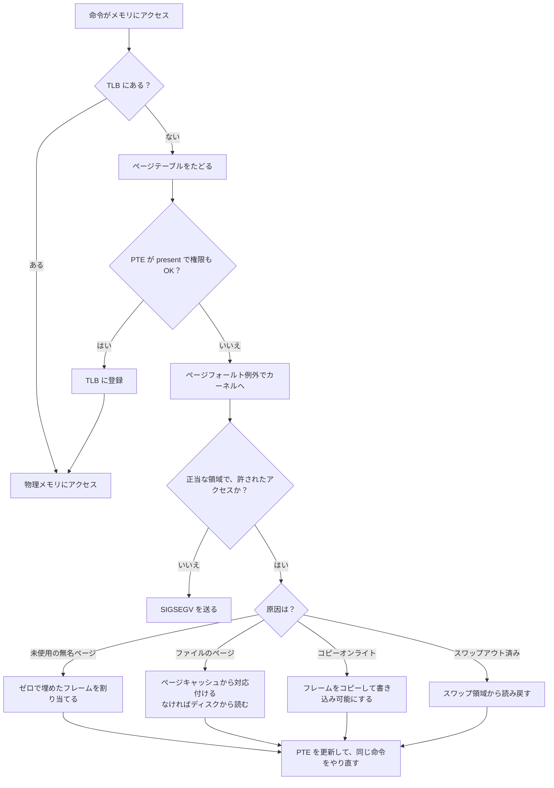

# 4.2 仮想メモリ

> どのプロセスも、自分だけが使える広大で連続したメモリを持っているかのように振る舞います。物理メモリは 16GB しかないのに、なぜ 32GB の確保に成功するのでしょうか。`free` が「空きは 300MB」と表示しても慌てなくてよいのはなぜで、コンテナが OOMKilled されるのはなぜでしょうか。この章では、OS とハードウェアが協力してメモリを「仮想化」する仕組みを理解し、メモリにまつわる性能問題と障害を原理から説明できるようになります。

| 項目 | 内容 |
|---|---|
| 学習時間の目安 | 本文 4h ＋ 演習 5h |
| 前提となる章 | [4.1 プロセス・スレッド・システムコール](../01-processes-and-syscalls/README.md)、[1.3 メモリ階層とキャッシュ](../../01-computer-systems/03-memory-hierarchy/README.md) |
| 演習 | [exercises/](exercises/)（Python） |
| キーワード | 仮想アドレス, ページテーブル, TLB, ページフォールト, デマンドページング, コピーオンライト, mmap, ページ置換, Belady の異常, スラッシング, overcommit, OOM killer, ページキャッシュ, RSS/PSS, huge page |

## この章のゴール

- [ ] 仮想アドレスが物理アドレスに変換される仕組み（多段ページテーブルと TLB）を説明し、シミュレータを実装できる
- [ ] ページフォールト、デマンドページング、コピーオンライト、mmap の仕組みと、それらが性能に与える影響を説明できる
- [ ] ページ置換アルゴリズム（FIFO・LRU・Clock・OPT）を実装・比較し、Belady の異常とスラッシングを説明できる
- [ ] overcommit と OOM killer、コンテナのメモリ制限の仕組みを説明し、OOMKilled の原因を調査できる
- [ ] `free`・`/proc/meminfo`・RSS・PSS を正しく読み、「本当にメモリが足りないのか」を判断できる
- [ ] huge page・THP・NUMA の性能上のトレードオフを説明できる

## なぜ学ぶのか

メモリは、クラウドの費用を決める最大の要因の 1 つであり、障害の原因としても頻繁に現れます。

- **OOMKilled**: コンテナは設定したメモリの上限を超えると、カーネルに強制終了されます（Kubernetes では終了コード 137 と `OOMKilled` の表示）。「アプリのヒープは上限より小さいのに殺される」という相談は定番ですが、原因の多くは、ヒープ以外のメモリや、上限に何が数えられるかを知らないことにあります。
- **fork による突然のメモリ増加**: Redis は、データを保存するときに fork した子プロセスにスナップショットを書かせます。Redis の運用ドキュメントは、書き込みの多い環境ではこの間にメモリ使用量が最大で通常の 2 倍程度まで増えうると注意しています。原因は、この章で扱う **コピーオンライト** です。
- **仮想メモリの設計とセキュリティ**: 2018 年に公表された CPU の脆弱性 Meltdown は、「すべてのプロセスのアドレス空間にカーネルも対応付けておく」という長年の設計を突くものでした。対策のページテーブル分離（KPTI）は、システムコールの多い処理の性能を落としました。2016 年の Dirty COW（CVE-2016-5195）は、Linux カーネルのコピーオンライト処理の競合状態によって、読み取り専用のファイルに書き込めてしまう脆弱性で、長年気づかれずに存在していました。

## 1. なぜ仮想メモリが必要か

### 1.1 物理メモリを直接使う世界の問題

もしすべてのプログラムが物理アドレスを直接使ったら、次の問題が起きます。

- **保護できない**: あるプログラムのバグが、他のプログラムや OS のメモリを壊せる。
- **配置が面倒**: 実行ファイルは「どの物理アドレスに置かれるか」を事前に知らなければならない。
- **断片化**: 空きメモリが細切れになり、合計は足りているのに大きな領域を確保できない（外部断片化）。
- **大きさの制約**: 物理メモリより大きなプログラムを動かせない。

これを解決するのが **仮想メモリ（virtual memory）** です。プログラムが使うアドレスは **仮想アドレス** で、CPU の中の **MMU（Memory Management Unit）** が、アクセスのたびに OS の用意した表を使って物理アドレスに変換します。各プロセスは自分専用の **アドレス空間** を持ち、他のプロセスのメモリは「そもそも見えない」ので保護が実現します。

### 1.2 アドレス空間の中身

Linux では、プロセスのアドレス空間の配置を `/proc/<PID>/maps` で見られます。`cat` 自身の配置を表示させてみます（列は アドレス範囲・権限・対応するファイル）。

```text
$ cat /proc/self/maps | awk '{ printf "%-27s %-5s %s\n", $1, $2, $6 }'
5650feb7d000-5650feb7f000   r--p  /usr/bin/cat
5650feb7f000-5650feb84000   r-xp  /usr/bin/cat
5650feb84000-5650feb86000   r--p  /usr/bin/cat
5650feb86000-5650feb87000   r--p  /usr/bin/cat
5650feb87000-5650feb88000   rw-p  /usr/bin/cat
565126cdb000-565126cfc000   rw-p  [heap]
7f6f22bdb000-7f6f22c00000   rw-p
7f6f22c00000-7f6f22c28000   r--p  /usr/lib/x86_64-linux-gnu/libc.so.6
7f6f22c28000-7f6f22db0000   r-xp  /usr/lib/x86_64-linux-gnu/libc.so.6
（中略: libc の残りと、動的リンカ ld-linux-x86-64.so.2 など）
7f6f22e25000-7f6f22e27000   r-xp  [vdso]
7ffff900e000-7ffff9030000   rw-p  [stack]
```

プログラムのコード（`r-xp`: 読み取り・実行可、書き込み不可）、データ、ヒープ、共有ライブラリ、4.1 で登場した vDSO、スタックが、それぞれ別の領域に置かれています。最後の `p` は private（書き込みは自分だけのコピーになる）を表します（5.1）。

アドレスはプロセスを起動するたびに変わります。

```text
$ for i in 1 2; do cat /proc/self/maps | grep -E "heap|libc.so.6" | head -2 | awk '{print $1, $6}'; echo; done
5626a4710000-5626a4731000 [heap]
7fe177600000-7fe177628000 /usr/lib/x86_64-linux-gnu/libc.so.6

555c9f7ae000-555c9f7cf000 [heap]
7f2daf000000-7f2daf028000 /usr/lib/x86_64-linux-gnu/libc.so.6
```

これは **ASLR（Address Space Layout Randomization）** というセキュリティ機能で、メモリ破壊の脆弱性を突く攻撃者が、狙った場所のアドレスを予測しにくくしています。

## 2. ページングとページテーブル

### 2.1 ページとフレーム

仮想アドレスを 1 バイトずつ変換するのでは表が巨大になりすぎます。そこでメモリを **ページ（page）** と呼ぶ固定長のブロック（多くの環境で 4 KiB）に区切り、ページ単位で対応付けます。物理メモリ側のページ大の枠を **フレーム（frame）** と呼びます。

```text
（32 ビットのアドレス、4 KiB ページの場合）

仮想アドレス: [ 仮想ページ番号 VPN（上位 20 ビット） | オフセット（下位 12 ビット） ]
                          │ ページテーブルで変換                │ そのまま
                          ▼                                     ▼
物理アドレス: [ 物理フレーム番号 PFN                 | オフセット（下位 12 ビット） ]
```

ページ内の位置（オフセット）は変換の必要がないので、表には「VPN → フレーム番号」だけを記録すればよいのです。この表が **ページテーブル（page table）** で、その 1 行を **ページテーブルエントリ（PTE）** と呼びます。PTE には、フレーム番号のほかに次のような制御ビットがあります（x86-64 の例）。

| ビット | 意味 | 使われ方 |
|---|---|---|
| P（present） | ページが物理メモリ上にある | 0 ならアクセスでページフォールト（3 節） |
| R/W | 書き込み可能 | コードを読み取り専用に、コピーオンライトの実現（4 節） |
| U/S | ユーザーモードからアクセス可能 | カーネルのメモリを保護する |
| A（accessed） | 最近アクセスされた（CPU が立てる） | ページ置換で「最近使ったか」の判断（6 節） |
| D（dirty） | 書き込まれた（CPU が立てる） | 追い出すときにディスクへの書き戻しが必要か |
| NX | 実行禁止 | データ領域に置かれた攻撃コードの実行を防ぐ |

### 2.2 多段ページテーブル

32 ビットのアドレス空間を 4 KiB ページで区切ると 2²⁰ ≈ 100 万ページで、1 エントリ 4 バイトの表は 1 プロセスあたり 4 MiB になります。プロセスが 100 個あれば 400 MiB が表だけで消えます。64 ビットでは、1 段の表は現実的に作れません。

ところが、実際のプログラムはアドレス空間のごく一部しか使いません（1.2 の出力でも、使われている範囲はまばらです）。そこで表を **木構造（多段）** にし、使っていない範囲の下位の表を作らないようにします。32 ビットの x86 では「10 ビット + 10 ビット + 12 ビット」の 2 段でした。演習1で実装する 2 段の表で、アドレス空間の先頭と末尾の 2 ページだけを対応付けると、表は 1 段目 1 つと 2 段目 2 つの計 12 KiB で済みます（1 段の表なら 4 MiB）。

**x86-64** は 4 段（9 + 9 + 9 + 9 ビットの添字と 12 ビットのオフセットで、48 ビット = 256 TiB の仮想アドレス空間）を使います。各段の表はちょうど 4 KiB（512 エントリ × 8 バイト）です。

```python
def split_x86_64(vaddr):
    """48 ビットの仮想アドレスを、4 段のページテーブルの添字とオフセットに分ける"""
    offset = vaddr & 0xFFF                 # 下位 12 ビット: 4 KiB ページ内の位置
    idx = [(vaddr >> shift) & 0x1FF for shift in (39, 30, 21, 12)]  # 9 ビットずつ
    return idx, offset

print(split_x86_64(0x7FFD5E8C3A10))       # ([255, 501, 244, 195], 2576)
```

CPU は、制御レジスタ（x86-64 では CR3）が指す最上位の表から、この 4 つの添字で表を順にたどって PTE にたどり着きます（**ページテーブルウォーク**）。より大きなメモリを扱うために、5 段（57 ビット）のページングを持つ CPU もあり、Linux も対応しています。

多段にした代償は、**1 回のメモリアクセスのために、表をたどる 4 回のメモリアクセスが余分に必要になる** ことです。これを解決するのが次の TLB です。

### 2.3 TLB: 変換結果のキャッシュ

**TLB（Translation Lookaside Buffer）** は、最近使った「仮想ページ → 物理フレーム」の変換結果を覚えておく、CPU 内の小さなキャッシュです（[1.3](../../01-computer-systems/03-memory-hierarchy/README.md) のキャッシュと同じ考え方）。TLB にヒットすれば、ページテーブルをたどらずに済みます。

TLB のエントリ数は、最近の CPU でも階層全体で数十〜数千程度です。4 KiB ページで 1,500 エントリなら、TLB が一度に覆える範囲（**TLB リーチ**）は 6 MiB 程度にすぎません。演習2の TLB と MMU（64 エントリ、LRU）で、4 MiB（1,024 ページ）の配列を読んだ結果が次の通りです。

```text
順番に 8 バイトずつ読む : TLB ヒット率 99.80%, ページテーブルウォーク 1,024 回
ランダムな位置を読む    : TLB ヒット率 6.25%, ページテーブルウォーク 491,505 回
```

順番に読めば 1 ページ（4,096 バイト）の中で 512 回のアクセスのうち最初の 1 回しかミスしませんが、ランダムに読むと、64 エントリで 1,024 ページのうち 64 ページしか覆えないので、ヒット率は 64/1024 = 6.25% に落ちます。大きなハッシュ表やグラフをランダムに辿る処理が遅い理由の一部は、キャッシュミスに加えてこの TLB ミスにあります（対策の huge page は 8.3 節）。

TLB には、OS の設計に関わる 2 つの性質があります。

- **プロセスを切り替えると、前のプロセスの変換は無効になる**。アドレス空間 ID（x86 の PCID、ARM の ASID）でエントリに持ち主の印を付けられる CPU では全消去を避けられますが、切り替え直後は TLB ミスが増えます。これも 4.1 のコンテキストスイッチの間接コストの一部です。
- **ページテーブルを書き換えたら、TLB の古いエントリを消さなければならない**。マルチスレッドのプロセスでは、他の CPU の TLB にも古い変換が残っているので、割り込み（IPI）を送って消してもらう **TLB シュートダウン** が必要で、`munmap` や `mprotect` を多用すると性能が落ちる原因になります。演習2のテストでは、消し忘れると古い変換が使われ続けることを確かめます。

## 3. ページフォールトとデマンドページング

### 3.1 ページフォールトの流れ

PTE が present でない、または権限に違反するアクセスが起きると、CPU は **ページフォールト（page fault）** という例外を起こしてカーネルに制御を渡します。ページフォールトは「エラー」とは限らず、むしろ OS がメモリを賢く管理するための主要な仕組みです。



ディスク I/O を伴わずに解決できるものを **マイナーフォールト**、ディスクからの読み込みを待つものを **メジャーフォールト** と呼びます。マイナーフォールトはマイクロ秒未満〜数マイクロ秒で済みますが、メジャーフォールトはストレージの速度に左右され、HDD ならミリ秒単位です。レイテンシに厳しいサービスで突然遅くなったら、`ps -o min_flt,maj_flt` や `/usr/bin/time -v` でメジャーフォールトが増えていないかを確認します。

### 3.2 デマンドページング

Linux は、メモリを確保した時点では物理メモリを割り当てません。**初めてアクセスされたページに、その場でフレームを割り当てる**（**デマンドページング**）のです。256 MiB の無名領域を mmap して、4 KiB ごとに 1 バイトずつ書いてみます。

```python
import mmap
import resource

def rss_mib():
    for line in open("/proc/self/status"):
        if line.startswith("VmRSS:"):
            return int(line.split()[1]) / 1024

def minflt():
    return resource.getrusage(resource.RUSAGE_SELF).ru_minflt

SIZE = 256 * 1024 * 1024                  # 256 MiB
print(f"開始時           : RSS {rss_mib():6.1f} MiB")
m = mmap.mmap(-1, SIZE, flags=mmap.MAP_PRIVATE | mmap.MAP_ANONYMOUS)
print(f"mmap 直後        : RSS {rss_mib():6.1f} MiB   （仮想アドレスを予約しただけ）")
before = minflt()
for off in range(0, SIZE, 4096):          # 4 KiB ごとに 1 バイト書く
    m[off] = 1
print(f"全ページに書いた後: RSS {rss_mib():6.1f} MiB   マイナーフォールト {minflt() - before:,} 回")
```

```text
開始時           : RSS    7.6 MiB
mmap 直後        : RSS    8.5 MiB   （仮想アドレスを予約しただけ）
全ページに書いた後: RSS  264.5 MiB   マイナーフォールト 65,536 回
```

mmap の直後には **RSS（Resident Set Size、実際に物理メモリ上にある量）** はほとんど増えず、書き込むたびにページフォールトが起きて、ちょうど 256 MiB ÷ 4 KiB = 65,536 回でフレームが割り当てられました。デマンドページングのおかげで、巨大な配列を確保しても使わない部分は物理メモリを消費しません。一方で、「確保した直後の初回アクセスが遅い」「確保に成功しても、実際に使うときにメモリが足りないかもしれない」（7 節）という性質も生まれます。レイテンシに厳しい処理では、起動時にあらかじめ触っておく（プリフォールト）、`MAP_POPULATE` や `mlock` を使う、といった対策をとります。

## 4. コピーオンライトと fork

4.1 で見たように、fork は親のアドレス空間の複製を作ります。数 GB のメモリを持つプロセスを毎回丸ごとコピーしていたら、fork は非常に遅くなります。そこで OS は **コピーオンライト（copy-on-write、CoW）** を使います。

1. fork では、ページテーブルだけを複製し、親子が **同じ物理フレームを共有** する。各フレームの参照数を増やす。
2. 書き込み可能だったページを、親子の **両方** で読み取り専用にし、「CoW のページ」という印を付ける。
3. どちらかが書き込もうとすると、読み取り専用なのでページフォールトが起きる。カーネルはそのフレームをコピーして、書き込んだ側の PTE を新しいフレームに向け、書き込み可能に戻す。
4. 参照しているのが自分だけになったフレームなら、コピーせずにそのまま書き込み可能に戻す。

128 MiB（32,768 ページ）を確保した Python プロセスが fork し、子が一部のページに書き込んだときのページフォールトを数えてみます。

```python
import mmap
import os
import resource
import time

PAGE = 4096
SIZE = 128 * 1024 * 1024                   # 128 MiB = 32,768 ページ
buf = mmap.mmap(-1, SIZE, flags=mmap.MAP_PRIVATE | mmap.MAP_ANONYMOUS)
for off in range(0, SIZE, PAGE):           # 親が全ページを実際に確保しておく
    buf[off] = 1

for ratio in (0.0, 0.25, 1.0):
    t0 = time.perf_counter()
    pid = os.fork()
    if pid == 0:
        fork_ms = (time.perf_counter() - t0) * 1000
        before = resource.getrusage(resource.RUSAGE_SELF).ru_minflt
        pages = int(SIZE // PAGE * ratio)
        for i in range(pages):             # 子が一部のページに書き込む
            buf[i * PAGE] = 2
        faults = resource.getrusage(resource.RUSAGE_SELF).ru_minflt - before
        print(f"子が {ratio:4.0%} のページに書き込み: fork {fork_ms:5.1f} ms, "
              f"ページフォールト {faults:>6,} 回（コピーされたページ ≒ {faults * PAGE / 2**20:5.1f} MiB）")
        os._exit(0)
    os.waitpid(pid, 0)
```

```text
子が   0% のページに書き込み: fork   3.6 ms, ページフォールト     25 回（コピーされたページ ≒   0.1 MiB）
子が  25% のページに書き込み: fork   2.0 ms, ページフォールト  8,222 回（コピーされたページ ≒  32.1 MiB）
子が 100% のページに書き込み: fork   2.1 ms, ページフォールト 32,797 回（コピーされたページ ≒ 128.1 MiB）
```

fork 自体は 128 MiB のプロセスでも数ミリ秒で終わり、書き込んだページの数だけ（25% なら 8,192 ページ ＋ Python 自身の数十ページ）フォールトとコピーが起きています。

これが冒頭の Redis の話の正体です。子がスナップショットをディスクに書いている間に、親（サーバー本体）が更新を受け付けると、更新されたページが次々にコピーされ、最悪で全ページ、つまりメモリ使用量が 2 倍近くになります。fork を使う仕組みを本番で使うときは、「fork の間に親が書き換えるページの割合」を見込んでメモリに余裕を持たせる必要があります。また、fork のたびにページテーブルは実際にコピーされるので、数十 GB のプロセスでは fork 自体に数十〜数百ミリ秒かかり、その間サーバーが止まることがあります。

コピーオンライトは fork 以外にも使われています。後述の `MAP_PRIVATE` のファイルマップ、ZFS・btrfs などのファイルシステム（[4.3](../03-filesystems-and-io/README.md)）、コンテナのレイヤ（[4.5](../05-virtualization-and-containers/README.md)）も「共有しておき、書くときだけコピーする」という同じ発想で、データベースの MVCC（[6.3](../../06-databases/03-transactions/README.md)）も、上書きせずに新しい版を作るという点で似た考え方をしています。演習4では、参照数を使ったコピーオンライトの fork を実装します。

## 5. mmap: ファイルとメモリをつなぐ

### 5.1 ファイルマップと無名マップ

`mmap()` は、アドレス空間に新しい領域を作るシステムコールです。

| 種類 | 内容 | 例 |
|---|---|---|
| ファイルマップ | ファイルの内容をアドレス空間に対応付ける。アクセスしたページだけがページキャッシュ経由で読み込まれる | 実行ファイルや共有ライブラリの読み込み、大きなファイルの読み取り |
| 無名マップ | ファイルに対応しない、ゼロで初期化された領域 | malloc が大きな領域を確保するとき、3.2 の例 |

さらに、書き込みを他のプロセスやファイルと共有する `MAP_SHARED` と、書き込むと自分だけのコピーになる（コピーオンライト）`MAP_PRIVATE` があります。

```python
import mmap

with open("data.bin", "wb") as f:
    f.write(b"hello, world")
with open("data.bin", "r+b") as f:
    m = mmap.mmap(f.fileno(), 0)    # ファイル全体を共有（MAP_SHARED）で対応付ける
    print(m[:5])                    # read() を呼ばずに、メモリとしてファイルの中身が見える
    m[:5] = b"HELLO"                # メモリへの書き込みが、そのままファイルの変更になる
    m.flush()                       # msync(): ディスクへの書き戻しを要求する
    m.close()
print(open("data.bin", "rb").read())
```

```text
b'hello'
b'HELLO, world'
```

共有ライブラリの仕組みもこれで説明できます。libc のコード部分は読み取り専用のファイルマップなので、それを使う数百のプロセスがあっても、物理メモリ上には 1 つのコピーしかありません。この「共有されたページ」の存在が、8.2 で扱うメモリ使用量の数え方を難しくしています。

### 5.2 データベースと mmap の論争

「ファイル全体を mmap すれば、OS のページキャッシュがそのままキャッシュになり、自前でバッファ管理を書かなくて済む」という発想は魅力的で、実際に LMDB のように mmap を中核に据えるデータベースもあります。MongoDB も、初期のストレージエンジン（MMAPv1）は mmap を使っていましたが、後に WiredTiger へ移行しました。

Crotty・Leis・Pavlo の論文 "Are You Sure You Want to Use MMAP in Your Database Management System?"（CIDR 2022）は、DBMS が mmap に頼ることの問題を次のように整理しています。

- **トランザクションの安全性**: OS はいつでも汚れたページをディスクに書き出せるので、「ログを先に書いてからデータを書く」という WAL の順序（[6.4](../../06-databases/04-storage-and-recovery/README.md)）を DBMS が制御しにくい。
- **I/O による停止**: ページフォールトはスレッドを同期的に止めるので、非同期 I/O で待ち時間を隠すことができない。
- **エラー処理**: ディスクの読み込みエラーが、戻り値ではなくシグナル（SIGBUS）として届く。
- **性能**: ページテーブルの競合、TLB シュートダウン、OS のページ追い出しの仕組みがボトルネックになり、高速な NVMe SSD でデータがメモリに収まらない場合に性能が伸びないことを実験で示している。

多くの本格的な DBMS（PostgreSQL、MySQL の InnoDB など）が、ページキャッシュとは別に自前の **バッファプール** を持つのはこのためです。「OS に任せる」か「自分で管理する」かは、簡単さと制御性のトレードオフの典型例です。

## 6. ページ置換とスラッシング

### 6.1 どのページを追い出すか

物理メモリが足りなくなると、OS はどれかのページを追い出して（ファイルのページなら捨てる・書き戻す、無名ページならスワップに書き出す）、フレームを空けなければなりません。どのページを選ぶかが **ページ置換アルゴリズム** です。

| アルゴリズム | 追い出すページ | 特徴 |
|---|---|---|
| OPT（Belady の MIN、1966） | 次に使われるのが最も遠い未来のページ | 最適。ただし未来を知る必要があり実装できない。評価の基準 |
| FIFO | 最も古く読み込んだページ | 単純。よく使うページも古ければ追い出してしまう |
| LRU | 最も長く使われていないページ | 局所性があれば OPT に近い。厳密に実装すると、アクセスのたびに記録が必要で高価 |
| Clock（セカンドチャンス） | 参照ビットが 0 のページを、針を回して探す | ハードウェアの A ビット（2.1）だけで LRU を近似する。実用的 |

Linux は、active と inactive の 2 つのリストと参照ビットを組み合わせた LRU の近似を長く使ってきました。Linux 6.1 では、より細かく世代を分ける MGLRU（Multi-Gen LRU）も取り込まれています（有効かどうかはディストリビューションの設定によります）。

### 6.2 Belady の異常

直感に反して、FIFO では **フレームを増やすとページフォールトが増える** ことがあります。これを **Belady の異常（Belady's anomaly）** と呼びます。古典的な参照列 1, 2, 3, 4, 1, 2, 5, 1, 2, 3, 4, 5 を、演習3のシミュレータで調べた結果です。

```text
フレーム数  FIFO  LRU  Clock  OPT
       1    12   12     12   12
       2    12   12     12    9
       3     9   10      9    7
       4    10    8     10    6
       5     5    5      5    5
```

FIFO はフレームを 3 から 4 に増やしたのに、フォールトが 9 回から 10 回に増えました。LRU と OPT では起きません。LRU と OPT は、「k 個のフレームに載っているページの集合は、必ず k+1 個のフレームに載っているページの集合に含まれる」という性質を持つ **スタックアルゴリズム** だからです。FIFO と、それに近い振る舞いをする Clock はこの性質を持たず、この参照列では Clock も同じ異常を示しています。

### 6.3 ワーキングセットとスラッシング

プログラムは、ある期間に一部のページだけを集中して使う傾向（局所性）があります。Denning（1968）は、直近の一定回数の参照で使われたページの集合を **ワーキングセット（working set）** と定義しました。演習5では、その大きさの推移を計算します。

すべての実行中のプロセスのワーキングセットの合計が物理メモリを超えると、あるプロセスのページを追い出した直後に、そのページがまた必要になる、という追い出しと読み込みの無限ループに陥ります。これが **スラッシング（thrashing）** で、CPU はほとんど I/O 待ちになり、システム全体が極端に遅くなります。4.1 のロードアベレージが急上昇し、メジャーフォールトと I/O 待ち（PSI の memory・io）が増えるのが典型的な兆候です。対策は、ワーキングセットが収まるようにプロセス数を減らすか、メモリを増やすことしかありません。

### 6.4 スワップ

**スワップ（swap）** は、無名ページを一時的に書き出すためのディスク領域です。「めったに使わないページを追い出して、その分をページキャッシュなどに回す」ためには有効ですが、ワーキングセットがメモリに収まらない状態をスワップで延命すると、スラッシングで応答が壊滅的に遅くなります。レイテンシが重要なサーバーでは、スワップを無効にするか、ごく小さくして監視する運用がよく選ばれます。Kubernetes も長くスワップの無効化を前提としてきましたが、近年のバージョンでは限定的にスワップを使う機能が段階的に導入されています（2026 年時点の状況は公式ドキュメントで確認してください）。

## 7. メモリが足りなくなったら: overcommit と OOM killer

### 7.1 overcommit

デマンドページングのおかげで、「確保したが使っていない」メモリは物理メモリを消費しません。そのため Linux は、物理メモリとスワップの合計を超える確保を許します。これを **overcommit** と呼びます。物理メモリ 16 GiB のマシンで試してみます。

```python
import mmap

GiB = 2**30
print("vm.overcommit_memory =", open("/proc/sys/vm/overcommit_memory").read().strip())
maps = []
for i in range(4):                          # 物理メモリ 16 GiB のマシンで 8 GiB ずつ確保してみる
    maps.append(mmap.mmap(-1, 8 * GiB, flags=mmap.MAP_PRIVATE | mmap.MAP_ANONYMOUS))
    print(f"合計 {8 * (i + 1):2d} GiB の確保に成功")
try:
    mmap.mmap(-1, 64 * GiB, flags=mmap.MAP_PRIVATE | mmap.MAP_ANONYMOUS)
except OSError as e:
    print("64 GiB を一度に確保:", e)
```

```text
vm.overcommit_memory = 0
合計  8 GiB の確保に成功
合計 16 GiB の確保に成功
合計 24 GiB の確保に成功
合計 32 GiB の確保に成功
64 GiB を一度に確保: [Errno 12] Cannot allocate memory
```

| `vm.overcommit_memory` | 振る舞い |
|---|---|
| 0（既定） | ヒューリスティック。明らかに過大な 1 回の確保（上の 64 GiB）は拒否するが、それ以外は許す |
| 1 | 常に許す（大量の疎な配列を使う科学技術計算などで使われる） |
| 2 | 厳密。確保の合計を `CommitLimit`（スワップ ＋ 物理メモリ × `overcommit_ratio`%、既定 50%）までに制限する |

overcommit の帰結は重大です。**malloc や mmap が成功しても、後で実際に使おうとしたときにメモリが足りなくなることがある** のです。そのとき、確保を失敗させる機会はもう過ぎているので、カーネルは次の手段をとります。

### 7.2 OOM killer

メモリが本当に足りなくなり、ページキャッシュを捨てたりスワップに書き出したりしても空きが作れないとき、カーネルの **OOM killer（Out Of Memory killer）** がプロセスを 1 つ選んで SIGKILL で殺し、メモリを取り戻します。選ばれやすさは主に「どれだけメモリを使っているか」で決まり、プロセスごとの値は `/proc/<PID>/oom_score` で見られます。`/proc/<PID>/oom_score_adj`（-1000〜1000）で調整でき、-1000 にすると対象外になります。Kubernetes は、Pod の QoS クラスに応じてこの値を設定しています（Guaranteed の Pod は殺されにくく、BestEffort の Pod は殺されやすい）。

OOM kill が起きると、カーネルログ（`dmesg`、`journalctl -k`）に `Out of memory: Killed process ...` のような記録が残ります。「プロセスが理由もなく消えた」ときに最初に確認すべき場所です。

### 7.3 コンテナのメモリ制限

コンテナのメモリ制限は、cgroup（v2 では `memory.max`）で実現されています。cgroup 内の使用量（`memory.current`）が上限に達すると、カーネルはまず cgroup 内のページキャッシュなどを回収し、それでも足りなければ **cgroup の中だけで** OOM kill を起こします。マシン全体にはメモリが余っていても殺されるのです。Kubernetes では、コンテナの `resources.limits.memory` が `memory.max` になり、OOM kill されたコンテナは終了コード 137（128 ＋ SIGKILL の 9）、理由 `OOMKilled` と表示されます。

上限に数えられるのは、プロセスのヒープだけではありません。

| 数えられるもの | 注意点 |
|---|---|
| 無名メモリ（ヒープ、スタック） | 言語ランタイムのヒープ以外に、スレッドのスタック、ネイティブライブラリの確保、GC の管理領域なども含む |
| ページキャッシュ | cgroup 内で読み書きしたファイルのキャッシュも数えられる。ただし回収できるので、通常はこれだけで OOM kill にはならない |
| tmpfs（`/dev/shm`、メモリを媒体にした emptyDir） | ファイルに見えるが実体はメモリで、スワップがなければ回収できない |
| カーネルのメモリ | ソケットのバッファ、カーネルの管理構造など |

監視では、使用量からすぐに回収できる非アクティブなページキャッシュを差し引いた **working set**（cAdvisor の `container_memory_working_set_bytes`）が、OOM kill の危険度に近い指標としてよく使われます。`memory.high` を `memory.max` より少し低く設定すると、上限の手前で回収が強まり、使用量の増加を遅らせることもできます。Kubernetes 側の設計（requests と limits、QoS）は [10.2](../../10-cloud-and-sre/02-containers-and-kubernetes/README.md) で扱います。

## 8. 実務でメモリの数字を読む

### 8.1 free と /proc/meminfo

`free` の読み方を誤ると、健全なサーバーを「メモリ不足」と誤診します。1 GiB のファイルを読む前後で比べてみます。

```text
$ free -m
               total        used        free      shared  buff/cache   available
Mem:           16094        2251       12109         179        2166       13842
Swap:              0           0           0
$ cat big.bin > /dev/null          # 1 GiB のファイルを読む
$ free -m
               total        used        free      shared  buff/cache   available
Mem:           16094        2259       11077         179        3190       13834
Swap:              0           0           0
```

ファイルを読んだだけで `free` は約 1 GiB 減りましたが、減った分はそのまま `buff/cache`（**ページキャッシュ** など）に移っただけで、`available` はほとんど変わっていません。Linux は空いているメモリをファイルのキャッシュに積極的に使い、必要になれば捨てて再利用します。**判断に使うべきは `free` ではなく `available`**（`/proc/meminfo` の `MemAvailable`）で、これは「スワップなしで新たに使えるメモリの見積もり」です。長時間動いているサーバーで `free` が小さいのは、キャッシュがよく働いている健全な状態であることがほとんどです。

`/proc/meminfo` には、ほかにも `Dirty`（ディスクへの書き戻しを待っているページ）、`AnonPages`（無名ページ）、`Shmem`（tmpfs や共有メモリ）、`CommitLimit`・`Committed_AS`（7.1）などの内訳があります。

### 8.2 プロセスのメモリ: VSZ・RSS・PSS

| 指標 | 意味 | 注意点 |
|---|---|---|
| VSZ（仮想サイズ） | 予約したアドレス空間の大きさ | 使っていない予約も含むので、ほぼ意味がない（3.2 の 256 MiB の mmap 直後も増える） |
| RSS | 物理メモリ上にあるページの量 | 共有ライブラリなど他のプロセスと共有しているページも丸ごと数える |
| PSS（比例配分サイズ） | 共有ページを、共有しているプロセス数で割って数えた量 | 全プロセスの PSS の合計 ≒ 実際の使用量になる |
| USS | そのプロセスだけが使っているページの量 | プロセスを終了させたときに解放される量 |

```text
$ python3 -c 'print(open("/proc/self/smaps_rollup").read())' | grep -E '^(Rss|Pss|Shared_Clean|Private_Dirty):'
Rss:                7692 kB
Pss:                4370 kB
Shared_Clean:       4832 kB
Private_Dirty:      2756 kB
```

この Python プロセスの RSS は約 7.5 MiB ですが、そのうち約 4.7 MiB は他のプロセスと共有しているページ（共有ライブラリなど）で、PSS は約 4.3 MiB です。同じプログラムを 100 個動かすときに「RSS × 100」で見積もると、共有部分を二重に数えて大きく見積もりすぎます。逆に、fork した直後の子は親とほぼすべてのページを共有していますが、その後の書き込み（4 節）で RSS が変わらないまま実際の使用量が増えていく、という逆方向のずれもあります。

### 8.3 huge page と THP

4 KiB のページでは、TLB が覆える範囲が小さく（2.3）、巨大なメモリを使うプログラムは TLB ミスとページテーブルウォークに多くの時間を使います。x86-64 は 2 MiB と 1 GiB の **huge page** を使え、1 エントリで覆える範囲が 512 倍・26 万倍になります。3.2 の 256 MiB の書き込みを、huge page の使用を許可した場合と比べてみます（THP の設定が `madvise` の環境で、3 回実行）。

```python
import mmap
import resource
import time

def minflt():
    return resource.getrusage(resource.RUSAGE_SELF).ru_minflt

SIZE = 256 * 1024 * 1024
for label, huge in [("4 KiB ページ", False), ("MADV_HUGEPAGE", True)]:
    m = mmap.mmap(-1, SIZE, flags=mmap.MAP_PRIVATE | mmap.MAP_ANONYMOUS)
    if huge:
        m.madvise(mmap.MADV_HUGEPAGE)      # この範囲は huge page を使ってよい、とカーネルに伝える
    before, t0 = minflt(), time.perf_counter()
    for off in range(0, SIZE, 4096):
        m[off] = 1
    print(f"{label}: フォールト {minflt() - before:,} 回, {time.perf_counter() - t0:.3f} 秒")
    m.close()
```

```text
4 KiB ページ: フォールト 65,536 回, 0.130 秒
MADV_HUGEPAGE: フォールト 128 回, 1.012 秒
4 KiB ページ: フォールト 65,536 回, 0.121 秒
MADV_HUGEPAGE: フォールト 128 回, 0.051 秒
4 KiB ページ: フォールト 65,536 回, 0.118 秒
MADV_HUGEPAGE: フォールト 128 回, 0.063 秒
```

フォールトは 256 MiB ÷ 2 MiB = 128 回に減り、2 回目と 3 回目は書き込みも 2 倍前後速くなりました。一方、1 回目は逆に 8 倍近く遅くなっています。連続した 2 MiB の物理メモリを用意する処理などに時間がかかったためと考えられ、huge page の効果にはこうしたばらつきが伴うことが分かります。

Linux で huge page を使う方法は 2 つあります。

- **明示的な huge page（hugetlbfs）**: 起動時などにあらかじめ確保しておき、アプリが明示的に使う。データベースなどで使われる。確保した分は他の用途に使えない。
- **THP（Transparent Huge Pages）**: カーネルが自動で 2 MiB のページを割り当てたり、バックグラウンドで 4 KiB のページを集めて huge page にまとめたりする。設定は `/sys/kernel/mm/transparent_hugepage/enabled`（`always` / `madvise` / `never`）。

THP は便利な反面、連続した 2 MiB の空き領域を作るためのメモリの詰め直し（コンパクション）で突発的な遅延が起きたり、小さな書き込みでも 2 MiB 単位でメモリを使ってメモリ使用量が膨らんだりすることがあります（カーネルのバージョンによっては、fork 後の CoW で 2 MiB 単位のコピーが起きることもあります）。そのため、データベースやキャッシュサーバーの中には THP を無効にするよう推奨してきたものがあります（例えば Redis は、THP が常時有効だと起動時に警告を出します）。推奨はソフトウェアやバージョンで異なり変わることもあるので、利用するソフトウェアの最新のドキュメントを確認してください。

### 8.4 NUMA

複数の CPU ソケットを持つサーバーでは、メモリは各ソケットに接続されており、自分のソケットのメモリ（ローカル）より、他のソケットのメモリ（リモート）へのアクセスの方が遅くなります。これを **NUMA（Non-Uniform Memory Access）** と呼びます。Linux は既定で「最初にそのページに触ったスレッドが動いている CPU のノード」にメモリを割り当てるので、1 つのスレッドが初期化したデータを別ソケットのスレッドが使うと、リモートアクセスばかりになることがあります。`numactl --hardware` で構成を確認でき、大きなデータベースや JVM では NUMA を意識した設定が性能に効くことがあります。クラウドの大きなインスタンスや、コンテナを CPU に割り当てるときにも同じ問題が起きえます。

## よくある落とし穴

1. **`free` の free 列を見て「メモリ不足」と判断する**。空きメモリはページキャッシュに使われているのが正常です。`available` と、スワップやメジャーフォールト、PSI の memory の値で判断します。
2. **RSS の合計を実際のメモリ使用量とみなす**。共有ページが二重に数えられます。複数プロセスの合計を見積もるなら PSS を使います。
3. **コンテナのメモリ上限と言語ランタイムの設定を合わせない**。JVM のヒープ上限を limit と同じ値にすると、ヒープ以外（メタスペース、スレッドのスタック、ダイレクトバッファ、GC の管理領域）の分だけ確実に上限を超えます。ヒープは limit の一定割合（例えば `-XX:MaxRAMPercentage`）にし、実測の working set に余裕を足して limit を決めます。
4. **fork を使う機能のメモリ増加を見込まない**。Redis のスナップショットや、fork で子プロセスを作るワーカー方式のサーバーは、fork 後の書き込み量に応じてメモリが増えます。ピーク時の書き込み率から増加量を見積もり、余裕を確保します。
5. **malloc が成功したから大丈夫だと考える**。overcommit のもとでは、確保の成功は物理メモリの保証ではありません。本当に足りなくなると、確保した本人とは限らないプロセスが OOM killer に殺されます。
6. **スワップで延命する**。ワーキングセットが収まらない状態をスワップでしのぐと、スラッシングで応答が数桁遅くなり、障害の範囲がかえって広がります。メモリ不足は「落ちる」より先に「極端に遅くなる」形で現れることを前提に監視します。
7. **tmpfs やメモリを媒体にしたボリュームを、ディスクのつもりで使う**。`/dev/shm` やメモリを媒体にした emptyDir に書いたファイルは、コンテナのメモリ上限に数えられ、OOM kill の原因になります。
8. **THP などのカーネル設定を、ワークロードを確かめずに既定のまま（または慣習的に変更して）運用する**。レイテンシの突発的な悪化の原因になりえます。推奨設定はソフトウェアのバージョンごとに確認し、変更の前後で測定します。

## CTOの視点

1. **メモリは費用の中心であり、見積もりは「ピーク」と「共有」で行う**。クラウドのインスタンス費用の多くはメモリ容量で決まります。平均の使用量だけでサイズを決めると、fork・GC・バッチ処理のピークで OOM kill が起き、逆に RSS の単純な合計で見積もると過剰な投資になります。設計レビューでは「ピーク時のメモリは何で決まり、どれだけ余裕を見ているか」を問いましょう。
2. **OOMKilled は「メモリを増やす」前に「何が増えたか」を調べる**。インシデントの振り返りでは、上限に数えられたのがヒープなのか、ネイティブメモリなのか、tmpfs なのか、リークなのかを切り分けたかを確認します。上限を倍にするだけの対応は、リークなら発生間隔を延ばすだけで、費用も倍になります。ダッシュボードに working set・上限・OOM kill の回数（`memory.events`）が並んでいるかは、プラットフォームの成熟度の良い指標です。
3. **ストレージエンジンや永続化の方式を選ぶときは、OS との役割分担を確認する**。mmap に依存するか、fork でスナップショットをとるか、THP を前提にするか、といった設計は、運用時のメモリの振る舞いを大きく変えます。技術選定では、ベンチマークの数字だけでなく、こうした前提と、それが自社の負荷のパターン（書き込みの多さ、データ量とメモリの比）で問題にならないかを確認させます。
4. **カーネルの脆弱性への対応はプラットフォームの責務である**。Meltdown や Dirty COW のように、仮想メモリの仕組みそのものに関わる脆弱性は、アプリの修正では防げません。カーネルの更新を定期的に適用できる仕組み（ノードの入れ替えを前提にした運用など）と、マネージドサービスを使う場合の責任分界を明確にしておきます（[11.5](../../11-security/05-security-operations/README.md)）。
5. **採用・育成では「なぜヒープより RSS が大きいのか」を聞く**。この問いに、スレッドのスタック、ネイティブメモリ、共有ライブラリ、ページキャッシュとの区別、上限に数えられるものを挙げて答えられるエンジニアは、メモリ関連の障害を短時間で切り分けられます。

## 演習

演習コードは [exercises/vmsim.py](exercises/vmsim.py) にあります。docstring の仕様を読み、`raise NotImplementedError(...)` を実装に置き換えてください。解答例は [solutions/vmsim.py](solutions/vmsim.py) にあります。

```bash
python3 tools/check.py 4.2        # リポジトリのルートで実行
python3 tools/check.py -v 4.2     # 詳しい出力
```

| # | 難易度 | 内容 | クラス / 関数 |
|---|---|---|---|
| 1 | ★★☆ | 2 段のページテーブル: アドレスの分割、変換、PageFault と ProtectionFault、A/D ビット、表の遅延確保 | `TwoLevelPageTable` |
| 2 | ★★☆ | LRU で入れ替える TLB と、TLB を使う MMU。ヒット率、TLB シュートダウンの必要性 | `TLB`, `MMU` |
| 3 | ★★☆ | ページ置換（FIFO・LRU・OPT・Clock）。Belady の異常の再現 | `simulate_fifo` ほか |
| 4 | ★★★ | 参照数を使ったコピーオンライトの fork | `CowMemory` |
| 5 | ★★☆ | スライディングウィンドウによるワーキングセットの大きさ（O(n) で） | `working_set_sizes` |
| 6 | ★★☆ | 記述: OOMKilled を繰り返す Java サービスの分析（下記） | — |

### 演習6（記述）: OOMKilled を繰り返す Java サービス

Kubernetes で動く Java の API サーバーが、1 日に数回 `OOMKilled`（終了コード 137）で再起動しています。状況は次の通りです。

- コンテナのメモリは `requests` も `limits` も 2Gi。JVM の起動オプションは `-Xmx2g`。
- GC のログでは、殺される直前のヒープ使用量は 1.2GB 程度だった。
- HTTP 通信に Netty を使っており、スレッドは約 300 本。
- 一時ファイルを、メモリを媒体にした emptyDir（`medium: Memory`）の `/tmp` に書いている。

(1) ヒープが 1.2GB なのに OOM kill される理由として考えられるものを挙げてください。(2) 原因を切り分けるために集めるべき情報を挙げてください。(3) 対策を提案してください。

<details>
<summary>解答例</summary>

**(1) 考えられる理由**

- コンテナの上限（`memory.max`）に数えられるのはヒープだけではない。メタスペース、JIT のコードキャッシュ、スレッドのスタック（300 本）、GC の管理領域、Netty のダイレクトバッファ（ヒープ外）、glibc の malloc のアリーナなど、JVM のネイティブメモリが数百 MB 以上になることは珍しくない。
- `-Xmx2g` が上限と同じなので、ヒープが上限まで育つ余地があり、ヒープ以外の分を足せば確実に上限を超える設定になっている（今は 1.2GB でも、負荷次第でヒープは 2GB まで使いうる）。
- `/tmp` の emptyDir はメモリを媒体にしているので、書いた一時ファイルがそのまま cgroup のメモリ使用量（shmem）に数えられ、スワップがなければ回収できない。
- 監視の取得間隔より短いスパイクで上限を超えている可能性もある。

**(2) 集める情報**

- cgroup の `memory.stat`（anon・file・shmem などの内訳）と `memory.events`（oom_kill の回数）、working set の推移。
- JVM の Native Memory Tracking（`-XX:NativeMemoryTracking=summary` を付けて `jcmd <pid> VM.native_memory summary`）で、ヒープ以外の内訳。
- `/tmp` の使用量の推移と、書き込んでいるファイルの大きさ。
- カーネルログの OOM kill の記録（どのプロセスが、どれだけ使っていたか）。

**(3) 対策**

- `-Xmx` を固定値で上限と同じにするのをやめ、`-XX:MaxRAMPercentage`（例えば 60〜75%）でヒープを上限の一部に抑える。必要なら `-XX:MaxDirectMemorySize` でダイレクトバッファにも上限を設ける。
- 一時ファイルはディスクを媒体にしたボリュームに移すか、emptyDir に `sizeLimit` を設定し、アプリ側でも一時ファイルを確実に消す。
- スレッド数の上限を見直す（スレッドプールの大きさ）。
- 実測した working set のピークに余裕を足して limit を決め直し、上限の 80〜90% に達したら警告が出るようにする。

採点の観点: 「上限に数えられるのはヒープだけではない」「-Xmx が上限と同じ」「tmpfs はメモリ」の 3 点を指摘できれば合格です。切り分けのための具体的なデータ（memory.stat、NMT）と、再発を検知する監視まで書けていれば、障害対応をリードできる水準です。

</details>

## 理解度チェック

**Q1. x86-64 の 4 段のページテーブルで、48 ビットの仮想アドレスはどう分割されますか。また、1 段の表ではなく多段にする利点と代償を説明してください。**

<details>
<summary>解答</summary>

上位から 9 ビット × 4（各段の表の添字）と、下位 12 ビット（4 KiB ページ内のオフセット）に分割されます。各段の表は 512 エントリ × 8 バイト = 4 KiB で、ちょうど 1 ページに収まります。

利点は、アドレス空間のうち使っていない範囲について下位の表を作らなくてよいので、表のメモリが実際に使っている量に比例して小さく済むことです（1 段なら 48 ビットの空間全体の表が必要で、現実的ではありません）。代償は、変換のたびに表を 4 段たどる必要があり、TLB にヒットしないと 1 回のアクセスのために 4 回の追加のメモリアクセスが発生することです。

</details>

**Q2. マイナーフォールトとメジャーフォールトの違いを、それぞれ具体例を 2 つずつ挙げて説明してください。**

<details>
<summary>解答</summary>

- **マイナーフォールト**（ディスク I/O なしで解決）: 確保したが初めて触る無名ページへのアクセス（ゼロで埋めたフレームを割り当てる）、fork 後の CoW のページへの書き込み（コピーする）、他のプロセスが読んでページキャッシュにすでにあるファイルのページへのアクセス（対応付けるだけ）。
- **メジャーフォールト**（ディスクからの読み込みを待つ）: mmap したファイルのうち、ページキャッシュにない部分へのアクセス、スワップに追い出されたページへのアクセス。

メジャーフォールトはストレージの速度に左右されるので、レイテンシの突発的な悪化の原因になります。

</details>

**Q3. fork の後、親がある CoW のページに書き込みました。このとき起きることを説明してください。また、子がすでに終了していた場合は何が違いますか。**

<details>
<summary>解答</summary>

ページは親子の両方で読み取り専用になっているので、書き込みでページフォールトが起きます。カーネルはこのページが CoW であることを確認し、フレームの参照数が 2 以上（子もまだ参照している）なら、新しいフレームに内容をコピーして親の PTE をそちらに向け、書き込み可能にしてから、書き込みをやり直させます。元のフレームの参照数は 1 減ります。

子がすでに終了していれば、フレームを参照しているのは親だけ（参照数 1）なので、コピーせずに PTE を書き込み可能に戻すだけで済みます。

</details>

**Q4. Belady の異常とは何ですか。LRU では起きない理由も説明してください。**

<details>
<summary>解答</summary>

フレーム数を増やしたのに、ページフォールトの回数が増える現象です。FIFO で、参照列 1, 2, 3, 4, 1, 2, 5, 1, 2, 3, 4, 5 を 3 フレームで処理すると 9 回、4 フレームでは 10 回のフォールトが起きます。

LRU は「k フレームのときにメモリにあるページの集合（直近に使われた k 個）は、k+1 フレームのときの集合（直近に使われた k+1 個）に必ず含まれる」というスタックの性質を持ちます。フレームを増やしても、それまでメモリにあったページが追い出されることはないので、フォールトが増えることはありません。FIFO は読み込んだ順序で追い出すので、この包含関係が成り立ちません。

</details>

**Q5. 16GB のサーバーで `free` の free 列が 300MB、available が 12GB でした。メモリを増やすべきですか。**

<details>
<summary>解答</summary>

その情報だけでは増やす必要はありません。free が小さいのは、空いているメモリがページキャッシュ（buff/cache）に使われているためで、必要になれば捨てて再利用できます。実際に使える見積もりの available が 12GB あるので、余裕は十分です。判断するなら、available の推移、スワップの使用とメジャーフォールトの増加、PSI の memory の値、OOM kill の有無を確認します。

</details>

**Q6. コンテナが OOMKilled されましたが、監視ではアプリのプロセスの RSS は上限の 70% 程度でした。考えられる原因を挙げてください。**

<details>
<summary>解答</summary>

- **tmpfs（`/dev/shm` やメモリを媒体にしたボリューム）** に書いたファイルが、プロセスの RSS ではなく cgroup の shmem として上限に数えられている。
- 同じコンテナ（cgroup）の中の **他のプロセス**（シェルスクリプトから起動した子プロセスなど）がメモリを使っている。
- ソケットのバッファなど **カーネルのメモリ** が cgroup に数えられている。
- 監視の取得間隔より短い **スパイク** で上限を超えた。
- ページキャッシュも cgroup に数えられるが、通常は回収できるので、これだけが原因になることは少ない（ただし書き戻し待ちの dirty ページが大量にあると回収が間に合わないことがある）。

`memory.stat` の内訳と `memory.events`、カーネルログの OOM の記録で切り分けます。

</details>

**Q7. 多くの本格的な DBMS が、ファイルを mmap して OS のページキャッシュに任せるのではなく、自前のバッファプールを持つのはなぜですか。**

<details>
<summary>解答</summary>

- OS は汚れたページをいつでもディスクに書き出せるので、WAL の「ログを先にディスクに書いてからデータページを書く」という順序を DBMS が保証しにくい。
- ページフォールトはスレッドを同期的に止めるので、I/O の待ちを非同期処理で隠せず、どのページをいつ読むかを DBMS が制御できない。
- I/O エラーが SIGBUS というシグナルで届き、きめ細かいエラー処理が難しい。
- どのページを追い出すかを、DBMS の知識（スキャン中のページは再利用されにくい、など）で決められない。また TLB シュートダウンやページテーブルの競合が性能の上限になる。

CIDR 2022 の論文（Crotty, Leis, Pavlo）はこれらの問題を整理し、実験で性能上の問題も示しています。一方で、mmap は実装が簡単で、データがメモリに収まる読み取り中心の用途では十分に速いこともあり、これはトレードオフの問題です。

</details>

**Q8. TLB シュートダウンとは何ですか。マルチスレッドのプログラムで `munmap` を頻繁に呼ぶと遅くなる理由を説明してください。**

<details>
<summary>解答</summary>

TLB は変換結果の写しを持っているので、OS がページテーブルを書き換えたら（ページの対応付けを外す、権限を変えるなど）、古い写しを消さなければなりません。マルチスレッドのプロセスでは、同じアドレス空間を使うスレッドが他の CPU でも動いていて、その CPU の TLB にも古い写しが残っている可能性があります。そこで OS は、それらの CPU に割り込み（IPI）を送って TLB のエントリを消させ、完了を待ちます。これが TLB シュートダウンです。

`munmap` のたびに複数の CPU への割り込みと待ち合わせが発生するので、頻繁に呼ぶと、その CPU 数に比例するコストがかかり、他のスレッドの処理も割り込みで中断されます。メモリアロケータが解放した領域をすぐに OS に返さず、しばらく手元に置いて再利用するのは、この理由もあります。

</details>

## さらに学ぶために

- Remzi H. Arpaci-Dusseau, Andrea C. Arpaci-Dusseau "Operating Systems: Three Easy Pieces"（https://pages.cs.wisc.edu/~remzi/OSTEP/ で無料公開）— アドレス空間、ページング、TLB、多段ページテーブル、スワップ、置換ポリシーの章（第 13〜23 章あたり）が、この章の内容を段階的に詳しく扱っています。
- Ulrich Drepper "What Every Programmer Should Know About Memory"（2007）— CPU キャッシュ、TLB、NUMA を、性能の観点からプログラマ向けに解説した長い論文。数値は古くなっていますが、考え方は今も有効です。
- Andrew Crotty, Viktor Leis, Andrew Pavlo "Are You Sure You Want to Use MMAP in Your Database Management System?"（CIDR 2022）— 5.2 の論争の一次資料。短く読みやすい論文です。
- Peter J. Denning "The Working Set Model for Program Behavior"（Communications of the ACM, 1968）— ワーキングセットの原典。スラッシングの理解に役立ちます。
- Linux カーネルのドキュメント "Control Group v2"（Documentation/admin-guide/cgroup-v2.rst）— `memory.max`・`memory.high`・`memory.stat` などの定義の一次資料です。
- Mel Gorman "Understanding the Linux Virtual Memory Manager"（Prentice Hall, 2004）— Linux 2.4〜2.6 時代の仮想メモリ管理の詳細な解説。実装は変わっていますが、設計の考え方を学べます。

## まとめ

- 仮想メモリは、各プロセスに専用のアドレス空間を与え、MMU がアクセスのたびに仮想アドレスを物理アドレスに変換することで、保護・配置の自由・メモリ以上の空間を実現する。
- 変換は **ページ** 単位で、**多段ページテーブル** で表のメモリを節約し、その代償の遅さを **TLB** で補う。TLB のリーチを超えるランダムアクセスは遅く、ページテーブルの変更には TLB シュートダウンが必要になる。
- **ページフォールト** は OS の主要な道具で、**デマンドページング**（使ったページだけ割り当てる）、**コピーオンライト**（fork を安くする）、**mmap**（ファイルをメモリとして扱う）を支える。ディスクを待つメジャーフォールトはレイテンシの敵。
- ページ置換では OPT が最適、LRU が実用的な目標で、Clock が近似する。FIFO には **Belady の異常** がある。ワーキングセットがメモリを超えると **スラッシング** が起きる。
- Linux は **overcommit** し、本当に足りなくなると **OOM killer** がプロセスを殺す。コンテナでは cgroup の上限でこれが起き、ヒープ以外のメモリや tmpfs も上限に数えられる。
- メモリの判断には `free` ではなく **available** を、プロセスの見積もりには RSS ではなく **PSS** を使う。huge page・THP・NUMA は、効果と副作用を測定して選ぶ。
