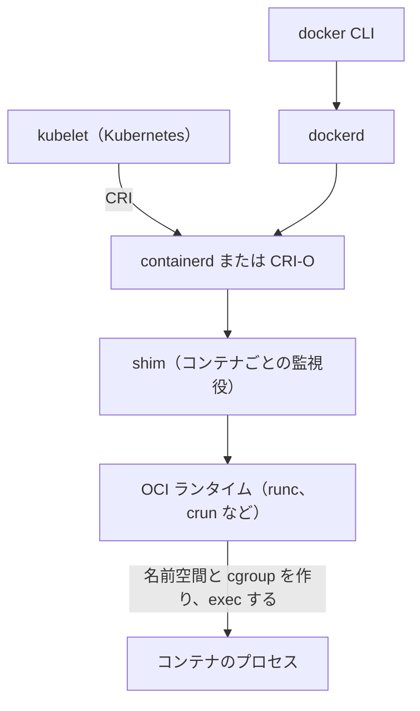

# 4.5 仮想化とコンテナ

> 「コンテナは軽量な仮想マシンだ」という説明は、半分正しく、半分は危険な誤解です。コンテナの正体は何で、仮想マシンとどこが違い、隔離はどこまで信頼できるのでしょうか。CPU 使用率は 30% なのに、なぜ CPU の limit を設定した Pod の応答が遅くなるのでしょうか。この章では、ここまで学んだプロセス・仮想メモリ・ファイルシステムの知識を総動員して、仮想化とコンテナを原理から理解します。

| 項目 | 内容 |
|---|---|
| 学習時間の目安 | 本文 4h ＋ 演習 6h |
| 前提となる章 | [4.1 プロセス・スレッド・システムコール](../01-processes-and-syscalls/README.md)、[4.2 仮想メモリ](../02-virtual-memory/README.md)、[4.3 ファイルシステムとI/O](../03-filesystems-and-io/README.md) |
| 演習 | [exercises/](exercises/)（Python） |
| キーワード | ハイパーバイザ, VT-x/AMD-V, KVM, 名前空間, cgroups v2, overlayfs, seccomp, capabilities, OCI, イメージレイヤ, マルチステージビルド, runc, containerd, gVisor, Firecracker, CFS 帯域制御, スロットリング, GOMAXPROCS, WebAssembly |

## この章のゴール

- [ ] 仮想化の方式（完全仮想化・準仮想化・ハードウェア支援）とハイパーバイザの種類を説明できる
- [ ] コンテナを「名前空間・cgroups・overlayfs・seccomp・capabilities で囲まれたプロセス」として説明し、unshare で再現できる
- [ ] イメージとレイヤ、ビルドキャッシュの仕組みを説明し、Dockerfile を書き・レビューし・リンターで検査できる
- [ ] CFS 帯域制御によるスロットリングを説明し、CPU の limit、GOMAXPROCS、JVM の設定を判断できる
- [ ] VM・コンテナ・gVisor・Firecracker などの隔離の強さとコストを比較し、ワークロードに応じて選べる

## なぜ学ぶのか

- **コンテナの隔離は、カーネルを共有する隔離である**: 2019 年に公表された runc の脆弱性（CVE-2019-5736）では、悪意のあるコンテナが、ホスト上のコンテナランタイム（runc）の実行ファイルを上書きし、ホストの root 権限を奪えました。コンテナは VM と違い、ホストと同じカーネルの上で動くプロセスにすぎません。信頼できないコードを動かすなら、隔離の強さを理解して仕組みを選ぶ必要があります。
- **CPU の limit による遅延**: Kubernetes で CPU の limit を設定すると、平均の CPU 使用率が低くても、多数のスレッドが一斉に動いた瞬間にクォータを使い切り、次の周期までプロセス全体が止められることがあります。応答時間の 99 パーセンタイルが突然悪化する原因として、多くの組織が経験し報告してきた問題です。かつてはカーネルのバグで、クォータを使い切っていないのにスロットリングされる問題もありました（Linux 5.4 で修正）。
- **イメージはソフトウェアのサプライチェーンそのもの**: ベースイメージの選び方、ビルドの手順、秘密情報の扱いは、脆弱性の数、デプロイの速度、情報漏洩のリスクに直結します。Dockerfile は、読める人が少ないのに、事故の影響が大きいファイルの代表です。

## 1. 仮想化とは何か

### 1.1 仮想マシンの条件

**仮想マシン（VM）** は、1 台の物理マシンの上で、複数の OS をそれぞれ専用のハードウェアを持っているかのように動かす技術です。VM を管理するソフトウェアを **ハイパーバイザ**（VMM、Virtual Machine Monitor）と呼びます。

Popek と Goldberg は 1974 年の論文で、効率のよい仮想化の条件を整理しました。VM の中のプログラムは、(1) 実機と同じように振る舞い（等価性）、(2) 資源はハイパーバイザが管理し（資源の制御）、(3) 大部分の命令は CPU で直接実行される（効率性）べきです。そのための方法が、4.1 の「制限付き直接実行」と同じ発想の **トラップ・アンド・エミュレート** です。ゲスト OS を特権のないモードで動かし、特権命令を実行したらトラップ（例外）でハイパーバイザに制御を移して、ハイパーバイザが代わりに処理（エミュレート）します。これが成り立つには、「動作が特権モードかどうかで変わる命令（センシティブな命令）」がすべて、ユーザーモードで実行するとトラップする特権命令でなければなりません。

### 1.2 x86 の問題と 3 つの解決策

初期の x86 は、この条件を満たしていませんでした。例えば `POPF` 命令は、ユーザーモードで実行しても例外を起こさず、割り込みフラグの変更を黙って無視します。ゲスト OS がこれを実行しても、ハイパーバイザは気づけません。そこで、次の 3 つの方式が生まれました。

| 方式 | 仕組み | 代表例 | 特徴 |
|---|---|---|---|
| 完全仮想化（バイナリ変換） | ゲスト OS のカーネルのコードを実行時に書き換え、問題のある命令をハイパーバイザの呼び出しに置き換える | 初期の VMware | ゲスト OS を変更せずに動かせるが、変換のコストがかかる |
| 準仮想化（paravirtualization） | ゲスト OS を改変し、特権的な操作をハイパーバイザへの明示的な呼び出し（ハイパーコール）にする | Xen（2003 年の論文 "Xen and the Art of Virtualization"） | 速いが、ゲスト OS の改変が必要 |
| ハードウェア支援 | CPU に「ゲスト用のモード」を追加し、センシティブな命令をハードウェアがトラップする | Intel VT-x、AMD-V（2000 年代半ばに登場） | 改変なしで速い。現在の主流 |

ハードウェア支援の仮想化では、ゲストの特定の操作で CPU がハイパーバイザに制御を戻すこと（**VM exit**）が性能の要になります。メモリについても、ゲストの仮想アドレス → ゲストの物理アドレス → ホストの物理アドレス、という 2 段の変換をハードウェアで行う仕組み（Intel の EPT、AMD の NPT）が加わりました。TLB ミスのときのページテーブルウォークが 2 次元になるので、[4.2](../02-virtual-memory/README.md) の huge page の効果が VM ではさらに大きくなります。

準仮想化の考え方も消えたわけではありません。ディスクやネットワークの装置を実機そっくりにエミュレートするのは遅いので、今日の VM は **virtio** と呼ばれる「VM 用に設計された仮想デバイス」の準仮想化ドライバを使うのが一般的です。

### 1.3 ハイパーバイザの種類

| 種類 | 構成 | 例 |
|---|---|---|
| タイプ 1（ベアメタル） | ハードウェアの上で直接動く | VMware ESXi、Microsoft Hyper-V、Xen |
| タイプ 2（ホスト型） | 通常の OS の上でアプリとして動く | VirtualBox、VMware Workstation |

**KVM** は Linux カーネルのモジュールで、Linux そのものをハイパーバイザにします（分類はタイプ 1 とされることが多い）。CPU とメモリの仮想化は KVM が担い、装置のエミュレーションは QEMU などのユーザー空間のプログラムが担当します。クラウドの VM もこうした技術の上に作られており、例えば AWS は、ネットワークやストレージの処理を専用のハードウェアにオフロードし、KVM を基にした軽量なハイパーバイザを使う Nitro System を公表しています。

VM の上では、4.1 で見た `top` の **steal 時間**（`st`）に注意します。ハイパーバイザが物理 CPU を他の VM に回していた時間で、これが大きいと、自分の VM の設定とは無関係に処理が遅くなります（いわゆる「うるさい隣人」）。

## 2. コンテナの正体: 隔離されたプロセス

### 2.1 VM とコンテナの違い

| 層 | 仮想マシン | コンテナ |
|---|---|---|
| アプリとライブラリ | VM ごとに持つ | コンテナごとに持つ（イメージに含める） |
| カーネル | VM ごとにゲスト OS のカーネルを持つ | **ホストのカーネルを全員で共有する** |
| 隔離の境界 | ハイパーバイザ（比較的小さく、CPU の仮想化支援で守られる） | カーネルの機能（名前空間・cgroups・seccomp など）。境界はカーネル全体 |
| 起動の目安 | OS の起動を伴うので、秒〜数十秒 | プロセスの起動なので、ミリ秒〜秒 |

VM は、それぞれが自分のカーネルを持ちます。コンテナは、**ホストのカーネルを共有する普通のプロセス** で、カーネルの機能によって「見えるもの」と「使える量」と「できること」を制限されています。

| 仕組み | 制限するもの | 主に扱う章 |
|---|---|---|
| 名前空間（namespaces） | 見えるもの（プロセス、ネットワーク、ファイルシステム、ホスト名、ユーザー ID など） | 2.2 |
| cgroups | 使える量（CPU、メモリ、I/O、プロセス数） | 2.3、6 節 |
| overlayfs | 書き込み（イメージの層は共有して読み取り専用、書き込みはコンテナごとの層へ） | 2.4 |
| capabilities・seccomp・LSM | できること（特権的な操作、使えるシステムコール） | 2.5 |

### 2.2 名前空間

**名前空間（namespace）** は、カーネルの資源をプロセスのグループごとに別々に見せる仕組みです。

| 名前空間 | 分離するもの |
|---|---|
| pid | プロセス ID（コンテナの中では最初のプロセスが PID 1 になる） |
| net | ネットワークインターフェース、IP アドレス、ルーティング、ポート |
| mnt | マウントポイント（ファイルシステムの見え方） |
| uts | ホスト名 |
| ipc | System V の IPC、POSIX のメッセージキュー |
| user | ユーザー ID・グループ ID の対応付け（中の root を外の一般ユーザーに対応付ける） |
| cgroup | cgroup の階層の見え方 |
| time | 一部の時計のオフセット（Linux 5.6 以降） |

プロセスが属する名前空間は `/proc/<PID>/ns/` で確認できます。

```text
$ ls -l /proc/self/ns | awk '{print $9, $10, $11}'
cgroup -> cgroup:[4026531835]
ipc -> ipc:[4026531839]
mnt -> mnt:[4026531832]
net -> net:[4026531833]
pid -> pid:[4026531836]
pid_for_children -> pid:[4026531836]
time -> time:[4026531834]
time_for_children -> time:[4026531834]
user -> user:[4026531837]
uts -> uts:[4026531838]
```

`unshare` コマンドを使うと、コンテナランタイムなしで名前空間を作れます（Linux、root 権限が必要。user 名前空間は一般ユーザーでも作れることが多いが、ディストリビューションの設定で制限されている場合もある）。

```text
$ hostname; unshare --uts sh -c 'hostname container-demo; hostname'; hostname
vm
container-demo
vm
$ unshare --pid --fork --mount-proc ps -e -o pid,cmd
    PID CMD
      1 ps -e -o pid,cmd
$ awk -F: 'NR>2{print $1}' /proc/net/dev | tr -d ' ' | tr '\n' ' '
lo ifb0 ifb1 eth0
$ unshare --net cat /proc/net/dev
Inter-|   Receive                                                |  Transmit
 face |bytes    packets errs drop fifo frame compressed multicast|bytes    packets errs drop fifo colls carrier compressed
    lo:       0       0    0    0    0     0          0         0        0       0    0    0    0     0       0          0
```

新しい UTS 名前空間の中で変えたホスト名は外に影響せず、新しい PID 名前空間では `ps` 自身が PID 1 になり、新しい net 名前空間にはループバック（`lo`）しかありません。Docker などのランタイムは、この上に仮想的なネットワークインターフェース（veth の組）をつないでコンテナをネットワークに接続します（[5.4](../../05-networking/04-web-architecture/README.md)）。

**user 名前空間** は特に重要です。一般ユーザー（nobody）が、名前空間の中では root として振る舞えます。

```text
$ setpriv --reuid=65534 --regid=65534 --clear-groups sh -c 'echo "外: $(id)"; unshare --user --map-root-user sh -c "echo \"内: \$(id)\"; cat /proc/self/uid_map"'
外: uid=65534(nobody) gid=65534(nogroup) groups=65534(nogroup)
内: uid=0(root) gid=0(root) groups=0(root)
         0      65534          1
```

`uid_map` の「0 65534 1」は「中の UID 0 を、外の UID 65534 に対応付ける」という意味です。中の root は、外から見れば権限のない nobody にすぎません。これを使うと、ホストの root 権限なしでコンテナを動かす **rootless コンテナ** が実現でき、コンテナを抜け出されたときの被害を小さくできます。

### 2.3 cgroups v2

名前空間が「見えるもの」を分けるのに対し、**cgroups** は「使える量」を制限・計測します（[4.1](../01-processes-and-syscalls/README.md) の 8.3 節の予告の続きです）。現在の主流の **cgroup v2** では、`/sys/fs/cgroup` 以下の 1 つの階層にグループをディレクトリとして作り、ファイルに値を書き込んで設定します。代表的なファイルと、書き込む値の形式を示します（Linux カーネルのドキュメント "Control Group v2" に基づく例）。

```text
cpu.max       "50000 100000"   100 ms（100000 µs）の周期ごとに 50 ms まで = CPU 0.5 個分。既定値は "max 100000"
cpu.weight    "100"            CPU を取り合ったときの相対的な重み（1〜10000、既定 100）
memory.max    "536870912"      上限（ここでは 512 MiB）。超えると回収し、足りなければ cgroup 内で OOM kill
memory.high   "503316480"      これを超えると回収を強めて増加を遅らせる（上限の手前の歯止め）
pids.max      "1024"           プロセスとスレッドの数の上限（fork 爆弾の対策）
io.max        "8:16 rbps=10485760 wiops=100"   装置ごとの帯域・IOPS の上限
```

Kubernetes は、コンテナの CPU の `requests` を `cpu.weight`（取り合いのときの配分）に、CPU の `limits` を `cpu.max`（周期ごとの上限、周期は既定で 100 ms）に、メモリの `limits` を `memory.max` に対応付けます。メモリの上限と OOM kill の詳しい振る舞いは [4.2](../02-virtual-memory/README.md) の 7.3 節で、CPU の上限が引き起こす問題はこの章の 6 節で扱います。

### 2.4 overlayfs: レイヤを重ねたファイルシステム

コンテナのルートファイルシステムは、通常 **overlayfs** で作られます。読み取り専用の下の層（**lowerdir**、イメージのレイヤ）の上に、書き込み可能な上の層（**upperdir**、コンテナごとの層）を重ね、合成した結果（**merged**）をコンテナに見せます。

```bash
mkdir -p lower upper work merged
echo "イメージのファイル" > lower/app.conf
echo "消される予定" > lower/old.txt
mount -t overlay overlay -o lowerdir=lower,upperdir=upper,workdir=work merged
echo "--- merged（コンテナから見える）"; ls merged
echo "変更後" > merged/app.conf        # 書き込むと、ファイルが upper にコピーされてから変更される（copy-up）
rm merged/old.txt                      # 削除は upper に「ホワイトアウト」として記録される
echo "--- lower（イメージ側。変わらない）"; cat lower/app.conf; ls lower
echo "--- upper（コンテナの書き込み層）"; ls -l upper | awk 'NR>1{print $1, $NF}'
umount merged
```

```text
--- merged（コンテナから見える）
app.conf
old.txt
--- lower（イメージ側。変わらない）
イメージのファイル
app.conf
old.txt
--- upper（コンテナの書き込み層）
-rw-r--r-- app.conf
c--------- old.txt
```

下の層（イメージ）は一切変わらず、変更されたファイルは上の層にコピーされてから書き換えられ（**copy-up**、[4.2](../02-virtual-memory/README.md) のコピーオンライトのファイル版）、削除は特殊なファイル（**ホワイトアウト**。ここでは種類 `c` の特殊ファイル）として記録されました。同じイメージから 100 個のコンテナを起動しても、下の層はディスク上もページキャッシュ上も 1 つを共有するので、起動が速く、容量も節約できます。

この仕組みから、2 つの実務上の注意が導かれます。

- 大きなファイルの一部を書き換えるだけでも、ファイル全体が copy-up される。データベースのデータのように書き換えの多いファイルは、overlayfs ではなくボリューム（ホストのディレクトリや、ネットワークのストレージ）に置く。
- 上の層は、コンテナを削除すると消える。**コンテナのファイルシステムに保存したデータは、永続化されていない**。

### 2.5 できることの制限: capabilities・seccomp・LSM

Linux は、root の強大な権限を 40 程度の **capabilities** に分割しています。ファイルの所有者の変更（`CAP_CHOWN`）、1024 番未満のポートの使用（`CAP_NET_BIND_SERVICE`）、ほぼ何でもできる `CAP_SYS_ADMIN` などです。UID が 0 でも、capability がなければその操作はできません。

```text
$ capsh --drop=cap_chown -- -c 'id -u; chown nobody capdemo.txt'
0
chown: changing ownership of 'capdemo.txt': Operation not permitted
```

Docker などのランタイムは、既定でコンテナに与える capabilities を十数個に絞っています。さらに次の仕組みを重ねます。

- **seccomp**: プロセスが使えるシステムコールを、許可リストで制限する。Docker の既定のプロファイルは、コンテナに不要で危険な数十のシステムコールを禁止している。攻撃者がカーネルの脆弱性を突くには、多くの場合そのシステムコールを呼ぶ必要があるので、攻撃対象領域を減らせる。
- **LSM（Linux Security Modules）**: AppArmor や SELinux による、ファイルや操作へのアクセス制御の追加の層。
- **読み取り専用のルートファイルシステム**、**no-new-privileges**（setuid のプログラムで権限を上げることを禁止）。

逆に、`--privileged` を付けたコンテナはこれらの制限のほとんどが外れ、ホストの装置にもアクセスできます。「動かないから `--privileged` を付けた」は、コンテナの隔離を自ら捨てる行為です。

## 3. イメージとビルド

### 3.1 OCI イメージとレイヤ

コンテナの形式は、**OCI（Open Container Initiative）** が標準化しています。イメージの形式（Image Specification）、実行の形式（Runtime Specification）、レジストリとのやり取り（Distribution Specification）の 3 つです。OCI のイメージは次のもので構成されます。

- **レイヤ**: ファイルシステムの差分を固めた tar アーカイブ。中身の SHA-256 の **ダイジェスト**（`sha256:…`）で識別される（**コンテンツアドレス**）。
- **設定（config）**: 環境変数、実行するコマンド、作業ディレクトリ、レイヤの順序など。
- **マニフェスト**: 設定とレイヤのダイジェストの一覧。マニフェスト自体のダイジェストが、イメージの識別子になる。

`python:3.12-slim` のような **タグは可変の名前** で、同じタグが指すイメージは、パッチの適用などで後から変わります。一方、**ダイジェストは不変** で、`python@sha256:…` と書けば、常にまったく同じ中身を指します。

レイヤがコンテンツアドレスで管理されているので、同じベースイメージを使うイメージは、そのレイヤを共有します。レジストリへの保存も、ノードへの取得（pull）も、持っていないレイヤだけで済みます。演習5では、複数のイメージの共有・固有の容量と、取得に必要な量を計算します。

### 3.2 ビルドキャッシュ

`docker build` は、Dockerfile の各命令について **キャッシュのキー** を計算し、前回と同じなら結果（レイヤ）を再利用します。キーは、おおまかに「1 つ前の段のキー・命令の文字列・（COPY/ADD なら）取り込むファイルの中身」から決まります。1 つの段のキーが変わると、それ以降のすべての段が作り直しになります。

このため、**命令の順序がビルドの速さを大きく左右します**。演習4のモデルで、ソースを 1 行だけ変えて再ビルドしたときの結果を比べます（解答例による実際の出力）。

```text
素朴な順序:
  キャッシュ  WORKDIR /app
  作り直し  COPY . .
  作り直し  RUN pip install -r requirements.txt
  作り直し  CMD ["python", "app/main.py"]
依存関係を先に:
  キャッシュ  WORKDIR /app
  キャッシュ  COPY requirements.txt .
  キャッシュ  RUN pip install -r requirements.txt
  作り直し  COPY app/ app/
  作り直し  CMD ["python", "app/main.py"]
```

素朴な順序では、ソースの変更で `COPY . .` のキーが変わり、依存関係のインストール（数分かかることもある）が毎回やり直しになります。**変わりにくいものを先に、変わりやすいものを後に** 並べるのが原則です。

逆に、`RUN` のキーはコマンドの文字列だけで決まるので、`RUN apt-get update` は、パッケージのリポジトリが更新されても、何か月でもキャッシュされたままになります。これが、`apt-get update` を `apt-get install` と同じ `RUN` に書くべき理由です（別の `RUN` にすると、古いパッケージ一覧のまま新しいパッケージをインストールしようとして失敗したり、古い版が入ったりする）。

### 3.3 Dockerfile のベストプラクティス

悪い例と、演習1のリンター（解答例）が報告した結果を示します。

```dockerfile
FROM ubuntu
RUN apt-get update
RUN apt-get install -y curl
ENV DB_PASSWORD=hunter2 LOG_LEVEL=info
WORKDIR /app
COPY . .
RUN pip install -r requirements.txt
CMD python app.py
```

```text
$ python3 dockerfile_lint.py Dockerfile
   1: DF001 ベースイメージ ubuntu にタグがありません。バージョンを固定してください
   1: DF002 最終ステージに USER がなく、root で実行されます。専用のユーザーを作って切り替えてください
   2: DF003 apt-get update は同じ RUN の中で apt-get install と組み合わせてください（別の RUN にすると古いパッケージ一覧がキャッシュされ続ける）
   3: DF004 apt-get install に --no-install-recommends を付けて、不要なパッケージを入れないでください
   4: DF006 ENV DB_PASSWORD は秘密情報に見えます。イメージの履歴に残るので、ビルド時のシークレットのマウントや実行時の注入を使ってください
   6: DF007 ソースを 1 行変えるだけで依存関係の再インストールが走ります。先に依存関係の定義ファイルだけを COPY してインストールしてください
   8: DF008 CMD をシェル形式で書くと /bin/sh -c が PID 1 になり、シグナルがアプリに届きません。exec 形式（JSON の配列）で書いてください
```

改善した例です。

```dockerfile
# ビルド用のステージ: コンパイラなどはここにだけ入れる
FROM python:3.12-slim AS builder
WORKDIR /app
COPY requirements.txt .
RUN pip install --no-cache-dir --prefix=/install -r requirements.txt
COPY src/ ./src/

# 実行用のステージ: 必要なものだけをコピーする
FROM python:3.12-slim
RUN useradd --create-home --uid 10001 app
COPY --from=builder /install /usr/local
COPY --from=builder /app/src /app/src
USER app
WORKDIR /app
CMD ["python", "-m", "src.main"]
```

要点を整理します。

| 実践 | 理由 |
|---|---|
| ベースイメージのバージョンを固定する（厳密にはダイジェストで） | `latest` や未指定だと、同じ Dockerfile でもビルドのたびに中身が変わり、再現できない。ただし固定したままだとセキュリティ更新も入らないので、Dependabot や Renovate などで固定値を自動更新する |
| 小さなベースイメージ（slim、distroless など）とマルチステージビルド | コンパイラやパッケージマネージャを本番のイメージに入れない。容量が減り、取得と起動が速くなり、脆弱性の数と攻撃対象が減る。Alpine は小さいが、C ライブラリが glibc ではなく musl なので、互換性や性能の違いに注意する |
| root 以外のユーザーで実行する（`USER`） | コンテナを抜け出されたとき、アプリの脆弱性を突かれたときの被害を減らす |
| 変わりにくいものを先に COPY する | ビルドキャッシュを効かせる（3.2） |
| `apt-get update && apt-get install -y --no-install-recommends … && rm -rf /var/lib/apt/lists/*` を 1 つの RUN に | 古いパッケージ一覧のキャッシュを防ぎ、不要なパッケージと一覧のファイルをレイヤに残さない |
| `.dockerignore` で `.git`、ローカルの設定、秘密情報、`node_modules` などを除外する | ビルドコンテキストの転送が速くなり、秘密情報がイメージに紛れ込むのを防ぐ |
| 秘密情報を `ENV`・`ARG`・`COPY` で入れない。ビルド時に必要なら BuildKit の `--mount=type=secret` を使う | `ENV` の値はイメージの設定に、`ARG` の値は `docker history` に残る。後のレイヤで削除しても、前のレイヤには残っている |
| `CMD` / `ENTRYPOINT` は exec 形式（JSON の配列） | シェル形式ではシグナルがアプリに届かない（[4.1](../01-processes-and-syscalls/README.md) の 6.4 節） |

最後の「後のレイヤで削除しても残る」は、レイヤの仕組みから必然的に起きます。`RUN` で大きなファイルをダウンロードし、次の `RUN` で削除しても、ダウンロードしたレイヤはイメージの一部として配布され続けます。同じ `RUN` の中で削除するか、マルチステージビルドで必要なものだけを次のステージにコピーします。

## 4. コンテナランタイムの階層

`docker run` や、Kubernetes の Pod の起動の裏では、いくつかのコンポーネントが役割を分担しています。



- **runc** は OCI の Runtime Specification の参照実装で、名前空間・cgroup・capabilities・seccomp を設定し、コンテナのプロセスを exec したら終了します。以後、コンテナのプロセスは shim の子として動き続けます。
- **containerd** や **CRI-O** は、イメージの取得・保存、コンテナのライフサイクルを管理します。Kubernetes は CRI（Container Runtime Interface）という API でこれらを呼び出します。Kubernetes は 1.24（2022 年）で Docker を直接呼ぶための部品（dockershim）を削除しましたが、Docker でビルドした OCI イメージはそのまま動きます。
- OCI ランタイムの部分を差し替えると、隔離の方式を変えられます。gVisor の `runsc` や Kata Containers は、この位置に入ります（5 節）。

## 5. 隔離の強さを選ぶ

すべてのコンテナは同じカーネルを共有するので、**カーネルの脆弱性は、そのままコンテナから抜け出す手段になりえます**。信頼できないコード（顧客が書いたスクリプト、アップロードされたファイルの処理、他社のプラグイン）を動かすときは、より強い隔離を検討します。

| 方式 | 仕組み | 隔離の強さ | 起動・密度・性能 | 向いている用途 |
|---|---|---|---|---|
| 通常のコンテナ | 名前空間・cgroups・seccomp・capabilities | カーネルを共有 | 最も軽い | 自社のコード、信頼できるワークロード |
| 強化したコンテナ | 上に加えて rootless（user 名前空間）、読み取り専用、厳しい seccomp | カーネルを共有するが、攻撃対象を絞る | ほぼ同じ | 多くの本番環境の既定として推奨 |
| gVisor | ユーザー空間で動く「カーネル」（Sentry）がシステムコールを横取りして処理し、ホストのカーネルに届く呼び出しを絞る | ホストのカーネルへの露出が小さい | システムコールの多い処理は遅く、未対応の機能もある | 信頼できないコードの実行（Google は GKE Sandbox などで提供） |
| microVM（Firecracker、Kata Containers） | 装置を最小限にした軽量な VM で、1 つの仕事（関数、Pod）ごとにカーネルを分ける | VM と同等 | 通常の VM よりずっと速く起動し、オーバーヘッドも小さい | サーバーレス、マルチテナントの実行基盤（AWS は Firecracker を Lambda と Fargate に使っていると公表） |
| 通常の VM・専有ホスト | テナントごとに VM やホストを分ける | 最も強い | 重い | 強い分離が求められる顧客、規制の厳しい用途 |

コンテナより軽い方向の選択肢もあります。**WebAssembly（Wasm）** は、メモリ安全なサンドボックスの中でバイトコードを実行する仕組みで、ブラウザの外でも、プラグインの実行やエッジでの計算に使われ始めています。WASI（WebAssembly System Interface）は、ファイルやネットワークなどへのアクセスを、明示的に与えた権限（capability）の範囲に限るインターフェースで、2024 年に WASI 0.2 が公開されました（2026 年時点の状況は各プロジェクトの情報で確認してください）。また、アプリと必要最小限の OS 機能だけを 1 つのイメージにまとめて VM で動かす **ユニカーネル**（MirageOS、Unikraft など）の研究・実践もありますが、利用は限定的です。

## 6. CPU の制限とスロットリング

### 6.1 CFS 帯域制御の仕組み

コンテナの CPU の上限（Kubernetes の CPU の `limits`、`docker run --cpus`）は、cgroup の **CFS 帯域制御**（cgroup v2 の `cpu.max`）で実現されています。「周期（既定 100 ms）ごとに、グループ全体でクォータ分の CPU 時間まで使ってよい」という仕組みで、クォータを使い切ると、**次の周期の始まりまで、グループ内のすべてのスレッドが止められます**（スロットリング）。

ここに落とし穴があります。CPU 1 個分（周期 100 ms、クォータ 100 ms）の上限を設定したコンテナで、4 本のスレッドが同時に動くと、4 CPU で並列に走って **25 ms でクォータを使い切り、残りの 75 ms は何もできません**。平均すれば CPU 1 個分しか使っていないのに、処理は 75 ms 止まるのです。

この環境の cgroup（cpu コントローラは v1 のインターフェース。v2 の `cpu.max` の「クォータ 周期」は、v1 では `cpu.cfs_quota_us` と `cpu.cfs_period_us` に分かれている）で、CPU を 200 ms ずつ使うプロセスを 4 つ同時に動かしてみました（`burn` は、指定したミリ秒だけ CPU を使って終了する C の小さなプログラムです）。

```bash
CG=/sys/fs/cgroup/cpu/study-demo
run4() {   # CPU を 200 ms ずつ使うプロセスを 4 つ同時に動かし、全員が終わるまでの時間を測る
  local start=$(date +%s%N)
  for i in 1 2 3 4; do ./burn 200 & done; wait
  echo "  4 プロセス × CPU 200 ms の完了まで: $(( ($(date +%s%N) - start) / 1000000 )) ms"
}
mkdir -p $CG
echo "制限なし:"; echo $$ > $CG/cgroup.procs; run4
echo 100000 > $CG/cpu.cfs_period_us
echo 100000 > $CG/cpu.cfs_quota_us          # 100 ms の周期ごとに 100 ms まで = CPU 1 個分
echo "quota=100ms / period=100ms:"; run4
grep -E "nr_periods|nr_throttled|throttled_time" $CG/cpu.stat
echo $$ > /sys/fs/cgroup/cpu/cgroup.procs    # 元のグループに戻る
rmdir $CG
```

```text
制限なし:
  4 プロセス × CPU 200 ms の完了まで: 208 ms
quota=100ms / period=100ms:
  4 プロセス × CPU 200 ms の完了まで: 737 ms
nr_periods 8
nr_throttled 8
throttled_time 1954801723
```

合計 800 ms の CPU を使う仕事なので、CPU 1 個分の上限なら 700〜800 ms かかるのは当然です。注目すべきは `cpu.stat` で、8 回の周期のすべてでスロットリングが起きています（`throttled_time` はナノ秒単位で、CPU ごとに合算されるため、経過時間より大きくなることがあります）。

問題が深刻になるのは、この状態で **小さなリクエスト** が来たときです。4 つのプロセスが CPU を使い続けている横で、CPU を 5 ms だけ使う処理を 10 回実行し、それぞれの完了までの時間を測りました。

```text
制限なし（4 CPU を使える）:
11 19 16 12 14 14 14 12 16 14 ms
quota=100ms / period=100ms（CPU 1 個分）:
11 14 14 16 12 73 11 81 84 94 ms
```

上限がある場合、周期の前半（クォータが残っているとき）に来たリクエストはすぐ終わりますが、クォータを使い切った後に来たリクエストは次の周期まで待たされ、70〜90 ms 以上かかっています。**平均はそこそこなのに、遅い方の裾（テールレイテンシ）が急に悪化する** 典型的な形です。

### 6.2 シミュレーションで原因を切り分ける

演習2のシミュレータで、GC（ガベージコレクション）のように多数のスレッドが一斉に動く状況を再現します。8 本の GC スレッドが合計 96 ms の仕事を始め、10 ms 後に 5 ms のリクエストが来るとします（クォータ 50 ms / 周期 100 ms、CPU 8 個）。

```text
GC 8 スレッド × 12 ms: リクエストの遅延  95 ms, GC の完了 201 ms, スロットリング 2 周期
GC 4 スレッド × 24 ms: リクエストの遅延  93 ms, GC の完了 201 ms, スロットリング 2 周期
GC 2 スレッド × 48 ms: リクエストの遅延   5 ms, GC の完了 201 ms, スロットリング 2 周期
```

GC の仕事の総量は同じなので、GC 自体が終わる時刻はどれも 201 ms で変わりません（クォータで決まる）。ところが、並列度が高いと、GC が周期の最初の数ミリ秒でクォータを使い切り、後から来たリクエストが次の周期まで止められます。並列度をクォータに見合った数（ここでは 2）に下げると、クォータが周期の後半まで残るので、リクエストは待たずに処理されます。

演習3では、「スロットリングが一度も起きない最小のクォータ」を求めます。スロットリングが起きないなら、実行の様子は上限がないときと同じになるので、答えは **上限なしで動かしたときの、1 周期あたりの CPU 使用量の最大値** です。1 秒に 1 回、8 本のスレッドが 20 ms ずつ並列に動くだけのワークロードは、平均では CPU 0.16 個分しか使いませんが、スロットリングを避けるには、周期 100 ms あたり 160 ms（CPU 1.6 個分）のクォータが必要になります。**CPU の上限は、平均ではなく、周期の中のピーク（並列度）で決まる** のです。

### 6.3 対策と、ランタイムのコンテナ対応

- **ランタイムの並列度を CPU の上限に合わせる**: Go のランタイムは、長くホストの CPU 数を `GOMAXPROCS` の既定値としてきたため、CPU 2 個分の上限のコンテナで、64 コアのホストの 64 並列で GC などが動いてしまうことがありました。Go 1.25 以降は、cgroup の CPU の上限を考慮して既定値を決めるようになっています（それ以前は uber-go/automaxprocs などのライブラリで対応するのが定番でした）。JVM は JDK 10（JDK 8 では 8u191）以降、コンテナの上限を認識して、使える CPU 数やヒープの既定値を決めます（`-XX:ActiveProcessorCount` で明示もできます）。Python の `os.cpu_count()` はホストの CPU 数を返すので、ワーカー数などは自分で上限に合わせる必要があります（2026 年時点。各ランタイムの最新のドキュメントを確認してください）。
- **CPU の上限の設定そのものを見直す**: 遅延に敏感なサービスでは、CPU の `requests` だけを設定して `limits` を設定しない（空いている CPU を借りられるようにする）運用を採る組織もあれば、テナント間の公平性のために上限を必須にする組織もあります。どちらを選ぶかは、ノードの共有のしかたとコストのトレードオフで、組織としての方針が必要です（[10.2](../../10-cloud-and-sre/02-containers-and-kubernetes/README.md)、[10.6](../../10-cloud-and-sre/06-finops/README.md)）。
- **スロットリングを監視する**: `cpu.stat` の `nr_throttled` の増え方（cAdvisor の `container_cpu_cfs_throttled_periods_total` など）を、CPU 使用率と並べて監視します。CPU 使用率だけを見ていると、この問題は見えません。
- 周期の中で使い残したクォータを次の周期に持ち越す `cpu.max.burst`（Linux 5.14 以降）のような機能もありますが、使えるかどうかは環境によります。

メモリの上限は CPU と違って「待たせる」ことができず、超えると OOM kill になります（[4.2](../02-virtual-memory/README.md)）。CPU は「圧縮できる資源」、メモリは「圧縮できない資源」であり、上限の設計の考え方が根本的に違うことを押さえておきましょう。

## よくある落とし穴

1. **コンテナを VM と同等の隔離だと考える**。コンテナはホストのカーネルを共有するプロセスです。信頼できないコードを動かすなら、gVisor や microVM などの強い隔離を検討し、少なくとも rootless・厳しい seccomp・最小の capabilities にします。
2. **root のまま実行する、`--privileged` を安易に付ける**。アプリの脆弱性やコンテナからの脱出の被害が、ホスト全体に及びえます。`USER` で専用のユーザーに切り替え、必要な capability だけを個別に与えます。
3. **`latest` や未固定のタグを使う（逆に、固定したまま更新しない）**。前者はビルドが再現できず、ある日突然壊れます。後者は脆弱性が放置されます。ダイジェストで固定し、自動更新の仕組みで定期的に上げます。
4. **秘密情報を `ENV`・`ARG`・`COPY` でイメージに入れる**。イメージの設定や履歴、前のレイヤに残り、イメージを取得できる全員に漏れます。ビルド時はシークレットのマウント、実行時はシークレット管理の仕組みから注入します（[11.5](../../11-security/05-security-operations/README.md)）。
5. **後の `RUN` でファイルを消せばイメージが小さくなると考える**。前のレイヤに残ったままです。同じ `RUN` の中で消すか、マルチステージビルドにします。
6. **CPU の limit を平均の使用率から決める**。並列に動く瞬間にクォータを使い切り、テールレイテンシが悪化します。スロットリングの回数を監視し、並列度と上限を合わせます。
7. **ランタイムがコンテナの上限を認識していると思い込む**。古い JVM、古い Go、`os.cpu_count()` をそのまま使う Python などは、ホストの CPU 数やメモリ量を前提にスレッド数やヒープを決めます。使っているランタイムの版と設定を確認します。
8. **コンテナのファイルシステムにデータを保存する**。上の層はコンテナとともに消え、copy-up のコストもかかります。永続化が必要なデータはボリュームやデータベースに置きます。
9. **ビルドキャッシュを無視した順序で Dockerfile を書く**。ソースの 1 行の変更のたびに依存関係のインストールが走り、CI とデプロイが遅くなります。変わりにくいものを先に COPY します。

## CTOの視点

1. **隔離の境界は、脅威モデルから決める**。「顧客のコードを実行する機能」「ファイルのアップロードと変換」「プラグイン」を持つ製品では、どこでテナントを分けるか（コンテナ、gVisor、microVM、VM、アカウント）が、セキュリティ事故の最大の被害範囲とインフラの費用を同時に決めます。後から隔離を強めるのは大工事なので、製品の設計段階で、セキュリティチームと一緒に決めましょう（[11.1](../../11-security/01-security-principles/README.md)）。
2. **ベースイメージとビルドの標準は、プラットフォームの責務にする**。承認したベースイメージ、ダイジェストでの固定と自動更新、イメージの脆弱性スキャン、SBOM の生成、署名と検証（Sigstore の cosign など）、Dockerfile のリンターを CI に組み込むことを、各チームの善意ではなく仕組みとして提供します。サプライチェーン攻撃への備えの中心でもあります（[11.5](../../11-security/05-security-operations/README.md)）。
3. **資源の requests と limits は、費用と信頼性のトレードオフとして方針を決める**。requests を実際より大きくすればノードが余って費用が増え、小さくすれば詰め込みすぎで性能が落ちます。CPU の limits は、6 節のスロットリングの問題と、隣のワークロードからの保護のトレードオフです。組織としての既定値と、例外を認める条件を決め、実際の使用量とスロットリングの監視に基づいて見直す仕組みを作ります（[10.6](../../10-cloud-and-sre/06-finops/README.md)）。
4. **「コンテナにすれば解決する」という提案を、何が解決するのかで評価する**。コンテナは、配布の形式とプロセスの隔離を標準化しますが、状態の管理、設定と秘密情報、ネットワーク、可観測性、運用の人材といった課題は残り、むしろ増えることもあります。移行の計画には、これらの課題への対応と、それを担う体制を含めるよう求めましょう。
5. **採用・育成では「コンテナとは何か」を VM という言葉を使わずに説明してもらう**。名前空間・cgroups・overlayfs・ホストのカーネルの共有という要素で説明できる人は、コンテナの障害（PID 1、OOMKilled、スロットリング、脱出の脆弱性）を原理から調査できます。

## 演習

演習コードは [exercises/](exercises/) にあります。docstring の仕様を読み、`raise NotImplementedError(...)` を実装に置き換えてください。解答例は [solutions/](solutions/) にあります。

```bash
python3 tools/check.py 4.5        # リポジトリのルートで実行
python3 tools/check.py -v 4.5     # 詳しい出力
```

| # | 難易度 | 内容 | ファイル / 関数 |
|---|---|---|---|
| 1 | ★★☆ | Dockerfile の構文解析（継続行・コメント）と、8 つの規則によるベストプラクティスの検査 | [dockerfile_lint.py](exercises/dockerfile_lint.py) `parse_dockerfile`, `lint` |
| 2 | ★★★ | CFS 帯域制御のシミュレーション: スロットリングと遅延の悪化を再現する | [cfs_quota.py](exercises/cfs_quota.py) `simulate` |
| 3 | ★★☆ | スロットリングを起こさない最小のクォータ（上限はピークで決まる） | [cfs_quota.py](exercises/cfs_quota.py) `min_quota_without_throttling` |
| 4 | ★★☆ | コンテンツアドレスのビルドキャッシュ: どの段が作り直しになるか | [image_layers.py](exercises/image_layers.py) `select_files`, `content_digest`, `cache_keys`, `build` |
| 5 | ★★☆ | レイヤの共有による保存容量と、取得に必要な量の計算 | [image_layers.py](exercises/image_layers.py) `storage_usage`, `pull_bytes` |
| 6 | ★★☆ | 記述: 顧客のコードを実行する機能の隔離方式の選定（下記） | — |

### 演習6（記述）: 顧客のコードを実行する機能の隔離

あなたの会社の SaaS に、顧客が Python のスクリプトを書いて、自社のデータの加工を自動化できる機能を追加することになりました。スクリプトは顧客が自由に書け、1 回の実行は数秒〜数分、1 日に数十万回の実行が見込まれます。インフラは Kubernetes です。

(1) この機能の脅威を 3 つ以上挙げてください。(2) 隔離の方式の候補を 3 つ挙げ、隔離の強さ・性能・費用・運用の観点で比べてください。(3) あなたの推奨と、隔離以外に必要な対策を述べてください。

<details>
<summary>解答例</summary>

**(1) 脅威の例**

- カーネルの脆弱性やランタイムの脆弱性を突いてコンテナから抜け出し、ホストや他の顧客のデータにアクセスする。
- 同じネットワークにある内部のサービスや、クラウドのメタデータサービス（認証情報を取得できるエンドポイント）にアクセスする。
- 無限ループやメモリの大量確保、fork 爆弾、大量の通信で、他の顧客の実行や基盤全体を妨害する。
- 実行基盤を踏み台にして外部を攻撃したり、暗号資産のマイニングに使ったりする。

**(2) 候補の比較**

| 方式 | 隔離の強さ | 性能・起動 | 費用 | 運用 |
|---|---|---|---|---|
| 強化した通常のコンテナ（rootless、厳しい seccomp、capabilities なし、読み取り専用） | カーネルを共有するので、カーネルの脆弱性で抜けられる可能性が残る | 最速 | 最も安い | 既存の Kubernetes の運用で済む |
| gVisor（RuntimeClass で指定） | ホストのカーネルへの露出が小さい | システムコールの多い処理は遅くなる。互換性の確認が必要 | 中程度 | ノードの設定と互換性の検証が必要 |
| microVM（Kata Containers、Firecracker） | 実行ごとにカーネルが分かれ、VM と同等 | 通常のコンテナより起動とメモリのオーバーヘッドが大きい | 高め | ネストした仮想化やベアメタルのノードなど、基盤の要件がある |

**(3) 推奨の例**

顧客が任意のコードを書ける以上、カーネルの共有だけに頼る隔離は不十分と判断し、gVisor か microVM を採用する。どちらにするかは、実際のスクリプトでの互換性と性能を検証して決める。どの方式でも、次の対策を組み合わせる。

- 実行ごとに使い捨ての環境を使い、実行の間で状態を共有しない。
- CPU・メモリ・プロセス数・実行時間・ディスクに厳しい上限を設ける（cgroups とタイムアウト）。
- 外向きの通信は既定で禁止し、許可した宛先だけを通す。クラウドのメタデータのエンドポイントと、社内のネットワークへの経路を遮断する。
- 顧客のデータへのアクセスは、実行ごとに発行する最小権限の短期間の資格情報に限る。
- 実行のログと資源の使用量を監視し、濫用（マイニングなど）を検知して止める仕組みと、利用規約での禁止を用意する。

採点の観点: 「カーネルを共有すること」の意味を理解したうえで隔離方式を比較し、隔離だけでなく、資源の上限・ネットワークの制限・資格情報の最小化を組み合わせていれば合格です。互換性や費用の検証の進め方まで書けていれば、技術選定をリードできる水準です。

</details>

## 理解度チェック

**Q1. Popek と Goldberg の条件に照らして、初期の x86 が効率よく仮想化できなかった理由と、Intel VT-x / AMD-V がそれをどう解決したかを説明してください。**

<details>
<summary>解答</summary>

トラップ・アンド・エミュレートで仮想化するには、特権モードかどうかで動作が変わるセンシティブな命令が、すべてユーザーモードではトラップする特権命令である必要があります。初期の x86 には、`POPF` のように、ユーザーモードで実行しても例外を起こさずに動作だけが変わる（割り込みフラグの変更を黙って無視する）センシティブな命令があり、ゲスト OS をユーザーモードで動かしても、ハイパーバイザはその操作に介入できませんでした。そのため、実行時にコードを書き換えるバイナリ変換や、ゲスト OS を改変する準仮想化が使われました。

VT-x / AMD-V は、CPU にゲスト用の実行モードを追加し、センシティブな操作をハードウェアが検出して VM exit でハイパーバイザに制御を戻せるようにしました。これにより、ゲスト OS を改変せずに、効率よく仮想化できるようになりました。

</details>

**Q2. 「コンテナは軽量な VM だ」という説明の、正しい点と危険な点を説明してください。**

<details>
<summary>解答</summary>

正しい点: アプリから見ると、自分専用のファイルシステム、プロセスの一覧、ネットワーク、ホスト名を持ち、資源の量も制限されるので、VM のように独立した環境に見えます。起動は VM よりずっと速く、軽量です。

危険な点: コンテナは、名前空間・cgroups・overlayfs・seccomp などで囲まれた **ホスト上の普通のプロセス** で、**すべてのコンテナがホストのカーネルを共有** しています。VM はそれぞれ自分のカーネルを持ち、ハイパーバイザという小さな境界で隔てられますが、コンテナの境界はカーネル全体という大きな攻撃対象です。カーネルやランタイムの脆弱性があれば、コンテナから抜け出されるおそれがあります。信頼できないコードを動かすときに、VM と同じ強さの隔離を期待してはいけません。

</details>

**Q3. user 名前空間を使うと何ができるようになりますか。また、それがセキュリティ上なぜ重要なのかを説明してください。**

<details>
<summary>解答</summary>

user 名前空間は、名前空間の中のユーザー ID・グループ ID を、外の別の ID に対応付けます。これにより、名前空間の中では root（UID 0）として振る舞い、パッケージのインストールなどの操作ができる一方で、外（ホスト）から見るとそのプロセスは権限のない一般ユーザー（例えば UID 65534）にすぎない、という状態を作れます。

これを使うと、ホストの root 権限なしでコンテナを動かす rootless コンテナが実現できます。万一コンテナから抜け出されても、攻撃者が得るのはホストの一般ユーザーの権限なので、被害を大幅に小さくできます。

</details>

**Q4. Dockerfile で、ある `RUN` で 500MB のファイルをダウンロードして展開し、次の `RUN` で元のアーカイブを削除しました。イメージは小さくなりますか。どう書くべきですか。**

<details>
<summary>解答</summary>

小さくなりません。イメージは各命令のレイヤを積み重ねたもので、ダウンロードした `RUN` のレイヤには 500MB のアーカイブがそのまま残っています。次の `RUN` の削除は、上のレイヤに「削除した」という印（ホワイトアウト）を追加するだけで、下のレイヤはイメージとともに配布され続けます。秘密情報を後のレイヤで消しても残るのと同じ理由です。

対策は、ダウンロード・展開・削除を **1 つの `RUN` の中で** 行う（`RUN curl -fsSLO … && tar xf … && rm …`）か、マルチステージビルドで、展開した結果だけを実行用のステージに `COPY --from=` でコピーすることです。

</details>

**Q5. `COPY . .` の後に `RUN npm ci` を書いた Dockerfile は、なぜビルドが遅くなりますか。どう直しますか。**

<details>
<summary>解答</summary>

ビルドキャッシュのキーは、COPY の場合は取り込むファイルの中身から決まり、ある段のキーが変わるとそれ以降のすべての段が作り直しになります。`COPY . .` はソースコード全体を取り込むので、ソースを 1 行変えるだけでキーが変わり、後に続く `RUN npm ci`（依存関係のインストール、数分かかることもある）が毎回やり直しになります。

直し方は、変わりにくい依存関係の定義だけを先にコピーしてインストールし、ソースは後からコピーすることです。

```dockerfile
COPY package.json package-lock.json ./
RUN npm ci
COPY . .
```

こうすれば、依存関係の定義が変わらない限り、`npm ci` のレイヤはキャッシュが使われます。

</details>

**Q6. Kubernetes で CPU の limits を 1（CPU 1 個分）に設定した Go のサービスが、CPU 使用率は平均 40% なのに、ときどき応答が 100 ms 近く遅くなります。原因として考えられることと、確認方法、対策を答えてください。**

<details>
<summary>解答</summary>

CFS 帯域制御によるスロットリングが疑われます。CPU の limits は「100 ms の周期ごとに 100 ms の CPU 時間まで」というクォータで、多数のスレッドが同時に動くと、周期の最初の数十ミリ秒でクォータを使い切り、残りの時間はコンテナ内のすべてのスレッドが止められます。平均の使用率が低くても、GC やリクエストの集中で並列に動いた瞬間に起き、その周期に来たリクエストは次の周期まで待たされます。古い Go ではランタイムがホストの CPU 数を `GOMAXPROCS` にするので、並列度が上限に比べて過大になりがちです。

確認: `cpu.stat` の `nr_throttled`・`throttled_usec`（または cAdvisor の `container_cpu_cfs_throttled_periods_total`）の増加と、遅延の悪化の時刻が一致するかを見ます。

対策: `GOMAXPROCS` を CPU の上限に合わせる（Go 1.25 以降は既定で考慮される。それ以前は automaxprocs などを使う）、limits を並列度のピークに見合う値に上げる、または組織の方針として CPU の limits を外して requests だけで運用する、などです。

</details>

**Q7. マルチテナントの SaaS で、顧客ごとのワークロードを隔離する方式として、通常のコンテナ、gVisor、microVM（Firecracker など）を比べ、それぞれが向いている状況を答えてください。**

<details>
<summary>解答</summary>

- **通常のコンテナ（強化したもの）**: 自社が書いた信頼できるコードで、顧客ごとの違いが設定やデータだけの場合。最も軽く安いが、カーネルを共有するので、顧客が任意のコードを実行できる用途には不十分。
- **gVisor**: 顧客のコードを実行するが、互換性の問題が小さく、システムコールの多すぎない処理の場合。ホストのカーネルへの露出を減らしつつ、コンテナに近い運用ができる。システムコールの多い処理では性能が落ちる。
- **microVM**: 顧客の任意のコードを大量に実行する基盤（サーバーレス、CI の実行環境など）で、VM と同等の隔離が必要な場合。通常の VM より起動が速く軽いが、コンテナよりはオーバーヘッドがあり、基盤の要件（仮想化支援の使えるノード）もある。

どの場合も、ネットワークの制限、資源の上限、最小権限の資格情報を組み合わせることが前提です。

</details>

**Q8. ベースイメージをタグではなくダイジェストで指定する利点と欠点、欠点への対処法を説明してください。**

<details>
<summary>解答</summary>

利点: ダイジェストは中身の SHA-256 なので、同じ指定は常にまったく同じイメージを指します。タグの付け替え（上流でのパッチの適用や、万一のレジストリの乗っ取り）によってビルドの中身が勝手に変わることがなく、再現性と改ざんへの耐性が得られます。

欠点: 固定したままだと、上流でセキュリティパッチが出ても自動では取り込まれず、脆弱性が放置されます。

対処法: Dependabot や Renovate などで、新しいダイジェストへの更新を自動でプルリクエストにし、CI のテストとイメージの脆弱性スキャンを通してから取り込む運用にします。「固定する」と「更新し続ける」を両立させるのが要点です。

</details>

## さらに学ぶために

- Gerald J. Popek, Robert P. Goldberg "Formal Requirements for Virtualizable Third Generation Architectures"（Communications of the ACM, 1974）— 仮想化の条件を定式化した古典。短く、今でも仮想化を考える出発点になります。
- Paul Barham ほか "Xen and the Art of Virtualization"（SOSP 2003）— 準仮想化の代表的な論文。ハードウェア支援の登場前に、x86 の仮想化の問題をどう解いたかが分かります。
- Alexandru Agache ほか "Firecracker: Lightweight Virtualization for Serverless Applications"（NSDI 2020）— AWS が、コンテナの軽さと VM の隔離を両立させるために microVM を設計した理由と、その設計を解説した論文です。
- Liz Rice "Container Security"（O'Reilly, 2020）— 名前空間・cgroups・capabilities・seccomp から、イメージのサプライチェーンまで、コンテナのセキュリティを原理から解説した本。同じ著者の講演 "Containers From Scratch" は、Go の数十行でコンテナを作ってみせる名講演です。
- Linux カーネルのドキュメント "Control Group v2"（Documentation/admin-guide/cgroup-v2.rst）と、man ページ `namespaces(7)`・`user_namespaces(7)`・`capabilities(7)`・`seccomp(2)` — この章の仕組みの一次資料です。
- Open Container Initiative の Image Specification と Runtime Specification（https://github.com/opencontainers/image-spec 、https://github.com/opencontainers/runtime-spec）— イメージのレイヤ・マニフェスト・ダイジェストの正確な定義です。
- 徳永航平『イラストでわかるDockerとKubernetes』（技術評論社）— コンテナとイメージの仕組み、ランタイムの階層を図解で解説した日本語の入門書です。

## まとめ

- VM はハイパーバイザの上で各自のカーネルを動かす。x86 の仮想化は、バイナリ変換・準仮想化を経て、VT-x / AMD-V と EPT / NPT のハードウェア支援が主流になった。VM の上では steal 時間に注意する。
- コンテナは **ホストのカーネルを共有するプロセス** で、名前空間（見えるもの）・cgroups（使える量）・overlayfs（書き込みの分離）・capabilities / seccomp / LSM（できること）で囲まれている。user 名前空間は rootless コンテナを可能にする。
- イメージはコンテンツアドレスのレイヤの積み重ねで、共有によって保存と配布が効率化される。ビルドキャッシュは「親・命令・取り込む中身」で決まるので、**変わりにくいものを先に** 書く。消したファイルも前のレイヤに残る。
- Dockerfile は、バージョンの固定と自動更新、小さなベースとマルチステージ、非 root、exec 形式の CMD、秘密情報を入れないことが基本。リンターで機械的に検査する。
- 隔離の強さは、通常のコンテナ < 強化したコンテナ < gVisor < microVM ≦ VM。信頼できないコードには、カーネルを共有しない方式と、資源・ネットワーク・権限の制限を組み合わせる。
- CPU の上限（CFS 帯域制御）は、並列に動く瞬間にクォータを使い切ると、**次の周期までグループ全体を止める**。上限はピークで決まり、ランタイムの並列度（GOMAXPROCS など）を上限に合わせ、スロットリングを監視する。
