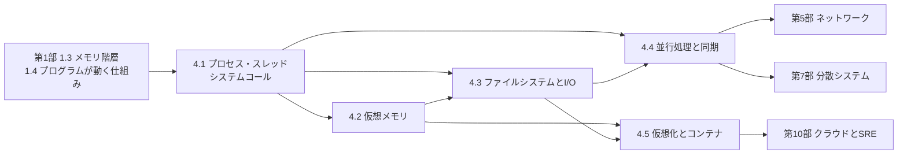

# 第4部 オペレーティングシステム

> あなたのプログラムは、CPU もメモリもディスクもネットワークも、OS を通してしか使えません。OS は、限られたハードウェアを多数のプログラムに「独り占めしているかのように」見せ（仮想化）、扱いやすい形に包み（抽象化）、公平に配り（資源管理）、互いを守ります（保護）。この部では、プロセス・仮想メモリ・ファイルシステム・並行処理・コンテナを、Linux の上で実際に観察しながら学びます。目標は、「なぜデプロイのたびにエラーが出るのか」「なぜ OOMKilled されるのか」「なぜ write したデータが消えたのか」「なぜ CPU は空いているのに遅いのか」に、原理から答えられるようになることです。

## この部で身につくこと

- **OS の仕事を説明できる**: ユーザーモードとカーネルモード、システムコールの仕組みとコストを理解し、strace や /proc でプログラムの振る舞いを観察できる。
- **プロセスを操れる**: fork・exec・wait・パイプ・シグナルでプロセスを組み立て、シェルのパイプラインやグレースフルシャットダウンを自分で実装できる。コンテナの PID 1 問題を説明できる。
- **スケジューリングを評価できる**: FIFO・SJF・RR・MLFQ のトレードオフをシミュレーションで比べ、Linux のスケジューラ（CFS から EEVDF へ）とロードアベレージを正しく読める。
- **メモリの振る舞いを読み解ける**: ページテーブル・TLB・ページフォールト・コピーオンライト・mmap・ページ置換を実装レベルで理解し、`free` や RSS/PSS を正しく読み、OOM killer とコンテナのメモリ上限を説明できる。
- **データを失わない**: ページキャッシュと fsync、原子的なファイルの置き換え、ジャーナリング、チェックサム付きのログによる回復を理解し、ストレージの種類（ブロック・ファイル・オブジェクト）のセマンティクスの違いを踏まえて設計できる。
- **並行処理を正しく書ける**: 競合状態を見抜き、ロック・条件変数・読み書きロック・async/await を使い分け、デッドロックを防ぎ、網羅的な探索でバグを確定的に見つけられる。
- **コンテナを原理から扱える**: コンテナを名前空間・cgroups・overlayfs・seccomp で囲まれたプロセスとして説明し、Dockerfile をレビューし、CPU のスロットリングや隔離の強さを判断できる。

## 章の一覧

| 章 | タイトル | 学習時間 | 主な演習 | キーワード |
|---|---|---|---|---|
| 4.1 | [プロセス・スレッド・システムコール](01-processes-and-syscalls/README.md) | 本文 4h ＋ 演習 6h | `sched_sim.py`（FIFO・SJF・SRTF・RR・MLFQ のスケジューラと評価指標）・`procs.py`（fork/exec/pipe によるパイプライン）・`graceful_worker.py`（SIGTERM で処理中の仕事を終えて止まるワーカー）、記述: 止まらないコンテナの分析 | システムコール, strace, fork/exec, ファイルディスクリプタ, パイプ, コンテキストスイッチ, MLFQ, CFS/EEVDF, シグナル, PID 1, ロードアベレージ |
| 4.2 | [仮想メモリ](02-virtual-memory/README.md) | 本文 4h ＋ 演習 5h | `vmsim.py`（2 段のページテーブル、TLB と MMU、FIFO・LRU・OPT・Clock のページ置換と Belady の異常、コピーオンライトの fork、ワーキングセット）、記述: OOMKilled を繰り返す Java サービス | ページテーブル, TLB, ページフォールト, デマンドページング, コピーオンライト, mmap, スラッシング, overcommit, OOM killer, RSS/PSS, huge page |
| 4.3 | [ファイルシステムとI/O](03-filesystems-and-io/README.md) | 本文 4h ＋ 演習 6h | `fileio.py`（原子的な書き込み、tail、一定のメモリでの集計、長さ＋CRC32 のレコードログと回復）・`evloop.py`（selectors によるイベントループのエコーサーバー）、記述: データの置き場所と永続化の設計 | inode, ページキャッシュ, fsync, fsyncgate, ジャーナリング, SSD, RAID, オブジェクトストレージ, epoll, io_uring, C10K |
| 4.4 | [並行処理と同期](04-concurrency/README.md) | 本文 4h ＋ 演習 7h | `sync_lab.py`（有界ブロッキングキュー、書き込み優先の読み書きロック、デッドロックの検出と回避、asyncio の並行数制限）・`interleave.py`（インターリーブの網羅的な探索）、記述: タイムセールの在庫引き当て | 競合状態, ミューテックス, CAS, 条件変数, デッドロック, 優先度逆転, メモリモデル, スレッドプール, async/await, GIL, 構造化並行性 |
| 4.5 | [仮想化とコンテナ](05-virtualization-and-containers/README.md) | 本文 4h ＋ 演習 6h | `dockerfile_lint.py`（Dockerfile のリンター）・`cfs_quota.py`（CPU クォータとスロットリングのシミュレーション）・`image_layers.py`（ビルドキャッシュとレイヤの共有）、記述: 顧客のコードを実行する機能の隔離 | ハイパーバイザ, 名前空間, cgroups v2, overlayfs, seccomp, OCI, マルチステージビルド, gVisor, Firecracker, CFS 帯域制御, GOMAXPROCS |

合計の目安は、本文 約 20 時間、演習 約 30 時間です。コード演習は `python3 tools/check.py 4` でまとめてテストできます（章を指定するなら `python3 tools/check.py 4.3` のように）。

## 学習の進め方

### 章の順序と依存関係

- **4.1 から順に進むのが基本です**。4.1 のプロセス・ファイルディスクリプタ・シグナルは、残りのすべての章の土台です。4.2 のコピーオンライトとページキャッシュは 4.3 と 4.5 で、4.3 のイベントループは 4.4 の async/await で、4.1・4.2・4.3 のすべてが 4.5 のコンテナで再び登場します。
- **本文は Linux での実際の出力を載せています**。strace、`/proc`、`free`、`unshare`、cgroup などの出力は、Linux のマシンで自分でも実行してみてください。macOS では `/proc` や strace がなく（代わりに dtruss などがあります）、名前空間や cgroups もないので、Linux の仮想マシンやコンテナ、WSL2 を使うと本文と同じ結果を確かめられます。`unshare` や cgroup の操作には root 権限が必要なので、使い捨ての環境で試しましょう。数値（システムコールや fsync の時間など）は環境によって大きく変わります。
- **演習の多くは OS の仕組みのシミュレータです**（スケジューラ、MMU、ページ置換、CFS のクォータ、インターリーブの探索）。本物のカーネルを書く代わりに、仕組みの本質を小さなモデルに落とし込み、テストで確かめます。一方、4.1 のパイプラインとグレースフルシャットダウン、4.3 の fsync とイベントループの演習は、本物のシステムコールとシグナルとソケットを使います（一部は Unix 専用で、Windows ではスキップされます）。

### つまずきやすい点

- **「成功」の意味**: `write()` の成功、`malloc` の成功、`kill` の成功は、それぞれ「ディスクに届いた」「物理メモリがある」「プロセスが止まった」を意味しません。この部の多くの落とし穴は、この区別から生まれます。各章の「よくある落とし穴」を、自分の経験と照らし合わせて読んでみてください。
- **非決定的なバグ**: 4.1 のパイプの閉じ忘れや、4.4 の競合状態は、テストが「止まる」「たまに失敗する」形で現れます。テストにはタイムアウトを付けてあるので、ハングしたら「どのパイプの端が開いたままか」「どこでロックを待っているか」を考えてください。4.4 の演習5（網羅的な探索）は、この種のバグを確定的に扱う方法を教えてくれます。
- **シミュレータの規約**: スケジューラや MLFQ、CFS のシミュレータは、同点のときの扱いや、イベントの処理の順序を docstring で厳密に定めています。テストが合わないときは、まず規約を読み直し、小さな例を紙の上で追ってみてください。
- **経験者の進め方**: 理解度チェックに答えられる章は、★★★ の演習（4.1 のパイプライン、4.2 のコピーオンライト、4.3 のイベントループ、4.4 の読み書きロックとインターリーブの探索、4.5 の CFS のシミュレーション）だけ解いて先へ進んで構いません。CTO 準備トラックでは、少なくとも各章の「なぜ学ぶのか」「よくある落とし穴」「CTOの視点」を読み、4.4 と 4.5 は通読することを勧めます（[学習ガイド](../00-guide/README.md)）。

## 到達度チェック

この部を修了したと言えるのは、次のことができるときです。

- [ ] ユーザーモードとカーネルモードの区別と、システムコール・例外・割り込みの役割を説明し、strace の出力からプログラムの振る舞いを読み取れる
- [ ] fork・exec・wait・パイプ・dup2 を使ってシェルのパイプラインを実装でき、ゾンビ・孤児・SIGPIPE・fd のリークを説明できる
- [ ] SIGTERM を受けて処理中の仕事を終えてから止まるプログラムを書け、コンテナの PID 1 問題と Kubernetes の停止の流れを説明できる
- [ ] スケジューリングの評価指標と、FIFO・SJF・RR・MLFQ のトレードオフを説明し、ロードアベレージと PSI から CPU と I/O のどちらが問題かを切り分けられる
- [ ] 仮想アドレスが物理アドレスに変換される流れ（多段ページテーブル、TLB、ページフォールト）と、コピーオンライト・mmap・ページ置換を説明できる
- [ ] `free`・`/proc/meminfo`・RSS/PSS を正しく読み、overcommit・OOM killer・コンテナのメモリ上限による障害を調査できる
- [ ] write・fsync・ページキャッシュの関係を説明し、原子的なファイルの置き換えとチェックサム付きのログの回復を実装できる
- [ ] ブロック・ファイル共有・オブジェクトストレージのセマンティクスの違いと、RAID とバックアップの違いを踏まえて、データの置き場所を選べる
- [ ] I/O 多重化とイベントループでサーバーを書け、部分的な読み書き・背圧・ループを止めないことの重要性を説明できる
- [ ] 競合状態・デッドロック・優先度逆転を具体例で説明し、条件変数とロックの順序付けで正しい同期を実装できる
- [ ] コンテナを名前空間・cgroups・overlayfs・seccomp・capabilities で説明し、Dockerfile をレビューでき、CPU のスロットリングと隔離の強さを判断できる
- [ ] 第4部の演習のテストがすべて通る（`python3 tools/check.py 4`）

## この部の推薦図書・教材

- Remzi H. Arpaci-Dusseau, Andrea C. Arpaci-Dusseau "Operating Systems: Three Easy Pieces"（https://pages.cs.wisc.edu/~remzi/OSTEP/ で無料公開）— この部の主教科書。仮想化（CPU とメモリ）・並行性・永続性の 3 つの柱で OS を解説し、各章に実験と宿題がある。4.1・4.2 が前半、4.4 が中盤、4.3 が後半に対応する。
- Michael Kerrisk "The Linux Programming Interface"（邦訳『Linuxプログラミングインタフェース』オライリー・ジャパン）— Linux のシステムコールの決定版の解説書。プロセス、シグナル、ファイル I/O、パイプ、ソケット、スレッド、名前空間の入口まで、演習の答え合わせの辞書として使える。
- 武内覚『［試して理解］Linuxのしくみ』（技術評論社）— プロセス・スケジューラ・メモリ管理・ファイルシステム・ストレージを、実験と図で確かめる日本語の入門書。この部の本文と同じく「観察して理解する」スタイル。
- Brendan Gregg "Systems Performance"（邦訳『詳解 システム・パフォーマンス』オライリー・ジャパン）— CPU・メモリ・ファイルシステム・ディスク・ネットワークの性能分析の方法論とツール。障害対応や性能改善の実務に直結する。
- Liz Rice "Container Security"（O'Reilly）— 名前空間・cgroups・capabilities・seccomp からイメージのサプライチェーンまで、コンテナの仕組みとセキュリティを原理から解説する。4.5 の続きとして。
- Martin Kleppmann『データ指向アプリケーションデザイン』（オライリー・ジャパン）— 第6部・第7部で主に使う本だが、ストレージエンジンや永続性の章は 4.3 の先にある世界を見せてくれる。

## 次に進む

- [第5部 コンピュータネットワーク](../05-networking/README.md) では、4.1 のファイルディスクリプタと 4.3 のイベントループの上に、ソケット・TCP・HTTP を積み上げます。
- [第6部 データベース](../06-databases/README.md) の [6.4 ストレージエンジンと障害回復](../06-databases/04-storage-and-recovery/README.md) では、4.3 の fsync とチェックサム付きのログを使って、キーバリューストアと WAL を作ります。[6.3 トランザクションと同時実行制御](../06-databases/03-transactions/README.md) は、4.4 の並行処理のデータベース版です。
- [第7部 分散システム](../07-distributed-systems/README.md) では、4.4 の同期の問題が、共有メモリもロックもない、メッセージが遅れ失われる世界でどう形を変えるかを学びます。
- [第10部 クラウドとSRE](../10-cloud-and-sre/README.md) の [10.2 コンテナオーケストレーションとKubernetes](../10-cloud-and-sre/02-containers-and-kubernetes/README.md) では、4.5 のコンテナの上に、スケジューリング・資源の requests と limits・グレースフルシャットダウンを組み合わせた運用を学びます。
