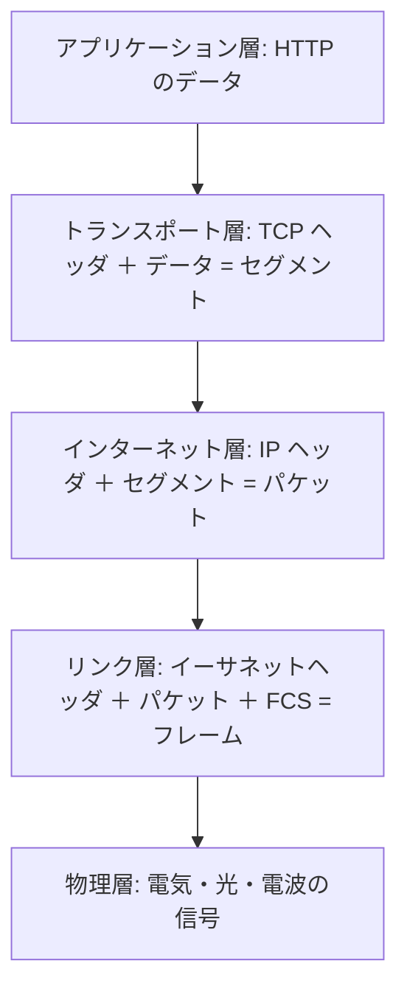
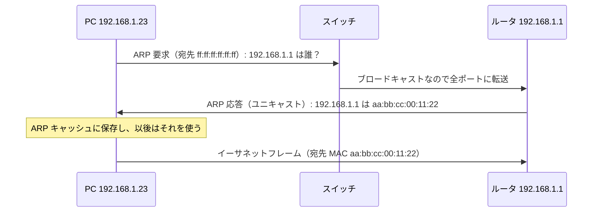
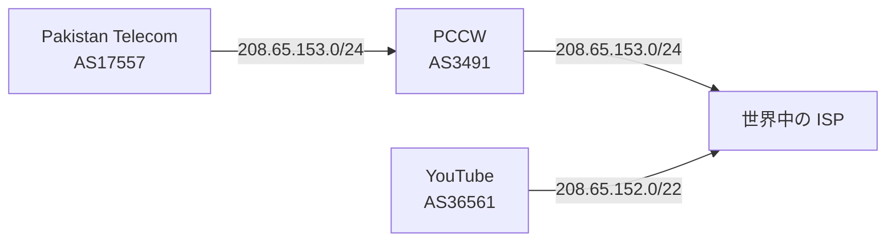
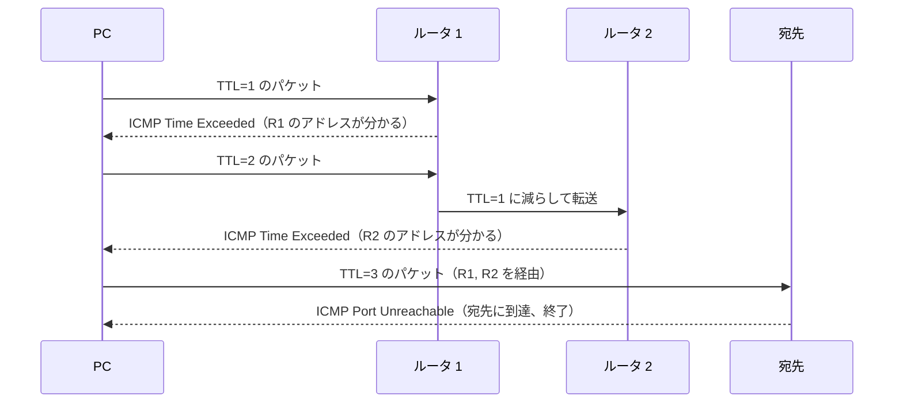
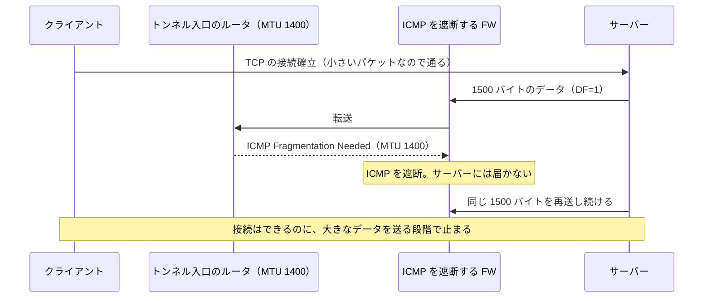
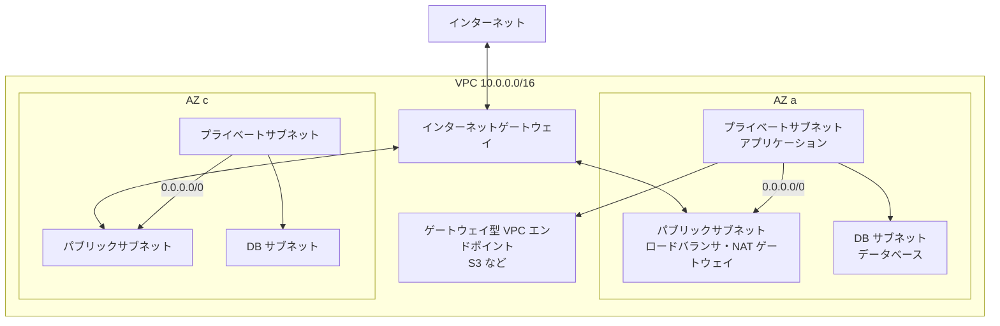

# 5.1 階層モデルとIP

> ブラウザで URL を開くと、あなたの PC が送り出したバイト列は、Wi-Fi・家庭のルータ・プロバイダ・いくつもの組織のネットワークをまたいでサーバーに届き、応答が返ってきます。途中の機器は、誰がどんなアプリケーションで通信しているかを知らないのに、なぜ正しく届くのでしょうか。この章では、ネットワークを「層」に分けて考える方法と、インターネットの土台である IP（アドレス・経路制御・MTU）を、バイト列とビット演算のレベルで理解します。

| 項目 | 内容 |
|---|---|
| 学習時間の目安 | 本文 4h ＋ 演習 5h |
| 前提となる章 | [1.1 情報の表現](../../01-computer-systems/01-data-representation/README.md)（2 進数・16 進数・ビット演算・エンディアン） |
| 演習 | [exercises/](exercises/)（Python） |
| キーワード | OSI 参照モデル, カプセル化, イーサネット, ARP, CIDR, 最長一致, BGP, NAT, IPv6, ICMP, MTU, 経路 MTU 探索, VPC |

## この章のゴール

- [ ] OSI 参照モデルと TCP/IP モデルの各層の役割を説明し、パケットのバイト列から各層のヘッダを読み取れる
- [ ] 同じネットワーク内への通信と別のネットワークへの通信で、ARP・スイッチ・ルータがそれぞれ何をしているかを説明できる
- [ ] CIDR 表記からネットワークアドレス・ブロードキャストアドレス・ホスト数を計算し、包含・重なり・集約を判定するコードを書ける
- [ ] 最長一致によるルーティングを実装し、BGP の経路ハイジャックや経路の取り下げが大規模障害につながる理由を説明できる
- [ ] NAT・IPv6・ICMP・MTU の仕組みを説明し、「小さい通信は通るのに大きい通信だけが止まる」障害を切り分けられる
- [ ] クラウドの VPC を、サブネット・ルートテーブル・NAT ゲートウェイ・将来の接続を見越した CIDR 計画として設計できる

## なぜ学ぶのか

IP は、ふだんは意識しなくても動いている層です。しかし、ここで起きる問題は影響範囲が大きく、しかも上の層からは原因が見えにくいという特徴があります。

- **経路のハイジャック**: 2008 年 2 月 24 日、政府の命令で国内から YouTube へのアクセスを遮断しようとした Pakistan Telecom が、YouTube のアドレスブロック 208.65.152.0/22 の一部である 208.65.153.0/24 への経路を自社網に向けて作りました。この経路が上流の PCCW を通じて世界に広告された結果、世界中の YouTube 宛ての通信の多くがパキスタンに吸い込まれ、約 2 時間にわたって YouTube に届かなくなりました（RIPE NCC の分析による）。ルータが「より長いプレフィックス（より具体的な経路）」を優先するという、この章で実装する規則そのものが被害を広げたのです。
- **経路の取り下げ**: 2021 年 10 月 4 日、Facebook（現 Meta）・Instagram・WhatsApp が約 6 時間にわたって世界中から使えなくなりました。Meta の公式エンジニアリングブログによると、バックボーンの保守作業中に実行したコマンドがデータセンター間の接続をすべて切断し、それを検知した自社の DNS サーバーが、BGP による自分への経路の広告を取り下げました。その結果、世界中から facebook.com などの名前を解決できなくなりました。社内のツールも同じネットワークに依存していたため、復旧作業そのものが難航しました。
- **MTU のブラックホール**: 「VPN 越しだと SSH にはログインできるのに、大きなファイルを表示すると固まる」「一部のサイトだけ HTTPS がタイムアウトする」。こうした症状の多くは、トンネルによって小さくなった MTU と、ICMP をすべて遮断したファイアウォールの組み合わせで起きます。原理を知らなければ、アプリケーションのバグを延々と探すことになります。
- **アドレス計画の失敗**: 環境ごと・チームごとにクラウドの VPC を作るとき、全員がチュートリアルどおり 10.0.0.0/16 を使うと、後で VPC 同士をつなごうとしたとき、あるいは買収した会社のネットワークと統合しようとしたときに、アドレスが重なって接続できません。アドレス計画は後から変えるのが極めて難しい「一方通行のドア」です。

## 1. なぜ階層に分けるのか

### 1.1 問題: 多様な媒体と多様なアプリケーション

通信には、光ファイバー・銅線・無線といった **物理的な媒体** と、Web・メール・動画配信・オンラインゲームといった **アプリケーション** があります。もしアプリケーションごとに「光ファイバーで送る方法」「Wi-Fi で送る方法」を個別に実装していたら、必要な実装は媒体の数 × アプリケーションの数だけになり、新しい媒体が登場するたびにすべてのアプリケーションを書き直すことになります。

**階層化（layering）** は、この問題を役割の分担で解きます。各層は下の層が提供するサービスだけを使い、上の層にサービスを提供します。層の間の約束事（インタフェース）さえ守れば、各層の中身は独立に置き換えられます。Wi-Fi が 5G に変わってもブラウザを書き直す必要はなく、HTTP/1.1 が HTTP/3 に変わってもルータは変わりません。

中心にあるのが **IP（Internet Protocol）** です。IP の上には TCP・UDP とさまざまなアプリケーションが、IP の下にはイーサネット・Wi-Fi・携帯電話網などさまざまなリンクがあり、IP だけがすべてに共通しています。この形は **砂時計モデル（hourglass model）** と呼ばれ、IP は砂時計の「くびれ」にあたります。くびれが 1 つだから、どんなアプリケーションでも、どんなリンクの上でも動くのです。

### 1.2 OSI 参照モデルと TCP/IP モデル

| OSI 参照モデル | TCP/IP モデル | 役割 | 代表的なプロトコル・機器 | データの単位 |
|---|---|---|---|---|
| 7 アプリケーション層 | アプリケーション層 | アプリケーション固有のやりとり | HTTP, DNS, SMTP, SSH | メッセージ |
| 6 プレゼンテーション層 | 〃 | データの表現・変換 | （TLS をここで説明することもある） | 〃 |
| 5 セッション層 | 〃 | 対話の管理 | — | 〃 |
| 4 トランスポート層 | トランスポート層 | プロセス間の通信・信頼性 | TCP, UDP, QUIC | セグメント（TCP）・データグラム（UDP） |
| 3 ネットワーク層 | インターネット層 | ネットワークをまたいだ配送（経路制御） | IP, ICMP, ルータ | パケット |
| 2 データリンク層 | リンク層 | 同じリンク上の隣の機器への配送 | イーサネット, Wi-Fi, ARP, スイッチ | フレーム |
| 1 物理層 | 〃 | ビットを信号として伝える | 光ファイバー, 銅線, 無線 | ビット |

**OSI 参照モデル** は ISO が 1980 年代に標準化した 7 層のモデルです。OSI のプロトコル群そのものは普及しませんでしたが、層の番号は **会話の共通語** として今も使われています。「L4 ロードバランサ」「L7 でルーティングする」「L2 で届いていない」の番号は OSI の層番号です。実際のインターネットは 4 層の **TCP/IP モデル**（RFC 1122）で作られており、OSI の 5〜7 層はアプリケーション層にまとめられています。TLS（[5.3](../03-dns-http-tls/README.md)）のように、どちらのモデルにもきれいに収まらないプロトコルもあります。モデルは現実を整理するための道具であって、現実がモデルに従うわけではありません。

### 1.3 カプセル化

送信側では、上の層から受け取ったデータの前に自分の層のヘッダを付けて、下の層に渡します。これを **カプセル化（encapsulation）** と呼びます。受信側では逆に、下の層から順にヘッダを外して上の層に渡します。



各層のヘッダには、受け取る側の **同じ層** に向けた情報が入っています。IP ヘッダは途中のルータと宛先ホストの IP 層が読み、TCP ヘッダは宛先ホストの TCP 層だけが読みます。途中のルータは原則として IP ヘッダまでしか見ません。だからルータは TCP やアプリケーションを知らなくても配送でき、新しいアプリケーションを作るのにルータを更新する必要がないのです。「通信の賢い処理は端（エンドポイント）で行い、途中のネットワークは単純に保つ」というこの設計思想は **エンドツーエンド原理（end-to-end principle）** と呼ばれます。

### 1.4 バイト列で見るカプセル化

実際に 1 つのフレームを組み立てて、バイト列として眺めてみましょう。192.0.2.10 のポート 50000 から 198.51.100.20 のポート 443（HTTPS）へ、TCP の接続を始める最初のパケット（SYN）です。アドレスは RFC 5737 で例示用に予約されたものです。

```python
import ipaddress
import struct

def checksum(data: bytes) -> int:            # インターネットチェックサム（演習5で実装します）
    if len(data) % 2:
        data += b"\0"
    s = sum(struct.unpack(f"!{len(data) // 2}H", data))
    while s >> 16:
        s = (s & 0xFFFF) + (s >> 16)
    return ~s & 0xFFFF

src_ip = ipaddress.IPv4Address("192.0.2.10").packed
dst_ip = ipaddress.IPv4Address("198.51.100.20").packed

# L4: TCP ヘッダ（SYN）。チェックサムは「疑似ヘッダ（IP アドレスなど）＋ TCP」に対して計算する
tcp = struct.pack("!HHIIBBHHH", 50000, 443, 0x12345678, 0, 5 << 4, 0x02, 64240, 0, 0)
pseudo = src_ip + dst_ip + struct.pack("!BBH", 0, 6, len(tcp))
tcp = tcp[:16] + struct.pack("!H", checksum(pseudo + tcp)) + tcp[18:]

# L3: IPv4 ヘッダ
ip = struct.pack("!BBHHHBBH4s4s", 0x45, 0, 20 + len(tcp), 0x1C46, 0x4000, 64, 6, 0, src_ip, dst_ip)
ip = ip[:10] + struct.pack("!H", checksum(ip)) + ip[12:]

# L2: イーサネットヘッダ（宛先 MAC, 送信元 MAC, EtherType 0x0800 = IPv4）
eth = bytes.fromhex("020000000002") + bytes.fromhex("020000000001") + struct.pack("!H", 0x0800)

frame = eth + ip + tcp
print(len(frame), "bytes")
for name, part in (("Ethernet", eth), ("IPv4", ip), ("TCP", tcp)):
    print(f"{name:8s} {part.hex(' ')}")
```

```text
54 bytes
Ethernet 02 00 00 00 00 02 02 00 00 00 00 01 08 00
IPv4     45 00 00 28 1c 46 40 00 40 06 32 38 c0 00 02 0a c6 33 64 14
TCP      c3 50 01 bb 12 34 56 78 00 00 00 00 50 02 fa f0 9a e7 00 00
```

各バイトの意味を並べると次のようになります（数値はすべてビッグエンディアン＝ネットワークバイトオーダーです。[1.1](../../01-computer-systems/01-data-representation/README.md) 参照）。

```text
オフセット 層        バイト列        意味
0x00       Ethernet  02 00 00 00 00 02  宛先 MAC アドレス
0x06                 02 00 00 00 00 01  送信元 MAC アドレス
0x0c                 08 00              EtherType: 0x0800 = 中身は IPv4（0x86DD なら IPv6、0x0806 なら ARP）
0x0e       IPv4      45                 バージョン 4、ヘッダ長 5 × 4 = 20 バイト
0x0f                 00                 DSCP / ECN（優先制御・輻輳通知）
0x10                 00 28              全長 40 バイト（IP ヘッダ 20 ＋ TCP ヘッダ 20）
0x12                 1c 46              識別子（フラグメンテーションで使う）
0x14                 40 00              フラグ DF（分割禁止）、断片オフセット 0
0x16                 40                 TTL 64（ルータを 1 つ通るごとに 1 減る）
0x17                 06                 プロトコル: 6 = TCP（17 なら UDP、1 なら ICMP）
0x18                 32 38              ヘッダチェックサム
0x1a                 c0 00 02 0a        送信元 IP 192.0.2.10
0x1e                 c6 33 64 14        宛先 IP 198.51.100.20
0x22       TCP       c3 50              送信元ポート 50000
0x24                 01 bb              宛先ポート 443
0x26                 12 34 56 78        シーケンス番号
0x2a                 00 00 00 00        確認応答番号
0x2e                 50                 ヘッダ長 5 × 4 = 20 バイト
0x2f                 02                 フラグ: SYN
0x30                 fa f0              ウィンドウサイズ 64240
0x32                 9a e7              チェックサム
0x34                 00 00              緊急ポインタ
```

ここから読み取ってほしいことが 3 つあります。

1. **各ヘッダは「次に何が入っているか」を示している**。EtherType が 0x0800 だから中身を IPv4 として読み、IPv4 のプロトコル番号が 6 だから TCP として読み、TCP の宛先ポートが 443 だから HTTPS のサーバープロセスに渡す。受信側はこの連鎖をたどってデータを正しい処理に振り分けます（**多重化の解除（demultiplexing）**）。
2. **ヘッダのコストは無視できない**。ヘッダだけで 54 バイトあり、実際の SYN にはさらに TCP のオプション（MSS など、[5.2](../02-tcp-and-udp/README.md) で扱います）が付きます。イーサネットの 1 フレームに載せられる IP パケットは最大 1500 バイト（**MTU**）なので、TCP のデータは最大 1460 バイトです。ケーブル上では、1500 バイトの IP パケットにイーサネットヘッダ・FCS・プリアンブル・フレーム間隔の計 38 バイトが加わるので、データの割合は 1460 ÷ 1538 ≈ 95% になります。
3. **例外もある**。TCP のチェックサムは、TCP ヘッダだけでなく IP アドレスを含む「疑似ヘッダ」も対象にしています。そのため、IP アドレスを書き換える NAT（本章の 5 節）は TCP のチェックサムも計算し直さなければなりません。層は完全には独立していないのです。

### 1.5 階層化の限界

実際のネットワークには、層の約束を破って上の層をのぞき込む機器がたくさんあります。NAT は TCP・UDP のポート番号を書き換え、ファイアウォールはポート番号で通信を止め、L7 ロードバランサは HTTP の中身で振り分けます。こうした **ミドルボックス（middlebox）** が「知っている形」以外のパケットを落とすようになった結果、インターネットでは新しいトランスポートプロトコルを普及させることがほぼ不可能になりました（**硬直化（ossification）** と呼ばれます）。HTTP/3 の土台である QUIC が、TCP の代わりに UDP の上に作られ、しかもヘッダの大部分を暗号化しているのは、この問題を避けるためです（[5.2](../02-tcp-and-udp/README.md)）。

## 2. リンク層: イーサネット・ARP・スイッチとルータ

### 2.1 イーサネットと MAC アドレス

**イーサネット（Ethernet）** は、有線 LAN の事実上の標準です（Wi-Fi のフレーム形式は異なりますが、上位から見たアドレスの仕組みはほぼ同じです）。フレームは宛先 MAC アドレス・送信元 MAC アドレス・EtherType・データ（46〜1500 バイト）・**FCS（Frame Check Sequence、CRC-32 による誤り検出）** からなります。FCS が合わないフレームは黙って捨てられ、イーサネット自身は再送しません。失われたデータの回復は上の層（TCP）の仕事です。

**MAC アドレス** は 48 ビットの識別子で、`00:1a:2b:3c:4d:5e` のように 16 進数で書きます。上位 24 ビットはメーカーを表す OUI です。すべてのビットが 1 の `ff:ff:ff:ff:ff:ff` は **ブロードキャスト**（同じリンク上の全員宛て）です。最初のオクテットの下から 2 ビット目が 1 のアドレスは「ローカル管理」で、仮想マシンのネットワークインタフェースや、プライバシー保護のために Wi-Fi ごとに MAC アドレスをランダムにするスマートフォンなどで使われます（前節の例の `02:...` もこれです）。

重要なのは、**MAC アドレスは同じリンクの中でしか意味を持たない** ことです。インターネットの反対側にいるサーバーの MAC アドレスを、あなたの PC が知る必要はありませんし、知る方法もありません。

### 2.2 ARP — IP アドレスから MAC アドレスを調べる

IP 層が「192.168.1.1 に送れ」と決めても、イーサネットでフレームを送るには相手の MAC アドレスが必要です。この対応を調べるのが **ARP（Address Resolution Protocol、RFC 826）** です。



ARP には実務上のポイントがいくつかあります。

- **キャッシュ**: 結果は ARP テーブルに一定時間保存されます。IP アドレスを別の機器に付け替えたのに古い MAC アドレスへ送られ続けるのは、このキャッシュが原因です。冗長構成で仮想 IP アドレスを引き継ぐときは、新しい持ち主が **Gratuitous ARP**（聞かれてもいないのに自分の対応を全員に知らせる ARP）を送って、周囲のキャッシュを更新させます。
- **認証がない**: ARP の応答は誰でも送れるので、同じ LAN にいる攻撃者は「ルータの IP は私の MAC です」と偽って通信を横取りできます（**ARP スプーフィング**）。スイッチの防御機能もありますが、根本的な対策は通信を TLS などで暗号化・認証することです（[5.3](../03-dns-http-tls/README.md)）。
- **IPv6 では NDP**: IPv6 では ARP の代わりに、ICMPv6 のマルチキャストを使う **近隣探索（NDP、Neighbor Discovery Protocol）** が同じ役割を果たします。
- **クラウドでは仮想化基盤が応答する**: 主要なクラウドの VPC では、ARP は仮想ネットワークの基盤が代理で応答し、ブロードキャストやマルチキャストは基本的に使えません。オンプレミスの「Gratuitous ARP で仮想 IP を引き継ぐ」冗長化方式はそのままでは動かないので、クラウドの API（ルートテーブルの書き換えなど）やロードバランサで置き換えます。

### 2.3 スイッチとルータ

| | スイッチ（L2） | ルータ（L3） |
|---|---|---|
| 転送の判断に使うもの | 宛先 MAC アドレス | 宛先 IP アドレス |
| 転送表の作り方 | 受信したフレームの **送信元** MAC を見て「この MAC はこのポートの先にいる」と自動で学習する | ルーティングテーブル（手で設定した経路や、ルーティングプロトコルで学んだ経路） |
| 宛先が表にないとき | 全ポートに送る（フラッディング） | デフォルトルートへ送る。それもなければ破棄し、ICMP で送信元に通知する |
| ブロードキャスト | 転送する（同じ **ブロードキャストドメイン**） | 転送しない（ブロードキャストドメインを区切る） |
| パケットの書き換え | しない | L2 ヘッダを付け替え、TTL を 1 減らし、IP ヘッダのチェックサムを計算し直す |

PC からインターネット上のサーバーへパケットが届くまでに、何が変わり、何が変わらないかを追ってみましょう（NAT は 5 節で扱うので、ここでは無視します）。

| 区間 | 送信元 MAC | 宛先 MAC | 送信元 IP | 宛先 IP | TTL |
|---|---|---|---|---|---|
| PC → ルータ A | PC | ルータ A | 192.0.2.10 | 203.0.113.80 | 64 |
| ルータ A → ルータ B | ルータ A | ルータ B | 192.0.2.10 | 203.0.113.80 | 63 |
| ルータ B → サーバー | ルータ B | サーバー | 192.0.2.10 | 203.0.113.80 | 62 |

**IP アドレスは端から端まで変わらず（エンドツーエンドの宛先）、MAC アドレスは区間ごとに付け替わります（次の 1 ホップの宛先）**。この 2 つのアドレスの役割分担が、IP ネットワークを理解する鍵です。

では、PC はどうやって「相手に直接送るか、ルータに託すか」を決めるのでしょうか。自分の IP アドレスとネットマスク（次節）から「相手が同じサブネットにいるか」を計算し、同じなら相手自身の MAC アドレスを ARP で調べて直接送ります。違えば **デフォルトゲートウェイ**（通常は LAN のルータ）の MAC アドレスを ARP で調べ、宛先 IP アドレスはそのままでルータ宛てのフレームにして送ります。

## 3. IPv4 アドレスと CIDR

### 3.1 アドレスとネットマスク

**IPv4 アドレス** は 32 ビットの数で、8 ビットずつ 10 進数にしてドットで区切って書きます（ドット付き 10 進表記）。アドレスは上位の **ネットワーク部** と下位の **ホスト部** に分かれ、その境界を **プレフィックス長**（`/24` など）または **ネットマスク**（上位のネットワーク部が 1、下位が 0 のビット列。`/24` なら 255.255.255.0）で示します。この表記法を **CIDR（Classless Inter-Domain Routing、サイダー）** 表記と呼びます。

計算はすべてビット演算です。

```python
addr = (192 << 24) | (168 << 16) | (1 << 8) | 10   # 192.168.1.10
mask = (0xFFFFFFFF << (32 - 24)) & 0xFFFFFFFF      # /24 → 255.255.255.0
network = addr & mask                              # ホスト部を 0 にする
broadcast = network | (~mask & 0xFFFFFFFF)         # ホスト部を 1 にする
print(hex(addr), hex(mask), hex(network), hex(broadcast))
# 0xc0a8010a 0xffffff00 0xc0a80100 0xc0a801ff
```

ホスト部がすべて 0 の **ネットワークアドレス** と、すべて 1 の **ブロードキャストアドレス** はホストに割り当てないので、/24 で使えるホストは 2⁸ − 2 = 254 台です。例外として、2 台しかいない点対点のリンクには /31 を使ってよく（RFC 3021）、/32 は単一のホストを表します。

### 3.2 クラスフルアドレスから CIDR へ

初期のインターネットでは、アドレスの先頭のビットで大きさが決まる **クラス** がありました（クラス A = /8、B = /16、C = /24）。2,000 台のホストが必要な組織には、C（254 台）では足りないので B（65,534 台）を割り当てるしかなく、膨大な無駄が生じました。また、組織ごとの経路がインターネットのルータに並び、経路表が爆発的に増えました。

1993 年に導入された CIDR（現在の仕様は RFC 4632）は、任意の長さのプレフィックスを許すことで、この 2 つを解決しました。

- **必要な大きさだけ割り当てる**: 2,000 台なら /21（2,046 台）。
- **経路集約（route aggregation）**: 連続した 4 つの /24（例: 10.20.0.0/24 〜 10.20.3.0/24）は、ほかのネットワークには 10.20.0.0/22 という 1 つの経路で知らせれば済む。インターネットでも、プロバイダは顧客に割り当てたブロックをまとめて広告できるので、経路表が小さくなる。

### 3.3 計算してみる

172.16.77.200/21 について、ネットワークアドレス・ブロードキャストアドレス・ホスト数を求めます。/21 は第 3 オクテットの途中で境界が来るので、そこを 2 進数で見ます。

```text
アドレス       172.16.77.200   第 3 オクテット  77 = 0100 1101
ネットマスク   255.255.248.0   第 3 オクテット 248 = 1111 1000   （上位 16 + 5 = 21 ビットが 1）
AND                                                  0100 1000 = 72
ネットワーク       172.16.72.0/21
ブロードキャスト   172.16.79.255   （ホスト部 11 ビットをすべて 1: 0100 1111 = 79）
ホスト数           2^11 − 2 = 2046  （172.16.72.1 〜 172.16.79.254）
```

慣れてきたら「ブロックの大きさ」で暗算できます。/21 は第 3 オクテットで 2^(24−21) = 8 ずつのブロックになるので、77 を含む 8 の倍数の区間は 72〜79 です。

CIDR ブロックには、もう 1 つ大切な性質があります。**2 つの CIDR ブロックは「一方が他方を含む」か「まったく重ならない」かのどちらかで、部分的に重なることはありません**。ブロックの大きさが 2 のべき乗で、先頭がその大きさの倍数にそろっているからです。重なりの判定や集約のアルゴリズムは、この性質で単純になります（演習 2）。

### 3.4 特別な用途のアドレス

| 範囲 | 用途 | 規定 |
|---|---|---|
| 10.0.0.0/8, 172.16.0.0/12, 192.168.0.0/16 | **プライベートアドレス**。組織内で自由に使えるが、インターネット上では経路が広告されない | RFC 1918 |
| 100.64.0.0/10 | プロバイダの大規模 NAT（CGN）用の共有アドレス | RFC 6598 |
| 127.0.0.0/8 | **ループバック**。自分自身を指す（127.0.0.1 = localhost） | RFC 1122 |
| 169.254.0.0/16 | **リンクローカル**。DHCP でアドレスを得られなかったときの自動割り当てなど。ルータは転送しない | RFC 3927 |
| 0.0.0.0/8 | 「このネットワーク」。0.0.0.0 は「アドレス未定」や、サーバーの「すべてのインタフェースで待ち受ける」指定に使われる | RFC 1122 |
| 224.0.0.0/4 | マルチキャスト | RFC 5771 |
| 255.255.255.255 | 同じリンク全体へのブロードキャスト | RFC 919 |
| 192.0.2.0/24, 198.51.100.0/24, 203.0.113.0/24 | 文書・例示用（本章の例でも使っています） | RFC 5737 |

これらは IANA の特別用途アドレスのレジストリ（RFC 6890 で規定）にまとめられています。よくある誤解が 2 つあります。172.16.0.0/12 は 172.16.x.x だけでなく **172.16.0.0 〜 172.31.255.255** の範囲です。逆に 172.32.0.0 はプライベートではありません。

**169.254.169.254** は特に重要です。AWS・Google Cloud・Azure などのクラウドは、仮想マシンの中から自分の設定や **一時的な認証情報** を取得するための **メタデータエンドポイント** としてこのアドレスを使っています。サーバー上のアプリケーションに「指定された URL の内容を取得する」機能があり、攻撃者が `http://169.254.169.254/...` を指定できると、サーバーの権限で認証情報を盗まれます。この攻撃を **SSRF（Server-Side Request Forgery）** と呼び、2019 年の Capital One の大規模な情報漏えいでも、この手口でクラウドの認証情報が取得されたと広く分析されています。AWS は同年、トークンの取得に PUT リクエストを必要とする IMDSv2 を導入し、単純な SSRF では認証情報を取得しにくくしました。詳しくは [11.4 Webアプリケーションセキュリティ](../../11-security/04-web-security/README.md) で扱います。

### 3.5 Python で計算する

演習ではビット演算の理解のために自分で実装しますが、実務では標準ライブラリの `ipaddress` を使います。

```python
import ipaddress
net = ipaddress.ip_network("10.0.0.0/22")
print(net.netmask, net.broadcast_address, net.num_addresses)
# 255.255.252.0 10.0.3.255 1024
print(list(net.subnets(new_prefix=24)))
# [IPv4Network('10.0.0.0/24'), IPv4Network('10.0.1.0/24'), IPv4Network('10.0.2.0/24'), IPv4Network('10.0.3.0/24')]
print(ipaddress.ip_address("10.0.3.7") in net)                                              # True
print(ipaddress.ip_network("10.0.0.0/16").overlaps(ipaddress.ip_network("10.0.128.0/20")))  # True
```

アドレスの文字列を自前の正規表現や古い C の関数で解釈するのは危険です。C の `inet_aton` は先頭に 0 のある数を 8 進数と解釈し、省略形も受け付けます。

```python
import socket, ipaddress
socket.inet_aton("0177.0.0.1")   # b'\x7f\x00\x00\x01'  → 127.0.0.1 と解釈される！
socket.inet_aton("127.1")        # b'\x7f\x00\x00\x01'  → これも 127.0.0.1
ipaddress.ip_address("0177.0.0.1")
# ValueError: '0177.0.0.1' does not appear to be an IPv4 or IPv6 address
```

「127.0.0.1 へのアクセスは禁止」という検査を文字列比較で行うと、`0177.0.0.1` や `127.1` ですり抜けられます。Python の `ipaddress` も、先頭の 0 を受け付けていた問題が脆弱性（CVE-2021-29921）として修正され、Python 3.9.5 以降は拒否するようになりました。**アドレスは厳格なパーサで数値に変換してから比較する** のが鉄則です。

## 4. ルーティング

### 4.1 ルーティングテーブルと最長一致

ルータもホストも、**ルーティングテーブル（経路表）** を持っています。経路表の各行は「宛先のプレフィックス → 次に渡す相手（次ホップ）」です。宛先に一致する行が複数あるときは、**プレフィックスが最も長い（最も具体的な）行を選びます**。これを **最長一致（longest prefix match）** と呼びます。0.0.0.0/0 はすべてのアドレスに一致する長さ 0 のプレフィックスなので、ほかに何も一致しなかったときだけ使われます。これが **デフォルトルート** です。

```python
import ipaddress

routes = {
    "0.0.0.0/0": "ISP（デフォルトルート）",
    "10.0.0.0/8": "社内 VPN",
    "10.1.0.0/16": "東京オフィス",
    "10.1.2.0/24": "東京の DB セグメント",
}

def lookup(dst: str) -> tuple[str, str]:
    ip = ipaddress.ip_address(dst)
    matches = [ipaddress.ip_network(c) for c in routes if ip in ipaddress.ip_network(c)]
    best = max(matches, key=lambda n: n.prefixlen)   # 最も長いプレフィックスを選ぶ
    return str(best), routes[str(best)]

for dst in ["10.1.2.3", "10.1.9.9", "10.200.0.1", "8.8.8.8"]:
    print(f"{dst:11s} → {lookup(dst)}")
```

```text
10.1.2.3    → ('10.1.2.0/24', '東京の DB セグメント')
10.1.9.9    → ('10.1.0.0/16', '東京オフィス')
10.200.0.1  → ('10.0.0.0/8', '社内 VPN')
8.8.8.8     → ('0.0.0.0/0', 'ISP（デフォルトルート）')
```

このコードは全経路をなめるので、経路が 100 万あると 1 パケットごとに 100 万回の比較が必要です。実際のルータは、専用のハードウェア（TCAM）や、プレフィックスを 2 分木にしたトライ構造（Linux カーネルは LC-trie という圧縮トライを使います）で、毎秒何億回もの検索をこなしています。演習 3 では、プレフィックス長ごとのハッシュ表を長い順に引く方法で実装します。

### 4.2 ホストの経路表とデフォルトゲートウェイ

Linux では `ip route` で自分の経路表を確認できます（出力例。環境によって異なります）。

```text
$ ip route
default via 192.168.1.1 dev wlan0 proto dhcp src 192.168.1.23 metric 600
192.168.1.0/24 dev wlan0 proto kernel scope link src 192.168.1.23 metric 600

$ ip route get 8.8.8.8
8.8.8.8 via 192.168.1.1 dev wlan0 src 192.168.1.23 uid 1000
    cache
```

1 行目がデフォルトルート（`via 192.168.1.1` = デフォルトゲートウェイに渡す）、2 行目が「192.168.1.0/24 はこのインタフェースに直接つながっている（`scope link`）」という経路です。宛先がこの /24 に入っていれば相手の MAC アドレスを直接 ARP で調べ、そうでなければゲートウェイの MAC アドレスを調べます。`ip route get` は、ある宛先に対して実際にどの経路が選ばれるかを教えてくれる、トラブルシューティングで便利なコマンドです。

ネットマスクを間違えると、この判断が狂います。例えば本当は /24 なのに /16 と設定すると、192.168.5.9 のような「実際にはルータの向こうにいる」相手も直接つながっていると判断して ARP を送り、誰も応答しないので通信できません。

### 4.3 経路はどう作られるか

経路表の行は、管理者が手で書く **静的経路（static route）** か、ルータ同士が情報を交換して自動で作る **動的経路** のどちらかです。

- **組織の内側（IGP、Interior Gateway Protocol）**: OSPF や IS-IS は、各ルータがリンクの状態をネットワーク全体に知らせ合い、全員が同じ地図を持ったうえで、最短経路をダイクストラ法（[2.5](../../02-math-and-algorithms/05-trees-heaps-graphs/README.md)）で計算します。目的は「速く・確実に届けること」です。
- **組織の間（EGP、Exterior Gateway Protocol）**: インターネットは、独立に運用される多数の **AS（Autonomous System、自律システム）** の集まりです。プロバイダ・大企業・クラウド事業者などがそれぞれ AS 番号を持ち、AS の間の経路は **BGP（Border Gateway Protocol）** で交換します。

経路を計算して経路表を作る仕組みを **コントロールプレーン**、経路表に従って実際にパケットを転送する仕組みを **データプレーン** と呼びます。この区別は、ネットワーク機器・クラウドの仮想ネットワーク・Kubernetes（[10.2](../../10-cloud-and-sre/02-containers-and-kubernetes/README.md)）の設計を理解するうえで繰り返し現れます。

### 4.4 BGP — インターネットの経路制御

BGP（現行は BGP-4、RFC 4271）は、TCP のポート 179 で隣の AS のルータとセッションを張り、「このプレフィックスには、この AS の列（AS パス）を通って届く」という情報を交換します。

```text
AS 64500 が 203.0.113.0/24 を広告する
  → 隣の AS 64501 は「203.0.113.0/24: AS パス [64500]」を受け取り、自分を先頭に足して広告
  → その隣の AS 64502 は「203.0.113.0/24: AS パス [64501, 64500]」を受け取る
自分の AS 番号がすでに AS パスに含まれる経路は、ループになるので受け取らない
```

（AS 番号 64496〜64511 は例示用に予約されています。RFC 5398）

BGP の経路選択は「最短」や「最速」ではなく、**ポリシー（商取引の関係）** で決まるのが特徴です。お金を払ってくれる顧客 AS からの経路を、対等に接続しているピア AS やお金を払っている上流のプロバイダからの経路より優先するのが一般的です。インターネットの IPv4 の経路表（デフォルトルートを持たないルータが保持する全経路）は、2026年時点で 100 万経路を超えています（最新の値は CIDR Report や、APNIC の Geoff Huston による年次の BGP の分析などで確認してください）。

そして BGP には、**ある AS がそのプレフィックスを広告する権利を持っているかを検証する仕組みが、プロトコル自体にはありません**。誰かが誤って、あるいは悪意を持って他人のプレフィックスを広告すると、それを信じたルータが通信をそちらへ送ってしまいます。対策として、上流のプロバイダが顧客の広告をフィルタするほか、アドレスの持ち主が「このプレフィックスを広告してよいのはこの AS だけ」という電子署名付きの証明（ROA）を登録し、ルータがそれと矛盾する経路を捨てる **RPKI による経路の起点検証（ROV、RFC 6811）** の導入が進んでいます。ただし ROV が検証するのは起点の AS だけで、AS パスの途中の偽装までは防げません。

### 4.5 事故から学ぶ

**2008 年の YouTube のハイジャック**（RIPE NCC の分析による）: 冒頭で紹介した事故を、最長一致の観点で見直してみましょう。



```python
import ipaddress
youtube = ipaddress.ip_network("208.65.152.0/22")   # YouTube が広告していた経路
hijack = ipaddress.ip_network("208.65.153.0/24")    # Pakistan Telecom が広告してしまった経路
print(hijack.subnet_of(youtube))                    # True
```

世界中のルータには /22（YouTube）と /24（Pakistan Telecom）の両方が届きましたが、208.65.153.x 宛てのパケットには、より長い /24 が一致します。**経路表の規則どおりに動いた結果、世界中の通信が吸い込まれた** のです。YouTube 側も同じ /24 や、さらに長いプレフィックスを広告して通信を取り戻そうとし、最終的に PCCW が問題の経路の伝搬を止めて収束しました。上流の PCCW が顧客の広告を適切にフィルタしていれば、影響はパキスタン国内にとどまっていたと考えられます。

**2021 年の Facebook の障害**（Meta の公式エンジニアリングブログによる）: Meta の DNS サーバーは、データセンターと通信できなくなると「自分は不健全だ」と判断して BGP の広告を取り下げ、通信がほかの健全な拠点に向かうように設計されていました。個々の拠点の故障には正しく働くこの安全装置が、バックボーン全体が切断されたときには **すべての拠点で同時に** 働き、DNS サーバーへの経路がインターネットから消えました。さらに、通常の経路でも帯域外（out-of-band）の管理回線でもデータセンターに接続できず、DNS の喪失で社内の調査用ツールの多くも使えなくなっていました。エンジニアがデータセンターに物理的に赴いて作業する必要があり（施設は厳重な物理セキュリティで守られています）、復旧に約 6 時間を要しました。

**2017 年の日本の大規模障害**: 2017 年 8 月 25 日には、Google が本来外部に広告すべきでない経路情報を誤って広告した（**経路リーク**）ことが引き金となり、OCN をはじめとする日本国内の多くの利用者で大規模な接続障害が起きたと報じられています。

これらの事故の教訓は次のとおりです。

- **BGP は信頼で成り立っている**。自社のプレフィックスについて ROA を登録し、上流・ピアとの間でフィルタを設定する。
- **自動化された安全装置は、全体障害のときに同時に作動して被害を広げることがある**。「全拠点が同時に不健全と判断したら何が起きるか」を設計時に問う。
- **復旧手段は本番のネットワークから独立させる**。帯域外（out-of-band）の管理回線や、非常時用のアクセス手順を用意し、訓練しておく。

## 5. NAT と IPv6

### 5.1 IPv4 アドレスの枯渇

IPv4 のアドレスは 2³² ≈ 43 億個しかありません。世界のアドレスを管理する IANA の未割り当ての在庫は 2011 年 2 月に尽き、日本を含むアジア太平洋地域を担当する APNIC も同年 4 月に最後の /8 ブロックの分配段階に入りました。現在、IPv4 アドレスは組織間で売買される資源になっており、AWS も 2024 年 2 月から、使用中かどうかにかかわらずパブリック IPv4 アドレスに時間単位の料金をかけるようになりました（自社のアドレスを持ち込む BYOIP などは対象外。2026年時点の料金と条件は公式の料金表で確認してください）。

この不足への対処が、NAT（延命策）と IPv6（根本策）です。

### 5.2 NAT と NAPT

**NAT（Network Address Translation）** は、ルータがパケットの IP アドレスを書き換える技術です。家庭やオフィスでは、プライベートアドレスを持つ多数の機器が、1 つのグローバルアドレスを共有してインターネットに出ます。1 つのアドレスを共有するにはポート番号も書き換える必要があり、これを **NAPT（Network Address Port Translation）**、または IP マスカレードと呼びます。

NAPT のルータは、次のような **変換表** を持ちます。

| 内側（送信元） | 外側（変換後の送信元） | 通信相手 |
|---|---|---|
| 192.168.1.23:50001 | 198.51.100.5:40001 | 203.0.113.80:443 |
| 192.168.1.24:50001 | 198.51.100.5:40002 | 203.0.113.80:443 |

外向きのパケットは送信元を書き換えて表に記録し、戻ってきたパケット（宛先 198.51.100.5:40002）は表を引いて 192.168.1.24:50001 に書き戻します。この仕組みから、実務上重要な性質がいくつも導かれます。

- **外から内へは接続を始められない**。表に行がないので、戻し先が分かりません。内側でサーバーを公開するにはポートフォワーディングの設定が必要で、P2P 通信（ビデオ通話の WebRTC など）には STUN・TURN といった NAT 越えの技術が必要になります。
- **NAT はセキュリティ機能ではない**。結果的に外からの接続を防いでいますが、それは副作用です。アクセス制御はファイアウォールで明示的に行います。
- **変換表の行には寿命がある**。しばらく通信のない TCP 接続の行は消され、その後のパケットは届かなくなります。長時間つなぎっぱなしの接続が「ある日突然切れる」原因の多くはこれで、キープアライブで対処します（[5.2](../02-tcp-and-udp/README.md)）。
- **ポートは有限**。1 つの外側アドレスから同じ宛先（IP アドレスとポート）へ同時に張れる接続は、ポート番号の数（最大でも 6 万程度）で頭打ちになります。特定の API やデータベースへ大量の接続を張るシステムでは、NAT のポートが枯渇します。例えば AWS の NAT ゲートウェイには、同じ宛先（IP アドレス・ポート・プロトコルの組）への同時接続数に上限があります（2026年時点のドキュメントでは、NAT ゲートウェイの IPv4 アドレス 1 つあたり 55,000 で、アドレスを追加すると増やせる。最新の値は公式ドキュメントで確認してください）。
- **ログにはポート番号と時刻が必要**。多数の利用者が同じアドレスを共有するので、「この IP アドレスからの不正アクセス」だけでは利用者を特定できません。不正アクセスの調査や捜査機関への対応に備え、NAT を運用する側は変換のログを残す必要があります。

プロバイダ自身が加入者をまとめて NAT する **CGN（Carrier-Grade NAT）** も広く使われており、その内側では 100.64.0.0/10 のアドレスが使われます。

### 5.3 IPv6

**IPv6**（現行の仕様は RFC 8200）はアドレスを 128 ビットに拡張したプロトコルです。2¹²⁸ ≈ 3.4 × 10³⁸ 個のアドレスがあり、枯渇の心配はほぼありません。

アドレスは 16 ビットずつ 16 進数で区切って書き、先頭の 0 と、連続する 0 のグループ（1 か所だけ）を `::` で省略できます。表記の揺れは比較のミスにつながるので、RFC 5952 が「小文字・最長の 0 の連続を省略」という正規形を定めています。

```python
import ipaddress
a = ipaddress.ip_address("2001:0db8:0000:0000:0000:ff00:0042:8329")
print(a)            # 2001:db8::ff00:42:8329                     （正規形）
print(a.exploded)   # 2001:0db8:0000:0000:0000:ff00:0042:8329    （省略しない形）
print(ipaddress.ip_network("2001:db8:1234:5678::/64").num_addresses == 2**64)   # True
```

（2001:db8::/32 は例示用のアドレスです。）IPv4 との主な違いは次のとおりです。

| 項目 | IPv4 | IPv6 |
|---|---|---|
| アドレス長 | 32 ビット | 128 ビット |
| サブネットの大きさ | 用途に応じて /24 など | 原則 **/64**（下位 64 ビットをホストが自動生成する SLAAC などのため）。拠点には /48 や /56 がまとめて割り当てられることが多い |
| ヘッダ | 可変長（20〜60 バイト）、チェックサムあり | 固定 40 バイト、**チェックサムなし**（リンク層と TCP・UDP に任せる）、拡張ヘッダで機能を追加 |
| ルータによる分割 | あり | **なし**（送信元だけが分割できる。最小 MTU は 1280 バイト） |
| アドレス解決 | ARP（ブロードキャスト） | NDP（ICMPv6 のマルチキャスト）。ブロードキャストは存在しない |
| NAT | 必須に近い | 原則不要（ただし外からの接続を防ぐファイアウォールは必要） |
| 主な特別アドレス | 前掲の表 | ::1（ループバック）、fe80::/10（リンクローカル）、fc00::/7（ユニークローカル。プライベートアドレスに相当） |

IPv4 から IPv6 への移行は、両方を同時に使う **デュアルスタック** で進んでいます。クライアントは IPv6 を優先して接続を試み、短い時間（数百ミリ秒）のうちにつながらなければ IPv4 でも並行して試して、先につながった方を使います。この **Happy Eyeballs**（RFC 8305）によって、IPv6 の経路に問題があっても利用者に大きな遅延を感じさせないようにしています。Google が公開している統計では、2026年時点で Google への IPv6 でのアクセスの割合はおよそ 5 割に達しており、2026 年 3 月には初めて 50% を超える日がありました（測る事業者によって値は異なります。最新の値は同統計で確認してください）。日本では、NTT 東西のフレッツ網で PPPoE 方式の混雑を避けるために、IPv6 の IPoE 方式（IPv4 は IPv6 の上に載せて運ぶ方式を併用）が広く普及しました。

## 6. ICMP・traceroute・MTU

### 6.1 ICMP と ping

**ICMP（Internet Control Message Protocol）** は、IP の配送で起きたことを送信元に知らせるためのプロトコルです。IP パケットの中に入って運ばれますが、TCP や UDP と違ってポート番号を持たず、IP 層の一部として扱われます。

| タイプ | 名前 | 使われる場面 |
|---|---|---|
| 8 / 0 | Echo Request / Echo Reply | `ping` |
| 3 | Destination Unreachable | 宛先に届けられない。コード 3 はポート到達不能、**コード 4 は「分割が必要だが DF が立っている」**（6.4 節） |
| 11 | Time Exceeded | TTL が 0 になった（`traceroute` が利用） |

`ping` は Echo Request を送り、Echo Reply が返るまでの往復時間（RTT）を測ります。ただし、ICMP を遮断しているネットワークは多く（例えば AWS のセキュリティグループは、既定では外から始まる通信を ICMP も含めて許可しません）、**ping が返らないことは、ホストが止まっていることを意味しません**。

### 6.2 traceroute の仕組み

`traceroute` は、TTL を 1, 2, 3, … と増やしながらパケットを送ります。TTL はルータを通るたびに 1 減り、0 になったルータはパケットを捨てて ICMP の Time Exceeded を送信元に返すので、その送信元アドレスから「n 番目のルータ」が分かります。Linux の `traceroute` は既定で高い番号の UDP ポート宛てのパケットを使い、最終的に宛先に届くと「ポート到達不能」が返ってきて終了します（Windows の `tracert` は ICMP の Echo Request を使います）。



出力例（アドレスは例示用のものに置き換えています）:

```text
$ traceroute -n www.example.com
traceroute to www.example.com (203.0.113.80), 30 hops max, 60 byte packets
 1  192.168.1.1  0.521 ms  0.463 ms  0.448 ms
 2  198.51.100.1  4.912 ms  4.874 ms  5.033 ms
 3  * * *
 4  198.51.100.77  9.845 ms  9.720 ms  9.802 ms
 5  203.0.113.80  10.622 ms  10.590 ms  10.611 ms
```

traceroute の結果を読むときは、次の点に注意します。

- **`* * *` は障害とは限らない**。そのルータが ICMP を返さない設定になっているだけのことが多い。後ろのホップに届いていれば問題ありません。
- **途中のホップだけ遅いのは多くの場合無害**。ルータは転送処理を優先し、ICMP の生成は後回しにしたり、回数を制限したりします。遅延の増加が最後のホップまで続いているかを見ます。
- **往路と復路は同じとは限らない**。見えているのは往路の経路だけです。
- 経路が複数に分散されている（ECMP）と、プローブごとに別の経路を通ることがあります。`mtr` は traceroute と ping を組み合わせて継続的に測るので、損失の場所を探すのに便利です。

### 6.3 MTU とフラグメンテーション

リンクが一度に運べる IP パケットの最大サイズを **MTU（Maximum Transmission Unit）** と呼びます。イーサネットの標準は 1500 バイトです。MTU より大きな IPv4 パケットは、途中のルータで **分割（フラグメンテーション）** できます。分割された断片は、それぞれが IP ヘッダを持つ独立したパケットとして送られ、宛先で元に戻されます（再構成）。IP ヘッダの識別子・MF（More Fragments）フラグ・断片オフセット（8 バイト単位）がそのための情報です。

```text
元のパケット: IP ヘッダ 20 ＋ データ 3980 バイト（全長 4000、識別子 4242）を MTU 1500 のリンクへ
  断片 1: IP 20 ＋ データ    0〜1479   全長 1500  MF=1  オフセット    0（ヘッダ上の値   0）
  断片 2: IP 20 ＋ データ 1480〜2959   全長 1500  MF=1  オフセット 1480（ヘッダ上の値 185）
  断片 3: IP 20 ＋ データ 2960〜3979   全長 1040  MF=0  オフセット 2960（ヘッダ上の値 370）
```

分割は便利に見えますが、欠点が大きいため、現代の通信ではできるだけ避けます。

- **1 つの断片が失われると全体が失われる**。再送は元のパケット全体になります。
- **2 つ目以降の断片にはポート番号がない**。TCP・UDP のヘッダは最初の断片にしか入らないので、ポート番号を見るファイアウォールや NAT、ロードバランサがうまく扱えないことがあります。
- 再構成のためのメモリを狙った攻撃など、セキュリティ上の問題の温床にもなってきました。

そのため TCP の実装は通常 **DF（Don't Fragment）ビット** を立てて送り、経路の MTU に収まる大きさで送る方法を探ります。IPv6 ではそもそもルータによる分割が廃止されました。

### 6.4 経路 MTU 探索とブラックホール

**経路 MTU 探索（Path MTU Discovery、IPv4 は RFC 1191）** は次のように動きます。

1. 送信元は DF を立てて、自分のリンクの MTU いっぱいのパケットを送る。
2. 途中に MTU の小さいリンクがあると、そこのルータはパケットを捨て、ICMP の「Destination Unreachable / Fragmentation Needed」（タイプ 3・コード 4）に次ホップの MTU を載せて送信元に返す（IPv6 では ICMPv6 の Packet Too Big）。
3. 送信元はその MTU に合わせて小さく送り直す。

この仕組みは **ICMP が送信元に戻ってくること** を前提にしています。途中のファイアウォールが「ICMP は危ないからすべて遮断」していると、送信元は MTU が小さいことを知らないまま大きなパケットを送り続け、それが黙って捨てられ続けます。これが **PMTU ブラックホール** です。



症状は特徴的です。**TCP の接続確立（小さいパケット）は成功するのに、大きなデータを送る段階で止まる**。SSH にログインできても大きな出力で固まる、TLS のハンドシェイクで証明書（数 KB ある）を送る段階でタイムアウトする、といった形で現れます。対策は次のとおりです。

- **ICMP の「Fragmentation Needed」と ICMPv6 の「Packet Too Big」は遮断しない**。ICMP を一律に遮断するのは誤りです。
- **パケット化層での経路 MTU 探索**（PLPMTUD、RFC 4821）を使う。ICMP に頼らず、少しずつ大きなパケットを送って通るかどうかで判断します（Linux では `net.ipv4.tcp_mtu_probing` で有効にできます）。
- **MSS クランプ**（次節）。

### 6.5 トンネル・VPN と MSS クランプ

VPN やオーバーレイネットワークは、元のパケットを別の IP パケットの中に入れて運びます（トンネル）。外側のヘッダの分だけ、内側に使える MTU は小さくなります。

| 環境 | 追加されるヘッダ | 内側の MTU の目安 | TCP の MSS（IPv4） |
|---|---|---|---|
| 標準的なイーサネット | — | 1500 | 1460 |
| PPPoE | 8 バイト | 1492 | 1452 |
| VXLAN（外側 IPv4） | 50 バイト | 1450 | 1410 |
| WireGuard（外側 MTU 1500、IPv6 で運ぶ場合を想定） | 80 バイト | 1420 | 1380 |
| AWS の VPC 内（ジャンボフレーム） | — | 9001 | 8961 |

日本のフレッツ光の PPPoE 接続では、プロバイダから MTU を 1454 に設定するよう案内されることが多いなど、回線の種類によっても値が変わります。

TCP には、接続確立時に「私が受け取れるセグメントの最大サイズ」を相手に伝える **MSS（Maximum Segment Size）** オプションがあり、通常は「MTU − IP ヘッダ 20 − TCP ヘッダ 20」を伝えます。トンネルの入口のルータが、通過する SYN パケットの MSS を小さい値に書き換えれば、両端はそもそも大きなセグメントを送らなくなり、分割も ICMP も不要になります。これが **MSS クランプ** です。Linux のルータなら次の 1 行で設定できます。

```bash
iptables -t mangle -A FORWARD -p tcp --tcp-flags SYN,RST SYN -j TCPMSS --clamp-mss-to-pmtu
```

MSS クランプが効くのは TCP だけです。UDP を使うプロトコルは自分で大きさに気を配る必要があります。QUIC（HTTP/3）は小さめのパケットから始めて、通る大きさを自分で探ります（RFC 9000・RFC 8899）。DNS は、UDP の応答を 1232 バイト程度に抑え、収まらなければ TCP で問い合わせ直すことで、分割そのものを避けています（[5.2](../02-tcp-and-udp/README.md)、[5.3](../03-dns-http-tls/README.md)）。

## 7. クラウドの VPC 設計

### 7.1 VPC の構成要素

クラウドの **VPC（Virtual Private Cloud）** は、ここまで学んだ概念をソフトウェアで再現したものです。AWS を例に、典型的な構成を示します（ほかのクラウドも考え方は同じです）。



- **VPC**: 1 つのリージョンの中に作る、自分専用の IP ネットワーク。CIDR ブロック（例: 10.0.0.0/16）を指定して作る。
- **サブネット**: VPC の CIDR を分割したもので、1 つの **AZ（アベイラビリティゾーン、独立したデータセンター群）** に属する。可用性のため、同じ役割のサブネットを複数の AZ に作るのが基本です。AWS では、各サブネットの先頭 4 つと最後の 1 つ、計 5 つのアドレスが予約されています。
- **ルートテーブル**: サブネットごとに関連付ける経路表。ここまでに学んだ最長一致がそのまま使われます。

| ルートテーブル | 宛先 | ターゲット | 意味 |
|---|---|---|---|
| パブリック用 | 10.0.0.0/16 | local | VPC 内は直接届く |
| | 0.0.0.0/0 | インターネットゲートウェイ | それ以外はインターネットへ |
| プライベート用（AZ ごと） | 10.0.0.0/16 | local | VPC 内は直接届く |
| | S3 のプレフィックスリスト | VPC エンドポイント | S3 宛ては NAT を通さずに直接 |
| | 0.0.0.0/0 | 同じ AZ の NAT ゲートウェイ | 外向きの通信だけを NAT して出す |

「パブリックサブネット」とは、**ルートテーブルにインターネットゲートウェイへの経路があるサブネット** のことです（インスタンスが外と直接通信するには、さらにパブリック IP アドレスが必要です）。プライベートサブネットのサーバーは、NAT ゲートウェイ経由で外へ出ることはできても、外から接続を始められることはありません。これは前節の NAT の性質そのものです。アクセス制御には、インスタンスごとの **セキュリティグループ**（接続の状態を覚えるステートフルなファイアウォール）と、サブネットごとの **ネットワーク ACL**（状態を持たないステートレスなフィルタ）を使います。

### 7.2 NAT ゲートウェイとコスト

マネージドの NAT ゲートウェイは便利ですが、**稼働時間の料金に加えて、通過したデータ量に応じた処理料金** がかかります（AWS の場合。具体的な料金は 2026 年時点の公式の料金表で確認してください）。仮に処理料金が 1GB あたり 0.05 ドルだとすると、コンテナイメージの取得や S3 との通信で毎月 50TB が NAT ゲートウェイを通るだけで、約 2,500 ドルになります。対策の定石は次のとおりです。

- S3 や DynamoDB へは、無料のゲートウェイ型 VPC エンドポイントを経由させ、NAT ゲートウェイを通さない。
- NAT ゲートウェイを AZ ごとに置き、AZ をまたぐ通信（別途料金がかかる）を避ける。AZ 障害の影響を閉じ込める意味もある（2025 年 11 月からは、ワークロードのある AZ に自動で広がる「リージョン単位」の NAT ゲートウェイも選べるようになりました。こちらはパブリックサブネットを必要としません。2026年時点の仕様と料金は公式ドキュメントで確認してください）。
- どの通信が NAT を通っているかを、フローログなどで定期的に確認する。

クラウドのネットワーク料金は、構成図の矢印 1 本 1 本に値札が付いていると考えるべきです。詳しくは [10.1 クラウドコンピューティングとIaC](../../10-cloud-and-sre/01-cloud-and-iac/README.md) と [10.6 クラウドコスト管理（FinOps）](../../10-cloud-and-sre/06-finops/README.md) で扱います。

### 7.3 CIDR 計画は「一方通行のドア」

VPC の CIDR ブロックは、作った後で変更できません（AWS では追加の CIDR ブロックを足すことはできますが、既存のサブネットの大きさは変えられません）。そして、**CIDR が重なっている VPC 同士は、VPC ピアリングなどで直接つなげません**。どちらの 10.0.1.5 なのか区別できないからです。重なりが問題になるのは、たいてい数年後です。

- 本番・ステージング・開発の VPC をつなぎたくなったとき
- 新しいリージョンに展開し、リージョン間をつなぐとき
- オフィスや VPN の利用者から VPC に入るとき（家庭のルータがよく使う 192.168.0.0/24 や 192.168.1.0/24 と重なると、在宅勤務者だけがつながらない）
- **会社を買収し、相手のネットワークと統合するとき**。当面は NAT を挟む、特定のサービスだけをエンドポイントとして公開する（AWS PrivateLink など）といった回避策をとり、最終的にはどちらかのアドレスを振り直す（re-IP）ことになります。サーバー・ファイアウォールのルール・設定ファイル・取引先の許可リストまで影響する大工事です（[14.7 技術デューデリジェンスとM&A](../../14-cto/07-due-diligence-and-ma/README.md)）

演習 4 の `plan_vpc` で、東京リージョンの 3 つの AZ に、パブリック（200 台）・アプリケーション（1,000 台）・DB（50 台）の 3 階層を割り当てると、次のようになります。

| 階層 | AZ a | AZ c | AZ d | 1 サブネットの大きさ |
|---|---|---|---|---|
| app | 10.0.0.0/22 | 10.0.4.0/22 | 10.0.8.0/22 | 1,024（使えるのは 1,019） |
| public | 10.0.12.0/24 | 10.0.13.0/24 | 10.0.14.0/24 | 256（251） |
| db | 10.0.15.0/26 | 10.0.15.64/26 | 10.0.15.128/26 | 64（59） |

/16 の VPC のうち、使っているのは 16 分の 1 ほどです。残りは AZ・階層の追加や、Kubernetes のようにアドレスを大量に消費する仕組み（Pod ごとに VPC のアドレスを割り当てる方式があります。[10.2](../../10-cloud-and-sre/02-containers-and-kubernetes/README.md)）のために空けておきます。組織としての指針は次のようにまとめられます。

1. **全社のアドレス台帳（IPAM）を持つ**。VPC を作るたびに台帳から重ならないブロックを払い出す。クラウドの IPAM 機能やスプレッドシートでもよいので、1 か所で管理する。
2. **大きく確保して、小さく使う**。例えば 10.0.0.0/8 を「リージョン × 環境」ごとに /16 ずつ割り当てる、のように階層的に設計し、将来のリージョン・環境・買収に備えて空きを残す。
3. **よく使われる範囲を避ける**。10.0.0.0/16（多くのチュートリアルの既定値）、172.31.0.0/16（AWS のデフォルト VPC）、172.17.0.0/16（Docker の既定のブリッジ）、10.96.0.0/12（kubeadm で構築した Kubernetes の既定のサービス用範囲）、192.168.0.0/24 と 192.168.1.0/24（家庭用ルータ）は、どこかで必ず衝突します。
4. **IPv6 も計画に入れる**。デュアルスタックにしておくと、IPv4 の不足や料金への対処の選択肢が広がる。

## よくある落とし穴

1. **「/24 なら 256 台使える」と思い込む**。ネットワークアドレスとブロードキャストアドレスで 254 台、AWS ならさらに予約があって 251 台です。オートスケールやコンテナの増加で、サブネットのアドレスが足りなくなる障害は珍しくありません。
2. **172.16.0.0/12 の範囲を誤解する**。172.16.0.0〜172.31.255.255 がプライベートで、172.32.0.0 以降はグローバルアドレスです。ファイアウォールのルールをこの誤解のまま書くと、意図しない範囲を許可・遮断します。
3. **ICMP をすべて遮断する**。経路 MTU 探索が壊れ、「接続はできるのに大きなデータだけ止まる」ブラックホールを生みます。少なくとも ICMP の Fragmentation Needed と ICMPv6 の Packet Too Big は通します。
4. **ping や traceroute の無応答を、障害の証拠とみなす**。ICMP を返さない設定の機器は多く、途中のホップの遅延はルータの ICMP 処理の後回しで生じるだけのこともあります。TCP で実際のポートに接続できるかを確かめます（[5.4](../04-web-architecture/README.md) のツール群）。
5. **NAT をファイアウォールの代わりにする**。外からの接続が届かないのは NAT の副作用にすぎず、IPv6 を有効にした途端に内側の機器が丸見えになることもあります。アクセス制御は明示的なルールで行います。
6. **アドレスを文字列のまま比較・検査する**。`0177.0.0.1` や `127.1` や IPv6 の表記の揺れで、許可リスト・拒否リストをすり抜けられます。厳格なパーサで数値に変換してから比較します。
7. **VPC の CIDR を既定値やチュートリアルの値で作る**。数年後の接続や買収の段階で、再設計・振り直しという大きな代償を払うことになります。最初の VPC を作る前に、アドレス台帳を用意します。
8. **IPv6 を「使っていない」つもりで放置する**。OS やクラウドの既定で IPv6 が有効になっていると、IPv4 側だけに設定したファイアウォールや監視をすり抜ける経路ができます。使わないなら無効化し、使うなら IPv4 と同等に管理します。

## CTOの視点

1. **アドレス計画を全社の資産として扱う**。CIDR の割り当ては、ID の型（[1.1](../../01-computer-systems/01-data-representation/README.md)）と同じく一方通行のドアです。最初の VPC を作る段階で、誰が台帳を管理し、どの範囲をどの事業・環境・リージョンに割り当てるかを決めておきましょう。設計レビューでは「この CIDR は台帳のどこから払い出したか」「将来、別リージョン・別アカウント・買収先とつなぐときに重ならないか」を問います。M&A のデューデリジェンスでは、相手のアドレス計画と自社との重なりが統合コストの見積もりに直結します。
2. **ネットワークの変更を、コードの変更と同じ規律で扱う**。2021 年の Facebook の障害のように、ネットワークの設定変更は一瞬で全社を止めます。経路・ルートテーブル・セキュリティグループの変更を IaC でレビュー可能にし、段階的に適用し、変更履歴を障害対応ですぐ引けるようにします。障害時に最初に問うべきは「最近、ネットワークの何を変えたか」です。
3. **復旧の経路を本番から独立させる**。本番のネットワークや認証基盤が全滅したとき、エンジニアはどうやって機器に入るのか。帯域外の管理手段、非常用のアカウント（break-glass）、物理的なアクセス手順を用意し、年に 1 度は訓練で確かめます。
4. **ネットワークのコストを可視化する**。NAT ゲートウェイの処理料金、AZ 間・リージョン間の転送料金、インターネットへの送信（egress）料金、パブリック IPv4 アドレスの料金は、構成の小さな判断で数倍に変わります。「このアーキテクチャのデータの流れのうち、どの矢印にいくらかかっているか」を月次で説明できる状態を目指します（[10.6](../../10-cloud-and-sre/06-finops/README.md)）。
5. **採用では「層ごとに切り分ける力」を見る**。「VPN 越しに SSH はつながるが、大きなファイルの転送が止まる。何を疑い、どう確かめるか」という質問は、MTU・ICMP・TCP の理解と、仮説を立てて検証する姿勢の両方を測れる良い面接質問です。プロトコルの暗記より、症状から層を特定する推論を評価しましょう。

## 演習

演習コードは [exercises/ipnet.py](exercises/ipnet.py) と [exercises/ipv4_header.py](exercises/ipv4_header.py) にあります。docstring に仕様が書いてあるので、`raise NotImplementedError(...)` を実装に置き換えてください。解答例は [solutions/](solutions/) にありますが、まずは自力で取り組みましょう。

```bash
python3 tools/check.py 5.1        # リポジトリのルートで実行。合格数と失敗したテストが表示される
python3 tools/check.py -v 5.1     # 詳しい出力
```

| # | 難易度 | 内容 | 対象ファイル / 関数 |
|---|---|---|---|
| 1 | ★☆☆ | IPv4 アドレスの文字列 ↔ 整数、プレフィックス長 ↔ ネットマスク（`ipaddress` を使わずに） | `ipnet.py`: `parse_ipv4`, `format_ipv4`, `prefix_to_netmask`, `netmask_to_prefix` |
| 2 | ★★☆ | CIDR ブロック（ブロードキャスト・ホスト数・包含・重なり・分割）と経路集約 | `ipnet.py`: `Network`, `aggregate` |
| 3 | ★★☆ | 最長一致のルーティングテーブル | `ipnet.py`: `RoutingTable` |
| 4 | ★★☆ | AZ × 階層のサブネットを重ならずに割り当てる VPC の CIDR 設計 | `ipnet.py`: `subnet_prefix_for_hosts`, `plan_vpc` |
| 5 | ★★★ | インターネットチェックサム（RFC 1071）と IPv4 ヘッダの組み立て・解析 | `ipv4_header.py`: `internet_checksum`, `build_ipv4_header`, `parse_ipv4_header` |
| 6 | ★★★ | IPv4 のフラグメンテーション（DF と経路 MTU 探索の例外を含む） | `ipv4_header.py`: `fragment_ipv4` |
| 7 | ★★☆ | 記述: アドレス計画のレビュー（下記） | — |

### 演習 7（記述）: アドレス計画のレビュー

あなたは創業 4 年目の SaaS 企業の CTO です。次の現状を聞き取りました。問題点を指摘し、今後 5 年を見据えたアドレス計画と、移行の進め方を提案してください。

- 本番 VPC（東京）: 10.0.0.0/16。サブネットは AZ ごとに /24 を 2 つずつ。EKS（Kubernetes）のノードと Pod が同じサブネットのアドレスを使っており、最近アドレス不足で Pod が起動しない障害が 2 回起きた。
- ステージング VPC（東京）: 10.0.0.0/16（本番の Terraform をコピーして作成）。
- 開発: 各エンジニアが AWS のデフォルト VPC（172.31.0.0/16）を使用。
- 社内 VPN: 利用者に 192.168.1.0/24 を割り当てている。在宅勤務の一部の社員が「VPN に接続すると社内システムにつながらない」と訴えている。
- 来年、米国リージョンへの展開と、同業の小さな会社の買収（相手は 10.0.0.0/8 のあちこちを使っている）を予定している。

<details>
<summary>解答例</summary>

**問題点**

| 項目 | 問題 |
|---|---|
| 本番とステージングが同じ 10.0.0.0/16 | VPC ピアリングや Transit Gateway でつなげない。本番のデータをステージングへ安全に複製する、共通の監視基盤から両方を見る、といった構成が取れない |
| EKS の Pod のアドレス不足 | AZ あたり /24 × 2（使えるのは約 500）では、Pod ごとに VPC のアドレスを消費する方式ではすぐ枯渇する。サブネットの大きさは後から変えられない |
| デフォルト VPC の利用 | 172.31.0.0/16 は全アカウント共通の既定値で、管理されていない。開発環境の構成が本番と異なり、検証の意味が薄れる |
| VPN の 192.168.1.0/24 | 家庭用ルータの既定の範囲と重なり、自宅の LAN が同じ範囲の社員は、経路が自宅側に向いて社内に届かない |
| 米国展開・買収 | 買収先が 10.0.0.0/8 を広く使っているので、自社の 10.0.0.0/16 と重なる可能性が高い |

**提案（例）**

1. 全社のアドレス台帳を作り、例えば 10.0.0.0/8 のうち自社用に 10.64.0.0/10 を確保し、「リージョン（東京・米国・予備）× 環境（本番・ステージング・開発・共通基盤）」ごとに /16 を割り当てる。買収先と重なりにくい範囲を選ぶ（相手の利用範囲を DD で確認する）。
2. VPN の利用者用には、家庭用ルータと衝突しにくい範囲（例: 10.x の専用の /20 や、100.64.0.0/10 の一部）を使う。
3. EKS は、Pod 用に大きなセカンダリ CIDR を VPC に追加する、または IPv6 の利用を検討する。短期的には追加の CIDR ブロックと新しいサブネットでしのぎ、長期的には新しい VPC への移行で解消する。
4. ステージングは新しい CIDR で VPC を作り直す（IaC なので比較的容易）。本番の VPC は当面維持し、新しいリージョンや新しいサービスから台帳に従う。本番の re-IP は、得られる価値とリスクを比べて判断する。
5. 買収先とは、統合の初期段階では重複を気にせずにすむ方式（NAT を挟む、PrivateLink でサービス単位に公開する）でつなぎ、統合計画の中で re-IP の範囲と時期を決める。

採点の観点:

- 本番とステージングの重複、VPN の範囲の衝突、Pod のアドレス不足、買収時の重複の 4 点を指摘できていれば合格ラインです。
- 「台帳による一元管理」「大きく確保して小さく使う階層的な割り当て」「既存環境をすぐ作り直すか、新規から台帳に従わせるかの判断基準」まで示せていれば、CTO として計画を主導できる水準です。

</details>

## 理解度チェック

**Q1. 10.20.30.40/20 のネットワークアドレス、ブロードキャストアドレス、ホストに割り当てられるアドレスの数を求めてください。**

<details>
<summary>解答</summary>

/20 は第 3 オクテットの上位 4 ビットまでがネットワーク部です。30 = `0001 1110` と 240 = `1111 0000` の AND は `0001 0000` = 16 なので、ネットワークアドレスは **10.20.16.0**。ホスト部 12 ビットをすべて 1 にすると第 3 オクテットは `0001 1111` = 31 なので、ブロードキャストアドレスは **10.20.31.255**。ホスト数は 2¹² − 2 = **4,094** です（「/20 は第 3 オクテットで 16 ずつのブロック」と考えて、30 を含む 16〜31 と暗算することもできます）。

</details>

**Q2. PC からインターネット上のサーバーへパケットが届くまでに、ルータを通過するたびに変わるものと変わらないものを挙げてください。途中に NAT がある場合はどうなりますか。**

<details>
<summary>解答</summary>

ルータを通過するたびに、**イーサネットヘッダ（送信元・宛先 MAC アドレス）** は次の区間用に付け替えられ、**TTL** は 1 減り、それに合わせて **IP ヘッダのチェックサム** が計算し直されます。**送信元・宛先 IP アドレスとポート番号、TCP のデータ** は変わりません。

途中に NAT がある場合は、NAT の装置で **送信元 IP アドレス（NAPT ならポート番号も）** が書き換えられ、それに伴って IP のチェックサムと、疑似ヘッダを含む **TCP・UDP のチェックサム** も計算し直されます。

</details>

**Q3. 経路表に 0.0.0.0/0（ISP）、10.0.0.0/8（VPN）、10.1.0.0/16（東京）の 3 行があります。宛先が 10.1.5.5、10.2.0.1、192.0.2.1 のパケットはそれぞれどこへ送られますか。また、この規則が 2008 年の YouTube の障害でどう働いたかを説明してください。**

<details>
<summary>解答</summary>

10.1.5.5 は 3 行すべてに一致しますが、最も長い /16 が選ばれて **東京** へ。10.2.0.1 は /0 と /8 に一致し、長い方の **VPN** へ。192.0.2.1 は /0 にしか一致しないので **ISP** へ送られます。

2008 年には、YouTube の /22 に対して、その一部である /24 が Pakistan Telecom から広告されました。208.65.153.x 宛てのパケットには、より長い /24 が一致するので、この経路を受け取った世界中のルータが、規則どおりにパキスタンへ転送しました。経路の内容の正しさを検証しない BGP と、最長一致の規則が組み合わさった結果です。

</details>

**Q4. 同じサブネット（192.168.1.0/24）にいる 192.168.1.50 へ送るときと、インターネット上の 203.0.113.80 へ送るときで、PC が ARP で MAC アドレスを調べる相手はそれぞれ誰ですか。**

<details>
<summary>解答</summary>

PC は自分のアドレスとネットマスクから、宛先が同じサブネットにいるかを判定します。192.168.1.50 は同じ /24 なので、**192.168.1.50 自身** の MAC アドレスを ARP で調べ、直接送ります。203.0.113.80 は別のネットワークなので、**デフォルトゲートウェイ（ルータ）** の MAC アドレスを ARP で調べ、宛先 IP アドレスは 203.0.113.80 のまま、ルータ宛てのフレームとして送ります。サーバーの MAC アドレスを PC が知ることはありません。

</details>

**Q5. traceroute はどのような仕組みで途中のルータを調べていますか。結果に `* * *` の行があるとき、そこで障害が起きていると言えますか。**

<details>
<summary>解答</summary>

TTL を 1, 2, 3, … と増やしながらパケットを送ります。TTL はルータを通るたびに 1 減り、0 になったルータはパケットを破棄して ICMP の Time Exceeded を返すので、その送信元アドレスから n 番目のルータが分かります。宛先に届くと、UDP を使う実装ではポート到達不能の ICMP が返り、終了します。

`* * *` は、そのホップから時間内に応答がなかったことを示すだけです。ICMP を返さない・回数を制限する設定のルータは多いので、**その後ろのホップや最終的な宛先に応答があれば、障害ではありません**。障害を疑うのは、ある地点から先がすべて応答しない、あるいはある地点から先の遅延や損失がすべて増えている場合です。

</details>

**Q6. 拠点間 VPN を導入したところ、「SSH でログインはできるが、ls の出力が長いと固まる」「一部の Web サイトで HTTPS の読み込みが途中で止まる」という報告がありました。考えられる原因と、対策を 2 つ以上挙げてください。**

<details>
<summary>解答</summary>

**経路 MTU のブラックホール** が疑われます。VPN のトンネルのヘッダの分だけ経路の MTU が小さくなっていますが、途中で ICMP の Fragmentation Needed が遮断されているため、送信側は DF 付きの大きなパケットを送り続け、それが黙って捨てられています。接続確立や短いやりとりは小さなパケットなので通り、大きなデータで初めて止まるのが特徴です。

対策:

- トンネルの入口で **MSS クランプ** を設定し、TCP のセグメントを最初から小さくさせる。
- ファイアウォールで ICMP の Fragmentation Needed（ICMPv6 なら Packet Too Big）を許可し、経路 MTU 探索を機能させる。
- トンネルのインタフェースの MTU を正しく設定する。端末側で PLPMTUD（Linux の `tcp_mtu_probing`）を有効にする。

確認には、DF を立てて大きさを変えながら ping を送る（Linux なら `ping -M do -s 1400 宛先` のように）方法が使えます。

</details>

**Q7. 2 つの VPC（どちらも 10.0.0.0/16）をピアリングで接続しようとしたところ、作成できませんでした。なぜですか。短期的な回避策と長期的な対策を挙げてください。**

<details>
<summary>解答</summary>

CIDR が重なっていると、宛先 10.0.1.5 が自分の VPC 内のアドレスなのか、相手の VPC のアドレスなのかを経路表で区別できません（どちらも local の経路と同じ範囲になる）。そのため、重なる CIDR 同士のピアリングは作れません。

- 短期的な回避策: 必要なサービスだけをエンドポイントとして公開する（AWS PrivateLink など）、NAT を挟んで一方のアドレスを別の範囲に見せる、ロードバランサ経由でアクセスする。
- 長期的な対策: 一方の VPC を重ならない CIDR で作り直して移行する（re-IP）。再発防止として全社のアドレス台帳を作り、VPC の作成時に必ず台帳から払い出す運用にする。

</details>

**Q8. 「IPv6 なら NAT が不要になる」と言われるのはなぜですか。また、NAT がなくなることで注意すべき点は何ですか。**

<details>
<summary>解答</summary>

IPv6 はアドレスが 128 ビットあり、各サブネットに /64（2⁶⁴ 個）を割り当てても余るほどなので、1 つのアドレスを複数の機器で共有する必要がありません。すべての機器がグローバルに一意なアドレスを持てるので、アドレス共有のための NAT は不要になり、NAT の変換表の寿命やポートの枯渇、P2P 通信の難しさといった問題も起きません。

注意点は、IPv4 の NAT が副作用として提供していた「外から内への接続は始められない」という性質がなくなることです。内側の機器が外から直接到達可能になるので、**ステートフルなファイアウォールで、外から始まる接続を明示的に制限する** 必要があります。IPv4 側だけにルールを書いて IPv6 側を空けたままにする設定ミスにも注意します。

</details>

## さらに学ぶために

- 竹下隆史ほか『マスタリングTCP/IP 入門編』（オーム社）— TCP/IP の全体像を日本語で最初に学ぶための定番の入門書。この部全体の副読本になる。
- Kevin R. Fall, W. Richard Stevens "TCP/IP Illustrated, Volume 1: The Protocols"（第 2 版, Addison-Wesley）— パケットの実例とともに各プロトコルの動作を詳解する古典。初版には邦訳『詳解TCP/IP Vol.1 プロトコル』（ピアソン・エデュケーション）がある。
- James F. Kurose, Keith W. Ross "Computer Networking: A Top-Down Approach"（Pearson）— 世界の大学で使われている標準的な教科書。アプリケーション層から下へ降りていく構成で、第 5 部の全章と対応が取りやすい。
- RFC 791（IPv4）、RFC 4632（CIDR）、RFC 1918（プライベートアドレス）、RFC 8200（IPv6）、RFC 1191（経路 MTU 探索）— 仕様の一次資料。演習でヘッダを組み立てるときに、RFC の図と照らし合わせると理解が深まる。
- RIPE NCC "YouTube Hijacking: A RIPE NCC RIS case study"（2008）と、Meta Engineering "More details about the October 4 outage"（2021）— 本章で紹介した 2 つの事故の一次資料。障害の時系列と技術的な原因を、当事者や観測者の視点で追える。
- AWS「Amazon VPC ユーザーガイド」の IP アドレス指定とサブネットの章 — サブネットの予約アドレス、CIDR の制約、NAT ゲートウェイの仕様など、VPC 設計の前提となる最新の事実を確認できる。

## まとめ

- ネットワークは **層** に分かれ、各層は下の層のサービスを使って上の層にサービスを提供する。送信時はヘッダを付けて包み（カプセル化）、各ヘッダの「次は何か」を示すフィールドで受信側が振り分ける。IP は全体をつなぐ砂時計のくびれである。
- **MAC アドレスは次の 1 ホップの宛先、IP アドレスは最終的な宛先**。ARP が両者を結びつけ、スイッチは MAC で、ルータは IP で転送する。ルータを通るたびに L2 ヘッダは付け替わり、TTL が減る。
- IPv4 アドレスは 32 ビットの数で、CIDR のプレフィックス長で **ネットワーク部とホスト部** に分ける。計算はすべてビット演算で、CIDR ブロック同士は「入れ子か無関係」のどちらかしかない。
- ルータは **最長一致** で経路を選び、インターネットの経路は AS 間の **BGP** で交換される。BGP は信頼に基づくため、誤った広告や経路の取り下げが世界規模の障害になる。
- NAT は IPv4 の不足を補う一方、外からの接続の不可・変換表の寿命・ポートの枯渇という性質を生む。IPv6 は 128 ビットのアドレスで NAT を不要にするが、ファイアウォールは必要である。
- **MTU** を超えるパケットは分割されるか、DF 付きなら ICMP で通知される。ICMP を遮断すると経路 MTU 探索が壊れ、「大きい通信だけ止まる」ブラックホールが生じる。トンネルでは MSS クランプで防ぐ。
- クラウドの VPC は、サブネット・ルートテーブル・NAT という同じ原理の上にある。**CIDR 計画は一方通行のドア** なので、全社のアドレス台帳で重ならないように払い出し、NAT ゲートウェイなどのデータ処理料金も設計時に見積もる。
