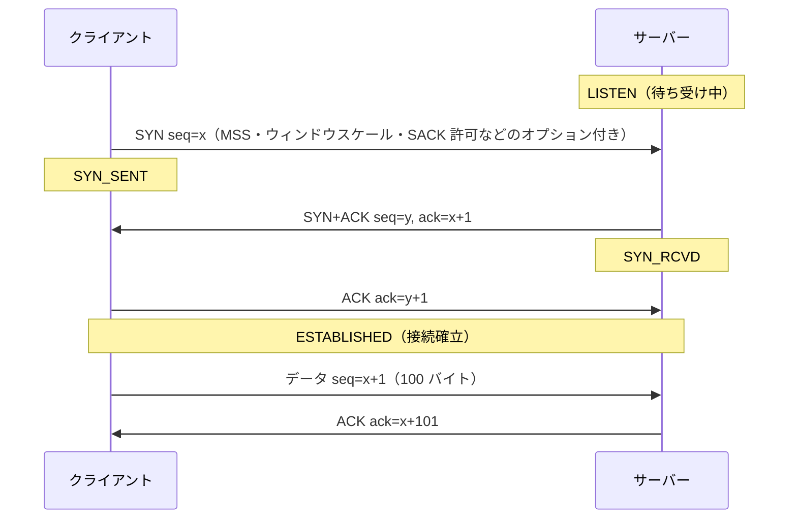
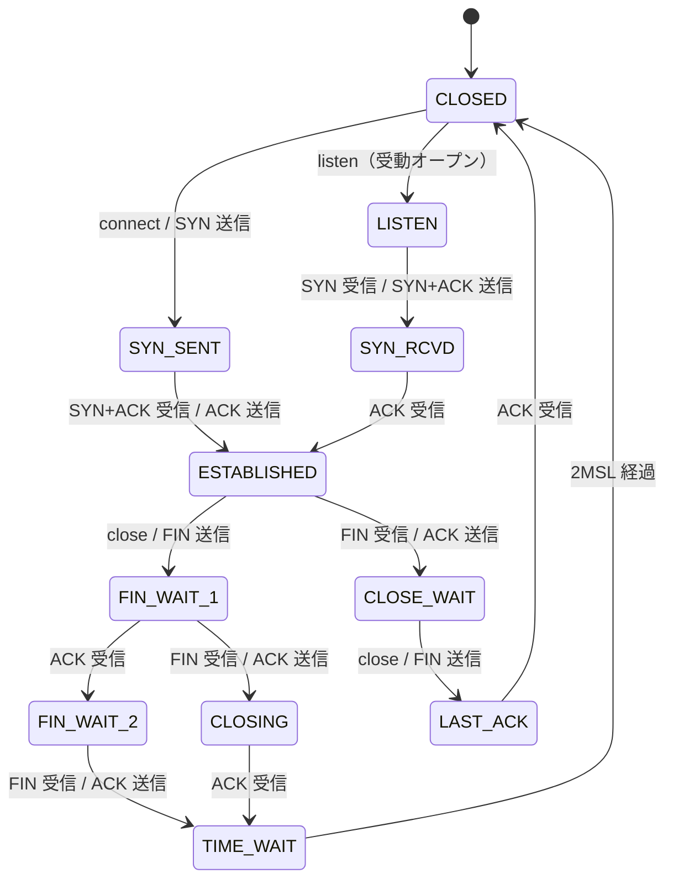

# 5.2 TCPとUDP

> IP が運ぶのは「届くかもしれない」パケットだけです。パケットは失われ、順番が入れ替わり、重複して届くこともあります。それなのに、なぜファイルは 1 バイトも欠けずに届くのでしょうか。そして、なぜ「回線を太くしたのに海外の API が速くならない」「深夜のバッチだけ接続エラーが出る」「なぜか毎回 40 ミリ秒遅い」といったことが起きるのでしょうか。この章では、トランスポート層の 2 つのプロトコルを、仕組みと現場の問題の両面から理解します。

| 項目 | 内容 |
|---|---|
| 学習時間の目安 | 本文 4h ＋ 演習 5h |
| 前提となる章 | [5.1 階層モデルとIP](../01-layers-and-ip/README.md)、[4.1 プロセス・スレッド・システムコール](../../04-operating-systems/01-processes-and-syscalls/README.md) |
| 演習 | [exercises/](exercises/)（Python） |
| キーワード | ポート, UDP, 3 ウェイハンドシェイク, シーケンス番号, 再送, スライディングウィンドウ, フロー制御, 輻輳制御, CUBIC, BBR, TIME_WAIT, Nagle, HOL ブロッキング, QUIC, ソケット, 帯域幅遅延積 |

## この章のゴール

- [ ] トランスポート層の役割（ポートによる多重化）と、TCP と UDP の違い・使い分けを説明できる
- [ ] 3 ウェイハンドシェイク・シーケンス番号・確認応答・再送によって TCP が信頼性を実現する仕組みを説明し、Go-Back-N と Selective Repeat をシミュレーションで比較できる
- [ ] フロー制御と輻輳制御（スロースタート・AIMD・高速再送・高速回復）の違いを説明し、輻輳ウィンドウの変化を計算できる
- [ ] 伝搬遅延と帯域幅遅延積から、遠距離通信の応答時間とスループットの限界を見積もれる
- [ ] ソケット API で TCP のサーバーとクライアントを書き、部分的な送受信とメッセージの区切り（フレーミング）を正しく扱える
- [ ] TIME_WAIT・Nagle と遅延 ACK・HOL ブロッキング・タイムアウト・コネクションプールに起因する問題を診断し、QUIC が何を解決するかを説明できる

## なぜ学ぶのか

- **輻輳崩壊**: 1986 年 10 月、インターネットは最初の「輻輳崩壊（congestion collapse）」を経験しました。Van Jacobson の 1988 年の論文によると、わずか 400 ヤード（約 370 メートル）離れたローレンス・バークレー研究所とカリフォルニア大学バークレー校の間のスループットが、32kbps から 40bps へと約 800 分の 1 に落ちました。混雑で失われたパケットを各ホストが一斉に再送し、その再送がさらに混雑を悪化させたのです。今の TCP の輻輳制御は、この事故への対策として生まれました。
- **物理法則の壁**: 光は光ファイバーの中を 1 秒間に約 20 万 km しか進めません。東京とアメリカ西海岸の往復には、それだけで 80 ミリ秒以上かかります。往復を 10 回する処理は、回線をどれだけ太くしても 1 秒近くかかります。アーキテクチャやリージョンの選択は、この事実から逃れられません。
- **現場の定番の障害**: 「1 回の `recv()` で 1 つのメッセージが届く」という思い込みによるデータ破損、タイムアウトを設定しなかったためにスレッドが永久に待ち続けて連鎖する障害、TIME_WAIT によるポートの枯渇、Nagle アルゴリズムと遅延 ACK の相互作用による 40 ミリ秒の遅延。どれも TCP の仕組みを知っていれば、すぐに原因の見当がつきます。

## 1. トランスポート層の役割

### 1.1 ポートと多重化

IP はパケットを **ホスト** まで届けますが、そのホストでは Web サーバー・データベース・SSH など多数のプロセスが動いています。どのプロセスに渡すかを決めるのが、トランスポート層の **ポート番号**（16 ビット、0〜65535）です。

| 範囲 | 名前 | 例 |
|---|---|---|
| 0〜1023 | ウェルノウンポート | 22（SSH）、53（DNS）、80（HTTP）、443（HTTPS）。Linux などでは、既定で待ち受けに特権が必要 |
| 1024〜49151 | 登録済みポート | 3306（MySQL）、5432（PostgreSQL）、6379（Redis） |
| 49152〜65535 | 動的ポート（IANA の定義） | クライアント側が一時的に使う **エフェメラルポート** |

エフェメラルポートの範囲は OS ごとに異なり、Linux の既定は 32768〜60999 です（`/proc/sys/net/ipv4/ip_local_port_range` で確認できます）。

TCP の接続は、**（プロトコル, 送信元 IP, 送信元ポート, 宛先 IP, 宛先ポート）の 5 つの組（5-tuple）** で識別されます。Web サーバーはポート 443 の 1 つで待ち受けながら何万もの接続を同時に扱えますが、それは接続ごとにクライアント側の IP とポートが違うからです。Linux では `ss` コマンドで接続の一覧を確認できます（出力例）。

```text
$ ss -tan
State       Recv-Q  Send-Q   Local Address:Port    Peer Address:Port
LISTEN      0       4096           0.0.0.0:443          0.0.0.0:*
ESTAB       0       0             10.0.1.5:443      203.0.113.7:51514
ESTAB       0       0             10.0.1.5:443    198.51.100.23:40022
TIME-WAIT   0       0             10.0.1.5:50122       10.0.2.9:5432
CLOSE-WAIT  1       0             10.0.1.5:443      203.0.113.9:60311
```

### 1.2 TCP と UDP

| | TCP | UDP |
|---|---|---|
| 接続 | 通信の前に接続を確立する（コネクション型） | 接続なしでいきなり送る（コネクションレス型） |
| 信頼性 | 失われたデータは再送し、順番どおりに、重複なく届ける | 失われても、順番が入れ替わっても、何もしない |
| データの単位 | **バイトストリーム**（送信の区切りは保たれない） | **データグラム**（1 回の送信が 1 つの単位として届く） |
| 流量の制御 | フロー制御・輻輳制御がある | ない（アプリケーションの責任） |
| ヘッダ | 20〜60 バイト | 8 バイト |
| 主な用途 | HTTP/1.1・HTTP/2、データベース、SSH、メール | DNS、QUIC（HTTP/3）、音声・映像のリアルタイム通信、ゲーム、VPN のトンネル |

## 2. UDP — 最小限のトランスポート

UDP（RFC 768）のヘッダは、送信元ポート・宛先ポート・長さ・チェックサムの 8 バイトだけです。IP の「届くかもしれない」配送に、ポート番号による多重化とチェックサムを足しただけ、と言えます。データグラムの区切りは保たれます。

```python
import socket

rx = socket.socket(socket.AF_INET, socket.SOCK_DGRAM)
rx.bind(("127.0.0.1", 0))
tx = socket.socket(socket.AF_INET, socket.SOCK_DGRAM)
for msg in (b"hello", b"world", b"!"):
    tx.sendto(msg, rx.getsockname())   # 3 つのデータグラムを送る
for _ in range(3):
    print(rx.recvfrom(1024)[0])        # 1 回の recvfrom で 1 つずつ届く
```

```text
b'hello'
b'world'
b'!'
```

UDP が選ばれるのは、TCP の保証が **かえって邪魔になる** 場面です。

- **遅れたデータに価値がない**: 音声通話やゲームでは、0.5 秒前の音声や位置情報を再送してもらっても使えません。多少欠けても、最新のデータを低遅延で届ける方が大切です。
- **1 往復で済むやりとり**: DNS の問い合わせは小さな要求と応答の 1 往復で、接続確立の往復を足すと 2 倍遅くなります。失われたらアプリケーションが送り直せば済みます。
- **TCP の上では作れない新しいプロトコル**: QUIC は、TCP の仕組みを UDP の上に作り直すことで、OS の TCP 実装やミドルボックスの制約から自由になりました（8 節）。

UDP を使うアプリケーションは、TCP がやってくれていたことを自分で引き受けます。特に重要なのが次の 2 つです。

- **輻輳制御**: 輻輳しているネットワークに UDP で送り続けると、自分の通信も他人の通信も壊します。UDP を使うアプリケーションも輻輳に応じて送信量を抑えるべきだとされています（RFC 8085）。
- **大きさの制限**: 大きなデータグラムは IP の分割（[5.1](../01-layers-and-ip/README.md)）を招き、断片が 1 つ失われるだけで全体が失われます。DNS では、分割を避けるために UDP の応答を 1232 バイト程度に抑える運用が推奨されてきました（2020 年の DNS Flag Day）。

また、UDP は接続を確立しないので、**送信元の IP アドレスを偽装できます**。攻撃者が被害者のアドレスを送信元に偽装して、小さな要求で大きな応答を返すサーバー（DNS・NTP・memcached など）に要求を送ると、大量の応答が被害者に押し寄せます（**反射・増幅攻撃**）。2018 年 2 月には、GitHub が memcached を悪用したピーク 1.35Tbps の攻撃を受けたと公表しています。QUIC は、相手のアドレスを確認するまでは受け取った量の 3 倍までしか送らない、という制限でこの悪用を防いでいます。

## 3. TCP の信頼性

### 3.1 TCP ヘッダ

```text
 0                   1                   2                   3
 0 1 2 3 4 5 6 7 8 9 0 1 2 3 4 5 6 7 8 9 0 1 2 3 4 5 6 7 8 9 0 1
+-------------------------------+-------------------------------+
|          送信元ポート         |           宛先ポート          |
+-------------------------------+-------------------------------+
|                        シーケンス番号                         |
+---------------------------------------------------------------+
|                         確認応答番号                          |
+-------+-------+---------------+-------------------------------+
|ヘッダ |       |    フラグ     |                               |
| 長    | 予約  |CWR ECE URG ACK|         ウィンドウ            |
|       |       |PSH RST SYN FIN|                               |
+-------+-------+---------------+-------------------------------+
|          チェックサム         |         緊急ポインタ          |
+-------------------------------+-------------------------------+
|              オプション（MSS, ウィンドウスケール, SACK など）  |
+---------------------------------------------------------------+
```

現在の TCP の仕様は、1981 年の RFC 793 とその後の多数の改訂をまとめた RFC 9293（2022 年）です。

### 3.2 3 ウェイハンドシェイク

TCP は通信の前に **接続（コネクション）** を確立します。



なぜ 3 回なのでしょうか。TCP では、双方が「自分の送るバイトに付ける番号の初期値（**ISN**、Initial Sequence Number）」を決め、それを相手が受け取ったことを確認しなければなりません。クライアントの SYN と、それへの ACK、サーバーの SYN と、それへの ACK の計 4 つが必要ですが、サーバーの ACK と SYN を 1 つのパケット（SYN+ACK）にまとめるので 3 回になります。

ISN は推測されにくい値にします（RFC 6528）。推測できると、第三者が送信元を偽装して、既存の接続に偽のデータを差し込めてしまうからです。また、SYN を大量に送りつけてサーバーの接続待ちの表を埋める **SYN フラッド攻撃** に対しては、接続の状態をサーバーに持たずに ISN の中に埋め込む **SYN クッキー** という対策があります。

ハンドシェイクには 1 RTT（往復時間）かかり、この間はデータを送れません。**新しい接続を張るたびに往復が 1 回増える** ことは、後で見るように性能に大きく効きます。

### 3.3 シーケンス番号と確認応答

TCP はデータをバイトの流れとして扱い、**各バイトに通し番号（シーケンス番号）** を付けます。受信側は「ここまで順番どおりに受け取ったので、次はこの番号のバイトが欲しい」という **累積確認応答（cumulative ACK）** を返します。

```text
送信側: [seq=1000, 500 バイト] [seq=1500, 500 バイト] [seq=2000, 500 バイト]
受信側: ack=1500 → ack=2000 → ack=2500     （「次は 2500 番から」）

2 つ目が失われた場合:
受信側: ack=1500 → （2 つ目が届かない）→ 3 つ目が届いても ack=1500 のまま（重複 ACK）
```

番号がバイト単位なので、受信側は順番が入れ替わったデータを正しい位置に並べ直せ、重複して届いたデータを捨てられます。

### 3.4 再送とタイムアウト

送ったデータへの ACK が一定時間来なければ、送信側は失われたとみなして再送します。この待ち時間 **RTO（Retransmission Timeout）** は、短すぎると不要な再送でネットワークを混雑させ、長すぎると回復が遅れます。RFC 6298 は、測定した往復時間（RTT）の平滑化した平均 SRTT と、ばらつき RTTVAR から、`RTO = SRTT + 4 × RTTVAR` とする方法を定めています。

```python
def rto_estimates(samples_ms, alpha=1/8, beta=1/4, k=4, min_rto_ms=200):
    """RFC 6298 の計算式（最小値は Linux と同じ 200ms にしている）。"""
    srtt = rttvar = None
    for r in samples_ms:
        if srtt is None:                      # 最初の測定値
            srtt, rttvar = r, r / 2
        else:                                 # RTTVAR を先に、古い SRTT を使って更新する
            rttvar = (1 - beta) * rttvar + beta * abs(srtt - r)
            srtt = (1 - alpha) * srtt + alpha * r
        rto = max(min_rto_ms, srtt + k * rttvar)
        print(f"RTT {r:4d} ms → SRTT {srtt:6.1f}  RTTVAR {rttvar:5.1f}  RTO {rto:6.1f} ms")

rto_estimates([100, 102, 98, 101, 250, 99, 100])
```

```text
RTT  100 ms → SRTT  100.0  RTTVAR  50.0  RTO  300.0 ms
RTT  102 ms → SRTT  100.2  RTTVAR  38.0  RTO  252.2 ms
RTT   98 ms → SRTT  100.0  RTTVAR  29.1  RTO  216.2 ms
RTT  101 ms → SRTT  100.1  RTTVAR  22.1  RTO  200.0 ms
RTT  250 ms → SRTT  118.8  RTTVAR  54.0  RTO  334.9 ms
RTT   99 ms → SRTT  116.4  RTTVAR  45.5  RTO  298.2 ms
RTT  100 ms → SRTT  114.3  RTTVAR  38.2  RTO  267.1 ms
```

RTT が安定していると RTO は下限に近づき、一度でも大きくぶれると RTO は大きく伸びます。平均だけでなく **ばらつき** を見て余裕をとるのがポイントです（RFC の下限は 1 秒ですが、Linux は 200 ミリ秒を下限にしています）。再送した後もタイムアウトが続くと、RTO は 2 倍、4 倍と伸びていきます（指数バックオフ）。再送したパケットへの ACK からは RTT を測りません。どちらの送信への ACK か区別できないからです（Karn のアルゴリズム）。

実務で重要なのは、**接続確立（SYN）の再送にもこの仕組みが働く** ことです。Linux の既定（`net.ipv4.tcp_syn_retries = 6`）では、応答のない相手への `connect()` は、SYN の再送の間隔を 1 秒・2 秒・4 秒…と倍にしながら、合わせて 1 + 2 + 4 + … + 64 = 127 秒待ってからようやく失敗します（2023 年以降のカーネルでは、最初の数回の再送を 1 秒間隔にする `tcp_syn_linear_timeouts` が加わり、既定で約 131 秒です）。アプリケーションで接続のタイムアウトを明示しなければ、障害時にスレッドが 2 分以上止まるのです（10 節）。

タイムアウトを待たずに再送する仕組みもあります。受信側は順番の飛んだデータを受け取るたびに同じ ACK 番号を返すので、送信側は **同じ ACK が 3 つ重複して届いた** ら「そこが失われた」と判断して、すぐに再送します（**高速再送**、fast retransmit）。さらに **SACK**（Selective ACK、RFC 2018）オプションを使うと、受信側は「1500〜2000 は欠けているが、2000〜3500 は受け取った」のように、受け取った範囲を具体的に伝えられます。

### 3.5 Go-Back-N と Selective Repeat

1 つ送るたびに ACK を待つ方式（ストップアンドウェイト）では、1 RTT に 1 パケットしか送れません。そこで、ACK を待たずに複数のパケットを送る **パイプライン化** が必要になり、失われたときの回復方法として 2 つの古典的な方式があります。

| | Go-Back-N | Selective Repeat |
|---|---|---|
| 受信側 | 順番どおりのものだけ受け取り、飛んだものは捨てる | 順番が飛んでもバッファし、個別に ACK する |
| ACK | 累積 ACK | 個別の ACK |
| 再送 | 失われたもの **以降をすべて** 送り直す | 失われたもの **だけ** を送り直す |
| 長所・短所 | 受信側が単純。損失が多いと無駄な再送が増える | 無駄な再送がない。受信側にバッファと管理が必要 |

演習 2 で実装するシミュレーション（ラウンド単位に簡略化したもの）で、1,000 個のパケットを、各送信が 10% の確率で失われる通信路で送ってみます。

```python
import random
from tcp_sim import simulate_go_back_n, simulate_selective_repeat   # 演習 2 の解答

rng = random.Random(2024)
loss = [rng.random() < 0.1 for _ in range(10_000)]   # 各送信が 10% の確率で失われる（シード固定）
for window in (1, 4, 16, 64):
    g = simulate_go_back_n(1000, window, loss)
    s = simulate_selective_repeat(1000, window, loss)
    print(f"ウィンドウ {window:2d}: Go-Back-N 送信 {g.transmissions:5d} 回・{g.rounds:4d} ラウンド / "
          f"Selective Repeat 送信 {s.transmissions:5d} 回・{s.rounds:4d} ラウンド")
```

```text
ウィンドウ  1: Go-Back-N 送信  1111 回・1111 ラウンド / Selective Repeat 送信  1111 回・1111 ラウンド
ウィンドウ  4: Go-Back-N 送信  1301 回・ 326 ラウンド / Selective Repeat 送信  1111 回・ 316 ラウンド
ウィンドウ 16: Go-Back-N 送信  2023 回・ 127 ラウンド / Selective Repeat 送信  1111 回・ 102 ラウンド
ウィンドウ 64: Go-Back-N 送信  6364 回・ 100 ラウンド / Selective Repeat 送信  1111 回・  31 ラウンド
```

ウィンドウ 1（ストップアンドウェイト）では 1,111 ラウンドかかっていたのが、ウィンドウを広げるとラウンド数（≒ かかる時間）が大きく減ります。一方、Go-Back-N はウィンドウが大きいほど無駄な再送が増え、ウィンドウ 64 では Selective Repeat の約 6 倍の送信をしています。TCP はこの 2 つの折衷です。ACK は Go-Back-N と同じ累積 ACK ですが、受信側は順番の飛んだデータもバッファし、SACK を使えば送信側は Selective Repeat のように欠けた部分だけを再送できます。

## 4. フロー制御と輻輳制御

### 4.1 スライディングウィンドウとフロー制御

パイプライン化で「ACK を待たずに送ってよい量」を **ウィンドウ** と呼びます。ACK が届くたびに、ウィンドウは右へ滑るように進みます（**スライディングウィンドウ**）。

```text
シーケンス番号 →
[ 送信済み・ACK 済み | 送信済み・ACK 待ち | まだ送っていないが送ってよい | 送ってはいけない ]
                     |<──────────── ウィンドウ ────────────>|
```

ウィンドウの大きさを決める要素は 2 つあります。1 つ目は **受信側の都合** です。受信側のアプリケーションが読み出すより速くデータが届くと、受信バッファがあふれます。そこで受信側は、ACK のたびに「あと何バイト受け取れるか」（**受信ウィンドウ rwnd**）を知らせ、送信側はそれを超えて送りません。これが **フロー制御（flow control）** です。受信側のアプリケーションが読むのをやめると、ウィンドウは 0 になり、送信側は止まります。

TCP ヘッダのウィンドウ欄は 16 ビットなので、そのままでは 65,535 バイトまでしか表せません。後で見るように、これでは遠距離の高速回線を使い切れないため、接続確立時に **ウィンドウスケール** オプション（RFC 7323）で倍率を決め、最大で約 1GiB まで広げられるようになっています。

### 4.2 輻輳制御

2 つ目は **ネットワークの都合** です。途中のルータのキューがあふれればパケットは捨てられ、全員が再送を始めれば、冒頭の輻輳崩壊が起きます。そこで送信側は、ネットワークの混み具合を推測して **輻輳ウィンドウ cwnd** を調整し、`min(cwnd, rwnd)` までしか送らないようにします。これが **輻輳制御（congestion control）** です。フロー制御が「受信側を溢れさせない」仕組みなのに対し、輻輳制御は「ネットワークを溢れさせない」仕組みです。

Jacobson が導入し、RFC 5681 にまとめられている基本の仕組みは次のとおりです。

1. **スロースタート（slow start）**: 最初は小さな cwnd から始め、ACK が 1 つ返るたびに cwnd を 1 セグメント増やす。1 RTT で送った分の ACK がすべて返ると cwnd は 2 倍になるので、名前に反して **指数関数的に** 増える。現在の初期値は 10 セグメント（RFC 6928）が一般的。
2. **輻輳回避（congestion avoidance）**: cwnd が閾値 **ssthresh** に達したら、1 RTT に 1 セグメントずつ慎重に増やす（**加算的増加**）。
3. **損失への反応**: 損失を検出したら、cwnd を半分にする（**乗算的減少**）。重複 ACK で気付いた（データはまだ流れている）なら、ssthresh と cwnd を半分にして輻輳回避を続ける（**高速回復**、fast recovery。TCP Reno の方式）。タイムアウトで気付いた（深刻な輻輳）なら、cwnd を 1 に戻してスロースタートからやり直す。

この「加算的に増やし、乗算的に減らす」方式を **AIMD（Additive Increase / Multiplicative Decrease）** と呼びます。AIMD を使う複数のフローが帯域を分け合うと、公平な分配に収束していくことが知られています（Chiu と Jain の 1989 年の分析）。cwnd の変化は、特徴的なのこぎり形になります。

```text
cwnd（セグメント）
 40 |            ***
 36 |        ****
 32 |     ***
 28 |                      ****
 24 |                  ****
 20 |               ***
 16 |    *                         ****
 12 |
  8 |   *                         *
  4 |  *                         *
  0 |**                        **
    +----------------------------------→ 時間（RTT）
```

RTT 単位の簡略モデルで、ssthresh=32 から始めています。0〜5 RTT はスロースタート（1, 2, 4, 8, 16, 32 と倍増）、その後は輻輳回避で 1 ずつ増え、14 RTT 目に 3 つの重複 ACK で損失を検出して 41 から半分の 20 へ。25 RTT 目にはタイムアウトで 1 に戻り、新しい ssthresh（15）までスロースタートで増やしてから、再び輻輳回避に入ります。演習 3 では、これを ACK 単位の正確なモデルで実装します。

### 4.3 CUBIC と BBR

Reno の方式には、RTT が長いほど cwnd の回復が遅いという弱点があります。輻輳回避では 1 RTT に 1 セグメントしか増えないので、RTT 100 ミリ秒の経路で cwnd が 1,000 から半分の 500 に減ると、元に戻るのに 500 RTT = 50 秒かかります。

- **CUBIC**: 最後に損失が起きてからの **経過時間の 3 次関数** で cwnd を増やす方式です。損失直前の大きさまでは素早く戻し、その付近では慎重に、そこを超えたらまた積極的に探ります。増え方が RTT に依存しないので、長距離・高速の回線に向いています。Linux では 2006 年のカーネル 2.6.19 から既定の方式で、RFC 9438（2023 年）で標準化されています。
- **BBR**: Google が 2016 年に発表した方式です。損失を輻輳のしるしとみなすのではなく、**ボトルネックの帯域** と **最小の RTT** を測定し、そのモデルに合わせて送信の速さ（ペース）を決めます。ルータの大きなバッファにデータが溜まって遅延が増える **バッファ肥大（bufferbloat）** を起こしにくく、ランダムな損失がある回線でも速度を落としすぎません。Google は自社のサービスで使っていると報告していますが、CUBIC と帯域を分け合うときの公平性などの課題もあり、改良が続いています。

輻輳制御の方式は送信側だけで選べます（受信側の協力は不要です）。Linux では `sysctl net.ipv4.tcp_congestion_control` で確認・変更できます。

損失が性能に与える影響を、Reno 型の TCP の近似式（Mathis らの式: スループット ≈ MSS / RTT × 1.22 / √損失率）で見てみましょう。

```python
import math
mss, rtt = 1460, 0.100
for p in (0.0001, 0.001, 0.01):
    bps = (mss * 8 / rtt) * (1.22 / math.sqrt(p))
    print(f"損失率 {p:.2%}: 約 {bps / 1e6:.1f} Mbps")
```

```text
損失率 0.01%: 約 14.2 Mbps
損失率 0.10%: 約 4.5 Mbps
損失率 1.00%: 約 1.4 Mbps
```

RTT 100 ミリ秒の経路では、わずか 1% の損失で 1 本の TCP 接続は 1.4Mbps 程度しか出ません（CUBIC や BBR では値が変わりますが、長い RTT と損失が効くという傾向は同じです）。回線の帯域が 1Gbps あっても関係ありません。**スループットを決めるのは帯域だけでなく、RTT と損失率** なのです。

## 5. 遅延と帯域幅

### 5.1 遅延の内訳

パケットが届くまでの時間は、次の 4 つの和です。

| 遅延 | 原因 | 目安・対策 |
|---|---|---|
| 伝搬遅延 | 信号が距離を進む時間 | 光ファイバーで **約 5 マイクロ秒/km**。距離を縮める以外に減らせない |
| 送出遅延 | パケットのビットを回線に載せる時間 | 1500 バイトを 1Gbps で送ると 12 マイクロ秒。帯域を増やすと減る |
| キューイング遅延 | ルータのキューで待つ時間 | 混雑次第で 0〜数百ミリ秒。バッファ肥大の原因 |
| 処理遅延 | 機器やホストでの処理 | 通常は小さいが、TLS の処理や GC 停止などアプリ側で大きくなることも |

光ファイバーの中の光の速さは、真空中（約 30 万 km/s）の約 3 分の 2、1 秒間に約 20 万 km です。東京からの大圏距離（地球上の最短距離）で、往復の伝搬遅延の下限を計算してみましょう。

```python
import math

def great_circle_km(lat1, lon1, lat2, lon2):
    """2 地点間の大圏距離（地球を半径 6371km の球とみなす）。"""
    p1, p2 = math.radians(lat1), math.radians(lat2)
    dp, dl = p2 - p1, math.radians(lon2 - lon1)
    a = math.sin(dp / 2) ** 2 + math.cos(p1) * math.cos(p2) * math.sin(dl / 2) ** 2
    return 2 * 6371 * math.asin(math.sqrt(a))

FIBER_KM_PER_S = 200_000   # 光ファイバー中の光の速さ（真空中の約 2/3）
TOKYO = (35.68, 139.69)
for name, pos in [("大阪", (34.69, 135.50)), ("シンガポール", (1.35, 103.82)),
                  ("サンフランシスコ", (37.77, -122.42)), ("ロンドン", (51.51, -0.13))]:
    d = great_circle_km(*TOKYO, *pos)
    print(f"東京→{name}: {d:,.0f} km、往復の伝搬遅延の下限 {2 * d / FIBER_KM_PER_S * 1000:.1f} ms")
```

```text
東京→大阪: 396 km、往復の伝搬遅延の下限 4.0 ms
東京→シンガポール: 5,314 km、往復の伝搬遅延の下限 53.1 ms
東京→サンフランシスコ: 8,272 km、往復の伝搬遅延の下限 82.7 ms
東京→ロンドン: 9,559 km、往復の伝搬遅延の下限 95.6 ms
```

実際のケーブルは大圏に沿って敷かれていないうえ、機器での処理やキューイングも加わるので、実測の RTT はこれより大きくなります。東京とアメリカ西海岸の間なら 100 ミリ秒前後が一つの目安です（経路や事業者によって変わります）。

### 5.2 帯域幅遅延積

回線を使い切るには、ACK が返ってくるまでの 1 RTT の間、途切れずに送り続けなければなりません。そのために必要な「送信済みで ACK 待ち」のデータ量が **帯域幅遅延積（BDP、Bandwidth-Delay Product）** = 帯域幅 × RTT です。

```python
rtt = 0.100              # 往復 100 ms
bandwidth = 1e9          # 1 Gbps
bdp = bandwidth * rtt / 8
print(f"帯域幅遅延積: {bdp / 1e6:.1f} MB")
print(f"ウィンドウ 64KiB の上限: {65535 * 8 / rtt / 1e6:.1f} Mbps")
print(f"ウィンドウ 4MiB の上限 : {4 * 2**20 * 8 / rtt / 1e6:.0f} Mbps")
```

```text
帯域幅遅延積: 12.5 MB
ウィンドウ 64KiB の上限: 5.2 Mbps
ウィンドウ 4MiB の上限 : 336 Mbps
```

1 本の TCP 接続のスループットは、最大でも **ウィンドウ ÷ RTT** です。ウィンドウスケールがなければ、1Gbps の回線でも太平洋越しでは 5Mbps 程度しか出ません。Linux は通信状況に応じて送受信バッファの大きさを自動調整しますが、その上限（`net.ipv4.tcp_rmem` と `tcp_wmem` の最大値）や、アプリケーションが自分でバッファの大きさを小さく固定していると、ここが頭打ちの原因になります。

### 5.3 往復の回数を数える

遅延が支配的な通信では、**往復の回数** がそのまま応答時間になります。東京から RTT 100 ミリ秒のサーバーへ、初めて HTTPS でアクセスして 100KB の応答を受け取る場合を数えてみましょう。

| 段階 | 往復 | 累計の目安 |
|---|---|---|
| DNS の名前解決（キャッシュになし） | 1 以上 | 100 ms〜 |
| TCP の 3 ウェイハンドシェイク | 1 | 200 ms |
| TLS 1.3 のハンドシェイク（[5.3](../03-dns-http-tls/README.md)） | 1 | 300 ms |
| HTTP のリクエストと、応答の最初の 14.6KB（初期ウィンドウ 10 セグメント） | 1 | 400 ms |
| 残りの応答（スロースタートで 29.2KB、58.4KB と倍増） | 2 | 600 ms |

帯域を 10 倍にしても、この 600 ミリ秒はほとんど縮みません。縮めるには **往復の回数を減らす**（接続の再利用、TLS 1.3・QUIC、リクエストの一括化）か、**RTT を減らす**（利用者の近くのサーバーで応答する CDN、リージョンの選択。[5.4](../04-web-architecture/README.md)）しかありません。

## 6. 接続の終了と TIME_WAIT

### 6.1 接続の終了

TCP の接続は、両方向を別々に閉じます。先に閉じる側（アクティブクローズ）が FIN を送り、相手が ACK を返し、相手も送り終えたら FIN を送り、それに ACK を返して終わります（4 ウェイ）。片方向だけを閉じた「半分閉じた（half-close）」状態で、相手からの受信を続けることもできます。

これとは別に、**RST（リセット）** は接続を即座に破棄する合図です。閉じたポートに接続しようとしたとき（「Connection refused」）や、アプリケーションがまだ読んでいないデータを残したまま閉じたときなどに送られ、相手には「Connection reset by peer」として見えます。

### 6.2 状態遷移

TCP の接続は、次の状態を遷移します（簡略化しています）。



FIN_WAIT_1 → FIN_WAIT_2 → TIME_WAIT の経路が先に閉じた側、CLOSE_WAIT → LAST_ACK の経路が後から閉じた側です。障害調査では、`ss -tan` で各状態の接続数を数えるのが定番です。

- **CLOSE_WAIT が増え続ける**: 相手は閉じたのに、自分のアプリケーションが `close()` を呼んでいない。ほぼ確実に **アプリケーションのバグ**（例外の経路でソケットやコネクションを閉じ忘れている）です。
- **TIME_WAIT が大量にある**: 自分が先に閉じた接続の名残。多くの場合は正常ですが、次に述べるポートの枯渇の原因になります。
- **SYN_SENT が溜まる**: 接続先が応答していない（止まっている、またはファイアウォールで黙って捨てられている）。

### 6.3 TIME_WAIT とポートの枯渇

先に閉じた側は、最後の ACK を送った後もすぐには接続の情報を消さず、**TIME_WAIT** 状態で 2MSL（MSL はパケットがネットワーク内に残りうる最大時間）待ちます。Linux ではこの時間は 60 秒に固定されています。理由は 2 つあります。

1. 最後の ACK が失われると、相手は FIN を再送してきます。そのとき接続の情報がなければ RST を返してしまい、相手は正常に閉じられません。
2. 同じ 5-tuple ですぐに新しい接続を作ると、古い接続の遅れて届いたパケットが、新しい接続のデータとして紛れ込むおそれがあります。

問題になるのは、**クライアント側が短い接続を大量に張って、自分から閉じる** 場合です。同じ宛先（IP とポート）への接続では、区別できるのは送信元ポートだけで、TIME_WAIT の間はそのポートを再利用できません。

```python
lo, hi = map(int, open("/proc/sys/net/ipv4/ip_local_port_range").read().split())
ports = hi - lo + 1
print(lo, hi, ports, f"{ports / 60:.0f} 接続/秒")
```

```text
32768 60999 28232 471 接続/秒
```

Linux の既定では、1 つの送信元 IP から同じ宛先へ、**毎秒およそ 470 本を超える新しい接続を張り続けると、ポートが枯渇します**。`connect()` が「Cannot assign requested address」（`EADDRNOTAVAIL`）で失敗するのが典型的な症状です。API を 1 リクエストごとに新しい接続で呼び出すバッチや、コネクションプールを使っていないアプリケーションで起きがちです。対策の優先順位は次のとおりです。

1. **接続を再利用する**（HTTP のキープアライブ、コネクションプール）。根本的な解決策です。
2. Linux の `net.ipv4.tcp_tw_reuse` で、安全と判断できる場合に TIME_WAIT のポートを新しい外向きの接続に再利用させる。エフェメラルポートの範囲を広げる。送信元や宛先の IP アドレスを増やす。
3. 古い資料にある `tcp_tw_recycle` は、NAT の内側にいる複数のクライアントとの通信を壊す問題があり、Linux 4.12 で削除されました。また `tcp_fin_timeout` は FIN_WAIT_2 の時間であって、TIME_WAIT は短くなりません。

サーバーを再起動したときに「Address already in use」でポートを待ち受けられないのも、TIME_WAIT の名残が原因です。待ち受け用のソケットに `SO_REUSEADDR` を設定すると回避できます（演習 4 でも設定します）。

## 7. Nagle アルゴリズムと遅延 ACK

小さなパケットを大量に送ると、ヘッダ（40 バイト以上）の割合が大きくなって効率が落ちます。そこで TCP には、小さな送信をまとめる仕組みが 2 つあります。

- **Nagle アルゴリズム**（RFC 896、1984 年）: ACK を待っているデータがある間は、小さなデータを送らずにバッファに溜め、ACK が届くか 1 セグメント分溜まったら送る。
- **遅延 ACK（delayed ACK）**: 受信側は ACK をすぐに返さず、少し待って、応答データに便乗させたり、2 つ分をまとめたりする。RFC 1122 は、遅らせるのは 500 ミリ秒未満、フルサイズのセグメント 2 つにつき少なくとも 1 回は ACK を返すよう定めています。Linux では最小 40 ミリ秒程度です。

それぞれは合理的ですが、組み合わさると問題が起きます。クライアントが「ヘッダを `send()`、本文を `send()`、そして応答を `recv()`」する（write-write-read）と、次のようになります。

1. ヘッダはすぐに送られる。
2. 本文は、ヘッダへの ACK を待っているので、Nagle によって送信が保留される。
3. サーバーは本文が届かないと応答を作れず、応答がないので、ヘッダへの ACK を遅延 ACK で保留する。
4. 遅延 ACK のタイマー（Linux で約 40 ミリ秒）が切れて、ようやく ACK が返り、本文が送られる。

実際に測ってみましょう（Linux での実行例。値は環境によって変わります）。

```python
import socket
import threading
import time

def recv_exact(sock, n):
    buf = b""
    while len(buf) < n:
        buf += sock.recv(n - len(buf))
    return buf

def serve(listener):
    conn, _ = listener.accept()
    while True:
        try:
            recv_exact(conn, 20)          # ヘッダ 10 バイト＋本文 10 バイトを読んでから
        except Exception:
            break
        conn.send(b"k")                   # 1 バイトの応答を返す

def measure(nodelay: bool, coalesce: bool, n: int = 20) -> float:
    listener = socket.create_server(("127.0.0.1", 0))
    threading.Thread(target=serve, args=(listener,), daemon=True).start()
    c = socket.create_connection(listener.getsockname())
    c.setsockopt(socket.IPPROTO_TCP, socket.TCP_NODELAY, int(nodelay))
    start = time.perf_counter()
    for _ in range(n):
        if coalesce:
            c.send(b"H" * 10 + b"B" * 10)  # ヘッダと本文を 1 回で送る
        else:
            c.send(b"H" * 10)              # write（ヘッダ）
            c.send(b"B" * 10)              # write（本文）
        recv_exact(c, 1)                   # read（応答）
    c.close()
    return (time.perf_counter() - start) / n * 1000

print(f"2 回の send・Nagle 有効 : {measure(False, False):6.2f} ms / リクエスト")
print(f"2 回の send・TCP_NODELAY: {measure(True, False):6.2f} ms / リクエスト")
print(f"1 回の send・Nagle 有効 : {measure(False, True):6.2f} ms / リクエスト")
```

```text
2 回の send・Nagle 有効 :  42.08 ms / リクエスト
2 回の send・TCP_NODELAY:   0.13 ms / リクエスト
1 回の send・Nagle 有効 :   0.20 ms / リクエスト
```

同じマシンの中の通信なのに、1 リクエストごとに約 40 ミリ秒待たされています。対策は 2 つです。

- **送信をまとめる**: ヘッダと本文を 1 つのバッファにしてから送る（演習 1 の `encode_frame` がそうしています）。システムコールの回数も減る、最も素直な対策です。
- **`TCP_NODELAY` を設定する**: Nagle を無効にします。RPC や対話的なプロトコルのライブラリは既定で設定していることが多く、例えば Go の標準ライブラリは TCP 接続で既定で有効にしています。ただし、細切れの `send()` を大量に呼ぶと小さなパケットが大量に出るので、送信をまとめる設計と組み合わせます。

「なぜかちょうど 40 ミリ秒（や 200 ミリ秒）遅い」という症状を見たら、まずこの相互作用を疑いましょう。

## 8. HOL ブロッキングと QUIC

### 8.1 HOL ブロッキング

TCP はバイトの流れを **順番どおりに** アプリケーションに渡します。途中の 1 セグメントが失われると、その後ろのデータがすでに届いていても、再送されたセグメントが届くまでアプリケーションには渡せません。この「先頭（head of line）が詰まると後ろも全部待たされる」現象を **HOL ブロッキング（head-of-line blocking）** と呼びます。

これが特に問題になるのが、1 本の TCP 接続の上で多数の独立したリクエストを多重化する HTTP/2 です（[5.3](../03-dns-http-tls/README.md)）。画像 A のデータの 1 パケットが失われただけで、無関係な画像 B・C の応答まで止まってしまいます。損失の多いモバイル回線では、この影響が無視できません。

### 8.2 QUIC

**QUIC**（RFC 9000、2021 年）は、TCP の役割を UDP の上に作り直したトランスポートプロトコルで、HTTP/3（RFC 9114、2022 年）の土台です。

| | TCP ＋ TLS 1.3 | QUIC |
|---|---|---|
| 実装の場所 | TCP は OS のカーネル | アプリケーション（ユーザー空間）のライブラリ。改良を素早く配布できる |
| 新規接続の往復 | TCP 1 ＋ TLS 1 = 2 RTT | 暗号のハンドシェイクと一体化して 1 RTT。再接続なら 0-RTT も可能 |
| 暗号化 | TCP のヘッダは平文 | TLS 1.3 を内蔵（RFC 9001）し、ヘッダの大部分も暗号化。ミドルボックスによる硬直化を防ぐ |
| 多重化 | 1 本のバイトストリーム。損失で全体が止まる | **独立した複数のストリーム**。あるストリームの損失は、他のストリームを止めない |
| 接続の識別 | 5-tuple。Wi-Fi からモバイル回線に切り替わると接続が切れる | **コネクション ID**。IP アドレスが変わっても接続を続けられる（コネクションマイグレーション） |

QUIC にも注意点があります。0-RTT で送ったデータは攻撃者に再送（リプレイ）されうるので、冪等な（何度実行しても結果が同じ）リクエストに限って使うべきです（[5.3](../03-dns-http-tls/README.md)）。企業のネットワークなどでは UDP が遮断・制限されていることがあり、ブラウザは TCP での HTTP/2 にフォールバックします。また、カーネルやネットワークカードによる最適化が TCP ほど効かないため、CPU の負荷が高くなりがちです。なお、1 つのストリームの中では順番どおりに届ける必要があるので、ストリーム内の HOL ブロッキングは残ります。

## 9. ソケット API とメッセージの区切り

### 9.1 ソケット API

アプリケーションは、OS が提供する **ソケット（socket）API** で TCP・UDP を使います。ソケットはファイルディスクリプタの一種で、システムコール（[4.1](../../04-operating-systems/01-processes-and-syscalls/README.md)）を通じて操作します。

| 役割 | 呼び出し | 意味 |
|---|---|---|
| サーバー | `socket()` → `bind(アドレス, ポート)` → `listen(backlog)` | 待ち受けを始める。backlog は、接続が確立したが `accept()` されていないものを溜めておくキューの長さ |
| | `accept()` | 確立済みの接続を 1 つ取り出し、その接続専用の新しいソケットを返す |
| クライアント | `socket()` → `connect(アドレス, ポート)` | 3 ウェイハンドシェイクを行う |
| 共通 | `send()` / `recv()` | データを送る・受け取る |
| | `shutdown()` / `close()` | 送信方向だけを閉じる（FIN を送る）／ソケットを閉じる |

3 ウェイハンドシェイクはカーネルが行うので、`accept()` を呼ぶ前にすでに接続は確立しています。アプリケーションの処理が追いつかず backlog があふれると、新しい接続は確立できなくなります。

### 9.2 部分的な送受信

`send()` は「渡したデータを全部送った」とは限りません。カーネルの送信バッファの空きの分しか受け取らず、**実際に受け取ったバイト数を返します**。ノンブロッキングのソケットで確かめてみましょう（受け取られるバイト数は OS とバッファの設定によって変わります）。

```python
import socket

listener = socket.create_server(("127.0.0.1", 0))
client = socket.create_connection(listener.getsockname())
server_side, _ = listener.accept()       # サーバー側は受信しない（読まない）
client.setblocking(False)                # ブロックせず、送れる分だけ送る
sent = client.send(b"x" * 50_000_000)    # 50MB を一度に send してみる
print(sent)                              # 実際に受け取られたバイト数
```

```text
3919467
```

50MB のうち、受け取られたのは約 3.9MB だけでした。同様に `recv(4096)` は「最大」4096 バイトを返すのであって、届いている分が少なければそれだけを返します。**戻り値を確認してループする** のが、ソケットプログラミングの基本です（演習 4 の `send_all` と `recv_exact`）。Python の `sendall()` は、この送信のループを内部で行ってくれるメソッドです。

### 9.3 バイトストリームとフレーミング

TCP はバイトの流れを運ぶだけで、**`send()` の区切りを受信側に伝えません**。3 回に分けて送ったデータを、1 回の `recv()` で読んでみます。

```python
import socket
import threading
import time

listener = socket.create_server(("127.0.0.1", 0))
port = listener.getsockname()[1]

def server():
    conn, _ = listener.accept()
    for msg in (b"hello", b"world", b"!"):
        conn.send(msg)          # 3 回に分けて送る
        time.sleep(0.01)
    conn.close()

threading.Thread(target=server).start()
client = socket.create_connection(("127.0.0.1", port))
time.sleep(0.1)                  # 3 つとも届くまで待ってから
print(client.recv(1024))         # 1 回の recv で読む
print(client.recv(1024))         # 相手が閉じると b"" が返る
```

```text
b'helloworld!'
b''
```

3 つのメッセージは区切りを失って 1 つにつながりました。逆に、大きなメッセージが何回かに分かれて届くこともあります。したがって、TCP の上でメッセージをやりとりするアプリケーションは、**区切り方（フレーミング）を自分で決めなければなりません**。

| 方式 | 例 | 注意点 |
|---|---|---|
| 長さプレフィックス | 演習 1、多くのバイナリプロトコル（gRPC のメッセージなど） | 長さの上限を必ず検査する。巨大な長さを宣言されてメモリを確保させられないように |
| 区切り文字 | 改行区切り（SMTP のコマンド、JSON Lines） | データ中に区切り文字が現れたときのエスケープが必要（SMTP の本文では、行頭の「.」を「..」にする）。1 行の長さの上限も必要 |
| ヘッダで長さを示す | HTTP/1.1 の Content-Length、chunked 転送（[5.3](../03-dns-http-tls/README.md)） | 長さの指定が矛盾したときの扱いを誤ると、深刻な脆弱性になる |

もう 1 つの落とし穴が、**双方が読まずに送り続けるとデッドロックする** ことです。クライアントが大きなデータを送り終えるまで応答を読まず、サーバーも受け取りながら応答を送り返す設計だと、サーバーの送信バッファとクライアントの受信バッファが埋まった時点で、フロー制御によって両者が互いを待ったまま止まります。送信と受信を並行して行う（スレッド、非同期 I/O）か、プロトコルで「読み終えてから応答する」と決めておく必要があります。

## 10. 実務: タイムアウト・キープアライブ・コネクションプール・L4 ロードバランサ

### 10.1 タイムアウトの設計

ネットワークの向こうの相手は、応答しないまま止まることがあります。タイムアウトのない呼び出しは、スレッドやコネクションを永久に占有し、やがてシステム全体を止めます。タイムアウトは少なくとも 3 種類を区別して設定します。

| 種類 | 対象 | 考え方 |
|---|---|---|
| 接続タイムアウト | `connect()` が終わるまで | 相手が生きていれば 1 RTT で終わるので、短くてよい（同じデータセンター内なら 1 秒未満〜数秒）。Linux の既定に任せると約 2 分 |
| 読み取りタイムアウト | 次のデータが届くまでの待ち時間 | 相手の処理時間の分布（p99 など）を見て決める。「1 回の `recv()` の待ち時間」であり、全体の時間の上限ではない点に注意 |
| 全体の期限（デッドライン） | リクエスト全体 | 利用者が待てる時間から逆算した予算。下流を呼ぶときは、残り時間を渡して引き継ぐ（gRPC のデッドラインの伝搬） |

多くのライブラリは、既定ではタイムアウトがありません。Python の `socket` は既定で無期限にブロックし、広く使われている HTTP ライブラリの `requests` も、タイムアウトを指定しなければ無期限に待つので、本番のコードではほぼ常に指定すべきだと公式ドキュメントに書かれています。タイムアウト後の **リトライ** は、冪等な操作に限り、指数バックオフとランダムなゆらぎ（ジッター）を入れて行います（[7.1](../../07-distributed-systems/01-fundamentals/README.md)、[9.4](../../09-architecture/04-api-design/README.md)）。

### 10.2 キープアライブとアイドルタイムアウト

TCP の接続は、通信がなければパケットを 1 つも流しません。相手のマシンが電源ごと落ちても、こちらは何も気付かないまま接続を持ち続けます。一方、途中の NAT やロードバランサ、ファイアウォールは、一定時間通信のない接続を黙って忘れます（[5.1](../01-layers-and-ip/README.md) の NAT の変換表）。例えば AWS の NAT ゲートウェイは、350 秒間アイドルな接続をタイムアウトさせ、その後にその接続でデータを送ろうとした内側の機器には RST を返すとドキュメントに書かれています（2026年時点。値は公式ドキュメントで確認してください）。機器によっては、何も返さずにパケットを捨てます。

**TCP キープアライブ** は、アイドルな接続に定期的に空のパケットを送って、相手の生存を確かめ、途中の機器に接続を覚えさせておく仕組みです。ただし Linux の既定は「2 時間（7200 秒）通信がなかったら、75 秒間隔で 9 回確かめる」で、途中の機器のタイムアウトより長すぎます。長時間つなぎっぱなしの接続（データベースのコネクションプール、WebSocket、gRPC のストリームなど）では、ソケットオプション（`SO_KEEPALIVE` と `TCP_KEEPIDLE` など）で間隔を数十秒〜数分に縮めるか、アプリケーションのレベルで定期的に ping を送ります（HTTP/2 の PING フレーム、gRPC のキープアライブなど）。

### 10.3 コネクションプール

3.2 節と 5.3 節で見たとおり、新しい接続には往復のコストがかかり、TLS も加われば CPU のコストもかかります。そこで、HTTP クライアントやデータベースのドライバは、確立した接続を使い回す **コネクションプール** を持っています。プールを使うときは、次の点を設計します。

- **大きさ**: 同時に必要な接続の数は「スループット × 1 リクエストあたりの接続の占有時間」で見積もれます（リトルの法則。[9.5](../../09-architecture/05-scalability-and-performance/README.md)）。データベースの側には接続数の上限があるので、アプリケーションのインスタンス数 × プールの大きさがそれを超えないようにします。
- **アイドル時間の食い違い**: サーバーやロードバランサが先にアイドルな接続を閉じると、クライアントがその接続を再利用した瞬間に「connection reset」や「broken pipe」になります。**クライアント側のアイドルタイムアウトを、サーバー側より短くする** のが原則です。それでも起きうるので、冪等なリクエストは 1 回だけ再試行できるようにします。
- **接続の寿命**: 接続を永久に使い続けると、DNS の切り替えやサーバーの追加が反映されません。一定時間で接続を作り直す上限（最大寿命）を設けます。

### 10.4 L4 ロードバランサと TCP

TCP の段階で振り分ける **L4 ロードバランサ** は、HTTP の中身を見ずに **接続単位** で振り分けます（L7 との違いは [5.4](../04-web-architecture/README.md)）。そのため、1 本の接続で大量のリクエストを流す HTTP/2・gRPC・データベースのコネクションプールでは、偏りが起きます。サーバーを増やしても、既存の接続は古いサーバーにつながったままだからです。接続の最大寿命を設けて定期的に張り直させる（gRPC のサーバーには `MAX_CONNECTION_AGE` という設定があります）、リクエスト単位で振り分ける L7 のロードバランサを使う、といった対策をとります。

また、L4 ロードバランサがアドレス変換をしてバックエンドに転送すると、バックエンドからはクライアントの IP アドレスが見えなくなります。これを伝えるために、接続の先頭にクライアントの情報を付け加える **PROXY プロトコル**（HAProxy が考案）などが使われます。

## よくある落とし穴

1. **1 回の `recv()` で 1 つのメッセージが届くと思い込む**。テスト環境では小さなメッセージが 1 回で届くので気付かず、本番の負荷や遅い回線でメッセージが分割・結合されて壊れます。必ずフレーミングを決め、受信したバイト列を溜めながら区切ります。
2. **`send()` の戻り値を無視する**。特にノンブロッキングのソケットや非同期 I/O では、渡したデータの一部しか送られないことがあります。戻り値を見てループするか、`sendall()` のような「全部送る」API を使います。
3. **タイムアウトを設定しない**。接続・読み取り・全体の期限のどれかが欠けていると、相手の障害がそのまま自分のスレッドやコネクションの枯渇になり、障害が連鎖します。ライブラリの既定値（無期限であることが多い）を信用しないでください。
4. **TIME_WAIT を「悪者」とみなして無理に消す**。`tcp_tw_recycle` は NAT の内側のクライアントとの通信を壊し、`SO_LINGER` で RST を送って閉じる方法はデータの取りこぼしを招きます。根本的な対策は接続の再利用です。
5. **「ちょうど 40 ミリ秒遅い」を放置する**。write-write-read のパターンでは、Nagle と遅延 ACK が組み合わさって毎回数十ミリ秒待たされます。送信をまとめるか `TCP_NODELAY` を設定します。
6. **UDP で大きなデータグラムを、輻輳を気にせず送る**。分割による損失の増幅と、他の通信の圧迫を招きます。データグラムは経路の MTU に収め、送信量を制御します。自前で信頼性を作るより、QUIC のような標準の実装を使う方が安全です。
7. **ロードバランサや NAT のアイドルタイムアウトを考慮しない**。長時間アイドルな接続は、途中の機器に黙って切られます。キープアライブの間隔をそれより短くし、プールのアイドルタイムアウトもサーバー側より短くします。
8. **帯域だけを増やして遅延を無視する**。往復の回数が多い処理は、回線を太くしても速くなりません。往復を減らす設計（接続の再利用、リクエストの一括化）と、利用者の近くで応答する構成を検討します。
9. **CLOSE_WAIT の増加を放置する**。相手が閉じた接続を自分が閉じていない、アプリケーションのリソースリークです。放置するとファイルディスクリプタが枯渇し、新しい接続を受け付けられなくなります。

## CTOの視点

1. **遅延の予算で考える**。東京とアメリカ西海岸の往復は物理的に 80 ミリ秒以上かかり、これはお金でも技術でも縮みません。海外展開やリージョンの選択、マルチリージョン構成の判断では、「利用者の 1 回の操作で、どの区間を何往復するか」を図にして、応答時間の下限を見積もらせましょう。データを置く場所は、データ保護の規制と遅延の両方から決まります（[9.5](../../09-architecture/05-scalability-and-performance/README.md)、[14.5](../../14-cto/05-governance-risk-compliance/README.md)）。
2. **タイムアウトとリトライを組織の標準にする**。障害の連鎖の多くは、タイムアウトの欠如と、冪等でない操作の無制限なリトライから始まります。「すべての外部呼び出しに接続・読み取り・全体のタイムアウトを設定する」「リトライは冪等な操作だけ、バックオフとジッター付きで、回数の上限を設ける」を共通ライブラリと設計レビューの観点に組み込みます。レビューでは「この呼び出しの相手が 30 秒応答しなかったら、こちらのスレッドとコネクションはどうなるか」と問いましょう。
3. **接続の数を資源として管理する**。データベースの最大接続数、NAT ゲートウェイのポート、エフェメラルポート、ロードバランサの接続数は、スケールアウトした瞬間に上限に達する「隠れた上限」です。インスタンス数 × プールの大きさを把握し、必要ならコネクションプーラ（データベースの前に置く接続の集約役）を導入します。
4. **プロトコルは自作しない**。UDP の上に独自の信頼性や再送を作るのは、輻輳制御まで含めると非常に難しく、長期の保守コストを生みます。低遅延が必要なら QUIC や WebRTC の標準の実装を、社内の RPC なら gRPC のような実績のある仕組みを選ぶのが原則です。独自プロトコルを提案されたら、「既存のものでは何が足りないのか」を具体的に説明させましょう。
5. **採用では「なぜ」を問う**。「`recv()` が要求したより少ないバイト数を返すのはなぜか」「太平洋越しのファイル転送が 1% の損失で遅くなるのはなぜか」「毎回 40 ミリ秒遅い API の原因として何を疑うか」といった質問は、暗記ではなく仕組みの理解と診断の力を測れます。

## 演習

演習コードは [exercises/](exercises/) にあります。docstring に仕様が書いてあるので、`raise NotImplementedError(...)` を実装に置き換えてください。`echo_tcp.py` は `framing.py` を使うので、演習 1 から順に進めてください。解答例は [solutions/](solutions/) にあります。

```bash
python3 tools/check.py 5.2        # リポジトリのルートで実行
python3 tools/check.py -v 5.2     # 詳しい出力
```

| # | 難易度 | 内容 | 対象ファイル / 関数 |
|---|---|---|---|
| 1 | ★★☆ | 長さプレフィックスによるフレーミング。任意の位置で分割されたバイト列から、上限を検査しながらフレームを取り出す | `framing.py`: `encode_frame`, `FrameDecoder` |
| 2 | ★★★ | 決定的な損失のある通信路での Go-Back-N と Selective Repeat のシミュレーション（送信回数とラウンド数の比較） | `tcp_sim.py`: `simulate_go_back_n`, `simulate_selective_repeat` |
| 3 | ★★☆ | ACK・重複 ACK・タイムアウトのイベント列から、TCP Reno / Tahoe の輻輳ウィンドウの変化を計算する | `tcp_sim.py`: `RenoCongestionControl`, `cwnd_trace` |
| 4 | ★★☆ | ソケット API によるスレッド型のエコーサーバーとクライアント（部分的な送受信、64KiB を超えるメッセージ、並行接続、停止処理） | `echo_tcp.py`: `send_all`, `recv_exact`, `recv_frame`, `EchoServer`, `EchoClient` |
| 5 | ★★☆ | 記述: 接続エラーの障害分析（下記） | — |

演習 2 を解いたら、損失率やウィンドウの大きさを変えて Go-Back-N と Selective Repeat の送信回数を比べてみましょう。演習 4 を解いたら、`EchoClient` の `TCP_NODELAY` を外し、`encode_frame` を使わずにヘッダとデータを別々に `send()` するよう書き換えて、1 リクエストあたりの時間がどう変わるかを測ってみてください。

### 演習 5（記述）: 深夜バッチの接続エラー

次の障害報告を読み、原因の仮説・確認の手順・短期と長期の対策を書いてください。

> 毎晩 2 時に始まる請求バッチ（1 台のサーバーで動作）が、社外の決済 API を 1 件ごとに HTTPS で呼び出している。先月から処理件数が増え、2 時 10 分ごろから `connect: Cannot assign requested address` というエラーが大量に出て、一部の請求が失敗する。エラーは数分続いて自然に収まり、しばらくするとまた出る。決済 API の事業者は「こちらには異常もレート制限もない」と回答している。バッチのコードは、リクエストのたびに新しい HTTP クライアントを作って使い捨てている。

<details>
<summary>解答例</summary>

**原因の仮説**: エフェメラルポートの枯渇です。リクエストのたびに新しい接続を張って自分から閉じているため、閉じた接続が TIME_WAIT として 60 秒間ポートを占有します。同じ宛先（決済 API の IP とポート 443）への接続に使える送信元ポートは Linux の既定で約 2.8 万個しかないので、毎秒約 470 件を超えるペースで接続を作ると枯渇し、`connect()` が `EADDRNOTAVAIL` で失敗します。TIME_WAIT が期限切れになるとポートが空くので「数分で収まり、また出る」挙動とも一致します。処理件数の増加がきっかけになったことも説明できます。

**確認の手順**:

- エラーが出ている時間帯に `ss -tan state time-wait | wc -l` などで TIME_WAIT の数を数え、宛先が決済 API に集中していることを確かめる。
- `/proc/sys/net/ipv4/ip_local_port_range` の範囲と、1 秒あたりのリクエスト数を突き合わせる。
- アプリケーションのログで、失敗が `connect()` の段階（リクエストを送る前）で起きていることを確かめる。

**短期の対策**:

- HTTP クライアントを 1 つだけ作って使い回し、キープアライブで接続を再利用する（多くの場合、これだけで接続数が 2〜3 桁減る）。
- 失敗した請求を安全に再実行できるようにする。決済は冪等性キーなどで二重請求を防ぐ（[9.4](../../09-architecture/04-api-design/README.md)）。
- 応急処置として、`tcp_tw_reuse` の有効化やエフェメラルポートの範囲の拡大も検討できるが、根本対策ではない。

**長期の対策**:

- 外部 API の呼び出しを共通のクライアントライブラリに集約し、コネクションプール・タイムアウト・リトライの方針を組織の標準にする。
- 決済 API にバッチ用の一括のエンドポイントがあれば使う。並行度とレートの上限を設計する。
- TIME_WAIT の数、接続エラーの率を監視し、閾値でアラートを出す。

採点の観点:

- エフェメラルポートの枯渇と TIME_WAIT の関係を、「1 リクエスト 1 接続」「自分から閉じる」「同じ宛先」と結びつけて説明できていれば合格ラインです。
- 数値（約 2.8 万ポート ÷ 60 秒）による裏付け、確認の手順、「接続の再利用が根本対策であり `tcp_tw_reuse` は補助」という優先順位、決済の二重実行の防止まで書けていれば、障害対応をリードできる水準です。

</details>

## 理解度チェック

**Q1. 次の用途に TCP と UDP のどちらが向いていますか。理由も答えてください。(a) オンライン対戦ゲームのキャラクターの位置情報 (b) 決済 API の呼び出し (c) DNS の問い合わせ**

<details>
<summary>解答</summary>

- (a) **UDP**。位置情報は数十ミリ秒ごとに更新され、失われた古い位置を再送してもらっても役に立ちません。TCP では 1 つの損失の再送を待つ間、後続の新しい位置情報まで止まってしまいます（HOL ブロッキング）。
- (b) **TCP**（実際には TCP の上の HTTPS、または QUIC の上の HTTP/3）。1 バイトの欠けも許されず、順番どおりに届く必要があります。
- (c) **UDP** が基本。小さな問い合わせと応答の 1 往復で済み、接続確立の往復を省けます。失われたらアプリケーション（リゾルバ）が再送します。ただし応答が大きい場合や、応答が切り詰められた（TC ビット）場合は TCP を使います。

</details>

**Q2. TCP の接続確立が 2 回のやりとりではなく 3 回なのはなぜですか。**

<details>
<summary>解答</summary>

TCP では、双方がそれぞれ自分の送るデータの初期シーケンス番号（ISN）を決め、その番号を相手が受け取ったことを確認する必要があります。クライアントの SYN（クライアントの ISN）、それへの ACK、サーバーの SYN（サーバーの ISN）、それへの ACK の 4 つが必要で、サーバーの ACK と SYN を 1 つにまとめて SYN+ACK にするので 3 回になります。2 回だと、サーバーは自分の ISN がクライアントに届いたかを確認できず、遅れて届いた古い SYN によって誤った接続を作ってしまうおそれもあります。

</details>

**Q3. 損失が多く、ウィンドウが大きい状況で、Go-Back-N と Selective Repeat のどちらが効率的ですか。また TCP はどちらに近いですか。**

<details>
<summary>解答</summary>

**Selective Repeat** です。Go-Back-N は、1 つ失われるとその後ろのウィンドウ内のパケットを（届いていても）すべて送り直すので、ウィンドウが大きいほど無駄な再送が増えます。Selective Repeat は失われたものだけを再送します。

TCP は折衷です。ACK は Go-Back-N と同じ累積 ACK ですが、受信側は順番の飛んだデータもバッファします。さらに SACK オプションを使えば、受信側が受け取った範囲を伝え、送信側は欠けた部分だけを再送できるので、実質的には Selective Repeat に近い動作になります。

</details>

**Q4. TCP Reno で、cwnd = 40、ssthresh = 64 の状態から、(a) 3 つの重複 ACK を受け取った場合 (b) 再送タイムアウトが起きた場合、それぞれ cwnd と ssthresh はどうなりますか。なぜ扱いが違うのですか。**

<details>
<summary>解答</summary>

- (a) ssthresh = 40 / 2 = **20**。高速再送を行い、高速回復に入ります（cwnd は一時的に 20 + 3 = 23 に膨らみ、新しい ACK が届いた時点で **20** に戻って輻輳回避を続けます）。
- (b) ssthresh = **20**、cwnd = **1**。スロースタートからやり直します。

重複 ACK が届くということは、損失の後ろのデータは受信側に届いていて、ネットワークはまだデータを運べている（軽い輻輳）と判断できます。タイムアウトは ACK がまったく返ってこない状況で、深刻な輻輳や経路の障害を意味するので、最も慎重な状態に戻します。

</details>

**Q5. 東京とシンガポールの間の RTT が 70 ミリ秒、回線の帯域が 1Gbps のとき、1 本の TCP 接続で回線を使い切るのに必要なウィンドウの大きさはいくつですか。ウィンドウが 64KiB に制限されていると、スループットの上限はいくつになりますか。**

<details>
<summary>解答</summary>

帯域幅遅延積は 1Gbps × 0.07 秒 = 7 × 10⁷ ビット = **8.75MB** です。これだけのデータを ACK 待ちのまま送り続けられるウィンドウが必要です。

ウィンドウが 65,535 バイトなら、上限は 65,535 × 8 ÷ 0.07 ≈ **7.5Mbps** です。回線の 1% も使えません。ウィンドウスケールが有効か、送受信バッファの上限が十分かを確認します。

</details>

**Q6. TIME_WAIT 状態になるのは、接続のどちら側ですか。TIME_WAIT はなぜ必要で、どのような問題を起こしますか。**

<details>
<summary>解答</summary>

**先に接続を閉じた側**（最初に FIN を送った側）が、最後の ACK を送った後に TIME_WAIT になります（Linux では 60 秒）。

必要な理由は 2 つです。最後の ACK が失われたときに相手が再送してくる FIN に正しく応答するため、そして同じ 5-tuple の新しい接続に、古い接続の遅れて届いたパケットが紛れ込むのを防ぐためです。

問題は、クライアントが同じ宛先へ短い接続を大量に張って自分から閉じる場合に、送信元ポートが TIME_WAIT で占有されて枯渇することです（Linux の既定の範囲では、同じ宛先へ毎秒約 470 本が上限）。接続の再利用（キープアライブ、コネクションプール）が根本的な対策です。

</details>

**Q7. あるサービスの API クライアントが、リクエストを「ヘッダの送信」「本文の送信」の 2 回の `send()` で送り、応答を待つ実装になっています。レイテンシが毎回約 40 ミリ秒上乗せされている原因と、対策を説明してください。**

<details>
<summary>解答</summary>

**Nagle アルゴリズムと遅延 ACK の相互作用** です。ヘッダを送った後、そのヘッダへの ACK を待っている間は、Nagle によって本文（小さなデータ）の送信が保留されます。サーバーは本文がそろわないと応答を返さないので、ヘッダへの ACK を遅延 ACK のタイマー（Linux で約 40 ミリ秒）が切れるまで保留します。その後ようやく ACK が返り、本文が送られます。

対策は、ヘッダと本文を 1 つのバッファにまとめて 1 回の `send()` で送ること（最も素直）、または `TCP_NODELAY` を設定して Nagle を無効にすることです。

</details>

**Q8. HTTP/2 から HTTP/3（QUIC）に移行すると、HOL ブロッキングについて何が改善し、何が残りますか。**

<details>
<summary>解答</summary>

HTTP/2 は 1 本の TCP 接続の上で複数のリクエストを多重化するので、TCP の 1 セグメントが失われると、そのセグメントに関係のないストリームのデータまで、再送が届くまでアプリケーションに渡されません（TCP レベルの HOL ブロッキング）。QUIC はストリームごとに独立して順序を管理するので、あるストリームの損失は他のストリームを止めません。

残るのは、**同じストリームの中** の HOL ブロッキングです（ストリーム内は順番どおりに届ける必要があるため）。また、UDP が遮断されたネットワークでは TCP にフォールバックするので、その場合は改善しません。

</details>

## さらに学ぶために

- W. Richard Stevens ほか "UNIX Network Programming, Volume 1: The Sockets Networking API"（第 3 版, Addison-Wesley）— ソケットプログラミングの定番の解説書。部分的な送受信、ノンブロッキング I/O、TIME_WAIT などの実務の詳細まで網羅している。第 2 版には邦訳『UNIXネットワークプログラミング』（ピアソン・エデュケーション）がある。
- Van Jacobson "Congestion Avoidance and Control"（SIGCOMM 1988）— スロースタートと輻輳回避を導入した古典的な論文。冒頭の輻輳崩壊の記述から、なぜ今の TCP がこう動くのかが分かる。
- Ilya Grigorik "High Performance Browser Networking"（O'Reilly, 2013）— 遅延・TCP・TLS・HTTP を Web の性能の観点から解説した本。著者のサイトで無料で公開されており、邦訳『ハイパフォーマンス ブラウザネットワーキング』（オライリー・ジャパン）もある。
- Neal Cardwell ほか "BBR: Congestion-Based Congestion Control"（ACM Queue, 2016）— 損失ではなく帯域と RTT のモデルで制御する BBR の考え方を、設計者自身が解説した記事。
- RFC 9293（TCP）、RFC 5681（TCP の輻輳制御）、RFC 6298（再送タイマー）、RFC 9000（QUIC）— 仕様の一次資料。演習で実装した動作が、実際の仕様でどう定められているかを確認できる。
- Brian "Beej" Hall "Beej's Guide to Network Programming" — C 言語によるソケットプログラミングの無料の入門ガイド。システムコールの使い方を短く具体的に学べる。

## まとめ

- トランスポート層は **ポート番号** でプロセスを区別し、接続は 5-tuple で識別される。UDP はデータグラムの区切りを保つ最小限のプロトコル、TCP は信頼性・順序・流量の制御を提供する **バイトストリーム** である。
- TCP は **3 ウェイハンドシェイク** で初期シーケンス番号を合意し、バイト単位の番号と累積 ACK、RTT から計算した RTO による再送、重複 ACK による高速再送、SACK によって、失われたデータを回復する。
- **フロー制御**（受信ウィンドウ）は受信側を、**輻輳制御**（輻輳ウィンドウ）はネットワークを溢れさせないための仕組み。スロースタート・AIMD・高速回復の組み合わせがのこぎり形を描き、CUBIC や BBR がそれを改良している。
- 応答時間の下限は **物理的な距離（約 5 マイクロ秒/km）× 往復の回数** で決まり、1 本の接続のスループットは **ウィンドウ ÷ RTT** と損失率で頭打ちになる。帯域を増やすより、往復を減らし、利用者に近づける方が効くことが多い。
- TCP は `send()` の区切りを伝えないので、アプリケーションは **フレーミング** を決め、部分的な送受信をループで扱い、長さの上限を検査する。
- TIME_WAIT によるポートの枯渇、Nagle と遅延 ACK による 40 ミリ秒の遅延、アイドルタイムアウトによる無言の切断、TCP の HOL ブロッキングは、仕組みを知っていれば診断できる。QUIC は UDP の上でストリームの独立・高速な接続確立・コネクションマイグレーションを実現した。
- すべての外部呼び出しに **接続・読み取り・全体のタイムアウト** を設定し、接続はプールで再利用する。これを個人の注意ではなく、組織の標準にすることが障害の連鎖を防ぐ。
