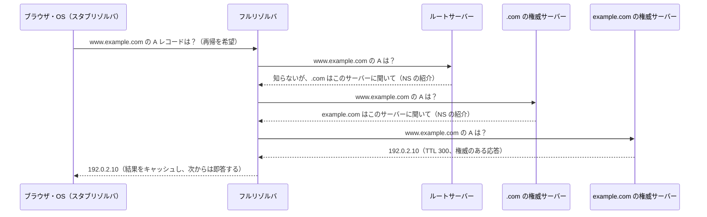
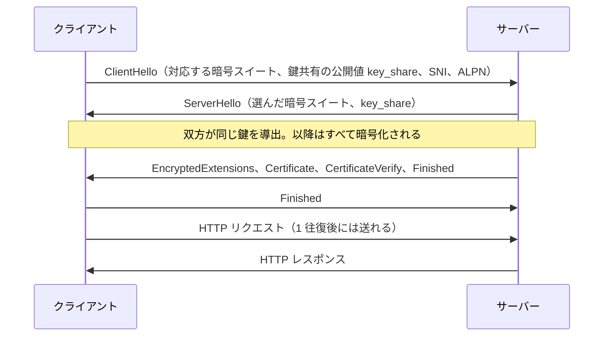

# 5.3 DNS・HTTP・TLS

> URL を開くという何気ない操作の裏では、名前をアドレスに変換し（DNS）、要求と応答をやりとりし（HTTP）、その通信を盗聴・改ざん・なりすましから守っています（TLS）。この 3 つは Web のほぼすべての通信の土台であり、同時に大規模障害の常連でもあります。この章では、3 つのプロトコルを「バイト列として何が流れているか」と「運用で何が起きるか」の両面から理解します。

| 項目 | 内容 |
|---|---|
| 学習時間の目安 | 本文 5h ＋ 演習 7h |
| 前提となる章 | [5.1 階層モデルとIP](../01-layers-and-ip/README.md)、[5.2 TCPとUDP](../02-tcp-and-udp/README.md) |
| 演習 | [exercises/](exercises/)（Python） |
| キーワード | DNS, リゾルバ, TTL, 否定キャッシュ, 名前の圧縮, HTTP/1.1, 冪等性, ステータスコード, chunked, Cache-Control, ETag, Cookie, HTTP/2, HTTP/3, TLS 1.3, 証明書, PKI, ACME, HSTS |

## この章のゴール

- [ ] DNS の階層構造と名前解決の流れを説明し、TTL・キャッシュ（否定キャッシュを含む）を踏まえて DNS の切り替え計画を立てられる
- [ ] DNS メッセージの形式を説明し、名前の圧縮を含む応答を安全に解析するコードを書ける
- [ ] HTTP/1.1 のメッセージ形式・メソッドの性質（安全・冪等）・ステータスコード・持続接続・chunked 転送を説明し、厳格なパーサと小さなサーバーを実装できる
- [ ] HTTP キャッシュ（Cache-Control・ETag・条件付きリクエスト・Vary）の仕組みを説明し、応答の鮮度を計算できる
- [ ] Cookie の属性と、HTTP/2・HTTP/3 が何を改善し何が残るかを説明できる
- [ ] TLS 1.3 のハンドシェイクと証明書の検証の仕組みを説明し、証明書の期限切れを防ぐ運用（自動更新・監視）を設計できる

## なぜ学ぶのか

- **DNS が止まるとすべてが止まる**: 2016 年 10 月 21 日、DNS サービス事業者の Dyn が、マルウェア「Mirai」に感染した大量の IoT 機器（監視カメラや録画機など）から DDoS 攻撃を受けました。Dyn の DNS を使っていた Twitter・GitHub・Netflix・Reddit などが、米国や欧州の多くの利用者から数時間にわたって使えなくなりました。サーバーが正常に動いていても、名前が引けなければ利用者は到達できません。5.1 で見た 2021 年の Facebook の障害も、最後に効いたのは DNS でした。
- **証明書の期限切れ**: 2018 年 12 月 6 日、ソフトバンクの携帯電話サービスが約 4 時間にわたって利用しづらくなりました。エリクソンの発表によれば、原因は通信設備のソフトウェアに含まれていた証明書の期限切れで、同じ日に英国の O2 など他国の事業者でも障害が起きています。2020 年 2 月には Microsoft Teams も、認証に使う証明書の期限切れで利用できなくなりました。期限は何年も前から分かっているのに、今も繰り返し起きる障害です。
- **キャッシュの事故**: 2015 年のクリスマスに、ゲーム配信サービスの Steam で、利用者に他人のアカウントのページが表示される事故が起きました。Valve の発表によれば、DoS 攻撃への対応として行ったキャッシュの設定変更が原因で、約 3 万 4000 人の利用者の情報が他人に表示された可能性があるとされています。個人ごとに異なる応答をキャッシュしてはいけない、という HTTP キャッシュの基本を 1 つ間違えるだけで、情報漏えいになります。
- **解釈のずれは脆弱性になる**: 同じ HTTP のメッセージを、前段のプロキシと後段のサーバーが違う長さで区切ると、攻撃者がリクエストを「密輸」できます（HTTP リクエストスマグリング）。演習で厳格なパーサを書く意味はここにあります。

## 1. DNS — 名前をアドレスに変える

### 1.1 なぜ名前が必要か

IP アドレスは覚えにくいだけでなく、**変わります**。サーバーの移転、クラウドのリージョン切り替え、CDN の利用、障害時の切り替えのたびにアドレスは変わりますが、利用者やほかのシステムに書き換えてもらうわけにはいきません。**DNS（Domain Name System）** は、名前とアドレスの間に「間接参照」を 1 段挟むことで、この問題を解決しています。ソフトウェア工学で繰り返し現れる「間接参照の層を 1 つ足すことで、変更を局所化する」考え方の、最も大規模な成功例です。

### 1.2 階層構造と名前解決

DNS の名前空間は木構造です。`www.example.com.` は右から読み、最後の `.` が **ルート**、その下に `com` のような **TLD（トップレベルドメイン）**、その下に `example.com`、さらに `www.example.com` が続きます。木の各部分（**ゾーン**）の管理を下位に任せる（**委任**）ことで、世界中の名前を 1 か所で管理せずに済んでいます。日本の `.jp` は JPRS（日本レジストリサービス）が管理しています。

名前解決には、役割の違う 2 種類のサーバーが登場します。

- **権威サーバー（authoritative server）**: 自分が管理するゾーンについて、正解を答えるサーバー。
- **フルリゾルバ（再帰リゾルバ、recursive resolver）**: 利用者の代わりに権威サーバーを順にたどって答えを探し、結果をキャッシュするサーバー。ISP やクラウドが提供するものや、Google Public DNS（8.8.8.8）、Cloudflare の 1.1.1.1 などの公開リゾルバがある。

PC やスマートフォンの OS には、フルリゾルバに問い合わせるだけの **スタブリゾルバ** が入っています。キャッシュにない名前を解決する流れは次のとおりです。



ルートサーバーは a〜m の 13 の名前で識別されますが、実体はエニーキャスト（同じ IP アドレスを複数の拠点から広告し、最も近い拠点に届く仕組み）で、世界中に 1,000 を超える拠点があります。実際にはリゾルバが `.com` の情報などをキャッシュしているので、毎回ルートまで問い合わせるわけではありません。

### 1.3 主なレコードタイプ

| タイプ | 内容 | 実務での注意 |
|---|---|---|
| A / AAAA | IPv4 / IPv6 アドレス | 複数あれば、クライアントはいずれか（または順に）使う |
| CNAME | 別名（正式な名前への参照） | その名前にはほかのレコードを置けない。ゾーンの頂点には置けない（1.5 節） |
| MX | メールの配送先（優先度付き） | 指す先は CNAME ではなく、A・AAAA を持つ名前にする |
| TXT | 任意の文字列 | 送信ドメイン認証（SPF・DKIM・DMARC）、ドメイン所有の確認（証明書の発行や SaaS の連携）に使う |
| NS | そのゾーンを管理する権威サーバー | 親ゾーンの NS と子ゾーンの NS が食い違うと、解決が不安定になる |
| SOA | ゾーンの基本情報（プライマリのサーバー、管理者、シリアル番号、否定応答のキャッシュ時間など） | 否定キャッシュの時間の根拠になる |
| CAA | そのドメインの証明書を発行してよい認証局（RFC 8659） | 設定すると、ほかの CA は発行を拒否しなければならない |
| SRV | サービスの場所（優先度・重み・ポート・ホスト。RFC 2782） | 一部のプロトコルやサービスディスカバリで使われる |
| PTR | 逆引き（IP アドレス → 名前） | メールサーバーの信頼性の判定などに使われる |
| HTTPS / SVCB | 接続のためのヒント（HTTP/3 への対応、別名など。RFC 9460） | 比較的新しい。ブラウザや DNS 事業者の対応状況を確認する |

### 1.4 TTL とキャッシュ

各レコードには **TTL（Time To Live、秒）** があり、リゾルバはその時間だけ結果をキャッシュします。キャッシュは DNS の性能と耐障害性の源泉ですが、**変更がすぐには反映されない** ことも意味します。TTL が 86400（1 日）のレコードを書き換えると、最悪 1 日は古いアドレスに接続する利用者が残ります。

サーバーの移転などで DNS を切り替えるときの定石は次のとおりです。

1. **切り替えの前に TTL を下げる**（例: 86400 → 60）。このとき、**古い TTL の時間（1 日）以上前に** 下げておくこと。そうしないと、長い TTL のままキャッシュされた情報が残る。
2. 古い TTL の時間が過ぎたら、レコードを新しいアドレスに書き換える。移行期間は、新旧どちらのサーバーでも正しく応答できるようにしておく。
3. 旧サーバーへのアクセスが十分に減ったことを確認してから止める。TTL を守らないリゾルバや、アドレスを長く握り続けるクライアント（コネクションプール、アプリケーション内の DNS キャッシュ）があるため、TTL が切れた直後にゼロになるとは限らない。
4. 安定したら TTL を元に戻す（短い TTL はリゾルバや権威サーバーへの問い合わせを増やし、権威サーバーの障害の影響も受けやすくする）。

「存在しない」という答えもキャッシュされます（**否定キャッシュ**、RFC 2308）。その時間は、応答に付く SOA レコードの TTL と、SOA の MINIMUM フィールドの小さい方です。新しいサブドメインを作る前にテストで問い合わせてしまうと、作った後もしばらく「存在しない」と答えられ続けるのはこのためです。

### 1.5 CNAME の制約と ALIAS

CNAME を置いた名前には、ほかのレコードを置けません（RFC 1034）。ところが、ゾーンの頂点（**apex**。`example.com` そのもの）には必ず SOA と NS があるので、**apex には CNAME を置けません**。「`example.com` を CDN やロードバランサの名前（`xxx.cdn.example.net`）に向けたい」という、よくある要望がここでぶつかります。

回避策として、多くの DNS 事業者が独自の **ALIAS / ANAME / CNAME フラットニング** 機能を提供しています。権威サーバーが裏で参照先を解決し、その結果を A・AAAA レコードとして返す仕組みです（AWS の Route 53 のエイリアスレコードもこの一種です）。事業者独自の機能なので、DNS 事業者を移行するときには互換性を確認する必要があります。標準の側では、HTTPS レコード（RFC 9460）に apex で別名を指定する方式が用意されています。

### 1.6 DNS メッセージの形式

DNS の問い合わせと応答は、同じ形式のバイナリメッセージです（RFC 1035）。

```text
ヘッダ（12 バイト）: ID | フラグ（QR, OPCODE, AA, TC, RD, RA, RCODE）| 質問数 | 回答数 | 権威数 | 追加数
質問セクション    : 名前 | タイプ | クラス
回答セクション    : リソースレコード（名前 | タイプ | クラス | TTL | データ長 | データ）の並び
権威セクション    : 同上（NS の紹介や、否定応答の SOA）
追加セクション    : 同上（紹介したサーバーのアドレスなど）
```

名前は「長さ 1 バイト＋文字列」のラベルを並べ、長さ 0 で終わります。応答には同じ名前（`example.com` など）が何度も現れるので、2 回目以降は「メッセージの先頭から何バイト目にある名前の続き」という 2 バイトの **圧縮ポインタ** で表します。この圧縮は、悪意あるメッセージで自分自身を指すポインタを作れば、素朴なパーサを無限ループさせられる、という弱点も持っています（演習 3 で対策します）。

演習 3 で実装する関数を使って、実際に公開リゾルバへ問い合わせてみましょう（実行した時点の結果です。TTL は、リゾルバのキャッシュに残っている時間なので、実行のたびに変わります）。

```python
import socket
from dnsmsg import build_query, parse_message, TYPE_A   # 演習 3 の解答

query = build_query("dns.google", TYPE_A, txid=0x2A2A)
print(query.hex(" "))
with socket.socket(socket.AF_INET, socket.SOCK_DGRAM) as s:
    s.settimeout(3)
    s.sendto(query, ("8.8.8.8", 53))           # Google Public DNS（再帰リゾルバ）へ UDP で問い合わせる
    response = parse_message(s.recvfrom(4096)[0])
print("RCODE", response.rcode, "RA", response.ra)
for rr in response.answers:
    print(rr.name, rr.ttl, rr.data)
```

```text
2a 2a 01 00 00 01 00 00 00 00 00 00 03 64 6e 73 06 67 6f 6f 67 6c 65 00 00 01 00 01
RCODE 0 RA True
dns.google 61 8.8.8.8
dns.google 61 8.8.4.4
```

問い合わせは、ヘッダ 12 バイト（ID `2a2a`、フラグ `0100` = 再帰を希望）と、名前 `03 dns 06 google 00`、タイプ A（1）、クラス IN（1）の、わずか 28 バイトです。

DNS は通常 UDP のポート 53 を使い、応答は元々 512 バイトまでに制限されていました。**EDNS(0)**（RFC 6891）の OPT レコードで、より大きな応答を受け取れることを伝えられます。応答が大きすぎて切り詰められた場合はヘッダの TC ビットが立ち、クライアントは TCP で問い合わせ直します。そのため、**DNS サーバーのファイアウォールで TCP の 53 番を閉じてはいけません**。

### 1.7 DNS の障害とセキュリティ

- **DNS 事業者は単一障害点になりうる**: 2016 年の Dyn の事例のように、権威サーバーを 1 つの事業者に任せていると、その事業者の障害がそのまま自社の障害になります。重要なドメインでは、NS レコードに複数の事業者のサーバーを並べる構成が選択肢になります（ただし、ALIAS のような独自機能は使いにくくなります）。
- **キャッシュポイズニング**: リゾルバに偽の応答を信じ込ませる攻撃です。2008 年に Dan Kaminsky が効率的な攻撃手法を公表し、問い合わせの送信元ポートをランダムにする対策が各実装に急いで入れられました。
- **DNSSEC**: レコードに電子署名を付け、応答が改ざんされていないことを検証できるようにする仕組みです。通信の暗号化はしません。
- **DNS over HTTPS / DNS over TLS**: スタブリゾルバとフルリゾルバの間を暗号化し、通信経路での盗聴や改ざんを防ぎます（RFC 8484、RFC 7858）。
- **ドメイン名そのものの管理**: レジストラのアカウントを乗っ取られれば、NS を書き換えられてドメインごと奪われます。ドメインの更新忘れも、証明書の期限切れと同じく古典的な障害の原因です。

## 2. HTTP/1.1

### 2.1 メッセージの形式

HTTP（HyperText Transfer Protocol）は、クライアントが **リクエスト** を送り、サーバーが **レスポンス** を返す、テキストベースのプロトコルです。現在の仕様は、意味論（RFC 9110）、キャッシュ（RFC 9111）、HTTP/1.1 のメッセージ形式（RFC 9112）に分けて 2022 年に整理されました。

実際のやりとりを見てみましょう。Python の標準ライブラリの `http.server` を HTTP/1.1 で応答するよう設定して手元で起動し、`curl -v` で同じ URL に 2 回アクセスします（curl 8.5.0 での出力。一部を省略しています）。

```text
$ curl -sv -o /dev/null -o /dev/null http://127.0.0.1:8766/index.html http://127.0.0.1:8766/index.html
*   Trying 127.0.0.1:8766...
* Connected to 127.0.0.1 (127.0.0.1) port 8766
> GET /index.html HTTP/1.1
> Host: 127.0.0.1:8766
> User-Agent: curl/8.5.0
> Accept: */*
>
< HTTP/1.1 200 OK
< Server: SimpleHTTP/0.6 Python/3.11.15
< Date: Mon, 28 Sep 2026 23:42:58 GMT
< Content-type: text/html
< Content-Length: 60
< Last-Modified: Tue, 01 Sep 2026 12:00:00 GMT
<
* Connection #0 to host 127.0.0.1 left intact
* Re-using existing connection with host 127.0.0.1
> GET /index.html HTTP/1.1
> Host: 127.0.0.1:8766
（2 回目のリクエストとレスポンスは同じ内容なので省略）
```

`>` がクライアントの送ったリクエスト、`<` がサーバーのレスポンスです。

- **リクエスト行** `GET /index.html HTTP/1.1`: メソッド・リクエストターゲット・バージョン。
- **ヘッダ（フィールド）** `名前: 値`: 名前は大文字小文字を区別しません（上の `Content-type` のような書き方も正しい）。HTTP/1.1 では `Host` が必須で、1 つの IP アドレスで複数のサイトを運用できるのはこのおかげです。
- **空行** がヘッダの終わりを示し、その後に **本文（ボディ）** が続きます。
- 1 回目の後に「left intact」、2 回目の前に「Re-using existing connection」とあるとおり、HTTP/1.1 は既定で接続を使い回します（**持続接続**、keep-alive）。

### 2.2 メソッドの意味 — 安全性と冪等性

HTTP のメソッドには、プロトコルとして約束された性質があります。

| メソッド | 安全 | 冪等 | 主な用途 |
|---|---|---|---|
| GET | ○ | ○ | 取得 |
| HEAD | ○ | ○ | 取得（ヘッダだけ）。本文なしで大きさや更新日時を確かめる |
| OPTIONS | ○ | ○ | 使える機能の問い合わせ（CORS の事前確認。[5.4](../04-web-architecture/README.md)） |
| PUT | — | ○ | 指定した URL のリソースを、送った内容で置き換える |
| DELETE | — | ○ | 削除 |
| POST | — | — | 処理の依頼（作成・送信など） |
| PATCH | — | —（設計による） | 部分的な更新 |

- **安全（safe）**: サーバーの状態を変えない（ことをクライアントが期待してよい）。クローラーやプリフェッチは、安全なメソッドのリンクなら勝手にたどります。「GET /delete?id=1」のような設計が危険なのはこのためです。
- **冪等（idempotent）**: 同じリクエストを 1 回送っても複数回送っても、サーバーの状態への効果が同じ。**冪等なリクエストは、失敗やタイムアウトの後に安全に再送できます**。POST は冪等ではないので、「決済 API の呼び出しがタイムアウトしたので再送したら、二重に決済された」という事故が起きます。そのため多くの決済 API は、クライアントが付けた一意なキー（Idempotency-Key ヘッダなど）で重複を検出する仕組みを持っています（[9.4 API設計](../../09-architecture/04-api-design/README.md)）。

### 2.3 ステータスコード

| コード | 意味 | 実務での使い分け |
|---|---|---|
| 200 OK / 201 Created / 204 No Content | 成功 | 作成なら 201 と `Location`、本文がなければ 204 |
| 301 / 308 | 恒久的な移動 | 308 はメソッドと本文を変えずに転送させる |
| 302 / 303 / 307 | 一時的な移動 | POST の後に結果ページへ GET させるなら 303。307 はメソッドを保つ |
| 304 Not Modified | 変わっていない | 条件付きリクエスト（3 節）への応答。本文なし |
| 400 Bad Request | リクエストが不正 | 構文の誤りなど |
| 401 Unauthorized / 403 Forbidden | 認証が必要 / 権限がない | 401 は「誰か分からない」、403 は「誰かは分かるが許可しない」 |
| 404 Not Found / 405 Method Not Allowed | ない / そのメソッドは使えない | 405 には使えるメソッドの一覧（`Allow`）を付ける |
| 409 Conflict / 412 Precondition Failed | 競合 / 前提条件の不成立 | 楽観的ロック（`If-Match`）の失敗に 412 |
| 413 / 414 / 431 | 本文・URI・ヘッダが大きすぎる | サーバーの上限の設定 |
| 429 Too Many Requests | レート制限 | `Retry-After` で待ち時間を伝える |
| 500 Internal Server Error | サーバー内部のエラー | アプリケーションの例外など |
| 502 Bad Gateway / 503 Service Unavailable / 504 Gateway Timeout | 上流の不正な応答 / 一時的に利用不可 / 上流のタイムアウト | どの層で失敗したかの手がかりになる（[5.4](../04-web-architecture/README.md)） |

### 2.4 本文の長さと持続接続

5.2 で見たとおり、TCP はメッセージの区切りを運ばないので、HTTP は本文の長さを自分で示す必要があります。方法は 2 つです。

- **Content-Length**: 本文のバイト数を先に書く。
- **chunked 転送**（`Transfer-Encoding: chunked`）: 本文を「16 進数の長さ＋データ」のかたまり（チャンク）に分けて送り、長さ 0 のチャンクで終わる。生成しながら送るので、全体の大きさが事前に分からない応答（動的に生成するページ、ストリーミング）に使う。

```text
POST /upload HTTP/1.1
Host: example.com
Transfer-Encoding: chunked

5
Hello
7
, world
0

```

（各行の区切りは CRLF。本文は `Hello, world` の 12 バイトになります。）

持続接続では、応答を受け取り終えた後に同じ接続で次のリクエストを送ります。応答を待たずに複数のリクエストを送る **パイプライン化** も仕様にはありますが、応答は順番に返す必要があるので、1 つの遅い応答が後ろを詰まらせる HOL ブロッキングが起き、実際にはほとんど使われていません。ブラウザはその代わりに、1 つのホストに対して複数（一般に 6 本程度）の接続を並行して張ります。

長さの指定があいまいなメッセージは危険です。例えば、`Content-Length` と `Transfer-Encoding: chunked` の両方を持つリクエストを、前段のプロキシが Content-Length で、後段のサーバーが chunked で区切ると、後段は「0 のチャンクで本文は終わり、残りのバイト列は次のリクエスト」と解釈します。攻撃者はこのずれを使って、別の利用者のリクエストの前に自分のリクエストを差し込めます。これが **HTTP リクエストスマグリング** で、RFC 9112 が両方を持つメッセージを「エラーとして扱うべき」としている理由です。演習 1 のパーサは、こうしたメッセージを拒否します。

```python
from http11 import parse_request, HTTPParseError   # 演習 1 の解答
data = (b"POST /search HTTP/1.1\r\nHost: example.com\r\n"
        b"Content-Length: 13\r\nTransfer-Encoding: chunked\r\n\r\n"
        b"0\r\n\r\nSMUGGLED")
try:
    parse_request(data)
except HTTPParseError as exc:
    print(exc.status, exc.message)   # 400 Transfer-Encoding と Content-Length が両方あります
```

詳しい攻撃と対策は [11.4 Webアプリケーションセキュリティ](../../11-security/04-web-security/README.md) で扱います。

### 2.5 コンテンツネゴシエーション

同じ URL でも、クライアントの希望に応じて違う表現を返せます。クライアントは `Accept`（形式）、`Accept-Language`（言語）、`Accept-Encoding`（圧縮方式: gzip, br, zstd など）で希望を伝え、サーバーは選んだ表現を `Content-Type`・`Content-Language`・`Content-Encoding` で示します。このとき、**どのリクエストヘッダによって応答が変わるか** を `Vary` ヘッダで示すことが重要です（次節）。

## 3. HTTP キャッシュ

### 3.1 鮮度 — そのまま使ってよいか

キャッシュには、ブラウザの中の **プライベートキャッシュ** と、CDN やプロキシのように多数の利用者で共有する **共有キャッシュ** があります。サーバーは `Cache-Control` ヘッダで、応答をどう保存・再利用してよいかを指示します。

| ディレクティブ | 意味 |
|---|---|
| `max-age=N` | 受け取ってから N 秒間は新鮮（そのまま使ってよい） |
| `s-maxage=N` | 共有キャッシュ用の max-age（共有キャッシュでは max-age より優先） |
| `no-store` | 保存してはいけない |
| `no-cache` | 保存してよいが、使う前に **必ず** オリジンに確認（再検証）する |
| `private` | ブラウザは保存してよいが、共有キャッシュは保存してはいけない |
| `public` | 共有キャッシュも保存してよい（`Authorization` 付きのリクエストへの応答でも） |
| `must-revalidate` | 期限が切れたら、必ず再検証する（オリジンに接続できなくても古いものを返さない） |
| `immutable` | 新鮮な間は、利用者がリロードしても再検証しなくてよい（RFC 8246） |
| `stale-while-revalidate=N` | 期限切れから N 秒間は、古いものを返しつつ裏で更新してよい（RFC 5861） |

`no-cache` は名前に反して「キャッシュするな」ではありません。「キャッシュするな」は `no-store` です。この取り違えは非常によくあります。

キャッシュは、応答の **鮮度の寿命**（`s-maxage` → `max-age` → `Expires − Date` → 経験則、の順に決まる）と、**現在の経過時間**（受け取ってからの時間に、経路上のキャッシュでの滞在時間 `Age` や、時計のずれを補正したもの）を比べ、`寿命 > 経過時間` なら新鮮と判断します（RFC 9111 の 4.2 節。演習 4 で実装します）。明示的な指示がない応答にも、最終更新日時からの経過時間の 10% 程度を寿命とみなす **経験的な鮮度** が適用されうるので、キャッシュさせたくない応答には明示的に指示を付けるべきです。

### 3.2 再検証と条件付きリクエスト

期限が切れても、中身が変わっていなければ、データを送り直す必要はありません。サーバーは応答に **検証子（validator）** を付けておきます。

- `ETag: "a1b2c3"`: 内容を表す識別子（内容のハッシュなど）
- `Last-Modified: Tue, 01 Sep 2026 12:00:00 GMT`: 最終更新日時

キャッシュは、再検証のときに `If-None-Match: "a1b2c3"` や `If-Modified-Since: …` を付けた **条件付きリクエスト** を送ります。変わっていなければ、サーバーは本文のない **304 Not Modified** を返し、キャッシュは手元のものを使い続けます。先ほどの `http.server` で試すと次のとおりです（実際の出力。一部を省略しています）。

```text
$ curl -sv -o /dev/null -H "If-Modified-Since: Tue, 01 Sep 2026 12:00:00 GMT" http://127.0.0.1:8765/index.html
> GET /index.html HTTP/1.1
> Host: 127.0.0.1:8765
> If-Modified-Since: Tue, 01 Sep 2026 12:00:00 GMT
>
< HTTP/1.0 304 Not Modified
< Server: SimpleHTTP/0.6 Python/3.11.15
< Date: Mon, 28 Sep 2026 23:42:26 GMT
```

（こちらは `http.server` の既定の設定で起動したため、応答のバージョンが HTTP/1.0 になっています。）

条件付きリクエストは、更新の競合を防ぐのにも使えます。`If-Match: "a1b2c3"` を付けた PUT は、その間に誰かが更新していれば 412 で失敗するので、「最後に書いた人が勝つ」上書き事故を防げます（楽観的ロック。[6.3](../../06-databases/03-transactions/README.md)）。

### 3.3 Vary と共有キャッシュの事故

共有キャッシュは、URL をキーにして応答を保存します。しかし、`Accept-Encoding` や `Accept-Language` によって応答が変わるなら、URL だけをキーにすると、gzip を理解しないクライアントに gzip の応答を返すといった事故が起きます。`Vary: Accept-Encoding` のように、応答を選ぶのに使ったリクエストヘッダを示すと、キャッシュはそのヘッダの値ごとに別々に保存します。

最も深刻なのは、**利用者ごとに内容が違う応答**（ログイン後のページ、個人情報を含む API の応答）を共有キャッシュが保存してしまうことです。冒頭の Steam の事故がこれにあたります。個人ごとの応答には `Cache-Control: private`（または `no-store`）を付け、CDN の設定でも「Cookie や Authorization を含むリクエストはキャッシュしない」ことを確認します。

### 3.4 実践のパターン

| 対象 | 設定の例 | 理由 |
|---|---|---|
| ファイル名にハッシュを含む静的ファイル（`app.3f9a2c.js`） | `Cache-Control: public, max-age=31536000, immutable` | 内容が変わればファイル名が変わるので、永久にキャッシュしてよい |
| HTML | `Cache-Control: no-cache`（と ETag） | 毎回確認するが、変わっていなければ 304 で軽く済む。新しい静的ファイルへの参照をすぐに反映できる |
| 個人ごとの API の応答 | `Cache-Control: private, no-store` など | 共有キャッシュに保存させない |
| 公開 API の応答 | `Cache-Control: public, s-maxage=60, stale-while-revalidate=30` など | CDN で短時間キャッシュし、オリジンの負荷を減らす（[5.4](../04-web-architecture/README.md)） |

## 4. Cookie

HTTP 自体は、リクエスト同士を関連付けない **ステートレス** なプロトコルです。ログイン状態などを保つために、サーバーは `Set-Cookie` ヘッダで小さなデータをブラウザに保存させ、ブラウザは以後のリクエストにそれを `Cookie` ヘッダで付けて送ります。

```python
from http.cookies import SimpleCookie

cookie = SimpleCookie()
cookie["session_id"] = "3f1c9a"
cookie["session_id"].update({"path": "/", "max-age": 3600, "secure": True, "httponly": True, "samesite": "Lax"})
print(cookie.output())
# Set-Cookie: session_id=3f1c9a; HttpOnly; Max-Age=3600; Path=/; SameSite=Lax; Secure
```

| 属性 | 意味 | 推奨 |
|---|---|---|
| `Domain` | 送信先のドメインの範囲。指定するとサブドメインにも送られる | セッションには指定しない（発行したホストだけに送られる） |
| `Path` | 送信先のパスの範囲 | 通常は `/` |
| `Expires` / `Max-Age` | 有効期限。なければブラウザを閉じるまで | 必要最小限の期間に |
| `Secure` | HTTPS のときだけ送る | 常に付ける |
| `HttpOnly` | JavaScript から読めなくする | セッションには必ず付ける（XSS で盗まれにくくする） |
| `SameSite` | 他サイトから始まったリクエストに付けて送るか（`Strict` / `Lax` / `None`） | `Lax` 以上。`None` にするなら `Secure` が必須 |

名前を `__Host-` で始めると、「`Secure` 付き・`Domain` なし・`Path=/`」でなければブラウザが受け付けない、という制約を課せます。サードパーティ Cookie（閲覧中のサイトとは別のドメインの Cookie）の扱いはブラウザごとに方針が異なり、変化も続いているので、依存する設計は避けるのが無難です。セッションの設計は [11.3 認証と認可](../../11-security/03-authn-authz/README.md)、CSRF などの攻撃は [11.4](../../11-security/04-web-security/README.md) で扱います。

## 5. HTTP/2 と HTTP/3

### 5.1 HTTP/2

HTTP/1.1 では、1 本の接続で同時に扱えるリクエストは 1 つです。ページの表示に数十〜数百のリソースが必要な現代の Web では、接続を何本も張る必要があり、そのたびにハンドシェイクのコストがかかります。**HTTP/2**（2015 年、現在の仕様は RFC 9113）は、メッセージを **バイナリのフレーム** に分割し、1 本の接続の上に多数の **ストリーム** を多重化します。

- **多重化**: 多数のリクエストと応答を、1 本の TCP 接続の上で並行してやりとりできる。
- **ヘッダ圧縮（HPACK、RFC 7541）**: よく使うヘッダの表（静的な表と、接続ごとに学習する動的な表）を使い、毎回ほぼ同じヘッダを送るむだを省く。
- **ストリームごとのフロー制御と優先度**。
- 実際のブラウザは TLS の上でしか HTTP/2 を使いません。どのプロトコルを使うかは、TLS のハンドシェイクの中の **ALPN** で合意します。

一方で、1 本の TCP 接続にまとめたことで、**TCP の 1 パケットの損失がすべてのストリームを止める**（TCP レベルの HOL ブロッキング、[5.2](../02-tcp-and-udp/README.md)）という弱点が目立つようになりました。サーバーから先回りしてリソースを送る **サーバープッシュ** は、効果が限定的だったことなどから、主要なブラウザでは使われなくなりました。

### 5.2 HTTP/3

**HTTP/3**（RFC 9114、2022 年）は、HTTP/2 の考え方を QUIC（[5.2](../02-tcp-and-udp/README.md)）の上に載せ直したものです。ストリームの多重化を QUIC 自身が行うので、あるストリームの損失は他のストリームを止めません。ヘッダ圧縮も、順番が入れ替わりうる QUIC に合わせた **QPACK**（RFC 9204）に変わりました。ブラウザは最初は TCP で接続し、サーバーが `Alt-Svc` ヘッダや DNS の HTTPS レコードで「HTTP/3 も使える」と伝えると、次から QUIC で接続します。

| | HTTP/1.1 | HTTP/2 | HTTP/3 |
|---|---|---|---|
| 形式 | テキスト | バイナリのフレーム | バイナリのフレーム |
| トランスポート | TCP | TCP（実質的に TLS 必須） | QUIC（UDP の上、TLS 1.3 内蔵） |
| 多重化 | なし（接続を複数張る） | 1 本の接続に多数のストリーム | 1 本の接続に独立した多数のストリーム |
| ヘッダ圧縮 | なし | HPACK | QPACK |
| HOL ブロッキング | リクエスト単位 | TCP のレベルで残る | 同じストリームの中だけ |
| 仕様 | RFC 9112 | RFC 9113 | RFC 9114 |

## 6. TLS

### 6.1 TLS が守るもの

**TLS（Transport Layer Security）** は、TCP（や QUIC）の上で、次の 3 つを提供します。

1. **機密性**: 通信の内容を第三者に読まれない。
2. **完全性**: 途中で改ざんされたら検出できる。
3. **認証**: 通信相手が本当にそのドメインの持ち主であることを、証明書で確かめられる。

逆に、TLS が **隠さないもの** もあります。IP アドレスとポート、通信の量とタイミング、そして多くの場合は接続先のホスト名（後述の SNI）です。HTTPS にしても「どのサイトにアクセスしたか」は、経路上から推測されうるのです。

### 6.2 TLS 1.3 のハンドシェイク

**TLS 1.3**（RFC 8446、2018 年）は、それ以前の版から大幅に整理されました。ハンドシェイクは 1 往復（1-RTT）で完了します。



- **鍵共有（ECDHE）**: クライアントとサーバーがそれぞれ一時的な鍵ペアを作り、公開値を交換して共通の秘密を導きます。通信のたびに鍵を使い捨てるので、後でサーバーの秘密鍵が漏れても、過去の通信は解読できません（**前方秘匿性、forward secrecy**）。
- **認証**: サーバーは証明書（Certificate）を送り、証明書の公開鍵に対応する秘密鍵でハンドシェイクの内容に署名（CertificateVerify）して、その証明書の持ち主であることを示します。
- **整理**: RSA による鍵交換、CBC モードの暗号、圧縮、再ネゴシエーションなど、過去に脆弱性の原因となった機能は削除され、暗号は認証付き暗号（AES-GCM、ChaCha20-Poly1305 など）だけになりました。TLS 1.0 と 1.1 は RFC 8996（2021 年）で廃止されています。

再接続のときは、前回の接続で得た情報を使って、最初のメッセージと一緒にデータを送る **0-RTT** も可能です。ただし 0-RTT のデータは、攻撃者が記録して再送（リプレイ）できるので、**冪等なリクエストにしか使ってはいけません**。サーバーは危険なリクエストを `425 Too Early` で拒否できます（RFC 8470）。

手元で TLS 1.3 の接続を確かめてみましょう。テスト用の認証局（CA）と、`localhost` 用のサーバー証明書を作ります。

```bash
openssl req -x509 -newkey ec -pkeyopt ec_paramgen_curve:P-256 -nodes -keyout ca.key -out ca.pem \
  -days 30 -subj "/CN=Study CS Test CA"
openssl req -newkey ec -pkeyopt ec_paramgen_curve:P-256 -nodes -keyout server.key -out server.csr \
  -subj "/CN=localhost"
printf "subjectAltName=DNS:localhost,IP:127.0.0.1\nextendedKeyUsage=serverAuth\n" > ext.cnf
openssl x509 -req -in server.csr -CA ca.pem -CAkey ca.key -CAcreateserial -out server.pem -days 30 -extfile ext.cnf
```

```python
import socket
import ssl
import threading

server_ctx = ssl.SSLContext(ssl.PROTOCOL_TLS_SERVER)
server_ctx.load_cert_chain("server.pem", "server.key")        # サーバー証明書と秘密鍵
listener = socket.create_server(("127.0.0.1", 0))
port = listener.getsockname()[1]

def serve():
    for _ in range(2):
        conn, _ = listener.accept()
        try:
            with server_ctx.wrap_socket(conn, server_side=True) as tls:
                tls.sendall(b"hello over TLS\n")
        except (ssl.SSLError, OSError):
            pass                                              # 検証に失敗したクライアントは切断する

threading.Thread(target=serve, daemon=True).start()

client_ctx = ssl.create_default_context(cafile="ca.pem")     # 信頼するルート = テスト用の CA
with socket.create_connection(("127.0.0.1", port)) as raw:
    with client_ctx.wrap_socket(raw, server_hostname="localhost") as tls:   # SNI と名前の検証に使う
        print(tls.version(), tls.cipher()[0])
        cert = tls.getpeercert()
        print(cert["subject"], cert["subjectAltName"])
        print(tls.recv(100))

with socket.create_connection(("127.0.0.1", port)) as raw:
    try:
        client_ctx.wrap_socket(raw, server_hostname="www.example.com")      # 証明書にない名前
    except ssl.SSLCertVerificationError as exc:
        print("検証エラー:", exc.verify_message)
```

```text
TLSv1.3 TLS_AES_256_GCM_SHA384
((('commonName', 'localhost'),),) (('DNS', 'localhost'), ('IP Address', '127.0.0.1'))
b'hello over TLS\n'
検証エラー: Hostname mismatch, certificate is not valid for 'www.example.com'.
```

（OpenSSL 3.0 での実行結果。選ばれる暗号スイートは OpenSSL の版や設定で変わります。）障害調査では `openssl s_client` がよく使われます。信頼する CA を指定した場合としない場合を比べると、次のようになります。

```text
$ openssl s_client -connect 127.0.0.1:8443 -servername localhost -CAfile ca.pem -brief
CONNECTION ESTABLISHED
Protocol version: TLSv1.3
Ciphersuite: TLS_AES_256_GCM_SHA384
Peer certificate: CN = localhost
Hash used: SHA256
Signature type: ECDSA
Verification: OK
Server Temp Key: X25519, 253 bits

$ openssl s_client -connect 127.0.0.1:8443 -servername localhost -brief
depth=0 CN = localhost
verify error:num=20:unable to get local issuer certificate
depth=0 CN = localhost
verify error:num=21:unable to verify the first certificate
CONNECTION ESTABLISHED
```

2 つ目は、発行元の証明書を信頼できないため検証に失敗していますが、それでも接続自体は確立しています。`s_client` は既定では検証に失敗しても接続を続けるので、**必ず検証結果の行を確認** してください（`-verify_return_error` を付けると、失敗時に接続を中止します）。本番のサーバーで「unable to get local issuer certificate」が出るときは、サーバーが **中間証明書** を送っていないことがよくあります。

### 6.3 証明書と PKI

証明書（X.509 形式）は、「この公開鍵は、このドメイン名の持ち主のものである」ことを、**認証局（CA、Certificate Authority）** が電子署名で保証した文書です。

- **信頼の連鎖**: サーバーの証明書（エンドエンティティ証明書）は中間 CA が署名し、中間 CA の証明書はルート CA が署名しています。ルート CA の証明書は OS やブラウザに最初から組み込まれた **トラストストア** にあり、クライアントはサーバーから受け取った証明書の連鎖を、トラストストアのルートまでたどって検証します。サーバーは自分の証明書と中間証明書を送る必要があります（ブラウザは欠けた中間証明書を補えることがありますが、ほかのクライアントでは失敗します）。
- **名前の確認**: 証明書の **SAN（Subject Alternative Name）** 拡張に、接続先のホスト名が含まれているかを確認します。上の例の「Hostname mismatch」がこれにあたります。
- **有効期間の確認**: 期限切れの証明書は拒否されます。クライアントの時計が大きく狂っていても失敗します。
- **失効**: 秘密鍵の漏えいなどで期限前に無効にする仕組み（CRL、OCSP）もありますが、プライバシーや可用性の問題からブラウザごとに扱いが異なり、「有効期間そのものを短くして、失効に頼る範囲を減らす」考え方が広がっています。
- **Certificate Transparency（CT）**: 公的に信頼される CA が発行した証明書は、誰でも閲覧できる追記専用のログに登録され、主要なブラウザはログへの登録を要求しています。自社のドメインに身に覚えのない証明書が発行されていないかを、CT ログで監視できます。
- **CA/Browser Forum**: CA とブラウザの開発元で構成される業界団体で、公的に信頼される証明書の発行ルール（Baseline Requirements）を定めています。

### 6.4 証明書の有効期間の短縮と自動化

証明書の最大有効期間は短くなり続けています。2020 年 9 月以降、主要なブラウザは 398 日を超える有効期間の証明書を受け入れなくなりました。さらに、2025 年に CA/Browser Forum で可決された投票（SC-081）により、最大有効期間は 2026 年 3 月から 200 日、2027 年 3 月から 100 日、2029 年 3 月から 47 日へと段階的に短縮される予定です（2026 年時点の情報です。最新のスケジュールは CA/Browser Forum の Baseline Requirements で確認してください）。

47 日ごとの更新を、手作業とカレンダーのリマインダーで回すことは現実的ではありません。**証明書の発行と更新は自動化が前提** になります。

- **ACME**（RFC 8555）: CA と自動でやりとりして、ドメインの所有を確認し（HTTP の特定のパスにファイルを置く、DNS に TXT レコードを置く、など）、証明書を発行・更新するプロトコルです。無料の CA である **Let's Encrypt** がこの方式を普及させました。
- クラウドのマネージドな証明書（ロードバランサや CDN に統合されたもの）は、更新まで自動で行います。
- **自動化したうえで、期限を監視する**。自動更新は、DNS の設定変更や権限の変更で黙って失敗することがあります。すべての証明書の期限を外部から定期的に確認し、残り日数が閾値を切ったら通知します。

### 6.5 mTLS・HSTS・SNI・ECH

- **mTLS（相互 TLS）**: サーバーだけでなくクライアントも証明書を提示し、互いに認証します。サービス間の通信や、パスワードに頼らない機器の認証に使われます（[5.4](../04-web-architecture/README.md) のサービスメッシュ、[11.1](../../11-security/01-security-principles/README.md) のゼロトラスト）。
- **HSTS**（RFC 6797）: `Strict-Transport-Security: max-age=31536000; includeSubDomains` を受け取ったブラウザは、以後そのドメインに HTTP ではなく必ず HTTPS で接続します。最初のアクセスが HTTP だと、そこで盗聴・改ざんされる余地があるので、ブラウザに組み込まれた **プリロードリスト** に登録する方法もあります。
- **SNI**（Server Name Indication、RFC 6066）: 1 つの IP アドレスで複数のドメインの証明書を使い分けるため、クライアントは ClientHello で接続先のホスト名を送ります。これは暗号化されないので、経路上から接続先が見えます。
- **ECH**（Encrypted Client Hello）: ClientHello の中身（SNI を含む）を暗号化する拡張で、IETF で標準化が進められ、一部のブラウザと CDN で使われ始めています（2026 年時点の状況は、各ベンダーの情報を確認してください）。

### 6.6 期限切れの証明書という古典的な障害

冒頭の事例のように、証明書の期限切れは今も大規模障害の原因になります。見落とされやすいのは次のような証明書です。

- 社内システム、管理画面、サービス間通信（mTLS）、VPN の証明書
- 機器やソフトウェアに組み込まれた証明書（冒頭のエリクソンの事例）
- クライアント側の **トラストストア** の問題。2021 年 9 月には、Let's Encrypt が使っていた古いルート証明書（DST Root CA X3）の期限切れにより、更新されていない古い端末やライブラリから接続できなくなる問題が起きました。

対策の基本は、①証明書の台帳を作る（CT ログやスキャンで漏れを探す）、②更新を自動化する、③期限を外から監視する、④更新の担当者と手順を決めておく、の 4 つです。

## よくある落とし穴

1. **TTL を下げずに DNS を切り替える**。長い TTL でキャッシュされた古いアドレスに、数時間〜1 日アクセスが続きます。旧 TTL の時間以上前に TTL を下げ、移行期間は新旧の両方で応答できるようにします。
2. **apex に CNAME を置こうとする、MX の先を CNAME にする**。DNS の仕様上できない・してはいけない構成で、DNS 事業者によっては設定できても動作が不安定になります。ALIAS などの機能や、A・AAAA レコードを使います。
3. **POST を自動でリトライする**。冪等でないリクエストの再送は、二重の注文や決済を生みます。リトライするのは冪等なリクエストか、冪等性キーで重複を検出できる API だけにします。
4. **`no-cache` を「キャッシュしない」の意味で使う**。`no-cache` は保存を許します。保存させたくないなら `no-store` です。また、利用者ごとに異なる応答に `private` を付け忘れると、CDN が他人の情報を配信する事故になります。
5. **HTTP のメッセージを緩く解釈する**。Content-Length と Transfer-Encoding の矛盾、ヘッダ名の前後の空白、単独の LF などを「親切に」受け入れると、前段の機器と解釈がずれてリクエストスマグリングの原因になります。自作のパーサは避け、使う製品は最新に保ちます。
6. **Cookie の属性を付けない**。`Secure`・`HttpOnly`・`SameSite` のないセッション Cookie は、盗聴・XSS・CSRF に弱くなります。`Domain` を広く指定すると、サブドメインの別サービスにまで送られます。
7. **TLS の検証を無効にしたコードを残す**。「テストのために」`verify=False` にした HTTP クライアントや、自己署名証明書を無条件に信頼する設定が本番に紛れ込むと、中間者攻撃を防げません。テストでもテスト用の CA を信頼させる方法をとります。
8. **証明書の更新を人に頼る**。有効期間の短縮により、手作業の更新は必ずどこかで漏れます。自動化し、期限を監視し、中間証明書も含めて正しく配信されているかを外部から確認します。

## CTOの視点

1. **DNS とドメインは「会社の住所」として守る**。ドメインのレジストラと DNS 事業者のアカウントは、乗っ取られれば全サービスを奪われる最重要の資産です。多要素認証、レジストラロック、更新の自動化、担当者の退職時の引き継ぎを確認しましょう。障害への備えとして、DNS 事業者の冗長化（複数事業者）を検討するかどうかは、サービスの重要度と運用の複雑さを比べて判断します。
2. **証明書のライフサイクル管理を組織の能力にする**。有効期間が 47 日に向かう中、「どの証明書が、どこで使われ、誰が、どうやって更新しているか」を即答できる状態が必要です。設計レビューでは「この証明書は自動更新されるか。失敗したら誰が気付くか」を必ず問いましょう。証明書の管理ツールやマネージドサービスへの投資は、障害 1 回分の損失と比べて判断します。
3. **キャッシュの方針はコストと事故のリスクの両方を決める**。CDN のヒット率はオリジンのサーバー代と応答速度を大きく左右しますが、個人情報を含む応答のキャッシュは即座に情報漏えいになります。「どの応答をどこでキャッシュするか」をチームごとの判断に任せず、ヘッダの付け方と CDN の設定の標準を決め、レビューの観点にします。
4. **プロトコルの世代交代は、顧客の互換性とセットで決める**。TLS 1.0・1.1 の無効化、HTTP/2・HTTP/3 の有効化、古い暗号スイートの廃止は、セキュリティと性能の改善である一方、古い端末や取引先のシステム（古い Java や組み込み機器など）を切り捨てる判断でもあります。実際のクライアントの内訳を計測し、影響する顧客に事前に周知する計画を立てましょう。
5. **採用では「URL を入力したら何が起きるか」を深掘りする**。定番の質問ですが、DNS のキャッシュ、TLS の検証、HTTP の意味論、キャッシュの判断まで、どこまで深く正確に説明できるかで理解度がよく分かります。候補者が実際に調査した DNS や証明書の障害の話を聞くのも有効です。

## 演習

演習コードは [exercises/](exercises/) にあります。docstring に仕様が書いてあるので、`raise NotImplementedError(...)` を実装に置き換えてください。`mini_http_server.py` は `http11.py` を使うので、演習 1 を先に解いてください。DNS の応答のサンプルは [exercises/data/](exercises/data/) にあり、各バイトの意味とオフセットが注釈されています。

```bash
python3 tools/check.py 5.3        # リポジトリのルートで実行
python3 tools/check.py -v 5.3     # 詳しい出力
```

| # | 難易度 | 内容 | 対象ファイル / 関数 |
|---|---|---|---|
| 1 | ★★☆ | HTTP/1.1 のリクエストの厳格なパーサ（大文字小文字を区別しない複数値のヘッダ、Content-Length、chunked、上限と不正な入力の拒否）とレスポンスの組み立て | `http11.py`: `Headers`, `Request.keep_alive`, `parse_request`, `serialize_response` |
| 2 | ★★★ | ソケットから作る HTTP/1.1 サーバー（ルーティング、持続接続、パイプライン化、404・405・500、HEAD、アイドルタイムアウト） | `mini_http_server.py`: `Router`, `MiniHTTPServer` |
| 3 | ★★★ | DNS の問い合わせの組み立てと、名前の圧縮（ループ対策を含む）を含む応答の解析 | `dnsmsg.py`: `encode_name`, `build_query`, `decode_name`, `parse_message` |
| 4 | ★★☆ | HTTP キャッシュの鮮度の寿命・経過時間の計算と、fresh / stale / must-revalidate の判定 | `http_cache.py`: `parse_cache_control`, `parse_http_date`, `freshness_lifetime`, `current_age`, `cache_status` |
| 5 | ★★☆ | 記述: サービスの移転に伴う DNS と証明書の切り替え計画（下記） | — |

演習 2 を解いたら、サーバーを起動して `curl -v` でアクセスしてみましょう（`mini_http_server.py` の docstring に手順があります）。演習 3 を解いたら、本文の例のように公開リゾルバへ実際に問い合わせてみてください（ネットワークの環境によっては UDP の 53 番が使えないことがあります）。

### 演習 5（記述）: サービスの移転計画

あなたのチームは、`shop.example.com` で運用している EC サイトを、オンプレミスのデータセンターからクラウドへ移転します。現状は次のとおりです。移転の当日から前後数週間の、DNS と証明書に関する作業計画を書いてください。

- `shop.example.com` は A レコード（TTL 86400）で、データセンターのロードバランサの IP アドレスを指している。
- `example.com`（apex）でも同じサイトを表示しており、こちらも A レコード（TTL 86400）。
- 証明書は、データセンターのロードバランサに手作業で設置している（有効期間の残りは 5 か月）。
- 移転先では、クラウドのロードバランサ（固定の IP アドレスはなく、`xxxx.elb.example-cloud.com` のような名前で提供される）を使う。
- 決済の外部サービスから、`shop.example.com` 宛てに Webhook（結果の通知）が届く。外部サービス側は、送信先の IP アドレスをキャッシュしている可能性がある。

<details>
<summary>解答例</summary>

**事前準備（2 週間前〜）**

- 移転先のロードバランサ用に証明書を用意する。クラウドのマネージド証明書（ACME による自動更新）を使い、DNS による所有確認（TXT や CNAME）を先に済ませておく。`example.com` と `shop.example.com` の両方を SAN に含める。
- 移転先で、本番と同じ名前の Host ヘッダでアクセスして動作を確認する（`curl --resolve shop.example.com:443:<移転先のIP>` のように、DNS を変えずに試す）。
- CAA レコードを設定している場合は、移転先の証明書の発行元が許可されているか確認する。

**TTL を下げる（切り替えの 2 日以上前）**

- `shop.example.com` と `example.com` の TTL を 86400 から 60〜300 に下げる。旧 TTL（1 日）が経過するまで待ってから切り替える。

**切り替え当日**

- `shop.example.com` を、移転先のロードバランサの名前への CNAME に変更する。
- `example.com` は apex なので CNAME を置けない。DNS 事業者の ALIAS 機能（またはクラウドの DNS サービスのエイリアスレコード）を使う。対応していなければ、DNS の移行も計画に含めるか、`example.com` は移転先の固定アドレスのリダイレクト用サーバーから `shop.example.com` へ 301 で転送する。
- 旧環境は止めずに動かし続ける。TTL を守らないリゾルバや、アドレスをキャッシュする外部サービス（決済の Webhook など）からのアクセスがしばらく残る。旧環境に届いたリクエストが処理されるか、移転先に転送されるようにしておく（特に Webhook は取りこぼすと注文の状態がずれる）。

**切り替え後（数日〜数週間）**

- 旧環境へのアクセスがなくなったことをログで確認してから停止する。決済サービスにも送信先の変更を周知し、必要なら再送を依頼する。
- 安定したら TTL を元の値（例: 3600）に戻す。
- 旧ロードバランサの証明書は、失効や秘密鍵の破棄を含めて片付け、証明書の台帳を更新する。移転先の証明書の期限の監視を設定する。

採点の観点:

- 「旧 TTL の時間以上前に TTL を下げる」「apex には CNAME を置けない」「新旧を並行稼働させる」の 3 点が書けていれば合格ラインです。
- 証明書の事前発行と所有確認、DNS を変えずに移転先を試験する方法、Webhook のような外部からのアクセスの取りこぼし対策、TTL を戻す手順、証明書の監視まで書けていれば、移転をリードできる水準です。

</details>

## 理解度チェック

**Q1. キャッシュが空の状態で、ブラウザが `www.example.com` の IP アドレスを得るまでの流れを、登場するサーバーの役割とともに説明してください。**

<details>
<summary>解答</summary>

OS のスタブリゾルバが、設定されたフルリゾルバ（ISP や公開リゾルバ）に再帰的な問い合わせを送ります。フルリゾルバは、ルートサーバーに問い合わせて `.com` の権威サーバーを紹介してもらい、`.com` の権威サーバーに問い合わせて `example.com` の権威サーバーを紹介してもらい、最後に `example.com` の権威サーバーから `www.example.com` の A レコードを得ます。フルリゾルバは各段階の結果を TTL に従ってキャッシュし、スタブリゾルバ（と OS やブラウザ）にも答えがキャッシュされます。2 回目以降は、多くの場合キャッシュから即答されます。

</details>

**Q2. TTL が 86400 秒の A レコードを別のアドレスに切り替えます。切り替えの 1 時間前に TTL を 60 秒に下げた場合、何が起きますか。**

<details>
<summary>解答</summary>

TTL を下げる前に 86400 秒の TTL でキャッシュしたリゾルバは、その後最大で約 1 日、TTL を下げた事実も新しいアドレスも知らずに、古いアドレスを返し続けます。1 時間前に下げても、それ以前の 23 時間分のキャッシュには効果がありません。TTL を下げるのは、**旧 TTL の時間（この場合 1 日）以上前** である必要があります。さらに、TTL を守らないリゾルバや、アドレスを長く保持するクライアントもあるので、切り替え後もしばらく旧アドレスで応答できるようにしておきます。

</details>

**Q3. `example.com`（ゾーンの頂点）に CNAME レコードを置けないのはなぜですか。CDN を使いたい場合、どうしますか。**

<details>
<summary>解答</summary>

CNAME を置いた名前には、ほかのレコードを置けないという規則があります（RFC 1034）。ゾーンの頂点には必ず SOA と NS レコードがあるので、CNAME と共存できません。

CDN やロードバランサを apex で使うには、DNS 事業者の ALIAS / ANAME / CNAME フラットニング機能（権威サーバーが参照先を解決して A・AAAA として返す）を使うか、CDN が提供する固定の IP アドレスを A レコードで指定するか、`www` などのサブドメインに CNAME を置いて apex からはリダイレクトする方法をとります。

</details>

**Q4. PUT と POST の違いを、冪等性とリトライの観点から説明してください。**

<details>
<summary>解答</summary>

PUT は「指定した URL のリソースを、送った内容で置き換える」ので、同じリクエストを何回送っても結果は同じ（冪等）です。タイムアウトした PUT は安全に再送できます。POST は「処理の依頼」で、同じリクエストを 2 回送ると 2 つのリソースが作られたり、2 回決済されたりしうる（冪等でない）ので、自動で再送してはいけません。POST を安全に再試行できるようにするには、クライアントが一意なキーを付けて送り、サーバーが同じキーの重複を検出する設計（冪等性キー）にします。

</details>

**Q5. 次の 3 つに適した Cache-Control を答えてください。(a) ファイル名にハッシュを含む JavaScript のファイル (b) サイトのトップページの HTML (c) ログインした利用者の購入履歴を返す API**

<details>
<summary>解答</summary>

- (a) `public, max-age=31536000, immutable`。内容が変わるとファイル名が変わるので、同じ URL の内容は永久に変わりません。長期間キャッシュし、再検証も不要です。
- (b) `no-cache`（と ETag や Last-Modified）。毎回オリジンに確認しますが、変わっていなければ 304 で済みます。新しい JavaScript のファイル名への参照を、すぐに反映できます。
- (c) `private, no-store`（少なくとも `private`）。利用者ごとに異なる応答を共有キャッシュ（CDN）に保存させてはいけません。機密性が高ければ、ブラウザにも保存させない `no-store` にします。

</details>

**Q6. ETag を使った条件付きリクエストの流れと、その利点を説明してください。**

<details>
<summary>解答</summary>

サーバーは最初の応答に `ETag: "v1"` のような検証子を付けます。キャッシュは期限が切れた後、`If-None-Match: "v1"` を付けたリクエストを送ります。内容が変わっていなければ、サーバーは本文のない `304 Not Modified` を返し、キャッシュは手元の応答を再び新鮮なものとして使います。変わっていれば、新しい内容を `200` で返します。

利点は、変わっていない大きな応答を送り直さずに済み、帯域と応答時間を節約できることです。サーバーは内容の生成を省けることもあります。また、`If-Match` と組み合わせると、更新の競合を検出する楽観的ロックにも使えます。

</details>

**Q7. TLS 1.3 のハンドシェイクが 1 往復で済むのはなぜですか。0-RTT を使うときの注意点は何ですか。**

<details>
<summary>解答</summary>

TLS 1.3 では、クライアントが最初の ClientHello で鍵共有の公開値（key_share）を推測して送ってしまうので、サーバーは ServerHello で自分の公開値を返した時点で、双方が共通の鍵を導けます。証明書や Finished はその鍵で暗号化してすぐに続けて送れるので、クライアントは 1 往復後にアプリケーションのデータを送れます（TLS 1.2 では 2 往復が必要でした）。

0-RTT は、以前の接続で得た情報を使って最初のメッセージと一緒にデータを送る仕組みですが、そのデータは攻撃者が記録して **再送（リプレイ）** できます。したがって、冪等なリクエスト（GET など）にしか使ってはならず、サーバーは危険なリクエストを `425 Too Early` で拒否します。

</details>

**Q8. ブラウザが HTTPS のサーバー証明書を受け入れるまでに確認することを挙げてください。また、「ブラウザでは問題ないのに、別のプログラムからだと unable to get local issuer certificate になる」のはなぜでしょうか。**

<details>
<summary>解答</summary>

- 証明書の連鎖が、トラストストアにある信頼されたルート CA までたどれ、各署名が正しいこと
- 接続先のホスト名が証明書の SAN に含まれていること
- 現在時刻が有効期間の中にあること
- 失効していないこと（方式はブラウザによる）、Certificate Transparency のログに登録されていること（主要なブラウザ）

後半の症状は、サーバーが **中間証明書を送っていない** 場合の典型です。ブラウザは、以前に見た中間証明書のキャッシュや、証明書に書かれた取得先から欠けた中間証明書を補えることがあるので問題が隠れますが、多くのプログラム（OpenSSL を使うクライアントなど）はそうしないため、ルートまでたどれずに失敗します。サーバーの設定で、自分の証明書と中間証明書を連結して送るようにします。

</details>

## さらに学ぶために

- 渋川よしき『Real World HTTP 第2版』（オライリー・ジャパン）— HTTP/1.0 から HTTP/3 まで、ヘッダ・Cookie・キャッシュ・TLS・セキュリティを、ブラウザとサーバーの実際の動きとともに解説した日本語の本。この章の内容を広く深く補える。
- 株式会社日本レジストリサービス（JPRS）監修『DNSがよくわかる教科書』（SBクリエイティブ）— `.jp` を管理する JPRS の技術者による DNS の入門書。名前解決の仕組みから運用上の注意まで、日本語で体系的に学べる。
- Ivan Ristić "Bulletproof TLS and PKI"（邦訳の旧版『プロフェッショナルSSL/TLS』ラムダノート）— TLS と PKI の仕組み、設定、過去の攻撃を網羅した実務書。証明書の運用やサーバーの設定に責任を持つなら手元に置きたい。
- MDN Web Docs の「HTTP」の各ページ — ヘッダ・ステータスコード・キャッシュ・Cookie・CORS などを、日本語でも読めるリファレンス。実装中の確認に便利。
- RFC 9110（HTTP の意味論）、RFC 9111（キャッシュ）、RFC 9112（HTTP/1.1）、RFC 1034 / 1035（DNS）、RFC 8446（TLS 1.3）— 一次資料。演習で迷ったときに該当する節を読むと、規則の理由まで分かる。
- Let's Encrypt の公式ドキュメント（「How It Works」など）— ACME によるドメインの所有確認と証明書の自動発行の仕組みを、短く分かりやすく説明している。

## まとめ

- DNS は名前とアドレスの間の **間接参照** で、ルート → TLD → 権威サーバーという階層を、フルリゾルバがたどってキャッシュする。TTL と否定キャッシュのため変更は即座には反映されず、**切り替えの前に旧 TTL の時間以上前から TTL を下げる** のが定石である。
- DNS のメッセージは 12 バイトのヘッダと 4 つのセクションからなり、名前は圧縮ポインタで短縮される。パーサはポインタのループと切り詰められた入力に備えなければならない。DNS 事業者やドメインの管理は、ビジネス全体の単一障害点になりうる。
- HTTP/1.1 はテキストのメッセージで、メソッドには **安全性と冪等性** の約束がある。冪等でないリクエストは自動で再送しない。本文の長さは Content-Length か chunked で示し、その解釈のずれはリクエストスマグリングになる。
- HTTP キャッシュは `Cache-Control` で制御し、`寿命 > 経過時間` なら新鮮、期限切れなら ETag などで条件付きリクエストを送って 304 で再検証する。`no-cache` は「毎回確認」、`no-store` が「保存禁止」。個人ごとの応答は共有キャッシュに保存させない。
- Cookie は `Secure`・`HttpOnly`・`SameSite` を付けて発行する。HTTP/2 は 1 本の TCP 接続でストリームを多重化し、HTTP/3 は QUIC によって TCP の HOL ブロッキングも解消した。
- TLS 1.3 は 1 往復のハンドシェイクで、前方秘匿性のある鍵共有と証明書による認証を行う。証明書の検証は、信頼の連鎖・ホスト名（SAN）・有効期間の確認である。
- 証明書の有効期間は短縮が続いており（2029 年に向けて 47 日へ）、**発行・更新の自動化と期限の監視** は、もはや任意ではない。
