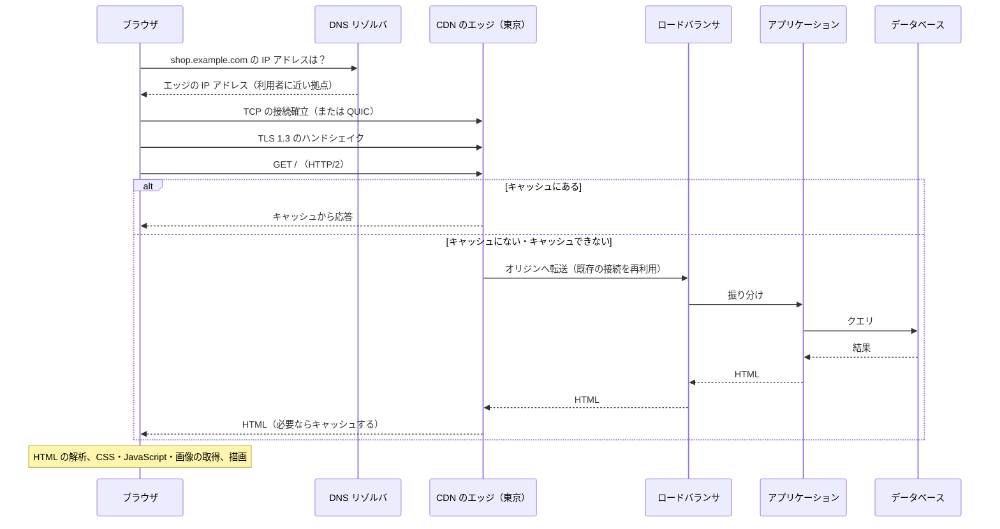
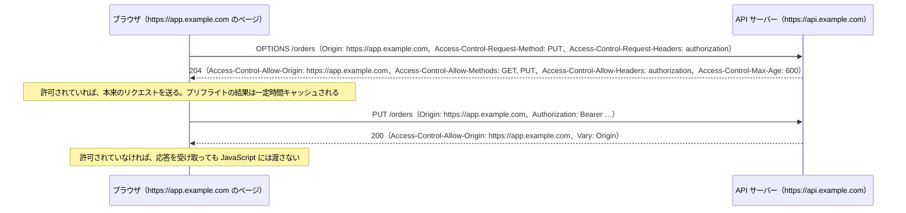
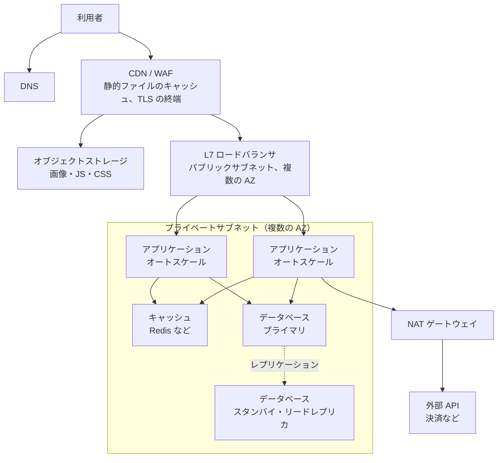
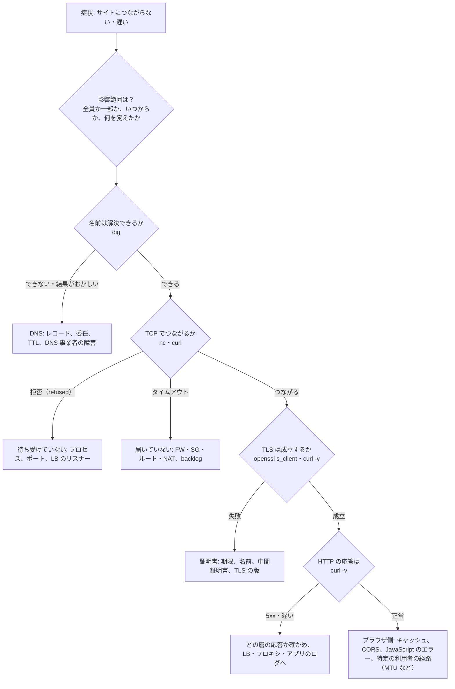

# 5.4 Webの仕組みとネットワーク構成

> ブラウザのアドレスバーに URL を入力して Enter を押してから画面が表示されるまでに、何が起きているのでしょうか。この章では、5.1〜5.3 で学んだ部品を 1 本の流れとしてつなぎ、実際のサービスを支えるロードバランサ・リバースプロキシ・CDN の仕組みと、障害が起きたときに「どの層で壊れているか」を切り分ける方法を身につけます。

| 項目 | 内容 |
|---|---|
| 学習時間の目安 | 本文 4h ＋ 演習 6h |
| 前提となる章 | [5.1 階層モデルとIP](../01-layers-and-ip/README.md)、[5.2 TCPとUDP](../02-tcp-and-udp/README.md)、[5.3 DNS・HTTP・TLS](../03-dns-http-tls/README.md) |
| 演習 | [exercises/](exercises/)（Python） |
| キーワード | クリティカルレンダリングパス, Core Web Vitals, L4/L7 ロードバランサ, Power of Two Choices, ヘルスチェック, コネクションドレイン, リバースプロキシ, CDN, キャッシュキー, オリジンシールド, CORS, WebSocket, サービスメッシュ, トラブルシューティング |

## この章のゴール

- [ ] URL を入力してから画面が表示されるまで（DNS・TCP/QUIC・TLS・HTTP・サーバー・ブラウザの描画）を、各段階でかかる時間の目安とともに説明できる
- [ ] Core Web Vitals（LCP・INP・CLS）の意味と、改善の方向性を説明できる
- [ ] L4 と L7 のロードバランサの違いと主な振り分けアルゴリズムを説明し、ヘルスチェックとコネクションドレインを含めて実装できる
- [ ] リバースプロキシと CDN の役割、キャッシュキー・パージ・オリジンシールド・stale-while-revalidate を説明し、CDN の効果を見積もれる
- [ ] 同一オリジンポリシーと CORS の仕組みを説明し、安全な CORS の設定を判断・実装できる
- [ ] REST・GraphQL・gRPC・WebSocket・SSE・Webhook などの通信方式の違いと使いどころを説明できる
- [ ] ネットワークの障害を、ツール（dig・curl・openssl・ss・tcpdump など）を使って層ごとに切り分けられる

## なぜ学ぶのか

- **エッジの設定は世界中に一瞬で広がる**: 2021 年 6 月 8 日、CDN 事業者の Fastly で、ある顧客の正当な設定変更が潜在していたバグを引き起こし、同社のネットワークの 85% がエラーを返す状態になりました。多くの大手ニュースサイトや政府のサイトが一斉に表示できなくなり、Fastly の報告によると、49 分以内にネットワークの 95% が正常に戻りました。2019 年 7 月 2 日には、Cloudflare で WAF（Web アプリケーションファイアウォール）に追加したルールの正規表現が CPU を使い果たし、約 27 分にわたって世界中で 502 エラーが返りました。利用者とサーバーの間の「経路の途中」にある仕組みは、障害の影響範囲が極めて大きいのです。
- **速さは売上に効く**: Deloitte が Google の委託で行った調査（"Milliseconds Make Millions"、2020 年）では、モバイルサイトの表示速度の 0.1 秒の改善で、小売サイトのコンバージョン率が 8% 程度向上したと報告されています。数字はサイトによって大きく異なるので自社で測るべきですが、表示速度がビジネスの指標であることは広く認められています。
- **障害対応の速さは切り分けの技術で決まる**: 「サイトが遅い」「一部の利用者だけつながらない」という報告を受けたとき、DNS・TCP・TLS・HTTP・アプリケーションのどこで問題が起きているかを数分で特定できるかどうかで、復旧までの時間が大きく変わります。

## 1. URL を入力してから画面が表示されるまで

### 1.1 全体の流れ

東京の利用者が `https://shop.example.com/` を開く場合を、順に追ってみましょう。



1. **URL の解析**: ブラウザは入力を URL として解析し、正規化します（演習 3）。検索語なのか URL なのかの判定もここで行います。
2. **HSTS とキャッシュの確認**: HSTS（[5.3](../03-dns-http-tls/README.md)）が登録されたドメインなら、`http://` と入力されても `https://` に書き換えます。ブラウザの HTTP キャッシュや Service Worker に使える応答があれば、ネットワークに出ずに済みます。
3. **DNS**: ブラウザ・OS・フルリゾルバのキャッシュを順に確かめ、なければ権威サーバーまでたどります。CDN を使っていれば、利用者に近いエッジサーバーのアドレスが返ります。
4. **接続**: TCP の 3 ウェイハンドシェイク（1 RTT）と TLS 1.3（1 RTT）、または QUIC（合わせて 1 RTT）。IPv6 と IPv4 の両方があれば、Happy Eyeballs で速くつながった方を使います（[5.1](../01-layers-and-ip/README.md)）。同じサイトへの 2 回目以降は、既存の接続を再利用します。
5. **HTTP のリクエストと応答**: エッジはキャッシュにあれば即座に応答し、なければオリジン（ロードバランサ → アプリケーション → データベース）に取りに行きます。エッジとオリジンの間の接続は使い回されているので、利用者側のハンドシェイクのような往復はかかりません。
6. **ブラウザでの処理**: HTML を解析しながら、CSS・JavaScript・画像などの追加のリソースを取得し、画面を描画します（次節）。

`curl` の `-w` オプションを使うと、各段階の時刻を測れます。手元の HTTPS サーバー（[5.3](../03-dns-http-tls/README.md) で作ったテスト用の証明書を使ったもの）に対する実行結果です。

```text
$ curl -s -o /dev/null --cacert ca.pem -w 'DNS解決   %{time_namelookup}s\nTCP接続   %{time_connect}s\nTLS完了   %{time_appconnect}s\n最初の1B  %{time_starttransfer}s\n合計      %{time_total}s\n' https://localhost:8443/
DNS解決   0.000021s
TCP接続   0.000366s
TLS完了   0.006125s
最初の1B  0.006624s
合計      0.006672s
```

値はいずれも「開始からの累計」です。同じマシンの中なので RTT はほぼ 0 ですが、遠くのサーバーでは TCP 接続と TLS 完了のそれぞれに RTT が 1 回分ずつ上乗せされ、「最初の 1 バイト」（**TTFB**、Time To First Byte）にはサーバーの処理時間が加わります。どの段階が遅いかが分かれば、対策も決まります（DNS が遅い → リゾルバや TTL、接続が遅い → 距離や経路、TTFB が遅い → サーバーの処理）。

### 1.2 ブラウザの中で起きること

HTML を受け取ったブラウザは、次の手順で画面を作ります。この一連の流れを **クリティカルレンダリングパス** と呼びます。

1. **HTML の解析 → DOM**: HTML を先頭から解析し、文書の木構造（DOM）を作る。
2. **CSS の解析 → CSSOM**: CSS を取得・解析してスタイルの木構造を作る。CSS がそろうまで描画は始められない（**描画をブロックするリソース**）。
3. **レンダーツリー → レイアウト → ペイント → 合成**: 表示する要素と、その大きさ・位置を計算し（レイアウト）、ピクセルに描き（ペイント）、レイヤーを重ね合わせる（合成）。

JavaScript は特別です。`<script src>` に出会うと、ブラウザは HTML の解析を止めて、スクリプトを取得・実行します（スクリプトが DOM を書き換えうるため）。これを避けるには、`defer`（解析が終わってから順に実行）や `async`（取得でき次第実行）を付けます。ブラウザは解析が止まっている間も、先の HTML を先読みして画像や CSS の取得を始めます（プリロードスキャナ）。

JavaScript は、描画と同じ **メインスレッド** で動きます。クリックなどのイベントの処理や、`setTimeout` のコールバックはタスクとしてキューに積まれ、**イベントループ** が 1 つずつ実行します（Promise の後続処理は、各タスクの直後にまとめて実行されるマイクロタスクです）。長い JavaScript の処理がメインスレッドを占有すると、その間はクリックへの反応も描画も止まります。

### 1.3 Web パフォーマンスと Core Web Vitals

Google は、利用者の体験を表す指標として **Core Web Vitals** を定めています（2026 年時点の定義。最新の基準は web.dev の公式情報で確認してください）。

| 指標 | 測るもの | 良好の目安 |
|---|---|---|
| **LCP**（Largest Contentful Paint） | 表示領域の中で最も大きなコンテンツ（メインの画像や見出し）が描画されるまでの時間。読み込みの速さ | 2.5 秒以内 |
| **INP**（Interaction to Next Paint） | クリックやキー入力から、次に画面が更新されるまでの時間（ページの滞在中の操作のうち、遅いもの）。応答性 | 200 ミリ秒以内 |
| **CLS**（Cumulative Layout Shift） | 読み込み中に要素が予期せずずれる量。視覚的な安定性 | 0.1 以下 |

INP は、2024 年 3 月に FID（First Input Delay、最初の操作の遅延だけを測る指標）に代わって Core Web Vitals の一つになりました。いずれも、実際の利用者のページ表示の **75 パーセンタイル** で評価するのが基本です。開発者の手元の測定（ラボデータ）ではなく、実際の利用者の環境で集めた値（フィールドデータ、RUM）を見ることが重要です。

改善の方向性は、この章と前の章の内容にそのまま対応しています。

- **LCP**: CDN で利用者の近くから配信する、接続を再利用する、画像を圧縮・適切な大きさにする、描画をブロックする CSS や JavaScript を減らす、重要なリソースを先に取得させる（`<link rel="preload">` や `preconnect`）。
- **INP**: メインスレッドを長時間占有する JavaScript を分割・削減する。
- **CLS**: 画像や広告の領域の大きさを事前に指定しておく。

## 2. ロードバランサ

### 2.1 L4 と L7

**ロードバランサ（LB）** は、1 つの入り口で受けたリクエストを複数のサーバー（**バックエンド**）に振り分けます。振り分ける層によって、できることが大きく異なります。

| | L4 ロードバランサ | L7 ロードバランサ |
|---|---|---|
| 見ているもの | IP アドレスとポート（TCP・UDP） | HTTP のメソッド・パス・ヘッダ・Cookie |
| 振り分けの単位 | **接続** 単位 | **リクエスト** 単位 |
| TLS | 通常は終端しない（そのまま中継） | 終端する（証明書を持ち、中身を見る） |
| できること | 高速・低遅延、TCP 以外（UDP など）も扱える | パスやホスト名による振り分け、ヘッダの付加、リトライ、認証、WAF |
| 例 | AWS の NLB、Google の Maglev、IPVS | AWS の ALB、nginx、Envoy、HAProxy |

[5.2](../02-tcp-and-udp/README.md) で見たように、L4 は接続単位なので、HTTP/2 や gRPC のように 1 本の接続で大量のリクエストを流す通信では、振り分けが偏ります。リクエスト単位で振り分けたいなら L7 を使います。

### 2.2 振り分けのアルゴリズム

| アルゴリズム | 考え方 | 向いている場面・注意 |
|---|---|---|
| ラウンドロビン | 順番に | 処理時間がそろっている場合。サーバーの性能差を考慮しない |
| 重み付きラウンドロビン | 重みに比例して | 性能の違うサーバーの混在、新しい版への少しずつの切り替え（カナリア） |
| 最小接続（least connections） | 処理中の接続が最も少ないサーバーへ | 処理時間がばらつく場合 |
| ランダム | 無作為に | 状態を持たずに済むが、偏りが出る |
| Power of Two Choices | 無作為に 2 台選び、空いている方へ | 分散した多数の LB でも偏りにくい |
| ハッシュ | クライアントの IP や URL のハッシュで決める | 同じキーを同じサーバーへ（キャッシュの効率）。サーバーの増減に強くするには一貫性ハッシュ（[7.3](../../07-distributed-systems/03-partitioning/README.md)） |

重み付きラウンドロビンを素朴に実装すると、重み 5 のサーバーに 5 回続けて送ってから次に移るので、負荷が波打ちます。nginx の「なめらかな」重み付きラウンドロビンは、重み {5, 1, 1} で a a b a c a a のように混ぜて送ります（演習 1 で実装します）。

最小接続は、全サーバーの状態を正確に知っていれば最良ですが、多数の LB がそれぞれ少し古い情報を見て振り分けると、全員が「いま最も空いている 1 台」に同時に殺到する問題があります。**Power of Two Choices**（無作為に選んだ 2 台のうち空いている方へ）は、全体を見ずに偏りを劇的に減らせることが理論的にも知られており（Mitzenmacher らの研究）、Envoy の最小リクエスト方式や nginx の `random two` などで使われています。処理が終わらずに接続が溜まり続ける最も厳しい状況で、100 台に 10,000 件を振り分けてみます。

```python
import random

def simulate(pick, n_servers=100, n_requests=10_000, seed=1):
    rng = random.Random(seed)
    load = [0] * n_servers
    for _ in range(n_requests):          # 処理が終わらない（接続が溜まり続ける）最も厳しい状況
        load[pick(load, rng)] += 1
    return max(load), min(load)

def random_pick(load, rng):
    return rng.randrange(len(load))

def two_choices(load, rng):
    a, b = rng.sample(range(len(load)), 2)
    return a if load[a] <= load[b] else b

def least_connections(load, rng):
    return min(range(len(load)), key=load.__getitem__)

for name, pick in [("ランダム", random_pick), ("2 つから選ぶ", two_choices), ("最小接続", least_connections)]:
    most, fewest = simulate(pick)
    print(f"{name}: 最大 {most}、最小 {fewest}（平均 100）")
```

```text
ランダム: 最大 129、最小 79（平均 100）
2 つから選ぶ: 最大 102、最小 97（平均 100）
最小接続: 最大 100、最小 100（平均 100）
```

ランダムでは最も混んだサーバーに平均の約 1.3 倍の負荷がかかりますが、2 台を比べるだけでほぼ均等になります。

### 2.3 ヘルスチェック

LB は、壊れたバックエンドに振り分けないように、定期的に状態を確かめます。

- **能動的なヘルスチェック**: 数秒おきに `/healthz` などにリクエストを送り、決まった回数連続して失敗したら外し、連続して成功したら戻す（演習 1 の `HealthChecker`）。1 回の失敗で外すと、一時的な揺らぎで振り分けが暴れます。
- **受動的なヘルスチェック（外れ値の検出）**: 実際のリクエストのエラー率や遅延を見て、異常なバックエンドを一時的に外す。

ヘルスチェックの中身の設計には注意が必要です。**ヘルスチェックでデータベースなどの依存先まで確かめると、依存先の一時的な障害で全バックエンドが一斉に外され**、部分的な劣化が全面停止に変わります。Kubernetes のように「プロセスが生きているか（liveness）」と「リクエストを受けられるか（readiness）」を分けて考えるのが定石です（[10.2](../../10-cloud-and-sre/02-containers-and-kubernetes/README.md)）。また、正常なバックエンドが一定の割合を下回ったら、あえて全台に振り分ける仕組み（Envoy のパニック閾値など）もあります。ヘルスチェックの誤判定で全台を外すより、一部のエラーを許容する方がましだからです。

### 2.4 コネクションドレインとデプロイ

サーバーを取り外すとき（デプロイ、スケールイン）に、処理中のリクエストを途中で切ってはいけません。**コネクションドレイン**（AWS では登録解除の遅延）は、新しいリクエストは送らずに、処理中のものが終わるのを待ってから取り外す仕組みです。安全に入れ替えるには、アプリケーションの側でも次の手順を守ります。

1. 終了の合図（SIGTERM など）を受けたら、readiness を失敗させて新しいリクエストの受付をやめる。
2. LB がそれに気付いて振り分けをやめるまで少し待つ。
3. 処理中のリクエストを最後まで処理し、持続接続は応答に `Connection: close` を付けて閉じる。
4. 終了する。

もう 1 つの定番の落とし穴が、**持続接続のアイドルタイムアウトの食い違い** です。LB は、バックエンドとの接続を再利用します。バックエンド（アプリケーションサーバー）のアイドルタイムアウトが LB より短いと、バックエンドがちょうど接続を閉じた瞬間に、LB がその接続でリクエストを送ってしまい、利用者には **散発的な 502** として現れます。AWS は ALB について、アプリケーションのアイドルタイムアウトを LB のもの（既定 60 秒）より長くするよう推奨しています。例えば Node.js の HTTP サーバーの持続接続のタイムアウトは既定で 5 秒なので、ALB の後ろではこの食い違いが起きます。原則は **「内側（下流）のアイドルタイムアウトを、外側（上流）より長くする」** です。

### 2.5 スティッキーセッションとクライアントの IP アドレス

**スティッキーセッション** は、同じ利用者を同じバックエンドに送り続ける機能（多くは LB が発行する Cookie で実現）です。サーバーのメモリにセッションを持つアプリケーションを動かせますが、負荷が偏り、そのサーバーが落ちるとセッションを失い、デプロイも難しくなります。セッションは共有のストア（Redis など）に置いて、どのサーバーでも処理できる **ステートレス** な設計にするのが原則です。

L7 の LB を通ると、バックエンドから見た接続元は LB になります。元のクライアントの IP アドレスは、LB が付ける `X-Forwarded-For` ヘッダ（標準化された `Forwarded` ヘッダ、RFC 7239 もある）で伝えますが、**このヘッダはクライアントが偽装できます**。信頼してよいのは、自分の管理する LB やプロキシが付け加えた部分（リストの右端から数えたもの）だけです。L4 の LB では、TCP の接続の先頭にクライアントの情報を付ける PROXY プロトコルが使われます。

## 3. リバースプロキシ

**リバースプロキシ** は、サーバーの手前に置いて、クライアントの代わりにリクエストを受けるサーバーです（クライアントの手前に置くのが通常の「フォワード」プロキシ）。nginx・Envoy・HAProxy などが使われ、L7 の LB の役割も兼ねることが多いです。

| 役割 | 内容 |
|---|---|
| TLS の終端 | 証明書の管理と暗号の処理をアプリケーションから切り離す |
| ルーティング | パスやホスト名でアプリケーションを振り分ける（`/api` はこちら、`/static` はあちら） |
| バッファリング | 遅いクライアント（モバイル回線など）とのやりとりを肩代わりし、アプリケーションのスレッドを占有させない。ヘッダを少しずつ送り続けて接続を占有する Slowloris 攻撃への防御にもなる |
| 圧縮・キャッシュ | gzip や brotli による圧縮、静的ファイルや一部の応答のキャッシュ |
| 流量の制御 | レート制限、同時接続数の制限、リクエストの大きさの制限 |
| 回復性 | タイムアウト、リトライ、サーキットブレーカー |
| 観測性 | アクセスログ、メトリクス、分散トレーシングのヘッダの付加（[10.4](../../10-cloud-and-sre/04-observability/README.md)） |

リトライには注意が必要です。LB・プロキシ・アプリケーション・クライアントの各層がそれぞれ 3 回ずつリトライすると、下流の障害時に 1 件のリクエストが 3 × 3 × 3 = 27 件に増幅され、障害をかえって悪化させます（リトライストーム）。**リトライはどこか 1 つの層で、冪等なリクエストに限って行う** のが原則です（[5.3](../03-dns-http-tls/README.md)、[10.3](../../10-cloud-and-sre/03-reliability-engineering/README.md)）。

## 4. CDN

### 4.1 エッジで応答する

**CDN（Content Delivery Network）** は、世界中に置いた多数の拠点（PoP）のエッジサーバーで応答をキャッシュし、利用者の近くから配信する仕組みです。DNS やエニーキャストで、利用者を近くのエッジに誘導します。CDN の効果は、キャッシュだけではありません。

- **往復の短縮**: [5.2](../02-tcp-and-udp/README.md) で見たとおり、新しい接続には TCP と TLS で 2 往復かかります。これを東京のエッジ（RTT 数ミリ秒）で行えば、米国のオリジン（RTT 100 ミリ秒前後）で行うより何百ミリ秒も速くなります。エッジとオリジンの間は、使い回している接続で転送します。
- **オリジンの負荷の削減**: オリジンへのリクエストは「全リクエスト × (1 − ヒット率)」に減ります。
- **防御**: DDoS 攻撃の吸収、WAF、ボット対策をエッジで行えます。

### 4.2 キャッシュキーとヒット率

CDN は、URL などから作った **キャッシュキー** で応答を保存します。同じ内容なのにキーが違うと、キャッシュは細切れになり、ヒット率が下がります。

- **クエリ文字列**: `?utm_source=mail` のような追跡用のパラメータや、パラメータの順序の違いで、別のキーになる。追跡用のパラメータを除外し、順序をそろえる（演習 4）。
- **Vary**: `Vary: Accept-Encoding` の値は、ブラウザによって書き方がばらばらです。実際に配る表現（br・gzip・なし）に正規化してからキーに含めます。`Vary: User-Agent` や `Vary: Cookie` は、キャッシュをほぼ無効にします。
- **Cookie**: 多くの CDN は、Cookie の付いたリクエストや `Set-Cookie` を含む応答を、既定ではキャッシュしません。静的ファイルの配信用のドメインを Cookie と無関係に保つのは、このためです。

演習 4 のシミュレータで、5,000 個のコンテンツへのアクセス（人気は順位に反比例する Zipf 分布）を毎秒 100 リクエストで 10 万件流し、TTL とキーの断片化の影響を見てみます。

```python
import random
from itertools import accumulate
from cdn_sim import CDNCache, OriginResponse   # 演習 4 の解答

def simulate(ttl, fragment=False, n_objects=5_000, n_requests=100_000, seed=1):
    rng = random.Random(seed)
    cum = list(accumulate(1 / (i + 1) for i in range(n_objects)))   # Zipf 分布: 人気は順位に反比例
    objects = rng.choices(range(n_objects), cum_weights=cum, k=n_requests)
    now = [0.0]
    cdn = CDNCache(lambda url, headers: OriginResponse(body="...", ttl=ttl), lambda: now[0])
    for obj in objects:
        now[0] += 0.01                                  # 毎秒 100 リクエスト
        url = f"https://example.com/items/{obj}"
        if fragment:
            url += f"?sid={rng.randrange(100)}"         # キャッシュキーに利用者ごとのパラメータが混ざる
        cdn.get(url)
    return cdn.stats

for ttl in (10, 60, 600):
    s = simulate(ttl)
    print(f"TTL {ttl:3d} 秒: ヒット率 {s.hit_ratio:.1%}、オリジンへのリクエスト {s.origin_requests:,}")
s = simulate(600, fragment=True)
print(f"TTL 600 秒・キーが断片化: ヒット率 {s.hit_ratio:.1%}、オリジンへのリクエスト {s.origin_requests:,}")
```

```text
TTL  10 秒: ヒット率 57.8%、オリジンへのリクエスト 42,175
TTL  60 秒: ヒット率 76.1%、オリジンへのリクエスト 23,879
TTL 600 秒: ヒット率 92.2%、オリジンへのリクエスト 7,800
TTL 600 秒・キーが断片化: ヒット率 48.9%、オリジンへのリクエスト 51,065
```

TTL を 10 秒から 600 秒に延ばすと、オリジンへのリクエストは 5 分の 1 以下になります。一方、キャッシュキーに不要なパラメータが 1 つ混ざるだけで、せっかくの長い TTL の効果の大半が失われます。**ヒット率は、TTL よりもキャッシュキーの設計で決まることが多い** のです。

### 4.3 パージ・オリジンシールド・古い応答の活用

- **パージ**: TTL を長くするほど、内容を更新したときに古いものが残ります。CDN の API で、URL・前方一致・タグ（サロゲートキー）単位でキャッシュを消します。静的ファイルは、ファイル名に内容のハッシュを含めて URL ごと変える（[5.3](../03-dns-http-tls/README.md)）方が、パージに頼るより確実です。
- **オリジンシールド（階層型キャッシュ）**: 多数のエッジがそれぞれオリジンに取りに行くと、キャッシュの有効期限が切れるたびにオリジンへのリクエストが拠点の数だけ発生します。エッジとオリジンの間に中間のキャッシュを 1 段置くと、オリジンへのリクエストをまとめられます（演習 4 の `as_origin`）。
- **リクエストの集約**: 同じ URL へのリクエストが同時に大量に来たとき、オリジンへは 1 件だけ送り、残りはその応答を待たせる機能です。人気のコンテンツの期限切れの瞬間に、オリジンにアクセスが殺到するのを防ぎます。
- **stale-while-revalidate / stale-if-error**（RFC 5861）: 期限が切れても一定時間は古い応答を返しつつ裏で更新する、オリジンが落ちているときは古い応答を返し続ける、という指示です。利用者を待たせず、オリジンの障害をある程度隠せます。

### 4.4 CDN のリスク

- **設定の影響範囲**: 冒頭の Fastly や Cloudflare の事例のように、CDN の設定の誤りやバグは、世界中のサービスに一斉に影響します。自社の CDN の設定変更も、段階的に適用し、すぐに戻せるようにしておきます。
- **キャッシュによる情報漏えい**: 個人ごとの応答をキャッシュしてしまう事故（[5.3](../03-dns-http-tls/README.md) の Steam の事例）や、キャッシュキーに含まれないヘッダで応答を変えさせて、汚染された応答を他の利用者に配らせる攻撃（キャッシュポイズニング）があります（[11.4](../../11-security/04-web-security/README.md)）。
- **依存とコスト**: CDN 固有の機能（エッジでのプログラム実行、独自のキャッシュの設定）に深く依存すると、乗り換えが難しくなります。転送量の料金体系も事業者ごとに大きく異なります。

## 5. API の通信方式

| 方式 | 通信の形 | 土台 | 向いている場面 | 注意点 |
|---|---|---|---|---|
| REST（JSON over HTTP） | 要求と応答 | HTTP/1.1・2・3 | 公開 API、一般的な Web API | 複数のリソースを取るのに往復が増えやすい |
| GraphQL | 要求と応答（クライアントが欲しい形を指定） | 多くは HTTP の POST | 画面ごとに必要なデータが大きく違うクライアント | HTTP キャッシュが効きにくい、重いクエリの制限が必要 |
| gRPC | 要求と応答、双方向のストリーミング | HTTP/2 ＋ Protocol Buffers | サービス間の通信 | ブラウザから直接は使えない（gRPC-Web などが必要）。L4 の LB では偏る |
| WebSocket（RFC 6455） | 双方向・常時接続 | HTTP/1.1 からのアップグレード | チャット、共同編集、ゲーム | LB やプロキシのアイドルタイムアウト、接続の偏り、再接続の設計 |
| SSE（Server-Sent Events） | サーバーからの一方向の通知 | 普通の HTTP の応答（`text/event-stream`） | 通知、進捗の表示、LLM の応答のストリーミング | ブラウザの自動再接続と `Last-Event-ID` で取りこぼしを防げる |
| ロングポーリング | 応答を保留して待たせる | 普通の HTTP | 古い環境での擬似的なプッシュ | 接続とスレッドを長く占有する |
| Webhook | サーバーからサーバーへの HTTP での通知 | 普通の HTTP | 外部サービスとの連携（決済の完了など） | 署名（HMAC）の検証、再送と重複の処理、順序が保証されないこと |

どの方式を選ぶか、バージョン管理やエラーの表現をどうするかといった API の設計は [9.4 API設計](../../09-architecture/04-api-design/README.md) で扱います。

## 6. 同一オリジンポリシーと CORS

### 6.1 オリジンと同一オリジンポリシー

**オリジン** は、URL の「スキーム・ホスト・ポート」の組です。`https://app.example.com` と `https://api.example.com` はホストが違うので別のオリジン、`http://` と `https://` も別のオリジンです。

ブラウザは、あるオリジンのページで動く JavaScript が、別のオリジンの応答を読むことを原則として禁止しています（**同一オリジンポリシー**）。これがなければ、悪意のあるサイトを開いただけで、その裏であなたのネットバンキングのページを、あなたの Cookie 付きで読み取られてしまいます。

ここで重要なのは、同一オリジンポリシーが防ぐのは **応答を読むこと** であって、**リクエストを送ること** ではない点です。別のオリジンへのフォームの送信や画像の読み込みは、昔から許されています。そのため、利用者の Cookie 付きで勝手に送金などのリクエストを送らせる **CSRF** は、同一オリジンポリシーだけでは防げません（SameSite 属性の Cookie や CSRF トークンで防ぎます。[11.4](../../11-security/04-web-security/README.md)）。

### 6.2 CORS の仕組み

**CORS（Cross-Origin Resource Sharing）** は、サーバーが「このオリジンからなら、応答を読んでよい」と許可するための仕組みです。

- **単純なリクエスト**（GET・HEAD・POST で、特別なヘッダを使わないもの）: ブラウザはそのまま送り、応答の `Access-Control-Allow-Origin` を見て、JavaScript に渡すかを決めます。
- **それ以外**（PUT や DELETE、`Content-Type: application/json` の POST、`Authorization` などのヘッダ付き）: ブラウザは先に **プリフライト**（OPTIONS）を送り、許可を確かめてから本来のリクエストを送ります。



### 6.3 資格情報と「*」

`Access-Control-Allow-Origin: *` は「どのオリジンからでも読んでよい」という意味ですが、**Cookie などの資格情報付きのリクエストには使えません**。ブラウザは、資格情報付きのリクエストに対しては、`Access-Control-Allow-Origin` が具体的なオリジンと完全に一致し、`Access-Control-Allow-Credentials: true` があるときだけ応答を渡します。

ここでよく起きる危険な実装が、**「リクエストの Origin ヘッダの値を、検査せずにそのまま返す」** ことです。これは実質的に「あらゆるサイトから、利用者の Cookie 付きで読める」設定で、悪意のあるサイトに利用者の個人情報を読み取られます。正しくは、許可するオリジンの一覧（許可リスト）と照合し、一致したものだけを返します。照合の実装にも罠があります。

- `origin.endswith("example.com")` は `https://evil-example.com` にも一致する。`.example.com` までを含めて比べる（演習 2）。
- 正規表現のドットのエスケープ漏れ（`app.example.com` の `.` が任意の 1 文字に一致する）。
- `null` を許可リストに入れる。`null` は、サンドボックス化された iframe など、攻撃者も名乗れるオリジン。

そして、許可したオリジンを返すときは **`Vary: Origin`** を付けます。付けないと、CDN などのキャッシュが「オリジン A 向けの応答」を保存して、オリジン B からのリクエストにも返してしまいます。

### 6.4 CORS はアクセス制御ではない

CORS は、**ブラウザが** 利用者を守るための仕組みです。サーバーにはリクエストが届いていますし、curl やサーバー間の通信は CORS をまったく気にしません。API を保護するのは、あくまで認証と認可（[11.3](../../11-security/03-authn-authz/README.md)）です。「CORS で許可していないから、この API は外から呼べない」と考えてはいけません。

## 7. セッション: Cookie とトークン

ログイン状態の持ち方には、大きく 2 つの方式があります。

| | Cookie によるセッション | トークン（Authorization ヘッダ） |
|---|---|---|
| 仕組み | サーバーがセッション ID を Cookie で発行し、ブラウザが自動で送る | クライアントがトークン（JWT など）を保存し、`Authorization: Bearer …` で明示的に送る |
| 保存場所 | ブラウザの Cookie（`HttpOnly` にすれば JavaScript から読めない） | アプリのメモリやストレージ（ブラウザの localStorage に置くと XSS で盗まれうる） |
| 主な脅威 | CSRF（自動で送られるため）。SameSite 属性とトークンで対策 | XSS によるトークンの窃取 |
| 無効化 | サーバー側でセッションを消せばすぐに無効 | 署名だけで検証する形式は、期限まで無効にしにくい |
| 向いている場面 | ブラウザ向けの Web アプリ | モバイルアプリ、サービス間の通信、外部に公開する API |

どちらが優れているというより、クライアントの種類と脅威のモデルで選びます。詳しくは [11.3 認証と認可](../../11-security/03-authn-authz/README.md) で扱います。

## 8. サービスメッシュとゼロトラスト

マイクロサービスの数が増えると、サービス間の通信にも、暗号化（mTLS）・リトライ・タイムアウト・サーキットブレーカー・観測性が必要になります。これを各サービスのコードに書く代わりに、各サービスの横に置いたプロキシ（**サイドカー**。Envoy など）に任せ、それらを中央の **コントロールプレーン** から設定する仕組みが **サービスメッシュ**（Istio、Linkerd など）です。

- **利点**: 言語に関係なく、mTLS による相互認証と暗号化、通信の制御、メトリクスとトレースの収集を一律に適用できる。
- **代償**: プロキシを経由する分の遅延と CPU・メモリ、コントロールプレーンの運用、障害時の切り分けの難しさ。サイドカーを使わずにノード単位のプロキシで実現する方式も登場しています。

小さな組織がいきなり導入するものではなく、サービスの数と、通信の制御に対する要求が十分に大きくなってから検討します。

サービスメッシュの背景にあるのが **ゼロトラスト** の考え方です。「社内ネットワークの内側なら安全」という境界型の防御をやめ、ネットワーク上の位置に関係なく、すべてのリクエストを認証・認可します（Google の BeyondCorp、NIST SP 800-207）。詳しくは [11.1](../../11-security/01-security-principles/README.md) で扱います。

## 9. 典型的なクラウドの Web アーキテクチャ

ここまでの部品を組み合わせた、典型的な構成を示します（[5.1](../01-layers-and-ip/README.md) の VPC の図の上に、Web の部品を載せたものです）。



この図の矢印 1 本 1 本について、次を説明できることが目標です。

- **どのプロトコルで、誰が TLS を終端するか**（CDN と LB で終端し、内側は平文か、再暗号化か）
- **タイムアウトとアイドルタイムアウトの値**（外側より内側を長く）と、**リトライする層**（1 か所だけ）
- **障害時に何が起きるか**（AZ の障害、データベースのフェイルオーバー、外部 API の遅延）
- **いくらかかるか**（CDN・LB・NAT ゲートウェイ・AZ 間の転送の料金。[10.6](../../10-cloud-and-sre/06-finops/README.md)）

## 10. ネットワークの障害の切り分け

### 10.1 道具箱

| ツール | 主な層 | 答えてくれる問い | 例 |
|---|---|---|---|
| `dig` | DNS | 名前は正しく解決できるか。どのリゾルバが何を返すか。TTL は | `dig +short www.example.com`、`dig @8.8.8.8 www.example.com`、`dig +trace www.example.com` |
| `ping` | IP（ICMP） | 到達できるか、RTT はどのくらいか（ICMP を遮断していることも多い） | `ping -c 5 203.0.113.80` |
| `traceroute` / `mtr` | IP | どの経路を通り、どこで遅延や損失が増えるか | `mtr -rwc 50 203.0.113.80` |
| `nc` | TCP | そのポートに TCP で接続できるか | `nc -vz 203.0.113.80 443` |
| `curl` | TCP・TLS・HTTP | 各段階の時間、送受信したヘッダ、エラーの種類 | `curl -v`、`curl -w`、`curl --resolve host:443:IP` |
| `openssl s_client` | TLS | 証明書の連鎖・期限・名前、TLS の版と暗号 | `openssl s_client -connect host:443 -servername host` |
| `ss` | TCP（ホスト内） | 待ち受けているか、接続の状態（ESTAB・TIME-WAIT・CLOSE-WAIT）の数 | `ss -tlnp`、`ss -tan state time-wait` |
| `tcpdump` / Wireshark | すべて | 実際にどんなパケットが流れているか（最後の手段） | `tcpdump -i any -nn 'host 203.0.113.80 and port 443'` |

`curl --resolve www.example.com:443:203.0.113.80 https://www.example.com/` のように使うと、DNS を変えずに特定のサーバー（移転先や、LB の裏の 1 台）に、正しいホスト名（SNI と Host ヘッダ）でアクセスできます。移転前の確認や、「この 1 台だけおかしい」の検証に欠かせません。TLS で暗号化された通信の中身を Wireshark で見る必要があるときは、ブラウザや curl が対応している `SSLKEYLOGFILE` 環境変数で鍵を書き出させる方法があります。

`dig` の出力例です（例示用のアドレスに置き換え、一部を省略しています）。`status` が NOERROR か NXDOMAIN か、`flags` に `aa`（権威のある応答）があるか、TTL がいくつかに注目します。

```text
$ dig @8.8.8.8 www.example.com A
;; ->>HEADER<<- opcode: QUERY, status: NOERROR, id: 4242
;; flags: qr rd ra; QUERY: 1, ANSWER: 2, AUTHORITY: 0, ADDITIONAL: 1

;; ANSWER SECTION:
www.example.com.        300     IN      CNAME   web.example.com.
web.example.com.        60      IN      A       192.0.2.10
```

### 10.2 エラーメッセージから層を当てる

エラーメッセージは、どの層で失敗したかを教えてくれます。次は curl 8.5.0 で実際にそれぞれの状況を再現したときのメッセージです（文言は curl の版によって少し変わります）。

| メッセージ | 層 | 意味と、次に疑うこと |
|---|---|---|
| `curl: (6) Could not resolve host: no-such-host.invalid` | DNS | 名前を解決できない。名前の綴り、DNS のレコード、リゾルバの障害、否定キャッシュ |
| `curl: (7) Failed to connect to 127.0.0.1 port 1 after 0 ms: Couldn't connect to server` | TCP | 相手に届いたが RST で拒否された（Connection refused）。そのポートでプロセスが待ち受けていない、LB のリスナー設定 |
| `curl: (28) Failed to connect to 127.0.0.1 port 39321 after 1001 ms: Timeout was reached` | IP・TCP | SYN に応答がない。ファイアウォールやセキュリティグループによる破棄、経路の問題、サーバーの受付キュー（backlog）があふれている |
| `curl: (28) Operation timed out after 1001 milliseconds with 0 bytes received` | HTTP・アプリ | 接続できたが応答が来ない。アプリケーションの処理の滞留、下流（DB・外部 API）の遅延 |
| `curl: (60) SSL certificate problem: unable to get local issuer certificate` | TLS | 証明書の連鎖を信頼できるルートまでたどれない。中間証明書の送り忘れ、社内 CA、TLS を横取りするプロキシ |
| `curl: (60) SSL: no alternative certificate subject name matches target host name 'www.example.com'` | TLS | 証明書に、そのホスト名がない。証明書の SAN、DNS が別のサーバーを指している |

HTTP のステータスコードも、どこで失敗したかを示します。**502 Bad Gateway** は「プロキシや LB が、上流から不正な応答を受け取った（接続を切られた、壊れた応答が来た）」、**504 Gateway Timeout** は「上流からの応答が時間内に来なかった」、**503 Service Unavailable** は「正常なバックエンドがない、または過負荷」を意味することが多く、どの層が生成したエラーかは `Server` ヘッダや、エラーページの見た目で見分けられます。

### 10.3 切り分けの手順

闇雲にツールを叩くのではなく、下の層から順に「どこまでは正常か」を確かめていきます。



手順を進めるうえでのコツは次のとおりです。

- **最初に範囲と変更を確かめる**。全員か一部か（特定の地域・ISP・ブラウザ・IPv6 の利用者だけ、など）、いつから起きているか、直前に何を変えたか。障害の多くは変更が引き金です。
- **複数の地点から確かめる**。自分の PC、社内、クラウドの別リージョン、外部の監視サービスで結果を比べると、問題の場所を絞り込めます。
- **正常なものと比べる**。正常なサーバーと異常なサーバー、正常な利用者と異常な利用者で、何が違うかを探します（`curl --resolve` で 1 台ずつ確かめる）。
- **パケットキャプチャは最後の手段**。強力ですが時間がかかります。多くの問題は、上のツールの出力とログで特定できます。

## よくある落とし穴

1. **ヘルスチェックで依存先まで確かめる**。データベースの一時的な障害で全バックエンドが一斉に外され、全面停止になります。「リクエストを受けられるか」と「依存先が正常か」を分けて設計します。
2. **バックエンドのアイドルタイムアウトを LB より短くする**。散発的な 502 の典型的な原因です。内側のタイムアウトを外側より長くします。
3. **全層でリトライする**。障害時にリクエストが掛け算で増え、回復を妨げます。リトライは 1 か所、冪等なリクエストに限り、バックオフとジッターを入れます。
4. **スティッキーセッションに頼る**。負荷の偏りと、サーバーの障害でのセッションの喪失を招きます。セッションは共有のストアに置きます。
5. **`X-Forwarded-For` をそのまま信じる**。クライアントが偽装できるので、IP アドレスによるアクセス制限やレート制限をすり抜けられます。自分の LB が付けた部分だけを信頼します。
6. **Origin をそのまま返す CORS の設定**。資格情報付きでこれをすると、あらゆるサイトから利用者の情報を読み取られます。許可リストと照合し、`Vary: Origin` を付けます。
7. **キャッシュキーを放置する**。追跡用のパラメータや `Vary` の値のばらつきでヒット率が下がり、CDN の費用を払いながらオリジンの負荷が減りません。キーの正規化を設計します。
8. **ラボのデータだけで速度を判断する**。開発者の高速な PC と回線での計測は、実際の利用者の体験を表しません。フィールドデータ（Core Web Vitals の 75 パーセンタイル）で判断します。

## CTOの視点

1. **遅延の予算をアーキテクチャの要件にする**。「利用者が操作してから画面が更新されるまで何ミリ秒か」を、DNS・接続・TLS・CDN・LB・アプリケーション・データベースの各区間に配分し、どこに使うかを設計の段階で決めます。Core Web Vitals のフィールドデータを事業の KPI と並べて定期的に見る仕組みを作りましょう。改善の投資判断（CDN の導入、フロントエンドの作り直し）は、この数字で行います。
2. **エッジと LB の設定変更を、最もリスクの高い変更として扱う**。CDN・WAF・LB の設定は、1 行の誤りで全サービスを止めます。段階的な適用、すぐに戻せる仕組み、変更の履歴、深夜の変更を避ける運用を整えます。CDN やDNS の事業者を複数使うかどうかは、障害時の損失と、運用の複雑さ・費用の増加を比べて判断します。
3. **タイムアウト・リトライ・キープアライブを、横断的な規約として管理する**。各チームが個別に決めると、層ごとの食い違いが 502 やリトライストームを生みます。「内側のアイドルタイムアウトは外側より長く」「リトライは 1 か所で冪等なものだけ」「全体の期限を下流に伝える」を、プラットフォームの既定値と設計レビューの観点にしましょう。
4. **サービスメッシュなどの基盤は、組織の成熟度で選ぶ**。サービスメッシュは強力ですが、運用に専門のチームを必要とします。「mTLS を全サービスに」「通信の観測性を一律に」といった具体的な要求があり、それを担うチームを置けるかを先に問いましょう。多くの組織では、共通のライブラリと API ゲートウェイから始める方が費用対効果に優れます。
5. **障害の切り分けを、仕組みと人の両面で鍛える**。LB・CDN のアクセスログ、複数の地点からの外形監視、層ごとのメトリクスがなければ、切り分けは勘に頼ることになります。障害対応の手順書に「DNS → TCP → TLS → HTTP → アプリ」の確認手順を載せ、採用の面接でも実際の障害の切り分けを説明してもらうと、体系的に考えられる人かどうかがよく分かります。

## 演習

演習コードは [exercises/](exercises/) にあります。docstring に仕様が書いてあるので、`raise NotImplementedError(...)` を実装に置き換えてください。解答例は [solutions/](solutions/) にあります。

```bash
python3 tools/check.py 5.4        # リポジトリのルートで実行
python3 tools/check.py -v 5.4     # 詳しい出力
```

| # | 難易度 | 内容 | 対象ファイル / 関数 |
|---|---|---|---|
| 1 | ★★☆ | ラウンドロビン、nginx のなめらかな重み付きラウンドロビン、最小接続、Power of Two Choices（シード付きの乱数）、ヘルスチェックのヒステリシス、コネクションドレイン | `lb.py`: `RoundRobin`, `SmoothWeightedRoundRobin`, `LeastConnections`, `PowerOfTwoChoices`, `LoadBalancer`, `HealthChecker` |
| 2 | ★★☆ | CORS のプリフライトと実際のリクエストの判定（許可リスト・サブドメインのパターン・メソッド・ヘッダ・資格情報・max-age・資格情報付きでの「*」の扱い）を、サーバー側とブラウザ側の両方で | `cors.py`: `CorsPolicy`, `origin_allowed`, `preflight_response_headers`, `actual_response_headers`, `browser_cors_check`, `browser_preflight_check` |
| 3 | ★★★ | URL の解析、ドットセグメントの除去（RFC 3986 5.2.4）、相対参照の解決（RFC 3986 の全例）、正規化（大文字小文字・既定のポート・パーセントエンコーディング） | `url_tools.py`: `parse_url`, `remove_dot_segments`, `resolve_reference`, `normalize_url` |
| 4 | ★★☆ | CDN のキャッシュのシミュレーション（キャッシュキーの正規化、TTL、Vary、パージ、stale-while-revalidate、ヒット率、オリジンシールド） | `cdn_sim.py`: `CDNCache` |
| 5 | ★★☆ | 記述: 障害の切り分け（下記） | — |

演習 4 を解いたら、本文のシミュレーションを動かし、人気の分布（Zipf の指数）やコンテンツの数、Vary の有無を変えてヒット率がどう変わるかを確かめてみましょう。

### 演習 5（記述）: 「一部の利用者だけ、サイトが表示されない」

月曜の朝、EC サイトについて次の報告が集まりました。原因の仮説と、確かめる手順、対応を書いてください。

- 問い合わせは全体の 5% 程度の利用者から。「ページが真っ白のまま、しばらくするとエラーになる」。スマートフォンのアプリは問題なく動いている。
- 社内からブラウザでアクセスすると正常に表示される。
- 週末に、インフラチームが CDN の設定を更新し、あわせてオリジンのロードバランサに IPv6 を有効にした。
- 社内の PC から調べた結果は次のとおり（`2001:db8:10::5` は LB の IPv6 アドレス、`203.0.113.80` は IPv4 アドレス）。

```text
$ dig +short AAAA shop.example.com
2001:db8:10::5
$ curl -4 -s -o /dev/null -w '%{http_code} %{time_total}\n' https://shop.example.com/
200 0.184
$ curl -6 -s -o /dev/null -w '%{http_code} %{time_total}\n' --connect-timeout 5 https://shop.example.com/
000 5.004
```

<details>
<summary>解答例</summary>

**仮説**: IPv6 の経路の問題です。DNS は AAAA レコード（IPv6 のアドレス）を返しているのに、IPv6 での接続がタイムアウトしています（`curl -6` が 5 秒で失敗し、ステータスが 000）。IPv6 を使える環境の利用者のうち、Happy Eyeballs で IPv4 へすぐに切り替えられないクライアント（古い OS やライブラリ、アプリ内のブラウザなど）や、IPv6 の接続が「つながるが先に進まない」状態になる環境で、ページが表示されない可能性が高いと考えられます。社内が正常なのは、社内ネットワークが IPv4 だけで、そもそも IPv6 を使っていないからだと説明できます。アプリが正常なのは、アプリが別のエンドポイントを使っているか、IPv4 を優先しているからでしょう。

**確かめる手順**:

- IPv6 を使える複数の地点（クラウドの IPv6 対応のインスタンス、外部の監視サービス）から `curl -6 -v` を実行し、TCP の接続確立（SYN への応答）の段階で止まっているのか、TLS や HTTP の段階なのかを確かめる。
- LB の IPv6 のリスナー、セキュリティグループやネットワーク ACL の IPv6 のルール（IPv4 のルールだけを書いていないか）、サブネットの IPv6 のルートを確認する。
- 接続はできるのに大きな応答で止まるなら、IPv6 の経路 MTU（ICMPv6 の Packet Too Big を遮断していないか）を疑う（[5.1](../01-layers-and-ip/README.md)）。
- 週末の CDN の設定変更も念のため差分を確認する（ただし IPv4 で正常なので、優先度は低い）。

**対応**:

- 短期: 原因を特定して直すまでの間、AAAA レコードを削除して IPv4 だけに戻す（TTL の間は影響が続くことを関係者に伝える）。
- 恒久: IPv6 のファイアウォールのルールと経路を修正し、IPv6 の外形監視を追加する。変更手順に「IPv4 と IPv6 の両方で確認する」を加える。

採点の観点:

- `curl -4` と `curl -6` の結果の違いから IPv6 の問題だと特定でき、社内が正常な理由（IPv4 だけの環境）を説明できていれば合格ラインです。
- セキュリティグループなどの IPv6 のルール漏れ・ICMPv6 の遮断といった具体的な原因の候補、DNS の TTL を踏まえた暫定対応、IPv6 の監視と変更手順の改善まで書けていれば、障害対応をリードできる水準です。

</details>

## 理解度チェック

**Q1. 利用者が 2 回目に同じページを開くとき、1 回目と比べてどの段階が省略・短縮されうるかを挙げてください。**

<details>
<summary>解答</summary>

- **DNS**: ブラウザ・OS・リゾルバのキャッシュにあれば、問い合わせが不要か速くなる。
- **接続**: 既存の TCP・TLS の接続が残っていれば、ハンドシェイクが不要になる。接続を閉じていても、TLS のセッション再開で短縮でき、QUIC なら 0-RTT も可能。
- **HTTP**: ブラウザのキャッシュが新鮮なら、ネットワークに出ずに表示できる。期限切れでも、条件付きリクエストで 304 が返れば本文の転送が不要になる。
- **エッジ**: 1 回目の取得で CDN のキャッシュに入っていれば、オリジンまで行かずに応答される。

</details>

**Q2. gRPC のサービスを L4 のロードバランサの後ろに置いたところ、サーバーを増やしても新しいサーバーにほとんどリクエストが来ません。なぜですか。どう対処しますか。**

<details>
<summary>解答</summary>

gRPC は HTTP/2 の上で、1 本の長寿命の接続に多数のリクエストを多重化します。L4 の LB は接続単位で振り分けるので、すでに張られた接続は古いサーバーにつながったままで、新しいサーバーには新しい接続しか届きません。

対処としては、リクエスト単位で振り分ける L7 の LB（HTTP/2 を理解するもの）を使う、クライアント側で複数のサーバーに接続して振り分ける（クライアントサイドのロードバランシング）、サーバー側で接続の最大寿命（gRPC の `MAX_CONNECTION_AGE` など）を設定して定期的に張り直させる、といった方法があります。

</details>

**Q3. 多数のロードバランサが並行して振り分ける環境では、「最小接続」より「Power of Two Choices」が好まれることがあります。なぜですか。**

<details>
<summary>解答</summary>

各 LB が見ている接続数の情報は、少し古いか、自分が振り分けた分しか知りません。全員が「最も空いている 1 台」を選ぶと、その 1 台に同時に殺到し、次の瞬間には別の 1 台に殺到する、という振動（群れの行動）が起きます。Power of Two Choices は、無作為に選んだ 2 台のうち空いている方を選ぶので、LB ごとに比べる候補がばらけ、同じ 1 台への集中が起きにくくなります。それでいて、完全なランダムと比べて偏りを大幅に小さくできる（本文のシミュレーションでは最大の負荷が平均の 1.29 倍から 1.02 倍に）ことが知られています。全体の状態を調べる必要がないので、処理も軽く済みます。

</details>

**Q4. アプリケーションを入れ替えるデプロイの途中で、利用者にエラーを見せないために、ロードバランサとアプリケーションはそれぞれ何をすべきですか。**

<details>
<summary>解答</summary>

- **ロードバランサ**: 取り外すバックエンドへの新しいリクエストを止め、処理中のリクエストが終わるまで待つ（コネクションドレイン、登録解除の遅延）。新しいバックエンドは、ヘルスチェックに合格してから振り分けに加える。
- **アプリケーション**: 終了の合図（SIGTERM）を受けたら readiness を失敗させて新しいリクエストの受付をやめ、LB が振り分けをやめるまで少し待ち、処理中のリクエストを最後まで処理し、持続接続を適切に閉じてから終了する（グレースフルシャットダウン）。
- あわせて、アプリケーションのアイドルタイムアウトを LB より長くしておき、再利用しようとした接続が閉じられている状態を避ける。

</details>

**Q5. AWS の ALB（アイドルタイムアウト 60 秒）の後ろで Node.js のサーバーを動かしたところ、1 日に数回、散発的に 502 が発生します。考えられる原因と対策を説明してください。**

<details>
<summary>解答</summary>

Node.js の HTTP サーバーの持続接続のタイムアウトは既定で 5 秒で、ALB の 60 秒より短くなっています。ALB は、バックエンドとの接続をアイドルのまま保持して再利用しますが、Node.js 側は 5 秒で接続を閉じます。ALB が、まさに閉じられようとしている接続でリクエストを送ると、接続がリセットされ、ALB は利用者に 502 を返します。タイミングの問題なので、散発的に起きます。

対策は、Node.js の `keepAliveTimeout`（と `headersTimeout`）を ALB のアイドルタイムアウトより長く（例えば 65 秒に）設定することです。原則は「内側（下流）のアイドルタイムアウトを外側（上流）より長くする」です。

</details>

**Q6. ある API が、どのオリジンからのリクエストにも `Access-Control-Allow-Origin` にリクエストの Origin をそのまま返し、`Access-Control-Allow-Credentials: true` を付けています。何が問題ですか。どう直しますか。**

<details>
<summary>解答</summary>

これは「あらゆるサイトから、利用者の Cookie 付きで API の応答を読み取れる」設定です。利用者が悪意のあるサイトを開くと、そのサイトの JavaScript が、利用者のログイン状態のまま API を呼び出し、個人情報などを読み取れてしまいます（`*` と資格情報の組み合わせはブラウザが拒否しますが、Origin をそのまま返すとその防御をすり抜けます）。

直し方は、許可するオリジンの一覧（許可リスト）を定め、リクエストの Origin が一覧に一致したときだけ、その値を返すことです。一致の判定は完全一致か、`.example.com` までを含めたサブドメインの判定にし、`null` は許可しません。応答には `Vary: Origin` を付けて、キャッシュが別のオリジン向けの応答を返さないようにします。資格情報が不要な API なら、`Allow-Credentials` を外します。

</details>

**Q7. CDN を導入したのに、キャッシュのヒット率が 20% 程度しかなく、オリジンの負荷が思ったほど減りません。考えられる原因を 3 つ以上挙げてください。**

<details>
<summary>解答</summary>

- **キャッシュキーの断片化**: 追跡用のパラメータ（`utm_*` など）やパラメータの順序の違い、利用者ごとのパラメータで、同じ内容が別のキーになっている。
- **Vary の設定**: `Vary: User-Agent` や `Vary: Cookie`、正規化されていない `Accept-Encoding` によって、キャッシュが細切れになっている。
- **Cookie**: リクエストに Cookie が付いている、応答に `Set-Cookie` が含まれているため、CDN がキャッシュしていない。
- **TTL とヘッダ**: `Cache-Control` が付いていない、`private` や `no-store` が付いている、TTL が短すぎる。
- **コンテンツの性質**: 人気が分散していて（ロングテール）、各コンテンツへのアクセスが TTL の間に 1 回程度しかない。オリジンシールドの導入や、TTL を延ばしてパージで更新する運用を検討する。

</details>

**Q8. curl で「(7) … Couldn't connect to server」と「(28) Failed to connect … Timeout was reached」が出た場合、それぞれ何が起きていると考えられますか。**

<details>
<summary>解答</summary>

- **(7) Couldn't connect to server（Connection refused）**: SYN は相手のホストに届いたが、RST で拒否された状態です。そのポートでプロセスが待ち受けていない（サーバーが起動していない、ポートの設定の誤り、LB のリスナーがない）ことを疑います。ネットワークの経路自体は通じています。
- **(28) Timeout was reached（接続のタイムアウト）**: SYN に何の応答もない状態です。ファイアウォールやセキュリティグループがパケットを黙って捨てている、経路がない、途中で失われている、サーバーの受付キューがあふれている、などを疑います。

「拒否」は相手まで届いている証拠、「タイムアウト」は途中で消えている可能性が高い、という違いが切り分けの手がかりになります。

</details>

## さらに学ぶために

- 戸根勤『ネットワークはなぜつながるのか 第2版』（日経BP）— ブラウザに URL を入力してから、LAN・プロバイダ・インターネットを通ってサーバーに届き、応答が返るまでを 1 本の物語としてたどる本。この章の 1 節を詳しくしたような内容で、第 5 部全体の復習にもなる。
- Betsy Beyer ほか編『SRE サイトリライアビリティエンジニアリング』（オライリー・ジャパン）— Google の SRE の本。フロントエンドとデータセンター内のロードバランシング、過負荷の扱い、カスケード障害の章が、この章のロードバランサ・リトライ・ヘルスチェックの話題を大規模な実例で補う。
- Daniel E. Eisenbud ほか "Maglev: A Fast and Reliable Software Network Load Balancer"（NSDI 2016）— Google の L4 ロードバランサの論文。一貫性ハッシュによる接続の振り分けと、ソフトウェアで高速に処理する工夫が学べる。
- Michael Mitzenmacher "The Power of Two Choices in Randomized Load Balancing"（IEEE Transactions on Parallel and Distributed Systems, 2001）— 2 つから選ぶだけで偏りが劇的に減ることを示した、Power of Two Choices の古典的な論文。
- web.dev の Core Web Vitals と Web パフォーマンスの解説（Google）— LCP・INP・CLS の定義、測り方、改善の方法を解説した一次情報。基準は変わることがあるので、最新の定義はここで確認する。
- MDN Web Docs「オリジン間リソース共有（CORS）」と WHATWG Fetch Standard — CORS の日本語の解説と、ブラウザの判定手順を定めた仕様。演習 2 で実装した規則の出どころを確認できる。

## まとめ

- URL を開くと、DNS → 接続（TCP と TLS、または QUIC）→ HTTP → エッジ・LB・アプリケーション・データベース → ブラウザでの描画、という順に処理が進む。各段階のキャッシュと接続の再利用が、2 回目以降を速くする。
- ブラウザは DOM と CSSOM から画面を作り、JavaScript はメインスレッドを共有する。体験の指標である Core Web Vitals（LCP・INP・CLS）は、実際の利用者の 75 パーセンタイルで評価する。
- ロードバランサは、L4（接続単位、高速）と L7（リクエスト単位、柔軟）で性質が違う。Power of Two Choices は全体を見ずに偏りを大きく減らせる。ヘルスチェックはヒステリシスを持たせ、依存先の障害で全台を外さないよう設計し、取り外しはドレインで行う。
- リバースプロキシは TLS の終端・ルーティング・バッファリング・流量の制御を担う。タイムアウトは内側を外側より長くし、リトライは 1 か所で冪等なものだけに限る。
- CDN は往復の短縮とオリジンの負荷の削減をもたらすが、ヒット率はキャッシュキーの設計で大きく変わる。パージ・オリジンシールド・stale-while-revalidate を使い分け、個人ごとの応答はキャッシュしない。
- 同一オリジンポリシーは応答の読み取りを制限し、CORS はその例外をサーバーが許可する仕組みである。資格情報付きでは「*」は使えず、Origin をそのまま返すのは危険。CORS はアクセス制御の代わりにならない。
- 障害は下の層から「どこまで正常か」を確かめて切り分ける。dig・nc・curl・openssl・ss・tcpdump の出力とエラーメッセージ（refused とタイムアウトの違いなど）が、原因の層を教えてくれる。
