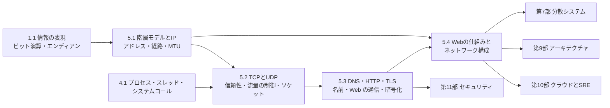

# 第5部 コンピュータネットワーク

> ブラウザで URL を開くと、あなたのコンピュータが送り出したバイト列は、いくつものネットワークと機器をまたいでサーバーに届き、応答が返ってきます。この部では、IP によるパケットの配送から、TCP と UDP による信頼性と流量の制御、DNS・HTTP・TLS による Web の通信、そしてロードバランサや CDN を含む実際の Web の構成までを、層ごとに積み上げます。目標は、パケットがブラウザからサーバーに届いて応答が返るまでを各層のプロトコルの役割とともに説明でき、「つながらない」「遅い」「一部の利用者だけおかしい」といったネットワーク起因の障害や性能の問題を、層ごとに切り分けられるようになることです。

## この部で身につくこと

- **層で考える**: OSI 参照モデルと TCP/IP モデル、カプセル化の仕組みを理解し、パケットのバイト列から各層のヘッダを読み取れる。「どの層の問題か」という問いを立てられる。
- **IP を計算で扱う**: IPv4 のアドレスと CIDR をビット演算で計算し、最長一致のルーティング・NAT・IPv6・ICMP・MTU の振る舞いを説明できる。クラウドの VPC を、将来の接続まで見越したアドレス計画として設計できる。
- **TCP の振る舞いを読む**: 再送・スライディングウィンドウ・フロー制御・輻輳制御の仕組みと、伝搬遅延・帯域幅遅延積による性能の限界を説明できる。TIME_WAIT、Nagle と遅延 ACK、HOL ブロッキング、タイムアウトの欠如といった現場の問題を診断できる。
- **Web のプロトコルを実装する**: DNS のメッセージ、HTTP/1.1 のパーサとサーバー、HTTP キャッシュの鮮度の計算を自分で書き、TLS 1.3 と証明書の検証の仕組みを説明できる。
- **構成を設計する**: ロードバランサ（L4/L7、振り分けのアルゴリズム、ヘルスチェック、ドレイン）、リバースプロキシ、CDN（キャッシュキー、パージ、オリジンシールド）、CORS、API の通信方式を、トレードオフとともに選べる。
- **障害を切り分ける**: dig・curl・openssl・ss・traceroute・tcpdump などの出力とエラーメッセージから、DNS・TCP・TLS・HTTP・アプリケーションのどこで問題が起きているかを特定できる。

## 章の一覧

| 章 | タイトル | 学習時間 | 主な演習 | キーワード |
|---|---|---|---|---|
| 5.1 | [階層モデルとIP](01-layers-and-ip/README.md) | 本文 4h ＋ 演習 5h | `ipnet.py`（IPv4 アドレスと CIDR の計算、経路集約、最長一致の経路表、VPC の CIDR 設計）・`ipv4_header.py`（ヘッダの組み立てと解析、インターネットチェックサム、フラグメンテーション）、記述: アドレス計画のレビュー | OSI 参照モデル, カプセル化, ARP, CIDR, 最長一致, BGP, NAT, IPv6, ICMP, MTU, 経路 MTU 探索, VPC |
| 5.2 | [TCPとUDP](02-tcp-and-udp/README.md) | 本文 4h ＋ 演習 5h | `framing.py`（長さプレフィックスのフレーミング）・`tcp_sim.py`（Go-Back-N と Selective Repeat、Reno / Tahoe の輻輳ウィンドウ）・`echo_tcp.py`（ソケットによるスレッド型のサーバーとクライアント）、記述: 深夜バッチの接続エラー | 3 ウェイハンドシェイク, 再送, フロー制御, 輻輳制御, CUBIC, BBR, TIME_WAIT, Nagle, QUIC, 帯域幅遅延積 |
| 5.3 | [DNS・HTTP・TLS](03-dns-http-tls/README.md) | 本文 5h ＋ 演習 7h | `http11.py`（HTTP/1.1 の厳格なパーサ）・`mini_http_server.py`（ソケットから作る HTTP サーバー）・`dnsmsg.py`（名前の圧縮を含む DNS メッセージの解析）・`http_cache.py`（キャッシュの鮮度の計算）、記述: サービスの移転計画 | DNS, TTL, 否定キャッシュ, 冪等性, chunked, Cache-Control, ETag, Cookie, HTTP/2, HTTP/3, TLS 1.3, PKI, ACME |
| 5.4 | [Webの仕組みとネットワーク構成](04-web-architecture/README.md) | 本文 4h ＋ 演習 6h | `lb.py`（振り分けのアルゴリズム、ヘルスチェック、ドレイン）・`cors.py`（CORS のサーバー側とブラウザ側の判定）・`url_tools.py`（URL の解析・解決・正規化）・`cdn_sim.py`（CDN のキャッシュのシミュレーション）、記述: 一部の利用者だけ表示されない | Core Web Vitals, L4/L7, Power of Two Choices, リバースプロキシ, CDN, CORS, WebSocket, サービスメッシュ, トラブルシューティング |

合計の目安は、本文 約 17 時間、演習 約 23 時間です。コード演習は `python3 tools/check.py 5` でまとめてテストできます（章を指定するなら `python3 tools/check.py 5.3` のように）。演習のテストは、127.0.0.1 の空いているポートだけを使い、外部とは通信しません。

## 学習の進め方

### 章の順序と依存関係

- **5.1 → 5.2 → 5.3 → 5.4 の順に進むのが基本です**。5.2 の MSS やフラグメンテーションの話は 5.1 の MTU を、5.3 の HTTP の本文の区切り方は 5.2 の「TCP はバイトストリーム」を、5.4 の CDN と接続の再利用の効果は 5.2 の往復の計算と 5.3 のキャッシュを前提にしています。
- **前提となる知識**: 5.1 の CIDR の計算とヘッダの組み立ては [1.1 情報の表現](../01-computer-systems/01-data-representation/README.md) のビット演算とエンディアンを、5.2 と 5.3 のサーバーの演習は [4.1 プロセス・スレッド・システムコール](../04-operating-systems/01-processes-and-syscalls/README.md) のシステムコールとスレッドの知識を使います。スレッドの排他制御に不安があれば [4.4 並行処理と同期](../04-operating-systems/04-concurrency/README.md) も参照してください。
- **コマンドを実際に叩いてみる**: 本文には `curl`・`openssl` などの実際の出力と、`ip`・`ss`・`dig`・`traceroute` の出力例が載っています。後者は Linux のコマンドで、macOS では `netstat -rn`（経路表）、`lsof -i` や `netstat -an`（接続の一覧）などで代用できます。Windows では `tracert`・`nslookup` が標準で使えますが、WSL2 を使うと本文と同じコマンドを試せます（[環境構築](../00-guide/setup.md)）。
- **本文の例をネットワークに対して試すとき**: 5.3 の DNS の問い合わせの例は、公開リゾルバへ実際に UDP で問い合わせます。社内ネットワークなどでは UDP の 53 番が遮断されていることがあります。他人の管理するサーバーに負荷をかけたり、許可なく調査したりしないでください。

### つまずきやすい点

- **「層」を意識して読む**: 例えば「アドレス」という言葉は、MAC アドレス（L2、次の 1 ホップ）・IP アドレス（L3、最終的な宛先）・ポート番号（L4、プロセス）で意味が違います。いま読んでいるのがどの層の話かを常に確かめてください。
- **バイトストリームとメッセージ**: TCP は `send()` の区切りを伝えません。5.2 の演習 1 と 4 を解くと、5.3 の HTTP のパーサが「どこまでが 1 つのリクエストか」を厳密に決めなければならない理由がよく分かります。
- **スレッドを使う演習**: 5.2 と 5.3 のサーバーの演習では、停止処理（待ち受けの終了とスレッドの後始末）で詰まりがちです。docstring のヒント（`settimeout` と `shutdown`）を読み、テストがタイムアウトする場合は `python3 tools/check.py -v 5.2` で、どのテストで止まっているかを確かめてください。
- **仕様の細部**: HTTP のパーサ（5.3）や URL の解決（5.4）の演習は、RFC の規則をそのまま実装する練習です。「親切に」受け入れると、かえってセキュリティの問題になることを意識してください。docstring とテストのメッセージが仕様書です。
- **キャッシュの用語**: `no-cache`（毎回確認する）と `no-store`（保存しない）、ブラウザのキャッシュと CDN のキャッシュ、HTTP のキャッシュと DNS のキャッシュを混同しやすいので、5.3 の 3 節の表を手元に置いて読んでください。
- **経験者の進め方**: 理解度チェックに答えられる章は、★★★ の演習（5.1 の IPv4 ヘッダ、5.2 の再送のシミュレーション、5.3 の HTTP サーバーと DNS、5.4 の URL）だけ解いて先へ進んで構いません。CTO 準備トラックでは、5.2 の「帯域幅と遅延」と 5.4 の「障害の切り分け」が特に重要です。各章の「なぜ学ぶのか」と「CTOの視点」は必ず読んでおきましょう（[学習ガイド](../00-guide/README.md)）。

## 到達度チェック

この部を修了したと言えるのは、次のことができるときです。

- [ ] URL を入力してから画面が表示されるまでを、DNS・TCP（または QUIC）・TLS・HTTP・CDN・ロードバランサ・アプリケーション・ブラウザの描画の各段階に分けて、何往復かかるかとともに説明できる
- [ ] パケットのバイト列から、イーサネット・IPv4・TCP のヘッダの各フィールドを読み取れる
- [ ] CIDR の計算（ネットワークアドレス・ブロードキャスト・ホスト数・包含・重なり・集約）を手計算とコードの両方でできる
- [ ] 最長一致のルーティングと BGP の仕組みから、経路ハイジャックや経路の取り下げが大規模障害になる理由を説明できる
- [ ] 「小さい通信は通るのに大きい通信だけ止まる」「一部の利用者だけつながらない」といった症状から、MTU・ICMP・IPv6 などの原因の仮説を立てて検証できる
- [ ] TCP の再送・フロー制御・輻輳制御を説明し、RTT と損失率と帯域幅遅延積からスループットの限界を見積もれる
- [ ] ソケット API で、部分的な送受信とメッセージの区切りを正しく扱う TCP のサーバーとクライアントを書ける
- [ ] DNS の TTL と否定キャッシュを踏まえて、DNS の切り替え計画を立てられる
- [ ] HTTP のメソッドの安全性と冪等性、キャッシュの指示（Cache-Control・ETag・Vary）、Cookie の属性を、設計の判断に使える
- [ ] TLS 1.3 のハンドシェイクと証明書の検証を説明し、証明書の期限切れを防ぐ運用（自動更新と監視）を設計できる
- [ ] ロードバランサ・リバースプロキシ・CDN のタイムアウト・リトライ・キャッシュの設定の食い違いが、どのような障害を生むかを説明できる
- [ ] 安全な CORS の設定を判断でき、CORS がアクセス制御の代わりにならない理由を説明できる
- [ ] dig・curl・openssl・ss などを使って、障害を DNS・TCP・TLS・HTTP・アプリケーションのどこで起きているかに切り分けられる
- [ ] 第5部の演習のテストがすべて通る（`python3 tools/check.py 5`）

## この部の推薦図書・教材

- 竹下隆史ほか『マスタリングTCP/IP 入門編』（オーム社）— TCP/IP の全体像を日本語で学ぶ定番の入門書。この部の副読本として、用語や全体像の確認に。
- 戸根勤『ネットワークはなぜつながるのか 第2版』（日経BP）— ブラウザからサーバーまでをたどる構成で、この部の内容を 1 本の物語として復習できる。
- James F. Kurose, Keith W. Ross "Computer Networking: A Top-Down Approach"（Pearson）— 世界の大学で使われている標準的な教科書。アプリケーション層から下へ降りていく構成で、各章の理論的な背景を補える。
- Kevin R. Fall, W. Richard Stevens "TCP/IP Illustrated, Volume 1: The Protocols"（第 2 版, Addison-Wesley）— パケットの実例とともにプロトコルの動作を詳解する古典。初版には邦訳『詳解TCP/IP Vol.1 プロトコル』（ピアソン・エデュケーション）がある。
- Ilya Grigorik "High Performance Browser Networking"（O'Reilly。邦訳『ハイパフォーマンス ブラウザネットワーキング』オライリー・ジャパン）— 遅延・TCP・TLS・HTTP/2・Web の性能を実務の観点で解説。原書は著者のサイトで無料で公開されている。
- 渋川よしき『Real World HTTP 第2版』（オライリー・ジャパン）— HTTP の歴史と仕組み、ブラウザとサーバーの実際の動きを日本語で詳しく解説。5.3 と 5.4 の副読本に。
- W. Richard Stevens ほか "UNIX Network Programming, Volume 1"（第 3 版, Addison-Wesley）— ソケットプログラミングの定番の解説書。サーバーを実装する仕事に就くなら手元に置きたい。

## 次に進む

- [第6部 データベース](../06-databases/README.md) では、アプリケーションとデータベースの間の通信（コネクションプール、往復の回数、タイムアウト）が性能と障害の要になります。5.2 の接続の管理の知識がそのまま活きます。
- [第7部 分散システム](../07-distributed-systems/README.md) は、この部の直接の続きです。「ネットワークは信頼できない」という前提（パケットの損失・遅延・分断）から、[7.1 分散システムの本質](../07-distributed-systems/01-fundamentals/README.md) でタイムアウトと故障の検出を、[7.3 パーティショニング](../07-distributed-systems/03-partitioning/README.md) で一貫性ハッシュによる振り分けを学びます。
- [第9部 アーキテクチャとシステム設計](../09-architecture/README.md) の [9.4 API設計](../09-architecture/04-api-design/README.md) と [9.5 スケーラビリティとパフォーマンス](../09-architecture/05-scalability-and-performance/README.md) では、5.4 の通信方式・キャッシュ・ロードバランシングを設計の判断として使います。
- [第10部 クラウドとSRE](../10-cloud-and-sre/README.md) では、5.1 の VPC を IaC で構築し（10.1）、5.4 のヘルスチェック・タイムアウト・リトライを信頼性の設計（10.3）と観測（10.4）につなげます。ネットワークの料金は [10.6 クラウドコスト管理（FinOps）](../10-cloud-and-sre/06-finops/README.md) で扱います。
- [第11部 セキュリティ](../11-security/README.md) では、5.3 の TLS の土台となる暗号技術（11.2）、Cookie とトークンによる認証（11.3）、リクエストスマグリングや CORS の誤設定・SSRF などの Web の攻撃（11.4）を学びます。
