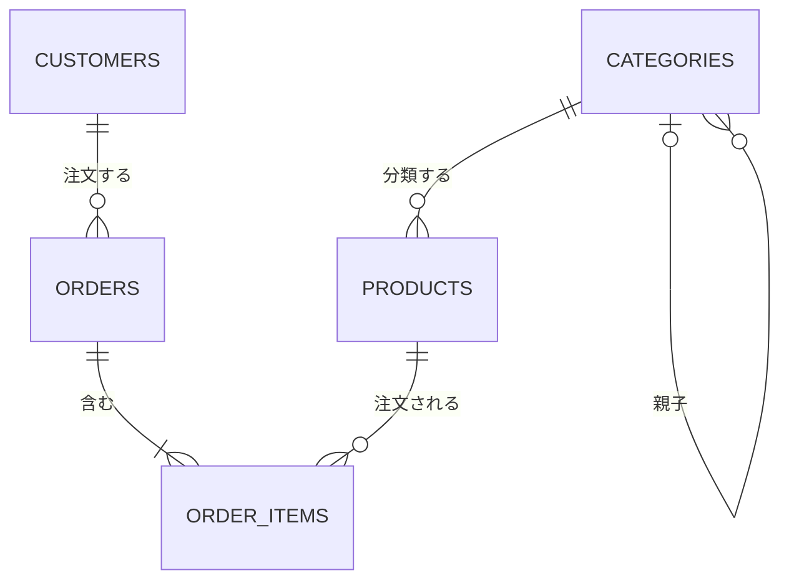

# 6.1 リレーショナルモデルとSQL

> なぜ 1970 年に提案された理論が、半世紀たった今もほとんどのシステムの中心にあるのでしょうか。そして、なぜ「動いているように見える SQL」が、NULL が 1 つ混ざっただけで 0 件を返したり、売上を 2 倍に数えたりするのでしょうか。この章では、SQL を呪文としてではなく「集合に対する宣言」として読み書きできるようになり、データの整合性をデータベース自身に守らせる設計を身につけます。

| 項目 | 内容 |
|---|---|
| 学習時間の目安 | 本文 4h ＋ 演習 5h |
| 前提となる章 | [2.1 計算機科学のための離散数学](../../02-math-and-algorithms/01-discrete-math/README.md)（集合・関係・論理）、[1.1 情報の表現](../../01-computer-systems/01-data-representation/README.md)（データ型） |
| 演習 | [exercises/](exercises/)（Python・SQLite） |
| キーワード | リレーション, 主キー, 外部キー, 関係代数, 結合, ウィンドウ関数, 再帰 CTE, NULL, 3 値論理, 関数従属性, 正規化, BCNF, SQL アンチパターン, N+1 問題 |

## この章のゴール

- [ ] ファイルではなく DBMS を使う理由と、DBMS の内部構成の全体像を説明できる
- [ ] リレーション・キー・関係代数の演算を説明し、関係代数の演算を実装できる
- [ ] SQL の論理的な評価順序を踏まえて、結合・集約・相関サブクエリ・CTE・ウィンドウ関数を使った問い合わせを書ける
- [ ] NULL と 3 値論理の落とし穴（NOT IN と NULL、COUNT(*) と COUNT(列)、LEFT JOIN と WHERE）を見抜いて避けられる
- [ ] 関数従属性から候補キーを求め、第3正規形・BCNF を判定し、意図的な非正規化の是非を判断できる
- [ ] 制約で整合性を DB に守らせるスキーマを設計し、代表的な SQL アンチパターンを指摘できる
- [ ] ORM の N+1 問題と SQL の方言の違いを理解し、アプリケーションから安全に SQL を使える

## なぜ学ぶのか

アプリケーションのコードは数年ごとに書き直されますが、**データとスキーマは数十年残ります**。言語やフレームワークを入れ替えても、顧客・注文・契約のテーブルはそのまま引き継がれます。最初の設計の良し悪しは、その後のすべての機能開発・障害対応・データ分析のコストに、長く「税金」のようにかかり続けます。

- **理論の寿命が長い**: E. F. Codd がリレーショナルモデルを提案した論文 "A Relational Model of Data for Large Shared Data Banks" は 1970 年の発表です。SQL は 1986 年に ANSI、1987 年に ISO で標準化され、今も改訂が続いています。Codd はこの業績で 1981 年のチューリング賞を受賞しました。
- **今も主役である**: Stack Overflow の開発者調査（2023 年・2024 年）では、PostgreSQL が「使っているデータベース」の 1 位でした。SQLite の公式サイトは、SQLite が世界で最も広く使われているデータベースエンジンであり、使われているデータベースは 1 兆を超えると推定しています。BigQuery や Snowflake のようなデータウェアハウス（[6.5](../05-beyond-relational/README.md)）でも、問い合わせの言語は SQL です。
- **間違いが静かに起きる**: SQL の誤りの多くはエラーになりません。`NOT IN` と NULL の組み合わせは 0 件を返し、結合による行の増幅は売上を水増しし、LEFT JOIN の後の WHERE は「注文のない顧客」を黙って消します。どれも「それらしい数字」が出るので、経営判断に使われてから発覚することがあります。
- **整合性はアプリケーションだけでは守れない**: 「メールアドレスの重複をアプリでチェックする」実装は、同時に 2 つのリクエストが来ると簡単にすり抜けます（[6.3](../03-transactions/README.md)）。一意制約・外部キー・CHECK 制約で DB に守らせる設計が、長期的に最も安くつきます。

日本では、IPA（情報処理推進機構）のデータベーススペシャリスト試験が、正規化・SQL・データモデリングを深く問う試験として知られています。この章の内容は、その土台にもなります。

## 1. なぜ DBMS を使うのか

### 1.1 ファイルで管理すると何が起きるか

小さなアプリなら、データを CSV や JSON のファイルに保存しても動きます。しかし利用者と機能が増えると、**同時更新**（2 つのプロセスが読んで書き戻すと片方の更新が消える）、**障害時の一貫性**（書き込み途中の停電で壊れたファイルが残る）、**整合性**（存在しない顧客の注文や負の在庫を防げない）、**問い合わせ**（集計のたびにプログラムを書く）、**性能**（1 件を探すのに全体を読む）、**データ独立性**（保存形式を変えると読むプログラムをすべて直す）の問題が次々に現れます。

### 1.2 DBMS が引き受けてくれること

**DBMS（Database Management System）** は、これらを汎用的に解決するソフトウェアです。

- **宣言的な問い合わせ**: 「何が欲しいか」を SQL で書けば、「どうやって取り出すか」は DBMS が選ぶ（[6.2](../02-indexes-and-query-processing/README.md)）。
- **トランザクション**: 複数の操作を「全部成功するか、全部なかったことになるか」にまとめ、同時実行を制御する（[6.3](../03-transactions/README.md)）。
- **永続性と障害回復**: コミットしたデータは、クラッシュしても失われない（[6.4](../04-storage-and-recovery/README.md)）。
- **整合性制約**: 主キー・外部キー・CHECK などの規則を、どのアプリケーションから書き込んでも必ず守らせる。
- **データ独立性**: 論理的なスキーマ（テーブルと列）と物理的な格納方法（インデックス・ファイル配置）が分離されているので、インデックスを追加しても SQL を書き換える必要がない。

DBMS の内部構成（パーサ・オプティマイザ・実行エンジン・バッファプール・WAL）の全体像は、[第6部の概要](../README.md) の図を参照してください。この章は、その一番上にある「論理的なモデルと SQL」を扱います。

## 2. リレーショナルモデル

### 2.1 リレーション・タプル・属性

リレーショナルモデルでは、データを **リレーション（relation、関係）** の集まりとして表します。リレーションは SQL のテーブル、**タプル（tuple）** は行、**属性（attribute）** は列に対応します。属性がとりうる値の集合を **ドメイン（domain）** と呼びます。

数学的には、リレーションはドメイン D₁, …, Dₙ の直積 D₁ × … × Dₙ の部分集合です（[2.1](../../02-math-and-algorithms/01-discrete-math/README.md) の「関係」と同じもの）。この定義から、次の性質が導かれます。

1. **タプルに順序はない**: 集合なので「1 行目」は存在しない。SQL でも `ORDER BY` を書かない限り、結果の順序は保証されない。
2. **重複したタプルはない**: 集合なので同じ要素は 2 つ存在しない。
3. **属性は名前で区別する**: 列の位置ではなく名前で参照する。

ただし、SQL のテーブルは重複した行を許す **バッグ（多重集合）** です。この違いは 3.3 節で扱います。

この章の例と演習では、次の EC サイトのスキーマを使います（[exercises/data/ecommerce.sql](exercises/data/ecommerce.sql)）。

```sql
CREATE TABLE customers  (customer_id INTEGER PRIMARY KEY, name TEXT NOT NULL,
                         email TEXT NOT NULL UNIQUE, prefecture TEXT, created_at TEXT NOT NULL);
CREATE TABLE categories (category_id INTEGER PRIMARY KEY, name TEXT NOT NULL,
                         parent_id INTEGER REFERENCES categories (category_id));
CREATE TABLE products   (product_id INTEGER PRIMARY KEY, name TEXT NOT NULL,
                         category_id INTEGER NOT NULL REFERENCES categories (category_id),
                         price INTEGER NOT NULL CHECK (price >= 0));
CREATE TABLE orders     (order_id INTEGER PRIMARY KEY,
                         customer_id INTEGER NOT NULL REFERENCES customers (customer_id),
                         ordered_at TEXT NOT NULL,
                         status TEXT NOT NULL CHECK (status IN ('paid', 'shipped', 'cancelled')));
CREATE TABLE order_items (order_id INTEGER NOT NULL REFERENCES orders (order_id),
                          product_id INTEGER NOT NULL REFERENCES products (product_id),
                          quantity INTEGER NOT NULL CHECK (quantity > 0),
                          unit_price INTEGER NOT NULL CHECK (unit_price >= 0),
                          PRIMARY KEY (order_id, product_id));
```

本章の SQL の実行結果は、Python 3 に同梱の SQLite 3.45 で実行したものです（`python3 exercises/sql_practice.py` の `print_query` や、`sqlite3` コマンドで試せます）。PostgreSQL と挙動が異なる点は、PostgreSQL 16 で確かめた結果を添えています。

### 2.2 キー

**キー** は、タプルを一意に特定するための属性の組です。

| 用語 | 定義 | 例 |
|---|---|---|
| 超キー（superkey） | その属性の値が決まればタプルが 1 つに決まる属性の組 | `{customer_id}`, `{customer_id, name}` |
| 候補キー（candidate key） | 極小の超キー（どの属性を 1 つ除いても超キーでなくなる） | `{customer_id}`, `{email}` |
| 主キー（primary key） | 候補キーのうち、代表として選んだもの。NULL 不可 | `customer_id` |
| 代替キー（alternate key） | 主キーに選ばなかった候補キー。UNIQUE 制約で守る | `email` |
| 外部キー（foreign key） | 他のリレーションの候補キーを参照する属性 | `orders.customer_id` |

`order_items` の主キーは `(order_id, product_id)` の 2 列からなる **複合キー** です。「同じ注文に同じ商品は 1 行だけ」という業務ルールを、主キーがそのまま表現しています。

### 2.3 サロゲートキーとナチュラルキー

主キーには 2 つの流儀があります。

| | ナチュラルキー（自然キー） | サロゲートキー（代理キー） |
|---|---|---|
| 例 | メールアドレス、社員番号、ISBN、国コード | 自動採番の整数、UUID |
| 利点 | 意味があり、結合せずに読める。重複を業務的に防げる | 不変。短く、結合が速い。業務ルールの変更に強い |
| 欠点 | **変わることがある**（メールアドレスの変更、社員番号体系の刷新）。変わると参照している全テーブルの更新が必要 | それ自体に意味がないので、業務上の重複は別途 UNIQUE で防ぐ必要がある |

実務では、**主キーはサロゲートキー、業務上の一意性はナチュラルキーへの UNIQUE 制約** という組み合わせが最もよく使われます。「サロゲートキーを使えば UNIQUE はいらない」と考えると、同じ顧客が 2 行登録されるといった重複を防げなくなります。一方、ISO 4217 の通貨コードや国コードのように、変わらないことが規格で保証されているものはナチュラルキーで十分です。

ID の型の選び方（32 ビットか 64 ビットか、UUIDv7 など）は [1.1 情報の表現](../../01-computer-systems/01-data-representation/README.md) で扱いました。ID が推測可能な連番だと、他人の注文 ID を試す攻撃がしやすくなる点も考慮します（[11.4](../../11-security/04-web-security/README.md)）。

## 3. 関係代数 — SQL の裏にある演算

### 3.1 基本演算

**関係代数（relational algebra）** は、リレーションを入力してリレーションを出力する演算の体系です。出力もリレーションなので、演算を自由に組み合わせられます（**閉包性**）。SQL の問い合わせは、DBMS の内部でまず関係代数の式（に近い木構造）に変換され、オプティマイザが同値な式に書き換えながら最も安い実行方法を探します（[6.2](../02-indexes-and-query-processing/README.md)）。

| 演算 | 記号 | 意味 | 対応する SQL |
|---|---|---|---|
| 選択（selection） | σ条件(R) | 条件を満たす行だけを残す | `WHERE` |
| 射影（projection） | π列(R) | 指定した列だけを残す（重複は除く） | `SELECT DISTINCT 列` |
| 名前の変更（rename） | ρ | 属性名やリレーション名を変える | `AS` |
| 直積（cartesian product） | R × S | すべての行の組み合わせ | `CROSS JOIN` |
| 和（union） | R ∪ S | どちらかにある行 | `UNION` |
| 差（difference） | R − S | R にあって S にない行 | `EXCEPT` |
| 結合（join） | R ⋈条件 S | σ条件(R × S) | `JOIN ... ON` |
| 自然結合（natural join） | R ⋈ S | 同名の属性がすべて等しい行を結合 | `NATURAL JOIN` |
| 共通部分（intersection） | R ∩ S | 両方にある行（R − (R − S) と同じ） | `INTERSECT` |
| グループ化（拡張） | γキー; 集約(R) | グループごとに集約 | `GROUP BY` |

σ・π・ρ・×・∪・− の 6 つが基本演算で、結合や共通部分はそれらの組み合わせで表せます。

### 3.2 問い合わせを関係代数で書く

「データベースのカテゴリ（category_id = 3）の本を、キャンセルされていない注文で買った顧客の名前」を考えます。SQL では次のように書けます。

```sql
SELECT DISTINCT c.name
FROM products AS p
JOIN order_items AS oi ON oi.product_id = p.product_id
JOIN orders AS o       ON o.order_id = oi.order_id
JOIN customers AS c    ON c.customer_id = o.customer_id
WHERE p.category_id = 3 AND o.status <> 'cancelled'
ORDER BY c.name;
```

```text
name
---------
佐藤 花子
小林 陽菜
田中 健太
高橋 美咲
```

関係代数では、例えば次のように書けます。

```text
π_name( π_product_id(σ_category_id=3(products))
        ⋈ π_order_id,product_id(order_items)
        ⋈ π_order_id,customer_id(σ_status≠'cancelled'(orders))
        ⋈ π_customer_id,name(customers) )
```

各段で先に射影しているのには理由があります。`products` と `customers` はどちらも `name` という属性を持つため、そのまま自然結合すると「商品名 = 顧客名」という意図しない条件まで結合条件に入ってしまうのです。SQL の `NATURAL JOIN` でも同じことが起きます。

```sql
SELECT COUNT(*) AS n
FROM order_items NATURAL JOIN orders NATURAL JOIN customers NATURAL JOIN products;
```

```text
n
-
0
```

エラーにならず、黙って 0 件になります。**`NATURAL JOIN` はスキーマの変更（同名の列の追加）で結果が変わる** ので、実務では使わず、結合条件を `ON` で明示するのが定石です。

関係代数の式は、葉にテーブル、節に演算を置いた木として表せます。オプティマイザは「結合してから選択する」式を「選択してから結合する」式に書き換えるなど、結果を変えない変形で木を組み替えます。選択 σ を葉の近く（データを読んだ直後）に移すと、結合に入る行が減って速くなります。これを **選択の押し下げ（predicate pushdown）** と呼びます。

### 3.3 集合とバッグ — SQL との違い

リレーショナルモデルのリレーションは集合ですが、SQL のテーブルと問い合わせの結果は重複を許すバッグです。重複を除くにはソートかハッシュが必要でコストがかかるため、SQL は「明示的に頼まれたときだけ重複を除く」設計になっています。

| 重複を残す | 重複を除く |
|---|---|
| `SELECT 列` | `SELECT DISTINCT 列` |
| `UNION ALL` | `UNION` |
| `INTERSECT ALL`・`EXCEPT ALL`（PostgreSQL などで利用可） | `INTERSECT`・`EXCEPT` |

重複が起きないと分かっている場合（主キーを含む列の和など）は `UNION ALL` を使うと、無駄な重複除去を避けられます。逆に、テーブルに主キーを付けないと、同じ行が 2 つ入り込んでも区別も削除もできなくなります。**すべてのテーブルに主キーを付ける** のは、リレーション（集合）であり続けるための最低条件です。

## 4. SQL — 宣言的な問い合わせ言語

### 4.1 SQL の構成

SQL の文は、スキーマを定義する **DDL**（`CREATE`・`ALTER`・`DROP`）、データを操作する **DML**（`SELECT`・`INSERT`・`UPDATE`・`DELETE`）、権限を管理する **DCL**（`GRANT`・`REVOKE`）、トランザクションを制御する文（`BEGIN`・`COMMIT`・`ROLLBACK`）に分けられます。SQL は「何が欲しいか」だけを書く **宣言的** な言語で、手続き（どの順にどのインデックスを使うか）は DBMS が決めます。

### 4.2 論理的な評価順序

SQL は書く順序と評価される順序が異なります。`SELECT` 文は、**論理的には** 次の順で評価されます（実際の実行順はオプティマイザが結果を変えない範囲で自由に変えます）。

```text
① FROM / JOIN   … 入力のテーブルを結合して、1 つの大きな表を作る
② WHERE         … 行を絞り込む（集約前の行が対象）
③ GROUP BY      … グループにまとめる
④ HAVING        … グループを絞り込む（集約後の値が対象）
⑤ SELECT        … 式・集約関数・ウィンドウ関数を計算する
⑥ DISTINCT      … 重複を除く
⑦ ORDER BY      … 並べ替える
⑧ LIMIT/OFFSET  … 行数を制限する
```

この順序から、多くの「なぜ動かないのか」が説明できます。

- **WHERE で集約関数を使えない**: WHERE の時点では、まだグループにまとめられていない。集約後の条件は HAVING に書く。
- **WHERE でウィンドウ関数を使えない**: ウィンドウ関数は ⑤ で計算される。「顧客ごとの最新の注文だけ」を取るには、サブクエリか CTE で包んでから外側で絞り込む（4.7 節の例）。
- **SELECT で付けた別名を WHERE で使えない**: 標準 SQL では ⑤ より前に ② が評価されるから。ORDER BY は ⑤ の後なので別名を使える。

別名の扱いは製品によって緩和されています。PostgreSQL 16 では別名を GROUP BY と ORDER BY では使えますが、WHERE と HAVING では使えません。

```text
-- PostgreSQL 16
SELECT substr(ordered_at, 1, 7) AS month, COUNT(*) AS n FROM orders GROUP BY month HAVING n >= 3;
ERROR:  column "n" does not exist
```

一方、SQLite は WHERE と HAVING でも別名を受け付け、MySQL は HAVING では受け付けます（WHERE では受け付けません）。こうした拡張には移植性がないので、**標準の書き方（`HAVING COUNT(*) >= 3` のように式を書く）に揃えておく** のが無難です。

### 4.3 結合

| 結合 | 結果 |
|---|---|
| `INNER JOIN` | 両側で条件に一致した行の組だけ |
| `LEFT [OUTER] JOIN` | 左側のすべての行。右側に一致がなければ右側の列を NULL で埋める |
| `RIGHT [OUTER] JOIN` | 右側のすべての行（左右を入れ替えた LEFT JOIN と同じ） |
| `FULL [OUTER] JOIN` | 両側のすべての行。一致がない側を NULL で埋める |
| `CROSS JOIN` | 直積（すべての組み合わせ） |
| 自己結合（self join） | 同じテーブルに別名を付けて結合する |

自己結合は、木構造や「上司と部下」のように、テーブルが自分自身を参照するときに使います（例: `FROM categories AS c LEFT JOIN categories AS p ON p.category_id = c.parent_id` で、各カテゴリと親カテゴリの名前を並べる）。

#### 落とし穴 1: LEFT JOIN の後の WHERE

LEFT JOIN は「左側の行を必ず残す」ための結合です。ところが、右側の列に対する条件を WHERE に書くと、NULL で埋めた行が WHERE で落とされ、INNER JOIN と同じ結果になってしまいます。

```sql
-- 意図: 顧客 7〜9 と、そのキャンセルされていない注文（注文がなくても顧客は表示したい）
SELECT c.customer_id, c.name, o.order_id
FROM customers AS c
LEFT JOIN orders AS o ON o.customer_id = c.customer_id
WHERE o.status <> 'cancelled' AND c.customer_id IN (7, 8, 9)
ORDER BY c.customer_id, o.order_id;
-- → 顧客 9 の 2 行（注文 12 と 18）だけが返り、顧客 7 と 8 が消える
```

注文のない顧客 7 は `o.status` が NULL になり、`NULL <> 'cancelled'` は真にならない（5 節）ので消えます。キャンセルした注文しかない顧客 8 も同様です。右側のテーブルに対する条件は **ON に書く** のが正解です。

```sql
SELECT c.customer_id, c.name, o.order_id
FROM customers AS c
LEFT JOIN orders AS o
  ON o.customer_id = c.customer_id AND o.status <> 'cancelled'
WHERE c.customer_id IN (7, 8, 9)
ORDER BY c.customer_id, o.order_id;
```

```text
customer_id | name      | order_id
------------+-----------+---------
          7 | 山本 結衣 |     NULL
          8 | 中村 翔   |     NULL
          9 | 小林 陽菜 |       12
          9 | 小林 陽菜 |       18
```

#### 落とし穴 2: 結合による行の増幅（ファンアウト）

1 対多の結合をすると、「1」の側の行は「多」の側の行数だけ複製されます。その状態で「1」の側の値を数えたり足したりすると、水増しされた値になります。

```sql
SELECT c.name,
       COUNT(o.order_id)          AS 注文数_誤り,
       COUNT(DISTINCT o.order_id) AS 注文数,
       SUM(oi.quantity * oi.unit_price) AS 売上
FROM customers AS c
JOIN orders AS o       ON o.customer_id = c.customer_id
JOIN order_items AS oi ON oi.order_id = o.order_id
WHERE o.status <> 'cancelled'
GROUP BY c.customer_id, c.name
ORDER BY c.customer_id;
```

```text
name        | 注文数_誤り | 注文数 | 売上
------------+-------------+--------+------
佐藤 花子   |           6 |      4 | 19900
鈴木 一郎   |           4 |      3 | 39900
高橋 美咲   |           5 |      3 | 20100
田中 健太   |           2 |      1 |  5600
伊藤 さくら |           4 |      3 | 20300
渡辺 大輔   |           1 |      1 |  8800
小林 陽菜   |           3 |      2 | 18800
```

`order_items` と結合した時点で、注文は明細の行数だけ複製されています。この例では `COUNT(DISTINCT ...)` で直せますが、「注文ごとの送料の合計」のように注文の側の金額を足す場合は DISTINCT では直りません（同額の送料が別の注文にあると 1 つにまとめられてしまう）。**集約は、行の粒度（1 行が何を表すか）が揃った段階で行う** のが原則です。明細を先に注文単位へ集約してから結合する、2 つの 1 対多を同時に結合しない、といった書き方をします。

### 4.4 集約とグループ化

集約関数（`COUNT`, `SUM`, `AVG`, `MIN`, `MAX`）は、グループごとに 1 つの値を返します。GROUP BY を使うとき、SELECT に書ける列は「GROUP BY に書いた列」と「集約関数」だけです（標準 SQL。主キーでグループ化した場合は、そのテーブルの他の列も書ける）。

MySQL は `ONLY_FULL_GROUP_BY`（5.7 以降の既定の sql_mode に含まれる）を外すと、SQLite は常に、グループ化していない列（bare column）を SELECT に書けてしまい、グループ内の「どれか 1 行」の値が返ります。偶然正しく見えることがあるので注意が必要です。

`COUNT(*)` と `COUNT(列)` の違いは 5.3 節で扱います。

### 4.5 サブクエリ — 相関サブクエリ・EXISTS と IN

サブクエリは、問い合わせの中に入れ子にした問い合わせです。外側の行の値を参照するものを **相関サブクエリ（correlated subquery）** と呼び、論理的には外側の 1 行ごとに評価されます。

```sql
-- 顧客ごとの最新の注文（相関サブクエリ版）
SELECT o.customer_id, o.order_id, o.ordered_at
FROM orders AS o
WHERE o.status <> 'cancelled'
  AND o.ordered_at = (SELECT MAX(o2.ordered_at)
                      FROM orders AS o2
                      WHERE o2.customer_id = o.customer_id
                        AND o2.status <> 'cancelled')
ORDER BY o.customer_id;
```

「外側の行ごとに実行」と聞くと遅そうですが、現代のオプティマイザは相関サブクエリを結合に書き換える（decorrelation）ことが多く、書き方だけで性能は決まりません。実行計画で確かめます（[6.2](../02-indexes-and-query-processing/README.md)）。

「〜が存在する」「〜が存在しない」という条件には、`EXISTS` / `IN` と、その否定を使います。

| 目的 | 書き方 | 注意 |
|---|---|---|
| 存在する（半結合、semi join） | `WHERE EXISTS (相関サブクエリ)` または `WHERE x IN (サブクエリ)` | 結合と違い、一致が何行あっても外側の行は 1 回だけ返る |
| 存在しない（反結合、anti join） | `WHERE NOT EXISTS (相関サブクエリ)` または `LEFT JOIN ... WHERE 右側.主キー IS NULL` | **`NOT IN (サブクエリ)` はサブクエリに NULL が混ざると 0 件になる**（5.2 節） |

肯定形の `EXISTS` と `IN` は、多くの DBMS で同じ実行計画になります（かつて MySQL の古い版では IN サブクエリが極端に遅いことがあり、「IN より EXISTS」という経験則が広まりました）。否定形では意味が変わりうるので、**反結合には NOT EXISTS を使う** と覚えておくのが安全です。

### 4.6 CTE と再帰 CTE

**CTE（Common Table Expression、共通テーブル式）** は、`WITH 名前 AS (問い合わせ)` で問い合わせに名前を付け、後に続く問い合わせで表のように使う仕組みです。入れ子のサブクエリを上から順に読める形に書き直せるので、複雑な集計の可読性が大きく上がります。

`WITH RECURSIVE` を使うと、木構造やグラフをたどる **再帰的な問い合わせ** が書けます。アンカー部（起点）の結果に再帰部を繰り返し適用し、新しい行が生まれなくなったら止まります。

```sql
-- 「本」（category_id = 1）の配下にあるすべてのカテゴリと、その深さ
WITH RECURSIVE sub(category_id, name, depth) AS (
  SELECT category_id, name, 0 FROM categories WHERE category_id = 1   -- アンカー部
  UNION ALL
  SELECT c.category_id, c.name, sub.depth + 1                        -- 再帰部
  FROM categories AS c
  JOIN sub ON c.parent_id = sub.category_id
)
SELECT category_id, name, depth FROM sub ORDER BY depth, category_id;
```

```text
category_id | name           | depth
------------+----------------+------
          1 | 本             |     0
          2 | コンピュータ   |     1
          5 | 小説           |     1
          3 | データベース   |     2
          4 | プログラミング |     2
```

`categories` のように「親の ID を持つ」木の表現を **隣接リスト（adjacency list）** と呼びます。再帰 CTE が使えなかった時代には、子孫を 1 回の問い合わせで取れないことが隣接リストの大きな欠点で、経路列挙（パス文字列を持つ）・入れ子集合（nested sets）・閉包テーブル（祖先と子孫の組を全部持つ）といった代替の表現が工夫されました。現在は主要な RDBMS（PostgreSQL、MySQL 8.0 以降、SQLite 3.8.3 以降）が再帰 CTE に対応しているので、まず隣接リストで十分かを検討し、読み取り性能が足りない場合に閉包テーブルなどを検討する、という順番で考えます。データに循環（A の親が B、B の親が A）があると再帰が止まらないので、深さの上限を条件に入れておくのが安全です。

### 4.7 ウィンドウ関数

**ウィンドウ関数（window function）** は、GROUP BY のように行をまとめてしまわずに、「その行と関係する行の集まり（ウィンドウ）」に対する計算結果を各行に付け加えます。

```text
関数名(...) OVER (PARTITION BY 区切る列 ORDER BY 並べる列 フレーム)
```

- `PARTITION BY`: ウィンドウを区切る（GROUP BY のように。ただし行は減らない）
- `ORDER BY`: ウィンドウの中の順序
- フレーム: 集約関数を使うときに、ウィンドウの中のどの範囲を対象にするか

**順位付けの 3 つの関数** は、同順位の扱いが異なります。

```sql
WITH counts AS (
  SELECT customer_id, COUNT(*) AS n
  FROM orders WHERE status <> 'cancelled'
  GROUP BY customer_id
)
SELECT customer_id, n,
       ROW_NUMBER() OVER (ORDER BY n DESC) AS rn,
       RANK()       OVER (ORDER BY n DESC) AS rnk,
       DENSE_RANK() OVER (ORDER BY n DESC) AS dense_rnk
FROM counts
ORDER BY n DESC, customer_id;
```

```text
customer_id | n | rn | rnk | dense_rnk
------------+---+----+-----+----------
          1 | 4 |  1 |   1 |         1
          2 | 3 |  2 |   2 |         2
          3 | 3 |  3 |   2 |         2
          5 | 3 |  4 |   2 |         2
          9 | 2 |  5 |   5 |         3
          4 | 1 |  6 |   6 |         4
          6 | 1 |  7 |   6 |         4
```

| 関数 | 同順位 | 次の順位 | 用途 |
|---|---|---|---|
| `ROW_NUMBER()` | 付けない（同値の順序は不定） | — | 「各グループの 1 件目」を 1 行だけ取る |
| `RANK()` | 同順位にする | 人数分飛ばす（1, 2, 2, 2, 5） | 競技の順位 |
| `DENSE_RANK()` | 同順位にする | 飛ばさない（1, 2, 2, 2, 3） | 「上位 3 種類の値」 |

`ROW_NUMBER()` の同値の順序は不定なので、結果を安定させたいときは `ORDER BY n DESC, customer_id` のように一意になるまで列を足します。**「各グループの最新 1 件」** は、ウィンドウ関数の最も頻出する使い方です（4.5 節の相関サブクエリと同じ結果）。ウィンドウ関数は WHERE で使えない（4.2 節）ので、サブクエリで包みます。

```sql
SELECT customer_id, order_id, ordered_at
FROM (
  SELECT o.*,
         ROW_NUMBER() OVER (PARTITION BY customer_id ORDER BY ordered_at DESC) AS rn
  FROM orders AS o
  WHERE status <> 'cancelled'
) AS t
WHERE rn = 1
ORDER BY customer_id;
```

`LAG` / `LEAD` は、ウィンドウ内の前後の行の値を参照します。「前回の注文から何日空いたか」のような間隔の計算に便利です。

```sql
SELECT customer_id, order_id, date(ordered_at) AS day,
       CAST(julianday(date(ordered_at))
            - julianday(date(LAG(ordered_at) OVER w)) AS INTEGER) AS days_since_prev
FROM orders
WHERE status <> 'cancelled' AND customer_id IN (1, 2)
WINDOW w AS (PARTITION BY customer_id ORDER BY ordered_at)
ORDER BY customer_id, ordered_at;
-- → 顧客 1 は NULL, 18, 36, 77（日）、顧客 2 は NULL, 41, 67
```

各顧客の最初の注文には前の行がないので NULL になります。日付関数は方言の差が大きい部分で、PostgreSQL なら `ordered_at::date - LAG(ordered_at::date) OVER w` のように書きます。

**フレームの既定値の罠**: 集約関数に `OVER (ORDER BY ...)` を付けると累計になりますが、既定のフレームは `RANGE BETWEEN UNBOUNDED PRECEDING AND CURRENT ROW` です。RANGE は「ORDER BY の値が同じ行」をまとめて扱うため、同じ値の行があると、それらはすべて同じ累計になります。

```sql
WITH t(day, amount) AS (VALUES ('01', 10), ('02', 20), ('02', 30), ('03', 40))
SELECT day, amount,
       SUM(amount) OVER (ORDER BY day) AS default_frame,
       SUM(amount) OVER (ORDER BY day
                         ROWS BETWEEN UNBOUNDED PRECEDING AND CURRENT ROW) AS rows_frame,
       AVG(amount) OVER (ORDER BY day
                         ROWS BETWEEN 1 PRECEDING AND CURRENT ROW) AS moving_avg2
FROM t
ORDER BY day, amount;
```

```text
day | amount | default_frame | rows_frame | moving_avg2
----+--------+---------------+------------+------------
01  |     10 |            10 |         10 |        10.0
02  |     20 |            60 |         30 |        15.0
02  |     30 |            60 |         60 |        25.0
03  |     40 |           100 |        100 |        35.0
```

1 行ずつ累積したいなら `ROWS` を明示します（その場合、同値の行の並び順が不定なので、ORDER BY も一意にします）。`ROWS BETWEEN 6 PRECEDING AND CURRENT ROW` とすれば 7 日移動平均のような計算もできます。

### 4.8 集合演算

`UNION` / `INTERSECT` / `EXCEPT` は、列の数と型が揃った 2 つの問い合わせの結果を、集合として組み合わせます。

```sql
-- 注文したことはあるが、一度も発送（shipped）されていない顧客
SELECT customer_id FROM orders
EXCEPT
SELECT customer_id FROM orders WHERE status = 'shipped';
-- → 8（キャンセルした注文しかない顧客）
```

3.3 節で述べたとおり、`UNION` は重複を除き、`UNION ALL` は除きません。重複除去が不要な場面で `UNION` を使うと、ソートやハッシュの余計なコストがかかります。

## 5. NULL と 3 値論理

### 5.1 3 値論理

**NULL** は「値がない」ことを表す特別な印で、値ではありません。NULL との比較（`=`, `<>`, `<` など）の結果は、真（TRUE）でも偽（FALSE）でもない **UNKNOWN（不明）** になります。SQL の論理演算は、この 3 つの値を扱う **3 値論理（three-valued logic）** です。

| p | q | p AND q | p OR q |
|---|---|---|---|
| TRUE | UNKNOWN | UNKNOWN | TRUE |
| FALSE | UNKNOWN | FALSE | UNKNOWN |
| UNKNOWN | UNKNOWN | UNKNOWN | UNKNOWN |

NOT UNKNOWN は UNKNOWN です。「UNKNOWN を、真偽どちらか分からない値」と考えると表を覚えやすくなります（FALSE AND ? は必ず FALSE、TRUE OR ? は必ず TRUE）。

```sql
SELECT NULL = NULL, NULL <> 1, NULL IS NULL, 3 IN (1, 2, NULL), 3 NOT IN (1, 2, NULL),
       NULL AND 0, NULL OR 1;
```

```text
NULL = NULL | NULL <> 1 | NULL IS NULL | 3 IN (1, 2, NULL) | 3 NOT IN (1, 2, NULL) | NULL AND 0 | NULL OR 1
------------+-----------+--------------+-------------------+-----------------------+------------+----------
       NULL |      NULL |            1 |              NULL |                  NULL |          0 |         1
```

（SQLite は真偽値を 1 / 0 で、UNKNOWN を NULL で表示します。PostgreSQL では t / f / 空欄で表示されます。）

最も重要な規則は、**WHERE・ON・HAVING は結果が TRUE の行だけを残す** ことです。UNKNOWN の行は FALSE と同じく捨てられます。一方、**CHECK 制約は FALSE の行だけを拒否し、UNKNOWN は通す** ので、`CHECK (price >= 0)` は NULL の price を拒否しません（NULL を拒否したければ NOT NULL を併用します）。

NULL であることの判定には `IS NULL` / `IS NOT NULL` を使います。「NULL どうしも等しいとみなして比較したい」ときは、標準 SQL の `IS [NOT] DISTINCT FROM`（PostgreSQL、SQLite 3.39 以降など。MySQL では `<=>`）を使います。

```sql
SELECT COUNT(*) FROM customers WHERE prefecture <> '東京都';                 -- 5
SELECT COUNT(*) FROM customers WHERE prefecture IS DISTINCT FROM '東京都';   -- 7
```

10 人の顧客のうち東京都が 3 人ですが、`<>` の結果は 7 ではなく 5 です。都道府県が未登録（NULL）の 2 人は「東京都ではない」とも判定されないからです。

### 5.2 NOT IN と NULL の罠

`x NOT IN (a, b, c)` は `x <> a AND x <> b AND x <> c` と同じ意味です。リストに NULL が 1 つでも含まれると、`x <> NULL` が UNKNOWN になるため、全体は **決して TRUE になりません**（FALSE か UNKNOWN）。したがって、サブクエリの結果に NULL が 1 つでも含まれると、次の問い合わせは 0 件を返します。

```sql
-- 部下を持たない社員（のつもり）
SELECT * FROM employees
WHERE employee_id NOT IN (SELECT manager_id FROM employees);   -- 社長の manager_id が NULL だと 0 件
```

サブクエリが NULL を返しうるかどうかは、スキーマやデータの変更で変わります。テスト時には正しく動いていた問い合わせが、ある日 NULL を含む 1 行が追加されたとたんに 0 件を返し始める、という形で問題が表面化します。対策は次のいずれかです。

1. **`NOT EXISTS` を使う**（推奨）。相関サブクエリが 0 行かどうかだけを見るので、NULL の影響を受けない。
2. サブクエリに `WHERE manager_id IS NOT NULL` を付ける。

逆に、肯定形の `IN` は NULL が混ざっても一致する行は正しく返るので、この問題は `NOT IN` に特有です。

### 5.3 集約関数と NULL

集約関数は NULL を無視します。ただし `COUNT(*)` だけは「行数」を数えるので NULL の行も数えます。

```sql
SELECT COUNT(*) AS all_rows, COUNT(prefecture) AS with_pref,
       COUNT(DISTINCT prefecture) AS distinct_pref
FROM customers;
```

```text
all_rows | with_pref | distinct_pref
---------+-----------+--------------
      10 |         8 |             5
```

この違いは LEFT JOIN と組み合わせたときに効いてきます。「顧客ごとの注文数」を `LEFT JOIN orders ... COUNT(*)` で数えると、注文のない顧客も「NULL で埋めた 1 行」があるため 1 になります。`COUNT(o.order_id)` なら 0 になります。

もう 1 つの罠は、**対象が 0 行のとき SUM・AVG・MAX などは 0 ではなく NULL を返す** ことです。

```sql
SELECT SUM(quantity) AS s, COALESCE(SUM(quantity), 0) AS s0, COUNT(*) AS n
FROM order_items WHERE order_id = 999;
```

```text
s    | s0 | n
-----+----+--
NULL |  0 | 0
```

アプリケーションで `total + shipping_fee` のように計算すると、NULL は伝播して結果全体が NULL（あるいは言語側の None によるエラー）になります。0 として扱いたいなら `COALESCE` で明示します。

ソート順での NULL の位置も製品によって異なります。PostgreSQL は昇順で NULL を最後に、SQLite と MySQL は最初に並べます。標準 SQL の `ORDER BY 列 NULLS LAST` を書けば明示できます（MySQL は未対応なので `ORDER BY 列 IS NULL, 列` で代用します）。

### 5.4 NULL をどう設計するか

NULL の意味は曖昧です。「未入力」「該当しない（法人顧客には生年月日がない）」「不明」の区別がつきません。設計の指針は次のとおりです。

- **原則として NOT NULL にする**。NULL を許すのは「値がないこと」に明確な意味がある列だけにし、その意味をコメントに書く。
- 「該当しない」が多い列は、テーブルを分けることを検討する（例: 法人顧客と個人顧客で別テーブル）。
- 空文字列と NULL を混在させない。Oracle Database は空文字列 `''` を NULL として扱うため、移行時に問題になることがある。
- UNIQUE 制約は、多くの DBMS で NULL どうしを「異なる値」とみなすので、NULL の行はいくつでも入る（PostgreSQL 15 以降では `UNIQUE NULLS NOT DISTINCT` で変更できる）。

## 6. 正規化

### 6.1 更新時異常

注文の明細を、1 つの表にすべて詰め込んだとします。

```text
注文明細（注文ID, 注文日時, 顧客ID, 顧客名, 商品ID, 商品名, 定価, 数量, 購入単価）

注文ID | 注文日時   | 顧客ID | 顧客名    | 商品ID | 商品名               | 定価 | 数量 | 購入単価
-------+------------+--------+-----------+--------+----------------------+------+------+---------
     1 | 2025-01-10 |      1 | 佐藤 花子 |      1 | データベース実践入門 | 3200 |    1 |     3200
     1 | 2025-01-10 |      1 | 佐藤 花子 |      3 | Python 入門          | 2400 |    1 |     2400
     3 | 2025-01-28 |      1 | 佐藤 花子 |      5 | 長い夜の物語         | 1500 |    2 |     1500
```

この表には、次の **更新時異常（update anomaly）** があります。

- **修正時異常**: 顧客名が何行にも重複しているので、改名したときに一部の行だけ更新すると、同じ顧客に 2 つの名前が存在する矛盾が生まれる。
- **挿入時異常**: まだ注文されていない商品を登録できない（注文ID が主キーの一部なので NULL にできない）。
- **削除時異常**: ある商品の唯一の注文を削除すると、その商品の情報まで消える。

原因は、**1 つの表に複数の「事実」が混ざっている** ことです。「顧客 1 の名前は佐藤 花子」「注文 1 は顧客 1 が 2025-01-10 にした」「商品 1 の名前は…」という別々の事実を、1 行に詰めています。正規化は、これを「1 つの事実を 1 か所に」置く形に分解する理論です。

### 6.2 関数従属性と属性閉包

属性の集合 X の値が決まると属性の集合 Y の値が 1 つに決まるとき、**Y は X に関数従属する** といい、**X → Y** と書きます（**関数従属性**、functional dependency, FD）。上の表では、次の FD が成り立ちます。

```text
注文ID → 注文日時, 顧客ID
顧客ID → 顧客名
商品ID → 商品名, 定価
注文ID, 商品ID → 数量, 購入単価
```

FD は業務ルールから決まるもので、データを眺めて見つけるものではありません（たまたま同じ値の組が並んでいるだけかもしれないため）。

与えられた FD から、ほかの FD を導けます。例えば「注文ID → 顧客ID」と「顧客ID → 顧客名」から「注文ID → 顧客名」が導けます（推移律）。属性の集合 X から導けるすべての属性を **属性閉包（attribute closure）** X⁺ と呼び、次のアルゴリズムで求めます。

```text
属性閉包 X⁺ の計算（F = {A → B, B → C, C D → E}, X = {A, D} の例）

結果 = {A, D}
A → B   : 左辺 {A} ⊆ 結果 なので B を加える   → {A, B, D}
B → C   : 左辺 {B} ⊆ 結果 なので C を加える   → {A, B, C, D}
C D → E : 左辺 {C, D} ⊆ 結果 なので E を加える → {A, B, C, D, E}
（もう増えないので終了）  {A, D}⁺ = {A, B, C, D, E}
```

X⁺ がスキーマのすべての属性を含むなら、X は超キーです。したがって属性閉包が計算できれば、**候補キー**（極小の超キー）を機械的に求められます。上の注文明細の表では、`{注文ID, 商品ID}` が唯一の候補キーです（演習 3 で実装します）。候補キーのいずれかに含まれる属性を **キー属性（prime attribute）** と呼びます。

### 6.3 正規形

正規形は「どの程度、事実が分離されているか」の段階です。実務でまず目標にするのは **第3正規形** と **BCNF** です。

| 正規形 | 条件（直感的な説明） | 違反の例 |
|---|---|---|
| 第1正規形（1NF） | 各属性の値が単一の値である（リストや繰り返しの列を持たない） | `tags = 'sql,db,index'`、`tel1, tel2, tel3` |
| 第2正規形（2NF） | 1NF であり、非キー属性が候補キーの **一部** に従属しない（部分従属がない） | `注文ID → 注文日時`（キーは {注文ID, 商品ID}） |
| 第3正規形（3NF） | 2NF であり、非キー属性が候補キーに **推移的に** 従属しない | `注文ID → 顧客ID → 顧客名` |
| BCNF（ボイス・コッド正規形） | 自明でないすべての FD X → Y で、X が超キーである | 下記の「学生・科目・教員」 |

3NF と BCNF は、FD の言葉で次のように定義できます。

- **3NF**: 自明でない（Y ⊄ X）すべての FD X → A について、**X が超キーであるか、A がキー属性である**。
- **BCNF**: 自明でないすべての FD X → Y について、**X が超キーである**。

BCNF は 3NF から「A がキー属性なら許す」という例外を取り除いたもので、より厳しい条件です。注文明細の表は、`注文ID → 注文日時, 顧客ID`、`顧客ID → 顧客名`、`商品ID → 商品名, 定価` のすべてが BCNF 違反（左辺が超キーでない）です。違反している FD ごとに表を分解すると、この章で使っている `orders`・`customers`・`products`・`order_items` の 4 つのテーブルになります。

### 6.4 分解の性質 — 無損失と従属性保存

表を分解するときは、次の 2 つの性質が問題になります。

- **無損失結合（lossless join）**: 分解した表を自然結合すると、元の表に正確に戻る。R を R₁ と R₂ に分けるとき、共通属性 R₁ ∩ R₂ が R₁ か R₂ の超キーなら無損失になる。FD X → Y の違反で (X ∪ Y) と (R − Y) に分けると、共通部分 X は X ∪ Y のキーなので、必ず無損失になる。
- **従属性保存（dependency preservation）**: 元の FD を、分解後のそれぞれの表の中だけで確かめられる（＝ UNIQUE 制約などで DB に守らせられる）。

**BCNF への分解は常に無損失にできますが、従属性保存は保証されません**。古典的な例が「学生・科目・教員」です。

```text
履修（学生, 科目, 教員）
業務ルール: 学生, 科目 → 教員   （学生は 1 科目を 1 人の教員から習う）
           教員 → 科目         （教員は 1 科目だけを教える）
候補キー:   {学生, 科目}, {学生, 教員}
```

`教員 → 科目` の左辺は超キーではないので BCNF 違反ですが、右辺の「科目」はキー属性なので 3NF は満たします。BCNF に分解すると `（教員, 科目）` と `（学生, 教員）` になりますが、今度は「学生, 科目 → 教員」を 1 つの表の中で確かめられなくなります（同じ学生が同じ科目を 2 人の教員から履修する行を、どちらの表の制約でも防げない）。

このように、**3NF は常に「無損失かつ従属性保存」な分解が可能**（合成アルゴリズム）で、BCNF はより冗長性が少ない代わりに従属性保存を諦めることがあります。実務では、ほとんどの表は 3NF にすれば自然に BCNF にもなっており、この差が問題になるのは複数の候補キーが重なる特殊な場合です。

さらに上の正規形として、多値従属性を扱う第4正規形、結合従属性を扱う第5正規形がありますが、1NF〜BCNF の考え方を身につければ、実務上の設計で困ることはまれです。

### 6.5 意図的な非正規化

正規化は「更新の正しさ」を最適化します。一方、読み取りのたびに多くのテーブルを結合するコストが問題になることもあります。**非正規化（denormalization）** は、読み取りの性能や単純さのために、意図的に冗長性を持ち込むことです。

| 手法 | 例 | 引き受けるコスト |
|---|---|---|
| 集計値の保持 | `customers.order_count`、`orders.total_amount` | 更新のたびに整合させる処理（トリガ・同一トランザクションでの更新）。ずれたときの検出と修復の仕組み |
| マテリアライズドビュー・集計テーブル | 日別売上テーブル | 更新の遅れ（どの時点のデータか）を利用者に説明する必要 |
| 読み取り専用モデル | 検索用の非正規化テーブル、検索エンジンへの複製 | 同期の仕組みと遅延（[7.5](../../07-distributed-systems/05-messaging-and-events/README.md)、[9.2](../../09-architecture/02-architecture-styles/README.md) の CQRS） |
| 分析用のスタースキーマ | ファクト表とディメンション表 | ETL の運用（[12.1](../../12-data-and-ai/01-data-engineering/README.md)） |

判断の原則は、**まず正規化し、計測して必要な箇所だけを非正規化し、正の値（source of truth）がどこかを明記する** ことです。

なお、`order_items.unit_price`（購入時点の単価）は非正規化ではありません。`products.price` は「現在の価格」、`unit_price` は「その注文で実際に請求した価格」という **別の事実** です。価格改定のたびに過去の注文の金額が変わってしまう設計の方が誤りです。配送先住所や税率も同様で、「その時点の値」を記録すべきか「現在の値」を参照すべきかは、正規化の問題ではなく業務の意味の問題です。

## 7. 制約とデータモデリング

### 7.1 制約で整合性を DB に守らせる

| 制約 | 守るもの | 例 |
|---|---|---|
| `NOT NULL` | 値の必須性 | `name TEXT NOT NULL` |
| `UNIQUE` | 業務上の一意性 | `email TEXT NOT NULL UNIQUE` |
| `PRIMARY KEY` | 行の識別（NOT NULL + UNIQUE） | `customer_id` |
| `FOREIGN KEY` | 参照先の存在（参照整合性） | `orders.customer_id REFERENCES customers` |
| `CHECK` | 値の範囲・形式・列の間の関係 | `CHECK (quantity > 0)`、`CHECK (start_at < end_at)` |

制約に違反する操作は、どのアプリケーション・どの管理ツールから実行しても拒否されます。

```text
-- SQLite 3.45。PRAGMA foreign_keys = ON を実行した接続で
INSERT INTO order_items VALUES (1, 5, 0, 1500);
→ IntegrityError: CHECK constraint failed: quantity > 0

INSERT INTO customers VALUES (11, '重複 太郎', 'hanako@example.com', NULL, '2025-06-01');
→ IntegrityError: UNIQUE constraint failed: customers.email

DELETE FROM customers WHERE customer_id = 1;      -- 注文がある顧客を削除しようとする
→ IntegrityError: FOREIGN KEY constraint failed
```

アプリケーションだけで整合性を守るのでは不十分な理由は、次のとおりです。

- **競合状態**: 「同じメールアドレスが存在しないことを確認してから INSERT」は、2 つのリクエストが同時に確認を通過すると重複を生む。UNIQUE 制約なら DB が原子的に判定する（[6.3](../03-transactions/README.md)）。
- **複数の書き手**: バッチ処理、管理画面、別のサービス、手作業の SQL。アプリのバリデーションは、それらすべてを通るとは限らない。
- **最後の防衛線**: バグは必ず起きる。制約違反はエラーとしてすぐ表面化するが、壊れたデータは後から見つかり、修復は高くつく。

外部キーには、参照先が削除・更新されたときの動作（`ON DELETE RESTRICT` / `CASCADE` / `SET NULL` など）を指定できます。`CASCADE` は便利ですが、1 行の削除が連鎖して大量の行を消すことがあるので、「本当に一緒に消えるべきものか」（注文明細は注文と一緒に消えてよいが、注文は顧客と一緒に消えてよいか）を考えて選びます。

製品ごとの注意点もあります。

- **SQLite**: 外部キーの検査は既定で無効で、接続ごとに `PRAGMA foreign_keys = ON` が必要。また、列の型は「型親和性（type affinity）」という緩い規則で、`INTEGER` の列に `'abc'` を入れてもエラーにならず、文字列のまま保存される。3.37.0 以降は `STRICT` テーブルで厳格にできる。
- **MySQL**: CHECK 制約は 8.0.16 より前のバージョンでは構文として受け付けるだけで、検査されなかった。
- **PostgreSQL**: 制約の検査をトランザクションの終わりまで遅らせる `DEFERRABLE` 制約が使える（循環参照するデータの投入などに便利）。

### 7.2 ER モデル

データモデリングでは、まず業務の **実体（entity）** と **関連（relationship）** を洗い出し、**ER 図** に描きます。この章のスキーマを ER 図にすると次のようになります。



関連の **多重度（cardinality）** ごとに、表現の仕方が決まっています。

- **1 対多（1:N）**: 「多」の側に外部キーを置く（`orders.customer_id`）。
- **多対多（N:M）**: 間に **中間テーブル（junction table、連関エンティティ）** を置く。注文と商品は多対多で、`order_items` がその中間テーブル。中間テーブルは、数量や単価のような「関連そのものの属性」を持てる。
- **1 対 1**: 一方に UNIQUE な外部キーを置く。本当に 1 対 1 なら同じテーブルにまとめてもよいが、アクセス頻度や権限が大きく異なる列（例: 個人情報）を分けるために使う。

### 7.3 SQL アンチパターン

Bill Karwin の『SQLアンチパターン』は、現場で繰り返される設計の失敗を名前付きで整理した本です。代表的なものを挙げます。

| アンチパターン | 例 | 何が困るか | 代わりに |
|---|---|---|---|
| ジェイウォーク（Jaywalking） | `products.tag_ids = '3,15,27'` | 外部キーを張れない。「タグ 15 の商品」が `LIKE` の全件走査になり、`'150'` にも一致しうる。要素数に上限ができる | 中間テーブル `product_tags(product_id, tag_id)` |
| EAV（エンティティ・アトリビュート・バリュー） | `attributes(entity_id, attr_name, attr_value)` | 型・NOT NULL・CHECK・外部キーが使えない。1 つの商品を組み立てるのに属性の数だけ行を集める必要があり、問い合わせが複雑で遅い | 普通の列。種類ごとに列が大きく異なるならサブタイプごとのテーブル。本当に可変な属性だけ JSON 型の列（検証を付ける） |
| ポリモーフィック関連（Polymorphic Associations） | `comments(target_type, target_id)` で商品にもレビューにもコメント | `target_id` に外部キーを張れず、存在しない対象へのコメントを防げない | 対象ごとの中間テーブル（`product_comments` など）、または共通の親テーブルを作ってそれを参照する |
| キーレスエントリ（Keyless Entry） | 「性能のため」「面倒なので」外部キーを付けない | 孤児レコードが静かに増え、後から修復するのは困難 | 外部キーを付ける。性能が問題になるのは、ほとんどの場合インデックスの不足（[6.2](../02-indexes-and-query-processing/README.md)） |
| ラウンディングエラー（Rounding Errors） | 金額を `FLOAT` で保存 | 丸め誤差（[1.1](../../01-computer-systems/01-data-representation/README.md)） | 最小単位の整数か `DECIMAL` |

アンチパターンの多くは、「スキーマの変更を避けて柔軟にしたい」という動機から生まれます。しかし、その柔軟性の代償として、DB が本来提供してくれる型・制約・インデックス・結合の恩恵をすべて失い、整合性の維持をアプリケーションのコードに押し付けることになります。

## 8. アプリケーションから SQL を使う

### 8.1 ORM と N+1 問題

**ORM（Object-Relational Mapping）** は、テーブルの行をプログラムのオブジェクトとして扱えるようにするライブラリです（Rails の Active Record、Django ORM、SQLAlchemy、Hibernate、Prisma など）。定型的な CRUD の記述量を大きく減らし、SQL インジェクションも防ぎやすくしますが、**どんな SQL が何回発行されているかが見えにくくなる** という代償があります。

その典型が **N+1 問題** です。一覧を 1 回の問い合わせで取得し、各要素の関連データを 1 回ずつ取得すると、合計 1 + N 回の問い合わせが発行されます。ORM の「関連を最初にアクセスしたときに読み込む（遅延読み込み、lazy loading）」機能で、ループの中から関連をたどると自然に起きます。

```python
# この章のディレクトリで実行する
import sqlite3
from pathlib import Path

conn = sqlite3.connect(":memory:")
conn.executescript(Path("exercises/data/ecommerce.sql").read_text(encoding="utf-8"))
executed = []
conn.set_trace_callback(executed.append)   # 実行された SQL を記録する

# N+1: 顧客の一覧を 1 回取り、顧客ごとに注文を 1 回ずつ取る（ORM の遅延読み込みで起きがち）
customers = conn.execute("SELECT customer_id, name FROM customers").fetchall()
for cid, name in customers:
    orders = conn.execute(
        "SELECT order_id FROM orders WHERE customer_id = ?", (cid,)).fetchall()
print("N+1:", len(executed), "回")

# 解決策: IN でまとめて取る（ORM の eager loading はこの形が多い。JOIN で 1 回にまとめる方法もある）
executed.clear()
ids = [cid for cid, _ in customers]
placeholders = ",".join("?" * len(ids))
orders = conn.execute(
    f"SELECT customer_id, order_id FROM orders WHERE customer_id IN ({placeholders})",
    ids).fetchall()
print("IN:", len(executed), "回")
```

```text
N+1: 11 回
IN: 1 回
```

顧客が 10 人なら 11 回で済みますが、1 画面に 1,000 件を表示すると 1,001 回になります。1 回の往復が 1 ミリ秒でも、ネットワーク越しなら合計 1 秒です。ORM には関連をまとめて読み込む機能（eager loading）があり、Rails なら `includes` / `preload`、Django なら `select_related` / `prefetch_related`、SQLAlchemy なら `joinedload` / `selectinload` などを使います。JOIN でまとめる方式は、1 対多の関連を複数同時に読み込むと 4.3 節の行の増幅が掛け算で効くので、IN で別々に取る方式の方が速いこともあります。

N+1 を防ぐには、**開発環境で発行された SQL の回数を見える状態にする** ことが最も効果的です（ORM のクエリログ、N+1 を検出するライブラリ、テストで問い合わせ回数の上限を検査するなど）。インデックスとの関係は [6.2](../02-indexes-and-query-processing/README.md) で扱います。

### 8.2 プレースホルダ — SQL インジェクションを防ぐ

利用者の入力を文字列の連結で SQL に埋め込むと、入力が SQL の構文として解釈されてしまいます（**SQL インジェクション**）。

```python
email = "x' OR '1'='1"   # 攻撃者が入力した文字列
conn.execute(f"SELECT * FROM customers WHERE email = '{email}'")  # 危険: 条件が常に真になり全 10 行が返る
conn.execute("SELECT * FROM customers WHERE email = ?", (email,))  # 安全: 値として扱われ 0 行
```

値は必ず **プレースホルダ（バインド変数）** で渡します。テーブル名や列名のようにプレースホルダにできない部分を入力から変えたい場合は、許可したものの一覧（ホワイトリスト）から選ばせます。詳しくは [11.4 Webアプリケーションセキュリティ](../../11-security/04-web-security/README.md) で扱います。

### 8.3 方言の違い

SQL には標準がありますが、製品ごとの方言（dialect）の差は小さくありません。代表的な違いを挙げます（2026 年時点の主要バージョンの挙動。詳細は各製品のドキュメントで確認してください）。

| 項目 | PostgreSQL | MySQL（InnoDB） | SQLite |
|---|---|---|---|
| 自動採番 | `GENERATED ... AS IDENTITY`（または `serial`） | `AUTO_INCREMENT` | `INTEGER PRIMARY KEY`（rowid） |
| 文字列の連結 | `\|\|` | `CONCAT()`（既定の `\|\|` は論理和） | `\|\|` |
| 整数どうしの `/` | 整数除算（5 / 7 = 0） | 小数の除算（5 / 7 = 0.7143）。整数除算は `DIV` | 整数除算（5 / 7 = 0） |
| UPSERT | `INSERT ... ON CONFLICT DO UPDATE` | `INSERT ... ON DUPLICATE KEY UPDATE` | `INSERT ... ON CONFLICT DO UPDATE`（3.24.0 以降） |
| FULL OUTER JOIN | 対応 | 非対応（LEFT と RIGHT の UNION で代用） | 3.39.0 以降で対応 |
| DDL とトランザクション | DDL もロールバックできる | DDL は暗黙のコミットを伴う | DDL もロールバックできる |
| 型の厳格さ | 厳格 | sql_mode に依存（既定は厳格モード） | 緩い（STRICT テーブルで厳格化） |
| 外部キー | 常に有効 | InnoDB で有効 | `PRAGMA foreign_keys = ON` が必要 |
| 昇順ソートでの NULL | 最後 | 最初 | 最初 |
| 識別子のクォート | `"name"` | `` `name` ``（ANSI_QUOTES モードで `"name"`） | `"name"`（`` ` `` や `[ ]` も可） |

ORM は方言の差をある程度吸収しますが、性能が重要な問い合わせや、ウィンドウ関数・UPSERT・JSON 関数などを使う場面では、結局その DBMS の SQL を書くことになります。テストは本番と同じ DBMS で行うのが原則です（「テストは SQLite、本番は PostgreSQL」は、方言の差によるバグを見逃します）。

## よくある落とし穴

1. **`NOT IN (サブクエリ)` を使う**。サブクエリの結果に NULL が 1 つでも混ざると 0 件になる。しかもテスト時には NULL がなく、本番のデータで初めて発覚しがち。反結合は `NOT EXISTS` で書く。
2. **LEFT JOIN の後に、右側のテーブルの条件を WHERE に書く**。NULL で埋めた行が落ち、INNER JOIN と同じになる。右側の条件は ON に書く。
3. **1 対多の結合の後に「1」の側の値を集計する**。行が複製されて件数や金額が水増しされる。集約してから結合する、粒度を意識する。
4. **LEFT JOIN と `COUNT(*)` を組み合わせる**。関連がない行も 1 と数えられる。`COUNT(右側の列)` を使う。
5. **整数どうしの割り算で比率を計算する**。SQLite と PostgreSQL では 5 / 7 = 0 になる。`1.0 *` を掛けるか CAST する。分母が 0 の場合も考える（`NULLIF`）。
6. **ORDER BY なしで順序を当てにする**。たまたま主キー順に返っていても、実行計画が変われば順序も変わる。ページングでは一意な列で並べる。
7. **整合性をアプリケーションのチェックだけで守る**。同時実行や別経路の書き込みですり抜ける。一意性・参照整合性・値の範囲は DB の制約で守る。
8. **柔軟性のためにカンマ区切りの列・EAV・ポリモーフィック関連を使う**。型・制約・インデックス・結合を失い、後から正規化し直す移行は大工事になる。
9. **ORM の遅延読み込みを一覧画面で使う**。N+1 問題で問い合わせが件数に比例して増える。開発時から発行される SQL の回数を監視する。

## CTOの視点

1. **スキーマは最も長生きする設計判断**。コードは書き直せても、数億行のテーブルの構造や、他システムが参照している列の意味は簡単には変えられません。設計レビューでは、画面や API より先にテーブル定義を見て、「この値の正（source of truth）はどこか」「業務上の不変条件（在庫は負にならない、1 注文に同じ商品は 1 行）はどの制約で守られているか」「この列は現在の値か、その時点の値か」「行を削除したら何が起きるか」を問いましょう。
2. **整合性の責任を DB に置くことを、組織の標準にする**。「外部キーは性能が悪いので付けない」「一意性はアプリで見る」という方針は、短期的には開発を速く見せますが、壊れたデータの調査と修復という形で何倍ものコストを後から払うことになります。例外を認める場合（シャーディングで外部キーが張れない等、[7.3](../../07-distributed-systems/03-partitioning/README.md)）は、代わりの検出手段（定期的な整合性チェックのバッチなど）をセットで求めます。
3. **スキーマ変更（マイグレーション）の運用ルールを決める**。本番の大きなテーブルへの `ALTER TABLE` はロックや長時間の書き換えを伴うことがあり、サービス停止の原因になります。「列の追加は先に、削除は参照がなくなってから」という段階的な変更（expand / contract）、オンラインでスキーマを変えるツール（MySQL なら gh-ost や pt-online-schema-change など）の採用、マイグレーションのレビューを必須にするといったルールを、デプロイの仕組み（[8.4](../../08-software-engineering/04-ci-cd-and-release/README.md)）と一緒に整えます。
4. **SQL は開発者だけの技能ではない**。プロダクトマネージャーやカスタマーサクセス、経営企画が自分で SQL を書いてデータを見られる組織は、意思決定が速くなります。一方で、本番 DB への直接のアクセスは性能と個人情報の両面でリスクなので、分析用の複製やデータ基盤（[12.1](../../12-data-and-ai/01-data-engineering/README.md)）、ビューと権限による列の制限（[11.3](../../11-security/03-authn-authz/README.md)）を用意し、「誰がどのデータを見られるか」を統制します。
5. **採用では、テーブル設計とクエリを書かせる**。「EC サイトのテーブルを設計し、月別のリピート購入率を出す SQL を書く」といった課題で、主キーと制約の付け方、NULL の扱い、結合の増幅への意識、正規化と非正規化の判断を説明できるかを見ます。ORM しか使ったことがない候補者でも、実行される SQL を想像できるかどうかで、将来の性能問題への対応力が大きく変わります。

## 演習

演習コードは [exercises/](exercises/) にあります。各ファイルの docstring に仕様があるので、`raise NotImplementedError(...)` を実装に置き換えてください。解答例は [solutions/](solutions/) にありますが、まずは自力で取り組みましょう。

```bash
python3 tools/check.py 6.1        # リポジトリのルートで実行。合格数と失敗したテストが表示される
python3 tools/check.py -v 6.1     # 詳しい出力
cd 06-databases/01-relational-model-and-sql/exercises
python3 sql_practice.py           # 演習 2: 書いた SQL の結果を表で確認する
```

| # | 難易度 | 内容 | ファイル / 関数 |
|---|---|---|---|
| 1 | ★☆☆〜★★☆ | 関係代数の演算（σ・π・ρ・×・⋈・θ結合・∪・−・∩・γ）を実装し、組み合わせて問い合わせを書く | [relalg.py](exercises/relalg.py): `select`, `project`, `rename`, `cross`, `natural_join`, `theta_join`, `union`, `difference`, `intersection`, `group_by`, `customers_who_bought` |
| 2 | ★☆☆〜★★★ | EC サイトのデータに対する 8 つの SQL（上位 N 件・LEFT JOIN と COUNT・反結合・NULL の罠・累計・カテゴリ内順位・再帰 CTE・リピート率） | [sql_practice.py](exercises/sql_practice.py): `top_customers_sql` ほか |
| 3 | ★★☆〜★★★ | 属性閉包・候補キー・BCNF と 3NF の違反の検出・BCNF 分解（発展） | [normalize.py](exercises/normalize.py): `closure`, `is_superkey`, `candidate_keys`, `bcnf_violations`, `third_nf_violations`, `bcnf_decompose` |
| 4 | ★★☆ | 記述: スキーマのレビュー（下記） | — |

演習 2 のテストは、元のデータに加えて「データを追加・変更したデータベース」でも SQL を実行して、Python で計算した正解と比べます。結果の値を SQL に直接書いても合格しないので、問い合わせとして正しく書いてください。

### 演習 4（記述）: スキーマのレビュー

あなたは EC サイトの新機能（タグ・商品ごとの仕様・コメント）の設計レビューを担当しています。次のテーブル定義（MySQL）の問題点を、この章の知識を使ってできるだけ多く指摘し、修正案を示してください。

```sql
CREATE TABLE products (
  id        INT PRIMARY KEY,
  name      VARCHAR(100),
  price     FLOAT,
  category  VARCHAR(50),            -- 'Books' などを自由入力
  tag_ids   VARCHAR(255)            -- '3,15,27' のようにタグ ID をカンマ区切りで保存
);
CREATE TABLE product_specs (        -- 商品ごとに異なる仕様を柔軟に保存するため
  product_id INT,
  spec_name  VARCHAR(50),           -- 'weight', 'color', 'pages' など
  spec_value VARCHAR(255)
);
CREATE TABLE comments (
  id          INT PRIMARY KEY,
  target_type VARCHAR(20),          -- 'product' / 'review' / 'order'
  target_id   INT,
  user_name   VARCHAR(50),          -- 投稿時に users テーブルからコピーした表示名
  body        TEXT
);
```

<details>
<summary>解答例</summary>

| 対象 | 問題 | 修正案 |
|---|---|---|
| `tag_ids` | ジェイウォーク。外部キーを張れず、「タグ 15 の商品」の検索が `LIKE '%15%'` の全件走査になり `150` にも一致する。タグの削除時に参照が残る | 中間テーブル `product_tags(product_id, tag_id, PRIMARY KEY (product_id, tag_id))` と、両方向の外部キー |
| `product_specs` | EAV。値の型が常に文字列で、必須項目・範囲・参照を制約できない。主キーもないので同じ仕様が重複しうる | 共通の仕様は `products` の列にする。商品種別ごとに大きく異なるなら種別ごとのテーブル（`book_details` など）。本当に可変な属性だけ JSON 型の列にし、必要なら CHECK や生成列で検証する |
| `comments.target_type/target_id` | ポリモーフィック関連。`target_id` に外部キーを張れず、存在しない対象へのコメントや、対象削除後の孤児コメントを防げない | `product_comments(comment_id, product_id)` のような対象ごとの中間テーブル、または対象ごとに NULL 可の外部キー列を持ち `CHECK` で「ちょうど 1 つだけ非 NULL」を強制する |
| `category` | 自由入力の文字列。表記ゆれ（'Books' と 'books'）が集計を壊し、カテゴリ名の変更で全行の更新が必要 | `categories` テーブルと外部キー `category_id` |
| `price FLOAT` | 金額に浮動小数点数（丸め誤差） | 最小単位の整数（`BIGINT`）または `DECIMAL` と通貨コード（[1.1](../../01-computer-systems/01-data-representation/README.md) 章） |
| `id INT`・`product_id INT` | 32 ビットの ID は枯渇しうる | `BIGINT`（1.1 章） |
| NOT NULL・外部キー・主キーの不足 | `name`・`price` が NULL 可。`product_specs.product_id` と comments の投稿者に外部キーがない。`product_specs` に主キーがない | 必須の列は NOT NULL。`product_specs` は `(product_id, spec_name)` を主キーに。投稿者は `user_id` の外部キーで持つ |
| `user_name` のコピー | 目的が曖昧な非正規化。表示名の変更を反映したいなら誤り、投稿時点の名前を残したいなら正しい | 業務上の意味を決める。通常は `user_id` を外部キーで持ち、表示時に結合する。「投稿時点の名前」を残す必要があるなら、その意図を列名とコメントで明示する（`author_name_at_post`） |

採点の観点:

- ジェイウォーク・EAV・ポリモーフィック関連の 3 つを、名前だけでなく「どの制約・どの問い合わせが困るか」まで説明できていれば合格ラインです。
- `user_name` を「その時点の値か、現在の値か」という業務の意味の問題として扱えていれば、設計レビューをリードできる水準です。
- 修正案で「柔軟性が必要な部分」をどう残すか（JSON 列＋検証、種別ごとのテーブル）のトレードオフに触れていれば、なお良いです。

</details>

## 理解度チェック

**Q1. 次の SQL が意図どおり動かない理由を、論理的な評価順序を使って説明し、正しく書き直してください。**

```sql
SELECT customer_id, order_id,
       ROW_NUMBER() OVER (PARTITION BY customer_id ORDER BY ordered_at DESC) AS rn
FROM orders
WHERE rn = 1;
```

<details>
<summary>解答</summary>

ウィンドウ関数は SELECT の段階（⑤）で計算されますが、WHERE（②）はそれより前に評価されるため、WHERE の時点では `rn` はまだ存在しません（PostgreSQL などではエラーになります）。ウィンドウ関数の結果で絞り込むには、4.7 節の例のように問い合わせ全体をサブクエリか CTE で包み、外側の WHERE で `rn = 1` を指定します。

</details>

**Q2. `SELECT * FROM products WHERE product_id NOT IN (SELECT product_id FROM wishlist)` が、ある日から常に 0 件を返すようになりました。考えられる原因と対策を説明してください。**

<details>
<summary>解答</summary>

`wishlist.product_id` に NULL の行が追加されたと考えられます。`x NOT IN (a, b, NULL)` は `x <> a AND x <> b AND x <> NULL` と同じで、最後の項が UNKNOWN になるため、全体は決して TRUE になりません。WHERE は TRUE の行しか残さないので 0 件になります。

対策は `NOT EXISTS (SELECT 1 FROM wishlist AS w WHERE w.product_id = p.product_id)` に書き換えることです。あわせて、`wishlist.product_id` に NULL が入ること自体が誤りなら、NOT NULL 制約と外部キーを付けて原因を断ちます。

</details>

**Q3. R(A, B, C, D) に FD の集合 F = {A → B, B → C} があります。候補キーを求め、R が第3正規形・BCNF かどうかを判定してください。**

<details>
<summary>解答</summary>

A と D はどの FD の右辺にも現れないので、必ず候補キーに入ります。{A, D}⁺ = {A, B, C, D} なので {A, D} は超キーで、A だけ・D だけでは超キーではないので、**候補キーは {A, D} だけ** です。キー属性は A と D です。

- `A → B`: A は超キーでなく、B はキー属性でない → 3NF 違反（候補キー {A, D} の一部 A への部分従属なので、2NF 違反でもある）。
- `B → C`: 同様に 3NF 違反（推移従属）。

したがって R は第3正規形でも BCNF でもありません。分解の例: (A, B)、(B, C)、(A, D)。

</details>

**Q4. 第3正規形だが BCNF ではない例を挙げ、BCNF に分解したときに失うものを説明してください。**

<details>
<summary>解答</summary>

「履修（学生, 科目, 教員）」で、`学生, 科目 → 教員` と `教員 → 科目` が成り立つ場合です。候補キーは {学生, 科目} と {学生, 教員} で、`教員 → 科目` の左辺は超キーではありませんが、右辺の科目はキー属性なので 3NF は満たし、BCNF は満たしません。

BCNF に分解すると（教員, 科目）と（学生, 教員）になり、無損失ではありますが、`学生, 科目 → 教員` を 1 つの表の制約（UNIQUE など）で守れなくなります（従属性保存が失われる）。守るには、トリガやアプリケーションでの検査が必要になります。

</details>

**Q5. 一覧画面が遅いという報告を受けました。ログを見ると、同じ形の SQL が 1 リクエストで 500 回発行されています。何が起きていて、どう直しますか。**

<details>
<summary>解答</summary>

N+1 問題です。一覧を取得する 1 回の問い合わせの後、各行の関連データを 1 行ずつ問い合わせています（ORM の遅延読み込みでループ内から関連をたどっていることが多い）。1 回の往復が短くても、回数に比例して遅くなります。

直し方は、関連をまとめて読み込むことです。JOIN で 1 回にまとめるか、`WHERE id IN (...)` で関連を 1 回で取得します（ORM の eager loading 機能。Django の `prefetch_related`、Rails の `includes` など）。複数の 1 対多を同時に JOIN すると行の増幅が起きるので、その場合は IN で別々に取る方が速いことがあります。再発を防ぐため、開発環境やテストで 1 リクエストあたりの問い合わせ回数を監視します。

</details>

**Q6.（発展）「カテゴリ 5 の商品を、すべて（キャンセル以外の注文で）買ったことのある顧客」を求める SQL を書いてください。**

<details>
<summary>解答</summary>

「すべての〜について」は関係代数の **除算（division）** にあたり、SQL では「買っていない商品が存在しない顧客」という二重否定（NOT EXISTS の入れ子）で書くのが定番です。

```sql
SELECT c.customer_id, c.name
FROM customers AS c
WHERE NOT EXISTS (
  SELECT 1 FROM products AS p
  WHERE p.category_id = 5
    AND NOT EXISTS (
      SELECT 1 FROM orders AS o JOIN order_items AS oi ON oi.order_id = o.order_id
      WHERE o.customer_id = c.customer_id AND oi.product_id = p.product_id
        AND o.status <> 'cancelled'))
ORDER BY c.customer_id;
-- → 3 高橋 美咲、5 伊藤 さくら
```

別解として、顧客ごとに「買ったカテゴリ 5 の商品の種類数（COUNT(DISTINCT product_id)）」を数え、カテゴリ 5 の商品数と等しい顧客を HAVING で選ぶ方法もあります。なお、カテゴリ 5 に商品が 1 つもない場合、二重否定の書き方は全顧客を返します（「すべての要素について真」は空集合に対して真になる）。この境界の扱いが仕様として正しいかも確認しましょう。

</details>

## さらに学ぶために

- Andy Pavlo ほか, CMU 15-445/645 "Database Systems"（講義動画とスライドが無料で公開されている）— リレーショナルモデルからストレージ・インデックス・トランザクション・障害回復まで、第6部全体の主教材として最適。
- Abraham Silberschatz, Henry F. Korth, S. Sudarshan "Database System Concepts"（McGraw-Hill）— 定番の教科書。関係代数、SQL、関数従属性と正規化を厳密に学べる。
- Bill Karwin "SQL Antipatterns"（邦訳『SQLアンチパターン』オライリー・ジャパン）— 現場で繰り返される設計の失敗と対策の集大成。設計レビューの前に読み返したい。
- ミック『達人に学ぶ SQL徹底指南書』（翔泳社）— 3 値論理、CASE 式、ウィンドウ関数など、SQL を集合の言語として使いこなすための日本語の定番書。
- ミック『達人に学ぶDB設計徹底指南書』（翔泳社）— 正規化・ER 図・アンチパターンを実務の観点から日本語で解説。
- E. F. Codd "A Relational Model of Data for Large Shared Data Banks"（Communications of the ACM, 1970）— すべての出発点となった論文。データ独立性という動機が、今読んでも明快。
- PostgreSQL 公式ドキュメント（日本語訳は日本PostgreSQLユーザ会が公開）の「SQL言語」の部 — ウィンドウ関数、WITH 問い合わせ、制約の仕様を正確に確認できる一次資料。

## まとめ

- DBMS は、宣言的な問い合わせ・トランザクション・障害回復・整合性制約・データ独立性を汎用的に提供する。データはコードより長生きするので、スキーマの品質は長期のコストを決める。
- リレーションは「タプルの集合」で、SQL の問い合わせは内部で関係代数（σ・π・⋈ など）の式として扱われ、同値な変形を通じて最適化される。
- SQL は FROM → WHERE → GROUP BY → HAVING → SELECT → ORDER BY → LIMIT の順に論理的に評価される。この順序で、別名やウィンドウ関数の使える場所が決まる。
- NULL は 3 値論理を持ち込む。`NOT IN` と NULL、LEFT JOIN と WHERE、`COUNT(*)` と `COUNT(列)`、空の集約が NULL になること、結合による行の増幅が、エラーにならない誤りの代表。
- 関数従属性と属性閉包から候補キーが求まり、第3正規形・BCNF を判定できる。BCNF 分解は無損失だが従属性保存を失うことがある。非正規化は計測に基づき、正の値を明示して行う。
- 一意性・参照整合性・値の範囲は DB の制約で守る。ジェイウォーク・EAV・ポリモーフィック関連は、柔軟性と引き換えに DB の恩恵を失うアンチパターン。
- ORM は便利だが、発行される SQL を見える状態に保つ。N+1 問題はまとめて読み込むことで解消し、値は必ずプレースホルダで渡す。
