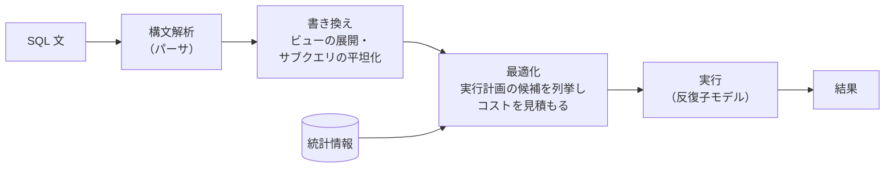
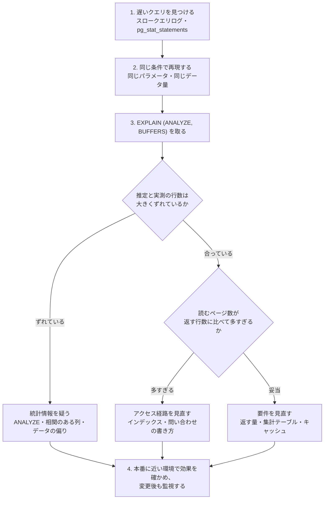

# 6.2 インデックスとクエリ処理

> 同じ 100 万行のテーブルに同じ形の SQL を投げても、60 ミリ秒かかることもあれば 0.1 ミリ秒で返ることもあります。その差を生むのがインデックスと実行計画です。この章では、DBMS が SQL をどう実行しているかを「ページを何枚読むか」というコストのものさしで理解し、インデックスを設計し、遅いクエリを根拠を持って調査できるようになります。

| 項目 | 内容 |
|---|---|
| 学習時間の目安 | 本文 4h ＋ 演習 6h |
| 前提となる章 | [6.1 リレーショナルモデルとSQL](../01-relational-model-and-sql/README.md)、[2.5 木・ヒープ・グラフ](../../02-math-and-algorithms/05-trees-heaps-graphs/README.md)、[1.3 メモリ階層とキャッシュ](../../01-computer-systems/03-memory-hierarchy/README.md) |
| 演習 | [exercises/](exercises/)（Python・SQLite） |
| キーワード | ページ, I/O コスト, B+木, クラスタ化インデックス, 複合インデックス, カバリングインデックス, 選択度, オプティマイザ, 統計情報, EXPLAIN, 入れ子ループ結合, ハッシュ結合, ソートマージ結合, キーセットページネーション |

## この章のゴール

- [ ] ページ単位の I/O コストモデルで、全件走査とインデックスを使った検索のコストを見積もれる
- [ ] B+木の構造（ファンアウト・高さ・葉の連結）を説明し、挿入・検索・範囲検索を実装できる
- [ ] クラスタ化インデックスとセカンダリインデックスの違い（InnoDB と PostgreSQL の違い）を説明できる
- [ ] 選択度・複合インデックスの列の順序・カバリング・部分／式インデックスを踏まえて、インデックスを設計できる
- [ ] オプティマイザの仕組みと統計情報の役割を説明し、EXPLAIN / EXPLAIN ANALYZE の出力を読める
- [ ] 入れ子ループ・ハッシュ・ソートマージの 3 つの結合アルゴリズムを実装し、使い分けを説明できる
- [ ] 遅いクエリの典型パターンを見抜き、計測から始める調査手順で改善できる

## なぜ学ぶのか

アプリケーションの「遅い」の原因をたどると、多くの場合データベースへの問い合わせに行き着きます。しかも、問題はデータが少ない開発環境では現れず、本番のデータが育ってから表面化します。

- **データ量に比例して遅くなる**: インデックスのない検索は、行数に比例してページを読みます。この章で実測する 100 万行の例では、全件走査が約 60 ミリ秒、インデックスを使うと約 0.1 ミリ秒でした。1 秒に数百回呼ばれるエンドポイントなら、この差がそのまま「DB サーバー 1 台で足りるか、何十台必要か」の差になります。
- **インデックスは無料ではない**: インデックスは書き込みのたびに更新されます。この章の計測では、二次インデックスを 4 つ付けると INSERT の時間が約 6 倍になりました。「念のため全部の列にインデックスを」は、書き込みの多いシステムを遅くします。
- **ある日突然遅くなる**: データの分布が変わったり、統計情報が古くなったりすると、オプティマイザが別の実行計画を選び、昨日まで速かったクエリが急に遅くなります（プランの劣化）。このとき、実行計画を読めるかどうかで、障害の解決時間が大きく変わります。
- **設計の問題はアプリの書き方にも現れる**: OFFSET による深いページング、N+1 問題、インデックスが効かない条件の書き方は、どれも「DB のせい」に見えて実はアプリケーション側の設計の問題です。Markus Winand の "Use The Index, Luke!" が「インデックスは開発の仕事の一部」という立場で書かれているように、インデックスの設計は DBA 任せにせず、SQL を書く開発者が担うべきものです。

## 1. コストのものさし — ページと I/O

### 1.1 ページ

DBMS はデータを **ページ（page、ブロック）** という固定長の単位で読み書きします。ディスクから 1 行だけを読むことはできず、その行を含むページ全体を読みます。

| DBMS | 既定のページサイズ |
|---|---|
| PostgreSQL | 8KB |
| MySQL（InnoDB） | 16KB |
| SQLite | 4KB（3.12.0 以降） |

読み込んだページはメモリ上の **バッファプール**（PostgreSQL では shared buffers）にキャッシュされ、次に同じページが必要になったときはディスクを読まずに済みます（[1.3](../../01-computer-systems/03-memory-hierarchy/README.md) のキャッシュと同じ考え方。詳しくは [6.4](../04-storage-and-recovery/README.md)）。

### 1.2 I/O コストモデル

クエリのコストを見積もる最も単純で強力なモデルは、**「読むページの数」** です。記憶装置の速度は階層によって桁違いに異なるため、CPU の計算よりもページの読み込みがコストを支配することが多いからです。

| 操作 | おおよその時間（桁の目安） |
|---|---|
| メインメモリの参照 | 約 100 ナノ秒 |
| NVMe SSD のランダム読み込み（4KB） | 数十〜100 マイクロ秒程度 |
| HDD のランダム読み込み | 数ミリ秒〜10 ミリ秒程度（シーク＋回転待ち） |

HDD では、連続したページを順に読む **シーケンシャル I/O** の方が、ばらばらのページを読む **ランダム I/O** よりはるかに速く、この差がオプティマイザのコスト計算にも反映されています（PostgreSQL の `seq_page_cost = 1` に対して `random_page_cost = 4` が既定値）。SSD ではその差が小さくなるため、`random_page_cost` を下げて運用することもあります（この章の 6 節で見る例）。

### 1.3 全件走査のコスト

インデックスがなければ、DBMS は条件に合う行を探すためにテーブルのすべてのページを読むしかありません。これを **全件走査（full table scan、PostgreSQL では Seq Scan）** と呼びます。

この章の PostgreSQL の例では、次のテーブルに 100 万行の注文データを入れています（PostgreSQL 16 で実行。並列実行は読みやすさのため `max_parallel_workers_per_gather = 0` で無効にしています。時間は環境によって変わり、出力は要点以外を省略しています）。

```sql
CREATE TABLE orders (
  id          bigint PRIMARY KEY,
  customer_id bigint NOT NULL REFERENCES customers (id),   -- 顧客は 10 万人
  status      text NOT NULL,                               -- pending 1% / paid 30% / shipped 60% / cancelled 9%
  created_at  timestamptz NOT NULL,                        -- 2025 年の 1 年間に分散
  total       integer NOT NULL
);
```

```text
EXPLAIN (ANALYZE, BUFFERS) SELECT id, created_at, total FROM orders WHERE customer_id = 4242;

 Seq Scan on orders  (cost=0.00..20949.00 rows=11 width=20) (actual time=1.342..60.155 rows=12 loops=1)
   Filter: (customer_id = 4242)
   Rows Removed by Filter: 999988
   Buffers: shared hit=8449
 Execution Time: 60.206 ms
```

12 行を返すために、8,449 ページ（約 66MB）をすべて読み、999,988 行を捨てています。`customer_id` にインデックスを作ると、次のようになります。

```text
 Bitmap Heap Scan on orders  (cost=4.51..47.46 rows=11 width=20) (actual time=0.057..0.075 rows=12 loops=1)
   Recheck Cond: (customer_id = 4242)
   Heap Blocks: exact=12
   Buffers: shared hit=15 read=3
   ->  Bitmap Index Scan on orders_customer_idx  (cost=0.00..4.51 rows=11 width=0) (actual time=0.047..0.048 rows=12 loops=1)
         Index Cond: (customer_id = 4242)
 Execution Time: 0.096 ms
```

読んだページは 18 枚（インデックスを 6 枚、テーブル本体を 12 枚）で、時間は約 600 分の 1 になりました（インデックスの 6 枚には、木の 3 段のほかに、セッションで最初にこのインデックスを使うときだけ読むメタページなどが含まれます。同じセッションで別の顧客を検索すると、インデックスは 3 枚でした）。**インデックスの効果は「読むページ数を何桁減らせるか」** で理解できます。

## 2. B+木インデックス

### 2.1 なぜ二分探索木ではないのか

ソート済みの配列なら二分探索で O(log n) で探せますが、挿入のたびに要素をずらす必要があります。二分探索木（[2.5](../../02-math-and-algorithms/05-trees-heaps-graphs/README.md)）なら挿入も O(log n) ですが、100 万件で高さが約 20 になり、ノードがページに対応するディスク上の構造では **20 回のランダム I/O** が必要です。

**B+木（B+ tree）** は、1 つのノードに数百個のキーを詰め込んで木を「低く、太く」した構造です。1 ノード = 1 ページとし、1 回の I/O で数百通りの分岐を判断できるので、木の高さは 3〜4 段で済みます。1972 年の Bayer と McCreight による B 木の論文以来、ほぼすべての RDBMS の標準的なインデックス構造になっています。

### 2.2 構造

```text
                               [ 500 | 1000 ]                         ← ルート（内部ノード）
                   ┌────────────────┼─────────────────┐
          [ 100 | 200 | … ]   [ 600 | 700 | … ]   [ 1100 | … ]         ← 内部ノード（区切りキー）
           ┌────┼────┐              …                  …
 [1 2 … 99]→[100 … 199]→[200 … ]→ … →[500 … ]→ … →[1000 …]→ …        ← 葉（キー＋行の位置）
```

- **内部ノード** は区切りキーと子へのポインタだけを持つ。区切りキー k の左の子には k 未満、右の子には k 以上のキーが入る。
- **葉** はキーと、行の位置（または行そのもの。2.4 節で説明）を持つ。すべての葉は同じ深さにある（平衡木）。
- 葉どうしは **連結リスト** でつながっている。範囲検索（`BETWEEN`、`>`、`ORDER BY`）は、始点の葉まで 1 回下りたら、あとは葉を横にたどるだけでよい。

検索は、ルートから葉まで 1 本の道をたどるので、読むページ数は木の高さと同じです。挿入でノードがあふれたら半分に **分割（split）** し、区切りキーを親に追加します。分割が根まで伝わったときだけ木が 1 段高くなるので、木は常に平衡を保ちます（演習 1 で実装します）。

### 2.3 実物の B+木の高さ

PostgreSQL の `pageinspect` 拡張で、100 万行の `orders` の主キー（bigint）のインデックスを調べると、次のようになっていました。

| 階層 | ページ数 | 1 ページあたりのエントリ数 |
|---|---|---|
| ルート | 1 | 10 |
| 内部ノード | 10 | 約 280（観察したページで 286） |
| 葉 | 2,733 | 約 366 |

100 万件のキーが、わずか **3 段** に収まっています。8KB のページに 8 バイトのキーとポインタ（エントリ 1 つが 20 バイト程度）を詰めると、ファンアウト（1 ノードの子の数）は数百になります。ファンアウトを f とすると、高さ h の B+木が持てるエントリ数は、おおよそ次のように増えます。

```text
ファンアウト 300 のとき（葉にも 300 件入ると仮定した大まかな見積もり）
  高さ 2: 300 × 300               =          9 万件
  高さ 3: 300 × 300 × 300         =      2,700 万件
  高さ 4: 300 × 300 × 300 × 300   =       81 億件
```

**数十億行のテーブルでも、インデックスの検索は 3〜5 ページの読み込みで済みます**。さらに、上の段のノードは頻繁に使われるのでほぼ常にバッファプールに載っており、実際にディスクから読むのは葉の 1 ページだけ、ということも珍しくありません。

### 2.4 クラスタ化インデックスとセカンダリインデックス

インデックスの葉に「行そのもの」を置くか「行の位置」を置くかで、2 つの方式があります。

| | MySQL（InnoDB） | PostgreSQL |
|---|---|---|
| テーブル本体 | **主キーの B+木そのもの**（クラスタ化インデックス）。葉に行全体が主キー順に並ぶ | **ヒープ**（heap）。行は挿入された順に空いているページへ置かれる |
| セカンダリインデックスの葉 | キー ＋ **主キーの値** | キー ＋ 行の物理的な位置（TID、ctid） |
| セカンダリインデックスでの検索 | インデックスで主キーを見つけ、**主キーの B+木をもう一度たどる** | インデックスで TID を見つけ、ヒープのページを直接読む |

InnoDB の設計からは、実務上の重要な帰結がいくつか出てきます。

- **主キーの選び方が全体の性能に効く**: 主キーの値はすべてのセカンダリインデックスに含まれるので、長い主キー（長い文字列など）はすべてのインデックスを大きくする。また、UUIDv4 のようなランダムな主キーは、挿入のたびに B+木のあちこちのページに書き込むことになり、ページ分割とキャッシュミスが増える。連番や UUIDv7 のような時刻順の値なら、挿入は常に右端に集まる（[1.1](../../01-computer-systems/01-data-representation/README.md)）。
- **主キーの範囲検索が速い**: 主キーの順に行が物理的に並んでいるので、主キーの範囲の読み込みは連続したページの読み込みになる。
- 主キーを定義しないと、InnoDB は NOT NULL の UNIQUE インデックスか、内部で生成した隠れた行 ID をクラスタ化インデックスとして使う。

PostgreSQL の設計では、すべてのインデックスが対等にヒープを指します。行を更新すると新しい版の行がヒープの別の場所に作られるため（[6.3](../03-transactions/README.md) の MVCC）、原則としてすべてのインデックスに新しいエントリが必要になります。インデックスの付いた列を変更せず、同じページに空きがある場合は、インデックスを更新しない **HOT（Heap-Only Tuple）更新** が使われます。「頻繁に更新される列にはインデックスを付けすぎない」ことが、PostgreSQL の書き込み性能で効いてくる理由です。

SQLite の通常のテーブルは、行 ID（rowid、`INTEGER PRIMARY KEY` の列）をキーとする B+木で、InnoDB に近い構造です（`WITHOUT ROWID` を付けると、任意の主キーでクラスタ化できます）。

### 2.5 B+木以外のインデックス

| 種類 | 得意なこと | 苦手なこと・注意 |
|---|---|---|
| ハッシュインデックス | 等価条件（`=`）の検索 | 範囲検索・並べ替え・前方一致に使えない。PostgreSQL では 10 以降 WAL に記録され実用的になったが、多くの場合 B+木で十分 |
| GIN（転置インデックス） | 配列・JSONB・全文検索の「含む」検索（PostgreSQL） | 更新のコストが大きい（[6.5](../05-beyond-relational/README.md) の転置インデックス） |
| GiST / SP-GiST | 地理情報・範囲型・近傍検索（PostgreSQL） | 用途に応じた演算子クラスが必要 |
| BRIN | 追記型の巨大なテーブル（時刻順に並んだログなど）の範囲検索 | 値が物理的な並びと相関していないと効かない |

迷ったら B+木です。等価・範囲・前方一致・並べ替えのすべてに使え、PostgreSQL・MySQL・SQLite の `CREATE INDEX` の既定もこれです。

## 3. インデックスの設計

### 3.1 選択度 — インデックスが効く条件、効かない条件

**選択度（selectivity）** は、条件に一致する行の割合です（一致する行が少ないほど「選択度が高い」と言います）。インデックスが効くのは、一致する行が少ないときです。

```text
-- status = 'shipped' は全体の 60%。status にインデックスがあっても、オプティマイザは全件走査を選ぶ
 Seq Scan on orders  (cost=0.00..20949.00 rows=598067 width=4) (actual time=0.007..83.275 rows=599937 loops=1)
 Execution Time: 118.340 ms

-- 強制的にインデックスを使わせると（SET enable_seqscan = off）、かえって遅い
 Bitmap Heap Scan on orders  (cost=6671.44..22596.28 rows=598067 width=4) (actual time=12.303..80.119 rows=599937 loops=1)
   Heap Blocks: exact=8449
 Execution Time: 125.953 ms
```

60% の行が一致すると、結局すべてのページ（8,449 枚）を読むことになり、インデックスを読む分だけ損をします。注目すべきは、**1% しか一致しない `status = 'pending'` でも、読んだページは 8,449 枚中 5,848 枚（69%）だった** ことです。

```text
 Bitmap Heap Scan on orders  (cost=115.73..9130.90 rows=10233 width=4) (actual time=1.426..7.485 rows=9858 loops=1)
   Recheck Cond: (status = 'pending'::text)
   Heap Blocks: exact=5848
```

1 ページには約 120 行が入っており、pending の行はテーブル全体にばらばらに散っているため、1% の行でも多くのページに 1 行ずつ含まれてしまうのです。**インデックスが効くかどうかは「行の割合」ではなく「読むページの数」で決まり**、それは一致する行の物理的な散らばり方（相関）にも依存します。行数が少なくても、それが多くのページに散っていれば効果は小さくなります。

関連する用語として、列の値の種類の数を **カーディナリティ（cardinality）** と呼びます（`status` は 4、`customer_id` は 10 万）。一般に、カーディナリティの高い列ほど等価条件での選択度が高く、インデックスが効きやすくなります。ただし `status = 'pending'` のように、値の偏りが大きい列の「まれな値」を探す場合は、低カーディナリティでもインデックス（特に 3.4 節の部分インデックス）が有効です。

### 3.2 複合インデックスと列の順序

複数の列を持つ **複合インデックス（composite index）** は、列を左から順に辞書式に並べた B+木です。電話帳（姓 → 名の順に並んでいる）と同じで、「姓が佐藤で名が花子」も「姓が佐藤の人全員」も速く探せますが、「名が花子の人」は探せません。これを **左端一致（leftmost prefix）の原則** と呼びます。

`(customer_id, created_at)` のインデックスは、次のように使えます。

| 条件 | 使えるか |
|---|---|
| `customer_id = ?` | ○（左端の列） |
| `customer_id = ? AND created_at >= ?` | ○（両方の列で範囲を絞れる） |
| `customer_id = ? ORDER BY created_at DESC` | ○（customer_id が同じ範囲の中では created_at 順に並んでいる） |
| `created_at >= ?` だけ | ×（左端の列の条件がない。全件走査か、インデックス全体の走査になる。先頭の列の値の種類がごく少ない場合に限り、スキップスキャン（MySQL 8.0.13 以降、PostgreSQL 18 以降など）で使われることもある） |
| `customer_id IN (...) ORDER BY created_at` | △（顧客ごとには並んでいるが、全体としては並んでいないので並べ替えが必要） |

実際に PostgreSQL で比べてみます。`customer_id` だけのインデックスでは、該当する行を全部読んでから並べ替えます（`Sort`）。

```text
EXPLAIN ANALYZE SELECT id, created_at, total FROM orders
WHERE customer_id = 4242 ORDER BY created_at DESC LIMIT 5;

-- インデックス (customer_id) のとき
 Limit  (actual time=0.031..0.033 rows=5 loops=1)
   ->  Sort  (actual time=0.030..0.031 rows=5 loops=1)
         Sort Key: created_at DESC
         Sort Method: top-N heapsort  Memory: 25kB
         ->  Bitmap Heap Scan on orders  (actual time=0.009..0.018 rows=12 loops=1)

-- インデックス (customer_id, created_at) のとき
 Limit  (actual time=0.020..0.028 rows=5 loops=1)
   ->  Index Scan Backward using orders_customer_created_idx on orders  (actual time=0.019..0.026 rows=5 loops=1)
         Index Cond: (customer_id = 4242)
```

（出力は見やすさのため `cost=` の部分を省略しています。）複合インデックスでは、インデックスを後ろから（`Backward`）5 件読んだところで止まり、並べ替えが消えています。この顧客の注文は 12 件なので差は小さいですが、注文が 10 万件ある大口顧客でも、読む量は 5 件分のままです。

逆に、左端の列の条件がない `created_at >= '2025-12-31'` では、このインデックスは使われず全件走査になりました（約 55 ミリ秒）。

複合インデックスの列の順序は、次の原則で決めます。

1. **等価条件（`=`）の列を先に、範囲条件（`<`, `>`, `BETWEEN`）の列を後に**。範囲条件の列より右の列は、範囲を絞るのに使えなくなる（`(created_at, customer_id)` で `customer_id = ? AND created_at >= ?` を探すと、created_at の範囲全体を読んでから customer_id で絞ることになる）。
2. **ORDER BY / GROUP BY の列を、等価条件の列の直後に**置くと、並べ替えを省ける。
3. よく使われる問い合わせの組み合わせで、**1 本のインデックスで複数の問い合わせをまかなえる順序** を探す（左端一致の原則により、`(a, b)` があれば `(a)` は不要）。

### 3.3 カバリングインデックス

問い合わせに必要な列がすべてインデックスに含まれていれば、テーブル本体を読まずにインデックスだけで答えられます。これを **カバリングインデックス（covering index）**、その実行方法を **インデックスオンリースキャン（index-only scan）** と呼びます。

```text
EXPLAIN (ANALYZE, BUFFERS) SELECT count(*) FROM orders
WHERE customer_id = 4242 AND created_at >= '2025-06-01';

 Aggregate  (actual time=0.016..0.016 rows=1 loops=1)
   Buffers: shared hit=4
   ->  Index Only Scan using orders_customer_created_idx on orders  (actual time=0.009..0.011 rows=8 loops=1)
         Index Cond: ((customer_id = 4242) AND (created_at >= '2025-06-01 00:00:00+00'::timestamp with time zone))
         Heap Fetches: 0
```

`Heap Fetches: 0` は、テーブル本体（ヒープ）を 1 回も読まなかったことを示しています。PostgreSQL のインデックスオンリースキャンは、ページのすべての行が全トランザクションから見えることを記録した **可視性マップ（visibility map）** に頼っており、VACUUM されていない更新の多いテーブルでは Heap Fetches が増えます（[6.3](../03-transactions/README.md)）。検索には使わないが読みたい列を葉にだけ持たせる `INCLUDE` 句（PostgreSQL 11 以降など）も使えます。

SQLite では `EXPLAIN QUERY PLAN` に `USING COVERING INDEX` と表示されます。

```text
SELECT id, total FROM orders WHERE customer_id = 42
  インデックスなし              → SCAN orders                                                    （1.51 ms）
  (customer_id) のインデックス  → SEARCH orders USING INDEX idx_orders_customer (customer_id=?)  （0.02 ms）

SELECT COUNT(*) FROM orders WHERE customer_id = 42
                                → SEARCH orders USING COVERING INDEX idx_orders_customer (customer_id=?)
```

（SQLite 3.45、注文 5 万件。演習 3 と同じデータ。）`SELECT *` を書くと、カバリングの可能性を自ら捨てることになります。必要な列だけを選ぶ習慣は、ネットワーク転送量だけでなく実行計画にも効きます。

### 3.4 部分インデックスと式インデックス

- **部分インデックス（partial index）**: `CREATE INDEX ... WHERE 条件` で、条件を満たす行だけを索引に入れる（PostgreSQL・SQLite。MySQL にはない）。全体の 1% しかない `status = 'pending'` だけを索引にすれば、インデックスは小さく、更新の負担も軽い。論理削除（`deleted_at`）を使うテーブルで「削除されていない行の中でメールアドレスが一意」を守る `CREATE UNIQUE INDEX ... (email) WHERE deleted_at IS NULL` も定番。
- **式インデックス（expression index）**: 列に関数をかけた値で索引を作る。`WHERE lower(email) = ?` のように **列に関数をかけた条件は、普通のインデックスを使えない**（7 節）ので、同じ式でインデックスを作る。MySQL では 8.0.13 以降の関数キーパート（functional key parts）、または生成列にインデックスを付けて実現する。

### 3.5 インデックスの代償

インデックスは読み込みを速くする代わりに、次のコストを払います。

1. **書き込みが遅くなる**: INSERT・DELETE と、インデックスの列の UPDATE のたびに、すべての関連インデックスを更新する。
2. **容量を使う**: 100 万行の `orders` では、テーブル本体 66MB に対して主キーのインデックスだけで 21MB だった。インデックスはバッファプールも奪い合う。
3. **オプティマイザの選択肢が増える**: 似たインデックスが多いと、意図しない計画が選ばれる可能性が増える。

書き込みのコストを SQLite で測ってみます（20 万行の INSERT、インメモリの DB。時間は環境によって変わります）。

```python
import random
import sqlite3
import time

def load(n_indexes: int, n_rows: int = 200_000) -> float:
    conn = sqlite3.connect(":memory:")
    conn.execute("CREATE TABLE orders (id INTEGER PRIMARY KEY, customer_id INT, status TEXT,"
                 " created_at TEXT, total INT)")
    indexes = ["customer_id, created_at", "status, customer_id, total", "created_at, id, total", "total"]
    for i, cols in enumerate(indexes[:n_indexes]):
        conn.execute(f"CREATE INDEX idx{i} ON orders ({cols})")
    rng = random.Random(0)
    rows = [(i, rng.randrange(100_000), rng.choice("abcd"), f"2025-{rng.randrange(1, 13):02d}-01",
             rng.randrange(50_000)) for i in range(n_rows)]
    start = time.perf_counter()
    conn.executemany("INSERT INTO orders VALUES (?, ?, ?, ?, ?)", rows)
    conn.commit()
    return time.perf_counter() - start

base = load(0)
for k in range(0, 5):
    t = load(k)
    print(f"二次インデックス {k} 個: {t:.2f} 秒（{t / base:.1f} 倍）")
```

```text
二次インデックス 0 個: 0.15 秒（1.0 倍）
二次インデックス 1 個: 0.34 秒（2.2 倍）
二次インデックス 2 個: 0.56 秒（3.6 倍）
二次インデックス 3 個: 0.73 秒（4.7 倍）
二次インデックス 4 個: 0.94 秒（6.0 倍）
```

使われていないインデックスは、書き込みのコストだけを払っている状態です。PostgreSQL なら `pg_stat_user_indexes` の `idx_scan` が 0 のまま増えないもの、MySQL なら `sys.schema_unused_indexes` を定期的に確認し、削除を検討します（MySQL 8.0 の不可視インデックス（invisible index）で「消したらどうなるか」を先に試せます）。

## 4. クエリ処理の流れとオプティマイザ

### 4.1 SQL が実行されるまで



1. **構文解析**: SQL を構文木にし、テーブルや列が存在するかを確かめる。
2. **書き換え（rewrite）**: ビューを展開したり、サブクエリを結合に書き換えたりする（[6.1](../01-relational-model-and-sql/README.md) で触れた相関サブクエリの decorrelation など）。
3. **最適化**: 同じ結果を返す実行計画（どのインデックスを使うか、どの順で結合するか、どの結合アルゴリズムを使うか）の候補を列挙し、**統計情報** からコストを見積もって、最も安い計画を選ぶ。IBM の System R の論文（Selinger ほか、1979 年）が確立した **コストベース最適化（cost-based optimization）** の考え方で、現在の主要な RDBMS はすべてこの系譜にある。
4. **実行**: 実行計画の木を、次の反復子モデルで評価する。

### 4.2 反復子モデル（Volcano モデル）

多くの DBMS の実行エンジンは、実行計画の各演算子（走査・選択・結合・集約など）を **反復子（iterator）** として実装しています。各演算子は `next()` を呼ばれると、子の演算子に `next()` を呼んで行を受け取り、処理して 1 行を返します。Goetz Graefe の Volcano（1994 年の論文）で整理されたので **Volcano モデル** とも呼ばれます。Python のジェネレータで書くと、その動きがよく分かります。

```python
# 反復子モデル（Volcano モデル）: 各演算子は「次の 1 行をくれ」と子に頼む
def scan(table, stats):
    for row in table:
        stats["scanned"] += 1
        yield row

def select(child, predicate):
    for row in child:
        if predicate(row):
            yield row

def project(child, columns):
    for row in child:
        yield {c: row[c] for c in columns}

def limit(child, n):
    if n <= 0:
        return
    for i, row in enumerate(child, start=1):
        yield row
        if i == n:
            return            # 必要な行数がそろったら、子にそれ以上要求しない

orders = [{"id": i, "status": "paid" if i % 3 else "pending", "total": i * 100}
          for i in range(1, 1_000_001)]
stats = {"scanned": 0}
# SELECT id, total FROM orders WHERE status = 'pending' LIMIT 3
plan = limit(project(select(scan(orders, stats), lambda r: r["status"] == "pending"),
                     ["id", "total"]), 3)
print(list(plan))
print("読んだ行数:", stats["scanned"])
```

```text
[{'id': 3, 'total': 300}, {'id': 6, 'total': 600}, {'id': 9, 'total': 900}]
読んだ行数: 9
```

100 万行のテーブルでも、LIMIT 3 を満たした時点で走査が止まり、9 行しか読んでいません。行が演算子の間を 1 行ずつ流れる（**パイプライン**）ので、中間結果をすべてメモリに溜める必要がありません。ただし、ソートやハッシュ結合のビルド、集約のように「入力を全部受け取るまで最初の 1 行を返せない」**ブロッキング演算子** もあります。`ORDER BY ... LIMIT` が、インデックスで順序が保証されているときだけ速い（3.2 節の `Index Scan Backward`）のは、このためです。

1 行ごとに関数呼び出しをする反復子モデルは CPU の効率が悪いため、分析向けの DBMS では、行をまとめて（ベクトル単位で）処理する方式や、クエリを機械語にコンパイルする方式が使われています（[6.5](../05-beyond-relational/README.md) の列指向 DB）。

### 4.3 コストの見積もりと統計情報

オプティマイザの見積もりの中心は **カーディナリティ推定**（各演算子が何行を出力するか）です。そのために DBMS は **統計情報** を持っています。

- テーブルの行数とページ数
- 列ごとの異なる値の数（NDV）、NULL の割合
- 値の分布: 最頻値とその頻度（MCV）、ヒストグラム

統計情報は、PostgreSQL では `ANALYZE`（autovacuum が自動でも実行）、MySQL ではテーブルの変更量に応じた自動更新や `ANALYZE TABLE`、SQLite では `ANALYZE` で集めます。

推定は多くの仮定に基づいています。例えば、複数の条件の選択度は **独立だと仮定して掛け合わせる** のが基本です。「都道府県 = 東京都 AND 市区町村 = 渋谷区」のように相関の強い列では、推定が実際より大幅に小さくなります（PostgreSQL 10 以降の `CREATE STATISTICS` で、列の組の統計を取れます）。結合の順序の組み合わせは、テーブルの数に対して爆発的に増えるため、PostgreSQL は既定で 12 個以上のテーブルの結合では遺伝的アルゴリズム（GEQO）による近似的な探索に切り替えます。

### 4.4 統計情報が古いと何が起きるか

統計情報を取った後に大量のデータが入ると、推定が現実とずれます。PostgreSQL で、統計を取った後に新しい種類のイベントを 30 万件投入した直後の結合を見てみます（autovacuum を止めて再現しています）。

```text
EXPLAIN ANALYZE SELECT sum(o.total) FROM events AS e JOIN orders AS o ON o.id = e.order_id
WHERE e.kind = 'import';

-- 統計が古いとき: kind = 'import' は「1 行」と推定され、入れ子ループが選ばれる
 Nested Loop  (cost=0.72..16.31 rows=1 width=4) (actual time=0.091..773.980 rows=300000 loops=1)
   ->  Index Scan using events_kind_idx on events e  (... rows=1 ...) (actual ... rows=300000 loops=1)
   ->  Index Scan using orders_pkey on orders o  (... rows=1 ...) (actual ... rows=1 loops=300000)
 Execution Time: 792.690 ms

-- ANALYZE の後: 30 万行と正しく推定され、ハッシュ結合が選ばれる
 Hash Join  (cost=13442.05..49574.89 rows=299684 width=4) (actual time=83.414..443.271 rows=300000 loops=1)
 Execution Time: 459.848 ms
```

推定 1 行に対して実際は 30 万行で、内側のインデックス検索が 30 万回（`loops=300000`）繰り返されています。この例ではデータがすべてメモリに載っているので差は 2 倍弱ですが、内側のページがディスクから読まれる状況では、差は桁違いになります。**実行計画を読むときは、まず推定の行数（rows）と実際の行数（actual rows）を比べる** のが鉄則です。大きくずれている箇所が、たいてい問題の根です。

プランの劣化は、統計情報の更新以外にも、データ量の増加、パラメータの値による分布の違い（同じ SQL でも、大口顧客と小口顧客で最適な計画が違う）、DBMS のバージョンアップなどで起こります（演習 3 でも、問い合わせに必要な列の一部しか持たない部分インデックスが、SQLite 3.45 では選ばれ、3.50 では別のインデックスでの検索と並べ替えに置き換わる例がありました）。DB のバージョンを本番と開発・CI でそろえ、重要なクエリの計画を監視し、劣化に気づける仕組み（PostgreSQL の `auto_explain`、`pg_stat_statements` での実行時間の推移の監視など）を用意しておきます。ヒント句（MySQL のオプティマイザヒント、PostgreSQL の拡張 pg_hint_plan など）で計画を固定する方法もありますが、データの変化に追従できなくなるので、最後の手段と考えます。

SQLite の統計情報（`sqlite_stat1`）は、既定では「インデックスの 1 つの値あたり平均何行か」だけです（`SQLITE_ENABLE_STAT4` を付けてビルドした SQLite は値の分布のサンプルも集めますが、多くのビルドでは無効です。有効かどうかは `PRAGMA compile_options` で確かめられます）。そのため SQLite 3.45 では、次の問い合わせで、全体の 2% しか該当しない created_at の範囲条件ではなく、60% が該当する status のインデックスを選んでしまいます（ANALYZE 後、注文 5 万件。範囲条件の見積もり方は版によって異なり、SQLite 3.50 では同じデータで created_at のインデックスが選ばれました）。

```text
SELECT id, total FROM orders WHERE status = 'shipped' AND created_at >= '2025-12-20'
  自動の選択: SEARCH orders USING INDEX idx_orders_status (status=?)                       4.93 ms
  INDEXED BY で強制: SEARCH orders USING INDEX idx_orders_created (created_at>?)           0.66 ms
  (status, created_at) の複合インデックス: SEARCH orders USING INDEX ... (status=? AND created_at>?)  0.45 ms
```

複合インデックスを用意すると、どちらの条件の推定が外れても安定して速い計画になります（SQLite 3.45 でも 3.50 でも、この複合インデックスが選ばれます）。**推定に頼らずに済むインデックス設計** も、プランを安定させる有力な手段です。

## 5. 実行計画を読む — EXPLAIN

### 5.1 PostgreSQL の EXPLAIN

`EXPLAIN` は実行計画と推定値を、`EXPLAIN ANALYZE` は実際に実行したうえで実測値を表示します。`BUFFERS` を付けると、読んだページ数も分かります。

```text
 Limit  (cost=0.42..22.33 rows=5 width=20) (actual time=0.020..0.028 rows=5 loops=1)
   Buffers: shared hit=5 read=3
   ->  Index Scan Backward using orders_customer_created_idx on orders  (cost=0.42..48.62 rows=11 width=20) (actual time=0.019..0.026 rows=5 loops=1)
         Index Cond: (customer_id = 4242)
```

| 項目 | 意味 |
|---|---|
| `cost=0.42..22.33` | 推定コスト（最初の 1 行を返すまで..全行を返すまで）。単位は「シーケンシャルに 1 ページ読むコスト = 1」 |
| `rows=5` | 推定の出力行数 |
| `actual time=0.020..0.028` | 実測の時間（ミリ秒。最初の 1 行..全行） |
| `actual ... rows=5 loops=1` | 実際の出力行数と、この演算子が実行された回数。**時間と行数は 1 回あたりの値** なので、全体は loops 倍 |
| `Buffers: shared hit=5 read=3` | バッファプールで見つかったページ（hit）と、ディスク（OS のキャッシュを含む）から読んだページ（read） |
| `Rows Removed by Filter` | 読んだが条件で捨てた行。多ければ、インデックスで絞れていない |

読み方のコツは、**内側（インデントの深い方）から外側へ**、そして **推定と実測がずれている箇所を探す** ことです。

`EXPLAIN ANALYZE` は文を実際に実行します。UPDATE や DELETE を調べるときは `BEGIN; EXPLAIN ANALYZE ...; ROLLBACK;` のようにトランザクションの中で行わないと、データが本当に変わります。

MySQL では `EXPLAIN` の `type` 列（`ALL` は全件走査、`range` は範囲検索、`ref` は非一意なインデックスでの等価検索、`eq_ref` / `const` は一意な検索）や `key` 列（使ったインデックス）を見ます。8.0.18 以降では `EXPLAIN ANALYZE` で実測値も表示できます。

### 5.2 SQLite の EXPLAIN QUERY PLAN

SQLite の `EXPLAIN QUERY PLAN` は、計画を簡潔な文で表示します（3.36 より前は `SCAN TABLE orders` のように `TABLE` が入ります）。

| 表示 | 意味 |
|---|---|
| `SCAN orders` | 全件走査 |
| `SEARCH orders USING INDEX idx (a=?)` | インデックスで範囲を絞ってから、テーブルを読む |
| `SEARCH orders USING COVERING INDEX idx (a=? AND b>?)` | インデックスだけで答える |
| `SCAN orders USING INDEX idx` | インデックスを端から順に読む（並べ替えを避けるためなど） |
| `SEARCH c USING INTEGER PRIMARY KEY (rowid=?)` | 行 ID（主キー）で 1 行を直接読む |
| `USE TEMP B-TREE FOR ORDER BY` | 並べ替えのための一時的な作業 |

演習 3 では、これを手がかりにインデックスを設計します。

## 6. 結合アルゴリズム

### 6.1 3 つのアルゴリズム

`R ⋈ S`（R が n 行、S が m 行）を計算する代表的な方法は 3 つあります（演習 2 で実装します）。

| アルゴリズム | 仕組み | コスト | 向いている場面 |
|---|---|---|---|
| 入れ子ループ結合（nested loop join） | R の各行について S を全部調べる | O(n × m) | 片方がごく小さい。等価以外の条件（`<` など）も扱える |
| インデックス入れ子ループ結合 | R の各行について、S のインデックスで一致する行を探す | O(n × log m) | R が小さく（絞り込み後に数行〜数千行）、S の結合キーにインデックスがある。OLTP で最もよく使われる |
| ハッシュ結合（hash join） | 小さい方でハッシュ表を作り（ビルド）、大きい方の各行で引く（プローブ） | O(n + m) | 大きな表どうしの等価結合。ハッシュ表がメモリ（PostgreSQL の work_mem）に収まらないと、分割してディスクに書き出す |
| ソートマージ結合（sort-merge join） | 両方を結合キーで並べ替え、先頭から同時にたどる | O(n log n + m log m)、並べ替え済みなら O(n + m) | 入力がすでにインデックスで整列している。結果も整列している必要がある。原理的には範囲条件の結合にも応用できる（ただし PostgreSQL のマージ結合は等価条件にしか使われない） |

PostgreSQL で、同じデータに対して 3 つのアルゴリズムが選ばれる様子を見てみます。

```text
-- 全注文（100 万）と全顧客（10 万）を結合して集計: ハッシュ結合
 Hash Join  (cost=3273.00..24347.11 rows=1000000 width=10) (actual time=34.622..355.406 rows=1000000 loops=1)
   Hash Cond: (o.customer_id = c.id)
   ->  Seq Scan on orders o  (...)
   ->  Hash  (actual ... rows=100000 loops=1)
         Buckets: 131072  Batches: 1  Memory Usage: 6493kB
         ->  Seq Scan on customers c  (...)

-- 顧客 3 人の注文だけ: インデックス入れ子ループ結合
 Nested Loop  (cost=4.80..147.05 rows=30 width=20) (actual time=0.032..0.074 rows=22 loops=1)
   ->  Index Only Scan using customers_pkey on customers c  (... rows=3 loops=1)
   ->  Bitmap Heap Scan on orders o  (... rows=7 loops=3)
         ->  Bitmap Index Scan on orders_customer_created_idx  (... loops=3)
               Index Cond: (customer_id = c.id)

-- ハッシュ結合を禁止すると（SET enable_hashjoin = off）: 両方のインデックスを順に読むマージ結合
 Merge Join  (cost=1.67..46792.72 rows=1000000 width=10) (actual time=0.048..243.010 rows=1000000 loops=1)
   Merge Cond: (o.customer_id = c.id)
   ->  Index Only Scan using orders_customer_created_idx on orders o  (...)
   ->  Index Scan using customers_pkey on customers c  (...)
```

興味深いことに、この環境（全データがメモリに載っている状態、PostgreSQL 16 の既定の設定）で 3 回ずつ測ると、オプティマイザが選んだハッシュ結合は約 330〜380 ミリ秒、禁止して選ばれたマージ結合は約 235〜250 ミリ秒で、**選ばれなかった方が速い** という結果でした。推定コストはハッシュ結合が 24,347、マージ結合が 46,792 で、インデックスを読むランダム I/O を既定の `random_page_cost = 4` で高く見積もった結果です。コストはあくまで「典型的な環境を仮定した推定」であり、実際の速さとは一致しないことがあります。SSD やメモリ上のデータを前提に `random_page_cost` を下げる調整がよく行われるのはこのためですが、グローバルな設定の変更はすべてのクエリに影響するので、計測に基づいて慎重に行います。

製品ごとの対応状況も知っておくと役に立ちます。MySQL は長く入れ子ループ系の結合だけでしたが、8.0.18 でハッシュ結合が加わりました。SQLite は入れ子ループ結合だけを使い、必要に応じて一時的なインデックス（`AUTOMATIC INDEX`）を作ります。

```text
SQLite: SELECT c.prefecture, COUNT(*) FROM orders AS o JOIN customers AS c ON c.id = o.customer_id
        GROUP BY c.prefecture
  SCAN o USING COVERING INDEX idx_orders_customer         ← 外側: 注文を順に読む
  SEARCH c USING INTEGER PRIMARY KEY (rowid=?)            ← 内側: 顧客を主キーで 1 行ずつ引く
  USE TEMP B-TREE FOR GROUP BY
```

（演習 3 のデータに `(customer_id)` のインデックスを作り、ANALYZE を実行する前の計画です。ANALYZE の後は、外側が顧客の全件走査（`SCAN c`）、内側が注文のインデックスでの検索（`SEARCH o USING COVERING INDEX idx_orders_customer (customer_id=?)`）に入れ替わりました。どちらも入れ子ループで、統計情報によって結合の順序が変わる例です。）

### 6.2 結合の順序

3 つ以上のテーブルの結合では、**どの順に結合するか** が性能を大きく左右します。中間結果が小さくなる順（選択度の高い条件のテーブルから）に結合するのが基本で、オプティマイザは統計情報を使って順序を選びます。4.4 節のように推定が外れると、順序も外れます。

## 7. 遅いクエリの典型パターン

| パターン | 例 | なぜ遅いか | 対策 |
|---|---|---|---|
| インデックス列に関数・演算 | `WHERE lower(email) = ?`、`WHERE created_at + interval '1 day' > now()`、`WHERE date(created_at) = ?` | インデックスは列の値そのものの順に並んでいるので、変換後の値では探せない | 式インデックス。または条件を列の側を変えない形に書き換える（`created_at >= ? AND created_at < ?`） |
| 前方が不定の LIKE | `WHERE email LIKE '%4242@example.com'` | B+木は先頭の文字から並んでいる | 前方一致（`'User4242@%'`）なら使える。部分一致は全文検索や pg_trgm の GIN インデックス（[6.5](../05-beyond-relational/README.md)） |
| 暗黙の型変換 | MySQL で文字列の列 `phone` に `WHERE phone = 09012345678`（数値） | 列の側が数値に変換されるため、インデックスが使えない（MySQL） | 型を揃えて書く（`'09012345678'`）。PostgreSQL は型が合わないとエラーにする |
| 別々の列に対する OR | `WHERE customer_id = ? OR email = ?` | 1 本のインデックスでは両方を絞れない | それぞれにインデックスを用意すれば、PostgreSQL のビットマップ OR や MySQL のインデックスマージが使われることがある。`UNION` に書き換える |
| 深い OFFSET | `ORDER BY created_at DESC LIMIT 20 OFFSET 500000` | 読み飛ばす 50 万行も実際に読む | キーセットページネーション（下記） |
| N+1 | ループの中で 1 件ずつ問い合わせる | 往復の回数が件数に比例する | `IN` や JOIN でまとめる（[6.1](../01-relational-model-and-sql/README.md)）。GraphQL では DataLoader のようなバッチ化の仕組み |
| 選択度の低い条件のインデックス | `WHERE status = 'shipped'`（60%） | 結局ほぼすべてのページを読む | インデックスではなく、集計テーブルや列指向の分析基盤を検討する |

関数と LIKE の例を、PostgreSQL の実行計画で確かめます（顧客 10 万人）。

```text
-- email には UNIQUE インデックスがあるが、lower() をかけると使えない
EXPLAIN ANALYZE SELECT id FROM customers WHERE lower(email) = 'user4242@example.com';
 Seq Scan on customers  (actual time=0.494..11.198 rows=1 loops=1)
   Filter: (lower(email) = 'user4242@example.com'::text)
   Rows Removed by Filter: 99999

-- CREATE INDEX customers_lower_email_idx ON customers (lower(email)); の後
 Index Scan using customers_lower_email_idx on customers  (actual time=0.026..0.027 rows=1 loops=1)
   Index Cond: (lower(email) = 'user4242@example.com'::text)

-- 前方一致は使える（このデータベースは C 照合順序で作成）
EXPLAIN ANALYZE SELECT id FROM customers WHERE email LIKE 'User4242@%';
 Index Scan using customers_email_idx on customers  (actual time=0.040..0.041 rows=1 loops=1)
   Index Cond: ((email >= 'User4242@'::text) AND (email < 'User4242A'::text))
```

前方一致の LIKE が「`email >= 'User4242@' AND email < 'User4242A'`」という範囲検索に変換されている点に注目してください。PostgreSQL で C 以外の照合順序（ja_JP.UTF-8 など）を使っている場合は、`text_pattern_ops` 演算子クラスでインデックスを作らないと、この変換が使えません。

### キーセットページネーション

`LIMIT 20 OFFSET 500000` は、50 万 20 行を読んでから最後の 20 行を返します。

```text
EXPLAIN ANALYZE SELECT id, created_at FROM orders
ORDER BY created_at DESC, id DESC LIMIT 20 OFFSET 500000;
 Limit  (actual time=79.022..79.027 rows=20 loops=1)
   ->  Index Only Scan Backward using orders_created_id_idx on orders  (actual time=0.043..61.662 rows=500020 loops=1)
 Execution Time: 79.043 ms
```

**キーセットページネーション（keyset pagination、シーク法）** は、前のページの最後の行の値を覚えておき、「その値より後ろ」から読みます。

```text
EXPLAIN ANALYZE SELECT id, created_at FROM orders
WHERE (created_at, id) < ('2025-07-02 12:00:00+00', 123456)
ORDER BY created_at DESC, id DESC LIMIT 20;
 Limit  (actual time=0.018..0.021 rows=20 loops=1)
   ->  Index Only Scan Backward using orders_created_id_idx on orders  (actual time=0.017..0.019 rows=20 loops=1)
         Index Cond: (ROW(created_at, id) < ROW('2025-07-02 12:00:00+00'::timestamp with time zone, 123456))
 Execution Time: 0.043 ms
```

何ページ目でも読む量は 20 行分で一定です。要点は 3 つあります。

1. **並び順を一意にする**: `created_at` だけでは同時刻の行の順序が決まらず、ページの境目で行が重複したり欠けたりする。主キーを最後に加えて `(created_at, id)` で並べる。
2. **行値（row value）の比較** `(a, b) < (x, y)` は「`a < x OR (a = x AND b < y)`」の意味で、PostgreSQL・MySQL・SQLite（3.15 以降）で書ける。ただし、行値の比較がインデックスの範囲検索に使われるかは製品によって異なる。MySQL のドキュメントでは、行値の条件で範囲検索が使われるのは `(a, b) IN ((…), (…))` の形に限られている。MySQL では `a < x OR (a = x AND b < y)` と展開して書き、EXPLAIN で範囲検索になっていることを確かめる。
3. **並び順と同じ列のインデックス** `(created_at, id)` を用意する。

代わりに「任意のページ番号へジャンプする」ことはできなくなります。多くの画面（無限スクロール、「次へ」ボタン、API のカーソル）ではそれで十分で、API 設計でもカーソル方式のページングが推奨されることが多いのはこのためです（[9.4](../../09-architecture/04-api-design/README.md)）。

## 8. 遅いクエリの調査手順

遅いクエリの調査は、勘ではなく計測から始めます。



1. **見つける**: 1 回が遅いクエリだけでなく、**合計時間**（1 回 5 ミリ秒でも毎秒 1,000 回呼ばれるもの）の大きいクエリを探す。PostgreSQL の `pg_stat_statements`（呼び出し回数・合計時間・平均時間を SQL の形ごとに集計する拡張）や `log_min_duration_statement`、MySQL のスロークエリログ（`slow_query_log`、`long_query_time`）と Performance Schema を使う。
2. **再現する**: 本番と同じパラメータ・同じデータ量・同じ統計情報で再現する。データが 100 件の開発環境で速いのは当たり前。キャッシュが温まっているか（2 回目以降は速い）にも注意する。
3. **計画を取る**: `EXPLAIN (ANALYZE, BUFFERS)`。推定と実測のずれ、`Rows Removed by Filter`、`loops` の多い内側の処理、並べ替えやハッシュのディスクへの書き出し（`Sort Method: external merge`、`Batches` が 2 以上）を探す。
4. **直す**: インデックスの追加・変更、問い合わせの書き換え、統計情報の更新。1 つずつ変えて効果を測る。
5. **確かめて監視する**: インデックスの追加は書き込み性能にも影響する。本番に近い環境で確かめ、リリース後も実行時間を監視する。本番の大きなテーブルへのインデックスの作成は、PostgreSQL の `CREATE INDEX CONCURRENTLY` のように、書き込みを止めない方法で行う。

## よくある落とし穴

1. **開発環境のデータ量で性能を判断する**。数百行なら全件走査でも一瞬で終わる。本番の規模のデータ（少なくとも行数と分布を模したもの）で実行計画を確かめる。
2. **すべての列に単独のインデックスを付ける**。書き込みが遅くなり、容量を食う割に、複合条件や並べ替えには効かない。問い合わせのパターンから、複合インデックスを設計する。
3. **複合インデックスの列の順序を考えない**。範囲条件の列を先頭に置くと、後ろの列が絞り込みに使えない。等価条件の列 → 範囲・並べ替えの列の順にする。
4. **インデックスの列に関数や型変換をかける**。`WHERE date(created_at) = '2025-06-01'` は範囲条件に書き換え、`lower(email)` には式インデックスを使う。
5. **`EXPLAIN` の推定値だけを見る**。推定が外れていることこそが問題の原因であることが多い。`EXPLAIN ANALYZE` で実測値と比べる（DML はトランザクション内でロールバックする）。
6. **OFFSET で深いページングをする**。ページが進むほど遅くなり、同時に更新があると行が重複・欠落する。キーセットページネーションを使う。
7. **ヒント句で計画を固定して終わりにする**。データの変化に追従できず、将来の別の劣化の原因になる。統計情報とインデックス設計で、オプティマイザが正しく選べる状態を目指す。
8. **本番で `CREATE INDEX` をそのまま実行する**。大きなテーブルでは長時間ロックして書き込みを止めることがある。`CREATE INDEX CONCURRENTLY`（PostgreSQL）やオンライン DDL の挙動を確認し、負荷の低い時間に行う。

## CTOの視点

1. **「データが 10 倍になったら？」を設計レビューの定番の質問にする**。新しい機能のクエリが、今のデータ量で速いのは当然です。1 年後・3 年後のデータ量で、そのクエリの実行計画がどうなるか（全件走査やソートが残っていないか、OFFSET を使っていないか）を問いましょう。問題が表面化してからインデックスを追加すると、巨大なテーブルへのオンライン作業になり、リスクもコストも高くなります。
2. **DB の性能問題は、まずクエリで解き、次にハードウェアで解く**。遅いクエリを放置したまま DB サーバーを大きくすると、クラウドの費用が直線的に増えます（[10.6](../../10-cloud-and-sre/06-finops/README.md)）。インデックス 1 本で CPU 使用率が大きく下がる例は珍しくありません。上位のクエリ（`pg_stat_statements` の合計時間順）を定期的にレビューする仕組みを作ると、費用と障害の両方を減らせます。
3. **スロークエリの可視化を、全チームの標準にする**。ORM が生成する SQL を開発者が見ていない組織では、N+1 や全件走査が本番で初めて見つかります。開発環境でのクエリログ、CI での問い合わせ回数の検査、本番の APM やデータベースの監視ダッシュボード（[10.4](../../10-cloud-and-sre/04-observability/README.md)）を整え、「遅いクエリは誰でも見える」状態にします。
4. **インデックスとスキーマの変更をレビュー対象にする**。インデックスの追加は読み込みを速くする一方で書き込みを遅くし、大きなテーブルへの作成は障害の原因にもなります。マイグレーションのレビューでは「どのクエリのためのインデックスか」「既存のインデックスで代用できないか」「作成中のロックは」を確認します。使われていないインデックスの棚卸しも、定期的な運用に組み込みます。
5. **採用では、実行計画を読んだ経験を聞く**。「遅いクエリをどう調べたか」を具体的に話せる人は、推定と実測のずれ、読んだページ数、インデックスの列の順序といった言葉で説明できます。この能力はシニアエンジニアの必須要件にしてよいと考えます。

## 演習

演習コードは [exercises/](exercises/) にあります。各ファイルの docstring に仕様があるので、`raise NotImplementedError(...)` を実装に置き換えてください。解答例は [solutions/](solutions/) にあります。

```bash
python3 tools/check.py 6.2        # リポジトリのルートで実行
python3 tools/check.py -v 6.2     # 詳しい出力
cd 06-databases/02-indexes-and-query-processing/exercises
python3 index_tuning.py           # 演習 3: インデックスあり／なしの実行計画を表示
```

| # | 難易度 | 内容 | ファイル / 関数 |
|---|---|---|---|
| 1 | ★★★ | B+木: 検索・挿入（葉と内部ノードの分割）・範囲検索（葉の連結リスト）・不変条件の検査。発展課題として削除（再分配と併合） | [bplustree.py](exercises/bplustree.py): `BPlusTree.search`, `insert`, `range_scan`, `check_invariants`, `delete` |
| 2 | ★★☆ | 入れ子ループ・ハッシュ・ソートマージの 3 つの結合を実装し、比較回数などのコストを数える | [joins.py](exercises/joins.py): `nested_loop_join`, `hash_join`, `sort_merge_join` |
| 3 | ★★☆ | 6 つの問い合わせのためのインデックスを 5 本以内で設計する（SQLite の EXPLAIN QUERY PLAN で検証）。キーセットページネーション | [index_tuning.py](exercises/index_tuning.py): `index_statements`, `keyset_page_sql`, `fetch_page` |
| 4 | ★★☆ | 記述: 遅いクエリの調査報告（下記） | — |

演習 1 の `delete` は発展課題です。実装しない場合、削除のテストはスキップされます（`check.py` の表示では「スキップ」と数えられます）。

### 演習 4（記述）: 遅いクエリの調査

あるサービスで「注文履歴の画面が、一部の顧客だけ極端に遅い」という報告がありました。PostgreSQL で次の問い合わせの実行計画を取ったところ、以下のようになりました（演習用に作った架空の出力です）。原因を推定し、対策を優先順位を付けて提案してください。

```text
EXPLAIN ANALYZE SELECT * FROM orders WHERE customer_id = 777 AND status <> 'cancelled'
ORDER BY created_at DESC LIMIT 20 OFFSET 400;

 Limit  (cost=1580.52..1580.57 rows=20 width=64) (actual time=412.301..412.310 rows=20 loops=1)
   ->  Sort  (cost=1579.52..1580.77 rows=500 width=64) (actual time=412.250..412.290 rows=420 loops=1)
         Sort Key: created_at DESC
         Sort Method: top-N heapsort  Memory: 120kB
         ->  Bitmap Heap Scan on orders  (cost=12.30..1558.12 rows=500 width=64) (actual time=35.012..398.771 rows=182304 loops=1)
               Recheck Cond: (customer_id = 777)
               Filter: (status <> 'cancelled'::text)
               Rows Removed by Filter: 9102
               Heap Blocks: exact=41877
               ->  Bitmap Index Scan on orders_customer_idx  (cost=0.00..12.18 rows=500 width=0) (actual time=28.440..28.441 rows=191406 loops=1)
                     Index Cond: (customer_id = 777)
```

<details>
<summary>解答例</summary>

**何が起きているか**

- 顧客 777 は注文が約 19 万件ある大口顧客（業者などの可能性）で、推定の 500 行に対して実際は 191,406 行と、推定が 380 倍ずれている。平均的な顧客（数件〜数十件）を前提にした統計・インデックス設計が、この顧客では破綻している。
- `customer_id` だけのインデックスで 19 万行を集め、4 万 2 千ページ（`Heap Blocks: exact=41877`）を読んでから、並べ替えて 420 行目までを取っている。`LIMIT 20` なのに全件を読んでいるのは、created_at の順に読めるインデックスがないため。
- `OFFSET 400` のぶん、ページが進むほど遅くなる。

**対策（優先順位順）**

1. **`(customer_id, created_at)` の複合インデックスを作る**（`CREATE INDEX CONCURRENTLY`）。created_at の降順に読みながら status を確かめ、420 行そろった時点で止められるので、読む量が 19 万行から数百行になる。キャンセルの割合が大きい顧客がいるなら、`WHERE status <> 'cancelled'` の部分インデックスも検討する。
2. **OFFSET をキーセットページネーションに変える**（`WHERE (created_at, id) < (?, ?)`、インデックスは `(customer_id, created_at, id)`）。画面の「次へ」やスクロールなら仕様を変えずに対応できる。
3. **`SELECT *` をやめ、画面に必要な列だけにする**。転送量が減り、将来カバリングインデックスで表本体の読み込みを省く余地も生まれる。
4. **推定のずれへの対処**: 値の偏りが大きい列は、統計の目標値（`ALTER TABLE ... ALTER COLUMN customer_id SET STATISTICS ...`）を上げて最頻値の把握を改善することも検討する。ただし 1 のインデックスがあれば、推定が外れても計画は安定する。
5. **再発防止**: 大口顧客を含む本番相当のデータで性能テストを行う。`pg_stat_statements` で、このクエリの最大時間・合計時間を監視する。

採点の観点:

- 推定（500）と実測（191,406）のずれ、`Heap Blocks` の多さ、`LIMIT` があるのに全件を読んで並べ替えていることの 3 点を読み取れていれば合格ラインです。
- 複合インデックスの列の順序と、OFFSET の問題・キーセット方式まで提案できていれば、調査をリードできる水準です。
- 「一部の顧客だけ遅い」＝データの偏りという仮説を立て、テストデータの作り方という再発防止まで踏み込めていれば、なお良いです。

</details>

## 理解度チェック

**Q1. 8KB のページにエントリを 400 個格納できる B+木（ファンアウト 400）で、10 億件のキーを格納すると、木の高さはおよそ何段ですか。1 回の検索で読むページ数はいくつですか。**

<details>
<summary>解答</summary>

400² = 16 万、400³ = 6,400 万、400⁴ = 256 億なので、葉にも 400 件入るとすると、10 億件は **4 段**（400⁴ > 10 億 > 400³）に収まります。1 回の検索で読むのは各段 1 ページずつの **4 ページ** です。実際にはノードは満杯ではない（分割直後は半分程度）ので、充填率によっては 1 段増えることもありますが、それでも 5 ページです。さらに上位の段はほぼ常にバッファプールにあるので、ディスクから読むのは 1〜2 ページ程度になります。二分探索木なら log₂(10⁹) ≈ 30 段になることと比べてください。

</details>

**Q2. インデックス `(customer_id, created_at)` があるとき、次の各条件でインデックスがどう使われるか説明してください。(a) `customer_id = 1 AND created_at > '2025-06-01'` (b) `created_at > '2025-06-01'` (c) `customer_id = 1 ORDER BY created_at DESC LIMIT 10` (d) `customer_id > 100 AND created_at = '2025-06-01'`**

<details>
<summary>解答</summary>

- (a) 両方の列で範囲を絞れる。customer_id = 1 の範囲の中で、created_at が 6 月 1 日以降の部分だけを読む。
- (b) 左端の列の条件がないので、範囲を絞るのには使えない。全件走査になるか、インデックス全体を読む（カバリングになる場合など）。customer_id の値の種類はとても多いので、先頭の列の値ごとに飛び移るスキップスキャン（MySQL 8.0.13 以降や PostgreSQL 18 以降にある）も効かない。
- (c) customer_id = 1 の範囲の末尾から逆順に 10 件読めば済み、並べ替えが不要になる。
- (d) 範囲条件（customer_id > 100）の列より右の列（created_at）は、範囲の絞り込みに使えない。customer_id > 100 の範囲全体を読みながら、created_at を 1 行ずつ確かめることになる。created_at = ? が選択度の高い条件なら、`(created_at, customer_id)` の順のインデックスの方が適している。

</details>

**Q3. InnoDB で主キーを UUIDv4（ランダム）にすると、連番の主キーに比べてどんな不利がありますか。**

<details>
<summary>解答</summary>

InnoDB のテーブル本体は主キーの B+木（クラスタ化インデックス）なので、ランダムな主キーでは挿入のたびに B+木のあちこちの葉に書き込むことになります。その結果、(1) 多くの葉がバッファプールに載っている必要があり、キャッシュミスによるランダム I/O が増える、(2) 満杯の葉への挿入でページ分割が頻発し、容量効率が落ちる（MySQL のマニュアルによれば、主キーの順に挿入したページは約 15/16 まで埋まるが、ランダムな順の挿入では 1/2〜15/16 にとどまる）、(3) 16 バイトの主キーがすべてのセカンダリインデックスにも含まれるので、インデックス全体が大きくなる、という不利があります。連番や UUIDv7 のような時刻順の値なら、挿入は B+木の右端に集中し、これらの問題を避けられます。

</details>

**Q4. オプティマイザが「status = 'pending'（全体の 1%）」の条件でインデックスを使ったのに、テーブルの 7 割のページを読んでいました。なぜですか。**

<details>
<summary>解答</summary>

1 ページには多数の行（この例では約 120 行）が入っており、pending の行がテーブル全体に散らばっていると、1% の行でも多くのページに 1〜2 行ずつ含まれてしまうからです。インデックスのコストは「一致する行の割合」ではなく「読む必要のあるページの数」で決まり、それは行の物理的な並び方（インデックスの順序とテーブルの並びの相関）に依存します。対策としては、pending の行だけを対象にする部分インデックスでインデックス側を小さくする、必要な列を含めたカバリングインデックスで表本体を読まずに済ませる、などがあります。

</details>

**Q5. 実行計画に `Nested Loop (rows=1) (actual rows=300000 loops=1)` が現れ、内側の `Index Scan` が `loops=300000` でした。何が起きていると考えられ、どう対処しますか。**

<details>
<summary>解答</summary>

外側の入力が 1 行だと推定されたため、入れ子ループ結合が選ばれましたが、実際には 30 万行あり、内側のインデックス検索が 30 万回実行されています。原因として、統計情報が古い（大量のデータ投入の後に ANALYZE されていない）、条件の相関や偏りを推定できていない、といったことが考えられます。まず `ANALYZE` で統計情報を更新して推定が直るか確かめます。直らなければ、相関のある列の拡張統計（`CREATE STATISTICS`）、統計の目標値の引き上げ、推定に頼らずに済むインデックス設計を検討します。再発防止として、バッチ投入の後に ANALYZE を実行する運用や、autovacuum の設定の見直しを行います。

</details>

**Q6. ハッシュ結合とソートマージ結合は、どちらも大きな表どうしの等価結合に使えます。ソートマージ結合が有利になるのはどんな場合ですか。**

<details>
<summary>解答</summary>

- 両方の入力が、結合キーの順に並んだ状態で手に入る場合（結合キーのインデックスを順に読める、前段の処理で並べ替え済みなど）。並べ替えのコストがなくなり、O(n + m) で結合できる。
- 結果を結合キーの順に並べる必要がある場合（後段の ORDER BY や GROUP BY の並べ替えを省ける）。
- ハッシュ表がメモリに収まらない巨大な入力で、ハッシュ結合がディスクへの書き出しを繰り返す場合。
- `<` や `BETWEEN` のような範囲条件の結合（ハッシュ結合は等価条件にしか使えない）。ただし、並べ替えを使った範囲の結合に対応するかは製品しだいで、PostgreSQL のマージ結合は等価条件にしか使われない（範囲条件の結合は入れ子ループになる）。

</details>

**Q7. `SELECT * FROM posts ORDER BY created_at DESC LIMIT 20 OFFSET 100000` を、キーセットページネーションに書き換えてください。必要なインデックスと、書き換えの際の注意点も答えてください。**

<details>
<summary>解答</summary>

```sql
SELECT * FROM posts
WHERE (created_at, id) < (:last_created_at, :last_id)
ORDER BY created_at DESC, id DESC
LIMIT 20;
```

インデックスは `(created_at, id)`（InnoDB なら主キー id はセカンダリインデックスに含まれるので `(created_at)` でも順序は満たせます）。注意点は、(1) created_at だけでは同時刻の行の順序が決まらないので、一意な列（id）を並びの最後に加え、比較にも含めること、(2) 任意のページ番号へのジャンプはできなくなるので、画面や API の仕様（「次へ」・無限スクロール・カーソル）と合わせること、(3) 先頭ページは WHERE なしで取り、クライアントには最後の行の (created_at, id) をカーソルとして返すこと、です。

</details>

## さらに学ぶために

- Markus Winand "SQL Performance Explained"（Web 版 "Use The Index, Luke!"）— 開発者のためのインデックスの教科書。B+木から複合インデックスの列の順序、ページングまで、主要な RDBMS の違いとともに解説している。
- PostgreSQL 公式ドキュメント「EXPLAIN の利用」「インデックス」「プランナで使用される統計情報」の章 — 実行計画の各項目とオプティマイザの仕組みの一次資料。
- Andy Pavlo ほか, CMU 15-445/645 "Database Systems" の B+木・インデックス・問い合わせ処理・最適化の回 — 講義動画とスライドが無料で公開されている。演習の内容を理論面から補強できる。
- Alex Petrov "Database Internals"（O'Reilly）— B 木の変種、ページの構造、ストレージエンジンの実装を詳しく解説。[6.4](../04-storage-and-recovery/README.md) の予習にもなる。
- Douglas Comer "The Ubiquitous B-Tree"（ACM Computing Surveys, 1979）— B 木がなぜあらゆるところで使われるのかを示した古典的なサーベイ。
- P. Griffiths Selinger ほか "Access Path Selection in a Relational Database Management System"（SIGMOD 1979）、Goetz Graefe "Volcano — An Extensible and Parallel Query Evaluation System"（IEEE TKDE, 1994）— コストベース最適化と反復子モデルの原典。

## まとめ

- クエリのコストは「読むページの数」で見積もれる。全件走査はテーブルの全ページを読み、インデックスは木の高さ＋必要なページだけを読む。
- B+木はファンアウトが数百あるので、数十億件でも高さ 3〜5 段に収まる。葉の連結リストで範囲検索と並べ替えを効率よく扱える。
- InnoDB はテーブル本体が主キーの B+木（クラスタ化インデックス）で、主キーの選び方がすべてのインデックスに効く。PostgreSQL はヒープとインデックスが分かれている。
- インデックスが効くかは選択度と行の散らばり方で決まる。複合インデックスは左端一致で使われ、等価 → 範囲・並べ替えの順に列を並べる。カバリング・部分・式インデックスも使い分ける。インデックスは書き込みのコストを払う。
- オプティマイザは統計情報に基づいてコストを推定して計画を選ぶ。推定と実測のずれが、プランの劣化の最大の原因。EXPLAIN ANALYZE で両者を比べる。
- 結合は入れ子ループ（インデックス付きなら OLTP の主役）・ハッシュ（大きな等価結合）・ソートマージ（整列済みの入力）を使い分ける。
- 関数をかけた列、前方不定の LIKE、暗黙の型変換、深い OFFSET、N+1 は典型的な遅さの原因。計測 → 再現 → EXPLAIN → 修正 → 監視の手順で調べる。
