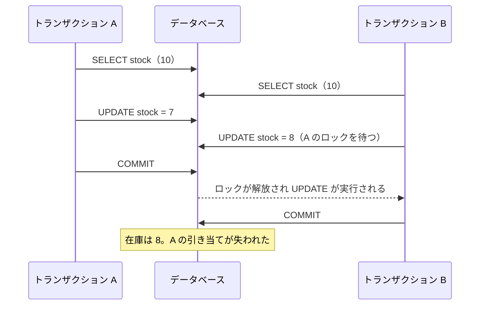
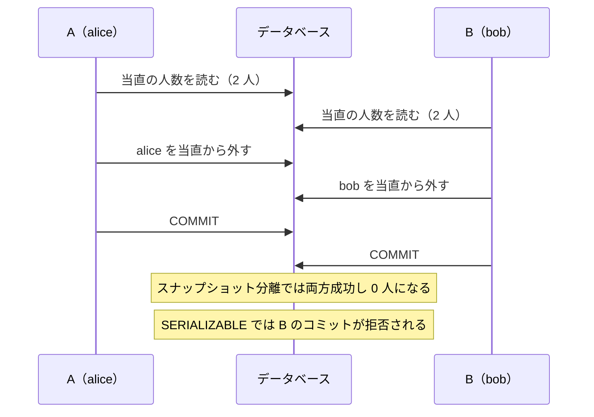

# 6.3 トランザクションと同時実行制御

> 在庫が残り 1 個の商品に、2 人が同時に「購入」を押したら何が起きるでしょうか。当直の医師 2 人が、同時に「もう 1 人いるから」と当直を外れたら？ 「トランザクションで囲んだから安全」は、多くの場合まちがいです。この章では、データベースが同時実行について何を保証し、何を保証しないのかを正確に理解し、アプリケーションで正しく扱う定石を身につけます。

| 項目 | 内容 |
|---|---|
| 学習時間の目安 | 本文 4h ＋ 演習 6h |
| 前提となる章 | [6.1 リレーショナルモデルとSQL](../01-relational-model-and-sql/README.md)、[6.2 インデックスとクエリ処理](../02-indexes-and-query-processing/README.md)、[4.4 並行処理と同期](../../04-operating-systems/04-concurrency/README.md)（ロック・デッドロック） |
| 演習 | [exercises/](exercises/)（Python・SQLite） |
| キーワード | ACID, 分離レベル, ダーティリード, ロストアップデート, 書き込みスキュー, スナップショット分離, MVCC, 2 相ロック, デッドロック, SSI, 楽観的ロック, 冪等性 |

## この章のゴール

- [ ] ACID の各性質を正確に説明し、「一貫性」がアプリケーションの不変条件であることを説明できる
- [ ] ダーティリード・反復不能読み取り・ファントム・ロストアップデート・読み取りスキュー・書き込みスキューを、具体的な時系列で説明できる
- [ ] SQL 標準の分離レベルの定義と、PostgreSQL・MySQL などの実際の挙動の違いを説明できる
- [ ] 2 相ロック（2PL）・デッドロック検出・MVCC・SSI の仕組みを説明し、MVCC とロックマネージャを実装できる
- [ ] 条件付き UPDATE・悲観的ロック・楽観的ロック・一意制約・冪等性キー・再試行を、場面に応じて使い分けられる
- [ ] 長いトランザクションが引き起こす問題を説明し、運用で防げる

## なぜ学ぶのか

同時実行のバグは、テストでほとんど見つかりません。1 人で操作している限り正しく動き、アクセスが集中した瞬間にだけ、在庫のマイナス、残高の不整合、二重の予約として表面化します。再現が難しく、原因の特定に時間がかかり、しかも金銭の損失に直結します。

- **攻撃に使われる**: Warszawski と Bailis の論文 "ACIDRain"（SIGMOD 2017）は、広く使われている e コマースのアプリケーションを分析し、多数の同時リクエストを送ることで、在庫の制限やクーポンの利用回数の制限をすり抜けられる欠陥を数多く報告しました。2014 年には、ビットコイン取引所の Flexcoin が、利用者間の送金処理に対して大量の同時リクエストを送られ、残高が更新される前に何度も送金される形で資産を失い、閉鎖を発表しています（Flexcoin の発表による）。
- **既定の設定は「完全に安全」ではない**: PostgreSQL の既定の分離レベルは READ COMMITTED で、この章で実際に確かめるように、素朴な「読んでから書く」処理では更新が失われます。多くの開発者は、この事実を知らないまま本番のコードを書いています。
- **同じ名前が違う意味を持つ**: 「REPEATABLE READ」や「SERIALIZABLE」という分離レベルの名前は、DBMS ごとに実際の保証が異なります。Oracle Database の SERIALIZABLE は書き込みスキューを防ぎません。名前だけを信じて移行すると、正しかったはずのコードが壊れます。
- **運用の事故につながる**: 閉じ忘れた長いトランザクションは、ロックを持ち続けて他の処理を止め、PostgreSQL では不要になった行の回収（VACUUM）を妨げてテーブルを肥大化させます。

## 1. トランザクションと ACID

### 1.1 ACID

**トランザクション（transaction）** は、複数の操作を 1 つの単位として扱う仕組みです。その保証は 4 つの性質の頭文字で **ACID** と呼ばれます。

| 性質 | 意味 | 誰が守るか |
|---|---|---|
| 原子性（Atomicity） | すべての操作が反映されるか、1 つも反映されないかのどちらか。途中で失敗したら全部を取り消す（ロールバック） | DBMS（ログによる取り消し。[6.4](../04-storage-and-recovery/README.md)） |
| 一貫性（Consistency） | トランザクションの前後で、データが業務上の不変条件（在庫は負にならない、借方と貸方が一致する）を満たす | **主にアプリケーション**。DB は制約（[6.1](../01-relational-model-and-sql/README.md)）で一部を手伝う |
| 分離性（Isolation） | 同時に実行されるトランザクションが、互いに干渉しない（ように見える）。どの程度干渉を許すかが「分離レベル」 | DBMS（ロック・MVCC） |
| 永続性（Durability） | コミットしたデータは、クラッシュしても失われない | DBMS（WAL と fsync。[6.4](../04-storage-and-recovery/README.md)） |

注意したいのは **一貫性（C）** です。A・I・D は DBMS が提供する仕組みですが、「何が正しい状態か」を知っているのはアプリケーションだけです。DBMS は、アプリケーションが正しいトランザクションを書き、それを原子的・分離的・永続的に実行してくれるだけです。Martin Kleppmann が『データ指向アプリケーションデザイン』で指摘するように、C は ACID の中で性質が異なり、本来はアプリケーションの性質です。

### 1.2 トランザクションの境界

多くの DB ドライバや ORM は、既定で **自動コミット（autocommit）** モードで動きます。1 つの SQL 文がそれだけで 1 つのトランザクションになるので、「在庫を減らす」と「注文を作る」を別々の文で実行すると、その間でクラッシュしたら片方だけが残ります。複数の文を 1 つの単位にしたいときは、明示的に `BEGIN` ～ `COMMIT` で囲むか、フレームワークのトランザクションの仕組み（Django の `transaction.atomic`、Spring の `@Transactional` など）を使います。

トランザクションの中には、**DB 以外の処理（外部 API の呼び出し、メールの送信、ファイルの書き込み）を入れない** のが原則です。外部 API の応答が遅いと、その間ずっとロックやスナップショットを持ち続けることになり（5.5 節）、しかもロールバックしても外部の処理は取り消せません。

## 2. 同時実行で起きる異常

複数のトランザクションが同時に実行されると、次のような **異常（anomaly）** が起こりえます。T1・T2 は同時に実行されている 2 つのトランザクションです。

| 異常 | 何が起きるか | 例 |
|---|---|---|
| ダーティライト（dirty write） | T1 のコミット前の書き込みを、T2 が上書きする | 2 人の購入で、注文と請求書の宛先が食い違う |
| ダーティリード（dirty read） | T2 が、T1 のコミット前の（後で取り消されるかもしれない）値を読む | 取り消された入金を前提に出金を許可する |
| 反復不能読み取り（non-repeatable read） | T1 が同じ行を 2 回読むと、間に T2 がコミットした変更のせいで値が違う | 画面の上部と下部で残高の表示が違う |
| ファントム（phantom） | T1 が同じ条件で 2 回検索すると、間に T2 が追加・削除した行のせいで結果の行が増減する | 集計の件数と明細の件数が合わない |
| ロストアップデート（lost update） | T1 と T2 が同じ値を読んで、それぞれ計算して書き戻し、先の更新が消える | 在庫 10 から 2 人が 3 個と 2 個を引き当てたのに、在庫が 5 ではなく 7 になる |
| 読み取りスキュー（read skew） | T1 が関連する複数の値を、異なる時点の状態で読む | 口座 A から B への振込の途中を読み、合計残高が減って見える |
| 書き込みスキュー（write skew） | T1 と T2 が同じ前提を読み、**別々の行** を更新した結果、組み合わせると前提が崩れる | 当直の医師が 2 人とも外れて 0 人になる |

最後の 2 つは、1995 年に Berenson らが論文 "A Critique of ANSI SQL Isolation Levels" で、SQL 標準の定義では捉えられない異常として整理したものです。

### 2.1 ロストアップデートを実際に起こす

PostgreSQL 16 の既定の分離レベル（READ COMMITTED）で、2 つのセッション A と B から在庫を引き当ててみます（在庫の初期値は 10。以下のやりとりは実際に 2 つのセッションを操作した記録です）。

```text
[A] BEGIN;
[B] BEGIN;
[A] SELECT stock FROM products WHERE id = 1;          → 10
[B] SELECT stock FROM products WHERE id = 1;          → 10
[A] UPDATE products SET stock = 7 WHERE id = 1;       -- 10 - 3（アプリが計算した値）
[B] UPDATE products SET stock = 8 WHERE id = 1;       -- 10 - 2
      （待機中…）                                      ← A が行をロックしているので待つ
[A] COMMIT;
[B] （待機が解けて UPDATE が実行される）
[B] COMMIT;
[A] SELECT stock FROM products WHERE id = 1;          → 8
```

2 人で合計 5 個を引き当てたのに、在庫は 8 です。B は A のロックの解放を待ちましたが、その後、自分が読んだ古い値（10）から計算した 8 をそのまま書き込みました。**ロックはダーティライトを防いでも、「読んで、アプリで計算して、書く」処理のロストアップデートは防ぎません**。



この問題への対処法（条件付き UPDATE、SELECT ... FOR UPDATE、楽観的ロック、より強い分離レベル）は、7 節で比較します。

## 3. 分離レベル

### 3.1 SQL 標準の定義

SQL 標準は、4 つの **分離レベル（isolation level）** を、どの異常を許すかで定義しています。

| 分離レベル | ダーティリード | 反復不能読み取り | ファントム |
|---|---|---|---|
| READ UNCOMMITTED | 起こりうる | 起こりうる | 起こりうる |
| READ COMMITTED | 起きない | 起こりうる | 起こりうる |
| REPEATABLE READ | 起きない | 起きない | 起こりうる |
| SERIALIZABLE | 起きない | 起きない | 起きない |

SERIALIZABLE（直列化可能）は、本来「同時に実行した結果が、トランザクションを **何らかの順序で 1 つずつ実行した結果と同じ** になる」ことを意味します。これが最も強い保証で、これさえ守られれば、アプリケーションは同時実行を意識せずに済みます。

ところが、この表には大きな問題があります。Berenson らが指摘したように、異常の定義があいまいで、ロストアップデートや書き込みスキューが表に現れません。そして後述する **スナップショット分離** は、この表の REPEATABLE READ の条件を満たしながら、書き込みスキューを許します。そのため、各 DBMS は同じ名前の分離レベルに、異なる実装を割り当てています。

### 3.2 実際の DBMS の挙動

主要な DBMS の既定と、各レベルの実装は次のとおりです（2026 年時点の主要バージョン。細部はバージョンで変わるので、各製品のドキュメントで確認してください）。

| DBMS | 既定のレベル | 実装の要点 |
|---|---|---|
| PostgreSQL | READ COMMITTED | READ COMMITTED は文ごとのスナップショット。REPEATABLE READ は **スナップショット分離**（ファントムも起きないが、書き込みスキューは起こりうる）。SERIALIZABLE は **SSI**（6 節）。READ UNCOMMITTED を指定しても READ COMMITTED として動く |
| MySQL（InnoDB） | REPEATABLE READ | 通常の SELECT はトランザクションの最初の読み取り時点のスナップショットを読む。一方、UPDATE・DELETE・`SELECT ... FOR UPDATE` などのロックを伴う読み取りは **最新のコミット済みの値** を読み、ネクストキーロック（行とその前の隙間のロック）でファントムを防ぐ。このため「普通の SELECT で読んでから UPDATE で書く」処理では、ロストアップデートが起こりうる |
| Oracle Database | READ COMMITTED | SERIALIZABLE は実際にはスナップショット分離で、書き込みスキューを防がない |
| SQL Server | READ COMMITTED | 既定ではロックで実装。READ_COMMITTED_SNAPSHOT オプションで MVCC による読み取りに切り替えられる。スナップショット分離の SNAPSHOT レベルもある |
| SQLite | （実質 SERIALIZABLE） | 同時に書き込めるのは 1 つの接続だけ。WAL モードでは、読み取りはスナップショットを読みながら書き込みと並行できる |

同じ「REPEATABLE READ」でも、PostgreSQL と MySQL では防げる異常が異なります。各 DBMS の実際の挙動を体系的にテストしたものとして、Martin Kleppmann の Hermitage プロジェクトが参考になります。**自分が使う DBMS とバージョンで、どの異常が起こりうるかを確かめる** ことが、同時実行の設計の出発点です。

### 3.3 PostgreSQL で違いを確かめる

**反復不能読み取り**: READ COMMITTED では、同じトランザクションの中でも文ごとに新しいスナップショットを取るので、他のトランザクションのコミットが途中で見えます。

```text
-- READ COMMITTED                                   -- REPEATABLE READ
[A] BEGIN;                                          [A] BEGIN ISOLATION LEVEL REPEATABLE READ;
[A] SELECT stock FROM products WHERE id = 1; → 10   [A] SELECT stock FROM products WHERE id = 1; → 10
[B] UPDATE products SET stock = 4 WHERE id = 1;     [B] UPDATE products SET stock = 4 WHERE id = 1;
[A] SELECT stock FROM products WHERE id = 1; → 4    [A] SELECT stock FROM products WHERE id = 1; → 10
```

**ロストアップデートの検出**: REPEATABLE READ で 2.1 と同じ操作をすると、B の UPDATE は A のコミットを待った後、エラーになります。

```text
[A] BEGIN ISOLATION LEVEL REPEATABLE READ;
[B] BEGIN ISOLATION LEVEL REPEATABLE READ;
[A] SELECT stock FROM products WHERE id = 1;       → 10
[B] SELECT stock FROM products WHERE id = 1;       → 10
[A] UPDATE products SET stock = 7 WHERE id = 1;
[B] UPDATE products SET stock = 8 WHERE id = 1;
      （待機中…）
[A] COMMIT;
[B] ERROR:  could not serialize access due to concurrent update
```

B のスナップショットより後に、A が同じ行を更新してコミットしたため、B の更新は「古いスナップショットに基づく更新」として拒否されました。B はトランザクションを最初からやり直す（再試行する）必要があります。

**書き込みスキュー**: 当直の医師は常に 1 人以上必要だとします。A（alice）と B（bob）が、同時に「当直が 2 人いるなら自分は外れる」処理を実行します。

```text
[A] BEGIN ISOLATION LEVEL REPEATABLE READ;
[B] BEGIN ISOLATION LEVEL REPEATABLE READ;
[A] SELECT count(*) FROM doctors WHERE on_call;                → 2
[B] SELECT count(*) FROM doctors WHERE on_call;                → 2
[A] UPDATE doctors SET on_call = false WHERE name = 'alice';
[B] UPDATE doctors SET on_call = false WHERE name = 'bob';
[A] COMMIT;
[B] COMMIT;
    SELECT name, on_call FROM doctors;                         → alice | f、bob | f
```

2 人とも外れ、当直が 0 人になりました。2 つのトランザクションは **別々の行** を更新しているので、書き込みの衝突として検出されません。同じ操作を SERIALIZABLE で行うと、2 つ目のコミットが拒否されます。

```text
[A] BEGIN ISOLATION LEVEL SERIALIZABLE;
[B] BEGIN ISOLATION LEVEL SERIALIZABLE;
    （同じ操作）
[A] COMMIT;
[B] COMMIT;
ERROR:  could not serialize access due to read/write dependencies among transactions
DETAIL:  Reason code: Canceled on identification as a pivot, during commit attempt.
HINT:  The transaction might succeed if retried.
```



書き込みスキューは、「前提を読む → 前提が成り立つなら書く」という形の処理なら、どこでも起こりえます。会議室の二重予約（同じ時間帯の予約がないことを確かめてから予約する）、ユーザー名の重複（存在しないことを確かめてから登録する）、残高の合計が負にならないことを確かめてからの出金などです。

## 4. 実装 1: ロックによる制御

### 4.1 共有ロックと排他ロック

ロックによる方式では、データを読む前に **共有ロック（S ロック、shared lock）**、書く前に **排他ロック（X ロック、exclusive lock）** を取ります。

|  | S を要求 | X を要求 |
|---|---|---|
| S を保持 | 両立（同時に読める） | 待つ |
| X を保持 | 待つ | 待つ |

### 4.2 2 相ロック（2PL）

ロックを取ってすぐ放すだけでは、直列化可能性は保証されません。**2 相ロック（two-phase locking, 2PL）** は、各トランザクションが「ロックを取るだけの段階（成長相）」と「ロックを放すだけの段階（縮退相）」の 2 つに分かれる、つまり **一度でもロックを放したら、それ以降は新しいロックを取らない** という規則です。すべてのトランザクションがこの規則に従えば、実行結果は直列化可能になります（衝突直列化可能性）。

実用上は、すべての X ロックをコミットまで保持する **厳格な 2PL（strict 2PL）** が使われます。コミット前に X ロックを放すと、他のトランザクションがコミット前の値を読んでしまい、元のトランザクションがロールバックしたときに連鎖的なロールバックが必要になるからです。

ファントムを防ぐには、存在する行だけでなく「条件に合う範囲」をロックする必要があります。MySQL（InnoDB）の **ネクストキーロック**（インデックスの行のロックと、その直前の隙間のロック（ギャップロック）の組み合わせ）は、範囲に新しい行が挿入されるのを防ぎます。インデックスのない列の条件で範囲をロックすると、広い範囲（最悪はテーブル全体）がロックされることになるので、ここでもインデックスの設計が効いてきます。

2PL は正しいですが、読み取りと書き込みが互いを待たせるので、同時実行性が低くなります。読み取りの多い Web アプリケーションで、MVCC（5 節）が主流になった理由です。

### 4.3 デッドロック

ロックを使うと、**デッドロック** が起こりえます。T1 が行 1 をロックして行 2 を待ち、T2 が行 2 をロックして行 1 を待つと、どちらも永遠に進めません（[4.4](../../04-operating-systems/04-concurrency/README.md) のデッドロックと同じ構造です）。

DBMS は **待ちグラフ（wait-for graph）**（トランザクションを頂点とし、「T1 は T2 のロックの解放を待っている」を辺 T1 → T2 とするグラフ）に閉路があるかを調べてデッドロックを検出し、閉路の中の 1 つのトランザクションを **犠牲（victim）** として中断します。PostgreSQL で実際に起こしてみます。

```text
[A] BEGIN;
[B] BEGIN;
[A] UPDATE products SET stock = stock - 1 WHERE id = 1;
[B] UPDATE products SET stock = stock - 1 WHERE id = 2;
[A] UPDATE products SET stock = stock - 1 WHERE id = 2;     （B のロックを待つ）
[B] UPDATE products SET stock = stock - 1 WHERE id = 1;
ERROR:  deadlock detected
DETAIL:  Process 5617 waits for ShareLock on transaction 862; blocked by process 5618.
Process 5618 waits for ShareLock on transaction 863; blocked by process 5617.
HINT:  See server log for query details.
[A] （B が中断されたので、待ちが解けて UPDATE が実行される）
```

検出のタイミングは製品によって異なります。PostgreSQL は、ロックを `deadlock_timeout`（既定 1 秒）待ってから検出を行い、InnoDB は既定でロックを待つ時点ですぐに検出します。どちらを犠牲にするかの基準も製品ごとに異なり、例えば InnoDB は変更した行の少ない（ロールバックの安い）トランザクションを選ぶとされています。演習 2 では、最も若い（後から始まった）トランザクションを犠牲にする単純な規則で実装します。

デッドロックは、DB の故障ではなく **起こりうる正常な事象** です。アプリケーション側では次の対策をとります。

- **ロックを取る順序を揃える**: 複数の行を更新するときは、主キーの昇順など決まった順で更新する（演習 3 の `place_order` は商品 ID の順に更新する）。
- **トランザクションを短くする**: ロックを持つ時間が短いほど、衝突の確率は下がる。
- **デッドロックのエラーで再試行する**: 犠牲になったトランザクションは最初からやり直せばよい（7.5 節）。

検出の代わりに、トランザクションの開始時刻でどちらが待つかを決めてデッドロックを予防する方式（wait-die、wound-wait）や、一定時間待ったら諦めるロックタイムアウト（MySQL の `innodb_lock_wait_timeout`、PostgreSQL の `lock_timeout`）もあります。

## 5. 実装 2: MVCC

### 5.1 多版型同時実行制御の考え方

**MVCC（Multi-Version Concurrency Control、多版型同時実行制御）** では、行を更新するときに上書きせず、**新しいバージョン（版）を作ります**。各トランザクションは、開始時（または文の開始時）の **スナップショット** に含まれるバージョンだけを読みます。

```text
キー x のバージョン（コミットした時刻の順）
  [x = 10, commit_ts = 3]  [x = 7, commit_ts = 5]  [x = 5, commit_ts = 8]

  スナップショット時刻 4 のトランザクション → x = 10 が見える
  スナップショット時刻 6 のトランザクション → x = 7 が見える
  スナップショット時刻 9 のトランザクション → x = 5 が見える
```

- **読み取りは書き込みを待たせず、書き込みは読み取りを待たせない**。読み取りは古いバージョンを読めばよいからです。これが、読み取りの多いワークロードで MVCC が 2PL より有利な理由です。
- 書き込みどうしの衝突は依然として扱う必要がある。PostgreSQL と InnoDB は、書き込むときに行ロックを取るので、同じ行への同時の書き込みは待ちになる（3.3 節の例）。
- スナップショットを読むので、ダーティリード・反復不能読み取り・（多くの実装で）ファントムが起きない。この性質を **スナップショット分離（snapshot isolation, SI）** と呼ぶ。

### 5.2 スナップショット分離の衝突規則

スナップショット分離では、2 つの並行したトランザクションが同じ行を更新したとき、一方しかコミットできません。後からコミットしようとした方を中断する規則を **first-committer-wins**、後から更新しようとした方を（先の方がコミットした時点で）中断する規則を **first-updater-wins** と呼びます。PostgreSQL の REPEATABLE READ は後者で、3.3 節の「could not serialize access due to concurrent update」がそれです。どちらの規則でも **ロストアップデートは防げますが、書き込みスキューは防げません**（別々の行への書き込みは衝突しないから）。演習 1 では、first-committer-wins の MVCC を実装し、この 2 つを確かめます。

### 5.3 実装の違い

| | PostgreSQL | MySQL（InnoDB） | Oracle Database |
|---|---|---|---|
| 新しいバージョンの置き場所 | テーブル（ヒープ）の中に新しい行として追加。古い行は「不要（dead）」になる | 行はその場で更新し、古い値を **undo ログ** に保存。古いバージョンは undo ログから組み立てる | 行はその場で更新し、古い値を undo 表領域に保存 |
| 可視性の判定 | 各行が作成・削除したトランザクションの ID（xmin・xmax）を持ち、スナップショットと比べる | トランザクションの開始時に作る read view と、行の最終更新トランザクションの ID を比べる | システム変更番号（SCN）で判定 |
| 古いバージョンの回収 | **VACUUM**（autovacuum が自動実行） | **purge** スレッドが undo ログを回収 | undo の保持期間を過ぎたら上書き |
| 回収が追いつかないと | テーブルとインデックスが肥大化（bloat）する | undo ログが増え続ける（history list length の増大） | 古いスナップショットの読み取りが「ORA-01555: snapshot too old」で失敗する |

### 5.4 VACUUM とトランザクション ID の周回

PostgreSQL では、更新や削除のたびに不要な行（dead tuple）がテーブルに残ります。**VACUUM** は、どのスナップショットからも見えなくなった行の領域を再利用可能にし、可視性マップ（[6.2](../02-indexes-and-query-processing/README.md) のインデックスオンリースキャンで使う）を更新します。通常は autovacuum が自動で実行します。

もう 1 つ重要なのが、**トランザクション ID の周回（wraparound）** 対策です。PostgreSQL のトランザクション ID は 32 ビットで、約 40 億で一周します。古い行を「十分昔のもの」として扱うために、VACUUM は古い行を凍結（freeze）します。凍結が追いつかずに周回の危険が迫ると、PostgreSQL はデータの破損を防ぐために、新しいトランザクションの実行を拒否します。Sentry（2015 年）など、この状態になって書き込みが止まった障害を公開している企業があります。**autovacuum を止めたり、極端に長いトランザクションを放置したりすることは、PostgreSQL の運用で最も危険な行為の 1 つ** です。

### 5.5 長いトランザクションの害

長時間実行中のトランザクションは、次のような問題を同時に引き起こします。

1. **古いバージョンを回収できなくなる**: 最も古いスナップショットが必要とするバージョンは消せないので、VACUUM や purge が追いつかず、テーブルが肥大化し、読み込むページが増えて全体が遅くなる（演習 1 の `vacuum` のテストで確かめられる）。
2. **ロックを持ち続ける**: 更新した行のロックは、コミットまで他の更新を待たせる。
3. **レプリケーションへの影響**: レプリカで実行中の長い問い合わせが、プライマリからの変更の適用と衝突することがある（[7.2](../../07-distributed-systems/02-replication-and-consistency/README.md)）。

典型的な原因は、トランザクションの中での外部 API の呼び出し、利用者の操作待ち、例外で COMMIT も ROLLBACK もされずに残った接続（PostgreSQL の `idle in transaction` 状態）、巨大なバッチ処理です。対策として、PostgreSQL では `idle_in_transaction_session_timeout`（9.6 以降）、`statement_timeout`、`lock_timeout` を設定し、実行中のトランザクションの経過時間（`pg_stat_activity`）を監視します。バッチ処理は、数千行ずつコミットする小さなトランザクションに分割します。

## 6. 直列化可能性と SSI

### 6.1 なぜスナップショット分離では足りないのか

書き込みスキューは、「T1 が読んだものを T2 が書き、T2 が読んだものを T1 が書く」という依存関係の **循環** から生まれます。T1 のスナップショットには T2 の書き込みが見えていない（T1 は T2 より前に実行されたことになる）のに、T2 のスナップショットにも T1 の書き込みが見えていない（T2 は T1 より前に実行されたことになる）ので、どちらの順序で 1 つずつ実行した結果とも一致しません。

### 6.2 SSI（Serializable Snapshot Isolation）

**SSI** は、スナップショット分離の利点（読み取りが待たない）を保ちながら、直列化可能性を保証する方式です（Cahill・Röhm・Fekete, SIGMOD 2008）。PostgreSQL は 9.1 から SERIALIZABLE を SSI で実装しています（Ports・Grittner, VLDB 2012）。

- 各トランザクションが **何を読んだか** を記録する（PostgreSQL では SIREAD ロックと呼ばれる、待ちを生まない記録）。
- 「T1 が読んだものを、並行する T2 が書いた」という関係を **rw 依存（読み書きの反依存）** T1 → T2 として追跡する。
- あるトランザクションに **入ってくる rw 依存と出ていく rw 依存の両方がある**（ピボットになっている）とき、直列化できない循環の可能性があるとして、どれかを中断する。3.3 節のエラーの「Canceled on identification as a pivot」は、これを指しています。

SSI は、実際には循環にならない場合にも中断することがあります（偽陽性）。そのため、**SERIALIZABLE を使うアプリケーションは、直列化の失敗（SQLSTATE 40001）で再試行することが前提** です。再試行を正しく実装すれば、アプリケーションは「1 つずつ実行されている」と考えてコードを書けるので、書き込みスキューのような微妙なバグを根本から防げます。演習 1 の発展課題では、この考え方を簡略化して実装します。

## 7. アプリケーションでの定石

2.1 節のロストアップデートを例に、代表的な対策を比べます。

### 7.1 条件付き UPDATE（原子的な更新）

「読んで、アプリで計算して、書く」をやめ、判断と更新を 1 つの SQL 文で行います。

```sql
UPDATE products SET stock = stock - 3 WHERE id = 1 AND stock >= 3;
-- 更新された行数が 1 なら成功、0 なら在庫不足
```

PostgreSQL の READ COMMITTED で 2 つのセッションから同時に実行すると、B は A のコミットを待った後、**更新後の最新の行に対して WHERE の条件を評価し直してから** 更新します。

```text
[A] BEGIN;
[B] BEGIN;
[A] UPDATE products SET stock = stock - 3 WHERE id = 1 AND stock >= 3;
[B] UPDATE products SET stock = stock - 2 WHERE id = 1 AND stock >= 2;
      （待機中…）
[A] COMMIT;
[B] （待機が解けて、stock = 7 の行に対して条件を評価し直し、更新する）
[B] COMMIT;
    SELECT stock FROM products WHERE id = 1;       → 5
```

最もシンプルで速く、在庫・残高・カウンタ・利用回数の上限など、1 行の値に対する操作ならまずこれを選びます（演習 3-1）。

### 7.2 悲観的ロック（SELECT ... FOR UPDATE）

読むときに行ロックを取り、コミットまで他の更新（と他の FOR UPDATE）を待たせます。

```text
[A] BEGIN;
[B] BEGIN;
[A] SELECT stock FROM products WHERE id = 1 FOR UPDATE;      → 10
[B] SELECT stock FROM products WHERE id = 1 FOR UPDATE;
      （待機中…）
[A] UPDATE products SET stock = 7 WHERE id = 1;
[A] COMMIT;
[B] （待機が解けて）                                         → 7（A の更新後の値を読む）
[B] UPDATE products SET stock = 5 WHERE id = 1;
[B] COMMIT;
```

複雑な計算や複数の行をまとめて判断する必要がある場合に向いています。待ちが発生するので、ロックを持つ時間を短く保ちます。`FOR UPDATE NOWAIT`（待たずにエラー）や `FOR UPDATE SKIP LOCKED`（ロックされている行を飛ばす。PostgreSQL 9.5 以降、MySQL 8.0 以降）は、ジョブキューのように「空いている仕事を 1 つ取る」処理で使われます。

### 7.3 楽観的ロック（バージョン列）

ロックを取らずに読み、書くときに「読んだときから変わっていないこと」を確かめます。

```sql
SELECT stock, version FROM products WHERE id = 1;           -- (10, 4)
UPDATE products SET stock = 7, version = version + 1
WHERE id = 1 AND version = 4;                               -- 0 行なら、誰かが先に更新した → 読み直して再試行
```

画面で編集してから保存するような、読みと書きの間が長い（数秒〜数分）処理に向いています。ロックを長く持たずに済むからです。Rails の Active Record（`lock_version` 列）や JPA の `@Version` など、多くの ORM が組み込みで対応しています。注意点は、**同じ行を変更するすべての経路が version を更新する** 必要があることです。1 つでも version を変えない更新があると、検査をすり抜けます（演習 3-2）。

### 7.4 制約で競合を「実体化」する

書き込みスキューは、競合が「別々の行」で起きるために検出されません。そこで、**競合を 1 つの行や制約の上に実体化（materialize）** すると、DB が確実に検出できるようになります。

- **一意制約**: 「同じユーザー名は 1 人だけ」「同じ会議室の同じ時間枠の予約は 1 つだけ」は、`UNIQUE (room_id, slot)` にすれば、同時に 2 つの INSERT が来ても片方は必ず失敗する。事前の SELECT による確認は、書き込みスキューに弱い。
- **排他制約**: PostgreSQL の `EXCLUDE USING gist (room_id WITH =, during WITH &&)` を使うと、「時間帯が重なる予約」のような範囲の重なりも制約として禁止できる。
- **集約値の行をロックする**: 「当直の人数」を別の行として持ち、その行を `FOR UPDATE` でロックしてから判断する。

### 7.5 冪等性と再試行

ネットワークの向こうのクライアントは、タイムアウトしたリクエストを再送します。**同じリクエストが 2 回届いても、結果が 1 回分になる**（冪等である）ように作るのが原則です。

- **冪等性キー（idempotency key）**: クライアントがリクエストごとに一意なキーを付けて送り、サーバーはそのキーを一意制約の付いた列に記録する。2 回目は一意制約違反で検出できる（演習 3-3 の `request_id`）。キーの記録と業務の更新は、**同じトランザクション** で行う。詳しい設計は [9.4 API設計](../../09-architecture/04-api-design/README.md) で扱う。
- **直列化の失敗とデッドロックは再試行する**: SQLSTATE `40001`（serialization_failure）、PostgreSQL の `40P01`（deadlock_detected）、MySQL のエラー 1213（デッドロック）などは、トランザクションを **最初から** やり直せば成功しうるエラーです。やり直すのは失敗した文ではなくトランザクション全体（読み取りを含む）で、回数の上限と、ランダムな揺らぎ（ジッター）付きの待ち時間を設けます。

| 方式 | 向いている場面 | 弱点 |
|---|---|---|
| 条件付き UPDATE | 1 行の値の増減・上限の判定 | 複数の行にまたがる複雑な条件は書きにくい |
| 悲観的ロック（FOR UPDATE） | 複数の行を読んで判断してから書く。競合が多い | 待ちとデッドロックの可能性。ロックの保持時間に注意 |
| 楽観的ロック（バージョン列） | 読みと書きの間が長い。競合が少ない | 競合が多いと再試行が増える。すべての更新経路が version を更新する必要 |
| SERIALIZABLE | 不変条件が複雑で、個別の対策の漏れが怖い | 直列化の失敗の再試行が必須。性能のオーバーヘッド |
| 一意制約・排他制約 | 重複・二重予約の防止、冪等性 | 表現できる条件に限りがある |

### 7.6 サービスをまたぐトランザクション

ここまでの保証は、1 つのデータベースの中の話です。マイクロサービスごとにデータベースが分かれていると、「在庫サービスで在庫を減らし、決済サービスで課金する」を 1 つの ACID トランザクションにはできません（2 相コミットのような分散トランザクションの方式もありますが、可用性と運用の複雑さの問題から、サービス間では避けられることが多い）。代わりに、各サービスのローカルなトランザクションを順に実行し、失敗したら補償処理で取り消す **サーガ（saga）** や、DB の更新とメッセージの送信を確実に対応させる **トランザクショナルアウトボックス** を使います。詳しくは [7.4 合意と協調](../../07-distributed-systems/04-consensus-and-coordination/README.md) と [7.5 メッセージングとイベント駆動](../../07-distributed-systems/05-messaging-and-events/README.md) で扱います。**トランザクションの境界はサービスの境界の設計そのもの** なので、サービスを分割する前に「どの不変条件を同じ DB の中で守る必要があるか」を考えることが重要です（[9.3](../../09-architecture/03-domain-driven-design/README.md)）。

## よくある落とし穴

1. **「トランザクションで囲めば安全」と思い込む**。既定の READ COMMITTED では、読んでから書く処理のロストアップデートも書き込みスキューも起こる。条件付き UPDATE・ロック・制約・分離レベルのどれで守るかを明示的に決める。
2. **重複や上限を事前の SELECT で確かめてから書く**。同時に来た 2 つのリクエストが、両方とも確認を通過する。一意制約か条件付き UPDATE で、DB に判定させる。
3. **分離レベルの名前だけで判断する**。PostgreSQL と MySQL の REPEATABLE READ、Oracle の SERIALIZABLE は保証が違う。使う DBMS の実際の挙動を確かめる。
4. **SERIALIZABLE にしたのに再試行を実装しない**。直列化の失敗は正常な動作の一部で、再試行しなければ利用者にエラーが見えるだけになる。再試行はトランザクション全体を最初からやり直す。
5. **トランザクションの中で外部 API を呼ぶ・利用者の操作を待つ**。ロックとスナップショットを長時間持ち続け、他の処理を止め、VACUUM を妨げる。外部の処理はトランザクションの外に出し、必要ならアウトボックスを使う。
6. **楽観的ロックを一部の更新経路にだけ実装する**。管理画面やバッチが version を更新しないと、検査が無意味になる。
7. **複数の行を毎回違う順序で更新する**。デッドロックの原因になる。主キーの順など、ロックを取る順序を揃える。
8. **`idle in transaction` の接続や、autovacuum の停止を放置する**。テーブルの肥大化や、最悪の場合はトランザクション ID の周回による書き込みの停止につながる。タイムアウトの設定と監視を行う。

## CTOの視点

1. **設計レビューの定番の質問は「同じ操作が同時に 2 回来たら？」「同じリクエストが 2 回届いたら？」**。在庫・残高・ポイント・クーポン・予約・採番のように、上限や一意性のある操作では、それがどの仕組み（条件付き UPDATE、一意制約、ロック、SERIALIZABLE）で守られているかを説明できることを、レビューの合格条件にしましょう。ACIDRain のように、この種の欠陥は悪用されれば直接の金銭的損失になります。
2. **組織としての標準を決める**。「分離レベルは既定のまま、金額と在庫の操作は必ず条件付き UPDATE か FOR UPDATE で行う」「冪等性キーを必須にする API の範囲」「直列化の失敗とデッドロックの再試行は共通のライブラリで行う」といった規約を明文化すると、チームごとに同じ失敗を繰り返さずに済みます。SERIALIZABLE を標準にする選択肢もありますが、再試行の実装と性能の検証をセットで求めます。
3. **DB の移行・マイクロサービス化の前に、トランザクションの前提を棚卸しする**。MySQL から PostgreSQL へ、あるいは RDB から分散データベースへの移行では、分離レベルの意味が変わり、正しかったコードが静かに壊れることがあります。サービスの分割では、同じ ACID トランザクションで守っていた不変条件が、サーガや結果整合性に変わります。どの不変条件がどう守られるかを、移行計画の成果物に含めます。
4. **長いトランザクションと VACUUM の監視を、運用の必須項目にする**。実行中のトランザクションの最長時間、`idle in transaction` の数、テーブルの肥大化、トランザクション ID の年齢（周回までの残り）を監視し、閾値を超えたら通知します。これを怠ると、ある日突然、データベースが書き込みを受け付けなくなる事態になりえます。
5. **採用・育成では「ロストアップデートを説明できるか」を見る**。「在庫の引き当てをどう実装するか」と聞くと、SELECT してから UPDATE する素朴な実装を答える候補者と、条件付き UPDATE・ロック・分離レベルの違いを説明できる候補者の差は歴然です。バックエンドのシニアエンジニアに必須の知識として、社内の勉強会や設計ガイドラインにも組み込みます。

## 演習

演習コードは [exercises/](exercises/) にあります。各ファイルの docstring に仕様があるので、`raise NotImplementedError(...)` を実装に置き換えてください。解答例は [solutions/](solutions/) にあります。

```bash
python3 tools/check.py 6.3        # リポジトリのルートで実行
python3 tools/check.py -v 6.3     # 詳しい出力
```

| # | 難易度 | 内容 | ファイル / 関数 |
|---|---|---|---|
| 1 | ★★★ | MVCC のキーバリューストア: スナップショット分離（読み取り・書き込みバッファ・first-committer-wins）と VACUUM。ロストアップデートは防げるが書き込みスキューは起きることをテストで確かめる。発展: 簡略化した SSI で書き込みスキューも防ぐ | [mvcc.py](exercises/mvcc.py): `MVCCStore`, `Transaction` |
| 2 | ★★★ | ロックマネージャ: S/X ロック、昇格、FIFO の待ち行列、待ちグラフによるデッドロック検出と犠牲の選択 | [lockmgr.py](exercises/lockmgr.py): `LockManager.acquire`, `release_all`, `wait_for_graph`, `find_cycle` |
| 3 | ★★☆ | SQLite で在庫を引き当てる: 条件付き UPDATE、バージョン列による楽観的並行制御と再試行、全部かゼロかの注文と冪等性（一意制約）。2 つの接続とスレッドで同時実行を再現する | [inventory.py](exercises/inventory.py): `reserve_atomic`, `reserve_optimistic`, `place_order` |
| 4 | ★★☆ | 記述: 同時実行の対策の選択（下記） | — |

演習 1 の発展課題（`MVCCStore(serializable=True)`）を実装しない場合、そのテストはスキップされます。

### 演習 4（記述）: 同時実行の対策を選ぶ

次の 4 つの機能について、何もしないと起こりうる異常を具体的な時系列で示し、対策（条件付き UPDATE・悲観的ロック・楽観的ロック・一意制約・SERIALIZABLE など）を選んで理由を説明してください。DB は PostgreSQL（既定の READ COMMITTED）とします。

1. ポイントの利用: 残高が足りれば、指定したポイントを減らす。
2. 会議室の予約: 同じ会議室の同じ時間帯に予約がなければ予約を作る。
3. 商品情報の編集: 管理画面で商品の説明文を開き、数分かけて編集して保存する。
4. シフト管理: 各時間帯に店員が 2 人以上いる状態を保ったまま、店員が休みを申請できる。

<details>
<summary>解答例</summary>

1. **ポイントの利用**: 残高を読んでからアプリで引き算して書くと、同時の 2 つの利用でロストアップデートが起き、残高以上に使える（ACIDRain の典型）。対策は条件付き UPDATE `UPDATE wallets SET points = points - :p WHERE user_id = :u AND points >= :p` で、更新行数で成否を判定する。利用の履歴行も同じトランザクションで記録し、冪等性キーで二重送信を防ぐ。
2. **会議室の予約**: 「予約がないことを SELECT で確かめてから INSERT」は、2 つのトランザクションが別々の行を INSERT するので書き込みスキュー（ファントム）になり、二重予約が起きる。時間枠が固定なら `UNIQUE (room_id, slot)`、任意の時間帯なら PostgreSQL の排他制約 `EXCLUDE USING gist (room_id WITH =, during WITH &&)` で DB に禁止させる。一意制約違反は「すでに予約済み」として利用者に返す。
3. **商品情報の編集**: 2 人の管理者が同じ商品を開いて編集すると、後から保存した方が先の変更を黙って上書きする（ロストアップデート）。編集に数分かかるので、その間ロックを持つ悲観的ロックは不適切。バージョン列による楽観的ロックで、保存時に `WHERE id = ? AND version = ?` を確かめ、0 行なら「他の人が先に更新しました」と差分を示す。
4. **シフト管理**: 「その時間帯に 3 人以上いれば休みを承認」を 2 人が同時に行うと、書き込みスキューで 1 人になる。対策は (a) SERIALIZABLE で実行し、直列化の失敗なら再試行する、(b) 時間帯ごとの「人数」の行を `SELECT ... FOR UPDATE` でロックしてから判断する（競合を 1 つの行に実体化する）、のいずれか。条件が今後も増えるなら (a) の方が漏れにくい。

採点の観点:

- 1 と 3 がロストアップデート、2 と 4 が書き込みスキュー（または制約で防ぐべき重複）であることを見抜けていれば合格ラインです。
- 3 で悲観的ロックを避ける理由（ロックの保持時間）、2 で「事前の SELECT は同時実行に弱い」ことを説明できていれば、設計レビューをリードできる水準です。
- 再試行・冪等性・利用者へのエラーの見せ方まで踏み込めていれば、なお良いです。

</details>

## 理解度チェック

**Q1. ACID の「一貫性（C）」は、他の 3 つとどう性質が違いますか。**

<details>
<summary>解答</summary>

原子性・分離性・永続性は DBMS が提供する仕組みですが、一貫性は「データが業務上の不変条件を満たしていること」で、何が正しい状態かを知っているのはアプリケーションです。DBMS は、アプリケーションが書いたトランザクションを、原子的・分離的・永続的に実行するだけです。一意制約・外部キー・CHECK 制約で一部の不変条件を DB に守らせることはできますが、「当直の医師が 1 人以上いる」のような条件は、アプリケーションが正しいトランザクションを書かない限り守られません。

</details>

**Q2. ロストアップデートと書き込みスキューの違いを説明し、スナップショット分離がどちらを防げるか答えてください。**

<details>
<summary>解答</summary>

ロストアップデートは、2 つのトランザクションが **同じ行** を読んで、それぞれ計算した値を書き戻し、先の更新が消える異常です。書き込みスキューは、2 つのトランザクションが同じ前提を読み、それぞれ **別々の行** を更新した結果、組み合わせると前提が崩れる異常です。

スナップショット分離は、同じ行への並行した書き込みを衝突として検出する（first-committer-wins / first-updater-wins）ので、ロストアップデートは防げます。しかし書き込みスキューは書き込む行が異なるため衝突にならず、防げません。防ぐには SERIALIZABLE（SSI）、競合の実体化（ロックする行や一意制約）が必要です。

</details>

**Q3. PostgreSQL の READ COMMITTED で、次の 2 つの処理を 2 つのトランザクションが同時に実行すると、在庫（初期値 10）はそれぞれ最終的にいくつになりえますか。(a) `SELECT stock` の後にアプリで計算した値を `UPDATE ... SET stock = 計算値` で書く（3 個と 2 個）。(b) `UPDATE ... SET stock = stock - n WHERE stock >= n`（3 個と 2 個）。**

<details>
<summary>解答</summary>

(a) は 5 のほかに、7 または 8 になりえます。2 つの SELECT がどちらも 10 を読むと、後に書いた方の値（7 か 8）が残り、先の更新が失われます（2.1 節の実験）。(b) は常に 5 です。2 つ目の UPDATE は 1 つ目のコミットを待った後、更新後の最新の行（7）に対して WHERE を評価し直してから `stock - 2` を計算するからです。

</details>

**Q4. 2 相ロック（2PL）の規則を説明し、なぜ「厳格な 2PL」が実用上使われるのか答えてください。**

<details>
<summary>解答</summary>

2PL は、各トランザクションがロックを取るだけの成長相と、放すだけの縮退相に分かれる、つまり一度でもロックを放したら新しいロックを取らない、という規則です。すべてのトランザクションが従えば、実行は直列化可能になります。

ただし、コミット前に X ロックを放すと、他のトランザクションがコミットされていない値を読めてしまい、元のトランザクションがロールバックしたときに、読んだ側も連鎖的にロールバックしなければならなくなります。X ロックをコミット（またはアボート）まで保持する厳格な 2PL なら、この連鎖ロールバックが起きず、回復も単純になるので、実用上はこちらが使われます。

</details>

**Q5. PostgreSQL で、夜間のバッチが 1 つのトランザクションで 6 時間かけて集計を行っています。どんな問題が起こりえますか。**

<details>
<summary>解答</summary>

- その 6 時間の間に更新・削除された行の古いバージョンが、バッチのスナップショットから見える可能性があるため、VACUUM で回収できなくなる。更新の多いテーブルが肥大化し、全体の性能が落ちる。
- バッチが行を更新していれば、そのロックがコミットまで保持され、他の処理が待たされる。
- 極端な場合、凍結が進まずトランザクション ID の周回の危険が高まる。
- レプリカで実行していれば、プライマリからの変更の適用との衝突（問い合わせのキャンセルや、適用の遅延）が起こりうる。

対策は、集計を小さな単位に分けてコミットする、読み取り専用の集計ならレプリカや分析用の基盤（[12.1](../../12-data-and-ai/01-data-engineering/README.md)）で行う、`statement_timeout` や監視で長いトランザクションを検知する、などです。

</details>

**Q6. SERIALIZABLE（SSI）を使うアプリケーションは、何を必ず実装しなければなりませんか。それはなぜですか。**

<details>
<summary>解答</summary>

直列化の失敗（SQLSTATE 40001）が起きたときに、トランザクション全体を最初からやり直す再試行です。SSI は、直列化できない実行の可能性を検出すると、トランザクションを中断します。実際には問題がない場合にも中断することがある（偽陽性）ため、失敗は正常な動作の一部として頻繁に起こりえます。再試行では、失敗した文だけでなく、読み取りも含めてやり直す必要があります（読んだ値が古かったことが失敗の原因なので）。回数の上限と、ジッター付きの待ち時間も設けます。

</details>

**Q7. 同じ注文リクエストが、クライアントの再送によって 2 回届きました。サーバーで二重注文を防ぐ方法を、DB の仕組みを使って説明してください。**

<details>
<summary>解答</summary>

クライアントがリクエストごとに一意な冪等性キー（request_id）を付けて送り、サーバーは注文テーブルの `request_id` 列に一意制約を付けておきます。注文の作成（在庫の引き当てを含む）と、request_id の記録を同じトランザクションで行えば、2 回目のリクエストの INSERT は一意制約違反になるので、それを「処理済み」として 1 回目と同じ結果を返せます。「request_id が存在しないことを SELECT で確かめてから INSERT する」方法は、2 つのリクエストが同時に届くと両方とも確認を通過してしまうので不十分です（演習 3-3 のスレッドを使ったテストで確かめられます）。

</details>

## さらに学ぶために

- Martin Kleppmann "Designing Data-Intensive Applications"（邦訳『データ指向アプリケーションデザイン』オライリー・ジャパン）第 7 章 — 分離レベルと異常、スナップショット分離、SSI を最も分かりやすく解説した章。当直の医師の例もここから。
- Hal Berenson ほか "A Critique of ANSI SQL Isolation Levels"（SIGMOD 1995）— SQL 標準の分離レベルの定義の問題と、スナップショット分離を初めて整理した論文。
- Michael J. Cahill, Uwe Röhm, Alan D. Fekete "Serializable Isolation for Snapshot Databases"（SIGMOD 2008）と、Dan R. K. Ports, Kevin Grittner "Serializable Snapshot Isolation in PostgreSQL"（VLDB 2012）— SSI の原論文と、実際の DBMS への実装の記録。
- PostgreSQL 公式ドキュメント「同時実行制御」の章 — 各分離レベルの正確な挙動、明示的なロック、アプリケーションでの注意点の一次資料。
- Martin Kleppmann の Hermitage プロジェクト（GitHub）— 主要な DBMS の分離レベルが、実際にどの異常を防ぐかをテストした記録。
- Todd Warszawski, Peter Bailis "ACIDRain: Concurrency-Related Attacks on Database-Backed Web Applications"（SIGMOD 2017）— 同時実行の欠陥がセキュリティの問題になることを示した論文。
- Jim Gray, Andreas Reuter "Transaction Processing: Concepts and Techniques"（Morgan Kaufmann, 1993）— ロック・ログ・回復を網羅した古典。辞書のように使える。

## まとめ

- ACID のうち A・I・D は DBMS の仕組みで、C（一貫性）はアプリケーションの不変条件。DB の制約は C の一部を手伝う。
- 同時実行の異常には、ダーティリード・反復不能読み取り・ファントムに加え、ロストアップデート・読み取りスキュー・書き込みスキューがある。SQL 標準の分離レベルの表は後者を捉えきれない。
- 同じ名前の分離レベルでも DBMS ごとに保証が違う。PostgreSQL の REPEATABLE READ はスナップショット分離、SERIALIZABLE は SSI。既定の READ COMMITTED では読んでから書く処理の更新が失われる。
- ロック方式（厳格な 2PL）は直列化可能だが読み書きが互いを待たせ、デッドロックは待ちグラフで検出して犠牲を選ぶ。MVCC は古いバージョンを残して読み取りを待たせない代わりに、VACUUM / purge による回収が必要で、長いトランザクションがそれを妨げる。
- スナップショット分離はロストアップデートを防ぐが書き込みスキューは防げない。SSI は rw 依存のピボットを検出して直列化可能性を保証し、再試行を前提とする。
- アプリケーションの定石は、条件付き UPDATE、FOR UPDATE、バージョン列、一意制約・排他制約による競合の実体化、冪等性キー、トランザクション全体の再試行。外部の処理をトランザクションに入れず、サービスをまたぐ整合性はサーガやアウトボックスで扱う。
