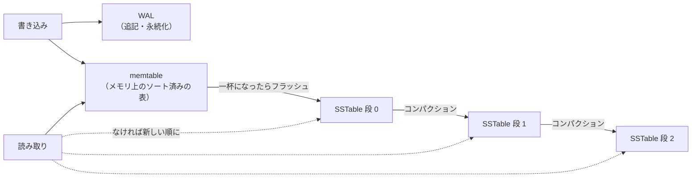
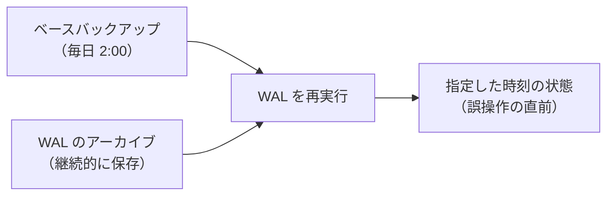

# 6.4 ストレージエンジンと障害回復

> COMMIT が返った直後にサーバーの電源が落ちても、なぜデータは消えないのでしょうか。書き込みが多いサービスで RocksDB や Cassandra が選ばれるのはなぜでしょうか。そして、「毎日バックアップを取っている」はずの会社が、なぜデータを失うのでしょうか。この章では、データベースがデータをディスクに置き、壊れずに守り、壊れたときに元に戻す仕組みを、実装しながら理解します。

| 項目 | 内容 |
|---|---|
| 学習時間の目安 | 本文 4h ＋ 演習 7h |
| 前提となる章 | [6.3 トランザクションと同時実行制御](../03-transactions/README.md)、[4.3 ファイルシステムとI/O](../../04-operating-systems/03-filesystems-and-io/README.md)（ページキャッシュ・fsync）、[1.3 メモリ階層とキャッシュ](../../01-computer-systems/03-memory-hierarchy/README.md) |
| 演習 | [exercises/](exercises/)（Python） |
| キーワード | ページ, バッファプール, B 木系とログ構造系, LSM 木, SSTable, コンパクション, 書き込み増幅, WAL, fsync, グループコミット, ARIES, チェックポイント, レプリケーション, PITR, RPO/RTO |

## この章のゴール

- [ ] ページ・バッファプール・STEAL / NO-FORCE の方針と、それが障害回復に何を要求するかを説明できる
- [ ] B 木系（その場で更新）とログ構造系（追記と併合）のストレージエンジンの違いを、読み取り・書き込み・容量の増幅で比較し、ワークロードに応じて選べる
- [ ] 追記専用ログのキーバリューストアと、小さな LSM 木（WAL・memtable・SSTable・コンパクション）を実装できる
- [ ] WAL の規則・グループコミット・永続性の設定（fsync、synchronous_commit など）のトレードオフを説明できる
- [ ] 分析・再実行・取り消しの 3 段階によるクラッシュ回復を説明し、実装できる
- [ ] WAL を使ったレプリケーション・CDC・PITR の仕組みを説明し、復元の訓練を含むバックアップの方針を立てられる

## なぜ学ぶのか

データベースの「永続性（ACID の D）」は、何もしなくても手に入るものではありません。OS のページキャッシュ、ディスクの書き込みキャッシュ、書きかけのページ、壊れたファイル、そして人間の操作ミス。そのすべてに対して、データベースは何重もの仕組みで備えています。その仕組みを知らないと、設定一つで永続性を失ったり、「バックアップがあるから大丈夫」という思い込みで致命的な損失を出したりします。

- **バックアップは、復元できて初めてバックアップ**: 2017 年 1 月 31 日、GitLab.com で、レプリケーションの遅れを解消する作業中に、担当者が誤って本番のプライマリのデータベースのデータディレクトリを削除しました。復旧しようとしたところ、用意していたはずの複数のバックアップの仕組みが実際には機能していなかったことが判明しました。例えば、定期的な pg_dump は使っているツールとサーバーのバージョンの不一致で失敗しており、その失敗を知らせるメールも届いていませんでした。最終的に、約 6 時間前に別の目的で取られていたスナップショットから復元し、その間のデータベースへの変更は失われました（GitLab が公開したポストモーテムによる）。GitLab は復旧作業を公開し、詳細な原因分析を共有したことで、業界全体の教訓になっています。
- **「コミットした」の意味は設定で変わる**: PostgreSQL の `synchronous_commit` や MySQL の `innodb_flush_log_at_trx_commit` は、性能と引き換えに「クラッシュ時に直近のコミットを失ってもよいか」を決める設定です。この章の計測では、PostgreSQL の同期コミットを無効にすると、1 接続あたりのスループットが約 1.7 倍になりました。その代わりに何を失いうるのかを説明できなければ、この設定を判断することはできません。
- **fsync でさえ単純ではない**: 2018 年には、PostgreSQL コミュニティで「fsync が失敗した後に再試行すると、Linux では書けなかったデータが黙って失われうる」という問題が議論され（いわゆる fsyncgate）、PostgreSQL は fsync の失敗時にサーバーを停止（PANIC）させる挙動に改めました。永続性は、OS やハードウェアとの約束の上に成り立っています。
- **エンジンの選択が性能の上限を決める**: 書き込みの多いワークロードには LSM 木が、読み取りと範囲検索の多いワークロードには B 木が向いています。ワークロードとエンジンの相性を誤ると、ハードウェアを増やしても性能が出ません。

## 1. ディスクの上のデータ

### 1.1 ページの中身

[6.2](../02-indexes-and-query-processing/README.md) で見たように、DBMS はデータを固定長のページ（PostgreSQL は 8KB、InnoDB は 16KB）の単位で読み書きします。可変長の行をページに詰めるために、多くの DBMS は **スロット付きページ（slotted page）** という構造を使います。

```text
┌──────────────────────────────────────────────────────────────┐
│ ページヘッダ（page_lsn・空き領域の位置など）                 │
├──────────────────────────────────────────────────────────────┤
│ 行ポインタ 1 │ 行ポインタ 2 │ 行ポインタ 3 │ →（前から伸びる）    │
├──────────────────────────────────────────────────────────────┤
│                        空き領域                              │
├──────────────────────────────────────────────────────────────┤
│         （後ろから伸びる）← │ 行 3 │ 行 2 │ 行 1               │
└──────────────────────────────────────────────────────────────┘
```

行ポインタ（スロット）は、ページの中の行の位置を指します。行をページの中で移動しても、外部（インデックス）からは「ページ番号とスロット番号」（PostgreSQL の TID）で同じ行を指し続けられます。ページヘッダの **page_lsn** は、そのページに最後に反映したログレコードの番号で、障害回復で重要な役割を果たします（4 節）。

### 1.2 バッファプールと書き出しの方針

ページはメモリ上の **バッファプール** にキャッシュされ、更新はまずバッファプールの中のページに対して行われます。変更されてディスクと内容が異なるページを **ダーティページ（dirty page）** と呼びます。いつダーティページをディスクに書くかについて、2 つの方針の選択があります。

| 方針 | 意味 | 採用した場合に回復で必要になること |
|---|---|---|
| STEAL | コミット前の変更を含むページを、ディスクに書いてよい | クラッシュ後、ディスク上のコミットされていない変更を **取り消す（undo）** 必要がある |
| NO-FORCE | コミットの時点で、変更したページをディスクに書かなくてよい | クラッシュ後、ディスクに書かれていないコミット済みの変更を **再実行する（redo）** 必要がある |

STEAL を禁止すると、長いトランザクションの変更をすべてメモリに抱え込む必要があり、NO-FORCE を禁止すると、コミットのたびにランダムな位置のページを書き出すことになって遅くなります。そのため、ほとんどの DBMS は **STEAL / NO-FORCE** を選び、その代わりにログ（WAL）を使って undo と redo の両方を可能にしています。これが 3 節と 4 節の主題です。

### 1.3 書きかけのページ（torn page）

DB のページ（8KB や 16KB）は、OS やディスクが一度に不可分に書ける単位（4KB やセクタの 512 バイトなど）より大きいことがあります。ページを書き出している途中で電源が落ちると、前半だけ新しく後半が古い「ちぎれた」ページが残りえます。ログにページの一部の変更しか書いていないと、この壊れたページから正しく回復できません。対策として、PostgreSQL は **チェックポイント後にページを初めて変更するときに、ページ全体をログに書き（full page write）**、InnoDB はページを本来の場所に書く前に別の領域へ一度書く **二重書き込みバッファ（doublewrite buffer）** を使います。

## 2. 2 つのストレージエンジンの系統

### 2.1 B 木系: その場で更新する

PostgreSQL・MySQL（InnoDB）・Oracle・SQL Server などの伝統的な RDBMS は、B+ 木（[6.2](../02-indexes-and-query-processing/README.md)）とヒープのページを、**その場で（in-place）更新** します。行を書き換えるときは、その行があるページを読み込み、バッファプールで変更し、いずれディスクの同じ位置に書き戻します。

- 読み取りは、目的のページまで木を下るだけで速く、性能が予測しやすい。
- 書き込みは、ランダムな位置のページの読み込みと書き戻しを伴う。1 行の変更でもページ全体（8KB〜16KB）を書くことになる。

### 2.2 ログ構造系: 追記して、後でまとめる

もう 1 つの系統は、**ディスク上のデータを書き換えず、常に追記する** 方式です。ランダムな書き込みをシーケンシャルな追記に変えるので、書き込みが速くなります。

**Bitcask**（Riak の標準のストレージ。Sheehy・Smith, 2010）は、その最も単純な形です。すべての書き込み（更新と削除も）をデータファイルの末尾に追記し、メモリ上のハッシュ表（keydir）に「キー → ファイル内の位置」を持ちます。読み取りは 1 回のシークで済みますが、すべてのキーがメモリに収まる必要があり、範囲検索はできません。古いレコードが溜まるので、生きているレコードだけを書き直す **コンパクション** が必要です（演習 1）。

**LSM 木（Log-Structured Merge-tree）**（O'Neil ほか, 1996）は、この考え方を範囲検索できる形に発展させたもので、Google の Bigtable（2006 年の論文）や LevelDB を経て、RocksDB・Cassandra・ScyllaDB など多くのシステムで使われています。



1. **書き込み**: まず WAL に追記し（クラッシュ対策）、メモリ上の **memtable**（キーの順に並んだ表）に入れる。
2. **フラッシュ**: memtable が一定の大きさになったら、キーの順に並んだ **不変の** ファイル **SSTable**（Sorted String Table）としてディスクに書き出し、その分の WAL は不要になる。
3. **読み取り**: memtable → 新しい SSTable → 古い SSTable の順に探し、最初に見つかったものが最新の値。削除は **墓標（tombstone）** という特別な値の書き込みで表す（古い SSTable にある値を隠すため）。
4. **コンパクション**: SSTable が増えると読み取りが遅くなるので、複数の SSTable をマージソートして 1 つにまとめ、上書きされた古い値や墓標を捨てる。墓標を捨ててよいのは、それより古い値がどこにも残らないときだけ（一部だけのマージで捨てると、古い値が「生き返る」）。
5. **Bloom フィルタ**（[2.4](../../02-math-and-algorithms/04-basic-data-structures/README.md)）: SSTable ごとに「このキーは確実にない」を判定できる小さなビット列を持ち、存在しないキーのためにファイルを読むのを避ける。

コンパクションの戦略には、似た大きさの SSTable がいくつか溜まったらまとめる **サイズ段階型（size-tiered）** と、各段の合計サイズに上限を設け、段ごとにキーの範囲が重ならないように保つ **レベル型（leveled）** があります。一般に、サイズ段階型は書き込みの増幅が小さい代わりに容量と読み取りの増幅が大きく、レベル型はその逆です（RocksDB の既定はレベル型。各製品の既定と選択肢は変わりうるので、ドキュメントで確認してください）。演習 2 では、サイズ段階型を簡略化したものを実装します。

### 2.3 増幅のトレードオフ

ストレージエンジンの性質は、3 つの **増幅（amplification）** で比べると見通しがよくなります。

| 増幅 | 意味 | B 木系 | LSM 木 |
|---|---|---|---|
| 読み取りの増幅 | 1 回の論理的な読み取りで、何ページ（何ファイル）読むか | 小さい（木の高さ分） | 大きくなりうる（複数の SSTable を探す。Bloom フィルタで緩和） |
| 書き込みの増幅 | 書いたデータ 1 バイトあたり、ディスクに何バイト書くか | ページ単位の書き戻しと WAL で大きくなりうる | コンパクションで同じデータを何度も書き直す |
| 容量の増幅 | 実データに対して、ディスクをどれだけ使うか | ページの空き領域・MVCC の古い版 | コンパクション前の古い値・墓標 |

演習 2 の解答例で計測すると（memtable 100 件、4 つ溜まったら 1 段上へ、2 万件の書き込み）、SSTable に書いたバイト数は最終的なサイズの約 3.9 倍（WAL を含めればさらに 1 倍）で、これが書き込みの増幅です。一方、Bloom フィルタのおかげで、存在しないキーの読み取り 1,000 回では SSTable のブロックを 1 つも読まずに済み、存在するキーの読み取り 1,000 回で読んだブロックは 1,027 個でした。

3 つの増幅をすべて同時に最小にすることはできず、どれかを改善すると他のどれかが悪化する、という考え方は **RUM 予想**（Athanassoulis ほか, EDBT 2016）として知られています。

### 2.4 ワークロードに応じた選択

| ワークロード | 向いている方式 | 理由 |
|---|---|---|
| 一般的な OLTP（読み取りが多い、範囲検索・結合がある） | B 木系（PostgreSQL・MySQL） | 読み取りが速く予測しやすい。成熟した運用ノウハウ |
| 書き込みが非常に多い（ログ・時系列・イベント・メッセージの保存） | LSM 木（RocksDB・Cassandra など） | 追記とシーケンシャルな書き込み。圧縮が効きやすい |
| キーでの点検索だけ、キーがメモリに収まる | Bitcask 型・インメモリ KVS（Redis など） | 1 回のシークか、メモリだけで読める |
| 大量の行の集計（分析） | 列指向ストレージ | 必要な列だけを読み、圧縮が効く（7 節、[6.5](../05-beyond-relational/README.md)） |

LSM 木を使う場合は、コンパクションがバックグラウンドで I/O と CPU を消費し、書き込みの急増に追いつかないと読み取りの遅延が悪化する（書き込みの一時停止が起こることもある）点に注意が必要です。容量の見積もりにも、コンパクション用の空き容量を含めます。

## 3. WAL — 先行書き込みログ

### 3.1 WAL の規則

**WAL（Write-Ahead Logging、先行書き込みログ）** は、データのページを書き換える前に、変更の内容をログ（追記専用のファイル）に書く仕組みです。守るべき規則は 2 つあります。

1. **ページより先にログ**: ダーティページをディスクに書く前に、そのページの変更を記録したログレコードを永続化しておく（そうしないと、STEAL で書かれたコミット前の変更を取り消す情報がない）。
2. **コミットの前にログ**: コミットを完了（アプリケーションに成功を返す）する前に、そのトランザクションのコミットのログレコードまでを永続化しておく（そうしないと、NO-FORCE で書かれていない変更を再実行する情報がない）。

ログは末尾に追記するだけなので、シーケンシャルな書き込みで済みます。ランダムな位置にあるデータのページは、後からまとめて書けばよいのです。PostgreSQL で、口座間の振込（2 行の更新）が WAL に何を書くかを `pg_waldump` で見てみます（PostgreSQL 16。出力は一部を省略しています）。

```text
BEGIN;
UPDATE accounts SET balance = balance - 100 WHERE id = 1;
UPDATE accounts SET balance = balance + 100 WHERE id = 2;
COMMIT;

rmgr: Heap        len (rec/tot): 65/197, tx: 877, lsn: 0/1F26EE30, desc: HOT_UPDATE ... blkref #0: rel 1663/16561/32768 blk 0 FPW
rmgr: Heap        len (rec/tot): 72/ 72, tx: 877, lsn: 0/1F26EEF8, desc: HOT_UPDATE ... blkref #0: rel 1663/16561/32768 blk 0
rmgr: Transaction len (rec/tot): 34/ 34, tx: 877, lsn: 0/1F26EF40, desc: COMMIT 2026-09-29 08:58:36.319568 UTC
```

- 各レコードには **LSN**（Log Sequence Number、ログの中の位置）が付いている。
- 1 つ目の更新は、チェックポイント後にこのページを初めて変更したので、ページ全体の画像（`FPW`、full page write）を含んで 197 バイトになっている（1.3 節の書きかけのページ対策）。2 つ目は同じページなので、変更分だけの 72 バイト。
- `HOT_UPDATE` は、インデックスを更新しない HOT 更新（[6.2](../02-indexes-and-query-processing/README.md)）が使われたことを示す。
- 最後の `COMMIT` レコードが永続化された時点で、このトランザクションはコミットされたことになる。

### 3.2 グループコミット

コミットのたびにログを fsync すると、fsync の遅さがそのままトランザクションの遅さになります。Python で、100 バイトのレコードを 2,000 件追記する時間を、fsync の有無で比べてみます（この環境での一例。ストレージによって大きく変わります）。

```python
import os
import tempfile
import time

record = b"x" * 100
with tempfile.TemporaryDirectory() as d:
    for sync in (False, True):
        path = os.path.join(d, f"log-{sync}")
        with open(path, "ab") as f:
            start = time.perf_counter()
            for _ in range(2000):
                f.write(record)
                f.flush()                      # Python のバッファ → OS
                if sync:
                    os.fsync(f.fileno())       # OS のページキャッシュ → ディスク
            elapsed = time.perf_counter() - start
        print(f"fsync={sync!s:5}: 1 件あたり {elapsed / 2000 * 1e6:7.1f} マイクロ秒")
```

```text
fsync=False: 1 件あたり     1.0 マイクロ秒
fsync=True : 1 件あたり   151.6 マイクロ秒
```

fsync なしの書き込みは OS のページキャッシュに入るだけなので速く、fsync はディスク（この環境は仮想マシンの SSD）への書き込みの完了を待つので 150 倍ほど遅くなっています。HDD ならさらに桁違いに遅くなります。`flush()` だけではプロセスがクラッシュしてもデータは OS に残りますが、OS のクラッシュや電源の喪失には耐えられません（演習 1 の `sync` の引数はこの違いです）。

そこで DBMS は、同時にコミットしようとしている複数のトランザクションのログをまとめて 1 回の fsync で永続化します。これを **グループコミット（group commit）** と呼びます。同時実行数が多いほど 1 回の fsync で多くのコミットを永続化できるので、fsync が遅くても全体のスループットを保てます。

### 3.3 永続性の設定とトレードオフ

多くの DBMS は、永続性の強さを設定で変えられます（2026 年時点の主要バージョン。詳細は各製品のドキュメントで確認してください）。

| 設定 | 既定 | 緩めると | 失いうるもの |
|---|---|---|---|
| PostgreSQL `synchronous_commit` | `on` | `off` にすると、コミットの WAL の永続化を待たずに成功を返す | クラッシュ時に直近のコミット（`wal_writer_delay` の 3 倍程度の時間分）が失われうる。データの不整合は起きない |
| PostgreSQL `fsync` | `on` | `off` にすると、そもそも fsync しない | OS のクラッシュや電源の喪失で、データベース全体が壊れうる。本番で無効にしてはいけない |
| MySQL `innodb_flush_log_at_trx_commit` | `1` | `2` はコミット時に OS へ書き、fsync は約 1 秒ごと。`0` は書き込みも約 1 秒ごと | `2` は OS のクラッシュや電源の喪失で、`0` は mysqld のクラッシュでも、最大約 1 秒分のコミットが失われうる |
| MySQL `sync_binlog` | `1` | 0 や大きな値にすると、バイナリログの fsync を OS に任せる | レプリケーションやバックアップの復元に使うバイナリログから、直近の変更が失われうる |
| Redis `appendfsync`（AOF 有効時） | `everysec` | `no` は OS に任せる。`always` は毎回 fsync | `everysec` は最大約 1 秒分、`no` はそれ以上 |

PostgreSQL の `synchronous_commit` の効果を、pgbench（1 接続、更新中心の組み込みシナリオ）で測ると次のとおりでした（この環境での一例）。

| synchronous_commit | 平均レイテンシ | TPS |
|---|---|---|
| on | 約 0.49 ミリ秒 | 約 2,040 |
| off | 約 0.28 ミリ秒 | 約 3,500 |

`synchronous_commit = off` は、「データベースが壊れる」のではなく「直近のわずかなコミットを失いうる」設定なので、アクセスログやセッション情報のように失っても再生成できるデータには合理的な選択です。PostgreSQL ではこれをトランザクション単位で設定できるので、決済は `on`、行動ログは `off` のように使い分けられます。**永続性は技術の設定ではなく、「何を失ってよいか」という事業の判断** です。

もう 1 つ注意すべきは、fsync が「本当にディスクに書いた」ことを意味するとは限らない点です。揮発性の書き込みキャッシュを持つストレージが、キャッシュに入れた時点で完了を返すと、電源の喪失でデータが失われます。サーバー用のストレージの電源喪失保護（power loss protection）の有無や、クラウドのブロックストレージの永続性の仕様を確認します。

## 4. 障害回復

### 4.1 分析・再実行・取り消し

クラッシュ後の回復は、IBM の **ARIES**（Mohan ほか, ACM TODS 1992）が確立した 3 段階で考えるのが標準です。多くの DBMS の回復は、この考え方を基礎にしています（演習 3 で実装します）。

1. **分析（analysis）**: ログを読み、クラッシュの時点で実行中だったトランザクション（コミットしていない **敗者**、loser）と、再実行を始める位置を求める。
2. **再実行（redo）**: 再実行の開始位置から、ログのすべての変更を順に適用し直す。コミットしたかどうかに関係なく、クラッシュ直前の状態をそのまま再現する（**歴史の再現**、repeating history）。ページの **page_lsn** がレコードの LSN 以上なら、その変更はすでにディスクのページに反映されているので飛ばす（これで再実行は何度行っても同じ結果になる）。
3. **取り消し（undo）**: 敗者の変更を、新しいものから順に取り消す。取り消すたびに **CLR（補償ログレコード）** をログに書く。回復の途中でまたクラッシュしても、CLR を見れば「どこまで取り消したか」が分かるので、同じ変更を 2 回取り消すことはない。

```text
LSN  レコード                    ディスク上のページ（クラッシュ時）
 1   T1: P1 を None → 10         P1 = 11（page_lsn 4）  ← T2 のコミット前の変更を含む（STEAL）
 2   T2: P2 を None → 20         P2 = （未書き込み）
 3   T1: COMMIT                  P3 = （未書き込み）
 4   T2: P1 を 10 → 11
 5   T3: P3 を None → 30
 6   T3: COMMIT
     ── クラッシュ ──
分析:   勝者 T1・T3、敗者 T2
再実行: LSN 1 と 4 は P1 に反映済み（page_lsn 4）なので飛ばし、LSN 2・5 を適用
取り消し: T2 の LSN 4（P1 を 10 に戻す CLR 7）、LSN 2（P2 を None に戻す CLR 8）、T2 の END 9
結果:   P1 = 10、P2 = None、P3 = 30（コミットした T1・T3 の変更だけが残る）
```

### 4.2 チェックポイント

ログを先頭から再実行していては、回復に何時間もかかってしまいます。**チェックポイント** は、「この時点より前の変更は、（ほぼ）ディスクに反映済み」という区切りをログに記録する仕組みです。実用の DBMS は、処理を止めずに行う **ファジーチェックポイント** を使い、その時点の実行中のトランザクションと、ダーティページとそれを最初に汚した LSN（recLSN）を記録します。再実行は、チェックポイントに記録された recLSN の最小値から始めれば足ります。

チェックポイントの頻度はトレードオフです。頻繁にすると回復は速くなりますが、ダーティページの書き出しと、チェックポイント後の最初の変更で書くページ全体の画像（1.3 節）が増えます。PostgreSQL では `checkpoint_timeout`（既定 5 分）と `max_wal_size`（既定 1GB）が主な設定です。**回復時間の目標（RTO）は、チェックポイントの間隔と、その間に溜まる WAL の量で決まる** ことを覚えておきましょう。

### 4.3 PostgreSQL のクラッシュ回復を観察する

PostgreSQL で、コミットしていないトランザクション（id = 1 の INSERT）と、コミットしたトランザクション（id = 2 の INSERT）がある状態で、サーバーを即時停止（`pg_ctl stop -m immediate`。チェックポイントを取らずに落とす、クラッシュ相当の停止）させて再起動しました（サーバーのログは時刻などの接頭辞と一部の行を省略しています）。

```text
[A] BEGIN;
[A] INSERT INTO events_log VALUES (1, 'コミット前');
[B] INSERT INTO events_log VALUES (2, 'コミット済み');     -- 自動コミット
--- pg_ctl stop -m immediate → 再起動

LOG:  database system was interrupted; last known up at 2026-09-29 08:58:24 UTC
LOG:  database system was not properly shut down; automatic recovery in progress
LOG:  redo starts at 0/1F24A528
LOG:  invalid record length at 0/1F24AD08: expected at least 24, got 0
LOG:  redo done at 0/1F24ACE0 system usage: CPU: user: 0.00 s, system: 0.00 s, elapsed: 0.00 s
LOG:  checkpoint starting: end-of-recovery immediate wait
LOG:  database system is ready to accept connections

SELECT * FROM events_log ORDER BY id;
 id |     note
----+--------------
  2 | コミット済み
```

- 最後のチェックポイントが記録した位置（`redo starts at`）から WAL を再実行している。
- `invalid record length ... got 0` は、WAL の末尾（書かれていない領域）に達したことの検出で、演習 1・2 の「末尾の書きかけのレコードを捨てる」処理と同じ役割を果たしている。
- コミット済みの行 2 は残り、コミットしていない行 1 は消えている。

興味深いのは、PostgreSQL の回復には **取り消しの段階がない** ことです。MVCC（[6.3](../03-transactions/README.md)）では、コミットしていないトランザクションが作った行も「そのトランザクションはコミットしなかった」という記録によって誰からも見えなくなるので、ページから消す必要がありません（不要な行は後で VACUUM が回収します）。一方、InnoDB は行をその場で更新して古い値を undo ログに持つので、起動時にコミットしていないトランザクションを undo ログで取り消します（大きなトランザクションの取り消しは、起動後にバックグラウンドで進みます）。

## 5. WAL を使ったレプリケーションと CDC

WAL は「データベースに起きた変更の完全な記録」なので、回復以外にも使われます。

- **物理レプリケーション（ストリーミングレプリケーション）**: PostgreSQL は WAL をそのままレプリカ（スタンバイ）に送り、レプリカは回復と同じ仕組みで WAL を再実行し続ける。ページの単位で同一のコピーになるので、DBMS のメジャーバージョンが同じである必要があり、テーブルの一部だけを複製することはできない。
- **論理レプリケーション**: WAL から「どの行がどう変わったか」という論理的な変更を取り出して送る（PostgreSQL 10 以降の論理レプリケーション、MySQL の行形式のバイナリログ）。一部のテーブルだけの複製や、異なるバージョン間の複製（バージョンアップ）に使える。
- **CDC（Change Data Capture、変更データキャプチャ）**: 論理的な変更の流れを、Debezium などのツールでメッセージング基盤に流し、検索インデックス・キャッシュ・データウェアハウスへ反映する。アプリケーションが DB とメッセージの両方に書く「二重書き込み」の不整合を避けられる（[7.5](../../07-distributed-systems/05-messaging-and-events/README.md)）。

レプリカへの送信をコミットの完了前に待つ（同期レプリケーション）か待たない（非同期レプリケーション）かで、プライマリが壊れたときに失いうるデータの量（RPO）と、コミットの遅延が変わります。詳しくは [7.2 レプリケーションと一貫性](../../07-distributed-systems/02-replication-and-consistency/README.md) で扱います。**レプリカはバックアップではありません**。誤って実行した `DELETE` や `DROP TABLE` も、即座にレプリカへ複製されるからです。

## 6. バックアップと復旧

### 6.1 バックアップの種類

| 種類 | 例 | 特徴 |
|---|---|---|
| 論理バックアップ | `pg_dump`、`mysqldump` | SQL やデータの形で出力する。バージョンをまたいだ移行や、一部のテーブルの復元に便利。大きな DB では取得も復元も遅い |
| 物理バックアップ | `pg_basebackup`、Percona XtraBackup、ストレージのスナップショット | データファイルをそのまま複製する。大きな DB でも速い。同じメジャーバージョンでしか復元できない |
| 増分バックアップ | 前回からの変更分だけ（PostgreSQL 17 の `pg_basebackup --incremental` など） | 取得の時間と容量を減らせる。復元には元の完全バックアップと増分の連鎖が必要 |

**PITR（Point-In-Time Recovery、特定時点への復旧）** は、物理バックアップ（ベースバックアップ）と、その後の WAL のアーカイブを組み合わせて、任意の時刻の状態に戻す仕組みです。ベースバックアップを復元し、アーカイブした WAL を「誤操作の直前」の時刻まで再実行します。「10:32 に誤って全件を削除した」という事故から、10:31 の状態に戻せます。



PostgreSQL では pgBackRest・Barman・WAL-G などのツールがこの運用を支援し、マネージドサービス（Amazon RDS、Cloud SQL など）は自動バックアップと PITR を標準機能として提供しています（機能と保持期間は 2026 年時点のもので、各サービスの仕様を確認してください）。

### 6.2 バックアップの方針を立てる

バックアップの方針は、2 つの目標から逆算して決めます（[10.3 信頼性設計とSLO](../../10-cloud-and-sre/03-reliability-engineering/README.md)）。

- **RPO（Recovery Point Objective、目標復旧時点）**: どの時点まで遡ってデータを失ってよいか。「最大 5 分」なら、WAL のアーカイブを 5 分以内に送る必要がある。
- **RTO（Recovery Time Objective、目標復旧時間）**: 復旧にどれだけ時間をかけてよいか。数 TB のベースバックアップの転送と WAL の再実行が、RTO の中に収まるかを実測で確かめる。

GitLab の事故の教訓は、次のように整理できます。

1. **復元を定期的に試す**: バックアップが取れているかではなく、**そこから実際に復元できて、データが正しいか** を、本番と同じ規模で定期的に確かめる。復元の手順書と所要時間も、その訓練で更新する。
2. **バックアップの失敗を確実に検知する**: 失敗の通知が届かない仕組みは、ないのと同じ。「成功したという知らせが来ないこと」も異常として扱う。
3. **複数の独立した手段を持つ**: レプリカ、スナップショット、論理バックアップ、WAL のアーカイブは、それぞれ防げる事故が異なる。3-2-1 ルール（3 つのコピー、2 種類の媒体、1 つは別の場所）のような原則や、ランサムウェアに備えた書き換えできない（イミュータブルな）保存も検討する（[11.5](../../11-security/05-security-operations/README.md)）。
4. **本番での危険な操作を減らす**: 本番のサーバーで直接コマンドを打つ運用そのものを減らし、操作の対象（どのサーバーか）を取り違えにくい仕組みを作る（[10.5](../../10-cloud-and-sre/05-incident-management/README.md)）。

## 7. 列指向ストレージと圧縮

ここまでのページは、1 つの行のすべての列を並べて格納する **行指向（row-oriented）** のレイアウトでした。行全体を読み書きする OLTP には最適ですが、「1 億行の売上から、地域ごとの合計金額だけを求める」ような分析では、必要のない列まで読むことになります。**列指向（column-oriented）** のストレージは、列ごとに値をまとめて格納し、必要な列だけを読みます。同じ列の値は似ていることが多いので、ランレングス符号化や辞書符号化による圧縮もよく効きます。Parquet や ORC といったファイル形式、BigQuery・Snowflake・ClickHouse・DuckDB などの分析用のデータベースがこの方式です。詳しくは [6.5](../05-beyond-relational/README.md) で、演習とともに扱います。

## よくある落とし穴

1. **`flush()` や `write()` が返れば永続化されたと思い込む**。データは OS のページキャッシュにあるだけで、OS のクラッシュや電源の喪失で失われる。永続化には fsync が必要で、ファイル名の変更の永続化にはディレクトリの fsync も必要になる。
2. **性能のために `fsync = off` にする**。直近のデータを失うだけでなく、データベース全体が壊れうる。直近のコミットを失ってよいなら、`synchronous_commit = off` のように「壊れないが直近を失う」設定を選ぶ。
3. **ファイルを直接上書きして更新する**。書いている途中でクラッシュすると、古くも新しくもない壊れたファイルが残る。一時ファイルに書いて fsync し、原子的な名前の変更（`os.replace`）で置き換える（演習 1・2 のコンパクション）。
4. **レプリカをバックアップの代わりにする**。誤操作やアプリケーションのバグによる削除は、レプリカにも即座に複製される。特定の時点に戻せる PITR や、世代を持ったバックアップが別に必要。
5. **バックアップを取るだけで、復元を試さない**。取得が失敗していても、形式が古くて復元できなくても、事故が起きるまで気づかない。本番規模での復元の訓練を定期的に行い、所要時間を RTO と比べる。
6. **LSM 木のコンパクションの負荷と容量を見積もらない**。書き込みの急増にコンパクションが追いつかないと、読み取りの遅延の悪化や書き込みの一時停止が起こる。ディスクの容量にも、コンパクション用の余裕が必要。
7. **チェックポイントの間隔や WAL の上限を、回復時間と無関係に設定する**。間隔を長くすると平常時の I/O は減るが、クラッシュ後の回復が長くなる。RTO から逆算して決める。

## CTOの視点

1. **「何を失ってよいか」を事業の言葉で決める**。RPO と RTO は技術者が決めるものではなく、「決済のデータは 1 件も失えない」「分析用のイベントは 5 分失っても再取得できる」という事業の判断です。その判断を、`synchronous_commit` やレプリケーションの同期・非同期、バックアップの頻度、マルチリージョンの構成という技術の選択に落とし込み、コストとともに経営に説明するのが CTO の仕事です。
2. **復元の訓練を、定期的な運用の予定に組み込む**。四半期に一度、本番規模のバックアップから別環境に復元し、データの整合性の確認と所要時間の計測を行う「リストア訓練」を制度にします。結果を RTO と比べ、未達なら構成の改善を予算化します。これを怠った組織の事故は、どれだけ優秀なエンジニアがいても防げません。
3. **データベースの選定で、ストレージエンジンの性質を問う**。新しいデータストアの採用の提案には、「書き込みと読み取りの比率は」「コンパクションや VACUUM の負荷をどう見積もったか」「クラッシュ時に何を失いうるか」「バックアップと PITR の手段は」を必ず確認します。特に LSM 木系や分散データベースでは、運用の知見を持つ人材がいるかどうかが、技術そのものより大きなリスクになりえます。
4. **マネージドサービスでも責任は残る**。マネージドサービスは自動バックアップや PITR を提供しますが、保持期間の設定、別アカウント・別リージョンへの複製、誤操作からの復元手順、復元の訓練は利用者の責任です。クラウドの責任共有モデルのどこまでが自社の責任かを、明文化しておきます。
5. **障害のポストモーテムを公開する文化**。GitLab の事故が業界の教訓になったのは、原因と失敗した仕組みを詳細に公開したからです。社内でも、データの喪失やその寸前の事故を、責任追及ではなく仕組みの改善の機会として共有する文化を作ります（[10.5](../../10-cloud-and-sre/05-incident-management/README.md)）。

## 演習

演習コードは [exercises/](exercises/) にあります。各ファイルの docstring に仕様があるので、`raise NotImplementedError(...)` を実装に置き換えてください。解答例は [solutions/](solutions/) にあります。演習 1 → 2 → 3 の順に進めると、追記専用のログ、ソート済みファイルの併合、ログによる回復と、考え方が積み上がっていきます。

```bash
python3 tools/check.py 6.4        # リポジトリのルートで実行
python3 tools/check.py -v 6.4     # 詳しい出力
```

| # | 難易度 | 内容 | ファイル / 関数 |
|---|---|---|---|
| 1 | ★★☆ | Bitcask 方式のキーバリューストア: CRC 付きのレコードの追記、メモリ上の索引、墓標、起動時の回復（書きかけの末尾の切り捨て）、クラッシュに安全なコンパクション | [kvstore.py](exercises/kvstore.py): `BitcaskStore` |
| 2 | ★★★ | 小さな LSM 木: WAL と memtable、SSTable へのフラッシュ、新しい順の読み取りと k-way マージの範囲検索、墓標、段ごとのコンパクション、WAL の再生による回復 | [lsm.py](exercises/lsm.py): `LSMTree` |
| 3 | ★★★ | ARIES の考え方による回復: 分析・page_lsn を使った再実行・CLR を書く取り消し。回復中のクラッシュでも結果が変わらないこと（冪等性） | [wal_recovery.py](exercises/wal_recovery.py): `analyze`, `redo`, `undo`, `recover` |
| 4 | ★★☆ | 記述: バックアップと復旧の計画のレビュー（下記） | — |

### 演習 4（記述）: バックアップと復旧の計画をレビューする

EC サイト（PostgreSQL、データ量 2TB、1 日の注文 5 万件）のデータベースについて、次のような運用が提案されました。問題点を指摘し、改善案を示してください。RPO（目標復旧時点）は 5 分、RTO（目標復旧時間）は 2 時間とします。

- 毎日 3:00 に `pg_dump` で全体をダンプし、同じデータセンターの NFS に保存する。7 世代を保持する。
- 同じリージョンに非同期のレプリカが 1 台あり、障害時はこれに切り替える。
- バックアップの成否はジョブのログファイルに書かれる。
- 性能改善のため、全体で `synchronous_commit = off` にしている。
- 復元の手順書は 2 年前に書かれたものがある。

<details>
<summary>解答例</summary>

| 項目 | 問題 | 改善案 |
|---|---|---|
| 毎日の `pg_dump` だけ | RPO 5 分を満たせない（最悪で約 24 時間分を失う）。2TB の論理ダンプは取得にも復元にも時間がかかり、RTO 2 時間に収まらない可能性が高い | 物理バックアップ（pgBackRest などによる完全＋増分）と WAL の継続的なアーカイブで PITR を可能にする。WAL の送信の遅れを監視し、5 分以内を保証する |
| 保存場所 | 同じデータセンターの NFS は、データセンターの障害やランサムウェアで本番と同時に失われうる | 別のリージョン（または別のクラウドアカウント）のオブジェクトストレージに、書き換えできない形で保存する。3-2-1 ルールを参考にする |
| レプリカ | レプリカはバックアップではない（誤った DELETE も複製される）。非同期なので切り替え時に直近のコミットを失いうる | レプリカは可用性のため、PITR は誤操作からの復旧のため、と役割を分けて両方持つ。失ってよい量に応じて同期レプリケーションも検討する |
| 成否の検知 | ログファイルに書くだけでは、誰も気づかない（GitLab の事故と同じ構図） | 失敗時の通知に加え、「成功の知らせが一定時間来ないこと」も異常として通知する。バックアップの最新時刻と WAL のアーカイブの遅れを監視する |
| `synchronous_commit = off` | 注文や決済のコミットまで、クラッシュ時に失われうる | 既定の `on` に戻し、失ってよいデータ（行動ログなど）のトランザクションだけで `off` を使う |
| 復元の手順と訓練 | 2 年前の手順書は、現在の構成・データ量・ツールと合っていない可能性が高く、RTO を満たせるか分からない | 四半期ごとに本番規模の復元訓練を行い、所要時間を計測して手順書を更新する。復元後のデータの整合性の確認手順も含める |

採点の観点:

- 「RPO 5 分を日次のダンプでは満たせない」「レプリカはバックアップではない」「復元を試していない」の 3 点を指摘できていれば合格ラインです。
- PITR（ベースバックアップ＋WAL のアーカイブ）、別リージョン・イミュータブルな保存、失敗の検知の方法まで具体的に提案できていれば、運用の設計をリードできる水準です。
- `synchronous_commit` をトランザクション単位で使い分ける提案や、RTO を実測で検証する視点があれば、なお良いです。

</details>

## 理解度チェック

**Q1. ほとんどの DBMS が STEAL / NO-FORCE の方針を選ぶのはなぜですか。その結果、回復処理には何が必要になりますか。**

<details>
<summary>解答</summary>

STEAL を禁止すると、コミット前の変更を含むページをバッファプールから追い出せないので、大きなトランザクションでメモリが足りなくなります。NO-FORCE を禁止すると、コミットのたびに変更したページ（ディスク上のばらばらの位置）をすべて書き出す必要があり、遅くなります。STEAL / NO-FORCE を選ぶと、クラッシュ時にディスクには「コミットしていない変更」が含まれていることがあり（→ 取り消しが必要）、「コミットした変更」が含まれていないこともある（→ 再実行が必要）ので、WAL に取り消しと再実行の両方の情報を記録し、回復で undo と redo を行う必要があります。

</details>

**Q2. WAL の 2 つの規則を説明し、それぞれを破ると何が起こるか答えてください。**

<details>
<summary>解答</summary>

1. **ページより先にログ**: ダーティページを書く前に、その変更のログを永続化する。破ると、コミットしていない変更がディスクのページに書かれたのに、それを取り消すための変更前の値がログにない状態でクラッシュしうる（取り消せない）。演習 3 の `recover` は、ページの page_lsn がログの末尾より新しい状態をこの違反として検出する。
2. **コミットの前にログ**: コミットを返す前に、コミットのレコードまでのログを永続化する。破ると、利用者に成功を返したのに、クラッシュ後にそのトランザクションの変更が再実行できず失われる（永続性の違反）。

</details>

**Q3. LSM 木で、あるキーを削除したときに、memtable からそのキーを消すだけでは不十分なのはなぜですか。また、墓標を捨ててよいのはいつですか。**

<details>
<summary>解答</summary>

そのキーの古い値が、ディスク上の古い SSTable に残っているからです。memtable から消すだけだと、読み取りは memtable で見つからずに古い SSTable を探し、削除したはずの値を返してしまいます。墓標を書いておけば、読み取りは新しい順に探すので、古い値より先に墓標を見つけて「削除済み」と判断できます。

墓標を捨ててよいのは、それより古い値がどこにも残らないとき、つまりそのキーのすべての古い値を含む SSTable を一緒にまとめるとき（例: すべての SSTable をまとめるとき）だけです。一部の SSTable だけのマージで墓標を捨てると、まとめなかった古い SSTable の値が「生き返り」ます。

</details>

**Q4. 書き込みが非常に多いイベントログの保存に LSM 木が向いている理由と、その代わりに注意すべき点を説明してください。**

<details>
<summary>解答</summary>

LSM 木はすべての書き込みを WAL への追記と memtable への挿入で受け付け、ディスクへはソート済みのファイルとしてまとめて書き出すので、ランダムな書き込みがなく、書き込みのスループットが高くなります。ソート済みで不変のファイルは圧縮も効きやすいです。

注意すべき点は、(1) コンパクションで同じデータを何度も書き直す書き込みの増幅と、そのための I/O・CPU の負荷、(2) 読み取りで複数の SSTable を探す読み取りの増幅（Bloom フィルタとコンパクションで緩和）、(3) コンパクション前の古い値や墓標による容量の増幅と、コンパクション用の空き容量、(4) 書き込みの急増にコンパクションが追いつかないときの遅延の悪化や書き込みの一時停止、です。

</details>

**Q5. 回復の再実行（redo）で、ページの page_lsn とログレコードの LSN を比べるのはなぜですか。**

<details>
<summary>解答</summary>

クラッシュの前に、一部のダーティページはすでにディスクに書き出されています。page_lsn は、そのページに最後に反映したログレコードの LSN なので、page_lsn がレコードの LSN 以上なら、その変更はすでにページに含まれています。比べずに適用すると、変更前の値を前提とする操作（「残高に 100 を足す」のような論理的な操作）を 2 回適用してしまい、結果が壊れます。比較によって再実行は冪等になり、回復の途中でクラッシュして回復をやり直しても、同じ結果になります。

</details>

**Q6. PostgreSQL のクラッシュ回復には、ARIES の「取り消し（undo）」にあたる段階がありません。それでもコミットしていない変更が見えなくなるのはなぜですか。**

<details>
<summary>解答</summary>

PostgreSQL の MVCC では、行の各バージョンが「どのトランザクションが作ったか」を持ち、トランザクションがコミットしたかどうかは別の記録（コミットログ）で管理されています。クラッシュでコミットしなかったトランザクションは中断されたものとして扱われ、それが作った行のバージョンは、可視性の判定で誰からも見えなくなります。そのため、ページからその行を物理的に消す必要がなく、回復は再実行だけで済みます。不要になった行は、後で VACUUM が回収します。一方、行をその場で更新する InnoDB は、undo ログを使って変更を取り消す必要があります。

</details>

**Q7. 「本番のデータベースには同期レプリカがあるので、バックアップは不要だ」という意見に反論してください。**

<details>
<summary>解答</summary>

レプリカは、プライマリのハードウェアやデータセンターの障害に対する可用性の手段であって、データの誤りからの復旧手段ではありません。誤った `DELETE` や `DROP TABLE`、アプリケーションのバグによる不正な更新、ランサムウェアによる暗号化は、すべて即座にレプリカにも複製されます。そうした事故から回復するには、誤りの前の時点に戻れる PITR（ベースバックアップと WAL のアーカイブ）や、世代を持ったバックアップが必要です。さらに、バックアップは別の場所に、書き換えできない形で保存し、定期的に復元を試して初めて意味を持ちます。

</details>

## さらに学ぶために

- Martin Kleppmann "Designing Data-Intensive Applications"（邦訳『データ指向アプリケーションデザイン』オライリー・ジャパン）初版の第 3 章 — ハッシュ索引（Bitcask）から SSTable・LSM 木・B 木・列指向ストレージまで、この章の流れの原典といえる解説。
- Alex Petrov "Database Internals"（O'Reilly）— ページの構造、B 木の変種、LSM 木とコンパクション、回復を実装の視点で詳しく解説。
- C. Mohan ほか "ARIES: A Transaction Recovery Method Supporting Fine-Granularity Locking and Partial Rollbacks Using Write-Ahead Logging"（ACM TODS, 1992）— WAL による回復の古典。演習 3 の元になった考え方。
- Patrick O'Neil ほか "The Log-Structured Merge-Tree (LSM-Tree)"（Acta Informatica, 1996）と、Justin Sheehy, David Smith "Bitcask: A Log-Structured Hash Table for Fast Key/Value Data"（Basho, 2010）— 演習 1・2 の元になった設計。Bitcask の論文は数ページで読みやすい。
- Manos Athanassoulis ほか "Designing Access Methods: The RUM Conjecture"（EDBT 2016）— 読み取り・更新・容量のトレードオフを整理した短い論文。
- PostgreSQL 公式ドキュメント「信頼性とログ先行書き込み」「バックアップとリストア」の章 — WAL・チェックポイント・PITR の設定と運用の一次資料。
- GitLab "Postmortem of database outage of January 31"（GitLab ブログ, 2017）— バックアップの仕組みが機能していなかった経緯を詳細に記録したポストモーテム。

## まとめ

- DBMS はページとバッファプールでデータを扱い、ほとんどが STEAL / NO-FORCE の方針をとる。そのため、回復には取り消し（undo）と再実行（redo）の両方の情報が必要で、それを WAL が提供する。
- ストレージエンジンには、その場で更新する B 木系と、追記して後でまとめるログ構造系（Bitcask・LSM 木）がある。読み取り・書き込み・容量の 3 つの増幅はトレードオフで、ワークロードに応じて選ぶ。
- LSM 木は WAL・memtable・不変の SSTable・コンパクション・墓標・Bloom フィルタで構成される。墓標は古い値が残らないときにだけ捨てられる。
- WAL の規則は「ページより先にログ」と「コミットの前にログ」。fsync は遅いので、グループコミットでまとめる。永続性の設定（synchronous_commit など）は「何を失ってよいか」という事業の判断。
- クラッシュ回復は、分析・再実行（歴史の再現と page_lsn の比較）・取り消し（CLR の記録）の 3 段階で、何度やり直しても同じ結果になる。チェックポイントが再実行の範囲を限定し、回復時間を決める。
- WAL はレプリケーション・CDC・PITR の基盤でもある。レプリカはバックアップではない。バックアップは RPO / RTO から逆算して設計し、復元の訓練で初めて信頼できる。
