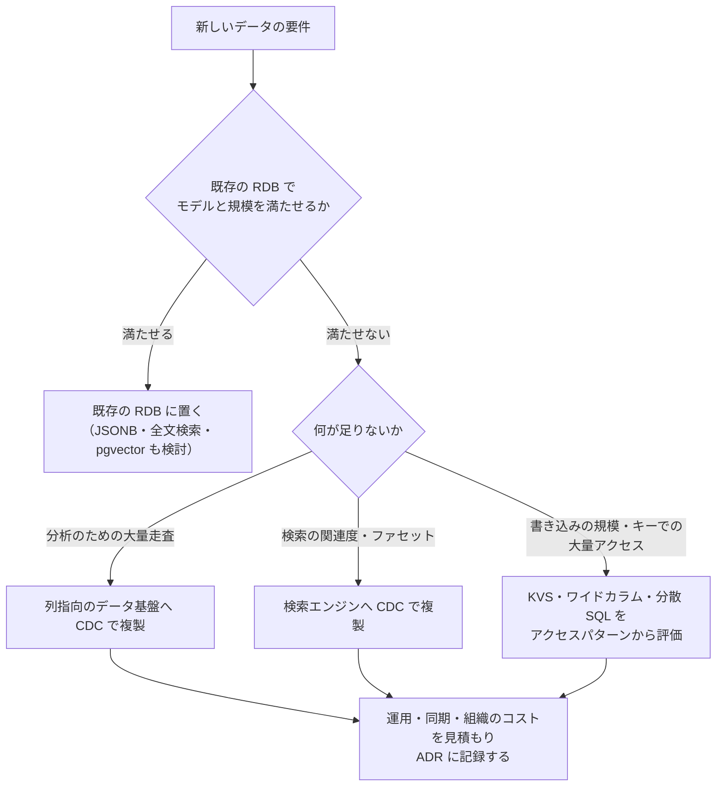

# 6.5 データモデルの多様性とデータストアの選定

> 「NoSQL は RDB より速くてスケールする」「とりあえず PostgreSQL でいい」——どちらも半分正しく、半分まちがいです。データストアの選択は、アプリケーションが最も長く付き合う技術的な決定の 1 つで、後から変えるには年単位の移行が必要になります。この章では、主要なデータモデルとデータストアの得意・不得意を原理から理解し、アクセスパターン・一貫性・規模・運用・組織の観点から、根拠を持って選定できるようになります。

| 項目 | 内容 |
|---|---|
| 学習時間の目安 | 本文 4h ＋ 演習 5h |
| 前提となる章 | [6.1](../01-relational-model-and-sql/README.md)〜[6.4](../04-storage-and-recovery/README.md)（第6部のこれまでの章） |
| 演習 | [exercises/](exercises/)（Python） |
| キーワード | ドキュメント DB, キーバリューストア, ワイドカラム, グラフ DB, 時系列 DB, 転置インデックス, BM25, ベクトル検索, HNSW, OLTP / OLAP, 列指向, NewSQL, 単一テーブル設計, ポリグロットパーシステンス |

## この章のゴール

- [ ] リレーショナル・ドキュメント・キーバリュー・ワイドカラム・グラフ・時系列・全文検索・ベクトルの各モデルの構造と、得意・不得意を説明できる
- [ ] アクセスパターンから、キーバリューストア（DynamoDB 型）のキーと GSI を設計できる
- [ ] 転置インデックスと BM25 を実装し、日本語の全文検索の難しさ（形態素解析と n-gram）を説明できる
- [ ] OLTP と OLAP の違い、行指向と列指向の違いを、読むバイト数と圧縮のモデルで説明できる
- [ ] NewSQL（分散 SQL）の仕組みとトレードオフを説明できる
- [ ] データモデルの適合・一貫性・規模・運用・組織・コスト・ロックインの観点で、データストアの選定を行い、その根拠を文書にできる

## なぜ学ぶのか

データストアの選択は、コードのように気軽には変えられません。データの移行、アプリケーションの書き換え、運用の手順と体制の作り直しが必要になり、大規模なサービスでは移行に年単位の時間がかかります。

- **規模とアクセスパターンが選択を変える**: Discord は技術ブログで、メッセージの保存を MongoDB から Cassandra へ移し（2017 年の記事 "How Discord Stores Billions of Messages"）、その後さらに ScyllaDB へ移行した経緯（2023 年の記事 "How Discord Stores Trillions of Messages"）を公開しています。「チャンネルごとに、新しいメッセージから順に読む」という支配的なアクセスパターンと、データ量の桁の変化が、選択を決めていました。
- **ストレージエンジンの性質が選択を変える**: Uber は 2016 年の技術ブログ "Why Uber Engineering Switched from Postgres to MySQL" で、当時の自社のワークロードでは PostgreSQL の更新時の書き込み増幅やレプリケーションの方式が問題になったとして、MySQL へ移行した理由を説明しました（PostgreSQL コミュニティからは反論も出ています）。[6.2](../02-indexes-and-query-processing/README.md) と [6.4](../04-storage-and-recovery/README.md) で学んだ内部の仕組みの違いが、経営レベルの技術選定の論点になりうるという例です。
- **流行ではなく要件で選ぶ**: 新しいデータストアは、魅力的な性能の数字とともに登場します。しかし、実際のコストの大部分は、バックアップ・監視・アップグレード・障害対応・採用と育成といった運用の側にあります。その総コストを見積もれるかどうかが、技術選定の質を決めます。

## 1. データモデルの全体像

| モデル | データの形 | 得意なこと | 苦手なこと | 代表的な製品 |
|---|---|---|---|---|
| リレーショナル | 表と行。外部キーで関連付ける | 任意の問い合わせ（結合・集計）、制約による整合性、トランザクション | 大規模な書き込みの水平分散（単一のプライマリ）、スキーマの頻繁な変化 | PostgreSQL、MySQL、Oracle Database、SQL Server |
| ドキュメント | JSON のような入れ子の文書 | 一緒に読むデータ（集約）をまとめて読み書き、スキーマの柔軟さ | 文書をまたぐ結合や多対多の関連、文書をまたぐ制約 | MongoDB、Couchbase、Firestore |
| キーバリュー | キー → 値 | キーでの高速な読み書き、水平分散 | キー以外の条件での検索 | Redis、Memcached、Amazon DynamoDB |
| ワイドカラム | パーティションキー → ソートされた行の集まり | 大量の書き込み、パーティション内の範囲の読み取り | 結合、アドホックな問い合わせ | Apache Cassandra、ScyllaDB、HBase、Bigtable |
| グラフ | 頂点と辺（とその属性） | 何段もの関係をたどる問い合わせ | 大量の集計、単純な一覧 | Neo4j、Amazon Neptune |
| 時系列 | 時刻と測定値の列 | 時刻での範囲の集計、圧縮、古いデータの間引き | 任意の更新、複雑な関連 | TimescaleDB、InfluxDB、Prometheus |
| 全文検索 | 文書と転置インデックス | 語による検索と関連度の順位付け、ファセット | 正の値（source of truth）としての保存、トランザクション | Elasticsearch、OpenSearch |
| ベクトル | 数値ベクトル（埋め込み） | 意味の近さによる近傍検索 | 厳密な一致の検索。頻繁な更新は索引の維持の負担になる | pgvector、専用のベクトル DB |

どのモデルも「何かを得意にするために、何かを諦めた」設計です。この節以降では、主要なモデルについて、その取引の中身を見ていきます。

## 2. ドキュメントモデル

### 2.1 集約で考える

ドキュメントモデルは、一緒に読み書きされるデータの塊（集約、aggregate）を 1 つの文書として保存します。注文と明細を 1 つの JSON にまとめれば、1 回の読み取りで注文画面を表示でき、アプリケーションのオブジェクトとの対応も素直です。

```json
{
  "_id": "o1001",
  "customer": {"id": "c1", "name": "佐藤 花子"},
  "ordered_at": "2025-06-01T10:00:00Z",
  "items": [
    {"product_id": "p1", "name": "データベース実践入門", "quantity": 1, "unit_price": 3200},
    {"product_id": "p3", "name": "Python 入門", "quantity": 1, "unit_price": 2400}
  ]
}
```

設計の中心は、関連するデータを **埋め込む（embed）か、参照する（reference）か** の判断です。

| 埋め込むのが向いている | 参照するのが向いている |
|---|---|
| 常に一緒に読まれる（注文と明細） | 独立して読み書きされる（顧客のプロフィール） |
| 1 対少数で、数が増え続けない | 1 対多数で増え続ける（ユーザーのすべての投稿）。文書のサイズ上限（MongoDB は 16MB）にも注意 |
| 親と一緒に消えてよい | 多くの文書から共有される（商品の現在の価格）。埋め込むと更新時に全部を書き換える必要がある |

上の例の `customer.name` や商品名のように、埋め込みは意図的な非正規化です（[6.1](../01-relational-model-and-sql/README.md)）。注文時点の名前を記録するのが目的なら正しく、現在の名前を表示したいなら、参照にして結合（MongoDB の `$lookup` やアプリケーション側の結合）する必要があります。多対多の関係が多いデータや、文書をまたぐ整合性が重要なデータでは、ドキュメントモデルの利点は薄れます。

### 2.2 スキーマ・オン・ライトとスキーマ・オン・リード

RDB は、書き込み時にスキーマに合うかを DB が検査します（**スキーマ・オン・ライト**）。ドキュメント DB は多くの場合、書き込み時の検査が緩く、読み取るアプリケーションが構造を解釈します（**スキーマ・オン・リード**）。後者は「スキーマがない」のではなく、**スキーマの管理がアプリケーションのコードに移る** ということです。古い形式と新しい形式の文書が混在すると、すべての読み取り側がその両方を扱う必要があります。多くのドキュメント DB は JSON Schema による検証の仕組みも持っているので、重要なコレクションには使うことを検討します。

### 2.3 RDB の中の JSON

PostgreSQL の `jsonb` 型は、JSON を解析済みのバイナリ形式で保存し、GIN インデックス（[6.2](../02-indexes-and-query-processing/README.md) の 2.5 節）で包含の検索（`@>`）を高速化できます。20 万件の商品の属性を JSONB で持たせた例です（PostgreSQL 16 で実行。出力は一部を省略）。

```text
CREATE INDEX products_attrs_gin ON products USING gin (attrs jsonb_path_ops);

EXPLAIN ANALYZE SELECT id, name FROM products WHERE attrs @> '{"tags": ["limited"], "size": "XL"}';
 Bitmap Heap Scan on products  (cost=77.17..1279.82 rows=453 width=22) (actual time=0.613..2.365 rows=489 loops=1)
   Recheck Cond: (attrs @> '{"size": "XL", "tags": ["limited"]}'::jsonb)
   Heap Blocks: exact=444
   ->  Bitmap Index Scan on products_attrs_gin  (cost=0.00..77.06 rows=453 width=0) (actual time=0.512..0.512 rows=489 loops=1)
         Index Cond: (attrs @> '{"size": "XL", "tags": ["limited"]}'::jsonb)
 Planning Time: 0.189 ms
 Execution Time: 2.410 ms
```

「共通の列は通常の列、本当に可変な属性だけ JSONB」という組み合わせは、RDB の制約とトランザクションを保ちながら柔軟性を得る実用的な方法で、[6.1](../01-relational-model-and-sql/README.md) の 7.3 節で見た EAV アンチパターンの代わりとしても使えます。

## 3. キーバリューとワイドカラム — アクセスパターンから設計する

### 3.1 キーバリューストア

キーバリューストアは、キーで値を読み書きする単純なモデルです。単純だからこそ、パーティション（シャード）に分けて水平に拡張しやすく（[7.3](../../07-distributed-systems/03-partitioning/README.md)）、読み書きの遅延も予測しやすくなります。Redis はデータをメモリに置き、リスト・ハッシュ・ソート済み集合などのデータ構造を操作できるので、キャッシュ・セッション・ランキング・レート制限によく使われます。永続化の仕組み（スナップショットや追記型のログ）はありますが、設定によっては直近のデータを失う点を理解して使います（[6.4](../04-storage-and-recovery/README.md) の 3.3 節）。

### 3.2 DynamoDB 型のモデリング

Amazon DynamoDB に代表される「パーティションキー＋ソートキー」型のストアでは、同じパーティションキーの項目がソートキーの順に並んで保存され、**パーティションキーを指定し、ソートキーの範囲や前方一致で絞り込む** 問い合わせが効率よく実行できます。一方、結合や、キー以外の条件での検索はできません（表全体を読む scan はできますが、大きな表では現実的ではありません）。

そこで設計の手順が RDB と逆になります。

1. **アクセスパターンを先に列挙する**: 「ルームのメッセージを新しい順に 50 件」「ユーザーが参加しているルームの一覧」など、必要な読み書きをすべて書き出す。
2. **各パターンが 1 回の問い合わせで済むように、キーを設計する**: 一緒に読むものは同じパーティションキーに置き、並べたい・範囲で絞りたい値をソートキーの先頭に置く。
3. **別の切り口が必要なら GSI（グローバルセカンダリインデックス）を使う**。

チャットアプリの例（1 つの表に複数の種類の項目を入れる **単一テーブル設計**）:

| 項目 | PK | SK | GSI1PK / GSI1SK |
|---|---|---|---|
| ルームの情報 | `ROOM#r1` | `#META` | |
| メッセージ | `ROOM#r1` | `MSG#2025-06-01T10:00:00Z#m42` | |
| ルームの参加者 | `ROOM#r1` | `MEMBER#u7` | `USER#u7` / `ROOM#r1` |

- 「ルームのメッセージを新しい順に」→ `PK = ROOM#r1 AND SK begins_with "MSG#"` を逆順に。ソートキーが時刻で始まるので、期間の絞り込みも `between` でできる。
- 「ユーザーが参加しているルーム」→ GSI1 で `GSI1PK = USER#u7`。GSI の属性を持つ項目（参加者）だけが索引に入る（疎なインデックス）。

この方式は、アクセスパターンが安定していて、規模と遅延の予測可能性が重要な場面で強力です。反面、**後から新しいアクセスパターンが必要になったときの変更が大きく**、アドホックな分析もできないので、分析用には別途データを書き出します（8 節）。パーティションキーの値に偏りがあると、特定のパーティションに負荷が集中する（ホットパーティション）ことにも注意します。演習 2 では、この型の表を実装し、EC サイトのアクセスパターンのためのキーを設計します。

### 3.3 ワイドカラム

Cassandra や ScyllaDB のワイドカラムモデルも、「パーティションキーで分散し、パーティションの中はクラスタリングキーの順に並べる」という点で同じ考え方です。LSM 木（[6.4](../04-storage-and-recovery/README.md)）のストレージと組み合わさって書き込みに強く、「問い合わせごとに表を作る（同じデータを複数の表に非正規化して持つ）」のが定石です。一貫性の強さを操作ごとに選べる（クォーラムの読み書き）点は [7.2](../../07-distributed-systems/02-replication-and-consistency/README.md) で扱います。

## 4. グラフと時系列

### 4.1 グラフ

グラフ DB は、頂点（人・口座・商品）と辺（フォロー・送金・購入）を第一級の対象として保存し、**関係を何段もたどる** 問い合わせを得意とします。頂点と辺が属性を持てる **プロパティグラフ** と、主語・述語・目的語の三つ組で表す **RDF** の 2 系統があります。プロパティグラフの問い合わせ言語 Cypher（Neo4j で始まった）で「友人の友人が買った商品」を書くと、次のようになります（説明用の例）。

```text
MATCH (me:User {id: 'u1'})-[:FOLLOWS]->(:User)-[:FOLLOWS]->(fof:User)-[:BOUGHT]->(p:Product)
WHERE NOT (me)-[:BOUGHT]->(p)
RETURN p.name, count(*) AS score ORDER BY score DESC LIMIT 10
```

RDB でも再帰 CTE（[6.1](../01-relational-model-and-sql/README.md)）や自己結合で同じことができますが、段数が増えると結合が重なり、書くのも最適化するのも難しくなります。グラフ DB は、隣接する頂点への参照を直接たどる（index-free adjacency などと呼ばれる）実装で、この種の問い合わせを速くしています。不正検知（口座や端末のつながりから不正の輪を見つける）、推薦、権限やネットワークの依存関係の分析が代表的な用途です。標準化も進んでおり、2023 年の SQL 標準にはプロパティグラフの問い合わせ（SQL/PGQ）が加わり、2024 年にはグラフの問い合わせ言語 GQL が ISO/IEC 39075 として制定されました。一方で、大量のデータの集計や、単純な一覧の表示は RDB の方が得意です。

### 4.2 時系列

メトリクス・IoT のセンサー・株価のような **時系列データ** には、次の特徴があります。ほぼ追記だけで更新がない、時刻の範囲で集計される、新しいデータほどよく読まれる、古いデータは間引いたり削除したりしてよい。時系列 DB は、時刻によるパーティション分割、時刻の差分の差分や浮動小数点数の XOR による圧縮（Facebook の Gorilla、VLDB 2015 の論文で知られる方式）、古いデータの自動削除（保持期間）や集約（ダウンサンプリング）の機能で、これに特化しています。PostgreSQL の拡張の TimescaleDB、InfluxDB、監視の分野の Prometheus（[10.4](../../10-cloud-and-sre/04-observability/README.md)）が代表的です。

## 5. 全文検索とベクトル検索

### 5.1 転置インデックス

「本文に『データベース』を含む記事」を `LIKE '%データベース%'` で探すと、前方が不定の LIKE なので全件走査になります（[6.2](../02-indexes-and-query-processing/README.md) の 7 節）。全文検索エンジンは、**転置インデックス（inverted index）**（語 → その語を含む文書の一覧）を作っておき、語から文書を引きます。本の巻末の索引と同じ発想です。

索引を作る前に、文章を **トークン（語）** に分ける処理（アナライザ）が必要です。

- **英語など**: 空白と記号で単語に分け、小文字にし、語幹を取り出す（stemming。"indexing" → "index"）。
- **日本語**: 単語の間に空白がないので、(1) 辞書を使って単語に区切る **形態素解析**（MeCab、Sudachi、Lucene の Kuromoji など）か、(2) 文字を 2 文字ずつずらして切り出す **n-gram**（bi-gram）を使う。n-gram は辞書が不要で新語にも強い代わりに、索引が大きく、意図しない一致が起きる。

演習 1 の bi-gram のトークナイザで、この「意図しない一致」を見てみます（演習 1 の解答例で実行した結果）。

```python
from inverted_index import InvertedIndex, tokenize

docs = {
    1: "東京都の天気予報",
    2: "京都の観光ガイド。京都の寺と京都の庭園を巡る",
    3: "京都大学の研究",
    4: "データベースの索引（インデックス）の仕組み",
}
index = InvertedIndex()
for doc_id, text in docs.items():
    index.add(doc_id, text)

print(tokenize("東京都の天気予報"))
print(index.postings("京都"))
for doc_id, score in index.search("京都"):
    print(doc_id, round(score, 3), docs[doc_id])
```

```text
['東京', '京都', '都の', 'の天', '天気', '気予', '予報']
[(1, 1), (2, 3), (3, 1)]
2 0.498 京都の観光ガイド。京都の寺と京都の庭園を巡る
3 0.448 京都大学の研究
1 0.43 東京都の天気予報
```

「東京都」の中の「京都」という 2 文字の並びに一致して、文書 1 もヒットしています。実際の検索システムでは、形態素解析と n-gram を併用したり、語句の位置を記録して連続して現れるかを確かめたりして、この問題を緩和します。

### 5.2 関連度の順位付け — BM25

検索結果は、関連度の高い順に並べる必要があります。現在の検索エンジンで標準的に使われる **BM25** は、次の 3 つの直感を式にしたものです。

1. **まれな語ほど重要**（IDF: 逆文書頻度）: 「の」や「is」より「京都」や「Lucene」の方が文書を特徴づける。
2. **多く出てくるほど関連が強いが、頭打ちになる**（tf の飽和）: 3 回出てくる文書は 1 回の文書より関連が強いが、100 回と 50 回の差はほとんどない。パラメータ k1（既定 1.2）が飽和の速さを決める。
3. **長い文書ほど割り引く**（長さの正規化）: 長い文書は偶然その語を含みやすい。パラメータ b（既定 0.75）が補正の強さを決める。

上の結果で文書 2 が 1 位なのは「京都」が 3 回出てくるから、文書 3 が文書 1 より上なのは短いからです。Elasticsearch と OpenSearch（2021 年に Elasticsearch のライセンス変更を機にフォークされた）はどちらも Apache Lucene を基盤としており、BM25 を標準の関連度の計算に使っています。演習 1 では、転置インデックス・ブール検索・BM25 を実装します。

PostgreSQL にも全文検索の機能（`tsvector` と GIN インデックス）があります。英語なら標準の設定で語幹の処理まで行われます（PostgreSQL 16 で実行）。

```text
SELECT to_tsvector('english', 'Indexing makes searching faster') AS tsv;
                   tsv
------------------------------------------
 'faster':4 'index':1 'make':2 'search':3
```

日本語には標準の設定がないので、pg_bigm（bi-gram の索引で LIKE を速くする）や PGroonga といった拡張を使うのが一般的です（マネージドサービスで使える拡張は限られるので、2026 年時点の各サービスの対応状況を確認してください）。

**検索エンジンは、通常は正の値（source of truth）の保存場所ではありません**。データの正は RDB などに置き、CDC やバッチで検索エンジンに反映します（[6.4](../04-storage-and-recovery/README.md) の 5 節、[7.5](../../07-distributed-systems/05-messaging-and-events/README.md)）。反映には遅延があり、検索結果と詳細画面の内容が一時的に食い違うことを前提に設計します。

### 5.3 ベクトル検索

機械学習のモデルは、文章や画像を数百〜数千次元の **ベクトル（埋め込み、embedding）** に変換でき、意味の近いものほどベクトルが近くなります（[12.3](../../12-data-and-ai/03-deep-learning/README.md)）。「質問文に意味の近い文書を探す」ことは、コサイン類似度などで最も近いベクトルを探す **近傍検索（nearest neighbor search）** になります。LLM に社内文書を参照させる RAG の中心的な処理です（[12.4](../../12-data-and-ai/04-llm-applications/README.md)）。

すべてのベクトルと比べる厳密な検索は、1 回の検索で「件数 × 次元数」の計算が必要です。1,000 万件 × 1,536 次元なら約 150 億回の掛け算で、件数が増えると現実的ではなくなります。そこで、多少の取りこぼし（**再現率**、recall の低下）を許して高速化する **近似最近傍探索（ANN）** が使われます。

| 方式 | 考え方 | 特徴 |
|---|---|---|
| HNSW（Hierarchical Navigable Small World。Malkov・Yashunin の論文） | 近いベクトルどうしを辺で結んだ多層のグラフをたどる | 高速で再現率も高いが、メモリを多く使い、構築に時間がかかる |
| IVF（inverted file） | k-means でベクトルをクラスタに分け、近いクラスタの中だけを調べる | メモリ効率がよい。調べるクラスタの数で速さと再現率を調整する |
| PQ（直積量子化） | ベクトルを分割して、それぞれを短い符号で近似して圧縮する | メモリを大幅に減らせるが、精度は下がる。IVF と組み合わせて使われる |

PostgreSQL の拡張 pgvector は、ベクトル型と IVFFlat・HNSW の索引を提供し、既存の RDB の中でベクトル検索を始められます。専用のベクトル DB や、Elasticsearch・OpenSearch のベクトル検索機能もあります。選ぶ際には、件数と次元数、メタデータでの絞り込みとの組み合わせ（「この部署の文書の中で近いもの」は、ANN と相性が悪い場合がある）、更新の頻度、再現率と遅延の要件を確かめます。全文検索（BM25）とベクトル検索の結果を組み合わせる **ハイブリッド検索** もよく使われます。

## 6. 分析向けのデータストア — OLTP と OLAP

データベースの使い方は、大きく 2 つに分かれます。

| | OLTP（オンライントランザクション処理） | OLAP（オンライン分析処理） |
|---|---|---|
| 典型的な処理 | 注文を 1 件作る、顧客を 1 人読む | 1 年分の売上を地域別に集計する |
| 1 回に扱う行 | 少数（インデックスで探す） | 大量（数百万〜数十億行を走査する） |
| 1 回に使う列 | 行のほとんどの列 | 多くの列のうちの数列 |
| 重視するもの | 遅延、同時実行、整合性 | スループット、走査の速さ |
| 向いている格納方式 | 行指向（[6.4](../04-storage-and-recovery/README.md)） | 列指向 |

**列指向（column-oriented）** のストレージ（[6.4](../04-storage-and-recovery/README.md) の 7 節）は、列ごとに値をまとめて格納します。集計に必要な列だけを読めばよく、同じ列の値は似ているので圧縮がよく効きます。演習 3 のモデルで、2 万行 × 6 列の売上データ（地域は 8 種類、年は 3 種類）から `SELECT region, SUM(amount) FROM sales WHERE year = ? GROUP BY region` に必要な 3 列を読むバイト数を計算すると、次のようになりました（演習 3 の解答例で計算した値）。

| 格納方式 | 読むバイト数 | 行指向との比 |
|---|---|---|
| 行指向（6 列すべてを読む） | 1,324,882 | 1 |
| 列指向・符号化なし（3 列だけを読む） | 527,731 | 約 1/2.5 |
| 列指向・region と year を辞書符号化（並べ替えなし） | 172,607 | 約 1/7.7 |
| 列指向・(year, region) の順に並べて両方を RLE | 160,381 | 約 1/8.3 |

辞書符号化では、8 種類の region は 3 ビット、3 種類の year は 2 ビットの符号になり、region 列は 207,731 バイトから 7,583 バイトに、year 列は 160,000 バイトから 5,024 バイトに縮みます。(year, region) の順に並べたデータに RLE を使うと、region 列は 345 バイト、year 列は 36 バイトにまでなり、読むバイト数のほとんどは圧縮の効かない amount 列（160,000 バイト）になりました。逆に、並んでいないデータに RLE を使うと、連続がほとんどないので、かえって大きくなります（year 列は 160,368 バイト、region 列は 251,541 バイト）。**圧縮の効果は、データの並び順と値の種類の数で決まる** のです。実際の列指向の DB も、データを並べ替えて格納したり、ブロックごとの最小値・最大値を記録して読まなくてよいブロックを飛ばしたりすることで、この効果を最大化しています。さらに、演習 3 の最後の関数のように、符号化したまま集計する（必要になるまで文字列に戻さない）ことで、CPU の処理も減らしています。

分析用のデータストアの代表は、BigQuery（Google の Dremel が基盤）、Snowflake、Amazon Redshift といったクラウドのデータウェアハウス、ClickHouse、組み込み型の DuckDB です。オブジェクトストレージ上の Parquet ファイルに、Apache Iceberg・Delta Lake・Apache Hudi といったテーブル形式でトランザクションやスキーマの管理を加えた **レイクハウス** も広がっています。本番の OLTP の DB で重い集計を実行すると、オンラインの処理を遅くするので、分析用のデータは CDC やバッチでこれらのデータ基盤に移すのが原則です（[12.1 データ基盤とデータエンジニアリング](../../12-data-and-ai/01-data-engineering/README.md)）。

## 7. NewSQL と分散 SQL

RDB の弱点は、書き込みを 1 台のプライマリで受け付けるため、書き込みの規模に上限があることでした。アプリケーションで DB を分割（シャーディング）すると、シャードをまたぐ結合やトランザクションを失います。**NewSQL（分散 SQL）** は、SQL とトランザクションを保ったまま、データを自動的に分割して多数のノードに分散させます。

- **Google Spanner**（OSDI 2012 の論文）: 原子時計と GPS で時刻の誤差の範囲を保証する TrueTime を使い、世界規模で分散したデータに対して、外部一貫性（コミットの順序が実時間の順序と一致する）を持つトランザクションを実現した。
- **CockroachDB**（PostgreSQL 互換のプロトコル）、**TiDB**（MySQL 互換）、**YugabyteDB**（PostgreSQL 互換）: データを多数の小さな単位（CockroachDB の range、TiDB の Region、YugabyteDB の tablet）に分割し、各単位を Raft（[7.4](../../07-distributed-systems/04-consensus-and-coordination/README.md)）で複製する。

トレードオフもはっきりしています。分割をまたぐトランザクションはノード間の合意を必要とするので、単一ノードの RDB より遅延が大きくなります（特に地理的に離れたリージョンをまたぐ場合）。互換性をうたっていても、既存の RDB のすべての機能や性能特性が同じとは限りません。運用の知見を持つ人も、既存の RDB ほど多くありません。「1 台の大きな PostgreSQL に収まらない書き込みの規模がある」「複数のリージョンで書き込みを受け付ける必要がある」といった明確な理由があるときに検討するのが妥当です。なお、Amazon Aurora の標準的な構成のように、ストレージを分散・多重化しつつ、書き込みは 1 台のインスタンスで受け付ける、クラウド向けに作り直された RDB もあります。これは NewSQL とは別の設計の方向性です。

## 8. データストアの選定

### 8.1 選定の観点

| 観点 | 問うべきこと |
|---|---|
| データモデルの適合 | データの形（表・集約・グラフ・時系列）と、支配的なアクセスパターンは何か。アドホックな問い合わせや集計は必要か |
| 一貫性とトランザクション | 複数のデータをまたぐ不変条件はあるか。読み取りに最新の値が必要か（[7.2](../../07-distributed-systems/02-replication-and-consistency/README.md)） |
| 規模 | データ量・読み書きの秒間件数・成長率。3 年後に 1 台に収まるか |
| 遅延 | p99 の遅延の要件。どのリージョンの利用者に、どれだけ近く置く必要があるか |
| 可用性と復旧 | RPO / RTO、マルチ AZ・マルチリージョン、バックアップと PITR の手段（[6.4](../04-storage-and-recovery/README.md)） |
| 運用の成熟度 | 監視・バックアップ・アップグレード・障害対応の知見と道具がそろっているか |
| チームの技能と採用 | 社内に使いこなせる人がいるか。採用市場で人を見つけられるか |
| コスト | ライセンス・インフラ・運用の人件費の合計。データ量や問い合わせの量に比例する課金か |
| ロックインと移植性 | 独自の API か、標準（SQL・オープンソースのプロトコル）か。移行するとしたら何が必要か |
| マネージドサービス | 自社の使うクラウドで、マネージドサービスとして利用できるか。その制約（使える拡張・バージョン）は何か |
| 法令・規制 | データの所在（国・地域）、暗号化、監査の要件（[14.5](../../14-cto/05-governance-risk-compliance/README.md)） |

### 8.2 ポリグロットパーシステンスとその代償

用途ごとに最適なデータストアを使い分けることを **ポリグロットパーシステンス（polyglot persistence）** と呼びます（Martin Fowler らが広めた言葉）。注文は PostgreSQL、セッションは Redis、商品検索は Elasticsearch、分析は BigQuery、という構成は一般的です。

しかし、データストアを 1 つ増やすごとに、次のコストが増えます。

- 運用: 監視・バックアップ・アップグレード・セキュリティの設定・障害対応の手順が、それぞれに必要になる。
- データの同期: 正の値から他のストアへの反映（CDC・二重書き込み）と、その遅延や不整合への対処。
- 一貫性: ストアをまたぐトランザクションはない。整合性の確認と修復の仕組みが必要になる。
- 組織: それぞれに詳しい人が必要になり、知識が分散し、オンコールの負担が増える。

**新しいデータストアの追加は、それが解決する問題の価値が、これらのコストを明らかに上回るときに限る** のが原則です。

### 8.3 「とりあえず PostgreSQL」の論拠と限界

小〜中規模の多くのプロダクトでは、「まず PostgreSQL（あるいは MySQL）で始める」は合理的な既定の選択です。PostgreSQL は RDB としての機能に加えて、JSONB（ドキュメント）、全文検索、pgvector（ベクトル検索）、PostGIS（地理情報）、宣言的なパーティション分割、`SKIP LOCKED` を使ったジョブキュー（[6.3](../03-transactions/README.md)）、論理レプリケーションなどを備え、1 つの DB の中で多くの用途をまかなえます。トランザクション・バックアップ・運用の知見が 1 つにまとまることの価値は大きいのです。

一方で、次のような限界もあります。

- 書き込みは 1 台のプライマリが受け付けるので、書き込みの規模には上限がある（Citus のような拡張や、アプリケーションでのシャーディングが必要になる）。
- 接続ごとにプロセスを作る方式なので、大量の接続には PgBouncer などの接続プーリングが必要。
- VACUUM やトランザクション ID の周回（[6.3](../03-transactions/README.md)）といった、固有の運用上の注意がある。
- 大規模な分析、高度な検索の関連度やファセット、非常に大規模なベクトル検索では、専用のシステムの方が機能・性能で上回ることが多い。



## よくある落とし穴

1. **「スケールするから」で NoSQL を選ぶ**。多くのプロダクトは、何年もの間 1 台の RDB で十分な規模に収まる。先にアクセスパターンと規模の見積もりを行い、RDB で足りない理由を具体的に説明できるときに検討する。
2. **アクセスパターンを決めずに KVS やワイドカラムのスキーマを作る**。キーの設計を後から変えるには、データの全件の書き直しが必要になる。必要な問い合わせを列挙してからキーを設計する。
3. **ドキュメント DB を「スキーマがないので設計が不要」と考える**。スキーマの管理がアプリケーションに移るだけで、古い形式の文書の扱いはすべての読み取り側の負担になる。埋め込みと参照の判断、検証の仕組みを設計する。
4. **検索エンジンやキャッシュを正の値として使う**。これらはデータの複製であり、失われても再構築できる前提で設計する。正の値は、トランザクションとバックアップのある DB に置く。
5. **本番の OLTP の DB で重い分析の問い合わせを実行する**。オンラインの処理が遅くなり、ロックや VACUUM にも影響する。分析用のデータ基盤に複製して実行する。
6. **日本語の全文検索を、英語と同じ設定で済ませる**。単語に区切られず検索できない、あるいは n-gram の意図しない一致が多すぎる、という問題が起きる。アナライザ（形態素解析・n-gram・その併用）を要件に合わせて選び、実データで評価する。
7. **ベクトル検索の再現率を確かめない**。ANN は取りこぼしを許す方式なので、索引のパラメータとデータによって、正しい結果が上位に出ないことがある。評価用のデータで再現率と遅延を測ってから本番に入れる。
8. **データストアを増やす判断を、個々のチームに任せきりにする**。気づけば数種類のデータストアが乱立し、運用と人材の負担が組織全体にのしかかる。

## CTOの視点

1. **データストアの選定は「一方通行のドア」として扱う**。フレームワークの選択と違い、データストアの変更には、データの移行と、それに依存するすべてのシステムの変更が伴います。選定は ADR（アーキテクチャ決定記録、[13.2](../../13-technical-leadership/02-technical-decisions/README.md)）に残し、「なぜこれを選んだか」「何を諦めたか」「どうなったら見直すか」を明文化します。
2. **標準のデータストアを決め、例外には説明責任を求める**。「OLTP は PostgreSQL、キャッシュは Redis、分析は○○」のような標準（技術レーダーやゴールデンパス）を定め、それ以外を使うチームには、8.1 節の観点での評価と、運用の体制（誰がオンコールを担い、誰がバックアップと復元を確かめるか）を示してもらいます。組織の規模が小さいうちほど、種類を絞る価値は大きくなります。
3. **総保有コストで比べる**。マネージドサービスの料金だけでなく、運用の人件費、学習と採用のコスト、データの転送料、ロックインによる将来の交渉力の低下まで含めて比べます。データ量やリクエスト数に比例して課金されるサービスは、成功するほど費用が増えるので、3 年後の規模での費用を試算します（[10.6](../../10-cloud-and-sre/06-finops/README.md)）。
4. **データの流れ全体を設計する**。正の値がどこにあり、どの経路（CDC・バッチ・イベント）で検索・分析・キャッシュ・AI の基盤に流れ、どれだけの遅延と不整合を許容するのかを、1 枚の図で説明できる状態を保ちます。データの流れを把握していない組織では、個人情報の削除要求への対応や、障害時の影響範囲の特定が困難になります（[14.5](../../14-cto/05-governance-risk-compliance/README.md)）。
5. **新技術の評価は、本番に近いデータで小さく試す**。ベンチマークの数字は、自社のアクセスパターン・データ量・運用の条件とは異なります。本番のデータ（またはその分布を再現したもの）で、性能・運用の手間・障害時の挙動を検証する期間を設け、撤退の基準も先に決めておきます。

## 演習

演習コードは [exercises/](exercises/) にあります。各ファイルの docstring に仕様があるので、`raise NotImplementedError(...)` を実装に置き換えてください。解答例は [solutions/](solutions/) にあります。

```bash
python3 tools/check.py 6.5        # リポジトリのルートで実行
python3 tools/check.py -v 6.5     # 詳しい出力
```

| # | 難易度 | 内容 | ファイル / 関数 |
|---|---|---|---|
| 1 | ★★★ | 転置インデックス: 英語の単語と日本語の文字 bi-gram のトークナイザ、ポスティングリスト、ブール検索（must / should / must_not）、BM25（k1 = 1.2、b = 0.75）による順位付け | [inverted_index.py](exercises/inverted_index.py): `tokenize`, `InvertedIndex` |
| 2 | ★★☆ | DynamoDB 風の表（パーティションキー＋ソートキー、begins_with / between、疎な GSI）を実装し、EC サイトのアクセスパターンを 1 回の問い合わせで満たすキーを設計する | [kv_modeling.py](exercises/kv_modeling.py): `Table`, `put_order`, `get_orders_for_customer` ほか |
| 3 | ★★☆ | 行指向と列指向、ランレングス符号化と辞書符号化、集計で読むバイト数のモデル、符号化したままの集計 | [columnar.py](exercises/columnar.py): `rle_encode`, `dict_encode`, `column_size`, `sales_by_region_encoded` ほか |
| 4 | ★★★ | 記述: データストアの選定の ADR（下記） | — |

### 演習 4（記述）: データストアの選定を ADR にまとめる

あなたは、フリーマーケットアプリの CTO です。現在はすべてのデータを 1 台の PostgreSQL（マネージドサービス、データ 800GB）に置いています。次の 3 つの要望が出ています。それぞれについて、選択肢を 2〜3 個挙げて比較し、推奨案を ADR（背景・選択肢・決定・結果として受け入れること）の形でまとめてください。

1. 商品検索: 日本語のキーワード検索が遅く、関連度の順位も悪い（現在は `LIKE '%キーワード%'`）。出品数は 1,000 万件で、1 日 50 万件ずつ増える。
2. 閲覧履歴: 「最近見た商品」を利用者ごとに最新 100 件表示したい。書き込みは毎秒 3,000 件程度。
3. 経営分析: 出品・取引のデータを使って、カテゴリ別・日別の集計を経営会議で見たい。現在は本番の DB に直接 SQL を投げており、夜間のバッチが遅くなっている。

<details>
<summary>解答例</summary>

**1. 商品検索**

- 選択肢: (a) PostgreSQL に pg_bigm などの拡張を入れる（マネージドサービスで使えるか確認が必要）、(b) Elasticsearch / OpenSearch を導入し、CDC で商品データを反映する、(c) 検索の SaaS を使う。
- 推奨: (b)。1,000 万件規模で日本語の関連度の調整（形態素解析と n-gram の併用、同義語、BM25 のチューニング）やファセットが必要になるので、専用の検索エンジンの価値が運用コストを上回る。正の値は PostgreSQL のままとし、Debezium などの CDC で反映する。
- 受け入れること: 反映の遅延（数秒）による検索結果と商品詳細の一時的な不一致。検索基盤の運用（クラスタの監視・索引の再構築の手順）と、その担当者の確保。(a) は、マネージドサービスで拡張が使え、要件が単純な場合に先に試す価値がある。

**2. 閲覧履歴**

- 選択肢: (a) PostgreSQL の表に追記し、利用者 ID と時刻の複合インデックスで読む、(b) Redis のソート済み集合（利用者ごとに最新 100 件だけを保持）、(c) DynamoDB / Cassandra（パーティションキー = 利用者、ソートキー = 時刻）。
- 推奨: 失ってもよいデータなら (b)。書き込みの負荷を本番の RDB から切り離せ、「最新 100 件」を保つ操作（追加と、古いものの削除）も単純。長期の保存や分析が必要なら、イベントとして分析基盤にも流す。永続性が必要なら (c)、あるいは規模的には (a) でも足りる可能性があるので、実際の負荷で検証する。
- 受け入れること: Redis の永続化の設定によっては直近の履歴を失うこと（履歴は再生成できなくてもよい、という事業側の合意）。

**3. 経営分析**

- 選択肢: (a) 読み取り用のレプリカで集計する、(b) クラウドのデータウェアハウス（BigQuery・Snowflake など）に CDC かバッチで複製する、(c) 本番の DB に集計テーブルを作る。
- 推奨: (b)。列指向のストレージで集計が速く、本番の DB への負荷がなくなる。BI ツールとつなぎ、経営会議の指標を定義する（[12.1](../../12-data-and-ai/01-data-engineering/README.md)）。(a) は短期の対策として有効だが、レプリカでの長い問い合わせは複製の遅延や衝突を招くことがある。
- 受け入れること: データの鮮度（例: 1 時間ごとの反映）、データ基盤の費用と、指標の定義を管理する体制。

採点の観点:

- 3 つの要望それぞれで「正の値はどこか」「反映の方法と遅延」を明記し、専用のデータストアを導入する場合の運用コストに触れていれば合格ラインです。
- 「失ってよいデータか」「既存の PostgreSQL で足りる可能性」を検討し、段階的な導入（まず小さく試す、撤退の基準）まで書けていれば、CTO の意思決定として十分な水準です。

</details>

## 理解度チェック

**Q1. ドキュメント DB で、注文と注文明細を 1 つの文書に埋め込むのは適切ですか。顧客のプロフィールを注文の文書に埋め込むのはどうですか。**

<details>
<summary>解答</summary>

注文と明細は常に一緒に読み書きされ、明細の数も限られ、注文と一緒に消えてよいので、埋め込みに適しています。顧客のプロフィールは、注文とは独立して更新され、多くの注文から共有されるので、埋め込むと顧客の情報が変わるたびに多数の文書を更新する必要があります。原則として顧客は別の文書にして参照します。ただし「注文時点の宛名」を記録したいなら、その時点の値を注文に埋め込むのが正しい設計です（6.1 章の、その時点の値と現在の値の区別）。

</details>

**Q2. DynamoDB 型のストアで「ユーザーの注文を新しい順に 20 件」を 1 回の問い合わせで読めるように、キーを設計してください。**

<details>
<summary>解答</summary>

パーティションキーを `USER#<ユーザー ID>`、ソートキーを `ORDER#<注文日時（ISO 8601）>#<注文 ID>` にします。`PK = USER#u1 AND SK begins_with "ORDER#"` をソートキーの降順で 20 件読めば、新しい順の 20 件が 1 回で取れます。日時を ISO 8601 のように文字列の大小と時刻の前後が一致する形式にすることと、同時刻の注文を区別するために注文 ID を後ろに付けることがポイントです。注文を注文 ID で直接読むパターンも必要なら、注文のパーティション（`ORDER#<注文 ID>`）に置いて、ユーザーからの一覧には GSI を使う設計もあります。

</details>

**Q3. 日本語の全文検索で、形態素解析と文字 n-gram にはそれぞれどんな長所と短所がありますか。**

<details>
<summary>解答</summary>

形態素解析は、辞書を使って文章を単語に区切るので、索引が小さく、「京都」で「東京都」が一致するような誤りが少なくなります。一方、辞書にない新語や固有名詞、表記ゆれに弱く、区切り方の誤りで検索漏れが起きることがあります。文字 n-gram は辞書が不要で、どんな文字列でも取りこぼしにくい一方、索引が大きくなり、単語の境界をまたいだ意図しない一致（ノイズ）が増えます。実際の検索システムでは、両方の索引を作って組み合わせたり、語句の位置を使って連続性を確かめたりして、両者の長所を生かします。

</details>

**Q4. BM25 の k1 と b は、それぞれ何を調整するパラメータですか。**

<details>
<summary>解答</summary>

k1 は、語の出現回数（tf）の効果がどれだけ速く飽和するかを調整します。k1 が小さいと、1 回出てくるだけでほぼ最大の効果になり、大きいと出現回数の差がスコアに長く反映されます。b は、文書の長さによる補正の強さを調整します。b = 0 なら長さで補正せず、b = 1 なら平均の長さとの比で完全に補正します。長い文書は偶然その語を含みやすいので、既定の b = 0.75 では長い文書のスコアを割り引きます。

</details>

**Q5. 1 億行の売上テーブルで「地域別の今年の売上合計」を求めるとき、列指向のストレージが行指向より有利な理由を 2 つ以上挙げてください。**

<details>
<summary>解答</summary>

- 必要な列（地域・年・金額）だけを読めばよく、他の列（商品名・備考など）を読まずに済む。
- 同じ列の値は似ているので、辞書符号化やランレングス符号化などの圧縮がよく効き、読むバイト数がさらに減る。データを並べ替えて格納すれば、その効果はさらに大きい。
- ブロックごとの最小値・最大値を持っていれば、条件（今年）に合わないブロックを読まずに飛ばせる。
- 符号化したまま集計でき、同じ型の値が連続して並ぶので、CPU の処理（ベクトル化）も効率がよい。

</details>

**Q6. NewSQL（分散 SQL）を採用すべき場面と、採用に慎重になるべき理由を説明してください。**

<details>
<summary>解答</summary>

採用を検討すべきなのは、1 台の RDB のプライマリでは書き込みの規模が足りない、複数のリージョンで書き込みを受け付けたい、しかも SQL とトランザクションによる整合性が必要、という場面です。アプリケーションでのシャーディングと違い、分割をまたぐ結合やトランザクションを DB が扱ってくれます。

慎重になるべき理由は、分割をまたぐトランザクションにノード間の合意が必要で、単一ノードの RDB より遅延が大きい（特にリージョンをまたぐ場合）こと、既存の RDB との互換性が完全ではないこと、運用の知見を持つ人材が少ないこと、費用が大きくなりがちなことです。多くのプロダクトは、そこまでの規模に達する前に、単一の RDB の縦の拡張やリードレプリカで十分に対応できます。

</details>

**Q7. 「検索も、キャッシュも、ジョブキューも、全部 PostgreSQL でやる」という方針の利点と、見直すべきタイミングを説明してください。**

<details>
<summary>解答</summary>

利点は、データストアが 1 つなので、トランザクション・バックアップ・監視・権限管理・運用の知見が 1 か所にまとまり、データの同期や不整合の問題も起きないことです。小〜中規模のチームにとって、運用の負担と障害の可能性を大きく減らせます。

見直すべきなのは、(1) 検索の関連度やファセット、日本語の解析などの要件が PostgreSQL の機能では満たせなくなったとき、(2) キャッシュやキューとしての負荷が本番の OLTP の処理に悪影響を与え始めたとき、(3) 書き込みの規模が 1 台のプライマリの上限に近づいたとき、(4) 分析の問い合わせが本番に負荷をかけているとき、などです。いずれも「なんとなく」ではなく、計測で限界を確かめてから、専用のデータストアの運用コストと比べて判断します。

</details>

## さらに学ぶために

- Martin Kleppmann "Designing Data-Intensive Applications"（邦訳『データ指向アプリケーションデザイン』オライリー・ジャパン）のデータモデルとストレージの章（初版では第 2・3 章）— データモデル（リレーショナル・ドキュメント・グラフ）と、行指向・列指向のストレージの比較。この章全体の背景となる本。
- Alex DeBrie "The DynamoDB Book" — アクセスパターンから単一テーブル設計を行う手順を、多くの例で解説した実践書。
- Stephen E. Robertson, Hugo Zaragoza "The Probabilistic Relevance Framework: BM25 and Beyond"（Foundations and Trends in Information Retrieval, 2009）— BM25 の理論的な背景をまとめた解説。
- Christopher D. Manning, Prabhakar Raghavan, Hinrich Schütze "Introduction to Information Retrieval"（Cambridge University Press）— 転置インデックス・ブール検索・ランキングの教科書。著者のサイトで全文が公開されている。
- Yu. A. Malkov, D. A. Yashunin "Efficient and robust approximate nearest neighbor search using Hierarchical Navigable Small World graphs"（IEEE TPAMI）— HNSW の原論文。ベクトル検索の索引を選ぶ前に、仕組みを知っておく価値がある。
- James C. Corbett ほか "Spanner: Google's Globally-Distributed Database"（OSDI 2012）— 分散 SQL の代表的な設計。第 7 部の予習にもなる。
- Discord の技術ブログ "How Discord Stores Billions of Messages"（2017）と "How Discord Stores Trillions of Messages"（2023）— アクセスパターンと規模の変化がデータストアの選択をどう変えたかの、公開された実例。

## まとめ

- データモデルは、それぞれ何かを得意にするために何かを諦めた設計である。リレーショナルは任意の問い合わせと整合性、ドキュメントは集約の読み書き、キーバリューとワイドカラムは規模と予測可能性、グラフは関係の探索、時系列は時刻の範囲の集計、全文検索は関連度、ベクトルは意味の近さに強い。
- ドキュメントモデルでは埋め込みと参照を判断し、スキーマ・オン・リードはスキーマの管理がアプリケーションに移ることを意味する。PostgreSQL の JSONB は、RDB の中での実用的な柔軟性を与える。
- DynamoDB 型のストアでは、アクセスパターンを先に列挙し、1 回の問い合わせで満たせるようにキーと GSI を設計する。後からの変更は大きい。
- 全文検索は転置インデックスと BM25（IDF・tf の飽和・長さの正規化）で成り立ち、日本語は形態素解析と n-gram の使い分けが鍵になる。ベクトル検索は ANN（HNSW・IVF・PQ）で再現率と速さを交換する。
- OLAP には列指向が向き、必要な列だけを読み、並べ替えと符号化で読むバイト数を大幅に減らす（この章の例では約 1/8）。分析は本番の OLTP から切り離したデータ基盤で行う。
- NewSQL は SQL とトランザクションを保ったまま水平に分散するが、遅延・互換性・運用の人材がトレードオフになる。
- 選定は、データモデルの適合・一貫性・規模・遅延・運用・技能・コスト・ロックイン・法令の観点で行い、ADR に残す。データストアを増やすたびに運用・同期・組織のコストが増えることを忘れない。
