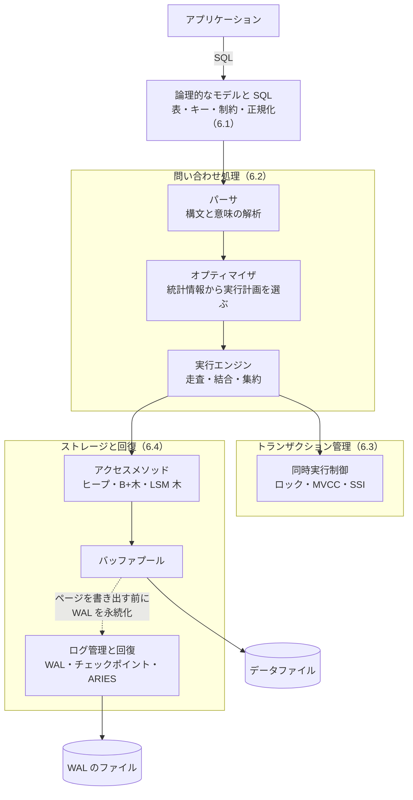
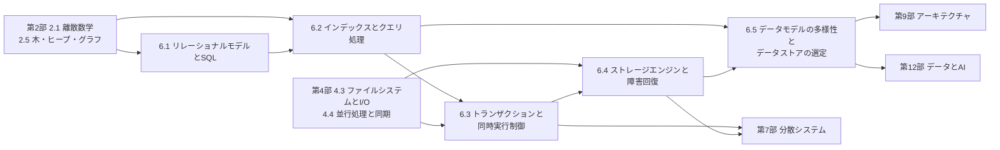

# 第6部 データベース

> アプリケーションのコードは書き直せても、失ったデータは取り戻せません。データベースは、多くのシステムで最も長く使われ続け、最も失ってはならない部分です。この部では、関係モデルと SQL（論理）から始めて、インデックスとクエリ処理（速さ）、トランザクション（同時実行の正しさ）、ストレージエンジンと障害回復（失わないこと）へと DBMS の内部を下りていき、最後にリレーショナル以外のデータモデルとデータストアの選定を学びます。目標は、「なぜこのクエリは遅いのか」「なぜ在庫がマイナスになったのか」「なぜコミットしたはずのデータが消えたのか」「このデータはどこに置くべきか」に、原理から答えられるようになることです。

## この部で身につくこと

- **関係モデルと SQL で考える**: 関係代数と SQL の論理的な評価順序を理解し、結合・集約・ウィンドウ関数・再帰 CTE を使いこなせる。NULL と 3 値論理の罠を避け、関数従属性から正規形を判定し、意図的な非正規化の是非を説明できる。
- **速さを設計する**: ページと I/O のコストモデル、B+木の構造、複合・カバリング・部分インデックスを理解し、EXPLAIN を読んで遅いクエリを直せる。オプティマイザと結合アルゴリズムの仕組みを説明できる。
- **同時実行を正しく扱う**: ロストアップデートや書き込みスキューなどの異常と分離レベルの関係、2 相ロック・MVCC・SSI の仕組みを理解し、条件付き UPDATE・悲観的ロック・楽観的ロック・一意制約・冪等キーで正しいアプリケーションを書ける。
- **データを失わない**: B 木系と LSM 木のストレージエンジン、WAL と fsync、ARIES による障害回復、レプリケーションと PITR を理解し、RPO・RTO に基づくバックアップと復旧の計画を立てて検証できる。
- **用途に合ったデータストアを選ぶ**: ドキュメント・キーバリュー・ワイドカラム・グラフ・時系列・全文検索・ベクトル・列指向の得意と不得意を原理から説明し、アクセスパターンからキーを設計し、選定の根拠を ADR に残せる。

## 章の一覧

| 章 | タイトル | 学習時間 | 主な演習 | キーワード |
|---|---|---|---|---|
| 6.1 | [リレーショナルモデルとSQL](01-relational-model-and-sql/README.md) | 本文 4h ＋ 演習 5h | `relalg.py`（関係代数の演算を実装し、問い合わせを組み立てる）・`sql_practice.py`（SQLite で EC サイトのデータに 8 つの SQL。反結合・NULL の罠・ウィンドウ関数・再帰 CTE ほか）・`normalize.py`（属性閉包・候補キー・BCNF と 3NF の違反の検出・BCNF 分解）、記述: スキーマのレビュー | 関係代数, 論理的な評価順序, 結合, ウィンドウ関数, 再帰 CTE, NULL, 3 値論理, 関数従属性, 正規化, BCNF, SQL アンチパターン, N+1 問題 |
| 6.2 | [インデックスとクエリ処理](02-indexes-and-query-processing/README.md) | 本文 4h ＋ 演習 6h | `bplustree.py`（B+木の検索・挿入・範囲検索。発展: 削除）・`joins.py`（入れ子ループ・ハッシュ・ソートマージ結合とコストの計測）・`index_tuning.py`（SQLite の EXPLAIN QUERY PLAN で検証するインデックス設計と、キーセットページネーション）、記述: 遅いクエリの調査 | ページ, I/O コスト, B+木, クラスタ化インデックス, 複合インデックス, カバリングインデックス, 選択度, オプティマイザ, 統計情報, EXPLAIN, 結合アルゴリズム, キーセットページネーション |
| 6.3 | [トランザクションと同時実行制御](03-transactions/README.md) | 本文 4h ＋ 演習 6h | `mvcc.py`（スナップショット分離の MVCC ストアと VACUUM。発展: SSI）・`lockmgr.py`（S/X ロック・昇格・FIFO の待ち行列・待ちグラフによるデッドロックの検出）・`inventory.py`（SQLite で在庫を引き当てる。条件付き UPDATE・楽観的ロック・冪等性）、記述: 同時実行の対策の選択 | ACID, 分離レベル, ロストアップデート, 書き込みスキュー, スナップショット分離, MVCC, 2 相ロック, デッドロック, SSI, 楽観的ロック, 冪等性 |
| 6.4 | [ストレージエンジンと障害回復](04-storage-and-recovery/README.md) | 本文 4h ＋ 演習 7h | `kvstore.py`（Bitcask 方式の KVS。CRC 付きの追記ログ、起動時の回復、クラッシュに安全なコンパクション）・`lsm.py`（WAL・memtable・SSTable・段ごとのコンパクションによる LSM 木）・`wal_recovery.py`（ARIES の考え方による分析・再実行・取り消しと CLR）、記述: バックアップと復旧の計画のレビュー | バッファプール, B 木系とログ構造系, LSM 木, コンパクション, 書き込み増幅, WAL, fsync, グループコミット, ARIES, チェックポイント, PITR, RPO/RTO |
| 6.5 | [データモデルの多様性とデータストアの選定](05-beyond-relational/README.md) | 本文 4h ＋ 演習 5h | `inverted_index.py`（英語の単語と日本語の文字 bi-gram による転置インデックス、ブール検索、BM25）・`kv_modeling.py`（DynamoDB 風の表と GSI、アクセスパターンからのキー設計）・`columnar.py`（行指向と列指向、RLE と辞書符号化、読むバイト数のモデル、符号化したままの集計）、記述: データストアの選定の ADR | ドキュメント DB, キーバリュー, ワイドカラム, グラフ DB, 時系列 DB, 転置インデックス, BM25, ベクトル検索, OLTP / OLAP, 列指向, NewSQL, ポリグロットパーシステンス |

合計の目安は、本文 約 20 時間、演習 約 29 時間です。コード演習は `python3 tools/check.py 6` でまとめてテストできます（章を指定するなら `python3 tools/check.py 6.3` のように）。

## 学習の進め方

### DBMS の全体像と各章の位置

リレーショナルデータベース管理システム（DBMS）の内部は、おおむね次のような部品でできています。各章は、この図の上から下へ順に対応しています。

- **6.1** は一番上の「論理的なモデルと SQL」です。どう格納されるかを知らなくても、表・キー・制約で正しさを表し、宣言的な問い合わせで欲しいものを書けるのが、DBMS の最大の価値（データ独立性）です。
- **6.2** は問い合わせ処理と、その下のアクセスメソッドの中心である B+木です。同じ SQL でも、実行計画しだいで速さが桁違いに変わる理由を学びます。
- **6.3** はトランザクション管理です。多数の利用者が同時に読み書きしても、一人ずつ順に実行したかのような結果を保つ仕組みと、その代償を学びます。
- **6.4** はストレージと回復です。ページ・バッファプール・WAL が協調して、クラッシュしてもコミットしたデータを失わない仕組みと、レプリケーションやバックアップへの広がりを学びます。
- **6.5** は、この 1 つの DBMS の外側に目を向けます。リレーショナル以外のデータモデル、全文検索と列指向の仕組み、そして複数のデータストアをどう選び、組み合わせるかを学びます。

内部の構造をより詳しく知りたい人には、Hellerstein らの "Architecture of a Database System"（下の推薦図書）が、この図の各部品を実際の DBMS の実装とともに解説しています。

### 章の順序と依存関係

- **6.1 から順に進むのが基本です**。6.1 の SQL はすべての章で使います。6.2 のページと B+木は、6.3（行のロックとインデックス）と 6.4（ページ・バッファプール・B 木系のストレージ）の前提になり、6.3 のトランザクションは、6.4 の「コミットとは何か」「回復で何を取り消すか」の前提になります。6.5 は、6.2 の転置インデックス（GIN）、6.4 の LSM 木と列指向の話の続きです。全体像を早くつかみたい人は、6.1 の後に 6.5 の 1 節（データモデルの全体像）と 8 節（データストアの選定）を先に読んでも構いません。
- **前提**: 集合・関係・論理（[2.1 計算機科学のための離散数学](../02-math-and-algorithms/01-discrete-math/README.md)）は 6.1 の関係代数と 3 値論理に、木の構造（[2.5 木・ヒープ・グラフ](../02-math-and-algorithms/05-trees-heaps-graphs/README.md)）は 6.2 の B+木に、ページキャッシュと fsync（[4.3 ファイルシステムとI/O](../04-operating-systems/03-filesystems-and-io/README.md)）は 6.4 に、ロックとデッドロック（[4.4 並行処理と同期](../04-operating-systems/04-concurrency/README.md)）は 6.3 に直結します。
- **本文の実行例は、実際の出力です**。SQLite（Python の標準ライブラリの `sqlite3`）と PostgreSQL 16 で実行した結果を載せています。PostgreSQL は公式の Docker イメージなどで手元に用意し、6.2 の EXPLAIN、6.3 の 2 つのセッションでの分離レベルの実験、6.4 のクラッシュ回復の観察を、自分でも再現してみてください。実行時間などの数値は、環境によって変わります。

### 演習の特徴

- **すべて Python 3.10 以上の標準ライブラリだけで動きます**。SQL の演習は標準ライブラリの `sqlite3` を使うので、DB サーバーの準備は不要です。
- **演習は 2 種類あります**。1 つは DBMS の部品を小さく作る演習（B+木、結合アルゴリズム、MVCC、ロックマネージャ、Bitcask、LSM 木、ARIES の回復、転置インデックス、列指向の符号化）で、もう 1 つは DB を正しく使う演習（SQL、インデックスの設計、在庫の引き当て、KVS のキーの設計）です。前者で仕組みを知ると、後者の判断の根拠が分かるようになります。
- **同時実行とクラッシュを実際に起こします**。6.3 の `inventory.py` は、スレッドと複数の接続で本当に同時に更新し、6.4 の演習は、ファイルの末尾を切り詰めたり壊したりしてクラッシュ直後の状態を再現します（ファイルの操作は一時ディレクトリの中だけで行います）。
- **発展課題**（6.2 の B+木の削除、6.3 の SSI）は、未実装のまま（`NotImplementedError` を送出するまま）ならテストがスキップされます。

### つまずきやすい点

- **SQL は書いた順には評価されない**: FROM → WHERE → GROUP BY → HAVING → SELECT → ORDER BY という論理的な評価順序で考えると、「WHERE で集約関数や、SELECT で付けた別名が使えない（標準 SQL の場合）」「LEFT JOIN の後の WHERE で、外部結合が実質的に内部結合になる」といった現象を説明できます（6.1）。
- **NULL**: `NOT IN` のサブクエリの結果に NULL が 1 つでも含まれると、結果は空になります。`COUNT(*)` と `COUNT(列)` の違いも含めて、3 値論理で考える習慣をつけましょう（6.1）。
- **インデックスがあっても使われない**: 選択度の低い条件、列にかけた関数、複合インデックスの列の順序、古い統計情報が典型的な原因です。推測せず、EXPLAIN で確かめます（6.2）。
- **分離レベルは名前ではなく実装で考える**: 同じ REPEATABLE READ でも、PostgreSQL と MySQL（InnoDB）では防げる異常が違います。どの異常が起こりうるかを、使っている DBMS とバージョンで確かめます（6.3）。
- **「コミットした」は「絶対に失われない」とは限らない**: 永続性の設定、非同期レプリケーション、ディスクの書き込みキャッシュしだいで、コミット済みのデータを失うことがあります。バックアップは、復元できることを確かめて初めてバックアップです（6.4）。
- **経験者の進め方**: 理解度チェックに答えられる章は、★★★ の演習（6.1 の `normalize.py` の BCNF 分解、`bplustree.py`、`mvcc.py`、`lockmgr.py`、`lsm.py`、`wal_recovery.py`、`inverted_index.py`）だけ解いて先へ進んで構いません。CTO 準備トラックでは、6.3 と 6.5 が必修、6.2 が推奨です。6.1 と 6.4 も、少なくとも「なぜ学ぶのか」「よくある落とし穴」「CTOの視点」と記述演習に取り組んでください（[学習ガイド](../00-guide/README.md)）。特に 6.4 の記述演習（バックアップと復旧の計画のレビュー）は、技術責任者が必ず問われる内容です。

## 到達度チェック

この部を修了したと言えるのは、次のことができるときです。

- [ ] 関係代数の基本演算で問い合わせを表し、SQL の論理的な評価順序に沿って結果を予測できる
- [ ] 結合・集約・ウィンドウ関数・再帰 CTE を使った SQL を書き、LEFT JOIN と WHERE、結合による行の増幅、NOT IN と NULL の罠を避けられる
- [ ] 関数従属性から候補キーを求め、BCNF・3NF の違反を指摘し、分解や意図的な非正規化の判断を説明できる
- [ ] B+木の高さを見積もり、問い合わせに合わせて複合・カバリング・部分インデックスを設計し、その書き込みのコストを説明できる
- [ ] 実行計画（EXPLAIN）を読み、遅いクエリの原因（全件走査、見積もりのずれ、N+1、深い OFFSET など）を特定して直せる
- [ ] 同時実行の異常（ダーティリード・ロストアップデート・書き込みスキューなど）と分離レベルの関係を、主要な DBMS の実際の挙動とともに説明できる
- [ ] 2 相ロック・MVCC・SSI の仕組みと代償を説明し、条件付き UPDATE・悲観的ロック・楽観的ロック・一意制約・冪等キーを使い分けられる
- [ ] B 木系と LSM 木の読み取り・書き込み・容量の増幅のトレードオフを説明し、ワークロードに応じて選べる
- [ ] WAL の規則、fsync とグループコミット、ARIES の回復（分析・再実行・取り消し）を説明し、永続性の設定ごとに、どのデータを失いうるかを言える
- [ ] RPO・RTO からバックアップと PITR の方針を立て、復元の訓練で検証する計画を作れる
- [ ] 主要なデータモデルの得意・不得意を説明し、アクセスパターンから KVS のキーを設計し、データストアの選定を ADR にまとめられる
- [ ] 第6部の演習のテストがすべて通る（`python3 tools/check.py 6`）

## この部の推薦図書・教材

- Andy Pavlo ほか, CMU 15-445/645 "Database Systems" — 講義動画とスライドが無料で公開されている。リレーショナルモデルからストレージ・インデックス・問い合わせ処理・トランザクション・障害回復まで、この部の全体に対応する主教材。
- Martin Kleppmann『データ指向アプリケーションデザイン』（原題 "Designing Data-Intensive Applications"、オライリー・ジャパン）— 初版の第 2 章（データモデル）・第 3 章（ストレージと検索）・第 7 章（トランザクション）が、6.5・6.4・6.3 に対応する。第7部の主教科書でもある。
- Alex Petrov『詳説 データベース』（原題 "Database Internals"、オライリー・ジャパン）第 1 部 — B 木の変種、ファイルとページの構造、トランザクションと回復、LSM 木を、実装の視点で解説している。6.2〜6.4 の副読本に。
- Abraham Silberschatz, Henry F. Korth, S. Sudarshan "Database System Concepts"（McGraw-Hill）— 関係代数、正規化、問い合わせ処理、トランザクション、回復を厳密に扱う定番の教科書。
- Markus Winand "SQL Performance Explained"（Web 版 "Use The Index, Luke!" が無料で読める）— 開発者のためのインデックスの教科書。6.2 の実践の手引きとして。
- Bill Karwin "SQL Antipatterns"（邦訳『SQLアンチパターン』オライリー・ジャパン）— 現場で繰り返される設計の失敗と対策の集大成。
- ミック『達人に学ぶ SQL徹底指南書』（翔泳社）— 3 値論理、CASE 式、ウィンドウ関数など、SQL を集合の言語として使いこなすための日本語の定番書。
- Joseph M. Hellerstein, Michael Stonebraker, James Hamilton "Architecture of a Database System"（Foundations and Trends in Databases, 2007）— DBMS の内部構成（プロセスモデル、問い合わせ処理、ストレージ管理、トランザクション）を、実際の製品の設計とともに概観する解説。

## 次に進む

- [第7部 分散システム](../07-distributed-systems/README.md) は、この部の直接の続きです。6.4 の WAL によるレプリケーションは [7.2 レプリケーションと一貫性](../07-distributed-systems/02-replication-and-consistency/README.md) で、データの分割（シャーディング）は [7.3 パーティショニング](../07-distributed-systems/03-partitioning/README.md) で、複数のノードにまたがるトランザクション（2 相コミット）は [7.4 合意と協調](../07-distributed-systems/04-consensus-and-coordination/README.md) で、CDC と Transactional Outbox は [7.5 メッセージングとイベント駆動](../07-distributed-systems/05-messaging-and-events/README.md) で扱います。
- [第9部 アーキテクチャとシステム設計](../09-architecture/README.md) では、キャッシュとリードレプリカによる拡張（[9.5 スケーラビリティとパフォーマンス](../09-architecture/05-scalability-and-performance/README.md)）や、システム設計のケーススタディ（[9.6](../09-architecture/06-system-design-cases/README.md)）で、6.5 のデータストアの選定を設計の判断として使います。
- [第10部 クラウドとSRE](../10-cloud-and-sre/README.md) では、6.4 の RPO・RTO とバックアップを、信頼性の設計（[10.3 信頼性設計とSLO](../10-cloud-and-sre/03-reliability-engineering/README.md)）と障害対応（[10.5 インシデント対応とポストモーテム](../10-cloud-and-sre/05-incident-management/README.md)）の中に位置づけます。マネージドデータベースの費用は [10.6 クラウドコスト管理（FinOps）](../10-cloud-and-sre/06-finops/README.md) で扱います。
- [第11部 セキュリティ](../11-security/README.md) の [11.4 Webアプリケーションセキュリティ](../11-security/04-web-security/README.md) では、6.1 のプレースホルダの話を SQL インジェクションの対策として、6.3 の同時実行の欠陥を競合状態の攻撃として学び直します。
- [第12部 データとAI](../12-data-and-ai/README.md) では、6.5 の列指向と CDC をデータ基盤の中に位置づけ（[12.1 データ基盤とデータエンジニアリング](../12-data-and-ai/01-data-engineering/README.md)）、ベクトル検索を RAG の部品として使います（[12.4](../12-data-and-ai/04-llm-applications/README.md)）。
