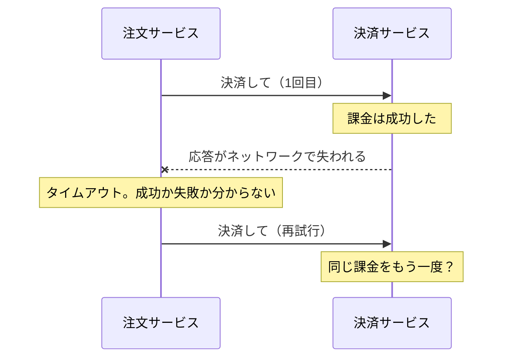
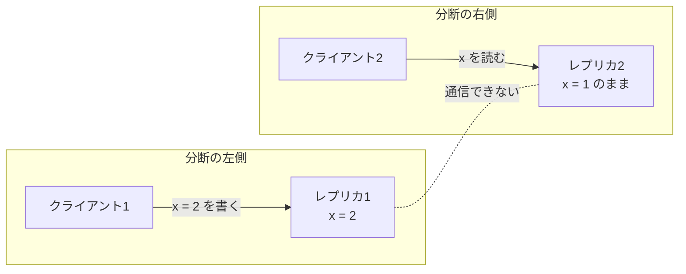

# 7.1 分散システムの本質 — 故障・時間・順序

> 1 台のコンピュータの中では、関数呼び出しは「成功するか、例外を投げるか」のどちらかで、時計は 1 つしかなく、どちらが先に起きたかは明らかでした。ネットワークでつながった複数のコンピュータでは、この 3 つの前提がすべて崩れます。呼び出しは「成功したのか失敗したのか分からない」まま終わり、各マシンの時計は少しずつずれ、「先に起きた」の意味さえ自明ではなくなります。この章では、分散システムを難しくしている本質——部分故障・非同期性・時間の不確かさ——を正確に理解し、それでも正しく動くシステムを作るための基本的な道具を身につけます。

| 項目 | 内容 |
|---|---|
| 学習時間の目安 | 本文 4h ＋ 演習 6h |
| 前提となる章 | [5.2 TCPとUDP](../../05-networking/02-tcp-and-udp/README.md)、[6.3 トランザクションと同時実行制御](../../06-databases/03-transactions/README.md)（[4.4 並行処理と同期](../../04-operating-systems/04-concurrency/README.md) も読んでいると理解が深まる） |
| 演習 | [exercises/](exercises/)（Python） |
| キーワード | 部分故障, 分散コンピューティングの誤謬, 故障モデル, 部分同期, タイムアウト, φ accrual, NTP, 単調時計, うるう秒, Lamport 時計, ベクトル時計, 冪等性, エンドツーエンド原理, FLP, CAP, PACELC, 決定的シミュレーションテスト |

## この章のゴール

- [ ] システムを分散させる理由と「分散コンピューティングの誤謬」を挙げ、部分故障が単一マシンの故障とどう違うかを説明できる
- [ ] 故障モデルとタイミングモデルを区別し、タイムアウトによる故障検出の限界と φ accrual 故障検出器の考え方を説明・実装できる
- [ ] 壁時計と単調時計の違い、クロックのずれ・NTP・うるう秒の影響を説明し、時刻に依存した危険な設計を指摘できる
- [ ] Lamport 時計とベクトル時計を実装し、イベントの因果関係と並行性を判定できる
- [ ] 配信保証（at-most-once / at-least-once）と冪等性を組み合わせて「実質 1 回」の処理を実装できる
- [ ] FLP 不可能性・CAP 定理・PACELC を正確に述べ、よくある誤解を正せる
- [ ] 分散システムのテスト手法（障害注入・Jepsen・決定的シミュレーション）を目的に応じて選べる

## なぜ学ぶのか

分散システムの障害は、ほとんどが「1 台のコンピュータの感覚」を持ち込んだことから始まります。公開された事後分析から、いくつか例を挙げます。

- **時刻は巻き戻る**: 2017 年 1 月 1 日（UTC）のうるう秒の瞬間、Cloudflare の DNS サービスの一部でエラーが発生しました。Cloudflare の事後分析（"How and why the leap second affected Cloudflare DNS"）によると、原因は Go で書かれた DNS サーバーのコードが「時刻は巻き戻らない」と暗黙に仮定していたことでした。うるう秒の処理で 2 つの時刻の差が負の値になり、それを想定していなかった処理が失敗したのです。
- **再試行は障害を増幅する**: 2021 年 12 月の AWS バージニア北部リージョン（us-east-1）の大規模障害について、AWS の公開サマリーは次のように説明しています。あるサービスの容量を自動で拡張する処理をきっかけに、内部ネットワークにある大量のクライアントからの接続が急増し、内部ネットワークと AWS のメインのネットワークをつなぐ機器が過負荷になった。遅延とエラーが増えたことでさらに接続の試行と再試行が増え、しかもクライアントのバックオフ（再試行の間隔を空ける仕組み）が潜在的な不具合で十分に働かなかったため、混雑が長引いた。タイムアウトと再試行という「正しそうな」仕組みが、条件がそろうと障害を増幅するのです。
- **わずかな分断が長い障害になる**: 2018 年 10 月、GitHub ではネットワーク機器の交換作業に伴う 43 秒間の接続断をきっかけにデータベースの自動フェイルオーバーが走り、結果として 24 時間 11 分にわたってサービスが劣化しました（GitHub の事後分析 "October 21 post-incident analysis"）。詳しくは [7.2 レプリケーションと一貫性](../02-replication-and-consistency/README.md) で扱います。
- **ネットワークは実際に壊れる**: Peter Bailis と Kyle Kingsbury は論文 "The Network is Reliable"（ACM Queue, 2014）で、大手クラウドやデータセンターで実際に起きたネットワーク分断の事例を多数集め、分断が決してまれな事故ではないことを示しました。

この章の内容は、次の 7.2〜7.5 章（レプリケーション・パーティショニング・合意・メッセージング）すべての土台です。また、設計レビューで「このリトライは安全か」「この時刻は信用してよいか」を見抜く力は、テックリードや CTO にとって最も費用対効果の高い技術的直感の一つです。

## 1. なぜ分散するのか、なぜ難しいのか

### 1.1 分散させる 4 つの理由

分散システム（distributed system）とは、ネットワークでつながった複数のコンピュータ（ノード）が、メッセージをやり取りしながら 1 つのシステムとして動くものです。わざわざ難しい分散を選ぶ理由は、主に次の 4 つです。

| 理由 | 説明 | 例 |
|---|---|---|
| スケーラビリティ | 1 台に収まらないデータ量・処理量を扱う | 数百 TB のデータ、毎秒数十万件の書き込み |
| 可用性・耐障害性 | 1 台が壊れてもサービスを続ける | データベースの待機系、複数のアベイラビリティゾーン |
| レイテンシ | 利用者の近くにデータと処理を置く | CDN、複数リージョンへの配置 |
| データの所在地（data residency） | 法令や契約で、データを保存・処理してよい地域が決まる | 国外への個人データの移転を規律する法令（EU の GDPR、日本の個人情報保護法など）や顧客との契約に合わせ、特定の地域・国内リージョンで保管する |

データの所在地は技術ではなく法務の要件ですが、システムの構成を大きく左右します。どの国・地域に置けばよいかの具体的な判断は、専門家に確認してください。

レイテンシについては、物理法則が下限を決めます。光ファイバーの中の光は真空中の約 2/3、およそ 20 万 km/秒（200 km/ミリ秒）で進みます。東京から各地までの距離と、往復にかかる時間の **理論上の下限** を計算してみましょう。

```python
import math

def distance_km(a, b):
    """2 地点間の大円距離（km）。球面上の最短距離（haversine の公式）。"""
    (lat1, lon1), (lat2, lon2) = [(math.radians(x), math.radians(y)) for x, y in (a, b)]
    h = math.sin((lat2 - lat1) / 2) ** 2 + math.cos(lat1) * math.cos(lat2) * math.sin((lon2 - lon1) / 2) ** 2
    return 2 * 6371 * math.asin(math.sqrt(h))

FIBER_KM_PER_MS = 200  # 光ファイバー中の光速 ≈ 20 万 km/秒 = 200 km/ミリ秒
tokyo = (35.68, 139.69)
cities = {"大阪": (34.69, 135.50), "シンガポール": (1.35, 103.82),
          "米国西海岸（ロサンゼルス）": (34.05, -118.24), "米国東部（バージニア州北部）": (39.04, -77.49),
          "フランクフルト": (50.11, 8.68)}
for name, pos in cities.items():
    d = distance_km(tokyo, pos)
    print(f"東京–{name}: {d:6.0f} km  往復の下限 {2 * d / FIBER_KM_PER_MS:5.1f} ms")
```

```text
東京–大阪:    396 km  往復の下限   4.0 ms
東京–シンガポール:   5314 km  往復の下限  53.1 ms
東京–米国西海岸（ロサンゼルス）:   8817 km  往復の下限  88.2 ms
東京–米国東部（バージニア州北部）:  10872 km  往復の下限 108.7 ms
東京–フランクフルト:   9333 km  往復の下限  93.3 ms
```

実際のケーブルは直線ではなく、ルーターでの処理も加わるので、実測の往復時間はこの下限よりかなり大きくなります。それでも「東京と米国東部の間で同期的に合意をとると、1 回の書き込みに 100 ms 以上かかる」ことは、どんなに優れたソフトウェアでも避けられません。この数字は、7.2 章で一貫性の代償を、7.4 章で合意の代償を考えるときの基準になります。

### 1.2 分散コンピューティングの誤謬

「**分散コンピューティングの誤謬**（fallacies of distributed computing）」は、ネットワーク越しのシステムを初めて作る人が無意識に置いてしまう 8 つの誤った前提です。Sun Microsystems で生まれたリストで、1994 年ごろに L. Peter Deutsch が 7 つにまとめ、1997 年ごろに James Gosling が 8 つ目（ネットワークは均質）を加えたとされています。

| 誤った前提 | 現実 | 設計上の対策 |
|---|---|---|
| 1. ネットワークは信頼できる | パケットは失われ、重複し、順序が入れ替わる。接続は突然切れる | タイムアウト、再試行、冪等性（6 節） |
| 2. レイテンシはゼロ | 同じデータセンター内でも往復にミリ秒未満〜数ミリ秒、大陸間では 100 ms 以上 | 往復回数を減らす、まとめて送る、近くに置く |
| 3. 帯域幅は無限 | 大きなデータの転送は時間とお金がかかる | 圧縮、差分転送、データを動かさず処理を動かす |
| 4. ネットワークは安全 | 盗聴・改ざん・なりすましがありうる | 暗号化と認証（[11.2 暗号技術の基礎](../../11-security/02-cryptography/README.md)） |
| 5. トポロジは変わらない | ノードの追加・削除・移動、IP アドレスの変化は日常 | サービスディスカバリ、名前での参照 |
| 6. 管理者は 1 人 | 複数のチーム・組織・クラウド事業者が関わる | 変更の調整、観測と権限の設計 |
| 7. 転送コストはゼロ | シリアライズの CPU 時間、クラウドのデータ転送料金 | データの配置とコストの見積もり（[10.6 FinOps](../../10-cloud-and-sre/06-finops/README.md)） |
| 8. ネットワークは均質 | 機器・OS・プロトコルの版はばらばら | 標準プロトコル、互換性の維持 |

どれも当たり前に見えますが、実際のバグは「関数呼び出しと同じ感覚でネットワーク呼び出しを書いた」ところから生まれます。例えばループの中でリモート呼び出しを 1,000 回行うコードは、ローカルなら一瞬でも、往復 1 ms なら 1 秒、リージョンをまたげば 100 秒かかります。

### 1.3 部分故障 — 分散システムの本質

1 台のコンピュータは、ハードウェアに問題が起きると、たいてい中途半端に動き続けるのではなく **全体として止まる** ように作られています（カーネルパニックなど）。ソフトウェアから見ると「動いているか、止まっているか」のどちらかで、決定的です。

分散システムでは、**一部だけが壊れ、残りは動き続ける**ことが普通に起きます。これを **部分故障**（partial failure）と呼びます。しかも厄介なことに、どの部分が壊れたのかを、他のノードは確実には知ることができません。

台数が増えると、どこかが壊れていることが「常態」になります。仮に 1 台のマシンがある日に故障する確率を 0.1% とすると、次のようになります。

```python
p = 0.001  # 仮定: 1 台のマシンがある日に故障する確率 0.1%
for n in (1, 10, 100, 1000, 10000):
    print(f"{n:>5} 台: その日に少なくとも 1 台が故障する確率 {1 - (1 - p) ** n:6.1%}")
```

```text
    1 台: その日に少なくとも 1 台が故障する確率   0.1%
   10 台: その日に少なくとも 1 台が故障する確率   1.0%
  100 台: その日に少なくとも 1 台が故障する確率   9.5%
 1000 台: その日に少なくとも 1 台が故障する確率  63.2%
10000 台: その日に少なくとも 1 台が故障する確率 100.0%
```

1 万台規模ではほぼ確実に毎日どこかが壊れています。だから大規模システムは「壊れないように作る」のではなく「**壊れることを前提に、壊れても正しく動くように作る**」必要があります。

部分故障の最も身近な形が、リモート呼び出しのタイムアウトです。注文サービスが決済サービスを呼び出して、応答が返ってこなかったとします。



注文サービスから見ると、タイムアウトの原因は少なくとも次の 4 通りがありえて、**区別する方法がありません**。

1. リクエストが途中で失われた（決済は行われていない）
2. 決済サービスが停止していた（決済は行われていない）
3. 決済サービスは処理中で、まだ終わっていない（これから行われるかもしれない）
4. 決済は成功したが、応答が失われた（決済は行われた）

ローカルな関数呼び出しには「成功」と「失敗」しかありませんが、リモート呼び出しには **「分からない」という第 3 の結果** があるのです。この「分からない」をどう扱うかが、分散システムの設計の中心的な課題です。単純に再試行すると 4 の場合に二重課金になり、再試行しないと 1〜2 の場合に注文が失われます。答えは 6 節の冪等性にあります。

## 2. 故障モデルとタイミングモデル

分散アルゴリズムを議論するときは、「どんな故障が起きうるか」「時間についてどんな仮定を置くか」を明示します。前提が違えば、可能なことも不可能なことも変わるからです。

### 2.1 故障モデル

| 故障モデル | 振る舞い | 実務での位置づけ |
|---|---|---|
| クラッシュ停止（crash-stop） | 停止したら二度と戻らない | 理論の出発点。実務では「ディスクごと失われて交換されるノード」に相当 |
| クラッシュ回復（crash-recovery） | 停止した後、再起動して戻ってくる。メモリの内容は失うが、ディスクに永続化したものは残る | **実務の標準的な前提**。何を、いつ、fsync してから応答するかが正しさを左右する |
| 欠落（omission） | メッセージの送信や受信を取りこぼす | パケットロス、キューのあふれ、タイムアウトで捨てられた要求 |
| ビザンチン（Byzantine, 任意故障） | 任意の振る舞い。嘘をつく、相手によって矛盾したことを言う | 悪意のある参加者がいる環境（ブロックチェーンなど）。7.4 章で扱う |

実務では、多くのシステムが「クラッシュ回復 ＋ 欠落」を前提にし、ビザンチン故障は想定しません。ただし、メモリのビット反転、ディスクの静かなデータ破損、ソフトウェアのバグは、ビザンチン故障に近い症状（誤った値を正しそうに返す）を起こします。チェックサムや入力検証は、こうした「想定外の嘘」への安価な保険です。

もう一つ知っておきたいのが **グレー障害**（gray failure）です。Microsoft Research の論文 "Gray Failure: The Achilles' Heel of Cloud-Scale Systems"（HotOS 2017）は、ノード自身のヘルスチェックには「正常」と答えるのに、利用者から見ると一部の処理だけが極端に遅い・失敗する、という状態がクラウドの大規模障害の原因になっていると指摘しました。「完全に止まる」故障は検出しやすいのに対し、「遅い」「一部だけ壊れる」故障は検出も切り分けも難しいのです。

### 2.2 タイミングモデル

| タイミングモデル | 仮定 | 意味 |
|---|---|---|
| 同期（synchronous） | メッセージの遅延、処理時間、時計のずれに **既知の上限** がある | タイムアウトで確実に故障を検出できる。現実のネットワークでは成り立たない |
| 非同期（asynchronous） | 上限が **一切ない** | 遅いだけのノードと停止したノードを原理的に区別できない |
| 部分同期（partially synchronous） | 上限は存在するが未知、または「ほとんどの時間は上限内だが、ときどき上限を超える」 | **現実のシステムに最も近い**。多くの合意アルゴリズムはこのモデルで設計される |

部分同期モデルは Dwork・Lynch・Stockmeyer の論文（1988 年）で定式化されました。考え方は「ネットワークはたいてい行儀よく動くが、ときどき（任意の長さだけ）行儀が悪くなる。行儀が悪い間も **安全性**（間違った答えを出さない）は守り、行儀が良くなったら **活性**（いずれ答えが出る）を回復する」というものです。7.4 章の Raft はまさにこの方針で設計されています。

### 2.3 プロセスは気づかないうちに止まる

非同期性はネットワークだけの問題ではありません。ノードの **プロセス自体が、任意の長さだけ一時停止する** ことがあります。

- ガベージコレクションの「世界の停止（stop-the-world）」。ヒープが大きいと数秒に及ぶこともある
- 仮想マシンのライブマイグレーションや、ハイパーバイザーによる CPU の割り当て待ち
- メモリ不足によるスワップ、同期的なディスク I/O の待ち
- 運用者の操作（`SIGSTOP`）やラップトップのスリープ

重要なのは、止まっていた本人は **止まっていたことに気づかない** という点です。一時停止から戻ったスレッドは、何事もなかったかのように次の命令を実行します。「リースの有効期限を確認した直後に 10 秒止まり、期限切れのリースを持ったまま書き込む」といったバグは、この性質から生まれます（対策は 7.4 章のフェンシングトークン）。

## 3. タイムアウトと故障検出

### 3.1 遅いのか、死んだのか

非同期なネットワークでは、相手からの応答がないとき、相手が停止したのか、遅いだけなのか、ネットワークが混んでいるのかを区別できません。それでも何かを決めなければならないので、実務では **タイムアウト**（timeout）で「故障の疑いあり」と判断します。これは **推測** であって、事実の確認ではありません。

タイムアウトの長さは、常にトレードオフです。

| | タイムアウトが短い | タイムアウトが長い |
|---|---|---|
| 本当の故障 | すぐに検出して切り替えられる | 検出が遅れ、その間の要求が待たされる |
| 一時的な遅延 | **生きているノードを死んだと誤判定する** | 誤判定しにくい |
| 誤判定の代償 | 不要なフェイルオーバー、処理の二重実行、負荷の偏りによる連鎖障害 | — |

誤判定の代償は見かけより大きくなりがちです。負荷が高くて遅くなったノードを「死んだ」と判定して外すと、残りのノードの負荷がさらに上がって遅くなり、次々と外される——という連鎖が起きます。「なぜ学ぶのか」で挙げた AWS の例のように、再試行が混雑をさらに悪化させることもあります。再試行には指数バックオフとジッター（ランダムなゆらぎ）を入れ、全体の再試行量に上限（リトライバジェット）を設けるのが定石です（[7.5 メッセージングとイベント駆動](../05-messaging-and-events/README.md)、[10.3 信頼性設計とSLO](../../10-cloud-and-sre/03-reliability-engineering/README.md)）。

### 3.2 タイムアウトの決め方

もしネットワークの片道遅延の上限が d、処理時間の上限が r と分かっていれば、`2d + r` 待って応答がなければ故障と断定できます。しかし現実には上限がないので、次のように決めます。

- **実測の分布から決める**: 応答時間の p99 や p99.9 を測り、それに余裕を加える。平均値で決めてはいけない（分布の裾が長い）。
- **適応的に変える**: TCP の再送タイムアウトは、往復時間の平滑化した平均と変動幅から動的に計算されます（RFC 6298。[5.2 TCPとUDP](../../05-networking/02-tcp-and-udp/README.md)）。アプリケーションの故障検出も、同じ発想で観測に合わせて調整できます。
- **目的ごとに分ける**: 「この 1 回の要求を諦める」ためのタイムアウトと、「このノードをクラスタから外す」ための判定は、影響の大きさが違うので別々に決める。

### 3.3 φ accrual 故障検出器

多くのシステムは、各ノードが定期的に **ハートビート**（heartbeat, 「生きています」という通知）を送り、一定時間途絶えたら故障とみなします。固定のタイムアウトの問題は、ノードごと・時間帯ごとに異なるハートビートのリズムに合わせられないことです。

Hayashibara らが 2004 年に提案した **φ accrual 故障検出器**（phi accrual failure detector）は、「生きているか死んでいるか」の 2 値ではなく、**疑いの強さ φ** を連続値で出力します。

1. 直近のハートビートの到着間隔を記録し、その平均 μ と標準偏差 σ を求める
2. 最後のハートビートから t 秒たったとき、「間隔が正規分布に従うなら、次のハートビートが t より後に来る確率」P_later(t) を計算する
3. φ = −log₁₀ P_later(t) とする

φ = 1 は「いま故障と判断したら 10% の確率で誤り」、φ = 2 は 1%、φ = 3 は 0.1% を意味します。アプリケーションは用途に応じて閾値を選びます（Cassandra の既定の閾値 `phi_convict_threshold` は 8）。同じ沈黙時間でも、ハートビートのリズムによって φ がどれだけ違うかを見てみましょう。

```python
import math

def phi(elapsed, mean, std):
    p_later = 0.5 * math.erfc((elapsed - mean) / (std * math.sqrt(2)))
    return -math.log10(p_later) if p_later > 0 else math.inf

print("沈黙時間  φ(平均1.0秒, σ=0.2)  φ(平均5.0秒, σ=1.0)")
for t in (1.0, 1.5, 2.0, 3.0, 5.0, 8.0):
    print(f"{t:6.1f} 秒  {phi(t, 1.0, 0.2):12.2f}  {phi(t, 5.0, 1.0):18.2f}")
```

```text
沈黙時間  φ(平均1.0秒, σ=0.2)  φ(平均5.0秒, σ=1.0)
   1.0 秒          0.30                0.00
   1.5 秒          2.21                0.00
   2.0 秒          6.54                0.00
   3.0 秒         23.12                0.01
   5.0 秒         88.56                0.30
   8.0 秒        267.95                2.87
```

閾値を 8 とすると、1 秒ごとに規則正しく届くノードは 2〜3 秒の沈黙で疑われますが、5 秒ごとにゆらぎながら届くノードは 8 秒たっても疑われません。ネットワークが混んでハートビートの間隔がばらつき始めると σ が大きくなり、検出器は自動的に「慎重」になります。演習 7 で、この検出器を実装します。

## 4. 物理時計

### 4.1 壁時計と単調時計

コンピュータには、性質の異なる 2 種類の時計があります。

| | 壁時計（wall clock, time-of-day clock） | 単調時計（monotonic clock） |
|---|---|---|
| 返す値 | 暦の日時（UNIX 時間など） | ある起点からの経過時間（起点に意味はない） |
| Python | `time.time()` | `time.monotonic()`、`time.perf_counter()` |
| Linux | `CLOCK_REALTIME` | `CLOCK_MONOTONIC` |
| NTP による補正 | **飛ぶ（前にも後ろにも）** | 進む速さは微調整されうるが、飛ばない・戻らない |
| 用途 | ログの日時、利用者に見せる時刻、証明書の有効期限 | **経過時間・タイムアウトの計測**、レート制限 |
| 他のマシンとの比較 | （ずれを承知の上で）おおよそ可能 | 不可能（起点がマシンごとに違う） |

Python では、時計の性質を確かめられます（出力は Linux の例。OS によって異なります）。

```python
import time
for name in ("time", "monotonic"):
    info = time.get_clock_info(name)
    print(f"{name:9s} adjustable={info.adjustable!s:5s} implementation={info.implementation}")
```

```text
time      adjustable=True  implementation=clock_gettime(CLOCK_REALTIME)
monotonic adjustable=False implementation=clock_gettime(CLOCK_MONOTONIC)
```

鉄則は、**経過時間は必ず単調時計で測る** ことです。`time.time()` の差で処理時間やタイムアウトを測ると、NTP が時計を戻した瞬間に「経過時間が負」や「一瞬でタイムアウト」が起きます。冒頭の Cloudflare の事故は、まさにこのパターンでした。Go はその後の 1.9（2017 年）で、時刻の値に単調時計の読みを内部的に持たせ、差を取ると単調時計が使われるように変更しています。

### 4.2 ずれ（スキュー）とドリフト、NTP

各マシンの時計は水晶発振子で時を刻みますが、発振の速さは個体差や温度で少しずつ異なります。ある瞬間の 2 つの時計の差を **スキュー**（clock skew）、進む速さのずれを **ドリフト**（clock drift）と呼び、ドリフトは ppm（100 万分の 1）で表します。Google は Spanner の論文（OSDI 2012）で、サーバーの時計のドリフトを最悪 200 ppm（1 秒あたり 200 マイクロ秒）と見積もっています。

```python
drift_ppm = 200                      # 1 秒あたり 200 マイクロ秒ずれうる（Spanner の論文が置いた上限）
for interval_s in (30, 3600, 86400):  # 同期の間隔: 30 秒、1 時間、1 日
    print(f"{interval_s:>6} 秒ごとに同期 → 最大 {drift_ppm * 1e-6 * interval_s * 1000:8.1f} ms ずれうる")
```

```text
    30 秒ごとに同期 → 最大      6.0 ms ずれうる
  3600 秒ごとに同期 → 最大    720.0 ms ずれうる
 86400 秒ごとに同期 → 最大  17280.0 ms ずれうる
```

そこで **NTP**（Network Time Protocol）で、定期的に時刻サーバーと同期します。NTP のクライアントは 4 つのタイムスタンプから、往復遅延と時計のずれ（オフセット）を推定します。

```python
# NTP の 4 つのタイムスタンプ（秒）。t0: クライアント送信、t1: サーバ受信、t2: サーバ送信、t3: クライアント受信
# t0, t3 はクライアントの時計、t1, t2 はサーバの時計で測った値
t0, t1, t2, t3 = 100.000, 100.130, 100.131, 100.061
delay = (t3 - t0) - (t2 - t1)          # 往復のネットワーク遅延（サーバ内の処理時間を除く）
offset = ((t1 - t0) + (t2 - t3)) / 2   # クライアントの時計の遅れ（行き帰りの遅延が等しいと仮定）
print(f"往復遅延 δ = {delay * 1000:.0f} ms, 推定オフセット θ = {offset * 1000:+.0f} ms")
```

```text
往復遅延 δ = 60 ms, 推定オフセット θ = +100 ms
```

この計算は「行きと帰りの遅延が等しい」と仮定しているので、経路が非対称だと最大で往復遅延の半分（この例では 30 ms）の誤差が残ります。インターネット越しの NTP では数ミリ秒〜数十ミリ秒の誤差は珍しくなく、ネットワークが混めばさらに悪化します。データセンター内では PTP（Precision Time Protocol, IEEE 1588）とハードウェアの支援で、はるかに高い精度を得る方法もあります（クラウド各社の時刻同期サービスの精度は、2026 年時点の各社の資料で確認してください）。

NTP デーモンは、小さなずれは時計の進む速さを少し変えて徐々に修正（**スルー**, slew）し、大きなずれは一気に修正（**ステップ**, step）します（ntpd の既定では 128 ms を超えると一気に修正）。ステップが起きると、壁時計は前にも後ろにも飛びます。時計の同期が壊れていても、多くのシステムは **何のエラーも出さずに** 動き続けることにも注意してください。時計のずれは監視しない限り気づけません。

### 4.3 うるう秒 — 時刻が巻き戻る日

地球の自転はわずかに不規則なので、原子時計に基づく UTC と天文学的な時刻のずれを調整するため、**うるう秒**（leap second）が挿入されてきました。UTC の 6 月 30 日または 12 月 31 日の最後に `23:59:60` という 61 秒目が入ります（日本時間では 7 月 1 日または 1 月 1 日の午前 8 時 59 分 60 秒）。1972 年以降に挿入されたうるう秒は 27 回で、最後は 2016 年 12 月 31 日です。

UNIX 時間は「1 日 = 86,400 秒」と定義されていて 61 秒目を表せないため、多くのシステムではうるう秒の瞬間に **同じ秒を 2 回繰り返す**（時計が 1 秒戻る）ことになります。これが「時刻の差が負になる」バグの原因です。2012 年 6 月のうるう秒では、Linux カーネルの不具合を引き金に、Java のアプリケーションや MySQL の CPU 使用率が急上昇する問題が多くのサービスで起きたと広く報道されました。

対策として、Google などは **リープスメア**（leap smear）を採用しています。Google の公開 NTP サービスは、うるう秒を中心とする 24 時間（前日の正午から翌日の正午まで、UTC）にわたって時計をごくわずかにゆっくり進め、1 秒を少しずつ吸収します。時計が戻らないので上のようなバグは起きませんが、スメア中の時刻は UTC と最大 0.5 秒ずれ、**スメアするサーバーとしないサーバーを混ぜて使うと大きく狂う** ので、組織内で方式を統一する必要があります。

なお、2022 年の国際度量衡総会（CGPM）は、遅くとも 2035 年までにうるう秒の運用を（少なくとも当面）やめる方向の決議を採択しました。とはいえ「時計は飛ぶ・戻る」という教訓は、NTP のステップや手作業の時刻設定、仮想マシンの復元などでも同じように当てはまります。

### 4.4 時刻の不確かさを明示する — Spanner の TrueTime

時刻が不確かなら、その不確かさを明示的に扱えばよい、という発想で作られたのが Google Spanner の **TrueTime** です。TrueTime API は「現在時刻」を 1 つの値ではなく、区間 `[earliest, latest]` で返します。真の時刻がこの区間のどこかにあることを保証するため、Google はデータセンターに GPS 受信機と原子時計を置いて時刻の誤差 ε を小さく抑えています（論文では ε は多くの場合 1〜7 ms 程度と報告されています）。

Spanner はトランザクションのコミット時に、割り当てたタイムスタンプが確実に過去になるまで（区間の幅に相当する時間だけ）待つ **コミット待ち**（commit wait）を行います。こうすると、あるトランザクションの完了後に始まったトランザクションは、必ずより大きなタイムスタンプを持つことが保証されます。ε が小さいほど待ち時間が短くなるので、Google は時刻のインフラに投資したわけです。「正確な時計はお金で買える性能」だという点は覚えておく価値があります。

## 5. 論理時計 — 因果関係で順序を決める

### 5.1 happened-before 関係

時計が信用できないなら、イベントの順序をどう決めればよいでしょうか。Leslie Lamport は論文 "Time, Clocks, and the Ordering of Events in a Distributed System"（1978）で、物理的な時刻ではなく **因果関係** に基づく順序を提案しました。イベント a が b より「前に起きた」（a → b, happened-before）とは、次のいずれかが成り立つことです。

1. a と b が同じノードのイベントで、a が先に起きた
2. a がメッセージの送信で、b がそのメッセージの受信
3. a → c かつ c → b となる c がある（推移律）

a → b でも b → a でもないとき、a と b は **並行**（concurrent, a ∥ b）であるといいます。並行とは「同時刻」という意味ではなく、「**互いに相手のことを知りえなかった**」という意味です。例えば次のトレースを考えます（演習のテストでも使います）。

```text
ノード A: a1 → a2（m1 を B へ送信） → a3（m3 を受信） → a4
ノード B: b1 → b2（m1 を受信） → b3（m2 を C へ送信）
ノード C: c1 → c2（m3 を A へ送信） → c3（m2 を受信）
```

a2 → b2（m1 の送受信）、b2 → b3（同じノード）なので a2 → b3 です。一方、a3 と b3 はどちらも相手の存在を知りえないので並行です。

### 5.2 Lamport 時計

**Lamport 時計**（Lamport clock）は、各ノードが持つ整数のカウンタで、次の規則で更新します。

1. イベント（ローカル処理・送信）の前に、カウンタを 1 進める
2. 送信するメッセージに、カウンタの値を添える
3. 受信したら、カウンタを `max(自分の値, メッセージの値) + 1` にする

この規則により、**a → b ならば L(a) < L(b)** が必ず成り立ちます。さらに、同じ値のときはノード名で順序を決めれば、すべてのイベントに因果関係と矛盾しない **全順序** が付きます。この全順序は、分散した相互排除や、全ノードで同じ順序で操作を適用する仕組み（7.4 章の複製状態機械）の基礎になりました。

ただし、**逆は成り立ちません**。L(a) < L(b) でも、a → b とは限らず、並行かもしれないのです。Lamport 時計だけでは「本当に後なのか、たまたま数字が大きいだけなのか」を区別できません。

### 5.3 ベクトル時計

並行性を検出できるようにしたのが **ベクトル時計**（vector clock）です（1988 年前後に Colin Fidge と Friedemann Mattern が独立に提案）。各ノードは「ノードごとのカウンタ」の組を持ちます。

1. イベントの前に、自分の要素を 1 進める
2. 送信するメッセージに、ベクトル全体を添える
3. 受信したら、要素ごとに最大値をとって（merge）から、自分の要素を 1 進める

2 つのベクトル V と W は、すべての要素で V ≤ W（かつ V ≠ W）なら「V が前」（V → W）、すべての要素で V ≥ W（かつ V ≠ W）なら「V が後」、どちらでもなければ **並行** です。そして、**a → b ⇔ V(a) < V(b)** が両方向に成り立ちます。上のトレースで計算してみましょう（演習 1〜3 を解くと、このように動きます）。

```python
from clocks import Event, lamport_timestamps, vector_timestamps, concurrent_pairs

trace = [
    Event("a1", "A"), Event("a2", "A", "send", "m1"),
    Event("b1", "B"), Event("b2", "B", "recv", "m1"), Event("b3", "B", "send", "m2"),
    Event("c1", "C"), Event("c2", "C", "send", "m3"),
    Event("a3", "A", "recv", "m3"), Event("c3", "C", "recv", "m2"), Event("a4", "A"),
]
lam, vec = lamport_timestamps(trace), vector_timestamps(trace)
for ev in trace:
    print(f"{ev.name}: L={lam[ev.name]}  V={vec[ev.name].to_dict()}")
print(vec["b1"].compare(vec["a2"]), vec["a2"].compare(vec["c3"]))
print(concurrent_pairs(trace, ["a3", "b3", "c3"]))
```

```text
a1: L=1  V={'A': 1}
a2: L=2  V={'A': 2}
b1: L=1  V={'B': 1}
b2: L=3  V={'A': 2, 'B': 2}
b3: L=4  V={'A': 2, 'B': 3}
c1: L=1  V={'C': 1}
c2: L=2  V={'C': 2}
a3: L=3  V={'A': 3, 'C': 2}
c3: L=5  V={'A': 2, 'B': 3, 'C': 3}
a4: L=4  V={'A': 4, 'C': 2}
Ordering.CONCURRENT Ordering.BEFORE
[('b3', 'a3'), ('a3', 'c3')]
```

b1（L=1）と a2（L=2）は Lamport 時刻では b1 が小さいのに、ベクトル時計では並行と判定されています。これが Lamport 時計の限界と、ベクトル時計の価値です。

ベクトル時計（データのバージョン管理に使うときは **バージョンベクトル**, version vector と呼ぶことが多い）は、Amazon の Dynamo（2007）などで「2 つの書き込みが並行だったか＝競合したか」を検出するのに使われました。並行な書き込みは、どちらかで上書きするとデータが失われるので、両方を残してアプリケーションに解決させる必要があります（[7.2 レプリケーションと一貫性](../02-replication-and-consistency/README.md)）。代償は、ベクトルの大きさがノード（または書き込み元）の数に比例することです。

### 5.4 ハイブリッド論理時計

論理時計は因果関係を正しく扱えますが、値が実際の時刻と無関係なので「昨日の 15 時時点のデータ」のような問い合わせに使えません。物理時計は時刻と対応しますが、因果関係を保証できません。両者を組み合わせたのが **ハイブリッド論理時計**（HLC, Hybrid Logical Clock, Kulkarni ら 2014）です。HLC のタイムスタンプは (物理時刻の成分, 論理カウンタ) の組で、物理時刻にほぼ近い値を保ちながら、Lamport 時計と同じく a → b なら HLC(a) < HLC(b) を保証します。CockroachDB などの分散データベースが、トランザクションの順序付けに HLC を使っています。

| 時計 | 因果関係 a → b ⇒ 時刻が小さい | 並行性の検出 | 実時刻との対応 | 大きさ |
|---|---|---|---|---|
| 物理時計（NTP） | 保証しない（ずれ次第） | できない | あり（誤差付き） | 固定 |
| Lamport 時計 | 保証する | できない | なし | 固定 |
| ベクトル時計 | 保証する（逆も成り立つ） | **できる** | なし | ノード数に比例 |
| HLC | 保証する | できない | あり（誤差付き） | 固定 |
| TrueTime | 誤差区間とコミット待ちで保証 | — | あり（誤差の上限付き） | 固定（専用インフラが必要） |

## 6. メッセージの配信保証と冪等性

### 6.1 2 人の将軍問題

古典的な思考実験から始めます。谷を挟んだ 2 つの丘に将軍がいて、同時に攻撃すれば勝てますが、片方だけなら負けます。伝令は谷を通りますが、捕まるかもしれません。A が「明朝攻撃」と送っても、届いたか分からないので A は攻撃できません。B が「了解」と返しても、その返事が届いたか B には分からないので B も攻撃できません。確認の確認、確認の確認の確認……と、何往復しても **最後のメッセージが届いたかどうかを送り手が知る方法はない** ため、失われうる通信路の上で「確実な合意」は作れません。

この結論は、配信保証を考えるうえでの出発点です。**「ちょうど 1 回だけ届ける」ことは、一般には不可能** なのです。

### 6.2 配信保証の 3 つの水準

| 保証 | 実現方法 | 起こりうること | 典型例 |
|---|---|---|---|
| at-most-once（高々 1 回） | 送りっぱなし。再送しない | 失われることがある | メトリクスの送信、重要度の低い通知 |
| at-least-once（少なくとも 1 回） | 確認応答（ACK）が来るまで再送する | **重複して届くことがある** | ほとんどのメッセージキュー、Webhook |
| exactly-once（ちょうど 1 回） | 配送としては一般に不可能。at-least-once ＋ 重複排除で「**処理**」を実質 1 回にする | — | Kafka のトランザクションなど（7.5 章） |

「exactly-once」をうたう製品は、正確には「ある範囲の中で、処理の効果が 1 回分になる（effectively-once）」ことを保証しています。範囲の外（外部の API 呼び出し、メール送信など）に副作用があれば、その部分はアプリケーション側で冪等にする必要があります。

### 6.3 冪等性で「実質 1 回」にする

操作を何回実行しても、1 回実行したのと同じ結果になる性質を **冪等性**（idempotency）と呼びます。

| 冪等な操作 | 冪等でない操作 |
|---|---|
| `x = 5` に設定する | `x += 5` |
| ID 123 の注文を「発送済み」にする | 新しい注文を 1 件作る（呼ぶたびに新しい ID が採番される） |
| ファイルを内容ごと置き換える | ファイルの末尾に追記する |
| ID 123 のリソースを削除する | 「最も古いリソース」を削除する |

冪等でない操作（課金、在庫の減算、ポイント付与）を安全に再試行可能にする標準的な方法が、**リクエスト ID（冪等キー）による重複排除** です。

1. 送信側は操作ごとに一意な ID を 1 回だけ生成し、再送でも同じ ID を使う
2. 受信側は処理済みの ID を記録し、見たことのある ID は処理せずに前回の結果（または成功）を返す
3. **処理結果と「処理済み」の記録を、同じトランザクションで保存する**（別々だと、間でクラッシュしたときに二重処理か取りこぼしが起きる）
4. 重複にも ACK（応答）を返す（最初の応答が失われた送信側は、応答を待ち続けている）

決済サービスの Stripe の API は、リクエストヘッダ `Idempotency-Key` に同じキーを付けて再送すると最初の結果を返す仕組みを提供しており、HTTP ヘッダとしての標準化も IETF で議論されています（Internet-Draft "The Idempotency-Key HTTP Header Field"。2026 年時点の状況は IETF の資料で確認してください）。演習 4〜5 では、損失・重複・順序の入れ替わりが起きるネットワークを決定的に再現するシミュレータを作り、その上で再送と重複排除を実装します。完成すると次のように動きます。

```python
from simnet import IdempotentReceiver, Network, ReliableSender

net = Network(seed=2026, min_delay=1, max_delay=10, drop_rate=0.3, duplicate_rate=0.2)
sender = ReliableSender(net, "order-service", retry_interval=30, max_attempts=20)
receiver = IdempotentReceiver(net, "payment-service")
for i in range(100):
    sender.send("payment-service", f"charge-{i}")
net.run()
print(net.stats)
print("ACK 済み:", len(sender.acked), " 諦めた:", len(sender.failed))
print("受信側に届いた DATA:", sum(1 for *_, dst, _ in net.log if dst == "payment-service"))
print("処理した数:", len(receiver.processed), " 捨てた重複:", receiver.duplicates)
```

```text
{'sent': 340, 'dropped': 97, 'duplicated': 53, 'delivered': 296}
ACK 済み: 100  諦めた: 0
受信側に届いた DATA: 160
処理した数: 100  捨てた重複: 60
```

30% が失われ、20% が複製されるネットワークで、100 件の課金要求に対して受信側には 160 通の DATA が届きましたが、処理はちょうど 100 回です。冪等でない受信側なら 60 回の二重課金が起きていました。シード（2026）を固定しているので、何度実行しても同じ結果になります。

### 6.4 エンドツーエンド原理

「TCP は再送してくれるから、アプリケーションで重複を気にする必要はない」と考えるのは誤りです。TCP が保証するのは 1 本の接続の中でバイト列が欠けず重複せず順序通りに届くことだけで、次のような重複は防げません。

- クライアントがタイムアウトして、新しい接続で同じ要求を送り直す
- 利用者がボタンを 2 回押す、ブラウザで再読み込みする
- ロードバランサやプロキシが、別のサーバーに要求を送り直す

Saltzer・Reed・Clark の論文 "End-to-End Arguments in System Design"（1984）は、この状況を一般化しました。**ある機能（ここでは重複排除や完全性の保証）を完全かつ正しく実現できるのは、通信の両端にいるアプリケーションだけであり、下位の層での（不完全な）実装は、性能を上げる最適化として役立つことはあっても、それだけでは足りない** という原則です。論文の例は「慎重なファイル転送」で、各区間の通信が信頼できても、途中のメモリやディスクで壊れる可能性は残るため、最終的には送信元で計算したチェックサムを受信先で検証するしかありません。

これは現代の設計にもそのまま当てはまります。冪等キーは利用者の操作の「端」（クライアントやフロントエンド）で生成し、最終的に効果を生む「端」（データベースへの書き込み）で検査する必要があります。途中のミドルウェアがどれほど「確実な配信」をうたっても、それだけでは足りないのです。

## 7. 不可能性の定理 — FLP と CAP

分散システムの理論には、「どんなに工夫してもできないこと」を証明した結果があります。これを知っていると、ありえない約束をする設計や製品を見抜けます。

### 7.1 FLP 不可能性

Fischer・Lynch・Paterson の論文（1985）は、**非同期システムでは、たった 1 つのプロセスがクラッシュしうるだけで、どんな決定的アルゴリズムも合意（全員が同じ値に決めること）に必ず到達するとは保証できない** ことを証明しました（FLP 不可能性）。メッセージは失われず、いつかは必ず届く（ただし遅れの上限はない）という、むしろ好意的な仮定を置いてもなお成り立つ点が重要です。

直感的には次のように理解できます。非同期システムでは、応答しないプロセスが「停止した」のか「遅いだけ」なのか区別できません。そのプロセスを待ち続ければ、本当に停止していた場合に永遠に決まりません。待たずに決めれば、実は遅いだけだったプロセスが別の値を主張して食い違う可能性があります。FLP は、どんなアルゴリズムにも「決めきれない状態に留まり続ける」実行の筋書きが存在することを示しました（ここでの説明は直感であり、実際の証明はより精密です）。

ただし、FLP は「合意は実用上不可能だ」という意味ではありません。

- FLP が否定するのは、**完全に非同期** なモデルでの **終了の保証** である
- 現実のシステムは部分同期に近い。Paxos や Raft は **安全性（食い違わないこと）は常に守り**、ネットワークが十分長く安定していれば終了する（活性）という形で FLP を回避している
- 乱数を使うアルゴリズム（Ben-Or, 1983）は、確率 1 で終了できる
- 誤判定をしうる（完全ではない）故障検出器でも、「いずれは正しく振る舞う」という性質を満たせば、過半数のプロセスが正常である限り合意は解ける、という研究（Chandra と Toueg, 1996）もある

7.4 章で見る Raft がタイムアウトとランダムな待ち時間を使うのは、この理論的な壁を実用的に乗り越えるためです。

### 7.2 CAP 定理 — 正確な主張

**CAP 定理** は、Eric Brewer が 2000 年に予想として示し、Seth Gilbert と Nancy Lynch が 2002 年に証明した定理です。証明された形は次の通りです。

> メッセージが失われうる非同期ネットワーク（分断が起きうる環境）では、読み書きできるデータに対して、次の 2 つを同時に保証する実装は存在しない。
> - **一貫性（C）**: 線形化可能性（linearizability）。すべての操作が、ある一瞬に実行されたかのように振る舞う。ある書き込みの完了後の読み取りは、必ずその値（以降の値）を返す
> - **可用性（A）**: 故障していないノードが受け取ったすべての要求が、（いつかは）応答を得る

分断が起きたときの状況を図にすると、トレードオフがはっきりします。



レプリカ 2 には 2 つの選択肢しかありません。応答を拒否する（または分断が直るまで待たせる）なら一貫性を守って可用性を失い、手元の古い値 `x = 1` を返すなら可用性を守って一貫性を失います。

### 7.3 CAP のよくある誤読と批判

CAP は最も有名で、最も誤解されている定理です。

| よくある誤解 | 実際 |
|---|---|
| 「C・A・P の 3 つから 2 つを選べる」 | 分断（P）は選ぶものではなく **起きるもの**。定理が言うのは「分断が起きたとき、C と A のどちらを諦めるか」だけ |
| 「うちは CA のデータベースを選んだ」 | 1 台のマシンなら分断がないだけ。複数のノードに分けた時点で、分断時の振る舞いを決めなければならない |
| 「NoSQL は AP、RDB は CP」 | 製品ではなく、**設定や操作ごと** に決まる。同じデータベースでも、読み取りの一貫性レベルの設定で振る舞いが変わる |
| 「CAP の C は ACID の C」 | CAP の C は線形化可能性。ACID の C は「アプリケーションの不変条件を守る」ことで、まったく別物（[6.3](../../06-databases/03-transactions/README.md)） |
| 「A は高可用性（99.99% など）のこと」 | CAP の A は「故障していない **すべての** ノードが応答する」という極端に強い定義で、SLA の可用性とは別物 |
| 「分断がなければ関係ない」 | CAP は分断時のことしか述べない。平常時のレイテンシと一貫性のトレードオフは、下の PACELC で考える |

Brewer 自身も 2012 年の記事 "CAP Twelve Years Later: How the 'Rules' Have Changed" で、「3 つから 2 つ」という言い方は誤解を招くと述べ、分断はまれなので平常時には C と A の両方を目指し、分断を検知したら明示的に「分断モード」に入り、分断が直ったら回復処理を行う、という細かい設計を勧めています。Martin Kleppmann は "A Critique of the CAP Theorem"（2015）で、CAP の定義は狭すぎて（線形化可能性と完全な可用性しか扱わず、遅延も扱わない）、実在の多くのシステムは CP にも AP にも分類できないと指摘しました。例えば、非同期レプリケーションのリーダー・フォロワー構成のデータベースは、厳密にはどちらでもありません。

**CAP を設計の議論で使うときは、「分断が起きたとき、この操作は拒否するのか、古い値で応答するのか」という具体的な問いに翻訳する** のが実用的です。

### 7.4 PACELC

Daniel Abadi は 2012 年の論文で、CAP を拡張した **PACELC** を提案しました。

> 分断（**P**artition）が起きたら **A**（可用性）と **C**（一貫性）のどちらをとるか。そうでない（**E**lse）平常時には、**L**（レイテンシ）と **C**（一貫性）のどちらをとるか。

平常時にも、レプリカ間で同期をとれば一貫性が上がる代わりにレイテンシが増え、同期をとらなければ速い代わりに古い値が見えます。1.1 節で見たように、リージョンをまたぐ同期は 1 往復で数十〜100 ms 以上かかるので、この「平常時の選択」の方が、日々の設計ではむしろ重要です。

| 分類 | 意味 | Abadi の論文（2012）での例 |
|---|---|---|
| PA/EL | 分断時は可用性、平常時はレイテンシを優先 | Dynamo、Cassandra、Riak |
| PC/EC | 常に一貫性を優先 | VoltDB/H-Store、Megastore |
| PA/EC | 分断時は可用性、平常時は一貫性 | MongoDB（当時の分析） |
| PC/EL | 分断時は一貫性、平常時はレイテンシ | Yahoo! の PNUTS |

実在の製品の振る舞いは設定や版で変わるので、分類は目安として使い、実際の保証はドキュメントと後述の Jepsen の分析で確認してください。

## 8. 分散システムとどう付き合うか

### 8.1 分散システムをテストする

分散システムのバグの多くは、「メッセージがこの順で遅れ、このタイミングでノードが止まり、この瞬間に再試行された」という、まれな組み合わせでしか現れません。普通の単体テストや結合テストはハッピーパスしか通らないので、専用の手法が必要です（テスト全般は [8.2 テスト戦略](../../08-software-engineering/02-testing/README.md)）。

| 手法 | 何をするか | 長所 | 短所 |
|---|---|---|---|
| 障害注入（fault injection） | ネットワークの遅延・損失・分断、プロセスの停止、ディスクの満杯、時計のずれを意図的に起こす | 本物のシステムで試せる | 起こせる組み合わせが限られ、再現しにくい |
| カオスエンジニアリング | 本番（に近い環境）で計画的に障害を起こし、仮説を検証する。Netflix の Chaos Monkey が有名 | 実際の依存関係と運用手順を検証できる | 準備と安全策が必要。組織の成熟度が要る |
| Jepsen | 並行な操作の履歴を記録しながら障害を注入し、履歴が主張する一貫性モデルを満たすかを自動検査する | 「保証」が本当かを外から検証できる | 主にデータベースなど基盤ソフトウェア向け |
| 決定的シミュレーションテスト | ネットワーク・ディスク・時計・乱数をすべて差し替え、1 プロセスの中でシステム全体をシード付きで模擬する | **どんなまれなバグもシードで完全に再現できる**。大量の組み合わせを高速に試せる | 最初から設計に組み込む必要がある |
| 形式手法 | TLA+ などで設計を数学的に記述し、モデル検査で全状態を調べる | 実装前に設計の誤りを見つけられる | 学習コスト。実装との対応は別途保証が必要 |

**Jepsen** は Kyle Kingsbury が 2013 年ごろから続けている、分散データベースの安全性の分析プロジェクトです。多くの製品が、ドキュメントでうたう一貫性の保証をネットワーク分断や時計のずれの下で破っていたことを明らかにし、ベンダーによる修正やドキュメントの改訂につながりました。トランザクションの異常を履歴から推論する検査器 Elle（Kingsbury と Alvaro, VLDB 2020）なども公開されています。データベースを選定するときは、Jepsen の分析があるかを確認する習慣をつけましょう。

**決定的シミュレーションテスト**（deterministic simulation testing）は、FoundationDB の開発チームが実践して広く知られるようになりました（Will Wilson の講演 "Testing Distributed Systems w/ Deterministic Simulation", Strange Loop 2014、および SIGMOD 2021 の FoundationDB の論文）。非決定性の源（ネットワーク、ディスク、時刻、乱数、スレッドのスケジューリング）をすべてインターフェースの向こうに隠し、テストでは模擬実装に差し替えます。シミュレーションは実時間を待たないので、何年分もの運用で起きる障害の組み合わせを短時間で試せ、失敗したシードを渡せば誰でも同じバグを再現できます。演習 4 で作る `Network` は、この考え方の縮小版です。

形式手法については、AWS が DynamoDB や S3 などの設計に TLA+ を使って微妙なバグを見つけた経験を報告した論文（Newcombe ら, "How Amazon Web Services Uses Formal Methods", CACM 2015）が、実務での有効性を示した例としてよく参照されます。

### 8.2 分散しなくて済むなら分散しない

ここまで見てきたように、分散は大きなコストを伴います。部分故障への対応、時刻と順序の不確かさ、テストの難しさ、運用と観測の負担、そしてそれを扱えるエンジニアの確保です。Martin Fowler は『エンタープライズ アプリケーションアーキテクチャパターン』（2002）で「分散オブジェクト設計の第一法則: オブジェクトを分散させるな」と書きました。

分散を検討する前に、次を確かめましょう。

- **1 台を大きくする**（垂直スケーリング）: 2026 年時点のクラウドでは、数百 vCPU・数 TB のメモリを持つインスタンスも利用できる。多くのサービスのデータは、実は 1 台に収まる
- **クエリとインデックスを直す**: 性能問題の多くは分散ではなく設計で解決する（[6.2 インデックスとクエリ処理](../../06-databases/02-indexes-and-query-processing/README.md)）
- **分散を引き受けてくれるマネージドサービスを使う**: マネージドなデータベースやキューは、内部の複雑さの大部分を肩代わりしてくれる。ただし境界でのタイムアウト・再試行・重複は残る

一方で、可用性の要件があれば、少なくとも待機系やレプリカという形の分散は避けられません。「分散しない」とは「**避けられる分散を避け、必要な分散は理解した上で最小限にする**」ということです。

## よくある落とし穴

1. **壁時計（`time.time()`）で経過時間やタイムアウトを測る**。NTP のステップやうるう秒で時刻が戻ると、経過時間が負になったり、即座にタイムアウトしたりする。経過時間は `time.monotonic()` などの単調時計で測る。
2. **タイムアウトを「失敗」とみなして、冪等でない操作をそのまま再試行する**。応答が失われただけなら二重課金・二重登録になる。冪等キーで重複排除し、再試行しても安全な操作にしてから再試行する。
3. **タイムアウトを平均応答時間から決める、または短くしすぎる**。負荷が上がって少し遅くなっただけで、正常なノードを次々と故障と誤判定し、連鎖障害を起こす。実測の分布の裾（p99.9 など）から決め、影響の大きい判定（クラスタからの除外）ほど慎重にする。
4. **異なるマシンのタイムスタンプで順序を決める**。数ミリ秒〜数秒のずれで「後の書き込み」が「前」と判定され、新しいデータが黙って捨てられる（最終書き込み優先の問題。7.2 章）。因果関係が必要なら論理時計やバージョン番号を使う。
5. **「exactly-once」の製品を導入したので、アプリケーションの冪等性は不要だと考える**。保証はその製品の範囲内に限られる。外部 API・メール・別のデータベースへの副作用は、エンドツーエンドで重複排除する。
6. **重複排除の記録と処理結果を別々に保存する**。間でクラッシュすると、二重処理か取りこぼしが起きる。同じトランザクションで保存する（7.5 章の Transactional Outbox / Inbox）。
7. **再試行を即座に、無制限に行う**。障害時に負荷を何倍にも増幅し、回復を妨げる。指数バックオフ＋ジッター、再試行回数と全体の再試行量の上限を設ける。
8. **CAP を「3 つから 2 つ選ぶ」と理解し、「CA だから分断は考えなくてよい」とする**。分断は選べない。分断時に各操作が拒否するのか古い値を返すのかを、操作ごとに決めて文書化する。
9. **ハッピーパスしかテストしない**。分断・遅延・重複・再起動を注入するテストを CI に組み込み、少なくとも中核の仕組みには決定的に再現できるテストを用意する。

## CTOの視点

1. **「本当に分散させる必要があるか」を最初に問う**。マイクロサービス化やマルチリージョン化は、可用性やスケーラビリティと引き換えに、部分故障への対応・運用・観測・人材のコストを恒常的に払う決定です。設計レビューでは「この構成の最も単純な代替案は何か。それではなぜ要件を満たせないのか」を必ず問いましょう。単一のデータベースと待機系で数年もつなら、その間に事業を検証する方が合理的なことが多いのです。
2. **設計レビューで投げるべき 5 つの質問**: 「このリモート呼び出しがタイムアウトしたら、呼び出し側は何をするか」「同じ要求が 2 回届いたら何が起きるか。冪等キーは誰がどこで生成し、どこで検査するか」「メッセージが遅れて・順序が入れ替わって届いたら」「このコードはどの時計を使っているか。時計が 1 秒戻ったら」「分断が起きたら、この操作は拒否するのか、古い値を返すのか」。答えが曖昧な箇所が、将来の障害の予約席です。
3. **ベンダーの「保証」を鵜呑みにしない**。「exactly-once」「強い一貫性」「自動フェイルオーバー」といった言葉は、定義と前提条件を確認するまで意味を持ちません。重要なデータストアの選定では、一貫性モデルの正確な定義、障害時の振る舞いのドキュメント、Jepsen などの第三者の分析、そして自社のワークロードでの障害注入テストの結果を判断材料にしましょう。
4. **テストと観測への投資を予算化する**。決済・台帳・在庫のように誤りのコストが高い中核システムには、障害注入の仕組みや決定的シミュレーションテストへの投資が見合います。GameDay（計画的な障害訓練）を定例化し、「分断が起きたときの振る舞い」を実際に確かめる文化を作るのは、CTO が後押ししないと後回しにされがちです。時計のずれや再試行率も監視の対象に入れましょう。
5. **採用と育成で見るべき直感**。分散システムに強いエンジニアは、「分散ロックを使えばいい」とすぐ答える人ではなく、「応答がないとき何が分からないのか」「その操作は再試行しても安全か」を先に問う人です。面接では「決済 API を、クライアントが安全に再試行できるように設計してください」といった問いで、冪等性・タイムアウト・不確かさの扱いに言及できるかを見ると、実務能力をよく判別できます。

## 演習

演習コードは [exercises/](exercises/) にあります。docstring の仕様を読み、`raise NotImplementedError(...)` を実装に置き換えてください。解答例は [solutions/](solutions/) にありますが、まずは自力で取り組みましょう。

```bash
python3 tools/check.py 7.1        # リポジトリのルートで実行
python3 tools/check.py -v 7.1     # 詳しい出力
# 1 つのファイルだけ試す場合（exercises/ ディレクトリで）
python3 -m unittest -v test_clocks
```

| # | 難易度 | 内容 | ファイル / 対象 |
|---|---|---|---|
| 1 | ★☆☆ | Lamport 時計 | [clocks.py](exercises/clocks.py) / `LamportClock` |
| 2 | ★★☆ | ベクトル時計（increment・merge・比較による並行性の判定） | [clocks.py](exercises/clocks.py) / `VectorClock` |
| 3 | ★★☆ | トレースの解析: Lamport 時刻・ベクトル時刻の割り当て、全順序、並行な書き込みの検出 | [clocks.py](exercises/clocks.py) / `lamport_timestamps`, `vector_timestamps`, `lamport_total_order`, `concurrent_pairs` |
| 4 | ★★★ | シード付きの決定的な離散イベント・ネットワークシミュレータ（遅延・損失・複製・順序の入れ替わり・分断） | [simnet.py](exercises/simnet.py) / `Network` |
| 5 | ★★★ | 再送と ACK による at-least-once 配信と、メッセージ ID で重複を除く冪等な受信側（実質 1 回の処理） | [simnet.py](exercises/simnet.py) / `ReliableSender`, `IdempotentReceiver` |
| 6 | ★☆☆ | 固定タイムアウトのハートビート故障検出器（注入可能な時計） | [failure_detector.py](exercises/failure_detector.py) / `HeartbeatFailureDetector` |
| 7 | ★★☆ | φ accrual 故障検出器（到着間隔の統計による疑いの強さ） | [failure_detector.py](exercises/failure_detector.py) / `PhiAccrualFailureDetector` |
| 8 | ★★☆ | 記述: 二重課金障害の事後分析（下記） | — |

演習 4 は、テストが通ったら `seed` を変えて何度も実行し、同じシードなら毎回まったく同じ `log` になることを確かめてください。演習 5 は、わざと「重複には ACK を返さない」ように書き換えてテストを実行すると、なぜその規則が必要かを体感できます。

### 演習 8（記述）: 二重課金障害の事後分析

あなたは EC サイトのテックリードです。次の障害が起きました。

- 注文サービスは決済サービスを HTTP で呼び出している。タイムアウトは 2 秒で、失敗したら **即座に** 最大 3 回まで再試行する設定だった。決済 API にはリクエスト ID の仕組みはない。
- ある日の夕方、決済サービスのデータベースでロック待ちが増え、応答時間が 2〜5 秒に悪化した。
- 一部の顧客が二重・三重に課金された。さらに、決済サービスのインスタンスがロードバランサのヘルスチェック（タイムアウト 1 秒）に次々と失敗して切り離され、残ったインスタンスに負荷が集中して全面停止に至った。
- 調査のため、各サーバーのログを時刻順に並べたところ、あるリクエストについて「決済完了」のログが「決済要求の受信」のログより前に記録されている箇所があった。

次の問いに答えてください。

1. 二重・三重の課金が起きた仕組みを、この章の用語を使って説明してください。
2. 一部の遅延が全面停止に至った仕組みを説明してください。
3. ログの順序が逆転して見えた理由として考えられることと、今後の調査で順序の根拠にすべきものを挙げてください。
4. 再発防止策を、優先度の高い順に 4 つ以上挙げてください。

<details>
<summary>解答例</summary>

1. **二重課金**: 決済サービスは遅いだけで処理は成功していたが、2 秒のタイムアウトで注文サービスは「失敗」と判断し、同じ課金要求を再送した。リモート呼び出しのタイムアウトは「成功・失敗・不明」のうち「不明」であり（部分故障）、冪等でない操作を再試行したため、処理が複数回実行された。リクエスト ID がないので、決済サービス側で重複を見分ける方法がなかった。
2. **全面停止**: 即時・最大 3 回の再試行により、遅延が起きた瞬間に決済サービスへの要求量が最大 4 倍に増えた（再試行による負荷の増幅）。さらにヘルスチェックのタイムアウト（1 秒）が遅延に対して短すぎ、遅いだけで生きているインスタンスが故障と誤判定されて切り離され、残りのインスタンスの負荷がさらに上がるという連鎖が起きた。「遅い」と「死んでいる」を区別できないことが、誤判定を通じて障害を拡大した。
3. **ログの逆転**: サーバーごとの壁時計がずれていた（NTP の同期不良やステップによる補正など）と考えられる。異なるマシンのタイムスタンプは、ずれの範囲内では順序の根拠にならない。今後は、リクエスト ID（トレース ID）でログを関連付け、分散トレーシングのスパンの親子関係（因果関係）で順序を追う。時計のずれ自体も監視する。
4. **再発防止策（優先度順の例）**:
   - 決済 API に冪等キー（`Idempotency-Key` など）を導入する。キーは注文ごとに注文サービスが 1 回だけ生成し、決済サービスは処理結果とキーを同じトランザクションで保存する。既存の二重課金の返金対応も行う。
   - 再試行に指数バックオフ＋ジッターと上限を設け、サーキットブレーカーやリトライバジェットで障害時の負荷の増幅を防ぐ。
   - タイムアウトとヘルスチェックの判定を実測の応答時間の分布に基づいて見直し、「インスタンスの切り離し」は複数回の連続失敗や段階的な判定にする。
   - 分散トレーシングとリクエスト ID の伝搬を整備し、NTP の同期状態を監視する。
   - 決済の遅延・二重課金を再現する障害注入テスト（遅延の注入、応答の喪失）を CI や GameDay に組み込む。

採点の観点:

- 「タイムアウト＝不明」「冪等でない操作の再試行」「再試行による負荷の増幅」「誤判定による連鎖」「時計のずれ」の 5 点を指摘できていれば合格ライン。
- 冪等キーの「生成する場所と検査する場所」「処理結果と同じトランザクションで保存」まで踏み込めていれば、設計レビューをリードできる水準です。

</details>

## 理解度チェック

**Q1. サービス A がサービス B に要求を送り、タイムアウトしました。B で何が起きた可能性がありますか。A はどう対処すべきですか。**

<details>
<summary>解答</summary>

要求が届かなかった、B が停止していた、B がまだ処理中である、B は処理を終えたが応答が失われた、のいずれかで、A には区別できません（部分故障）。A が安全に再試行できるのは、操作が冪等な場合か、冪等キーで重複排除できる場合だけです。そうでなければ、状態を問い合わせる API で結果を確認してから再試行する、あるいは「結果不明」として後で照合（reconciliation）する必要があります。再試行する場合も、バックオフとジッター、回数の上限が必要です。

</details>

**Q2. 処理時間の計測やタイムアウトの判定に `time.time()` を使ってはいけないのはなぜですか。逆に、壁時計を使うべき場面はどこですか。**

<details>
<summary>解答</summary>

`time.time()` は壁時計で、NTP のステップによる補正、うるう秒、手作業の時刻変更で前にも後ろにも飛ぶため、2 つの時刻の差が負になったり、実際より大きくなったりします。経過時間は、飛ばず戻らない単調時計（`time.monotonic()`）で測ります。一方、単調時計の値には暦の意味がなく、他のマシンと比べられないので、ログに記録する日時、利用者に見せる時刻、証明書やトークンの有効期限など「暦の上の時刻」が必要な場面では壁時計を使います（ずれがありうることを前提にして）。

</details>

**Q3. ベクトル時計 V1 = {A:2, B:1}、V2 = {A:1, B:2}、V3 = {A:3, B:2} の関係を答えてください。**

<details>
<summary>解答</summary>

- V1 と V2: A の要素は V1 が大きく、B の要素は V2 が大きいので **並行**。
- V1 と V3: すべての要素で V1 ≤ V3 なので **V1 → V3**（V1 が前）。
- V2 と V3: すべての要素で V2 ≤ V3 なので **V2 → V3**。

例えば、V1 のイベントの後に、A が B のイベント V2 で送られたメッセージを受信すると、merge して {A:2, B:2}、自分の要素を進めて V3 = {A:3, B:2} になります。V3 は V1 と V2 の両方を「知っている」ので、どちらよりも後です。

</details>

**Q4. Lamport 時計で L(a) < L(b) のとき、a が b より前に起きたと言えますか。Lamport 時計では足りない場面の例を挙げてください。**

<details>
<summary>解答</summary>

言えません。Lamport 時計が保証するのは「a → b ならば L(a) < L(b)」だけで、逆は成り立たず、L(a) < L(b) でも a と b が並行なことがあります。例えば、2 つのレプリカが同じキーに互いを知らずに書き込んだ場合、Lamport 時刻の大きい方を「後」として採用すると、実際には競合（並行な書き込み）なのに片方を黙って捨ててしまいます。競合を検出して両方を残す必要がある場面では、並行性を判定できるベクトル時計（バージョンベクトル）が必要です。

</details>

**Q5. 「うちのメッセージキューは exactly-once 配信を保証しているので、コンシューマを冪等にする必要はない」という主張の問題点を説明してください。**

<details>
<summary>解答</summary>

一般に、失われうるネットワーク上で「ちょうど 1 回の配送」は実現できません（2 人の将軍問題）。製品がうたう exactly-once は、at-least-once の配送に重複排除やトランザクションを組み合わせ、その製品の範囲内で処理の効果を 1 回分にするものです。コンシューマが外部の API を呼ぶ、メールを送る、別のデータベースに書くといった副作用は範囲外で、コンシューマがクラッシュして再処理されれば重複します。エンドツーエンド原理のとおり、効果を生む端（書き込み先）で冪等キーによる重複排除をするのが確実です。

</details>

**Q6. φ accrual 故障検出器が固定タイムアウトより優れている点は何ですか。φ = 2 は何を意味しますか。**

<details>
<summary>解答</summary>

固定タイムアウトは、ノードごとのハートビートのリズムやネットワークの状態の変化に追従できず、短すぎれば誤判定、長すぎれば検出の遅れを招きます。φ accrual は、直近の到着間隔の分布（平均と標準偏差）から「この沈黙がどれほど異常か」を連続値で計算するので、ゆらぎが大きい状況では自動的に慎重になり、規則正しいノードの停止は素早く疑えます。また、閾値をアプリケーションごとに選べる（誤判定の許容度を用途に合わせられる）のも利点です。φ = 2 は、「次のハートビートがまだ来る確率」が 10⁻² = 1%、つまりいま故障と判断すると約 1% の確率で誤りになることを意味します。

</details>

**Q7. 「当社のシステムは CA を選択したので、分断時の考慮は不要です」という設計書の記述にコメントしてください。PACELC の観点も加えてください。**

<details>
<summary>解答</summary>

複数のノードからなるシステムでは、ネットワーク分断は「選ぶ」ものではなく起きるものなので、「CA を選ぶ」ことはできません。分断が起きたときに、各操作が要求を拒否する（一貫性を優先）のか、手元の古いデータで応答する（可用性を優先）のかを、操作ごとに決めて記述すべきです。また CAP は分断時のことしか述べていないので、平常時にレプリカ間の同期を待つ（一貫性を優先し、レイテンシが増える）のか、待たない（レイテンシを優先し、古い値が見えうる）のかという PACELC の「EL か EC か」の選択も明記すべきです。日常的な性能に効くのは、むしろこちらです。

</details>

**Q8. FLP 不可能性は「etcd や Raft のような合意システムは動かない」という意味ですか。**

<details>
<summary>解答</summary>

違います。FLP が示したのは、完全に非同期なモデル（遅延の上限が一切ない）で、1 つのプロセスでもクラッシュしうるなら、決定的なアルゴリズムは **必ず終了する** ことを保証できない、ということです。Raft や Paxos は、安全性（異なる値に決まらないこと）は常に守り、終了（活性）についてはネットワークが十分長く安定していること（部分同期）を仮定し、タイムアウトとランダム化を使って実用上は決着させています。つまり「まれに、分断や遅延が続く間はリーダーが決まらず処理が進まない」ことはありえますが、「誤った結果に合意する」ことはありません。

</details>

## さらに学ぶために

- Martin Kleppmann "Designing Data-Intensive Applications"（第 1 版, O'Reilly, 2017。邦訳『データ指向アプリケーションデザイン』オライリー・ジャパン）第 8 章 — 部分故障・信頼できないネットワークと時計・プロセスの一時停止を、実例とともに最もよくまとめた章。第 7 部全体の主教科書として薦める。
- Martin Kleppmann の講義 "Distributed Systems"（University of Cambridge）— 講義ノートと動画が無料で公開されている。論理時計・配信保証・合意を、証明の雰囲気も含めて短時間で学べる。
- Leslie Lamport "Time, Clocks, and the Ordering of Events in a Distributed System"（Communications of the ACM, 1978）— happened-before と論理時計を導入した原典。短く、今でも読む価値がある。
- J. H. Saltzer, D. P. Reed, D. D. Clark "End-to-End Arguments in System Design"（ACM Transactions on Computer Systems, 1984）— 「どの層で何を保証すべきか」を考えるための古典。
- Alex Petrov "Database Internals"（O'Reilly, 2019。邦訳『詳説 データベース』オライリー・ジャパン）第 2 部 — 故障検出（φ accrual を含む）、リーダー選出、レプリケーション、合意を、実装の視点で解説している。
- Jepsen の分析レポート（https://jepsen.io/analyses）— 実在のデータベースが障害下で保証を破る様子を、再現手順付きで読める。自社で使っている製品のレポートから読むとよい。
- Will Wilson "Testing Distributed Systems w/ Deterministic Simulation"（Strange Loop 2014 の講演）— FoundationDB の決定的シミュレーションテストの考え方と効果を紹介した講演。

## まとめ

- 分散させる理由はスケーラビリティ・可用性・レイテンシ・データの所在地の 4 つ。その代償として、**部分故障** と、遅延・時刻・順序の不確かさを引き受けることになる。
- リモート呼び出しの結果には「成功」「失敗」に加えて **「不明」** がある。タイムアウトは故障の「推測」であり、遅いノードと死んだノードは区別できない。φ accrual のような適応的な検出器で誤判定を減らせる。
- 経過時間は **単調時計** で測る。壁時計はずれ、飛び、うるう秒で戻る。異なるマシンのタイムスタンプで順序を決めてはいけない。
- 因果関係による順序は **Lamport 時計**（a → b ⇒ L(a) < L(b)）で、並行性の検出は **ベクトル時計** で扱える。HLC や TrueTime は物理時刻との橋渡しをする。
- 「ちょうど 1 回の配送」は一般に不可能。**at-least-once ＋ 冪等性（重複排除）** で処理を実質 1 回にし、それはエンドツーエンドで実現する。
- FLP は非同期モデルでの合意の終了保証の不可能性、CAP は分断時の線形化可能性と可用性の二者択一を述べる。平常時のレイテンシと一貫性のトレードオフは PACELC で考える。
- 分散システムは、障害注入・Jepsen・決定的シミュレーションで「まれな組み合わせ」をテストする。そして何より、**避けられる分散は避ける**。
