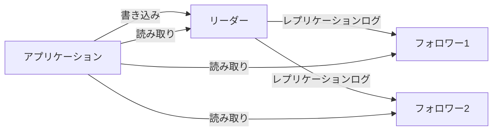
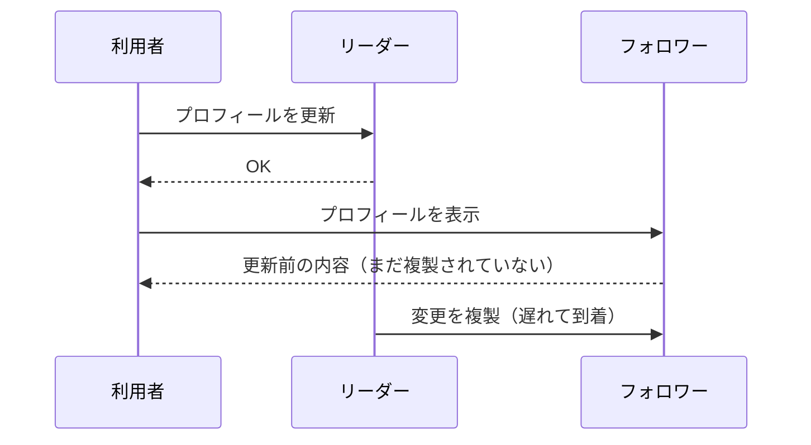
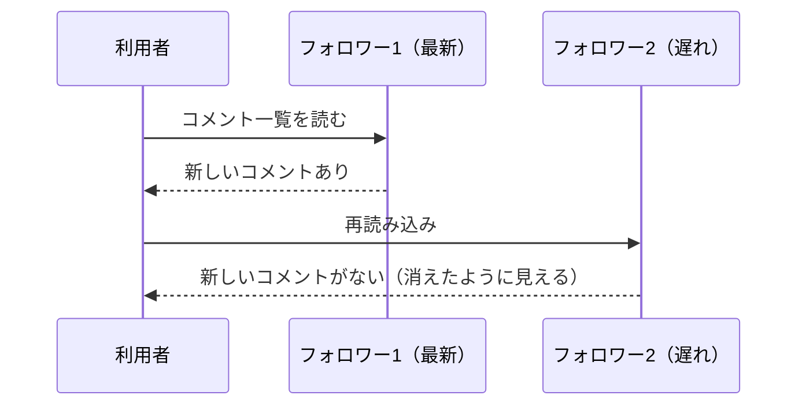
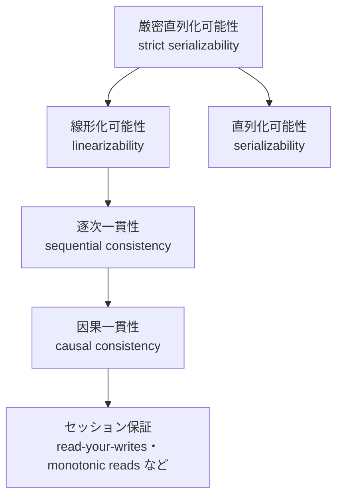

# 7.2 レプリケーションと一貫性

> 同じデータを複数のノードにコピーしておけば、1 台が壊れてもサービスは止まらず、読み取りも速くなります。ところが、データが変わった瞬間から「どのコピーが正しいのか」「利用者にはどのコピーを見せるのか」という問題が始まります。書いたはずのデータが見えない、消えたはずのデータが復活する、フェイルオーバーで確定済みの注文が消える——こうした現象はすべて、レプリケーションの方式と一貫性モデルの選択から生まれます。この章では、主要な 3 つのレプリケーション方式と一貫性モデルを、その代償とともに理解し、機能ごとに適切な保証を選べるようになることを目指します。

| 項目 | 内容 |
|---|---|
| 学習時間の目安 | 本文 4h ＋ 演習 6h |
| 前提となる章 | [7.1 分散システムの本質](../01-fundamentals/README.md)、[6.3 トランザクションと同時実行制御](../../06-databases/03-transactions/README.md)、[6.4 ストレージエンジンと障害回復](../../06-databases/04-storage-and-recovery/README.md) |
| 演習 | [exercises/](exercises/)（Python） |
| キーワード | リーダー・フォロワー, 同期/非同期/準同期レプリケーション, フェイルオーバー, スプリットブレイン, フェンシング, レプリケーションラグ, read-your-writes, monotonic reads, マルチリーダー, LWW, リーダーレス, クォーラム, リードリペア, アンチエントロピー, Merkle 木, 線形化可能性, 因果一貫性, 結果整合性, CRDT |

## この章のゴール

- [ ] レプリケーションの目的と 3 つの方式（単一リーダー・マルチリーダー・リーダーレス）を比較し、要件に応じて選べる
- [ ] 同期・非同期・準同期レプリケーションのトレードオフと、フェイルオーバーの難しさ（データの消失・スプリットブレイン・フェンシング）を説明できる
- [ ] レプリケーションラグが起こす異常を挙げ、LSN のトークンでセッション保証（read-your-writes・monotonic reads）を実装できる
- [ ] クォーラム（W + R > N）の意味と限界を説明し、リードリペアとアンチエントロピー（Merkle 木）を実装できる
- [ ] 線形化可能性・逐次一貫性・因果一貫性・結果整合性を区別し、強い一貫性の代償を説明できる
- [ ] CRDT を実装し、なぜ調整なしで収束するのか（可換・結合・冪等）を説明できる
- [ ] 実在のデータベースの一貫性に関する主張を、ドキュメントと第三者の分析で検証する習慣を持つ

## なぜ学ぶのか

レプリケーションは「入れれば安全になる」ものではなく、設定と運用を誤ると、それ自体が障害の原因になります。

- **43 秒の分断が 24 時間の障害に**: 2018 年 10 月 21 日、GitHub では、故障した光伝送機器の交換作業で米国東海岸のネットワーク拠点と主データセンターの接続が 43 秒間失われました。この間に MySQL のトポロジ管理ツールが自動フェイルオーバーを実行し、プライマリを西海岸のデータセンターに移しました。東海岸には西海岸へ複製されていない短時間分の書き込みが残っており、接続回復後は両側に相手の知らない書き込みがある状態になりました。GitHub はデータの整合性を可用性より優先して復旧を進め、サービスの劣化は 24 時間 11 分に及びました（GitHub の事後分析 "October 21 post-incident analysis"）。
- **強い一貫性は利用者の期待そのもの**: Amazon S3 は長年、上書き・削除・一覧の取得などで結果整合性（書いた直後に読むと古い内容が返ることがある）でしたが、2020 年 12 月に、オブジェクトの書き込み（新規作成・上書き）の直後の読み取りと一覧の取得が常に最新の内容を返す強い一貫性（strong read-after-write consistency）を、追加料金なしで自動的に提供すると発表しました。利用者が「書いたら読める」を当然と期待し、それを満たさない仕組みがアプリケーション側の複雑さとバグを生んでいたことの表れです。
- **「保証」は検証しないと分からない**: Kyle Kingsbury による Jepsen の分析では、ドキュメント上は強い一貫性をうたうデータベースが、ネットワーク分断の下で確定済みの書き込みを失ったり、古いデータを返したりする例が繰り返し報告されてきました。

レプリケーションの方式と一貫性モデルの選択は、データを失ってよい量（RPO）、復旧までの時間（RTO）、書き込みのレイテンシ、そして利用者が目にする「奇妙な現象」を同時に決める、事業上の意思決定です。

## 1. なぜレプリケーションするのか

**レプリケーション**（replication）とは、同じデータのコピー（**レプリカ**, replica）を複数のノードに持つことです。目的は次の 4 つです。

| 目的 | 内容 |
|---|---|
| 可用性 | 1 台が壊れても、別のレプリカでサービスを続ける |
| 耐久性 | ディスクやマシンが失われても、データが残る |
| 読み取りのスケール | 読み取りを複数のレプリカに分散する |
| レイテンシ | 利用者に近い地域のレプリカから読む |

データが変わらないなら、コピーを配るだけで済みます。難しさはすべて **変更をどう伝えるか** にあります。代表的な方式は 3 つです。

| 方式 | 書き込みを受け付けるノード | 代表例 | 長所 | 短所 |
|---|---|---|---|---|
| 単一リーダー（leader–follower） | リーダー 1 台だけ | PostgreSQL、MySQL、MongoDB のレプリカセット | 単純。書き込みの順序が 1 つに決まり、競合がない | リーダーの故障時にフェイルオーバーが必要。書き込みはリーダーの性能と位置に縛られる |
| マルチリーダー（multi-leader） | 複数のリーダー（例: データセンターごと） | 複数拠点のデータベース、オフライン対応アプリ、共同編集 | 拠点ごとに低レイテンシで書ける。拠点の障害に強い | **書き込みの競合** の解決が必要 |
| リーダーレス（leaderless） | どのレプリカでも | Dynamo の論文に基づく設計（Cassandra、Riak など） | 一部のノードが遅い・止まっていても書ける | クォーラムの設定と、競合・修復の仕組みが必要 |

以下、それぞれの方式の仕組みと落とし穴を見ていきます。

## 2. 単一リーダーレプリケーション

### 2.1 仕組み

最も広く使われている方式です。書き込みはすべてリーダーが受け付け、変更の記録（レプリケーションログ）をフォロワーに送ります。フォロワーはログを同じ順序で適用するので、いずれリーダーと同じ状態になります。読み取りはリーダーでもフォロワーでも行えます。



レプリケーションログの形式には、主に 3 種類あります。

| 形式 | 内容 | 例 | 注意点 |
|---|---|---|---|
| ステートメントベース | 実行した SQL 文をそのまま送る | MySQL の statement 形式 | `UUID()` や `RAND()` など非決定的な関数で、レプリカごとに結果が変わりうる（`NOW()` のように、実行時刻をログに添えることで安全に扱える関数もある） |
| 物理（WAL の転送） | ストレージエンジンの WAL（[6.4](../../06-databases/04-storage-and-recovery/README.md)）をバイト単位で送る | PostgreSQL のストリーミングレプリケーション | 厳密に同じ状態になるが、リーダーとフォロワーで同じバージョン・同じ形式が必要 |
| 論理（行ベース） | 「どの行がどう変わったか」を送る | MySQL の row 形式の binlog、PostgreSQL の論理レプリケーション | 版の異なるデータベースや他システムへも送れる（7.5 章の CDC の基盤） |

### 2.2 同期・非同期・準同期

リーダーは、書き込みをフォロワーに送った後、フォロワーの確認を待ってからクライアントに成功を返すべきでしょうか。

| 方式 | リーダーの動作 | 書き込みのレイテンシ | リーダーが突然失われたとき |
|---|---|---|---|
| 同期（synchronous） | フォロワーが受け取った（永続化した）確認を待ってから成功を返す | フォロワーとの往復分だけ増える。フォロワーが止まると書き込みも止まる | 成功を返した書き込みはフォロワーにもある |
| 非同期（asynchronous） | 送るだけで、確認を待たない | 増えない | **成功を返したのに、フォロワーに届いていない書き込みが失われる** |
| 準同期（semi-synchronous） | 複数のフォロワーのうち 1 台（または指定台数）の確認だけ待つ | 最も速いフォロワーとの往復分 | 確認したフォロワーには残る |

全フォロワーを同期にすると、1 台が止まっただけで全書き込みが止まるので、実際には「1 台（または過半数）だけ同期、残りは非同期」という構成がよく使われます。PostgreSQL では `synchronous_standby_names` で同期させるスタンバイを指定でき（`FIRST 1 (s1, s2)` のような優先順位方式や、`ANY 1 (s1, s2)` のようなクォーラム方式）、`synchronous_commit` で待つ段階（スタンバイが WAL を OS に書き込むまで・ディスクにフラッシュするまで・適用して問い合わせに見えるようになるまで、など）を選べます。MySQL の準同期レプリケーションは、少なくとも 1 台のレプリカが受信を確認するまでコミットの完了を待ちますが、確認が一定時間来ないと **非同期に切り替わって動き続ける** 設定が一般的なので、「準同期だから失われない」と思い込むのは危険です（具体的な設定名と既定値は、使っている版のドキュメントで確認してください）。

同期の代償は距離で決まります。7.1 章で見たように、東京–大阪間の往復は理論上の下限でも約 4 ms、東京–米国東部なら 100 ms を超えます。同じリージョン内の別のアベイラビリティゾーンのフォロワーは同期、遠隔地の災害対策用のフォロワーは非同期、というのが典型的な組み合わせです。日本では首都圏と関西に拠点を分ける「東西」の災害対策構成が広く採られていますが、その間を同期にするか非同期にするかは、書き込みのレイテンシと失ってよいデータ量（RPO）のトレードオフとして明示的に決める必要があります。

非同期レプリケーションで失われうるデータ量は、単純に見積もれます。毎秒 1,000 件の書き込みがあり、レプリケーションラグが 2 秒あれば、リーダーが突然失われたときに最大でおよそ 2,000 件の「成功を返したはずの書き込み」が失われます。**ラグを監視しない非同期レプリケーションは、RPO が不明なバックアップと同じ** です。

### 2.3 フォロワーの追加

新しいフォロワーは、リーダーの一貫したスナップショット（バックアップ）を復元し、そのスナップショットのログ上の位置（PostgreSQL の LSN、MySQL の GTID や binlog の位置）から後の変更を受け取って追いつきます。ログの位置という「共通の座標」があるから、途中から参加しても正しい状態に追いつけるのです。この座標は、3 節のセッション保証の実装でも使います。

### 2.4 フェイルオーバーの難しさ

リーダーが故障したら、フォロワーの 1 台を新しいリーダーに昇格させ（**フェイルオーバー**, failover）、クライアントの書き込み先を切り替えます。手順は単純に見えますが、ここに分散システムの難しさが凝縮されています。

1. **故障の検出**: リーダーが本当に死んだのか、遅いだけなのかは区別できない（7.1 章）。タイムアウトが短いと不要なフェイルオーバーが、長いと長い停止が起きる。
2. **新しいリーダーの選択**: 最もログが進んでいるフォロワーを選ぶべきで、しかも「どれが新しいリーダーか」についてノード間で合意する必要がある（7.4 章の合意の問題）。
3. **切り替え**: クライアントと他のフォロワーを新しいリーダーに向け、**古いリーダーが復活してもリーダーとして振る舞わないようにする**。

特に危険なのが次の 2 つです。

- **非同期レプリケーションでのデータの消失**: 新しいリーダーは、古いリーダーが成功を返した最後の数秒分の書き込みを持っていないかもしれません。古いリーダーが復帰したとき、その書き込みを単純に捨てるのか、手作業で照合するのかを決めなければなりません。自動採番の ID が再利用され、外部のシステム（キャッシュや検索インデックス）に残っている古い ID と衝突するといった二次被害も起こりえます。
- **スプリットブレイン**（split brain）: 古いリーダーが「自分はまだリーダーだ」と思い込んだまま書き込みを受け付け続けると、2 台のリーダーが別々の書き込みを受け付け、データが分岐します。

スプリットブレインを防ぐ仕組みを **フェンシング**（fencing）と呼びます。古いリーダーの電源を強制的に落とす STONITH（Shoot The Other Node In The Head）、ストレージやネットワークへのアクセスを遮断する方法、そして書き込みに「世代番号」を付けて古い世代の書き込みを拒否させる方法（7.4 章のフェンシングトークン）があります。PostgreSQL のフェイルオーバー管理ツール Patroni が etcd などの合意システムに「リーダーの鍵」を置くように、実務のフェイルオーバーは合意システムと組み合わせて作られます。

冒頭の GitHub の事例は、これらが連鎖した典型です。事後分析によると、43 秒の分断の間に、Raft で合意をとるトポロジ管理ツール Orchestrator が、西海岸のデータセンターと東海岸のクラウドにあるノードで過半数を構成し、データベースのプライマリを西海岸に切り替えました。フェイルオーバーの判断自体は合意に基づく「正しい」ものでしたが、

- 非同期レプリケーションのため、東海岸には西海岸にない書き込みが残っていた
- 接続回復後、アプリケーションは直ちに西海岸の新しいプライマリへ書き込み始め、両側に相手の知らない書き込みができた
- そのため単純に東海岸へ戻す（フェイルバックする）ことができず、バックアップからの復元と再同期に長時間を要した
- 東海岸のアプリケーションから大陸を横断してデータベースにアクセスすることになり、レイテンシも大きく悪化した

という結果になりました。GitHub は、リージョンをまたぐプライマリの昇格を防ぐよう設定を見直すとしています。教訓は、**自動フェイルオーバーは「可用性」と引き換えに「データの整合性」を危険にさらしうる判断であり、特に非同期レプリケーションでリージョンをまたぐ場合は、自動化の範囲を慎重に決める必要がある** ということです。

## 3. レプリケーションラグとセッション保証

### 3.1 ラグが起こす 3 つの異常

非同期のフォロワーは、リーダーより少し遅れた状態にあります（**レプリケーションラグ**, replication lag）。普段は数ミリ秒〜数秒でも、負荷の高いときやネットワークの不調時には数分に伸びることがあります。読み取りをフォロワーに分散すると、次のような異常が見えるようになります。

**① 自分の書き込みが見えない**: プロフィールを更新した直後に表示すると、古い内容のまま。



**② 時間が巻き戻る**: 再読み込みのたびに別のフォロワーに振り分けられると、さっき見えた新しいコメントが消える。



**③ 因果関係の逆転**: 質問と回答が別々のパーティション（7.3 章）に保存され、それぞれ独立に複製されていると、第三者には「回答」が「質問」より先に見えることがあります。これを防ぐ保証を **一貫したプレフィックス読み取り**（consistent prefix reads）と呼びます。単一のログを順に適用するフォロワーなら自然に満たされますが、独立に複製される複数のパーティションをまたぐと崩れます。

### 3.2 セッション保証

Terry らは、弱い一貫性のレプリケーションシステム Bayou の研究（1994）で、利用者 1 人（1 セッション）から見て最低限守るべき性質を **セッション保証**（session guarantees）として整理しました。

| 保証 | 内容 | 防ぐ異常 |
|---|---|---|
| read-your-writes（自分の書き込みを読める） | セッションで書いた内容は、その後の読み取りで必ず見える | ① |
| monotonic reads（単調読み取り） | 一度見た状態より古い状態は見せない | ② |
| writes-follow-reads（読んだ後の書き込み） | 読んだ内容を踏まえた書き込みは、読んだ内容より後に順序づけられる | 返信が元の投稿より前に見える |
| monotonic writes（単調書き込み） | 同じセッションの書き込みは、書いた順に反映される | 更新の順序の逆転 |

これらは、全員に同じ最新の状態を見せる（線形化可能性、6 節）よりずっと安く実現でき、しかも利用者が感じる違和感の大部分を解消します。

### 3.3 実装: ログの位置をトークンにする

セッション保証の実装の基本は、**「このセッションが最低限見ていなければならないログの位置」をトークンとして持ち回る** ことです。

1. 書き込みのたびに、その書き込みの LSN（ログの位置）をセッションに記録する
2. 読み取るときは、フォロワーの適用済み LSN が記録した値以上か確かめる
3. 足りなければ、リーダーから読むか、フォロワーが追いつくまで待つ

MySQL では GTID と `WAIT_FOR_EXECUTED_GTID_SET()` で「この書き込みが適用されるまで待つ」ことができ、MongoDB の因果一貫性セッションは、クラスタの時刻（`afterClusterTime`）を読み取りに付けて同じことを行います。もっと単純な方法として「自分が編集しうるデータ（自分のプロフィールなど）は常にリーダーから読む」「書き込み後の一定時間はリーダーから読む」「利用者 ID のハッシュで読み取り先のフォロワーを固定する（monotonic reads 用）」もよく使われます。ただし、利用者が PC とスマートフォンの両方を使うなら、トークンは端末ではなくサーバー側のセッションで共有する必要があります。

演習 1 では、ラグのあるリーダー・フォロワー構成を模擬し、LSN のトークンでこの 2 つの保証を実装します。完成すると次のように動きます。

```python
from session_consistency import LEADER, ReplicatedStore, Session

store = ReplicatedStore(num_followers=2)
careless = Session(store, read_your_writes=False, monotonic_reads=False)
careful = Session(store)                        # read-your-writes + monotonic reads

careless.write("bio:alice", "こんにちは")
print("保証なし:", careless.read("bio:alice", prefer=0), "← フォロワー0 はまだ複製していない")

careful.write("bio:bob", "はじめまして")
print("保証あり:", careful.read("bio:bob", prefer=0), "← 応答したのは", careful.last_served_by)

store.replicate(0)                               # フォロワー0 が追いつく
print("追いついた後:", careful.read("bio:bob", prefer=0), "← 応答したのは", careful.last_served_by)
print("トークン（別の端末に渡せる LSN）:", careful.token)
```

```text
保証なし: None ← フォロワー0 はまだ複製していない
保証あり: はじめまして ← 応答したのは leader
追いついた後: はじめまして ← 応答したのは 0
トークン（別の端末に渡せる LSN）: 2
```

## 4. マルチリーダーレプリケーションと書き込みの競合

### 4.1 使いどころ

複数のノードが書き込みを受け付ける方式は、次のような場面で使われます。

- **複数データセンター**: 各拠点にリーダーを置き、利用者は近くの拠点に書き込む。拠点間は非同期で複製する。
- **オフライン対応のクライアント**: スマートフォンのカレンダーやメモアプリは、端末自体が「リーダー」として書き込みを受け付け、オンラインになったら同期する。
- **共同編集**: 複数の人が同じ文書を同時に編集する。

いずれも、**同じデータへの並行な書き込み（競合）** が避けられません。7.1 章のベクトル時計で見たように、「並行」とは互いを知らずに行われたということで、どちらが「後」とも言えません。

### 4.2 競合の解決方法

| 方法 | 内容 | 注意点 |
|---|---|---|
| 競合を避ける | レコードごとに「担当のリーダー」を決め、そのレコードへの書き込みは必ずそこに送る（例: 利用者の居住地域の拠点） | 担当拠点の障害時や利用者の移動時に崩れる |
| 最終書き込み優先（LWW） | タイムスタンプの大きい方を残す | **並行な書き込みの片方が黙って失われる** |
| 両方を残す（siblings） | 競合したバージョンをすべて保存し、読み取り時にアプリケーションや利用者に解決させる | アプリケーションに解決ロジックが必要 |
| 自動マージ | 型に応じて意味のあるマージを行う（CRDT、共同編集の OT など） | 使えるデータ型と意味論が限られる（7 節） |

LWW（Last Writer Wins）は実装が簡単なので広く使われていますが、時計のずれがあると「実際には後の書き込み」が負けます。東京と大阪のリーダーが同じ在庫数を更新する例で確かめましょう。

```python
# 2 つのリーダー（東京と大阪）が同じキーを更新し、あとでタイムスタンプの大きい方を残す（LWW）
tokyo_clock_offset, osaka_clock_offset = +0.050, 0.0   # 東京のサーバーの時計が 50 ms 進んでいる
writes = [  # (実際の時刻, 書いたリーダー, 値)
    (10.000, "tokyo", "在庫: 5"),
    (10.030, "osaka", "在庫: 4"),   # 実際にはこちらが 30 ms 後の書き込み
]
stamped = [(t + (tokyo_clock_offset if who == "tokyo" else osaka_clock_offset), who, v) for t, who, v in writes]
winner = max(stamped)
print("記録されたタイムスタンプ:", [(round(ts, 3), who) for ts, who, _ in stamped])
print("LWW で残る値:", winner[2], "（実際に後だったのは 在庫: 4）")
```

```text
記録されたタイムスタンプ: [(10.05, 'tokyo'), (10.03, 'osaka')]
LWW で残る値: 在庫: 5 （実際に後だったのは 在庫: 4）
```

時計が 50 ms ずれているだけで、後から行われた書き込みがエラーもなく消えました。LWW は「データが失われてもよい」場合（キャッシュ、最終ログイン時刻など）に限って使い、失われると困るデータには、競合を避ける設計か、競合を検出して残す設計を選びます。

## 5. リーダーレスレプリケーションとクォーラム

### 5.1 Dynamo 型の仕組み

Amazon が 2007 年に論文 "Dynamo: Amazon's Highly Available Key-value Store" で発表した設計では、リーダーを置かず、クライアント（またはクライアントの代理のコーディネーター）が複数のレプリカに直接読み書きします。

- 各キーは N 台のレプリカに置く
- 書き込みは N 台すべてに送り、**W 台** から確認が返れば成功とする
- 読み取りは N 台に問い合わせ、**R 台** から応答が返ったら、その中で最もバージョンの新しい値を採用する

**W + R > N** なら、書き込みが成功した W 台と、読み取りで応答した R 台は、鳩の巣原理により少なくとも 1 台重なります。だから読み取りには最新の書き込みが含まれる——これが **クォーラム**（quorum）の考え方です。書き込みがまだ W 台にしか届いていない瞬間に、ランダムに選んだ R 台を読む、という単純化したモデルで、最新を読み損ねる確率を計算してみましょう。

```python
from math import comb

def p_miss(n, w, r):
    """書き込んだ w 台と、ランダムに選んだ r 台が 1 台も重ならない確率。"""
    return comb(n - w, r) / comb(n, r)

print(" N  W  R  W+R>N  最新を読み損ねる確率")
for n, w, r in [(3, 1, 1), (3, 2, 1), (3, 2, 2), (3, 3, 1), (5, 2, 2), (5, 3, 2), (5, 3, 3)]:
    print(f"{n:2} {w:2} {r:2}  {str(w + r > n):5}  {p_miss(n, w, r):6.1%}")
```

```text
 N  W  R  W+R>N  最新を読み損ねる確率
 3  1  1  False   66.7%
 3  2  1  False   33.3%
 3  2  2  True     0.0%
 3  3  1  True     0.0%
 5  2  2  False   30.0%
 5  3  2  False   10.0%
 5  3  3  True     0.0%
```

よく使われる設定と、その性格は次の通りです（N = 3 の場合）。

| W | R | 性格 |
|---|---|---|
| 2 | 2 | 読み書きとも 1 台の故障に耐え、クォーラムが重なる。標準的な選択 |
| 3 | 1 | 読み取りが速いが、1 台でも止まると書き込めない |
| 1 | 3 | 書き込みが速いが、1 台でも止まると（重なりを保証した）読み取りができない |
| 1 | 1 | 最速だが重なりの保証がない。古い値を読むことを許容する用途向け |

### 5.2 修復の仕組み — リードリペア、ヒント付きハンドオフ、アンチエントロピー

リーダーがいないので、書き込みを取りこぼしたレプリカを直す仕組みが別に必要です。

- **リードリペア**（read repair）: 読み取りで古い値を返したレプリカに、その場で最新の値を書き戻す。よく読まれるキーほど早く直る。
- **ヒント付きハンドオフ**（hinted handoff）: 本来の担当レプリカが止まっている間、別のノードが書き込みを「ヒント」として預かり、復帰したら渡す。Dynamo の論文では、担当外のノードも含めて W 台の確認を集める **スロッピークォーラム**（sloppy quorum）と組み合わせて、書き込みの可用性を高めている。
- **アンチエントロピー**（anti-entropy）: バックグラウンドでレプリカどうしのデータを突き合わせ、差分を直す。めったに読まれないキーはこれでしか直らない。

アンチエントロピーで問題になるのが、差分を見つけるコストです。数億件のキーを全件送り合って比べるわけにはいきません。Dynamo や Cassandra（`nodetool repair`）は **Merkle 木**（ハッシュ木）を使います。キーの範囲ごとにハッシュをとり、それを木の形にまとめておくと、2 つのレプリカのルートのハッシュが一致すれば全体が一致、違えば子を比べ……と、**違う部分木にだけ降りていける** ので、比較量は差分の数と木の深さに比例するだけになります。演習 3 で実装すると、20 万件のうち 2 件だけ違うデータの差分が、47 回のハッシュ比較で見つかります。

```python
import random
from merkle import find_differences

rng = random.Random(1)
a = {f"user:{i}": f"v{rng.randrange(10**9)}" for i in range(200_000)}
b = dict(a)
b["user:4242"] = "changed"          # 1 件だけ値が違う
del b["user:77"]                     # 1 件だけ片方にない
keys, comparisons = find_differences(a, b, depth=14)
print(keys, "ハッシュの比較回数:", comparisons, "（キーは 20 万件、葉は 2^14 = 16,384 個）")
```

```text
['user:4242', 'user:77'] ハッシュの比較回数: 47 （キーは 20 万件、葉は 2^14 = 16,384 個）
```

### 5.3 W + R > N でも「強い一貫性」ではない

クォーラムは強力ですが、W + R > N だけで線形化可能性（6 節）が得られるわけではありません。次のような場合に古い値や矛盾した値が見えます。

- **スロッピークォーラム**: 担当外のノードで W 台を集めた書き込みは、担当レプリカの R 台と重なるとは限らない。
- **並行な書き込み**: 2 つの書き込みが並行に行われると、どちらが「最新」かはタイムスタンプ（LWW）やバージョンベクトルで決めることになり、LWW なら片方が失われる。
- **失敗した書き込み**: W 台に届かず「失敗」と報告された書き込みも、届いた一部のレプリカには残り、後の読み取りで見えたり見えなかったりする（ロールバックされない）。
- **書き込み中の読み取り**: 書き込みが一部のレプリカにだけ届いた瞬間に、ある読み取りは新しい値を、その後の別の読み取りは古い値を返しうる。線形化可能にするには、読み取った側が最新の値をクォーラムに書き戻してから応答するなどの追加の手順が必要になる。
- **レプリカのデータ消失**: 最新の値を持っていたノードが壊れ、古いバックアップから復元されると、重なりの前提が崩れる。

加えて、リーダー・フォロワー型のように「ログのどこまで適用したか」という座標がないので、レプリカがどれだけ古いかを監視しにくいという運用上の弱点もあります。

### 5.4 調整可能な一貫性

Cassandra は、読み書きのたびに一貫性レベルを選べます（`ONE`、`QUORUM`、`ALL`、データセンター内の過半数を意味する `LOCAL_QUORUM` など）。書き込みと読み取りの両方を `QUORUM` にすれば、上の意味でのクォーラムの重なりが得られます。ただし Cassandra の競合解決はセル（列の値）単位の LWW なので、並行な書き込みの片方は失われます。「読んで、条件を満たせば書く」操作（一意性の確保など）には、Paxos に基づく軽量トランザクション（`INSERT ... IF NOT EXISTS` など）を使います。

名前の似た Amazon DynamoDB は、論文の Dynamo とは設計が異なります。2022 年の論文（USENIX ATC）によると、DynamoDB の各パーティションは複数のアベイラビリティゾーンに複製され、Multi-Paxos で選ばれたリーダーが書き込みを受け付けます。読み取りは既定では結果整合性（どのレプリカからでも読む）で、強い一貫性の読み取りを指定するとリーダーから読みます。

## 6. 一貫性モデル

### 6.1 一貫性モデルとは何か

**一貫性モデル**（consistency model）は、レプリケーションされたデータに対して「読み取りがどの書き込みの結果を返しうるか」を定める約束です。強いモデルほどプログラムは書きやすく、弱いモデルほど速く、障害に強くなります。



矢印は「上を満たせば下も満たす」（上の方が強い）ことを表します。直列化可能性は複数のオブジェクトにまたがるトランザクションの分離性の概念（[6.3](../../06-databases/03-transactions/README.md)）で、単一のオブジェクトの「新しさ」を扱う線形化可能性とは別の軸です。両方を満たすものを厳密直列化可能性と呼び、Spanner などが提供します。一貫性モデルの全体像は、Jepsen のサイトにある一貫性モデルの地図（Consistency Models）が参考になります。

### 6.2 線形化可能性

**線形化可能性**（linearizability, Herlihy と Wing, 1990）は、「データのコピーが 1 つしかなく、すべての操作がその 1 つに対して、呼び出しから応答までの間のどこかの一瞬で実行されたかのように見える」ことを保証します。特に、**ある読み取りが新しい値を返したら、それより後に始まるすべての読み取りも新しい値（以降の値）を返さなければならない** のが重要な性質です。

```text
時間 →
クライアント A:  [ write(x = 1) ─────────────────────── ]
クライアント B:       [ read(x) → 1 ]
クライアント C:                          [ read(x) → 0 ]
```

A の書き込みの最中に B が新しい値 1 を読みました。その B の読み取りが終わった後に始まった C の読み取りが古い値 0 を返しています。これは線形化可能ではありません（書き込みと並行な B の読み取りが 0 と 1 のどちらを返しても構いませんが、C は 1 を返さなければなりません）。前節の「書き込み中の読み取り」は、まさにこの状況です。

線形化可能性が必要になるのは、次のように「全員が同じ最新の状態を見ている」ことに正しさが依存する場面です。

- **ロックとリーダー選出**: 2 つのノードが同時に「自分がロックを取った」と思ってはいけない（7.4 章）
- **一意性の制約**: 同じユーザー名、同じ座席、同じ在庫の最後の 1 個を 2 人に割り当ててはいけない
- **異なる経路の間の依存**: 画像をストレージに書いた後、キュー経由で「サムネイルを作れ」と通知したのに、処理側が古いレプリカを読んで画像が見つからない

### 6.3 逐次一貫性・因果一貫性・結果整合性

- **逐次一貫性**（sequential consistency, Lamport, 1979）: すべての操作が、各クライアントのプログラム上の順序を保った **何らかの** 1 つの全順序で実行されたように見える。線形化可能性との違いは、実時間の順序を守らなくてよいこと。上の図は、C の読み取りを A の書き込みより前に並べれば説明できるので、逐次一貫性は満たす。
- **因果一貫性**（causal consistency）: 因果関係のある操作（7.1 章の happened-before）は、全員に同じ順序で見える。並行な操作の順序はクライアントによって異なってよい。「質問より先に回答が見える」ことはないが、互いに無関係な 2 つの投稿の順序は人によって違ってよい。**分断の間も可用性を保ったまま実現できる最も強いモデルの一つ** とされ、線形化可能性よりずっと安い。
- **結果整合性**（eventual consistency）: 更新が止まれば、いずれ全レプリカが同じ値に収束する。Werner Vogels の記事 "Eventually Consistent"（2008）で広く知られた。「いずれ」がいつかも、それまでに何が見えるかも保証しないので、実務ではセッション保証などを組み合わせて使う。
- **強い結果整合性**（strong eventual consistency）: 同じ更新の集合を受け取ったレプリカは、受け取った順序によらず同じ状態になる。次節の CRDT が提供する。

### 6.4 強い一貫性の代償

線形化可能性は「コピーが 1 つしかないかのように」振る舞うことなので、どこかで調整（1 台のリーダーを経由する、合意をとる）が必要になります。その代償は 3 つです。

1. **レイテンシ**: 書き込みも（多くの実装では読み取りも）リーダーや過半数との往復を待つ。リージョンをまたげば 1 往復で数十〜100 ms 以上。理論的にも、線形化可能な読み書きの応答時間はネットワーク遅延の不確かさに比例する下限を持つことが示されている（Attiya と Welch, 1994）。
2. **可用性**: 分断が起きると、リーダーや過半数と通信できない側では読み書きできない（CAP 定理、7.1 章）。
3. **スループット**: すべての書き込みが 1 つの順序付けの経路を通るので、その経路が上限になる。

だからこそ、「すべてを線形化可能に」ではなく、**機能ごとに必要な保証を見極める** ことが設計の要になります。残高や在庫の引き当て、一意性の確保には強い保証を、タイムラインや「いいね」の数、閲覧履歴には結果整合性とセッション保証を、という使い分けです。

## 7. CRDT — 調整なしで収束するデータ型

### 7.1 考え方

マルチリーダーやオフライン編集で、競合を「後から賢くマージする」ことはできないでしょうか。**CRDT**（Conflict-free Replicated Data Type, Shapiro ら, 2011）は、マージが次の 3 つの性質を満たすように設計されたデータ型です。

- 可換: a ⊔ b = b ⊔ a（どちらからマージしても同じ）
- 結合: (a ⊔ b) ⊔ c = a ⊔ (b ⊔ c)（どの順にまとめても同じ）
- 冪等: a ⊔ a = a（同じ状態を何度マージしても同じ）

この 3 つが成り立てば、状態がどんな順序で、何回、重複して届いても、同じ更新を受け取ったレプリカは必ず同じ状態になります（強い結果整合性）。7.1 章で見た「メッセージの重複・順序の入れ替わり」を、データ型の側で吸収してしまう発想です。

### 7.2 代表的な CRDT

| CRDT | 状態 | マージ | 用途 |
|---|---|---|---|
| G-Counter | レプリカごとの増加量 `{A: 3, B: 5}` | 要素ごとの最大値 | 閲覧数、いいねの数 |
| PN-Counter | 増加用と減少用の 2 つの G-Counter | それぞれをマージ | 増減するカウンタ |
| LWW-Register | 値と (タイムスタンプ, レプリカ ID) | 大きい方を残す | 単一の値（競合時の消失を許容できるもの） |
| OR-Set | 要素ごとの「追加タグ」の集合と、削除されたタグの集合 | それぞれ和集合 | 集合（買い物かご、タグ、メンバー） |

G-Counter のマージが「合計」ではなく「最大値」なのは、冪等性のためです。同じ状態を 2 回受け取って合計すると二重に数えてしまいますが、最大値なら何度受け取っても同じです。各レプリカは自分の要素しか増やさないので、最大値をとっても情報は失われません。

OR-Set（Observed-Remove Set）は、追加のたびに一意なタグを付け、削除では「その時点で観測できたタグ」だけを消します。ほかのレプリカで並行に行われた追加は観測していないので消えず、**並行な追加と削除では追加が勝つ**（add-wins）という、買い物かごなどで直感に合う意味論になります。

```python
from crdt import GCounter, ORSet

# 3 つのレプリカが「いいね」を独立に数え、ばらばらの順序で状態を交換する
a, b, c = GCounter("A"), GCounter("B"), GCounter("C")
a.increment(3); b.increment(5); c.increment(2)
x = a.merge(b).merge(c)
y = c.merge(a).merge(b).merge(b).merge(a)       # 順序が違い、重複もある
print(x.value, y.value, x.state())

# 買い物リスト: A が milk を削除した「同時」に、B が milk を追加し直した
cart_a, cart_b = ORSet("A"), ORSet("B")
cart_a.add("milk"); cart_a.add("eggs")
cart_b = cart_b.merge(cart_a)
cart_a.remove("milk")
cart_b.add("milk")
print(sorted(cart_a.merge(cart_b).elements()), sorted(cart_b.merge(cart_a).elements()))
```

```text
10 10 {'A': 3, 'B': 5, 'C': 2}
['eggs', 'milk'] ['eggs', 'milk']
```

### 7.3 CRDT の限界と使われ方

CRDT は万能ではありません。

- **不変条件を守れない**: 「在庫は 0 未満にならない」「残高を超えて引き出せない」のような条件は、各レプリカが調整なしに更新する限り保証できない。こうした条件には調整（合意や、あらかじめ枠を配っておく方式）が必要。
- **メタデータが増える**: OR-Set の墓標（削除されたタグ）は消せず、履歴とともに増え続ける。整理（ガベージコレクション）には、全レプリカが見たことの確認という調整が必要になる。
- **意味論が要件に合うとは限らない**: add-wins が正しいか、remove-wins が正しいかはドメイン次第。

実用例としては、Riak のデータ型（カウンタ・集合・マップ）、Redis Enterprise の Active-Active 構成、共同編集のためのライブラリ Automerge や Yjs などがあり、端末側を主にデータを持つ「ローカルファースト」のアプリケーションの基盤としても研究・実装が進んでいます（Kleppmann ら "Local-first software", 2019）。状態全体を送る状態ベースのほか、操作を送る操作ベース（op-based）や、差分だけを送る delta-state CRDT もあります。

## 8. 実在のシステムを読み解く

以下は 2026 年時点の概要です。機能や既定値は版によって変わるので、採用時には必ず公式ドキュメントと、あれば Jepsen の分析（https://jepsen.io/analyses）を確認してください。

| システム | 方式 | 一貫性に関する主な選択肢 | 押さえておきたい点 |
|---|---|---|---|
| PostgreSQL | 単一リーダー（WAL のストリーミングレプリケーション）。論理レプリケーションもある | `synchronous_commit` と `synchronous_standby_names` で同期の範囲と段階を選ぶ | 本体に自動フェイルオーバーの仕組みはなく、Patroni などの外部ツールやマネージドサービスで実現する |
| MySQL | 単一リーダー（binlog）。Group Replication（Paxos 系の合意）もある | 非同期・準同期、GTID | 準同期はタイムアウトで非同期に戻りうる。行ベースの binlog が一般的 |
| MongoDB | レプリカセット（選挙によるリーダー選出） | 書き込み確認（write concern）と読み取り（read concern、read preference）の組み合わせ | 設定の組み合わせで保証が大きく変わる。Jepsen の分析が複数回公開されている |
| Cassandra | リーダーレス | 操作ごとの一貫性レベル（`ONE`、`QUORUM`、`LOCAL_QUORUM` など）、軽量トランザクション | 競合はセル単位の LWW。時計の同期が正しさに直結する |
| DynamoDB | パーティションごとのリーダー（Multi-Paxos） | 結果整合性の読み取り（既定）と強い一貫性の読み取り | 複数リージョンのグローバルテーブルでの競合解決の方式を確認すること |
| Spanner | Paxos で複製した分割（split）＋ TrueTime | 既定で厳密直列化可能（外部一貫性）。古いデータの読み取り（stale read）で低レイテンシも選べる | 強い一貫性の代償はコミット待ちとリージョン間の往復 |

ベンダーの「強い一貫性」「高可用性」という言葉を読むときは、次を確かめる習慣をつけましょう。

1. どの一貫性モデルか（線形化可能性か、セッション保証か、結果整合性か）
2. その保証は、どの設定・どの操作・どの障害（ノードの停止、分断、時計のずれ）の下で成り立つのか
3. 既定の設定で成り立つのか、それとも明示的に選ぶ必要があるのか
4. 第三者の検証（Jepsen など）で何が見つかり、どう直されたのか

## よくある落とし穴

1. **読み取りをフォロワーに分散した直後から、「更新したのに反映されない」という問い合わせが増える**。レプリケーションラグを前提に、自分の書き込みを読む画面はリーダーから読む、LSN のトークンで read-your-writes を保証する、といった対策を最初から設計に入れる。
2. **非同期レプリケーションのラグを監視していない**。ラグは失いうるデータ量（RPO）そのもの。秒数と件数でアラートを設定し、フェイルオーバーの判断材料にする。
3. **準同期や同期を設定しただけで「データは失われない」と思い込む**。タイムアウトで非同期に切り替わる、同期先が 1 台しかなく同時に失われる、といった条件を確認し、切り替わりも監視する。
4. **自動フェイルオーバーを、フェンシングもリージョンの考慮もなく有効にする**。スプリットブレインや、複製されていない書き込みの消失を招く。自動化する範囲（同一リージョン内のみなど）を決め、フェイルオーバーとフェイルバックの手順を訓練しておく。
5. **W + R > N なら強い一貫性だと考える**。スロッピークォーラム、並行な書き込み、失敗した書き込みの残骸、書き込み中の読み取りで崩れる。必要なら線形化可能な操作（合意に基づく条件付き書き込みなど）を別途使う。
6. **マルチリーダーや複数リージョンで、LWW を「競合解決」として採用し、データの消失に気づかない**。LWW は並行な書き込みの片方を黙って捨てる。失われて困るデータには、担当リーダーの固定、競合の保持、CRDT などを選ぶ。
7. **レプリカをバックアップの代わりにする**。誤った `DELETE` や `DROP TABLE`、アプリケーションのバグによるデータ破壊は、即座にレプリカにも複製される。時点を指定して復元できるバックアップ（PITR）を別に持ち、復元を定期的に試す。
8. **「強い一貫性」「結果整合性」という言葉を定義を確認せずに使う**。チーム内でも意味がずれていることが多い。設計書では「どの操作が、どの障害の下で、何を保証するか」を具体的に書く。

## CTOの視点

1. **RPO と RTO は技術ではなく事業の決定**。「最悪、何秒分の確定済みの注文を失ってよいか」「何分止まってよいか」は、事業責任者と合意すべき数字です。同期レプリケーションは RPO をゼロに近づけますが、書き込みのレイテンシとコストが増えます。東西の災害対策構成を組むなら、拠点間を同期にするか非同期にするか、非同期ならラグの上限をいくつにするかを、数字で決めて文書化しましょう。
2. **フェイルオーバーの自動化の範囲を決め、訓練する**。同一リージョン内の自動フェイルオーバーは多くの場合有益ですが、リージョンをまたぐ切り替えは、データの消失とフェイルバックの困難さを伴う重大な判断です。「誰が、どの情報を見て、どう判断するか」を手順書にし、GameDay で実際に切り替えてみることで、初めて本番で使える手順になります。GitHub の事例は、合意に基づく「正しい」自動化でも事業上の最善とは限らないことを示しています。
3. **機能ごとに一貫性の要件を決め、UX とセットで設計する**。すべてを強い一貫性にすると、レイテンシ・可用性・コストで過剰に支払うことになります。決済・在庫・一意性は強く、フィードやカウンタは結果整合性、というように要件を表にし、結果整合性の部分は「反映まで数秒かかることがあります」といった表示や、楽観的な UI 更新で体験を設計するよう、プロダクトチームと合意しましょう。
4. **データストアの選定では「保証の条件」を問う**。ベンダーの説明に対して「その保証は既定の設定で成り立つか」「ネットワーク分断と時計のずれの下でも成り立つか」「Jepsen などの第三者の分析はあるか」を確認し、PoC では実際にノードを止め、ネットワークを切って振る舞いを確かめます。この一手間が、数年後の事故と移行コストを防ぎます。
5. **レプリケーションの運用は専門性として扱う**。ラグの監視、フェイルオーバー、バックアップからの復元、バージョンアップ時の複製の維持は、片手間では回りません。マネージドサービスに任せる範囲と、社内で持つべき知識（障害時の判断を下せる人）を区別し、データベースの信頼性を担う役割（DBRE など）を置くかどうかを、規模に応じて判断しましょう。

## 演習

演習コードは [exercises/](exercises/) にあります。docstring の仕様を読み、`raise NotImplementedError(...)` を実装に置き換えてください。解答例は [solutions/](solutions/) にありますが、まずは自力で取り組みましょう。

```bash
python3 tools/check.py 7.2        # リポジトリのルートで実行
python3 tools/check.py -v 7.2     # 詳しい出力
```

| # | 難易度 | 内容 | ファイル / 対象 |
|---|---|---|---|
| 1 | ★★☆ | ラグのあるリーダー・フォロワー構成と、LSN トークンによる read-your-writes・monotonic reads | [session_consistency.py](exercises/session_consistency.py) / `ReplicatedStore`, `Session` |
| 2 | ★★★ | Dynamo 風のクォーラム読み書き（W 台への書き込み・R 台からの読み取り）、リードリペア、アンチエントロピー、障害注入。W + R > N と W + R ≤ N の違いをテストで確かめる | [quorum.py](exercises/quorum.py) / `Replica`, `QuorumCluster` |
| 3 | ★★☆ | キーの範囲（トークンの範囲）ごとの Merkle 木と、差分のあるキーの効率的な検出 | [merkle.py](exercises/merkle.py) / `MerkleTree`, `diff_buckets`, `find_differences` |
| 4 | ★☆☆ | G-Counter と PN-Counter | [crdt.py](exercises/crdt.py) / `GCounter`, `PNCounter` |
| 5 | ★★☆ | LWW-Register（(タイムスタンプ, レプリカ ID) による決着）と OR-Set（add-wins）。乱数で可換・結合・冪等と収束を検査する | [crdt.py](exercises/crdt.py) / `LWWRegister`, `ORSet` |
| 6 | ★★☆ | 記述: EC サイトの一貫性要件と災害対策の設計（下記） | — |

演習 2 は、テストが通ったら `QuorumCluster(3, 1, 1)` と `QuorumCluster(3, 2, 2)` で同じ操作を繰り返し、古い値が返る割合を数えてみてください。本文の確率の計算と比べると理解が深まります。

### 演習 6（記述）: EC サイトの一貫性要件と災害対策

あなたは、東京リージョンで稼働する EC サイトのアーキテクトです。データベースはリーダー 1 台と同じリージョン内のフォロワー 2 台で、読み取りの多くをフォロワーに分散しています。経営陣から「大阪にも拠点を置き、災害時にはそちらで事業を継続したい」という要望がありました。

1. 次の機能について、必要な一貫性の保証（線形化可能性・read-your-writes・monotonic reads・結果整合性のいずれか、または組み合わせ）と、読み取り先（リーダー／フォロワー）を決め、理由を述べてください。
   商品一覧・商品詳細、在庫の引き当て（購入確定時）、カート、注文履歴（注文直後の確認画面を含む）、商品レビューの一覧、ポイント残高と利用
2. 大阪の拠点へのレプリケーションを同期にするか非同期にするかを、書き込みのレイテンシと RPO の観点から論じ、推奨案を示してください。
3. 大阪への切り替え（フェイルオーバー）を自動にするか手動にするかを、スプリットブレインとデータ消失の観点から論じてください。

<details>
<summary>解答例</summary>

1. 機能ごとの要件（例）:

| 機能 | 保証 | 読み取り先 | 理由 |
|---|---|---|---|
| 商品一覧・詳細 | 結果整合性 | フォロワー（＋キャッシュ） | 数秒古くても実害が小さく、読み取りが最も多い |
| 在庫の引き当て | 線形化可能性（条件付き更新をリーダーで） | リーダー | 最後の 1 個を 2 人に売ってはいけない。`UPDATE ... SET stock = stock - 1 WHERE id = ? AND stock > 0` のような条件付き更新をリーダーで行う |
| カート | read-your-writes ＋ monotonic reads | 書き込み直後はリーダー、またはトークン付きでフォロワー | 入れた商品が消えて見えると離脱につながる |
| 注文履歴 | read-your-writes（注文直後の確認画面）、monotonic reads | 注文直後はリーダーまたは LSN トークン | 注文が見えないと二重注文の原因になる |
| レビュー一覧 | 結果整合性（投稿者本人には read-your-writes） | フォロワー | 他人のレビューの反映が数秒遅れても問題は小さい |
| ポイント残高と利用 | 利用（減算）は線形化可能性、表示は read-your-writes | 利用はリーダー | 残高を超えた利用や二重利用を防ぐ必要がある |

2. 同期にすると、すべての書き込みに東京–大阪の往復（理論上の下限でも約 4 ms、実測ではそれ以上）が加わり、大阪側の障害や拠点間の回線障害で東京の書き込みが止まる（あるいは非同期に落とす判断が必要になる）。非同期なら書き込みは速いが、東京が突然失われたときにラグの分だけ確定済みの注文を失う。推奨例: 東京リージョン内の別のアベイラビリティゾーンのフォロワーへは同期（または準同期）にして、通常の障害で RPO をほぼゼロにし、大阪へは非同期にしてラグを監視し、「大規模災害時には最大 N 秒分の注文を失いうる」ことを事業側と合意する。失われうる注文は、決済事業者の記録などと照合して救済する手順も用意する。
3. 自動にすると、東京–大阪間の回線だけが切れた場合でも大阪が昇格し、東京が動き続けてスプリットブレインになる危険がある。非同期のため、切り替えた瞬間に未複製の書き込みが失われ、フェイルバックも難しくなる（GitHub の事例）。推奨例: リージョン内のフェイルオーバーは自動、リージョン間の切り替えは、状況を確認した責任者の判断による手動（ただし手順は自動化してワンコマンドで実行できるようにする）。切り替え時は東京側を確実に書き込み不可にするフェンシングの手順を含め、定期的に訓練する。

採点の観点:

- 在庫・ポイントの減算を「強い保証が必要なもの」、商品一覧・レビューを「結果整合性でよいもの」と区別し、理由を述べられていれば合格ライン。
- 同期・非同期の選択を RPO とレイテンシの数字で論じ、リージョン間の自動フェイルオーバーの危険（スプリットブレイン・データ消失・フェイルバックの困難）に触れられていれば、設計レビューをリードできる水準です。

</details>

## 理解度チェック

**Q1. 非同期レプリケーションのデータベースでリーダーが突然失われ、フォロワーを昇格させました。何が失われうるか、どうすればその量を小さくできるかを説明してください。**

<details>
<summary>解答</summary>

リーダーがクライアントに成功を返したが、まだフォロワーに届いていなかった書き込み（レプリケーションラグの分）が失われます。量を小さくするには、(1) 少なくとも 1 台のフォロワーを同期（準同期）にし、成功を返す前に確認をとる、(2) ラグを監視してアラートを出し、ラグが大きいときは書き込みを絞るなどの対処をする、(3) 昇格時に最もログが進んでいるフォロワーを選ぶ、といった方法があります。いずれにせよ、失いうる量（RPO）を事業側と合意しておくことが重要です。

</details>

**Q2. read-your-writes と monotonic reads の違いを、それぞれが防ぐ現象の例で説明してください。一方だけを満たし、もう一方を満たさない状況はありえますか。**

<details>
<summary>解答</summary>

read-your-writes は「自分が書いた内容が、その後の自分の読み取りで見える」ことで、プロフィールを更新した直後に古い内容が表示される現象を防ぎます。monotonic reads は「一度見た状態より古い状態を見ない」ことで、再読み込みのたびに別のフォロワーに振り分けられて、さっき見えた他人のコメントが消える現象を防ぎます。一方だけを満たすことはありえます。例えば自分は何も書いていない利用者は、read-your-writes が自明に満たされていても、最新のフォロワーの後に遅れたフォロワーから読めば時間が巻き戻って見えます（演習 1 のテストで確かめられます）。

</details>

**Q3. N = 5 のリーダーレス構成で、W と R の組み合わせ (W, R) = (5, 1)、(3, 3)、(2, 2) を比較してください。**

<details>
<summary>解答</summary>

- (5, 1): W + R = 6 > 5 なので重なる。読み取りは 1 台で済み速いが、書き込みは 5 台すべての確認が必要で、1 台でも止まると書き込めない。
- (3, 3): W + R = 6 > 5 なので重なる。読み書きとも 2 台の故障に耐える、バランスのよい設定。
- (2, 2): W + R = 4 ≤ 5 なので重なりの保証がなく、古い値を読むことがある（単純化したモデルでは 30%）。その代わり読み書きとも 3 台の故障に耐え、レイテンシも小さい。

</details>

**Q4. W + R > N の設定でも古い値が読めてしまう状況を 2 つ挙げてください。**

<details>
<summary>解答</summary>

例えば次のような状況です。(1) スロッピークォーラム: 担当レプリカが止まっている間、担当外のノードで W 台の確認を集めた書き込みは、担当レプリカから読む R 台と重ならないことがある。(2) 書き込み中の読み取り: 書き込みが一部のレプリカにだけ届いた瞬間に、ある読み取りは新しい値を、その後の別の読み取りは古い値を返しうる（線形化可能でない）。ほかに、W 台に届かず失敗した書き込みが一部に残る場合、並行な書き込みを LWW で解決して片方が消える場合、最新の値を持つレプリカが古いバックアップから復元された場合などがあります。

</details>

**Q5. 線形化可能性と直列化可能性の違いを説明してください。**

<details>
<summary>解答</summary>

線形化可能性は、単一のオブジェクト（レジスタ）に対する個々の操作についての「新しさ」の保証で、あたかもコピーが 1 つしかなく、各操作が呼び出しから応答までの間の一瞬に実行されたかのように見えること（実時間の順序を守ること）を要求します。直列化可能性は、複数のオブジェクトを読み書きするトランザクションについての分離性の保証で、トランザクションが何らかの順序で 1 つずつ実行された場合と同じ結果になることを要求しますが、その順序が実時間と一致する必要はありません。両方を満たすものを厳密直列化可能性（strict serializability）と呼びます。

</details>

**Q6. G-Counter のマージを「要素ごとの合計」にすると何が問題ですか。また、PN-Counter が 2 つの G-Counter を使うのはなぜですか。**

<details>
<summary>解答</summary>

合計にすると冪等性が壊れます。同じ状態が重複して届いたり、同じレプリカと 2 回マージしたりすると、同じ増加を二重に数えてしまいます。最大値なら、各レプリカは自分の要素しか増やさないので情報を失わず、何度マージしても結果は変わりません。PN-Counter で 1 つの要素を減らしてしまうと、「減らした後の小さい値」がマージの最大値で古い大きい値に負けてしまい、減算が失われます。増加と減少をそれぞれ増えるだけの G-Counter で記録し、値を差で求めることで、どちらもマージで失われなくなります。

</details>

**Q7. 2 つのデータセンターがそれぞれ書き込みを受け付けるマルチリーダー構成で、競合を LWW で解決しています。起こりうる問題と、代わりの方法を挙げてください。**

<details>
<summary>解答</summary>

並行な書き込みのうち、タイムスタンプが小さい方がエラーもなく失われます。時計がずれていると、実際には後に行われた書き込みの方が負けることもあります（本文 4.2 の例）。代わりの方法としては、(1) レコードごとに担当のデータセンターを決めて競合自体を避ける、(2) 競合したバージョンを両方残して（バージョンベクトルで並行性を検出して）アプリケーションや利用者に解決させる、(3) カウンタや集合なら CRDT で意味のあるマージをする、(4) 在庫の引き当てのような不変条件が必要な操作だけは、1 か所に集約して強い一貫性で処理する、などがあります。

</details>

**Q8. Merkle 木を使うと、なぜレプリカ間の差分を効率よく見つけられるのですか。逆に、あまり効率が上がらないのはどんな場合ですか。**

<details>
<summary>解答</summary>

キーの範囲ごとのハッシュを木の形にまとめているので、ある部分木のハッシュが一致すれば、その中の何百万件ものキーを見ずに「一致」と判断できます。違う部分木にだけ降りていけばよいので、差分が少なければ比較量は「差分の数 × 木の深さ」程度で済みます（演習 3 では 20 万件中 2 件の差分を 47 回の比較で発見）。一方、差分がキー空間全体に散らばっている（例えば、長く停止していたレプリカが復帰した直後）と、ほとんどの部分木のハッシュが一致しないので、結局多くのノードを比較することになり、効率は上がりません。また、データが変わるたびに木を更新（または再計算）するコストもかかります。

</details>

## さらに学ぶために

- Martin Kleppmann "Designing Data-Intensive Applications"（第 1 版。邦訳『データ指向アプリケーションデザイン』オライリー・ジャパン）第 5 章・第 9 章 — レプリケーションの 3 方式、ラグの異常、クォーラムの限界、線形化可能性を、この章と同じ流れで詳しく解説している。
- Giuseppe DeCandia ほか "Dynamo: Amazon's Highly Available Key-value Store"（SOSP 2007）— リーダーレスレプリケーション、スロッピークォーラム、ヒント付きハンドオフ、Merkle 木によるアンチエントロピー、ベクトル時計を実システムでどう組み合わせたかが分かる古典。
- Douglas B. Terry ほか "Session Guarantees for Weakly Consistent Replicated Data"（1994）— read-your-writes などのセッション保証を定義した論文。短く読みやすい。
- Marc Shapiro ほか "Conflict-free Replicated Data Types"（SSS 2011）— CRDT を体系化した論文。状態ベースと操作ベースの 2 つの形と、その同値性を扱う。
- Jepsen "Consistency Models"（https://jepsen.io/consistency）— 一貫性モデルの関係を 1 枚の図にまとめ、各モデルの定義と参考文献をたどれるページ。
- James C. Corbett ほか "Spanner: Google's Globally-Distributed Database"（OSDI 2012）— Paxos による複製と TrueTime で、地球規模で強い一貫性を実現した設計。強い一貫性の「値段」を具体的に知るのによい。
- PostgreSQL 公式ドキュメント「高可用性、負荷分散およびレプリケーション」の章 — 同期レプリケーションの設定、ホットスタンバイの制約など、実運用の詳細の一次資料。

## まとめ

- レプリケーションの難しさはすべて「変更をどう伝えるか」にあり、主な方式は単一リーダー・マルチリーダー・リーダーレスの 3 つ。
- 同期・非同期・準同期の選択は、書き込みのレイテンシと失いうるデータ量（RPO）のトレードオフ。**ラグを監視しない非同期レプリケーションは RPO が分からない**。
- フェイルオーバーは、故障の誤検出・データの消失・スプリットブレインの危険を伴う。フェンシングと、自動化の範囲の慎重な設計が必要。
- レプリケーションラグは「自分の書き込みが見えない」「時間が巻き戻る」などの異常を生む。**LSN のトークン** を持ち回ってセッション保証を実装する。
- クォーラム（W + R > N）は読み書きの集合の重なりを保証するが、それだけでは線形化可能にならない。リードリペアとアンチエントロピー（Merkle 木）で修復する。
- 一貫性モデルは強いほど書きやすく、弱いほど速く障害に強い。**機能ごとに必要な保証を選ぶ** のが設計の要。
- CRDT は可換・結合・冪等なマージで調整なしに収束するが、不変条件は守れず、LWW は並行な書き込みを黙って失う。
