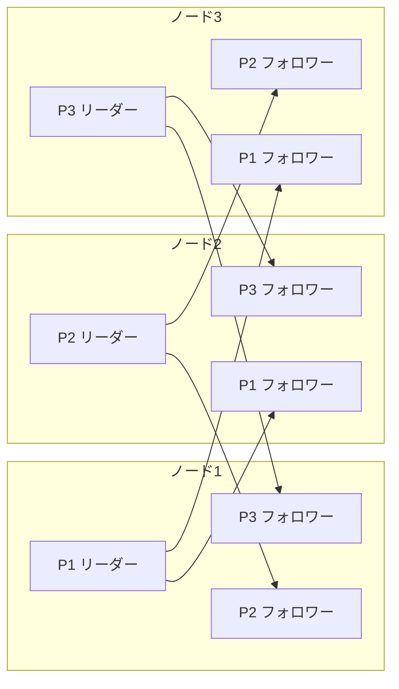
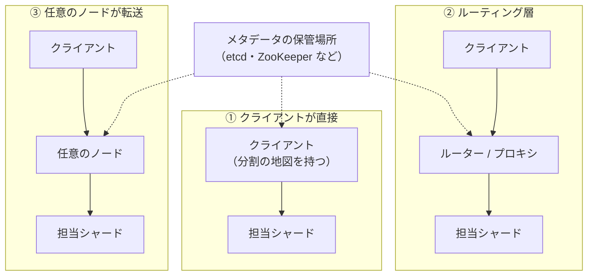

# 7.3 パーティショニング

> 1 台のデータベースに収まらないほどデータや書き込みが増えたら、データを分けて複数のノードに置くしかありません。しかし「どう分けるか」を誤ると、1 台のノードにだけ負荷が集中し、ノードを 1 台足すたびに全データの大移動が起き、ほとんどのクエリが全ノードへの問い合わせになります。しかも分割の方法（シャードキー）は、一度決めると変えるのが最も難しい設計判断の一つです。この章では、分割の戦略とその落とし穴、ノードの増減に強いハッシュの仕組み、そして分散環境での ID の作り方を学び、「いつ、何をキーに、どう分けるか」を判断できるようになることを目指します。

| 項目 | 内容 |
|---|---|
| 学習時間の目安 | 本文 3.5h ＋ 演習 5h |
| 前提となる章 | [7.2 レプリケーションと一貫性](../02-replication-and-consistency/README.md)、[6.2 インデックスとクエリ処理](../../06-databases/02-indexes-and-query-processing/README.md) |
| 演習 | [exercises/](exercises/)（Python） |
| キーワード | パーティション, シャーディング, レンジ分割, ハッシュ分割, ホットスポット, スキュー, コンシステントハッシュ, 仮想ノード, ランデブーハッシュ, リバランス, セカンダリインデックス, リクエストルーティング, Snowflake, UUIDv7, マルチテナント |

## この章のゴール

- [ ] パーティショニングの目的と、レプリケーションとの違い・組み合わせ方を説明できる
- [ ] レンジ分割・ハッシュ分割・ディレクトリ方式・地理的分割の長所と短所を比べ、アクセスパターンから選べる
- [ ] ホットスポットの原因（単調増加するキー、有名人問題）を見抜き、キーのソルト化などの対策を設計できる
- [ ] コンシステントハッシュ（仮想ノード付き）とランデブーハッシュを実装し、リバランス時のデータ移動量を評価できる
- [ ] セカンダリインデックスとリクエストルーティングの方式を説明し、シャードをまたぐクエリやトランザクションのコストを見積もれる
- [ ] シャーディングの前に検討すべき手段を挙げ、シャーディングを導入するかどうかを判断できる
- [ ] Snowflake 形式の ID と UUIDv7 を実装し、インデックスの局所性の観点から ID の方式を選べる

## なぜ学ぶのか

大規模なサービスの多くは、成長のどこかでデータの分割に踏み切っています。そして、その経験は技術ブログとして共有されています。

- **Instagram（2012 年）**: 技術ブログ "Sharding & IDs at Instagram" で、PostgreSQL の中に数千の「論理シャード」を作って少数の物理サーバーに割り当て、後から物理サーバーを増やしても論理シャードを移すだけで済むようにしたこと、そしてシャードをまたいでも時刻順に並ぶ 64 ビットの ID を各シャードの中で生成したことを紹介しました。
- **YouTube と Vitess**: YouTube が MySQL をスケールさせるために 2010 年ごろから開発した Vitess は、シャーディングされた MySQL を 1 つのデータベースのように見せる仕組みで、後にオープンソース化され、CNCF の卒業プロジェクトになっています。
- **Discord（2017 年）**: 技術ブログ "How Discord Stores Billions of Messages" で、Cassandra 上のメッセージを「チャンネル ID」だけで分割すると、活発なチャンネルのパーティションが大きくなりすぎるため、「チャンネル ID と一定期間ごとのバケツ」の組で分割したことを説明しています。

一方で、分割は複雑さの大きな源でもあります。シャードをまたぐ結合やトランザクションは難しくなり、分割の方法を後から変えるには全データの移行が必要です。**分割しなくて済む間は分割しない、分割するなら後から変えにくい判断を慎重に下す**——この章は、その判断のための知識を扱います。

## 1. なぜ分割するのか

**パーティショニング**（partitioning）とは、データを重複しない部分集合（**パーティション**, partition）に分け、それぞれを別のノードに置くことです。データベースによって、シャード（shard）、リージョン（region）、タブレット（tablet）、vノード（vnode）、vBucket などと呼び名が変わりますが、考え方は同じです。**シャーディング**（sharding）もほぼ同じ意味で使われ、特に複数のデータベースサーバーにまたがって分けること（アプリケーション側で振り分ける場合を含む）を指すことが多い呼び方です。

目的は主に次の 3 つです。

- **データ量**: 1 台のディスクやメモリに収まらない
- **書き込みのスループット**: 1 台のリーダーの書き込み性能を超える（読み取りだけならレプリカで増やせる。7.2 章）
- **分離**: テナントごと・地域ごとにデータを分け、負荷や障害の影響範囲、データの所在地を制御する

パーティショニングはレプリケーションと組み合わせて使います。各パーティションを複数のノードに複製し、パーティションごとのリーダーを異なるノードに散らせば、負荷も故障の影響も分散できます。



分割の目標は、**データとクエリの負荷を均等に散らすこと** です。偏りがあると、最も負荷の高いパーティションが全体の上限になります。10 台に分けても、1 台に負荷が集中していれば性能は 1 台分のままです。

## 2. 分割の戦略

### 2.1 キーのハッシュで分ける

キーをハッシュ関数に通し、その値で担当を決めます。よいハッシュ関数は偏ったキー（`user:1`, `user:2`, …）も均等にばらまくので、負荷が散ります。ただし、**Python の組み込み `hash()` や Java の `Object.hashCode()` のような、プロセスごと・言語ごとに値が変わりうる関数は使ってはいけません**。Python では文字列の `hash()` がプロセスごとにランダム化されるので、再起動しただけで担当が変わってしまいます。

最も素朴なのは `hash(key) mod N`（N はノード数）です。均等に散りますが、N が変わると大問題が起きます。

```python
import hashlib

def stable_hash(s: str) -> int:
    return int.from_bytes(hashlib.sha256(s.encode()).digest()[:8], "big")

keys = [f"user:{i}" for i in range(100_000)]
for n in (4, 10, 50):
    moved = sum(stable_hash(k) % n != stable_hash(k) % (n + 1) for k in keys)
    print(f"{n} 台 → {n + 1} 台: {moved / len(keys):.1%} のキーが移動（理想は {1 / (n + 1):.1%}）")
```

```text
4 台 → 5 台: 79.9% のキーが移動（理想は 20.0%）
10 台 → 11 台: 90.9% のキーが移動（理想は 9.1%）
50 台 → 51 台: 98.0% のキーが移動（理想は 2.0%）
```

ノードを 1 台足しただけで、ほぼ全データを移動することになります。新しいノードが受け持つべき 1/(N+1) だけを動かせば済むはずなのに、です。この問題を解くのが 4 節のコンシステントハッシュと、5 節の「固定数のパーティション」です。

ハッシュ分割の最大の弱点は、**範囲検索ができなくなる** ことです。隣り合うキーがばらばらのパーティションに散るので、「2026 年 9 月の注文」を取り出すには全パーティションに問い合わせることになります。

### 2.2 キーの範囲で分ける

辞書の巻のように、キーの範囲ごとに分けます（A〜F は 1 巻、G〜O は 2 巻……）。Bigtable や HBase、CockroachDB、TiKV などが採用しています。

- 長所: 範囲検索が速い。キーの近いデータが同じパーティションにあるので、`WHERE created_at BETWEEN ...` のような検索は少数のパーティションだけで済む
- 短所: キーの分布が偏っていると負荷も偏る。特に **単調増加するキー（時刻・連番）では、新しい書き込みがすべて最後のパーティションに集中する**（3 節）
- 境界は、データの分布に合わせて調整する必要がある（手動で決める、または大きくなったら自動で分割する。5 節）

### 2.3 複合キー — ハッシュと範囲の組み合わせ

両者の長所を組み合わせる方法が、**複合キー** です。Cassandra では、主キーの最初の部分（パーティションキー）のハッシュでパーティションを決め、残りの部分（クラスタリングキー）の順にパーティション内でデータを並べます。例えば主キーを `(user_id, posted_at)` にすれば、ユーザーごとに負荷が散り、しかも「あるユーザーの最近の投稿」はパーティション内の範囲検索で速く取り出せます。

ただし、1 つのパーティションキーに属するデータが増えすぎると、そのパーティションが巨大化します。冒頭の Discord の例のように、`(channel_id, 期間のバケツ)` のように時間の区切りをパーティションキーに加えて、上限を設けるのが定石です。

### 2.4 ディレクトリ（対応表）で分ける

「このキー（またはテナント）はこのシャード」という **対応表** を持つ方法です。

- 長所: 自由度が最も高い。大きなテナントだけを専用のシャードに移す、といった個別の配置ができる
- 短所: 対応表の参照が 1 段増える。対応表自体が単一障害点・性能のボトルネックにならないよう、複製とキャッシュが必要

実務では、「キーのハッシュで数千の論理シャードに分け、論理シャードから物理サーバーへの対応表を持つ」という 2 段構えがよく使われます。冒頭の Instagram の方式がこれで、物理サーバーを増やすときは論理シャード単位で移動すればよいのです。

### 2.5 地理で分ける

利用者の居住地域ごとにデータを分け、その地域のデータセンターに置く方法です。レイテンシが下がるだけでなく、データの所在地に関する法令や契約（EU の GDPR、日本の個人情報保護法の越境移転の規律、顧客との契約で求められる国内保管など）に対応するためにも使われます。CockroachDB のように、行ごとに置き場所の地域を指定できるデータベースもあります。どこに置けば要件を満たすかの具体的な判断は、法務の専門家に確認してください。

| 戦略 | 負荷の均等さ | 範囲検索 | ノード増減時 | 代表例 |
|---|---|---|---|---|
| ハッシュ（mod N） | 高い | 不可 | ほぼ全データが移動 | 素朴な実装（避けるべき） |
| ハッシュ（コンシステント・固定パーティション） | 高い | 不可 | 一部だけ移動 | Cassandra、DynamoDB、Redis Cluster |
| レンジ | キーの分布次第（単調増加キーに弱い） | 得意 | 境界の分割・移動 | HBase、CockroachDB、TiKV |
| 複合（ハッシュ＋レンジ） | パーティションキー次第 | パーティション内なら得意 | 一部だけ移動 | Cassandra の主キー |
| ディレクトリ | 配置次第（柔軟） | 設計次第 | 対応表の更新と移動 | テナント単位のシャーディング |
| 地理 | 地域の人口次第 | 地域内なら可 | 地域の追加は大工事 | データの所在地の要件 |

## 3. ホットスポットとスキュー

分割がうまくいっても、特定のパーティションに負荷が偏ることがあります。偏りを **スキュー**（skew）、負荷が集中するパーティションを **ホットスポット**（hot spot）と呼びます。

| 原因 | 例 | 対策 |
|---|---|---|
| 単調増加するキーのレンジ分割 | タイムスタンプや連番の主キーで、最新のパーティションに書き込みが集中 | キーの先頭にハッシュやシャード番号を付ける、ハッシュ分割にする |
| 特定のキーへの集中（有名人問題） | フォロワーが数千万人いるアカウントの投稿、話題の商品、人気のチケット | キーのソルト化、キャッシュ、読み取りのレプリカ、書き込みの集約 |
| 時間的な集中 | 「今日」のパーティション、セールの開始時刻 | 事前の分割、時間以外の要素と組み合わせたキー |
| テナントの大きさの偏り | 1 社の大口顧客がデータの 30% を占める | 大口テナントを専用のシャードへ（後述の「マルチテナント SaaS の分割」） |

**キーのソルト化**（key salting）は、ホットなキーの末尾に 0〜9 のような乱数を付けて、1 つのキーへの書き込みを 10 個のキーに散らす方法です。書き込みは 10 個のパーティションに分散しますが、読み取りでは 10 個すべてを読んで合算しなければなりません。すべてのキーにソルトを付けると読み取りのコストが 10 倍になるので、**ホットなキーだけに適用し、どのキーがソルト化されているかを管理する** のが現実的です。

有名人問題の古典的な例が、SNS のタイムラインです。投稿のたびに全フォロワーのタイムラインに書き込む「書き込み時の配信（fan-out on write）」は、フォロワー数千万人のアカウントでは 1 回の投稿が数千万件の書き込みになります。そのため、多くのシステムはフォロワーが極端に多いアカウントだけ「読み取り時に取りに行く（fan-out on read）」混合方式をとります（[9.6 システム設計ケーススタディ](../../09-architecture/06-system-design-cases/README.md)）。

データベースの側で偏りを吸収する仕組みもあります。例えば DynamoDB では、1 つのパーティションが処理できる量に上限（AWS のドキュメントでは 1 パーティションあたり毎秒 3,000 読み取りユニット・1,000 書き込みユニットなど）があり、アクセスの多いパーティションに容量を融通する仕組みや、負荷に応じてパーティションを分割する仕組みが用意されています（2026 年時点。詳細は公式ドキュメントで確認してください）。ただし、**1 つのキーへの集中は、どんな分割でも解決できない** ことを忘れてはいけません。1 つのキーは 1 つのパーティションに属するからです。

## 4. コンシステントハッシュとその仲間

### 4.1 リング

**コンシステントハッシュ**（consistent hashing, Karger ら, 1997）は、ハッシュ値の空間（例えば 0〜2⁶⁴−1）を円（リング）とみなし、**ノードとキーを同じリング上に置く** 方法です。キーは、リング上で時計回りに進んで最初に出会うノードが担当します。

```text
            0 / 2^64
               │
      ノードC ●   ● ノードA
              ╲   ╱
   キーx ○ ─→ 時計回りに進み、最初に出会ったノードが担当
              ╱   ╲
      ノードD ●   ● ノードB
```

ノード E を追加すると、E の位置から反時計回りに前のノードまでの区間のキーだけが E に移ります。他のキーは一切動きません。ノードを削除するときも、そのノードの区間のキーが次のノードに移るだけです。移動量は理想的な 1/(N+1) 前後に抑えられます。

### 4.2 仮想ノード

ノードをリング上の 1 点だけに置くと、区間の長さが偶然に大きくばらつき、負荷が偏ります。そこで、1 台の物理ノードをリング上の多数の点（**仮想ノード**, virtual node）に置きます。演習 2 の実装で、10 台のノードに 10 万個のキーを割り当てたときの偏りを測ってみましょう。

```python
from collections import Counter
from partitioning import ConsistentHashRing

keys = [f"user:{i}" for i in range(100_000)]
nodes = [f"node{i}" for i in range(10)]
print("仮想ノード数  最大負荷/平均  最小負荷/平均")
for vnodes in (1, 10, 100, 1000):
    ring = ConsistentHashRing(nodes, vnodes=vnodes)
    load = Counter(ring.get_node(k) for k in keys)
    avg = len(keys) / len(nodes)
    print(f"{vnodes:>10}  {max(load.values()) / avg:12.2f}  {min(load.values()) / avg:12.2f}")
```

```text
仮想ノード数  最大負荷/平均  最小負荷/平均
         1          2.46          0.04
        10          1.77          0.46
       100          1.17          0.77
      1000          1.04          0.97
```

仮想ノードが 1 個だと、最も忙しいノードは平均の 2.5 倍、最も暇なノードは平均の 4% しか担当していません。1,000 個にすると、ほぼ均等になります。仮想ノードには、ほかにも 2 つの利点があります。

- **性能の異なるノードを扱える**: 性能が 2 倍のノードには 2 倍の仮想ノードを割り当てればよい
- **故障時の負荷が散る**: 故障したノードの区間は多数の小さな区間に分かれているので、引き継ぐ負荷が 1 台の隣のノードに集中せず、多数のノードに散る

代償は、リングの情報（どの位置にどのノードがあるか）が大きくなることです。Cassandra は各ノードのトークン（仮想ノード）の数を設定で選べ、既定値は版によって変わってきました。

### 4.3 ランデブーハッシュ

**ランデブーハッシュ**（rendezvous hashing, Highest Random Weight, Thaler と Ravishankar が 1990 年代後半に提案）は、さらに単純です。キーごとに、各ノードとの組のハッシュ値 `score = hash(node, key)` を計算し、スコアが最大のノードを担当にします。

- ノードが抜けると、そのノードが最大だったキーだけが、次点のノードに移る
- スコアの上位 k 台をそのままレプリカの置き場所にできる
- リングのようなデータ構造が不要。代わりに、1 回の検索でノード数分のハッシュを計算するので、ノードが数百台程度までの場面に向く

### 4.4 ジャンプ・コンシステントハッシュ

Google の Lamping と Veach が 2014 年に発表した **ジャンプ・コンシステントハッシュ**（jump consistent hash）は、数行のコードで、メモリを使わず、ほぼ完全に均等な割り当てを実現します。

```python
def jump_consistent_hash(key: int, num_buckets: int) -> int:
    """Lamping と Veach（2014）のジャンプ・コンシステントハッシュ。key は 64 ビット整数。"""
    b, j = -1, 0
    while j < num_buckets:
        b = j
        key = (key * 2862933555777941757 + 1) % (1 << 64)   # 64 ビットの線形合同法
        j = int((b + 1) * ((1 << 31) / ((key >> 33) + 1)))
    return b

keys = range(100_000)
before = [jump_consistent_hash(k, 10) for k in keys]
after = [jump_consistent_hash(k, 11) for k in keys]
moved = [(b, a) for b, a in zip(before, after) if b != a]
print(f"10 → 11 バケツ: {len(moved) / len(keys):.1%} が移動、移動先は {sorted({a for _, a in moved})}")
```

```text
10 → 11 バケツ: 9.0% が移動、移動先は [10]
```

ただし、バケツは 0 から N−1 の番号でしか表せず、**増減は末尾でしか行えません**（途中の 3 番を抜く、ができない）。任意のノードが故障しうるノードの集合ではなく、番号付きのシャード（それぞれが内部で複製されている）の割り当てに向いています。

| 方式 | ノードの増減 | 検索のコスト | 均等さ | 向いている場面 |
|---|---|---|---|---|
| リング＋仮想ノード | 任意 | O(log(ノード数×仮想ノード数)) | 仮想ノード数次第 | ノードの出入りがあるクラスタ（Dynamo 系、キャッシュのクライアント） |
| ランデブー | 任意 | O(ノード数) | 高い | ノード数が中程度、上位 k 台の選択が必要 |
| ジャンプ | 末尾のみ | O(log バケツ数) | 非常に高い | 番号付きのシャードへの割り当て |

## 5. リバランス

時間とともに、データ量や負荷の増加、ノードの追加・故障により、パーティションの配置を変える必要が出てきます。これを **リバランス**（rebalancing）と呼びます。求められるのは、(1) リバランス後に負荷が均等になること、(2) リバランス中もサービスを続けられること、(3) 移動するデータが必要最小限であることです。

### 5.1 固定数のパーティション

最も単純で強力なのは、**ノード数よりずっと多い数のパーティションを最初に作り、ノードの増減ではパーティションを丸ごと移動する** 方法です。キーからパーティションへの対応（`hash(key) mod パーティション数`）は変わらず、パーティションからノードへの対応だけが変わります。

| 例 | パーティションの呼び名と数 |
|---|---|
| Redis Cluster | 16,384 個のハッシュスロット |
| Couchbase | 1,024 個の vBucket |
| Elasticsearch | インデックス作成時に決めるプライマリシャード数（後から変えるには分割・縮小や再インデックスが必要） |
| Citus | 分散テーブルごとのシャード数（既定値は設定で変えられる） |

欠点は、パーティション数を最初に決めなければならないことです。少なすぎると将来ノードを増やせず、多すぎると管理のオーバーヘッドが増えます。Kafka のパーティションのように「後から増やせるが、増やすとキーとパーティションの対応が変わる」ものもあり、キーごとの順序に依存する処理では注意が必要です（[7.5](../05-messaging-and-events/README.md)）。

### 5.2 動的な分割

レンジ分割では、パーティションが一定の大きさを超えたら 2 つに分割し、小さくなりすぎたら隣と併合する **動的な分割** が一般的です（HBase、Bigtable、CockroachDB、TiKV など）。データ量に自動で追従できる一方、空のデータベースでは最初はパーティションが 1 つしかないので、初期の書き込みが 1 台に集中します。大量のデータを投入する前に、予想される分布に合わせて **事前に分割（pre-splitting）** しておくのが定石です。サイズだけでなく、アクセスの多いパーティションを分割する **負荷に基づく分割** を備えたデータベースもあります。演習 3 では、サイズによる自動分割と、負荷の偏りの観察を実装します。

### 5.3 移動のコストと自動化のリスク

データの移動は、ネットワーク帯域とディスク I/O を大量に使い、移動先のキャッシュも冷えた状態から始まります。本番の負荷がピークのときにリバランスが始まると、それ自体が障害の引き金になりえます。さらに、故障検出の誤判定（7.1 章）で「故障した」と判断されたノードのデータを自動で移し始めると、負荷がさらに上がって別のノードも遅くなり、次々と移動が連鎖する恐れがあります。

そのため、多くの運用現場では「どこに移すかの計画はシステムが自動で作り、実行は人間が承認する」あるいは「移動の速度に上限を設ける」という折衷をとっています。**自動化の範囲と速度の上限は、それ自体が設計の対象** です。

## 6. セカンダリインデックスとリクエストルーティング

### 6.1 セカンダリインデックスの 2 つの分け方

主キー以外の列（例: 商品の色）で検索したいとき、セカンダリインデックスもパーティションに分ける必要があります。方法は 2 つです。

| | ローカルインデックス（ドキュメント単位の分割） | グローバルインデックス（語単位の分割） |
|---|---|---|
| 仕組み | 各パーティションが、自分のデータだけのインデックスを持つ | インデックス自体を、検索する値（語）で別に分割する |
| 書き込み | 自分のパーティションだけ更新すればよい（速い） | 別のパーティションにあるインデックスも更新が必要（遅い、または非同期） |
| 読み取り | **全パーティションに問い合わせて結果をまとめる**（scatter/gather） | 該当する値のインデックスのパーティションだけ読めばよい |
| 一貫性 | データと同じパーティション内なので同期的に更新できる | 非同期に更新されることが多く、書いた直後は検索に出ないことがある |
| 例 | Elasticsearch、MongoDB、DynamoDB のローカルセカンダリインデックス | DynamoDB のグローバルセカンダリインデックス（読み取りは結果整合性のみ） |

scatter/gather の問題は、パーティションが増えるほど「どれか 1 つが遅い」確率が上がることです。1 つのシャードが遅い応答を返す確率を 1% とすると、

```python
p_slow = 0.01   # 1 つのシャードが「遅い」応答を返す確率（1%）
for shards in (1, 10, 100):
    print(f"{shards:>3} シャードに問い合わせ: 少なくとも 1 つが遅い確率 {1 - (1 - p_slow) ** shards:.1%}")
```

```text
  1 シャードに問い合わせ: 少なくとも 1 つが遅い確率 1.0%
 10 シャードに問い合わせ: 少なくとも 1 つが遅い確率 9.6%
100 シャードに問い合わせ: 少なくとも 1 つが遅い確率 63.4%
```

100 シャードに問い合わせると、1% の確率でしか起きない遅延が 6 割以上の要求で起きます。Jeff Dean と Luiz André Barroso の "The Tail at Scale"（CACM 2013）が論じた **テールレイテンシの増幅** です。頻繁に使う検索がすべてのシャードへの問い合わせになるようなシャードキーは、それだけで設計の失敗です（性能の議論は [9.5 スケーラビリティとパフォーマンス](../../09-architecture/05-scalability-and-performance/README.md)）。

### 6.2 リクエストルーティング

クライアントは、あるキーをどのノードに問い合わせればよいのでしょうか。これは **サービスディスカバリ** の一種で、方法は 3 つあります。



- **① クライアントが直接**: クライアントのライブラリが分割の地図を持ち、担当のノードに直接送る。往復が最小。Cassandra のトークンを意識したドライバなど。
- **② ルーティング層**: 専用のルーターが要求を振り分ける。クライアントは単純になる。MongoDB の mongos、Vitess の VTGate など。
- **③ 任意のノードが転送**: どのノードに送ってもよく、受け取ったノードが担当に転送する。Cassandra ではどのノードもコーディネーターになれ、クラスタの構成はノード間のゴシッププロトコルで共有される。

いずれの方法でも、「どのパーティションがどのノードにあるか」というメタデータを全員が正しく知っている必要があり、リバランスのたびに更新されます。このメタデータの保管には、etcd や ZooKeeper のような合意に基づく協調サービス（[7.4 合意と協調](../04-consensus-and-coordination/README.md)）がよく使われます。HBase や Vitess は ZooKeeper や etcd を使い、Kafka は 4.0（2025 年）で ZooKeeper への依存をなくし、Raft に基づく内部の合意（KRaft）に一本化しました。

### 6.3 シャードをまたぐクエリとトランザクション

分割の最大の代償は、シャードをまたぐ操作が難しくなることです。

- **結合と集計**: 別々のシャードにある表の結合や、全体の集計は、アプリケーションやルーターでまとめる必要がある。まとめる側の負荷とレイテンシが増える。
- **ページング**: 「全体で新しい順に 20 件」を得るには、各シャードから 20 件ずつ取って並べ直す必要がある。
- **トランザクション**: 複数のシャードにまたがる更新をアトミックにするには、2 相コミットなどの分散トランザクション（7.4 章）が必要になり、遅く、障害に弱い。
- **一意性の制約**: シャードキー以外の列の一意性（メールアドレスの重複禁止など）は、グローバルなインデックスや別の仕組みがないと保証できない。

対策の第一は、**一緒に使うデータを同じシャードに置く**（コロケーション）ことです。B2B の SaaS なら、ほとんどのクエリは 1 つのテナントの中で完結するので、テナント ID をシャードキーにすれば、結合もトランザクションも 1 シャード内で済みます。Citus の「同じ分散キーの表を同じシャードに置く」機能や、Vitess の keyspace と vindex の設計は、このための仕組みです。どうしてもまたがる更新は、Saga（7.4 章）で結果整合性として扱うか、分散トランザクションを備えたデータベース（Spanner、CockroachDB、TiDB、YugabyteDB など）を選びます。

## 7. シャーディングの判断

### 7.1 シャーディングの前に検討すること

シャーディングは、アプリケーション・運用・データ移行のすべてに恒常的なコストを課します。その前に、次の手段で時間を稼げないかを確かめましょう。

| 手段 | 効果 | 関連 |
|---|---|---|
| クエリとインデックスの改善 | 無駄な負荷をなくす。多くの性能問題はここで解決する | [6.2](../../06-databases/02-indexes-and-query-processing/README.md) |
| 垂直スケーリング | 2026 年時点では、数百 vCPU・数 TB のメモリを持つインスタンスも利用できる | — |
| 読み取りレプリカ | 読み取りの多いワークロードを分散する | [7.2](../02-replication-and-consistency/README.md) |
| キャッシュ | 同じ読み取りを繰り返さない | [9.5](../../09-architecture/05-scalability-and-performance/README.md) |
| 古いデータのアーカイブ | 大きな表を小さくする（数年前の注文は別の安価なストレージへ） | [12.1](../../12-data-and-ai/01-data-engineering/README.md) |
| データベース内のパーティショニング | PostgreSQL の宣言的パーティショニングなどで、1 台の中で表を分ける（古いパーティションの削除が一瞬で済む） | — |
| 機能ごとの分割 | 決済・カタログ・ログなど、別々のデータベースに分ける（シャーディングより単純） | [9.3](../../09-architecture/03-domain-driven-design/README.md) |
| 分散データベースの採用 | シャーディングをデータベースに任せる（Spanner、CockroachDB、TiDB など） | — |

それでもシャーディングが必要になる典型は、書き込みのスループットやデータ量が、最大の 1 台の数倍を超えることが見えてきたときです。そのときは、既製の仕組みを優先して検討しましょう。YouTube 由来の **Vitess**（MySQL）は、Slack などが大規模な MySQL の運用に使っていることを公開しています。**Citus**（PostgreSQL の拡張。2019 年に Microsoft が買収し、Azure のマネージドサービスとしても提供されている）は、テナント ID などで表を分散させます。DynamoDB や Cassandra のように、最初から分割を前提にしたデータベースを選ぶ方法もあります。

### 7.2 シャードキーの選び方

シャードキーは、最も変えにくい設計判断の一つです。次の問いで評価しましょう。

1. **最も頻繁なクエリは、1 つのシャードで完結するか**（scatter/gather にならないか）
2. **書き込みは均等に散るか**（単調増加のキー、有名人のキーはないか）
3. **一緒に更新するデータは、同じシャードに入るか**（トランザクションがまたがらないか）
4. **1 つのキーのデータが無制限に増えないか**（上限のないパーティションにならないか）
5. **将来の分割の変更（リシャーディング）にどう対応するか**

### 7.3 マルチテナント SaaS の分割

B2B の SaaS では、テナント（顧客企業）をどう分けるかが分割の設計そのものです。代表的なモデルは 3 つあります（AWS の SaaS に関する設計ガイダンスの用語）。

| モデル | 内容 | 長所 | 短所 |
|---|---|---|---|
| サイロ（silo） | テナントごとに専用のデータベース（や環境） | 分離が強い。テナント単位の復元・移設・削除が容易 | テナント数に比例して運用・コストが増える |
| プール（pool） | 全テナントで共有の表に `tenant_id` 列を持つ | 効率がよく、運用が単純 | 分離が弱い。1 社の負荷が他社に響く |
| ブリッジ（bridge） | 共有のデータベースの中で、テナントごとにスキーマを分けるなどの中間 | 両者の中間 | 両者の複雑さを少しずつ持つ |

プールモデルでは、**うるさい隣人**（noisy neighbor）の問題が避けられません。大口テナントの重いバッチ処理が、同じシャードの他のテナントを遅くするのです。対策は、テナントごとのレート制限やリソースの上限、大口テナントの専用シャードへの移設（ディレクトリ方式が効く）、そしてテナント ID によるアクセス制御の徹底です（PostgreSQL の行レベルセキュリティなど。[11.3 認証と認可](../../11-security/03-authn-authz/README.md)）。日本のエンタープライズ顧客は、専用環境や国内でのデータ保管を契約で求めることが少なくないので、「プールを基本に、要件のあるテナントだけサイロ」という混合型を最初から想定しておくと、後の移行が楽になります。

## 8. 分散環境の ID 生成

### 8.1 ID に求められる性質

1 台のデータベースなら自動採番（`AUTO_INCREMENT`、`BIGSERIAL`）で済みますが、分割すると各シャードの採番が衝突します。分散環境の ID には、次の性質が求められます。

- **一意性**: 調整なし（または最小限の調整）で重複しない
- **時刻順に並ぶこと**: 新しいものが後ろに来ると、B 木インデックスの末尾に追記されるので速く（局所性）、「新しい順」のページングも容易
- **大きさ**: 64 ビットに収まるか、128 ビットか（インデックスの大きさ、JavaScript での扱い。[1.1](../../01-computer-systems/01-data-representation/README.md) で見たように、64 ビットの ID は API では文字列で返す）
- **情報の漏れ**: 連番は「注文数」を競合に推測させる。時刻順の ID は作成時刻を明かす

素朴な方法として、シャードごとに初期値と増分をずらす（MySQL の `auto_increment_increment` と `auto_increment_offset`）方法や、ID を払い出す専用のサーバー（Flickr が 2010 年に紹介した「チケットサーバー」など）もありますが、前者はシャード数の変更に弱く、後者は払い出しのサーバーが単一障害点になります。

### 8.2 Snowflake 形式

Twitter が 2010 年に公開した **Snowflake** は、64 ビットの整数を次のように分けます。

```text
 63   62                                      22 21              12 11            0
┌───┬──────────────────────────────────────────┬──────────────────┬───────────────┐
│ 0 │ タイムスタンプ（41 ビット）               │ ワーカー ID       │ シーケンス     │
│   │ 独自のエポックからのミリ秒                │ （10 ビット）      │ （12 ビット）  │
└───┴──────────────────────────────────────────┴──────────────────┴───────────────┘
```

- 41 ビットのミリ秒は 2⁴¹ ms ≈ 69.7 年分。1970 年ではなくサービス開始ごろの「独自のエポック」から数えることで、寿命を最大化する（Twitter のエポックは 2010 年 11 月）
- 10 ビットのワーカー ID で 1,024 個の生成器を区別し、12 ビットのシーケンスで 1 ミリ秒あたり 4,096 個まで発行できる
- 調整が必要なのはワーカー ID の割り当てだけ。これは起動時に ZooKeeper などで一意に決める

注意点は 2 つです。1 つは **時計が戻ったとき** です。タイムスタンプは壁時計なので、NTP の補正で戻ることがあります（7.1 章）。そのまま発行すると、以前に発行した ID と重複しかねません。小さな巻き戻りは追いつくまで待ち、大きな巻き戻りは発行を止めて異常として知らせるのが定石です。もう 1 つは **ワーカー ID の重複** で、同じ ID の生成器が 2 つ動くと重複が起こりえます。演習 4 で、これらを含めて実装します。

冒頭の Instagram の方式も同じ発想で、41 ビットの時刻、13 ビットの論理シャード ID、10 ビットのシーケンスからなる 64 ビットの ID を、PostgreSQL の関数で各論理シャードの中で生成していました。シャード ID が ID に含まれるので、ID を見るだけでどのシャードにあるかが分かります。

### 8.3 UUIDv4 と UUIDv7

128 ビットの **UUID** は、調整なしで事実上重複しない ID として広く使われています。最も一般的な UUIDv4 は、122 ビットが乱数です。衝突の心配はほぼありませんが、**完全にランダムなので、B 木インデックスのあらゆる位置に挿入される** という問題があります。インデックスがメモリに収まらない大きさになると、挿入のたびに別のページをディスクから読むことになり、性能が大きく落ちます。MySQL の InnoDB のように主キーの順にデータ自体を並べる（クラスタ化インデックス）ストレージエンジンでは、特に影響が大きくなります。

2024 年に公開された **RFC 9562** は、UUID の仕様（旧 RFC 4122）を改訂し、時刻順に並ぶ **UUIDv7** などを追加しました。UUIDv7 は、先頭 48 ビットがミリ秒の UNIX 時間で、残りの大部分が乱数です。

```text
|<-------------- 48 ビット -------------->|<- 4 ->|<--- 12 --->|<2>|<------------- 62 ビット ------------->|
|              unix_ts_ms                |  ver  |   rand_a   |var|                rand_b                 |
```

| 部分 | ビット数 | RFC 9562 の付録の例 `017f22e2-79b0-7cc3-98c4-dc0c0c07398f` での値 |
|---|---|---|
| unix_ts_ms（ミリ秒の UNIX 時間、ビッグエンディアン） | 48 | `017f22e279b0`（= 2022-02-22 19:22:22 UTC） |
| ver（バージョン） | 4 | `7`（`0111`） |
| rand_a（乱数など） | 12 | `cc3` |
| var（バリアント） | 2 | `10`（16 進の `9` = `1001` の先頭 2 ビット） |
| rand_b（乱数など） | 62 | 残りのビット |

先頭が時刻なので、新しい ID はインデックスの末尾に追加されます。SQLite で、主キーの順にデータを格納する表（`WITHOUT ROWID`）に 30 万件を挿入する時間を比べてみます（演習 5 の実装を使用。ページキャッシュを小さく制限して、索引がメモリに収まらない状況を模擬しています）。

```python
import os, sqlite3, tempfile, time, uuid
from ids import UUIDv7Generator

def insert_seconds(make_id, n=300_000):
    with tempfile.TemporaryDirectory() as d:
        db = sqlite3.connect(os.path.join(d, "t.db"))
        db.execute("PRAGMA cache_size = -4000")  # ページキャッシュを約 4 MB に制限（索引がメモリに収まらない状況）
        db.execute("CREATE TABLE t (id BLOB PRIMARY KEY, payload TEXT) WITHOUT ROWID")  # 主キー順の B 木
        start = time.perf_counter()
        for _ in range(n // 10_000):
            with db:  # 1 万件ずつコミット
                db.executemany("INSERT INTO t VALUES (?, ?)", ((make_id(), "x" * 100) for _ in range(10_000)))
        elapsed = time.perf_counter() - start
        db.close()
        return elapsed

gen = UUIDv7Generator()
v4 = insert_seconds(lambda: uuid.uuid4().bytes)
v7 = insert_seconds(lambda: gen.new().bytes)
print(f"30 万件の挿入: UUIDv4 {v4:.1f} 秒, UUIDv7 {v7:.1f} 秒（{v4 / v7:.1f} 倍）")
```

```text
30 万件の挿入: UUIDv4 5.6 秒, UUIDv7 1.2 秒（4.8 倍）
```

（Linux 上の Python 3.11・SQLite 3.45 での一例です。数値は環境によって変わりますが、傾向は再現するはずです。）

同じミリ秒に複数の ID を作るとき、乱数部をそのまま使うと、そのミリ秒の中では順序が保証されません。RFC 9562 は、同じミリ秒の中でも順序を保つ方法として、専用のカウンタを持つ方法、乱数部をカウンタとして増やす方法、時刻の精度をミリ秒未満に上げる方法などを挙げています。演習 5 では、乱数部をカウンタとして 1 ずつ増やし、あふれたらタイムスタンプを 1 ms 先に進める方式を実装します（1 ずつ増やすと次の ID が推測しやすくなるので、RFC 9562 は、推測されにくさを重視する実装では増分を 1 にせず乱数にすべきだとしています）。UUIDv7 は標準ライブラリやデータベースでもサポートが進んでおり、Python 3.14 では `uuid.uuid7()` が、PostgreSQL 18 では `uuidv7()` 関数が追加されています（2026 年時点。使う版の対応状況を確認してください）。

### 8.4 ULID と、方式の比較

**ULID**（Universally Unique Lexicographically Sortable Identifier）は、48 ビットのミリ秒と 80 ビットの乱数からなる 128 ビットの ID を、Crockford の Base32 で 26 文字の文字列にしたものです。UUIDv7 と同じく時刻順に並び、文字列のまま辞書順にソートできます。RFC 9562 以前から広く使われてきました。

| 方式 | 大きさ | 時刻順 | 調整 | 主な注意点 |
|---|---|---|---|---|
| 自動採番（単一 DB） | 64 ビット | ○ | DB が担う | 分割できない。件数が推測される |
| Snowflake 形式 | 64 ビット | ○（ミリ秒単位、ワーカー間はおおよそ） | ワーカー ID の割り当て | 時計の巻き戻り、ワーカー ID の重複 |
| UUIDv4 | 128 ビット | × | 不要 | インデックスの局所性が悪い |
| UUIDv7 | 128 ビット | ○（ミリ秒単位） | 不要 | 作成時刻が分かる |
| ULID | 128 ビット | ○（ミリ秒単位） | 不要 | 標準化された仕様ではない（コミュニティの仕様） |

新規の設計では、64 ビットが必要なら Snowflake 形式、そうでなければ UUIDv7 を第一候補にするのが、2026 年時点の無難な選択です。どちらを選んでも、**全社で統一し、API では文字列として扱う** ことを規約にしておきましょう。

## よくある落とし穴

1. **`hash(key) mod N` でシャーディングする**。ノードを 1 台足すだけでほぼ全データが移動する。固定数のパーティション（論理シャード）を多めに作るか、コンシステントハッシュを使う。
2. **言語の組み込みハッシュ関数で分割する**。Python の文字列の `hash()` はプロセスごとに値が変わり、言語が違えば同じキーでも結果が違う。仕様の決まったハッシュ関数（SHA-256 の一部、MurmurHash など）を使い、文書化する。
3. **単調増加するキー（時刻・連番）でレンジ分割する**。新しい書き込みが最後のパーティションに集中し、1 台分の性能しか出ない。キーの先頭にハッシュやシャード番号を付けるか、ハッシュ分割にする。
4. **最も頻繁なクエリを考えずにシャードキーを選ぶ**。主要な画面のクエリが全シャードへの問い合わせになり、テールレイテンシが増幅する。アクセスパターンを列挙してからキーを決める。
5. **早すぎるシャーディング**。1 台で何年も耐えられる規模で分割し、結合・トランザクション・運用の複雑さだけを抱え込む。まずクエリの改善、垂直スケーリング、読み取りレプリカ、アーカイブを検討する。
6. **グローバルセカンダリインデックスの結果整合性を忘れる**。書いた直後にインデックス経由で検索すると見つからず、「保存に失敗した」と誤解されたり、重複登録を許したりする。
7. **UUIDv4 を、大きな表の主キー（クラスタ化インデックス）にする**。挿入のたびにランダムなページに書き込み、インデックスがメモリに収まらなくなった途端に性能が落ちる。UUIDv7 などの時刻順の ID を使う。
8. **自動リバランスを、速度の上限なしに有効にする**。ピーク時の移動や、誤検出による移動の連鎖で障害を起こす。移動の速度と時間帯を制御し、大きな移動は人が承認する。

## CTOの視点

1. **シャードキーは「一方通行のドア」**。シャードキーの変更は、全データの移行と、アプリケーションの大規模な改修を意味します。設計レビューでは、「上位 10 個のクエリはどのシャードで完結するか」「最大のテナント（キー）はどれくらい大きくなりうるか」「リシャーディングの手順は何か」を必ず問いましょう。論理シャードを多めに切っておく、ディレクトリ方式で大口を個別に移せるようにしておく、といった「逃げ道」を最初に用意するコストは小さいものです。
2. **シャーディングのタイミングを数字で管理する**。「今の成長率で、あと何か月で最大のインスタンスでも足りなくなるか」を定期的に見積もり、その 1〜2 年前から準備を始めます。早すぎれば複雑さに、遅すぎれば火事場の移行に苦しみます。多くの場合、まずは垂直スケーリング・レプリカ・アーカイブで時間を稼ぐのが合理的で、その間に既製の仕組み（Vitess、Citus、分散 SQL データベース）と自前の実装のどちらが自社に合うかを、チームのスキルと運用負荷を含めて評価しましょう。
3. **マルチテナントの分離レベルを、価格とセットで設計する**。大口顧客の「専用環境」「国内保管」「他社の影響を受けない性能」の要望は、サイロモデルのコストを伴います。これをエンタープライズ向けの料金プランとして提供するか、標準のプールモデルで吸収するかは、事業とアーキテクチャの共同の決定です。うるさい隣人を検知するため、テナント単位の負荷の計測は最初から入れておきましょう。
4. **ID の規約を全社で決める**。ID の方式（UUIDv7 か Snowflake 形式か）、API での表現（文字列）、連番を外部に見せない方針（注文数などの事業の数字が競合に推測される）を、早い段階で規約にします。後からの変更は、データ移行と外部 API の互換性の問題を伴います。
5. **分割されたシステムの運用能力を採用・育成で確保する**。シャーディングされたデータベースの運用（リバランス、ホットスポットの調査、シャードをまたぐ不整合の修復）は、専門的なスキルを要します。導入を決めるときは、それを担える人がいるか、マネージドサービスでどこまで肩代わりできるかを必ず確認しましょう。

## 演習

演習コードは [exercises/](exercises/) にあります。docstring の仕様を読み、`raise NotImplementedError(...)` を実装に置き換えてください。解答例は [solutions/](solutions/) にありますが、まずは自力で取り組みましょう。

```bash
python3 tools/check.py 7.3        # リポジトリのルートで実行
python3 tools/check.py -v 7.3     # 詳しい出力
```

| # | 難易度 | 内容 | ファイル / 対象 |
|---|---|---|---|
| 1 | ★☆☆ | 剰余による分割と、ランデブーハッシュ（上位 k 台の選択を含む） | [partitioning.py](exercises/partitioning.py) / `mod_n_partition`, `rendezvous_node`, `rendezvous_nodes` |
| 2 | ★★☆ | 仮想ノード付きのコンシステントハッシュ。ノードの追加・削除で移動するキーの割合（約 1/N）と、仮想ノードによる偏りの減少を確かめる | [partitioning.py](exercises/partitioning.py) / `ConsistentHashRing` |
| 3 | ★★☆ | レンジ分割: ルーティング、サイズによる自動分割、ホットなパーティションの観察と分割、範囲検索 | [partitioning.py](exercises/partitioning.py) / `RangePartitioner` |
| 4 | ★★☆ | Snowflake 形式の 64 ビット ID の生成と分解。時計の巻き戻りとシーケンスの枯渇を、注入した時計で扱う | [ids.py](exercises/ids.py) / `SnowflakeGenerator`, `decode_snowflake` |
| 5 | ★★★ | RFC 9562 のレイアウトに従う UUIDv7 の組み立てと、同じミリ秒の中でも厳密に増加する生成器 | [ids.py](exercises/ids.py) / `uuid7_from_parts`, `uuid7_timestamp_ms`, `UUIDv7Generator` |
| 6 | ★★☆ | 記述: マルチテナント SaaS の分割設計（下記） | — |

### 演習 6（記述）: マルチテナント SaaS の分割設計

あなたは、企業向けの経費精算 SaaS の CTO です。現状と課題は次の通りです。

- テナント（顧客企業）は約 5,000 社。データは 1 台の PostgreSQL（プライマリ 1 台、読み取りレプリカ 2 台）に、全テナント共有の表（`tenant_id` 列あり）で保存している。
- 最大のテナント（大手企業 1 社）が、データ量と書き込みの約 30% を占める。この会社の月末の締め処理の時間帯に、他のテナントの画面が遅くなるという苦情が出ている。
- データ量と書き込みは年に約 2 倍のペースで増えており、プライマリの CPU 使用率はピーク時に 70% に達している。
- 大手の新規顧客から「専用環境」と「国内でのデータ保管」を契約条件として求められている。

次の問いに答えてください。

1. シャーディングに着手する前に行うべきことを、優先順位を付けて挙げてください。
2. シャーディングする場合のシャードキーと方式を選び、理由を述べてください。
3. 最大のテナントと「専用環境」の要望に、どう対応しますか。
4. 分割後の ID の方式と、移行の進め方の概略を述べてください。

<details>
<summary>解答例</summary>

1. **着手前にやること（例）**: (a) 月末の締め処理の遅いクエリの分析とインデックスの改善、締め処理のバッチ化・時間帯の分散（最も即効性がある）。(b) 大口テナントの締め処理を読み取りレプリカや専用のワーカーに逃がす、テナントごとのレート制限を入れる（うるさい隣人の緩和）。(c) 垂直スケーリングで 1〜2 年の猶予を作る。(d) 古い年度のデータのアーカイブと、PostgreSQL の宣言的パーティショニングによる表の分割。(e) テナント単位の負荷の計測を入れ、成長の見積もりを数字で持つ。
2. **シャードキーと方式（例）**: シャードキーは `tenant_id`。経費精算のクエリと更新のほとんどは 1 テナントの中で完結するので、結合・トランザクションが 1 シャードで済む（コロケーション）。方式は「ハッシュで多数の論理シャードに分け、論理シャード → 物理サーバーの対応表を持つ」ディレクトリ方式との組み合わせ。これで物理サーバーの追加は論理シャード単位の移動で済み、特定のテナントだけを別のシャードに移すこともできる。既製の仕組みとして Citus（テナント ID で分散）を評価し、自前実装と比較する。
3. **大口テナントと専用環境（例）**: 最大のテナントは専用のシャード（物理サーバー）に移し、他のテナントへの影響を断つ。「専用環境」の要望は、サイロモデル（専用のデータベースと、必要なら専用のアプリケーション環境）として、上位の料金プランで提供する。国内保管は国内リージョンに置くことで満たし、契約上の要件（バックアップの保管場所、運用者のアクセスなど）も確認する（具体的な判断は法務の専門家に確認）。プールを基本に要件のあるテナントだけサイロ、という混合型を前提に、テナントの配置を対応表で管理する。
4. **ID と移行（例）**: 新規の ID は UUIDv7（または 64 ビットが必要なら Snowflake 形式）に統一し、API では文字列で返す。既存の連番の ID は、テナント ID との組で一意になるように扱い、互換性を保つ。移行は、(a) 全クエリに `tenant_id` の条件が付いていることを静的解析とテストで保証する、(b) 対応表とルーティング層を導入し、最初は全テナントを現行のデータベースに向ける、(c) テナント単位で、論理レプリケーションなどで新しいシャードへコピー → 検証 → 短時間の書き込み停止で切り替え、を小さなテナントから順に行う、(d) 各段階で戻せる手順を用意する。

採点の観点:

- 着手前の手段（クエリ改善・レート制限・垂直スケーリング・アーカイブ）を挙げ、`tenant_id` をシャードキーにする理由（コロケーション）を説明できていれば合格ライン。
- 論理シャードと対応表による柔軟性、大口テナントの個別配置、料金プランとの連動、段階的で戻せる移行計画まで述べられていれば、CTO として意思決定できる水準です。

</details>

## 理解度チェック

**Q1. `hash(key) mod N` による分割の問題点と、それを避ける方法を 2 つ説明してください。**

<details>
<summary>解答</summary>

N が変わると、ほぼすべてのキーの担当が変わります（4 台から 5 台で約 80%、10 台から 11 台で約 91%）。ノードを 1 台足すたびに全データの大移動が必要になり、現実的ではありません。避ける方法は、(1) ノード数よりずっと多い固定数のパーティションを作り、キー → パーティションの対応は変えずに、パーティション → ノードの対応だけを変える方法、(2) コンシステントハッシュ（や、ランデブーハッシュ）で、ノードの増減時に移動するキーを約 1/N に抑える方法です。

</details>

**Q2. IoT 機器のセンサーデータ（機器 ID、時刻、値）を保存し、「ある機器の直近 1 時間のデータ」を頻繁に読みます。レンジ分割、ハッシュ分割、複合キーのどれを選びますか。**

<details>
<summary>解答</summary>

複合キー（パーティションキー = 機器 ID のハッシュ、パーティション内は時刻の順）が適しています。時刻だけでレンジ分割すると、新しい書き込みがすべて最新のパーティションに集中します（ホットスポット）。機器 ID だけでハッシュ分割すると書き込みは散りますが、パーティション内で時刻順に並んでいないと範囲の読み取りが非効率です。複合キーなら、書き込みは機器ごとに散り、「ある機器の直近 1 時間」はパーティション内の範囲検索で済みます。データが長期間たまる場合は、`(機器 ID, 日付)` のように期間をパーティションキーに加えて、1 つのパーティションが無制限に大きくならないようにします。

</details>

**Q3. コンシステントハッシュで仮想ノードを使う理由を 3 つ挙げてください。**

<details>
<summary>解答</summary>

(1) 負荷の均等化: 物理ノードをリング上の 1 点に置くと区間の長さが大きくばらつくが、多数の点に置けば平均化される（演習では 1 点だと最大負荷が平均の約 2.5 倍、1,000 点で約 1.04 倍）。(2) 性能の異なるノードの扱い: 性能に比例した数の仮想ノードを割り当てられる。(3) 故障時の負荷の分散: 故障したノードの区間が多数の小区間に分かれているので、引き継ぎの負荷が 1 台の隣のノードに集中せず、多数のノードに散る。

</details>

**Q4. ローカル（ドキュメント単位）とグローバル（語単位）のセカンダリインデックスのトレードオフを説明してください。**

<details>
<summary>解答</summary>

ローカルインデックスは各パーティションが自分のデータのインデックスを持つので、書き込みは 1 パーティション内で完結し、同期的に更新できます。しかし検索は全パーティションへの問い合わせ（scatter/gather）になり、パーティションが多いほどテールレイテンシが増幅します。グローバルインデックスはインデックス自体を検索する値で分割するので、検索は該当するパーティションだけで済みますが、書き込みのたびに別のパーティションのインデックスも更新する必要があり、多くの場合は非同期で、書いた直後に検索に出ないことがあります（DynamoDB のグローバルセカンダリインデックスは結果整合性の読み取りのみ）。

</details>

**Q5. 1 つのシャードが 1% の確率で遅い応答を返すとき、100 シャードすべてに問い合わせる検索が遅くなる確率はどれくらいですか。どう対処しますか。**

<details>
<summary>解答</summary>

1 − 0.99¹⁰⁰ ≈ 63% です。1% の確率でしか起きない遅延が、過半数の検索で起きます。対処としては、(1) 頻繁な検索が 1 シャード（または少数）で完結するようにシャードキーやインデックスを設計する、(2) グローバルインデックスや、検索専用のシステム（全文検索エンジンなど）にデータを複製する、(3) 遅いシャードへの問い合わせを別のレプリカにも送って早い方を使う（ヘッジリクエスト）、(4) 部分的な結果で応答することを許容する、などがあります。

</details>

**Q6. Snowflake 形式の ID で、(a) 2 つのプロセスが同じワーカー ID を使った場合、(b) サーバーの時計が 5 秒戻った場合、それぞれ何が起きますか。**

<details>
<summary>解答</summary>

(a) 同じミリ秒に同じシーケンス番号を使えば、完全に同じ ID が発行されます（重複）。ワーカー ID は起動時に ZooKeeper や etcd などで一意に割り当て、プロセスが死んだら解放する（リースを使う）といった運用が必要です。(b) 以前に発行した ID のタイムスタンプと重なる範囲の ID を発行することになり、重複や順序の逆転が起こりえます。一般的な実装は、小さな巻き戻りなら時計が追いつくまで待ち、大きな巻き戻りなら発行を拒否してエラーを出します（演習 4 の `ClockMovedBackwardsError`）。5 秒待つことが許されない場合は、発行を止めて運用者に知らせ、原因（NTP の設定など）を調べます。

</details>

**Q7. 大きな表の主キーに UUIDv4 を使うと、なぜ挿入が遅くなりうるのですか。UUIDv7 ではなぜ改善するのですか。**

<details>
<summary>解答</summary>

UUIDv4 は完全にランダムなので、新しい行が B 木インデックスのあらゆる位置に挿入されます。インデックスがメモリ（バッファプール）に収まっているうちは問題になりにくいですが、収まらなくなると、挿入のたびにランダムなページをディスクから読み、書き戻すことになり、性能が大きく落ちます（主キーの順にデータを並べる InnoDB などでは特に顕著）。UUIDv7 は先頭 48 ビットがミリ秒の時刻なので、新しい行はインデックスの末尾付近に集中して挿入され、よく使うページが少数に絞られてキャッシュに収まります。本文の SQLite の実験では、キャッシュを制限した条件で 4〜5 倍程度の差が出ました（環境によって変わります）。

</details>

**Q8. 「来月シャーディングを始めたい」と提案されました。その前に確認すべきことを挙げてください。**

<details>
<summary>解答</summary>

(1) ボトルネックは本当にデータ量や書き込みか（遅いクエリやインデックスの不足ではないか）、(2) 垂直スケーリングで何年の猶予が得られるか、(3) 読み取りが中心なら読み取りレプリカやキャッシュで足りないか、(4) 古いデータのアーカイブや、データベース内のパーティショニングで表を小さくできないか、(5) 機能ごとに別のデータベースに分ける方が単純ではないか、(6) 既製の仕組み（Vitess、Citus、分散 SQL データベース、マネージドサービス）で肩代わりできないか、(7) シャードキーの候補で主要なクエリが 1 シャードに収まるか、そして運用できる人材がいるか、です。

</details>

## さらに学ぶために

- Martin Kleppmann "Designing Data-Intensive Applications"（第 1 版。邦訳『データ指向アプリケーションデザイン』オライリー・ジャパン）第 6 章 — パーティショニングの戦略、セカンダリインデックス、リバランス、リクエストルーティングを簡潔にまとめた章。
- David Karger ほか "Consistent Hashing and Random Trees"（STOC 1997）— コンシステントハッシュを提案した論文。Web キャッシュの負荷分散という元の動機も興味深い。
- John Lamping, Eric Veach "A Fast, Minimal Memory, Consistent Hash Algorithm"（2014）— ジャンプ・コンシステントハッシュの論文。数ページで、アルゴリズムの導出が読める。
- RFC 9562 "Universally Unique IDentifiers (UUIDs)"（2024）— UUIDv7 のレイアウトと、同じミリ秒の中での単調性の確保の方法を定めた一次資料。
- Jeffrey Dean, Luiz André Barroso "The Tail at Scale"（Communications of the ACM, 2013）— 多数のサーバーに問い合わせる処理で、テールレイテンシがどう増幅し、どう抑えるかを論じた必読の記事。
- Vitess の公式ドキュメント（https://vitess.io/docs/）— シャーディングされた MySQL の設計（keyspace、vindex、リシャーディングの手順）を具体的に学べる。
- Instagram Engineering "Sharding & IDs at Instagram"（2012）— 論理シャードと時刻順の 64 ビット ID という、今も通用する実践的な設計を短く紹介した記事。

## まとめ

- パーティショニングは、データ量・書き込み性能・分離のためにデータを分けること。レプリケーションと組み合わせ、**負荷を均等に散らす** ことが目標。
- ハッシュ分割は均等だが範囲検索に弱く、レンジ分割は範囲検索に強いが **単調増加キーでホットスポット** を生む。複合キーで両者の長所を組み合わせられる。
- `hash(key) mod N` はノードの増減でほぼ全データが動く。**固定数のパーティション** か **コンシステントハッシュ（仮想ノード付き）** を使う。ランデブーやジャンプ・コンシステントハッシュも用途に応じて選べる。
- 1 つのキーへの集中は分割では解決できない。ソルト化・キャッシュ・読み取り時の配信などで対処する。
- セカンダリインデックスは、ローカルなら読み取りが scatter/gather に、グローバルなら書き込みが非同期になる。**テールレイテンシの増幅** を避けるシャードキーを選ぶ。
- シャーディングの前に、クエリの改善・垂直スケーリング・レプリカ・アーカイブ・既製の仕組みを検討する。シャードキーは最も変えにくい判断。
- 分散環境の ID は、64 ビットなら Snowflake 形式、128 ビットなら **UUIDv7** が第一候補。時刻順の ID はインデックスの局所性を高めるが、時計の巻き戻りに備える。
