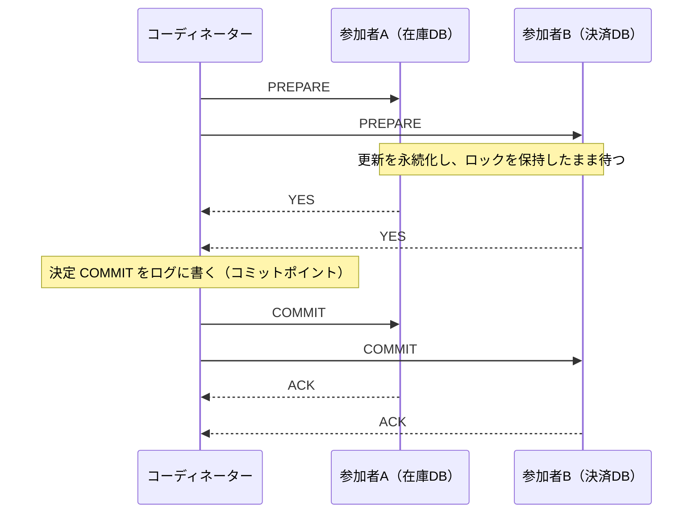
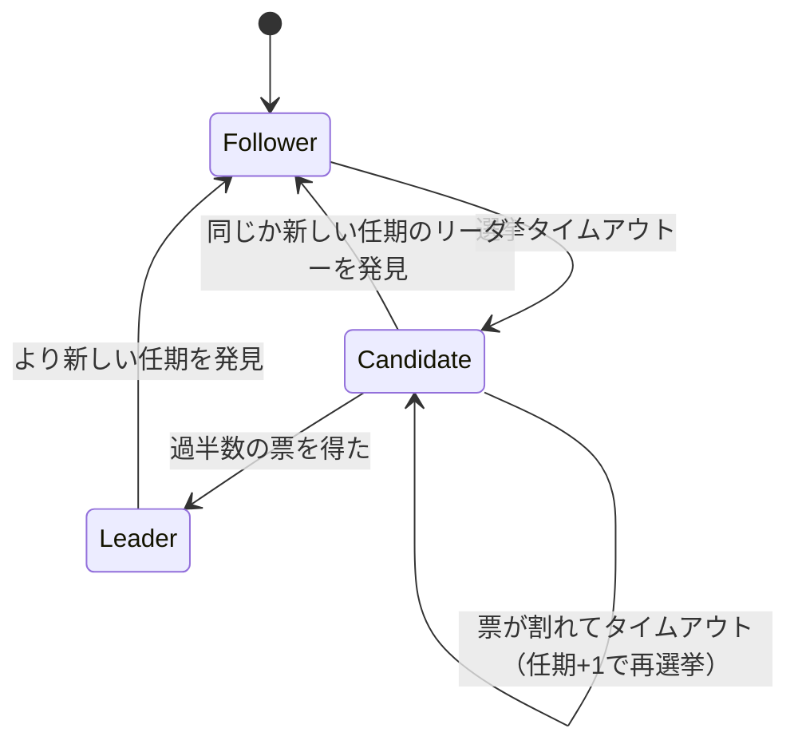
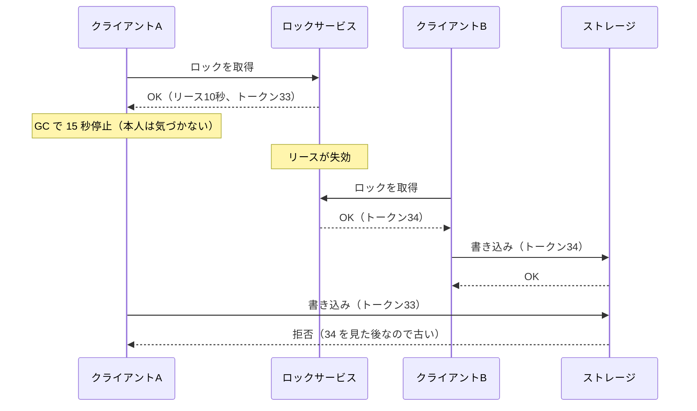
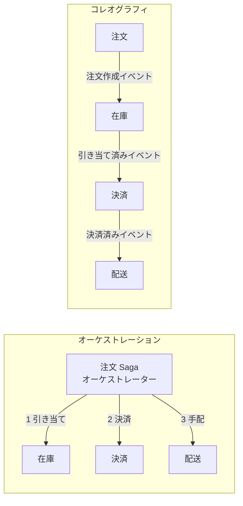

# 7.4 合意と協調

> 「リーダーは誰か」「このトランザクションはコミットされたか」「このロックを持っているのは誰か」——複数のノードが同じ答えに合意しなければならない場面は、分散システムの至るところにあります。部分故障と非同期性（7.1 章）の下で、全員が同じ答えに、しかも矛盾なく到達するのは驚くほど難しく、その解法である Paxos や Raft は分散システムの理論の中心にあります。この章では、合意の問題の本質、2 相コミットがブロックする理由、Raft の仕組み、協調サービスと分散ロックの正しい使い方、そしてサービスをまたぐ一貫性のための Saga を学び、「合意が必要な場面を見抜き、既製の仕組みを正しく使い、自作しない」判断ができるようになることを目指します。

| 項目 | 内容 |
|---|---|
| 学習時間の目安 | 本文 5h ＋ 演習 8h |
| 前提となる章 | [7.1 分散システムの本質](../01-fundamentals/README.md)、[7.2 レプリケーションと一貫性](../02-replication-and-consistency/README.md)、[6.3 トランザクションと同時実行制御](../../06-databases/03-transactions/README.md) |
| 演習 | [exercises/](exercises/)（Python） |
| キーワード | 合意, アトミックコミット, 2 相コミット, 3 相コミット, 過半数クォーラム, Paxos, Raft, 任期, リーダー選出, ログ複製, 複製状態機械, etcd, ZooKeeper, Consul, 分散ロック, リース, フェンシングトークン, Saga, 補償トランザクション, ビザンチン障害耐性 |

## この章のゴール

- [ ] 合意の問題の条件（一致・妥当性・終了）と、合意が必要になる場面（リーダー選出・アトミックコミット・設定管理・ロック・複製状態機械）を説明できる
- [ ] 2 相コミットの動作と、コーディネーターの故障で参加者がブロックする理由を説明し、シミュレーションで再現できる
- [ ] 過半数クォーラムの原理から、クラスタのノード数・配置と耐障害性・レイテンシを設計できる
- [ ] Raft のリーダー選出（任期・投票・ランダムなタイムアウト・ログの新しさの検査）を実装し、その安全性の根拠を説明できる
- [ ] 分散ロックの落とし穴（リースの失効とプロセスの一時停止）を説明し、フェンシングトークンで防げる
- [ ] サービスをまたぐ処理を Saga で設計し、補償・再試行・状態の永続化を実装できる
- [ ] 合意の代償を理解し、「自作しない」判断と、協調サービスの適切な選定・使い方ができる

## なぜ学ぶのか

合意の仕組みは、普段は目に見えないところで、システム全体の土台を支えています。

- **Kubernetes の頭脳は etcd**: Kubernetes は、クラスタのすべての状態（どの Pod をどこで動かすか、設定、シークレット）を etcd に保存し、etcd は Raft で複製されています。etcd が過半数を失うと、すでに動いている Pod は動き続けても、新しい変更は一切できなくなります。Kubernetes のドキュメントが etcd を奇数台（3 台や 5 台）で構成するよう勧めているのは、この章で学ぶ過半数の原理によるものです。
- **分散ロックをめぐる論争**: 2016 年、Martin Kleppmann はブログ記事 "How to do distributed locking" で、Redis の作者 Salvatore Sanfilippo が提案した分散ロックのアルゴリズム Redlock は、プロセスの一時停止や時計のずれの下で安全性を保証できないと論じ、Sanfilippo がこれに反論しました。この議論は、「ロックが何を保証し、何を保証しないか」を多くのエンジニアが考え直すきっかけになりました。
- **合意システム自体も壊れうる**: Cloudflare は 2020 年 11 月の障害の事後分析 "A Byzantine failure in the real world" で、ネットワーク機器の部分的な故障により一部のノード間だけが通信できない状態になり、etcd クラスタでリーダー選出が繰り返されたこと、そしてそれに依存していたデータベースの自動フェイルオーバーの仕組みにも影響が及んだことを報告しています。

合意は「使えば安全になる魔法」ではなく、何を保証し、何を仮定しているかを理解して使う道具です。そして、自分で実装するには最も危険な道具の一つです。

## 1. 合意とは何か

### 1.1 合意の問題

**合意**（consensus）の問題とは、複数のノードがそれぞれ値を提案し、全員が 1 つの値に決めることです。正しい合意アルゴリズムは、次の性質を満たします。

| 性質 | 意味 |
|---|---|
| 一致（agreement） | 故障していないノードは、すべて同じ値に決める |
| 妥当性（validity） | 決まる値は、どこかのノードが提案した値である（「常に 0 に決める」ような自明な解を除く） |
| 一意性（integrity） | 各ノードは一度しか決めない（決めた値を変えない） |
| 終了（termination） | 故障していないノードは、いずれ値に決める |

最初の 3 つは **安全性**（悪いことが起きない）、最後の 1 つは **活性**（良いことがいずれ起きる）です。7.1 章の FLP 不可能性が示したように、完全に非同期なシステムでは、1 台でも故障しうる限り、安全性と終了を両方とも保証する決定的なアルゴリズムはありません。実用的な合意アルゴリズムは、**安全性は常に守り、終了はネットワークが十分長く安定していることを仮定する**（部分同期）という形でこの壁を越えています。

### 1.2 合意が必要になる場面

一見「合意」に見えない問題の多くが、実は合意の問題です。

| 場面 | 何に合意するか | 合意がないと |
|---|---|---|
| リーダー選出 | 誰がリーダーか | リーダーが 2 人（スプリットブレイン）になり、データが分岐する |
| アトミックコミット | トランザクションをコミットするか | 一部のデータベースだけがコミットする |
| 設定・メンバーの管理 | クラスタの構成、どのノードが何を担当するか | ノードごとに違う構成を信じて動く |
| ロックとリース | ロックの保持者は誰か | 2 人が同時にロックを持つ |
| 一意性の制約 | このユーザー名は誰のものか | 同じ名前が 2 人に割り当てられる |
| 複製状態機械 | 操作の順序（ログの i 番目は何か） | レプリカごとに違う順序で操作を適用し、状態が食い違う |

最後の **複製状態機械**（replicated state machine）は特に重要です。決定的な状態機械（同じ状態に同じ操作を同じ順序で適用すれば、同じ結果になるもの）を複数のノードに置き、**操作のログの順序にだけ合意すれば、全ノードが同じ状態になる**という考え方で、Lamport が 1978 年の論文で示した発想に基づきます。etcd、ZooKeeper、Consul、CockroachDB や TiKV の各データ範囲は、いずれもこの形で作られています。ログの各位置に何を置くかを繰り返し合意することは、全ノードに同じ順序でメッセージを届ける **全順序ブロードキャスト**（total order broadcast）と等価であることが知られています。

## 2. アトミックコミットと 2 相コミット

### 2.1 問題

注文処理で「在庫データベースから引き当てる」と「決済データベースに記録する」を、両方ともコミットするか、両方ともしないかにしたいとします。各データベースは自分のトランザクションの原子性（[6.3](../../06-databases/03-transactions/README.md)）を保証できますが、2 つをまたぐ原子性は保証できません。一方がコミットし、もう一方が制約違反や障害でコミットできないと、データが矛盾します。これが **アトミックコミット**（atomic commit）の問題で、全員が「コミットかアボートか」に合意する、合意の特殊な形です。

### 2.2 2 相コミットの手順

**2 相コミット**（2PC, two-phase commit）は、**コーディネーター**（coordinator）と **参加者**（participant）で構成されます。



1. **フェーズ 1（準備）**: コーディネーターが全参加者に PREPARE を送る。参加者は、コミットに必要なものをすべてディスクに書き、ロックを保持したまま、YES（コミットできる）か NO を返す。
2. **決定**: 全員が YES ならコミット、1 人でも NO か応答なし（タイムアウト）ならアボートと決め、**その決定をコーディネーターのログに永続化する**。
3. **フェーズ 2（完了）**: 決定を全参加者に送る。参加者はそれに従い、ロックを解放する。届かなければ、届くまで再送する。

2PC の正しさを支えるのは、2 つの「引き返せない点」です。

- **参加者の約束**: YES と答えた参加者は、その後何があっても（クラッシュして再起動しても）、コミットと言われたら必ずコミットできなければならない。だから YES の前に PREPARED をディスクに書く。そして YES と答えた以上、**自分の判断でアボートすることはもうできない**。
- **コーディネーターのコミットポイント**: 決定をログに書いた瞬間に、トランザクションの結果は確定する。コーディネーターがその後クラッシュしても、再起動後にログを読んで同じ決定を伝え直す。

### 2.3 2PC はなぜブロックするのか

問題は、コーディネーターが PREPARE を送った後、決定を伝える前にクラッシュした場合です。YES と答えた参加者は、コミットすべきかアボートすべきかを知りません。自分で決めることはできません（他の参加者がすでにコミットしたかもしれないし、アボートしたかもしれない）。その間、**参加者はロックを握ったまま、コーディネーターの復旧を待つしかありません**。これを「in-doubt（結果待ち）」の状態と呼びます。

参加者どうしで問い合わせる **協調的な終了**（cooperative termination）は、誰かが結果を知っていれば（すでにコミットした、または NO と答えた参加者がいれば）解決できますが、全員が YES と答えて待っているだけなら、誰も結果を知らないので解決できません。演習 1〜3 で、この状況を再現します。

```python
from twopc import Coordinator, Participant, cooperative_termination, in_doubt

participants = [Participant("在庫DB"), Participant("決済DB"), Participant("ポイントDB")]
coordinator = Coordinator(participants, crash_at="after_prepare")
print("実行結果:", coordinator.run())
print("結果待ちでロックを握っている参加者:", in_doubt(participants))
print("参加者どうしで決着できるか:", cooperative_termination(participants))
print("コーディネーター復旧後:", coordinator.recover(), [p.state for p in participants])
```

```text
実行結果: CRASHED
結果待ちでロックを握っている参加者: ['ポイントDB', '在庫DB', '決済DB']
参加者どうしで決着できるか: None
コーディネーター復旧後: ABORTED ['ABORTED', 'ABORTED', 'ABORTED']
```

コーディネーターは決定をログに書く前に落ちたので、復旧時には「誰もコミットしていないはず」としてアボートで確定できます（presumed abort）。逆に、決定をログに書いた後に落ちたなら、復旧後にその決定を伝え直します。

### 2.4 実務の 2PC

分散トランザクションの標準としては X/Open の **XA** 規格があり、Java のトランザクションマネージャーや、MySQL（`XA START` 〜 `XA COMMIT`）、PostgreSQL（`PREPARE TRANSACTION`。既定の設定 `max_prepared_transactions = 0` では無効）などが対応しています。実務で問題になりやすいのは、次の点です。

- **放置された prepared トランザクション**: コーディネーター（アプリケーションサーバー）が消えたまま、prepared 状態のトランザクションがロックを握り続け、他の処理を止める。監視（PostgreSQL の `pg_prepared_xacts` など）と、手作業での解決手順が必要になる。
- **ヒューリスティックな決定**: 待ちきれずに管理者が参加者を個別にコミット・アボートすると、原子性が破れる。
- **性能**: 往復が増え、ロックを保持する時間が長くなる。1 つの参加者の遅さが全体の遅さになる。

一方で、2PC は分散データベースの内部では広く使われています。Spanner は、パーティションごとの Paxos グループをまたぐトランザクションに 2PC を使いますが、**コーディネーター自身が Paxos で複製されている** ので、1 台の故障でコーディネーターの状態が失われず、実用上ブロックしません。「2PC ＋ 合意」は、ブロックを避ける定石です。

### 2.5 3 相コミット

2PC のブロックを解消するため、Dale Skeen は 1981 年に **3 相コミット**（3PC）を提案しました。PREPARE と COMMIT の間に「全員がコミットの準備ができたことを確認した」段階を挟み、タイムアウトで安全に進めるようにしたものです。ただし 3PC は、メッセージの遅延に上限があること（同期的なネットワーク）を仮定しており、ネットワークが分断されると参加者どうしが異なる結論に達しうるため、実務ではほとんど使われません。現実的な解は、前節の「コーディネーターを合意で複製する」方式です。

## 3. 過半数クォーラム — 合意アルゴリズムの共通の骨格

### 3.1 過半数はなぜ効くのか

Paxos、Raft、ZooKeeper の Zab など、実用的な合意アルゴリズムはどれも **過半数**（majority）のクォーラムを使います。理由は単純です。**どの 2 つの過半数も、必ず 1 台以上重なる** からです。ある値が過半数に受け入れられたら、別の過半数を集めようとした人は、必ずその値を知っているノードに出会います。だから矛盾する 2 つの決定は生まれません。

2f + 1 台のクラスタは、過半数（f + 1 台）が生きていれば動けるので、f 台の故障に耐えます。

```python
print("ノード数  過半数  耐えられる故障数")
for n in range(1, 8):
    print(f"{n:>6}  {n // 2 + 1:>6}  {(n - 1) // 2:>12}")
```

```text
ノード数  過半数  耐えられる故障数
     1       1             0
     2       2             0
     3       2             1
     4       3             1
     5       3             2
     6       4             2
     7       4             3
```

この表から、実務の定石が分かります。

- **3 台か 5 台にする**。4 台は 3 台と同じく 1 台の故障にしか耐えないのに、過半数に必要な台数（3）が増えて書き込みが遅くなり、故障しうる台数も増える。偶数台には利点がない。
- **7 台以上はまれ**。書き込みのたびに過半数の応答を待つので、台数が増えるほど遅くなり、ネットワークの負荷も増える。読み取りを増やしたいなら、ZooKeeper のオブザーバーのような、投票しないメンバーを使う。
- **配置が耐障害性を決める**。5 台を 3 つのアベイラビリティゾーンに 2・2・1 台で置けば、どのゾーンが 1 つ丸ごと失われても 3 台以上が残る。2 つのゾーンに 3・2 台で置くと、3 台のゾーンが失われた時点で止まる。

### 3.2 合意のレイテンシは「k 番目に近いノード」で決まる

リーダーは、自分を含めて過半数の複製を確認するまで書き込みを確定できません。したがって書き込みのレイテンシは、**リーダーから k 番目に近いメンバーとの往復時間**（k は自分以外に必要な応答の数）でおおよそ決まります。東京のリーダーを例に、説明のための仮の往復時間で計算してみます。

```python
# 東京のリーダーから各レプリカへの往復時間（ms）。数値は説明のための仮定
rtt = {"東京（別のAZ）": 1, "大阪": 8, "ソウル": 35, "シンガポール": 70, "米国西海岸": 110}

def commit_latency(replicas):
    """リーダー＋replicas の構成で、過半数（リーダー自身を含む）の複製を待つ時間 = 必要数番目に速い往復。"""
    n = len(replicas) + 1
    need = n // 2 + 1 - 1                     # リーダー以外から必要な応答の数
    return sorted(rtt[r] for r in replicas)[need - 1]

for replicas in (["東京（別のAZ）", "大阪"],
                 ["東京（別のAZ）", "大阪", "ソウル", "シンガポール"],
                 ["大阪", "ソウル", "シンガポール", "米国西海岸"]):
    print(f"{len(replicas) + 1} 台（リーダー＋{'・'.join(replicas)}）: コミットに約 {commit_latency(replicas)} ms")
```

```text
3 台（リーダー＋東京（別のAZ）・大阪）: コミットに約 1 ms
5 台（リーダー＋東京（別のAZ）・大阪・ソウル・シンガポール）: コミットに約 8 ms
5 台（リーダー＋大阪・ソウル・シンガポール・米国西海岸）: コミットに約 35 ms
```

同じ 5 台でも、配置によってレイテンシが大きく変わります。「リージョン全体の障害に耐える」ことは、「リージョンをまたぐ往復を毎回払う」ことを意味する場合が多く、その代償を事業上許容できるかが設計判断になります（7.1 章の PACELC）。

### 3.3 任期（エポック）と投票

過半数に加えて、実用的な合意アルゴリズムに共通するもう 1 つの要素が、単調に増える **任期番号**（Raft では term、Paxos では提案番号、Zab では epoch、Viewstamped Replication では view）です。リーダーは任期ごとに過半数の投票で選ばれ、各ノードは 1 つの任期に 1 回しか投票しません。すると 1 つの任期にリーダーは高々 1 人です。古い任期のリーダーが復活しても、より大きな任期番号を見た時点で自分が古いと分かり、その指示は拒否されます。任期番号は、7.2 章のフェンシングと同じ役割を合意の内部で果たしているのです。

## 4. Paxos の直感

**Paxos** は、Leslie Lamport が考案し、論文 "The Part-Time Parliament"（1998 年に出版。独特の寓話的な書き方で理解されにくかったため、2001 年に "Paxos Made Simple" で平易に書き直された）で発表した、最も有名な合意アルゴリズムです。役割は 3 つです。

- **提案者**（proposer）: 値を提案する
- **受理者**（acceptor）: 提案に投票する。過半数の受理者が受け入れた値が選ばれる
- **学習者**（learner）: 選ばれた値を知る

1 つの値を決める基本の Paxos は、2 つのフェーズからなります。

1. **準備**: 提案者は、一意で単調に増える提案番号 n を選び、受理者に「n で準備（prepare）」を送る。受理者は、n がこれまでに約束した番号より大きければ「n 未満の提案はもう受け入れない」と約束し、**これまでに受け入れた最大番号の提案（あれば）を返す**。
2. **受理**: 過半数から約束を得た提案者は、返ってきた提案の中で最大番号のものの値を、なければ自分の値を、番号 n で「受理（accept）」を求める。受理者は、より大きな番号を約束していなければ受け入れる。過半数が受け入れたら、その値が選ばれる。

鍵は 1 の「受け入れた値を返す」と、2 の「その値を引き継ぐ」規則です。一度過半数に受け入れられた値があれば、後の提案者は準備の過半数の中で必ずそれに出会い、同じ値を提案し直すことになります。こうして、複数の提案者が競っても、選ばれる値は 1 つになります。実用では、安定したリーダーが準備フェーズを一度だけ行い、続く多数の値を受理フェーズだけで決める **Multi-Paxos** が使われます。Google の分散ロックサービス Chubby（Burrows, 2006）や Spanner は Paxos に基づいています。

Paxos は正しさの証明が簡潔な一方、実システムに必要な部分（リーダー選出、ログの管理、メンバーの変更、スナップショット）が論文では詳しく定められておらず、実装者ごとに異なる形で補われてきました。Google の技術者が Chubby の Paxos を実装した経験を報告した "Paxos Made Live"（Chandra ら, 2007）は、その難しさを率直に記しています。この「分かりにくさ」への答えとして設計されたのが Raft です。

## 5. Raft

### 5.1 全体像

**Raft**（Diego Ongaro と John Ousterhout, "In Search of an Understandable Consensus Algorithm", USENIX ATC 2014）は、理解しやすさを最優先に設計された合意アルゴリズムで、etcd、Consul、CockroachDB、TiKV などが採用しています。Raft は問題を 3 つに分けます。

1. **リーダー選出**: 任期ごとに 1 人のリーダーを選ぶ
2. **ログ複製**: リーダーがクライアントの操作をログに追加し、フォロワーに複製する
3. **安全性**: 選ばれたリーダーは、コミット済みのエントリをすべて持っていることを保証する

各ノードは、フォロワー・候補者・リーダーのいずれかの役割にあります。



すべてのメッセージには送り手の任期（term）が付いています。**自分より大きな任期を見たノードは、直ちにその任期に移ってフォロワーになる** のが共通の規則で、これが古いリーダーを自動的に退かせます。

### 5.2 リーダー選出

1. リーダーは定期的に **ハートビート**（空の AppendEntries）を送る。フォロワーは受け取るたびに選挙タイマーをリセットする。
2. **選挙タイムアウト** の間ハートビートが届かなければ、フォロワーは任期を 1 増やして候補者になり、自分に投票し、全員に **RequestVote** を送る。
3. 各ノードは 1 つの任期に 1 票だけ、先着順に投票する。ただし **候補者のログが自分より古ければ投票しない**（ログの新しさの検査）。
4. 過半数の票を得た候補者がリーダーになり、直ちにハートビートを送って他の選挙を止める。

複数の候補者が同時に立つと票が割れ、誰も過半数を得られないことがあります。Raft は、選挙タイムアウトを **一定の範囲からランダムに選ぶ**（論文では例として 150〜300 ms）ことでこれを解決します。たいてい 1 人が先にタイムアウトして選挙を始め、他のノードがタイムアウトする前に当選するからです。演習 4 のテストには、タイムアウトを全員同じ値に固定すると、全員が同時に立候補して票が割れ続け、永遠にリーダーが決まらないことを確かめるものがあります。

ログの新しさの検査は、安全性の要です。「最後のエントリの任期が大きい方が新しい。同じなら長い方が新しい」と比べて、自分より古いログの候補者には投票しません。コミット済みのエントリは過半数のノードにあり、当選にも過半数の票が必要なので、2 つの過半数の重なりに、必ずそのエントリを持つ投票者がいます。その投票者は、そのエントリを持たない候補者に投票しないので、**コミット済みのエントリを持たない候補者は当選できない** のです（リーダー完全性）。

### 5.3 ログ複製とコミット

リーダーは、クライアントの操作を自分のログに追加し、**AppendEntries** でフォロワーに送ります。AppendEntries には、新しいエントリの直前のエントリの位置と任期（`prev_log_index`, `prev_log_term`）が付いていて、フォロワーは自分のログのその位置のエントリと一致しなければ拒否します（一貫性の検査）。拒否されたリーダーは、もっと前の位置から送り直します。これを繰り返すと、フォロワーのログはリーダーのログと一致する位置まで巻き戻り、そこから先がリーダーのものに置き換わります。

リーダーは、**現在の任期のエントリが過半数のノードに複製されたら、それをコミット済み** とし、状態機械に適用します。コミットの位置はハートビートでフォロワーにも伝わります。ここで微妙な規則があります。**過去の任期のエントリは、過半数に複製されていても、数を数えて直接コミットしてはいけません**。過去の任期のエントリは、後に別のリーダーに上書きされうるからです（論文の Figure 8 が、この状況を具体的に示しています）。現在の任期のエントリがコミットされれば、それより前のエントリも一緒にコミットされます。実装では、リーダーが就任時に中身のない（no-op）エントリを追加して、過去の任期のエントリを速やかにコミットすることが多いです。

### 5.4 安全性の性質

Raft の論文は、次の性質が常に成り立つことを示しています。

| 性質 | 内容 |
|---|---|
| 選出の安全性（Election Safety） | 1 つの任期に選ばれるリーダーは高々 1 人 |
| リーダーの追記のみ（Leader Append-Only） | リーダーは自分のログのエントリを上書き・削除せず、追加するだけ |
| ログの一致（Log Matching） | 2 つのログの同じ位置のエントリの任期が等しければ、そこまでのログはすべて等しい |
| リーダーの完全性（Leader Completeness） | ある任期でコミットされたエントリは、以後のすべてのリーダーのログにある |
| 状態機械の安全性（State Machine Safety） | あるノードがある位置のエントリを適用したら、他のノードがその位置に別のエントリを適用することはない |

演習のテストは、これらのうち「選出の安全性」と「状態機械の安全性」を、ノードの停止・再起動・ネットワークの分断をランダムに起こしながら、毎ミリ秒検査します。演習 4〜5 の実装を使うと、次のように動きます。

```python
from raft_election import RaftCluster

c = RaftCluster(n=5, seed=42)
c.run_until(lambda: len(c.leaders()) == 1, 3000)
leader = c.leaders()[0]
print(f"{c.now:>5} ms: ノード {leader} が任期 {c.nodes[leader].current_term} のリーダーに選ばれた")
c.crash(leader)
print(f"{c.now:>5} ms: ノード {leader} が停止")
c.run_until(lambda: len(c.leaders()) == 1, 3000)
new = c.leaders()[0]
print(f"{c.now:>5} ms: ノード {new} が任期 {c.nodes[new].current_term} のリーダーに選ばれた")
for cmd in ("x=1", "y=2"):
    c.nodes[new].client_request(cmd)
c.run(300)
print("各ノードの適用済みコマンド:", [n.applied if n.id != leader else "（停止中）" for n in c.nodes])
print("任期ごとのリーダー:", dict(c.leader_history))
```

```text
  164 ms: ノード 1 が任期 1 のリーダーに選ばれた
  164 ms: ノード 1 が停止
  333 ms: ノード 3 が任期 2 のリーダーに選ばれた
各ノードの適用済みコマンド: [['x=1', 'y=2'], '（停止中）', ['x=1', 'y=2'], ['x=1', 'y=2'], ['x=1', 'y=2']]
任期ごとのリーダー: {1: {1}, 2: {3}}
```

リーダーが停止してから新しいリーダーが選ばれるまで、約 170 ms かかっています。この間、書き込みはできません。選挙タイムアウトを短くすれば切り替えは速くなりますが、ネットワークの一時的な遅れで不要な選挙が起きやすくなります（7.1 章のタイムアウトのトレードオフそのものです）。

### 5.5 実装の現実

論文のアルゴリズムを本番で使うには、さらに多くのことが必要です。

- **永続化**: 任期・投票先・ログは、応答を返す前にディスクに書き（fsync し）なければならない。これを怠ると、再起動後に同じ任期で 2 回投票し、リーダーが 2 人になりうる。
- **メンバーの変更**: ノードの追加・削除の途中で、古い構成と新しい構成の過半数が別々にリーダーを選ばないよう、共同合意（joint consensus）や 1 台ずつの変更といった手順が必要（Ongaro の博士論文で詳しく扱われている）。
- **ログの圧縮**: ログは無限に伸びるので、状態のスナップショットを取り、それより前のログを捨てる。
- **線形化可能な読み取り**: リーダーに見えるノードが、分断された古いリーダーかもしれない。etcd は、読み取りのたびに自分がまだリーダーであることを過半数に確認する方法（ReadIndex）を使う。時計が正しいことを前提に、リースの期間中は確認を省く方法もあるが、7.1 章で見た時計の問題を抱え込む。
- **妨害の防止**: 一部のノードとだけ通信できない（部分的に分断された）ノードが、選挙を繰り返して任期を上げ続け、正常なリーダーを何度も退かせることがある。本番の実装では、本当に立候補する前に当選の見込みを確かめる PreVote や、過半数と通信できないリーダーが自ら退く CheckQuorum などの拡張が使われる。冒頭の Cloudflare の事例は、部分的な分断が合意システムにとってどれほど厄介かを示している。

## 6. 協調サービスと分散ロック

### 6.1 協調サービスが提供するもの

アプリケーションが合意を必要とするとき、自分で Raft を実装するのではなく、合意の上に作られた **協調サービス**（coordination service）を使います。

| サービス | 合意の方式 | 主な利用例 |
|---|---|---|
| etcd | Raft | Kubernetes のクラスタ状態、設定、リーダー選出 |
| ZooKeeper | Zab | Hadoop・HBase などの協調、Kafka（旧来の構成） |
| Consul | Raft | サービスディスカバリ、設定、ヘルスチェック |

これらが提供する機能は、似通っています。

- **線形化可能な書き込みと、条件付きの更新**（「現在の値やバージョンが X なら Y に書き換える」compare-and-set、トランザクション）。ZooKeeper の読み取りは既定では各サーバーから返されるので古いことがあり、最新が必要なら `sync` を先に呼ぶ、というように、読み取りの一貫性は製品ごとに確認が必要
- **変更の監視**（watch）: キーが変わったら通知を受ける
- **リースとセッション**: クライアントが生きている間だけ存在するキー（etcd のリース、ZooKeeper のエフェメラルノード）。クライアントが落ちれば自動的に消えるので、リーダー選出やメンバーの管理に使える
- **単調に増える番号**: etcd のリビジョン、ZooKeeper のトランザクション ID（zxid）やノードのバージョン。後述のフェンシングトークンに使える

一方、協調サービスは **少量の重要なメタデータ** のためのもので、大量のデータや高頻度の書き込みには向きません。すべての書き込みが合意を経るので、スループットには限りがあり、etcd にはデータベースの大きさの上限（既定では数 GB 程度。設定で変更可能）もあります。アプリケーションのデータ置き場として使うと、それに依存するすべて（Kubernetes なら、クラスタ全体）を道連れにします。

### 6.2 分散ロックとリース

分散ロックを使う目的は 2 つに分けて考えるべきだ、と Kleppmann は指摘しています。

- **効率のため**: 同じ仕事を 2 回しないため（同じレポートを 2 つのワーカーが作らないように）。まれにロックが破れても、無駄な仕事が増えるだけ。
- **正しさのため**: 2 人が同時に書くとデータが壊れるため。ロックが破れることは許されない。

分散ロックはほぼ必ず、期限付きの **リース**（lease, Gray と Cheriton, 1989）として実装されます。保持者が落ちても、期限が来れば自動的に解放されるからです。しかし 7.1 章で見たように、プロセスは気づかないうちに止まります。



A は書き込む直前にリースが有効か確かめるかもしれませんが、確かめた直後に止まれば同じことです。**ロックの保持者の側でどれほど注意しても、この問題は防げません**。防げるのは、書き込みを受け付ける側だけです。ロックを取るたびに単調に増える番号（**フェンシングトークン**, fencing token）を払い出し、ストレージは「これまでに見た最大の番号より小さい番号の書き込み」を拒否します。演習 6 で実装すると、次のように動きます。

```python
from fencing import FencedStorage, LockService, StaleTokenError

now = [0]
locks = LockService(lease_ms=10_000, clock=lambda: now[0])
storage = FencedStorage()

token_a = locks.acquire("report.csv", "A")      # A がロックを取得（トークン 1）
now[0] += 15_000                                 # A が GC で 15 秒停止している間にリースが失効
token_b = locks.acquire("report.csv", "B")      # B がロックを取得（トークン 2）
storage.write("report.csv", "B の集計結果", token_b)
try:
    storage.write("report.csv", "A の古い集計結果", token_a)   # 目覚めた A が書き込もうとする
except StaleTokenError as e:
    print("拒否:", e)
print("保存されている内容:", storage.read("report.csv"))
```

```text
拒否: report.csv: トークン 1 は古い（最新 2）
保存されている内容: B の集計結果
```

トークンの出どころとしては、etcd のリビジョンや ZooKeeper の zxid のように、合意によって単調性が保証された番号が使えます。Google の Chubby にも、ロックの世代番号を含む「シーケンサー」を渡してサーバー側で検査させる仕組みがありました。フェンシングには **ストレージ側の協力が必要** なことが最大の制約で、外部の API やファイルシステムのように番号を検査できない相手には使えません。その場合は、条件付き書き込み（下記）で代用できないかを考えます。

### 6.3 Redlock をめぐる議論

Redlock は、独立した複数の Redis に同時にロックを取り、過半数で取れたら成功とするアルゴリズムです。Kleppmann は 2016 年の記事で、(1) Redlock はフェンシングトークンを生成しないので、一時停止したクライアントの問題を防げない、(2) 安全性が、各ノードの時計の進み方がほぼ正しいこと、ネットワークの遅延やプロセスの一時停止がリースの期間より十分短いことといった、タイミングについての仮定に依存している、と指摘しました。Sanfilippo は、時計の仮定は実用上妥当であり、一時停止の問題はどのロックにも共通だと反論しました。

実務上の結論は次のように整理できます。

- **効率のためのロック** なら、1 台の Redis の `SET key value NX PX <ミリ秒>` で十分なことが多い。まれな重複は許容する。
- **正しさのためのロック** が必要なら、合意に基づくシステム（etcd、ZooKeeper など）でロックを取り、**フェンシングトークンをストレージ側で検査する**。それができないなら、ロックに頼らない設計を考える。

### 6.4 ロックに頼らない方法

多くの場合、分散ロックそのものを避ける方が安全です。

- **条件付き書き込み**（楽観的並行性制御）: `UPDATE ... SET ..., version = version + 1 WHERE id = ? AND version = ?`、HTTP の `If-Match`、DynamoDB の条件式、クラウドストレージの世代番号付きの書き込み。読んだ時点から変わっていなければ書く。
- **一意性の制約**: 「同じ注文番号を 2 回処理しない」なら、データベースの一意制約で重複を拒否する（7.1 章の冪等キー）。
- **単一の書き手**: パーティションごとに書き手を 1 つに決める（Kafka のパーティションを 1 つのコンシューマだけが処理する、など。[7.5](../05-messaging-and-events/README.md)）。

## 7. Saga — サービスをまたぐ一貫性

### 7.1 マイクロサービスで 2PC を避ける理由

注文・在庫・決済・配送が別々のサービス（別々のデータベース）になっていると、それらをまたぐ処理の原子性が問題になります。2PC で束ねることもできますが、

- 全サービスが同時に稼働していないと処理が進まない（可用性の掛け算）
- 準備から完了まで、各サービスがロックを握り続ける。1 つが遅いと全員が待つ
- コーディネーターの障害で全員がブロックする
- 外部の決済代行や SaaS の API は、そもそも XA に参加できない

といった理由で、サービス間では避けられることがほとんどです（サービスの境界の設計は [9.3 ドメイン駆動設計とモジュール分割](../../09-architecture/03-domain-driven-design/README.md)）。

### 7.2 Saga

**Saga**（Hector Garcia-Molina と Kenneth Salem, 1987）は、長い処理を、それぞれがローカルにコミットされる一連のトランザクション T1, T2, …, Tn に分け、各 Ti に、その効果を意味的に取り消す **補償トランザクション** Ci を用意する方式です。途中の Tj が失敗したら、Cj−1, …, C1 を逆順に実行します。

```text
成功:  T1 → T2 → T3 → T4
失敗:  T1 → T2 → T3 ✗ → C2 → C1   （T3 は完了していないので補償しない）
```

Saga が保証するのは、最終的に「全部実行された」か「実行された分がすべて補償された」かのどちらかになることです。ACID のうち **分離性（I）はありません**。途中の状態（在庫は引き当てたが決済はまだ）が他の処理から見えます。

### 7.3 オーケストレーションとコレオグラフィ



| | オーケストレーション | コレオグラフィ |
|---|---|---|
| 進め方 | 中央のオーケストレーターが各サービスに指示する | 各サービスがイベントに反応して次に進む（7.5 章） |
| 流れの見通し | 1 か所のコードで全体が分かる | 流れが各サービスに分散し、全体像を追いにくい |
| 結合 | オーケストレーターが各サービスを知る | サービスはイベントだけを知る |
| 向いている場面 | 手順が多い、補償が複雑、状態の追跡が重要 | 手順が少なく単純、サービスの独立性を重視 |

手順が 3〜4 を超えたり、補償が複雑になったりするなら、オーケストレーションの方が理解・運用しやすいことが多いです。Temporal や AWS Step Functions のような **ワークフローエンジン** は、状態の永続化、再試行、タイムアウト、再開をオーケストレーターの基盤として提供します。

### 7.4 補償とステップの設計

Saga の設計で最も重要なのは、各ステップの性質を見極めることです（Chris Richardson の "Microservices Patterns" の整理）。

- **補償可能なトランザクション**: 後で取り消せるもの（在庫の引き当て → 解放、クレジットカードの与信枠の確保 → 取消）
- **ピボットトランザクション**: ここを越えたら後戻りしない分岐点（売上の確定など）。ピボットが成功したら、以降は前進しかない
- **再試行可能なトランザクション**: ピボットの後に置く、必ず成功させるもの（配送の手配、メール送信）。失敗しても再試行し続ける

そして、補償は「データを消す」ことではなく **意味的な取り消し** です。決済の補償は、決済の記録を DELETE することではなく、返金という新しい取引です。送ってしまったメールは取り消せないので、「キャンセルのお知らせ」を送ります。だからこそ、取り消しにくいステップ（外部への通知など）はなるべく後ろに置きます。

加えて、次の性質が不可欠です。

- **冪等性**: オーケストレーターは、落ちた後に「実行中だった」ステップをやり直します。ステップも補償も、2 回実行されても安全でなければなりません（7.1 章の冪等キーを使う）。
- **状態の永続化**: どのステップまで完了したかを、遷移のたびに保存する。演習 7 では、ステップを始める前と完了した後に状態を保存し、プロセスが落ちても続きから再開できるようにします。

```python
from saga import InMemorySagaStore, SagaOrchestrator, Step

log = []
def op(name, fail=False):
    def run(ctx):
        log.append(name)
        if fail:
            raise RuntimeError(f"{name} に失敗")
    return run

steps = [
    Step("在庫の引き当て", op("在庫の引き当て"), op("在庫の解放")),
    Step("決済", op("決済"), op("返金"), max_attempts=3),
    Step("配送の手配", op("配送の手配", fail=True), op("配送のキャンセル")),
]
result = SagaOrchestrator(steps, InMemorySagaStore()).start("order-42", {"order_id": 42})
print(result.status, "/ 実行順:", " → ".join(log))
print("補償したステップ:", result.compensated, "/ エラー:", result.error)
```

```text
COMPENSATED / 実行順: 在庫の引き当て → 決済 → 配送の手配 → 返金 → 在庫の解放
補償したステップ: ['決済', '在庫の引き当て'] / エラー: 配送の手配: RuntimeError('配送の手配 に失敗')
```

補償自体が失敗し続けることもあります（返金先の決済代行が停止している、など）。そのときは状態を「失敗（要対応）」にして人間に知らせ、原因が取り除かれたら続きから補償を再開できるようにしておきます。

### 7.5 分離性の欠如への対策

Saga には分離性がないので、途中の状態が他の処理に見え、6.3 章の異常に似た問題が起きます。例えば、在庫を引き当てた後に決済が失敗して在庫が戻るまでの間、別の顧客には「在庫なし」に見えます。Richardson は次のような対策を挙げています。

| 対策 | 内容 | 例 |
|---|---|---|
| セマンティックロック | レコードに「処理中」の印を付け、他の処理がそれを見て待つか拒否する | 注文の状態を `PENDING` にし、完了か補償で外す |
| 可換な更新 | どの順序で適用しても同じ結果になる更新にする | 残高を「上書き」ではなく「加算・減算」で更新する |
| 悲観的な順序 | 取り消されると困るステップを後ろに置く | ポイントの付与は決済の確定後にする |
| 値の再読 | 更新の直前に値を読み直し、変わっていれば中止する | 楽観的並行性制御 |

## 8. ビザンチン障害耐性と、合意の代償

### 8.1 ビザンチン障害耐性

ここまでの合意アルゴリズムは、ノードが停止したり遅れたりはしても、**嘘はつかない** ことを前提にしていました。ノードが任意の（悪意のある）振る舞いをしうる場合の合意を、**ビザンチン将軍問題**（Lamport, Shostak, Pease, 1982）と呼びます。f 台の裏切りに耐えるには 3f + 1 台以上が必要で、通信量も多くなります。実用的なアルゴリズムとしては PBFT（Castro と Liskov, 1999）が知られ、参加者が相互に信頼できない環境、典型的にはブロックチェーンで使われています。ビットコイン（2008 年の論文）は、計算量の証明（proof of work）で誰が次のブロックを作るかを決める方式で、確定が確率的です。イーサリアムは 2022 年に、保有量に基づく証明（proof of stake）へ移行しました。

企業の内部システムで、ビザンチン障害耐性が必要になることはまれです。自社のサーバーどうしは、少なくとも悪意を持たないと仮定できるからです。複数の組織が相互に信頼せずに 1 つの台帳を共有する必要があるかどうかが、判断の分かれ目になります。多くの場合、信頼できる第三者のデータベースと、署名や監査ログ（[11.2 暗号技術の基礎](../../11-security/02-cryptography/README.md)）の方が、はるかに安く速く目的を達成できます。

### 8.2 合意の代償と使いどころ

合意は強力ですが、代償があります。

| 代償 | 内容 |
|---|---|
| レイテンシ | 書き込みのたびに、過半数との往復とディスクへの fsync が必要 |
| スループット | すべての書き込みがリーダーを通るので、リーダー 1 台の性能が上限 |
| 可用性 | 過半数と通信できない側は何もできない（CAP 定理の C を選んでいる） |
| 運用 | メンバーの変更、バックアップと復元、バージョンアップ、ディスクの遅さへの感度 |

そのため、実用的なシステムは **合意を少量の重要なメタデータに限って使い、大量のデータの流れは合意の外に置く** のが定石です。例えば Kafka は、クラスタのメタデータ（どのブローカーがどのパーティションのリーダーか）を合意（KRaft）で管理し、メッセージの複製そのものはパーティションごとのリーダーとフォロワーの仕組みで行います。

そして最も重要な教訓は、**合意アルゴリズムを自分で実装しない** ことです。論文の数ページのアルゴリズムと、本番で何年も動く実装との間には、永続化、メンバーの変更、スナップショット、性能の最適化、そして 7.1 章で見た無数の障害の組み合わせという、大きな隔たりがあります。etcd、ZooKeeper、Consul といった実績のある協調サービスや、合意を内蔵したマネージドのデータベースを使いましょう。どうしても組み込みたい場合も、etcd の raft ライブラリや HashiCorp の raft ライブラリのように、広く使われてきた実装を選びます。この章の演習で Raft を実装するのは、仕組みを理解して正しく使うため、そして「自作してはいけない理由」を実感するためです。

## よくある落とし穴

1. **Redis の `SET NX` と TTL だけで作ったロックを、正しさのために使う**。リースの失効とプロセスの一時停止で 2 人が同時にロックを持ちうる。正しさが必要なら、合意に基づくシステムのロックとフェンシングトークンを使い、ストレージ側で検査する。
2. **リースの保持者が、自分のリースの失効に気づけると思い込む**。GC や VM の一時停止は、本人に気づかれずに起きる。書き込む直前の確認では防げない。
3. **合意のクラスタを偶数台（4 台など）にする、または 1 つのアベイラビリティゾーンに寄せる**。4 台は 3 台と同じく 1 台の故障にしか耐えない。台数だけでなく、故障の単位（ゾーン）をまたいだ配置を設計する。
4. **etcd や ZooKeeper をアプリケーションのデータストアとして使う**。書き込みはすべて合意を経るので遅く、容量の上限もある。負荷をかけると、それに依存する基盤全体（Kubernetes など）が道連れになる。
5. **2PC の prepared トランザクションを監視していない**。コーディネーターが消えると、ロックを握ったまま残り、他の処理を止める。prepared トランザクションの一覧と経過時間を監視し、解決手順を用意する。
6. **Saga の補償を「DELETE」で実装する、または補償できない処理を先に行う**。補償は意味的な取り消し（返金・キャンセル通知）であり、外部に出た副作用は消せない。取り消しにくいステップ（外部への通知、売上の確定）は後ろに置く。
7. **Saga のステップや補償を冪等にしない**。オーケストレーターの再起動や再試行で同じステップが 2 回実行され、二重の決済や二重の返金が起きる。すべてのステップに冪等キーを通す。
8. **合意アルゴリズムやリーダー選出を自作して本番に投入する**。まれな障害の組み合わせでしか現れないバグが、最悪のタイミングで顕在化する。実績のある実装を使う。

## CTOの視点

1. **「ここに合意は本当に必要か」を問う**。リーダー選出、ロック、一意性の保証が設計に現れたら、それは合意の問題です。設計レビューでは「この処理は、同時に 2 つ実行されたら何が壊れるか」「条件付き書き込みや一意制約で代替できないか」を問い、必要なら既製の協調サービスを使うことを原則にしましょう。手作りのリーダー選出や分散ロックは、レビューで必ず止めるべき項目です。
2. **合意のクラスタのトポロジは、可用性とレイテンシの経営判断**。3 台か 5 台か、ゾーンやリージョンをどうまたぐかで、耐えられる障害と書き込みのレイテンシが決まります。「リージョン全体の障害に耐える」要件は、毎回リージョンをまたぐ往復という形で、すべての書き込みにコストを課します。要件（RTO・RPO）とコストを並べて、事業側と合意しましょう。
3. **サービスの境界と Saga の数を健全性の指標にする**。2 つのサービスの間に Saga や分散トランザクションが大量に必要なら、境界の引き方が間違っている可能性があります（9.3 章）。一方、Saga が必要な処理が組織に多いなら、ワークフローエンジンをプラットフォームとして整備し、各チームが状態の永続化・再試行・補償を毎回自作しないようにする投資が見合います。
4. **障害対応で問うべき質問**。「リーダーが 2 人いた」「同じジョブが 2 回走った」という報告を受けたら、「フェンシングはあったか」「リースの長さと GC の停止時間の関係は」「時計の同期は正常だったか」「合意のクラスタは過半数を保っていたか」を確認しましょう。2PC を使うシステムでは、prepared のまま残ったトランザクションの有無も確認事項です。
5. **分散システムの専門性をどこに置くか**。合意やロックの誤用は、発生はまれでも被害が大きい障害を生みます。全員がこの章の深さを持つ必要はありませんが、設計レビューでこれらの問題を指摘できる人を組織に置き、重要な協調の部分は既製の仕組みとマネージドサービスに寄せ、自前の実装を最小限にする、という方針を CTO が明示すべきです。

## 演習

演習コードは [exercises/](exercises/) にあります。docstring の仕様を読み、`raise NotImplementedError(...)` を実装に置き換えてください。解答例は [solutions/](solutions/) にありますが、まずは自力で取り組みましょう。

```bash
python3 tools/check.py 7.4        # リポジトリのルートで実行
python3 tools/check.py -v 7.4     # 詳しい出力
```

| # | 難易度 | 内容 | ファイル / 対象 |
|---|---|---|---|
| 1 | ★☆☆ | 2PC の参加者: 約束の永続化、冪等なコミット・アボート、クラッシュと復帰 | [twopc.py](exercises/twopc.py) / `Participant` |
| 2 | ★★☆ | 2PC のコーディネーター: 投票の収集、コミットポイント、障害の注入と復旧（presumed abort） | [twopc.py](exercises/twopc.py) / `Coordinator` |
| 3 | ★★☆ | ブロックの検出と、参加者どうしの協調的な終了。ランダムな障害の下での原子性の検査 | [twopc.py](exercises/twopc.py) / `in_doubt`, `is_atomic`, `cooperative_termination` |
| 4 | ★★★ | Raft のリーダー選出: 任期、投票、ランダムなタイムアウト、ログの新しさの検査、ハートビート。1 任期 1 リーダー、少数派では選べないことなどをシミュレーションで検査 | [raft_election.py](exercises/raft_election.py) / `RaftNode` |
| 5 | ★★★ | 発展（任意）: Raft のログ複製と過半数によるコミット。ランダムな障害の下で状態機械の安全性を検査（`ENABLE_LOG_REPLICATION = True` にするとテストが有効になる） | [raft_election.py](exercises/raft_election.py) / `RaftNode` |
| 6 | ★★☆ | リース付きのロックサービスと、フェンシングトークンを検査するストレージ。一時停止したクライアントのシナリオ | [fencing.py](exercises/fencing.py) / `LockService`, `FencedStorage` |
| 7 | ★★☆ | Saga オーケストレーター: 逆順の補償、冪等なステップの再試行、状態の永続化と再開、補償の失敗 | [saga.py](exercises/saga.py) / `SagaOrchestrator` |
| 8 | ★★☆ | 記述: EC の注文処理の Saga の設計（下記） | — |

演習 4 はこの部で最も手ごわい演習です。テストが失敗したら、同じ `seed` の `RaftCluster` を作って `step()` を 1 ms ずつ進め、各ノードの `role` と `current_term` を表示してみてください。シミュレーションは決定的なので、何度でも同じ状況を再現できます。

### 演習 8（記述）: EC の注文処理の Saga

あなたは EC サイトの注文処理を、次のサービスに分けて設計しています。注文サービス、在庫サービス、ポイントサービス、決済サービス（外部の決済代行を呼ぶ。クレジットカードの与信の確保と、売上の確定を別々に行える）、配送サービス（外部の配送業者の API を呼ぶ）、通知サービス（メール送信）。

1. 注文確定までのステップを並べ、各ステップを「補償可能」「ピボット」「再試行可能」に分類し、補償の内容を書いてください。
2. 在庫を引き当ててから決済が終わるまでの間に、同じ商品の最後の 1 個を別の顧客が購入しようとしたらどうなるべきですか。分離性の欠如への対策を 1 つ選んで説明してください。
3. オーケストレーターが「決済」のステップの途中でクラッシュしました。再開したときに二重決済を防ぐには、何が必要ですか。
4. 返金（補償）が、決済代行の障害で失敗し続けています。システムと運用はどう振る舞うべきですか。

<details>
<summary>解答例</summary>

1. ステップの例:

| 順 | ステップ | 分類 | 補償 |
|---|---|---|---|
| 1 | 注文を `PENDING` で作成 | 補償可能 | 注文を `CANCELLED` にする |
| 2 | 在庫の引き当て | 補償可能 | 引き当ての解放 |
| 3 | ポイントの利用（減算） | 補償可能 | ポイントの払い戻し |
| 4 | クレジットカードの与信の確保 | 補償可能 | 与信の取消 |
| 5 | 売上の確定 | **ピボット** | （ここから後は前進のみ。やむを得ない場合は返金という別の業務処理） |
| 6 | 配送の手配 | 再試行可能 | — |
| 7 | 注文を `CONFIRMED` にし、確認メールを送る | 再試行可能 | — |

取り消しにくいもの（売上の確定、外部への通知）を後ろに置き、失敗しやすく取り消しやすいもの（在庫・与信）を前に置くのがポイント。

2. 対策の例: **セマンティックロック**。引き当て中の在庫は「予約済み」として数え、他の顧客には在庫なしとして扱う（あるいは「残りわずか・確保中」と表示する）。Saga が補償で終われば予約を解放して販売可能に戻す。予約には期限を付け、Saga が異常終了しても在庫が永久に塩漬けにならないようにする。
3. 決済のステップを冪等にする。オーケストレーターは Saga ごと・ステップごとに一意な冪等キー（例: `order-42:authorize`）を生成して状態とともに保存し、決済代行へのリクエストに付ける。再開時は同じキーで再送するので、決済代行（またはその手前の自社の決済サービス）が重複を検出して最初の結果を返す。あわせて、再開時に「そのキーの処理結果」を問い合わせる手段も用意する。
4. 補償は諦められないので、指数バックオフで再試行を続け、一定回数・時間を超えたら Saga を「失敗（要対応）」にしてアラートを出す。運用者向けに、失敗した Saga の一覧・原因・再開の操作を用意し、決済代行が復旧したら続きから補償を再開する。顧客には「返金手続き中」と表示し、長引く場合の問い合わせ対応の手順も決めておく。

採点の観点:

- ステップの分類と補償の内容（特に「与信の取消」と「売上確定後の返金」の区別）、冪等キーによる二重決済の防止が書けていれば合格ライン。
- セマンティックロックと期限、補償の失敗時の運用（可視化・アラート・再開手順・顧客対応）まで設計できていれば、実務の設計をリードできる水準です。

</details>

## 理解度チェック

**Q1. 2PC で YES と答えた参加者は、コーディネーターから応答がなくなったとき、なぜ自分の判断でアボートできないのですか。**

<details>
<summary>解答</summary>

YES と答えた時点で、参加者は「コミットと言われたら必ずコミットする」と約束しています。コーディネーターは全員の YES を集めて COMMIT を決定し、すでに他の参加者にコミットを伝えたかもしれません。この参加者が独断でアボートすると、他の参加者のコミットと矛盾して原子性が破れます。逆に独断でコミットすると、実は他の参加者が NO と答えていて決定がアボートだった場合に矛盾します。結果を知るには、コーディネーターの復旧を待つか、結果を知っている他の参加者に問い合わせる（協調的な終了）しかありません。全員が YES で待っているだけなら、誰も結果を知らないのでブロックします。

</details>

**Q2. etcd のクラスタを 4 台で構成する案に対して、どう助言しますか。3 つのアベイラビリティゾーンに 5 台を置くなら、どう配置しますか。**

<details>
<summary>解答</summary>

4 台の過半数は 3 台なので、耐えられる故障は 1 台で、3 台構成と変わりません。それでいて書き込みは 3 台の応答を待つ必要があり、故障しうるノードも増えます。3 台か 5 台にすべきです。5 台を 3 ゾーンに置くなら 2・2・1 台にすれば、どの 1 ゾーンが丸ごと失われても 3 台以上（過半数）が残ります。2 ゾーンに 3・2 台で置くと、3 台のゾーンが失われた時点で過半数を失うので、ゾーン障害に耐えられません。

</details>

**Q3. Raft の RequestVote で、候補者のログが自分より古ければ投票しないのはなぜですか。**

<details>
<summary>解答</summary>

コミット済みのエントリを持たないノードがリーダーになると、そのリーダーはフォロワーのログを自分のログに合わせて上書きするので、コミット済み（＝クライアントに成功を返した）エントリが消えてしまうからです。コミット済みのエントリは過半数のノードにあり、当選にも過半数の票が必要なので、2 つの過半数の重なりに、そのエントリを持つ投票者が必ずいます。その投票者が「自分より古いログの候補者には投票しない」規則を守るので、コミット済みのエントリを持たない候補者は当選できません（リーダーの完全性）。

</details>

**Q4. Raft で、ある瞬間に「自分がリーダーだ」と思っているノードが 2 台存在することはありえますか。その場合、何が問題になり、どう防ぎますか。**

<details>
<summary>解答</summary>

ありえます。ただし任期が異なります。ネットワークが分断され、古いリーダーが少数派の側に取り残されると、多数派の側では新しい任期のリーダーが選ばれますが、古いリーダーはそれを知らずに自分がリーダーだと思い続けます。古いリーダーは過半数の複製を得られないので、書き込みをコミットすることはできません（安全性は保たれる）。問題は読み取りで、古いリーダーが手元のデータで読み取りに応答すると、古い値を返してしまいます。これを防ぐには、読み取りのたびに過半数に自分がまだリーダーであることを確認する（etcd の ReadIndex）、過半数と通信できないリーダーが自ら退く（CheckQuorum）、読み取りもログを通す、といった方法を使います。

</details>

**Q5. リース付きのロックを取ったクライアントが、書き込みの直前に「リースがまだ有効か」を確認しています。これで安全ですか。安全にするには何が必要ですか。**

<details>
<summary>解答</summary>

安全ではありません。確認した直後に GC や VM の一時停止でクライアントが止まり、その間にリースが失効して別のクライアントがロックを取り、書き込むことがあります。止まっていたクライアントは、目覚めてもそれに気づかずに書き込みます。安全にするには、ロックを取るたびに単調に増えるフェンシングトークンを払い出し、書き込みを受け付けるストレージが「これまでに見た最大のトークンより小さいトークンの書き込み」を拒否する必要があります。つまり、ストレージ側の協力が必要です。

</details>

**Q6. マイクロサービスをまたぐ注文処理で、2PC ではなく Saga を選ぶ理由と、Saga を選んだことで生じる問題を説明してください。**

<details>
<summary>解答</summary>

2PC は、全サービスが同時に稼働している必要があり（可用性の掛け算）、準備から完了まで各サービスがロックを握り、コーディネーターの障害でブロックし、外部 API は参加できない、という理由でサービス間には向きません。Saga は各サービスのローカルトランザクションを順に実行し、失敗したら補償で取り消すので、ロックを長く握らず、サービスごとに独立して動けます。代わりに分離性がなく、途中の状態（在庫は引き当てたが決済はまだ、など）が他の処理から見えます。また、補償は意味的な取り消しとして設計する必要があり、ステップと補償の冪等性、状態の永続化と再開、補償の失敗時の運用が必要になります。分離性の欠如には、セマンティックロックなどの対策を組み合わせます。

</details>

**Q7. 「Raft は論文を読めば実装できるので、自社のサービスのリーダー選出に自前の Raft を組み込みたい」という提案に、どう答えますか。**

<details>
<summary>解答</summary>

仕組みの理解のために実装するのは有益ですが、本番への投入は勧めません。論文のアルゴリズムに加えて、永続化の正しい順序（fsync してから応答）、メンバーの変更、スナップショットとログの圧縮、線形化可能な読み取り、部分的な分断による妨害への対策（PreVote・CheckQuorum）などが必要で、しかもそのバグはまれな障害の組み合わせでしか現れず、テストで見つけにくいからです。リーダー選出が必要なら、etcd や ZooKeeper のリーダー選出の仕組みや Kubernetes の Lease を使い、どうしても組み込むなら etcd の raft ライブラリのような実績のある実装を選ぶべきです。

</details>

**Q8. 社内の複数の部署で共有する台帳に、ブロックチェーン（ビザンチン障害耐性のある合意）を導入すべきだという提案がありました。何を確認しますか。**

<details>
<summary>解答</summary>

最初に確認すべきは、参加者が相互に信頼できないのか、つまり「どの参加者も、他の参加者が台帳を改ざんする可能性を排除できず、信頼できる第三者（社内のシステム部門や、中立のデータベース）も置けない」状況なのかです。社内の部署どうしなら、通常は信頼できる管理者の下の通常のデータベースで十分で、改ざんの検出が目的なら、署名や追記専用の監査ログ、ハッシュチェーンで、はるかに安く速く実現できます。ビザンチン障害耐性は 3f + 1 台と多くの通信を必要とし、性能と運用のコストが高いので、相互不信という前提が本当にあるときに限って検討すべきです。

</details>

## さらに学ぶために

- Diego Ongaro, John Ousterhout "In Search of an Understandable Consensus Algorithm"（USENIX ATC 2014）と Raft の公式サイト（https://raft.github.io/）— Raft の論文。Figure 2 の 1 ページにアルゴリズム全体が要約されている。公式サイトでは、選挙とログ複製の様子をブラウザ上のアニメーションで確かめられる。
- Diego Ongaro "Consensus: Bridging Theory and Practice"（スタンフォード大学の博士論文, 2014）— メンバーの変更、ログの圧縮、クライアントとのやり取り、PreVote など、本番で必要になる部分を詳しく扱っている。
- Leslie Lamport "Paxos Made Simple"（2001）— Paxos を平易に書き直した短い論文。Raft と読み比べると、合意の本質が見えてくる。
- Martin Kleppmann "How to do distributed locking"（ブログ記事, 2016）— リース・一時停止・フェンシングトークンの問題を、具体的な筋書きで説明した記事。Redis 作者の反論記事と合わせて読むと、議論の両面が分かる。
- Hector Garcia-Molina, Kenneth Salem "Sagas"（SIGMOD 1987）— Saga を提案した原論文。長時間のトランザクションの問題意識は、マイクロサービスの時代にもそのまま通じる。
- Chris Richardson "Microservices Patterns"（Manning, 2018）— Saga のオーケストレーションとコレオグラフィ、補償の設計、分離性の欠如への対策を、コード付きで解説している。
- MIT 6.5840（旧 6.824）"Distributed Systems" — 講義資料と、Go で Raft を実装する課題が公開されている。この章の演習の次の一歩として最適。

## まとめ

- 合意は「全員が 1 つの値に矛盾なく決める」問題で、リーダー選出・アトミックコミット・ロック・一意性・複製状態機械の土台。実用的なアルゴリズムは安全性を常に守り、終了は部分同期を仮定する。
- 2 相コミットは、参加者の約束とコーディネーターのコミットポイントで原子性を保つが、**コーディネーターの故障で参加者がブロックする**。分散データベースは、コーディネーターを合意で複製してこれを避ける。
- 合意アルゴリズムの骨格は **過半数クォーラムと単調な任期番号**。2f + 1 台で f 台の故障に耐え、3 台か 5 台が定石。書き込みのレイテンシは配置で決まる。
- Raft は、ランダムなタイムアウトによるリーダー選出、ログの新しさの検査、一貫性の検査付きのログ複製、現在の任期のエントリの過半数への複製によるコミットで、安全性を保証する。
- 分散ロックはリースであり、**プロセスの一時停止でリースは黙って失効する**。正しさが必要なら、フェンシングトークンをストレージ側で検査するか、条件付き書き込みでロック自体を避ける。
- サービスをまたぐ一貫性には Saga を使う。補償は意味的な取り消しで、ステップは冪等にし、状態を永続化し、分離性の欠如に対策する。
- 合意は少量の重要なメタデータに使い、**自分で実装しない**。etcd・ZooKeeper・Consul やマネージドサービスを正しく使うことが、CTO が組織に求めるべき判断。
