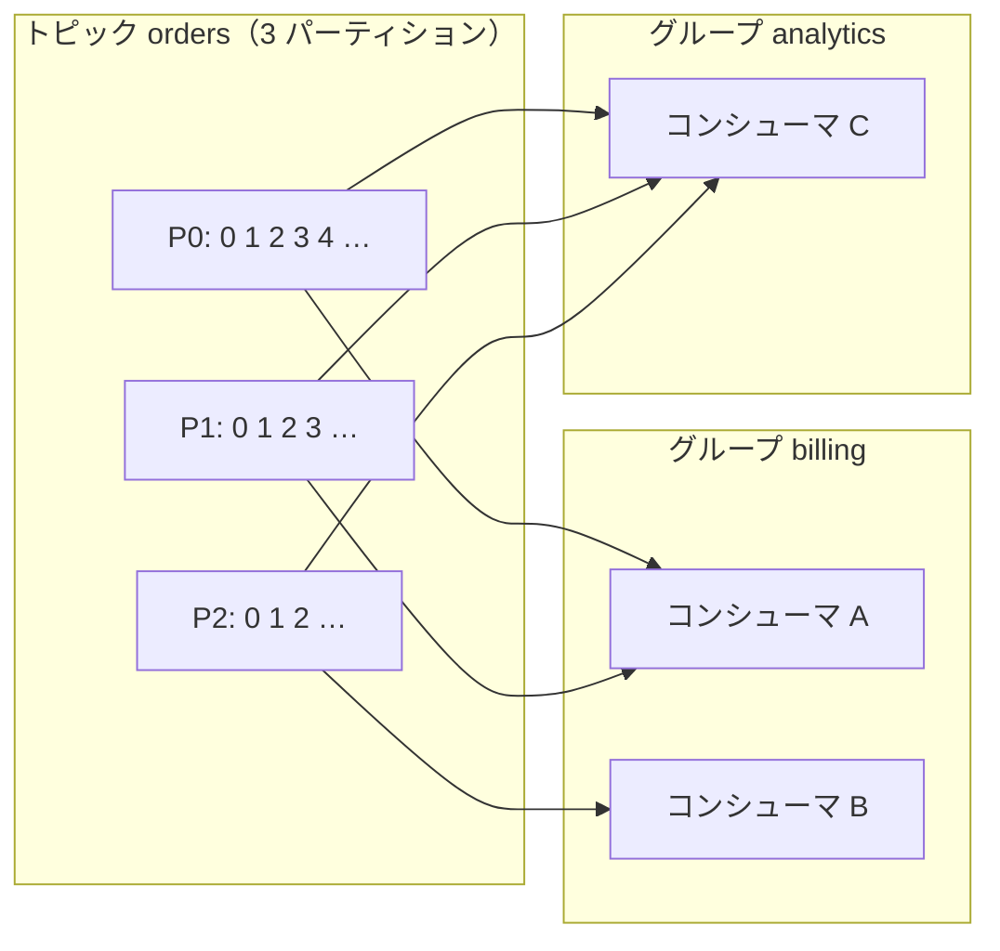
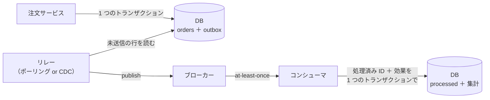
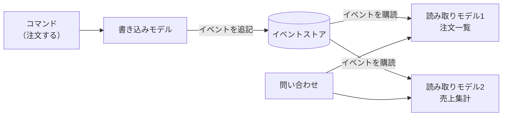

# 7.5 メッセージングとイベント駆動

> サービスどうしを同期的な呼び出しでつなぐと、1 つのサービスの遅れや停止が連鎖します。間にメッセージのキューやログを挟めば、送り手と受け手は時間的に切り離され、負荷の山もならせます。その代わりに、メッセージの重複・順序の入れ替わり・失われたイベント・後から変えにくいイベントの形式といった、新しい種類の問題を引き受けることになります。この章では、キューとログの違い、配信保証と冪等なコンシューマ、二重書き込みを避ける Transactional Outbox、イベントの設計と進化、そしてイベント時刻に基づくストリーム処理を学び、非同期なシステムを「動く」だけでなく「正しく、運用できる」ものにする力を身につけます。

| 項目 | 内容 |
|---|---|
| 学習時間の目安 | 本文 4h ＋ 演習 7h |
| 前提となる章 | [7.1 分散システムの本質](../01-fundamentals/README.md)、[7.4 合意と協調](../04-consensus-and-coordination/README.md)（Saga）、[6.3 トランザクションと同時実行制御](../../06-databases/03-transactions/README.md) |
| 演習 | [exercises/](exercises/)（Python） |
| キーワード | 非同期通信, メッセージキュー, 分散ログ, Kafka, パーティション, オフセット, コンシューマグループ, リバランス, at-least-once, exactly-once, 冪等なコンシューマ, リトライ, DLQ, ポイズンメッセージ, 二重書き込み, Transactional Outbox, CDC, イベントソーシング, CQRS, スキーマ進化, バックプレッシャー, ウィンドウ, ウォーターマーク |

## この章のゴール

- [ ] 同期通信と非同期通信のトレードオフを説明し、メッセージングを使うべき場面を判断できる
- [ ] キュー型とログ型のブローカーの違いを説明し、要件に応じて選べる
- [ ] パーティション・オフセット・コンシューマグループ・リバランスの仕組みを実装レベルで説明できる
- [ ] 配信保証とオフセットのコミットの関係を説明し、冪等なコンシューマ・再試行・DLQ・ポイズンメッセージへの対処を設計できる
- [ ] 二重書き込みの問題を説明し、Transactional Outbox と CDC で解決できる
- [ ] イベントの種類、イベントソーシング、CQRS、スキーマ進化のトレードオフを説明できる
- [ ] イベント時刻とウォーターマークに基づくウィンドウ集計を実装し、遅延データの扱いを設計できる

## なぜ学ぶのか

メッセージングは、現代のシステムの「血管」です。そして、その不具合は静かに進行します。

- **ログは統合の基盤になった**: LinkedIn で Kafka を開発した Jay Kreps は、2013 年の記事 "The Log: What every software engineer should know about real-time data's unifying abstraction" で、追記専用のログを中心に置くと、データベースの複製、システム間のデータ統合、ストリーム処理が 1 つの抽象で説明できると論じました。Kafka は 2011 年にオープンソースとして公開され、今では多くの企業のデータ基盤の中心にあります。
- **非同期の障害は、気づいたときには大きい**: 同期呼び出しの失敗はすぐにエラーとして見えますが、非同期の処理では、コンシューマが止まってもメッセージがキューに溜まるだけで、利用者からの問い合わせで初めて気づくことがあります。数時間分のメッセージの滞留、処理できないメッセージによるパーティションの停止、失われたイベントによる集計のずれは、監視と設計がなければ静かに蓄積します。
- **「exactly-once」の誤解は事故のもと**: 製品がうたう「exactly-once」の範囲を誤解してコンシューマを冪等にしないと、再配送で二重の請求やメールが発生します（7.1 章のエンドツーエンド原理）。

この章の内容は、マイクロサービスの連携（[9.2 アーキテクチャスタイル](../../09-architecture/02-architecture-styles/README.md)）、データ基盤（[12.1 データ基盤とデータエンジニアリング](../../12-data-and-ai/01-data-engineering/README.md)）、Saga によるサービス間の一貫性（7.4 章）の土台です。

## 1. 同期と非同期

### 1.1 同期呼び出しの結合

サービス A がサービス B を HTTP や gRPC で同期的に呼び出すと、A の処理は B が応答するまで進みません。これは次の意味で A と B を結合します。

- **時間的な結合**: B が止まっていれば、A も（その機能は）止まる
- **性能の結合**: B が遅ければ A も遅い。呼び出しの連鎖では、レイテンシが足し算になる
- **可用性の掛け算**: 各サービスの可用性が独立に 99.9% でも、連鎖すれば全体は下がる

```python
minutes_per_month = 30 * 24 * 60
for n in (1, 3, 5, 10):
    availability = 0.999 ** n   # 各サービスの可用性 99.9% が独立だと仮定
    print(f"同期呼び出しが {n:>2} 段: 全体の可用性 {availability:.2%}, 月あたりの停止 約 {(1 - availability) * minutes_per_month:.0f} 分")
```

```text
同期呼び出しが  1 段: 全体の可用性 99.90%, 月あたりの停止 約 43 分
同期呼び出しが  3 段: 全体の可用性 99.70%, 月あたりの停止 約 129 分
同期呼び出しが  5 段: 全体の可用性 99.50%, 月あたりの停止 約 216 分
同期呼び出しが 10 段: 全体の可用性 99.00%, 月あたりの停止 約 430 分
```

### 1.2 非同期メッセージングの利点と代償

送り手がメッセージをブローカーに渡した時点で処理を終え、受け手が自分のペースで取り出す **非同期メッセージング** は、この結合をほどきます。

| 利点 | 代償 |
|---|---|
| 受け手が止まっていても、送り手は受け付けを続けられる | 結果がすぐには分からない（結果整合性）。利用者への見せ方の設計が必要 |
| 負荷の山をキューで吸収し、受け手は一定のペースで処理できる | メッセージの重複・順序の入れ替わり・遅延を扱う必要がある |
| 1 つのイベントを複数の受け手が独立に使える（ファンアウト） | 処理の流れが追いにくく、デバッグと観測が難しい |
| 受け手を後から追加しても、送り手を変えなくてよい | ブローカーという新しい構成要素の運用が必要 |

目安として、**利用者がその場で結果を必要とする処理は同期**（在庫の確認、ログイン）、**その場で必要でない処理や、複数の受け手がいる処理、負荷の波がある処理は非同期**（メール送信、検索インデックスの更新、集計、他システムへの連携）が向いています。注文の確定のように両方の性質を持つ処理は、「受け付けたこと」だけを同期で返し、後続を非同期で進める設計が一般的です。

## 2. キューとログ

メッセージングの基盤には、大きく 2 つの型があります。

| | キュー型（RabbitMQ、Amazon SQS など） | ログ型（Apache Kafka、Amazon Kinesis Data Streams など） |
|---|---|---|
| データ構造 | 取り出したら消えるキュー | 追記専用のログ。読んでも消えない |
| 消費の単位 | メッセージごとに ACK。複数のワーカーが 1 つのキューから奪い合う（競合コンシューマ） | パーティションごとに、どこまで読んだか（オフセット）を記録する |
| 並列度 | ワーカーを増やせば増える | パーティション数が上限（1 パーティションはグループ内の 1 人だけが読む） |
| 順序 | 基本はおおよその順序。FIFO キュー（SQS のメッセージグループなど）で保証できるものもある | パーティション内では厳密に保証される |
| 再処理（リプレイ） | 基本的にできない（消費したら消える） | 保持期間内なら、オフセットを戻して何度でも読める |
| 向いている用途 | タスクの分配（画像の変換、メール送信）、仕事の単位が独立しているもの | イベントの記録と配信、複数の受け手、順序が重要な変更の流れ、ストリーム処理 |

違いの本質は、**「メッセージを消費したら消すか、残して位置だけを記録するか」** です。ログ型では、新しい受け手が過去のイベントを最初から読み直せるので、検索インデックスを作り直す、バグを直した集計をやり直す、といったことができます。一方、キュー型はメッセージ単位の再試行や遅延配送、優先度などの機能が豊富で、タスクの分配には扱いやすいことが多いです。

実際の製品は両者の中間の機能も持ちます。RabbitMQ はログ型の「ストリーム」を、Apache Pulsar は 1 つの仕組みでキュー的な購読とストリーム的な購読の両方を提供しています。Amazon SQS の標準キューは、まれに同じメッセージを 2 回以上届けること（at-least-once）と、順序が保証されないことを明記しており、FIFO キューはメッセージグループ内の順序と、一定時間内の重複排除を提供します（2026 年時点。詳細は公式ドキュメントで確認してください）。

1 つのイベントを複数の受け手に届ける **パブリッシュ／サブスクライブ**（pub/sub）は、ログ型なら受け手ごとに別のコンシューマグループを作るだけで、キュー型なら 1 つのトピックから受け手ごとのキューに複製する（SNS から複数の SQS へ、RabbitMQ の fanout エクスチェンジなど）ことで実現します。

## 3. パーティション・オフセット・コンシューマグループ

ここからは、ログ型（Kafka のモデル）を詳しく見ます。演習 1〜3 では、この仕組みをメモリ上で実装します。

### 3.1 キーとパーティション

トピックは複数の **パーティション** に分かれ、各パーティションは追記専用のログです。レコードの位置を **オフセット** と呼びます。レコードにキーがあれば、キーのハッシュでパーティションが決まるので、**同じキーのレコードは同じパーティションに入り、書いた順に読まれます**。これが「注文 ID ごとの順序」「顧客ごとの順序」を保証する仕組みです。逆に、異なるパーティションの間の順序は保証されません。



注意点が 2 つあります。1 つは 7.3 章のホットスポットで、特定のキー（大口顧客など）にレコードが集中すると、そのパーティションだけが詰まります。もう 1 つは **パーティション数の変更** で、パーティション数を増やすと `hash(key) mod パーティション数` が変わり、同じキーのレコードが途中から別のパーティションに入るようになります。増やす前後で順序が崩れうるので、キーごとの順序に依存するトピックでは、パーティション数を最初に余裕をもって決めるのが定石です。

### 3.2 コンシューマグループとリバランス

同じ **コンシューマグループ** のメンバーは、トピックのパーティションを分け合い、1 つのパーティションはグループ内の 1 人だけが読みます。だからグループ内の並列度はパーティション数が上限です。別のグループは、同じレコードを独立に全部読みます（上の図の analytics）。なお、これは従来のコンシューマグループの性質です。Kafka 4.2（2026 年）では、同じパーティションのレコードを複数のメンバーが 1 件ずつ受け取って確認応答する、キューに近い **share group**（KIP-932 "Queues for Kafka"）が本番利用に対応したと発表されています。

メンバーが参加・離脱（や故障）すると、パーティションの割り当てを計算し直す **リバランス** が起きます。古典的な方式では、リバランスの間は全員が処理を止めて割り当てを受け取り直すので、大きなグループでは処理が数秒〜数十秒止まることがありました。Kafka では、影響を受けるパーティションだけを段階的に移す協調的なリバランス（KIP-429。Kafka 2.4 以降）や、割り当ての計算をブローカー側に移して全員の停止をなくした新しいコンシューマグループのプロトコル（KIP-848。Kafka 4.0 で一般提供となり、クライアントが `group.protocol=consumer` を指定して使う）も導入されています（2026 年時点。詳細は使う版の Kafka のドキュメントで確認してください）。

リバランスには、7.4 章で見た「ゾンビ」の問題もあります。GC で長く止まっていたコンシューマは、その間にグループから外され、パーティションは別のメンバーに移っています。目覚めたゾンビが古い進捗をコミットすると、新しい担当者の進捗を巻き戻してしまいます。Kafka は、グループの **世代番号**（generation）が古いコミットを拒否することでこれを防ぎます。フェンシングトークンと同じ発想です。

### 3.3 オフセットのコミットと配信保証

コンシューマは、どこまで処理したかを **コミット済みオフセット** として記録し、再起動やリバランスの後はそこから読み直します。**処理とコミットの順序が、配信保証を決めます。**

| 順序 | 途中で落ちたら | 保証 |
|---|---|---|
| 処理してからコミット | 処理済みだがコミットしていないレコードを、次の担当者がもう一度処理する | **at-least-once**（重複がありうる） |
| コミットしてから処理 | コミット済みだが処理していないレコードは、二度と処理されない | at-most-once（失われうる） |

ほとんどの業務では、失うより重複する方がましなので、「処理してからコミット」＋「冪等な処理」を選びます。自動コミット（一定間隔でバックグラウンドでコミットする機能）は、処理が終わる前にコミットしてしまう（at-most-once になる）ことがあるので、その振る舞いを理解した上で使いましょう。演習 3 のテストで、コミット前に落ちたコンシューマのレコードが次の担当者に再配送されることを確かめます。

```python
from minilog import Broker, Consumer

broker = Broker()
broker.create_topic("orders", partitions=3)
for i in range(6):
    p, off = broker.produce("orders", {"order": i}, key=f"customer-{i % 2}")
    print(f"order {i} → パーティション {p}, オフセット {off}")

a = Consumer(broker, "billing", "worker-a", ["orders"])
print("a の担当:", a.assignment())
b = Consumer(broker, "billing", "worker-b", ["orders"])      # 2 人目が参加 → リバランス
print("a の担当:", a.assignment(), " b の担当:", b.assignment())

records = a.poll()
print("a が処理:", [r.value["order"] for r in records])
a.crash()                                                     # コミットする前に落ちる
print("b が引き継いで処理:", [r.value["order"] for r in b.poll()])
```

```text
order 0 → パーティション 1, オフセット 0
order 1 → パーティション 0, オフセット 0
order 2 → パーティション 1, オフセット 1
order 3 → パーティション 0, オフセット 1
order 4 → パーティション 1, オフセット 2
order 5 → パーティション 0, オフセット 2
a の担当: [('orders', 0), ('orders', 1), ('orders', 2)]
a の担当: [('orders', 0), ('orders', 1)]  b の担当: [('orders', 2)]
a が処理: [1, 3, 5, 0, 2, 4]
b が引き継いで処理: [1, 3, 5, 0, 2, 4]
```

キーが 2 種類しかないので、パーティション 2 には何も入っていません（キーの種類がパーティション数より少ないと、暇なパーティションができる）。a がコミットせずに落ちたので、同じ 6 件が b にもう一度配送されました。

## 4. 配信保証と信頼性のパターン

### 4.1 「exactly-once」の正体

Kafka は 0.11（2017 年）で、いわゆる exactly-once セマンティクスを導入しました。その中身は、

- **冪等なプロデューサ**: プロデューサ ID と通し番号で、ブローカーへの送信の再試行による重複を排除する
- **トランザクション**: 複数のパーティションへの書き込みと、コンシューマのオフセットのコミットを、1 つの単位でアトミックにする

の 2 つです。これにより「Kafka から読み、処理し、Kafka に書く」処理の中では、効果がちょうど 1 回分になります。しかし、処理の途中で外部のデータベースに書く、外部 API を呼ぶ、メールを送るといった副作用は、この範囲の外です（7.1 章）。**Kafka の外の世界に対しては、依然として at-least-once であり、冪等性はアプリケーションが担う** と理解しておきましょう。

### 4.2 冪等なコンシューマ

at-least-once の配信で効果を 1 回分にするには、コンシューマを冪等にします。方法は 3 つあります。

1. **処理済みの記録（inbox）**: イベント ID を記録する表を持ち、効果と同じトランザクションで「処理済み」を記録する。すでにあれば何もしない。演習 6 で実装する。
2. **自然な冪等性**: 「在庫を 1 減らす」ではなく「注文 123 の引き当てを確定状態にする」のように、状態を設定する操作として設計する。バージョン番号付きの upsert（新しいバージョンのときだけ上書き）も有効。
3. **冪等キーを外部に渡す**: 外部の決済 API などには、イベント ID から作った冪等キーを付けて呼ぶ（7.1 章）。

処理済みの記録は無限に増えるので、ブローカーの再配送がありうる期間（保持期間やリトライの期間）より長く残し、それより古いものは消す、といった保持期間を決めます。

### 4.3 再試行、DLQ、ポイズンメッセージ

処理に失敗したメッセージは、原因によって扱いを変えます。

| 失敗の種類 | 例 | 扱い |
|---|---|---|
| 一時的 | 依存先のタイムアウト、デッドロック、スロットリング | 間隔をあけて再試行する |
| 恒久的 | メッセージの形式が不正、参照先のデータが存在しない、コードのバグ | 再試行しても直らない。隔離する |

再試行の間隔は、**指数バックオフ＋ジッター** が定石です。一斉に失敗したクライアントが一斉に再試行して負荷の波を作らないよう、待ち時間をランダムに散らします（AWS の Marc Brooker の記事 "Exponential Backoff And Jitter" が、この「フルジッター」を紹介しています）。

```python
import random

rng = random.Random(7)   # 実際には（シードを固定しない）乱数を使う

def full_jitter(attempt, base=0.1, cap=10.0):
    """指数バックオフ＋フルジッター: 0 〜 min(cap, base × 2^attempt) の一様乱数だけ待つ。"""
    return rng.uniform(0, min(cap, base * 2 ** attempt))

for attempt in range(8):
    print(f"{attempt + 1} 回目の再試行の前に {full_jitter(attempt):6.3f} 秒待つ（上限 {min(10.0, 0.1 * 2 ** attempt):5.1f} 秒）")
```

```text
1 回目の再試行の前に  0.032 秒待つ（上限   0.1 秒）
2 回目の再試行の前に  0.030 秒待つ（上限   0.2 秒）
3 回目の再試行の前に  0.260 秒待つ（上限   0.4 秒）
4 回目の再試行の前に  0.058 秒待つ（上限   0.8 秒）
5 回目の再試行の前に  0.857 秒待つ（上限   1.6 秒）
6 回目の再試行の前に  1.170 秒待つ（上限   3.2 秒）
7 回目の再試行の前に  0.371 秒待つ（上限   6.4 秒）
8 回目の再試行の前に  5.074 秒待つ（上限  10.0 秒）
```

何度再試行しても失敗するメッセージを **ポイズンメッセージ**（poison message）と呼びます。ログ型では特に危険で、パーティション内の順序を守るためにそのメッセージで止まると、**後ろのすべてのメッセージが処理されなくなります**。一定回数失敗したら、メッセージを **DLQ**（dead letter queue）に移し、アラートを出して先に進むのが基本です。SQS は受信回数の上限を超えたメッセージを DLQ に移す設定を、RabbitMQ はデッドレターエクスチェンジを持っています。Kafka では従来、ブローカー自体に DLQ の仕組みはなく、Kafka Connect の設定やアプリケーションのフレームワーク（Spring for Apache Kafka など）で実現してきました（2026 年時点。新しい版の機能は公式ドキュメントで確認してください）。

DLQ は「捨て場」ではありません。**誰が監視し、原因を調べ、直した後にどう再投入（redrive）するか** を決めておかないと、失われた注文や未処理の請求が静かに溜まります。

ここには根本的な緊張関係もあります。**順序・並列度・再試行は、同時にすべては満たせません**。あるメッセージを後で再試行する（再試行用のトピックに回す）と、同じキーの後続のメッセージが先に処理され、順序が崩れます。順序が重要なキー（口座の入出金など）は、失敗したらそのキーの処理を止めて（後続も保留して）人間に知らせる、順序が重要でないものは再試行用のトピックに回して先に進む、というように、データの性質で方針を分けます。

## 5. 二重書き込みと Transactional Outbox

### 5.1 二重書き込みの問題

「注文をデータベースに保存し、注文イベントをブローカーに送る」処理を素朴に書くと、2 つの別々のシステムへの書き込み、**二重書き込み**（dual write）になります。2 つを 1 つのトランザクションにまとめる方法はないので、間で失敗すると矛盾します。

| 順序 | 間で落ちると | 結果 |
|---|---|---|
| DB にコミット → 送信 | 送信前に落ちる | 注文はあるのにイベントがない（後続の処理が永遠に起きない） |
| 送信 → DB にコミット | コミットに失敗する | 存在しない注文のイベントが送られる |

さらに、2 つのプロセスが同じデータを更新すると、DB への書き込み順とイベントの送信順が食い違い、受け手の状態が DB と一致しなくなる、という競合も起きます。

### 5.2 Transactional Outbox

解決策は、イベントを **業務データと同じデータベースの outbox 表に、同じトランザクションで書く** ことです。ブローカーへの送信は、別の **リレー** が outbox を読んで行います。



- 注文と outbox の行は、両方残るか、両方残らないかのどちらか（ローカルトランザクションの原子性）
- リレーは、送信した後で「送信済み」を記録する。その間で落ちると同じイベントをもう一度送るので、配信は **at-least-once**
- だから受け手は、イベント ID で重複を除く **冪等なコンシューマ**（inbox）にする

演習 4〜6 を解くと、リレーが送信直後に落ちても、最終的な集計は 1 回分になることを確かめられます。

```python
import sqlite3
from outbox import (FakeBroker, IdempotentConsumer, OutboxRelay, SimulatedCrash,
                    init_consumer_db, init_producer_db, place_order)

orders_db, billing_db, broker = sqlite3.connect(":memory:"), sqlite3.connect(":memory:"), FakeBroker()
init_producer_db(orders_db)
init_consumer_db(billing_db)

first = place_order(orders_db, "o-1", "alice", 1200)   # 注文と outbox の行を 1 つのトランザクションで
place_order(orders_db, "o-2", "alice", 800)

relay = OutboxRelay(orders_db, broker, crash_after_publish=lambda event_id: event_id == first)
try:
    relay.run_once()                                   # o-1 を送った直後、「送信済み」を記録する前に落ちる
except SimulatedCrash:
    print("リレーが落ちた。未送信:", relay.pending())
OutboxRelay(orders_db, broker).run_once()              # 再起動したリレーが o-1 をもう一度送る
print("ブローカーに届いた注文:", [m["aggregate_id"] for m in broker.messages])

consumer = IdempotentConsumer(billing_db)
print("処理したか:", [consumer.handle(m) for m in broker.messages])
print("alice の合計（金額, 件数）:", consumer.totals("alice"))
```

```text
リレーが落ちた。未送信: 2
ブローカーに届いた注文: ['o-1', 'o-1', 'o-2']
処理したか: [True, False, True]
alice の合計（金額, 件数）: (2000, 2)
```

### 5.3 リレーの 2 つの方式と CDC

リレーには 2 つの方式があります。

| 方式 | 仕組み | 長所 | 短所 |
|---|---|---|---|
| ポーリング | 定期的に `SELECT ... WHERE published_at IS NULL` で未送信の行を読む | 単純。どのデータベースでも使える | 送信までの遅延、DB への定期的な負荷。複数のリレーを並べるときは排他が必要 |
| トランザクションログの追跡（CDC） | データベースの変更ログ（MySQL の binlog、PostgreSQL の論理デコーディングなど）から outbox への挿入を読み取る | 遅延が小さく、DB への問い合わせが不要 | CDC の基盤の構築・運用が必要 |

**CDC**（Change Data Capture）は、データベースの変更をログから取り出してイベントの流れにする技術で、Debezium（Kafka Connect の上で動くオープンソースの CDC）が代表的です。Debezium には outbox の行を業務イベントとして整形して流す機能もあります。

CDC で業務の表そのものの変更を直接流す方法もありますが、それは **データベースの内部構造（表と列）を、そのまま外部への契約として公開する** ことを意味します。表の設計を変えるたびに受け手が壊れるので、サービス間の連携には、outbox で「外部に見せるための形」に整えたイベントを流すのが安全です。表の変更をそのまま流す CDC は、データ基盤への複製（[12.1](../../12-data-and-ai/01-data-engineering/README.md)）のような、内部の用途に向いています。

## 6. イベントの設計と進化

### 6.1 イベントの 3 つの使い方

Martin Fowler は "What do you mean by 'Event-Driven'?"（2017）で、「イベント駆動」という言葉が異なるパターンを指していることを整理しました。イベントの中身の設計では、次の区別が重要です。

| 種類 | 中身 | 長所 | 短所 |
|---|---|---|---|
| イベント通知（event notification） | 「注文 123 が作られた」という事実と ID だけ | 小さく、送り手と受け手の結合が弱い | 受け手が詳細を知るために送り手に問い合わせる必要があり、送り手に負荷と実行時の依存が生まれる |
| イベントによる状態の転送（event-carried state transfer） | 受け手が必要とするデータ（顧客・金額・商品）を含める | 受け手は問い合わせずに処理でき、送り手が止まっていても動ける | イベントが大きくなり、データの複製と古さを受け手が抱える。載せたデータが事実上の契約になる |
| ドメインイベント（domain event） | 業務上の意味のある出来事を、業務の言葉で過去形で表す（「注文が確定した」「支払いが拒否された」） | 何が起きたかが明確で、業務の変化に強い | ドメインの理解と、イベントの粒度の設計が必要（[9.3](../../09-architecture/03-domain-driven-design/README.md)） |

「行の更新」のような技術的な変更ではなく、「注文が確定した」のような業務の出来事としてイベントを設計すると、受け手は送り手の内部の変更に影響されにくくなります。

### 6.2 イベントソーシング

**イベントソーシング**（event sourcing）は、現在の状態ではなく、**状態を変えたイベントの列そのものを正のデータとして保存** する方式です。口座の残高を保存するのではなく、「入金 1,000 円」「出金 300 円」というイベントを保存し、残高はイベントを先頭から適用して求めます（遅くなれば、途中の状態のスナップショットを使う）。

- 長所: 完全な監査証跡がある。過去の任意の時点の状態を再現できる。バグを直した後で、イベントを再生して正しい状態を作り直せる
- 短所: イベントの形式は（過去のイベントを読み続けるので）永遠に互換性を保つ必要がある。状態を問い合わせるには別の読み取りモデルが必要で、仕組み全体が複雑になる。個人データの削除の要求への対応が難しい（個人データを暗号化して保存し、鍵を捨てることで読めなくする「暗号学的な消去」などの工夫が必要。削除の要否の判断は、個人情報保護法などに照らして専門家に確認すること）

会計や決済、在庫の移動のように、もともと「取引の記録」が本質である領域では自然な選択です。一方、一般的な CRUD の業務に採用すると、複雑さに見合わないことが多いので、領域を限って使いましょう。

### 6.3 CQRS

**CQRS**（Command Query Responsibility Segregation）は、書き込み（コマンド）のモデルと、読み取り（クエリ）のモデルを分ける設計です。書き込み側は整合性の検査と業務ルールに最適化し、読み取り側は画面や検索に合わせた形（非正規化された表、検索エンジン、集計済みのデータ）を、書き込み側のイベントから作ります。



イベントソーシングと組み合わせることが多いですが、独立した考え方です（普通の DB と CDC で読み取りモデルを作ってもよい）。読み取りモデルは書き込みから少し遅れて更新される（結果整合性）ので、7.2 章の read-your-writes の問題が現れます。書き込み直後の画面は書き込み側の結果を使う、更新の完了を待つ、といった UX の設計が必要です。

### 6.4 スキーマ進化

イベントは、送り手と受け手が別々にデプロイされ、しかもログやイベントストアに長期間残ります。したがって、**イベントの形式（スキーマ）は、新旧が混在する前提で変更しなければなりません**。互換性には 2 つの向きがあります。

| 互換性 | 意味 | 安全な変更の例 | デプロイの順序 |
|---|---|---|---|
| 後方互換（backward） | 新しいスキーマの受け手が、古いスキーマのデータを読める | 既定値付きのフィールドの追加、フィールドの削除 | 受け手を先に更新する |
| 前方互換（forward） | 古いスキーマの受け手が、新しいスキーマのデータを読める | フィールドの追加（古い受け手は無視する）、既定値のあるフィールドの削除 | 送り手を先に更新する |
| 完全互換（full） | 両方 | 既定値付きのフィールドの追加・削除 | どちらが先でもよい |

どんな形式でも危険なのは、**必須フィールドの追加、フィールドの意味の変更、型の変更、名前の変更** です。「金額」を税抜から税込に変える、のような意味の変更は、スキーマの検査を通ってしまうので特に危険で、新しいフィールドを追加するか、新しいイベントの種類として出すべきです。

形式ごとの注意点も押さえておきましょう。

- **Avro**: 読むときに、書いたときのスキーマ（writer's schema）と読むときのスキーマ（reader's schema）を突き合わせて解決する。フィールドの追加・削除には既定値が鍵になる。
- **Protocol Buffers**: フィールドはタグ番号で識別される。**削除したフィールドの番号を再利用しない**（`reserved` で予約する）ことが最重要。知らないフィールドは読み飛ばされるので、追加は安全。
- **JSON Schema**: 追加のプロパティを許すかどうか（`additionalProperties`）で、互換性の判断が変わる。検査の仕組みを使わない素の JSON は、互換性が壊れても誰も気づかない。

**スキーマレジストリ**（Confluent Schema Registry など）は、トピックごとにスキーマの版を管理し、互換性のない変更の登録を拒否します。Confluent Schema Registry の既定の互換性は後方互換（BACKWARD）です。CI でスキーマの互換性を検査し、互換性のない変更はレビューで止める、という運用にすると、イベントの形式を「公開 API」として扱えます（[9.4 API設計](../../09-architecture/04-api-design/README.md)）。

## 7. バックプレッシャーと観測

### 7.1 ラグとバックプレッシャー

キューは負荷の山を吸収しますが、無限ではありません。流入が処理能力を上回る状態が続くと、滞留（**コンシューマラグ**, consumer lag: 最新のオフセットとコミット済みのオフセットの差）は増え続けます。セールで流入が処理能力の 1.2 倍になった例を計算してみます。

```python
produce_rate, consume_rate = 1_200, 1_000        # 1 秒あたりの件数（セール中の流入と、処理能力）
lag = 0
for minute in range(1, 31):
    rate = produce_rate if minute <= 20 else 600   # 20 分間のセールの後、流入は平常に戻る
    lag = max(0, lag + (rate - consume_rate) * 60)
    if minute in (5, 10, 20, 25, 30):
        print(f"{minute:>2} 分後: ラグ {lag:>9,} 件（今から処理すると {lag / consume_rate / 60:5.1f} 分遅れ）")
```

```text
 5 分後: ラグ    60,000 件（今から処理すると   1.0 分遅れ）
10 分後: ラグ   120,000 件（今から処理すると   2.0 分遅れ）
20 分後: ラグ   240,000 件（今から処理すると   4.0 分遅れ）
25 分後: ラグ   120,000 件（今から処理すると   2.0 分遅れ）
30 分後: ラグ         0 件（今から処理すると   0.0 分遅れ）
```

20% の超過でも、20 分で 4 分の遅れになり、解消には流入が落ち着いてからさらに 10 分かかりました。流入が処理能力を超え続ければ、遅れは際限なく伸びます。待ち行列の長さと待ち時間の関係（リトルの法則 L = λW。[2.2 確率・統計と定量的思考](../../02-math-and-algorithms/02-probability-statistics/README.md)、[9.5](../../09-architecture/05-scalability-and-performance/README.md)）から、**ラグは「処理の遅れ」そのもの** です。

**バックプレッシャー**（backpressure）は、受け手が送り手に「これ以上送るな」と伝えて、流量を処理能力に合わせる仕組みです。Kafka のようにコンシューマが自分のペースで取りに行く（pull）方式は、受け手が過負荷になりにくい一方、ブローカーに溜まる量は増えます。ブローカーが送りつける（push）方式では、RabbitMQ の prefetch（ACK 前に受け取る件数の上限）のように、受け手が受け取る量を制限します。いずれにしても、最終的には「溜める（キューを大きくする）」「処理能力を増やす（コンシューマとパーティションを増やす）」「流入を絞る（レート制限、受付の停止）」「捨てる（優先度の低いものを落とす）」のどれかを選ぶことになります。

### 7.2 非同期な処理の観測

非同期な処理は、要求と応答が 1 本の呼び出しで結ばれていないので、「この注文の処理はどこで止まっているのか」が見えにくくなります。次を最初から組み込みましょう（[10.4 オブザーバビリティ](../../10-cloud-and-sre/04-observability/README.md)）。

- **トレースの文脈の伝搬**: メッセージのヘッダに、W3C Trace Context の `traceparent` などのトレース ID を載せ、受け手はそれを引き継いでスパンを作る。OpenTelemetry にはメッセージングのための規約（送信と受信のスパン、バッチ処理でのリンク）がある。
- **相関 ID**: 注文 ID などの業務上の ID を、すべてのイベントとログに含める。
- **監視すべき指標**: コンシューマラグ（件数と時間）、処理のレイテンシ（イベント時刻から処理完了まで）、再試行の率、DLQ の件数と増加の速さ、リバランスの頻度。

## 8. ストリーム処理の基礎

### 8.1 イベント時刻と処理時刻

メッセージの流れを継続的に処理・集計するのが **ストリーム処理** です。ここで最初に区別すべきなのが、2 つの時刻です。

- **イベント時刻**（event time）: 出来事が実際に起きた時刻（利用者がボタンを押した時刻）
- **処理時刻**（processing time）: システムがそのイベントを処理した時刻

両者は一致しません。スマートフォンが地下鉄で圏外になっていれば、イベントは数十分遅れて届きます。処理時刻で「10 時台の売上」を集計すると、遅れて届いた 9 時台の売上が 10 時台に混ざり、しかも同じデータを再処理するたびに結果が変わります。正しい集計には、イベント時刻で窓に振り分ける必要があります。

### 8.2 ウィンドウ

```text
タンブリング（固定・重ならない）     |--- 0〜10 ---|--- 10〜20 ---|--- 20〜30 ---|
スライディング（ホッピング）         |--- 0〜10 ---|
  （大きさ 10、ずらし幅 5）                  |--- 5〜15 ---|
                                                    |--- 10〜20 ---|
セッション（活動の切れ目で区切る）   |-- 操作 操作 操作 --|  （30 分無操作）  |-- 操作 操作 --|
```

- **タンブリング**: 固定の大きさで重ならない窓。「1 時間ごとの売上」
- **スライディング（ホッピング）**: 一定の幅ずつずらした、重なりのある窓。「直近 10 分間の平均を 5 分ごとに」
- **セッション**: 一定時間の無活動で区切る、利用者ごとに長さの違う窓。「1 回の訪問での閲覧数」

### 8.3 ウォーターマークと遅延データ

イベント時刻の窓では、「この窓はいつ閉じて結果を出せばよいか」が問題になります。遅れたイベントが永遠に来うるなら、永遠に待つことになります。そこで使うのが **ウォーターマーク**（watermark）で、「この時刻より前のイベントは、もうほとんど来ないだろう」という推定です。ウォーターマークが窓の終わりを越えたら、結果を出します。Google の "The Dataflow Model"（Akidau ら, VLDB 2015）が、この考え方と、窓・トリガー・遅延データの扱いを体系化しました。

ウォーターマークは推定なので、それより遅れたイベントも来ます。扱いは 3 つです。

1. **捨てる**（ログに記録して無視する）
2. **許容遅延**（allowed lateness）の間は窓の状態を残しておき、遅れたイベントで結果を **更新** して出し直す
3. 許容遅延も過ぎたものは **サイド出力**（side output）に送り、別途（バッチの再集計などで）扱う

ウォーターマークを遅らせるほど（乱れの想定を大きくするほど）結果は正確になりますが、結果が出るまでの遅れと、保持する状態が増えます。**遅さと正確さのトレードオフ** です。演習 7 で、ウォーターマーク・許容遅延・サイド出力を持つ集計を実装すると、次のように動きます。

```python
from windows import Event, WindowedAggregator

# 10 秒のタンブリングウィンドウ。5 秒までの乱れを想定し、さらに 10 秒の遅延を許容する
agg = WindowedAggregator(size=10, max_out_of_orderness=5, allowed_lateness=10)
arrivals = [3, 8, 14, 6, 21, 2, 36, 7]                 # 到着順に並んだイベント時刻（秒）
for t in arrivals:
    for r in agg.process(Event("shop-1", 100, t)):
        kind = "更新" if r.is_update else "確定"
        print(f"t={t:>2} 到着 → [{r.start:>2},{r.end:>2}) {kind}: {r.count} 件 {r.total:.0f} 円 (ウォーターマーク {agg.watermark})")
print("遅すぎて集計できなかったイベント:", [e.event_time for e in agg.late_events])
print("ストリームの終わり:", [(r.start, r.end, r.count) for r in agg.flush()])
```

```text
t=21 到着 → [ 0,10) 確定: 3 件 300 円 (ウォーターマーク 16)
t= 2 到着 → [ 0,10) 更新: 4 件 400 円 (ウォーターマーク 16)
t=36 到着 → [10,20) 確定: 1 件 100 円 (ウォーターマーク 31)
t=36 到着 → [20,30) 確定: 1 件 100 円 (ウォーターマーク 31)
遅すぎて集計できなかったイベント: [7]
ストリームの終わり: [(30, 40, 1)]
```

t=6 は遅れて届きましたが、ウォーターマークが [0,10) の終わりを越える前だったので、普通に集計されました。t=2 は窓が確定した後でしたが、許容遅延の範囲なので結果が更新されました。t=7 は許容遅延も過ぎていたので、サイド出力に回されています。

### 8.4 ストリーム処理のエンジン

実務では、Kafka Streams、Apache Flink、Spark Structured Streaming、Apache Beam（とその実行基盤の Google Cloud Dataflow）などのエンジンを使います。これらは窓・ウォーターマークに加えて、処理の状態（集計の途中経過）を障害から守る仕組みを持ちます。例えば Flink は、ストリームに目印（バリア）を流して全体の一貫したスナップショット（チェックポイント）を非同期に取る方式（Carbone ら, 2015。分散したシステム全体の一貫したスナップショットを取る、Chandy と Lamport のアルゴリズムの考え方を応用したもの）で、障害時にも集計を正しく再開できるようにしています。データ基盤の中でのストリーム処理の位置づけは [12.1](../../12-data-and-ai/01-data-engineering/README.md) で扱います。

## よくある落とし穴

1. **DB の更新とメッセージの送信を別々に行う（二重書き込み）**。間で落ちると、イベントが失われるか、存在しないデータのイベントが送られる。Transactional Outbox か CDC を使う。
2. **「exactly-once」を有効にしたので、コンシューマの冪等性は不要だと考える**。保証はブローカーの中の読み書きに限られ、外部の DB・API・メールへの副作用は重複しうる。処理済みの記録や冪等キーで重複を除く。
3. **処理の前にオフセットをコミットする（自動コミットの挙動を理解せずに使う）**。処理中に落ちたメッセージが二度と処理されない（at-most-once）。処理してからコミットし、処理を冪等にする。
4. **ポイズンメッセージで、パーティション全体を止めてしまう**。1 件の不正なメッセージで後続がすべて滞留する。回数を決めて再試行し、超えたら DLQ に移してアラートを出す。DLQ の担当者と再投入の手順を決めておく。
5. **パーティション数を後から増やし、同じキーの順序が崩れる**。キーとパーティションの対応が変わる。キーごとの順序が重要なトピックは、パーティション数を最初に余裕をもって決める。
6. **CDC で表の変更をそのまま他チームに公開する**。表の設計の変更がすべての受け手を壊す。外部への契約は outbox などで整えた業務イベントにする。
7. **イベントのスキーマを検査なしで変更する**。必須フィールドの追加や意味の変更で、古い受け手・古いイベントの再生が壊れる。スキーマレジストリと CI の互換性検査を使い、意味を変えるなら新しいフィールドやイベントにする。
8. **処理時刻で集計する**。遅れて届いたデータが別の時間帯に混ざり、再処理のたびに結果が変わる。イベント時刻とウォーターマークで集計する。
9. **コンシューマラグと DLQ を監視していない**。非同期の障害は、利用者からの問い合わせで初めて発覚する。ラグ（件数と時間）と DLQ の件数に SLO とアラートを設定する。

## CTOの視点

1. **メッセージング基盤は長く付き合うプラットフォームの決定**。マネージドサービス（SQS/SNS、Google Cloud Pub/Sub、マネージド Kafka など）にするか自前で運用するかは、再処理（リプレイ）の必要性、順序、スループット、保持期間、エコシステム、そして運用できる人材の有無で決まります。Kafka の自前運用は強力ですが、専任の運用の知識が要ります。「どのチームが、何年、この基盤を運用するのか」を答えられないまま導入してはいけません。
2. **イベントの契約を公開 API として統治する**。イベントの形式は、社内の他チームや分析基盤が依存する契約です。スキーマレジストリ、CI での互換性検査、イベントごとの所有チーム、廃止の手順（何か月前に告知し、いつ止めるか）を、API と同じ水準で定めましょう。これを怠ると、1 つのフィールドの変更が組織横断の障害になります。
3. **設計レビューで問うべき質問**。「このイベントが 2 回届いたら」「順序が入れ替わったら」「1 時間遅れて届いたら」「届かなかったら」何が起きるか。outbox はどこか。DLQ に落ちたメッセージは誰が見て、どう再投入するか。ラグの SLO は何か。これらに答えられない非同期の設計は、まだ完成していません。
4. **イベントソーシングや CQRS は、領域を限って採用する**。監査や履歴の再現が本質的な領域（決済・会計・在庫）では強力ですが、全社的に採用すると、学習コスト、デバッグの難しさ、スキーマの永久的な互換性の負担が、利点を上回ることが多いです。採用するなら、チームの経験と、読み取りモデルの遅れを受け入れる UX を確認しましょう。
5. **データの保持と個人情報**。ログ型のブローカーやイベントストアは、個人データを長期間、しかも複製して保持しがちです。保持期間の設定、個人データを載せないイベントの設計（ID だけにして、必要なら問い合わせる）、削除の要求への対応方針を、法務（個人情報保護法などへの対応。具体的な判断は専門家に確認）とセキュリティのチームと合わせて決めておきましょう。

## 演習

演習コードは [exercises/](exercises/) にあります。docstring の仕様を読み、`raise NotImplementedError(...)` を実装に置き換えてください。解答例は [solutions/](solutions/) にありますが、まずは自力で取り組みましょう。

```bash
python3 tools/check.py 7.5        # リポジトリのルートで実行
python3 tools/check.py -v 7.5     # 詳しい出力
```

| # | 難易度 | 内容 | ファイル / 対象 |
|---|---|---|---|
| 1 | ★☆☆ | キーによるパーティションの決定（crc32）と、レンジ割り当て | [minilog.py](exercises/minilog.py) / `partition_for_key`, `range_assign` |
| 2 | ★★★ | パーティション分割されたログ型ブローカー: 追記とフェッチ、コンシューマグループ、世代番号、リバランス、コミットの検査（ゾンビの拒否） | [minilog.py](exercises/minilog.py) / `Broker` |
| 3 | ★★☆ | コンシューマ: 割り当ての追従、poll とコミット、正常終了と異常終了。コミット前の異常終了による再配送（at-least-once） | [minilog.py](exercises/minilog.py) / `Consumer` |
| 4 | ★☆☆ | Transactional Outbox: 注文と outbox の行を 1 つのトランザクションで書く（sqlite3） | [outbox.py](exercises/outbox.py) / `place_order` |
| 5 | ★★☆ | outbox のリレー: 順序を守った送信、ブローカーの障害での停止、送信直後のクラッシュによる重複 | [outbox.py](exercises/outbox.py) / `OutboxRelay` |
| 6 | ★★☆ | 冪等なコンシューマ（inbox）: 処理済みの記録と効果を同じトランザクションで | [outbox.py](exercises/outbox.py) / `IdempotentConsumer` |
| 7 | ★★★ | イベント時刻のタンブリング・スライディングウィンドウ、ウォーターマーク、許容遅延による更新、サイド出力 | [windows.py](exercises/windows.py) / `WindowedAggregator` |
| 8 | ★★☆ | 記述: 注文イベントの設計レビュー（下記） | — |

### 演習 8（記述）: 注文イベントの設計レビュー

あなたの会社の EC サイトでは、注文サービスが注文を確定すると、在庫・配送・ポイント・分析の各チームがそれに反応して処理します。現在の実装は次の通りです。

- 注文サービスは、DB にコミットした後、Kafka のトピック `orders` にイベントを送っている。イベントは `orders` 表の行をそのまま JSON にしたもので、キーは指定していない。
- ポイントサービスは、イベントを受け取るたびに、注文金額の 1% をポイント残高に加算している。オフセットは自動コミット。
- 分析チームは、イベントを受信した時刻で「1 時間ごとの売上」を集計している。
- 処理に失敗したメッセージは、成功するまで同じ場所で無限に再試行している。

問題点を指摘し、改善案を示してください。改善後のイベントの形（フィールドの例）と、パーティションのキーも提案してください。

<details>
<summary>解答例</summary>

問題点と改善案:

| 問題 | 何が起きるか | 改善案 |
|---|---|---|
| DB コミット後に送信（二重書き込み） | 送信前に落ちると、注文があるのにイベントがなく、在庫・配送・ポイントが動かない | Transactional Outbox（または CDC で outbox を流す）にする |
| 表の行をそのまま JSON に | 表の設計の変更が全チームを壊す。不要な個人情報も流れる | 外部向けの業務イベント `OrderConfirmed` を設計し、スキーマレジストリで管理する |
| キーなし | 同じ注文のイベント（確定・キャンセル）の順序が保証されない | 注文 ID（または顧客 ID）をキーにする。顧客単位の順序が必要ならポイントのために顧客 ID も検討 |
| ポイントの加算が冪等でない | 再配送で二重に加算される | イベント ID で処理済みを記録し、加算と同じトランザクションで保存する（inbox） |
| 自動コミット | コミットの時点が処理の完了と連動しないので、処理の前にコミットされて落ちるとポイントが付かない（取りこぼし）ことがある | 処理してからコミットする（冪等な処理と組み合わせる） |
| 受信時刻で集計 | 遅れて届いたイベントが別の時間帯に入り、再処理で結果が変わる | イベント時刻（注文の確定時刻）とウォーターマークで集計し、遅延データの扱いを決める |
| 無限の再試行 | 1 件の不正なメッセージでパーティション全体が停止する | バックオフ付きで回数を限って再試行し、超えたら DLQ へ。DLQ の担当と再投入の手順を決める |

改善後のイベントの例（`OrderConfirmed`、キーは `order_id`）:

- `event_id`（UUID。冪等性のため）、`event_type`、`schema_version`
- `occurred_at`（確定時刻。イベント時刻の集計に使う）
- `order_id`、`customer_id`
- `items`（商品 ID・数量・単価）、`total_amount`、`currency`
- トレース ID は、Kafka のヘッダで `traceparent` として伝搬する

採点の観点:

- 二重書き込み、冪等性、オフセットのコミットの順序、イベント時刻の 4 点を指摘し、それぞれの対策を示せていれば合格ライン。
- 表の行をそのまま流すことの契約上の問題、キーと順序、ポイズンメッセージと DLQ の運用、スキーマ管理まで踏み込めていれば、設計レビューをリードできる水準です。

</details>

## 理解度チェック

**Q1. キュー型のブローカーとログ型のブローカーは、どのような要件で使い分けますか。**

<details>
<summary>解答</summary>

独立した仕事を複数のワーカーに分配する用途（画像の変換、メール送信など）で、メッセージ単位の再試行や遅延配送が欲しく、過去のメッセージを読み直す必要がないなら、キュー型が扱いやすいです。一方、同じイベントを複数の受け手が独立に使う、キーごとの順序が重要、過去のイベントを再処理したい（インデックスの再構築、集計のやり直し）、ストリーム処理をしたい、といった要件にはログ型が向きます。ログ型では、並列度の上限がパーティション数で決まることにも注意します。

</details>

**Q2. コンシューマが「オフセットをコミットしてから処理する」場合と「処理してからコミットする」場合で、途中で落ちたときに何が起きるかを説明してください。**

<details>
<summary>解答</summary>

コミットしてから処理する場合、コミット済みだが処理していないメッセージは、再起動後（や次の担当者）には読まれないので、失われます（at-most-once）。処理してからコミットする場合、処理済みだがコミットしていないメッセージは、再起動後にもう一度読まれ、重複して処理されます（at-least-once）。多くの業務では失うより重複の方が扱いやすいので、処理してからコミットし、処理を冪等にします。

</details>

**Q3. Kafka の exactly-once セマンティクスは、何を保証し、何を保証しませんか。**

<details>
<summary>解答</summary>

冪等なプロデューサ（送信の再試行による重複の排除）と、トランザクション（複数のパーティションへの書き込みとオフセットのコミットをアトミックにする）によって、「Kafka から読み、処理し、Kafka に書く」処理の中で、効果がちょうど 1 回分になることを保証します。処理の途中で外部のデータベースに書く、外部 API を呼ぶ、メールを送るといった、Kafka の外の副作用は保証の範囲外で、再処理されれば重複しえます。その部分は、処理済みの記録や冪等キーでアプリケーションが冪等にする必要があります。

</details>

**Q4. 二重書き込みの問題を、「先にイベントを送ってから DB にコミットすれば解決する」と主張する人に、どう説明しますか。**

<details>
<summary>解答</summary>

順序を入れ替えても、間の失敗はなくなりません。送信の後に DB のコミットが（制約違反や障害で）失敗すると、存在しない注文のイベントが受け手に届き、受け手はその注文を処理してしまいます。2 つの別々のシステムへの書き込みを 1 つのトランザクションにまとめる方法はないので、どちらの順序でも矛盾が起こりえます。解決策は、イベントを業務データと同じ DB の outbox 表に同じトランザクションで書き、リレー（ポーリングや CDC）が後から送る Transactional Outbox です。配信は at-least-once になるので、受け手は冪等にします。

</details>

**Q5. 顧客 ID をキーにしている 6 パーティションのトピックを、12 パーティションに増やしました。何に注意すべきですか。**

<details>
<summary>解答</summary>

キーからパーティションへの対応（ハッシュ mod パーティション数）が変わるので、同じ顧客のイベントが、増やす前は古いパーティションに、増やした後は別のパーティションに入ることがあります。増やした直後は、古いパーティションに残っている未処理のイベントと、新しいパーティションのイベントが並行に処理され、顧客ごとの順序が崩れる可能性があります。順序が重要なら、増やす前に古いパーティションの処理を完了させる（書き込みを止めて消化する）、あるいは新しいトピックを作って移行する、といった手順が必要です。そもそも、キーごとの順序に依存するトピックは、最初にパーティション数を余裕をもって決めておくのが定石です。

</details>

**Q6. ログ型のブローカーで、何度再試行しても処理に失敗するメッセージが 1 件あります。どう扱いますか。順序が重要な場合はどうしますか。**

<details>
<summary>解答</summary>

そのメッセージで止まり続けると、同じパーティションの後続のメッセージがすべて滞留します。一般には、バックオフ付きで回数を限って再試行し、超えたら DLQ（や隔離用のトピック）に移してアラートを出し、先に進みます。DLQ の担当者が原因を調べ、修正後に再投入します。ただし、同じキーの後続のメッセージがそのメッセージに依存する（口座の入出金の順序など）場合は、先に進むと順序が崩れて誤った状態になるので、そのキーの処理を保留して（後続も隔離して）人間の判断を待つ、という方針を選びます。データの性質ごとに、順序と進行のどちらを優先するかを決めておくことが重要です。

</details>

**Q7. イベントのスキーマに必須フィールドを追加したい場合、どのような問題があり、どう進めますか。**

<details>
<summary>解答</summary>

必須フィールドを追加すると、新しいスキーマの受け手は、そのフィールドを持たない古いイベント（ログに残っているものや、まだ古い送り手が送っているもの）を読めなくなり、後方互換性が壊れます。安全に進めるには、まず既定値付き（任意）のフィールドとして追加し、受け手は値がない場合の扱いを実装してから更新します（後方互換の変更なので、受け手を先に更新）。その後、送り手を更新して値を入れるようにします。本当に必須にする必要があるなら、古いイベントを読む必要がなくなってから（保持期間が過ぎてから）にするか、新しいイベントの種類として出します。スキーマレジストリの互換性検査を CI に組み込むと、このような変更を事前に検出できます。

</details>

**Q8. 「1 時間ごとの売上」をストリーム処理で集計するとき、イベント時刻と処理時刻のどちらで窓に振り分けるべきですか。ウォーターマークの設定はどんなトレードオフを持ちますか。**

<details>
<summary>解答</summary>

イベント時刻（売上が実際に発生した時刻）で振り分けるべきです。処理時刻で振り分けると、ネットワークの遅延や端末のオフラインで遅れて届いたイベントが別の時間帯に入り、同じデータを再処理するたびに結果が変わってしまいます。ウォーターマークは「この時刻より前のイベントはもう来ない」という推定で、乱れの想定を大きくする（ウォーターマークを遅らせる）ほど、遅れたイベントも集計に入って正確になりますが、結果が出るまでの遅れと、保持する状態が増えます。小さくすると速く結果が出ますが、遅れたイベントが漏れます。許容遅延による結果の更新や、サイド出力を後で再集計する仕組みと組み合わせて、事業上必要な速さと正確さのバランスをとります。

</details>

## さらに学ぶために

- Jay Kreps "The Log: What every software engineer should know about real-time data's unifying abstraction"（LinkedIn Engineering, 2013）と、それをまとめた書籍 "I Heart Logs"（O'Reilly, 2014）— ログを中心にデータの流れを考える視点を与えてくれる、この章の背景にある考え方。
- Martin Kleppmann "Designing Data-Intensive Applications"（第 1 版。邦訳『データ指向アプリケーションデザイン』オライリー・ジャパン）第 11 章 — メッセージング、ログ、CDC、イベントソーシング、ストリーム処理を一貫した視点でまとめている。
- Tyler Akidau ほか "The Dataflow Model"（VLDB 2015）と書籍 "Streaming Systems"（O'Reilly, 2018）— イベント時刻・ウィンドウ・ウォーターマーク・トリガーの考え方を体系化した一次資料。
- Apache Kafka の公式ドキュメント（https://kafka.apache.org/documentation/）— パーティション、コンシューマグループ、配信の保証、トランザクションの設計を、一次情報として確認できる。
- Martin Fowler "What do you mean by 'Event-Driven'?"（2017）— イベント通知、状態の転送、イベントソーシング、CQRS の違いを短く整理した記事。
- Gregor Hohpe, Bobby Woolf "Enterprise Integration Patterns"（Addison-Wesley, 2003）— メッセージングの設計パターン（チャネル、ルーティング、変換、デッドレターなど）の古典。用語の共通語彙として今も有用。
- Marc Brooker "Exponential Backoff And Jitter"（AWS Architecture Blog, 2015）— 再試行の間隔の設計を、シミュレーションで比較した短い記事。

## まとめ

- 非同期メッセージングは、送り手と受け手を時間的に切り離し、負荷を吸収するが、重複・順序・遅延・観測の難しさを引き受けることになる。
- キュー型は仕事の分配に、ログ型は複数の受け手・キーごとの順序・再処理に向く。ログ型の並列度はパーティション数が上限。
- 同じキーは同じパーティションに入り、順序が保たれる。コンシューマグループはパーティションを分け合い、リバランスでは世代番号が古い参加者のコミットを拒否する。
- **処理してからコミット** で at-least-once、そこに **冪等なコンシューマ** を組み合わせて効果を 1 回分にする。「exactly-once」はブローカーの中に限られる。
- 失敗は一時的か恒久的かで扱いを分け、バックオフ＋ジッターで再試行し、ポイズンメッセージは DLQ に隔離する。DLQ の運用まで設計する。
- 二重書き込みは **Transactional Outbox**（と CDC）で解決する。外部への契約は、表の構造ではなく業務イベントとして設計し、スキーマの互換性を統治する。
- ストリーム処理はイベント時刻で窓に振り分け、ウォーターマーク・許容遅延・サイド出力で、遅さと正確さのトレードオフを制御する。
