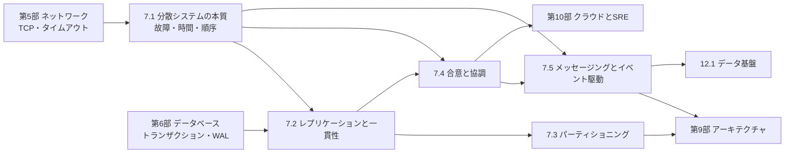

# 第7部 分散システム

> 1 台のコンピュータでは当たり前だった「呼び出しは成功か失敗のどちらか」「時計は 1 つ」「どちらが先かは明らか」が、ネットワークの向こうでは成り立ちません。一部だけが壊れ、メッセージは遅れ、重なり、入れ替わり、時計はずれます。この部では、部分故障と非同期性という分散システムの本質から出発して、レプリケーション・パーティショニング・合意・メッセージングを学びます。目標は、アルゴリズムを暗記することではなく、「このシステムは何を保証し、何を仮定し、壊れたときにどう振る舞うか」を説明し、設計上のトレードオフを判断できるようになることです。

## この部で身につくこと

- **不確かさを前提に考える**: 部分故障、タイムアウトの限界、時計のずれと巻き戻り、因果関係による順序（Lamport 時計・ベクトル時計）を理解し、「応答がないとき何が分からないのか」から設計を始められる。
- **重複と再試行に強い処理を作る**: at-least-once の配信と冪等性で、効果を実質 1 回にする処理を実装できる。exactly-once をうたう製品の保証の範囲を見抜ける。
- **レプリケーションを設計する**: 単一リーダー・マルチリーダー・リーダーレスの方式、同期と非同期、フェイルオーバーの危険、セッション保証、クォーラム、CRDT を使い分け、機能ごとに必要な一貫性を選べる。
- **データを分ける**: 分割の戦略、ホットスポット、コンシステントハッシュ、リバランス、セカンダリインデックス、分散環境の ID を理解し、シャーディングの要否とシャードキーを判断できる。
- **合意を正しく使う**: 2 相コミットがブロックする理由、過半数クォーラム、Raft の仕組みを説明でき、分散ロックにはフェンシングを、サービス間の一貫性には Saga を使える。合意を自作しない判断ができる。
- **非同期の流れを作る**: キューとログ、コンシューマグループ、Transactional Outbox、スキーマ進化、ウォーターマークによるストリーム処理を使って、正しく運用できるイベント駆動のシステムを設計できる。

## 章の一覧

| 章 | タイトル | 学習時間 | 主な演習 | キーワード |
|---|---|---|---|---|
| 7.1 | [分散システムの本質 — 故障・時間・順序](01-fundamentals/README.md) | 本文 4h ＋ 演習 6h | `clocks.py`（Lamport 時計、ベクトル時計、トレースからの並行な書き込みの検出）・`simnet.py`（シード付きの決定的なネットワークシミュレータと、再送＋重複排除による実質 1 回の処理）・`failure_detector.py`（ハートビートと φ accrual）、記述: 二重課金障害の事後分析 | 部分故障, 故障モデル, タイムアウト, 単調時計, うるう秒, Lamport 時計, ベクトル時計, 冪等性, FLP, CAP, PACELC |
| 7.2 | [レプリケーションと一貫性](02-replication-and-consistency/README.md) | 本文 4h ＋ 演習 6h | `session_consistency.py`（LSN トークンによる read-your-writes と monotonic reads）・`quorum.py`（クォーラム読み書き、リードリペア、アンチエントロピー）・`merkle.py`（Merkle 木による差分検出）・`crdt.py`（G-Counter、PN-Counter、LWW-Register、OR-Set）、記述: EC サイトの一貫性要件と災害対策 | リーダー・フォロワー, フェイルオーバー, スプリットブレイン, レプリケーションラグ, セッション保証, クォーラム, 線形化可能性, 因果一貫性, CRDT |
| 7.3 | [パーティショニング](03-partitioning/README.md) | 本文 3.5h ＋ 演習 5h | `partitioning.py`（ランデブーハッシュ、仮想ノード付きのコンシステントハッシュ、ホットスポットを観察するレンジ分割）・`ids.py`（Snowflake 形式の ID、RFC 9562 の UUIDv7）、記述: マルチテナント SaaS の分割設計 | レンジ分割, ハッシュ分割, ホットスポット, 仮想ノード, リバランス, セカンダリインデックス, シャードキー, UUIDv7 |
| 7.4 | [合意と協調](04-consensus-and-coordination/README.md) | 本文 5h ＋ 演習 8h | `twopc.py`（2 相コミットとブロック）・`raft_election.py`（Raft のリーダー選出。発展: ログ複製）・`fencing.py`（リースとフェンシングトークン）・`saga.py`（Saga オーケストレーター）、記述: 注文処理の Saga の設計 | 2 相コミット, 過半数クォーラム, Paxos, Raft, etcd, ZooKeeper, 分散ロック, フェンシング, Saga |
| 7.5 | [メッセージングとイベント駆動](05-messaging-and-events/README.md) | 本文 4h ＋ 演習 7h | `minilog.py`（パーティション分割されたログとコンシューマグループ）・`outbox.py`（Transactional Outbox と冪等なコンシューマ）・`windows.py`（ウォーターマークと許容遅延のあるウィンドウ集計）、記述: 注文イベントの設計レビュー | キュー, ログ, オフセット, コンシューマグループ, at-least-once, DLQ, Outbox, CDC, スキーマ進化, ウォーターマーク |

合計の目安は、本文 約 20 時間、演習 約 32 時間です。コード演習は `python3 tools/check.py 7` でまとめてテストできます（章を指定するなら `python3 tools/check.py 7.4` のように）。

## 学習の進め方

### 章の順序と依存関係

- **7.1 から順に進むのが基本です**。7.1 の部分故障・時計・冪等性は、後のすべての章で繰り返し使います。7.2 のフェイルオーバーは 7.4 の合意の問題そのものであり、7.4 の Saga と 7.1 の冪等性は、7.5 の Transactional Outbox と冪等なコンシューマにつながります。7.3 は 7.2 の後ならいつ読んでも構いません。
- **前提**: TCP の再送とタイムアウト（[5.2 TCPとUDP](../05-networking/02-tcp-and-udp/README.md)）、トランザクションと分離レベル（[6.3 トランザクションと同時実行制御](../06-databases/03-transactions/README.md)）、WAL（[6.4 ストレージエンジンと障害回復](../06-databases/04-storage-and-recovery/README.md)）を知っていると、ずっと読みやすくなります。
- **演習は「決定的なシミュレーション」です**。ネットワークの遅延・損失・分断やノードの停止を、シード付きの乱数と注入した時計で再現するので、テストは実時間を待たず、失敗は何度でも同じ形で再現できます。テストが失敗したら、同じシードで状態を 1 ステップずつ表示してみてください。これは、実務で分散システムのバグを追う方法（7.1 章の決定的シミュレーションテスト）の練習でもあります。
- **7.4 の Raft は、この部で最も手ごわい演習です**。ノード単体の規則のテスト（RequestVote・AppendEntries）から通し、次にシミュレーション全体のテストに進んでください。ログ複製は任意の発展課題で、`ENABLE_LOG_REPLICATION = True` にしたときだけテストされます。

### つまずきやすい点

- **「並行」は「同時」ではない**: ベクトル時計の「並行」は、互いに相手を知りえなかったという意味です。時刻が同じかどうかとは関係ありません（7.1）。
- **CAP の読み違い**: 「3 つから 2 つを選ぶ」のではなく、「分断が起きたとき、各操作が拒否するのか古い値を返すのか」を決める定理です。平常時のトレードオフは PACELC で考えます（7.1）。
- **クォーラムの過信**: W + R > N でも線形化可能になるとは限りません。どんな場合に崩れるかを、5 つ言えるようにしておきましょう（7.2）。
- **exactly-once の誤解**: ブローカーやミドルウェアの保証は、その内側に限られます。外部への副作用は、エンドツーエンドで冪等にします（7.1, 7.5）。
- **ロックの過信**: リースは、保持者が気づかないうちに失効します。正しさのためのロックには、書き込み先での検査（フェンシング）が必要です（7.4）。
- **経験者の進め方**: 理解度チェックに答えられる章は、★★★ の演習（`simnet.py`、`quorum.py`、`raft_election.py`、`minilog.py`、`windows.py` など）だけ解いて先へ進んで構いません。CTO 準備トラックでは、7.1 と 7.2 が必修です。7.3〜7.5 は、少なくとも「なぜ学ぶのか」「よくある落とし穴」「CTOの視点」と記述演習に取り組んでください（[学習ガイド](../00-guide/README.md)）。

## 到達度チェック

この部を修了したと言えるのは、次のことができるときです。

- [ ] リモート呼び出しがタイムアウトしたときにありうる状況を列挙し、冪等キーと再試行（バックオフ＋ジッター）を使って安全に再試行できる設計を示せる
- [ ] 壁時計と単調時計の違い、NTP・うるう秒の影響を説明し、Lamport 時計とベクトル時計で因果関係と並行性を判定できる
- [ ] FLP・CAP・PACELC を正確に述べ、「CA のデータベース」「exactly-once 配信」といった主張の問題点を指摘できる
- [ ] 同期・非同期・準同期レプリケーションとフェイルオーバーのリスク（データの消失、スプリットブレイン）を、RPO・RTO の数字とともに説明できる
- [ ] 機能ごとに必要な一貫性（線形化可能性、セッション保証、結果整合性）を選び、その代償（レイテンシ・可用性）を説明できる
- [ ] シャードキーを、主要なクエリ・ホットスポット・コロケーション・リシャーディングの観点で評価し、シャーディングの前に取るべき手段を挙げられる
- [ ] コンシステントハッシュと、時刻順の ID（Snowflake 形式・UUIDv7）を実装し、その性質を説明できる
- [ ] 2 相コミットがブロックする理由、過半数クォーラムの原理、Raft のリーダー選出の安全性の根拠を説明できる
- [ ] 分散ロックにフェンシングが必要な理由を説明し、サービスをまたぐ処理を Saga（補償・冪等性・状態の永続化）で設計できる
- [ ] Transactional Outbox・冪等なコンシューマ・DLQ・スキーマの互換性・ウォーターマークを使って、非同期の処理を正しく運用できる形で設計できる
- [ ] 第7部の演習のテストがすべて通る（`python3 tools/check.py 7`）

## この部の推薦図書・教材

- Martin Kleppmann『データ指向アプリケーションデザイン』（原題 "Designing Data-Intensive Applications"、オライリー・ジャパン）— この部全体の主教科書。第 5 章（レプリケーション）、第 6 章（パーティショニング）、第 8 章（分散システムの問題）、第 9 章（一貫性と合意）、第 11 章（ストリーム処理）が、各章に対応する。
- Alex Petrov『詳説 データベース』（原題 "Database Internals"、オライリー・ジャパン）第 2 部 — 故障検出、リーダー選出、レプリケーションと一貫性、合意アルゴリズムを、実装の視点で解説している。
- Martin Kleppmann の講義 "Distributed Systems"（University of Cambridge）— 講義ノートと動画が無料で公開されている。論理時計、配信保証、レプリケーション、合意を短時間で体系的に学べる。
- MIT 6.5840（旧 6.824）"Distributed Systems" — 講義資料と、Go で Raft と複製されたキーバリューストアを実装する課題が公開されている。この部の演習の次の一歩として最適。
- Maarten van Steen, Andrew S. Tanenbaum "Distributed Systems" — 分散システムの広い範囲を網羅する教科書。著者のサイトで、個人用の電子版が無料で配布されている（2026 年時点）。
- Jepsen の分析レポート（https://jepsen.io/analyses）— 実在のデータベースやキューが、障害の下で保証を破る様子を再現手順付きで読める。自分が使っている製品のレポートから読むとよい。

## 次に進む

- [第9部 アーキテクチャとシステム設計](../09-architecture/README.md) では、この部で学んだ原理を、アーキテクチャスタイル（[9.2](../09-architecture/02-architecture-styles/README.md)。マイクロサービスとイベント駆動）、スケーラビリティ（[9.5](../09-architecture/05-scalability-and-performance/README.md)）、システム設計のケーススタディ（[9.6](../09-architecture/06-system-design-cases/README.md)）に応用します。
- [第10部 クラウドとSRE](../10-cloud-and-sre/README.md) では、冗長化と SLO（[10.3 信頼性設計とSLO](../10-cloud-and-sre/03-reliability-engineering/README.md)）、非同期の処理の観測（[10.4 オブザーバビリティ](../10-cloud-and-sre/04-observability/README.md)）、障害対応（[10.5 インシデント対応とポストモーテム](../10-cloud-and-sre/05-incident-management/README.md)）として、分散システムを運用する側から学び直します。
- データを扱う立場からは、[12.1 データ基盤とデータエンジニアリング](../12-data-and-ai/01-data-engineering/README.md) で、CDC とストリーム処理をデータ基盤の中に位置づけます。
