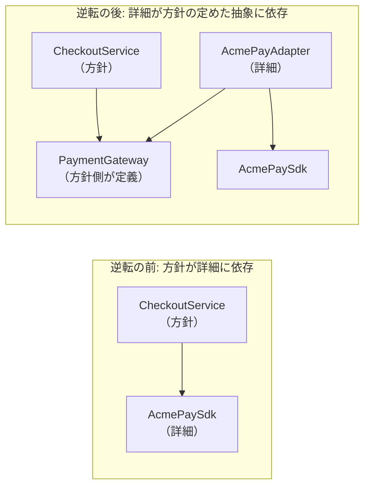

# 8.1 良いコードと設計原則

> 「動くコード」は出発点にすぎません。ソフトウェアのコストの大半は、書いた後に読み、直し、機能を足すときに発生します。では「良いコード」とは何で、どうすれば書けるのでしょうか。この章では、良さを「変更しやすさ」として定義し直し、複雑さの正体、モジュールの分け方、名前・関数・コメント・エラー処理、設計原則とデザインパターンの正しい使い方を、動くコードと演習で身につけます。

| 項目 | 内容 |
|---|---|
| 学習時間の目安 | 本文 4h ＋ 演習 6h |
| 前提となる章 | [3.1 プログラミングパラダイムと抽象化](../../03-programming-languages/01-paradigms/README.md)（[3.2 型システム](../../03-programming-languages/02-type-systems/README.md) も読んでいると理解しやすい） |
| 演習 | [exercises/](exercises/)（Python） |
| キーワード | 変更容易性, 複雑さ, 深いモジュール, 情報隠蔽, 凝集度, 結合度, SOLID, DRY, YAGNI, デザインパターン, 依存性の注入, 関数型コア |

## この章のゴール

- [ ] 「良いコード」を変更容易性と読みやすさの観点で定義し、具体的なコードの問題点を言葉で指摘できる
- [ ] 複雑さの 3 つの症状（変更の増幅・認知負荷・未知の未知）と 2 つの原因（依存・不明瞭さ）で設計を評価できる
- [ ] 深いモジュール・情報隠蔽・凝集度・結合度の観点で、モジュールの分け方を比較し判断できる
- [ ] 名前・関数・コメント・エラー処理を、読む人と呼び出す人の立場から設計できる
- [ ] SOLID・DRY・YAGNI・デザインパターンを、効く場面と過剰適用の害を区別して使い分けられる
- [ ] 特性テストで振る舞いを守りながら、絡み合ったコードを小さな手順でリファクタリングし、機能を追加できる
- [ ] スタイルの統一と設計レビューを、道具と仕組みでチームに定着させる方法を説明できる

## なぜ学ぶのか

Python のスタイルガイド PEP 8 は、その根拠として「コードは書かれるよりはるかに多く読まれる」という Guido van Rossum の洞察を挙げています。あるコードを書くのは一度ですが、そのコードはレビューで読まれ、バグ調査で読まれ、機能追加のたびに読まれます。読む人は他人かもしれませんし、半年後のあなたかもしれません。

読みにくく変更しにくいコードのコストは、感覚論ではなく測定されています。Adam Tornhill と Markus Borg は、39 の商用コードベースを分析した研究（"Code Red: The Business Impact of Code Quality", 2022）で、コード品質の指標（CodeScene 社の Code Health）が低いファイルは高いファイルに比べて欠陥が約 15 倍多く、課題の解決にかかる開発時間が平均で 124% 長く、所要時間の最大値も約 9 倍長かったと報告しています。著者らはこの指標を提供する CodeScene 社の関係者であり、観察研究なので因果関係まで示したものではない点は割り引いて読む必要があります。所要時間が読めないことは、見積もりと計画の信頼性を直接損ないます。

さらに厄介なのは、設計の劣化が **少しずつ** 進むことです。John Ousterhout は『A Philosophy of Software Design』で、複雑さは一つの大失敗から生まれるのではなく、「今回だけは」という小さな妥協の積み重ねで生まれると述べています。どの一手も単独では小さく見えるので、原理を知らないと止めどきが分かりません。

この章の内容は、コードレビュー（[8.3](../03-version-control-and-review/README.md)）、リファクタリングと技術的負債の管理（[8.5](../05-refactoring-and-tech-debt/README.md)）、アーキテクチャ設計（[第9部](../../09-architecture/01-architecture-fundamentals/README.md)）の共通の土台になります。

## 1. 「良いコード」とは何か

### 1.1 動くことは出発点にすぎない

「良いコード」の定義は人によって違いますが、実務で役に立つ定義は次のようなものです。

> 良いコードとは、**正しく動き**、**読んで理解しやすく**、**今後起こりそうな変更を、安全に少ない手間で行える** コードである。

最後の条件がポイントです。変更がまったく起きないコード（二度と触らない使い捨てのスクリプト）なら、読みにくくても実害は小さいでしょう。逆に、毎週のように仕様が変わる料金計算や権限判定のコードは、少しの読みにくさが毎回の変更コストとバグとして跳ね返ってきます。**良さは、そのコードに起こる変更との関係で決まる** のです。

| 観点 | 問うこと | 悪い兆候 |
|---|---|---|
| 正しさ | 仕様どおりに動くか。境界や異常系で壊れないか | テストがない、エッジケースで落ちる |
| 読みやすさ | 初めて読む人が、短時間で意図と動きを理解できるか | 名前から役割が分からない、一度に覚えることが多い |
| 変更容易性 | 1 つの仕様変更で、何か所を触る必要があるか | 同じ判断が散らばっている、1 か所直すと別の所が壊れる |
| テスト容易性 | 外部（時刻・DB・ネットワーク）なしで振る舞いを確かめられるか | 時刻や乱数を関数の中で直接読んでいる |
| 一貫性 | 似たものは似た形で書かれているか | 同じ概念に 3 通りの書き方がある |

### 1.2 変更を容易にしてから、容易な変更をする

Kent Beck は 2012 年の投稿で「望む変更のたびに、まず変更を容易にせよ（これは難しいかもしれない）。それから容易な変更をせよ」という趣旨のことを書いています。機能追加を「今の構造のまま無理やり足す」のではなく、「足しやすい構造に直す（リファクタリング）」と「足す」を別の手順として行う、という考え方です。この章の演習 1・2 は、まさにこの順序を体験するように作られています。

変更容易性は、次のような代理指標で観察できます。

- 1 つの仕様変更で触るファイル・関数の数（後述する「変更の増幅」）
- そのコードの変更にかかるリードタイムと、変更後に出たバグの数
- 新しく加わったメンバーが、そのコードを安心して変更できるようになるまでの時間
- 変更頻度が高く、かつ複雑なファイル（ホットスポット。[8.5](../05-refactoring-and-tech-debt/README.md) の演習で計測します）

## 2. 複雑さの正体

### 2.1 複雑さとは何か

Ousterhout は複雑さを「システムを理解し変更することを難しくする、ソフトウェアの構造に関するあらゆるもの」と定義しました。行数やクラス数ではなく、**人間が理解し変更するときの難しさ** で定義しているのがポイントです。

彼はシステム全体の複雑さを、概念的に次の式で表しています。

```text
C = Σ (部分 p の複雑さ c_p) × (開発者が部分 p に費やす時間の割合 t_p)
```

誰も触らない部分がどれほど複雑でも、全体への影響は小さい。逆に、頻繁に触る部分の複雑さは何倍にも効いてきます。これは「複雑で、かつよく変更されるファイル」から手をつけるというホットスポット分析（[8.5](../05-refactoring-and-tech-debt/README.md)）と同じ考え方です。

### 2.2 3 つの症状

複雑さは、次の 3 つの症状として現れます。

| 症状 | 意味 | 例 |
|---|---|---|
| **変更の増幅**（change amplification） | 単純な変更のために、多くの場所を修正しなければならない | 送料の無料条件が 5 つのファイルに書かれている |
| **認知負荷**（cognitive load） | 作業のために、開発者が知って覚えておかなければならないことが多い | 関数を呼ぶ前に、3 つのグローバル変数を正しい順で設定する必要がある |
| **未知の未知**（unknown unknowns） | 何を変更すべきか、何を知る必要があるかが分からない | 税率を変えたら、別の所にある「税込み価格のキャッシュ」も直す必要があったが、どこにも書かれていない |

最も危険なのは 3 つ目です。変更の増幅や認知負荷は「大変だ」と気づけますが、未知の未知は **気づけない** ので、バグとして本番で初めて発覚します。

### 2.3 2 つの原因

Ousterhout は、複雑さの原因を 2 つにまとめています。

1. **依存（dependencies）**: あるコードを単独では理解・変更できず、別のコードと合わせて考えなければならない状態。依存そのものは避けられませんが、数を減らし、**明白にする**（型・インターフェース・名前で見えるようにする）ことはできます。
2. **不明瞭さ（obscurity）**: 重要な情報が見えない状態。曖昧な名前、ドキュメントのない前提、同じ名前が別の意味で使われる不統一などです。

演習の `exercises/pricing.py` を見てみましょう。会員ランクの文字列 `"gold"` が割引と送料の 2 か所で判定されているので、新しいランクを足すには両方を探して直す必要があります（変更の増幅）。`t`・`d`・`a10` といった名前は、読む人に「どの変数が何か」を覚えさせます（認知負荷）。そして「書籍だけのカートでは、クーポンの利用資格が検査されない」という振る舞いは、コードの構造から偶然生じたもので、どこにも書かれていません（未知の未知）。

### 2.4 複雑さは少しずつ積もる — 戦術的と戦略的

Ousterhout は、目の前のタスクを最短で終わらせることだけを考える進め方を **戦術的プログラミング（tactical programming）**、よい設計への小さな投資を続ける進め方を **戦略的プログラミング（strategic programming）** と呼び、開発時間の 10〜20% 程度を設計の改善に投資することを提案しています。戦術的な一手一手は合理的に見えますが、積み重なるとすべての変更が遅くなります。

戦略的であることは「最初に完璧な設計をする」ことではありません。変更のたびに少しずつ構造を良くし続けること、問題に気づいたらその場で直すことです。これは [8.5](../05-refactoring-and-tech-debt/README.md) で扱う技術的負債の「返済」を、日々の仕事に組み込むことでもあります。

## 3. モジュール設計 — 深さ・情報隠蔽・凝集と結合

ここでいう **モジュール** は、インターフェースと実装を持つあらゆる単位（関数・クラス・パッケージ・サービス）を指します。

### 3.1 深いモジュールと浅いモジュール

モジュールの価値は「提供する機能」から「利用者が理解しなければならないインターフェースのコスト」を引いたものだと考えられます。Ousterhout は、小さなインターフェースの背後に大きな機能を隠すモジュールを **深い（deep）**、インターフェースが提供する機能に比べて大きいモジュールを **浅い（shallow）** と呼びました。

```text
      深いモジュール                       浅いモジュール
    ┌──────────┐ ← インターフェース（狭い）    ┌──────────────────────────┐ ← インターフェース（広い）
    │          │                               │                          │
    │          │                               └──────────────────────────┘ ← 機能（薄い）
    │  機能    │
    │ （厚い） │
    │          │
    └──────────┘
```

古典的な例が Unix のファイル I/O です。`open`・`read`・`write`・`lseek`・`close` という少数のシステムコールの背後に、ディスク上の配置、キャッシュ、権限検査、デバイスの違いといった膨大な複雑さが隠れています（[4.3 ファイルシステムとI/O](../../04-operating-systems/03-filesystems-and-io/README.md)）。

浅いモジュールの典型は、処理をそのまま横流しするだけの関数（pass-through method）や、1 つの概念を細かいクラスに分割しすぎて、利用者が何個ものクラスを正しく組み合わせなければならない設計です。Ousterhout はこれを「クラス病（classitis）」と呼んでいます。

次の 2 つは、同じ「設定ファイルを読む」機能のインターフェースです（インターフェースだけを示す擬似コード）。

```python
# 浅い: 呼び出し側が手順と形式の知識をすべて持たなければならない
reader = ConfigFileReader(path)
lines = LineSplitter().split(reader.read_all())
lines = CommentFilter(prefix="#").apply(lines)
pairs = [KeyValueParser(sep="=").parse(line) for line in lines]
config = DuplicateKeyResolver(policy="last_wins").resolve(pairs)

# 深い: 形式の知識はモジュールの中に隠れている
config = load_config(path)   # KEY=VALUE 形式。# 以降はコメント。重複キーは後勝ち
```

浅い版では、ファイル形式を変える（例えばセクションを導入する）と、すべての呼び出し元が変わります。深い版なら `load_config` の中だけです。

### 3.2 情報隠蔽

深いモジュールを作るための中心的な技法が **情報隠蔽（information hiding）** です。David Parnas は 1972 年の論文 "On the Criteria To Be Used in Decomposing Systems into Modules" で、処理の手順（フローチャート）の段階ごとにモジュールを分けるのではなく、**「変わりそうな設計上の決定」ごとに、それを隠すモジュールを作る** べきだと論じました。データ構造、ファイル形式、アルゴリズム、外部サービスの仕様などが、隠すべき決定の代表です。

その反対が **情報漏洩（information leakage）** で、1 つの設計上の決定が複数のモジュールに現れている状態です。よくある原因が、処理の時間順にモジュールを分ける **時間的分解（temporal decomposition）** です。「ファイルを読むモジュール」「解析するモジュール」「書き戻すモジュール」に分けると、3 つともファイル形式を知っていなければならず、形式の変更が 3 か所に波及します。

### 3.3 凝集度と結合度

1970 年代の構造化設計（Stevens・Myers・Constantine ら）は、モジュールの良し悪しを 2 つの尺度で表しました。**凝集度（cohesion）** はモジュールの中の要素がどれだけ強く関連しているか、**結合度（coupling）** はモジュール同士がどれだけ強く依存しているかです。目標は「凝集度は高く、結合度は低く」です。日本では基本情報技術者試験などで「モジュール強度」「モジュール結合度」として出題される分類です。

| モジュール強度（凝集度） | 内容 | 良し悪し |
|---|---|---|
| 機能的強度（functional） | 単一の明確な機能を実行する | 最も良い |
| 情報的強度（informational） | 同じデータ構造を扱う複数の機能を、そのデータとともにまとめる（抽象データ型） | 良い |
| 連絡的強度（communicational） | 同じデータを使う処理をまとめる | ↑ |
| 手順的強度（procedural） | 決まった手順で実行される処理をまとめる | ｜ |
| 時間的強度（temporal） | 同じ時期に実行される処理（初期化処理など）をまとめる | ↓ |
| 論理的強度（logical） | 似た種類の処理をまとめ、引数のフラグで選ぶ | 悪い |
| 暗合的強度（coincidental） | 関連のない処理を寄せ集める（`utils.py` の成れの果て） | 最も悪い |

| モジュール結合度 | 内容 | 良し悪し |
|---|---|---|
| データ結合 | 必要なデータだけを引数で渡す | 最も良い |
| スタンプ結合 | 構造体（レコード）ごと渡し、その一部だけを使う | ↑ |
| 制御結合 | 引数で相手の処理の流れを制御する（フラグ引数） | ｜ |
| 外部結合 | グローバルに宣言された単一のデータ項目を複数で参照する | ｜ |
| 共通結合 | グローバルなデータ構造（共通領域）を複数で読み書きする | ↓ |
| 内容結合 | 相手の内部（非公開の変数・実装）を直接参照・変更する | 最も悪い |

分類名を暗記するよりも、現代的には次の 2 つの問いに言い換えると実務で使えます。

- **一緒に変わるものは、一緒に置かれているか**（凝集）。1 つの仕様変更が 1 つのモジュールに閉じているなら凝集度が高い。
- **片方を変えたとき、もう片方を変える必要があるか**（結合）。明示的な呼び出し関係がなくても、「このファイルを変えると、いつもあのファイルも変わる」なら、隠れた結合があります。これを **変更の結合（change coupling）** と呼び、Git の履歴から検出できます（[8.5](../05-refactoring-and-tech-debt/README.md) の演習）。

### 3.4 分けるか、まとめるか

「小さく分けるほど良い」わけではありません。Ousterhout は、次のような場合は **まとめた方が良い** ことが多いと述べています。

- 2 つのコードが情報を共有している（片方を理解するのに、もう片方の知識が要る）
- いつも一緒に使われる
- まとめることでインターフェースが単純になる、あるいは重複が消える

逆に、汎用的な処理と特定の用途向けの処理が混ざっているなら、分けるべきです。そして、複雑さは **下に押し下げる（pull complexity downwards）** のが原則です。モジュールの利用者は実装者より多いので、面倒な処理（既定値の決定、エラーの吸収、単位の変換）はモジュールの内側で引き受け、呼び出し側を単純にします。

## 4. 名前・関数・コメント

### 4.1 名前

名前は、読む人の頭の中に像を結ばせるための最も安い道具です。

| 悪い例 | 問題 | 改善例 |
|---|---|---|
| `data`, `info`, `tmp`, `obj` | 何のデータか分からない | `unpaid_invoices`, `retry_state` |
| `t`, `d`, `a10`（演習の旧コード） | 読む人が対応表を覚える必要がある | `subtotal`, `discount`, `taxable_at_10_percent` |
| `timeout = 30` | 単位が分からない（秒? ミリ秒?） | `timeout_seconds = 30` |
| `flag`, `check()` | 何を表すか、何を検査するか分からない | `is_first_order`, `validate_coupon()` |
| 同じ概念に `user` / `member` / `customer` が混在 | 別物なのか同じものなのか分からない | 用語集を作り、1 つに揃える（[9.3](../../09-architecture/03-domain-driven-design/README.md) のユビキタス言語） |

Ousterhout は「簡潔で正確な名前がどうしても見つからないなら、それは設計がきれいでない兆候かもしれない」と述べています。`process_and_save_and_notify()` のような名前しか付けられない関数は、責務が混ざっているのです。

### 4.2 関数の大きさ — 「小さく」と「深く」

関数の大きさについては、有名な 2 つの立場があります。Robert C. Martin の『Clean Code』は「関数は小さくせよ。そして、さらに小さくせよ」と主張します。一方 Ousterhout は、細かく分けすぎると浅い関数が増え、読む人が関数の間を行き来しなければならなくなると批判しています。

両者は矛盾しているようで、実は同じことを別の角度から言っています。判断の基準は **行数ではなく、読む人の負担** です。

- **抽出すべきとき**: 取り出した部分に、中身を読まなくても意味が分かる名前を付けられる。単独で理解・テストできる。呼び出し側が「何をするか」だけ読めば済むようになる。
- **抽出すべきでないとき**: 取り出した関数を理解するには、結局呼び出し元の文脈を読む必要がある。2 つの関数を常に行き来しないと読めない（Ousterhout のいう「結合した関数（conjoined methods）」）。

関数のインターフェースについては、次の経験則が役に立ちます。

- **引数は少なく**。引数が多いのは、関数が多くのことを知りすぎているか、関連する値をまとめた型（例: `Line`、`DateRange`）が欠けている兆候です。
- **フラグ引数を避ける**。`render(page, True)` は読んでも意味が分かりません。振る舞いが根本的に違うなら関数を分け、そうでないならキーワード専用引数（`render(page, *, draft=True)`）にします。
- **コマンドとクエリを分ける**（Bertrand Meyer のコマンド・クエリ分離）。状態を変える関数は値を返さず、値を返す関数は状態を変えない、を基本にすると、呼び出しの副作用を推測しやすくなります。

### 4.3 コメント — 「何を」ではなく「なぜ」

コードを読めば分かることをコメントで繰り返しても、情報は増えません。演習の旧コードの `# 合計を計算する` や `# 書籍` がその例です。コメントが書くべきなのは、**コードからは読み取れないこと** です。

| 種類 | 書くこと | 例 |
|---|---|---|
| インターフェースのコメント（docstring） | 呼び出す人が知るべき契約: 引数の意味と単位、戻り値、例外、前提条件、スレッド安全性 | 「金額は税抜の円。期間は開始を含み終了を含まない」 |
| 実装の「なぜ」 | その書き方を選んだ理由、検討して捨てた案、外部の制約 | 「税は税率ごとに 1 回だけ切り捨てる（明細ごとに切り捨てると合計がずれるため）」 |
| 参照 | 判断の根拠になった課題・ADR・仕様書へのリンク | 「ADR-0012 を参照」「既存の振る舞いを保存（要確認: #1234）」 |

コメントの最大の弱点は、**コードと一緒に更新されない** ことです。演習の旧コードには `# 送料は全国一律 600 円（税抜）` というコメントがありますが、コードは 500 円です。どちらが正しいのか、読む人には分かりません。コメントは変わりにくい「意図」と「契約」に絞り、変わりやすい「実装の手順」はコード（良い名前と構造）に語らせるのが原則です。`TODO` を書くなら、課題管理の番号と担当を添え、放置されない仕組みにします。

## 5. エラー処理の設計

### 5.1 例外はインターフェースの一部

関数が投げうる例外は、引数や戻り値と同じくインターフェースの一部です。例外が増えるほど、呼び出し側が考慮すべきことが増え、テストすべき経路も増えます。しかも例外処理の経路は実際にはめったに通らないので、バグが潜みやすい場所です。

### 5.2 エラーを定義から消す

Ousterhout の最も印象的な提案の一つが「**エラーを定義から消す**（define errors out of existence）」です。API の意味を少し変えるだけで、そもそもエラーにならないようにできることがあります。Python の標準ライブラリにも例があります。

```python
prices = {"apple": 120}
print(prices.get("banana", 0))       # 0      （KeyError にしない）
tags = {"new", "sale"}
tags.discard("clearance")            # 何もしない（remove なら KeyError）
print(tags == {"new", "sale"})       # True
print("abc"[1:100])                  # 'bc'   （範囲外のスライスは例外にならない）
print("abc".find("z"))               # -1     （index なら ValueError）
```

```text
0
True
bc
-1
```

設計の例も挙げます。「ユーザーを削除する API」を「指定したユーザーが存在しない状態にする API」と定義すれば、すでに存在しない場合もエラーではなく成功になります（冪等な削除）。再試行しても安全になり、呼び出し側の分岐も消えます。

ただし、**本当のエラーを隠してはいけません**。「在庫が足りない」「決済が拒否された」はビジネス上の重要な結果であり、呼び出し側が必ず扱うべきものです。消してよいのは「呼び出し側がどうせ同じ対処をする、意味のない区別」だけです。

### 5.3 早く失敗する — 境界で検証し、内側では型を信頼する

不正な値を受け取ったら、その場ですぐに失敗させる（**fail fast**）のが原則です。不正な値が内部を流れていくと、全く関係のない場所で不可解なエラーになり、原因の特定が難しくなります。

そのための実践的な方法が、**システムの境界（API の入口、ファイルや DB からの読み込み）で入力を検証し、検証済みであることが型で分かる値に変換する** ことです。Alexis King の 2019 年のエッセイ "Parse, don't validate"（検証するのではなく、解析せよ）は、この考え方を明快に説明しています。一度 `Quantity` 型に変換できたら、内側のコードは「数量が 1 以上の整数か」を二度と確認する必要がありません。

```python
from dataclasses import dataclass

@dataclass(frozen=True)
class Quantity:
    value: int

    def __post_init__(self):
        if not isinstance(self.value, int) or isinstance(self.value, bool) or self.value < 1:
            raise ValueError(f"数量は 1 以上の整数で指定してください（受け取った値: {self.value!r}）")

def parse_quantity(raw: str) -> Quantity:
    try:
        return Quantity(int(raw))
    except ValueError:
        raise ValueError(f"数量は 1 以上の整数で指定してください（受け取った値: {raw!r}）") from None

print(parse_quantity("3"))
try:
    parse_quantity("3個")
except ValueError as e:
    print(e)
```

```text
Quantity(value=3)
数量は 1 以上の整数で指定してください（受け取った値: '3個'）
```

演習の解答例でも、`calculate_total` の入口で明細を `Line` 型に変換し、内側の計算は検証済みの値だけを扱うようにしています。

### 5.4 行動につながるエラーメッセージ

エラーメッセージは、受け取った人（利用者・運用者・未来の開発者）が **次に何をすればよいか** 分かるように書きます。

| 悪い例 | 良い例 |
|---|---|
| `Invalid input` | `数量は 1 以上の整数で指定してください（受け取った値: '3個'）` |
| `Error 500` | `決済サービスへの接続がタイムアウトしました（30 秒）。注文 A-1001 は未確定です。時間をおいて再実行してください` |
| `KeyError: 'region'` | `設定 'region' がありません。config.toml の [aws] セクションに region = "ap-northeast-1" のように指定してください` |

良いメッセージには、**何が起きたか・なぜか（どの値が期待とどう違うか）・どうすればよいか** と、調査に必要な文脈（ID、値、上限）が入っています。一方で、パスワード・トークン・個人情報をメッセージやログに含めてはいけません（[11.4](../../11-security/04-web-security/README.md)）。

### 5.5 例外を握りつぶさない

最悪のエラー処理は、例外を黙って捨てることです。

```python
try:
    send_receipt(order)
except Exception:
    pass    # 何が起きても無視する —— 障害に誰も気づけない
```

原則は次の通りです。

- 捕まえるのは、**その場で意味のある対処ができる、具体的な例外だけ** にする。
- 対処できないなら捕まえずに上に伝える。文脈を足して投げ直すときは `raise NewError(...) from exc` で元の例外をつなぐ。
- 本当に無視してよい場合（例: ベストエフォートの通知）は、ログとメトリクスに残し、コメントで理由を書く。
- ログは **扱った層で 1 回だけ** 出す。各層で同じ例外をログに出すと、1 つの障害が何十行ものノイズになる。

## 6. 設計原則を正しく使う — SOLID・DRY・YAGNI・KISS

設計原則は、過去の失敗から抽出された **経験則（ヒューリスティック）** です。法律ではありません。どの原則にも「効く場面」と「過剰に適用すると害になる場面」があります。

### 6.1 SOLID

SOLID は、Robert C. Martin が 2000 年ごろに論文や著書でまとめたオブジェクト指向設計の 5 原則の頭文字で、この覚えやすい並びは Michael Feathers が考案したとされています。

| 原則 | 意味 | 効く例 | 過剰適用の症状 |
|---|---|---|---|
| **S** 単一責任（SRP） | モジュールは、ただ一つのアクター（変更を求める人・部署）に対して責任を負う | 給与計算（経理の要求）と勤怠レポート（人事の要求）を同じクラスに置かない | 「1 クラス 1 メソッド」まで分割し、浅いクラスが大量にできる |
| **O** 開放閉鎖（OCP） | 拡張に対して開き、修正に対して閉じる。新しい種類を足すとき、既存コードの修正を最小にする | クーポンの種類を表（`COUPONS`）に登録するだけで追加できる | 起こりもしない拡張のための差し込み口を、あらゆる所に作る |
| **L** リスコフの置換（LSP） | 派生型は基底型の代わりに使えなければならない（振る舞いの契約を守る） | `Square` を `Rectangle` の派生にすると「幅だけ変える」操作の契約が破れる、という古典的な反例 | ——（違反すると、型の上では正しいのに実行時に壊れる） |
| **I** インターフェース分離（ISP） | 利用者が使わないメソッドへの依存を強制しない | 読み取りしかしない処理は、`read` だけを持つ小さなインターフェースに依存する | 1 メソッドずつのインターフェースが乱立する |
| **D** 依存性逆転（DIP） | 上位の方針が下位の詳細に依存せず、どちらも抽象に依存する | 決済処理が特定の決済 SDK ではなく、自分たちが定義した `PaymentGateway` に依存する（7.4 節） | 実装が 1 つしかなく、今後も増えないものまでインターフェースを作る |

SRP は「1 つのことだけをせよ」と誤解されがちですが、Martin 自身は『Clean Architecture』（2017）で「モジュールはただ一つのアクターに対して責任を負うべき」と言い直しています。**変更の理由（誰がその変更を求めるか）** で分けるという意味で、情報隠蔽や凝集度と同じことを言っています。OCP は Bertrand Meyer（1988 年）、LSP は Barbara Liskov の 1987 年の基調講演と、その後の Liskov と Jeannette Wing の論文（1994 年）に由来します。

### 6.2 SOLID への批判

SOLID は、静的型付けのオブジェクト指向言語で大規模なコードを扱う文脈で生まれました。これをそのまま適用すると、次のような問題が起きがちです。

- **抽象化の過剰**: 「DIP だから」と、実装が 1 つしかないクラスにもインターフェースを作ると、コードを読む人は定義にジャンプするたびに「実装はどれか」を探すことになります。抽象化は、差し替えが実際に必要になったとき（テストで偽物に差し替える場合を含む）に導入すれば十分なことが多いのです。
- **浅いモジュールの量産**: SRP を行数の基準として使うと、3.1 節の「クラス病」になります。
- **言語による違い**: Python や関数型言語では、関数を値として渡せるので、クラス階層を作らなくても Strategy や DI が実現できます。Protocol（構造的部分型）を使えば、インターフェースの継承も不要です。

Dan North は 2022 年に、SOLID に代わる考え方として、Composable（組み合わせやすい）・Unix philosophy（一つのことをうまくやる）・Predictable（予測可能）・Idiomatic（その言語らしい）・Domain-based（ドメインに基づく）の頭文字をとった **CUPID** を提案しています。原則の名前を覚えることより、**「この抽象化は、読む人と変更する人の負担を減らしているか」** を毎回問うことが大切です。

### 6.3 DRY と「間違った抽象化」

**DRY（Don't Repeat Yourself）** は、Andrew Hunt と David Thomas の『達人プログラマー』（1999）が提唱した原則で、元の定義は「すべての知識は、システム内で単一の、明確な、権威ある表現を持たなければならない」です。対象は **知識** であって、**文字列の見た目** ではありません。

同じに見えるコードでも、別々の理由で変わる（別の知識を表す）なら、それは偶然の重複です。例えば「会員の表示名の最大長 50」と「商品名の最大長 50」は、今は同じ数字でも、別々の理由で変わります。1 つの定数にまとめると、片方の変更がもう片方を壊します。

Sandi Metz は 2014 年の RailsConf の講演 "All the Little Things" で「**重複は、間違った抽象化よりはるかに安い**（duplication is far cheaper than the wrong abstraction）」と述べ、2016 年のブログ記事 "The Wrong Abstraction" でその理由を詳しく書きました。彼女が描いたのは次のような筋書きです。

1. プログラマ A が重複を見つけ、共通の関数に抽出する。
2. 新しい要件が来る。共通の関数で「ほぼ」対応できるので、プログラマ B は引数と条件分岐を足す。
3. これが繰り返され、共通の関数は引数と `if` だらけになり、誰も理解できなくなる。
4. 抽象化はすでに存在するので、誰もそれを疑わない（サンクコスト）。

Metz の処方箋は、**間違った抽象化に気づいたら、いったん呼び出し元に中身を戻し（インライン化し）、重複を受け入れてから、改めて正しい共通点を見つける** ことです。Martin Fowler が『リファクタリング』で紹介している Don Roberts の「3 度目の法則（Rule of Three）」— 同じことを 3 度目にするときに初めて抽象化を考える — も、早すぎる抽象化を防ぐ経験則です。

### 6.4 YAGNI と KISS

**YAGNI（You Aren't Gonna Need It）** はエクストリーム・プログラミング（XP）から広まった原則で、「必要だと予想されるときではなく、実際に必要になったときに実装せよ」という意味です。Martin Fowler は 2015 年の記事 "Yagni" で、先回りして作った機能のコストを、作るコスト、本当に必要な機能が後回しになる遅延のコスト、存在することで以後の変更を重くする維持のコスト、予想が外れたときの修正のコストに分けて説明しています。予想が当たったとしても、維持のコストは払い続けることになります。

注意すべきは、**YAGNI は「変更しやすくするための投資」には適用されない** ことです。テストを書く、リファクタリングする、名前を直すことは、将来の機能の先取りではなく、今のコードを変更可能に保つための作業です。YAGNI を理由にテストを省くのは誤用です。

**KISS（Keep It Simple, Stupid）** は「単純に保て」という原則です。ここでの「単純（simple）」は「簡単（easy）」とは違います。Rich Hickey は講演 "Simple Made Easy"（2011）で、simple は「絡み合っていない」ことであり、easy は「手近で慣れている」ことだと区別しました。使い慣れた巨大なフレームワークを持ち込むのは easy ですが、システムを simple にするとは限りません。

## 7. デザインパターンと依存の方向

### 7.1 パターンは語彙である

**デザインパターン** は、繰り返し現れる設計上の問題と、その定番の解決策に名前を付けたものです。Gamma・Helm・Johnson・Vlissides の 4 人（Gang of Four, GoF）による『Design Patterns』（1994）が 23 のパターンをまとめ、広く知られるようになりました。パターンの最大の価値は **語彙** にあります。「ここは Adapter で包みましょう」と言えば、設計の意図が一言で伝わります。

実務でよく使うものを挙げます。

| パターン | 解決する問題 | Python での典型的な形 | 注意点 |
|---|---|---|---|
| Strategy | 同じ目的のアルゴリズムを差し替えたい | 関数や、同じメソッドを持つ小さなクラスを渡す。演習の解答例のクーポン | 種類が 1〜2 個で増える見込みがないなら `if` で十分 |
| Observer | ある出来事を、発生元が知らない複数の相手に通知したい | コールバックの登録、イベントバス | 呼び出しの流れが見えなくなる。登録解除の漏れ、通知順序への依存 |
| Adapter | 外部のインターフェースを、自分たちの形に合わせたい | 外部 SDK を包むクラス | 外部の概念（例外・データ型）を漏らさないこと |
| Facade | 複雑なサブシステムに、単純な入口を用意したい | `load_config(path)` のような深い関数 | 何でも入る「神クラス」にしない |
| Decorator | 同じインターフェースのまま、振る舞い（再試行・キャッシュ・計測）を足したい | 同じメソッドを持つラッパー、または Python のデコレータ構文 | 重ねすぎると実行順が分かりにくい |
| Factory | 生成の手順や、どの実装を作るかの判断を隠したい | `Order.from_dict(...)` のようなクラスメソッド、登録表 | 生成が単純なら不要 |
| 依存性の注入（DI） | 依存する相手を、使う側が自分で作らないようにしたい | コンストラクタ引数で受け取る | 大がかりな DI コンテナは必須ではない |

### 7.2 Adapter・Decorator・DI を組み合わせる

外部の決済 SDK を使う例で、3 つのパターンがどう協力するかを見てみます。

```python
import time
from typing import Callable, Protocol


class PaymentGateway(Protocol):
    def charge(self, user_id: str, amount: int, idempotency_key: str) -> str: ...


class AcmePaySdk:
    """外部の決済 SDK（という想定）。引数の名前も戻り値の形も、自分たちの都合とは違う。"""

    def __init__(self, failures: int = 0):
        self.failures = failures

    def create_payment(self, *, customer: str, yen: int, key: str) -> dict:
        if self.failures > 0:
            self.failures -= 1
            raise ConnectionError("timeout")
        return {"payment": {"id": f"pay_{key}"}}


class AcmePayAdapter:
    """Adapter: 外部 SDK を、自分たちのインターフェース（PaymentGateway）に合わせる。"""

    def __init__(self, sdk: AcmePaySdk):
        self._sdk = sdk

    def charge(self, user_id: str, amount: int, idempotency_key: str) -> str:
        result = self._sdk.create_payment(customer=user_id, yen=amount, key=idempotency_key)
        return result["payment"]["id"]


class RetryingGateway:
    """Decorator: 同じインターフェースのまま「再試行」という振る舞いを足す。"""

    def __init__(self, inner: PaymentGateway, attempts: int = 3,
                 sleep: Callable[[float], None] = time.sleep):
        self._inner, self._attempts, self._sleep = inner, attempts, sleep

    def charge(self, user_id: str, amount: int, idempotency_key: str) -> str:
        for attempt in range(1, self._attempts + 1):
            try:
                # 同じ冪等性キーで再送するので、二重課金にならない（決済側が重複を排除する前提）
                return self._inner.charge(user_id, amount, idempotency_key)
            except ConnectionError:
                if attempt == self._attempts:
                    raise
                self._sleep(0.1 * 2 ** attempt)   # 指数バックオフ
        raise AssertionError("unreachable")


class CheckoutService:
    """DI: 依存（gateway）を自分で作らず、外から受け取る。"""

    def __init__(self, gateway: PaymentGateway):
        self._gateway = gateway

    def checkout(self, order_id: str, user_id: str, amount: int) -> str:
        return self._gateway.charge(user_id, amount, idempotency_key=f"order-{order_id}")


# 組み立て（composition root）: どの実装を使うかは、ここ 1 か所で決める
waits = []
service = CheckoutService(RetryingGateway(AcmePayAdapter(AcmePaySdk(failures=2)), sleep=waits.append))
print(service.checkout("A-1001", "u42", 3980))
print(waits)
```

```text
pay_order-A-1001
[0.2, 0.4]
```

`CheckoutService` は、決済 SDK の存在も、再試行の存在も知りません。テストでは `PaymentGateway` を満たす偽物を渡せば、ネットワークなしで検証できます。`sleep` も注入しているので、待ち時間の検証にも実際の待ちは不要です（テストダブルの使い分けは [8.2](../02-testing/README.md) で詳しく扱います）。なお、決済のような「副作用のある処理」の再試行は、冪等性キーとセットでなければ二重課金を起こします（[9.4 API設計](../../09-architecture/04-api-design/README.md)）。

### 7.3 パターンの過剰適用

パターンは問題があって初めて意味を持ちます。問題がないのにパターンを当てはめると、間接参照が増えるだけです。Peter Norvig は 1996 年の講演資料 "Design Patterns in Dynamic Languages" で、GoF の 23 パターンのうち 16 は、関数を値として扱える Lisp や Dylan のような言語では「見えなくなるか、より単純になる」と指摘しました。Python でも、1 メソッドだけの Strategy クラスは関数で、Singleton はモジュールで、Command は関数オブジェクトで済むことが多いのです。

「このコードに何のパターンを適用できるか」ではなく、「このコードのどこが変更しにくいか。その問題にはどの解決策が合うか」の順で考えましょう。

### 7.4 依存の方向と依存性逆転

依存関係には **方向** があります。依存される側を変えると、依存する側が影響を受けます。したがって、**変わりやすいもの（詳細）が、変わりにくく重要なもの（方針・ビジネスルール）に依存する** 向きにするのが原則です。

素朴に書くと、ビジネスルールが DB ドライバや外部 SDK に直接依存しがちです。これを逆転させるのが依存性逆転の原則（DIP）で、**方針側が必要とするインターフェースを方針側で定義し、詳細側がそれを実装する** ようにします。



こうすると、決済会社を変えても `CheckoutService` は変わらず、テストでは偽物に差し替えられます。この考え方をシステム全体に広げたものが、ヘキサゴナルアーキテクチャやクリーンアーキテクチャです（[9.2 アーキテクチャスタイル](../../09-architecture/02-architecture-styles/README.md)）。

### 7.5 関数型コア・命令型シェル

もう一つ強力な構造が、Gary Bernhardt が 2012 年の講演 "Boundaries" などで紹介した **関数型コア・命令型シェル（functional core, imperative shell）** です。判断のロジックを、入力だけから結果が決まる **純粋関数（コア）** に集め、時計・DB・ネットワークといった外の世界とのやりとりを **薄い外殻（シェル）** に追い出します。

```python
from dataclasses import dataclass
from datetime import datetime, timedelta, timezone


@dataclass(frozen=True)
class Subscription:
    user_id: str
    expires_at: datetime
    reminded: bool


# 関数型コア: 入力だけから結果が決まる。時刻も引数で受け取る
def reminders_due(subs: list[Subscription], now: datetime,
                  window: timedelta = timedelta(days=7)) -> list[str]:
    return [s.user_id for s in subs
            if not s.reminded and now <= s.expires_at < now + window]


# 命令型シェル: 時計・DB・メールといった「外の世界」とのやりとりだけを担当する
def send_reminders(repo, mailer, clock) -> None:
    for user_id in reminders_due(repo.load_subscriptions(), clock()):
        mailer.send(user_id, "まもなく更新日です")
        repo.mark_reminded(user_id)


now = datetime(2026, 9, 28, 9, 0, tzinfo=timezone.utc)
subs = [
    Subscription("a", now + timedelta(days=3), reminded=False),
    Subscription("b", now + timedelta(days=3), reminded=True),
    Subscription("c", now + timedelta(days=30), reminded=False),
    Subscription("d", now - timedelta(days=1), reminded=False),
]
print(reminders_due(subs, now))
```

```text
['a']
```

判断のロジック（`reminders_due`）は、DB もメールサーバーも時計も使わずに、境界値を含めて何百通りでもテストできます。シェルは分岐がほとんどないので、少数の結合テストで確かめれば十分です。演習の解答例でも、`calculate_total`（シェル）が時計を一度だけ読み、計算の中心の `_quote`（コア）には値として渡しています。

## 8. チームで設計品質を保つ

### 8.1 スタイルの議論は道具で決着させる

C. Northcote Parkinson は 1957 年の著書で、委員会は原子炉の建設計画を短時間で承認する一方、職員用の自転車置き場については延々と議論する、という「凡俗法則（law of triviality）」を描きました。誰もが意見を言える些細な話題ほど議論が長引くという現象で、1999 年に Poul-Henning Kamp が FreeBSD のメーリングリストでこの話を引用したことから、**bikeshedding（自転車置き場の議論）** という言葉がソフトウェア業界に広まりました。インデント、改行位置、import の順序はその典型です。

解決策は、**議論せずに道具に決めさせる** ことです。

| 道具 | 役割 | 例（2026年時点で広く使われているもの） |
|---|---|---|
| フォーマッタ | 見た目を機械的に統一する。設定の余地をあえて小さくする | Black・Ruff（Python）、Prettier（JavaScript など）、gofmt（Go） |
| リンタ | バグの温床になりやすい書き方、未使用の変数・import などを検出する | Ruff、ESLint、Clippy（Rust） |
| 型チェッカー | 型の不整合を実行前に検出する | mypy、Pyright、TypeScript |
| 複雑さの計測 | 長すぎる関数や複雑すぎる分岐に目印を付ける | 演習 3 の `design_smells.py` のようなもの |

Go の格言に「gofmt のスタイルは誰の好みでもないが、gofmt は皆の好みだ」（Rob Pike, 2015）というものがあります。スタイルの中身よりも、**全員が同じスタイルに自動で揃うこと** に価値があるのです。これらの道具はエディタの保存時、コミット前のフック、CI の 3 か所で実行し、CI で失敗させることで「人が指摘しなくても守られる」状態を作ります。

### 8.2 レビューで設計を語る

スタイルを道具に任せると、コードレビューの時間を **設計** に使えるようになります。レビューでは、次のような問いが役に立ちます。

- この変更の後、次に起こりそうな変更（新しい種類の追加、ルールの変更）は、何か所の修正で済むか。
- このモジュールを使う人は、何を知っていなければならないか。それはインターフェースから分かるか。
- この判断（割引率、税率、期限）は、どこに書かれているか。1 か所か。
- 失敗したときに何が起き、利用者と運用者にはどう見えるか。
- この抽象化は、今ある具体的な問題を解いているか。

指摘の伝え方（`nit:` などのラベル、ブロッキングかどうかの区別）とレビューの文化は [8.3](../03-version-control-and-review/README.md) で扱います。数十行のコードでは収まらない大きな設計判断は、コードを書く前に設計ドキュメントや ADR で合意しておく方が安くつきます（[8.6](../06-process-and-documentation/README.md)）。

複雑さの指標は、自動で「不合格」にする門番よりも、**人間が見るべき場所の目印** として使う方がうまくいきます。演習 3 の解析器で演習の旧コードを測ると、次のように報告されます。

```text
$ python3 design_smells.py pricing.py
pricing.py:80 calculate_total: 関数が長すぎます（70 行 > 40）
pricing.py:80 calculate_total: 入れ子が深すぎます（4 > 3）
pricing.py:80 calculate_total: 循環的複雑度が高すぎます（24 > 10）
```

ただし、指標を目標にすると、数字を下げるためだけに関数を細切れにする、といった本末転倒が起きます（[8.2](../02-testing/README.md) で扱う「グッドハートの法則」）。

## よくある落とし穴

1. **行数や指標そのものを目標にする**。複雑度を下げるためだけに関数を細切れにすると、読む人が関数の間を往復することになり、かえって読みにくくなります。指標は「見るべき場所」の目印として使い、判断は読む人の負担で行いましょう。
2. **早すぎる抽象化**。重複を 2 回見ただけで共通化し、後から来た要件を引数と `if` で押し込むと「間違った抽象化」になります。3 度目まで待つ、別々の理由で変わるものは重複のままにする、間違いに気づいたらインライン化して戻す、が対処法です。
3. **実装が 1 つしかないインターフェースを量産する**。「SOLID だから」「将来差し替えるかも」で作った抽象化は、読む人に余計なジャンプを強います。差し替えが実際に必要になったとき（テストの偽物を含む）に導入しましょう。
4. **コメントでコードを言い換える、または古いコメントを放置する**。`# 合計を計算する` は情報を増やさず、`# 送料は 600 円`（実際は 500 円）は害になります。コメントは「なぜ」と「契約」に絞り、コードと一緒にレビューします。
5. **例外を握りつぶす、または何でも例外にする**。`except Exception: pass` は障害を隠します。逆に、呼び出し側がどうせ同じ対処をする区別まで例外にすると、呼び出し側が複雑になります。本当のエラーは伝え、意味のない区別は定義から消しましょう。
6. **パターンを当てはめること自体を目的にする**。問題がないところにパターンを入れると、間接参照が増えるだけです。「どこが変更しにくいか」から出発します。
7. **リファクタリングと振る舞いの変更を 1 つのコミットに混ぜる**。レビューする人は、どの差分が意図した振る舞いの変更なのか判別できません。演習のように、リファクタリング（テストは変えない）と機能追加（テストを足す）を分けます。
8. **時刻・乱数・環境変数を関数の中で直接読む**。テストの結果が実行する日時や環境で変わり、境界値のテストもできません。値や関数として外から渡します（演習 2）。

## CTOの視点

1. **設計への投資を「予算」として明示する**。戦略的プログラミングへの投資（Ousterhout の目安で 10〜20%）は、放っておくと締め切りに押し出されて 0 になります。「機能開発の見積もりにリファクタリングを含める」「変更のたびにその周辺を少し良くするのが標準の作業」とチームの規範として明言し、それを理由に見積もりを削らないことが、CTO にしかできない保護です。
2. **設計品質を、事業のスピードの言葉で語る**。「コードが汚い」では経営に伝わりません。「決済まわりの変更は他の領域の 2 倍のリードタイムがかかり、障害の 4 割がここから出ている」のように、ホットスポット、リードタイム、障害の分布で示します（[8.5](../05-refactoring-and-tech-debt/README.md)、[13.7](../../13-technical-leadership/07-delivery-and-productivity/README.md)）。その際、この章の「変更の増幅」「未知の未知」が、具体的なコストの説明になります。
3. **一方通行のドアかどうかで、設計に払う労力を変える**。Jeff Bezos は 2015 年の株主への手紙で、後戻りできない決定（Type 1）と、やり直せる決定（Type 2）を区別し、後者は素早く決めるべきだと述べました。公開 API、外部に配布する SDK、データベースのスキーマ、サービス間のイベント形式は一方通行のドアに近く、深い検討とレビューに値します。一方、1 つのサービスの内部構造はリファクタリングで直せます。すべてを同じ重さで審査すると、組織が遅くなります。
4. **スタイルは道具、レビューは設計と知識共有、と役割を分ける**。フォーマッタとリンタを CI で必須にし、レビューガイドラインに「スタイルの指摘はしない」「好みの指摘は `nit:` を付けて任意にする」と明記すると、レビューの摩擦と待ち時間が減ります。レビューの基準（完璧さではなく、コードの健全性を改善しているか）も明文化しましょう（[8.3](../03-version-control-and-review/README.md)）。
5. **採用では、パターンの知識ではなく設計の判断力を見る**。「Strategy パターンとは」を問うより、読みにくいコードを渡して「どこから直すか、なぜか、どう安全に進めるか」を話してもらう方が、実務の力がよく分かります。特性テストを先に書こうとするか、振る舞いを変える変更とリファクタリングを分けるか、抽象化を急がないか、が見るべき点です。

## 演習

演習コードは [exercises/](exercises/) にあります。解答例は [solutions/](solutions/) にありますが、まずは自力で取り組みましょう。

```bash
python3 tools/check.py 8.1        # リポジトリのルートで実行
python3 tools/check.py -v 8.1     # 詳しい出力
```

| # | 難易度 | 内容 | 対象 |
|---|---|---|---|
| 1 | ★★☆ | 絡み合った価格計算エンジンを、特性テストを緑に保ったままリファクタリングする | `pricing.py` の `calculate_total` |
| 2 | ★★★ | 新しい会員ランクと、期間限定キャンペーン（時計の注入が必要）を追加する | `pricing.py` の `calculate_total` |
| 3 | ★★☆ | `ast` で関数の長さ・引数の数・入れ子の深さ・循環的複雑度を測る静的解析器 | `design_smells.py` |
| 4 | ★★☆ | 記述: 設計レビューのコメントを書く（下記） | — |

### 演習 1・2 の進め方

`exercises/pricing.py` は、NotImplementedError のスタブではなく **動いているが読みにくい既存コード** です。最初にテストを実行すると、特性テスト（`TestCharacterization...`）は通り、新機能のテスト（`TestNewFeature...`）は失敗します。

- 特性テストには、例で書いたテストのほかに、旧コードの出力を 120 ケース記録した **ゴールデンマスター**（`exercises/data/pricing_golden.json`）との照合が含まれます。振る舞いをうっかり変えると、どの入力で何が変わったかが表示されます。
- 旧コードには、仕様書に書かれていない「癖」が 1 つあります。特性テストは仕様ではなく **現在の振る舞い** を固定するものなので、この癖も保存してください。振る舞いを変えたいなら、それはリファクタリングとは別の変更です。
- 1 手ごとにテストを実行し、緑のままコミットできる単位で進めましょう。赤になったら、直前の 1 手を取り消すのが一番速い対処です。

<details>
<summary>リファクタリングの手順の一例（詰まったら見る）</summary>

1. テストを実行し、特性テストが緑であることを確認する。演習 3 の解析器で旧コードを測っておく（長さ 70 行、循環的複雑度 24）。
2. **名前の変更**: `t` → `subtotal`、`d` → `discount`、`a8`/`a10` → 税率ごとの課税対象額、`g` → 雑貨の割引後合計、`s` → `shipping`。誤ったコメント（600 円）を消す。
3. **マジックナンバーを名前付きの定数に**: 割引率、送料、無料条件、税率、クーポンの条件。
4. **段階の分割（Split Phase）**: 「入力の検証と変換」と「計算」を分ける。明細を `Line(category, amount)` のような型に変換すると、計算側から `isinstance` の検査が消える。
5. **条件分岐を表に置き換える**: 会員ランクごとの割引率を辞書に、無料配送の対象ランクを集合にする。`"gold"` の判定が 1 か所にまとまる。
6. **関数の抽出**: 送料、税の計算を、名前の付いた小さな純粋関数にする。
7. **クーポンを種類ごとのオブジェクトに（Strategy）**: 「明細に率を上乗せするクーポン」と「注文から定額を引くクーポン」。ここで「書籍だけのカートでは利用資格を検査しない」癖を、コメント付きで明示的に保存する。
8. ここで初めて機能を追加する。platinum は表に 1 行足すだけになっているはずです。キャンペーンは、`clock` をキーワード専用引数で受け取り、入口で一度だけ読んで、計算の中心に値として渡す。期間は timezone 付きの datetime で持てば、UTC やほかのタイムゾーンの時刻とも正しく比較できる。
9. 最後に解析器でもう一度測り、変化を確かめる（解答例では、すべての関数がしきい値以内に収まる）。

</details>

### 演習 4（記述）: 設計レビュー

あなたはレビュアーです。次のプルリクエストのコード（抜粋。**悪い例なので実行しないでください**）に、レビューコメントを書いてください。各コメントに「必須（マージ前に直す）」「推奨」「nit（些細な点・任意）」のいずれかのラベルを付け、最後に、あなたならどういう構造にするかを 5〜10 行で提案してください。

```python
class NotificationManager:
    def __init__(self):
        self.db = MySQLConnection("prod-db.internal", "admin", "P@ssw0rd!")

    def notify(self, user_id, type, flag=False):
        # ユーザーを取得
        user = self.db.query(f"SELECT * FROM users WHERE id = {user_id}")
        if type == 1:
            smtp = smtplib.SMTP("smtp.example.com")
            smtp.sendmail("noreply@example.com", user["email"], self.build_body(user, flag))
        elif type == 2:
            if datetime.now().hour < 22:
                SmsClient("API-KEY-123").send(user["phone"], self.build_body(user, flag))
        try:
            self.db.execute(f"INSERT INTO notification_log VALUES ({user_id}, {type})")
        except Exception:
            pass
```

<details>
<summary>解答例</summary>

| # | ラベル | 指摘 |
|---|---|---|
| 1 | 必須 | DB のパスワードと SMS の API キーがコードに直書きされています。リポジトリの履歴に残るので、**すでに漏洩したものとして失効・再発行** し、設定（シークレット管理）から注入してください（[8.3](../03-version-control-and-review/README.md)、[11.5](../../11-security/05-security-operations/README.md)）。 |
| 2 | 必須 | SQL を f 文字列で組み立てているため、SQL インジェクションの危険があります。プレースホルダ（パラメータ化クエリ）を使ってください（[11.4](../../11-security/04-web-security/README.md)）。 |
| 3 | 必須 | `except Exception: pass` で送信記録の失敗を握りつぶしています。記録が欠けても誰も気づけません。対処できない例外は上に伝え、無視するならログとメトリクスに残して理由をコメントしてください。 |
| 4 | 推奨 | `type == 1` / `2` はマジックナンバーで、組み込み関数 `type` の名前も隠しています。`Channel` の Enum にし、チャネルごとの送信処理は `Notifier` のような小さなインターフェースの実装に分けると、チャネルの追加が既存コードの修正なしでできます（Strategy / OCP）。 |
| 5 | 推奨 | DB 接続・SMTP・SMS クライアントをクラスの中で生成しているため、テストで偽物に差し替えられません。コンストラクタで受け取ってください（DI）。本番の DB に直接つながる初期化は、テスト中の事故の原因にもなります。 |
| 6 | 推奨 | `datetime.now()` を直接読んでいるので、「22 時以降は SMS を送らない」規則をテストできません。時刻を注入し、判定を純粋関数（例: `can_send_sms(now, user_timezone)`）に切り出してください。ついでに、この時刻はサーバーのタイムゾーン依存で、利用者の現地時刻になっていない点も確認が必要です。 |
| 7 | 推奨 | `flag` が何を意味するのか、呼び出し側から分かりません。フラグ引数をやめ、意味のある名前のキーワード引数か、別のメソッドにしてください。 |
| 8 | 推奨 | 22 時以降の SMS は黙って送られず、ログにも「送った」と記録されます（ログの INSERT は送信の有無に関係なく実行される）。スキップしたこと、送信に失敗したことが記録で区別できるようにしてください。 |
| 9 | nit | `# ユーザーを取得` はコードの言い換えなので不要です。`SELECT *` は必要な列だけに絞ると、スキーマ変更に強くなります。 |

構造の提案の例:

```text
NotificationService(repo: UserRepository, notifiers: dict[Channel, Notifier],
                    log: NotificationLog, clock: Clock)
  notify(user_id, channel, *, include_promotions: bool)
    user = repo.get(user_id)                         # パラメータ化クエリは repo の中
    decision = decide(channel, user, clock())        # 純粋関数: 送る / 送らない（理由つき）
    result = notifiers[channel].send(user, body) if decision.send else Skipped(decision.reason)
    log.record(user_id, channel, result)             # 失敗は例外として上に伝える
```

採点の観点: 秘密情報の直書き・SQL インジェクション・例外の握りつぶしの 3 点を「必須」として指摘できていれば合格ラインです。依存の注入・時刻の注入・チャネルの Strategy 化まで提案でき、指摘ごとに「なぜ問題か」と「代わりにどうするか」を書けていれば、設計レビューをリードできる水準です。

</details>

## 理解度チェック

**Q1. Ousterhout のいう複雑さの 3 つの症状を挙げ、最も危険なのはどれか、理由とともに説明してください。**

<details>
<summary>解答</summary>

変更の増幅（単純な変更に多くの修正が必要）、認知負荷（作業のために覚えておくべきことが多い）、未知の未知（何を変更し、何を知るべきかが分からない）の 3 つです。最も危険なのは **未知の未知** です。前の 2 つは作業中に「大変だ」と気づけますが、未知の未知は気づけないため、修正漏れがバグとして本番で初めて発覚します。対策は、依存を減らして明白にし（型・インターフェース・名前）、重要な前提をコードとドキュメントに見えるようにすることです。

</details>

**Q2. 「深いモジュール」とは何ですか。浅いモジュールが増えると、なぜ全体の複雑さが増すのでしょうか。**

<details>
<summary>解答</summary>

小さく単純なインターフェースの背後に、大きな機能を隠しているモジュールです（例: Unix のファイル I/O）。浅いモジュールは、提供する機能に比べてインターフェースが大きいので、利用者が覚えることが多いわりに得られるものが少なくなります。浅いモジュールが増えると、利用者は多数のモジュールの使い方と組み合わせ方を知らなければならず、設計上の決定（ファイル形式など）が複数のモジュールに漏れて、変更の増幅も起きやすくなります。

</details>

**Q3. 2 つの関数の中身がほぼ同じコードになっていることに気づきました。すぐに共通化すべきでしょうか。判断の基準を説明してください。**

<details>
<summary>解答</summary>

すぐには決めません。DRY の対象は「知識」なので、**2 つのコードが同じ知識を表していて、同じ理由で一緒に変わるか** を確かめます。同じ税率計算のように、片方だけ変わると不整合になるものなら共通化すべきです。見た目が同じでも別々の理由で変わる（別々の業務ルールがたまたま同じ形になっている）なら、偶然の重複なので、そのままにしておく方が安全です。判断がつかないときは 3 度目の重複まで待ちます（3 度目の法則）。Sandi Metz が指摘するように、間違った抽象化は重複よりはるかに高くつき、後から引数と条件分岐が増え続ける原因になります。

</details>

**Q4. 単一責任の原則（SRP）の「責任」とは何を意味しますか。例を挙げて説明してください。**

<details>
<summary>解答</summary>

Robert C. Martin は『Clean Architecture』で、SRP を「モジュールはただ一つのアクターに対して責任を負うべき」と言い直しています。責任とは「変更を求めてくる人・部署」です。例えば従業員クラスに、経理が仕様を決める給与計算と、人事が仕様を決める勤怠レポートが同居していると、経理の要求で変えた共通の処理が人事のレポートを壊すことがあります。「1 つのことだけをする」「メソッドを 1 つにする」という意味ではない点に注意してください。

</details>

**Q5. 「エラーを定義から消す」の例を 1 つ挙げ、この考え方を適用してはいけない場面を説明してください。**

<details>
<summary>解答</summary>

例: 「ユーザーを削除する」API を「ユーザーが存在しない状態にする」と定義すると、すでに存在しない場合もエラーにせず成功にできます。呼び出し側の分岐が消え、再試行も安全になります。Python の `dict.get` や `set.discard` も同じ考え方です。

適用してはいけないのは、呼び出し側が区別して対処すべき、意味のある失敗です。「在庫不足」「決済拒否」「権限がない」をエラーにせず黙って成功扱いにすると、利用者は注文が成立したと誤解し、重大な事故につながります。消してよいのは、呼び出し側がどうせ同じ対処をする区別だけです。

</details>

**Q6. 次の関数を、テストしやすい構造に変えてください。どういう方針で、どこに何を置くか説明してください。**

```python
def close_expired_carts(db):
    for cart in db.all_carts():
        if datetime.now() - cart.updated_at > timedelta(hours=24):
            db.delete(cart.id)
```

<details>
<summary>解答</summary>

関数型コア・命令型シェルの構造にします。判断の部分を、時刻を引数で受け取る純粋関数 `expired_cart_ids(carts, now, ttl=timedelta(hours=24)) -> list[str]` として切り出し、DB の読み書きと時計の読み取りはシェル側の関数（`close_expired_carts(db, clock)`）に残します。純粋関数は、ちょうど 24 時間の境界や、タイムゾーンの違いを含めて、DB なしで大量にテストできます。シェルには分岐がほとんど残らないので、偽物の DB と固定の時計を使ったテストを少数書けば十分です。また、`datetime.now()` は timezone のない現地時刻を返すので、`updated_at` が UTC で保存されていると判定がずれます。時刻は timezone 付きで扱うべきです。

</details>

**Q7. 演習 1 の特性テストは、時計を注入できるようになった後も「キャンペーン期間外の固定時刻」で実行するようになっています。なぜでしょうか。**

<details>
<summary>解答</summary>

特性テストは既存の振る舞い（キャンペーンがない世界）を固定するものです。時計を省略してシステム時計で実行すると、キャンペーン期間中（2026 年 10 月）にテストを実行したときだけ食品の明細に割引がかかり、結果が変わってしまいます。テストの結果が **実行する日時に依存** すると、ある日突然テストが失敗し、しかも再現できない、という不安定なテストになります。時刻・乱数・環境などの外部要因は、テストでは常に固定値を注入して決定的にするのが原則です（[8.2](../02-testing/README.md)）。

</details>

**Q8. 次のコードの結合の種類を答え、改善案を示してください。**

```python
def export(report, fmt_flag):
    if fmt_flag == 1:
        ...  # CSV で書き出す
    else:
        ...  # PDF で書き出す
```

<details>
<summary>解答</summary>

引数 `fmt_flag` で呼び出し先の処理の流れを制御しているので **制御結合** です（関数の中身は論理的強度に近い）。呼び出し側は `1` が何を意味するかを知っている必要があり、形式を追加するたびに `export` の分岐が増えます。改善案は、形式ごとに関数を分ける（`export_csv(report)`, `export_pdf(report)`）か、同じインターフェースを持つ書き出し処理を渡す（`export(report, writer)`。Strategy）ことです。形式が 2 つで増える見込みがなければ、関数を分けるだけで十分です。

</details>

## さらに学ぶために

- John Ousterhout "A Philosophy of Software Design"（2nd ed., 2021）— 本章の複雑さのモデル、深いモジュール、情報隠蔽、エラーを定義から消す、の出典。200 ページ弱で、設計の判断基準を言葉にする力がつく。
- Dustin Boswell, Trevor Foucher "The Art of Readable Code"（邦訳『リーダブルコード』オライリー・ジャパン）— 名前・コメント・制御フローの読みやすさを、具体例で短く学べる入門書。チームの共通言語にしやすい。
- Martin Fowler "Refactoring"（2nd ed., 2018。邦訳『リファクタリング（第2版）』オーム社）— 「コードの不吉な臭い」とリファクタリングのカタログ。演習 1 の手順を語彙として身につけられる。[8.5](../05-refactoring-and-tech-debt/README.md) でも使う。
- Andrew Hunt, David Thomas "The Pragmatic Programmer"（20th Anniversary ed., 2019。邦訳『達人プログラマー（第2版）』オーム社）— DRY の原典。設計だけでなく、プロとしての仕事の進め方全般の名著。
- Erich Gamma ほか "Design Patterns"（1994。邦訳『オブジェクト指向における再利用のためのデザインパターン』ソフトバンク）— パターンの語彙の原典。通読より、必要になったパターンを辞書として引く使い方がよい。
- David L. Parnas "On the Criteria To Be Used in Decomposing Systems into Modules"（Communications of the ACM, 1972）— 情報隠蔽の原点となる短い論文。50 年以上前の論文が、今のマイクロサービスの分割の議論にもそのまま通じることに驚くはず。
- Sandi Metz "The Wrong Abstraction"（2016, ブログ記事）— 「重複は間違った抽象化より安い」の理由を説明した記事。短く、何度でも読み返す価値がある。

## まとめ

- 良いコードとは、正しく動き、読みやすく、**起こりそうな変更を安全に少ない手間で行える** コードである。良さは変更との関係で決まる。
- 複雑さは「理解と変更の難しさ」であり、変更の増幅・認知負荷・未知の未知として現れる。原因は依存と不明瞭さで、小さな妥協の積み重ねで増えていく。
- 小さなインターフェースで大きな機能を隠す **深いモジュール** と、変わりそうな決定を隠す **情報隠蔽** が、モジュール設計の中心。凝集度は高く、結合度は低く。
- 名前は正確に、関数は「読む人の負担」で分け、コメントは「なぜ」と「契約」を書く。エラーは定義から消せるものは消し、本当のエラーは境界で早く、行動につながる言葉で伝える。
- SOLID・DRY・YAGNI・パターンは経験則であり、効く場面と過剰適用の害がある。**重複は間違った抽象化より安い**。
- 依存は「詳細が方針に依存する」向きにし、判断のロジックは純粋関数（関数型コア）に集めて、時刻・DB などの外界とのやりとりは薄いシェルに追い出す。
- 既存コードの改善は、特性テストで振る舞いを固定し、小さな手順で「変更を容易にしてから、容易な変更をする」。
- スタイルはフォーマッタとリンタに任せ、レビューの時間を設計と知識共有に使う。設計への投資を組織として守ることが、長期的な開発速度を決める。
