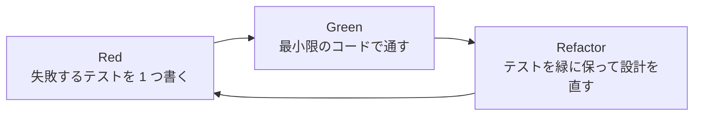
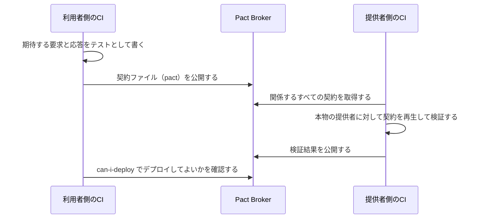

# 8.2 テスト戦略

> テストは「バグを見つける作業」だと思われがちですが、実務での最大の価値は「安心して変更できること」にあります。では、何を・どの粒度で・どれだけテストすればよいのでしょうか。この章では、テストの目的から始めて、テストの種類とポートフォリオ、良い単体テストの条件、テストダブルの使い分け、テスト容易性の設計、カバレッジとミューテーションテスト、不安定なテスト、プロパティベーステスト、契約テスト、本番でのテストまでを扱い、チームのテスト戦略を自分で設計できるようになることを目指します。

| 項目 | 内容 |
|---|---|
| 学習時間の目安 | 本文 4h ＋ 演習 7h |
| 前提となる章 | [8.1 良いコードと設計原則](../01-code-quality-and-design/README.md) |
| 演習 | [exercises/](exercises/)（Python） |
| キーワード | テストピラミッド, 単体テストの 4 本柱, テストダブル, モック, フェイク, TDD, テスト容易性, カバレッジ, ミューテーションテスト, 不安定なテスト, プロパティベーステスト, 契約テスト |

## この章のゴール

- [ ] テストの目的（変更への自信・仕様の記録・設計へのフィードバック）とコストを説明し、テストに投資すべき場所を判断できる
- [ ] テストの種類ごとの得意・不得意を説明し、システムの性質に合わせてテストのポートフォリオを設計できる
- [ ] 良い単体テストの条件（4 本柱）に照らしてテストを評価し、実装の詳細に依存したテストを書き直せる
- [ ] テストダブル（dummy・stub・spy・mock・fake）を使い分け、モックの使いすぎによる害を避けられる
- [ ] 時刻・乱数・外部サービスを注入できる、テストしやすい設計にできる
- [ ] カバレッジの限界を説明し、ミューテーションテストとプロパティベーステストの仕組みを実装できる
- [ ] 不安定なテストの原因を分類し、隔離と修正の運用ルールを作れる

## なぜ学ぶのか

テストの価値は、それがない状態を想像すると分かります。自動テストのないコードベースでは、変更のたびに「どこかが壊れていないか」を人手で確かめるしかありません。その不安は、リファクタリングの先送り、変更の小ささへの過剰なこだわり、リリース前の長い手動確認、そして「触らない方が安全」という文化を生みます。[8.1](../01-code-quality-and-design/README.md) で学んだ「変更しやすいコード」は、変更を安全に確かめる手段があって初めて実現できるのです。

一方で、テストの書き方を誤ると、テストそのものが変更の足かせになります。リファクタリングのたびに大量のテストが壊れる、実行に 1 時間かかる、ときどき理由もなく失敗する——こうしたテストは、開発者に「テストは邪魔なもの」と教えてしまいます。Google は 2016 年の公式ブログで、社内のテスト実行の約 1.5% が不安定（flaky）な結果を報告し、テストの約 16% に何らかの不安定さがあると述べています。大規模な組織では、テストの「量」ではなく「質と運用」が開発速度を左右するのです。

さらに 2026年時点では、AI によるコード生成が一般的になり、人間が 1 行ずつ書いていないコードが大量に生まれています。書く速さが上がった分、**それが正しいことを確かめる仕組み** の重要性はむしろ増しています。

## 1. テストは何のためにあるか

### 1.1 3 つの目的

| 目的 | 意味 | 例 |
|---|---|---|
| **変更への自信** | 変更で既存の振る舞いが壊れていないことを、速く確かめられる | リファクタリング後に数秒でテストが緑になれば、安心してマージできる |
| **仕様の記録** | コードが何をすべきかを、実行可能な形で残す | 「期限ちょうどの日は更新する」というテストは、陳腐化しないドキュメントになる |
| **設計へのフィードバック** | テストが書きにくいことは、設計の問題の兆候 | テストのために DB を用意しなければならないのは、ロジックと I/O が混ざっているから |

バグの発見は、この 3 つのうち 1 つ目の副産物です。「バグを見つけるためにテストを書く」と考えると、「もうバグはなさそうだからテストは不要」という判断になりがちですが、テストの本当の価値は **将来の変更** のときに発揮されます。

### 1.2 テストにもコストがある

テストはタダではありません。書くコスト、実行時間、そして最も大きいのは **保守のコスト** です。プロダクションコードを変えるたびにテストも直す必要があり、書き方が悪いと、振る舞いを変えていないのにテストが壊れます。したがって、テスト戦略の問いは「どれだけテストを書くか」ではなく「**限られた労力で、最も大きな安心を得るには、何をどの粒度でテストするか**」です。

## 2. テストの種類とポートフォリオ

### 2.1 テストの種類

| 種類 | 何を確かめるか | 速さ・安定性 | 典型的な道具・手法 |
|---|---|---|---|
| 単体テスト（unit） | 1 つの振る舞いの単位（関数・クラス・小さなモジュール群） | 非常に速く安定 | unittest, pytest, JUnit |
| 統合テスト（integration） | 自分のコードと DB・メッセージキューなどの実物との組み合わせ | 中程度 | テスト用の DB コンテナ、Testcontainers |
| E2E テスト（end-to-end） | 利用者の操作をシステム全体で再現 | 遅く、不安定になりやすい | Playwright, Selenium |
| 契約テスト（contract） | サービス間の API の約束が守られているか | 速い | Pact |
| プロパティベーステスト | 大量のランダムな入力で「常に成り立つ性質」 | 速い（回数による） | Hypothesis, QuickCheck |
| スナップショットテスト | 出力（画面の構造・生成物）が前回の記録と同じか | 速いが、更新が安易になりがち | Jest のスナップショット、承認テスト |
| 性能・負荷テスト | 応答時間・スループット・限界 | 遅い。本番に近い環境が必要 | k6, Locust, Gatling, JMeter |
| カオスエンジニアリング | 障害（サーバーの停止・遅延）が起きても耐えられるか | 本番またはそれに近い環境で計画的に実施 | Chaos Monkey など |

「単体」の定義は流派によって違います（3.3 節）。Google はこの曖昧さを避けるため、テストを **サイズ**（実行に使う資源）で分類しています。small は 1 プロセス内で完結し、ネットワークやディスクや sleep を使わない。medium は 1 台のマシン内（localhost への通信は可）。large は複数のマシンにまたがってよい、という具合です（『Software Engineering at Google』）。サイズで制約をかけると、テストの速さと安定性を機械的に保証できます。

### 2.2 ピラミッド・トロフィー・ハニカム

テストの配分を表すモデルがいくつかあります。

| モデル | 提唱 | 最も厚い層 | 生まれた文脈 |
|---|---|---|---|
| テストピラミッド | Mike Cohn『Succeeding with Agile』（2009） | 単体テスト（下ほど多く、E2E は頂点に少し） | 一般的な業務アプリケーション |
| テストトロフィー | Kent C. Dodds | コンポーネントを組み合わせた統合テスト（土台に静的解析） | フロントエンド（JavaScript） |
| テストハニカム | Spotify のエンジニアリングブログ（2018） | 統合テスト（実装の詳細に結びつく単体テストと E2E は少なく） | マイクロサービス |

- **ピラミッド**: 速く安定した単体テストを土台に厚く、遅く壊れやすい E2E テストは頂点に少なく。『Software Engineering at Google』も、単体 80%・統合 15%・E2E 5% 程度を目安として挙げています。
- **トロフィー**: フロントエンドの文脈で提唱されたもので、「静的解析（型・リンタ）」を土台に置き、コンポーネントを組み合わせた統合テストに最も投資します。
- **ハニカム**: マイクロサービスの文脈で提唱されたもので、1 つのサービスの中のロジックが薄く、他サービスや DB とのやりとりが主な価値であるなら、統合テストを中心にすべきだという考え方です。

どれが正しいかではなく、**システムの性質で決まる** と考えてください。計算やルールが複雑なライブラリ（料金計算・税計算）なら単体テスト中心のピラミッドが合います。ロジックが薄く、DB や外部 API との組み合わせにリスクがあるサービスなら統合テストを厚くします。共通する原則は「**リスクのある場所を、最も安く確実に確かめられる粒度でテストする**」ことと、「**E2E テストは重要な利用者の経路に絞る**」ことです。

## 3. 良い単体テスト

### 3.1 4 本柱

Vladimir Khorikov は『Unit Testing: Principles, Practices, and Patterns』（2020）で、良いテストの条件を 4 つの柱にまとめました。

| 柱 | 意味 | 損なう例 |
|---|---|---|
| **回帰に対する保護** | バグが入ったときに、テストが失敗して知らせてくれる | 何も確かめないテスト、自明な getter だけのテスト |
| **リファクタリングへの耐性** | 振る舞いを変えないリファクタリングでは失敗しない（偽陽性がない） | 内部のメソッド呼び出しの順序や回数を検証するテスト |
| **速いフィードバック** | 速く実行できる | 実 DB・実ネットワーク・sleep を使うテスト |
| **保守のしやすさ** | 読みやすく、動かすための準備が少ない | 数百行のセットアップ、テストの中の複雑なロジック |

Khorikov は、最初の 3 つを同時に最大化することはできないと指摘しています。E2E テストは回帰の保護とリファクタリング耐性に優れますが遅く、自明な単体テストは速いが保護が弱い。その中で **リファクタリングへの耐性は妥協してはいけない** 柱です。偽陽性（振る舞いは正しいのにテストが落ちる）が多いテストは、開発者にテストの失敗を無視する習慣をつけ、テスト全体の信頼を失わせるからです。

### 3.2 実装ではなく振る舞いを検証する

リファクタリングへの耐性を保つ鍵は、**観察できる振る舞い**（戻り値・状態の変化・外部への副作用）を検証し、**実装の詳細**（内部でどのメソッドを何回呼んだか）を検証しないことです。次の例では、同じ振る舞いの 2 つの実装に対して、モックで呼び出しを検証するテストと、偽物（fake）を使って結果を検証するテストを実行しています。

```python
from unittest import mock


class FakePriceRepo:
    """偽物（fake）: 本物と同じ振る舞いを、メモリ上の dict で実現する。"""

    def __init__(self, prices):
        self.prices = prices

    def get_price(self, item_id):
        return self.prices[item_id]

    def get_prices(self, item_ids):
        return [self.prices[i] for i in item_ids]


class CartV1:
    def __init__(self, repo):
        self.repo = repo

    def total(self, item_ids):
        return sum(self.repo.get_price(i) for i in item_ids)


class CartV2(CartV1):
    def total(self, item_ids):
        # リファクタリング: N 回の問い合わせを 1 回にまとめた（振る舞いは同じ）
        return sum(self.repo.get_prices(item_ids))


def test_with_mock(cart_class):
    """相互作用（どのメソッドがどう呼ばれたか）を検証するテスト。"""
    repo = mock.Mock()
    repo.get_price.side_effect = [100, 200]
    cart_class(repo).total(["a", "b"])
    repo.get_price.assert_has_calls([mock.call("a"), mock.call("b")])


def test_with_fake(cart_class):
    """結果（観察できる振る舞い）を検証するテスト。"""
    assert cart_class(FakePriceRepo({"a": 100, "b": 200})).total(["a", "b"]) == 300


for cart_class in (CartV1, CartV2):
    for test in (test_with_mock, test_with_fake):
        try:
            test(cart_class)
            outcome = "OK"
        except Exception as e:
            outcome = f"FAIL（{type(e).__name__}）"
        print(f"{cart_class.__name__} {test.__name__}: {outcome}")
```

```text
CartV1 test_with_mock: OK
CartV1 test_with_fake: OK
CartV2 test_with_mock: FAIL（TypeError）
CartV2 test_with_fake: OK
```

モックのテストは、正しいリファクタリングを「壊れた」と報告しました（偽陽性）。このようなテストが多いと、性能改善のような良い変更ほど嫌われるようになります。

### 3.3 古典派とロンドン派

単体テストには 2 つの流派があります。

| | 古典派（デトロイト派） | ロンドン派（モック派） |
|---|---|---|
| 「単体」とは | 振る舞いの単位。複数のクラスにまたがってよい | 1 つのクラス |
| 依存の扱い | 共有される外部資源（DB・外部 API など）だけを代役に置き換える | 変更可能な依存はすべてモックに置き換える |
| 代表的な書籍 | Kent Beck『テスト駆動開発』 | Steve Freeman, Nat Pryce "Growing Object-Oriented Software, Guided by Tests"（2009） |
| 長所 | リファクタリングに強い | 失敗したときに原因のクラスが特定しやすい。設計を外側から考えやすい |
| 短所 | 1 つのバグで多くのテストが落ちることがある | 実装の詳細に結びつきやすい |

本書は、リファクタリングへの耐性を重視して、**古典派を基本とし、モックはシステムの境界の外への副作用（メール送信・決済・他チームのサービスへの呼び出し）の検証に限る** 立場を勧めます。これは Khorikov の推奨とも一致します。

### 3.4 読みやすいテストの書き方

- **Arrange-Act-Assert（準備・実行・確認）** の 3 部に分け、1 つのテストでは 1 つの振る舞いを確かめる。
- テスト名は「何を確かめるか」を文にする（`test_renews_exactly_at_period_end`）。失敗したときに、名前だけで何が壊れたか分かるように。
- テストの中に `if` やループで期待値を計算するロジックを書かない。期待値は具体的な値で書く。
- 重複の排除より読みやすさを優先する。『Software Engineering at Google』はこれを **DRY ではなく DAMP**（Descriptive And Meaningful Phrases）と表現しています。テストは単独で読んで理解できることが大切です。

## 4. テストダブルとモックの使いすぎ

### 4.1 5 種類のテストダブル

本物の代わりにテストで使うものを総称して **テストダブル（test double）** と呼びます。Gerard Meszaros は『xUnit Test Patterns』（2007）で、これを 5 種類に分類しました。

| 種類 | 役割 | 例 |
|---|---|---|
| ダミー（dummy） | 引数を埋めるためだけに渡し、使われない | 使われないロガーに `None` を渡す |
| スタブ（stub） | 決まった値を返して、テスト対象への **入力** を制御する | 「このユーザーの決済は常に失敗する」ゲートウェイ |
| スパイ（spy） | 呼び出しを記録し、テストの後で **出力**（副作用）を確かめられるようにする | 送信したメールを記録するメーラー |
| モック（mock） | 期待する呼び出しを事前に設定し、呼び出しそのものを検証する | `assert_called_once_with(...)` |
| フェイク（fake） | 本物と同じ振る舞いを、軽量な方法で実装した動く代役 | インメモリの DB、偽の時計 |

Martin Fowler の記事 "Mocks Aren't Stubs" が指摘するように、スタブ（入力の制御）とモック（出力の検証）は目的が違います。**スタブへの呼び出しは検証しない** のが原則です。「在庫を問い合わせたか」ではなく、「在庫がないときに注文が拒否されたか」を確かめます。

### 4.2 モックの使いすぎ

モックの使いすぎ（over-mocking）は、次のような問題を生みます。

- 3.2 節のように、実装の詳細に結びついたテストがリファクタリングを妨げる。
- テストが「自分で設定したモックの振る舞い」を確かめているだけになり、本物との組み合わせのバグを見逃す。
- `unittest.mock.Mock` はどんな属性でも受け付けるので、存在しないメソッドを呼んでもテストが通ってしまう。

```python
from unittest import mock


class SubscriptionRepository:
    def get(self, sub_id: str): ...
    def update(self, sub) -> None: ...


repo = mock.Mock()
print(repo.fetch("s1"))            # 存在しないメソッドでも、呼べてしまう
print(repo.get("s1").status)       # 戻り値もまた Mock。どんな属性も「ある」ことになる

strict = mock.create_autospec(SubscriptionRepository, instance=True)
try:
    strict.fetch("s1")
except AttributeError as e:
    print("AttributeError:", e)
try:
    strict.get("s1", "extra")
except TypeError as e:
    print("TypeError:", e)
```

```text
<Mock name='mock.fetch()' id='140235113964816'>
<Mock name='mock.get().status' id='140235113971088'>
AttributeError: Mock object has no attribute 'fetch'
TypeError: too many positional arguments
```

（`id` の値は実行ごとに変わります。）モックを使うなら、少なくとも `create_autospec` で本物のインターフェースに合わせるべきです。

### 4.3 偽物を信頼できるものにする — 契約テスト

モックの代わりに偽物（fake）を使うと、振る舞いを検証でき、リファクタリングにも強くなります。ただし、偽物が本物と違う振る舞いをすると、テストは嘘をつきます。そこで、**同じテストを本物と偽物の両方に対して実行する**（契約テスト）ことで、偽物の正しさを保証します。

```text
                    ┌──────────────────────────────┐
                    │  RepositoryContract（テスト群）│
                    └──────────────┬───────────────┘
                     同じテストを両方に対して実行する
                 ┌─────────────────┴─────────────────┐
     ┌───────────▼───────────┐           ┌───────────▼───────────┐
     │ SqliteSubscription... │           │ InMemorySubscription...│
     │ （本物・遅い・正しい） │           │ （偽物・速い）         │
     └───────────────────────┘           └───────────┬───────────┘
                                                     │ サービスのテストで使う
                                         ┌───────────▼───────────┐
                                         │ SubscriptionService    │
                                         │ のテスト（数百件でも一瞬）│
                                         └───────────────────────┘
```

演習 3 は、この構造を実際に作ります。偽物で最も多いバグは「受け取ったオブジェクトを参照のまま保存し、参照のまま返す」ことです。本物の DB は値をコピーして保存するので、呼び出し側が後でオブジェクトを書き換えても DB の中身は変わりません。この違いは、契約テストがなければ本番で初めて発覚します。

Freeman と Pryce は「**自分が所有していない型をモックするな**（Don't mock what you don't own）」と勧めています。外部ライブラリや外部サービスを直接モックする代わりに、自分たちのインターフェース（[8.1](../01-code-quality-and-design/README.md) の Adapter）で包み、そのインターフェースに対して偽物を作り、Adapter 自体は本物に対する少数の統合テストで確かめます。

## 5. テスト容易性の設計と TDD

### 5.1 テストしにくさは設計の問題

テストが書きにくいコードには、共通の特徴があります。

| テストしにくい原因 | 対策 |
|---|---|
| 時刻を `datetime.now()` で直接読む | 時刻（または時計）を引数・コンストラクタで受け取る |
| 乱数を `random.random()` で直接使う | `random.Random(seed)` のインスタンスを注入する |
| 依存するクラスを内部で生成する | コンストラクタで受け取る（DI） |
| 判断のロジックと I/O が混ざっている | 関数型コア・命令型シェルに分ける（[8.1](../01-code-quality-and-design/README.md)） |
| グローバルな状態・シングルトン | 明示的に渡す。テストごとに作り直せるようにする |

```python
from datetime import datetime, time


def can_send_sms_now() -> bool:
    # テストしにくい: 実行した時刻によって結果が変わる（夜にだけ落ちるテストになる）
    return time(8) <= datetime.now().time() < time(21)


def can_send_sms(at: datetime) -> bool:
    # テストしやすい: 時刻を引数で受け取る。境界の 20:59 と 21:00 を確実に試せる
    return time(8) <= at.time() < time(21)


print(can_send_sms(datetime(2026, 9, 28, 20, 59)), can_send_sms(datetime(2026, 9, 28, 21, 0)))
```

```text
True False
```

既存のコードを大きく変えずに、テストのために振る舞いを差し替えられる場所を、Michael Feathers は **継ぎ目（seam）** と呼びました。引数、コンストラクタ、モジュールの差し替えなどが継ぎ目になります。レガシーコードに継ぎ目を作る技法は [8.5](../05-refactoring-and-tech-debt/README.md) で扱います。

### 5.2 テスト駆動開発（TDD）

**テスト駆動開発（Test-Driven Development, TDD）** は、Kent Beck が『テスト駆動開発』（2002）で体系化した、次の短いサイクルを繰り返す開発手法です。



TDD の価値は、テストが先にあることで「使う側から見たインターフェース」を先に考えることになり、テストしやすい設計が自然に生まれる点と、常に動く状態から小さく進められる点にあります。

TDD が特に効くのは、振る舞いを事前に具体例で書ける場面です。計算・変換・状態遷移のロジック、そして **バグ修正**（まずバグを再現する失敗テストを書き、それを通す）がその典型です。逆に、何を作るべきか分からない探索的な試作や、見た目の調整が中心の UI では、先にテストを書くことが難しく、後からテストを足す方が現実的です。2014 年には David Heinemeier Hansson が「TDD は死んだ」と問題提起し、Kent Beck・Martin Fowler と公開の対談を行いました。この議論が示したのは、TDD を教条として守ることではなく、**速いフィードバックを得るための手段の一つ** として、場面に応じて使い分けるべきだということです。

## 6. テストの質を測る

### 6.1 カバレッジは信号であって目標ではない

**カバレッジ（coverage）** は、テストで実行されたコードの割合です。行カバレッジ、分岐カバレッジ（if の両方向を通ったか）などがあります。カバレッジが低い場所は「テストされていない」ことが確実に分かるので、**テストの穴を探す信号** としては有用です。

しかし、カバレッジが高いことは、テストが良いことを意味しません。カバレッジは「コードが実行されたか」しか測らず、「結果が確かめられたか」を測らないからです。アサーションのないテストでも、カバレッジは 100% になります。そして、カバレッジを組織の目標にすると、数字を上げるためだけの弱いテストが量産されます。経済学者 Charles Goodhart の指摘を人類学者 Marilyn Strathern が一般化した **グッドハートの法則**——「指標が目標になると、それは良い指標ではなくなる」——の典型例です。

### 6.2 ミューテーションテスト

テストの「確かめる力」を測る方法が **ミューテーションテスト** です。1970 年代後半に DeMillo・Lipton・Sayward らが提唱した考え方で、対象のコードに小さなバグ（変異）を 1 つずつ入れ、テストがそれを検出できるかを調べます。検出できた割合が **変異スコア** です。

演習 2 で作るツールで、うるう年の判定関数を 3 種類のテストで測ってみます。この関数は 1 行なので、どのテストでも行カバレッジは 100% です。

```python
from mutation import format_report, run_mutation_test

SOURCE = '''
def is_leap_year(year):
    return year % 4 == 0 and (year % 100 != 0 or year % 400 == 0)
'''


def test_without_assertions(fn):
    for year in (2024, 2023, 1900, 2000):
        fn(year)                     # すべての行を実行する（カバレッジ 100%）が、何も確かめない


def test_typical(fn):
    assert fn(2024) is True
    assert fn(2023) is False


def test_with_boundaries(fn):
    for year, expected in [(2024, True), (2023, False), (1900, False), (2000, True)]:
        assert fn(year) is expected


for test in (test_without_assertions, test_typical, test_with_boundaries):
    print(test.__name__, "→", format_report(run_mutation_test(SOURCE, "is_leap_year", test)).splitlines()[0])
```

```text
test_without_assertions → 変異スコア: 0.0%（0/20）
test_typical → 変異スコア: 45.0%（9/20）
test_with_boundaries → 変異スコア: 100.0%（20/20）
```

`test_typical` では、`year % 100` を `year % 101` に変えた変異体が生き残ります。1900 年や 2100 年のような「100 で割り切れるが 400 では割り切れない年」を試していないことが、具体的な変異体として示されるのです。

ミューテーションテストの弱点は、実行コスト（変異体の数 × テストの実行時間）と、**等価な変異体**（変異させても振る舞いが変わらず、どんなテストでも殺せないもの）の存在です。例えば `x >= 0` を `x > 0` に変えても、`x == 0` のとき `x` と `-x` はどちらも 0 なので、絶対値関数の結果は変わりません。実用のツール（Java の PIT、JavaScript などの Stryker、Python の mutmut など）は、変更された部分だけを対象にするなどの工夫でコストを抑えています。Google は、変異体をコードレビューの中で開発者に提示する仕組みを運用していると報告しています（Petrović と Ivanković, 2018）。

### 6.3 不安定なテスト（flaky test）

同じコードに対して、成功したり失敗したりするテストを **不安定なテスト（flaky test）** と呼びます。Luo らの研究（2014）は、オープンソースプロジェクトの不安定なテストの修正を分析し、原因の約 45% が非同期処理の待ち合わせ、約 20% が並行性、約 12% がテストの実行順序への依存だったと報告しています。

| 原因 | 典型例 | 対策 |
|---|---|---|
| 非同期の待ち合わせ | `sleep(1)` で処理の完了を待つ | 完了のイベントや条件を待つ（タイムアウト付きのポーリング） |
| 並行性 | スレッド間の競合、共有状態 | 共有状態をなくす。並行性のテストは決定的なスケジューリングで |
| 実行順序への依存 | 前のテストが作ったデータに依存する | テストごとに状態を作り、後片付けする |
| 時刻・タイムゾーン | 月末・深夜・夏時間でだけ落ちる | 時計を注入する（5.1 節） |
| 乱数 | シードが毎回違う | シードを固定し、失敗時にシードを表示する |
| 外部サービス・ネットワーク | 本物の API を呼ぶ | 偽物・契約テストに置き換える |
| 資源のリーク | ポートやファイルの使い回し | ポート 0（OS に空きを選ばせる）、一時ディレクトリ |

不安定なテストの最大の害は、**失敗を無視する文化** を作ることです。「どうせ flaky だろう」と再実行を繰り返すうちに、本物のバグ（特に並行性のバグ）による失敗まで見逃すようになります。運用ルールの例を挙げます。

1. 不安定と判定されたテストは、**隔離（quarantine）** して、マージを妨げないようにする。ただし実行は続けて記録を取る。
2. 隔離したテストには **担当者と期限** を付ける。期限までに直せないなら、削除するか、別の方法で同じリスクを確かめる。
3. 自動の再実行は、不安定さの **検出** には使ってよいが、失敗を **隠す** ために使わない。
4. 隔離中のテストの数と、不安定さの割合をチームの指標として見える化する。

## 7. プロパティベーステストと契約テスト

### 7.1 プロパティベーステスト

例に基づくテスト（「入力 3 なら出力 9」）は、書いた人が思いついた例しか試せません。**プロパティベーステスト（property-based testing）** は、「どんな入力でも成り立つべき性質」を書き、ツールが大量のランダムな入力でそれを試します。Koen Claessen と John Hughes が 2000 年に発表した Haskell の QuickCheck が起源で、Python では David R. MacIver らの Hypothesis が広く使われています。

性質の見つけ方には、定番のパターンがあります。

| パターン | 例 |
|---|---|
| 往復（round trip） | `decode(encode(x)) == x`、`parse(format(x)) == x` |
| 不変条件（invariant） | ソートしても要素の数と種類は変わらない。割引後の価格は 0 以上 |
| 参照実装（oracle） | 高速化した実装と、遅いが明らかに正しい実装の結果が一致する |
| 冪等性 | `normalize(normalize(x)) == normalize(x)` |
| 変換関係（metamorphic） | 検索条件を狭めると、結果は元の結果の部分集合になる |
| 解くのは難しいが検証は簡単 | 経路探索の結果が、本当につながった経路になっている |

プロパティベーステストの真価は **縮小（shrinking）** にあります。ランダムに見つかった反例は、たいてい長く雑多で、原因が分かりにくいものです。ツールは反例を「失敗し続ける、より単純な値」へと自動的に縮めます。次は、回数を 1 桁と決めつけたランレングス符号化のバグを Hypothesis で探した例です（Hypothesis 6.168 で実行。出力は抜粋して整形しています）。

```python
from hypothesis import given, strategies as st


def rle_encode(s: str) -> str:
    out, i = [], 0
    while i < len(s):
        j = i
        while j < len(s) and s[j] == s[i]:
            j += 1
        out.append(f"{j - i}{s[i]}")
        i = j
    return "".join(out)


def rle_decode(encoded: str) -> str:
    # バグ: 回数は 1 桁だと決めつけている
    return "".join(encoded[k + 1] * int(encoded[k]) for k in range(0, len(encoded), 2))


@given(st.text(alphabet="ab"))
def test_round_trip(s):
    assert rle_decode(rle_encode(s)) == s


test_round_trip()
```

```text
ExceptionGroup: Hypothesis found 2 distinct failures. (2 sub-exceptions)
  ValueError: invalid literal for int() with base 10: 'a'
  Failing test case: test_round_trip(s='aaaaaaaaaab')
  IndexError: string index out of range
  Failing test case: test_round_trip(s='aaaaaaaaaa')
```

「同じ文字が 10 個続くと壊れる」ことが、最小の反例から一目で分かります。演習 1 では、これと同じ仕組み（生成器・性質の検査・縮小）を自分で実装します。完成すると次のように動きます。

```python
from minicheck import for_all, integers, lists
result = for_all(lambda xs: sorted(xs) == xs, lists(integers(0, 100)), seed=1)
print(result.ok, result.original, '→', result.counterexample, f'({result.shrinks} 回縮小)')
```

```text
False ([97, 0],) → ([1, 0],) (7 回縮小)
```

演習の実装は「値から候補を作る」単純な縮小ですが、Hypothesis は値ではなく、値を作るときの **乱数の選択の列** を縮めることで、どんな生成器にも縮小が自動的に効くように設計されています（MacIver と Donaldson, 2020）。

### 7.2 消費者駆動の契約テスト

サービスが分かれると、「API の提供者が、利用者の知らないうちに応答の形を変えて壊す」という問題が起きます。E2E テストでこれを防ごうとすると、全サービスを立ち上げる遅く不安定なテストが必要になります。

**消費者駆動の契約テスト（consumer-driven contract testing）** は、Ian Robinson が 2006 年に記事で整理した考え方で、利用者（consumer）が「自分はこの要求を送り、応答のこの部分を使う」という期待を **契約** として書き、提供者（provider）がその契約を自分の CI で検証します。Pact がその代表的な道具です。



契約には「利用者が実際に使う部分」だけが含まれるので、提供者は、どの利用者も使っていないフィールドを安心して変更・削除できます。逆に、ある利用者が使っているフィールドを壊す変更は、提供者側の CI で即座に検出されます。API のバージョニングや後方互換性の設計は [9.4 API設計](../../09-architecture/04-api-design/README.md) で扱います。

### 7.3 そのほかのテスト

- **スナップショットテスト**: 出力全体を記録し、次回と比較します。書くのは簡単ですが、差分が出たときに中身を確かめずに「更新」する習慣がつくと、何も守らないテストになります。スナップショットは小さく保ち、差分をレビューの対象にしましょう。レガシーコードの振る舞いを固定する「承認テスト」は [8.5](../05-refactoring-and-tech-debt/README.md) の演習で扱います。
- **性能・負荷テスト**: 平均ではなくパーセンタイル（p95・p99）で評価し、本番に近いデータ量と構成で行います。何を測るかは [9.5](../../09-architecture/05-scalability-and-performance/README.md) で扱います。
- **カオスエンジニアリング**: Netflix が 2010 年代初めに公表した Chaos Monkey（本番のサーバーを無作為に停止させる仕組み）に始まる、障害を意図的に注入して耐性を確かめる手法です。[10.3](../../10-cloud-and-sre/03-reliability-engineering/README.md) で扱います。

## 8. 本番でのテスト・テストデータ・CI の時間予算

### 8.1 本番でのテスト

どれだけテストしても、本番の規模・データ・利用パターンを完全に再現することはできません。そこで、リリース前のテストに加えて、**本番で安全に確かめる** 仕組みを組み合わせます。

| 手法 | 内容 | 詳しくは |
|---|---|---|
| カナリアリリース | 新しい版を一部のトラフィックだけに出し、指標を比較してから広げる | [8.4](../04-ci-cd-and-release/README.md) |
| フィーチャーフラグ | デプロイとリリースを切り離し、一部の利用者だけに機能を有効にする | [8.4](../04-ci-cd-and-release/README.md) |
| 合成監視（synthetic monitoring） | 本番に対して定期的に重要な操作を自動実行し、壊れていないか確かめる | [10.4](../../10-cloud-and-sre/04-observability/README.md) |
| ダークローンチ・シャドーイング | 本番のリクエストを新しい実装にも流し、結果を比較する（利用者には旧実装の結果を返す） | [8.5](../05-refactoring-and-tech-debt/README.md) |

これらは「テストを省略してよい」という意味ではありません。リリース前のテストで既知のリスクを潰し、残る未知のリスクを本番の段階的な公開と観測で抑える、という **多層の防御** です。

### 8.2 テストデータの管理

- **テストごとに必要なデータを作る**。共有のテスト用 DB に頼ると、順序依存と不安定さの原因になります。ファクトリ関数やビルダー（`make_user(plan="yearly")` のように、既定値を持ち、関心のある値だけを指定できるもの）を用意すると、テストの意図が読みやすくなります。
- **本番の個人データをテスト環境にコピーしない**。漏洩のリスクがあるうえ、目的外利用として個人情報保護法などの問題になりえます。合成データや、不可逆にマスキングしたデータを使いましょう（法的な判断の詳細は [14.5](../../14-cto/05-governance-risk-compliance/README.md)。具体的な判断は専門家に確認してください）。
- **固定データ（フィクスチャ）は小さく、意図が分かる名前で**。数千行のダンプは誰も理解できず、誰も更新しません。

### 8.3 AI が書いたコードを検証する

AI コーディング支援で生成されたコードも、検証の原則は変わりません。ただし、次の点に特に注意が必要です。

- **実装とテストを同じ AI に同時に書かせると、両方が同じ誤解を共有する** ことがある。テストが実装の写し（同じ計算で期待値を出す）になっていないかを確かめる。期待値は仕様から、具体的な値で書く。
- 生成されたテストの強さは、ミューテーションテストで測れる。生き残った変異体は、テストが確かめていない振る舞いを具体的に示す。
- プロパティベーステストは、人間が思いつかない境界のケースを見つけるので、生成されたコードの検証に向いている。
- 最終的な責任は、コードをマージした人間とチームにある。レビューでは、生成されたかどうかにかかわらず同じ基準を適用する（[8.3](../03-version-control-and-review/README.md)）。

### 8.4 CI の時間予算

テストの実行時間は、開発のフィードバックループの長さそのものです。エクストリーム・プログラミング（XP）は「10 分以内のビルド」を実践の一つに挙げています。プルリクエストごとの CI が 10 分を大きく超えると、開発者は結果を待たずに別の作業に移り、コンテキストの切り替えと、失敗に気づくまでの遅れが生じます。

時間予算を守るための手段:

- テストを速さで分類し（Google のテストサイズのように）、PR ごとには速いテストを、遅いテストはマージ後や定期実行に回す。
- 並列実行とシャーディング（テストを複数のマシンに分割）、ビルドとテスト結果のキャッシュ。
- 変更の影響を受けるテストだけを実行する（テストの選択）。依存関係を把握できるビルドツールが必要（[8.3](../03-version-control-and-review/README.md) のモノレポの道具）。
- 遅いテストの上位を定期的に見直す。多くの場合、少数のテストが実行時間の大半を占めている。

## よくある落とし穴

1. **カバレッジを目標にする**。「カバレッジ 80% 以上」を必須にすると、アサーションのないテストや自明なテストが増え、数字だけが上がります。カバレッジは穴を探す信号として使い、テストの強さはミューテーションテストやレビューで確かめましょう。
2. **実装の詳細を検証する**。内部メソッドの呼び出し順や回数を検証するテストは、正しいリファクタリングで壊れます。観察できる振る舞い（戻り値・状態・外部への副作用）を検証します。
3. **何でもモックにする**。自分のコードの内部までモックにすると、テストが「モックの設定」を確かめるだけになります。モックは境界の外への副作用に限り、それ以外は本物か、契約テストで裏付けた偽物を使います。
4. **E2E テストに頼りすぎる**。E2E テストだけで網羅しようとすると、CI は遅く不安定になり、失敗の原因特定にも時間がかかります。重要な経路に絞り、細かい条件の組み合わせは下の層でテストします。
5. **不安定なテストを再実行で済ませる**。再実行は失敗を隠し、本物の並行性のバグまで見逃させます。隔離・担当者・期限のルールで、確実に直すか消します。
6. **時刻・乱数・順序に依存したテストを書く**。月末や深夜、特定の実行順でだけ落ちるテストは、原因の特定に膨大な時間がかかります。時計と乱数は注入し、テストは独立させます。
7. **テストの中にロジックを書く**。期待値をプロダクションコードと同じ計算で求めるテストは、同じバグを共有します。期待値は具体的な値で書きます。
8. **テストコードを二級市民として扱う**。読みにくく重複だらけのテストは保守されず、放置されます。テストもレビューの対象であり、名前と構造に気を配る必要があります。

## CTOの視点

1. **テスト戦略をシステムのリスクから決める**。「単体テストのカバレッジ 80%」のような一律のルールではなく、「決済と権限判定は境界値とプロパティベーステストで厚く」「UI は重要な 5 つの利用者の経路だけを E2E で」のように、壊れたときの損害が大きい場所に投資を集中させます。設計レビューでは「この変更は、どの層のテストで、どうやって確かめるのか」を必ず問いましょう。
2. **CI の速さと安定性を、組織の生産性指標として管理する**。PR の CI 時間の中央値と p90、不安定なテストの割合、隔離中のテストの数を定期的に見ます。CI が 30 分かかる組織と 5 分の組織では、1 日に回せるフィードバックの回数が桁で違います。CI の高速化への投資（並列化・キャッシュ・テストの整理）は、全エンジニアの時間に効く、最も費用対効果の高い投資の一つです（[13.7](../../13-technical-leadership/07-delivery-and-productivity/README.md)）。
3. **「テストを書く時間がない」を構造的に解消する**。テストを見積もりに含めることを標準にし、テストのない変更はレビューで差し戻せる規範を作ります。同時に、テストを書きやすくする基盤（テスト用のファクトリ、偽物のライブラリ、テスト用 DB の自動構築）に投資しないと、規範だけでは定着しません。
4. **AI 時代の品質保証の方針を決める**。生成されたコードの量が増えるほど、レビューだけで品質を保つのは難しくなります。「生成されたテストは、期待値が仕様から導かれているかを人間が確認する」「重要なモジュールではミューテーションテストで強さを測る」といった方針を、ツールの導入と合わせて明文化しましょう。
5. **採用ではテストの設計力を見る**。「テストを書きますか」ではなく、「この外部 API に依存するコードを、どうテストしますか」「このテストが時々落ちる。どう調べますか」と問うと、テストダブルの使い分け、不安定さの原因の知識、設計への反映の力が分かります。

## 演習

演習コードは [exercises/](exercises/) にあります。解答例は [solutions/](solutions/) にありますが、まずは自力で取り組みましょう。

```bash
python3 tools/check.py 8.2        # リポジトリのルートで実行
python3 tools/check.py -v 8.2     # 詳しい出力
```

| # | 難易度 | 内容 | 対象 |
|---|---|---|---|
| 1 | ★★★ | ミニ・プロパティベーステスト: 生成器（整数・リスト・文字列・タプル・選択）、性質の検査、反例の縮小 | `minicheck.py` |
| 2 | ★★★ | ミニ・ミューテーションテスト: `ast` で変異体を作り、テストの変異スコアと生き残った変異体を報告 | `mutation.py` |
| 3 | ★★☆ | テストダブル: 本物（SQLite）と同じ契約を満たすインメモリのリポジトリ、偽の時計、スタブ兼スパイの決済ゲートウェイを作り、サブスクリプションの更新・失効をテストする | `fakes.py`（`subscriptions.py` は提供済み） |
| 4 | ★★☆ | 記述: テスト戦略の立て直し（下記） | — |

- 演習 3 は、最初から一部のテスト（本物の SQLite リポジトリに対する契約テスト）が通ります。同じテストがあなたの偽物に対しても通れば、偽物は本物と同じ契約を守っています。
- 演習 1 を終えたら、自分の過去のコードの関数に「往復」「不変条件」の性質を 1 つずつ書いて、`for_all` で試してみましょう。演習 2 を終えたら、演習 3 の `subscriptions.py` の `_process_one` に対して、あなたのテストの変異スコアを測ってみるのもよい練習です。

### 演習 4（記述）: テスト戦略の立て直し

あなたは EC サイトの注文サービスのテックリードに着任しました。現状は次の通りです。

- 注文 API は、在庫サービス（社内の別チーム）、決済代行会社の API、メール送信サービスに依存している。
- テストは、全サービスを立ち上げてブラウザを操作する E2E テストが 400 本。CI は 1 回 45 分かかり、約 8% の実行が不安定な失敗で再実行されている。
- 単体テストはほとんどなく、割引や在庫引当のロジックは、注文 API のハンドラの中に書かれている。
- 先月、在庫サービスが応答のフィールド名を変更し、本番で注文が失敗する障害が起きた。

半年で CI を 10 分以内にし、同種の障害を防ぐためのテスト戦略を、(1) 目標とするテストの構成、(2) 設計の変更、(3) 不安定なテストの扱い、(4) 移行の進め方、の 4 点で書いてください。

<details>
<summary>解答例</summary>

**(1) 目標とするテストの構成**

- 割引・在庫引当・注文状態の遷移は、ハンドラから純粋なドメインロジックとして切り出し、単体テストとプロパティベーステスト（「割引後の金額は 0 以上」「引当数の合計は在庫数を超えない」）で厚くテストする。数千件でも数秒で終わる。
- DB とのやりとりは、テスト用の DB コンテナを使った統合テストで確かめる（リポジトリ単位）。
- 在庫サービスとの連携は **消費者駆動の契約テスト** にする。注文サービスが使うフィールドを契約として公開し、在庫サービスの CI で検証してもらう。先月の障害は、在庫サービス側の CI で検出できたはず。
- 決済代行会社とメールは、自分たちのインターフェース（Adapter）の背後に隠し、サービスのテストでは偽物を使う。Adapter 自体は、決済会社のサンドボックス環境に対する少数の統合テストで確かめる（夜間実行）。
- E2E は「商品を探す → カートに入れる → 注文 → 確認メール」など重要な経路 10〜20 本に絞る。

**(2) 設計の変更**: ハンドラから、時刻・乱数・外部 API を直接呼んでいる箇所を注入に変える（関数型コア・命令型シェル）。これがないと単体テストが書けない。

**(3) 不安定なテスト**: 過去の実行履歴から不安定なテストを特定して隔離し、担当者と期限を付ける。隔離中も実行して記録を取る。再実行での合格はマージ条件に使わない。不安定さの原因（sleep による待ち合わせ、テスト間のデータ共有など）を分類し、上位の原因から直す。

**(4) 移行の進め方**: 一度に書き直さない。変更が多い（ホットスポット）ロジックから順に切り出して下の層のテストを書き、同じリスクを確かめている E2E テストを削除していく。CI の時間と不安定さの割合を毎週記録し、目標との差をチームで見る。契約テストは在庫チームとの合意が必要なので、最初の月に着手する。

採点の観点: 「E2E を減らすには、同じリスクを下の層で確かめる代わりのテストが先に必要」という順序、在庫サービスの障害に対する契約テスト、ロジックの切り出しという設計の変更、不安定なテストの隔離ルール、の 4 点が入っていれば合格です。「E2E を全部消す」「カバレッジ目標を設定する」だけの回答は、リスクと手段の対応が説明できていないので不十分です。

</details>

## 理解度チェック

**Q1. テストの目的を 3 つ挙げ、「バグを見つけるため」だけを目的と考えると何が問題になるか説明してください。**

<details>
<summary>解答</summary>

変更への自信（回帰の検出）、仕様の記録（実行できるドキュメント）、設計へのフィードバック（テストの書きにくさが設計の問題を示す）の 3 つです。バグの発見だけを目的にすると、「今は正しく動いているからテストは不要」という判断になり、将来の変更のときに振る舞いを守る手段が残りません。テストの価値の大部分は、コードを書いた後の何十回もの変更のときに発揮されます。

</details>

**Q2. Khorikov の 4 本柱のうち、「妥協してはいけない」とされるのはどれですか。その理由も説明してください。**

<details>
<summary>解答</summary>

リファクタリングへの耐性です。振る舞いを変えていないのに失敗するテスト（偽陽性）が多いと、開発者はテストの失敗を「またか」と無視するようになり、本物の回帰を知らせる失敗まで信用されなくなります。また、良いリファクタリングほどテストの修正コストがかかるようになり、リファクタリングそのものが避けられます。回帰の保護と速さの間はトレードオフで調整できますが、偽陽性はテストスイート全体の信頼を損なうので、常に最大化すべきだとされます。

</details>

**Q3. スタブとモックの違いは何ですか。「スタブへの呼び出しを検証しない」のはなぜですか。**

<details>
<summary>解答</summary>

スタブはテスト対象への **入力** を制御するための代役（決まった値を返す）で、モックはテスト対象からの **出力**（外部への副作用）を検証するための代役です。スタブへの呼び出し（例: 在庫を問い合わせたか）は、結果を得るための実装の詳細にすぎないので、それを検証すると、同じ結果を別の方法で得るリファクタリングでテストが壊れます。検証すべきは、その入力に対してテスト対象がどう振る舞ったか（在庫がないときに注文を拒否したか）です。

</details>

**Q4. インメモリの偽物のリポジトリを使ったテストが通ったのに、本番で不具合が起きました。偽物にどんな問題が考えられますか。また、それを防ぐ方法は何ですか。**

<details>
<summary>解答</summary>

偽物が本物と違う振る舞いをしている可能性があります。典型例は、(1) オブジェクトを参照のまま保存・返却しているため、呼び出し側の変更が保存内容に漏れる（本物は値をコピーする）、(2) 並び順・重複 id の扱い・存在しない id の更新時の例外など、本物の制約を再現していない、(3) タイムゾーンや精度（マイクロ秒）の扱いが違う、などです。防ぐ方法は、**同じ契約テストを本物と偽物の両方に対して実行する** ことです。本物に対するテストは遅いので CI の一部で、偽物に対するテストは常に実行します。

</details>

**Q5. 「カバレッジ 100% なのにバグを見逃した」という状況はなぜ起きるのですか。テストの強さを確かめる方法を答えてください。**

<details>
<summary>解答</summary>

カバレッジは「コードが実行されたか」を測るだけで、「結果が正しいかを確かめたか」を測らないからです。アサーションがない、あるいは弱い（例: 戻り値が None でないことしか確かめない）テストでも、カバレッジは 100% になります。また、実行された行でも、特定の入力（境界値）でしか現れないバグは見逃されます。テストの強さは **ミューテーションテスト** で測れます。コードに小さなバグを入れてテストが失敗するかを調べ、生き残った変異体から、確かめていない振る舞いを具体的に知ることができます。

</details>

**Q6. プロパティベーステストの「縮小（shrinking）」とは何ですか。なぜ重要なのですか。**

<details>
<summary>解答</summary>

ランダムに見つかった反例を、性質を破り続ける範囲で、より単純な値（短いリスト、0 に近い数、アルファベットの先頭の文字）へと自動的に縮めていく処理です。ランダムな反例は長く雑多で、どの部分が失敗の原因か分かりにくいのに対し、縮小された最小の反例（例: 同じ文字 10 個の文字列、リスト `[1, 0]`）は原因を直接示します。縮小がなければ、プロパティベーステストが見つけた失敗をデバッグするコストが高すぎて、実用になりません。

</details>

**Q7. テストが時々失敗します。考えられる原因を 4 つ挙げ、調べ方を説明してください。**

<details>
<summary>解答</summary>

原因: (1) 非同期処理の完了を `sleep` で待っている、(2) スレッドの競合など並行性の問題、(3) 他のテストが作ったデータや実行順序に依存している、(4) 現在時刻・タイムゾーン・乱数に依存している。ほかに外部サービスへの通信、ポートやファイルの使い回しもあります。

調べ方: 失敗した実行のログと、そのときの乱数のシード・実行順序・時刻を確認する。テストを単独で・逆順で・並列で繰り返し実行して、失敗の条件を絞り込む。失敗の発生時刻（月末・深夜）に偏りがないかを見る。原因が分かるまでは隔離し、担当者と期限を付ける。

</details>

**Q8. 消費者駆動の契約テストは、E2E テストと比べて、サービス間の互換性の問題をどう防ぎますか。**

<details>
<summary>解答</summary>

利用者が「自分が送る要求と、応答のうち実際に使う部分」を契約として書き、提供者がその契約を自分の CI で本物の実装に対して検証します。提供者が利用者の使うフィールドを壊す変更をすると、提供者側の CI が即座に失敗するので、デプロイ前に問題が分かります。E2E テストのように全サービスを同時に立ち上げる必要がなく、速く安定しています。また、契約に含まれない（誰も使っていない）部分は、提供者が安心して変更できることも分かります。

</details>

## さらに学ぶために

- Vladimir Khorikov "Unit Testing: Principles, Practices, and Patterns"（Manning, 2020）— 4 本柱、古典派とロンドン派、モックを使うべき場所を、一貫した理屈で説明する。単体テストの設計について最も体系的な一冊。
- Kent Beck "Test-Driven Development: By Example"（2002。邦訳『テスト駆動開発』オーム社）— TDD の原典。前半の通貨の例を手を動かしながら追うと、小さなステップで進む感覚がつかめる。
- Gerard Meszaros "xUnit Test Patterns: Refactoring Test Code"（2007）— テストダブルの分類と、テストコードの「におい」の辞典。
- Titus Winters, Tom Manshreck, Hyrum Wright 編 "Software Engineering at Google"（O'Reilly, 2020）— テストサイズ、大規模組織でのテストの文化、不安定なテストへの対処。無料で公開されている版がある。
- Steve Freeman, Nat Pryce "Growing Object-Oriented Software, Guided by Tests"（2009）— ロンドン派の原典。「所有していない型をモックするな」の出典で、外側から設計を進める TDD を学べる。
- Hypothesis の公式ドキュメント（https://hypothesis.readthedocs.io/）— プロパティベーステストを Python の実務で使うための最良の入り口。性質の見つけ方の記事も充実している。
- Koen Claessen, John Hughes "QuickCheck: A Lightweight Tool for Random Testing of Haskell Programs"（ICFP 2000）— プロパティベーステストの原点となる論文。短く読みやすい。

## まとめ

- テストの目的は、変更への自信・仕様の記録・設計へのフィードバック。価値の大部分は将来の変更のときに発揮され、テストにも保守のコストがある。
- テストの配分（ピラミッド・トロフィー・ハニカム）はシステムの性質で決まる。リスクのある場所を、最も安く確実に確かめられる粒度でテストし、E2E は重要な経路に絞る。
- 良い単体テストは、回帰の保護・リファクタリングへの耐性・速さ・保守しやすさを備える。**実装の詳細ではなく、観察できる振る舞いを検証する**。
- テストダブルは 5 種類。モックは境界の外への副作用の検証に限り、偽物は契約テストで本物との一致を保証する。
- 時刻・乱数・外部サービスを注入できる設計が、テスト容易性の鍵。TDD は、速いフィードバックと使う側からの設計を得る手段として使い分ける。
- カバレッジは穴を探す信号であって目標ではない。テストの強さはミューテーションテストで、見落とした入力はプロパティベーステストで補う。
- 不安定なテストは失敗を無視する文化を生む。隔離・担当者・期限のルールで直すか消し、CI は 10 分程度の時間予算で管理する。
