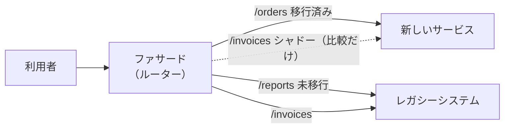

# 8.5 リファクタリングと技術的負債

> 「技術的負債を返済する時間をください」と言っても、経営陣はなかなか首を縦に振りません。そして実際、すべての「汚いコード」を直す価値があるわけでもありません。どの負債が本当に利子を生んでいて、どう返し、どう説明すればよいのでしょうか。この章では、技術的負債の本来の意味から始めて、負債を測る方法（ホットスポット分析）、返済の戦略、リファクタリングの技法、テストのないレガシーコードとの付き合い方、そしてリライトか改修かという大きな判断までを扱います。

| 項目 | 内容 |
|---|---|
| 学習時間の目安 | 本文 4h ＋ 演習 6h |
| 前提となる章 | [8.1 良いコードと設計原則](../01-code-quality-and-design/README.md)、[8.2 テスト戦略](../02-testing/README.md)、[8.3 バージョン管理とコードレビュー](../03-version-control-and-review/README.md) |
| 演習 | [exercises/](exercises/)（Python） |
| キーワード | 技術的負債, 利子と元本, 技術的負債の 4 象限, ホットスポット, 変更の結合, ボーイスカウトの規則, リファクタリング, レガシーコード, 継ぎ目, 特性テスト, 承認テスト, ストラングラー・フィグ, 抽象によるブランチ, リライト |

## この章のゴール

- [ ] 技術的負債の本来の意味（利子と元本）と 4 象限を説明し、「負債」と「単に質の低いコード」を区別できる
- [ ] Git の履歴と複雑さからホットスポットと変更の結合を計算し、改善の優先順位をデータで示せる
- [ ] 負債の返済を日常の開発に組み込む戦略を選び、その長所と短所を説明できる
- [ ] 代表的なリファクタリングの技法を、振る舞いを変えずに小さな手順で適用できる
- [ ] テストのないコードに継ぎ目を見つけ、特性テスト（承認テスト）で振る舞いを固定してから変更できる
- [ ] ストラングラー・フィグなどの段階的な移行を設計し、リライトと改修のどちらを選ぶかを判断できる
- [ ] 技術的負債を、事業の言葉（時間・リスク・お金）で経営陣に説明できる

## なぜ学ぶのか

技術的負債は、エンジニアの感覚の問題ではなく、事業のコストとして測られています。

- Stripe が 2018 年に公表した開発者調査（The Developer Coefficient）では、開発者は週に平均で 17 時間以上を、デバッグやリファクタリングといった保守の作業に費やしていると回答しています。
- McKinsey は 2020 年の記事で、調査した企業の CIO が、技術的負債の大きさを技術資産全体の価値の 20〜40% 程度と見積もり、新製品向けの技術予算の 10〜20% が負債への対処に回っていると述べていると報告しています。
- 日本では、経済産業省が 2018 年の「DX レポート」で、複雑化・ブラックボックス化した既存システム（レガシーシステム）が残り続けた場合、2025 年以降に最大で年間 12 兆円の経済損失が生じうるとし、これを「2025 年の崖」と呼びました。同レポートは、企業の IT 関連費用の大半（約 8 割）が現行システムの維持・運営に充てられているという調査結果も紹介しています。

一方で、負債への対処を誤ると、それ自体が大きな損失になります。動いているシステムを一から書き直す「ビッグバン・リライト」は、完成までの間に古いシステムの改修も続けなければならず、しばしば予定を大幅に超えます。Joel Spolsky は 2000 年のエッセイ "Things You Should Never Do, Part I" で、Netscape がブラウザをゼロから書き直すと決めた結果、前のメジャーバージョン（4.0）から次の版（6.0。5.0 は存在しない）の公開まで 3 年近くかかったことを取り上げ、コードを一から書き直すことを、ソフトウェア企業が犯しうる最悪の戦略的な誤りと呼びました。

**どの負債を、どの順で、どうやって返すか** を判断し、説明できることは、テックリードから CTO までの中心的な仕事の一つです。

## 1. 技術的負債とは何か

### 1.1 もとの比喩

「技術的負債（technical debt）」という言葉は、Ward Cunningham が 1992 年の OOPSLA の経験報告（WyCash という金融システムの開発について）で使ったのが始まりとされています。彼の説明の要点は次の通りです。

> 最初のコードを出荷することは、借金をするようなものだ。少しの借金は、すぐに書き直しによって返済する限り、開発を速める。危険なのは、借金が返されないときだ。正しくないコードに費やす 1 分 1 分が、その借金の利子として積み上がる。

Cunningham は後に（2009 年の動画で）、この比喩は「いい加減なコードを書いてよい」という意味ではなく、**その時点の理解に基づいてコードを書き、理解が深まったらそれをコードに反映させる（リファクタリングする）** ことを意図していた、と説明しています。

### 1.2 元本と利子

比喩を正確に使うと、負債には 2 つの量があります。

| 量 | 意味 | 例 |
|---|---|---|
| **元本（principal）** | 負債を解消するためにかかるコスト | 料金計算のモジュールを整理し直すのに 3 週間 |
| **利子（interest）** | 負債を放置している間、変更のたびに余計にかかるコスト | 料金の仕様変更のたびに、余計に 2 日かかる。バグの調査が長引く |

この区別から、重要な結論が導かれます。**利子を生まない負債は、急いで返す必要がない**。誰も変更しない古いモジュールは、どれほど読みにくくても、日々のコストをほとんど生みません。逆に、毎週のように変更される場所の小さな負債は、大きな利子を生み続けます。8.1 の Ousterhout の式（複雑さ × そこに費やす時間）と同じ構造です。

### 1.3 技術的負債の 4 象限

Martin Fowler は 2009 年の記事で、負債を「無謀か・慎重か」と「意図的か・無自覚か」の 2 軸で 4 つに分けました。

| | 無謀（reckless） | 慎重（prudent） |
|---|---|---|
| **意図的（deliberate）** | 「設計している時間はない」 | 「今は出荷を優先し、その結果には後で対処する」 |
| **無自覚（inadvertent）** | 「レイヤー化って何？」 | 「今なら、どうすべきだったか分かる」 |

- 右上（慎重で意図的）は、期限のある事業上の理由で、結果を理解したうえで借りる負債です。返済の計画とセットなら正当な判断です。
- 右下（慎重で無自覚）は、どれほど優秀なチームでも必ず生じます。作りながら学んだ結果、「今ならこう作る」と分かるのは自然なことです。
- 左側の 2 つは、スキル不足や規律の欠如によるもので、比喩としての「借金」というより、単に質の低い仕事です。育成・レビュー・自動化で防ぐべきものです。

## 2. 負債の種類

技術的負債はコードの中だけにあるわけではありません。

| 種類 | 例 | 利子の現れ方 |
|---|---|---|
| コードの負債 | 重複、巨大な関数、分かりにくい名前（[8.1](../01-code-quality-and-design/README.md)） | 変更のたびの理解と修正のコスト、バグ |
| 設計・アーキテクチャの負債 | 境界の曖昧なモジュール、共有データベースで密結合したサービス | 1 つの変更が多くのチームに波及する。並行して開発できない（[第9部](../../09-architecture/01-architecture-fundamentals/README.md)） |
| テストの負債 | テストがない、遅い、不安定（[8.2](../02-testing/README.md)） | 変更が怖い。手動の確認に時間がかかる |
| 基盤・運用の負債 | 手作業のデプロイ、監視のないシステム、コード化されていないインフラ | リリースが遅い。障害に気づけない（[8.4](../04-ci-cd-and-release/README.md)、[第10部](../../10-cloud-and-sre/01-cloud-and-iac/README.md)） |
| ドキュメントの負債 | 古い設計書、存在しない手順書（[8.6](../06-process-and-documentation/README.md)） | 新しいメンバーの立ち上がりが遅い。障害対応が特定の人頼みになる |
| 知識の負債 | 特定の 1 人しか分からないシステム（バス係数が 1） | その人の不在や退職が、事業のリスクになる |
| 依存関係・セキュリティの負債 | 古いライブラリ、サポートが終了した言語やOSの版 | 脆弱性の修正を取り込めない。いざ更新するときの差分が巨大になる |

最後の種類は、利子が突然、巨額の請求として現れる点で特に危険です。2017 年の Equifax の情報漏洩では、2 か月ほど前に修正版が公開されていた Apache Struts の脆弱性（CVE-2017-5638）が未修正のまま悪用され、米国連邦取引委員会（FTC）の発表によれば約 1 億 4,700 万人の個人情報が流出しました。言語やフレームワークにも寿命があります。例えば Python の各版は、公開からおよそ 5 年でセキュリティ修正も終了し（3.10 は 2026 年 10 月に終了予定。最新の予定は python.org で確認してください）、それ以降に見つかった脆弱性は直されません。**依存関係を小さくこまめに更新し続けることは、それ自体が負債の返済** です（[8.4](../04-ci-cd-and-release/README.md) の自動更新、[11.5](../../11-security/05-security-operations/README.md)）。

## 3. 負債を見える化する

「負債がある」という感覚を、優先順位を決められる **データ** にしなければ、議論は好みの問題になります。

### 3.1 ホットスポット — 変更の多さ × 複雑さ

Adam Tornhill は『Your Code as a Crime Scene』（2015。第 2 版 2024）で、犯罪捜査の地理的プロファイリングになぞらえて、**変更が頻繁で、かつ複雑なコード（ホットスポット）** を見つける方法を紹介しました。材料は、どのチームにもある Git の履歴です。

```bash
$ git log --numstat --date=short --pretty=format:'--%h--%ad--%aN' --no-renames
--3c9db85--2026-09-16--Carol
2	1	shop/orders/models.py
3	1	shop/utils/strings.py

--856b66d--2026-09-02--Alice
6	4	shop/billing/invoice.py
1	0	shop/notifications/email_templates.py
2	1	tests/test_invoice.py
...
```

演習 1 で作る分析器を、架空の EC サイトの 1 年分の履歴（演習のデータ）に適用した結果です。

```python
from pathlib import Path
from hotspots import hotspots, parse_log, temporal_coupling

commits = parse_log(Path("data/hotspots/git_log.txt").read_text(encoding="utf-8"))
for h in hotspots(commits, Path("data/hotspots/repo")):      # 変更回数 × 複雑さ = スコア
    print(f"{h.revisions:3d} × {h.complexity:2d} = {h.score:3d}  {h.path}")
print()
for c in temporal_coupling(commits, max_changeset_size=5)[:4]:
    print(f"{c.degree:.0%}（{c.shared} 回）  {c.a} ⇔ {c.b}")
```

```text
 18 × 29 = 522  shop/billing/invoice.py
  9 ×  7 =  63  shop/orders/service.py
 10 ×  5 =  50  shop/billing/tax.py
  2 × 24 =  48  shop/legacy/report_generator.py
 10 ×  3 =  30  tests/test_invoice.py
 10 ×  2 =  20  shop/orders/models.py
  8 ×  1 =   8  shop/notifications/email_templates.py
  4 ×  2 =   8  shop/utils/strings.py

80%（6 回）  shop/orders/models.py ⇔ shop/orders/service.py
67%（8 回）  shop/billing/invoice.py ⇔ shop/billing/tax.py
67%（8 回）  shop/billing/invoice.py ⇔ tests/test_invoice.py
55%（6 回）  shop/billing/invoice.py ⇔ shop/notifications/email_templates.py
```

読み取れることは次の通りです。

- **請求書のモジュール（invoice.py）が突出したホットスポット**。変更回数も複雑さも最大で、改善の投資を集中させるべき場所です。
- 月次レポート（report_generator.py）は invoice.py に近いほど複雑ですが、この 1 年でほとんど変更されていません。**複雑でも、利子はほとんど生んでいない** ので、今は手を付けなくてよい負債です。
- 多くのコードベースで、変更は少数のファイルに集中する傾向があると報告されています。全体を均等に改善するより、上位のホットスポットに集中する方が、投資の効果が大きくなります。

### 3.2 変更の結合 — 見えない依存

同じコミットで一緒に変更されることが多いファイルの組は、コードの上で依存が見えなくても、**論理的に結合している** 証拠です（[8.1](../01-code-quality-and-design/README.md) の結合度）。上の結果では、請求書のモジュールと **メールの文面**（email_templates.py）が 55% の割合で一緒に変わっています。金額の計算を変えるたびにメールの文面も直している、つまり金額の表示の知識が 2 か所に分散しているのかもしれません。モデルとサービスや、コードとそのテストのように、一緒に変わるのが当然の組もあるので、結果は人間が解釈します。

分析の注意点:

- 一括の整形やライセンス表記の変更のような **巨大なコミットは除く**（演習の `max_changeset_size`）。除かないと、偶然の組み合わせが大量に現れます。
- ファイル名の変更（リネーム）で履歴が途切れる。本格的な分析では、リネームを追跡する道具（Tornhill の CodeScene など）を使う。
- 分析の期間を区切る（例: 直近 6〜12 か月）。何年も前の変更は、今の利子を表しません。

### 3.3 そのほかの信号

| 信号 | 何が分かるか |
|---|---|
| 領域ごとの変更のリードタイム・レビューの時間 | どこの変更が遅いか（[8.4](../04-ci-cd-and-release/README.md) の DORA 指標を領域別に見る） |
| 障害とバグの発生場所 | どこの品質が低いか。ポストモーテムで「負債が原因」とされた件数（[10.5](../../10-cloud-and-sre/05-incident-management/README.md)） |
| 計画外の作業の割合 | 障害対応・緊急の修正に取られている時間の割合。増えているなら利子が膨らんでいる |
| 開発者へのアンケート | 「この領域の変更は、どのくらい怖い・遅いか」。定量データが取りにくい知識の負債やドキュメントの負債も拾える |
| 依存関係の古さ | サポート終了済み・既知の脆弱性がある依存の数（[11.5](../../11-security/05-security-operations/README.md)） |

見つけた負債は、**負債の台帳**（課題管理のラベルや一覧）に、場所・症状・推定の利子（週あたりの余計な時間、障害のリスク）・推定の元本を書いて記録します。利子の大きい順に並べれば、返済の優先順位になります。

## 4. 返済の戦略

### 4.1 日常に組み込む

最も効果的な返済は、**普段の開発の中で少しずつ行うこと** です。

- **ボーイスカウトの規則**: 「キャンプ場は、来たときよりもきれいにして去れ」（Robert C. Martin が『プログラマが知るべき 97 のこと』などで紹介）。変更のたびに、触った場所を少しだけ良くする。
- **準備のリファクタリング**: 機能を足す前に、足しやすい形に直す（[8.1](../01-code-quality-and-design/README.md) の「変更を容易にしてから、容易な変更をする」）。ホットスポットほど頻繁に触るので、自然にホットスポットから返済が進む。
- **理解のためのリファクタリング**: 読んで理解できたことを、名前の変更や関数の抽出としてコードに残す。次の人の理解のコストが下がる。

この方法の利点は、**利子を生んでいる場所（今まさに変更している場所）から返済が進む** ことです。欠点は、大きな設計の問題（モジュールの境界の引き直しなど）は、日々の小さな改善では解決できないことです。

### 4.2 容量を継続的に確保する

大きな負債には、チームの容量の一定割合（例えば 10〜20%）を **継続的に** 割り当てる方法がよく使われます。割合を固定すると、経営との交渉が毎回の個別の判断ではなく、ポートフォリオの配分の議論になります。

### 4.3 「負債返済スプリント」の落とし穴

機能開発を止めて、数週間を負債の返済だけに充てる「負債返済スプリント」は、魅力的に見えますが、次の問題があります。

- 負債の返済が「普段の仕事ではない特別なこと」になり、普段の開発で負債を増やしてもよいという暗黙の了解が生まれる。
- 事業の都合でいつでも延期・中止されやすい。
- 何を直すかの選定が、利子（事業への影響）ではなく、エンジニアの関心で決まりがち。

一度の集中的な投資が必要な場合（フレームワークのメジャーバージョンの移行など）もありますが、それも **事業の成果（リードタイムの短縮、障害の削減）と結びつけた、期限のあるプロジェクト** として計画するのがよいでしょう。

### 4.4 返済しないという選択

すべての負債を返す必要はありません。

- 利子を生んでいない（変更されない）コード。
- 近いうちに廃止・置き換えが決まっているシステム。
- 事業として検証中で、捨てるかもしれないプロトタイプ（ただし、「捨てる」と決めたなら本当に捨てる）。

「返さない」と **明示的に決めて記録する** ことが大切です。決めずに放置すると、いつまでも罪悪感と議論の種として残ります。

## 5. リファクタリングの技法

### 5.1 リファクタリングとは

Martin Fowler は『リファクタリング』で、リファクタリングを「外から観察できる振る舞いを変えずに、ソフトウェアの内部構造を変更して、理解しやすく、変更しやすくすること」と定義しています。重要なのは次の 3 点です。

1. **振る舞いを変えない**。振る舞いを変えるなら、それはリファクタリングではなく機能の変更。
2. **小さな手順で進める**。1 手ごとにテストを実行し、常に動く状態を保つ。失敗したら直前の 1 手だけを戻せばよい。
3. **2 つの帽子をかぶり分ける**（Kent Beck の比喩）。「機能を足す帽子」と「リファクタリングする帽子」を同時にかぶらない。コミットも分ける（[8.3](../03-version-control-and-review/README.md)）。

### 5.2 代表的な技法

Fowler のカタログから、よく使うものを挙げます。

| 技法 | 何をするか | 効くにおい |
|---|---|---|
| 関数の抽出（Extract Function） | 意味のあるまとまりを、名前の付いた関数にする | 長い関数、コメントで区切られた処理 |
| 関数のインライン化（Inline Function） | 中身が名前と同じくらい明らかな関数を、呼び出し元に戻す | 浅い関数、間違った抽象化（[8.1](../01-code-quality-and-design/README.md)） |
| 変数名の変更（Rename Variable） | 名前を、役割が分かるものにする | 分かりにくい名前 |
| 段階の分割（Split Phase） | 「入力の解析」と「計算」のように、性質の違う処理を段階に分ける | 1 つの関数が複数のことをしている |
| パラメータオブジェクトの導入（Introduce Parameter Object） | いつも一緒に渡される値を 1 つの型にまとめる | 長い引数リスト、データの群れ |
| ポリモーフィズムによる条件記述の置き換え（Replace Conditional with Polymorphism） | 種類ごとの `if`/`elif` を、種類ごとのクラスや関数の表にする | 同じ種類の分岐が何か所にもある |
| 条件記述の分解（Decompose Conditional） | 複雑な条件式と分岐の中身を、名前の付いた関数にする | 読み解くのに時間がかかる条件式 |
| マジックリテラルの置き換え（Replace Magic Literal） | 意味のある名前の定数にする | 数字や文字列の直書き |
| 問い合わせと更新の分離（Separate Query from Modifier） | 値を返す処理と、状態を変える処理を分ける | 副作用のある getter |

### 5.3 手順の例

演習 3 の「レガシーコード」（`exercises/legacy_shipping.py` の送料の計算）を、承認テストで振る舞いを固定したうえでリファクタリングした結果です。地域ごとの基本料金を表に、重量の追加料金を名前の付いた関数に取り出し（関数の抽出・マジックリテラルの置き換え）、沖縄県への速達の拒否を先頭に移しました（条件記述の分解。例外を出す前に副作用はないので、振る舞いは変わりません）。

```python
import itertools
from pathlib import Path
from characterize import verify

BASE_FEE = {"沖縄県": 1200, "北海道": 900}
DEFAULT_BASE_FEE = 600


def weight_surcharge(weight_g):
    """2kg を超えたら、基本の 200 円 + 超えた分の 1kg ごと（端数は切り捨て）に 200 円。"""
    if weight_g <= 2000:
        return 0
    return 200 + (weight_g - 2000) // 1000 * 200


def shipping_fee(weight_g, prefecture, express=False, member=False):
    if weight_g <= 0:
        raise ValueError("weight_g must be positive")
    if express and prefecture == "沖縄県":
        raise ValueError("沖縄県への速達は受け付けていません")
    fee = BASE_FEE.get(prefecture, DEFAULT_BASE_FEE) + weight_surcharge(weight_g)
    if express:
        return fee * 3 // 2          # 速達は 1.5 倍（会員割引はない）
    return fee - 100 if member else fee


inputs = list(itertools.product([1, 2000, 2001, 3000, 3001, 5500], ["東京都", "北海道", "沖縄県"],
                                [False, True], [False, True]))
result = verify(shipping_fee, inputs, Path("data/characterize/shipping_fee.approved.json"))
print(result.ok, result.message)
```

```text
True 承認済みの振る舞いと一致しました
```

72 通りの入力（境界値の 2000g・2001g・3000g・3001g を含む）で、旧実装とまったく同じ出力と例外になることが確かめられました。

IDE のリファクタリング機能（名前の変更・関数の抽出など）は、機械的に安全な変換をしてくれるので、手で書き換えるより間違いが少なくなります。AI のコーディング支援に大きなリファクタリングを任せることもできますが、生成された変更が振る舞いを保っているかは、ここで見たようなテストで確かめる必要があります（[8.2](../02-testing/README.md)）。

## 6. レガシーコードとの付き合い方

### 6.1 レガシーコードとは

Michael Feathers は『レガシーコード改善ガイド』（原書 2004 年）で、レガシーコードを「**テストのないコード**」と定義しました。古さや言語は関係ありません。テストがなければ、変更が振る舞いを壊していないかを確かめる手段がないからです。

ここには厄介なジレンマがあります。**安全に変更するにはテストが必要だが、テストを書くためには（依存を切り離すために）コードを変更する必要がある**。Feathers は、この循環を抜けるための手順を示しています。

1. 変更する箇所を特定する。
2. テストを書く場所（振る舞いを観察できる場所）を見つける。
3. 依存関係を、最小限の安全な変更で切り離す。
4. テストを書く（現在の振る舞いを固定する）。
5. 変更し、リファクタリングする。

### 6.2 継ぎ目（seam）

Feathers は、**そこを編集せずに、プログラムの振る舞いを変えられる場所** を **継ぎ目（seam）** と呼びました。テストのために、本物の DB や時計や外部 API を差し替える場所です。

| 継ぎ目の種類 | 例（Python） |
|---|---|
| 引数・コンストラクタ | 時計や DB 接続を引数で受け取れるようにする（[8.1](../01-code-quality-and-design/README.md) の DI） |
| オブジェクトの差し替え | サブクラスでメソッドを上書きする、テストダブルを渡す |
| モジュールの差し替え | テストで `unittest.mock.patch` を使って、モジュールの属性を一時的に置き換える（最後の手段。実装の詳細に依存する） |

最初の一歩として、既存の呼び出し元を壊さずに継ぎ目を作る小さな変更が有効です。例えば、`datetime.now()` を直接読んでいる関数に、既定値付きの引数 `now=None` を足すだけで、既存の呼び出しはそのまま動き、テストからは時刻を渡せるようになります。

### 6.3 新しいコードを古いコードに混ぜない — sprout と wrap

テストのない巨大な関数に機能を足すとき、その関数の中に新しいロジックを書き込むと、新しいロジックもテストできなくなります。Feathers は次の技法を勧めています（以下は擬似コード）。

```text
# Sprout Method（芽生えメソッド）: 新しいロジックは、テストできる新しい関数として書き、呼び出すだけにする
def process_payment(order):             # 既存の 300 行の関数（テストなし）
    ...
    fee = handling_fee(order)            # ← 追加した 1 行だけ
    ...

def handling_fee(order):                 # ← 新しい関数。単独でテストを書ける
    return 0 if order.customer.is_vip else 300

# Wrap Method（包むメソッド）: 既存の関数の前後に処理を足したいときは、元の関数を包む
def send_invoice(invoice):               # 呼び出し元から見た名前はそのまま
    audit_log(invoice)                   # ← 新しい処理（テストできる）
    _send_invoice_original(invoice)      # ← 元の処理（名前を変えただけ）
```

### 6.4 特性テストと承認テスト

仕様書がなく、正しい振る舞いが誰にも分からなくても、**今の振る舞い** なら記録できます。これが **特性テスト（characterization test）** です。期待値を「こうあるべき」から決めるのではなく、「実行したらこうなった」を記録します。変な振る舞いを見つけても、その場では直さずに記録します（直すなら、リファクタリングとは別の変更として、関係者と合意してから。[8.1](../01-code-quality-and-design/README.md) の演習の「癖」を思い出してください）。

多数の入力の組み合わせの出力をファイルに記録して、人が確認・承認し、以後はそのファイルとの一致を検証する方法を、**承認テスト（approval testing）** またはゴールデンマスターと呼びます（Llewellyn Falco らの ApprovalTests というライブラリが知られています）。演習 3 で作るツールで、5.3 節とは別の「読みやすく書き直した」つもりの版を検証すると、次のように失敗します。

```text
--- shipping_fee.approved.json
+++ shipping_fee.received.json
@@ -35,16 +35,16 @@
 {"input": [2001, "沖縄県", false, true], "output": 1300},
 {"error": "ValueError: 沖縄県への速達は受け付けていません", "input": [2001, "沖縄県", true, false]},
 {"error": "ValueError: 沖縄県への速達は受け付けていません", "input": [2001, "沖縄県", true, true]},
-{"input": [3000, "東京都", false, false], "output": 1000},
-{"input": [3000, "東京都", false, true], "output": 900},
...（中略）
+{"input": [3000, "東京都", false, false], "output": 800},
+{"input": [3000, "東京都", false, true], "output": 700},
...
```

書き直した版は、重量の追加料金を `math.ceil((weight_g - 2000) / 1000) * 200`（超えた 1kg ごとに 200 円、端数は切り上げ）と「素直に」書いていました。旧実装は「基本の 200 円 + 超えた 1kg ごと（端数は切り捨て）に 200 円」なので、ちょうど 3000g のときだけ 200 円違います。**差分が、どの入力で振る舞いが変わったかを正確に指し示している** ことに注目してください。1 ケース 1 行の形式にしているのは、この差分を読みやすくするためです。

承認テストを使うときの注意:

- **入力の組み合わせに境界値を含める**。2000g と 2001g、3000g と 3001g のように。境界を含まない入力では、上の違いは検出できません。
- 実行ごとに変わる値（時刻・乱数の ID）は、比較の前に置き換える（スクラブする）。
- 承認済みのファイルもリポジトリにコミットし、変更はレビューの対象にする。**差分を読まずに承認し直すと、テストの意味がなくなる**（[8.2](../02-testing/README.md) のスナップショットテストと同じ注意）。
- 承認テストは、リファクタリングの間の「足場」です。振る舞いを理解できたら、意図の分かる通常の単体テストに置き換えていきます。

## 7. 大規模な移行 — ストラングラー・フィグとリライトの判断

### 7.1 ビッグバン・リライトの危険

古いシステムを捨てて一から作り直す「ビッグバン・リライト」には、構造的な危険があります。

- **古いシステムに埋め込まれた知識を見落とす**。長年のバグ修正や例外的な対応は、仕様書ではなくコードの中にしか残っていません。Spolsky の言葉を借りれば、古いコードの醜い部分の多くは、実際に起きた問題への対処です。
- **完成するまで価値を生まない**。数年のプロジェクトの間、事業は新しい機能を待たされるか、古いシステムと新しいシステムの両方に同じ機能を実装することになります。
- **二度目のシステム症候群**。Fred Brooks は『人月の神話』（1975）で、二度目に作るシステムには、一度目に我慢した機能や一般化が詰め込まれ、過剰に複雑になりやすいと指摘しました。

### 7.2 ストラングラー・フィグ

Martin Fowler は 2004 年の記事で、オーストラリアで見た絞め殺しの木（strangler fig。宿主の木に巻きつきながら育ち、やがて置き換わるイチジクの仲間）になぞらえて、**古いシステムの周りに新しいシステムを少しずつ育て、機能ごとに置き換えていく** 方法を紹介しました。



前段に置いたファサード（ルーター）が、機能（ルート）ごとに、古い実装と新しい実装のどちらに振り分けるかを決めます。演習 2 では、次の段階を持つルーターを作ります。

1. **legacy**: すべて古い実装へ。
2. **shadow（並行稼働・比較）**: 利用者には古い実装の応答を返しつつ、同じリクエストを新しい実装にも流し、結果を比較して不一致を記録する。GitHub が 2016 年に公開した Scientist というライブラリも、この「本番で新旧を並べて比べる」考え方に基づいています。利用者に見せないまま本番のトラフィックで新しい機能を動かし、負荷や不具合を確かめてから公開する **ダークローンチ（dark launch）** も、同じ発想の手法です。
3. **canary**: 利用者の一部を新しい実装へ（[8.4](../04-ci-cd-and-release/README.md) のカナリアと同じ）。
4. **modern**: すべて新しい実装へ。問題があれば legacy に戻せる。
5. **retired**: 古い実装を撤去する。ここから先は戻れない。

```python
from strangler import InvalidTransition, StranglerRouter

def legacy(req):
    return {"order": req["path"].split("/")[-1], "total": 1080}

def modern(req):
    # 新実装: 税込みの端数処理が旧実装と違うバグがある（注文 7 のときだけ）
    return {"order": req["path"].split("/")[-1], "total": 1079 if req["path"].endswith("/7") else 1080}

router = StranglerRouter(legacy, modern, min_shadow_samples=50, max_mismatch_rate=0.01)
router.add_route("/orders")
router.promote("/orders")                      # legacy → shadow
for i in range(100):
    router.handle({"path": f"/orders/{i % 10}", "user_id": f"u{i}"})
print(router.stats("/orders"))
print(router.mismatches[0])
try:
    router.promote("/orders", 5)               # shadow → canary（不一致が多いので拒否される）
except InvalidTransition as e:
    print("InvalidTransition:", e)
```

```text
RouteStats(shadow_compared=100, shadow_mismatches=10, canary_requests=0, canary_errors=0)
Mismatch(route='/orders', request={'path': '/orders/7', 'user_id': 'u7'}, legacy={'order': '7', 'total': 1080}, modern={'order': '7', 'total': 1079}, error=None)
InvalidTransition: 不一致の割合が高すぎます（10 / 100）
```

利用者には一度も誤った金額を見せずに、新しい実装のバグを、具体的なリクエストとともに発見できました。シャドーは **読み取りの処理** に使います。書き込みを新旧の両方で実行すると、二重の注文や二重の課金が起きるからです。書き込みを移すときは、データの移行と同期（[8.4](../04-ci-cd-and-release/README.md) の拡張・縮小）を合わせて設計します。

### 7.3 抽象によるブランチ

ストラングラー・フィグがシステムの「外側」で振り分けるのに対し、1 つのコードベースの「内側」で大きな部品（ORM、決済ライブラリ、社内のフレームワーク）を置き換えるには、**抽象によるブランチ（branch by abstraction）** を使います（Paul Hammant が名付け、Jez Humble らが広めた手法）。

1. 置き換えたい部品の呼び出しを、新しく作った抽象（インターフェース）の背後に集める。
2. 抽象の実装として、古い部品を使う実装を作り、すべての呼び出し元をその抽象に切り替える。
3. 新しい部品を使う実装を作り、フラグで少しずつ切り替える。
4. すべて切り替わったら、古い実装と（必要なら）抽象を削除する。

長命な Git のブランチ（[8.3](../03-version-control-and-review/README.md)）を作らず、main の上で少しずつ置き換えられるのが利点です。途中の状態も常にリリースできます。

### 7.4 リライトか、改修か

それでも、作り直しが正しい場合はあります。判断の材料を表にまとめます。

| 作り直しに傾く要因 | 改修に傾く要因 |
|---|---|
| 基盤（言語・フレームワーク・ミドルウェア）がサポート終了で、セキュリティ修正が受けられない | システムが事業上の価値を生み続けていて、知識がコードに埋め込まれている |
| 事業のモデル自体が変わり、既存の構造では新しい要件を満たせない | 問題が一部のホットスポットに集中している |
| システムが小さく、振る舞いを完全に把握できている | 作り直しの間、機能開発を止められない |
| 既存のコードを理解している人がいない（ただし、その場合は作り直しの仕様も不明なことに注意） | 移行を段階的に進める仕組み（ファサード・フラグ）が作れる |

作り直すと決めた場合でも、**一度に切り替えるのではなく、ストラングラー・フィグで機能ごとに段階的に移す** ことが、リスクを最も小さくします。「完成したら一斉に切り替える」計画は、完成が遅れるほどリスクと差分が増え続けます。

## 8. 経営陣に負債を説明する

「コードが汚いので直したい」は、経営陣には「エンジニアの好みにお金を使いたい」と聞こえがちです。負債は、**事業の言葉**——時間、リスク、お金、機会——で説明します。

利子を数字にする例（数字は説明のための架空のもの）:

```text
・請求まわり（invoice.py など）は、過去 1 年の変更の 3 割が集中するホットスポット。
・この領域の変更のリードタイムの中央値は 9 日で、他の領域（4 日）の 2 倍以上。
  → 毎月約 6 件の変更 × 5 日の遅れ ＝ 月 30 人日（約 1.5 人分）の「利子」。
・過去 6 か月の本番障害 10 件のうち 4 件がこの領域。1 件あたりの対応に平均 3 人日と、顧客への返金。
・提案: 2 人で 6 週間（元本 60 人日）をかけて整理する。利子が半分になれば、4 か月で元が取れる。
  成果の指標: この領域のリードタイムの中央値と、障害の件数を四半期ごとに報告する。
```

説明のコツ:

- **利子と元本を分けて示す**。「直すのに 60 人日」だけでは、コストしか伝わりません。「今、毎月 30 人日を払い続けている」と並べます。
- **事業の目標と結びつける**。「来期の海外展開には、請求の多通貨対応が必要。今の構造では 6 か月かかるが、整理すれば 2 か月」のように。
- **リスクを具体的に書く**。サポートが終了した依存関係なら「既知の脆弱性に修正が提供されない。攻撃されたときの影響はこう」と。
- **成果を測って報告する**。約束した指標（リードタイム・障害件数）を追跡し、投資の効果を示すことで、次の投資の信頼を得られます。

## よくある落とし穴

1. **すべての「汚いコード」を負債と呼び、均等に直そうとする**。利子を生まない負債に投資しても、事業の成果は変わりません。ホットスポットと事業上の影響から優先順位をつけます。
2. **負債返済スプリントだけに頼る**。返済が特別なイベントになり、普段の開発で負債を増やしてもよいという文化が生まれます。ボーイスカウトの規則と、容量の継続的な確保を基本にします。
3. **テストなしでリファクタリングする**。振る舞いを変えていないことを確かめる手段がなく、「リファクタリング」が障害の原因になります。まず特性テスト・承認テストで固定してから変更します。
4. **リファクタリングと機能の変更を混ぜる**。レビューで意図が読めず、問題が起きたときに原因の切り分けもできません。コミットと PR を分けます。
5. **特性テストで見つけた「おかしな振る舞い」を、その場で直す**。それはリファクタリングではなく振る舞いの変更で、その振る舞いに依存している利用者や他のシステムを壊すかもしれません。記録し、関係者と合意してから別の変更として直します。
6. **ビッグバン・リライトを選ぶ**。完成まで価値を生まず、古いシステムに埋め込まれた知識を失い、予定は大幅に遅れがちです。作り直すにしても、ストラングラー・フィグで段階的に移します。
7. **依存関係の更新を後回しにする**。差分が大きくなるほど更新は難しくなり、サポートが終了した版では脆弱性が直されません。小さくこまめに更新し続けます。
8. **負債を技術用語だけで説明する**。経営陣には、利子（時間・お金・リスク）と、事業の目標への影響で説明し、成果を指標で報告します。

## CTOの視点

1. **負債の管理を、投資のポートフォリオとして運営する**。新機能・負債の返済・基盤への投資・運用の配分を明示し、四半期ごとに見直します。配分をチームの裁量に完全に任せると、目の前の機能に押し出されて負債への投資が 0 になり、逆に全社で一律に決めると、負債の少ないチームには無駄になります。ホットスポット・障害・リードタイムのデータをもとに、チームごとに配分を調整します。
2. **「リライトしたい」という提案には、必ず段階的な移行の計画を求める**。問うべきは「完成までの間、事業は何を得て何を待つのか」「古いシステムの振る舞いをどうやって漏れなく把握するのか（特性テスト・シャドー）」「途中で中止したら何が残るのか」「どの時点で戻れなくなるのか」です。答えられない計画は、承認を急がないことです。
3. **依存関係とサポート期限を、経営上のリスクとして管理する**。言語・フレームワーク・OS・データベースのサポート終了日の一覧を持ち、終了の 1 年以上前に移行を計画します。サポート終了後も使い続けるなら、その判断とリスクの受容を、責任者を明確にして記録します（[14.5](../../14-cto/05-governance-risk-compliance/README.md)）。
4. **知識の負債は、採用と育成の問題でもある**。「この基幹システムは A さんしか分からない」は、技術の問題である以上に、事業継続のリスクです。ペアでの作業、ドキュメント（[8.6](../06-process-and-documentation/README.md)）、コードの所有者の複数化で、バス係数を上げることに予算と時間を割きます。技術的負債の大きさは、M&A の技術デューデリジェンスでも評価の対象になります（[14.7](../../14-cto/07-due-diligence-and-ma/README.md)）。
5. **負債の説明責任を果たし、信頼を積み上げる**。負債への投資を求めるときは、利子の数字と成果の指標をセットで示し、実施後に結果を報告します。約束した改善を示せれば、次の投資の議論は格段に楽になります。逆に、成果を測らない投資を繰り返すと、「エンジニアリングは言い値で予算を使う」という評価が定着します。

## 演習

演習コードは [exercises/](exercises/) にあります。解答例は [solutions/](solutions/) にありますが、まずは自力で取り組みましょう。

```bash
python3 tools/check.py 8.5        # リポジトリのルートで実行
python3 tools/check.py -v 8.5     # 詳しい出力
```

| # | 難易度 | 内容 | 対象 |
|---|---|---|---|
| 1 | ★★☆ | `git log --numstat` の解析、`ast` によるファイルの複雑さ、ホットスポット（変更回数 × 複雑さ）の順位付け、変更の結合（一緒に変わるファイル）の計算 | `hotspots.py`（データは `exercises/data/hotspots/`） |
| 2 | ★★☆ | ストラングラー・フィグのルーター: ルートごとの legacy / shadow（比較と不一致の記録）/ canary / modern の振り分けと、移行の状態機械 | `strangler.py` |
| 3 | ★★☆ | 承認テスト（ゴールデンマスター）: 入力の組み合わせの生成、出力と例外の記録、1 ケース 1 行の直列化、承認と検証、読みやすい差分、スクラブ | `characterize.py`（対象は `legacy_shipping.py`） |
| 4 | ★★☆ | 記述: 技術的負債への投資の提案書（下記） | — |

- 演習 1 のデータは、本物の Git で作った架空の EC サイトの 1 年分の履歴です。完成したら、自分のリポジトリで `git log --numstat --date=short --pretty=format:'--%h--%ad--%aN' --no-renames > log.txt` を実行し、分析してみましょう。
- 演習 3 を終えたら、`legacy_shipping.py` を自分でリファクタリングし、承認テストが通り続けることを確かめてみましょう。

### 演習 4（記述）: 技術的負債への投資の提案

あなたは EC サイトのテックリードです。演習 1 の分析結果に加えて、次の情報があります。これをもとに、経営会議に提出する 1 ページの提案（投資の内容・期待する効果・測り方・やらないこと）を書いてください。

- 請求まわりの変更のリードタイムの中央値は 9 日（他の領域は 4 日）。過去半年の本番障害 10 件のうち 4 件が請求まわり。
- 来期、海外展開のために多通貨対応が予定されている（請求まわりの大きな変更が必要）。
- 月次レポート（report_generator.py）は、エンジニアの間で「最も汚いコード」と評判が悪い。
- 注文まわり（models.py と service.py）は常に一緒に変更されている。

<details>
<summary>解答例</summary>

**提案: 請求モジュールの整理（6 週間、2 名）**

- **背景（利子）**: 請求まわりは過去 1 年の変更が最も集中し（18 回）、コードも最も複雑です。変更のリードタイムは他の領域の 2 倍以上（中央値 9 日と 4 日）で、半年の障害の 4 割がここで起きています。毎月の変更件数から見積もると、遅れだけで月に約 1.5 人分の工数を失っています（数字は変更件数 × 遅れの日数からの推計）。
- **投資（元本）**: 2 名で 6 週間。最初に承認テストで現在の振る舞いを固定し、金額の計算・税・メールの文面の表示を分離します（分析で、請求とメールの文面が 55% の割合で一緒に変わっており、金額の表示の知識が分散していることが分かっています）。
- **事業上の理由**: 来期の多通貨対応は、この領域の大きな変更です。整理なしで行うと、変更のたびの遅れと障害のリスクがさらに増えます。整理を先に行い、多通貨対応の期間の短縮と障害の防止を狙います。
- **成果の測り方**: 請求まわりの変更のリードタイムの中央値、この領域に起因する障害の件数を、四半期ごとに報告します。目標は、リードタイムを 6 日以下、障害を半減。
- **やらないこと**: 月次レポートは複雑ですが、この 1 年ほとんど変更されておらず、利子を生んでいないため、今回は対象外とします（評判の悪さは理由になりません）。注文まわりの 2 ファイルは常に一緒に変わりますが、モデルとサービスの関係として自然な結合であり、現状で問題は出ていないので、経過を観察します。

採点の観点: 利子（リードタイム・障害）と元本（期間・人数）を分けて示しているか、事業の予定（多通貨対応）と結びつけているか、成果の指標があるか、ホットスポットの考え方で「月次レポートはやらない」と判断し、その理由を説明できているか。「コードが汚いので直したい」「エンジニアの士気が上がる」だけの提案は不十分です。

</details>

## 理解度チェック

**Q1. 技術的負債の「元本」と「利子」は何ですか。この区別から、どの負債を優先して返すべきかについて何が言えますか。**

<details>
<summary>解答</summary>

元本は負債を解消するためにかかるコスト、利子は負債を放置している間に、変更のたびに余計にかかるコスト（理解・修正の時間、バグ、障害）です。利子は、その負債のある場所を変更するときにだけ発生するので、頻繁に変更される場所の負債ほど大きな利子を生みます。したがって、優先して返すべきなのは、利子の大きい負債——変更が頻繁で、かつ複雑な場所（ホットスポット）——であり、誰も変更しないコードの負債は、どれほど読みにくくても後回しにしてよい、と言えます。

</details>

**Q2. Fowler の技術的負債の 4 象限で、「慎重で無自覚な負債」とはどういうものですか。なぜ避けられないのですか。**

<details>
<summary>解答</summary>

「今なら、どうすべきだったか分かる」という種類の負債です。作りながら事業や問題領域への理解が深まった結果、最初の設計が最適でなかったと後から分かるものです。どれほど優秀なチームでも、作る前にすべてを知ることはできないので、避けられません。Cunningham の本来の比喩もこれに近く、理解が深まったらそれをリファクタリングでコードに反映させること（負債の返済）を前提にしています。

</details>

**Q3. ホットスポット分析で、「最も複雑だが、1 年間ほとんど変更されていないファイル」を見つけました。すぐに改善すべきですか。**

<details>
<summary>解答</summary>

多くの場合、すぐには改善しません。利子は変更のたびに発生するので、変更されないファイルは、複雑でも日々のコストをほとんど生んでいないからです。ただし、(1) 近いうちに大きな変更が予定されている、(2) 障害やセキュリティのリスク（サポートの終了した依存など）がある、(3) そのファイルを理解している人がいなくなりつつある（知識の負債）、といった場合は、優先度が上がります。「今は手を付けない」と決めたことを記録しておくのがよいでしょう。

</details>

**Q4. 変更の結合の分析で、一括の整形のような巨大なコミットを除くのはなぜですか。**

<details>
<summary>解答</summary>

巨大なコミットは、多数のファイルを「偶然」同時に変更しているだけで、ファイルどうしの論理的な結合を表していないからです。除かないと、巨大なコミットに含まれたすべてのファイルの組の同時変更の回数が 1 ずつ増え、変更回数の少ないファイルどうしでは結合の度合いが高く見えてしまいます（演習のデータでは、除かないとモデルと文字列の補助関数という無関係な組が現れます）。

</details>

**Q5. レガシーコードの「ジレンマ」とは何ですか。それを抜けるための手順を説明してください。**

<details>
<summary>解答</summary>

安全に変更するにはテストが必要だが、テストを書くには（依存を切り離すために）コードを変更する必要がある、という循環です。Feathers の手順では、(1) 変更する箇所を特定し、(2) 振る舞いを観察できるテストの場所を見つけ、(3) 引数の追加などの最小限で安全な変更で依存を切り離して継ぎ目を作り、(4) 特性テストで現在の振る舞いを固定し、(5) それから変更とリファクタリングを行います。新しいロジックは、既存の関数に書き込まず、テストできる新しい関数として追加する（sprout）と、テストのないコードを増やさずに済みます。

</details>

**Q6. 特性テスト（承認テスト）を書いていて、明らかにおかしい振る舞い（バグに見えるもの）を見つけました。どうすべきですか。**

<details>
<summary>解答</summary>

その場では直さず、おかしな振る舞いのまま記録（承認）します。特性テストの目的は、現在の振る舞いを固定して、リファクタリングで振る舞いが変わらないことを確かめることだからです。その振る舞いに依存している利用者や他のシステムがあるかもしれず、直すことは振る舞いの変更です。見つけたことは課題として記録し、関係者と合意してから、リファクタリングとは別の変更として直します（そのとき、承認済みのファイルの差分がレビューの対象になります）。

</details>

**Q7. ストラングラー・フィグで、シャドー（並行稼働・比較）の段階を設けることの利点と、使えない場面を説明してください。**

<details>
<summary>解答</summary>

利点は、利用者には古い実装の応答を返したまま、本番の実際のリクエストで新しい実装を動かし、結果を比較できることです。テスト環境では再現できない入力の組み合わせでの違い（バグ）を、利用者に影響を与えずに、具体的なリクエストとともに発見できます。不一致の割合を、次の段階（カナリア）に進む条件にもできます。使えないのは、書き込みなどの副作用のある処理です。新旧の両方で実行すると、二重の注文や課金、二重のメール送信が起きるからです。書き込みの移行は、データの同期や拡張・縮小の手順と合わせて設計します。

</details>

**Q8. 「来期は機能開発を止めて、システムを一から作り直したい」という提案に対して、CTO として確認すべきことを挙げてください。**

<details>
<summary>解答</summary>

(1) 作り直しの間、事業は何を得て何を待つのか（機能開発の停止の影響、古いシステムの改修をどうするか）。(2) 古いシステムの振る舞い（長年のバグ修正や例外対応）をどうやって漏れなく把握するのか。特性テストやシャドーでの比較の計画はあるか。(3) 一斉に切り替えるのではなく、機能ごとに段階的に移行できるか（ストラングラー・フィグ）。(4) 途中で中止・縮小した場合に何が残るか。(5) どの時点で戻れなくなるか。(6) 作り直しの理由が、サポートの終了や事業モデルの変化のような構造的なものか、それとも「コードが汚い」という好みの問題か。改修で解決できる問題（ホットスポットへの集中的な投資）ではないか。

</details>

## さらに学ぶために

- Michael Feathers "Working Effectively with Legacy Code"（2004。邦訳『レガシーコード改善ガイド』翔泳社）— テストのないコードに継ぎ目を作り、安全に変更するための技法の辞典。レガシーコードに向き合うなら必携。
- Martin Fowler "Refactoring"（2nd ed., 2018。邦訳『リファクタリング（第2版）』オーム社）— リファクタリングの定義と、技法のカタログ。小さな手順で進める感覚をつかむには、第 1 章の例を実際に手で追うのがよい。
- Adam Tornhill "Your Code as a Crime Scene"（2nd ed., 2024）— Git の履歴からホットスポットや変更の結合、知識の偏りを分析する手法。演習 1 の元になった考え方。続編の "Software Design X-Rays"（2018）は組織の観点まで広げている。
- Ward Cunningham "The WyCash Portfolio Management System"（OOPSLA '92 の経験報告）と、Martin Fowler の記事 "TechnicalDebtQuadrant"（2009）— 技術的負債という言葉の原典と、最もよく引用される整理。どちらも短い。
- Joel Spolsky "Things You Should Never Do, Part I"（2000）— ビッグバン・リライトの危険を論じた古典的なエッセイ。反論も含めて読む価値がある。
- 経済産業省「DX レポート ～IT システム『2025 年の崖』の克服と DX の本格的な展開～」（2018）— 日本企業のレガシーシステムの問題を、経営の課題として整理した報告書。経営陣と話す際の共通の参照点になる。

## まとめ

- 技術的負債は、Cunningham の比喩では「理解の深まりに合わせて直すことを前提にした借金」。元本（直すコスト）と利子（放置による変更のたびの余計なコスト）を分けて考える。
- 利子は変更のたびに発生するので、優先すべきは変更が頻繁で複雑な場所（ホットスポット）。誰も触らない複雑なコードは後回しにしてよい。
- Git の履歴から、ホットスポット（変更回数 × 複雑さ）と変更の結合（一緒に変わるファイル）を測り、改善の優先順位をデータで示せる。
- 返済は、ボーイスカウトの規則と準備のリファクタリングで日常に組み込み、大きな負債には容量を継続的に確保する。負債返済スプリントだけに頼らない。返さない負債は、明示的に決める。
- リファクタリングは、振る舞いを変えずに小さな手順で行う。テストのないコードは、継ぎ目を作り、特性テスト・承認テストで現在の振る舞いを固定してから変更する。
- 大規模な移行は、ビッグバン・リライトではなく、ストラングラー・フィグ（shadow → canary → modern → retired）や抽象によるブランチで段階的に行う。
- 負債は、時間・リスク・お金・事業の目標の言葉で説明し、成果を指標で報告して信頼を積み上げる。
