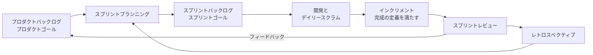

# 8.6 開発プロセスとドキュメンテーション

> 「この機能はいつ終わりますか？」「なぜこの設計にしたのですか？」——チームで開発していると、この 2 つの問いに何度も答えることになります。前者はプロセスと予測の問題、後者はドキュメントの問題です。この章では、ソフトウェア開発に固有の不確実性から出発して、アジャイル・スクラム・カンバンの本質、見積もりに頼らない確率的な予測、要求と仕様の書き方、設計ドキュメントと ADR、そして日本の受託開発の契約とアジャイルの関係までを扱い、チームが予測可能に、かつ知識を失わずに進むための仕組みを設計できるようになることを目指します。

| 項目 | 内容 |
|---|---|
| 学習時間の目安 | 本文 4h ＋ 演習 5h |
| 前提となる章 | [2.2 確率・統計と定量的思考](../../02-math-and-algorithms/02-probability-statistics/README.md)（リトルの法則・分布）、[8.4 CI/CDとリリースエンジニアリング](../04-ci-cd-and-release/README.md) |
| 演習 | [exercises/](exercises/)（Python） |
| キーワード | 不確実性のコーン, アジャイルソフトウェア開発宣言, スクラム, カンバン, WIP 制限, リトルの法則, リーン, XP, ストーリーポイント, モンテカルロ予測, ユーザーストーリー, 受け入れ条件, BDD, Diátaxis, 設計ドキュメント, ADR, 請負, 準委任 |

## この章のゴール

- [ ] ソフトウェア開発の不確実性の性質を説明し、単一の日付ではなく確率つきの範囲で予測を伝えられる
- [ ] アジャイルの価値観と、スクラム・カンバン・リーン・XP の要素を説明し、形だけの導入の失敗を見抜ける
- [ ] リトルの法則と待ち行列の考え方で、WIP 制限がリードタイムを短くする理由を説明し、シミュレーションで確かめられる
- [ ] 過去のスループットからモンテカルロ法で完了日を予測し、ストーリーポイントの誤用を避けられる
- [ ] ユーザーストーリー・受け入れ条件・Given/When/Then で、テストできる要求を書ける
- [ ] Diátaxis の 4 分類、設計ドキュメント、ADR、ランブックを使い分け、ドキュメントを保守される状態に保てる
- [ ] 請負と準委任の違いを説明し、日本の受託開発でアジャイルに進める際の論点を挙げられる

## なぜ学ぶのか

ソフトウェア開発のプロセスの失敗は、技術の失敗と同じくらい高くつきます。

- **予測の失敗は信頼を失わせる**: 「3 か月で終わります」と 1 つの日付で約束し、半年かかる。これを繰り返すと、エンジニアリング組織の言うことを経営も顧客も信じなくなります。問題は見積もりの下手さではなく、**不確実なものを確実であるかのように伝えている** ことにあります。
- **形だけのアジャイルは、何も改善しない**: スプリント・デイリースクラム・ベロシティといった「儀式」だけを導入し、フィードバックを受けて計画を変えるという本質が抜け落ちた「アジャイル」は、多くの組織で見られます。道具や会議の名前ではなく、原理を理解している必要があります。
- **ドキュメントの欠如は、知識の負債になる**: 「なぜこうなっているのか」を知っている人が異動・退職すると、同じ議論が蒸し返され、過去に却下された案が再び採用され、同じ失敗が繰り返されます（[8.5](../05-refactoring-and-tech-debt/README.md) の知識の負債）。
- **日本では契約の形が開発の進め方を縛る**: 受託開発では、請負か準委任かによって、何を約束し、誰がどう指示できるかが変わります。これを理解せずにアジャイルを導入すると、契約上の紛争や法令違反のリスクを抱えることになります。

## 1. ソフトウェア開発の不確実性

### 1.1 不確実性のコーン

Barry Boehm は 1981 年の著書『Software Engineering Economics』で、プロジェクトの初期ほど見積もりの誤差が大きいことを示し、Steve McConnell は『Software Estimation』（2006）でこれを **不確実性のコーン（cone of uncertainty）** として広めました。McConnell によれば、構想の初期段階では、実際の工数は見積もりの 0.25 倍から 4 倍（16 倍の幅）のどこにでもなりえます。要求が固まり、設計が進むにつれて幅は狭まります。

McConnell が強調しているのは、**コーンは自然には狭まらない** ことです。幅を狭めるのは、要求を明確にする、技術的な不明点を試作で潰す、といった不確実性を減らす行動だけです。そして、コーンは「最善の場合」の精度です。どれほど腕のいい見積もり担当者でも、構想の段階で ±10% の約束をすることはできません。

### 1.2 人は楽観的に見積もる

Daniel Kahneman と Amos Tversky は、人が自分の計画にかかる時間を過小に見積もる傾向を **計画錯誤（planning fallacy）** と呼びました。Douglas Hofstadter の「ホフスタッターの法則」——「物事は常に予想より時間がかかる。ホフスタッターの法則を考慮に入れても」——は、この現象を皮肉に表現したものです。

対策は、自分の「見積もり」ではなく、**過去の実績**（似た仕事に実際にかかった時間、チームの 1 週間あたりの完了数）を基準にすることです（4 節）。

### 1.3 ソフトウェアの不確実性の源

| 源 | 例 |
|---|---|
| 要求 | 作ってみて初めて、利用者が本当に欲しかったものが分かる |
| 技術 | 初めて使うライブラリ、既存システムの予想外の振る舞い、性能の問題 |
| 外部との依存 | 他チームの API、外部サービスの審査、法令の解釈 |
| 人と組織 | 割り込みの仕事、障害対応、メンバーの交代 |

これらは「計画をもっと精緻にする」ことでは消えません。だからこそ、**短いサイクルで作って確かめ、学んだことで計画を更新する** アプローチが必要になります。

## 2. ウォーターフォールとアジャイル

### 2.1 ウォーターフォールの誤解

要件定義 → 設計 → 実装 → テスト → 運用と、工程を順番に一度ずつ進める開発を **ウォーターフォール** と呼びます。その起源としてよく挙げられるのが、Winston Royce の 1970 年の論文 "Managing the Development of Large Software Systems" です。ところが Royce はこの論文で、一方向に流れるだけのモデルを図示したうえで、それを「危険で、失敗を招く」と述べ、工程間のフィードバックや、試作を作ってからもう一度作ることを勧めています。単純な一方向のモデルは、むしろ批判の対象だったのです。

ウォーターフォール的な進め方が合うのは、要求が安定していて、技術も既知で、途中の変更のコストが極めて高い場合（一部の組み込み・規制対象のシステムなど）です。そうでない多くのソフトウェアでは、最後の工程まで動くものが見えず、要求の誤りが最後に発覚するリスクを抱えます。

### 2.2 アジャイルソフトウェア開発宣言

2001 年 2 月、米国ユタ州スノーバードに集まった 17 人のソフトウェア開発者が「アジャイルソフトウェア開発宣言」をまとめました。宣言は 4 つの価値を掲げています（ここでは要約。公式サイトには日本語訳もあります）。

| より価値をおくもの | 対比されるもの |
|---|---|
| 個人と対話 | プロセスやツール |
| 動くソフトウェア | 包括的なドキュメント |
| 顧客との協調 | 契約交渉 |
| 変化への対応 | 計画に従うこと |

宣言は、対比される側（プロセスやツール、包括的なドキュメント、契約交渉、計画に従うこと）にも価値があることを認めたうえで、もう一方により価値をおく、と明記しています（英語の原文では前者を「右側」、後者を「左側」と呼びますが、公式の日本語訳では語順の関係で「左記」「右記」が逆になっているので注意してください）。**ドキュメントも計画も契約も不要だ、とは言っていない** のです。宣言には 12 の原則も添えられており、動くソフトウェアを数週間から数か月の短い間隔で頻繁に届けること、持続可能なペースを保つこと、定期的に振り返って行動を調整することなどが含まれます。

### 2.3 アジャイルの本質

アジャイルの本質を一言でいえば、**短いフィードバックのループで、不確実性を学習によって減らしていくこと** です。

- 小さく作って、実際の利用者（または代理の人）に見せる。
- 学んだことで、次に何を作るかの計画を変える。
- 進め方そのものも定期的に振り返って変える。

2014 年には、宣言の署名者の一人である Dave Thomas が、ブログ記事「Agile is Dead（Long Live Agility）」（とその後の講演）で、「アジャイル」が認定資格とツールと儀式の商売になってしまったと批判しました。「アジャイル」を名詞（売り買いできる方法論の名前）として扱うのをやめ、本来の形容詞の意味で「機敏に」進めること、つまり機敏さ（agility）——次の一歩を小さく踏み出し、結果を見て調整する——こそが大切だ、という主張です。

## 3. スクラム・カンバン・リーン・XP

### 3.1 スクラム

**スクラム** は、Ken Schwaber と Jeff Sutherland がまとめた、複雑な問題に取り組むための軽量なフレームワークで、その定義は「スクラムガイド」（2026年時点の最新は 2020 年版。公式のガイドを置き換えない任意の補足資料 "Scrum Guide Expansion Pack" も別に公開されています）にあります。

| 要素 | 内容（2020 年版スクラムガイド） |
|---|---|
| 責任（accountabilities） | **プロダクトオーナー**（プロダクトの価値の最大化とプロダクトバックログの管理）、**スクラムマスター**（スクラムの確立とチームの有効性）、**開発者**（各スプリントで使えるインクリメントを作る）。チームは通常 10 人以下 |
| イベント | **スプリント**（1 か月以内の固定の期間）の中に、スプリントプランニング、デイリースクラム（15 分）、スプリントレビュー、スプリントレトロスペクティブ |
| 作成物と確約 | プロダクトバックログ（確約: プロダクトゴール）、スプリントバックログ（確約: スプリントゴール）、インクリメント（確約: 完成の定義） |



よくある機能不全:

- **デイリースクラムが上司への進捗報告会になる**。本来は、スプリントゴールに向けて開発者どうしが計画を調整する場。
- **プロダクトオーナーに決める権限がない**。要望を取り次ぐだけの「代理」では、優先順位の判断が遅れ、スプリントが空回りする。
- **完成の定義がない、または緩い**。「開発は終わったがテストは次のスプリント」では、インクリメントが使える状態にならず、フィードバックも得られない。
- **スプリントが小さなウォーターフォールになる**。前半に設計、後半にテストを詰め込み、毎回最後に積み残す。
- **ベロシティが目標や評価の指標になる**（4.2 節）。
- **レトロスペクティブで改善の行動が決まらない、または実行されない**。

### 3.2 カンバン

**カンバン** は、トヨタ生産方式の「かんばん」に着想を得て、David J. Anderson が 2010 年の著書でソフトウェア開発向けに体系化した方法です。スクラムのような固定の期間や役割を持たず、今の進め方から始めて、次の実践で **流れ（フロー）** を改善していきます。

1. 仕事の流れを **見える化** する（ボードの列 = 工程）。
2. **WIP（仕掛かり中の作業）を制限** する。
3. 流れを **管理** する（リードタイム・スループットを測る）。
4. **方針を明示** する（「完了」の条件、優先の規則）。
5. フィードバックのループを作る。
6. 協力して改善し、実験によって進化させる。

```text
 バックログ │ 分析 (上限 2) │ 開発 (上限 3)   │ テスト (上限 2) │ 完了
 ───────────┼───────────────┼─────────────────┼─────────────────┼──────
  F  G  H   │  D            │  B  C           │  A              │  …
            │               │                 │                 │
            ↑ ここがコミットメントポイント（ここからリードタイムを数える）
```

### 3.3 リトルの法則と WIP 制限

なぜ WIP を制限すると速くなるのでしょうか。鍵は **リトルの法則**（John Little が 1961 年に証明）です（[2.2](../../02-math-and-algorithms/02-probability-statistics/README.md)）。

```text
平均 WIP = スループット × 平均リードタイム
   → 平均リードタイム = 平均 WIP ÷ スループット
```

チームのスループット（1 日あたりの完了数）が 2 件で、ボード上に常に 20 件の仕事が並んでいるなら、1 件の平均リードタイムは 20 ÷ 2 = 10 日です。スループットが変わらないまま WIP を 6 件に減らせば、リードタイムは 3 日になります。**同時に抱える仕事を減らすことが、1 件あたりを速く終わらせる最も直接的な方法** なのです。

演習 2 のシミュレーターで確かめてみます。毎日 1 件ずつ仕事が到着するのに、ボトルネックの「開発」工程は 1 日約 0.5 件しかこなせない、という過負荷の状況です。

```python
from kanban_sim import Stage, generate_items, simulate

items = generate_items(120, [(1, 2), (3, 5), (1, 3)], arrivals_per_day=1, seed=1)   # 毎日 1 件ずつ到着
boards = {
    "WIP 制限なし": [Stage("分析", 2), Stage("開発", 2), Stage("テスト", 2)],
    "WIP 制限あり": [Stage("分析", 2, wip_limit=2), Stage("開発", 2, wip_limit=3), Stage("テスト", 2, wip_limit=2)],
}
for name, stages in boards.items():
    r = simulate(stages, items, until_empty=True)
    print(f"{name}: スループット {r.throughput:.3f} 件/日, 平均 WIP {r.average_wip:5.2f} 件, "
          f"平均リードタイム {r.average_lead_time:5.2f} 日, スループット×リードタイム {r.throughput * r.average_lead_time:5.2f}")
```

```text
WIP 制限なし: スループット 0.494 件/日, 平均 WIP 32.68 件, 平均リードタイム 66.17 日, スループット×リードタイム 32.68
WIP 制限あり: スループット 0.494 件/日, 平均 WIP  5.88 件, 平均リードタイム 11.90 日, スループット×リードタイム  5.88
```

- **スループットは同じ**です。全体の速さはボトルネック（開発）で決まり、WIP を増やしても速くなりません。
- WIP を制限すると、**リードタイムは約 66 日から約 12 日に縮みます**。制限がないと、仕事はボードの上で着手されたまま待たされ、着手から完了までが長くなります。制限があると、仕事は着手前のバックログで待ち、着手したものはすぐに流れます。
- どちらでも、平均 WIP ＝ スループット × 平均リードタイムが成り立っています（リトルの法則）。

リトルの法則は、長期の平均について、**到着と完了がつり合った安定した系** で成り立つ関係です。過負荷で仕掛かりが増え続けている系で、途中の期間だけを切り取って計算すると、大きくずれます（演習 2 のテストで確かめます）。

### 3.4 稼働率と待ち時間

「全員の稼働率を 100% にすれば効率的だ」という直感は、待ち行列の理論によって否定されます。最も単純な待ち行列のモデル（M/M/1。到着と処理時間がランダムな 1 窓口のモデル）では、処理を待つ平均時間は、処理時間の ρ/(1−ρ) 倍になります（ρ は稼働率）。

```python
for rho in (0.5, 0.7, 0.8, 0.9, 0.95):
    print(f'稼働率 {rho:.0%}: 待ち時間は処理時間の {rho / (1 - rho):4.1f} 倍')
```

```text
稼働率 50%: 待ち時間は処理時間の  1.0 倍
稼働率 70%: 待ち時間は処理時間の  2.3 倍
稼働率 80%: 待ち時間は処理時間の  4.0 倍
稼働率 90%: 待ち時間は処理時間の  9.0 倍
稼働率 95%: 待ち時間は処理時間の 19.0 倍
```

現実のチームはこのモデルよりずっと複雑ですが、「稼働率が 100% に近づくと待ち時間が急激に伸びる」という性質は共通しています。コードレビュー、他チームへの依頼、共有の検証環境——こうした「窓口」の稼働率を限界まで上げると、組織全体のリードタイムが伸びます。**余裕（スラック）は無駄ではなく、流れを保つための設計** なのです（[13.7](../../13-technical-leadership/07-delivery-and-productivity/README.md)）。

### 3.5 リーン

Mary と Tom Poppendieck は『Lean Software Development』（2003）で、トヨタ生産方式の「ムダ」の考え方をソフトウェア開発に当てはめ、7 つのムダを挙げました。次の表は、それを見直した続編『Implementing Lean Software Development』（2006）の 7 つです（2003 年の版では「再学習」「引き継ぎ」の代わりに「余分なプロセス」「動作」が入っていました）。

| ムダ | ソフトウェアでの例 |
|---|---|
| 未完成の作業 | マージされないブランチ、リリースされない機能、書きかけの仕様 |
| 余分な機能 | 使われない機能（作るコストに加え、保守のコストを払い続ける） |
| 再学習 | 記録がないために、同じ調査や議論を繰り返す |
| 引き継ぎ | 工程や担当者の間での受け渡しのたびに失われる知識と待ち時間 |
| タスクの切り替え | 複数の仕事を並行して抱えることによる、切り替えのロス |
| 遅れ | 承認・レビュー・環境・他チームの待ち |
| 欠陥 | バグとその手戻り |

リーンの指標の一つに **フロー効率**（実際に作業している時間 ÷ リードタイム）があります。多くのチームで測ってみると、仕事がリードタイムの大半を「待ち」で過ごしていることが分かります。作業そのものを速くするより、待ちを減らす方が効果が大きいことが多いのです。

### 3.6 XP（エクストリーム・プログラミング）

Kent Beck の『Extreme Programming Explained』（初版 1999、第 2 版 2004）は、プロセスよりも **技術的な実践** に焦点を当てました。テスト駆動開発（[8.2](../02-testing/README.md)）、継続的インテグレーションと 10 分ビルド（[8.4](../04-ci-cd-and-release/README.md)）、ペアプログラミング（[8.3](../03-version-control-and-review/README.md)）、リファクタリングと単純な設計（[8.1](../01-code-quality-and-design/README.md)・[8.5](../05-refactoring-and-tech-debt/README.md)）、小さなリリース、コードの共同所有、持続可能なペースなどです。これらの多くは、今ではアジャイルに限らない標準的な実践になっています。スクラムやカンバンは「進め方の枠組み」で、技術的な実践を定めていません。**枠組みだけを入れて技術的な実践を入れないと、短いサイクルで動くものを届けることができず、アジャイルは形だけになります**。

## 4. 見積もりと予測

### 4.1 相対見積もりとストーリーポイント

絶対的な時間（「3 日」）を当てるのが難しいので、仕事の大きさを互いに比べて見積もる **相対見積もり** がよく使われます。**ストーリーポイント** はその単位で、チーム全員で同時にカードを出して見積もる **プランニングポーカー**（James Grenning が 2002 年に考案し、Mike Cohn が広めた）と組み合わせて使われます。見積もりの会話は、仕事の理解のずれ（「そんなに大きいと思っていなかった」）を早く発見する点で価値があります。

### 4.2 ストーリーポイントの落とし穴

- **チーム間で比較する**。ポイントはチームごとの相対的な単位なので、「A チームは 40 ポイント、B チームは 25 ポイント」を比べても意味がありません。
- **ベロシティ（スプリントあたりのポイント数）を目標にする**。目標にすると、見積もりが膨らみ（ポイントのインフレ）、数字は上がっても届く価値は変わりません（[8.2](../02-testing/README.md) で見たグッドハートの法則）。
- **ポイントを時間に換算して約束する**。相対見積もりの利点が消え、「1 ポイント = 半日」の見積もりと同じ問題に戻ります。
- **見積もりの会議に時間をかけすぎる**。細かく見積もっても、予測の精度はあまり上がりません。

ストーリーポイントの考案者の一人とされる Ron Jeffries 自身も、後年、ポイントが管理の道具として誤用されていることを嘆いています。

### 4.3 スループットによる確率的な予測

見積もりに代わる方法として広まっているのが、**過去のスループット（期間あたりの完了数）から、モンテカルロ法で完了日の分布を求める** 予測です（Troy Magennis や Daniel Vacanti らの著作で広まった）。仕事の大きさのばらつきは、過去のスループットのばらつきにすでに含まれている、と考えます。演習 1 の実装で予測してみます。

```python
from datetime import date
from forecast import forecast_completion, forecast_items

history = [3, 5, 2, 6, 4, 4, 0, 5, 3, 6]      # 過去 10 週間に完了した項目の数
print(forecast_completion(history, 40, date(2026, 10, 5)))
print(forecast_items(history, 8))               # 8 週間で少なくとも何件？
```

```text
{50: datetime.date(2026, 12, 21), 85: datetime.date(2027, 1, 4), 95: datetime.date(2027, 1, 11)}
{50: 31, 85: 25, 95: 22}
```

この結果は、次のように伝えます。

> 残り 40 件は、**50% の確率で 12 月 21 日まで、85% の確率で 1 月 4 日までに** 終わる見込みです。
> 逆に、8 週間後の時点で約束できるのは、85% の確率で **少なくとも 25 件** です。

- **1 つの日付ではなく、確率つきの範囲で伝える**。50% の日付を約束すると、半分の確率で遅れます。外部への約束には 85% などの高い信頼度を使い、内部の目標には 50% を使う、というように使い分けます。
- **予測は毎週更新する**。新しい週の実績を加えて計算し直し、日付が動いたら早く伝えます。
- 前提は「未来の週は過去の週に似ている」ことです。チームの人数や仕事の種類が大きく変わったら、履歴を使い直す必要があります。また、仕事は途中で分割されたり追加されたりしてバックログが増えることが多いので、実務では **バックログの増加** も見込んで予測します。

### 4.4 #NoEstimates

2012 年ごろから Woody Zuill らが Twitter（現 X）のハッシュタグで広めた **#NoEstimates** は、「見積もりをやめて、仕事を小さく同じくらいの大きさに分け、件数を数えて予測しよう」という問題提起です。見積もりそのものを禁止する主張ではなく、**見積もりにかけるコストに見合う判断に使われているか** を問うものです。上のスループットによる予測は、この考え方と相性が良い方法です。

## 5. 要求と仕様

### 5.1 ユーザーストーリー

**ユーザーストーリー** は、要求を「誰が・何を・なぜ」の短い文で表す書き方で、次の定型がよく使われます（2001 年ごろに英国の Connextra 社のチームが使い始めたとされる形）。

```text
<役割> として、<目的> のために、<機能> がほしい。
例: 定期購入の会員として、旅行で不在の月に無駄な配送を受け取らないために、次回の配送を 1 回だけスキップしたい。
```

Ron Jeffries は、ストーリーを **カード**（短い記述）・**会話**（詳細は対話で詰める）・**確認**（受け入れ条件）の 3 つの C で説明しました。カードは会話の約束であり、仕様書そのものではありません。良いストーリーの条件として、Bill Wake の **INVEST**（独立している・交渉可能・価値がある・見積もれる・小さい・テストできる）が知られています。

### 5.2 ジョブ理論

Clayton Christensen らの **ジョブ理論（Jobs to Be Done）** は、顧客は製品を買うのではなく、自分の「片付けたい用事（ジョブ）」のために製品を「雇う」と考えます。「会員として〜したい」という役割の視点から一歩引いて、「どんな状況で、何を片付けたいのか」を問うことで、機能の要望の背後にある本当の課題を見つけやすくなります。

```text
（状況）来月は旅行で家を空けるので、
（動機）届いても受け取れない商品の代金を払いたくない、
（期待する結果）だから、解約せずにその月だけ止められるとうれしい。
```

「スキップ機能」ではなく「一時的に止めたい」がジョブだと分かれば、「配送日の変更」や「2 か月分の一時停止」の方がよい解決策かもしれません。

### 5.3 受け入れ条件と BDD

ストーリーの「確認」は、**テストできる受け入れ条件** として書きます。Dan North が提唱した **振る舞い駆動開発（BDD）** の Given/When/Then の形式（Cucumber などの道具の Gherkin という記法）は、非エンジニアとも共有しやすい書き方です（以下は Gherkin の例で、このリポジトリでは実行しません）。

```gherkin
Feature: 次回の配送のスキップ
  Scenario: 締め日より前ならスキップできる
    Given 次回の配送日が 10 月 20 日で、締め日が 10 月 15 日の会員
    When 10 月 14 日にスキップを申し込む
    Then 10 月の配送と請求は行われない
    And 次回の配送日は 11 月 20 日になる

  Scenario: 締め日を過ぎるとスキップできない
    Given 次回の配送日が 10 月 20 日で、締め日が 10 月 15 日の会員
    When 10 月 16 日にスキップを申し込む
    Then 「締め日を過ぎたため、今回の配送はスキップできません」と表示される
```

Gojko Adzic が『Specification by Example』（2011）で示したように、**具体的な例** で仕様を書くと、「締め日の当日は？」「すでに請求済みだったら？」といった曖昧な点が議論の中で自然に浮かび上がります。そして、例はそのまま自動テストになります（[8.2](../02-testing/README.md)）。

### 5.4 仕様を書くときの注意

- **機能以外の要求（非機能要求）を書く**。性能（p95 の応答時間）、可用性（SLO。[10.3](../../10-cloud-and-sre/03-reliability-engineering/README.md)）、セキュリティ、個人情報の扱い、監査の記録、対応するブラウザや端末。後から足すと高くつく要求ほど、最初に書く。
- **異常系と境界を書く**。締め日の当日、同時に 2 回押された、決済が失敗した、といったケース。
- **用語を定義する**。「会員」「顧客」「利用者」が同じものか違うものか（[9.3](../../09-architecture/03-domain-driven-design/README.md) のユビキタス言語）。
- **「何を」と「なぜ」を書き、「どうやって」は必要なときだけ**。実装方法まで仕様に書くと、よりよい解決策を探す余地がなくなる。

## 6. ドキュメンテーション

### 6.1 Diátaxis — ドキュメントの 4 つの種類

Daniele Procida が整理した **Diátaxis** という枠組みは、技術ドキュメントを読者の目的によって 4 種類に分けます。

| 種類 | 読者の目的 | 書き方 | 例 |
|---|---|---|---|
| チュートリアル | 学ぶ（初めての人が、手を動かして成功体験を得る） | 手順を 1 つの道筋に絞り、説明は最小限に | 「はじめての API 呼び出し」 |
| ハウツーガイド | 特定の課題を解決する（すでに知識のある人が） | 目的と手順。前提は短く | 「API キーをローテーションする方法」 |
| リファレンス | 正確な情報を調べる | 網羅的・正確・構造的に。説明や意見を混ぜない | API の各エンドポイントの仕様、設定項目の一覧 |
| 解説 | 理解する（なぜそうなっているのか） | 背景・設計の理由・代替案。手順は書かない | 「なぜイベント駆動にしたのか」 |

多くの読みにくいドキュメントは、この 4 つが 1 つの文書に混ざっています。チュートリアルの途中に設計の理由の長い解説があると、学び始めた人は迷子になり、リファレンスに手順が混ざると、調べたい人が情報を見つけられません。

### 6.2 設計ドキュメント

コードを書く前に、大きな設計判断をレビューするための文書が **設計ドキュメント**（design doc。RFC と呼ぶ組織もある）です。Google の設計ドキュメントの文化を紹介した記事（Malte Ubl "Design Docs at Google", 2020）では、典型的な構成として、文脈と範囲、目標と「目標としないこと」、実際の設計、検討した代替案、横断的な関心事（セキュリティ・プライバシー・観測可能性など）が挙げられています。

- **目標としないこと（non-goals）を書く**。範囲を明確にし、レビューでの議論の拡散を防ぐ。
- **検討した代替案と、採らなかった理由を書く**。最も価値のある部分。後から「なぜ X にしなかったのか」と問われたときの答えになる。
- **レビューのための文書であって、完成品の説明書ではない**。書くことで自分の考えの穴に気づき、コードを書く前（変更が最も安いとき）に、他者の指摘を受けられる。
- **すべての変更に書かない**。一方通行のドア（[8.1](../01-code-quality-and-design/README.md) の CTO の視点）に近い判断や、複数のチームに影響する変更に絞る。

設計のレビューの進め方は [13.2](../../13-technical-leadership/02-technical-decisions/README.md) で扱います。

### 6.3 ADR — 決定の記録

設計ドキュメントは大きく、数が少ない。一方、日々の設計判断の多くは、どこにも記録されずに消えていきます。Michael Nygard は 2011 年のブログ記事 "Documenting Architecture Decisions" で、重要な設計判断を **1 つの判断につき 1 つの短いファイル** として、番号付きでリポジトリに残す **ADR（Architecture Decision Record）** を提案しました。基本の構成は、タイトル・ステータス・コンテキスト（背景と制約）・決定・結果（良い面も悪い面も）です。

演習 3 で作るツールで、ADR を作り、あとから別の判断で置き換えてみます。

```python
import tempfile
from datetime import date
from pathlib import Path
from adr_tool import list_adrs, new_adr, supersede

with tempfile.TemporaryDirectory() as tmp:
    adr_dir = Path(tmp) / "docs" / "adr"
    new_adr(adr_dir, "セッションをアプリケーションサーバーのメモリに保存する", on=date(2025, 4, 1),
            status="承認済み", slug="store-sessions-in-memory")
    new_adr(adr_dir, "認証に OIDC を使う", on=date(2025, 6, 10), status="承認済み")
    supersede(adr_dir, 1, "セッションを Redis に保存する", on=date(2026, 9, 28), slug="store-sessions-in-redis")
    for adr in list_adrs(adr_dir):
        print(f"{adr.number:04d}  {adr.status}  {adr.title}")
    print()
    print((adr_dir / "0001-store-sessions-in-memory.md").read_text(encoding="utf-8").split("## コンテキスト")[0].rstrip())
```

```text
0001  置き換え済み  セッションをアプリケーションサーバーのメモリに保存する
0002  承認済み  認証に OIDC を使う
0003  承認済み  セッションを Redis に保存する

# 1. セッションをアプリケーションサーバーのメモリに保存する

- 日付: 2025-04-01

## ステータス

置き換え済み

置き換え先: [ADR-0003 セッションを Redis に保存する](0003-store-sessions-in-redis.md)
```

ADR の要点は、**古い決定を消さずに、置き換えられたことを記録する** ことです。当時の判断は、当時の制約（サーバーが 1 台だった、など）の下では正しかったのかもしれません。その経緯が残っていれば、「なぜ最初からそうしなかったのか」という不毛な議論を避け、同じ判断の誤りを繰り返さずに済みます。

### 6.4 ランブック

**ランブック（runbook）** は、特定のアラートや運用作業に対して「何を確認し、何をするか」を書いた手順書です。深夜に呼び出された当番の人が、そのシステムに詳しくなくても初動を取れるようにするためのもので、アラートの定義からリンクしておきます。書き方と運用は [10.5 インシデント対応とポストモーテム](../../10-cloud-and-sre/05-incident-management/README.md) で扱います。

### 6.5 ドキュメントを保守される状態に保つ

- **Docs as Code**: ドキュメントを Markdown などでコードと同じリポジトリに置き、コードと同じ PR でレビューする。コードの変更とドキュメントの更新が同じ差分に並ぶので、更新漏れに気づきやすい。リンク切れの検査などを CI で自動化する（このリポジトリの `tools/lint_content.py` もその一例です）。
- **所有者と見直しの時期を決める**。所有者のいないドキュメントは必ず古くなる。重要な文書には、所有チームと最終確認日を書く。
- **古いドキュメントは削除するか、はっきり「古い」と書く**。間違ったドキュメントは、ドキュメントがないより悪い。
- **書くコストを下げる**。テンプレート（ADR・設計ドキュメント・ポストモーテム）と、書く場所の決まりがあるだけで、書かれる量は大きく変わる。

## 7. 日本の受託開発とアジャイル

日本では、ユーザー企業が開発を外部の IT 企業（SIer など）に委託する受託開発の比率が高いと言われます。そこでは、契約の形が開発の進め方を強く規定します。以下は一般的な解説です。**個別の契約や法的な判断は、必ず専門家に確認してください**（詳しくは [14.5 ガバナンス・リスク・コンプライアンスと法務](../../14-cto/05-governance-risk-compliance/README.md)）。

### 7.1 請負と準委任

| | 請負契約 | 準委任契約 |
|---|---|---|
| 根拠（民法） | 632 条 | 656 条（委任の規定を準用） |
| 約束するもの | 仕事の **完成**（成果物） | 事務（作業）の **遂行** |
| 受注者の主な義務 | 完成させる義務。成果物が契約の内容に適合しない場合の責任（契約不適合責任。2020 年 4 月施行の改正前は「瑕疵担保責任」） | 善良な管理者の注意をもって作業する義務（善管注意義務、644 条）。完成の義務はない |
| 報酬 | 完成した成果物に対して | 作業の遂行に対して（履行割合型）。改正民法では、成果に対して報酬を払う「成果完成型」（648 条の 2）も明文化された |
| 向いている開発 | 要求と成果物を事前に確定できる開発 | 要求が変わりうる、作りながら決める開発 |

請負でアジャイルに進めようとすると、「完成」の定義（何を作れば完成か）を事前に確定しなければならないという前提と、「作りながら要求を変える」というアジャイルの前提が衝突します。そのため、アジャイル開発では準委任契約を用いることが多くなっています。情報処理推進機構（IPA）は 2020 年 3 月に、準委任契約を前提とした「アジャイル開発版『情報システム・モデル取引・契約書』」を公開しています。

### 7.2 要件定義と V 字モデル

日本の受託開発で広く使われてきた工程の型が **V 字モデル** です。左側で要求を詳細化し、右側で、それぞれの段階に対応するテストで確かめます（工程の名前と対応の付け方は組織によって違います。以下は一例です）。

```text
 要件定義 ─────────────────────────── 受入テスト／システムテスト
    基本設計（外部設計）────────── 結合テスト
        詳細設計（内部設計）──── 単体テスト
                   製造（実装）
```

特に **要件定義** は、発注者と受注者の間で「何を作るか」を合意する工程で、ここでの合意が契約の範囲と見積もりの基礎になります。要件定義を準委任、設計以降を請負、と工程ごとに契約を分ける形も一般的です。V 字モデルの考え方（各段階の成果物に対応する確認を用意する）自体は有用ですが、各工程を一度ずつ順番に進めると、要求の誤りが受入テストまで発覚しない、というウォーターフォールの弱点をそのまま抱えます。

### 7.3 準委任でアジャイルに進めるときの論点

- **誰が指示するのか（偽装請負の問題）**: 請負や準委任の契約で、発注者が受注者の作業者に直接、業務上の指揮命令をすると、実態が労働者派遣とみなされ、労働者派遣法などに違反する「偽装請負」となるおそれがあります。スクラムでは、発注者側のプロダクトオーナーと受注者側の開発者が密に対話することが前提になるため、この区分が論点になります。厚生労働省は 2021 年 9 月に、アジャイル型開発における発注者と受注者の関わり方の考え方を「『労働者派遣事業と請負により行われる事業との区分に関する基準』（37 号告示）に関する疑義応答集（第 3 集）」として公表しました。その要点は、発注者と受注者が対等な関係で協働し、受注者側の開発者が自律的に判断して作業している実態があれば、両者が直接やりとりすること自体で直ちに偽装請負とされるわけではない、というものです（その後も更新されているので、最新版を厚生労働省のサイトで確認してください）。**プロダクトオーナーは優先順位と要求を伝え、作業の進め方と割り当ては受注者のチームが自ら決める** という役割の分担を、契約と運用の両方で明確にしておくことが重要です。
- **何に責任を持つのか**: 完成義務がない準委任では、成果物の品質や進捗に対する期待を、完成の定義・スプリントレビューでの確認・定期的な振り返りといった仕組みで管理します。
- **発注者の体制**: アジャイル開発では、発注者側に意思決定の権限を持つプロダクトオーナーが必要です。「要件は受注者に任せる」「決定は月 1 回の会議で」という体制では、スプリントの速さに意思決定が追いつきません。

## 8. リモート・非同期の協働と書く文化

リモートワークや、時差のある拠点との協働では、**書くこと** が協働の中心になります。

- **決定は書いて残す**。会議で決めたことは、決定・理由・担当・期限を議事録や ADR に残す。口頭の合意は、参加しなかった人にとって存在しないのと同じ。
- **非同期を既定にする**。質問や相談は、相手の時間を拘束しない形（チャット・課題・文書へのコメント）で送り、返答の期待時間を合意しておく。同期の会議は、議論が収束しない問題や関係づくりに使う。日本の職場の「報連相」も、非同期の文化では「いつでも読める記録」に置き換わっていく。
- **文章で考える**。Jeff Bezos は 2017 年の株主への手紙で、Amazon の幹部会議ではスライドを使わず、物語形式の 6 ページのメモを会議の冒頭に全員で黙読してから議論することを紹介しています。箇条書きのスライドでは隠れてしまう論理の飛躍や曖昧さが、文章では露わになるからです。
- **文書の置き場所を 1 つにする**。GitLab のように、社内の方針や手順をまとめたハンドブックを「唯一の正しい情報源」として公開・更新している企業もあります。探せば見つかる、という状態が、質問の往復を減らします。

書く文化は、個人の能力だけでなく、**書いたものが読まれ、評価される仕組み** があって初めて根づきます。良い設計ドキュメントやポストモーテムを書いた人を評価の対象にすること（[13.5](../../13-technical-leadership/05-growth-and-evaluation/README.md)）も、リーダーの仕事です。

## よくある落とし穴

1. **1 つの日付で約束する**。「11 月末に終わります」は、半分の確率で破られる約束になりがちです。確率つきの範囲（50% と 85% の日付）で伝え、毎週更新します。
2. **儀式だけのアジャイル**。スプリントとデイリースクラムを導入しても、完成の定義がなく、レビューで得たフィードバックで計画を変えず、技術的な実践（テスト・CI）もなければ、何も改善しません。
3. **ベロシティやストーリーポイントを目標・評価の指標にする**。ポイントのインフレを招き、見積もりの会話という本来の価値も失われます。チーム間でも比較しません。
4. **WIP を制限せず、全員を 100% 稼働させる**。仕掛かりが増え、切り替えのロスと待ち時間でリードタイムが伸びます。WIP の上限を決め、「始めるより終わらせる」を優先します。
5. **要求を「〜の機能がほしい」のまま受け取る**。背後のジョブ（片付けたい用事）を問わないと、より良い解決策を見逃します。受け入れ条件を具体例で書き、境界と異常系を明確にします。
6. **すべてを 1 つのドキュメントに書く、または何も書かない**。Diátaxis の 4 分類で目的を分け、設計判断は ADR として短く残します。
7. **決定の経緯を消す**。古い設計書を上書きすると、なぜ変えたのかが失われます。ADR のように、置き換えられたことを記録します。
8. **契約の形を考えずにアジャイルを導入する**。請負で要求の変更を前提にすると紛争の種になり、準委任で発注者が作業者に直接指示すると偽装請負のおそれがあります。契約と役割の分担を最初に設計します。

## CTOの視点

1. **予測の伝え方を、経営との約束の作法として標準化する**。「この日までに 85% の確率で終わる」という確率的な予測を標準にし、経営陣にもその読み方を理解してもらいます。確実な日付が必要な約束（顧客との契約、法令の期限）には、範囲を縮めるための投資（先に不確実な部分を試作する、範囲を削る）を明示的に行います。予測が外れたときに担当者を責めると、以後の予測は水増しされ、情報の価値がなくなります。
2. **プロセスの導入ではなく、流れの指標を見る**。スクラムを導入したかどうかではなく、リードタイム・スループット・WIP・フロー効率がどう変わったかを見ます。リトルの法則が示すように、多くの組織では「同時に抱える仕事を減らす」ことが最も効果の大きい改善です。それは、優先順位を決めて「今はやらない」と言うことであり、CTO と経営陣にしかできない判断を含みます。
3. **ドキュメントの文化に投資する**。設計ドキュメントと ADR のテンプレート、置き場所、レビューの仕組みを整え、リーダー自身が書きます。人の入れ替わりがあっても判断の経緯が残る組織は、同じ議論と同じ失敗の繰り返しを避けられます。技術デューデリジェンス（[14.7](../../14-cto/07-due-diligence-and-ma/README.md)）でも、判断の記録が残っているかは組織の成熟度の指標になります。
4. **委託先との契約とプロセスを一体で設計する**。外部の開発会社とアジャイルに進めるなら、準委任を基本に、プロダクトオーナーの権限と体制、完成の定義、指示の経路（偽装請負を避ける役割の分担）、成果の確認方法を契約の段階で合意します。法務の専門家と、IPA のモデル契約などの公開資料を参照しながら設計しましょう。
5. **非同期の協働を前提に組織を設計する**。拠点や時差、リモートワークがある組織では、会議に出た人だけが情報を持つ構造は、意思決定の遅れと不公平を生みます。決定の記録、文書の置き場所、返答の期待時間の合意を、組織の規範として定めます。

## 演習

演習コードは [exercises/](exercises/) にあります。解答例は [solutions/](solutions/) にありますが、まずは自力で取り組みましょう。

```bash
python3 tools/check.py 8.6        # リポジトリのルートで実行
python3 tools/check.py -v 8.6     # 詳しい出力
```

| # | 難易度 | 内容 | 対象 |
|---|---|---|---|
| 1 | ★★☆ | 過去の週次スループットから、モンテカルロ法で完了日の分布（50/85/95%）と「期日までに何件終わるか」を予測する | `forecast.py` |
| 2 | ★★★ | WIP 制限と工程の能力を持つカンバンのボードを 1 日単位でシミュレーションし、スループット・リードタイムを測ってリトルの法則を検証する | `kanban_sim.py` |
| 3 | ★☆☆ | ADR をテンプレートから番号付きで作成・一覧・状態変更し、置き換え（両方のファイルの状態とリンクの更新）を行うツール | `adr_tool.py` |
| 4 | ★★☆ | 記述: 設計ドキュメントを書く（下記） | — |

- 演習 1 は、自分のチームの過去 10〜12 週間の完了数を入れて試してみましょう。スプレッドシートで管理している予測と比べると、違いが見えるはずです。
- 演習 2 を終えたら、`generate_items` の到着数や工程の人数、WIP の上限を変えて、リードタイムとスループットがどう変わるかを実験してみましょう。ボトルネックの工程の人数を増やしたときだけスループットが上がることを確かめてください。

### 演習 4（記述）: 設計ドキュメントを書く

あなたは定期購入（サブスクリプション）の EC サービスのエンジニアです。「次回の配送を 1 回だけスキップできる機能」を追加することになりました。現状は次の通りです。

- 会員は毎月決まった日に商品が届き、配送日の 5 日前（締め日）に決済と出荷の準備が行われる。
- 決済と出荷の準備は、毎日 1 回動くバッチ処理が、締め日を迎えた会員について行う。
- スマートフォンのアプリと Web の両方から操作できる。アプリの古い版も多く使われている。
- 問い合わせの多くが「旅行で受け取れない」「在庫が余っている」という理由の解約の相談である。

次のテンプレートに沿って、設計ドキュメントを書いてください（各項目 3〜8 行程度）。

```text
# 設計ドキュメント: 次回配送のスキップ
- 著者 / レビュアー / 状態（草稿・レビュー中・承認済み）/ 最終更新日
## 1. 背景と課題
## 2. 目標
## 3. 目標としないこと
## 4. 提案する設計（データモデル・API・バッチ処理・画面）
## 5. 検討した代替案
## 6. データの移行とリリースの計画
## 7. セキュリティ・プライバシー・運用（監視・問い合わせ対応）
## 8. テストの計画
## 9. 未解決の問題
```

<details>
<summary>解答例</summary>

**1. 背景と課題**: 解約の相談の多くが「一時的に受け取れない」「在庫が余っている」という理由で、恒久的な不満ではない。現状は解約以外の手段がなく、一時的な事情で会員を失っている。

**2. 目標**: 会員が締め日の前日まで、アプリと Web から次回の配送を 1 回スキップできる。スキップした回は決済も出荷もされない。スキップの取り消しも締め日の前日までできる。成功の指標は、一時的な理由による解約の件数の減少と、スキップした会員の 3 か月後の継続率。

**3. 目標としないこと**: 連続した複数回のスキップ、配送日の変更、一時停止（期間指定）。これらは利用状況を見て別途検討する。

**4. 提案する設計**:
- データモデル: `skips(subscription_id, delivery_date, created_at, canceled_at)` を追加（配送日ごとに 1 件。重複はユニーク制約で防ぐ）。
- API: `POST /subscriptions/{id}/skips`（締め日の判定はサーバー側。冪等にする）、`DELETE /subscriptions/{id}/skips/{delivery_date}`。締め日を過ぎたら 409 を返し、理由をメッセージに含める。
- バッチ: 締め日の処理で、スキップがある会員は決済と出荷をせず、次回の配送日を 1 か月進める。**スキップの登録とバッチの実行が同時に起きた場合** に備え、バッチは締め日の時点のスキップの有無を、トランザクションの中で確認する（[6.3](../../06-databases/03-transactions/README.md)）。
- 画面: 次回の配送の表示の横に「今回はスキップ」を置き、確認の画面で「決済も行われない」ことと取り消しの期限を明示する。

**5. 検討した代替案**: (a) 配送日の変更機能 — 柔軟だが、出荷の計画と在庫への影響が大きく、今回は範囲外。(b) 1 か月の一時停止 — スキップとほぼ同じだが、「一時停止中」という新しい状態が必要で、請求・通知・問い合わせ対応への影響が大きい。スキップは状態を増やさずに実現できる。

**6. データの移行とリリースの計画**: 新しいテーブルの追加のみで、既存のデータの移行はない（拡張のみ。[8.4](../04-ci-cd-and-release/README.md)）。バッチの変更を先にリリースし（スキップがなければ従来通り）、次に API、最後に画面を、フィーチャーフラグの背後で公開する。社内の会員 → 5% → 全体と段階的に広げる。古い版のアプリにはボタンが出ないだけで、Web からは操作できる。

**7. セキュリティ・プライバシー・運用**: 他人の定期購入を操作できないよう、所有者の確認を API で必ず行う。スキップの件数、締め日の処理でスキップされた件数、409 の件数を監視する。問い合わせ対応向けに、管理画面でスキップの履歴を見られるようにする。

**8. テストの計画**: 締め日の前日・当日・翌日、スキップと取り消しの繰り返し、バッチとの同時実行、月末（31 日がない月）の配送日の繰り越しを、時計を注入した単体テストで確かめる（[8.2](../02-testing/README.md)）。バッチは偽物のリポジトリと決済で統合的にテストする。

**9. 未解決の問題**: スキップした月の会員特典（ポイントなど）の扱い。連続スキップを求める声が多い場合の次の段階。

採点の観点: 目標としないことが明確か、締め日と同時実行の問題に気づいているか、代替案と採らなかった理由があるか、段階的なリリースと古いアプリへの配慮があるか、成功の指標があるか。機能の説明だけで、代替案・リリース・テストの計画がないものは、設計ドキュメントとしては不十分です。

</details>

## 理解度チェック

**Q1. 不確実性のコーンとは何ですか。「プロジェクトが進めば、見積もりは自然に正確になる」は正しいですか。**

<details>
<summary>解答</summary>

プロジェクトの初期ほど見積もりの誤差の幅が大きく（McConnell によれば構想段階で実績は見積もりの 0.25〜4 倍）、要求の明確化や設計が進むにつれて幅が狭まる、という関係を図示したものです。ただし、幅は自然には狭まりません。要求を明確にする、技術的な不明点を試作で確かめる、といった不確実性を減らす行動をとった分だけ狭まります。また、コーンは最善の場合の精度であり、それより正確な見積もりは期待できません。

</details>

**Q2. アジャイルソフトウェア開発宣言は「ドキュメントは不要」と言っていますか。宣言の価値の読み方を説明してください。**

<details>
<summary>解答</summary>

言っていません。宣言は「包括的なドキュメントよりも動くソフトウェアに、より価値をおく」と述べ、さらに、対比される側（ドキュメント・計画・契約・プロセスやツール）にも価値があることを認めたうえで、もう一方により価値をおく、と明記しています。価値の優先順位の表明であって、対比される側の否定ではありません。本章の ADR や設計ドキュメントのように、判断の記録や設計のレビューのためのドキュメントは、アジャイルなチームでも重要です。

</details>

**Q3. チームのスループットが 1 週間に 5 件で、ボード上の仕掛かりが平均 30 件あります。平均リードタイムは何週間ですか。リードタイムを 2 週間にするには、どうすればよいですか。**

<details>
<summary>解答</summary>

リトルの法則より、平均リードタイム = 平均 WIP ÷ スループット = 30 ÷ 5 = 6 週間です。スループットが変わらないなら、リードタイムを 2 週間にするには平均 WIP を 5 × 2 = 10 件に減らす必要があります。WIP の上限を設け、新しい仕事を始めるより、仕掛かり中の仕事を終わらせることを優先します。ボトルネックの能力を上げてスループットを増やす方法もありますが、WIP を減らす方が早く、コストもかかりません。なお、この関係は、到着と完了がつり合った安定した状態での平均について成り立ちます。

</details>

**Q4. 「稼働率 100% が最も効率的」という考えの問題点を、待ち行列の観点から説明してください。**

<details>
<summary>解答</summary>

待ち行列では、稼働率が 100% に近づくと待ち時間が急激に（非線形に）伸びます。単純なモデル（M/M/1）では、待ち時間は処理時間の ρ/(1−ρ) 倍で、稼働率 80% で 4 倍、90% で 9 倍、95% で 19 倍になります。レビューや他チームへの依頼、共有の環境などの「窓口」の稼働率を限界まで上げると、仕事はそこで長く待たされ、全体のリードタイムが伸びます。余裕は、流れを保つための設計です。

</details>

**Q5. ストーリーポイントの典型的な誤用を 3 つ挙げ、なぜ問題かを説明してください。**

<details>
<summary>解答</summary>

(1) チーム間でポイントやベロシティを比較する — ポイントはチームごとの相対的な単位なので、比較に意味がない。(2) ベロシティを目標や評価の指標にする — 見積もりが膨らみ（インフレ）、数字は上がっても届く価値は変わらない（グッドハートの法則）。(3) ポイントを時間に換算して約束する — 相対見積もりの利点が消え、時間の見積もりと同じ問題に戻る。ほかに、見積もりの会議に時間をかけすぎる、も挙げられます。ポイントの主な価値は、見積もりの会話で仕事の理解のずれを発見することにあります。

</details>

**Q6. モンテカルロ法による予測で、「50% の日付」と「85% の日付」をどう使い分けますか。**

<details>
<summary>解答</summary>

50% の日付は、半分の確率でそれより遅れる日付なので、外部への約束には使いません。チームの内部の目標や、「うまくいけばこの頃」という見通しには使えます。顧客や経営陣への約束には、85% や 95% のような高い信頼度の日付を使い、それでも外れる可能性があることを伝えます。どちらの日付も、毎週の実績を加えて計算し直し、動いたら早く共有します。

</details>

**Q7. Diátaxis の 4 分類を挙げ、「API キーのローテーションの手順」と「なぜ API キーではなく OAuth を採用したのか」はそれぞれどれに当たるか答えてください。**

<details>
<summary>解答</summary>

チュートリアル（学ぶため）、ハウツーガイド（特定の課題を解決するため）、リファレンス（正確な情報を調べるため）、解説（理解するため）の 4 つです。「API キーのローテーションの手順」は、すでに知識のある人が特定の課題を解決するための文書なのでハウツーガイド、「なぜ OAuth を採用したのか」は背景と設計の理由を理解するための文書なので解説（判断の記録としては ADR）に当たります。

</details>

**Q8. 請負と準委任の違いを説明し、準委任でスクラムを行う際に注意すべき「偽装請負」の問題とは何かを説明してください。**

<details>
<summary>解答</summary>

請負（民法 632 条）は仕事の完成を約束し、成果物に対して報酬が支払われ、受注者は完成義務と契約不適合責任を負います。準委任（民法 656 条）は事務（作業）の遂行を約束し、受注者は善管注意義務を負いますが、完成の義務は負いません（2020 年施行の改正民法で、成果に対して報酬を払う成果完成型も明文化されました）。準委任や請負の契約で、発注者が受注者の作業者に直接、業務上の指揮命令をすると、実態が労働者派遣とみなされ、法令違反（偽装請負）となるおそれがあります。スクラムでは発注者側のプロダクトオーナーと受注者側の開発者が密に対話するため、優先順位と要求を伝えることと、作業の進め方や割り当てを指示することを区別し、契約と運用で役割の分担を明確にする必要があります。具体的な判断は専門家に確認してください。

</details>

## さらに学ぶために

- Steve McConnell "Software Estimation: Demystifying the Black Art"（2006。邦訳『ソフトウェア見積り』日経BP）— 不確実性のコーンの解説と、見積もりの技法と伝え方の実践的な指南。
- Ken Schwaber, Jeff Sutherland「スクラムガイド」（2020 年版）— スクラムの公式の定義。20 ページ足らずで、日本語版も無料で公開されている。導入や議論の前に原典を読んでおくとよい。
- Daniel S. Vacanti "When Will It Be Done?"（2020）— スループットとモンテカルロ法による確率的な予測を、実務の手順として解説した本。演習 1 の考え方を深められる。
- Mary Poppendieck, Tom Poppendieck "Lean Software Development: An Agile Toolkit"（2003）— 7 つのムダ、フロー、学習の増幅など、リーンの考え方をソフトウェアに当てはめた古典。
- Gojko Adzic "Specification by Example"（2011）— 具体例で要求を書き、それを自動テストにつなげる方法を、多数の事例で紹介している。
- Diátaxis（https://diataxis.fr/）— ドキュメントの 4 分類の公式サイト。自分のチームのドキュメントを分類し直すだけで、構成の問題が見えてくる。
- Michael Nygard "Documenting Architecture Decisions"（2011, ブログ記事）— ADR の原典。1 ページほどの短い記事で、テンプレートの意図が分かる。
- 情報処理推進機構（IPA）「アジャイル開発版『情報システム・モデル取引・契約書』」（2020）— 準委任でアジャイル開発を行うためのモデル契約と解説。日本で委託開発を行うなら一度は目を通したい。

## まとめ

- ソフトウェア開発は本質的に不確実で、初期の見積もりの誤差は大きい。不確実性は行動（明確化・試作）によってのみ減り、予測は確率つきの範囲で伝える。
- アジャイルの本質は、短いフィードバックのループで学び、計画と進め方を更新し続けること。儀式だけを導入しても、技術的な実践と完成の定義がなければ何も変わらない。
- リトルの法則（平均 WIP = スループット × 平均リードタイム）により、WIP を制限するとリードタイムが短くなる。稼働率を 100% に近づけると待ち時間は急激に伸びる。
- 見積もりのポイントを目標や比較に使わない。過去のスループットからモンテカルロ法で予測し、50% と 85% の日付を使い分ける。
- 要求は、ユーザーストーリーの会話と、背後のジョブ、具体例による受け入れ条件（Given/When/Then）で、テストできる形にする。非機能要求と境界・異常系を忘れない。
- ドキュメントは Diátaxis の 4 分類で目的を分け、大きな判断は設計ドキュメントでレビューし、日々の判断は ADR で記録する。コードと同じ場所で保守し、所有者を決める。
- 日本の受託開発では、請負と準委任の違いが進め方を縛る。アジャイルは準委任が基本で、偽装請負を避ける役割の分担を契約と運用で明確にする（具体的な判断は専門家に）。
