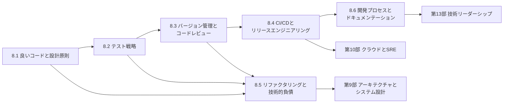

# 第8部 ソフトウェアエンジニアリング

> 動くコードを書けることと、変更しやすく壊れにくいソフトウェアを、チームで何年も届け続けられることの間には、大きな距離があります。この部では、その距離を埋める実践知——良い設計の原則、テストの戦略、バージョン管理とコードレビュー、CI/CD とリリース、リファクタリングと技術的負債の管理、開発プロセスとドキュメント——を、原理と実装の両面から身につけます。Git と同じハッシュを計算するオブジェクトストア、プロパティベーステストとミューテーションテストの道具、フィーチャーフラグの評価エンジン、無停止のスキーマ移行、ホットスポット分析、カンバンのシミュレーターを自分の手で作りながら、「なぜそうするのか」をデータと仕組みで説明できるようになることが目標です。

## この部で身につくこと

- **変更しやすく設計する**: 複雑さの正体（変更の増幅・認知負荷・未知の未知）を言葉にし、深いモジュール・情報隠蔽・依存の方向・関数型コアで設計を評価できる。SOLID・DRY・パターンを、効く場面と過剰適用の害を区別して使える。
- **自信を持って変更できるテストを作る**: 良いテストの条件とテストダブルの使い分けを理解し、テストの強さをミューテーションテストで、見落とした入力をプロパティベーステストで補える。不安定なテストと CI の時間を運用できる。
- **履歴と協働を仕組みから理解する**: Git の内部構造（内容で番地が決まるオブジェクトとコミットの DAG）と 3 方向マージを実装レベルで説明し、ブランチ戦略・コミットの作法・コードレビューの文化を設計できる。
- **速く安全に届ける**: デプロイメントパイプライン、依存関係の管理、カナリアとフィーチャーフラグ、拡張・縮小による無停止のスキーマ変更、ロールバックの設計、CI/CD のセキュリティを実践できる。速さと安定性が両立することを、データに基づいて説明できる。
- **負債を測って返す**: Git の履歴からホットスポットと変更の結合を測り、承認テストで振る舞いを固定してリファクタリングし、ストラングラー・フィグで段階的に移行できる。負債を事業の言葉で経営に説明できる。
- **予測可能に進め、知識を残す**: リトルの法則と待ち行列でフローを改善し、スループットから確率的に完了日を予測できる。テストできる要求、設計ドキュメント、ADR で判断の経緯を残し、日本の受託開発の契約とアジャイルの関係を踏まえてプロセスを設計できる。

## 章の一覧

| 章 | タイトル | 学習時間 | 主な演習 | キーワード |
|---|---|---|---|---|
| 8.1 | [良いコードと設計原則](01-code-quality-and-design/README.md) | 本文 4h ＋ 演習 6h | `pricing.py`（絡み合った価格計算エンジンを特性テストで守りながらリファクタリングし、新しいランクと時計の注入が必要なキャンペーンを追加）・`design_smells.py`（`ast` による関数の長さ・引数・入れ子・循環的複雑度の計測）、記述: 設計レビュー | 複雑さ, 深いモジュール, 情報隠蔽, 凝集度・結合度, SOLID, DRY, YAGNI, デザインパターン, DI, 関数型コア |
| 8.2 | [テスト戦略](02-testing/README.md) | 本文 4h ＋ 演習 7h | `minicheck.py`（生成器・性質の検査・反例の縮小）・`mutation.py`（`ast` による変異体の生成と変異スコア）・`fakes.py`（本物の SQLite と同じ契約を満たす偽物、偽の時計、スタブ兼スパイ）、記述: テスト戦略の立て直し | テストピラミッド, 4 本柱, テストダブル, TDD, カバレッジ, ミューテーションテスト, 不安定なテスト, プロパティベーステスト, 契約テスト |
| 8.3 | [バージョン管理とコードレビュー](03-version-control-and-review/README.md) | 本文 4h ＋ 演習 6h | `minigit.py`（Git と同じハッシュの blob・tree・commit、履歴の走査、マージベース）・`merge3.py`（LCS による diff3 形式の 3 方向マージ）、記述: レビューコメントと PR の分割 | 内容アドレス方式, ref, インデックス, DAG, 3 方向マージ, リベース, トランクベース開発, Conventional Commits, コードレビュー, 心理的安全性 |
| 8.4 | [CI/CDとリリースエンジニアリング](04-ci-cd-and-release/README.md) | 本文 4h ＋ 演習 7h | `flags.py`（フィーチャーフラグの評価）・`canary.py`（カナリアの統計的な判定）・`migrate.py`（マイグレーションの実行器と、拡張・縮小による無停止の列の改名）・`semver.py`（SemVer と範囲指定）、記述: 多通貨対応のリリース計画 | CI, 継続的デリバリー, パイプライン, ロックファイル, カナリア, フィーチャーフラグ, 拡張・縮小, DORA 指標, GitOps, OIDC |
| 8.5 | [リファクタリングと技術的負債](05-refactoring-and-tech-debt/README.md) | 本文 4h ＋ 演習 6h | `hotspots.py`（`git log --numstat` と `ast` によるホットスポット・変更の結合）・`strangler.py`（シャドー・カナリアを持つストラングラー・フィグのルーター）・`characterize.py`（承認テスト）、記述: 負債への投資の提案 | 技術的負債, 4 象限, ホットスポット, リファクタリング, レガシーコード, 継ぎ目, 承認テスト, ストラングラー・フィグ, リライト |
| 8.6 | [開発プロセスとドキュメンテーション](06-process-and-documentation/README.md) | 本文 4h ＋ 演習 5h | `forecast.py`（スループットからのモンテカルロ予測）・`kanban_sim.py`（WIP 制限のあるカンバンのシミュレーションとリトルの法則）・`adr_tool.py`（ADR の作成と置き換え）、記述: 設計ドキュメント | 不確実性のコーン, アジャイル, スクラム, カンバン, リトルの法則, リーン, 確率的予測, BDD, Diátaxis, ADR, 請負と準委任 |

合計の目安は、本文 約 24 時間、演習 約 37 時間です。コード演習は `python3 tools/check.py 8` でまとめてテストできます（章を指定するなら `python3 tools/check.py 8.3` のように）。

## 学習の進め方

### 章の順序と依存関係

- **8.1 → 8.2 → 8.3 → 8.4 → 8.5 → 8.6 の順が基本です**。8.2 のテスト容易性は 8.1 の依存性の注入と関数型コアを、8.5 のリファクタリングは 8.1 の設計の語彙と 8.2 の特性テストを前提にしています。8.4 のトランクベース開発とフィーチャーフラグは、8.3 のブランチ戦略とつながっています。
- **8.6 は比較的独立しています**。プロセスやドキュメントの課題を抱えているなら、先に読んでも構いません。演習 1・2 は [2.2 確率・統計と定量的思考](../02-math-and-algorithms/02-probability-statistics/README.md) の分布とリトルの法則を使います。
- **8.4 の演習 3（マイグレーション）** は、[6.1 リレーショナルモデルとSQL](../06-databases/01-relational-model-and-sql/README.md) の SQL の知識を前提にしています。第 6 部をまだ読んでいなければ、6.1 を先に読むと楽です。
- 第 1 部から順に進めているなら、第 8 部は第 3 部（プログラミング言語）の後であれば、第 4〜7 部と並行して進めて構いません（[全体の地図](../README.md)）。

### 演習の特徴

- **8.1 の演習 1・2 は、スタブが「動いている古いコード」です**。最初から特性テストが通り、新機能のテストだけが失敗します。リファクタリングの間は特性テストを緑に保ち、それから機能を追加してください。
- **本物との照合**: 8.3 の演習の期待値は、本物の Git（2.43）で作ったオブジェクトのハッシュと、`git merge-file --diff3` の出力で確かめてあります。8.2 の演習 3 は、同じ契約テストを本物の SQLite のリポジトリとあなたの偽物の両方に対して実行します。
- **データを使う演習**: 8.5 の演習 1 は本物の Git で作った 1 年分の履歴を、演習 3 は承認済みのゴールデンマスターのファイルを使います（`exercises/data/`）。完成したら、自分のリポジトリの履歴でも試してみましょう。

### つまずきやすい点

- **仕様の細部**: この部の演習は、実務の道具と同じく、細部の仕様（Git の tree の並び順、フラグのバケットの計算式、カンバンの 1 日の処理の順序など）がそのまま結果に効きます。docstring の仕様を最後まで読んでから実装し、テストが失敗したら、その期待値がどの仕様から来ているかを確かめてください。
- **統計の使い方**: 8.4 のカナリアの判定と 8.6 の予測では、「統計的に有意」と「実務上意味がある」の違い、確率つきの範囲の読み方がつまずきやすい点です。数値だけでなく、その数値で何を判断するのかを言葉にしてみましょう。
- **記述演習を省かない**: 設計レビュー、リリース計画、負債への投資の提案、設計ドキュメントは、この部の内容をチームと経営に伝える力を鍛えるものです。解答例を読む前に、自分の答えを書き切ってください。
- **経験者の進め方**: 理解度チェックに答えられる章は、★★★ の演習（8.1 の価格計算、8.2 の minicheck と mutation、8.3 の minigit と merge3、8.4 の migrate、8.6 の kanban_sim）だけ解いて先へ進んで構いません。CTO 準備トラックでは、8.4・8.5・8.6 の本文と「CTOの視点」、そして記述演習を重点的に扱ってください（[学習ガイド](../00-guide/README.md)）。

## 到達度チェック

この部を修了したと言えるのは、次のことができるときです。

- [ ] コードの問題点を「変更の増幅・認知負荷・未知の未知」の言葉で指摘し、深いモジュール・情報隠蔽・依存の方向の観点から改善案を示せる
- [ ] 特性テストで振る舞いを固定したうえで、絡み合ったコードを小さな手順でリファクタリングし、時計などの依存を注入できる設計にできる
- [ ] システムの性質に合わせてテストのポートフォリオを設計し、モックの使いすぎ・不安定なテスト・カバレッジの目標化の害を説明できる
- [ ] プロパティベーステストの縮小と、ミューテーションテストの変異スコアの仕組みを、自分の実装で説明できる
- [ ] Git の blob・tree・commit のハッシュを自分で計算でき、マージベースと 3 方向マージの仕組みから、衝突が起きる条件を説明できる
- [ ] ブランチ戦略・コミットの作法・コードレビューの基準とコメントの作法を、チームのガイドラインとして書ける
- [ ] デプロイメントパイプラインを設計し、カナリアの自動判定とフィーチャーフラグで段階的に公開し、拡張・縮小で無停止のスキーマ変更を計画できる
- [ ] CI/CD の依存関係とパイプラインを、SHA での固定・最小権限・OIDC で守れる
- [ ] Git の履歴からホットスポットと変更の結合を測り、技術的負債への投資を利子と元本の言葉で経営に提案できる
- [ ] リトルの法則で WIP 制限の効果を説明し、過去のスループットから確率つきの範囲で完了日を予測して伝えられる
- [ ] 設計ドキュメントと ADR で判断の経緯を残し、請負と準委任の違いを踏まえて委託開発の進め方を設計できる

## この部の推薦図書・教材

- John Ousterhout "A Philosophy of Software Design"（2nd ed., 2021）— 複雑さと深いモジュールの考え方。8.1 の中心的な参考書で、設計の判断を言葉にする力がつく。
- Martin Fowler "Refactoring"（2nd ed., 2018。邦訳『リファクタリング（第2版）』オーム社）と Michael Feathers "Working Effectively with Legacy Code"（2004。邦訳『レガシーコード改善ガイド』翔泳社）— 既存のコードを安全に変えるための 2 冊。8.1 と 8.5 の土台。
- Vladimir Khorikov "Unit Testing: Principles, Practices, and Patterns"（2020）— 良いテストの条件とテストダブルの使い方を、一貫した理屈で説明する。8.2 の主な参考書。
- Titus Winters ほか編 "Software Engineering at Google"（2020）— 大規模組織でのテスト・コードレビュー・依存関係・ビルドの実践。第 8 部のほぼすべての章に関係する。無料で公開されている版がある。
- Nicole Forsgren, Jez Humble, Gene Kim "Accelerate"（2018。邦訳『LeanとDevOpsの科学』インプレス）と Jez Humble, David Farley "Continuous Delivery"（2010）— デリバリー性能の研究と、デプロイメントパイプラインの原典。8.3・8.4 の背景。
- Scott Chacon, Ben Straub "Pro Git"（https://git-scm.com/book 、日本語訳あり）— Git の公式の解説書。第 10 章「Git の内側」は 8.3 の演習の良い補足。
- Adam Tornhill "Your Code as a Crime Scene"（2nd ed., 2024）— Git の履歴から技術的負債と組織の問題を読み解く方法。8.5 の演習 1 の元になった考え方。

## 次に進む

- [第9部 アーキテクチャとシステム設計](../09-architecture/README.md) — この部の設計原則（情報隠蔽・依存の方向・変更の結合）を、モジュールやサービスの境界、API、スケーラビリティの設計に広げます。8.5 のストラングラー・フィグや 8.4 の拡張・縮小は、アーキテクチャの移行でも中心的な技法になります。
- [第10部 クラウドとSRE](../10-cloud-and-sre/README.md) — 8.4 のデプロイ戦略とロールバックの先にある、信頼性の目標（SLO）、観測、インシデント対応を学びます。
- [第13部 技術リーダーシップ](../13-technical-leadership/README.md) — 8.3 のレビューの文化、8.5 の負債への投資、8.6 のプロセスと予測を、チームと組織を率いる立場から扱います。
