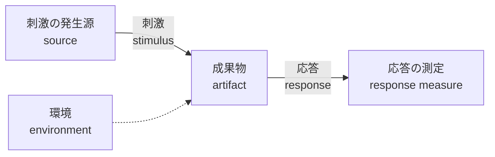
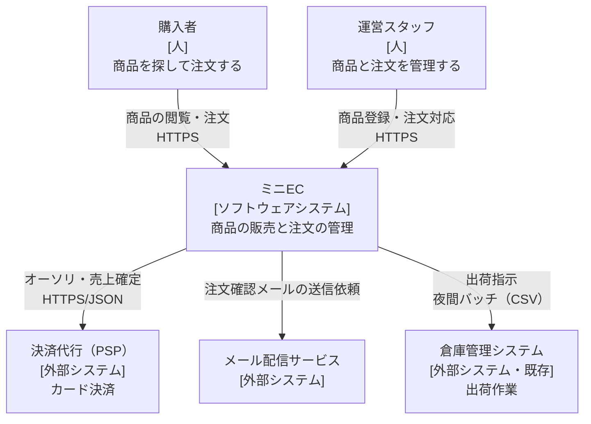
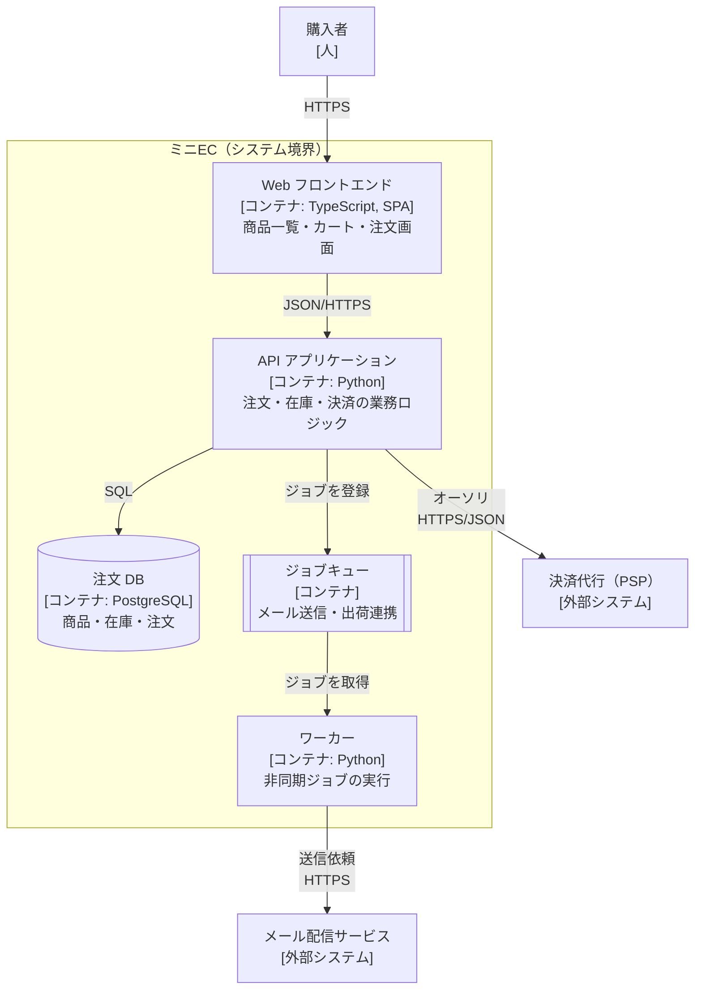
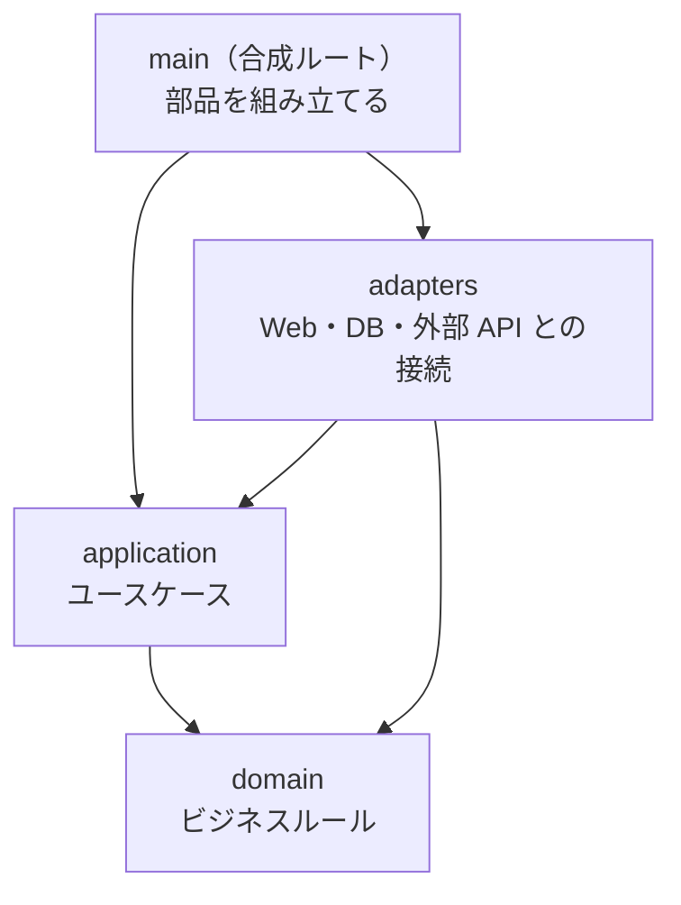
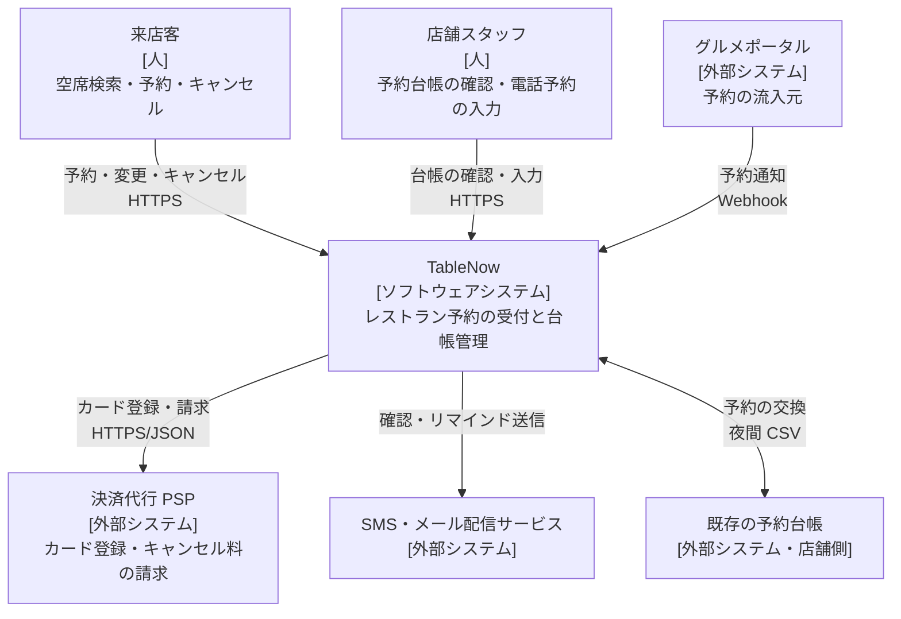
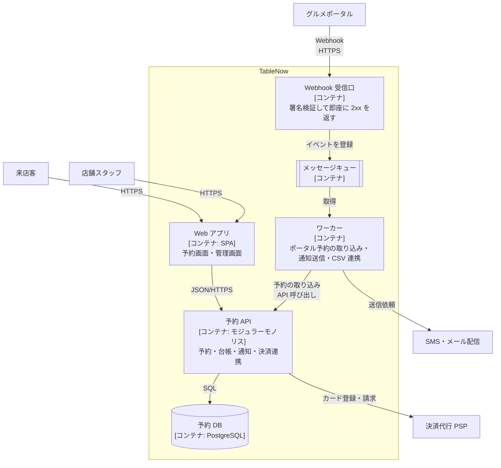

# 9.1 ソフトウェアアーキテクチャの基礎

> 「アーキテクチャ」という言葉は、図の上の箱と線のことだと思われがちです。しかし本当に大切なのは、**後から変えるのが高くつく決定を、理由とともに下し、伝え、守り続けること**です。この章では、品質特性とトレードオフで設計を語る方法、決定を ADR に記録する方法、C4 モデルで構造を伝える方法、そして依存関係のルールを自動テスト（適応度関数）で守る方法を身につけます。

| 項目 | 内容 |
|---|---|
| 学習時間の目安 | 本文 3h ＋ 演習 4h |
| 前提となる章 | [8.1 良いコードと設計原則](../../08-software-engineering/01-code-quality-and-design/README.md)、[8.6 開発プロセスとドキュメンテーション](../../08-software-engineering/06-process-and-documentation/README.md) |
| 演習 | [exercises/](exercises/)（Python）＋ 記述演習 |
| キーワード | 品質特性, ISO/IEC 25010, 品質特性シナリオ, トレードオフ, ADR, ATAM, 適応度関数, C4 モデル, 依存関係ルール, 可逆な決定, コンウェイの法則 |

## この章のゴール

- [ ] アーキテクチャを「変更コストの高い重要な決定の集まり」として説明し、細部の設計と区別できる
- [ ] 「速い」「落ちない」といった曖昧な要望を、測定可能な品質特性シナリオ（6 要素）に書き直せる
- [ ] 選択肢のトレードオフを比較し、決定の背景・理由・結果を ADR として記録できる
- [ ] C4 モデルで、システムコンテキスト図とコンテナ図を目的に合った粒度で描ける
- [ ] レイヤーの依存ルールと循環依存の検査を、CI で動く適応度関数として実装できる
- [ ] 決定の可逆性を見極め、不可逆な決定ほど慎重に、可逆な決定ほど素早く進められる
- [ ] 概算見積もり（back-of-the-envelope）で、設計案が要求の桁に合っているかをすぐに確かめられる

## なぜ学ぶのか

アーキテクチャの失敗は、書いた瞬間には見えません。数か月から数年後に「変更がやたらと遅い」「一部の障害が全体に広がる」「誰もこの構造の理由を説明できない」という形で表面化し、そのときには直すコストが大きく膨らんでいます。

- **侵食（erosion）は放っておくと必ず起きる**: Shopify は 2019 年のエンジニアリングブログで、1,000 人を超える開発者が 10 年以上手を入れてきた Ruby on Rails のモノリスについて、機能の間に境界がなかったため、一見無害な変更が無関係なテストの失敗を連鎖的に引き起こしたり、新しい開発者が注文や決済の仕組みまで理解しないと仕事ができなかったりしたと説明しています。同社はモノリスをコンポーネントに分割し、境界違反を追跡する社内ツールを作り、2020 年には境界を静的に検査するツール Packwerk をオープンソースで公開しました。**ルールは書くだけでは守られず、自動で検査して初めて守られる**という教訓です（[9.2](../02-architecture-styles/README.md) でも扱います）。
- **品質特性の優先順位は、事業とともに変わる**: 2023 年、Amazon Prime Video のエンジニアは、映像品質を監視するサービスを、AWS Step Functions で連携させた分散コンポーネントから単一のプロセスにまとめ直し、インフラコストを 90% 以上削減したと報告しました。規模が当初の想定を超えたことで、最適な構造が変わったのです。どの構造が「正しい」かは、品質特性とその重み付けで決まります（詳しくは [9.2 アーキテクチャスタイル](../02-architecture-styles/README.md)）。
- **理由を失った構造は、誰も変えられなくなる**: 「なぜこのサービスは同期呼び出しなのか」「なぜこのテーブルだけ別の DB にあるのか」。決定の理由が記録されていなければ、後任者はそれを壊してよいのか判断できず、恐る恐る周りに継ぎ足すしかありません。ADR（アーキテクチャ決定記録）はこの問題への、安価で効果の大きい対策です。

アーキテクチャの知識は、アーキテクトという肩書の人だけのものではありません。設計レビューで的確な質問をし、自分の提案をトレードオフの言葉で説明できることは、シニアエンジニア以上のすべての人に求められる能力です。

## 1. アーキテクチャとは何か

### 1.1 「重要なもの」と「変更のコスト」

アーキテクチャの定義は無数にありますが、実務で役に立つのは次の 2 つの見方です。

- Martin Fowler は IEEE Software のコラム "Who Needs an Architect?"（2003 年）で、Ralph Johnson の言葉を紹介しています。アーキテクチャとは「重要なもの。それが何であれ（the important stuff, whatever that is）」であり、「熟練した開発者たちが共有している、システム設計についての理解」である、と。さらに Johnson は、アーキテクチャを「プロジェクトの初期に下す必要がある決定」ではなく「**プロジェクトの初期に正しく下せていたらよかったと思う決定**」だと言い換えています。
- Grady Booch は「すべてのアーキテクチャは設計だが、すべての設計がアーキテクチャではない。アーキテクチャは、システムを形作る重要な設計上の決定であり、その重要さは**変更のコスト**で測られる」と述べています。

2 つの見方に共通するのは、**アーキテクチャは図ではなく決定の集まりであり、その境界は「後から変えるのがどれだけ高くつくか」で引かれる**という点です。

### 1.2 アーキテクチャの決定と、そうでない決定

同じ「設計」でも、変更コストには桁違いの差があります。

| 決定 | 後から変えるコスト | アーキテクチャか |
|---|---|---|
| 関数名・クラスの分け方 | IDE のリファクタリングで数分 | いいえ |
| 1 つのモジュール内部のデータ構造 | そのモジュールの書き直しで数日 | 通常はいいえ |
| モジュール間の依存の向き・境界 | 境界をまたぐ呼び出しの総点検で数週間〜 | **はい** |
| データストアの種類（RDB か文書 DB か） | データ移行を伴い数か月 | **はい** |
| 同期呼び出しか非同期メッセージか | 障害時の振る舞い・一貫性モデルが変わる | **はい** |
| 公開 API の形式・ID の型 | 外部の利用者を巻き込むので、自社だけでは決められない | **はい** |
| マルチテナントの分離方式 | 全顧客のデータ移行とセキュリティ再評価 | **はい** |
| デプロイの単位（1 つか、サービスごとか） | ビルド・運用・組織の変更を伴う | **はい** |

「アーキテクチャか否か」は技術の種類では決まりません。例えばログの形式は普通は細部ですが、監査ログとして法的な保存義務があり、外部の監査人がその形式に依存しているなら、アーキテクチャ上重要な決定になります。

### 1.3 アーキテクトの役割

アーキテクトは「図を描く人」ではなく、次の 3 つに責任を持つ役割です。肩書ではなく役割なので、小さな組織ではテックリードや CTO が兼ねます。

| 役割 | 具体的な仕事 |
|---|---|
| **決める** | 品質特性を事業側と合意し、選択肢を比較して、重要な決定を下す（または決定を促す） |
| **伝える** | 決定とその理由を、図と文書（ADR）で、開発者・経営陣・他チームのそれぞれに分かる言葉で説明する |
| **守り、進化させる** | 実装が決定から逸脱していないかを確認し（適応度関数・レビュー）、前提が変わったら決定を見直す |

2 つ目の「伝える」について、Gregor Hohpe は著書 "The Software Architect Elevator"（2020 年）で、アーキテクトは経営層のフロア（戦略の言葉）と機械室（技術の言葉）の間をエレベーターのように行き来する人だと表現しています。技術的に正しい決定でも、事業の言葉で説明できなければ予算も人もつきません。

アーキテクトがコードから離れすぎると、決定が現実から乖離します。「象牙の塔のアーキテクト」を避けるために、実装のレビューに参加する、プロトタイプを自分で書く、障害対応の振り返りに出る、といった形で現場との接点を保つのが健全です。

## 2. 品質特性 — 「良いシステム」を定義する

### 2.1 機能と品質特性

要求は大きく 2 種類に分けられます。

- **機能要件**: システムが「何をするか」。例: 「利用者は注文をキャンセルできる」。
- **品質特性（quality attributes）**: システムが「どれくらいうまくやるか」。例: 性能、可用性、セキュリティ、変更容易性。**非機能要件** とも呼ばれ、Richards と Ford の『ソフトウェアアーキテクチャの基礎』では **アーキテクチャ特性** と呼ばれます。

アーキテクチャを決めるのは、主に後者です。「注文をキャンセルできる」はどんな構造でも実装できますが、「ピーク時に 1 秒あたり 5,000 件の注文を 200 ミリ秒以内で受け付け、1 つのデータセンターが止まっても受け付けを続ける」は、構造を選びます。

### 2.2 品質特性の参照モデル: ISO/IEC 25010

品質特性の抜け漏れを防ぐチェックリストとして、国際規格 **ISO/IEC 25010**（SQuaRE シリーズの製品品質モデル）がよく使われます。2011 年版は次の 8 つの品質特性を定めており、日本では JIS X 25010:2013 として規格化されました。下の表はこの版にもとづきます（2023 年の改訂は表の後で説明します）。

| 品質特性（JIS X 25010:2013 の訳語） | 主な副特性の例 | 問いの例 |
|---|---|---|
| 機能適合性 | 機能完全性、機能正確性 | 必要な機能が正しく揃っているか |
| 性能効率性 | 時間効率性、資源効率性、容量満足性 | 応答時間・スループット・資源使用量は十分か |
| 互換性 | 共存性、相互運用性 | 他のシステムと情報を交換し、同じ環境で共存できるか |
| 使用性 | 習得性、運用操作性、アクセシビリティ | 利用者が効果的に使えるか |
| 信頼性 | 成熟性、可用性、障害許容性、回復性 | 止まらないか、止まってもすぐ戻るか |
| セキュリティ | 機密性、インテグリティ、否認防止性、責任追跡性、真正性 | 権限のない利用・改ざんを防げるか |
| 保守性 | モジュール性、再利用性、解析性、修正性、試験性 | 安全に素早く変更できるか |
| 移植性 | 適応性、設置性、置換性 | 別の環境へ移せるか |

この規格は 2023 年に改訂され（ISO/IEC 25010:2023）、**安全性（safety）** が 9 つ目の品質特性として加わったほか、使用性が「インタラクション容易性（interaction capability）」に、移植性が「柔軟性（flexibility）」に置き換えられ、柔軟性の副特性に **拡張性（scalability）** が、セキュリティの副特性に耐攻撃性（resistance）が加わるなどの変更がありました。利用時の品質モデルは別の規格（ISO/IEC 25019）に分かれています。JIS もこれに合わせて 2025 年 12 月に JIS X 25010:2025 として改正されました（この段落の訳語は JIS X 25010:2025 に合わせています）。規格の構成や訳語は今後も変わりうるので、正式な定義が必要なときは最新版を一次資料で確認してください（2026 年時点の情報）。

日本のシステム開発の現場、特に発注者と受注者が分かれる受託開発では、IPA（情報処理推進機構）が公開している **非機能要求グレード**（2018 年版）もよく使われます。「可用性」「性能・拡張性」「運用・保守性」「移行性」「セキュリティ」「システム環境・エコロジー」の 6 つの大項目について、要求のレベルを段階的に選べる表形式になっており、「非機能要件を聞き漏らさない」「発注者と受注者で認識を揃える」ための道具として実用的です。

これらのモデルは **チェックリストであって、優先順位は教えてくれません**。すべての特性を最高水準にすることは不可能であり（3 章）、システムごとに「上位 3 つ」を決めることがアーキテクチャの出発点です。

### 2.3 品質特性シナリオ — 曖昧な要望を測定可能にする

「高可用性であること」「レスポンスが速いこと」という要求は、検証できません。何秒なら速いのか、何が起きたときに何をすれば可用なのかが書かれていないからです。カーネギーメロン大学ソフトウェア工学研究所（SEI）の Bass・Clements・Kazman は、品質特性を次の 6 要素からなる **品質特性シナリオ（quality attribute scenario）** で書くことを提唱しました。



| 要素 | 意味 | 可用性の例 | 変更容易性の例 |
|---|---|---|---|
| 刺激の発生源 | 誰・何が引き起こすか | ハードウェア障害 | 事業部門 |
| 刺激 | 何が起きるか | 注文 DB のプライマリが突然停止する | QR コード決済を追加したい |
| 環境 | そのときの状況 | 平日夜のピーク（通常の 3 倍の負荷） | 設計・開発時 |
| 成果物 | 影響を受ける部分 | 注文サービスとそのデータベース | 決済モジュール |
| 応答 | システム（や組織）がどう振る舞うべきか | レプリカへ自動でフェイルオーバーし、確定済みの注文を失わない | 既存の決済コードに手を入れず、アダプタの追加だけで対応する |
| 応答の測定 | 合否をどう判定するか | 60 秒以内に書き込みを再開、確定済み注文の損失 0 件 | 1 人が 5 人日以内に本番リリースでき、既存の決済の回帰テストがすべて通る |

シナリオにすると、次の 3 つの効果があります。

1. **検証できる**: 応答の測定が数値なので、障害試験・負荷試験・見積もりで合否を判定できる。
2. **コストが見える**: 「60 秒以内」と「5 分以内」では必要な仕組み（自動フェイルオーバーの有無、待機系の常時稼働）が違い、費用も違う。数値を議論することで、事業側とトレードオフを話し合える。
3. **アーキテクチャを選べる**: 「アダプタの追加だけで対応」という応答は、決済をポート（インターフェース）の背後に隠す構造（[9.2](../02-architecture-styles/README.md) のヘキサゴナルアーキテクチャ）を要求している。

性能のシナリオは「通常時の負荷 500 リクエスト/秒で、注文 API の応答時間の 99 パーセンタイル（p99）が 300 ミリ秒以内」のように、**負荷の条件とパーセンタイル** を必ずセットで書きます。平均値だけの要求は、遅い一部の利用者を隠してしまうからです（[9.5](../05-scalability-and-performance/README.md) で詳しく扱います）。

### 2.4 アーキテクチャ上重要な要求を見つける

すべての要求がアーキテクチャを左右するわけではありません。構造に大きな影響を与える要求を **アーキテクチャ上重要な要求（ASR: architecturally significant requirements）** と呼びます。見つけ方の定番が、SEI の評価手法 ATAM（7.1 節）で使う **ユーティリティツリー** です。品質特性を根から枝分かれさせ、葉に具体的なシナリオを書き、各シナリオに「事業上の重要度」と「実現の難しさ」を H（高）・M（中）・L（低）で付けます。

```text
ユーティリティ
├── 性能
│   └── (H, M) セール開始時の 5 分間、注文 API は p99 500ms 以内で 2,000 件/秒を処理する
├── 可用性
│   ├── (H, H) 1 つのアベイラビリティゾーンが停止しても、注文の受け付けを 5 分以内に再開する
│   └── (M, L) 管理画面は平日日中に 99.5% 稼働していればよい
├── セキュリティ
│   └── (H, M) 他の店舗の注文データを、API 経由で一切参照できない
└── 変更容易性
    └── (M, H) 新しい決済手段を、既存コードを変更せずに追加できる
```

**(H, H)** のシナリオ（重要で、しかも難しい）が、アーキテクチャの中心課題です。逆に (M, L) の管理画面の可用性のようなものは、普通に作れば満たせるので、アーキテクチャの議論に時間を使う必要はありません。

## 3. トレードオフ — すべては何かとの交換

### 3.1 典型的なトレードオフ

Richards と Ford は「ソフトウェアアーキテクチャの第一法則」として「**ソフトウェアアーキテクチャのすべてはトレードオフである**」を挙げ、第二法則として「**『どうやるか』より『なぜそうするか』の方が重要である**」を挙げています。ある品質特性を高める選択は、ほぼ必ず別の何かを犠牲にします。

| 高めたいもの | 代償になりやすいもの | 例 |
|---|---|---|
| 可用性 | コスト、一貫性 | 複数リージョンに配置すると費用が増え、リージョン間のデータの一貫性が弱まる（[7.2](../../07-distributed-systems/02-replication-and-consistency/README.md)） |
| 性能（低レイテンシ） | 一貫性、変更容易性 | キャッシュを増やすと古いデータを返しうる。最適化したコードは読みにくい |
| スケーラビリティ | 単純さ、一貫性 | 分割（シャーディング）すると、横断的なクエリやトランザクションが難しくなる |
| セキュリティ | 使用性、性能 | 多要素認証は手間が増える。暗号化や検査は処理時間を増やす |
| 変更容易性（抽象化） | 性能、理解のしやすさ | 間接層が増えるほど、処理の流れを追うのが難しくなる |
| 独立したデプロイ（サービス分割） | 運用コスト、一貫性 | サービス間の通信・監視・データの整合性という新しい問題を抱える |
| 市場投入の速さ | 長期の保守性 | 技術的負債を意図的に借りる（[8.5](../../08-software-engineering/05-refactoring-and-tech-debt/README.md)） |

**「ベストプラクティス」という言葉には注意が必要です**。それは「ある文脈での、ある重み付けにおける良い選択」であって、文脈を離れても正しいとは限りません。設計案を評価するときは、常に「何を得て、何を支払うのか」「それはこのシステムの上位 3 つの品質特性に合っているか」を問います。

### 3.2 感度点とトレードオフ点

ATAM では、設計上の判断を次の 2 つの言葉で分析します。

- **感度点（sensitivity point）**: ある品質特性が、特定の設計パラメータに強く依存している箇所。例: 「注文 API の応答時間は、在庫サービスへの同期呼び出しのタイムアウト値に強く依存する」。
- **トレードオフ点（tradeoff point）**: 複数の品質特性の感度点になっている箇所。例: 「在庫の確認を同期で行うか非同期で行うか」は、性能（応答時間）・可用性（在庫サービス停止時に注文を受けられるか）・一貫性（売り越しの可能性）の全部に効く。

トレードオフ点は、議論と記録（ADR）が最も必要な場所です。

### 3.3 可逆な決定と不可逆な決定

すべての決定を同じ慎重さで扱うと、組織は動けなくなります。Amazon の Jeff Bezos は 2015 年度の株主への手紙（2016 年公表）で、決定を 2 種類に分けました。

- **タイプ 1（一方通行のドア）**: 結果が重大で、元に戻せない、またはほぼ戻せない決定。慎重に、時間をかけて決める。
- **タイプ 2（双方向のドア）**: 変更可能で、元に戻せる決定。うまくいかなければ戻ればよいので、少人数で素早く決める。

そして、多くの組織が大きくなるにつれて、タイプ 2 の決定にまでタイプ 1 の重いプロセスを適用してしまい、遅くなると指摘しています。ソフトウェアの決定に当てはめると次のようになります。

| 一方通行に近い（慎重に） | 双方向に近い（素早く） |
|---|---|
| 公開 API の形式、外部に渡す ID の型 | 内部のライブラリの選択（境界の内側に閉じていれば） |
| 主要データストアの種類、データモデルの根幹 | キャッシュの導入・撤去 |
| マルチテナントの分離方式 | 機能フラグで隠せる新機能 |
| クラウド事業者固有のサービスへの深い依存 | 監視ツール・CI ツールの選択 |
| サービス境界（分けた後に統合するのは大変） | モジュール内部の構造 |

アーキテクトの腕の見せどころは、**一方通行のドアを双方向のドアに変える工夫** です。インターフェース（ポート）の背後に技術を隠す、機能フラグで段階的に切り替える、新旧を並行稼働させて少しずつ移行する（ストラングラーフィグ、[8.5](../../08-software-engineering/05-refactoring-and-tech-debt/README.md)）、といった手段で、決定を遅らせたり、元に戻しやすくしたりできます。リーン開発でいう **最後の責任ある瞬間（last responsible moment）**、つまり「これ以上遅らせると選択肢が失われる時点」まで不可逆な決定を先延ばしし、その間に情報を集めるのが基本戦略です。

### 3.4 概算見積もりで桁を確かめる

アーキテクチャの議論は、しばしば「そもそもそんな規模になるのか」を確かめないまま進みます。数分でできる **概算見積もり（back-of-the-envelope estimation）** で、要求の桁を先に押さえましょう。

```python
dau = 1_000_000             # 1 日のアクティブユーザー
req_per_user = 20           # 1 人あたり 1 日のリクエスト数
avg_qps = dau * req_per_user / 86_400
peak_qps = avg_qps * 3      # ピークは平均の数倍（利用パターンで決まる）
print(f"平均 {avg_qps:,.0f} QPS / ピーク {peak_qps:,.0f} QPS")

orders_per_day = 50_000
bytes_per_order = 2_000     # 1 件あたり 2KB（行・インデックス込みの概算）
print(f"注文データ: {orders_per_day * bytes_per_order * 365 / 1e9:.1f} GB/年")
```

```text
平均 231 QPS / ピーク 694 QPS
注文データ: 36.5 GB/年
```

100 万 DAU のサービスでも、ピーク 700 QPS・年 36.5GB 程度なら、適切にインデックスを張った 1 台の RDB とアプリケーションサーバー数台で十分に処理できる桁です。「大規模だから NoSQL とマイクロサービスが必要」という主張は、この計算の前では根拠を失います。逆に、桁が 2 つ大きければ構造の検討が必要です。見積もりの方法と、Little の法則などのモデルは [9.5](../05-scalability-and-performance/README.md) で詳しく扱います。

## 4. 決定を記録する — ADR

### 4.1 ADR の構造

**ADR（Architecture Decision Record、アーキテクチャ決定記録）** は、1 つの重要な決定を 1 つの短い文書に記録する方法です。Michael Nygard が 2011 年のブログ記事 "Documenting Architecture Decisions" で提案した形式が広く使われています。

| 節 | 書くこと |
|---|---|
| タイトル | 決定を短い名詞句で。連番を付ける（例: ADR-0007） |
| ステータス | 提案中 / 承認 / 却下 / 廃止 / ADR-0012 により置き換え |
| コンテキスト | 決定が必要になった背景。制約、品質特性の要求、検討した選択肢 |
| 決定 | 「〜する」と能動態で書いた決定の内容 |
| 結果 | 決定によって何が良くなり、何が悪くなり、何が新たに必要になるか |

実例を見てみましょう。

```markdown
# ADR-0007: 注文データの保存に PostgreSQL を使う

## ステータス
承認（2026-04-10）

## コンテキスト
- 注文・在庫・決済の記録には、複数の行をまたぐ一貫性（在庫の引き当てと注文の確定を同時に行う）が必要。
- 見積もり: ピーク 700 QPS、年間 40GB 程度の増加（3.4 節の計算）。
- チームは PostgreSQL の運用経験が豊富。マネージドサービスで運用負荷を抑えられる。
- 検討した選択肢: (a) PostgreSQL、(b) ドキュメント DB、(c) キーバリューストア＋アプリ側での整合性確保。

## 決定
注文サービスの主データストアとしてマネージドの PostgreSQL を使う。
在庫の引き当てと注文の確定は 1 つのトランザクションで行う。

## 結果
- 良い点: トランザクションで整合性を保証でき、アプリ側の補償処理が不要になる。
- 悪い点: 書き込みが 1 台のプライマリに集中する。書き込みが大きく増えたら（下の「再検討の
  きっかけ」）、読み取りレプリカ・パーティショニング・サービス分割を再検討する必要がある。
- 必要になること: スキーマ移行の手順（8.4）と、フェイルオーバー試験を四半期ごとに行う。
- 再検討のきっかけ: 書き込みがピーク時に 3,000 QPS を超えたとき。
```

最後の「再検討のきっかけ」は Nygard の原型にはありませんが、実務では有用です。前提が崩れたときに、決定を見直すべきだと誰でも気づけるからです。

### 4.2 ADR を機能させる運用

- **コードと同じリポジトリに置く**（例: `docs/adr/0007-use-postgresql-for-orders.md`）。プルリクエストでレビューし、コードの変更と一緒に履歴に残す。
- **承認された ADR は書き換えない**。決定が変わったら新しい ADR を書き、古い方のステータスを「ADR-0012 により置き換え」にする。変更の経緯そのものが、将来の判断材料になる。
- **却下した選択肢と、その理由を書く**。「なぜ X を使わなかったのか」は、半年後に必ず誰かが聞く質問である。
- **短く保つ**。1〜2 ページで読める長さにする。長い調査結果は別の文書（デザインドック）に置いてリンクする。
- **書く対象を絞る**。3.3 節の一方通行に近い決定、チームをまたぐ決定、「なぜ？」と聞かれそうな決定だけでよい。

ADR の書式には Nygard 形式のほか、選択肢の比較を構造化した MADR（Markdown Architectural Decision Records）などの派生形があります。形式より、**継続して書かれ、読まれること** の方がはるかに重要です。ADR が記録するのは決定そのものであり、決定に至るまでの提案と議論はデザインドックや RFC で行います（[8.6](../../08-software-engineering/06-process-and-documentation/README.md)、[13.2](../../13-technical-leadership/02-technical-decisions/README.md)）。

## 5. アーキテクチャを図で伝える — C4 モデル

### 5.1 なぜ「箱と線」では伝わらないのか

ホワイトボードに描かれた箱と線の図は、描いた本人以外には意味が曖昧です。箱はプロセスなのか、クラスなのか、チームなのか。線は呼び出しなのか、データの流れなのか、依存なのか。図の読み手によって解釈が違えば、議論は噛み合いません。

Simon Brown が提唱した **C4 モデル** は、地図の縮尺のように **抽象度の異なる 4 つの図** を使い分けることで、この問題を解決します。

| レベル | 図 | 何を示すか | 主な読み手 |
|---|---|---|---|
| 1 | システムコンテキスト図 | 対象システムと、それを使う人・連携する外部システム | 全員（非エンジニアを含む） |
| 2 | コンテナ図 | システムを構成する、個別に実行・デプロイされる単位（Web アプリ、API、DB、キューなど）と、その間の通信 | 開発者・運用者・アーキテクト |
| 3 | コンポーネント図 | 1 つのコンテナの内部の主要な部品と責務 | そのコンテナの開発者 |
| 4 | コード図 | クラス図など | 必要なときだけ（IDE で自動生成するのが普通） |

C4 の「コンテナ」は Docker のコンテナのことではなく、「システムが動くために実行されている必要がある、アプリケーションまたはデータストア」を指します。この用語の衝突は混乱の元なので、図の凡例で明示しておくとよいでしょう。

### 5.2 例: 小さな EC サイト

システムコンテキスト図（レベル 1）は、システムを 1 つの箱として、その周りだけを描きます。



コンテナ図（レベル 2）では、ミニEC の内側を開きます。



この 2 枚だけで、「決済は同期で、メールは非同期」「DB は 1 つ」「倉庫とは夜間バッチ」といった、アーキテクチャ上の重要な決定が読み取れます。

### 5.3 作図の実践ルール

- **1 枚の図には 1 つの目的と 1 つの抽象度**。コンテキスト図にクラスを描かない。
- **すべての箱に種類と責務を書く**（`[コンテナ: PostgreSQL]` のように技術も添える）。
- **すべての矢印にラベルを付ける**。何を・どのプロトコルで・同期か非同期か。矢印の向きは「依存または要求の向き」に統一し、凡例に書く。
- **図をコードで書き、リポジトリに置く**（Mermaid、PlantUML、Structurizr DSL など）。画像ファイルだけの図は更新されずに腐る。Mermaid には C4 専用の記法もありますが、実験的な機能と位置付けられているため（2026 年時点。公式ドキュメントで確認してください）、上の例のように flowchart で描くのが無難です。
- **静的な構造図だけで終わらせない**。重要なユースケースは、呼び出しの順序を示すシーケンス図（C4 では動的図）で補う。障害時の振る舞いやデプロイ構成（どのリージョン・ゾーンに何が何台あるか）はデプロイ図で示す。

## 6. 構造を守る — 依存関係のルール

### 6.1 レイヤーと依存の向き

最も基本的な構造のルールは「**依存の向き**」です。典型的な 4 層の構造を考えます。



ルールは「矢印の向きにしか依存してはいけない」です。domain（ビジネスルール）は、Web フレームワークやデータベースのドライバを import してはいけません。そうしておけば、DB を替えてもビジネスルールは無傷で、ビジネスルールのテストに DB は要りません。domain から DB を使いたいときは、domain 側にインターフェース（リポジトリ）を定義し、adapters がそれを実装します。これが **依存関係逆転の原則（DIP）** であり（[8.1](../../08-software-engineering/01-code-quality-and-design/README.md)）、9.2 のヘキサゴナルアーキテクチャの核心です。

レイヤーには 2 つの流儀があります。

- **厳格なレイヤー（strict / closed layers）**: 直下のレイヤーにしか依存できない。変更の影響範囲を狭められるが、単に値を受け渡すだけの層が増えがち。
- **緩いレイヤー（relaxed / open layers）**: 下にあるどのレイヤーにも依存できる。上の図の adapters → domain がこれにあたる。

どちらを選ぶにせよ、**ルールを明文化し、機械で検査できる形にする** ことが大切です。

### 6.2 安定度: どのモジュールに依存すべきか

Robert C. Martin は、モジュールの **不安定度（instability）** を、そのモジュールが依存している数 Ce（外向きの結合）と、そのモジュールに依存している数 Ca（内向きの結合）から `I = Ce / (Ca + Ce)` と定義しました。I が 0 に近いほど、多くのモジュールから頼られていて自分は何にも頼らない「安定した」モジュールです。

```python
graph = {
    "domain": set(),
    "application": {"domain"},
    "adapters": {"application", "domain"},
    "main": {"adapters", "application", "domain"},
}
for m in graph:
    ce = len(graph[m])                              # 外向きの依存（efferent coupling）
    ca = sum(m in deps for deps in graph.values())  # 内向きの依存（afferent coupling）
    print(f"{m:12s} Ca={ca} Ce={ce} I={ce / (ca + ce):.2f}")
```

```text
domain       Ca=3 Ce=0 I=0.00
application  Ca=2 Ce=1 I=0.33
adapters     Ca=1 Ce=2 I=0.67
main         Ca=0 Ce=3 I=1.00
```

**安定依存の原則（SDP）**: 依存は、より安定した方向（I が小さい方）に向かうべきです。変わりやすいもの（UI、外部サービスとの接続）が、変わりにくいもの（ビジネスルール）に依存する形なら、変わりやすいものを変えても被害は広がりません。逆向きの依存が 1 本でもあると、安定しているはずのモジュールが、変わりやすいものに引きずられます。

### 6.3 循環依存はなぜ悪いのか

モジュール A が B に依存し、B が A に依存している状態を **循環依存** と呼びます。

- **分けられない**: A と B は事実上 1 つのモジュールになり、片方だけを別のサービスやライブラリに切り出せない。
- **変更が波及する**: どちらを変えても両方の再テスト・再ビルドが必要になる。循環が長いほど、無関係に見えるモジュールまで巻き込まれる。
- **理解しにくい**: 「どちらが先か」がないので、初期化の順序や責務の主従が曖昧になる。Python では import の順序によって、属性が未定義のまま参照されるエラーも起きる。

循環を断つ方法は主に 3 つです。(1) 共通部分を第 3 のモジュールに抜き出す、(2) 片方の依存をインターフェースで逆転させる（DIP）、(3) そもそも 1 つにすべき責務なら統合する。

Python の標準ライブラリにも、循環を見つける道具があります。

```python
from graphlib import TopologicalSorter, CycleError

deps = {"order": {"customer", "money"}, "customer": {"order"}, "money": set()}
try:
    print(list(TopologicalSorter(deps).static_order()))
except CycleError as e:
    print("循環を検出:", e.args[1])
```

```text
循環を検出: ['order', 'customer', 'order']
```

`graphlib` は循環を 1 つ見つけると止まります。すべての循環（強連結成分）を列挙するには、演習 5 で実装する Tarjan のアルゴリズムのような方法が必要です（グラフのアルゴリズムは [2.5](../../02-math-and-algorithms/05-trees-heaps-graphs/README.md) を参照）。

## 7. 評価と進化 — ATAM・設計レビュー・適応度関数

### 7.1 ATAM と、その軽量版

**ATAM（Architecture Tradeoff Analysis Method）** は SEI が開発した、アーキテクチャをシナリオに照らして評価する手法です。本来は評価チームと関係者が数日かけて行う重い手法ですが、骨格は小さなチームでも使えます。半日で行う軽量版の例を示します。

| 手順 | 内容 | 時間の目安 |
|---|---|---|
| 1. 事業上の目的を聞く | プロダクト責任者が、ビジネスの目標・制約・上位の品質特性を説明する | 20 分 |
| 2. アーキテクチャを説明する | 設計者が C4 のコンテキスト図・コンテナ図と、主要な決定（ADR）を説明する | 30 分 |
| 3. ユーティリティツリーを作る | 品質特性シナリオを出し合い、(重要度, 難しさ) で優先順位を付ける | 45 分 |
| 4. 上位シナリオで分析する | (H, H) のシナリオごとに「この設計でどう満たすか」をたどり、リスク・非リスク・感度点・トレードオフ点を記録する | 90 分 |
| 5. 結果をまとめる | リスクをテーマ（例: 「外部依存の障害に弱い」）にまとめ、対応の担当と期限を決める | 30 分 |

ATAM の成果物で最も価値があるのは **リスク** の一覧です。「在庫サービスが 3 秒以上遅延すると、注文 API のスレッドが枯渇して全体が止まる」のように、具体的なシナリオと結びついたリスクは、そのまま改善のバックログになります。

### 7.2 設計レビューで問うべきこと

ATAM ほど形式張らない日常の設計レビューでも、問いの型は同じです。

- この設計の **上位 3 つの品質特性** は何か。それはシナリオとして測定可能に書かれているか。
- **最も不可逆な決定** はどれか。それを後から変えるとしたら、どれくらいのコストがかかるか。
- **検討して捨てた選択肢** は何か。なぜ捨てたのか。
- 依存先が **遅くなったとき・止まったとき・同じ要求を 2 回送ってきたとき**、何が起きるか。
- 規模が **10 倍** になったら、最初に壊れるのはどこか。
- この構造は、**チームの構造** と合っているか（8 章）。

設計レビューの進め方と、意思決定のプロセスについては [13.2](../../13-technical-leadership/02-technical-decisions/README.md) で詳しく扱います。

### 7.3 適応度関数 — アーキテクチャを自動テストする

Neal Ford、Rebecca Parsons、Patrick Kua は『進化的アーキテクチャ』（原書 2017 年）で、**アーキテクチャの適応度関数（fitness function）** という考え方を提案しました。ある品質特性（アーキテクチャ特性）がどれだけ満たされているかを、客観的に評価する仕組みのことです。遺伝的アルゴリズムで解の良さを測る関数から借りた言葉です。

| 品質特性 | 適応度関数の例 | いつ動かすか |
|---|---|---|
| 保守性（構造） | レイヤーの依存ルール違反・循環依存を検出する（この章の演習） | すべてのプルリクエスト |
| 性能 | 負荷試験で p99 が予算（例: 300ms）を超えたら失敗 | 夜間・リリース前 |
| セキュリティ | 既知の脆弱性を持つ依存ライブラリの検出、秘密情報の混入検査 | すべてのプルリクエスト |
| 可用性 | 本番に近い環境で意図的に障害を注入し、自動復旧を確認（カオスエンジニアリング） | 定期的 |
| コスト | 1 リクエストあたりのクラウド費用が閾値を超えたら警告 | 毎日（本番の計測値） |
| 互換性 | 公開 API のスキーマに後方互換性のない変更がないかを検査（[9.4](../04-api-design/README.md) の演習） | すべてのプルリクエスト |

同書は適応度関数を、1 つの特性だけを見る **アトミック** と複数の特性の組み合わせを見る **ホリスティック**、変更などをきっかけに動く **トリガー型** と本番で常時動く **継続型** 、結果が一定の **静的** と文脈で変わる **動的** といった軸で分類しています。

依存ルールの検査には、言語ごとに定番のツールがあります。Java の ArchUnit、JavaScript・TypeScript の dependency-cruiser、Python の import-linter、PHP の Deptrac、そして冒頭の「なぜ学ぶのか」で触れた Shopify の Ruby 向け Packwerk などです。これらはどれも「コードを実行せずに import（依存）を解析し、設定されたルールと照合する」という同じ原理で動いています。演習では、この原理を自分で実装します。

### 7.4 演習のツールを動かしてみる

演習で作る `archcheck` を、サンプルの EC アプリ（`exercises/data/shop_app`）に対して動かすと、次のような結果になります（解答例での実行結果）。

```text
$ python3 archcheck.py data/shop_app data/shop_app/rules.json
[external] shop.domain.pricing → sqlite3: レイヤー domain では外部モジュール sqlite3 の使用が禁止されています
[layer] shop.adapters.web → shop.main: レイヤー adapters から main への依存は許可されていません
[layer] shop.application.place_order → shop.adapters.db: レイヤー application から adapters への依存は許可されていません
[layer] shop.domain.pricing → shop.adapters.db: レイヤー domain から adapters への依存は許可されていません
[unassigned] shop.legacy_helpers はどのレイヤーにも属していません
[cycle] shop.adapters.db → shop.domain.pricing → shop.adapters.db
[cycle] shop.adapters.web → shop.main → shop.adapters.web
[cycle] shop.domain.customer → shop.domain.order → shop.domain.customer
NG: 違反 5 件 / 循環 3 件
```

いくつかの違反は、人間のレビューでは見落としやすいものです。

- `place_order` の違反は `if TYPE_CHECKING:` の中の、型ヒントのためだけの import が原因です。実行時には読み込まれませんが、「アプリケーション層がアダプタの型を知っている」という設計上の依存であることに変わりはありません。
- `web` → `main` の違反は、関数の中に書かれた import が原因です。ファイルの先頭だけを見るレビューでは気づけません。
- `legacy_helpers` はどのレイヤーにも属していません。新しいモジュールが分類されないまま増えていくことも、侵食の一種です。

このツールを CI に組み込み、終了コードが 0 以外ならマージできないようにすれば、アーキテクチャのルールは「守ってほしいお願い」から「守られていることが保証された事実」に変わります。既存のコードに違反が多い場合は、現在の違反を許容リストとして記録し、**新しい違反だけを禁止する** ところから始めるのが現実的です。

## 8. アーキテクチャと組織 — コンウェイの法則

Melvin Conway は 1968 年の論文 "How Do Committees Invent?" で、「システムを設計する組織は、その組織のコミュニケーション構造をコピーした構造の設計を生み出す」と指摘しました。これが **コンウェイの法則** です。

- 「4 つのグループでコンパイラを作れば、4 パスのコンパイラができる」という冗談が、この法則の説明としてよく引用されます。
- フロントエンドチーム・バックエンドチーム・DBA チームに分かれた組織では、機能を 1 つ追加するたびに 3 チームの調整が必要な構造が生まれやすい。
- 逆に、1 つのチームが 1 つの業務領域（例: 決済）を端から端まで担当すれば、その領域は独立したモジュールやサービスになりやすい。

この法則を逆手に取り、**望ましいアーキテクチャに合わせてチームの構造を先に設計する** ことを「逆コンウェイ戦略（inverse Conway maneuver）」と呼びます。サービスの境界を引くことは、チームの境界を引くことと表裏一体です。アーキテクチャの議論に組織の議論が欠けていると、図の上では美しい境界が、現実のコミュニケーションの経路によって少しずつ侵食されていきます。チームの設計については [13.6 チームと組織の設計](../../13-technical-leadership/06-team-and-org-design/README.md) で詳しく扱います。

## よくある落とし穴

1. **品質特性を形容詞で書く**。「高速」「高可用」「セキュア」では検証も優先順位付けもできない。6 要素の品質特性シナリオに書き直し、応答の測定を数値にする。
2. **すべての品質特性を最高にしようとする**。可用性もコストも一貫性も、同時に最大化はできない。上位 3 つを事業側と合意し、それ以外は「普通に作れば満たせる水準」で良しとする。
3. **流行のスタイルを先に選び、理由を後付けする**。「マイクロサービスにする」が目的になり、要求や見積もりがその正当化に使われる。先に品質特性シナリオと概算見積もりを示し、そこからスタイルを導く。
4. **図が「箱と線」だけで、凡例もラベルもない**。読み手ごとに解釈が変わり、議論が噛み合わない。C4 の抽象度を守り、箱の種類・矢印の意味・プロトコルを書く。
5. **決定を記録しない、または後から書き換える**。数か月後には誰も理由を説明できなくなる。ADR をリポジトリに置き、承認後は書き換えずに新しい ADR で置き換える。
6. **アーキテクチャのルールを文書だけで守ろうとする**。締め切りに追われた変更で必ず破られ、一度破られると「前例」になる。依存ルールを適応度関数として CI に組み込み、違反をマージ前に止める。
7. **可逆な決定に時間をかけすぎ、不可逆な決定を即断する**。ライブラリ選定に 1 か月かけ、公開 API の形式をその場で決める、という逆転がよく起きる。決定ごとに「元に戻すコスト」を見積もり、検討の深さを変える。
8. **アーキテクトがコードから離れる**。現実のコードと図が乖離し、決定が現場で無視されるようになる。レビュー・プロトタイプ・障害の振り返りを通じて、実装との接点を保つ。

## CTOの視点

1. **不可逆な決定の一覧を持つ**。データストアの選定、マルチテナントの分離方式、公開 API の形式、ID の設計、クラウド事業者固有サービスへの深い依存。これらは「一方通行のドア」として ADR と設計レビューを必須にし、それ以外の「双方向のドア」はチームに委ねて素早く決めさせます。すべてを CTO が決めるのでも、すべてを現場に任せるのでもなく、**どの決定をどの重さで扱うかを決めること** が CTO の仕事です。
2. **品質特性の目標は事業の意思決定として扱う**。「可用性 99.99%」は技術の目標である前に、コストの約束です。「1 時間止まると売上と信用をいくら失うか」「そのために冗長化にいくら払うか」を事業側と数字で議論し、合意した値を品質特性シナリオと SLO（[10.3](../../10-cloud-and-sre/03-reliability-engineering/README.md)）に落とします。設計レビューで最初に聞くべき質問は「このシステムの上位 3 つの品質特性は何で、誰と合意したか」です。
3. **ガバナンスを「承認の会議」ではなく「自動検査と記録」にする**。重いアーキテクチャ審査会は、組織が大きくなるとボトルネックになり、形骸化します。ADR のテンプレートとリポジトリでの管理、依存ルール・API 互換性・脆弱性検査といった適応度関数の CI への組み込み、違反件数の推移の可視化によって、少人数でも多数のチームの構造を健全に保てます。
4. **組織図を変えるときは、アーキテクチャ図も一緒に見る**。コンウェイの法則により、チーム編成の変更は数か月後のシステムの構造を決めます。新しいサービスの切り出しや組織変更を承認する前に、「このチームとこのサービスの境界は一致しているか」「チーム間の依存がリリースの待ち行列を生まないか」を確認します。
5. **アーキテクトを採用・評価するときは「過去の決定の説明」を聞く**。候補者に、自分が関わった重要な決定について、当時の制約・検討した選択肢・トレードオフ・結果・今ならどうするかを説明してもらいます。流行の技術名を並べる人より、決定の理由と失敗から学んだことを具体的に語れる人の方が、組織の意思決定の質を上げてくれます。概算見積もりを即興でできるかどうかも、良い判断材料になります。

## 演習

演習コードは [exercises/archcheck.py](exercises/archcheck.py) にあります。関数の docstring に仕様が書いてあるので、`raise NotImplementedError(...)` を実装に置き換えてください。検査対象のサンプルアプリは [exercises/data/shop_app/](exercises/data/shop_app/) にあります。解答例は [solutions/archcheck.py](solutions/archcheck.py) にありますが、まずは自力で取り組みましょう。

```bash
python3 tools/check.py 9.1        # リポジトリのルートで実行
python3 tools/check.py -v 9.1     # 詳しい出力
```

| # | 難易度 | 内容 | 関数 |
|---|---|---|---|
| 1 | ★☆☆ | ファイルパスからモジュール名を作り、相対 import を絶対名に解決する | `module_name`, `resolve_relative` |
| 2 | ★★☆ | `ast` で import を抽出する（関数内・`TYPE_CHECKING` 内も含む） | `imports_of` |
| 3 | ★★☆ | パッケージ全体を解析し、内部・外部の依存グラフを作る | `build_graph` |
| 4 | ★★☆ | レイヤー規則（許可された依存・禁止された外部モジュール・未分類）を検査する | `layer_of`, `check_rules` |
| 5 | ★★★ | 循環依存（強連結成分）を反復版の Tarjan 法で検出し、具体的な循環の経路を示す | `find_cycles`, `cycle_example` |
| 6 | ★☆☆ | まとめて実行し、CI で使える終了コードを返すコマンドにする | `run_check`, `format_report`, `main` |
| 7 | ★★☆ | 記述: C4 図と ADR（下記） | — |

### 演習 7（記述）: レストラン予約 SaaS の C4 図と ADR

あなたは、レストラン向け予約 SaaS「TableNow」の立ち上げに参加するアーキテクトです。次の要件を読み、(1)〜(3) を作成してください。

- 来店客は Web またはスマートフォンのブラウザから、空席を検索して予約・変更・キャンセルする。
- 店舗スタッフは管理画面で予約台帳を確認し、電話で受けた予約も入力する。
- 無断キャンセル対策として、コース予約ではクレジットカードの登録を求め、規定のキャンセル料を決済代行（PSP）経由で請求する。
- 予約確認とリマインドは SMS またはメールで送る（外部の配信サービスを使う）。
- 大手のグルメポータルサイトからも予約が入る。ポータルは予約の発生を Webhook で通知してくる。
- 一部の店舗は、既存の予約台帳システム（オンプレミス、20 年前に作られたもの）を使い続ける。このシステムとは夜間に CSV ファイルで予約を交換する。
- 初年度の目標は 300 店舗、1 日の予約 1 万件。金曜夜のピークには平常時の 5 倍のアクセスがある。
- 開発チームはエンジニア 6 名の 1 チーム。

(1) システムコンテキスト図を Mermaid で描いてください。
(2) コンテナ図を Mermaid で描いてください。
(3) 次の 2 つの決定について ADR を書いてください（コンテキスト・検討した選択肢・決定・結果を含める）。
  - ADR-1: 同じ席・時間帯の二重予約をどう防ぐか（データストアと整合性の確保の方法）
  - ADR-2: グルメポータルからの予約通知（Webhook）をどう受け付けるか（同期で処理するか、非同期にするか）

<details>
<summary>解答例</summary>

**(1) システムコンテキスト図**



**(2) コンテナ図**



**(3) ADR の例**

```markdown
# ADR-1: 二重予約の防止を RDB の制約とトランザクションで保証する

## ステータス
承認

## コンテキスト
- 同じテーブル（席）・重なる時間帯に 2 件の予約が入ることは、事業上もっとも避けたい障害である。
- 予約の経路は 4 つ（Web、スタッフ入力、ポータル、夜間 CSV）あり、同時に同じ枠を取り合う。
- 規模は 1 日 1 万件、ピークでも数十件/秒で、1 台の RDB で十分に処理できる。
- 検討した選択肢:
  (a) RDB の排他制約（PostgreSQL の EXCLUDE 制約で「同じ席で時間帯が重なる行」を禁止）
  (b) アプリケーションで「空きを確認してから INSERT」（ロックなし）
  (c) 分散ロック（Redis など）で枠ごとに排他
## 決定
(a) を採用する。予約の作成・変更は 1 トランザクションで行い、制約違反は「満席」として利用者に返す。
## 結果
- 良い点: どの経路から来ても、DB が最後の砦として二重予約を防ぐ。アプリのバグに強い。
- 悪い点: PostgreSQL 固有の機能に依存する（移行コストが上がる）。制約違反を業務エラーに
  変換する処理が必要。
- (b) は同時実行時に二重予約が起きるため却下（6.3 章の書き込みスキュー）。(c) はロックの
  失効と DB 更新の不整合という新しい障害点が増えるため却下。
- 再検討のきっかけ: 予約の書き込みが 1 台の DB の限界に近づいたとき（店舗単位での分割を検討）。
```

```markdown
# ADR-2: ポータルからの Webhook は受信と処理を分け、非同期で取り込む

## ステータス
承認

## コンテキスト
- ポータルは Webhook の応答が数秒以内に返らないと失敗とみなし、再送してくる（同じ通知が
  複数回届きうる）。
- 取り込み処理（台帳の照合、通知の送信）は時間がかかり、予約 DB の障害時には失敗する。
- 検討した選択肢: (a) 受信した HTTP リクエストの中で取り込みまで同期で行う、
  (b) 署名を検証してキューに入れ、すぐ 2xx を返す。取り込みはワーカーが行う。
## 決定
(b) を採用する。通知 ID で重複を除去し（冪等な取り込み）、失敗したものは再試行し、
一定回数失敗したらデッドレターキューに移して担当者に通知する。
## 結果
- 良い点: DB の一時的な障害でも通知を失わない。ポータルの再送による二重取り込みを防げる。
- 悪い点: ポータルからの予約が台帳に反映されるまで数秒の遅れがある。キューの運用と
  監視（滞留の検知）が必要になる。
- 必要になること: Webhook の署名検証（9.4）、重複除去の設計、デッドレターの運用手順。
```

採点の観点:

- コンテキスト図に外部システム 4 つ（PSP・配信・ポータル・既存台帳）と人 2 種類が揃い、すべての矢印に「何を・どうやって」が書かれていれば合格ラインです。
- コンテナ図で「Webhook の受信と処理の分離」「DB が 1 つ」「非同期処理の担い手」が読み取れ、6 名 1 チームという規模に見合った（サービスを細かく分けすぎていない）構成になっていれば優秀です。
- ADR では、却下した選択肢とその理由、決定によって新たに必要になること、再検討のきっかけまで書けていれば、設計レビューをリードできる水準です。二重予約の防止については [9.3](../03-domain-driven-design/README.md)（集約の境界）と [9.6](../06-system-design-cases/README.md)（予約システム）でさらに掘り下げます。

</details>

## 理解度チェック

**Q1. 「アーキテクチャとは、プロジェクトの初期に下す決定である」という説明のどこが不十分か、Ralph Johnson と Grady Booch の見方を使って説明してください。**

<details>
<summary>解答</summary>

初期に下すかどうかは本質ではありません。Johnson は、アーキテクチャを「初期に正しく下せていたらよかったと思う決定」だと言い換えました。つまり本質は、**後から変えるのが高くつく** という点にあります。Booch も、アーキテクチャ上の決定の重要さは変更のコストで測られると述べています。

実際、アーキテクチャ上の決定は初期だけでなく、規模の拡大や事業の変化に応じて何度も下し直されます。逆に初期に決めることでも、変数名のように簡単に変えられるものはアーキテクチャではありません。

</details>

**Q2. 「システムは高可用であること」という要求を、品質特性シナリオの 6 要素を使って書き直してください。**

<details>
<summary>解答</summary>

例:

- 刺激の発生源: クラウドのインフラ障害
- 刺激: 1 つのアベイラビリティゾーンが丸ごと利用できなくなる
- 環境: 通常運用中、平日昼の平均的な負荷
- 成果物: 注文 API と注文データベース
- 応答: 残りのゾーンで処理を継続し、確定済みの注文を失わない。障害中も新規注文を受け付ける
- 応答の測定: 5 分以内に注文の受け付けを再開し、確定済み注文の損失は 0 件。月間の可用性 99.9% 以上

ポイントは、何が起きたとき（刺激・環境）に、どう振る舞い（応答）、何をもって合格とするか（応答の測定）が書かれていることです。数値があることで、必要な仕組みとコストを議論できるようになります。

</details>

**Q3. 「在庫の引き当てを、注文 API の中で在庫サービスへの同期呼び出しで行う」という設計について、感度点とトレードオフ点の観点で分析してください。**

<details>
<summary>解答</summary>

- **感度点**: 注文 API の応答時間と可用性は、在庫サービスの応答時間と可用性、そして呼び出しのタイムアウト値に強く依存します。在庫サービスが遅くなると、注文 API も遅くなり、最悪の場合はスレッドや接続が枯渇して注文 API 全体が止まります。
- **トレードオフ点**: 「同期か非同期か」という判断は、性能（応答時間）、可用性（在庫サービス停止時に注文を受けられるか）、一貫性（在庫以上に売ってしまう可能性）の 3 つに同時に効きます。同期にすれば売り越しは防ぎやすいが、可用性と応答時間が在庫サービスに縛られる。非同期にすれば注文は受け付け続けられるが、後で在庫不足が判明したときのキャンセルや補償の処理が必要になります。

どちらを選ぶかは上位の品質特性次第なので、この判断は ADR に残すべきトレードオフ点です。

</details>

**Q4. 承認済みの ADR の決定を、半年後に変えることになりました。どう扱うべきですか。また、それはなぜですか。**

<details>
<summary>解答</summary>

元の ADR は書き換えずに残し、新しい ADR を書いて「ADR-00XX を置き換える」と明記します。元の ADR のステータスは「ADR-00YY により置き換え」に更新します。

理由は、決定の **経緯** 自体が価値のある情報だからです。当時どんな前提で何を選び、何が変わったから決定を覆したのかが分かれば、将来の人は同じ議論を繰り返さずに済み、前提がまた変わったときに正しく判断できます。元の ADR を書き換えると、この経緯が失われます。

</details>

**Q5. C4 モデルの「コンテナ」とは何ですか。Docker のコンテナとの違いを含めて説明してください。**

<details>
<summary>解答</summary>

C4 の「コンテナ」は、システム全体が動くために実行されている必要がある、個別に実行・デプロイされる単位のことです。Web アプリケーション、API サーバー、バッチ処理、データベース、メッセージキュー、モバイルアプリなどが該当します。

Docker のコンテナは OS レベルの隔離技術で、C4 のコンテナを動かす手段の 1 つにすぎません。例えば、C4 の 1 つのコンテナ（API アプリケーション）が 10 個の Docker コンテナとして動いていることも、マネージドのデータベース（C4 のコンテナだが Docker ではない）もありえます。紛らわしいので、図の凡例で意味を明示しておくとよいでしょう。

</details>

**Q6. モジュール間の循環依存が問題になる理由を 3 つ挙げ、循環を断つ方法を 2 つ説明してください。**

<details>
<summary>解答</summary>

問題になる理由:

1. 循環に含まれるモジュールは事実上 1 つの塊になり、片方だけを切り出して別のサービスやライブラリにできない。
2. どれか 1 つを変えると、循環に含まれるすべてのモジュールの再テスト・再ビルドが必要になり、変更の影響が広がる。
3. 依存の主従がなくなり、責務や初期化の順序が理解しにくくなる（Python では import 時に未定義の属性を参照するエラーにもつながる）。

断つ方法:

- **依存関係の逆転**: 片方にインターフェースを定義し、もう片方がそれを実装する形にして、依存の向きを一方向にそろえる。
- **共通部分の抽出**: 両方が必要としている部分を第 3 のモジュールに移し、両方がそこに依存する形にする。
- （そもそも分けるべきでない責務なら、1 つのモジュールに **統合** する。）

</details>

**Q7. 決定を「一方通行のドア」と「双方向のドア」に分けて扱うのはなぜですか。一方通行のドアを双方向のドアに近づける工夫の例も挙げてください。**

<details>
<summary>解答</summary>

すべての決定を同じ慎重さで扱うと、元に戻せる小さな決定にまで長い検討と合意が必要になり、組織が遅くなります。逆にすべてを素早く決めると、元に戻せない重大な決定で取り返しのつかない失敗をします。元に戻すコストに応じて検討の深さを変えることで、速さと安全を両立できます。

一方通行のドアを双方向に近づける工夫の例:

- 特定の技術（データベース、外部の決済サービス）を、インターフェース（ポート）の背後に隠し、差し替え可能にしておく。
- 機能フラグで新しい仕組みを一部の利用者だけに有効にし、問題があればすぐ戻せるようにする。
- 新旧のシステムを並行稼働させ、トラフィックを少しずつ移す（ストラングラーフィグ）。
- 公開 API は最初は限定的な利用者だけに提供し、互換性の約束を段階的に強める。

</details>

**Q8. コンウェイの法則とは何ですか。新しいサービスを切り出す計画を立てるとき、この法則からどんな確認をすべきですか。**

<details>
<summary>解答</summary>

コンウェイの法則は、「システムを設計する組織は、その組織のコミュニケーション構造をコピーした構造の設計を生み出す」という Melvin Conway（1968 年）の指摘です。

新しいサービスを切り出すときは、そのサービスを担当するチームがはっきり決まっているか、サービスの境界とチームの境界が一致しているかを確認すべきです。1 つのサービスを複数のチームが共同で持つと、変更のたびに調整が必要になり、境界が崩れていきます。逆に、1 つのチームが多数のサービスを持つと、運用負荷がチームの能力を超えます。望ましい構造に合わせてチームを先に組み替える「逆コンウェイ戦略」も選択肢になります。

</details>

## さらに学ぶために

- Mark Richards, Neal Ford "Fundamentals of Software Architecture"（邦訳『ソフトウェアアーキテクチャの基礎』オライリー・ジャパン、第 2 版あり）— アーキテクチャ特性（品質特性）、トレードオフ、主要なスタイルを体系的に学べる、第 9 部全体の主教科書。
- Neal Ford, Rebecca Parsons, Patrick Kua "Building Evolutionary Architectures"（邦訳『進化的アーキテクチャ』オライリー・ジャパン）— 適応度関数の原典。アーキテクチャを「一度決めたら終わり」ではなく、継続的に検証しながら進化させるものとして捉え直せる。
- Len Bass, Paul Clements, Rick Kazman "Software Architecture in Practice"（第 4 版, 2021）— 品質特性シナリオと ATAM を生んだ SEI の教科書。品質特性ごとの設計戦術（tactics）の整理が特に有用。
- Simon Brown "The C4 model for visualising software architecture"（https://c4model.com/）— C4 モデルの公式サイト。図の例と記法のガイドがまとまっている。
- Michael Nygard "Documenting Architecture Decisions"（2011）— ADR の原点となった短いブログ記事。数分で読めて、翌日から実践できる。
- Martin Fowler "Software Architecture Guide"（https://martinfowler.com/architecture/）— 「アーキテクチャとは何か」についての Fowler の考えと、関連する記事への入口。
- IPA「非機能要求グレード2018」— 日本の受託開発で非機能要件を合意するための実用的なチェックリスト。発注者と受注者の認識をそろえる場面で役立つ。

## まとめ

- アーキテクチャは図ではなく、**変更コストの高い重要な決定の集まり** である。その境界は技術の種類ではなく「後から変えるのがどれだけ高くつくか」で引かれる。
- 品質特性は ISO/IEC 25010 などをチェックリストに洗い出し、上位 3 つに絞って、**6 要素の品質特性シナリオ** で測定可能に書く。
- すべての設計はトレードオフである。**感度点とトレードオフ点** を見つけ、何を得て何を支払うかを明示する。
- 決定は **可逆性** で重みを変える。不可逆な決定は慎重に、可逆な決定は素早く。そして一方通行のドアを双方向に近づける工夫をする。
- 重要な決定は **ADR** に、背景・選択肢・決定・結果とともに記録し、書き換えずに置き換える。
- 構造は **C4 モデル** の 4 つの抽象度で伝え、矢印には必ず意味とプロトコルを書く。
- 依存の向きと循環のルールは、**適応度関数** として CI で自動検査して初めて守られる。
- システムの構造は組織のコミュニケーション構造を写す（**コンウェイの法則**）。アーキテクチャとチームの境界は一緒に設計する。
