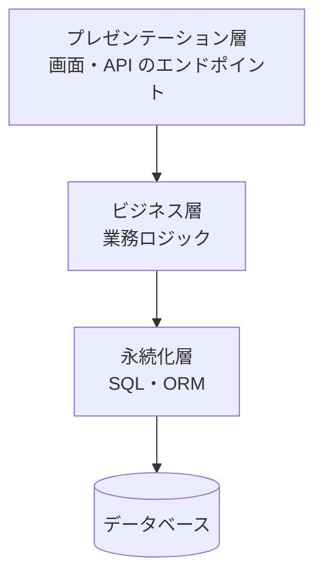
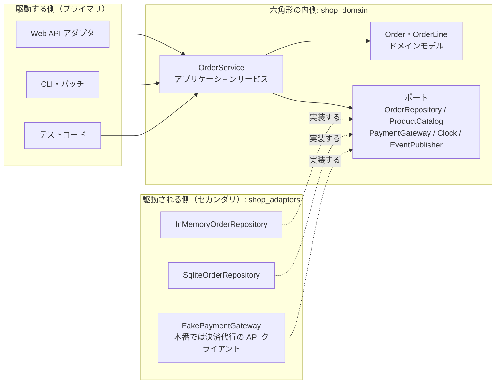
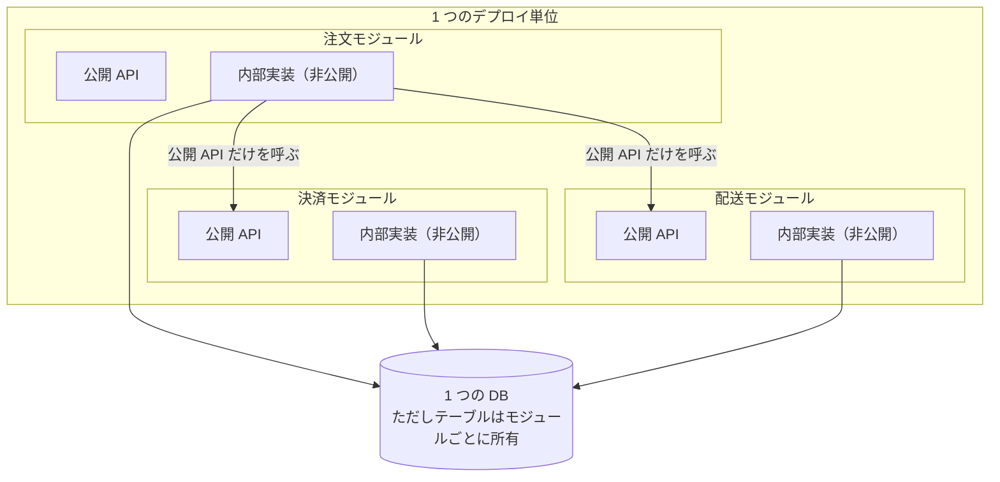
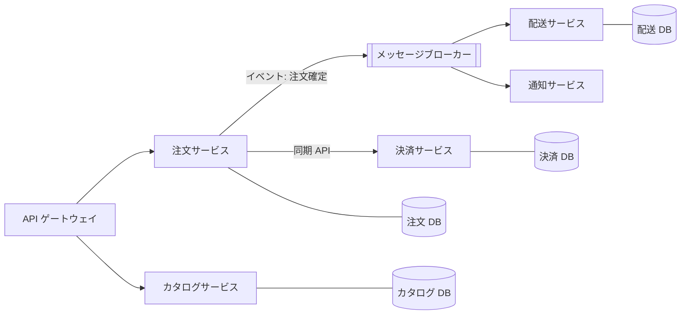
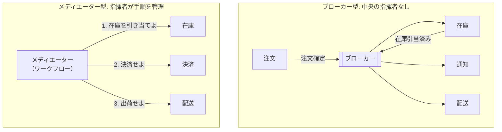
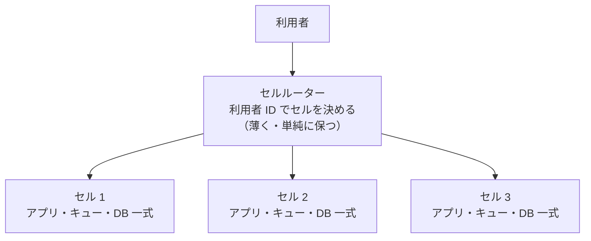
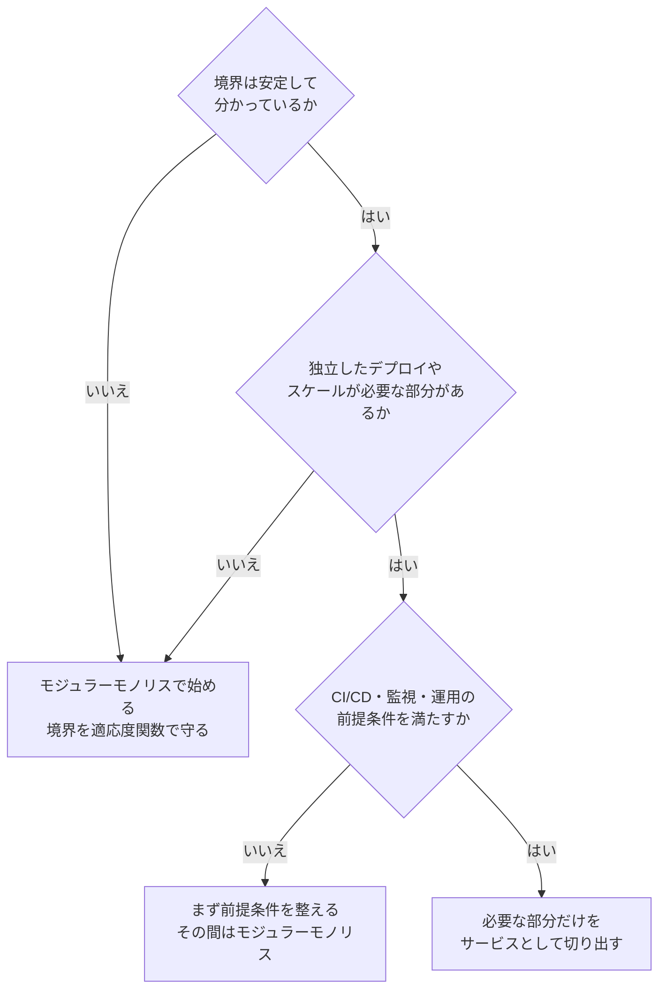

# 9.2 アーキテクチャスタイル

> モノリスか、マイクロサービスか。この問いは、しばしば宗教論争になります。しかしアーキテクチャスタイルは流行ではなく、**特定の品質特性を得るために、特定のコストを支払う構造の型** にすぎません。この章では主要なスタイルの構造と得失を整理し、ヘキサゴナルアーキテクチャを実装して「依存を内側に向ける」ことの意味を手で確かめ、チームと事業の状況からスタイルを選ぶ方法を身につけます。

| 項目 | 内容 |
|---|---|
| 学習時間の目安 | 本文 4h ＋ 演習 5h |
| 前提となる章 | [9.1 ソフトウェアアーキテクチャの基礎](../01-architecture-fundamentals/README.md)、[8.2 テスト戦略](../../08-software-engineering/02-testing/README.md) |
| 演習 | [exercises/](exercises/)（Python）＋ 記述演習 |
| キーワード | レイヤード, ヘキサゴナル, ポートとアダプタ, クリーンアーキテクチャ, モジュラーモノリス, マイクロサービス, 分散モノリス, サービスベース, イベント駆動, サーバーレス, セルベース, マルチテナンシー |

## この章のゴール

- [ ] 主要なアーキテクチャスタイルの構造を図で説明し、それぞれが得意な品質特性と苦手な品質特性を挙げられる
- [ ] ヘキサゴナル（ポートとアダプタ）・クリーン・オニオンに共通する「依存は内側へ」という原則を説明し、実装できる
- [ ] 同じ契約テストを複数のアダプタに実行して、テスト用の実装と本番用の実装の振る舞いの差をなくせる
- [ ] マイクロサービスの利点・コスト・前提条件・アンチパターンを説明し、採用の是非を判断できる
- [ ] サーバーレス、イベント駆動、セルベースなどのスタイルを、コストと障害の影響範囲の観点で比較できる
- [ ] マルチテナンシーの分離モデル（サイロ・プール・ブリッジ）を比較し、顧客の要件に合わせて選べる
- [ ] チーム規模・ドメインの複雑さ・規模・組織の成熟度からスタイルを選び、段階的な移行の道筋を描ける

## なぜ学ぶのか

スタイルの選択を誤ったときのコストは、公開された事例からもよく分かります。

- **分けすぎた例**: 顧客データの基盤サービスを提供していた Segment は、2018 年のエンジニアリングブログ "Goodbye Microservices" で、データの送り先ごとに 140 を超えるマイクロサービスとリポジトリに分けた結果、共有ライブラリのバージョンがサービスごとにばらばらになり、3 人のエンジニアが「システムを動かし続けること」に大半の時間を費やす状態になったと振り返りました。同社はこれらを 1 つのサービスに統合し、障害の分離が難しくなるといった代償を受け入れる代わりに、開発の速度を取り戻したと報告しています。
- **規模の変化で最適な構造が変わった例**: 2023 年、Amazon Prime Video のエンジニアは、映像の品質監視サービスを、AWS Step Functions で連携させたサーバーレスの分散コンポーネントから、単一のプロセスにまとめ直してインフラコストを 90% 以上削減したと報告しました（5.6 節で詳しく扱います）。
- **分けなさすぎた例**: 9.1 で見た Shopify のように、境界のないモノリスは、変更の影響が予測できなくなり、開発者が増えるほど生産性が落ちていきます。

どの事例も「モノリスが正しい」「マイクロサービスが正しい」という話ではありません。**構造がそのときの品質特性・規模・チームに合っていなかった** という話です。スタイルの得失を知っていれば、この不一致に早く気づき、手遅れになる前に手を打てます。

## 1. スタイルとは何か

**アーキテクチャスタイル（architecture style）** は、コンポーネントの分け方、つなぎ方、配置の仕方についての、名前の付いた型です。スタイルを比べるときは、次の 3 つの軸で見ると整理しやすくなります。

| 軸 | 選択肢 | 問い |
|---|---|---|
| 分割の基準 | 技術で分ける（UI・ロジック・DB）/ 業務領域で分ける（注文・決済・配送） | 変更は技術の層に沿って起きるか、業務に沿って起きるか |
| デプロイの単位 | 1 つ（モノリシック）/ 複数（分散） | 部分ごとに独立してリリース・スケールする必要があるか |
| 通信の方法 | プロセス内の関数呼び出し / 同期のネットワーク呼び出し / 非同期のメッセージ | 部分的な障害や遅延をどこまで許容できるか |

分散（デプロイの単位が複数）になった瞬間に、[7.1](../../07-distributed-systems/01-fundamentals/README.md) で学んだ分散システムの難しさ（部分故障、ネットワークの遅延、時刻と順序）がすべて入ってきます。**分散は機能ではなくコスト** であり、それに見合う利益があるときだけ支払うものです。

## 2. レイヤードアーキテクチャ

最も広く使われているのが、技術的な責務で層に分ける **レイヤードアーキテクチャ（layered architecture）** です。



- **利点**: 構造が分かりやすく、多くのフレームワーク（MVC など）がこの形を前提にしている。技術ごとの専門家（フロントエンド・DBA）が担当を分けやすい。
- **弱点**: 変更の多くは業務に沿って起きます。「注文にギフト包装のオプションを追加する」という 1 つの変更が、全部の層に散らばります。また、ビジネス層が永続化層に依存するため、業務ロジックのテストに DB が必要になりがちです。
- **シンクホール（sinkhole）アンチパターン**: 多くのリクエストが、どの層でも何の処理もせずに値を下へ受け渡すだけになっている状態。層の分け方が実態に合っていない兆候です。

レイヤードは小さなアプリケーションや、業務ロジックの薄い CRUD 中心のシステムでは今も良い選択です。問題が起きるのは、業務ロジックが複雑になったのに構造を見直さないときです。

## 3. ヘキサゴナル・クリーン・オニオン — 依存は内側へ

### 3.1 共通する原則

業務ロジックがデータベースやフレームワークに依存している限り、技術の変更が業務ロジックに波及し、業務ロジックのテストは遅く壊れやすくなります。この問題に対して、似た考え方が別々の名前で提案されてきました。

| 名前 | 提唱者・時期 | 表現 |
|---|---|---|
| ヘキサゴナルアーキテクチャ（ポートとアダプタ） | Alistair Cockburn（2005 年ごろ） | アプリケーションの中心を六角形で描き、外部との接点を「ポート」、技術ごとの実装を「アダプタ」と呼ぶ |
| オニオンアーキテクチャ | Jeffrey Palermo（2008 年） | ドメインモデルを中心に、同心円の層を重ねる |
| クリーンアーキテクチャ | Robert C. Martin（2012 年） | 同心円の図と「依存関係のルール」で整理した |

図の形は違っても、本質は 1 つです。**ソースコードの依存は、常に内側（ドメイン・業務ルール）に向かう。内側は外側のことを何も知らない**。外側の技術を使いたいときは、内側がインターフェース（ポート）を定義し、外側がそれを実装します（依存関係逆転の原則、[8.1](../../08-software-engineering/01-code-quality-and-design/README.md)）。

### 3.2 ポートとアダプタ

演習で作る注文アプリの構造を図にします。



- **駆動する側（driving / primary）のアダプタ**: アプリケーションを呼び出す側。HTTP のハンドラ、CLI、メッセージの受信処理、そしてテストコードも同じ立場です。
- **駆動される側（driven / secondary）のアダプタ**: アプリケーションが呼び出す外部の技術。DB、外部 API、メッセージの送信、時計。
- **ポート**: 内側が「外の世界に求めること」を、**内側の言葉で** 定義したインターフェース。`OrderRepository.add` は「注文を保存する」という業務の言葉であって、`INSERT` という技術の言葉ではありません。

Python では、ポートを `typing.Protocol` で定義できます。演習の `shop_domain.py` の抜粋です。

```python
class PaymentGateway(Protocol):
    def charge(self, customer_id: str, amount: int, idempotency_key: str) -> str:
        """課金して決済 ID を返す。拒否されたら PaymentDeclinedError。"""
        ...
```

どのアダプタをどのポートにつなぐかは、アプリケーションの起動時に 1 か所（**合成ルート, composition root**）で決めます。演習の解答例を使った実行例です。

```python
import sqlite3

from shop_adapters import (FakePaymentGateway, InMemoryCatalog, InMemoryEventPublisher,
                           SequentialIds, SqliteOrderRepository, SystemClock)
from shop_domain import OrderService, PlaceOrderCommand

# 合成ルート（composition root）: どのアダプタをどのポートにつなぐかを決める唯一の場所
service = OrderService(
    orders=SqliteOrderRepository(sqlite3.connect(":memory:")),
    catalog=InMemoryCatalog({"BOOK": 1500, "PEN": 200}),
    payments=FakePaymentGateway(limit=10_000),
    clock=SystemClock(),
    events=InMemoryEventPublisher(),
    new_id=SequentialIds(),
)
print(service.place_order(PlaceOrderCommand("req-1", "c1", (("BOOK", 2), ("PEN", 1)))))
print(service.place_order(PlaceOrderCommand("req-2", "c1", (("BOOK", 7),))))
```

```text
OrderSummary(order_id='ord_0001', status='paid', total=3200, payment_id='pay_0001', failure_reason=None)
OrderSummary(order_id='ord_0002', status='payment_failed', total=10500, payment_id=None, failure_reason='利用限度額（10000 円）を超えています')
```

`SqliteOrderRepository` を `InMemoryOrderRepository` に替えても、`OrderService` のコードは 1 行も変わりません。

### 3.3 契約テスト — アダプタの「ずれ」を防ぐ

ヘキサゴナルアーキテクチャの利点としてよく挙がるのが、「業務ロジックを DB なしで高速にテストできる」ことです。しかしここには罠があります。**テスト用のインメモリ実装が、本物の DB と違う振る舞いをしていたら**、テストが通っても本番で壊れます。典型的なのは次のずれです。

- インメモリ実装がオブジェクトの参照をそのまま保存している。呼び出し側が `save` を呼び忘れても、インメモリでは状態が変わってしまい、テストが通る。本物の DB では変更が失われる。
- 一意性制約や楽観的ロックを、インメモリ実装だけが検査していない（またはその逆）。
- 並び順・タイムゾーン・文字列の比較の規則が違う。

対策は、ポートの契約（仕様）を 1 つのテストスイートとして書き、**すべてのアダプタに同じテストを実行する** ことです。これを **契約テスト（contract test）** と呼びます。演習の `test_shop_adapters.py` では、次のように同じテストクラスを 2 つのアダプタに適用しています。

```python
class OrderRepositoryContract:
    def make_repo(self):
        raise NotImplementedError
    def test_optimistic_locking(self):
        ...   # 同じテストが両方のアダプタで実行される

class TestInMemoryOrderRepository(OrderRepositoryContract, unittest.TestCase):
    def make_repo(self):
        return InMemoryOrderRepository()

class TestSqliteOrderRepository(OrderRepositoryContract, unittest.TestCase):
    def make_repo(self):
        return SqliteOrderRepository(sqlite3.connect(":memory:"))
```

サービス間の API にも同じ発想があり、提供側と利用側の期待を契約として検証する「消費者駆動契約テスト」と呼ばれる手法があります（[8.2](../../08-software-engineering/02-testing/README.md)）。

### 3.4 トレードオフ

ヘキサゴナルアーキテクチャにもコストはあります。インターフェースとアダプタの分だけコードと間接層が増え、単純な CRUD では「DB の行をそのまま画面に出すだけ」の処理にまで層を通すことになります。業務ルールがほとんどないシステムでは、レイヤードや、フレームワークの規約にそのまま乗る方が合理的です。**ドメインが複雑で、長く保守し、外部の技術が入れ替わる可能性が高いシステムほど、この構造の価値が高まります**。どこにドメインの複雑さがあるかを見極める方法は、[9.3 ドメイン駆動設計](../03-domain-driven-design/README.md) で扱います。

## 4. モノリスとモジュラーモノリス

### 4.1 モノリスは悪ではない

**モノリス（monolith）** は、アプリケーション全体を 1 つの単位としてビルド・デプロイする構造です。1 つのプロセスの中で関数を呼び出すので、ネットワークの障害も、サービス間のデータの不整合も、分散トレーシングも必要ありません。1 つのトランザクションで複数の業務データを一貫して更新できます。小さなチームにとって、これは非常に大きな利点です。

モノリスの本当の問題は「1 つにデプロイすること」ではなく、**内部に境界がないこと** です。Brian Foote と Joseph Yoder は 1997 年の論文で、構造が崩れて何でも何にでも依存している状態を **大きな泥団子（Big Ball of Mud）** と名付けました。泥団子になったモノリスでは、変更の影響が予測できず、テストは遅く、新人は全体を理解しないと何も変えられません。

Martin Fowler は 2015 年の記事 "MonolithFirst" で、新しいシステムは最初からマイクロサービスで作るより、まずモノリスで作り、境界が分かってから分割する方が成功しやすいという観察を述べています。境界を正しく引けるのは、ドメインをよく理解した後だからです。

### 4.2 モジュラーモノリス

**モジュラーモノリス（modular monolith）** は、デプロイは 1 つのまま、内部を業務領域ごとのモジュールに分け、モジュール間の境界を厳格に守る構造です。



守るべきルールは次の 3 つです。

1. **他のモジュールには公開 API だけを通してアクセスする**。内部のクラスや関数を直接 import しない。
2. **データの所有者を決める**。テーブルはどれか 1 つのモジュールが所有し、他のモジュールのテーブルを直接 SELECT・JOIN しない（必要なら公開 API で取得する）。
3. **ルールを自動で検査する**。9.1 の適応度関数（依存ルールの検査）を CI で実行する。

Shopify は 2019 年のブログ記事で、巨大な Rails のモノリスをマイクロサービスに分割するのではなく、この中間の道を選んだと説明しています。単一のテスト・デプロイのパイプラインというモノリスの利点を保ちながら、コードのモジュール性と疎結合というマイクロサービスの利点を得ようとしたのです。同社は境界違反を検出するツールを整備し、2020 年には Ruby 向けの静的解析ツール Packwerk をオープンソースで公開しています。

モジュラーモノリスは、**後でサービスに分割するための最良の準備** でもあります。境界が守られたモジュールは、公開 API をネットワーク越しの API に置き換えるだけで切り出せます。逆に、泥団子のモノリスをいきなりマイクロサービスにすると、泥団子がネットワーク越しに分散しただけの「分散した泥団子」ができあがります。

## 5. マイクロサービス

### 5.1 定義

James Lewis と Martin Fowler は 2014 年の記事 "Microservices" で、このスタイルの特徴として、サービスによるコンポーネント化、ビジネス能力（業務）に沿った組織化、「プロジェクトではなくプロダクト」、賢いエンドポイントと土管のような単純な通信路、分散したガバナンスとデータ管理、インフラの自動化、障害を前提とした設計、進化的な設計を挙げました。要点をまとめると、**業務能力ごとに独立してデプロイでき、自分のデータを自分だけが持つ、小さなサービスの集まり** です。



### 5.2 利点とコスト

| 利点 | 引き換えに支払うコスト |
|---|---|
| **独立したデプロイ**: 他チームを待たずにリリースできる | サービス間の API の互換性を常に保つ必要がある（[9.4](../04-api-design/README.md)） |
| **独立したスケール**: 負荷の高い部分だけを増やせる | サービスごとの容量計画・自動スケールの設定・監視 |
| **障害の分離**: 一部の障害が全体に広がりにくい（ただし設計次第） | タイムアウト・リトライ・サーキットブレーカーを正しく設計しないと、逆に障害が連鎖する（[9.5](../05-scalability-and-performance/README.md)） |
| **チームの自律**: チームが技術選択とリリースを自分で決められる | 技術の乱立、横断的な変更（ライブラリの脆弱性対応など）の手間 |
| **技術の多様性**: 用途に合った言語やデータストアを選べる | 運用・採用・育成の対象が増える |
| — | **分散データの一貫性**: サービスをまたぐトランザクションが使えず、Saga や結果整合性で設計する（[7.5](../../07-distributed-systems/05-messaging-and-events/README.md)） |
| — | **可観測性**: 1 つのリクエストが多数のサービスを通るので、分散トレーシングとログの相関が必須（[10.4](../../10-cloud-and-sre/04-observability/README.md)） |
| — | **テストの難しさ**: 結合テスト環境の維持、契約テスト |

利点のほとんどは **組織の規模** に関するものです。独立したデプロイやチームの自律が効いてくるのは、多数のチームが 1 つのコードベースで互いを待つようになってからです。数名のチームにとって、マイクロサービスはコストだけを先払いすることになりがちです。Fowler はこれを「マイクロサービスの割増料金（microservice premium）」と呼び、システムがそれに見合うほど複雑になるまでは払うべきでないと述べています。

### 5.3 前提条件

Fowler は "MicroservicePrerequisites"（2014 年）で、マイクロサービスを始める前に最低限必要なものとして次の 3 つを挙げました。

1. **迅速なプロビジョニング**: 新しいサーバー（実行環境）を数時間のうちに用意できる（2014 年の記事の基準。クラウドとコンテナが普及した現在では、数分で用意できるのが普通です）。
2. **基本的な監視**: 多数のサービスの障害や性能の劣化を素早く検知できる。
3. **迅速なアプリケーションのデプロイ**: 多数のサービスを、自動化されたパイプラインで頻繁に安全にデプロイ・ロールバックできる。

加えて、これらを満たすには、開発者と運用者が密接に協力する文化（DevOps）への組織の転換が必要だとしています。2026 年の感覚では、CI/CD（[8.4](../../08-software-engineering/04-ci-cd-and-release/README.md)）、IaC とコンテナ基盤（[10.1](../../10-cloud-and-sre/01-cloud-and-iac/README.md)、[10.2](../../10-cloud-and-sre/02-containers-and-kubernetes/README.md)）、分散トレーシングを含む可観測性、SLO に基づく運用（[10.3](../../10-cloud-and-sre/03-reliability-engineering/README.md)）がそろっているかを確認する、と言い換えられます。

### 5.4 アンチパターン

- **分散モノリス（distributed monolith）**: サービスは分かれているのに、リリースは全サービス同時でなければならない、1 つの変更に複数サービスの同時修正が必要、といった状態。モノリスの結合度と、分散システムの運用コストの両方を背負った最悪の組み合わせです。境界が業務ではなく技術やデータの都合で引かれたときに起きます。
- **共有データベース**: 複数のサービスが同じテーブルを直接読み書きする。スキーマを変えるには全サービスの同意が必要になり、独立したデプロイという最大の利点が失われます。
- **おしゃべりな呼び出し（chatty calls）**: 1 つの画面を表示するのに、サービス間で数十回の同期呼び出しが直列に起きる。遅延が積み重なるうえ、可用性は掛け算で下がります。

```python
for n in (1, 3, 5, 10, 20):
    print(f"{n:2d} 個のサービスを直列に同期呼び出し: 全体の可用性 {0.999 ** n:.2%}")
```

```text
 1 個のサービスを直列に同期呼び出し: 全体の可用性 99.90%
 3 個のサービスを直列に同期呼び出し: 全体の可用性 99.70%
 5 個のサービスを直列に同期呼び出し: 全体の可用性 99.50%
10 個のサービスを直列に同期呼び出し: 全体の可用性 99.00%
20 個のサービスを直列に同期呼び出し: 全体の可用性 98.02%
```

それぞれ 99.9% の可用性を持つサービスでも、10 個を直列に同期で呼ぶと、全体の可用性は 99.0% まで落ちます（障害が独立だと仮定した単純化したモデルです）。月に換算すると、約 43 分の停止が約 7 時間の停止に増える計算です。対策は、呼び出しをまとめる（粗い粒度の API）、非同期のイベントに置き換える、必要なデータを自分のサービスに複製して持つ、そしてそもそも境界を見直すことです。

- **ナノサービス**: 1 つの関数程度の小さすぎるサービス。サービスの数だけ運用コストがかかり、1 つの業務処理のために多数のサービスを呼ぶことになります。「サービスの数」は成果の指標ではありません。

### 5.5 どこで分けるか

サービスの境界は、**業務能力（business capability）** と、ドメイン駆動設計の **境界づけられたコンテキスト**（[9.3](../03-domain-driven-design/README.md)）に沿って引くのが基本です。技術の層（「DB サービス」「バリデーションサービス」）や、エンティティ（「顧客サービス」「商品サービス」が CRUD だけを提供する）で分けると、業務処理のたびに多数のサービスを呼ぶことになり、分散モノリスに向かいます。境界の良し悪しは、「1 つの業務の変更が、1 つのサービスの中で完結するか」で確かめられます。

### 5.6 事例: Prime Video の監視サービスの再構成（2023 年）

2023 年、Amazon Prime Video のテックブログに掲載された記事（Marcin Kolny 著）は、大きな議論を呼びました。記事の要点は次の通りです。

- 対象は、配信中の映像と音声の品質の問題（映像の破損や音ずれなど）を検出する監視サービス。
- 最初の版は、AWS Step Functions でワークフローを組み、処理の各段階を AWS Lambda で実装し、段階の間で映像のフレームなどの中間データを Amazon S3 に置いて受け渡す、サーバーレスの分散構成だった。
- この構成は、想定していた負荷の 5% 程度でスケールの限界に達した。コストの大半は、状態遷移の多いオーケストレーションと、コンポーネント間のデータの受け渡し（S3 への大量の読み書き）から生じていた。
- チームはコンポーネントを 1 つのプロセスにまとめ、データの受け渡しをメモリ内で行うようにして Amazon ECS 上で動かした。記事は、これによりインフラコストを 90% 以上削減し、スケールできる規模も大きくなったと報告している。

この記事は「Amazon ですらマイクロサービスをやめてモノリスに戻った」という見出しで広く拡散されました。一方で、Netflix や AWS でクラウドアーキテクチャを推進してきた Adrian Cockcroft をはじめ、多くの技術者が「これはマイクロサービスからモノリスへの話ではない。1 つのサービスの内部を、サーバーレスのワークフローから長時間動き続けるプロセスへと、規模に合わせて作り直した話だ」と反論しました。

この事例から学ぶべきことは、どちらの陣営が正しいかではありません。

1. **データの移動が多い処理では、コンポーネント間の通信コストが支配的になる**。映像のフレームのような大きなデータを、細かい単位でネットワーク越しに受け渡す構造は、規模が大きくなるとコストと性能の両面で限界に達する。
2. **最初の構造は間違いではなかった可能性がある**。小規模なうちはサーバーレスで素早く作り、規模と要件が明らかになってから作り直すのは、合理的な進め方の 1 つ。
3. **スタイルの名前ではなく、品質特性と測定値で議論する**。この記事で決め手になったのは、スケールの限界と、コストの内訳という数字だった。

## 6. サービスベースアーキテクチャ — 中間の選択肢

Richards と Ford が整理した **サービスベースアーキテクチャ（service-based architecture）** は、モノリスとマイクロサービスの中間にある実用的なスタイルです。

- 業務領域ごとに **粗い粒度** のサービス（数個〜十数個程度）に分ける。
- 多くの場合 **データベースは共有** する（ただしスキーマやテーブルの所有はサービスごとに整理する）。
- サービス内のトランザクションは通常の ACID トランザクションで扱える。

マイクロサービスほど独立性は高くありませんが、分散データの一貫性という最も難しい問題を避けながら、デプロイの独立性とある程度の障害の分離を得られます。中規模の組織や、既存のモノリスから段階的に移行する途中の姿として、よく選ばれます。

## 7. イベント駆動アーキテクチャ

**イベント駆動アーキテクチャ（event-driven architecture）** では、コンポーネントが「注文が確定した」のような **イベント** を発行し、関心のあるコンポーネントがそれに反応して処理を進めます。送り手は受け手を知らないので、受け手を追加しても送り手を変える必要がありません。処理の流れの組み立て方には、2 つのトポロジー（形）があります。



| | ブローカー型（コレオグラフィー） | メディエーター型（オーケストレーション） |
|---|---|---|
| 仕組み | 各コンポーネントがイベントに反応し、次のイベントを発行する | メディエーターが手順を持ち、各コンポーネントに指示する |
| 得意なこと | 疎結合、拡張性、高いスループット | 手順の可視性、エラー処理・補償処理の一元管理 |
| 苦手なこと | 全体の流れが見えにくい、エラー処理が分散する | メディエーターが結合の中心・ボトルネックになりうる |

イベント駆動は、負荷の平準化（キューに溜めて受け手のペースで処理する）と、障害の吸収（受け手が止まっていてもイベントは失われない）に優れています。一方で、処理が **結果整合** になること、イベントの重複・順序の入れ替わり・スキーマの進化を扱う必要があることがコストです。メッセージングの保証（at-least-once と冪等性）、Saga、Outbox パターンは [7.5 メッセージングとイベント駆動](../../07-distributed-systems/05-messaging-and-events/README.md) で詳しく扱います。

## 8. サーバーレス（FaaS）

**サーバーレス** は、サーバーの管理をクラウド事業者に任せ、使った分だけ支払う実行モデルです。その中心が、イベントごとに関数を実行する **FaaS（Function as a Service）** で、AWS Lambda などが代表例です。

- **利点**: サーバーの運用が不要。負荷に応じて自動でスケールし、リクエストがなければ費用はほぼゼロ。小さなチームが素早く作るのに向く。
- **コールドスタート**: しばらく呼ばれていない関数は、実行環境の起動から始まるため、最初の呼び出しが遅くなる。遅延はランタイムやパッケージの大きさ、ネットワークの設定などに左右され、数百ミリ秒から秒の単位になることもある。事前に環境を温めておく機能（AWS Lambda の Provisioned Concurrency など）で緩和できるが、その分の費用がかかる。
- **制約**: 実行時間の上限（2026 年時点の AWS Lambda では 15 分。最新の値は公式ドキュメントで確認）、メモリやペイロードの上限、状態を持てないこと、同時実行数の上限と、それによる下流（DB の接続数など）への負荷集中。
- **ロックイン**: トリガー、権限、ワークフローなどが事業者固有の仕組みと深く結びつき、移行コストが高くなる。

費用のモデルは「リクエスト数 × 実行時間 × メモリ」の従量課金です。仮の単価で、常時稼働の仮想マシン（VM）と比べてみます。

```python
# 仮定の単価（実際の価格はクラウド事業者・リージョン・時期で変わるので、必ず最新の料金表で計算し直すこと）
PER_MILLION_REQUESTS = 0.20      # 100 万リクエストあたり USD
PER_GB_SECOND = 0.0000166667     # メモリ 1GB × 実行 1 秒あたり USD
VM_MONTHLY = 140.0               # この負荷を捌ける常時稼働の VM 2 台の月額 USD（仮定）

def faas_monthly(requests, duration_s=0.2, memory_gb=0.5):
    return requests / 1e6 * PER_MILLION_REQUESTS + requests * duration_s * memory_gb * PER_GB_SECOND

for req in (1e6, 1e7, 1e8):
    print(f"月 {req:>11,.0f} リクエスト: FaaS 約 {faas_monthly(req):>5,.0f} USD / VM 2 台 {VM_MONTHLY:,.0f} USD")
break_even = VM_MONTHLY / faas_monthly(1)
print(f"損益分岐: 月 約 {break_even / 1e4:,.0f} 万リクエスト（平均 約 {break_even / (30 * 86400):.0f} リクエスト/秒）")
```

```text
月   1,000,000 リクエスト: FaaS 約     2 USD / VM 2 台 140 USD
月  10,000,000 リクエスト: FaaS 約    19 USD / VM 2 台 140 USD
月 100,000,000 リクエスト: FaaS 約   187 USD / VM 2 台 140 USD
損益分岐: 月 約 7,500 万リクエスト（平均 約 29 リクエスト/秒）
```

数字そのものは仮定次第で大きく変わりますが、構造は変わりません。**少量・散発的な負荷ではサーバーレスが圧倒的に安く、一定以上の持続的な負荷では常時稼働の方が安くなる** のです。Prime Video の事例も、この構造の延長線上にあります。実際の比較では、運用にかかる人件費（サーバーレスの方が小さい）も含めて判断します（[10.6 FinOps](../../10-cloud-and-sre/06-finops/README.md)）。

## 9. その他のスタイル

### 9.1 マイクロカーネル（プラグイン）

小さな **コアシステム** と、機能を追加する **プラグイン** からなる構造です。IDE やブラウザの拡張機能が典型例で、業務システムでは、顧客ごと・地域ごとに異なる計算ルール（保険の査定、税の計算など）をプラグインとして差し替える使い方があります。コアとプラグインの間の契約（プラグインの API）の安定性が、このスタイルの生命線です。

### 9.2 スペースベース

処理を担う多数の **処理ユニット** が、データを **インメモリのデータグリッド** に複製して持ち、データベースへの書き込みは非同期に行う構造です。チケットの一斉販売やオークションのように、短時間に極端な負荷が集中し、DB を同期的に使うと追いつかない用途に使われます。構造が複雑で、データの一貫性や障害時のデータ消失の扱いが難しいため、用途は限られます。

### 9.3 セルベースアーキテクチャ — 障害の影響範囲を限定する

**セルベースアーキテクチャ（cell-based architecture）** は、システム全体を、それぞれが独立して動作できる完全なコピー（**セル**）に分け、利用者（テナントやユーザー）をどれか 1 つのセルに割り当てる構造です。



- **影響範囲（blast radius）の限定**: 不具合のあるデプロイ、特定の利用者からの異常な負荷、データの破損といった問題が、1 つのセルの中に閉じ込められます。N 個のセルがあれば、1 つのセルの障害の影響は、おおよそ利用者の 1/N にとどまります。
- **スケールの上限を決めておける**: セルの大きさに上限を設け、利用者が増えたらセルを増やします。「巨大な 1 つのシステムが、まだ経験したことのない規模に達して壊れる」という事態を避け、テスト済みの規模の中で運用できます。

2020 年 11 月の Amazon Kinesis Data Streams の障害（米国東部リージョン）では、フロントエンドのフリートに容量を追加したことをきっかけに、各サーバーがフリート内の他のすべてのサーバーとの通信のために作る OS のスレッド数が、OS の設定の上限を超えました。AWS は公開した障害報告で、対策の 1 つとしてフロントエンドのフリートの「セル化」を挙げています。規模の拡大そのものが障害の引き金になるという教訓は、[9.5](../05-scalability-and-performance/README.md) でも扱います。AWS は 2023 年に、この考え方をまとめたホワイトペーパー "Reducing the Scope of Impact with Cell-Based Architecture" を公開し、Slack も同年、アベイラビリティゾーン単位の障害に対処するためにセル型のアーキテクチャへ移行したことをブログで説明しています。

セル化のコストは、セルの数だけ増えるインフラ・デプロイ・監視の手間と、セルをまたぐ処理（全利用者を対象にした集計など）の難しさです。セルルーター自体が単一障害点にならないよう、極力単純に保つことも重要です。

## 10. マルチテナンシー — 顧客をどう分けるか

SaaS では、多数の顧客（**テナント**）を 1 つのシステムで扱います。テナント間の分離の方式は、AWS の SaaS 向けのガイダンスなどで次の 3 つのモデルとして整理されています。

| モデル | 構造 | 分離の強さ | テナントあたりのコスト | 主な課題 |
|---|---|---|---|---|
| **サイロ（silo）** | テナントごとに専用のリソース（DB やアプリ一式） | 強い | 高い | テナント数に比例して運用とデプロイの手間が増える |
| **プール（pool）** | 全テナントが同じリソースを共有し、行やキーにテナント ID を付けて分ける | 弱い（アプリの正しさに依存） | 低い | 他のテナントのデータが見えてしまうバグ、騒がしい隣人（noisy neighbor）、テナント単位の復元が難しい |
| **ブリッジ（bridge）** | 層や顧客の種類によって混在させる（例: アプリは共有、DB は大口顧客だけ専用） | 中間 | 中間 | 2 つの方式の運用が必要 |

プールモデルでは、すべてのクエリにテナント ID の条件を付け忘れないことが決定的に重要です。1 か所の付け忘れが、他の顧客のデータの漏えいにつながります。データベースの行レベルセキュリティ（PostgreSQL の Row Level Security など）で DB 側でも強制する、テナント ID をリクエストの文脈から自動で付与する、といった多重の防御を組み合わせます。これは [9.4](../04-api-design/README.md) で触れる OWASP API Security Top 10 の第 1 位「オブジェクトレベル認可の不備」とも直結する論点です。

金融機関や医療機関、公共機関の顧客は、データの所在や分離について契約上・規制上の要件を持つことが多く、サイロやブリッジを求められる場面があります。事業の顧客層が分離モデルを決めるので、営業・法務と早い段階で要件をすり合わせておく必要があります。

## 11. スタイルの選び方と移行

### 11.1 判断の材料

スタイルは、次の 4 つの要因から選びます。

| 要因 | モノリス／モジュラーモノリス寄り | サービスベース | マイクロサービス寄り |
|---|---|---|---|
| チームの規模 | 1〜数チーム（〜30 人程度） | 数チーム | 多数のチームが独立して動く必要がある |
| ドメインの複雑さと境界の明確さ | 境界がまだ分からない・変わりやすい | 大きな業務領域は分かっている | 境界が安定して分かっている |
| スケールの要求 | 全体を一様にスケールすれば足りる | 一部に偏りがある | 部分ごとに負荷の特性が大きく異なる |
| 組織の成熟度 | CI/CD や監視が発展途上 | 自動化は一通りある | 5.3 節の前提条件をすべて満たし、プラットフォームチームがいる |

人数の目安はあくまで目安で、境界の明確さと運用の成熟度の方が重要です。迷ったら、**モジュラーモノリスから始めて、分割が必要になった部分だけを切り出す** のが、最も後悔の少ない選択です。



### 11.2 移行の道筋

大きな書き直し（ビッグバン・リライト）は、旧システムの暗黙の仕様を再現しきれずに失敗しやすいことが知られています。段階的に進めるのが原則です。

1. **泥団子 → モジュラーモノリス**: 依存関係を可視化し（9.1 の演習のツール）、業務領域ごとのモジュールに整理する。違反を許容リストに記録し、新しい違反を CI で止める。
2. **モジュラーモノリス → サービスの切り出し**: 変更頻度・負荷特性・チームの独立性の要求が最も高いモジュールから、1 つずつ切り出す。旧システムの前にルーティング層を置き、機能単位でトラフィックを新しいサービスに移していく **ストラングラーフィグ（strangler fig）** パターンを使う（[8.5](../../08-software-engineering/05-refactoring-and-tech-debt/README.md)）。データは、切り出したサービスが所有するように移し、移行期間は同期の仕組み（変更データキャプチャなど）で新旧をつなぐ。
3. **逆方向の統合も選択肢に入れる**: Segment や Prime Video の事例のように、分けすぎたサービスを統合するのも正当な進化である。サービスの数を減らすことを失敗と捉える必要はない。

## よくある落とし穴

1. **「モダンだから」マイクロサービスを選ぶ**。数名のチームが分散システムの運用コストを先払いし、機能開発が止まる。品質特性とチームの規模から判断し、迷ったらモジュラーモノリスから始める。
2. **境界のないままモノリスを分割する**。泥団子がネットワーク越しに分散し、分散モノリスになる。先にモジュラーモノリスで境界を確立し、境界が守られていることを確認してから切り出す。
3. **サービス間でデータベースを共有する**。スキーマの変更に全サービスの合意が必要になり、独立したデプロイができなくなる。データの所有者を 1 つに決め、他のサービスは API かイベントで受け取る。
4. **同期呼び出しを直列に連ねる**。可用性は掛け算で下がり、遅延は足し算で増える。粒度の粗い API、非同期のイベント、データの複製で呼び出しの連鎖を断つ。
5. **インメモリのテスト用実装を契約テストなしで使う**。テストは通るのに、本番の DB では動かない。同じ契約テストをすべてのアダプタに実行する。
6. **ヘキサゴナルアーキテクチャを CRUD にまで適用する**。業務ルールのない処理にまで層とインターフェースを増やし、コードが読みにくくなる。ドメインが複雑な部分に絞って適用する。
7. **サーバーレスの費用を小規模のときの数字で判断する**。持続的な高負荷では常時稼働より高くなり、下流の DB を同時実行数で押しつぶすこともある。負荷の見通しで損益分岐を計算し、制約（実行時間・同時実行数）を確認する。
8. **プール型のマルチテナンシーで、テナントの分離をアプリの注意力だけに頼る**。1 か所の条件の付け忘れがデータ漏えいになる。DB の行レベルセキュリティ、テナント文脈の自動付与、テナント越境のテストを組み合わせる。

## CTOの視点

1. **スタイルの選択は「組織の設計」とセットで承認する**。マイクロサービスへの移行は、サービスごとの担当チーム、オンコールの体制、プラットフォームチームの設置を伴わなければ、分散モノリスとアラート疲れを生むだけです。移行計画の承認では「どのチームがどのサービスを持ち、誰が夜中に起きるのか」を必ず確認します（[13.6](../../13-technical-leadership/06-team-and-org-design/README.md)）。
2. **分割の効果を測定可能にしておく**。「マイクロサービス化で開発が速くなる」という主張は、デプロイ頻度・変更のリードタイム・変更失敗率（[13.7](../../13-technical-leadership/07-delivery-and-productivity/README.md)）や、インフラ費用と運用工数で、移行の前後に測ります。効果が出ていなければ、統合を含めて方針を見直す判断ができるように、最初から指標を決めておきます。
3. **分散のコストを予算に入れる**。サービスが増えると、監視・ログ・トレーシングの費用、サービス間通信の費用（ゾーンやリージョンをまたぐデータ転送料を含む）、CI の実行時間、そして人件費が増えます。「1 サービスあたりの運用コスト」を概算しておくと、ナノサービス化の歯止めになります。
4. **マルチテナンシーの分離モデルは事業戦略の決定として扱う**。大企業や規制業種の顧客を狙うならサイロやブリッジの選択肢が必要になり、原価構造と価格体系に直結します。一度プール型で作り込んだシステムを後からサイロ化するのは大工事なので、営業・財務と一緒に早い段階で決める「一方通行のドア」です。
5. **採用の場では「分けない判断」を語れる人を評価する**。マイクロサービスの経験を語れる人は多くいますが、「なぜその部分は分けなかったのか」「分けすぎて統合した経験」を具体的に語れる人は、トレードオフで考える習慣を持っています。

## 演習

演習コードは [exercises/shop_domain.py](exercises/shop_domain.py)（六角形の内側）と [exercises/shop_adapters.py](exercises/shop_adapters.py)（外側のアダプタ）にあります。演習 1 → 2 → 3 → 4 の順に進めてください。解答例は [solutions/](solutions/) にあります。

```bash
python3 tools/check.py 9.2        # リポジトリのルートで実行
python3 tools/check.py -v 9.2     # 詳しい出力
```

| # | 難易度 | 内容 | 対象 |
|---|---|---|---|
| 1 | ★☆☆ | ドメインモデル: 値オブジェクトの検証、注文の生成・合計・状態遷移 | `shop_domain.py`: `OrderLine`, `Order` |
| 2 | ★★☆ | インメモリのリポジトリ（コピーの意味論と楽観的ロック）と、冪等な偽の決済代行 | `shop_adapters.py`: `InMemoryOrderRepository`, `FakePaymentGateway` |
| 3 | ★★☆ | アプリケーションサービス: 冪等な注文受付、課金の途中失敗からの再開、イベント発行 | `shop_domain.py`: `OrderService` |
| 4 | ★★★ | SQLite のリポジトリ: 同じ契約テストに合格し、楽観的ロックを DB の UPDATE で実現する | `shop_adapters.py`: `SqliteOrderRepository` |
| 5 | ★★☆ | 記述: 3 社のアーキテクチャスタイルの選定（下記） | — |

テストは 3 つのファイルに分かれています。`test_shop_domain.py` は演習 1 と「内側が外側を import していないか」の検査、`test_shop_adapters.py` は演習 2・4 の契約テスト、`test_shop_service.py` は演習 3 です。

### 演習 5（記述）: 3 社のアーキテクチャスタイルを選ぶ

次の 3 社について、推奨するアーキテクチャスタイル（マルチテナンシーの方式を含む）と、その理由、今後 2〜3 年の移行の道筋を書いてください。「採用しなかったスタイルとその理由」も必ず含めてください。

- **A 社**: 創業 1 年の BtoC スタートアップ。家計簿アプリを開発中で、エンジニアは 5 名。プロダクトの方向性を探っている段階で、仕様変更が毎週ある。利用者は 3 万人、トラフィックは小さい。
- **B 社**: 従業員 800 名の EC 企業。エンジニアは 120 名・15 チーム。10 年前から続く 1 つの大きなモノリスがあり、デプロイは週 1 回で、各チームのリリースが順番待ちになっている。年に数回のセールでは通常の 20 倍のアクセスがあり、そのたびに決済や在庫の処理の遅延がサイト全体の停止に波及している。
- **C 社**: 地方銀行向けの融資審査 SaaS を提供する BtoB 企業。顧客は 40 行で、各行が監査対応とデータの所在についての要件を持ち、一部の大手行は他行とデータベースを共有しないことを契約条件にしている。審査ルールには銀行ごとの差があり、カスタマイズの要望が多い。エンジニアは 30 名。

<details>
<summary>解答例</summary>

**A 社: モノリス（モジュラーモノリスの規律付き）＋ マネージドサービス**

- 理由: 最優先の品質特性は「変更の速さ」であり、ドメインの境界はまだ分からない。5 名のチームにマイクロサービスの運用コストを払う余裕はない。トラフィックも小さく、独立したスケールは不要。
- 実践: 1 つのリポジトリ・1 つのデプロイで、業務領域ごとのモジュール（家計簿・口座連携・課金など）に分け、依存ルールを CI で検査する。DB やキューはマネージドサービスを使い、運用を最小化する。散発的なバッチ処理（月次集計など）には FaaS を使ってもよい。
- 採用しなかったもの: マイクロサービス（境界が不明で前提条件もない）、サーバーレスだけでの全面構築（処理の流れが分散して、方向転換のたびの変更コストが高い）。
- 道筋: PMF 後、口座連携のように外部 API の障害やスケールの特性が異なる部分が見えてきたら、その部分から切り出しを検討する。

**B 社: モノリスのモジュール化 → 負荷と変更頻度の高い領域からサービスを切り出す**

- 理由: 課題は (1) デプロイの待ち行列（チームの自律の欠如）と、(2) 決済・在庫の遅延が全体に波及すること（障害の分離の欠如）。どちらもマイクロサービス（またはサービスベース）の利点が効く領域で、120 名という規模は分割のコストを払う価値がある。
- 実践: まず依存関係を可視化し、業務領域ごとのモジュールに整理する（数か月）。並行して CI/CD、可観測性、プラットフォームチームを整える。そのうえで、セールの負荷を受ける在庫・カート・決済、変更頻度の高い商品カタログなどから、ストラングラーフィグで順に切り出す。決済・在庫の呼び出しにはタイムアウト・サーキットブレーカー・バルクヘッドを入れ、注文の確定後の処理（メール・ポイント付与・配送連携）はイベント駆動にして同期の連鎖を断つ。
- 採用しなかったもの: 全面的な書き直し（10 年分の暗黙の仕様を再現できない）、一気に数十サービスへの分割（分散モノリス化のリスク）。
- 道筋: 1 年目にモジュール化と基盤整備、2〜3 年目に 5〜10 個程度のサービスの切り出し。デプロイ頻度・リードタイム・セール時の可用性を指標に効果を測る。

**C 社: モジュラーモノリス（またはサービスベース）＋ ブリッジ型のマルチテナンシー ＋ マイクロカーネル型のルール拡張**

- 理由: 最優先の品質特性は、データの分離・監査対応（セキュリティ・コンプライアンス）と、顧客ごとの差異への対応（拡張性）。30 名という規模とトラフィックの小ささから、細かいマイクロサービスは不要。
- 実践: アプリケーションは共通の 1 つ（またはいくつかの粗いサービス）とし、DB は「専用 DB を求める大手行はサイロ、それ以外はプール」のブリッジ型にする。テナントごとのデプロイ設定を IaC で自動化し、サイロの運用コストを抑える。銀行ごとの審査ルールは、コアの審査エンジンにプラグインとして差し込むマイクロカーネル型にし、コアを分岐させない。
- 採用しなかったもの: 全行サイロ（40 行分の運用コストとデプロイの手間）、全行プール（契約条件を満たせない）、銀行ごとのコードの分岐（保守不能になる）。
- 道筋: 顧客数が増えたら、テナント群ごとのセルに分けて影響範囲を限定する。規制や監査の要件（ログの保存期間、データの所在）を ADR と適応度関数（設定の自動検査）で管理する。

採点の観点:

- 各社について、最優先の品質特性を特定し、そこからスタイルを導けていること（スタイル名から入っていないこと）が合格ラインです。
- 採用しなかった選択肢の理由、組織の成熟度（前提条件）への言及、段階的な移行の道筋、マルチテナンシーと契約・規制の関係まで書けていれば、設計レビューをリードできる水準です。
- 「B 社はマイクロサービス」とだけ答え、分散モノリスのリスクや前提条件に触れていないものは不十分です。

</details>

## 理解度チェック

**Q1. ヘキサゴナルアーキテクチャ・オニオンアーキテクチャ・クリーンアーキテクチャに共通する原則を一文で述べ、その原則がテストにどう効くかを説明してください。**

<details>
<summary>解答</summary>

共通する原則は「ソースコードの依存は常に内側（ドメイン・業務ルール）に向かい、内側は外側の技術を知らない」ことです。

外側の技術（DB、外部 API、時計）は内側が定義したポート（インターフェース）の背後に隠れるので、テストではポートにインメモリの実装や偽物をつなぐだけで、業務ロジックを DB なしで高速かつ決定的にテストできます。ただし、テスト用の実装が本物と違う振る舞いをしないよう、同じ契約テストを両方に実行する必要があります。

</details>

**Q2. インメモリのリポジトリが、保存したオブジェクトの参照をそのまま持っていると、どんな問題が起きますか。**

<details>
<summary>解答</summary>

呼び出し側が取り出したオブジェクトを変更すると、`save` を呼ばなくても保存済みの状態が変わってしまいます。すると「`save` を呼び忘れている」バグがあっても、インメモリの実装を使ったテストは通ってしまいます。本物の DB では変更が保存されないので、本番でだけデータが失われます。

同様に、楽観的ロックの衝突（2 人が同じ注文を読んで別々に更新する）も、参照を共有していると再現できません。保存時と取り出し時にコピーを作り、契約テストでこの性質を検査するのが対策です。

</details>

**Q3. 「分散モノリス」とは何ですか。どのようにして生まれ、どう防ぎますか。**

<details>
<summary>解答</summary>

サービスとして分かれているのに、実際には強く結合していて、独立してデプロイ・変更できない状態のことです。例えば、1 つの機能の変更に複数サービスの同時リリースが必要、サービス間でデータベースを共有している、同期呼び出しが長く連鎖している、といった状態です。モノリスの結合度と分散システムの運用コストの両方を抱え込みます。

境界が業務ではなく技術の層やエンティティで引かれたとき、境界のない泥団子のモノリスをそのまま分割したときに生まれます。防ぐには、業務能力や境界づけられたコンテキストで境界を引く、先にモジュラーモノリスで境界を確立して守れていることを確かめる、データの所有者を 1 つに決める、同期の連鎖をイベントや粗い粒度の API で断つ、といった対策をとります。

</details>

**Q4. それぞれ可用性 99.9% のサービスを 5 つ直列に同期で呼び出す API があります。API 全体の可用性はおよそいくらになりますか。また、それを改善する設計上の手段を 2 つ挙げてください。**

<details>
<summary>解答</summary>

障害が独立だと仮定すると、0.999⁵ ≈ 0.995、つまり約 99.5% です（月に約 3.6 時間の停止に相当します）。

改善の手段:

- 呼び出しを非同期のイベントに置き換え、応答に必須でない処理を API の処理経路から外す。
- 必要なデータを自分のサービスに複製して持ち（イベントで更新する）、同期呼び出しを減らす。
- 複数の細かい呼び出しを、粒度の粗い 1 つの API にまとめる。
- 必須でない依存先の障害時には、キャッシュや既定値で応答を続ける（グレースフルデグラデーション）。

</details>

**Q5. Prime Video の監視サービスの事例について、「マイクロサービスは失敗だった証拠だ」という主張に対して、どのように反論できますか。**

<details>
<summary>解答</summary>

記事が扱っているのは、1 つのサービス（映像品質の監視）の内部の構造を、Step Functions と Lambda と S3 による細かい分散構成から、1 つのプロセスにまとめ直したという話です。組織全体のサービス分割をやめたという話ではありません。

コストの原因も、映像フレームのような大量のデータを細かい単位でネットワーク越しに受け渡す構造と、頻繁な状態遷移を持つオーケストレーションにあり、データ量の多い処理の特性と、選んだ実行モデルの料金体系が噛み合わなかったことが本質です。学ぶべきは「スタイルの名前ではなく、品質特性・データの流れ・コストの内訳という測定値で構造を選び、規模が変わったら見直す」ことです。

</details>

**Q6. サーバーレス（FaaS）が有利になる負荷のパターンと、不利になる負荷のパターンを、費用の構造から説明してください。**

<details>
<summary>解答</summary>

FaaS の費用は「リクエスト数 × 実行時間 × メモリ」の従量課金で、リクエストがなければほぼゼロです。したがって、少量のリクエストや、散発的・予測不能に急増する負荷（1 日数回のバッチ、イベントの受信口、小規模なサービス）では、常時稼働のサーバーを待機させておくより圧倒的に安くなります。

一方、一定以上の持続的な高負荷では、同じ処理量を常時稼働のサーバーで捌く方が安くなります。損益分岐は単価と処理時間に依存するので、負荷の見通しから計算します。費用以外にも、コールドスタートによる遅延、実行時間の上限、同時実行数の急増による下流の DB への負荷集中を考慮します。

</details>

**Q7. マルチテナンシーのプールモデルで、テナント間のデータ漏えいを防ぐための対策を 3 つ挙げてください。**

<details>
<summary>解答</summary>

- データベースの行レベルセキュリティ（PostgreSQL の Row Level Security など）で、接続ごとのテナント ID に一致する行しか読み書きできないよう、DB 側でも強制する。
- テナント ID を、認証済みのリクエストの文脈から自動で取り出してクエリに付与する仕組みを共通化し、個々の開発者が条件を書き忘れる余地をなくす。
- 「テナント A の認証情報でテナント B のリソースを要求すると拒否される」ことを確認するテストを、すべての API に対して自動で実行する。
- ほかに、キャッシュのキーやファイルの保存先にもテナント ID を含める、テナント越境のアクセスを監査ログで検知する、といった対策があります。

</details>

**Q8. 10 年続いた泥団子のモノリスをマイクロサービスへ移行する計画で、最初にやるべきことは何ですか。**

<details>
<summary>解答</summary>

いきなりサービスに分割するのではなく、まず依存関係を可視化し、業務領域ごとのモジュールに整理して境界を確立すること（モジュラーモノリス化）です。現在の違反を記録したうえで新しい違反を CI で止め、境界が守られる状態を作ります。

並行して、マイクロサービスの前提条件（迅速なプロビジョニング、監視、自動デプロイ、分散トレーシング）を整えます。そのうえで、変更頻度や負荷特性の点で分離の効果が最も大きいモジュールから、ストラングラーフィグで 1 つずつ切り出し、効果を指標で測りながら進めます。全面的な書き直しは、旧システムの暗黙の仕様を再現しきれずに失敗しやすいので避けます。

</details>

## さらに学ぶために

- Mark Richards, Neal Ford "Fundamentals of Software Architecture"（邦訳『ソフトウェアアーキテクチャの基礎』オライリー・ジャパン）— 本章で扱ったスタイルを、品質特性の評価表とともに 1 つずつ解説している。スタイルを比較するときの基準表として手元に置きたい。
- Neal Ford, Mark Richards, Pramod Sadalage, Zhamak Dehghani "Software Architecture: The Hard Parts"（邦訳『ソフトウェアアーキテクチャ・ハードパーツ』オライリー・ジャパン）— サービスの粒度、データの分割、分散トランザクションなど、分散アーキテクチャの難しい判断をトレードオフ分析で扱う。
- Sam Newman "Building Microservices" 第 2 版（邦訳『マイクロサービスアーキテクチャ 第2版』オライリー・ジャパン）と "Monolith to Microservices"（邦訳『モノリスからマイクロサービスへ』オライリー・ジャパン）— マイクロサービスの設計と、段階的な移行のパターンの定番。
- Robert C. Martin "Clean Architecture"（邦訳『Clean Architecture 達人に学ぶソフトウェアの構造と設計』KADOKAWA）— 依存関係のルール、コンポーネントの原則（安定度など）を体系的に説明している。
- James Lewis, Martin Fowler "Microservices"（2014）と、Fowler の "MicroservicePrerequisites"、"MonolithFirst" — 短い記事群だが、マイクロサービスの定義と採用の判断基準の原点。
- AWS "Reducing the Scope of Impact with Cell-Based Architecture"（2023）— セルベースアーキテクチャの設計指針をまとめたホワイトペーパー。セルの大きさ、ルーティング、デプロイの考え方が具体的。

## まとめ

- アーキテクチャスタイルは **品質特性を得るためにコストを支払う構造の型** であり、分割の基準・デプロイの単位・通信の方法で比較できる。分散は機能ではなくコストである。
- ヘキサゴナル・クリーン・オニオンの本質は **依存を内側に向ける** こと。ポートを内側の言葉で定義し、アダプタを合成ルートでつなぐ。**契約テスト** でアダプタ間の振る舞いのずれをなくす。
- モノリスの問題はデプロイの単位ではなく **境界がないこと**。モジュラーモノリスは、境界を自動検査で守りながら単一デプロイの利点を保つ、最も後悔の少ない出発点である。
- マイクロサービスの利点の多くは **組織の規模** に効くもので、前提条件（プロビジョニング・監視・自動デプロイ）と分散のコストを伴う。分散モノリス・共有 DB・同期呼び出しの連鎖を避ける。
- イベント駆動は疎結合と負荷の平準化に、サーバーレスは少量・散発的な負荷に、セルベースは障害の影響範囲の限定に強い。いずれもコストと制約を数字で確かめて選ぶ。
- マルチテナンシーの分離モデル（サイロ・プール・ブリッジ）は、顧客層・契約・原価に直結する事業上の決定である。
- スタイルはチームの規模・ドメインの複雑さ・スケール・組織の成熟度から選び、**段階的に移行** する。分けすぎたものを統合するのも正当な進化である。
