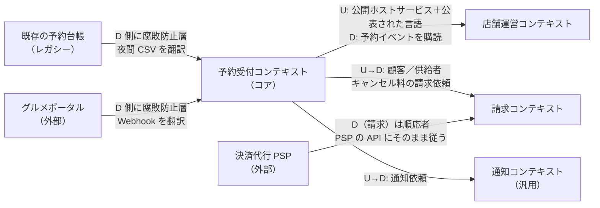
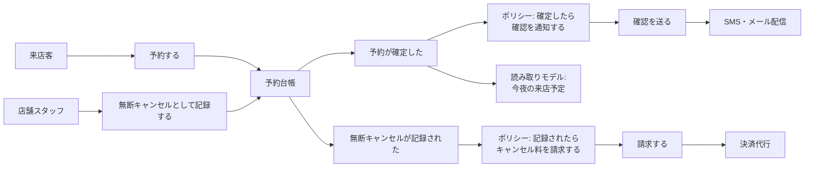
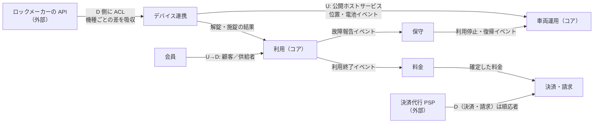

# 9.3 ドメイン駆動設計とモジュール分割

> 大きなソフトウェアを難しくしているのは、多くの場合、技術ではなく業務（ドメイン）の複雑さです。同じ「予約」という言葉が部署ごとに違う意味を持ち、境界の曖昧なモデルが至るところで矛盾を生みます。この章では、ドメイン駆動設計（DDD）の戦略的設計でシステムの境界を見つけ、戦術的設計で業務ルールを守るモデルを実装し、レガシーシステムとの境界を腐敗防止層で守る方法を身につけます。

| 項目 | 内容 |
|---|---|
| 学習時間の目安 | 本文 4h ＋ 演習 5h |
| 前提となる章 | [9.1 ソフトウェアアーキテクチャの基礎](../01-architecture-fundamentals/README.md)、[9.2 アーキテクチャスタイル](../02-architecture-styles/README.md) |
| 演習 | [exercises/](exercises/)（Python）＋ 記述演習 |
| キーワード | ドメイン駆動設計, ユビキタス言語, コアドメイン, サブドメイン, 境界づけられたコンテキスト, コンテキストマップ, 腐敗防止層, 値オブジェクト, エンティティ, 集約, ドメインイベント, リポジトリ, イベントストーミング |

## この章のゴール

- [ ] DDD の 3 つの柱（コアドメインへの集中・ユビキタス言語・モデル駆動設計）を説明できる
- [ ] サブドメインをコア・支援・汎用に分類し、作るか買うかの判断に結びつけられる
- [ ] 境界づけられたコンテキストを見つけ、コンテキストマップの関係パターンで他のコンテキストとの関係を表せる
- [ ] 値オブジェクト・エンティティ・集約・ドメインイベントを使い分け、不変条件を守るモデルを実装できる
- [ ] 集約の境界を不変条件から決め、「小さな集約」「ID による参照」「1 トランザクション 1 集約」の理由を説明できる
- [ ] レガシーシステムとの間に腐敗防止層を実装し、旧システムの言葉や形式を新しいモデルに持ち込ませないようにできる
- [ ] イベントストーミングを進行し、その結果からモジュールやサービスの境界を提案できる

## なぜ学ぶのか

- **言葉のずれは、実際の障害になる**: 1999 年、NASA の火星探査機マーズ・クライメート・オービターは、軌道の計算を誤って失われました。調査委員会の報告書は、地上ソフトウェアの 1 つのファイルが、スラスタ噴射の力積（impulse）のデータを、仕様で定められたメートル法（ニュートン秒）ではなくヤード・ポンド法（重量ポンド秒）の単位で出力しており、それを受け取る側がメートル法として扱ったことを根本原因としています。2 つのチームの間で「同じ数値」の意味が食い違い、境界での取り決めが守られなかったのです。業務システムでも「顧客」「売上」「在庫」の意味が部署ごとに違い、それを 1 つのモデルに押し込めることで、集計の食い違いや二重計上が起きます。
- **レガシーとの連携は、放っておくと新システムを蝕む**: 日本の企業では、20〜30 年前に作られた基幹システムと新しいサービスをつなぐ場面が珍しくありません。区分コード、和暦、固定長のファイル、全角と半角の混在。これらを新しいコードのあちこちで直接扱い始めると、新システムは旧システムの設計上の制約を丸ごと引き継いでしまいます。境界で翻訳する仕組み（腐敗防止層）が必要です。
- **境界の誤りは、最も高くつくアーキテクチャの誤りの 1 つ**: 9.2 で見たとおり、マイクロサービスの境界を業務に沿わずに引くと分散モノリスになります。モジュラーモノリスでも、境界を誤れば泥団子に戻ります。DDD は、業務の構造からこの境界を見つけるための代表的な方法論です。

## 1. DDD の本質

### 1.1 複雑さはどこにあるか

Fred Brooks は 1986 年の論文 "No Silver Bullet" で、ソフトウェアの複雑さを、問題そのものが持つ **本質的な複雑さ（essential complexity）** と、道具や実装の選択が生む **偶有的な複雑さ（accidental complexity）** に分けました。フレームワークや言語の進歩は後者を減らしてきましたが、前者、つまり「キャンセル料は何時間前ならいくらか」「深夜の予約は営業日のどちらに属するか」といった業務の複雑さは、技術では消せません。

Eric Evans は 2003 年の著書 "Domain-Driven Design"（邦訳『エリック・エヴァンスのドメイン駆動設計』）で、この本質的な複雑さに正面から取り組む方法を体系化しました。その核は次の 3 つです。

1. **コアドメインに集中する**: すべての部分を同じ熱量で作り込まない。事業の競争力の源泉になる部分（コアドメイン）に、最も優秀な人と最も多くの時間を投じる。
2. **ユビキタス言語（ubiquitous language）**: 業務の専門家と開発者が、会話でも文書でもコードでも、同じ言葉を同じ意味で使う。
3. **モデル駆動設計**: 業務のモデルとコードを一致させる。モデルが変わればコードが変わり、コードで気づいた矛盾はモデルの議論に戻す。

### 1.2 ユビキタス言語

レストラン予約の業務を例に、言葉を定義してみます。演習のコードは、この表の言葉でそのまま書かれています。

| 業務の言葉 | 意味 | コード上の名前 | 使わない言葉（理由） |
|---|---|---|---|
| 予約台帳 | 1 つのテーブルの 1 日分の予約の一覧 | `TableSchedule` | 「予約データ」（台帳という業務上の単位が消える） |
| 時間枠 | 予約が席を占める時間。開始は 15 分単位 | `TimeSlot` | 「日時」（所要時間が抜け落ちる） |
| 人数 | 来店するお客様の数（1〜20 名） | `PartySize` | 「件数」「数量」 |
| 着席 | お客様が来店し席に着いたこと | `seat` / `GuestsSeated` | 「チェックイン」（ホテル業界の言葉で意味がずれる） |
| 無断キャンセル | 連絡なく来店しなかったこと。開始 15 分後から判定する | `mark_no_show` / `NO_SHOW` | 「キャンセル」（料金規定が違うので区別する） |
| キャンセル料 | キャンセル規定に基づく料金。コース料金 × 人数が基準 | `CancellationPolicy.fee` | 「違約金」（契約上の意味が異なる） |

ユビキタス言語は **1 つの境界づけられたコンテキストの中で** 統一されるものです（2.2 節）。会社全体で 1 つの言葉の定義を強制しようとすると、次節で見るように必ず破綻します。

## 2. 戦略的設計 — 境界を見つける

### 2.1 サブドメインの分類と「作るか買うか」

事業の領域（ドメイン）は、いくつかの **サブドメイン** に分けられます。DDD では、それを戦略的な重要度で 3 つに分類します。

| 分類 | 意味 | 予約 SaaS の例 | 作るか買うか |
|---|---|---|---|
| **コアドメイン** | 競争力の源泉。他社との差別化になる | 予約台帳と席の最適化、無断キャンセル対策 | 自社で作る。最も優秀な人を投じる |
| **支援サブドメイン** | 事業に必要で固有の部分もあるが、差別化にはならない | 店舗のメニュー管理、スタッフのシフト | 自社で作るが、シンプルに。外注も選択肢 |
| **汎用サブドメイン** | どの会社でも同じ | 認証、決済、メール・SMS 送信、会計 | SaaS やライブラリを買う・使う |

この分類は、CTO が技術投資を配分するときの地図になります。汎用サブドメインを自作して時間を使うのは、競合に差をつけられない部分にお金を使うことです。逆に、コアドメインを外部のパッケージに任せると、差別化の源泉を他社の製品ロードマップに委ねることになります。

### 2.2 境界づけられたコンテキスト

同じ言葉が、部署によって違う意味を持つのはよくあることです。

| 言葉 | 予約受付では | 店舗運営では | 請求では | 分析では |
|---|---|---|---|---|
| 予約 | 席と時間枠の確保 | 今日の来店予定 | キャンセル料の請求対象 | 需要予測のデータ点 |
| 顧客 | 予約者（連絡先） | 来店客（アレルギー・好み） | 支払者（カード・請求先） | 匿名化された会員 ID |
| 店舗 | 空席を提供する場所 | 自分たちの職場 | 契約先（月額料金） | 集計の単位 |

これらを 1 つの「予約」クラス、1 つの「顧客」テーブルにまとめると、どの部署の要求にも中途半端に応える、巨大で矛盾だらけのモデルになります。DDD では、**1 つのモデルが一貫して通用する範囲** を **境界づけられたコンテキスト（bounded context）** として明示し、その内側では言葉を厳密に統一し、外側とは明示的に翻訳します。

境界づけられたコンテキストは、しばしばチームの境界、モジュールやサービスの境界と一致させます。ただし「コンテキスト = マイクロサービス」ではありません。1 つのコンテキストをモジュラーモノリスの 1 モジュールとして実装してもよいし、大きなコンテキストの中に複数のサービスがあってもよいのです。

### 2.3 コンテキストマップ

コンテキスト同士の関係を図にしたものが **コンテキストマップ** です。関係には、組織的な力関係と技術的な統合方法を表す、名前の付いたパターンがあります。

| パターン | 関係 | いつ使うか |
|---|---|---|
| パートナーシップ（Partnership） | 2 チームが成否を共にし、計画を調整しながら一緒に変更する | 密接に協力できる 2 チーム |
| 共有カーネル（Shared Kernel） | モデルの一部（コード）を共有する。変更には双方の合意が必要 | 共有部分を小さく保てるとき。広げすぎると結合の元 |
| 顧客／供給者（Customer–Supplier） | 上流（供給者）が下流（顧客）の要求を計画に取り込む | 上流が下流の要望を聞く関係にあるとき |
| 順応者（Conformist） | 下流が上流のモデルをそのまま受け入れる | 上流が要望を聞かない（大手の外部サービスなど）かつ、そのモデルで困らないとき |
| 腐敗防止層（Anticorruption Layer, ACL） | 下流が翻訳層を置き、上流のモデルから自分のモデルを守る | 上流のモデルが自分に合わない（レガシー、外部サービス） |
| 公開ホストサービス（Open Host Service, OHS） | 上流が、多数の利用者向けに安定した公開のプロトコルを提供する | 利用者が多い上流 |
| 公表された言語（Published Language） | 文書化された共通の交換形式（スキーマ）でやり取りする | OHS とよく組み合わせる。業界標準の形式など |
| 別々の道（Separate Ways） | 統合しない。それぞれが独自に解決する | 統合のコストが利益を上回るとき |

演習 5 のシステム（レストラン予約 SaaS）のコンテキストマップの例です。U は上流（upstream）、D は下流（downstream）を表します。



この図から、次のような設計上の判断が読み取れます。

- 決済代行（PSP）には順応者として従う。決済の概念は汎用であり、PSP の API のモデルに合わせても困らない（ただし PSP 固有の型を請求コンテキストの外に漏らさない）。
- レガシーの予約台帳とグルメポータルに対しては、腐敗防止層で自分たちのモデルを守る。どちらも自分たちが変えられない上流で、モデルが大きく異なる。
- 予約受付は、多数の下流（店舗運営・分析など）に向けて、文書化されたイベント形式（公表された言語）で情報を公開する。

### 2.4 腐敗防止層

**腐敗防止層（ACL, anticorruption layer）** は、外部のモデルと自分のモデルの間で、翻訳だけを担当する層です。演習 3・4 で実装する ACL は、次のような旧システムのレコードを受け取ります。

```text
{"YYK_NO": "000123", "TNP_CD": "S01", "TKB_CD": "T05", "YYK_YMD": "R080315",
 "YYK_JKN": "2530", "JKN_FUN": "090", "NINZU": "４", "KYK_NM": "ﾔﾏﾀﾞ　ﾀﾛｳ",
 "TEL_NO": "090-1234-5678", "STS_KBN": "1", "CRS_KNG": "5,500", "DEL_FLG": "0"}
```

ACL が担う翻訳は、単なる項目名の置き換えにとどまりません。

| 翻訳の種類 | 例 |
|---|---|
| 言葉（項目名） | `NINZU` → `party`、`STS_KBN` → `status` |
| コード値 | 状態区分 `"1"` → `ReservationStatus.BOOKED`、`"9"` → `NO_SHOW` |
| 形式 | 和暦 `"R080315"` → 2026-03-15、30 時間制 `"2530"` → 翌日 1:30、全角数字・半角カナの正規化 |
| 識別子 | 旧システムの（店舗コード, 卓番）→ 新システムのテーブル ID |
| 暗黙のルール | 所要時間が空欄なら 120 分、削除フラグの立ったレコードは取り込まない |
| 検証とエラーの言葉 | 新しいドメインの規則（開始は 15 分単位）に反するデータを、旧システムの項目名で報告する |

演習の解答例で実際に翻訳すると、次のようになります。

```python
from acl import LegacyReservationTranslator, LegacyTranslationError

translator = LegacyReservationTranslator({("S01", "T05"): "tbl-shibuya-05"})
record = {
    "YYK_NO": "000123", "TNP_CD": "S01", "TKB_CD": "T05", "YYK_YMD": "R080315",
    "YYK_JKN": "2530", "JKN_FUN": "090", "NINZU": "４", "KYK_NM": "ﾔﾏﾀﾞ　ﾀﾛｳ",
    "TEL_NO": "090-1234-5678", "STS_KBN": "1", "CRS_KNG": "5,500", "DEL_FLG": "0",
}
r = translator.translate(record)
print(r.legacy_id, r.table_id, r.slot.start.isoformat(), r.party.value, r.status.name,
      r.customer_name, r.course_price.amount)

try:
    translator.translate(dict(record, YYK_YMD="H31.05.01", NINZU="０", STS_KBN="7"))
except LegacyTranslationError as e:
    print(e)
```

```text
000123 tbl-shibuya-05 2026-03-16T01:30:00+09:00 4 BOOKED ヤマダ タロウ 5500
旧システムの予約 000123 を変換できません（3 件）
  - YYK_YMD（予約日）: 'H31.05.01' はその元号の期間外です（値: 'H31.05.01'）
  - NINZU（人数）: 人数は 1〜20 の整数です: 0（値: '０'）
  - STS_KBN（状態区分）: 未知の状態区分です（有効: 1, 2, 3, 4, 9）（値: '7'）
```

設計のポイントは 3 つです。第一に、**業務ルールは ACL に重複して書かない**。人数が 1〜20 名であることはドメインの `PartySize` が検査し、ACL はそのエラーを旧システムの項目名に言い換えるだけです。第二に、**エラーは 1 件ずつではなく全部集める**。データ移行では、1 回の実行で全部の問題が分かる方が、業務部門との修正のやり取りが速く進みます。第三に、**知らない項目は無視する**（寛容な読み手。[9.4](../04-api-design/README.md)）。旧システムに列が追加されても、ACL は壊れません。

平成 31 年 5 月 1 日のような「存在しない和暦の日付」は、実際に日本の移行案件で問題になりうるデータです。平成から令和への改元（2019 年 5 月 1 日）の前後に、改元を想定していなかったシステムが「平成 31 年 5 月」を出力し続けた、ということが起こりえます。こうしたデータをどう扱うか（エラーにする・令和元年に読み替える）は、エンジニアが勝手に決めるのではなく、業務部門と合意すべき移行の仕様です。

## 3. 戦術的設計 — ルールを守るモデルを作る

### 3.1 値オブジェクト

**値オブジェクト（value object）** は、識別子を持たず、属性の値そのものが意味を持つオブジェクトです。金額、期間、住所、人数などが該当します。

- **不変（immutable）**: 一度作ったら変わらない。変えたいときは新しい値を作る。
- **値で比較する**: 5,500 円は、どこで作られても 5,500 円に等しい。
- **自己検証する**: 不正な値では生成できない。一度生成されたら、その値は常に正しい。

```python
from dataclasses import dataclass

@dataclass(frozen=True)
class PartySize:
    value: int

    def __post_init__(self):
        if isinstance(self.value, bool) or not isinstance(self.value, int) or not 1 <= self.value <= 20:
            raise ValueError(f"人数は 1〜20 の整数です: {self.value!r}")

print(PartySize(4) == PartySize(4), {PartySize(4), PartySize(4)})
try:
    PartySize(0)
except ValueError as e:
    print(e)
```

```text
True {PartySize(value=4)}
人数は 1〜20 の整数です: 0
```

値オブジェクトを使う最大の利点は、**検証が 1 か所に集まり、プリミティブ型の取り違えがなくなる** ことです。`book(party: int, minutes: int)` という関数は引数の順序を取り違えても動いてしまいますが、`book(party: PartySize, slot: TimeSlot)` なら取り違えようがありません。「プリミティブへの執着（primitive obsession）」を避けることで、冒頭で見た火星探査機のような「単位や意味の取り違え」による事故を型で防げます。

### 3.2 エンティティ

**エンティティ（entity）** は、属性が変わっても同一であり続ける、識別子を持つオブジェクトです。予約は、時間枠や人数が変わっても同じ予約です。エンティティは **状態遷移** を持ち、どの遷移が許されるかは業務ルールです。

```text
BOOKED ──seat──▶ SEATED ──complete──▶ COMPLETED
BOOKED ──cancel──▶ CANCELLED        （開始時刻より前のみ）
BOOKED ──mark_no_show──▶ NO_SHOW     （開始 15 分後以降のみ）
```

状態を外から `reservation.status = "cancelled"` と書き換えさせると、キャンセル料の計算やイベントの記録が迂回されます。状態の変更は、業務の言葉で名付けたメソッド（`cancel`、`seat`）だけを通して行い、そのメソッドの中でルールを検査します。

### 3.3 集約 — 整合性の境界

**集約（aggregate）** は、**一緒に整合性を保たなければならないオブジェクトの集まり** です。外からは **集約ルート** を通してのみ操作でき、1 回の操作の前後で、集約の中の不変条件（常に成り立つべきルール）が保たれます。

演習の予約システムで、集約の境界をどこに引くべきかを考えてみましょう。不変条件は「**同じテーブルで時間帯が重なる有効な予約は 1 つまで**」です。この条件は予約 1 件では判定できず、同じテーブル・同じ日の他の予約を見る必要があります。したがって、整合性の境界は予約 1 件ではなく、**1 つのテーブルの 1 日分の予約台帳（`TableSchedule`）** になります。ただし、日付をまたぐ深夜の予約（23:00〜翌 1:00 など）は翌日の台帳の予約と重なりうるので、暦日で区切った台帳だけでは守りきれません。営業日で台帳を区切る、予約の時間枠を営業日の中に制限する、隣の日の台帳も検査する、といった追加の決定が必要です（4 章のホットスポットの例は、まさにこの問いです）。演習では単純化のため、開始日が台帳の日付と同じ予約だけを扱います。

演習の解答例を動かしてみます。

```python
from datetime import date, datetime, timedelta, timezone
from reservation_domain import (DoubleBookingError, Money, PartySize, Table,
                                TableSchedule, TimeSlot)

JST = timezone(timedelta(hours=9))
now = datetime(2026, 3, 15, 10, 0, tzinfo=JST)
schedule = TableSchedule(Table("T05", min_party=2, max_party=4), date(2026, 3, 15))

def slot(h, m=0, minutes=90):
    return TimeSlot(datetime(2026, 3, 15, h, m, tzinfo=JST), minutes)

schedule.book("r1", "c1", PartySize(4), slot(18), Money(5500), now)
schedule.book("r2", "c2", PartySize(2), slot(19, 30), Money(8000), now)
try:
    schedule.book("r3", "c3", PartySize(3), slot(19), Money(5500), now)
except DoubleBookingError as e:
    print("拒否:", e)
fee = schedule.cancel("r1", datetime(2026, 3, 15, 16, 0, tzinfo=JST))  # 開始 2 時間前
print("キャンセル料:", fee)
for event in schedule.pull_events():
    print(type(event).__name__, event.reservation_id)
```

```text
拒否: テーブル T05 は 18:00〜19:30 に予約 r1 があります
キャンセル料: Money(amount=22000, currency='JPY')
ReservationBooked r1
ReservationBooked r2
ReservationCancelled r1
```

Vaughn Vernon は、集約の設計について次のような指針を示しています（"Effective Aggregate Design"、2011 年）。

1. **真の不変条件を整合性の境界の中でモデル化する**: 集約の境界は、データのまとまりではなく、同時に守るべきルールで決める。
2. **小さな集約を設計する**: 大きな集約は、同時に更新しようとする利用者どうしの衝突（ロックや楽観的ロックの失敗）を増やし、読み込みも重くなる。予約台帳を「店舗の全テーブルの 1 か月分」にすると、別々のテーブルへの予約まで衝突するようになる。
3. **他の集約は ID で参照する**: 予約は顧客オブジェクトを抱え込まず、`customer_id` だけを持つ。こうすれば集約の境界がはっきりし、別々に保存・分割できる。
4. **境界の外は結果整合性で更新する**: 1 つのトランザクションでは 1 つの集約だけを更新し、他の集約への影響はドメインイベントを介して後から反映する。例えば「キャンセル料の請求」は、予約台帳のトランザクションとは別に、`ReservationCancelled` イベントを受けた請求コンテキストが行う。

**集約はロックの単位でもあります**。複数の利用者が同じ台帳を同時に更新するときは、9.2 の演習と同じように、集約ごとの版番号による楽観的ロックで「読んだ後に誰かが変更していたら、やり直す」ようにします。

別の設計として、予約 1 件を集約とし、重なりの禁止をデータベースの制約に任せる方法もあります。PostgreSQL では、範囲型と排他制約でこれを宣言的に書けます。

```sql
CREATE EXTENSION IF NOT EXISTS btree_gist;   -- table_id（text）の等値比較を GiST で使うため
CREATE TABLE reservations (
    reservation_id text PRIMARY KEY,
    table_id       text NOT NULL,
    during         tstzrange NOT NULL,        -- 既定は半開区間 [開始, 終了)
    status         text NOT NULL,
    EXCLUDE USING gist (table_id WITH =, during WITH &&)
        WHERE (status IN ('booked', 'seated'))
);
INSERT INTO reservations VALUES
  ('r1', 'T05', tstzrange('2026-03-15 18:00+09', '2026-03-15 19:30+09'), 'booked');
INSERT INTO reservations VALUES   -- 接しているだけなので成功する
  ('r2', 'T05', tstzrange('2026-03-15 19:30+09', '2026-03-15 21:00+09'), 'booked');
INSERT INTO reservations VALUES   -- r1 と重なるので拒否される
  ('r3', 'T05', tstzrange('2026-03-15 19:00+09', '2026-03-15 20:00+09'), 'booked');
```

```text
ERROR:  conflicting key value violates exclusion constraint "reservations_table_id_during_excl"
DETAIL:  Key (table_id, during)=(T05, ["2026-03-15 10:00:00+00","2026-03-15 11:00:00+00")) conflicts with existing key (table_id, during)=(T05, ["2026-03-15 09:00:00+00","2026-03-15 10:30:00+00")).
```

（PostgreSQL 16 での実行結果。時刻はサーバーのタイムゾーン設定（ここでは UTC）で表示されています。）

| 設計 | 利点 | 欠点 |
|---|---|---|
| 台帳を集約にする（演習） | ルールがドメインのコードに集まり、DB に依存せずテストできる。キャンセル料などの関連ルールも同じ場所で扱える | 台帳の読み込みと楽観的ロックが必要。集約の大きさ（1 日分）の設計が性能に効く |
| 予約を集約にし、DB 制約で守る | 同時実行に強く、どの経路から書き込んでも DB が最後の砦になる | ルールの一部が DB に移り、特定の DB 製品に依存する。制約違反を業務エラーに翻訳する処理が必要 |

実務では両方を組み合わせることも多く、ドメインで検査したうえで、DB の制約を安全網として置きます。9.1 の演習 7 の ADR も参照してください。

### 3.4 ドメインイベント

**ドメインイベント（domain event）** は、業務の専門家が関心を持つ「起きたこと」を表すオブジェクトです。過去形で名付けます（`ReservationBooked`、`ReservationCancelled`）。

- **他の集約・コンテキストへの伝達**: キャンセル料の請求、確認メールの送信、需要分析の更新は、予約台帳の責務ではない。イベントを発行して、関心のある側が反応する（3.3 節の指針 4）。
- **監査と説明**: 何がいつ起きたかの記録になる。イベントを事実の記録として保存し、状態をそこから導く設計が **イベントソーシング** である。
- **発行のタイミング**: 演習では、集約がイベントを内部のリストに溜め、アプリケーションサービスが保存に成功した後で `pull_events` で取り出して発行する。「DB への保存は成功したのにイベントの発行に失敗した」を防ぐには、イベントを同じトランザクションで outbox テーブルに書く **トランザクショナルアウトボックス** を使う（[7.5](../../07-distributed-systems/05-messaging-and-events/README.md)）。

書き込みのモデル（集約）と読み取りのモデル（画面や検索のための形）を分ける **CQRS** も、ドメインイベントとよく組み合わされます。予約台帳の集約は「二重予約を防ぐ」ことに最適化し、「店舗の今夜の来店予定一覧」は、イベントから作った別の読み取り用モデルで提供する、という設計です。これらは強力ですが複雑さも大きいので、必要な部分に限って使います。

### 3.5 リポジトリ、ドメインサービス、ファクトリ

- **リポジトリ（repository）**: 集約を保存・取得するための、コレクションのようなインターフェース。**集約ごとに 1 つ** 用意し、集約の内部のエンティティ（予約 1 件）を直接保存するリポジトリは作りません。インターフェースはドメイン側に置き、実装はインフラ側に置きます（9.2 のポートとアダプタ）。
- **ドメインサービス（domain service）**: 特定のエンティティや値オブジェクトに属さない業務の処理。例えば「店舗のすべてのテーブルの台帳から、指定した人数と時刻に合う空席を探す」は、1 つの台帳の責務を超えるのでドメインサービスにします。状態を持たず、業務の言葉で名付けます。
- **ファクトリ（factory）**: 生成が複雑な集約やエンティティを作る責務。9.2 の演習の `Order.place` のようなファクトリメソッドもこれにあたります。生成時の不変条件の検査をここに集めます。

### 3.6 ドメインモデル貧血症の論争

Martin Fowler は 2003 年、エンティティがデータ（getter と setter）だけを持ち、業務ロジックがすべてサービス層に書かれている状態を **ドメインモデル貧血症（anemic domain model）** と呼び、オブジェクト指向の利点を捨てたアンチパターンだと批判しました。ルールがサービスのあちこちに散らばり、同じ検査が重複し、どこかで検査が漏れるからです。

一方で、業務ロジックが単純なシステムでは、1 つのトランザクションの処理を 1 つの手続きとして書く **トランザクションスクリプト**（Fowler 自身が "Patterns of Enterprise Application Architecture" で整理したパターン）の方が、素直で分かりやすいことも事実です。判断の基準は **ルールの複雑さ** です。状態遷移や不変条件が多く、同じルールを複数のユースケースが共有するなら、振る舞いをエンティティや集約に持たせる価値があります。そうでなければ、無理にドメインモデルを作る必要はありません。

## 4. イベントストーミング — モデルを発見する

### 4.1 進め方

Alberto Brandolini が考案した **イベントストーミング（EventStorming）** は、業務の専門家と開発者が一緒に、壁に付箋を貼りながらドメインを探索するワークショップです。付箋の色で要素を区別します（色の割り当ては進行役によって多少異なります）。

| 要素 | 付箋の色（一般的な例） | 例 |
|---|---|---|
| ドメインイベント | オレンジ | 予約が確定した、お客様が着席した |
| コマンド | 青 | 予約する、キャンセルする |
| アクター（人） | 小さな黄色 | 来店客、店舗スタッフ |
| ポリシー（〜したら〜する） | 紫 | 予約が確定したら確認メールを送る |
| 読み取りモデル | 緑 | 空席の一覧、今夜の来店予定 |
| 外部システム | ピンク | 決済代行、グルメポータル |
| 集約 | 大きな黄色 | 予約台帳 |
| ホットスポット（問題・疑問） | 赤（斜めに貼る） | 「深夜 0 時をまたぐ予約はどの日の台帳？」 |

典型的な流れは次の通りです。

1. **混沌とした探索**: 全員が、思いつく限りのドメインイベントを過去形でオレンジの付箋に書き、壁に貼る。重複や矛盾は気にしない。
2. **時系列に並べる**: イベントを時間の流れに沿って並べ、重複をまとめ、抜けを補う。言葉の食い違い（「来店」と「着席」は同じか）が見つかったら、ホットスポットとして記録する。
3. **重要なイベント（pivotal events）を見つける**: 業務の段階が切り替わる大きなイベント（予約が確定した、来店した、請求が確定した）に印を付ける。ここがコンテキストの境界の候補になる。
4. **原因を加える**: 各イベントを引き起こすコマンド、アクター、外部システム、ポリシーを付け足す。
5. **集約と境界を見つける**: コマンドを受けてイベントを出す「整合性の塊」を集約として名付け、言葉と責務のまとまりから、境界づけられたコンテキストの線を引く。



### 4.2 成功させるコツ

- **業務の専門家を必ず呼ぶ**。開発者だけで行うと、自分たちの想像のモデルを確認するだけになる。
- **大きな壁と十分な付箋**。紙の上で自由に動かせることが、議論の速さを生む（オンラインのホワイトボードでも代用できる）。
- **ホットスポットを歓迎する**。誰も答えられない疑問こそ、要件の穴や部署間の認識のずれを示している。
- **最初から正しい境界を求めない**。境界の候補を複数出し、ユースケースを通して比べる。

## 5. モジュールとサービスの境界を決める

イベントストーミングの結果や既存のシステムから、境界を決めるときの判断材料は次の通りです。

| 判断材料 | 境界を引くべきサイン |
|---|---|
| 言葉 | 同じ言葉の意味が変わる場所（「予約」が「請求対象」になる場所） |
| 重要なイベント | 業務の段階の切り替わり（予約確定の前と後） |
| 業務能力 | 「予約を受け付ける」「請求する」のような、組織が持つ能力の単位 |
| データの所有 | どのデータを誰が作り、誰が変更の責任を持つか |
| 変更の頻度と理由 | 一緒に変わるものは同じ側に、別の理由で変わるものは別の側に |
| 整合性の要求 | 即時に一貫していなければならないものは同じ側に（集約・トランザクション） |
| チーム | 1 つのチームが責任を持てる大きさか（[13.6](../../13-technical-leadership/06-team-and-org-design/README.md)） |

境界の良し悪しは、次の問いで確かめられます。

- **よくある変更の大半が、1 つのコンテキストの中で完結するか**。完結しないなら、境界がずれている。
- **コンテキスト間のやり取りは、少数の明確な API やイベントに収まっているか**。細かい呼び出しが大量に行き来するなら、分けるべきでない場所で分けている。
- **片方の内部を変えても、もう片方のテストが壊れないか**。

最初はモジュラーモノリスの 1 モジュールとして境界を実装し、境界が安定し、独立したデプロイやスケールの必要が生じてからサービスに切り出すのが、9.2 で見たとおり最も安全な進め方です。

## 6. DDD を使うべきでないとき

DDD、特に戦術的設計には、学習と実装のコストがかかります。次の場合は、より単純な方法の方が適しています。

- **業務ルールがほとんどない CRUD**: 入力を検証して保存し、一覧を表示するだけの管理画面に、集約やドメインイベントは不要です。
- **汎用サブドメイン**: 認証、決済、会計などは、既製品を使うのが基本です。自作するとしても、凝ったモデルは要りません。
- **使い捨てのプロトタイプ**: 仮説を検証するためのコードに、長期の保守を前提にした設計は過剰です（ただし、生き残ったプロトタイプを作り直す判断は必要です）。

逆に、**戦略的設計（サブドメインの分類、境界づけられたコンテキスト、コンテキストマップ）は、ほぼすべての規模の組織で役に立ちます**。戦術的なパターン（エンティティ、リポジトリ）だけを形式的に取り入れ、境界と言葉の議論をしないやり方は「DDD ライト」と呼ばれ、コストだけを払って本来の利点を得られない失敗の典型です。

## よくある落とし穴

1. **会社全体で 1 つの統一モデルを作ろうとする**。「顧客」の定義を全部署で統一しようとして、誰にも使いにくい巨大なモデルができる。境界づけられたコンテキストごとにモデルを分け、境界で翻訳する。
2. **戦術的パターンだけを真似る**。リポジトリやエンティティのクラスは作ったが、業務の専門家と言葉を合わせず、境界も議論しない。まず戦略的設計（サブドメイン・コンテキスト・言葉）から始める。
3. **集約を大きくしすぎる**。「店舗」集約にすべてのテーブル・予約・メニューを入れ、同時更新の衝突と読み込みの遅さに苦しむ。集約の境界は、同時に守るべき不変条件だけで決める。
4. **集約の内部を外から直接変更させる**。内部のエンティティをそのまま返し、呼び出し側が状態を書き換えて不変条件を迂回する。集約ルートのメソッドだけで変更し、読み取りはコピーや読み取り専用の形で返す。
5. **1 つのトランザクションで複数の集約を更新する**。ロックの範囲が広がり、分割もできなくなる。他の集約への影響はドメインイベントと結果整合性で反映する。
6. **レガシーのモデルを新システムに直接持ち込む**。区分コードや和暦の文字列が新しいコードのあちこちに現れ、旧システムの制約を永遠に引きずる。境界に腐敗防止層を置き、翻訳をそこに閉じ込める。
7. **腐敗防止層に業務ルールを書く**。検証ルールが ACL とドメインに二重に存在し、食い違う。ACL は翻訳に徹し、ルールの検査はドメインに任せる。
8. **単純な CRUD に DDD を持ち込む**。層とクラスが増えるだけで、得るものがない。ルールの複雑さに応じて、トランザクションスクリプトや単純なレイヤードを選ぶ。

## CTOの視点

1. **サブドメインの分類で、人と予算の配分を決める**。コアドメインには社内の最も優秀なエンジニアとプロダクトマネージャーを置き、汎用サブドメイン（認証・決済・通知・会計）は SaaS やオープンソースを使う、という方針を明示します。「なぜこれを自社で作っているのか」を問い、差別化につながらない自作をやめることは、CTO が下せる最も効果の大きいコスト削減の 1 つです（[14.2](../../14-cto/02-technology-strategy/README.md)）。
2. **コンテキストマップを組織図と並べて見る**。上流・下流の関係は、チーム間の力関係と依存関係そのものです。下流のチームが上流の変更に振り回され続けているなら、顧客／供給者の関係を明文化する、ACL を置く予算をつける、チームの境界を変える、といった組織的な手当てが必要です。
3. **レガシー刷新の見積もりに ACL と移行データの品質を含める**。基幹システムの刷新では、データの翻訳と品質問題（存在しない日付、コードの揺れ、重複）が、スケジュールの遅延の大きな原因になります。移行データの試験変換を早い段階で行い、エラーの件数と種類を業務部門と一緒に確認する計画を、最初から予算とスケジュールに組み込みます。
4. **イベントストーミングに事業側の時間を確保する**。業務の専門家の半日〜数日は安くありませんが、境界の誤りを後から直すコストに比べればわずかです。新規事業の立ち上げや大きな刷新の前には、経営として事業部門の参加を約束させます。
5. **採用では「業務の言葉で話せるか」を見る**。設計面接で、技術の名前ではなく業務のルール（キャンセル料、状態遷移、例外）から質問を始め、候補者がそれをモデルに落とし込めるかを見ます。ドメインの専門家に質問して言葉を引き出す力は、シニアエンジニアの重要な資質です。

## 演習

演習コードは [exercises/reservation_domain.py](exercises/reservation_domain.py)（ドメインモデル）と [exercises/acl.py](exercises/acl.py)（腐敗防止層）にあります。解答例は [solutions/](solutions/) にあります。

```bash
python3 tools/check.py 9.3        # リポジトリのルートで実行
python3 tools/check.py -v 9.3     # 詳しい出力
```

| # | 難易度 | 内容 | 対象 |
|---|---|---|---|
| 1 | ★☆☆ | 値オブジェクト: 人数・時間枠（半開区間の重なり）・金額（端数処理）・キャンセル規定・テーブル | `reservation_domain.py`: `PartySize`, `TimeSlot`, `Money`, `CancellationPolicy`, `Table` |
| 2 | ★★★ | 集約ルート: 二重予約の禁止、定員、状態遷移、キャンセル料、無断キャンセル、ドメインイベント | `reservation_domain.py`: `TableSchedule` |
| 3 | ★★☆ | 腐敗防止層の項目変換: 和暦・西暦の日付、30 時間制の時刻、電話番号、金額、人数 | `acl.py`: `parse_legacy_date` ほか |
| 4 | ★★☆ | 腐敗防止層のレコード変換: 識別子の対応づけ、コード値の翻訳、エラーの一括収集 | `acl.py`: `LegacyReservationTranslator` |
| 5 | ★★☆ | 記述: イベントストーミングとコンテキストマップ（下記） | — |

### 演習 5（記述）: シェアサイクル事業のイベントストーミング

次の事業について、(1)〜(4) を作成してください。

> 都市部でシェアサイクルを運営する会社。利用者はアプリで会員登録し、クレジットカードを登録する。ステーション（駐輪場）にある自転車をアプリで解錠して借り、別のステーションで返却する。料金は 30 分ごとの従量課金と、月額の乗り放題プランがある。自転車にはスマートロックと GPS が付いていて、定期的に位置と電池残量を送信する。自転車が特定のステーションに偏ると、再配置チームがトラックで運ぶ。利用者から故障の報告があれば、保守チームが回収して修理する。法人向けには、社員の利用分をまとめて月末に請求する。

(1) 主要なドメインイベントを、時系列に 15 個以上挙げてください（過去形で）。
(2) 境界づけられたコンテキストを 5〜7 個に分け、それぞれをコア・支援・汎用に分類してください。
(3) コンテキストマップを Mermaid で描き、関係パターン（顧客／供給者、ACL、順応者など）を示してください。
(4) コアドメインはどれか、その理由とともに説明してください。また、「自転車」という言葉がコンテキストごとにどう意味を変えるかを説明してください。

<details>
<summary>解答例</summary>

**(1) ドメインイベント（時系列の例）**

会員登録が完了した → カードが登録された → 月額プランに加入した → 自転車が予約された（任意）→ 自転車が解錠された → 利用が開始された → 位置が報告された → 電池残量の低下が検知された → 自転車が返却された → 利用が終了した → 利用料金が確定した → 決済が完了した（または決済が失敗した）→ ステーションの偏りが検知された → 再配置が指示された → 自転車が積み込まれた → 自転車が再配置された → 故障が報告された → 自転車が利用停止にされた → 修理が完了した → 自転車が運用に戻された → 法人の月次請求が確定した

**(2) 境界づけられたコンテキストと分類**

| コンテキスト | 責務 | 分類 |
|---|---|---|
| 利用（貸出・返却） | 解錠・利用の開始と終了、利用の記録 | コア |
| 車両運用（再配置・需要予測） | ステーションの在庫の把握、偏りの検知、再配置の計画 | コア |
| 料金 | 従量・月額プランの料金計算、割引 | 支援 |
| 会員 | 会員登録、本人確認、法人との紐付け | 支援 |
| 保守 | 故障報告、回収、修理、運用への復帰 | 支援 |
| 決済・請求 | カード決済、法人の月次請求 | 汎用（PSP・会計サービスを利用） |
| デバイス連携（IoT） | ロックの制御、位置・電池の受信 | 支援（ロックメーカーの API を使う） |

**(3) コンテキストマップ**



**(4) コアドメインと言葉の違い**

- コアドメインは「利用」と「車両運用」です。利用者の体験（すぐ借りられ、確実に返せること）と、自転車の偏りを少ないコストで解消する再配置の最適化が、事業の収益性と競争力を直接決めます。決済や会員登録は重要ですが、他社と差がつく部分ではないので、既製品と単純な実装で済ませます。
- 「自転車」の意味の違い: 利用コンテキストでは「今借りられる乗り物（解錠可能か）」、車両運用では「ステーションの在庫の 1 単位（位置と電池残量）」、保守では「修理の対象の資産（故障履歴・部品）」、デバイス連携では「ロックの機器 ID と通信状態」、料金では登場しない（利用時間だけが重要）。これを 1 つの「自転車」テーブルにまとめると、各部署の都合の列が際限なく増えていきます。

採点の観点:

- イベントが過去形で書かれ、業務の段階の切り替わり（利用終了、料金確定、再配置の指示）が捉えられていれば合格ラインです。
- コアと汎用の区別に「差別化になるか」という理由が添えられ、外部 API との境界に ACL・順応者の選択が理由とともに示されていれば優秀です。
- 同じ言葉がコンテキストごとに意味を変えることを具体的に説明できていれば、境界づけられたコンテキストの本質を理解しています。

</details>

## 理解度チェック

**Q1. 境界づけられたコンテキストとは何ですか。「会社全体で 1 つの顧客モデルを作る」方針の問題点とあわせて説明してください。**

<details>
<summary>解答</summary>

境界づけられたコンテキストは、1 つのモデル（とユビキタス言語）が一貫して通用する範囲のことです。その内側では言葉の意味を厳密に統一し、外側のコンテキストとは明示的に翻訳してやり取りします。

「顧客」は、営業では見込み客を含む取引先、請求では支払者と請求先、サポートでは問い合わせの主体、と部署ごとに意味も必要な属性も違います。1 つのモデルに統合しようとすると、全部署の属性とルールが混ざった巨大なモデルになり、どの部署にとっても使いにくく、1 つの部署の変更が他部署に波及します。コンテキストごとにモデルを分け、共通の識別子（顧客 ID）で対応づけるのが DDD の考え方です。

</details>

**Q2. コア・支援・汎用のサブドメインの違いを説明し、それぞれに対する投資の方針を述べてください。**

<details>
<summary>解答</summary>

- **コアドメイン**: 事業の競争力の源泉で、他社との差別化になる部分。自社で作り、最も優秀な人材と時間を投じ、深いモデリングを行います。
- **支援サブドメイン**: 事業に必要で固有の部分もあるが、差別化にはならない部分。自社で作ることが多いが、シンプルな設計にとどめ、外注も選択肢に入れます。
- **汎用サブドメイン**: どの会社でも同じような部分（認証、決済、メール送信、会計など）。既製の SaaS やライブラリを使い、自作は避けます。

</details>

**Q3. 予約システムで「同じテーブルで時間帯が重なる有効な予約は 1 つまで」という不変条件を守るとき、予約 1 件を集約にすると何が問題になりますか。どんな設計の選択肢がありますか。**

<details>
<summary>解答</summary>

この不変条件は、同じテーブルの他の予約を見なければ判定できません。予約 1 件を集約にして、それぞれを別のトランザクションで保存すると、2 つのリクエストが同時に「重なる予約はない」と確認してから保存する、という競合（書き込みスキュー）で二重予約が起きます。

選択肢:

- 同じテーブル・同じ日の予約をまとめた「予約台帳」を集約にし、台帳単位の楽観的ロックで同時更新を直列化する（演習の設計）。
- 予約 1 件を集約にしたまま、データベースの排他制約（PostgreSQL の EXCLUDE 制約など）や一意制約で重なりを禁止し、違反を業務エラーに翻訳する。
- 実務では、ドメインでの検査と DB の制約を組み合わせ、DB を最後の安全網にすることも多いです。

</details>

**Q4. 値オブジェクトとエンティティの違いを、例を挙げて説明してください。**

<details>
<summary>解答</summary>

- **値オブジェクト**は識別子を持たず、属性の値そのものが意味を持ちます。不変で、値が等しければ同じものとみなします。例: 金額（5,500 円）、時間枠（18:00〜19:30）、人数（4 名）。変えたいときは新しい値を作ります。
- **エンティティ**は識別子を持ち、属性が変わっても同じものであり続けます。状態遷移とライフサイクルを持ちます。例: 予約（時間枠を変更しても同じ予約番号の予約）、注文、会員。

判断の基準は「2 つのオブジェクトの属性がすべて同じとき、同じものとみなしてよいか」です。同じ金額の 2 つの Money は区別する必要がありませんが、同姓同名で同じ日時の 2 件の予約は別の予約です。

</details>

**Q5. 集約の設計指針「他の集約は ID で参照する」「1 つのトランザクションで更新するのは 1 つの集約」の理由を説明してください。**

<details>
<summary>解答</summary>

- **ID で参照する**: 他の集約をオブジェクトとして抱え込むと、境界が曖昧になり、読み込むデータが増え、どこまでが整合性の範囲なのか分からなくなります。ID だけを持てば、集約を別々に保存・取得でき、将来別のデータベースやサービスに分けることもできます。
- **1 トランザクション 1 集約**: 複数の集約を 1 つのトランザクションで更新すると、ロックの範囲が広がって同時実行性が下がり、集約を別々のサービスやデータベースに分割できなくなります。集約をまたぐ整合性は、ドメインイベントを介した結果整合性で扱います（例: 予約のキャンセルと、キャンセル料の請求は別のトランザクション）。

</details>

**Q6. 腐敗防止層（ACL）の役割と、ACL に業務ルールを書くべきでない理由を説明してください。**

<details>
<summary>解答</summary>

ACL は、外部（レガシーシステムや外部サービス）のモデルと自分のモデルの間で、言葉・コード値・形式・識別子を翻訳する層です。外部のモデルの都合が自分のモデルに入り込む（腐敗する）のを防ぎ、外部の変更の影響を ACL の中に閉じ込めます。

業務ルール（人数は 1〜20 名、開始は 15 分単位など）を ACL にも書くと、ドメインと ACL にルールが二重に存在し、片方だけが変更されたときに食い違いが生じます。ACL は形式の翻訳に徹し、ルールの検査はドメインの値オブジェクトや集約に任せ、その結果のエラーを外部の言葉（旧システムの項目名）に言い換えて報告するのが正しい分担です。

</details>

**Q7. イベントストーミングで「重要なイベント（pivotal events）」を探すのはなぜですか。**

<details>
<summary>解答</summary>

重要なイベントは、業務の段階が切り替わる地点（予約が確定した、来店した、請求が確定した）です。その前後で、関わる人・使う言葉・扱うデータ・責任の所在が変わることが多く、境界づけられたコンテキストの境界の有力な候補になります。

また、時系列に並べた大量のイベントを、いくつかの段階に区切って整理する目印にもなり、ワークショップの議論を構造化するのに役立ちます。

</details>

**Q8. 業務ルールがほとんどない社内の備品管理アプリ（登録・貸出・返却の記録だけ）に、DDD の戦術的設計を適用すべきですか。理由とともに答えてください。**

<details>
<summary>解答</summary>

多くの場合、適用すべきではありません。集約・ドメインイベント・リポジトリの抽象化は、複雑な業務ルールと不変条件を守るための道具で、ルールがほとんどない CRUD では、層とクラスが増えるだけで得るものがありません。フレームワークの規約に沿った単純なレイヤード構成や、トランザクションスクリプトで十分です。

ただし、戦略的な視点（これは汎用サブドメインか、既製品で済まないか、他のシステムとの境界はどこか）は、小さなアプリでも役に立ちます。また、将来ルールが複雑になったら（貸出の承認フロー、予約の競合など）、その部分からモデルを育てればよいのです。

</details>

## さらに学ぶために

- Eric Evans "Domain-Driven Design"（邦訳『エリック・エヴァンスのドメイン駆動設計』翔泳社）— DDD の原典。戦略的設計（後半の部）こそが本書の核心なので、戦術的パターンだけで読むのをやめないこと。
- Vlad Khononov "Learning Domain-Driven Design"（邦訳『ドメイン駆動設計をはじめよう』オライリー・ジャパン）— サブドメインの分類から実装パターンの選び方までを、現代的な文脈で簡潔に整理した入門書。最初の 1 冊に薦める。
- Vaughn Vernon "Implementing Domain-Driven Design"（邦訳『実践ドメイン駆動設計』翔泳社）と、同じ著者の "Effective Aggregate Design"（2011）— 集約の設計指針とコンテキストマップの実装を具体的に学べる。
- 成瀬允宣『ドメイン駆動設計入門 ボトムアップでわかる！ドメイン駆動設計の基本』（翔泳社）— 値オブジェクトやエンティティなどの戦術的設計を、日本語のコード例で段階的に学べる。
- Alberto Brandolini "Introducing EventStorming"（Leanpub）— イベントストーミングの考案者による解説。ワークショップの進め方と、よくある失敗の避け方が具体的。
- Martin Fowler "Patterns of Enterprise Application Architecture"（邦訳『エンタープライズ アプリケーションアーキテクチャパターン』翔泳社）— トランザクションスクリプト、ドメインモデル、リポジトリなど、業務アプリケーションの構造の定番パターン集。

## まとめ

- DDD の核は **コアドメインへの集中・ユビキタス言語・モデル駆動設計** の 3 つ。技術では消せない業務の本質的な複雑さに、モデルで立ち向かう。
- サブドメインを **コア・支援・汎用** に分類し、作るか買うか、誰を投じるかを決める。
- 1 つのモデルが通用する範囲を **境界づけられたコンテキスト** として明示し、関係を **コンテキストマップ** のパターンで表す。レガシーや外部サービスとの境界には **腐敗防止層** を置く。
- **値オブジェクト** は不変・値で比較・自己検証。**エンティティ** は識別子と状態遷移を持つ。状態の変更は業務の言葉のメソッドだけで行う。
- **集約** は不変条件で決まる整合性の境界。小さく保ち、他の集約は ID で参照し、1 トランザクションで 1 つだけ更新する。境界の外へは **ドメインイベント** と結果整合性で伝える。
- **イベントストーミング** で業務の専門家と一緒にドメインイベントを並べ、重要なイベントと言葉の変わり目から境界を見つける。
- 単純な CRUD には DDD の戦術的設計は不要。ただし戦略的設計の視点は、どの規模でも役に立つ。
