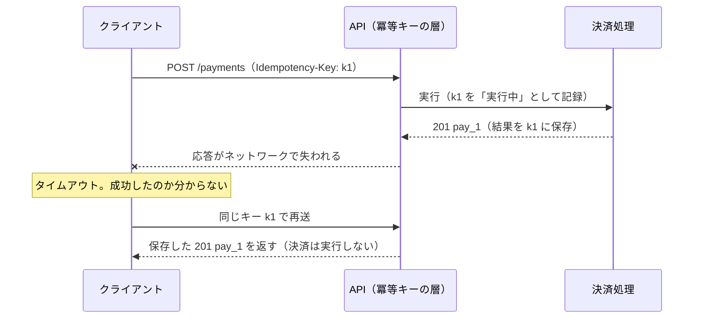

# 9.4 API設計

> API は、一度公開すると自分たちだけでは変えられない「契約」であり、社内外の開発者が使う「プロダクト」です。この章では、REST・gRPC・GraphQL・Webhook の使い分け、リソースの設計、ページネーション、エラーの表現、冪等性、バージョニングと後方互換性、レート制限、セキュリティまでを、「数年後にも壊れず、使いやすい API」を作るという観点で身につけます。

| 項目 | 内容 |
|---|---|
| 学習時間の目安 | 本文 4h ＋ 演習 6h |
| 前提となる章 | [5.3 DNS・HTTP・TLS](../../05-networking/03-dns-http-tls/README.md)、[9.1 ソフトウェアアーキテクチャの基礎](../01-architecture-fundamentals/README.md) |
| 演習 | [exercises/](exercises/)（Python）＋ 記述演習 |
| キーワード | ハイラムの法則, REST, HTTP セマンティクス, gRPC, GraphQL, Webhook, カーソルページネーション, Problem Details, 冪等キー, 後方互換性, バージョニング, 非推奨化, レート制限, OpenAPI, OWASP API Security Top 10 |

## この章のゴール

- [ ] API を契約として捉え、ハイラムの法則を踏まえて「何を約束し、何を約束しないか」を設計できる
- [ ] REST・gRPC・GraphQL・Webhook の特性を比較し、用途に合わせて選べる
- [ ] HTTP のメソッド・ステータスコード・条件付きリクエストを正しく使い分けられる
- [ ] 挿入や削除が起きても重複・欠落しないカーソルページネーションを実装できる
- [ ] Problem Details（RFC 9457）でエラーを表現し、冪等キーで安全な再送を実装できる
- [ ] 後方互換な変更と破壊的な変更を、リクエストとレスポンスの向きの違いを含めて判定できる
- [ ] バージョニング・非推奨化・レート制限・認可（オブジェクトレベルの認可を含む）の方針を、API のガイドラインとして示せる

## なぜ学ぶのか

- **公開した瞬間から、変更の自由を失う**: Google のエンジニア Hyrum Wright の名を取った **ハイラムの法則** は、「API の利用者が十分に多ければ、契約で何を約束したかに関係なく、システムの観察可能なすべての振る舞いに、誰かが依存するようになる」と述べています（『Googleのソフトウェアエンジニアリング』でも紹介されています）。エラーメッセージの文言、JSON のキーの順序、応答にかかる時間でさえ、誰かの依存の対象になります。
- **API の設計は、データの守り方そのもの**: 2018 年、Facebook は、最大 8,700 万人の情報が不適切に Cambridge Analytica に共有された可能性があると発表しました。データは、ある研究者の性格診断アプリを通じて集められましたが、当時の Facebook の Graph API（v1.0）は、アプリの利用者だけでなく、その **友人** の情報まで取得できる設計でした。API がどの範囲のデータを、どの権限で返すかという設計判断は、企業の存続に関わるリスクになりえます。
- **API の失敗は、利用者の障害として現れる**: 破壊的変更をうっかりリリースすれば、自社のアプリだけでなく、顧客や取引先のシステムが一斉に止まります。重複課金を防ぐ冪等性、並行して更新されても壊れないページネーションは、利用者にとっての信頼そのものです。

## 1. API は契約であり、プロダクトである

### 1.1 契約とハイラムの法則

API の仕様書に書かれたことは契約の一部ですが、ハイラムの法則が示すとおり、実際の契約は「観察できるすべての振る舞い」です。したがって設計者は、**約束する範囲を意図的に狭く保つ** 必要があります。

- 返す必要のないフィールドは返さない（後から削除できなくなる）。
- 並び順を約束しないなら、仕様にそう書き、テスト環境ではあえて順序を変えてみる。
- 識別子の形式（連番か、文字数はいくつか）を利用者に推測させない。ID は「不透明な文字列」として扱うよう仕様で明示する。
- エラーの判定には、メッセージの文言ではなく、安定した機械可読のコード（後述の `type`）を使わせる。

### 1.2 API は「プロダクト」

API の利用者は開発者です。その体験（DX, developer experience）の良し悪しは、採用されるかどうか、問い合わせの量、利用者のバグの量を左右します。

| 観点 | 良い API | 悪い API |
|---|---|---|
| 一貫性 | 命名・ページネーション・エラーの形がすべてのエンドポイントで同じ | エンドポイントごとに流儀が違う |
| エラー | 何が悪く、どう直せばよいかが分かる | `{"error": "failed"}` |
| ドキュメント | スキーマから生成され、実装と常に一致している | 手書きで、実装とずれている |
| 試しやすさ | テスト用の環境（サンドボックス）と SDK がある | 本番でしか試せない |
| 変更 | 互換性の方針が明文化され、廃止は予告される | ある日突然壊れる |

### 1.3 内部 API と公開 API

| | 内部 API（自社のサービス間） | 公開 API（顧客・取引先向け） |
|---|---|---|
| 利用者 | 知っている。連絡でき、同時に直せる | 知らない。連絡も強制もできない |
| 互換性の期間 | 数週間〜数か月の移行も可能 | 年単位。事実上、永久に近いことも |
| 変更の検知 | 全利用者のコードを検索できる（モノレポなら特に） | 利用状況はログからしか分からない |
| 技術 | gRPC など効率重視も選べる | HTTP と JSON など、敷居の低い技術が基本 |

ただし「内部だから雑でよい」は危険です。組織が大きくなると内部 API の利用者も把握しきれなくなり、実質的に公開 API と同じ性質を持つようになります。

## 2. API のスタイル

### 2.1 REST と HTTP のセマンティクス

**REST** は、Roy Fielding が 2000 年の博士論文で示したアーキテクチャスタイルです。実務で「REST API」と呼ばれるものの多くは、**リソース（名詞）を URL で識別し、HTTP のメソッドで操作する** API を指します。HTTP のセマンティクス（RFC 9110）を正しく使うと、キャッシュ・再送・プロキシといった HTTP の仕組みがそのまま味方になります。

| メソッド | 用途 | 安全（読み取り専用） | 冪等 | 例 |
|---|---|---|---|---|
| GET | 取得 | はい | はい | `GET /orders/ord_123` |
| POST | 作成・処理の実行 | いいえ | **いいえ** | `POST /orders` |
| PUT | 全体の置き換え（なければ作成） | いいえ | はい | `PUT /users/u1/settings` |
| PATCH | 部分更新 | いいえ | 保証されない | `PATCH /orders/ord_123` |
| DELETE | 削除 | いいえ | はい | `DELETE /orders/ord_123` |

**冪等（idempotent）** とは、同じリクエストを何回送っても、1 回送ったのと同じ結果になることです。GET・PUT・DELETE は冪等なので、タイムアウトしたら安全に再送できますが、POST は再送すると二重に作成されうるため、6 章の冪等キーが必要になります。

ステータスコードは「何が起きたか」を機械に伝える第一の手段です。よく使うものを整理します。

| コード | 意味 | 使う場面 | 再試行 |
|---|---|---|---|
| 200 / 201 / 204 | 成功 / 作成した / 本文なしの成功 | 201 には作成したリソースの `Location` を付ける | — |
| 202 | 受け付けた（処理は後で） | 時間のかかる処理。処理の状態を問い合わせる URL を返す | — |
| 304 | 変更なし | `If-None-Match` の ETag が一致したとき（キャッシュの再検証） | — |
| 400 | リクエストが不正 | 形式の誤り、検証エラー | 直さない限り無駄 |
| 401 / 403 | 未認証 / 権限なし | 401 は認証情報がないか無効、403 は認証済みだが許可されていない | 直さない限り無駄 |
| 404 | 見つからない | 存在しない、または存在を知らせたくない（権限のないリソース） | 無駄 |
| 409 | 競合 | 状態の衝突（すでにキャンセル済み、同じ処理が実行中） | 状況による |
| 412 / 428 | 前提条件の不一致 / 前提条件が必要 | `If-Match` の ETag が一致しない（楽観的ロックの失敗）/ `If-Match` を必須にしている | 読み直してから |
| 422 | 内容を処理できない | 形式は正しいが意味的に処理できない | 直さない限り無駄 |
| 429 | リクエストが多すぎる | レート制限。`Retry-After` を付ける | 待ってから |
| 500 / 502 / 503 / 504 | サーバー側・中継の障害 | 503 には `Retry-After` を付けてよい | バックオフして再試行 |

条件付きリクエストは、API の **楽観的ロック** にも使えます。`GET` で受け取った `ETag` を、更新時に `If-Match` で送り返してもらい、その間に誰かが更新していたら 412 を返します。9.2 の演習でリポジトリに実装した版番号の検査を、HTTP のレベルで表現したものです。

**HATEOAS**（応答に「次に取れる操作」のリンクを含め、クライアントがそれをたどる）は REST の本来の制約の 1 つですが、実務の JSON API で本格的に採用されている例は多くありません。クライアントの多くは、ドキュメントや SDK に書かれた URL を直接組み立てるからです。ただし、ページネーションの次のページの URL や、作成したリソースの `Location` のように、リンクを返す考え方は部分的に広く使われています。

### 2.2 RPC — gRPC と Protocol Buffers

**gRPC** は Google が 2015 年に公開した RPC の仕組みで、HTTP/2 の上で、**Protocol Buffers（Protobuf）** というインターフェース定義言語とバイナリ形式を使います。

```protobuf
// 抜粋（GetOrderRequest などのメッセージと、OrderStatus の定義は省略）
syntax = "proto3";

service OrderService {
  rpc GetOrder(GetOrderRequest) returns (Order);                  // 単項（1 要求 → 1 応答）
  rpc WatchOrders(WatchOrdersRequest) returns (stream OrderEvent); // サーバーストリーミング
}

message Order {
  string id = 1;
  int64 total_yen = 2;
  reserved 3;               // 削除したフィールドの番号は再利用させない
  reserved "coupon_code";
  OrderStatus status = 4;
}
```

- **型付きの契約とコード生成**: `.proto` ファイルから、各言語のクライアントとサーバーの型付きのコードを生成できる。
- **ストリーミング**: 単項・サーバーストリーミング・クライアントストリーミング・双方向ストリーミングの 4 種類。
- **効率**: バイナリ形式で小さく速い。サービス間の内部通信に向く。
- **互換性の規則はフィールド番号にある**: Protobuf のメッセージは、送信時にフィールド名ではなく **番号** で識別されます。フィールド名を変えてもバイナリ形式の互換性は保たれますが（JSON 形式に変換して使う場合や、フィールド名で指定する FieldMask では名前が効くので、名前の変更も非互換になります）、**番号を変える・再利用する** と、古いクライアントが別の意味で読んでしまいます。削除したフィールドは `reserved` で番号と名前を封印します。型の変更は、一部の整数型どうしのような例外を除いて非互換です。
- **弱点**: ブラウザから直接使うには中継（gRPC-Web など）が必要。バイナリなので、curl で気軽に試せない。

### 2.3 GraphQL

**GraphQL** は Facebook が 2015 年に公開したクエリ言語と実行系で、クライアントが必要なフィールドだけを 1 回の要求で指定できます。

```graphql
query {
  order(id: "ord_123") {
    total
    items { name quantity }
    customer { name }
  }
}
```

- **利点**: 画面ごとに必要なデータを 1 往復で取れる（取りすぎ・取り足りなさがない）。型付きのスキーマがあり、フィールド単位の非推奨化（`@deprecated`）で、バージョンを分けずに進化させやすい。
- **N+1 問題**: 素朴に実装すると、注文 100 件のそれぞれで「顧客を取得」するリゾルバが呼ばれ、DB への問い合わせが 101 回になります。対策は、1 回の要求の中で必要な ID を集めて、まとめて取得する **DataLoader** の考え方です。

```python
queries = []

def fetch_authors(ids):  # 著者をまとめて取得する（1 回の問い合わせ）
    queries.append(f"SELECT * FROM authors WHERE id IN ({', '.join(map(str, ids))})")
    return {i: f"author-{i}" for i in ids}

posts = [{"id": n, "author_id": n % 3} for n in range(10)]

for p in posts:                       # N+1: 投稿 1 件ごとに著者を問い合わせる
    fetch_authors([p["author_id"]])
print("N+1 :", len(queries), "回")

queries.clear()                       # DataLoader の考え方: ID を集めて、重複を除き、1 回で取る
authors = fetch_authors(sorted({p["author_id"] for p in posts}))
print("バッチ:", len(queries), "回 →", queries[0])
```

```text
N+1 : 10 回
バッチ: 1 回 → SELECT * FROM authors WHERE id IN (0, 1, 2)
```

- **クエリのコスト制限**: クライアントが自由にクエリを書けるので、深くネストした巨大なクエリ 1 つでサーバーを止められます。深さの上限、クエリのコストの見積もりと上限（GitHub の GraphQL API は、クエリのコストをポイントで計算して制限しています）、事前に登録したクエリだけを許可する方式などで守ります。
- **その他の弱点**: すべてが POST と 1 つの URL になりやすく、HTTP のキャッシュが効きにくい。認可をフィールドやリゾルバの単位で漏れなく行う必要がある。

### 2.4 非同期 API — Webhook とイベント

**Webhook** は、イベントが起きたときに、サーバーが利用者の登録した URL に HTTP で通知する仕組みです。決済の完了、ポータルからの予約など、「相手の都合で起きること」を知るのに使います。送る側も受ける側も、次の点を設計する必要があります。

| 論点 | 設計 |
|---|---|
| 真正性 | 共有秘密鍵による HMAC 署名を付け、受信側が検証する（演習 1）。鍵のローテーションのため、複数の署名を並べられるようにする |
| リプレイ攻撃 | 署名の対象にタイムスタンプを含め、許容範囲（例: ±5 分）外は拒否する。通知 ID で重複を除く |
| 再送 | 受信側が 2xx を返さなければ、指数バックオフで再送する（数時間〜数日）。したがって **受信側は冪等でなければならない** |
| 順序 | 再送があるので、到着順は発生順と一致しない。通知にバージョンや発生時刻を含めるか、通知は「何かが変わった」の合図だけにして、最新の状態は API で取り直してもらう |
| 受信側の処理 | 署名を検証したらすぐ 2xx を返し、重い処理はキューに入れて非同期に行う（9.1 の演習の ADR-2） |
| 送信側の安全 | 利用者が登録した URL に送るので、社内ネットワークへのアクセスに悪用されないよう検査する（SSRF 対策。9 章） |

署名の方式は事業者ごとに異なりますが、Stripe などが採用している「タイムスタンプと本文を連結して HMAC で署名し、ヘッダーに `t=` と `v1=` を並べる」形が広く参考にされています。事業者ごとの違いを減らすために、Standard Webhooks という共通仕様の取り組みもあります（通知 ID・タイムスタンプ・本文を連結して署名する方式）。

サービス間で非同期にイベントをやり取りする API（メッセージブローカー経由）には、OpenAPI の非同期版にあたる **AsyncAPI** という仕様記述の形式があります。メッセージングの保証と設計は [7.5](../../07-distributed-systems/05-messaging-and-events/README.md) で扱います。

### 2.5 どれを選ぶか

| | REST（HTTP + JSON） | gRPC | GraphQL | Webhook / イベント |
|---|---|---|---|---|
| 向いている用途 | 公開 API、汎用的な CRUD | サービス間の内部通信、ストリーミング | 画面ごとに必要なデータが違うフロントエンド向け | 相手の都合で起きる出来事の通知 |
| 利用者の敷居 | 低い（curl で試せる） | 中（コード生成が前提） | 中（クライアントライブラリ） | 受信側の実装が必要 |
| キャッシュ | HTTP のキャッシュが効く | 独自に | 効きにくい | — |
| 互換性の管理 | 規約とバージョニング | フィールド番号の規則 | フィールド単位の非推奨化 | イベントのスキーマの進化 |

1 つの組織で複数を併用するのは普通です。例えば、外部向けは REST と Webhook、内部のサービス間は gRPC、モバイルアプリ向けの集約層は GraphQL、という構成があります。

## 3. リソースと命名の設計

API の見た目の一貫性は、ガイドラインで決めて守るものです。代表的な規則を挙げます。

- **リソースは名詞の複数形**: `/orders`、`/orders/{order_id}`。動詞の URL（`/getOrders`、`/createOrder`）にしない。
- **階層は浅く**: `/stores/{id}/tables/{id}/reservations/{id}` のような深いネストは避け、`/reservations/{id}` と、`/reservations?store_id=...` の絞り込みで表す。
- **状態を変える「操作」はサブリソースに**: 「注文をキャンセルする」は `DELETE /orders/{id}`（削除ではない）ではなく、`POST /orders/{id}/cancel` のように明示する。
- **ID は不透明な文字列**: `"ord_8f2c..."` のように接頭辞付きのランダムな文字列にすると、種類の取り違えがログで分かり、件数の推測（連番から売上の規模が漏れる）も防げる。64 ビットの整数を JSON の数値で返してはいけない（[1.1](../../01-computer-systems/01-data-representation/README.md)）。
- **日時は UTC の ISO 8601**（`"2026-03-15T09:30:00Z"`）。**金額は最小単位の整数と通貨コード**（`{"amount": 5500, "currency": "JPY"}`）。
- **列挙値は文字列**（`"status": "paid"`）で、数値のコードにしない。将来値が増えることを前提に、クライアントには「知らない値」を扱う方法を示す（7 章）。
- **真偽値のフィールドは慎重に**: `"is_paid": true` は、後から「返金済み」「一部返金」が必要になったとき表現できなくなる。状態は最初から列挙値で表す。
- **命名の規則をそろえる**: `snake_case` か `camelCase` か、`created_at` か `createdAt` か。どちらでもよいが、全 API で 1 つに決める。
- **時間のかかる処理は非同期に**: 202 を返し、`/operations/{id}` で進捗と結果を問い合わせられるようにする。

## 4. ページネーション・絞り込み・並べ替え

### 4.1 オフセット方式の問題

最も素朴なページネーションは `?limit=3&offset=3` のようなオフセット方式です。しかし、新しい順の一覧を読んでいる途中で新しい項目が追加されると、項目が 1 つずつ後ろにずれ、**同じ項目が 2 回返ります**（削除があれば、逆に読み飛ばしが起きます）。演習のモジュールに用意されている比較用の関数で確かめてみましょう。

```python
from pagination import Item, ItemStore, paginate_offset

store = ItemStore()
for i in range(1, 7):
    store.insert(Item(f"post-{i}", created_at=i))          # post-6 が最新

page1 = paginate_offset(store, limit=3, offset=0)
store.insert(Item("post-7", created_at=7))                  # 1 ページ目を読んだ直後に新しい投稿
page2 = paginate_offset(store, limit=3, offset=3)
print([i.item_id for i in page1], [i.item_id for i in page2])
```

```text
['post-6', 'post-5', 'post-4'] ['post-4', 'post-3', 'post-2']
```

`post-4` が 2 回返っています。さらに、データベースで `OFFSET 100000` を実行すると、捨てるための 10 万行を読む必要があるので、深いページほど遅くなります。

### 4.2 キーセット（カーソル）方式

**キーセットページネーション** は、「前のページの最後の項目の並べ替えキー」を覚えておき、次のページは「そのキーより後ろ」を読む方式です。並べ替えキーが一意でないと（同じ時刻の投稿が複数あると）位置が決まらないので、**ID を決勝点として加えた複合キー** `(created_at, id)` を使います。SQL では行値の比較で書け、インデックスをたどって必要な行だけを読めます。

```python
import sqlite3

db = sqlite3.connect(":memory:")
db.execute("CREATE TABLE posts (id TEXT PRIMARY KEY, created_at INTEGER NOT NULL)")
db.execute("CREATE INDEX idx_posts_created ON posts (created_at, id)")
db.executemany("INSERT INTO posts VALUES (?, ?)", [(f"p{i}", i // 2) for i in range(10)])

# キーセット: 前のページの最後の行 (created_at, id) より「後ろ」を、インデックスをたどって読む
last = (3, "p7")
rows = db.execute(
    "SELECT id, created_at FROM posts WHERE (created_at, id) < (?, ?)"
    " ORDER BY created_at DESC, id DESC LIMIT 3", last).fetchall()
print(rows)
print(db.execute("EXPLAIN QUERY PLAN SELECT id FROM posts WHERE (created_at, id) < (?, ?)"
                 " ORDER BY created_at DESC, id DESC LIMIT 3", last).fetchall())
```

```text
[('p6', 3), ('p5', 2), ('p4', 2)]
[(4, 0, 0, 'SEARCH posts USING COVERING INDEX idx_posts_created ((created_at,id)<(?,?))')]
```

（実行計画の表示は SQLite 3.45 のもので、バージョンによって書式が異なります。インデックスの仕組みは [6.2](../../06-databases/02-indexes-and-query-processing/README.md) を参照。）

API では、この位置をそのまま `?after_created_at=...&after_id=...` と見せるのではなく、**不透明なカーソル** 文字列にして返します。

```json
{
  "data": [ {"id": "p6"}, {"id": "p5"}, {"id": "p4"} ],
  "next_cursor": "eyJpZCI6InA0Ii...Rz3k"
}
```

不透明にする理由は 3 つです。(1) 内部の並べ替えキーの構造を契約にしない（後で変えられる）、(2) 利用者に位置を改ざんさせない（HMAC で署名する）、(3) 検索条件（絞り込み）をカーソルに結び付け、別の条件の一覧に流用させない。演習 2 では、この署名付きカーソルと、挿入・削除が起きても重複も欠落もしないページネーションを実装します。署名だけでは中身は base64 を解読すれば読めるので、中身を隠す必要があるなら暗号化（認証付き暗号）を使います。

| | オフセット方式 | キーセット（カーソル）方式 |
|---|---|---|
| 任意のページへのジャンプ | できる（「10 ページ目」） | できない（順にたどる） |
| 挿入・削除への強さ | 重複・欠落が起きる | 起きない（並べ替えキーが変わらなければ、最初からあって削除されていない項目は 1 回ずつ返る） |
| 深いページの性能 | 遅くなる（読み捨てが増える） | 一定（インデックスで位置に飛ぶ） |
| 向いている用途 | 件数が少なく変化しない管理画面 | タイムライン、API の一覧、データの同期 |

キーセット方式の保証は、並べ替えキーが作成後に変わらないことが前提です。`updated_at`（更新日時）のように変わるキーで並べると、読んでいる途中で項目がカーソルの前後に移動し、重複や読み飛ばしが起きえます。

総件数（`total_count`）は、大きなテーブルでは `COUNT(*)` が高くつくので、必要な場合だけ返すか、概数で返すことを検討します。

### 4.3 絞り込みと並べ替え

- 絞り込みはクエリパラメータで表す（`?status=paid&created_after=2026-03-01T00:00:00Z`）。使えるフィールドと演算子はホワイトリストで決め、任意のフィールドでの絞り込みや並べ替えを許さない（インデックスのない列での並べ替えは、DB を止めうる）。
- `limit` には上限を設ける（演習では 100）。上限のない一覧は、それ自体がサービス拒否攻撃の入口になる（OWASP API4）。

## 5. エラーの設計 — Problem Details

エラーの応答の形は、全 API で統一します。標準として **RFC 9457 "Problem Details for HTTP APIs"**（2023 年。RFC 7807 を置き換えたもの）があり、メディアタイプ `application/problem+json` で次のような JSON を返します。

```json
{
  "type": "https://errors.example.com/insufficient-funds",
  "title": "残高が不足しています",
  "status": 422,
  "detail": "決済額 5,500 円に対して、残高は 3,000 円です。",
  "instance": "/payments/pay_8f2c",
  "balance": 3000
}
```

| メンバー | 意味 |
|---|---|
| `type` | 問題の種類を識別する URI。**クライアントはこれで分岐する**（`title` や `detail` の文言で分岐させない） |
| `title` | 種類の短い要約（種類ごとに一定） |
| `status` | HTTP のステータスコード |
| `detail` | この発生に固有の、人向けの説明 |
| `instance` | この発生を識別する URI |
| 拡張メンバー | `balance` や、検証エラーの一覧 `errors` など、種類ごとの追加情報 |

エラーの設計の原則は次の通りです。

- **検証エラーはまとめて返す**。1 つ直すたびに次のエラーが出る API は、利用者を疲れさせる（9.3 の ACL の演習と同じ考え方）。
- **内部の情報を漏らさない**。スタックトレース、SQL、内部のホスト名を返さない。代わりにリクエスト ID を返し、ログと突き合わせられるようにする。
- **再試行してよいかを区別できるようにする**。4xx は「直さない限り再試行しても無駄」、5xx と 429 は「待てば成功しうる」。
- **権限のないリソースには 404 を返すことを検討する**。403 を返すと「そのリソースが存在すること」が漏れる。

## 6. 冪等性と安全な再送

### 6.1 なぜ冪等キーが必要か

ネットワークの向こうで何が起きたかは、送信側には分かりません。応答がタイムアウトしたとき、リクエストが届かなかったのか、処理は成功したが応答が失われたのかを区別できないのです（[7.1](../../07-distributed-systems/01-fundamentals/README.md)）。再送しなければ注文が失われるかもしれず、再送すれば二重課金になるかもしれません。

この問題への定番の解決策が、Stripe が広めた **冪等キー（Idempotency-Key）** のパターンです。クライアントは操作ごとに一意なキー（UUID など）を生成して `Idempotency-Key` ヘッダーで送り、再送するときも同じキーを使います。サーバーは、キーと最初の結果を保存しておき、同じキーの再送には処理をやり直さずに同じ結果を返します。IETF の HTTPAPI ワーキンググループでは、このヘッダーを標準化するドラフト（draft-ietf-httpapi-idempotency-key-header）が議論されてきましたが、2026 年時点では RFC になっていません。最新の状況は IETF の Datatracker で確認してください。



演習 3 の解答例を動かすと、次のようになります。

```python
from idempotency import IdempotencyLayer, Request, Response

def create_payment(req):                       # 本来の処理（ここでは支払い ID を払い出すだけ）
    create_payment.n += 1
    return Response(201, {"id": f"pay_{create_payment.n}", "amount": req.body["amount"]})
create_payment.n = 0

api = IdempotencyLayer(create_payment)
first = Request("shop-1", "POST", "/v1/payments", {"amount": 1000, "currency": "JPY"})
other = Request("shop-1", "POST", "/v1/payments", {"amount": 5000, "currency": "JPY"})
for label, request in [("1 回目", first), ("再送", first), ("別の内容", other)]:
    res = api.handle("7f3c9a2e-01", request)
    print(label, "→", res.status, res.body.get("id") or res.body["title"], res.headers.get("Idempotent-Replayed", ""))
print("ハンドラの実行回数:", create_payment.n)
```

```text
1 回目 → 201 pay_1 
再送 → 201 pay_1 true
別の内容 → 422 同じ Idempotency-Key が別の内容のリクエストに使われました 
ハンドラの実行回数: 1
```

### 6.2 設計の論点

| 論点 | 選択肢と推奨 |
|---|---|
| キーの名前空間 | 認証済みのクライアント（アカウント）ごとに分ける。他人のキーと衝突させない |
| 同じキーで内容が違う | リクエストの指紋（正規化した本文のハッシュ）を保存して比較し、422 で拒否する。IETF のドラフトも 422 を推奨している |
| 同じキーの処理が実行中 | すぐ 409 を返す（ドラフトの推奨）か、完了を少し待って同じ結果を返す（演習は後者で、待ちきれなければ 409） |
| 失敗の保存 | 検証エラーのように実行前に弾いたものは保存しない。Stripe は、処理の実行が始まった後の結果は 500 も含めて保存すると説明している。「5xx は副作用がなかった」と保証できる設計なら、保存せずに再実行させる方が親切 |
| 保存期間 | 24 時間などに決めて公開する（Stripe は 24 時間以上経ったキーを削除しうると説明している） |
| 保存場所 | できれば業務データと同じ DB・同じトランザクションに。キーの保存と業務の処理が別々だと、その間で落ちたときに不整合が起きる |

冪等キーがあれば、クライアントは「少なくとも 1 回届くまで再送する（at-least-once）」だけで、サーバー側の効果は 1 回になります。これが「exactly-once（ちょうど 1 回）」の正体であり、ネットワーク越しに本当の意味でちょうど 1 回の配送を保証する方法はありません。決済システムでの全体像は [9.6](../06-system-design-cases/README.md) で扱います。

## 7. バージョニングと後方互換性

### 7.1 互換性の規則

**後方互換（backward compatible）な変更** とは、古いクライアントを変更せずに動かし続けられる変更です。基本の規則は「**足すのはよいが、消したり意味を変えたりしてはいけない**」ですが、正確には、データがどちらの向きに流れるかで判定が逆になります。リクエスト（クライアント → サーバー）ではサーバーが受け取る側、レスポンス（サーバー → クライアント）ではクライアントが受け取る側です。

| 変更 | リクエスト | レスポンス | 理由 |
|---|---|---|---|
| フィールドの追加 | 任意なら互換・必須なら破壊的 | 互換（※） | 古いクライアントは新しい必須フィールドを送らない |
| フィールドの削除 | 破壊的 | 破壊的 | 送っている・読んでいるクライアントがいる |
| 任意 → 必須 | 破壊的 | 互換 | 送らない古いクライアントが拒否される |
| 必須 → 任意 | 互換 | 破壊的 | 常にあると期待するクライアントが壊れる |
| enum に値を追加 | 互換 | **破壊的** | 全パターンを網羅して分岐しているクライアントが、知らない値で壊れる |
| enum から値を削除 | 破壊的 | 互換 | その値を送っているクライアントが拒否される |
| 型を広げる（integer → number） | 互換 | 破壊的 | 整数を期待するクライアントに小数が届く |
| フィールドの意味を変える | 破壊的 | 破壊的 | 名前が同じでも、別の契約である |

※ レスポンスへのフィールドの追加が互換になるのは、クライアントが **寛容な読み手（tolerant reader）**、つまり知らないフィールドを無視する実装になっている場合です。Martin Fowler が名付けたこの考え方は、クライアント側の心得として API のドキュメントに明記しておくべきです。同様に、レスポンスの enum に値が増えうることも、「知らない値は『その他』として扱うこと」とあらかじめ告知しておけば、実質的な影響を小さくできます。

演習 4 では、この表をスキーマの差分に適用する検査器を作ります。解答例での実行結果です。

```text
[互換] GET /orders/{id} response currency: レスポンスにフィールドが追加された（寛容な読み手は無視できる）
[破壊的] GET /orders/{id} response note: レスポンスのフィールドが削除された（読んでいるクライアントが壊れる）
[破壊的] GET /orders/{id} response status: enum に ['refunded'] が追加された
[破壊的] GET /orders/{id} response total: 型が integer から number に変わった（広げた）
破壊的な変更 3 件 / 互換な変更 1 件
```

これを CI で実行し、破壊的な変更があればレビューを必須にすれば、「うっかり」の破壊的変更はなくなります。OpenAPI の差分を検査するオープンソースのツールも複数あります。

**フィールドの意味を変えてはいけない** ことは、特に強調しておきます。`amount` を「税抜き」から「税込み」に変えるのは、型もスキーマも変わらないので機械の検査をすり抜けますが、利用者にとっては最悪の破壊的変更です。意味が変わるなら、新しい名前のフィールド（`amount_including_tax`）を追加します。

### 7.2 バージョニングの方式

破壊的な変更がどうしても必要なときは、バージョンを分けます。

| 方式 | 例 | 利点 | 欠点 |
|---|---|---|---|
| URI | `/v1/orders`、`/v2/orders` | 分かりやすい。ルーティング・ログで区別しやすい | 全体が一斉に上がる。リソースの URI が変わる |
| ヘッダー・メディアタイプ | `Accept: application/vnd.example.v2+json` | URI が変わらない | 見えにくく、試しにくい |
| 日付ベース | `Stripe-Version: 2024-06-20` | 変更のたびに細かくバージョンができ、アカウントごとに固定できる | 多数のバージョンを同時に支えるための、変換層の仕組みが要る |
| バージョンなしで進化 | GraphQL の `@deprecated` | 追加と非推奨化だけで進める | 削除の時期を決めにくい |

Stripe は、日付で表したバージョンをアカウントごとに固定し、リクエストごとに `Stripe-Version` ヘッダーで上書きできる方式を採っています。2024 年以降は、互換な変更を含む月次のリリースと、破壊的な変更を含む年 2 回のメジャーリリースに分け、`2024-09-30.acacia` のような日付と名前を組み合わせたバージョンを使っていると説明しています（2026 年時点の公式ドキュメントより。変わりうるので一次情報を確認してください）。

どの方式でも、**バージョンの数だけ保守の負担が増える** ことは変わりません。互換な変更だけで進められるよう最初から設計し、破壊的な変更は年に一度程度にまとめるのが理想です。

### 7.3 非推奨化と廃止

廃止は、予告・計測・段階的な実施の 3 つで進めます。

1. **予告**: ドキュメント、変更履歴、メールで告知する。応答にも機械可読な形で載せる。`Deprecation` ヘッダー（RFC 9745、2025 年）で非推奨であることを、`Sunset` ヘッダー（RFC 8594、2019 年）で廃止予定の日時を示し、`Link` ヘッダーで移行ガイドを案内する。

```text
HTTP/1.1 200 OK
Deprecation: @1767225600
Sunset: Wed, 30 Sep 2026 00:00:00 GMT
Link: <https://developer.example.com/migrate-v2>; rel="deprecation"; type="text/html"
```

2. **計測**: どのクライアントが、まだ非推奨の機能を使っているかをログで集計する（API キーやクライアント ID ごと）。利用が残っている相手には個別に連絡する。
3. **段階的な実施**: 廃止日の前に、短時間だけ機能を止める「ブラウンアウト」を予告して行い、移行し忘れているクライアントに気づかせる、という方法をとる事業者もある。

## 8. レート制限とクォータ

**レート制限（rate limiting）** は、1 つのクライアントが資源を独占したり、攻撃や暴走したクライアントがサービス全体を止めたりするのを防ぎます。

- 超過したら **429 Too Many Requests** を返し、`Retry-After` ヘッダーで待つべき秒数を示す。
- 残りの回数を知らせるヘッダーは、IETF で `RateLimit` と `RateLimit-Policy` を定めるドラフトが議論されている（2026 年時点では RFC になっていない。最新の状況は一次情報で確認する）。事業者独自の `X-RateLimit-Remaining` なども広く使われている。
- 単位は、API キー・ユーザー・IP アドレス・テナントなど、公平性の単位に合わせる。高コストな操作（検索、エクスポート、GraphQL の重いクエリ）には、回数ではなくコストで上限を設ける。
- クライアント側には、**指数バックオフとジッター** で再試行するよう案内する（[9.5](../05-scalability-and-performance/README.md) で実装します）。

トークンバケットなどのアルゴリズムと分散環境での実装は、9.5 と [9.6](../06-system-design-cases/README.md) で扱います。

## 9. API のセキュリティ

認証（誰か）と認可（何をしてよいか）の仕組み（API キー、OAuth 2.0 のアクセストークン、サービス間の mTLS など）は [11.3 認証と認可](../../11-security/03-authn-authz/README.md) で詳しく扱います。ここでは、API の設計で特に意識すべき脆弱性を、OWASP の **API Security Top 10（2023 年版）** で整理します。

| 番号 | 項目 | API 設計で気をつけること |
|---|---|---|
| API1 | オブジェクトレベルの認可の不備（BOLA） | `GET /orders/{id}` で、その注文が **本当にこの利用者のものか** を毎回検査する。ID が推測しにくくても検査は省略できない |
| API2 | 認証の不備 | トークンの検証、パスワードリセットなどの認証フローの保護 |
| API3 | オブジェクトのプロパティレベルの認可の不備 | 返すべきでないフィールド（内部メモ、他人の情報）を返さない。受け取るべきでないフィールド（`role`、`price`）を一括代入で受け付けない |
| API4 | 無制限なリソース消費 | ページの上限、アップロードの上限、レート制限、タイムアウト |
| API5 | 機能レベルの認可の不備 | 一般利用者が管理者用のエンドポイントを呼べないこと |
| API6 | 重要な業務フローへの無制限なアクセス | 購入・予約・アカウント作成などを自動化で大量に実行させない（転売目的の買い占めなど） |
| API7 | サーバーサイドリクエストフォージェリ（SSRF） | Webhook の URL など、利用者が指定した URL にサーバーからアクセスする機能で、内部ネットワークに届かせない |
| API8 | セキュリティ設定の不備 | CORS の設定、TLS、不要な HTTP メソッド、詳細すぎるエラー |
| API9 | 不適切なインベントリ管理 | 古いバージョンやテスト用の API が放置されていないか、公開している API の一覧を把握する |
| API10 | API の安全でない利用 | 外部の API から受け取ったデータも、利用者の入力と同じように検証する |

第 1 位が「オブジェクトレベルの認可の不備」であることは、API の設計者にとって重要な示唆です。認証を済ませた利用者が、URL の ID を書き換えるだけで他人のデータにアクセスできてしまう、という単純な不備が、広く見られ、影響も大きいと評価されているのです。9.2 のマルチテナンシーで見たように、認可の検査を個々のハンドラの注意力に任せず、仕組みとして強制します。

## 10. スキーマ駆動の開発とガバナンス

### 10.1 スキーマファースト

**OpenAPI** は、HTTP API の仕様をスキーマとして記述する標準です（2026 年時点では 3.x 系が広く使われています）。スキーマを先に書き（スキーマファースト）、そこからドキュメント・クライアントの SDK・サーバーのスタブ・検証コードを生成すれば、仕様と実装がずれません。コードから生成する（コードファースト）方法もありますが、その場合も、生成したスキーマをリポジトリに置いて差分をレビューすることで、意図しない契約の変更に気づけます。

### 10.2 ガバナンス

API が増えてくると、チームごとに流儀がばらばらになります。ガバナンスの道具は次の通りです。

- **API スタイルガイド**: 命名、ページネーション、エラー、バージョニングの規則を文書にする。公開されている例として、Google の API Improvement Proposals（AIP）、Microsoft の REST API Guidelines、Zalando の RESTful API Guidelines がある。
- **自動検査**: スタイルガイドの規則を、OpenAPI のリンター（Spectral など）のルールにして CI で実行する。破壊的変更の検査（演習 4）も同じパイプラインに入れる。これは 9.1 の適応度関数の一種である。
- **設計レビュー**: 新しい公開 API は、実装の前にスキーマの段階でレビューする。後から変えられない決定だからである。
- **API のカタログ**: どのチームが、どの API を、どの利用者に公開しているかの一覧を保つ（OWASP API9 への対策にもなる）。

### 10.3 API ゲートウェイ

**API ゲートウェイ** は、API の前段に置いて、認証、レート制限、ルーティング、ログ・計測、TLS の終端などの横断的な処理をまとめる仕組みです。便利ですが、**業務ロジックをゲートウェイに書かない** ことが重要です。ゲートウェイに条件分岐や変換が積み重なると、どのチームも所有しない、テストしにくい第 2 のアプリケーションになり、9.2 で見た「賢いエンドポイントと単純な通信路」の原則に反します。

## よくある落とし穴

1. **成功も失敗も 200 で返す**。`{"status": "error"}` を本文に入れる API は、HTTP のキャッシュ・監視・リトライの仕組みをすべて誤作動させる。ステータスコードで結果を伝え、本文は Problem Details にする。
2. **POST の再送を考えない**。タイムアウトからの再送で二重に注文・課金される。作成系の操作には冪等キーを受け付け、クライアントには同じキーでの再送を案内する。
3. **オフセットでタイムラインを返す**。更新の多い一覧で重複や読み飛ばしが起き、深いページで DB が遅くなる。`(作成日時, ID)` のキーセットと、署名付きの不透明なカーソルを使う。
4. **レスポンスの enum に値を足すのを互換な変更だと思い込む**。網羅的に分岐しているクライアントが壊れる。「知らない値」の扱いを事前に仕様で示し、追加は変更履歴で予告する。
5. **フィールドの意味を黙って変える**。型が同じなのでテストも互換性検査も通り、利用者の計算だけが静かに狂う。意味が変わるなら新しいフィールドを追加する。
6. **ID で認可を済ませたつもりになる**。推測しにくい ID でも、URL は漏れる。すべてのリソースへのアクセスで所有者を検査し、それを仕組みで強制する（BOLA 対策）。
7. **Webhook の受信で重い処理を同期的に行う**。タイムアウトで再送され、二重処理と負荷の増大を招く。署名を検証してすぐ 2xx を返し、処理はキューに入れて冪等に行う。
8. **スキーマと実装が別々に存在する**。手書きのドキュメントは必ず実装とずれる。スキーマを唯一の情報源にし、CI で生成・検査する。

## CTOの視点

1. **公開 API は「一方通行のドア」の塊として扱う**。命名、ID の形式、エラーの形、ページネーション、互換性の方針は、最初の公開 API を出す前に全社のガイドラインとして決めます。後から統一するには、すべての利用者を巻き込んだ移行が必要になるからです。新しい公開 API にはスキーマの段階での設計レビューを必須にし、「この API を 5 年間変えずに支えられるか」を問います。
2. **互換性の方針を事業の約束として明文化する**。「破壊的な変更は最低 12 か月前に予告する」「非推奨の機能は計測し、利用者に個別に連絡する」といった約束は、エンタープライズの顧客との契約や SLA の一部になります。約束できる期間は、同時に支えるバージョンの数、つまりエンジニアリングのコストと直結します。
3. **認可の漏れを構造的に防ぐ投資をする**。OWASP の第 1 位が BOLA であることが示すとおり、個々の開発者の注意力に頼った認可は、いつか漏れます。テナント ID や所有者の検査をフレームワークやデータアクセス層で強制する、越境アクセスの自動テストを全エンドポイントに適用する、といった仕組みへの投資は、事故が起きた後の損失（信用・賠償・規制対応）に比べてはるかに安価です。
4. **API の利用状況を経営の指標として見る**。公開 API を持つ事業なら、アクティブな利用者の数、エラー率、非推奨の機能の残存利用、問い合わせの件数は、プロダクトの健全性の指標です。API をプロダクトとして扱うなら、担当のプロダクトマネージャーと、開発者向けのドキュメント・サポートに予算をつけます。
5. **採用では「変更の設計」を問う**。候補者に既存の API を渡し、「この API に新しい要件を加えたい。既存の利用者を壊さずにどう変更するか」を聞くと、互換性の規則、非推奨化の進め方、データの向きによる判定の違いを理解しているかが分かります。

## 演習

演習コードは [exercises/](exercises/) にあります。4 つのモジュールは独立しているので、どれから始めても構いませんが、難易度の順に並べています。解答例は [solutions/](solutions/) にあります。

```bash
python3 tools/check.py 9.4        # リポジトリのルートで実行
python3 tools/check.py -v 9.4     # 詳しい出力
```

| # | 難易度 | 内容 | 対象 |
|---|---|---|---|
| 1 | ★☆☆ | Webhook の署名・検証（タイムスタンプの許容範囲、鍵のローテーション、定数時間の比較、リプレイ対策） | `webhook_sig.py` |
| 2 | ★★☆ | 署名付きの不透明なカーソルと、挿入・削除に強いキーセットページネーション | `pagination.py` |
| 3 | ★★★ | 冪等キーの層（指紋、保存と再生、内容の不一致の 422、同時実行の待ち合わせ、有効期限、失敗の扱い） | `idempotency.py` |
| 4 | ★★★ | API スキーマの破壊的変更の検出（リクエストとレスポンスの非対称性、入れ子、型の広げ・狭め） | `api_compat.py` |
| 5 | ★★☆ | 記述: API の設計レビュー（下記） | — |

### 演習 5（記述）: 予約 API の設計レビュー

あなたは、社内の別チームが外部の提携サイト向けに公開しようとしている、レストラン予約 API の設計レビューを頼まれました。問題点をできるだけ多く指摘し、改善案を示してください。

```text
GET  /getReservationList?shop=12&page=3
     → 200 {"list": [{"id": 1024, "date": "2026/3/15 18:30", "people": 4,
                     "price": 5500.0, "cancelled": false, "memo": "常連。支払い遅れあり"}]}
POST /reservation/create      本文: {"shop": 12, "date": "2026/3/15 18:30", "people": 4, "price": 5500}
     → 200 {"result": "ok", "id": 1025}
     → 200 {"result": "error", "message": "満席です"}
POST /reservation/cancel?id=1025
     → 200 {"result": "ok"}
認証: クエリパラメータ ?apikey=... を全リクエストに付ける
仕様変更の方針: 必要に応じて随時変更し、提携サイトには Slack で連絡する
```

<details>
<summary>解答例</summary>

| 問題 | なぜ問題か | 改善案 |
|---|---|---|
| 動詞の URL（`/getReservationList`、`/reservation/create`） | 一貫性がなく、HTTP のセマンティクスを活かせない | `GET /reservations`、`POST /reservations`、`POST /reservations/{id}/cancel` |
| 失敗も 200 で返す | 監視・再試行・キャッシュが誤作動する。クライアントが本文を解析しないと失敗に気づけない | 409（満席）、404、422 などのステータスコード ＋ Problem Details（`type` で分岐させる） |
| 連番の整数 ID | 予約件数（売上の規模）が推測でき、他店の予約 ID も推測しやすい。64 ビットになったとき JavaScript で壊れる | `"rsv_8f2c..."` のような不透明な文字列の ID |
| 他店の予約を取得できる可能性（`shop=12` を書き換えるだけ） | BOLA。提携サイトが他の店舗の予約を読める | API キーに紐付いた権限で、アクセスできる店舗を毎回検査する |
| `memo` に内部情報（「支払い遅れあり」） | 外部に出すべきでない情報の漏えい（OWASP API3）。個人情報保護の観点でも問題 | 公開用のレスポンスから除外する。公開するフィールドを明示的に列挙する |
| 日時が `"2026/3/15 18:30"` | タイムゾーンが不明で、形式も独自 | `"2026-03-15T18:30:00+09:00"`（ISO 8601、オフセット付き） |
| 金額が小数（`5500.0`）で、通貨もない | 浮動小数点の誤差、通貨の曖昧さ | `{"amount": 5500, "currency": "JPY"}` |
| クライアントが価格を送る | 価格の改ざんが可能 | 価格はサーバー側でコースから決める |
| `cancelled: false` の真偽値 | 無断キャンセル・来店済みなどの状態を表せない | `"status": "booked"` などの列挙値。値が増えうることを仕様に明記 |
| 作成の再送で二重予約 | タイムアウトからの再送で 2 件できる | `Idempotency-Key` ヘッダーを受け付ける |
| オフセット（`page=3`）のページネーション | 予約の追加・キャンセルで重複・欠落が起きる | キーセットの署名付きカーソル、`limit` の上限 |
| API キーをクエリパラメータで送る | URL はアクセスログ・プロキシ・ブラウザの履歴に残り、漏えいしやすい | `Authorization` ヘッダー（できれば OAuth 2.0 のアクセストークン）、キーのローテーションの仕組み |
| レート制限がない | 買い占めや暴走したクライアントでサービスが止まる（API4、API6） | クライアントごとのレート制限、429 と `Retry-After` |
| 「随時変更し Slack で連絡」 | 外部の利用者を突然壊す。連絡先を把握しきれない | 互換性の方針（追加的な変更のみ、破壊的な変更はバージョンを分けて 12 か月前に予告）、`Deprecation`・`Sunset` ヘッダー、変更履歴、スキーマの差分検査を CI に |
| スキーマがない | 提携先ごとに解釈がずれる | OpenAPI のスキーマを公開し、SDK とドキュメントを生成する |

採点の観点:

- 失敗の表現（ステータスコード）、日時と金額の表現、ID の形式、再送の問題の 4 点を指摘できていれば合格ラインです。
- BOLA と内部情報の漏えい、API キーの送り方、レート制限まで指摘できていればセキュリティの観点も十分です。
- 互換性と非推奨化の方針（「Slack で連絡」の問題）を、公開 API の運用ルールとして提案できていれば、API ガバナンスをリードできる水準です。

</details>

## 理解度チェック

**Q1. ハイラムの法則とは何ですか。API の設計者はこの法則に対してどう備えるべきですか。**

<details>
<summary>解答</summary>

「API の利用者が十分に多ければ、契約で何を約束したかに関係なく、システムの観察可能なすべての振る舞いに誰かが依存する」という経験則です。エラーメッセージの文言、並び順、応答時間など、仕様書に書いていない振る舞いも、事実上の契約になります。

備えとして、返すフィールドや振る舞いを必要最小限にする（約束する範囲を狭く保つ）、仕様で約束しないこと（並び順、ID の形式）を明記し、テスト環境であえて変えてみる、クライアントが分岐に使うための安定した機械可読のコード（Problem Details の `type`）を用意する、といった方法があります。

</details>

**Q2. PUT と POST の違いを「冪等性」の観点で説明し、POST を安全に再送できるようにする方法を述べてください。**

<details>
<summary>解答</summary>

PUT は「このリソースをこの内容にする」という置き換えなので、何回送っても結果は同じ（冪等）です。POST は「作成する」「処理を実行する」ので、再送すると 2 つ目が作成されたり、2 回処理されたりします。

POST を安全に再送できるようにするには、冪等キーを使います。クライアントが操作ごとに一意なキーを生成して `Idempotency-Key` ヘッダーで送り、再送時も同じキーを使います。サーバーはキーと、リクエストの指紋と、最初の結果を保存し、同じキーの再送には処理をやり直さずに保存した結果を返します。同じキーで内容が違えば 422 で拒否し、同じキーの処理が実行中なら 409 を返すか完了を待ちます。

</details>

**Q3. 新しい順のタイムラインをオフセット方式でページングすると、どんな問題が起きますか。キーセット方式ではなぜ起きないのですか。**

<details>
<summary>解答</summary>

1 ページ目を読んだ後に新しい項目が追加されると、既存の項目が 1 つずつ後ろにずれるので、2 ページ目の先頭に 1 ページ目の最後の項目が再び現れます（重複）。削除があると、逆に項目が前にずれて読み飛ばしが起きます。また、深いページほど DB が読み捨てる行が増え、遅くなります。

キーセット方式では、「何件目か」ではなく「前のページの最後の項目の並べ替えキー `(作成日時, ID)`」を基準に、それより後ろを読みます。基準が位置ではなく値なので、前方に項目が追加されても、基準より後ろの項目の集合は変わりません。基準の項目自体が削除されても、値で比較するので続きから読めます。

</details>

**Q4. API のレスポンスの enum（`status` の値）に新しい値を追加するのは、後方互換な変更ですか。リクエストの enum の場合とあわせて説明してください。**

<details>
<summary>解答</summary>

レスポンスの enum への値の追加は、**破壊的になりうる変更** です。クライアントが「pending なら〜、paid なら〜」と全パターンを網羅して分岐している場合、知らない値を受け取ってエラーになったり、誤った分岐に入ったりします。影響を小さくするには、最初から「知らない値は『その他』として扱うこと」を仕様で求め、追加を予告します。

リクエストの enum への値の追加は、サーバーが受け取れる値が増えるだけなので互換です。逆に、リクエストの enum から値を削除すると、その値を送っているクライアントが拒否されるので破壊的、レスポンスの enum から値を削除するのは互換です。データの流れる向きによって判定が逆になります。

</details>

**Q5. Webhook の受信側が、署名の検証に加えてタイムスタンプを検査する理由と、通知 ID で重複を除く理由を説明してください。**

<details>
<summary>解答</summary>

署名だけでは、過去に送られた正しい通知を、盗聴した第三者がそのまま再送する **リプレイ攻撃** を防げません（署名は正しいままです）。署名の対象にタイムスタンプを含め、許容範囲（例: ±5 分）より古い通知を拒否すれば、再送できる時間が限られます。

通知 ID で重複を除くのは、許容範囲内のリプレイ攻撃を防ぐためと、送信側の正当な再送（受信側の応答が遅れた・失われたときに、同じ通知を再送する）で二重に処理しないためです。許容範囲より古い通知はタイムスタンプの検査で拒否されるので、覚えておく ID は許容範囲の分だけで済みます。

</details>

**Q6. OWASP API Security Top 10（2023 年版）の第 1 位「オブジェクトレベルの認可の不備（BOLA）」とはどのような脆弱性ですか。設計上の対策を挙げてください。**

<details>
<summary>解答</summary>

API が、リクエストで指定されたオブジェクト（`/orders/{id}` の注文など）について、「その利用者がそのオブジェクトにアクセスしてよいか」を検査しないことで、認証済みの利用者が ID を書き換えるだけで他人のデータを読み書きできてしまう脆弱性です。

対策:

- すべてのオブジェクトへのアクセスで、所有者・テナント・権限を検査する。ID が推測しにくいことは対策にならない。
- 検査を個々のハンドラに任せず、データアクセス層でテナントや所有者の条件を強制する、DB の行レベルセキュリティを使うなど、仕組みで漏れを防ぐ。
- 「利用者 A の認証情報で利用者 B のリソースを要求すると拒否される」ことを、全エンドポイントで自動テストする。
- 権限のないリソースには 404 を返し、存在自体を漏らさないことも検討する。

</details>

**Q7. API の廃止を進めるとき、利用者を突然壊さないためにどんな手順を踏むべきですか。**

<details>
<summary>解答</summary>

- **予告**: ドキュメント・変更履歴・メールで告知し、応答にも `Deprecation` ヘッダー（非推奨であること）と `Sunset` ヘッダー（廃止予定日時）、移行ガイドへのリンクを付ける。予告期間は、互換性の方針として事前に約束しておく。
- **計測**: どのクライアントがまだ非推奨の機能を使っているかを、API キーやクライアント ID ごとにログで集計し、残っている利用者に個別に連絡する。
- **段階的な実施**: 廃止日の前に短時間だけ機能を止めるブラウンアウトで気づかせる、利用が十分に減ったことを確認してから止める、といった段階を踏む。

</details>

**Q8. API ゲートウェイに業務ロジックを書くべきでないのはなぜですか。**

<details>
<summary>解答</summary>

API ゲートウェイは認証・レート制限・ルーティング・計測などの横断的な処理を担う共通の基盤で、多くの場合、特定の業務チームが所有していません。そこに業務の条件分岐やデータの変換を積み重ねると、どのチームも責任を持たず、テストもしにくい「第 2 のアプリケーション」ができあがり、変更のたびにゲートウェイを管理するチームがボトルネックになります。

業務ロジックは、それを所有するサービスの中に置き、ゲートウェイは単純な通信路に保つのが原則です（「賢いエンドポイントと単純な通信路」）。

</details>

## さらに学ぶために

- 水野貴明『Web API: The Good Parts』（オライリー・ジャパン）— エンドポイントの設計、レスポンスの形、エラー、バージョニングを、実在の API を例に日本語で解説した定番の入門書。
- 山本陽平『Webを支える技術 ― HTTP、URI、HTML、そしてREST』（技術評論社）— HTTP と REST の考え方を基礎から理解できる。ステータスコードや条件付きリクエストの意味を確かめるのに向く。
- RFC 9110 "HTTP Semantics" と RFC 9457 "Problem Details for HTTP APIs" — HTTP のメソッド・ステータスコード・条件付きリクエストの一次資料と、エラー表現の標準。
- Google "API Improvement Proposals"（https://google.aip.dev/）— リソース指向の設計、ページネーション、エラー、互換性など、大規模な組織で API をそろえるための具体的な規則集。
- OWASP "API Security Top 10 2023" — API に特有の脆弱性と対策の一覧。設計レビューのチェックリストとして使える。
- Stripe の開発者向けドキュメントの "Idempotent requests" と "Versioning" の章 — 冪等キーと日付ベースのバージョニングを、大規模な公開 API で運用している実例。

## まとめ

- API は **契約でありプロダクト** である。ハイラムの法則により観察可能な振る舞いはすべて契約になるので、約束する範囲を意図的に狭く保つ。
- REST は HTTP のセマンティクス（メソッド・ステータスコード・条件付きリクエスト）を正しく使うことで力を発揮する。内部通信の gRPC、画面向けの GraphQL、通知の Webhook を用途で使い分ける。
- 一覧は **キーセット（カーソル）ページネーション** で返し、カーソルは署名付きの不透明な文字列にする。
- エラーは **Problem Details（RFC 9457）** で統一し、クライアントは `type` で分岐させる。
- 作成系の操作は **冪等キー** で安全に再送できるようにする。at-least-once の送信と冪等な処理の組み合わせが「exactly-once」の正体である。
- 後方互換性は **データの向き** で判定が逆になる。足すのはよいが、消す・意味を変えるのはだめ。破壊的変更の検査を CI に組み込む。
- 廃止は `Deprecation`・`Sunset` ヘッダーで予告し、利用状況を計測して段階的に進める。レート制限は 429 と `Retry-After` で伝える。
- 認可の検査（特に **BOLA**）を仕組みで強制し、公開 API の一覧とガイドラインで API 全体を統治する。
