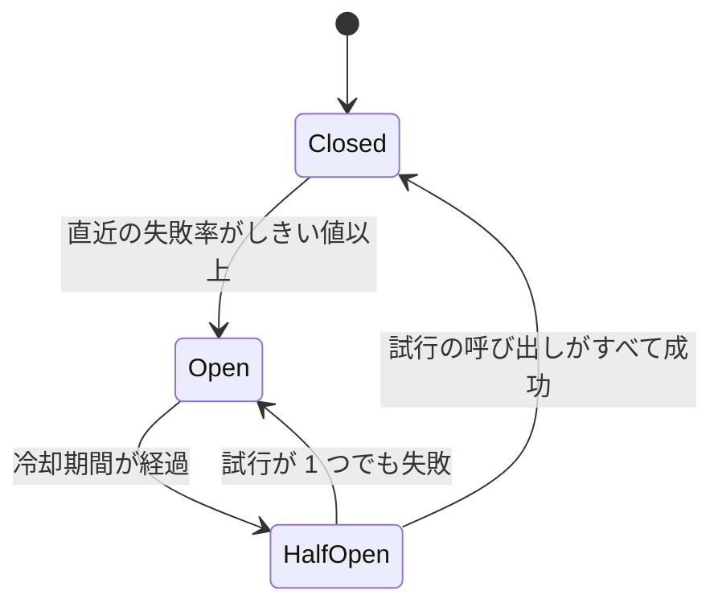

# 9.5 スケーラビリティとパフォーマンス

> 「速くしてほしい」「もっと捌けるようにしてほしい」という要求に、勘ではなく測定とモデルで答えるにはどうすればよいのでしょうか。この章では、レイテンシのパーセンタイル、Little の法則や USL などの性能モデル、キャッシュとその落とし穴、タイムアウト・リトライ・サーキットブレーカーによる過負荷対策、負荷試験とキャパシティプランニング、そして設計の議論の前に桁を確かめる概算見積もりを身につけます。

| 項目 | 内容 |
|---|---|
| 学習時間の目安 | 本文 4h ＋ 演習 6h |
| 前提となる章 | [2.2 確率・統計と定量的思考](../../02-math-and-algorithms/02-probability-statistics/README.md)、[9.1 ソフトウェアアーキテクチャの基礎](../01-architecture-fundamentals/README.md) |
| 演習 | [exercises/](exercises/)（Python） |
| キーワード | パーセンタイル, テールレイテンシ, Little の法則, Amdahl の法則, USL, スケールアウト, キャッシュ, スタンピード, レート制限, サーキットブレーカー, 指数バックオフとジッター, リトライ予算, 負荷制限, 協調的欠落, キャパシティプランニング, 概算見積もり |

## この章のゴール

- [ ] レイテンシを平均ではなくパーセンタイルで評価し、ファンアウトがテールレイテンシを増幅する理由を説明できる
- [ ] Little の法則・Amdahl の法則・USL・待ち行列の式を使って、並列度・接続プール・使用率の目標を見積もれる
- [ ] キャッシュの戦略を選び、スタンピード・ホットキー・キャッシュとデータベースの不整合への対策を実装できる
- [ ] タイムアウト・指数バックオフとジッター・リトライ予算・サーキットブレーカー・負荷制限を組み合わせて、障害の連鎖を防げる
- [ ] 負荷試験を正しく設計し、協調的欠落（coordinated omission）の罠を避けられる
- [ ] DAU から QPS・ストレージ・帯域・台数を数分で見積もり、設計の妥当性を判断できる
- [ ] 測定 → プロファイル → 仮説 → 1 つずつ変更 → 検証、という性能改善の進め方と USE メソッドを実践できる

## なぜ学ぶのか

- **キャッシュの障害は、データベースを一瞬で押し潰す**: 2010 年 9 月、Facebook は約 2.5 時間にわたってつながりにくい状態になりました。同社のエンジニアリングブログによると、引き金は、設定値の不正を自動で検出して直す仕組みでした。変更した設定値が不正と解釈されたため、すべてのクライアントがそれを直そうとしてデータベースに問い合わせ、データベースのクラスタに毎秒数十万件の問い合わせが殺到しました。さらに、クライアントは DB からのエラーを不正な値と解釈して対応するキャッシュのキーを削除したので、元の問題を直した後も問い合わせが止まらない悪循環に陥り、最終的にはそのクラスタへのトラフィックをすべて止める、つまりサイトを止めるしかありませんでした。
- **需要の急増は、想定を簡単に超える**: 2022 年 11 月、Ticketmaster は、Taylor Swift のツアーの先行販売で、ボットによる攻撃と招待コードを持たない利用者の殺到により、システムへのリクエストが合計 35 億件と過去のピークの 4 倍に達したと説明しました。容量の計画、レート制限、待合室（キュー）の設計は、事業の最も重要な瞬間を左右します（[9.6](../06-system-design-cases/README.md) で予約システムを扱います）。
- **平均値は、最も困っている利用者を隠す**: 1 つのページの表示に 100 台のサーバーへの問い合わせが必要なら、各サーバーが 1% の確率で遅いだけで、ページの 6 割以上が遅くなります（1 章）。性能の議論を平均値で行うと、この現象が見えません。

性能とスケーラビリティは、後から「足せる」機能ではありません。測定の仕組み、負荷を逃がす構造、壊れ方の設計は、アーキテクチャの段階で決まります。

## 1. 性能を測る言葉

### 1.1 レイテンシ・スループット・使用率・飽和

| 指標 | 意味 | 例 |
|---|---|---|
| レイテンシ（latency） | 1 つの要求にかかる時間 | p99 で 250ms |
| スループット（throughput） | 単位時間あたりに処理できる量 | 3,000 リクエスト/秒 |
| 使用率（utilization） | 資源が忙しい時間の割合 | CPU 使用率 70% |
| 飽和（saturation） | 処理しきれずに待たされている量 | 実行待ちのスレッド数、キューの長さ |

レイテンシとスループットは別物です。スループットを上げる工夫（まとめて処理する、キューに溜める）が、個々のレイテンシを悪化させることはよくあります。

### 1.2 平均ではなくパーセンタイル

レイテンシの分布は、ほとんどの要求が速く、ごく一部が極端に遅い「裾の長い」形になりがちです。平均値は、この裾を隠します。

```python
import random
import statistics

rng = random.Random(95)
# 98% は 20ms 前後で返り、2% だけが 300〜1,500ms かかる API（よくある形の分布）
latencies = [rng.lognormvariate(3.0, 0.3) for _ in range(9_800)] + [rng.uniform(300, 1500) for _ in range(200)]
latencies.sort()

def percentile(p):  # 最近傍順位法: 小さい方から p% の位置の値
    return latencies[min(len(latencies) - 1, int(p / 100 * len(latencies)))]

print(f"平均 {statistics.fmean(latencies):.0f}ms / p50 {percentile(50):.0f}ms / p90 {percentile(90):.0f}ms"
      f" / p99 {percentile(99):.0f}ms / p99.9 {percentile(99.9):.0f}ms")
```

```text
平均 39ms / p50 20ms / p90 31ms / p99 929ms / p99.9 1462ms
```

平均 39ms は「そこそこ速い」ように見えますが、100 回に 1 回は 1 秒近く待たされています。しかも、1 回の画面表示で多くの API を呼ぶ利用者ほど、遅い要求に当たる確率は上がります。**性能の目標は「負荷の条件」と「パーセンタイル」をセットで書きます**（例: 平常時 500 リクエスト/秒で p99 300ms 以内。[10.3](../../10-cloud-and-sre/03-reliability-engineering/README.md) の SLO につながります）。なお、パーセンタイルは平均できません。サーバーごとの p99 を平均しても、全体の p99 にはならないので、ヒストグラムを集約してから計算します。

### 1.3 ファンアウトはテールを増幅する

Jeffrey Dean と Luiz André Barroso は論文 "The Tail at Scale"（2013 年）で、1 つの要求が多数のサーバーに並列に問い合わせる（ファンアウトする）システムでは、個々のサーバーの稀な遅延が、全体ではありふれた遅延になることを示しました。全体の応答は、最も遅いサーバーを待つからです。

```python
for n in (1, 10, 50, 100):
    print(f"{n:3d} 台に並列に問い合わせ: 少なくとも 1 台が遅い確率 {1 - 0.99 ** n:5.1%}")
```

```text
  1 台に並列に問い合わせ: 少なくとも 1 台が遅い確率  1.0%
 10 台に並列に問い合わせ: 少なくとも 1 台が遅い確率  9.6%
 50 台に並列に問い合わせ: 少なくとも 1 台が遅い確率 39.5%
100 台に並列に問い合わせ: 少なくとも 1 台が遅い確率 63.4%
```

同論文は対策として、一定時間応答がなければ別のレプリカにも同じ要求を送る **ヘッジ要求（hedged requests）** などを挙げています。ただし、余分な要求は負荷を増やすので、「p95 を超えたら送る」のように、上乗せを数 % に抑える工夫が必要です。

## 2. 性能のモデル

### 2.1 Little の法則

安定したシステムでは、**系の中にある平均の要求数 L は、到着率 λ と平均滞在時間 W の積に等しい** という関係が、到着の分布によらず成り立ちます（John Little が 1961 年に証明）。

```text
L = λ × W
```

これは、必要な並列度や接続プールの大きさの見積もりにそのまま使えます。

- 1,000 リクエスト/秒を、1 件 200ms で処理する API には、平均 1,000 × 0.2 = **200 件** の要求が同時に存在する。スレッドやワーカーはそれ以上必要。
- 各要求が DB の接続を 20ms だけ使うなら、必要な接続は平均 1,000 × 0.02 = **20 本**。接続プールを 500 本にしても速くはならず、むしろ DB 側のメモリと切り替えのコストを浪費する。
- 逆に、同時実行数の上限が 100 で、1 件 200ms かかるなら、スループットは最大 100 ÷ 0.2 = 500 リクエスト/秒で頭打ちになる。

### 2.2 使用率と待ち時間 — 100% 使ってはいけない理由

処理時間 S のサーバーに要求がランダムに届く、最も単純な待ち行列のモデル（M/M/1）では、平均応答時間は `R = S / (1 − ρ)` です（ρ は使用率）。

```python
for rho in (0.5, 0.7, 0.8, 0.9, 0.95, 0.99):
    print(f"使用率 {rho:4.0%}: 平均応答時間 = 処理時間 × {1 / (1 - rho):5.1f}")
```

```text
使用率  50%: 平均応答時間 = 処理時間 ×   2.0
使用率  70%: 平均応答時間 = 処理時間 ×   3.3
使用率  80%: 平均応答時間 = 処理時間 ×   5.0
使用率  90%: 平均応答時間 = 処理時間 ×  10.0
使用率  95%: 平均応答時間 = 処理時間 ×  20.0
使用率  99%: 平均応答時間 = 処理時間 × 100.0
```

現実のシステムは M/M/1 よりずっと複雑ですが、「**使用率が 100% に近づくと、待ち時間は線形ではなく爆発的に増える**」という形は共通です。容量の計画で目標の使用率を 60〜70% 程度に置き、余裕（ヘッドルーム）を残すのはこのためです（7 章）。

### 2.3 Amdahl の法則と USL — 並列化の限界

Gene Amdahl は 1967 年に、処理のうち並列化できない部分が、並列化による速度向上の上限を決めることを指摘しました。並列化できる割合を p、並列度を n とすると、速度向上は `1 / ((1 − p) + p / n)` です。

```python
p = 0.95   # 処理の 95% が並列化できる
for n in (2, 8, 32, 128, 1024):
    print(f"{n:5d} 並列: {1 / ((1 - p) + p / n):5.1f} 倍")
```

```text
    2 並列:   1.9 倍
    8 並列:   5.9 倍
   32 並列:  12.5 倍
  128 並列:  17.4 倍
 1024 並列:  19.6 倍
```

たった 5% の直列部分のために、何台増やしても 20 倍を超えません。Neil Gunther の **普遍的スケーラビリティ則（USL, Universal Scalability Law）** は、これにもう 1 つの項を加えます。

```text
X(N) = λN / (1 + σ(N − 1) + κN(N − 1))
  λ: 1 並列のときのスループット
  σ: 競合（直列化される部分。Amdahl の法則の直列部分にあたる）
  κ: 一貫性を保つための調整（ノード間の同期・キャッシュの整合）のコスト
```

κ の項は N² で効くので、並列度を上げすぎると、スループットが **下がり始めます**（逆行）。

```python
import math
lam, sigma, kappa = 100, 0.05, 0.001   # 1 並列で 100 件/秒、競合 5%、一貫性のコスト 0.1%
for n in (1, 8, 16, 31, 64, 128):
    x = lam * n / (1 + sigma * (n - 1) + kappa * n * (n - 1))
    print(f"N={n:3d}: {x:6.0f} 件/秒")
print(f"最大になる並列度 N* = {math.sqrt((1 - sigma) / kappa):.1f}")
```

```text
N=  1:    100 件/秒
N=  8:    569 件/秒
N= 16:    804 件/秒
N= 31:    904 件/秒
N= 64:    782 件/秒
N=128:    542 件/秒
最大になる並列度 N* = 30.8
```

実務では、並列度を変えた負荷試験の結果に USL を当てはめて σ と κ を推定し、「あと何台増やせばどこまで伸びるか」「どこで頭打ちになるか」を予測します。台数を倍にしてもスループットが伸びない、むしろ下がるときは、ロック、共有資源、全ノードでの同期といった κ の原因を探します。

## 3. スケールアップとスケールアウト

| | スケールアップ（垂直） | スケールアウト（水平） |
|---|---|---|
| 方法 | より大きなマシンにする | マシンの台数を増やす |
| 利点 | アプリの変更が不要。一貫性の問題が増えない | 上限が高い。台数を増減できる。1 台の故障に強い |
| 欠点 | 上限がある。大きいほど割高になりやすい。1 台が単一障害点 | アプリを状態を持たない設計にする必要。データ層の分割は難しい |

**アプリケーション層のスケールアウトの鍵は、状態を持たないこと（ステートレス）** です。セッションやアップロード中のファイルをサーバーのメモリやディスクに置くと、要求が別のサーバーに振り分けられたときに失われます。状態は、共有のデータストア（DB、分散キャッシュ、オブジェクトストレージ）に置くか、署名付きのトークンとしてクライアントに持たせます。

**データ層のスケールは段階的に** 考えます。

1. インデックスとクエリの改善（[6.2](../../06-databases/02-indexes-and-query-processing/README.md)）。多くの性能問題はここで解決する。
2. キャッシュ（4 章）で読み取りを減らす。
3. **読み取りレプリカ** で読み取りを分散する。ただし、レプリケーションの遅延で「書いた直後に読むと古い」ことが起きるので、自分の書き込みを直後に読む画面はプライマリから読むなどの対処が必要（[7.2](../../07-distributed-systems/02-replication-and-consistency/README.md)）。
4. 書き込みの非同期化とバッチ化（5 章）。
5. **パーティショニング（シャーディング）** で書き込みとデータ量を分散する（[7.3](../../07-distributed-systems/03-partitioning/README.md)）。横断的なクエリやトランザクションが難しくなるので、最後の手段にする。

なお、2020 年 11 月の Amazon Kinesis Data Streams の障害では、フロントエンドのサーバー群に容量を追加したことが、各サーバーがフリートの他のすべてのサーバーとの通信のために作るスレッドの数を OS の上限を超えて増やし、障害の引き金になりました（AWS の公開した障害報告による）。**台数を増やすこと自体が、台数に比例する別の資源を消費する** 設計は、スケールアウトの落とし穴です（9.2 のセルベースアーキテクチャも参照）。

## 4. キャッシュ

### 4.1 どこでキャッシュするか

| 層 | 例 | 特徴 |
|---|---|---|
| クライアント | ブラウザのキャッシュ（`Cache-Control`） | 最も速く、サーバーの負荷もゼロ。無効化はできない（期限切れを待つ） |
| CDN | エッジのキャッシュ（[5.4](../../05-networking/04-web-architecture/README.md)） | 静的ファイル・画像・公開ページに。利用者の近くで返す |
| アプリのプロセス内 | メモリ上の辞書・LRU | 最速だが、サーバーごとにばらばらで、容量も小さい |
| 分散キャッシュ | Redis、Memcached | 全サーバーで共有。ネットワークの往復がかかる |
| データベース | バッファプール | DB が自動で行う |

### 4.2 読み書きの戦略

| 戦略 | 読み取り | 書き込み | 特徴 |
|---|---|---|---|
| キャッシュアサイド（cache-aside） | アプリがキャッシュを見て、なければ DB から読んでキャッシュに入れる | アプリが DB を更新し、キャッシュを削除する | 最も一般的。キャッシュが落ちても DB で動く |
| リードスルー（read-through） | キャッシュ層が、なければ自分で DB から読む | — | アプリが単純になる。演習 5 はこの形 |
| ライトスルー（write-through） | — | キャッシュと DB に同期で書く | キャッシュが常に新しい。書き込みが遅くなる |
| ライトビハインド（write-behind） | — | キャッシュに書き、DB へは後でまとめて書く | 書き込みが速い。キャッシュの障害でデータを失うおそれ |

### 4.3 有効期限と無効化

「コンピュータサイエンスで難しいことは 2 つだけ。キャッシュの無効化と、名前付けだ」という言葉（Phil Karlton のものとして知られています）があるほど、無効化は難しい問題です。キャッシュアサイドには、次のような古典的な競合があります。

```text
時刻  読み取り側（キャッシュミス）      書き込み側
 1    DB から v1 を読む
 2                                     DB を v2 に更新
 3                                     キャッシュを削除（まだ何もない）
 4    キャッシュに v1 を書く ← 古い値が居座る
```

対策は複数を組み合わせます。

- **必ず有効期限（TTL）を付ける**。無効化が漏れても、いつかは正しい値に戻る。
- **無効化の世代（バージョン）を管理する**。読み込みの開始時の世代を覚えておき、完了時に世代が変わっていたら保存しない（演習 5）。Facebook の論文 "Scaling Memcache at Facebook"（NSDI 2013）は、同じ目的でキャッシュサーバーが「リース」を発行する仕組みを説明しています。
- **キーにバージョンを含める**（`user:42:v17`）。更新したら新しいキーを使うので、古い値を削除する必要がない。

どこまでの古さを許せるかは、業務の要件です。在庫数や残高のように古い値が事故になるデータは、キャッシュの対象から外すか、表示用（「残りわずか」）と判定用（DB で確認）を分けます。

### 4.4 スタンピード（thundering herd）

人気のキーの有効期限が切れた瞬間、そのキーを求める大量の要求が一斉にキャッシュミスし、同じ値を DB に取りに行く現象を **キャッシュスタンピード** と呼びます。

| 対策 | 仕組み |
|---|---|
| 単一飛行（single-flight, request coalescing） | 同じキーの読み込みが実行中なら、後続は待って結果を共有する（演習 5）。Go の `singleflight` パッケージが有名 |
| ロック・リース | キャッシュ側で「このキーを読み込んでよいのは 1 つだけ」を決める。複数のサーバーにまたがる場合に必要 |
| stale-while-revalidate | 期限切れ後の猶予期間は古い値を返しつつ、裏で 1 回だけ更新する（演習 5）。HTTP では `Cache-Control` の拡張として RFC 5861 に定義されている |
| 確率的な早期更新 | 期限が近づくにつれて、ランダムに早めに更新を始める。Vattani らの論文（VLDB 2015）の XFetch という手法が知られている |
| 有効期限のジッター | 大量のキーに同じ TTL を付けると同時に切れるので、TTL にランダムな幅を持たせる |

### 4.5 ホットキーとキャッシュペネトレーション

- **ホットキー**: 1 つのキー（有名人のプロフィール、セール中の商品）に要求が集中し、それを持つ 1 台のキャッシュサーバーが限界に達する。対策は、アプリのプロセス内に短時間だけ持つ（2 段キャッシュ）、キーを複製して `hot:item:42#1`〜`#8` のように分散させる、など。
- **キャッシュペネトレーション**: 存在しないキー（`user:-1`、攻撃者が作ったランダムな ID）への要求は、キャッシュに何も残らないので毎回 DB に届く。対策は、「存在しない」ことも短い TTL でキャッシュする（ネガティブキャッシュ）、存在するキーの集合をブルームフィルタ（[2.4](../../02-math-and-algorithms/04-basic-data-structures/README.md)）で持ち、確実に存在しないものは DB に問い合わせない、など。

## 5. 非同期処理・バッチ・接続プール

- **キューによる負荷の平準化**: 要求をいったんキューに入れ、ワーカーが自分のペースで処理すれば、瞬間的なピークを時間方向に均せる。メール送信、画像の変換、集計など、利用者を待たせる必要のない処理は非同期にする。ただし、キューの長さ（＝待ち時間）を監視し、上限を決めておかないと、キューは障害を先送りするだけの装置になる（[7.5](../../07-distributed-systems/05-messaging-and-events/README.md)）。
- **バッチ化**: 1 件ずつの処理にかかる固定のコスト（ネットワークの往復、トランザクションのコミット、システムコール）を、まとめることで割り勘にする。1 万件の INSERT を 1 件ずつコミットするのと、1 回のトランザクションでまとめて行うのとでは、桁違いの差が出る。代わりに、個々の要求のレイテンシは待ち合わせの分だけ伸びる。
- **接続プール**: DB やサービスへの接続の確立（TCP・TLS のハンドシェイク、認証）は高くつくので、使い回す。大きさは Little の法則で見積もり、DB 側の同時接続の上限（全アプリサーバーの合計）を超えないようにする。

## 6. 過負荷から身を守る

### 6.1 タイムアウト

**すべてのネットワーク呼び出しにタイムアウトを付けます**。タイムアウトのない呼び出しは、依存先が遅くなったときにスレッドや接続を握ったまま待ち続け、自分自身を止めます。値は依存先の p99 程度を目安にし、呼び出しの連鎖では、全体の残り時間（デッドライン）を下流に伝えて、上流が諦めた処理を下流が続けないようにします（gRPC のデッドラインの伝搬がこの考え方です）。

### 6.2 リトライ — 指数バックオフとジッター、そして予算

一時的な失敗は再試行で回復できますが、**素朴なリトライは障害を悪化させます**。

- **同時に再試行しない**: 障害の瞬間に失敗した大量のクライアントが、同じ間隔で一斉に再試行すると、回復しかけたサーバーを再び押し潰す。待ち時間を指数的に伸ばす（指数バックオフ）だけでなく、ランダムにばらつかせる（ジッター）。Marc Brooker の AWS Architecture Blog の記事 "Exponential Backoff And Jitter"（2015 年）は、シミュレーションで各方式を比較し、待ち時間を `random(0, min(cap, base × 2^attempt))` とする **Full Jitter** などのジッター付きの方式が、ジッターなしのバックオフより総作業量と完了時間の両面で大きく優れることを示しています（演習 4）。
- **リトライは増幅する**: 3 層の呼び出しの各層が 3 回ずつ試行すると、最下層への負荷は最悪 3 × 3 × 3 = 27 倍になる。Google の SRE 本（"Site Reliability Engineering"）の過負荷の章は、1 つの要求の試行を最大 3 回に制限する、クライアントごとにリトライの割合を 10% 未満に保つ（**リトライ予算**）、リトライは直上の 1 層だけで行い、「過負荷なので再試行するな」というエラーで上位の層のリトライを止める、といった方針を紹介しています。
- **冪等でない操作は再試行しない**: または冪等キーを付ける（[9.4](../04-api-design/README.md)）。
- **再試行しても無駄なエラーを区別する**: 400 番台（リクエストの誤り）は何度送っても失敗する。

### 6.3 サーキットブレーカー

**サーキットブレーカー** は、失敗が続く依存先への呼び出しを一時的に遮断し、すぐにエラーを返すことで、自分のスレッドを守り、相手の回復の時間を作る仕組みです。Michael Nygard の "Release It!"（初版 2007 年）で広く知られるようになりました。



遮断中に何を返すか（キャッシュした古い値、既定値、機能を隠す）は、次の 6.5 の縮退運転の設計そのものです。演習 3 では、失敗率のしきい値、最小の呼び出し数、冷却期間、半開の状態での試行の数を持つサーキットブレーカーを実装します。

### 6.4 バルクヘッド・負荷制限・レート制限・背圧

- **バルクヘッド（隔壁）**: 船の区画のように、依存先ごとにスレッドプールや接続プールを分ける。1 つの遅い依存先が、全部のスレッドを使い切って他の機能まで止めるのを防ぐ。
- **負荷制限（load shedding）**: 処理しきれない要求は、処理を始める前にすぐ断る。遅れて失敗するより、早く 503 を返す方が全体の効率が良い。重要度の低い要求（プリフェッチ、分析用の送信）から先に落とす。
- **レート制限**: クライアントごとに上限を設ける（演習 2 のトークンバケットとスライディングウィンドウ）。超えたら 429 と `Retry-After`（9.4）。
- **背圧（backpressure）**: 下流が詰まったら、上流の送り出しを遅くする。キューに上限を設け、あふれたら生産者を待たせるか断る。

### 6.5 縮退運転（グレースフルデグラデーション）

すべての機能が同じ重要度ではありません。EC サイトなら「購入」は守るべき中核で、「おすすめ商品」や「閲覧履歴」は止まっても致命的ではありません。依存先ごとに、止まったときの振る舞い（非表示、キャッシュ、既定値）をあらかじめ決めておけば、部分的な障害を全体の障害にせずに済みます。

最後に、**準安定な障害（metastable failure）** という考え方を紹介しておきます。Bronson らの論文（HotOS 2021）は、きっかけ（一時的な負荷の急増、キャッシュの喪失）が取り除かれた後も、リトライの嵐やキャッシュの冷え込みといった「負荷を増やし続ける仕組み」によって、システムが過負荷の状態に留まり続ける障害を、この名前で整理しました。冒頭の Facebook の障害は、その典型です。対策の本質は、リトライ予算や負荷制限によって、**過負荷のときに負荷が増えるのではなく減る** 仕組みを作っておくことです。

## 7. 負荷試験とキャパシティプランニング

### 7.1 負荷試験の種類

| 種類 | 目的 | やり方 |
|---|---|---|
| 負荷試験（load） | 想定の負荷で目標を満たすか | 想定ピークの負荷を一定時間かける |
| ストレス試験（stress） | 限界はどこか、限界を超えたときどう壊れるか | 負荷を段階的に上げ、壊れ方（エラー・遅延・回復）を観察する |
| 耐久試験（soak） | 長時間でも劣化しないか | 平常の負荷を数時間〜数日かけ、メモリリークや接続の枯渇を探す |
| スパイク試験（spike） | 急増に耐えるか | 短時間で負荷を急増させる（セール開始、テレビ放映の直後） |

代表的なツールに、k6（JavaScript でシナリオを書く）、Locust（Python）、Apache JMeter、Gatling などがあります。試験環境は、データの量（インデックスの効き方が変わる）、キャッシュの温まり具合、依存先の振る舞い（本物か模擬か）で、本番と大きく結果が変わる点に注意します。

### 7.2 協調的欠落（coordinated omission）

Gil Tene（Azul Systems）は講演 "How NOT to Measure Latency" などで、多くの負荷試験ツールが **遅延を実際より大幅に小さく報告してしまう** 問題を指摘し、これを協調的欠落と呼びました。前の応答が返るまで次の要求を送らない（閉ループの）ツールは、サーバーが止まっている間、要求を送るのをやめてしまいます。その間に来るはずだった利用者の要求が「測定から欠落」するのです。

```python
STALL = (5.0, 7.0)    # この 2 秒間、サーバーが止まる（GC やロック待ちなど）
SERVICE = 0.0001      # 通常の処理時間 0.1ms
INTERVAL = 0.001      # 毎秒 1,000 件のペースで送る予定
N = 10_000            # 10 秒分

def finish_time(send):  # send 時刻に届いた要求が完了する時刻
    start = STALL[1] if STALL[0] <= send < STALL[1] else send
    return start + SERVICE

# 閉ループ: 前の応答が返るまで次を送らず、実際に送った時刻から測る（素朴な負荷試験ツールの動き）
closed, t = [], 0.0
for i in range(N):
    send = max(i * INTERVAL, t)
    t = finish_time(send)
    closed.append(t - send)

# 開ループ: 予定どおりの時刻に送り、予定時刻から測る（利用者が実際に体験する遅延）
opened = [finish_time(i * INTERVAL) - i * INTERVAL for i in range(N)]

def pct(xs, p):
    xs = sorted(xs)
    return xs[min(len(xs) - 1, int(p / 100 * len(xs)))]

for name, xs in (("閉ループ", closed), ("開ループ", opened)):
    print(f"{name}: p50 {pct(xs, 50) * 1000:7.1f}ms  p99 {pct(xs, 99) * 1000:7.1f}ms"
          f"  最大 {max(xs) * 1000:7.1f}ms")
```

```text
閉ループ: p50     0.1ms  p99     0.1ms  最大  2000.1ms
開ループ: p50     0.1ms  p99  1901.1ms  最大  2000.1ms
```

同じサーバーの同じ停止なのに、閉ループの測り方では p99 が 0.1ms、利用者の体験に即した測り方では 1.9 秒です。対策は、到着率を一定に保つ（開ループの）負荷生成を使うこと、遅延を「予定していた送信時刻」から測ること、そして結果をヒストグラム（HdrHistogram など）で記録することです。

### 7.3 キャパシティプランニング

1. **需要を予測する**: 過去の成長率、季節性（年末、月末、新生活シーズン）、マーケティングの予定（テレビ CM、セール）を、事業側から情報として受け取る。
2. **1 台あたりの能力を測る**: 負荷試験で、目標のレイテンシを満たせる最大のスループットを求める。
3. **余裕を持たせる**: 目標の使用率（例: 60〜70%）、障害時の縮退（1 台やアベイラビリティゾーン 1 つが落ちても耐える N+1、N+2）を加える。
4. **調達のリードタイムを考える**: オートスケールにも、起動にかかる時間、クラウドのアカウントの上限（クォータ）、DB のように簡単には増やせない層がある。数か月かかる増強（DB の分割、専用線）は、必要になる前に始める。

## 8. 概算見積もり（back-of-the-envelope）

### 8.1 知っておくべき数字

設計の議論の前に、処理にかかる時間の **桁** を知っておくと、明らかに無理な案をすぐに見抜けます。次の表は 2020 年代の一般的なハードウェアとネットワークでの大まかな目安です。環境によって数倍変わるので、桁だけを覚えてください（Jeff Dean が講演で示した "Latency Numbers Every Programmer Should Know" の考え方を踏まえたものです）。

| 操作 | 桁の目安 |
|---|---|
| L1 キャッシュの参照 | 約 1 ns |
| メインメモリの参照 | 約 100 ns |
| メモリから 1MB を順に読む | 数十〜100 µs |
| NVMe SSD のランダム読み取り（4KB） | 数十〜100 µs 程度 |
| 同じデータセンター内のネットワークの往復 | 0.1〜0.5 ms 程度 |
| SSD から 1MB を順に読む | 0.2〜1 ms 程度 |
| HDD のシーク | 数 ms〜10 ms |
| 光ファイバーで 1,000 km 離れた場所との往復 | 最低でも約 10 ms（光速の制約） |
| 日本と米国西海岸の往復 | 100 ms 前後 |

最後の 2 行は、物理法則による下限です。光ファイバーの中の光は約 20 万 km/秒なので、どんなに速いサーバーを使っても、太平洋を往復するには 100 ms 近くかかります。**遠くのデータセンターへの同期呼び出しを 1 画面で 10 回すれば、それだけで 1 秒** です。

### 8.2 例題: 写真共有サービス

DAU 1,000 万人の写真共有サービスを考えます。

```python
import math

dau = 10_000_000
peak = 3                                   # ピークは平均の 3 倍と仮定
feed_qps = dau * 30 / 86_400               # 1 人 1 日 30 回フィードを開く
posts_per_day = dau * 0.10                 # 利用者の 10% が 1 日 1 枚投稿する
photo_bytes = 2_000_000 + 300_000 + 50_000 # 元画像 2MB ＋ 中サイズ 300KB ＋ サムネイル 50KB

print(f"フィードの読み取り: 平均 {feed_qps:,.0f} / ピーク {feed_qps * peak:,.0f} QPS")
print(f"投稿の書き込み:     平均 {posts_per_day / 86_400:,.1f} / ピーク {posts_per_day / 86_400 * peak:,.0f} QPS")
print(f"画像の保存量:       {posts_per_day * photo_bytes * 365 / 1e12:,.0f} TB/年（複製前）")
print(f"投稿のメタデータ:   {posts_per_day * 1_000 * 365 / 1e9:,.0f} GB/年（1 件 1KB）")
thumbs = feed_qps * peak * 10 * 50_000 * 8 # フィード 1 回でサムネイル 10 枚
print(f"ピーク時の画像配信: {thumbs / 1e9:,.1f} Gbps")
servers = math.ceil(feed_qps * peak / (1_000 * 0.6)) + 1
print(f"API サーバー:       {servers} 台（1 台 1,000 QPS を使用率 60% まで使い、予備 1 台）")
```

```text
フィードの読み取り: 平均 3,472 / ピーク 10,417 QPS
投稿の書き込み:     平均 11.6 / ピーク 35 QPS
画像の保存量:       858 TB/年（複製前）
投稿のメタデータ:   365 GB/年（1 件 1KB）
ピーク時の画像配信: 41.7 Gbps
API サーバー:       19 台（1 台 1,000 QPS を使用率 60% まで使い、予備 1 台）
```

数分の計算から、設計の方向性がはっきりします。

- **読み取りと書き込みの比は約 300 : 1**。フィードの読み取りを速くする仕組み（キャッシュ、事前計算）が設計の中心になる（[9.6](../06-system-design-cases/README.md) のタイムラインの事例）。
- **画像はデータベースに入れない**。年 858TB はオブジェクトストレージの領分で、配信の 41.7Gbps は CDN なしでは現実的でない。
- **メタデータは年 365GB**。数年は 1 つの RDB（と読み取りレプリカ）で扱える規模で、最初からシャーディングする必要はない。
- 前提（1 日 30 回、10% が投稿、ピーク 3 倍）こそが最も不確かな部分です。見積もりには必ず前提を書き、事業側と前提をすり合わせます。演習 1 では、これらの計算を関数にまとめます。

## 9. 性能改善の進め方

性能の問題に対して、推測で「たぶんここが遅い」とコードを書き換えるのは、よくある失敗です。次の手順を守ります。

1. **測定する**: 目標（負荷の条件とパーセンタイル）と現状を数字で確認する。
2. **ボトルネックの場所を特定する**: 分散トレーシング（[10.4](../../10-cloud-and-sre/04-observability/README.md)）で遅いサービスと区間を、プロファイラ（Python なら `cProfile`、Linux なら `perf` やフレームグラフ）で遅い関数を見つける。
3. **仮説を立てる**: 「この N+1 のクエリが原因で、まとめれば p99 が半分になる」。
4. **1 つだけ変える**: 複数を同時に変えると、何が効いたか分からない。
5. **検証する**: 同じ条件で測り直し、効果がなければ元に戻す。

どこから調べるか迷ったときは、Brendan Gregg の **USE メソッド** が役に立ちます。「**すべての資源について、使用率（Utilization）・飽和（Saturation）・エラー（Errors）を確認する**」という単純な手順で、見落としを防ぎます。

| 資源 | 使用率 | 飽和 | エラー |
|---|---|---|---|
| CPU | CPU 使用率 | 実行待ちのキューの長さ | — |
| メモリ | 使用量 | スワップ、GC の頻度 | メモリ不足によるプロセスの強制終了 |
| ネットワーク | 帯域の使用率 | 送信キュー、パケットの破棄 | 再送、エラーのパケット |
| ディスク | 使用率（ビジー時間） | I/O 待ちのキュー | I/O エラー |
| 接続プール・スレッドプール | 使用中の数 / 上限 | 取得待ちの数と時間 | 取得のタイムアウト |

サービスの単位では、要求の数（Rate）・エラー（Errors）・所要時間（Duration）を見る **RED メソッド**（Tom Wilkie による）が、USE メソッドを補います。

## よくある落とし穴

1. **平均レイテンシで性能を語る**。裾の遅延が見えず、最も多く使う利用者ほど遅い体験をしていることに気づけない。パーセンタイルとヒストグラムで測り、目標は負荷の条件と一緒に書く。
2. **使用率 90% まで使い切る計画を立てる**。待ち時間が爆発し、1 台の故障やちょっとしたピークで全体が破綻する。目標の使用率と N+1 の余裕を決めておく。
3. **タイムアウトのない呼び出し**。遅い依存先が、スレッドと接続を握りしめたまま自分を止める。すべてのネットワーク呼び出しにタイムアウトを付け、デッドラインを下流に伝える。
4. **ジッターなしで、全層でリトライする**。回復しかけたサーバーを一斉の再試行が押し潰し、多層のリトライが負荷を何十倍にも増幅する。指数バックオフとジッター、リトライ予算、リトライする層の限定を組み合わせる。
5. **キャッシュに TTL を付けない、または全キーに同じ TTL を付ける**。前者は無効化の漏れで古い値が永遠に残り、後者は同時の期限切れでスタンピードを起こす。TTL は必ず付け、ランダムな幅を持たせる。
6. **キャッシュを前提に DB の容量を減らす**。キャッシュが消えた瞬間（再起動、障害、デプロイ）に DB が全負荷を受けきれない。キャッシュなしでも最低限動くか、単一飛行や負荷制限で守られているかを確認する。
7. **閉ループの負荷試験ツールの結果をそのまま信じる**。サーバーが止まっている間の遅延が欠落し、p99 が桁違いに良く見える。一定の到着率で負荷をかけ、予定時刻から遅延を測る。
8. **測定せずに最適化する**。効果のない箇所を複雑にし、本当のボトルネックは残る。プロファイルで特定し、1 つずつ変えて検証する。

## CTOの視点

1. **性能の目標を事業の数字として持つ**。「p99 300ms」は技術の目標ですが、その根拠は「表示が 1 秒遅れると購入率が何 % 下がるか」「セールのピークにどれだけの注文を受ける必要があるか」という事業の数字です。性能の SLO を事業のKPI と結び付けて合意しておけば、性能改善とインフラ費用の投資判断を、感覚ではなく損益で説明できます。
2. **「ピークの日」から逆算して準備させる**。セール、テレビの放映、チケットの発売、年度末の締めなど、事業のピークの日程は事前に分かることが多いものです。その数か月前に、需要の見積もり、負荷試験、容量の増強、レート制限と待合室の設計、当日の体制（誰が何を見るか）を計画させます。Ticketmaster の例のように、ボットや想定外の集中まで含めて考えます。
3. **障害の連鎖を防ぐ仕組みを、全サービスの標準にする**。タイムアウト、ジッター付きのバックオフ、リトライ予算、サーキットブレーカー、負荷制限を、チームごとにばらばらに実装させるのではなく、共通のライブラリやサービスメッシュの設定として提供し、設計レビューで「この依存先が遅くなったら何が起きるか」を必ず問います。準安定な障害は、個々のチームの判断の積み重ねから生まれるからです。
4. **キャパシティとコストを同じ表で見る**。台数を増やせば性能は上がりますが、費用も比例して増えます。1 リクエストあたりの費用、使用率、ヘッドルームを並べて見れば、「性能のための過剰な余裕」と「コストのための危険な節約」の両方に気づけます（[10.6](../../10-cloud-and-sre/06-finops/README.md)）。
5. **性能の問題を「測ってから話す」文化を作る**。「遅い気がする」「たぶん DB が原因」で議論が始まったら、まず測定を求めます。採用の面接でも、性能問題の調査の経験を聞き、どう測り、何を仮説とし、どう検証したかを具体的に語れるかを見ます。

## 演習

演習コードは [exercises/](exercises/) にあります。解答例は [solutions/](solutions/) にあります。時間に依存する部品はすべて偽の時計でテストするので、実際に待つことはありません。

```bash
python3 tools/check.py 9.5        # リポジトリのルートで実行
python3 tools/check.py -v 9.5     # 詳しい出力
```

| # | 難易度 | 内容 | 対象 |
|---|---|---|---|
| 1 | ★☆☆ | 概算見積もりと性能モデル（QPS、ストレージ、帯域、台数、Little・Amdahl・USL・M/M/1） | `capacity.py` |
| 2 | ★★☆ | レート制限: トークンバケットとスライディングウィンドウ・カウンタ | `resilience.py`: `TokenBucket`, `SlidingWindowCounter` |
| 3 | ★★☆ | サーキットブレーカー（失敗率のしきい値、冷却期間、半開の試行の数） | `resilience.py`: `CircuitBreaker` |
| 4 | ★★☆ | 指数バックオフ＋フルジッターのリトライ、デッドライン、リトライ予算 | `resilience.py`: `retry_call`, `RetryBudget` |
| 5 | ★★★ | スタンピードに強いキャッシュ（単一飛行、stale-while-revalidate、世代による無効化） | `cache_layer.py`: `CoalescingCache` |

演習 1 を解き終えたら、8.2 節の例題の前提（1 日の利用回数、投稿の割合、ピーク係数）を自分のサービスの数字に置き換えて、見積もりを作ってみましょう。

## 理解度チェック

**Q1. ある API の平均レイテンシは 40ms ですが、利用者から「遅い」という苦情が絶えません。考えられる原因と、何を測るべきかを説明してください。**

<details>
<summary>解答</summary>

レイテンシの分布の裾（テール）が長く、平均では見えない一部の要求が非常に遅い可能性があります。例えば 98% が 20ms、2% が 1 秒なら、平均は 40ms 程度でも、100 回に 2 回は 1 秒待たされます。1 つの画面で多くの API を呼ぶ利用者ほど、遅い要求に当たる確率が上がり、体感はさらに悪くなります。

p50・p90・p99・p99.9 のパーセンタイルとヒストグラムを、エンドポイント別・利用者の種類別に測ります。遅い要求だけを分散トレーシングで調べると、特定の依存先、GC、ロック待ち、キャッシュミスなどの原因が見えてきます。

</details>

**Q2. 1 秒あたり 2,000 件の要求を処理する API があり、1 件の処理のうち DB の接続を使っている時間は平均 15ms です。接続プールの大きさの目安を、Little の法則で求めてください。また、プールを大きくしすぎることの問題点を述べてください。**

<details>
<summary>解答</summary>

同時に使われている接続の平均は L = λW = 2,000 × 0.015 = 30 本です。ばらつきや瞬間的なピークを考えて、これに余裕を持たせた値（例えば 40〜60 本程度、全アプリサーバーの合計で）が目安になります。

大きくしすぎると、DB 側で同時に動く処理が増えてロックや CPU の奪い合い（USL の σ と κ）が増え、かえってスループットが落ちることがあります。また、DB の最大接続数やメモリを、アプリサーバーの台数分だけ消費します。遅くなっている原因が DB の処理そのものなら、プールを大きくしても待ち行列の場所が移るだけです。

</details>

**Q3. サーバーの台数を 2 倍にしたのに、スループットが 1.3 倍にしかならず、さらに増やすと下がり始めました。USL の観点から、何が起きていると考えられますか。**

<details>
<summary>解答</summary>

USL の σ（競合）と κ（一貫性を保つための調整のコスト）が大きいと考えられます。台数を増やしても伸びが小さいのは、直列化される部分（1 つの DB への書き込み、グローバルなロック、1 台のキャッシュのホットキーなど）がボトルネックになっているためで、さらに増やすと下がる（逆行する）のは、台数の 2 乗で効く調整のコスト（全ノード間の同期、キャッシュの無効化の伝搬、分散ロック）が支配的になっているためです。

負荷試験の結果に USL を当てはめて σ と κ を推定し、共有資源の分割（パーティショニング）、ロックの粒度の縮小、同期の削減（非同期化、結果整合）で、それぞれを減らす対策を検討します。

</details>

**Q4. キャッシュアサイドで「DB は新しい値なのに、キャッシュに古い値が長く残る」現象が起きました。原因となる競合を説明し、対策を 2 つ挙げてください。**

<details>
<summary>解答</summary>

読み取り側がキャッシュミスして DB から古い値を読んだ直後に、書き込み側が DB を更新してキャッシュを削除し、その後で読み取り側が古い値をキャッシュに書き込む、という順序の競合です。削除が先に済んでしまうので、古い値が TTL まで居座ります。

対策:

- すべてのキーに TTL を付け、無効化が漏れてもいつかは正しい値に戻るようにする。
- 無効化の世代（バージョン）を管理し、読み込みの開始時と完了時で世代が変わっていたら保存しない（演習 5）。キャッシュサーバーがリースを発行する方法もある。
- キーにデータのバージョンを含め、更新したら新しいキーを使う。
- 古い値が事故になるデータ（在庫、残高）はキャッシュせず、判定は DB で行う。

</details>

**Q5. 障害の復旧直後に、クライアントのリトライが殺到してサーバーが再び落ちました。どんな設計でこれを防げたでしょうか。**

<details>
<summary>解答</summary>

- **指数バックオフとジッター**: 再試行の間隔を指数的に伸ばし、ランダムにばらつかせることで、一斉の再試行を時間方向に分散させる。
- **リトライ予算**: クライアントごとにリトライの割合（例: 本来の要求の 10%）や 1 要求あたりの試行回数（例: 3 回）に上限を設け、障害時にリトライが負荷を何倍にも増やさないようにする。
- **リトライする層を限定する**: 多層でそれぞれリトライすると負荷が掛け算で増えるので、直上の 1 層だけにする。
- **サーキットブレーカー**: 失敗が続く間は呼び出しを遮断し、冷却期間の後に少数の試行で回復を確かめる。
- **サーバー側の負荷制限**: 処理しきれない要求を早く断り、`Retry-After` で待つべき時間を伝える。

</details>

**Q6. 負荷試験ツールの報告では p99 が 5ms でしたが、本番では p99 が 800ms でした。考えられる原因を 3 つ挙げてください。**

<details>
<summary>解答</summary>

- **協調的欠落**: 閉ループのツールは、サーバーが止まっている間に要求を送らないので、その間の遅延が測定から欠落し、p99 が実際より大幅に小さく報告される。
- **試験環境と本番の違い**: データの量が少なくインデックスやキャッシュがよく効いていた、依存先を模擬していて本物の遅さを含んでいなかった、ネットワークの距離が違った、など。
- **負荷の形の違い**: 同じ要求を繰り返していたのでキャッシュのヒット率が本番より高かった、本番にはスパイクや特定のホットキーへの集中があった、長時間の運用でメモリや接続が劣化していた（耐久試験をしていない）、など。

</details>

**Q7. DAU 200 万人の SNS で、1 人が 1 日に平均 50 回タイムラインを表示し、ピークは平均の 4 倍です。ピーク時のタイムラインの QPS を見積もり、1 台で 800 QPS を処理できるサーバーを使用率 70% までで運用する場合の台数（予備 1 台を含む）を求めてください。**

<details>
<summary>解答</summary>

平均 QPS = 2,000,000 × 50 ÷ 86,400 ≈ 1,157 QPS。ピーク QPS = 1,157 × 4 ≈ 4,630 QPS。

1 台が使用率 70% で処理できるのは 800 × 0.7 = 560 QPS なので、4,630 ÷ 560 ≈ 8.27 → 切り上げて 9 台、予備 1 台を加えて **10 台** です。

実際には、この前提（1 日 50 回、ピーク 4 倍）が最も不確かなので、前提を明記して事業側と確認し、負荷試験で 1 台あたりの能力を実測して見直します。

</details>

**Q8. 性能改善のために、アプリの 3 か所を同時に書き換えたところ、p99 が改善しました。この進め方の問題点は何ですか。**

<details>
<summary>解答</summary>

どの変更が効いたのか分からないことです。効果のなかった変更は、コードを複雑にしただけで残り、副作用（別の条件での劣化、バグ）の原因にもなります。また、3 つの変更のうち 1 つが実は性能を悪化させていて、他の 2 つの効果で打ち消されていた可能性もあります。

測定 → ボトルネックの特定 → 仮説 → 1 つだけ変更 → 同じ条件で検証、という手順を繰り返し、効果のない変更は元に戻します。

</details>

## さらに学ぶために

- Brendan Gregg "Systems Performance" 第 2 版（邦訳『詳解 システム・パフォーマンス 第2版』オライリー・ジャパン）— USE メソッドをはじめ、OS からアプリケーションまでの性能分析の方法論と道具を網羅した定番書。
- Jeffrey Dean, Luiz André Barroso "The Tail at Scale"（Communications of the ACM, 2013）— ファンアウトによるテールレイテンシの増幅と、ヘッジ要求などの対策を示した短い論文。大規模システムの性能を考えるなら必読。
- Betsy Beyer ほか編 "Site Reliability Engineering"（邦訳『SRE サイトリライアビリティエンジニアリング』オライリー・ジャパン）の過負荷とカスケード障害の章 — リトライ予算、負荷制限、障害の連鎖の防ぎ方を、Google の実践から学べる。
- Marc Brooker "Exponential Backoff And Jitter"（AWS Architecture Blog, 2015）と、Amazon Builders' Library の "Timeouts, retries, and backoff with jitter" — リトライ設計の実践的な指針。
- Michael T. Nygard "Release It!" 第 2 版（2018）— サーキットブレーカー、バルクヘッドなど、本番で壊れないソフトウェアの安定性パターンの原典。
- Neil J. Gunther "Guerrilla Capacity Planning"（2007）— USL を使ったキャパシティプランニングの実践書。負荷試験の結果からスケーラビリティを予測する方法が学べる。
- Martin Kleppmann "Designing Data-Intensive Applications"（邦訳『データ指向アプリケーションデザイン』オライリー・ジャパン）第 1 章 — 負荷の記述、パーセンタイル、スケーラビリティの考え方を簡潔にまとめている。

## まとめ

- 性能はレイテンシ・スループット・使用率・飽和で測る。レイテンシは **パーセンタイル** で見る。ファンアウトは稀な遅延をありふれた遅延に変える。
- **Little の法則**（L = λW）で並列度と接続プールを見積もり、**待ち行列** の性質から目標の使用率に余裕を残す。**Amdahl の法則** と **USL** が並列化の限界と逆行を説明する。
- アプリ層は **ステートレス** にしてスケールアウトし、データ層はインデックス → キャッシュ → 読み取りレプリカ → 非同期化 → パーティショニングの順に段階的にスケールさせる。
- キャッシュは戦略・TTL・無効化の競合・**スタンピード**（単一飛行、stale-while-revalidate、ジッター）・ホットキー・ペネトレーションまで設計して初めて安全になる。
- 過負荷には **タイムアウト、指数バックオフとジッター、リトライ予算、サーキットブレーカー、バルクヘッド、負荷制限、背圧、縮退運転** を組み合わせ、負荷が増えるのではなく減る仕組みを作る。
- 負荷試験は目的別に種類を選び、**協調的欠落** を避けて開ループで測る。キャパシティは需要予測・実測・余裕・リードタイムで計画する。
- 設計の前に **概算見積もり** で桁を確かめ、前提を明記する。性能改善は測定から始め、1 つずつ変えて検証する。
