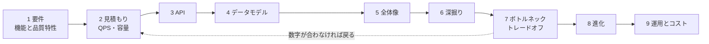
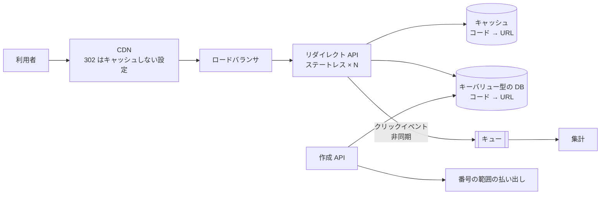
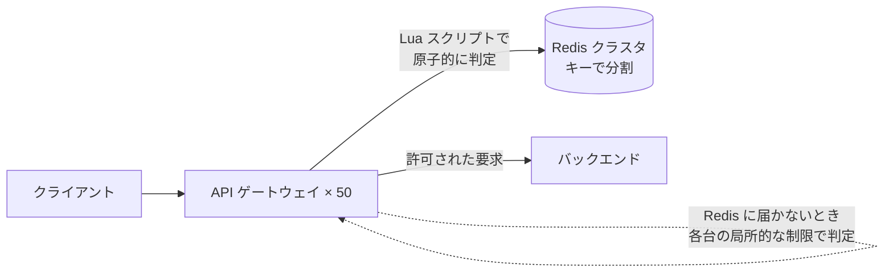
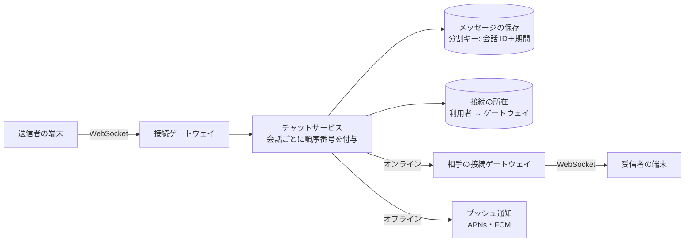
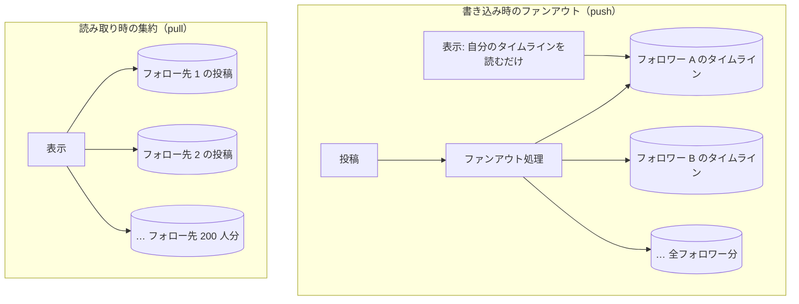
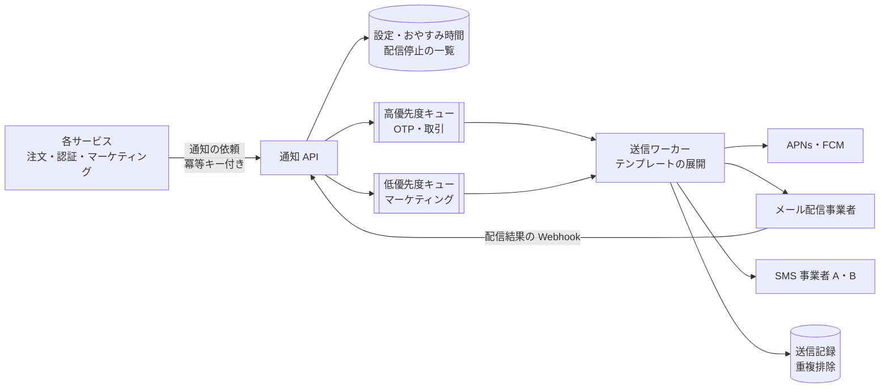
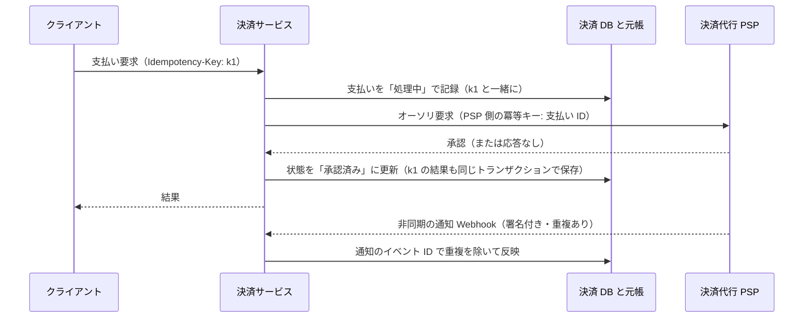
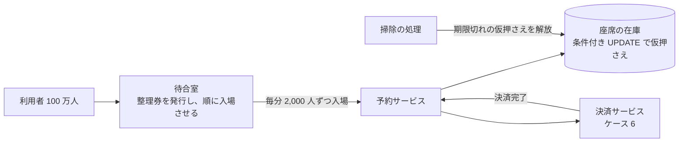

# 9.6 システム設計ケーススタディ

> ここまでの章で学んだ品質特性、スタイル、ドメインの境界、API、スケーラビリティの道具を、1 つの設計にまとめ上げる練習をします。URL 短縮、分散レート制限、チャット、タイムライン、通知、決済、予約という 7 つの典型的なシステムを、要件の確認から見積もり、API、データモデル、全体像、深掘り、ボトルネック、進化、運用とコストまで、同じ手順でたどります。

| 項目 | 内容 |
|---|---|
| 学習時間の目安 | 本文 6h ＋ 演習 6h |
| 前提となる章 | [9.1](../01-architecture-fundamentals/README.md)〜[9.5](../05-scalability-and-performance/README.md)、[第7部 分散システム](../../07-distributed-systems/README.md) |
| 演習 | [exercises/](exercises/)（Python）＋ 記述演習 |
| キーワード | 設計の手順, 概算見積もり, 62 進数, 全単射, 分散レート制限, WebSocket, メッセージの順序, ファンアウト, 通知の重複排除, 冪等性, 複式簿記, 照合, 仮押さえ, 売り越しの防止, 待合室 |

## この章のゴール

- [ ] システム設計の議論を、要件 → 見積もり → API → データモデル → 全体像 → 深掘り → ボトルネック → 進化 → 運用とコスト、の手順で進められる
- [ ] 7 つの典型的なシステムについて、中心となる設計上の論点と、その選択肢のトレードオフを説明できる
- [ ] 数字（QPS・データ量・接続数）から、どこがボトルネックになるかを予測し、規模に応じた設計の進化を描ける
- [ ] 障害の起き方（部分故障、重複、遅延、順序の入れ替わり）を設計の段階で洗い出し、対策を組み込める
- [ ] 複式簿記の元帳・衝突しないコードの生成・売り越しを防ぐ仮押さえを実装できる
- [ ] 設計レビューで投げるべき質問を使いこなし、他人の設計の弱点を具体的に指摘できる

## なぜ学ぶのか

アーキテクチャの知識は、個々には理解していても、1 つの設計に統合しようとすると途端に難しくなります。キャッシュを入れれば一貫性が、非同期にすれば順序が、分割すれば横断的な処理が問題になり、あちらを立てればこちらが立たない判断が次々と現れるからです。

- **規模とともに設計は進化する**: Discord は 2017 年のブログで、メッセージの保存先を MongoDB から Cassandra に移したことを説明し、2023 年のブログでは、177 台の Cassandra のクラスタで起きていた問題（特定のチャンネルに負荷が集中するホットパーティション、ガベージコレクションによる遅延、コンパクションの滞留）を、72 台の ScyllaDB への移行と、同じデータへの同時の要求を 1 つにまとめる（9.5 の単一飛行と同じ考え方の）データサービス層で解決したと報告しています。最初から最終形を作ることはできず、各段階で「次に壊れるのはどこか」を見極める力が求められます。
- **最も重要な瞬間に、設計が試される**: 2022 年のチケットの先行販売で Ticketmaster が過去のピークの 4 倍のリクエストを受けたように（[9.5](../05-scalability-and-performance/README.md)）、予約・決済・通知のシステムは、事業にとって最も重要な瞬間に最大の負荷を受けます。
- **設計レビューと採用の共通言語になる**: シニア以上のエンジニアの採用面接や、社内の設計レビューで行われる「システム設計」の議論は、この章の手順そのものです。CTO にとっては、チームの設計を評価し、質問によって弱点を浮かび上がらせるための道具になります。

## 1. 設計の手順

どのシステムでも、次の順序で考えると、抜け漏れと手戻りが減ります。60 分の設計レビュー（または面接）なら、右の列の時間配分が目安です。

| 手順 | やること | 時間の目安 |
|---|---|---|
| 1. 要件の確認 | 機能要件（何ができるか）と、品質特性の上位 3 つ（9.1）。対象外にするものも明言する | 5〜10 分 |
| 2. 概算見積もり | DAU → QPS（平均とピーク）、データ量の増え方、帯域、接続数（9.5） | 5 分 |
| 3. API | 主要な操作を 3〜5 個。冪等性、ページネーション、エラー（9.4） | 5 分 |
| 4. データモデル | エンティティ、アクセスパターン、分割のキー、一貫性の要求 | 5〜10 分 |
| 5. 全体像 | コンテナ図のレベルの構成（9.1 の C4） | 10 分 |
| 6. 深掘り | 最も難しい 1〜2 か所（多くは品質特性の (H, H) のシナリオ）を詳しく | 15 分 |
| 7. ボトルネックとトレードオフ | 10 倍の規模で最初に壊れる場所、単一障害点、選ばなかった案とその理由 | 5 分 |
| 8. 進化 | 最初の版と、規模に応じた次の段階 | 3 分 |
| 9. 運用とコスト | 監視すべき指標、障害時の振る舞い、費用の大きな項目 | 2 分 |

よくある失敗は、手順 1・2 を飛ばして、いきなりデータベースの製品名やマイクロサービスの図から始めることです。要件と数字がなければ、どの設計が良いかを判断できません。



以下の 7 つのケーススタディは、すべてこの手順に沿っています。数値は説明のための仮定であり、実在のサービスの値ではありません。

## 2. ケース 1: URL 短縮サービス

### 要件と見積もり

- 機能: 長い URL から短い URL（`https://sho.rt/Ab3xK9q`）を作る。短い URL へのアクセスを元の URL にリダイレクトする。任意の別名（`/summer-sale`）も指定できる。
- 品質特性: 読み取りの低レイテンシ（p99 50ms 以内）、高可用性（リダイレクトが止まると顧客のキャンペーンがすべて止まる）、一度発行したコードは永久に同じ URL を指す。
- 規模の仮定: 新規の URL が月 1 億件、読み取りは書き込みの 100 倍、5 年間保持。

| 項目 | 値 |
|---|---|
| 書き込み | 平均 約 39 件/秒、ピーク（3 倍）約 116 件/秒 |
| 読み取り | 平均 約 3,858 件/秒、ピーク 約 11,574 件/秒 |
| 5 年間の件数 | 60 億件（1 件 500 バイトとして約 3TB） |
| コードの空間 | 7 文字の 62 進数で 62⁷ ≈ 3.5 兆。60 億件は 0.17% |

### API

```text
POST /v1/links        {"url": "https://example.com/...", "alias": "summer-sale"(任意)}
                      → 201 {"code": "Ab3xK9q", "short_url": "https://sho.rt/Ab3xK9q"}
GET  /{code}          → 301 または 302、Location: 元の URL
```

**301（恒久的な移動）か 302（一時的な移動）か** は、トレードオフです。301 はブラウザや中継がキャッシュするので速く、サーバーの負荷も減りますが、2 回目以降のアクセスがサーバーに届かないので、クリック数の計測ができず、リンク先の変更や不正な URL の停止も効かなくなります。計測を事業の中心に置くなら 302 を選びます。

### コードの作り方

| 方式 | 仕組み | 利点 | 欠点 |
|---|---|---|---|
| URL のハッシュの先頭 | SHA-256 などの先頭 7 文字 | 同じ URL は同じコード | 衝突する（誕生日のパラドックス。件数が増えると急増）。衝突時の再試行が必要 |
| ランダム | 乱数でコードを作り、未使用なら採用 | 推測されにくい | 衝突の確認に DB の問い合わせが必要。空間が埋まるほど再試行が増える |
| 連番を 62 進数に | カウンタの値を符号化 | 衝突しない | 連番が推測でき、件数（事業の規模）が漏れる |
| 連番を全単射で並べ替えてから 62 進数に | `(a × n + b) mod 62⁷` | 衝突せず、連番に見えない。逆算もできる | 難読化であって暗号ではない（演習 2） |

連番を使う方式では、**カウンタの発行がボトルネックと単一障害点にならないように** します。各アプリサーバーが中央のカウンタ（DB のシーケンスなど）から 1,000 番ずつの範囲をまとめて予約し、その範囲の中で番号を払い出せば、中央への問い合わせは 1,000 件に 1 回で済みます。サーバーが落ちるとその範囲の残りは欠番になりますが、空間は十分に広いので問題になりません。

別名の検証も重要です。自動生成のコードと同じ形（7 文字の英数字）の別名を許すと、将来の自動生成のコードと衝突します。演習 2 では、長さや使える文字で名前空間を分けます。

### 全体像



### 深掘りと失敗の起き方

- **読み取りの経路を最短に**: アクセスは強く偏る（一部の URL に集中する）ので、キャッシュの効果が大きい。人気のコードの有効期限切れによるスタンピードには、9.5 の単一飛行が効く。存在しないコードへの大量のアクセス（攻撃やタイプミス）には、ネガティブキャッシュで DB を守る。
- **クリックの計測は同期で書かない**: リダイレクトの応答を待たせないよう、イベントをキューに送り、集計は非同期に行う。キューが止まってもリダイレクトは止めない（縮退運転）。
- **悪用への対策**: フィッシングやマルウェアの URL の短縮は、事業の信用に直結する。作成時の検査、通報の受付、コードの無効化の仕組みを最初から用意する。

### 進化

最初は 1 つの RDB とキャッシュで十分な規模です（ピーク 1.2 万件/秒の読み取りのほとんどはキャッシュで返る）。データが数十 TB に近づいたら、コードをキーにしたパーティショニング（[7.3](../../07-distributed-systems/03-partitioning/README.md)）か、キーバリュー型の DB に移ります。コードそのものがキーなので、分割は容易です。

## 3. ケース 2: 分散レート制限

### 要件と見積もり

- 機能: API ゲートウェイで、API キーごとに「毎秒 100 リクエスト、瞬間的に 200 まで」のような制限をかける。超えたら 429 と `Retry-After` を返す（9.4）。
- 品質特性: 判定の追加レイテンシは 1ms 程度まで。制限の精度はある程度の誤差を許す。**制限の仕組み自体の障害で API 全体を止めない**。
- 規模: ゲートウェイ 50 台、合計 50 万リクエスト/秒、API キー 100 万個。

### 選択肢

1 台のサーバーの中なら、9.5 の演習のトークンバケットで済みます。問題は、同じ API キーの要求が 50 台のゲートウェイに分散して届くことです。

| 方式 | 仕組み | 精度 | 追加レイテンシ | 障害への強さ |
|---|---|---|---|---|
| 各台で独立に制限 | 上限 ÷ 台数（100 ÷ 50 = 2/秒）を各台で | 低い（負荷が偏ると過剰に拒否・許可） | なし | 強い |
| 中央のストアで集計 | 全台が Redis などの共有カウンタを原子的に更新 | 高い | ネットワークの往復 1 回（約 0.5〜1ms） | ストアが単一障害点 |
| キーで振り分け | 一貫性ハッシュで、同じキーの要求を同じ台に集める | 高い | なし | 台の増減で状態が失われる。偏りに弱い |
| 局所＋定期的な同期 | 各台で数え、数百ミリ秒ごとに中央と差分を同期 | 中（同期の間隔の分だけ超過しうる） | ほぼなし | 強い |

中央のストアで集計する場合は、「残りを読んでから減らす」を 2 回の往復に分けると、同時の要求で上限を超えます（6.3 のロストアップデートと同じ、「読んで、判断して、書く」処理の競合です）。Redis なら Lua スクリプトで、読み取り・補充・判定・書き込みを 1 つの原子的な操作にします。

```lua
-- KEYS[1]: バケットのキー（例: "rl:{api_key}"）
-- ARGV[1]: 補充の速さ（個/秒）  ARGV[2]: 容量  ARGV[3]: 今回使う個数
local rate = tonumber(ARGV[1])
local capacity = tonumber(ARGV[2])
local requested = tonumber(ARGV[3])
local t = redis.call('TIME')                        -- 時刻は Redis 側の時計で測る（各サーバーの時計のずれを避ける）
local now = tonumber(t[1]) * 1000 + math.floor(tonumber(t[2]) / 1000)
local state = redis.call('HMGET', KEYS[1], 'tokens', 'ts')
local tokens = tonumber(state[1]) or capacity
local ts = tonumber(state[2]) or now
tokens = math.min(capacity, tokens + math.max(0, now - ts) / 1000 * rate)
local allowed = 0
if tokens >= requested then
  tokens = tokens - requested
  allowed = 1
end
redis.call('HSET', KEYS[1], 'tokens', tokens, 'ts', now)
redis.call('PEXPIRE', KEYS[1], math.ceil(capacity / rate * 1000) * 2)  -- 使われなくなったキーは消える
return allowed
```

```text
$ for i in 1 2 3 4 5 6 7; do redis-cli --eval token_bucket.lua rl:key-123 , 1 5 1; done
1 1 1 1 1 0 0          （容量 5 を使い切ると拒否。Redis 7.0 で実行。出力は 1 行にまとめて表示）
```

### 全体像



### 深掘りと失敗の起き方

- **Redis が止まったら**: 全リクエストを拒否する（フェイルクローズ）と、制限の仕組みの障害が API 全体の停止になる。すべて許可する（フェイルオープン）と、その間は無制限になる。多くの場合は、各台の局所的な緩い制限に切り替える中間策が現実的。どちらを選ぶかは、守りたいもの（課金の公平性か、バックエンドの保護か）で決まり、ADR に残すべき判断である。
- **ホットキー**: 1 つの巨大な顧客のキーに要求が集中すると、そのキーを持つ Redis の 1 台が限界に達する。そのキーだけ局所的なバケットに分割する（上限を台数で割る）などの特別扱いをする。
- **アルゴリズムの選択**: 固定窓は窓の境界で 2 倍のバーストを許す。スライディングウィンドウのログ（全要求の時刻を保存）は正確だがメモリを食う。9.5 の演習のスライディングウィンドウ・カウンタは、窓 2 つ分の整数で近似できる。
- **制限の単位**: API キー、ユーザー、IP アドレス、テナント、エンドポイントの重さ（検索や書き込みは高コスト）。429 の応答には、いつ再試行してよいかを必ず含める。

### 進化

最初は各台での局所的な制限と、バックエンドの負荷制限（9.5）で十分なことが多く、有料プランの課金に制限が結び付いた段階で、中央での正確な集計が必要になります。さらに規模が大きくなれば、ゲートウェイでの局所的な集計と、中央との非同期の同期を組み合わせます。

## 4. ケース 3: チャット・メッセージング

### 要件と見積もり

- 機能: 1 対 1 と、最大 500 人のグループでのテキストメッセージ。既読・配信済みの表示、オンライン状態（プレゼンス）、オフラインの端末へのプッシュ通知、複数端末の同期、履歴の検索。
- 品質特性: 送信から相手の画面に表示されるまで p99 500ms 以内（オンライン時）。**メッセージを失わない**。会話の中での順序が保たれる。
- 規模: DAU 5,000 万人、1 人 1 日 40 通、ピーク時の同時接続は DAU の 20%。

| 項目 | 値 |
|---|---|
| メッセージ | 1 日 20 億通。平均 約 2.3 万通/秒、ピーク（3 倍）約 7 万通/秒 |
| 保存量 | 1 通 200 バイトとして 1 日 400GB、年 146TB（複製前） |
| 同時接続 | 1,000 万本。1 台で 10 万本を保持できるとすれば、接続を保持するサーバーが 100 台（1 台あたりの本数は実装と設定で大きく変わるので、負荷試験で確かめる） |

### 全体像



### 深掘り: 順序・重複・欠落

ネットワークは、メッセージを失い、重複させ、順序を入れ替えます（[7.1](../../07-distributed-systems/01-fundamentals/README.md)）。チャットは、この 3 つすべてに対処する必要があります。

- **失わない**: 送信者の端末は、サーバーから受領の確認（ACK）が返るまで再送する。サーバーは、保存が完了してから ACK を返す。
- **重複させない**: 端末がメッセージごとに一意な ID（UUID など）を付け、サーバーは会話ごとに ID で重複を除く（9.4 の冪等キーと同じ考え方）。再送されても 1 通として扱う。
- **順序をそろえる**: 端末の時計は信用できないので、並び順は **サーバーが会話ごとに振る連番** で決める。会話ごとに順序番号を振る役を 1 か所（会話 ID で決まる担当のサーバーやパーティション）に集めれば、全体の時計を同期しなくても、会話の中の全順序が決まる。受信側は番号の抜けに気づいたら、その範囲を取り直す。
- **複数端末の同期**: 各端末は「どこまで受け取ったか（最後の順序番号）」を覚え、再接続したらその続きを取得する。既読の位置も同じように順序番号で表す。

### 深掘り: 保存とグループ

- **保存**: アクセスはほぼ「ある会話の最新 N 件」と「その少し前」なので、会話 ID と時間の区切りを分割キーにし、会話の中を時刻（順序番号）順に並べる。Discord は 2023 年のブログで、チャンネル ID と時間の区切り（バケット）を分割キーにしていること、特定のチャンネルへの集中（ホットパーティション）が問題になったことを説明しています。
- **グループのファンアウト**: 送信 1 回を、メンバー全員の端末に届ける。小さなグループなら送信時に各メンバーの受信箱へ配る（書き込み時のファンアウト）、非常に大きなチャンネルなら受信側がチャンネルのログを読みに行く（読み取り時のファンアウト）。この二択はケース 4 と同じ構造である。
- **プレゼンス**: 「オンライン」の表示は、端末からの定期的なハートビートと有効期限付きのキーで管理する。友人全員に状態の変化を即座に配ると、ファンアウトの量が膨大になるので、画面に表示されている相手の分だけを購読するなど、手を抜ける部分は抜く。

### 失敗の起き方と進化

- 接続ゲートウェイの 1 台が落ちると、10 万本の接続が一斉に再接続してくる（再接続の嵐）。クライアントの再接続にジッター付きのバックオフを入れ、ゲートウェイは段階的に受け入れる（9.5）。
- 最初は 1 つのリージョン、RDB と Redis で始められます。メッセージの量が増えたら、メッセージの保存を分割に強いワイドカラム型のデータベースに移し、履歴の検索は検索エンジンに非同期で索引を作る形に分けます。エンドツーエンドの暗号化を導入するなら、サーバーは本文を読めなくなるので、検索や迷惑行為の検知の設計を根本から変える必要があります（最初に決めるべき一方通行のドアの 1 つです）。

## 5. ケース 4: ニュースフィード・タイムライン

### 要件と見積もり

- 機能: フォローしているアカウントの投稿を、新しい順（または関連度順）に表示する。
- 品質特性: フィードの表示は p99 200ms 以内。投稿がフォロワーのフィードに現れるまでの遅れは数秒〜数十秒まで許容する（結果整合性で良い）。
- 規模: DAU 1 億人、1 人 1 日 10 回フィードを表示、利用者の 10% が 1 日 1 回投稿、平均フォロー数 200。フォロワー 1,000 万人を超える有名人のアカウントもある。

| 項目 | 値 |
|---|---|
| フィードの表示 | 平均 約 1.16 万回/秒 |
| 投稿 | 1 日 1,000 万件 |
| 書き込み時にファンアウトすると | 1 日 20 億回（平均 約 2.3 万回/秒）のタイムラインへの挿入 |
| 読み取り時に集めると | 表示 1 回で 200 人分を集めるので、約 230 万回/秒の読み取り |

### 2 つの方式と、その組み合わせ



| | 書き込み時のファンアウト（push） | 読み取り時の集約（pull） |
|---|---|---|
| 表示の速さ | 速い（事前に作ってある） | 遅い（毎回集めて並べる） |
| 書き込みの量 | フォロワー数に比例（有名人の 1 投稿で 1,000 万回） | 1 回 |
| 反映の遅れ | ファンアウトの処理時間 | なし |
| 無駄 | ほとんどログインしない利用者の分も作る | なし |

1,000 万人のフォロワーを持つアカウントの投稿を、毎秒 10 万件の速さで配っても、全員に届くまで 100 秒かかります。そこで、多くのサービスは両者を組み合わせます。Martin Kleppmann の『データ指向アプリケーションデザイン』は、Twitter が、ほとんどのアカウントの投稿は書き込み時に配り、フォロワーの非常に多い少数のアカウントの投稿は読み取り時に取得して合成する、という混合方式に移行したことを紹介しています（Twitter は 2012 年ごろの講演 "Timelines at Scale" で、投稿の ID をフォロワーごとのタイムラインのキャッシュに書き込む構成を説明していました）。

### 深掘り

- **タイムラインには ID だけを持つ**: フォロワーごとのタイムラインには投稿の ID（と並べ替えのキー）だけを、直近の数百件まで保持する。本文・画像・いいねの数は、表示のときに投稿のキャッシュからまとめて取得する（ハイドレーション。9.4 の N+1 に注意し、まとめて取る）。
- **活動していない利用者を飛ばす**: 30 日以上ログインしていない利用者にはファンアウトせず、次のログイン時に pull で作り直す。
- **ページネーション**: 表示中に新しい投稿が次々と届くので、9.4 のキーセット（カーソル）方式で返す。
- **ランキング**: 関連度順にするなら、候補を集める段階（上の push/pull）と、機械学習のモデルで並べ替える段階を分ける（[12.2](../../12-data-and-ai/02-machine-learning/README.md)）。
- **削除とブロック**: 投稿の削除やブロックの反映は、ファンアウト済みのタイムラインからの取り除きが漏れやすい。表示の段階でも、削除済み・ブロック中の投稿を最終的に除外する（二重の防御）。

### 失敗の起き方と進化

ファンアウトのキューが詰まると、フィードに新しい投稿が現れない「静かな障害」になります。キューの滞留時間（最も古い未処理のメッセージの年齢）を監視し、有名人の投稿のファンアウトは優先度の低いキューに分けます。最初は pull（フォロー先の投稿を DB から集めてキャッシュ）で始め、表示の遅さが問題になったら push に、有名人の問題が出たら混合方式に、と段階的に進化させるのが現実的です。

## 6. ケース 5: 通知システム

### 要件と見積もり

- 機能: 注文の確定、ワンタイムパスワード（OTP）、キャンペーンなどを、プッシュ通知・メール・SMS・アプリ内のお知らせで送る。利用者は種類ごと・チャネルごとに受け取るかを設定でき、夜間は送らない（おやすみ時間）。
- 品質特性: OTP は数秒以内に届く。**同じ通知を重複して送らない**。マーケティングの大量配信が、重要な通知を遅らせない。
- 規模: 1 日 5,000 万件。キャンペーンでは 1,000 万件のプッシュを 10 分で送りたい（約 1.7 万件/秒）。

### 全体像



### 深掘り

- **優先度でキューを分ける**: 1,000 万件のキャンペーンと、ログイン用の OTP を同じキューに入れると、OTP が数十分待たされる。キューとワーカーを優先度で分ける（9.5 のバルクヘッド）。
- **重複排除**: 送信の依頼には、呼び出し側が冪等キー（例: `order-123:shipped`）を付ける。ワーカーは（キー, 利用者, チャネル）で送信記録を確認してから送る。ただし、「外部の事業者に送った」と「記録した」の間で落ちると、再実行で重複しうる。送信の前に「送信中」を記録し、事業者側の冪等キーの仕組みがあれば使い、なければ重複の可能性を許容するかを種類ごとに決める（OTP は再送されても害が小さく、課金の通知は慎重に）。
- **設定と法令の確認は送信の直前に**: 依頼を受けた時点と送信の時点の間に、利用者が配信を停止しているかもしれない。広告・宣伝のメールには、日本では特定電子メール法（特定電子メールの送信の適正化等に関する法律）がオプトイン（事前の同意）などを求めています。対象や要件は一般論にとどまるので、具体的な判断は専門家に確認してください。
- **外部の事業者の制限と障害**: プッシュ・メール・SMS の事業者には、それぞれ送信速度の上限がある。レート制限（ケース 2）をかけながら送り、429 や 5xx にはジッター付きのバックオフで再試行する。SMS は事業者を 2 社用意し、片方の障害時に切り替える。
- **無効な宛先の掃除**: アンインストールされた端末のトークンや、存在しないメールアドレスへの送信を繰り返すと、事業者からの評価（到達率）が下がる。配信結果の Webhook（9.4 の署名検証）を受け取り、無効な宛先を記録する。
- **利用者ごとの上限**: 1 人に短時間で大量の通知を送らない（バグによる暴走の防止にもなる）。

### 失敗の起き方と進化

最悪の障害は「大量の誤送信」です。テンプレートの誤り、対象者の抽出条件の誤りで、数百万人に誤った通知が一斉に届くと、取り消しはできません。大量配信には、少人数への試験送信、承認のワークフロー、段階的な配信（1% → 10% → 100%）と、途中で止める緊急停止スイッチを設けます。最初は、各サービスがメール配信の SaaS を直接呼ぶ形でもかまいません。チャネルや設定の種類が増え、重複や送りすぎの問題が出てきた段階で、通知を専門に扱うサービスに集約します。

## 7. ケース 6: 決済システム

### 要件と見積もり

- 機能: EC サイトの注文の支払いを、決済代行（PSP）を通じてカードやウォレットで受け付ける。返金、加盟店への入金、手数料の計上。
- 品質特性: **二重課金をしない。お金の記録を失わない。すべてのお金の動きを説明できる**（監査可能性）。処理量の多さより正しさが圧倒的に重要。
- 規模: 1 日 100 万件（平均 約 12 件/秒、セールのピークで 10 倍の約 120 件/秒）。量としては 1 台の RDB で十分に扱える。

### 全体像



オーソリ（与信枠の確保）の段階では、まだお金は動きません。元帳への仕訳は、売上確定・返金・加盟店への入金のようにお金が動く時点で、支払いの状態の更新と同じトランザクションで記帳します（下の「複式簿記の元帳」）。

### 深掘り: 「ちょうど 1 回」は幻想である

ネットワーク越しの呼び出しで、「ちょうど 1 回だけ実行する」ことを保証する方法はありません。応答がタイムアウトしたとき、PSP で課金されたのかどうかは分からないからです。実務で「exactly-once」と呼ばれているものは、**少なくとも 1 回届くまで再送し（at-least-once）、受け取る側を冪等にする** ことで、効果を 1 回にしているだけです。決済システムでは、この組み合わせを経路のすべての区間で成り立たせます。

- **クライアント → 決済サービス**: 冪等キー（9.4 の演習 3）。
- **決済サービス → PSP**: 支払いごとの ID を PSP の冪等キーとして送る。応答がなければ、同じキーで再送するか、PSP に状態を問い合わせてから決める（9.2 の演習の「課金の途中で失敗したら、同じ冪等キーで再開する」と同じ）。
- **PSP → 決済サービス（Webhook）**: 署名を検証し（9.4 の演習 1）、イベント ID で重複を除く。到着順は保証されないので、「承認済み」の後に「オーソリ中」の通知が届いても、状態を巻き戻さない（状態遷移を一方向に限る）。

支払いは **状態機械** として管理し、許される遷移だけを受け付けます（9.3 のエンティティ）。

```text
作成 → オーソリ中 → 承認済み → 売上確定 → 一部返金 / 全額返金
             └→ 拒否・失敗      └→ 取消（売上確定前）
```

### 深掘り: 複式簿記の元帳

残高を 1 つの数値として上書き更新する設計は、お金を扱うシステムでは危険です。障害や不具合で数値がずれたとき、なぜずれたのかを誰も説明できないからです。代わりに、すべてのお金の動きを、**借方と貸方の合計が必ず一致する仕訳** として追記します（演習 4）。

| 仕訳の例 | 借方 | 貸方 |
|---|---|---|
| 利用者が 10,000 円をチャージ | 決済代行への預け金（資産）10,000 | 利用者のウォレット残高（負債）10,000 |
| ウォレットで 3,000 円の買い物（手数料 3%） | 利用者のウォレット残高 3,000 | 加盟店への未払い金（負債）2,910、手数料収入（収益）90 |
| 買い物の取消 | 上の仕訳の借方と貸方を入れ替えた仕訳を追記する（元の仕訳は消さない） | |

- **追記のみ**: 誤りは修正ではなく、取消の仕訳で打ち消す。監査のときに、いつ、何が、なぜ起きたかをすべてたどれる。
- **いつでも検算できる**: 全仕訳の借方の総額と貸方の総額は常に一致する（試算表）。一致しなければ、不具合が即座に分かる。
- **残高は導出する**: 口座の残高は仕訳の合計であり、任意の時点の残高も再計算できる。実務では、読み取りを速くするために残高のスナップショットを持つが、それは仕訳から再構成できる「キャッシュ」として扱う。
- **マイナス残高の禁止**: 利用者のウォレットのように残高が負になってはいけない口座は、記帳の時点で検査して拒否する。同時に 2 つの支払いが同じ残高を使おうとしたときに両方通さないよう、口座の単位でロック（またはデータベースの制約）をかける。

### 深掘り: 照合（リコンシリエーション）

どれだけ注意深く作っても、自社の記録と PSP の記録は、いつか必ずずれます（Webhook の取りこぼし、タイムアウトした要求、PSP 側の手動の処理）。そこで、PSP が毎日提供する精算レポートと自社の元帳を突き合わせる **照合** のバッチを動かし、差異を自動で分類します（自社にだけある、PSP にだけある、金額が違う）。差異の件数は、決済システムの健全性を示す最も重要な指標の 1 つです。

### 規制と進化

カード番号を自社のサーバーで扱うと、カード業界のセキュリティ基準 PCI DSS の対象範囲が大きく広がります。PSP が提供するトークン化（カード番号は PSP に直接送られ、自社には代わりのトークンだけが届く）を使って、範囲を小さく保つのが定石です。チャージ型のウォレット（前払式の支払手段）には、日本では資金決済法の規制がかかる場合があります。いずれも要件の詳細は時期や事業の形態で変わるため、具体的な判断は専門家に確認してください（[14.5](../../14-cto/05-governance-risk-compliance/README.md)）。

設計の進化の方向は、量ではなく正しさと機能の広がりです。最初は 1 つの RDB に、支払いの状態・冪等キー・元帳を同居させ、1 トランザクションで整合性を保つのが最も安全です。複数の PSP への対応、複数通貨、加盟店への入金の自動化と進むにつれて、元帳を独立したサービスに切り出し、他のサービスはイベントで元帳に記帳を依頼する形になっていきます。

## 8. ケース 7: チケット・ホテルの予約

### 要件と見積もり

- 機能: 人気公演の座席を選んで購入する。決済の間（最大 10 分）は座席を仮押さえする。ホテルなら、部屋タイプ・泊数ごとの在庫を販売する。
- 品質特性: **同じ座席を 2 人に売らない（売り越しの防止）**。発売開始の瞬間の極端な集中に耐える。ボットによる買い占めを防ぎ、公平に販売する。
- 規模: 座席 5 万席の公演に、発売開始の瞬間 100 万人が殺到する。

### 全体像



### 深掘り: 待合室で入場を制御する

100 万人の同時アクセスをすべて在庫の DB に通す必要はありません。売れるのは 5 万席なので、1 人あたり平均 3 席とすれば、実際に購入できるのは約 1.7 万人です。**待合室（仮想的な行列）** で整理券を発行し、予約サービスが処理できる速さ（例えば毎分 2,000 人）で入場させれば、在庫の DB への負荷は一定に保たれます。この速さなら、約 8〜9 分で完売する計算で、残りの利用者には「完売」を早く伝えられます。待合室は、ボット対策（整理券の検証、1 人 1 券）と公平性（到着順）の要でもあります（OWASP API6「重要な業務フローへの無制限なアクセス」）。

### 深掘り: 売り越しを防ぐ仮押さえ

「空いているか調べて、空いていれば押さえる」を 2 つの操作に分けると、2 人が同時に空きを確認して、両方が押さえてしまいます。データベースで **1 文の条件付き UPDATE** にし、更新された行数で成否を判定します。

```sql
-- 仮押さえ: 空いている（または仮押さえの期限が切れた）座席だけを、1 文の条件付き UPDATE で押さえる
BEGIN;
UPDATE seats SET status = 'held', hold_id = 'h1', held_until = now() + interval '10 minutes'
 WHERE event_id = 'ev1' AND seat_id IN ('A1', 'A2')
   AND (status = 'available' OR (status = 'held' AND held_until < now()));
COMMIT;   -- 更新は 2 行 = 要求した席数と一致したので確定

-- 別の利用者が A2 と A3 を要求: A2 は条件に合わないので、更新されるのは 1 行だけ
BEGIN;
UPDATE seats SET status = 'held', hold_id = 'h2', held_until = now() + interval '10 minutes'
 WHERE event_id = 'ev1' AND seat_id IN ('A2', 'A3')
   AND (status = 'available' OR (status = 'held' AND held_until < now()));
ROLLBACK; -- 要求した 2 席と一致しないので取り消す（全部か無か）
```

```text
UPDATE 2
UPDATE 1
 seat_id |  status   | hold_id
---------+-----------+---------
 A1      | held      | h1
 A2      | held      | h1
 A3      | available |
 A4      | available |
 A5      | available |
```

（PostgreSQL 16 での実行結果の抜粋。）2 つ目の UPDATE が 1 行しか更新しなかったことに注目してください。条件付き UPDATE は「取れる席だけ取る」ので、**要求した席数と更新した行数を比べ、一致しなければロールバックする** ことを忘れると、2 席並びを頼んだ人に 1 席だけ売ってしまいます。演習 3 では、この「全部か無か」をロックを使って実装します。

座席を指定しない「どこでもよいので 2 席」なら、`SELECT ... FOR UPDATE SKIP LOCKED` で、他の取引がロックしている行を待たずに飛ばして、空いている行をすぐに取れます。

```sql
-- 「空いている席をどこでも 2 席」: 他の取引がロック中の行（A3）を待たずに飛ばす
BEGIN;
SELECT seat_id FROM seats
 WHERE event_id = 'ev1' AND status = 'available'
 ORDER BY seat_id LIMIT 2
 FOR UPDATE SKIP LOCKED;
COMMIT;
```

```text
 seat_id
---------
 A4
 A5
```

（別のセッションが A3 の行をロックしている間に実行した、PostgreSQL 16 での結果。）

ホテルのように「部屋タイプ・日付ごとの残り室数」を数える在庫なら、`UPDATE inventory SET remaining = remaining - 1 WHERE room_type = ? AND night = ? AND remaining >= 1` のように、条件付きの減算で同じことができます。複数泊の予約は、すべての泊の減算を 1 つのトランザクションで行い、1 泊でも失敗したらロールバックします。なお、ホテル業界では、キャンセルを見込んで意図的に在庫より多く販売する（オーバーブッキング）こともあります。これは技術の問題ではなく事業の判断なので、許容する割合と、溢れたときの補償の手順を事業側と決めておきます。

### 失敗の起き方と進化

- **仮押さえの期限切れと決済の完了の競合**: 期限の直前に決済が完了し、期限切れで座席が解放されて別の人に売れた後に、確定の処理が届くことがある。確定は「その仮押さえがまだ有効なら」という条件付きの更新にし、失敗したら決済を取り消す（返金する）補償の処理を用意する。
- **決済の途中で離脱**: 仮押さえは期限で自動的に解放する。掃除の処理が止まっていても売り越しにならないよう、上の SQL のように、期限切れの判定は押さえる側の条件にも含める。
- **ボット**: 1 人あたりの上限（演習 3）、整理券、決済手段の名寄せなどを組み合わせる。

最初は 1 つの RDB の条件付き UPDATE で十分です。公演の規模が大きくなり、在庫の DB が集中に耐えられなくなったら、待合室で流量を制御し、公演ごと（またはブロックごと）に在庫を分割します。

## 9. 設計レビューで投げるべき質問

設計書やホワイトボードの図を前にしたとき、次の質問が弱点を浮かび上がらせます。すべてを毎回聞く必要はありませんが、手元のチェックリストとして持っておくと役立ちます。

**要件と数字**

- この設計の上位 3 つの品質特性は何ですか。それぞれ、測定可能な目標になっていますか。
- 想定の QPS・データ量・接続数は、どんな前提から計算しましたか。10 倍になったら、最初に壊れるのはどこですか。

**障害**

- 依存先が **遅くなったら**、止まったら、何が起きますか。タイムアウト・リトライ・縮退運転は設計されていますか。
- 同じリクエストやメッセージが **2 回届いたら** どうなりますか。順序が入れ替わったら、失われたら。
- 単一障害点はどこですか。そのコンポーネントが止まったとき、影響を受ける利用者の割合は。
- 障害から戻るとき、再接続やリトライが殺到して二次災害を起こしませんか。

**データ**

- データの所有者（正本）はどこですか。キャッシュや複製が古いとき、誰がどんな影響を受けますか。
- 途中で失敗したとき、どの状態が残りますか。それを検知し、修復（照合・再実行・補償）する仕組みはありますか。
- 最も不可逆な決定（分割のキー、ID の形式、公開 API）はどれで、後から変えるといくらかかりますか。

**運用・セキュリティ・コスト**

- この設計が正常に動いていることを、どの指標で知りますか。アラートは誰に届きますか。
- 認可はどこで、何を単位に検査していますか。他人のデータに届く経路はありませんか。
- 費用の最大の項目は何ですか。利用者 1 人（またはリクエスト 1 件）あたりの費用は。
- 検討して捨てた案は何で、なぜ捨てましたか。

## よくある落とし穴

1. **要件と見積もりを飛ばして、製品名から始める**。「Kafka と Cassandra で」から始まる設計は、必要のない複雑さを抱えるか、本当の難所を見落とす。要件と数字を先に置き、そこから構成を導く。
2. **最初から最終形を作ろうとする**。数十万 QPS を想定した分散構成を、利用者が数千人の段階で作り、運用に追われて機能開発が止まる。最初の版と、進化の段階（どの数字を超えたら何をするか）を分けて設計する。
3. **「exactly-once」を前提にする**。ネットワークは重複・欠落・順序の入れ替わりを起こす。at-least-once の配送と冪等な処理、重複排除の ID、照合を組み合わせる。
4. **残高や在庫を 1 つの数値の上書きで管理する**。ずれたときに原因を説明できず、同時更新で壊れる。お金は複式簿記の仕訳で追記し、在庫は条件付きの更新で原子的に変える。
5. **「調べてから更新する」を 2 つの操作に分ける**。同時実行で二重販売・二重予約・上限の超過が起きる。条件付き UPDATE、制約、原子的なスクリプトで 1 つの操作にし、更新した件数で成否を判定する。
6. **有名人・ホットキー・一斉アクセスを考えない**。平均の負荷では問題なくても、偏りが 1 台のサーバーや 1 つのパーティションを押し潰す。偏りの最悪の場合を見積もり、特別扱いの経路を用意する。
7. **非同期の処理の監視を忘れる**。キューの滞留は、エラーを出さずに「届かない」「反映されない」という静かな障害になる。キューの長さと最も古いメッセージの年齢を監視する。
8. **大量の一斉処理に安全装置を付けない**。通知の誤送信、一斉の価格変更、大量の返金は取り消せない。試験送信、承認、段階的な実行、緊急停止を設ける。

## CTOの視点

1. **設計レビューを「質問の場」として運営する**。レビューの目的は、設計者を論破することではなく、前提と障害の起き方を明らかにすることです。9 章の質問を組織の設計レビューのテンプレートに組み込み、「2 回届いたら」「10 倍になったら」「止まったら」に答えられない設計は差し戻す、という基準をそろえます（[13.2](../../13-technical-leadership/02-technical-decisions/README.md)）。
2. **お金・在庫・個人情報を扱う部分には、別格の基準を適用する**。決済・元帳・在庫・通知の一斉配信のように、誤りが直接の金銭的損失や信用の失墜につながる部分は、複式簿記、照合、冪等性、二人承認、段階的な実行といった「重い」仕組みを標準として求めます。それ以外の部分まで同じ重さにする必要はありません。重さを使い分けることが、速さと安全の両立です。
3. **ピークの日の設計を、事業の計画と一緒に承認する**。チケットの発売、セール、キャンペーンの一斉配信は、マーケティングの予定表に載っています。その日程と規模を技術側が事前に知り、待合室・レート制限・容量の増強・当日の体制を準備する仕組みを、事業側との定例の会議に組み込みます。
4. **「最初の版」の規模感をチームと合意する**。スタートアップの初期に、大企業の事例（数億人規模の設計）をそのまま真似ると、開発の速度を失います。「今の 10 倍までは、この単純な構成で耐えられる。100 倍の兆候（この指標がこの値を超えたら）が見えたら次の段階へ進む」という形で、進化の計画を ADR に残しておけば、過剰設計と場当たり的な対応の両方を避けられます。
5. **採用のシステム設計面接では、答えより進め方を見る**。正解の構成を知っているかどうかより、要件を確認する質問、数字の見積もり、トレードオフの説明、障害の起き方への目配り、面接官の指摘を取り込んで設計を直す柔軟さを評価します。この章の手順は、評価の観点の表としても使えます（[13.4](../../13-technical-leadership/04-hiring/README.md)）。

## 演習

演習コードは [exercises/](exercises/) にあります。解答例は [solutions/](solutions/) にあります。

```bash
python3 tools/check.py 9.6        # リポジトリのルートで実行
python3 tools/check.py -v 9.6     # 詳しい出力
```

| # | 難易度 | 内容 | 対象 |
|---|---|---|---|
| 1 | ★☆☆ | 62 進数の符号化と復号 | `shortener.py`: `base62_encode`, `base62_decode` |
| 2 | ★★☆ | 連番から衝突しないコードを作る全単射（逆元による逆算）、別名と URL の検証、短縮サービス | `shortener.py`: `CodeGenerator`, `validate_alias`, `validate_url`, `Shortener` |
| 3 | ★★☆ | 座席の仮押さえ・確定・期限切れ・1 人あたりの上限（同時実行で売り越さない） | `seat_hold.py`: `SeatInventory` |
| 4 | ★★★ | 複式簿記の元帳（借方と貸方の一致、冪等な記帳、マイナス残高の禁止、取消の仕訳、時点の残高） | `ledger.py`: `Posting`, `Ledger` |
| 5 | ★★☆ | 記述: システム設計の演習（下記） | — |

### 演習 5（記述）: 3 つのシステムを設計する

次の 3 つから 2 つ以上を選び、1 章の手順（要件 → 見積もり → API → データモデル → 全体像 → 深掘り → ボトルネック → 進化 → 運用とコスト）に沿って設計してください。見積もりの前提は自分で置いてかまいませんが、必ず明記してください。

- **A. 先着順のクーポン配布**: 飲食チェーンが、アプリで「先着 10 万名に 500 円引きクーポン」を正午に配布する。アプリの利用者は 800 万人。1 人 1 枚まで。
- **B. 近くの店舗の検索**: 地図アプリで、現在地の周辺にある営業中の店舗（全国 50 万店）を、距離の近い順に最大 20 件表示する。1 日の検索は 3,000 万回。
- **C. 監査ログの基盤**: 社内の 30 の業務システムから、「誰が・いつ・何に・何をしたか」の監査ログを集め、7 年間保存し、監査人が検索できるようにする。改ざんされていないことを証明できる必要がある。

<details>
<summary>採点の観点と解答の骨子</summary>

**共通の採点の観点**

| 観点 | 合格ライン | 優秀 |
|---|---|---|
| 要件 | 機能と品質特性の上位 3 つを書いている | 対象外にするものを明言し、曖昧な点を質問の形で挙げている |
| 見積もり | QPS・データ量を前提付きで計算している | ピークや偏り（最悪の場合）まで見積もり、設計の判断に使っている |
| 設計 | 主要なコンポーネントとデータの流れが図で分かる | 選ばなかった案と理由、規模に応じた進化の段階がある |
| 障害 | 依存先の障害への対処が 1 つ以上ある | 重複・順序・部分故障・二次災害まで検討している |
| 運用 | 監視する指標がある | 費用の大きな項目、誤操作への安全装置、SLO まである |

**A. 先着順のクーポン配布の骨子**

- 見積もり: 正午の数十秒に数百万のリクエストが集中しうる（800 万人の一部が一斉に押す）。配布の上限は 10 万件なので、在庫の判定を DB に直接集中させない設計が鍵。
- 設計: 待合室またはレート制限で流量を制御する。在庫の判定は 1 か所の原子的な減算（DB の条件付き UPDATE、または Redis の原子的な減算＋永続化）にし、「(クーポン ID, 利用者 ID)」の一意制約で 1 人 1 枚を保証する。応答は「獲得」「在庫切れ」を即座に返し、付与の記録は非同期に確実に行う（at-least-once と冪等な付与）。
- 深掘り: 在庫の数え方を分割すると（Redis をシャードで分ける）、合計がわずかに上限を超えたり下回ったりしうる。上限の厳密さ（ちょうど 10 万か、多少の超過を許すか）を事業側と合意する。ボット対策（端末・会員の名寄せ）。
- 運用: 事前の負荷試験、正午の前の容量の増強、緊急停止（配布の中断）。

**B. 近くの店舗の検索の骨子**

- 見積もり: 1 日 3,000 万回 = 平均 約 350 回/秒、ピーク数倍。店舗 50 万件は 1 台のメモリに載る規模。
- 設計: 緯度・経度で近傍を探すには、地理空間のインデックス（ジオハッシュ、四分木、R 木など）で、周辺のセルの候補だけを取り出し、距離で並べ替える。PostGIS などの空間インデックスを持つ DB を使うか、店舗データをメモリ上のインデックスとして各サーバーに複製する（更新は少ない）。
- 深掘り: セルの境界の近くの店舗の取りこぼし（隣接するセルも調べる）、店舗の密度の偏り（都市部は細かく、地方は粗く）、営業時間の判定（タイムゾーン・臨時休業）。検索結果のキャッシュは、位置を丸めたキーで行う。
- 進化: 最初は RDB と空間インデックスで十分。検索の量が増えたら、読み取り専用の複製やメモリ上のインデックスに移す。

**C. 監査ログの基盤の骨子**

- 見積もり: 30 システム × 1 日数百万件で、年に数 TB〜数十 TB。7 年保存なので、安価な保存層（オブジェクトストレージ）と、期間による階層化が必要。
- 設計: 各システムはログを送信するだけ（送信の失敗で業務を止めない。ローカルに溜めて再送する）。収集層でスキーマを検証し、追記のみの保存先に書き込む。改ざんの検知には、ログの塊ごとにハッシュを連鎖させる（前の塊のハッシュを次の塊に含める）、書き込み後に変更できない保存（WORM）を使う、などを組み合わせる。検索は、直近のものを検索エンジンに、古いものはオブジェクトストレージ上の列指向の形式にして、必要なときに問い合わせる。
- 深掘り: 時刻の信頼性（各システムの時計のずれ）、ログに個人情報を含めるかどうかと、保存期間・削除の要件の衝突、監査人の閲覧自体の監査ログ。法令や監査の要件は業種によって異なるので、具体的な判断は専門家に確認する。
- 運用: 取りこぼしの検知（送信元ごとの件数の連続性の監視）、保存費用の推移。

</details>

## 理解度チェック

**Q1. URL 短縮サービスで、コードを「URL の SHA-256 の先頭 7 文字」にする案の問題点を説明し、代替案を 1 つ挙げてください。**

<details>
<summary>解答</summary>

ハッシュの先頭の一部を使うと、異なる URL が同じコードになる衝突が起きます。62⁷ ≈ 3.5 兆の空間でも、誕生日のパラドックスにより、件数が増えるにつれて衝突の確率は急速に高まります（数百万件の段階で、すでに衝突が起きうる規模になる）。衝突したら別のコードを試す処理と、衝突の確認のための DB の問い合わせが必要になります。

代替案は、連番を使う方式です。連番は衝突しないので確認が不要です。そのまま 62 進数にすると推測されやすく件数も漏れるので、`(a × n + b) mod 62⁷`（a は 62 と互いに素）のような全単射で並べ替えてから符号化します。連番の発行は、各サーバーが中央から番号の範囲をまとめて予約することで、ボトルネックにしません。

</details>

**Q2. 分散レート制限で、共有カウンタを「残りを読む」「減らして書く」の 2 回の往復で更新すると、何が起きますか。どう直しますか。**

<details>
<summary>解答</summary>

2 台のゲートウェイが同時に「残り 1」を読み、どちらも許可して書き込むと、上限を超えて通してしまいます（読み取りと書き込みの間に他の更新が入る競合）。負荷が高いほど超過は大きくなります。

直し方は、判定と更新を 1 つの原子的な操作にすることです。Redis なら Lua スクリプトで、補充・判定・減算・書き込みをまとめて実行します（Redis はスクリプトを他のコマンドと混ぜずに実行します）。単純な回数の制限なら、原子的な加算（INCR）の戻り値で判定する方法もあります。

</details>

**Q3. チャットで、端末の時計を使ってメッセージを並べるべきでないのはなぜですか。代わりにどうしますか。**

<details>
<summary>解答</summary>

端末の時計はずれており（数秒〜数分、時には大きく）、利用者が手動で変更することもあります。ネットワークの遅延も端末ごとに異なるので、送信時刻の順と到着順も一致しません。端末の時刻で並べると、会話の中で返信が質問より前に表示されるといった矛盾が起きます。

代わりに、会話ごとにサーバーが単調に増える順序番号を振り、それで並べます。順序番号を振る役を会話ごとに 1 か所（会話 ID で決まる担当）に集めれば、全体の時計を同期しなくても、会話の中の順序が 1 つに決まります。受信側は番号の抜けから欠落に気づき、取り直せます。

</details>

**Q4. フォロワー 1,000 万人のアカウントの投稿を、書き込み時のファンアウトで配ると何が問題になりますか。どう解決しますか。**

<details>
<summary>解答</summary>

1 回の投稿で 1,000 万回のタイムラインへの書き込みが発生し、毎秒 10 万件の速さでも全員に届くまで 100 秒かかります。その間、ファンアウトのキューが詰まり、他の利用者の投稿の反映も遅れます。有名人が連続して投稿すれば、処理が追いつかなくなります。

解決策は混合方式です。ほとんどのアカウントの投稿は書き込み時に配り、フォロワーが非常に多い少数のアカウントの投稿は配らずに、フィードの表示時にそのアカウントの最新の投稿を取得して、事前に作ったタイムラインと合成します。有名人のファンアウトを低優先度のキューに分ける、活動していないフォロワーには配らない、といった工夫も組み合わせます。

</details>

**Q5. 通知システムで、キャンペーンの大量配信とワンタイムパスワード（OTP）を同じキューで処理すると何が起きますか。**

<details>
<summary>解答</summary>

1,000 万件のキャンペーンの通知がキューに積まれている間、後から入った OTP はその後ろに並ぶので、数十分待たされることになります。OTP は数分で失効するので、利用者はログインできなくなります。

キューとワーカーを優先度で分け（バルクヘッド）、取引や認証の通知は、大量配信の影響を受けない経路で送ります。外部の事業者の送信速度の上限も、優先度の高い通知の分を確保するように配分します。

</details>

**Q6. 決済で「exactly-once（ちょうど 1 回）」が幻想だと言われるのはなぜですか。実務ではどうやって二重課金を防ぎますか。**

<details>
<summary>解答</summary>

要求を送った側は、応答がタイムアウトしたとき、要求が相手に届かなかったのか、処理はされたが応答が失われたのかを区別できません。再送しなければ処理が失われるかもしれず、再送すれば 2 回処理されるかもしれないので、ネットワーク越しに「ちょうど 1 回の実行」を保証する方法はありません。

実務では、少なくとも 1 回届くまで再送し（at-least-once）、受け取る側を冪等にすることで、効果を 1 回にします。クライアントから決済サービスへの冪等キー、決済サービスから PSP への冪等キー（支払い ID）、PSP からの Webhook のイベント ID による重複排除を、経路のすべての区間でそろえます。さらに、自社の元帳と PSP の精算レポートを毎日照合して、それでも生じたずれを検知し、修正します。

</details>

**Q7. 座席の仮押さえを「SELECT で空きを確認 → UPDATE で押さえる」の 2 つの SQL で実装すると、何が問題ですか。条件付き UPDATE で実装するとき、注意すべき点も述べてください。**

<details>
<summary>解答</summary>

2 人が同時に SELECT で同じ座席の空きを確認し、両方が UPDATE で押さえると、同じ座席を 2 人に売ってしまいます（確認と更新の間に他の取引が入る競合）。SELECT ... FOR UPDATE で行をロックすれば防げますが、ロックの範囲と順序の設計（デッドロック）に注意が必要です。

条件付き UPDATE（`WHERE status = 'available' OR 仮押さえが期限切れ`）なら、確認と更新が 1 文で原子的に行われます。注意点は、**更新された行数を必ず確認する** ことです。複数の座席を要求したとき、条件付き UPDATE は取れる座席だけを更新するので、要求した数と一致しなければトランザクションをロールバックしないと、2 席並びの要求に 1 席だけを押さえてしまいます。また、期限切れの判定を条件に含めておけば、掃除の処理が遅れても売り越しになりません。

</details>

**Q8. 複式簿記の元帳で、誤った仕訳を「修正」ではなく「取消の仕訳」で打ち消すのはなぜですか。**

<details>
<summary>解答</summary>

元帳を追記のみにすることで、いつ、何が、なぜ起きたかの履歴がすべて残り、監査や障害の調査で、残高がどうやって今の値になったかを説明できるからです。過去の仕訳を書き換えると、書き換える前の状態に基づいて行われた処理（利用者への表示、加盟店への入金、会計の締め）との整合性が失われ、証拠も消えます。

取消の仕訳は、元の仕訳の借方と貸方を入れ替えたものを、現在の時点で追記します。元の仕訳も取消の仕訳も残るので、「いつ誤りが起き、いつ訂正されたか」が明確になり、任意の過去の時点の残高も正しく再計算できます。

</details>

## さらに学ぶために

- Martin Kleppmann "Designing Data-Intensive Applications"（邦訳『データ指向アプリケーションデザイン』オライリー・ジャパン）— この章の事例の背後にある原理（複製、分割、トランザクション、ストリーム処理）を体系的に学べる。タイムラインのファンアウトの議論も第 1 章にある。
- Alex Xu "System Design Interview – An Insider's Guide"（邦訳『システム設計の面接試験』ソシム）と続編 — URL 短縮、レート制限、チャット、通知などの典型的な設計を、面接の進め方に沿って解説している。
- Discord Engineering Blog "How Discord Stores Trillions of Messages"（2023）— 規模の拡大に伴って、メッセージの保存の設計がどう進化したかの具体的な記録。
- Brandur Leach "Implementing Stripe-like Idempotency Keys in Postgres"（2017）— 冪等キーと、途中で失敗した処理の再開を、PostgreSQL で実装する方法を詳しく解説した記事。決済の設計の参考になる。
- Jeffrey Dean, Luiz André Barroso "The Tail at Scale"（2013）— 大規模なファンアウトを持つシステムの性能設計の必読文献（9.5 でも紹介）。
- 各社のエンジニアリングブログの障害報告とアーキテクチャの記事 — AWS の障害報告（Post-Event Summaries）や、各社のブログは、教科書にない「現実の壊れ方」の宝庫。この章の手順で読み解く練習をするとよい。

## まとめ

- システム設計は、**要件 → 見積もり → API → データモデル → 全体像 → 深掘り → ボトルネック → 進化 → 運用とコスト** の順に進める。製品名から始めない。
- **URL 短縮**: 読み取りの経路を最短にし、連番の全単射で衝突しないコードを作る。301 と 302 は計測と速さのトレードオフ。
- **分散レート制限**: 判定と更新を原子的に。精度・レイテンシ・障害時の振る舞い（フェイルオープンかクローズか）を選ぶ。
- **チャット**: 失わない（ACK と再送）、重複させない（メッセージ ID）、順序をそろえる（会話ごとのサーバーの連番）。
- **タイムライン**: 書き込み時のファンアウトと読み取り時の集約を、有名人の扱いを含めて組み合わせる。
- **通知**: 優先度でキューを分け、重複排除・設定と法令の確認・外部事業者の制限と障害に備え、一斉の誤送信に安全装置を付ける。
- **決済**: exactly-once は幻想。冪等性を全区間でそろえ、**複式簿記の元帳** と **照合** で正しさを保証する。
- **予約**: 待合室で流量を制御し、**条件付きの更新** と更新件数の確認で売り越しを防ぐ。仮押さえは期限付きで。
- 設計レビューでは「2 回届いたら」「止まったら」「10 倍になったら」を必ず問う。
