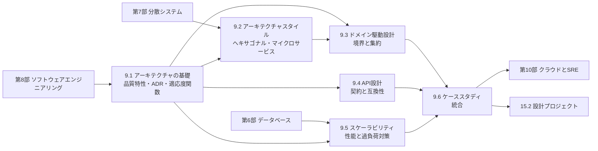

# 第9部 アーキテクチャとシステム設計

> 第8部まででコードを正しく書く力を、第6・7部でデータと分散システムの原理を学びました。この部では、それらを束ねて **システム全体の形を決める** 力を身につけます。品質特性とトレードオフで設計を語り、決定を記録し、構造を守り、API という契約を設計し、負荷と障害に耐える仕組みを組み込み、最後に典型的なシステムを一から設計します。目標は、大規模なシステムの設計議論を、根拠を持ってリードできるようになることです。

## この部で身につくこと

- **設計を言語化する**: アーキテクチャを「変更コストの高い決定の集まり」として捉え、品質特性シナリオで要求を測定可能にし、トレードオフを比較して ADR に記録し、C4 モデルの図で伝えられる（9.1）。
- **構造を守る**: 依存関係のルールと循環依存を、適応度関数として CI で自動検査できる（9.1）。
- **スタイルを選ぶ**: レイヤード、ヘキサゴナル、モジュラーモノリス、マイクロサービス、イベント駆動、サーバーレス、セルベースの得失を理解し、チームと事業の状況から選び、段階的な移行を計画できる。マルチテナンシーの分離モデルを比較できる（9.2）。
- **境界を見つける**: ドメイン駆動設計の戦略的設計で境界づけられたコンテキストとコンテキストマップを描き、戦術的設計で不変条件を守る集約を実装し、レガシーとの間に腐敗防止層を置ける（9.3）。
- **契約を設計する**: REST・gRPC・GraphQL・Webhook を使い分け、ページネーション・エラー・冪等性・バージョニング・後方互換性・非推奨化・レート制限・認可を、数年後にも壊れない形で設計できる（9.4）。
- **負荷と障害に備える**: パーセンタイル、Little の法則、USL で性能を定量的に扱い、キャッシュ、タイムアウト、ジッター付きのリトライ、リトライ予算、サーキットブレーカー、負荷制限を組み合わせて、障害の連鎖を防げる。概算見積もりで設計の桁を確かめられる（9.5）。
- **システムを一から設計する**: 要件 → 見積もり → API → データモデル → 全体像 → 深掘り → ボトルネック → 進化 → 運用とコスト、の手順で設計し、設計レビューで弱点を浮かび上がらせる質問ができる（9.6）。

## 章の一覧

| 章 | タイトル | 学習時間 | 主な演習 | キーワード |
|---|---|---|---|---|
| 9.1 | [ソフトウェアアーキテクチャの基礎](01-architecture-fundamentals/README.md) | 本文 3h ＋ 演習 4h | `archcheck.py`（ast による import の解析、依存グラフ、レイヤー規則の検査、Tarjan 法による循環の検出、CI で使えるコマンド）、記述: C4 図と ADR | 品質特性, ISO/IEC 25010, 品質特性シナリオ, トレードオフ, ADR, ATAM, 適応度関数, C4 モデル, コンウェイの法則 |
| 9.2 | [アーキテクチャスタイル](02-architecture-styles/README.md) | 本文 4h ＋ 演習 5h | `shop_domain.py`・`shop_adapters.py`（ヘキサゴナルアーキテクチャの注文アプリ、冪等な注文受付、インメモリと SQLite のリポジトリに同じ契約テスト、楽観的ロック）、記述: 3 社のスタイルの選定 | レイヤード, ポートとアダプタ, モジュラーモノリス, マイクロサービス, 分散モノリス, イベント駆動, サーバーレス, セルベース, マルチテナンシー |
| 9.3 | [ドメイン駆動設計とモジュール分割](03-domain-driven-design/README.md) | 本文 4h ＋ 演習 5h | `reservation_domain.py`（レストラン予約の値オブジェクトと集約、二重予約の禁止、キャンセル料、ドメインイベント）・`acl.py`（和暦・30 時間制・全角半角の混在したレガシーデータの腐敗防止層）、記述: イベントストーミング | ユビキタス言語, サブドメイン, 境界づけられたコンテキスト, コンテキストマップ, 腐敗防止層, 値オブジェクト, 集約, ドメインイベント |
| 9.4 | [API設計](04-api-design/README.md) | 本文 4h ＋ 演習 6h | `webhook_sig.py`（Webhook の署名と検証）・`pagination.py`（署名付きカーソルとキーセットページネーション）・`idempotency.py`（冪等キーの層）・`api_compat.py`（破壊的変更の検出）、記述: API の設計レビュー | ハイラムの法則, REST, gRPC, GraphQL, Webhook, Problem Details, 冪等キー, 後方互換性, 非推奨化, OWASP API Security Top 10 |
| 9.5 | [スケーラビリティとパフォーマンス](05-scalability-and-performance/README.md) | 本文 4h ＋ 演習 6h | `capacity.py`（概算見積もりと性能モデル）・`resilience.py`（トークンバケット、スライディングウィンドウ、サーキットブレーカー、ジッター付きリトライとリトライ予算）・`cache_layer.py`（単一飛行と stale-while-revalidate のキャッシュ） | パーセンタイル, テールレイテンシ, Little の法則, USL, キャッシュ, スタンピード, サーキットブレーカー, リトライ予算, 協調的欠落, 概算見積もり |
| 9.6 | [システム設計ケーススタディ](06-system-design-cases/README.md) | 本文 6h ＋ 演習 6h | `shortener.py`（62 進数と全単射によるコード生成）・`seat_hold.py`（売り越しを防ぐ座席の仮押さえ）・`ledger.py`（複式簿記の元帳）、記述: 3 つのシステムの設計 | 設計の手順, URL 短縮, 分散レート制限, チャット, タイムライン, 通知, 決済, 予約, 照合 |

合計の目安は、本文 約 25 時間、演習 約 32 時間です。コード演習は `python3 tools/check.py 9` でまとめてテストできます（章を指定するなら `python3 tools/check.py 9.4` のように）。

## 学習の進め方

### 章の順序と依存関係

- **9.1 は必ず最初に**: 品質特性・トレードオフ・ADR・C4 モデル・適応度関数は、以降のすべての章で使う共通の言葉です。9.1 の演習で作る依存関係の検査の考え方は、9.2 のテストでの「内側が外側を import しない」ことの検査にも、そのまま使われています。
- **9.2 → 9.3 は続けて**: 9.2 のヘキサゴナルアーキテクチャは「依存を内側に向ける」構造を、9.3 のドメイン駆動設計はその「内側」をどう作り、どこで境界を引くかを扱います。マイクロサービスの境界の議論（9.2）は、境界づけられたコンテキスト（9.3）で完結します。
- **9.4 と 9.5 は独立に読める**: どちらも 9.1 だけを前提にしているので、関心のある方から読んで構いません。9.4 の冪等キーと 9.5 のリトライは、2 つ合わせて「安全な再送」を成り立たせる対になっています。
- **9.6 は最後に**: 9.1〜9.5 の道具を総動員して 7 つのシステムを設計します。途中の章を飛ばした場合でも、9.6 で分からない概念が出てきたら、リンク先の章に戻れるように書いてあります。
- **前提の部**: 9.5 と 9.6 は、第6部（トランザクション・インデックス）と第7部（複製・分割・メッセージング）の知識を前提にしています。未読なら、各章からリンクされている節を必要に応じて参照してください。

目的別の進め方は次の通りです（詳しくは [学習ガイド](../00-guide/README.md)）。

| トラック | 進め方 |
|---|---|
| フルトラック | 9.1 から順に。演習はすべて解く。9.6 の記述演習は、少なくとも 2 題を 1 章の手順どおりに書き上げる |
| 経験者トラック | 各章の「理解度チェック」に答えられない章を重点的に。実務経験者ほど、9.4 の互換性の非対称性（演習 4）と、9.5 の協調的欠落・リトライ予算に発見が多い |
| CTO 準備トラック | 9.1 と 9.6 は必修。9.2〜9.5 は「なぜ学ぶのか」「CTOの視点」「よくある落とし穴」を中心に読み、9.2 の記述演習（3 社のスタイルの選定）と 9.4 の記述演習（API レビュー）に取り組む |

### つまずきやすい点

- **「正解のアーキテクチャ」を探してしまう**: この部には、どんな状況でも正しいスタイルや構成は出てきません。どの章でも、品質特性・規模・チームから出発して選ぶ練習をします。記述演習の解答例も「唯一の正解」ではなく、採点の観点と合わせて、理由の書き方を学ぶためのものです。
- **スレッドを使う演習**: 9.4 の冪等キー、9.5 のキャッシュ、9.6 の座席の仮押さえは、複数のスレッドから同時に呼ばれても正しく動く必要があります。「状態を調べる」と「状態を変える」を同じロックの中で行うこと、待っている間にロックを持ち続けないこと（`threading.Condition` や `Event` を使う）が鍵です。テストが時々失敗するなら、競合が残っている兆候です（[4.4 並行処理と同期](../04-operating-systems/04-concurrency/README.md)）。
- **時計の注入**: 時間に依存する部品（レート制限、サーキットブレーカー、有効期限）は、すべて `clock` 引数で時計を受け取ります。`time.time()` を直接呼ぶと、テストが決定的に動きません。この習慣は実務のコードでもそのまま役立ちます。
- **複式簿記に慣れていない**: 9.6 の元帳の演習では、「資産と費用は借方で増え、負債・純資産・収益は貸方で増える」という規則が出てきます。最初は、演習のテストの冒頭にあるウォレットの例（チャージと支払い）の仕訳を紙に書いて、残高がどう動くかを確かめるとよいでしょう。

## 到達度チェック

この部を修了したと言えるのは、次のことができるときです。

- [ ] 「高可用で速いシステム」のような曖昧な要望を、品質特性シナリオに書き直し、上位 3 つの品質特性を事業側と合意できる
- [ ] 重要な設計判断を、検討した選択肢・トレードオフ・結果・再検討のきっかけとともに ADR に記録し、C4 のコンテキスト図とコンテナ図で伝えられる
- [ ] 依存関係のルールと循環依存を自動検査する適応度関数を書き、CI に組み込める
- [ ] 与えられた組織と事業の状況に対して、モノリス・モジュラーモノリス・サービスベース・マイクロサービスのどれを選ぶかを、理由とともに説明し、段階的な移行を計画できる
- [ ] 業務の言葉から境界づけられたコンテキストを見つけ、不変条件から集約の境界を決め、レガシーとの間に腐敗防止層を設計できる
- [ ] 公開 API について、ページネーション・エラー・冪等性・互換性・非推奨化・レート制限・認可の方針を、ガイドラインとして書ける
- [ ] パーセンタイルとモデル（Little の法則・USL）で性能を議論し、タイムアウト・リトライ・サーキットブレーカー・負荷制限で障害の連鎖を防ぐ設計を説明できる
- [ ] DAU から QPS・データ量・帯域・台数を数分で見積もり、その数字から設計の方向性を導ける
- [ ] URL 短縮・レート制限・チャット・タイムライン・通知・決済・予約のうち任意のシステムを、要件から運用まで一貫した手順で設計し、「2 回届いたら」「止まったら」「10 倍になったら」に答えられる
- [ ] 第9部の演習のテストがすべて通る（`python3 tools/check.py 9`）

## この部の推薦図書・教材

- Mark Richards, Neal Ford『ソフトウェアアーキテクチャの基礎』（オライリー・ジャパン）— 品質特性（アーキテクチャ特性）、トレードオフ、主要なスタイルを体系的に扱う、この部の主教科書。9.1 と 9.2 に対応する。
- Neal Ford ほか『ソフトウェアアーキテクチャ・ハードパーツ』（オライリー・ジャパン）— サービスの粒度、データの分割、分散トランザクションなど、分散アーキテクチャの難しい判断をトレードオフ分析で扱う。9.2 と 9.6 の発展として。
- Vlad Khononov『ドメイン駆動設計をはじめよう』（オライリー・ジャパン）— DDD の戦略的設計から実装パターンの選び方までを、現代的な文脈で簡潔にまとめた入門書。9.3 の最初の 1 冊に。
- 水野貴明『Web API: The Good Parts』（オライリー・ジャパン）— API の設計の定番の入門書。9.4 の基礎を日本語で固めたいときに。
- Martin Kleppmann『データ指向アプリケーションデザイン』（オライリー・ジャパン）— 9.5 と 9.6 の背後にある原理（負荷の記述、複製、分割、ストリーム処理）を深く学べる。第6・7部とこの部をつなぐ 1 冊。
- Alex Xu『システム設計の面接試験』（ソシム）— 典型的なシステムの設計を、面接の進め方に沿って多数解説している。9.6 の練習問題集として。
- Neal Ford, Rebecca Parsons, Patrick Kua『進化的アーキテクチャ』（オライリー・ジャパン）— 適応度関数によって、アーキテクチャを継続的に検証しながら進化させる考え方の原典。

## 次に進む

- [第10部 クラウドとSRE](../10-cloud-and-sre/README.md) では、この部で設計したシステムを、クラウドの上で作り、SLO で信頼性を管理し、オブザーバビリティで観察し、障害に対応し、費用を管理する方法を学びます。9.5 の性能目標は [10.3 信頼性設計とSLO](../10-cloud-and-sre/03-reliability-engineering/README.md) の SLO に、9.2 のセルベースアーキテクチャやサーバーレスの判断は [10.1 クラウドコンピューティングとIaC](../10-cloud-and-sre/01-cloud-and-iac/README.md) と [10.6 クラウドコスト管理](../10-cloud-and-sre/06-finops/README.md) につながります。
- [第11部 セキュリティ](../11-security/README.md) では、9.4 で触れた認証・認可と API のセキュリティを、[11.3 認証と認可](../11-security/03-authn-authz/README.md) と [11.4 Webアプリケーションセキュリティ](../11-security/04-web-security/README.md) で掘り下げます。
- [第13部 技術リーダーシップ](../13-technical-leadership/README.md) では、この部で扱った設計の判断を、組織の中でどう下し、レビューし、チームの構造と合わせていくかを学びます（[13.2 技術的意思決定と設計レビュー](../13-technical-leadership/02-technical-decisions/README.md)、[13.6 チームと組織の設計](../13-technical-leadership/06-team-and-org-design/README.md)）。
- [15.2 設計プロジェクト](../15-capstone/02-architecture-capstone/README.md) では、この部の手順を使って、設計書を書き、レビューを受ける総仕上げに取り組みます。
