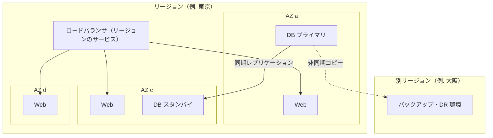
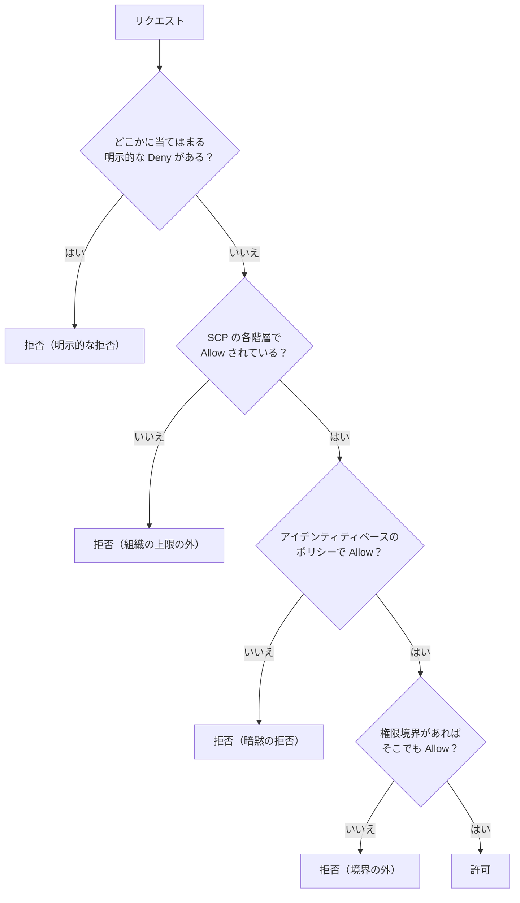
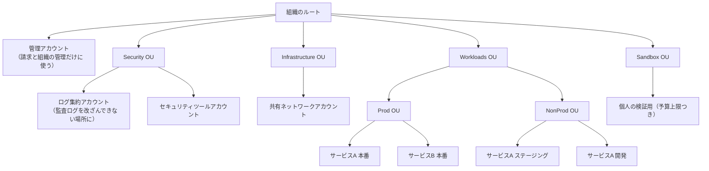
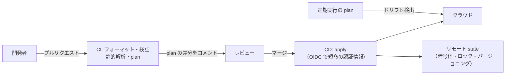

# 10.1 クラウドコンピューティングとIaC

> クラウドは「他人のコンピュータ」ではなく、API で呼び出せるデータセンターです。ボタン一つでサーバーが立ち上がる便利さの裏で、権限設定の一行が 1 億人規模の個人情報を危険にさらし、手作業の変更が本番環境を誰も再現できない「雪の結晶」に変えます。この章では、クラウドの本質・障害の分離・権限設計（IAM）・アカウント設計、そしてインフラをコードで管理する IaC（Infrastructure as Code）の仕組みを、評価器と plan エンジンを自分で実装しながら学びます。

| 項目 | 内容 |
|---|---|
| 学習時間の目安 | 本文 4h ＋ 演習 5h |
| 前提となる章 | [4.5 仮想化とコンテナ](../../04-operating-systems/05-virtualization-and-containers/README.md)、[5.4 Webの仕組みとネットワーク構成](../../05-networking/04-web-architecture/README.md)、[2.5 木・ヒープ・グラフ](../../02-math-and-algorithms/05-trees-heaps-graphs/README.md)（トポロジカルソート） |
| 演習 | [exercises/](exercises/)（Python） |
| キーワード | IaaS/PaaS/SaaS/FaaS, 責任共有モデル, リージョン, AZ, IAM, 最小権限, OIDC フェデレーション, SCP, ランディングゾーン, Terraform, OpenTofu, state, plan/apply, ドリフト, イミュータブルインフラ, ロックイン, ISMAP |

## この章のゴール

- [ ] クラウドの本質（オンデマンド・弾力性・従量課金・マネージドサービス）とサービスモデルごとの責任分担を説明できる
- [ ] リージョンとアベイラビリティゾーンの違いを、障害の分離・レイテンシ・データの所在の観点から説明し、配置を選べる
- [ ] IAM ポリシーの評価順序（明示的な拒否・暗黙の拒否・権限境界・SCP）を説明し、ポリシーの評価器を実装できる
- [ ] 最小権限・ロール・短命な認証情報・OIDC フェデレーションを使った権限設計と、マルチアカウント構成を設計できる
- [ ] IaC の state・ロック・plan/apply・依存グラフ・置き換えの連鎖・ドリフトを説明し、ミニ plan エンジンを実装できる
- [ ] クラウド選定・マルチクラウド・ロックイン・クラウド回帰について、根拠のある判断を説明できる

## なぜ学ぶのか

クラウドの事故の多くは、高度な攻撃ではなく「権限と構成の管理」の失敗から起きています。

- **過大な権限**: 2019 年、米国の金融機関 Capital One から約 1 億人分の個人情報が流出しました。米国の起訴状や各種の分析によれば、設定に不備のあったファイアウォールを足がかりにサーバーのメタデータサービスから IAM ロールの一時的な認証情報が取得され、そのロールが業務に必要な範囲を超えて多数の S3 バケットを読める権限を持っていたことが、被害を大きくしました。後に米国の規制当局（OCC）は同社に 8,000 万ドルの制裁金を科しています。
- **爆発半径（blast radius）の大きすぎる構成**: 2014 年、ソースコードのホスティング事業者 Code Spaces は、攻撃者に AWS の管理コンソールへのアクセスを奪われ、サーバーだけでなく **同じアカウントに置いていたバックアップまで削除され**、事業の継続を断念しました。本番とバックアップを同じ権限の下に置く設計が、単一の侵害を会社の終わりに変えたのです。
- **手作業の構成（ClickOps）**: コンソールでの手作業は記録が残らず、レビューもされず、同じ環境をもう一度作れません。障害時に「前回どう設定したか」を誰も知らない、という状況は珍しくありません。
- **ツールの前提の変化**: 2023 年、HashiCorp は Terraform のライセンスをオープンソースの MPL 2.0 から、競合製品での利用を制限する BSL（Business Source License）に変更しました。これを受けてコミュニティがフォークした OpenTofu が Linux Foundation 傘下で開発されています。IaC ツールの選択も、ロックインとリスクの判断の一つです。

クラウドを正しく使える組織は、数分で環境を作り直し、権限の誤りを機械的に検出し、障害の影響を一つのアカウントや一つのゾーンに閉じ込められます。この章はその土台です。

## 1. クラウドの本質

### 1.1 何が変わったのか

米国国立標準技術研究所の定義（NIST SP 800-145, 2011）は、クラウドコンピューティングの本質的な特徴として、オンデマンド・セルフサービス、幅広いネットワークアクセス、リソースの共用（プーリング）、迅速な弾力性（elasticity）、サービスの計測可能性を挙げています。実務の言葉に直すと、次の 4 つです。

| 特徴 | 以前（自社データセンター） | クラウド | 意思決定への影響 |
|---|---|---|---|
| **オンデマンド** | サーバーの調達に数週間〜数か月 | API 呼び出しで数秒〜数分 | 実験のコストが下がり、「作って試す」が可能になる |
| **弾力性** | ピークに合わせて買い、普段は遊ばせる | 負荷に合わせて増減できる | キャパシティ計画の誤りが致命傷になりにくい |
| **従量課金** | 設備投資（CapEx）を先払い | 使った分だけの運用費（OpEx） | 小さく始められる反面、止め忘れもそのまま請求される |
| **マネージドサービス** | DB の冗長化・バックアップ・パッチを自前で運用 | 事業者が運用した DB・キュー・監視を利用 | **運用の人件費を「買う」**ことができる |

特に最後の点が重要です。クラウドの価値は「サーバーが安い」ことではなく（台数あたりの単価だけを比べれば、自前のハードウェアの方が安いことも多い）、**差別化にならない運用作業を事業者に任せ、エンジニアの時間を自社の製品に使える**ことにあります。マネージドの PostgreSQL（Amazon RDS、Cloud SQL など）を使えば、レプリケーション・フェイルオーバー・バックアップ・マイナーバージョンのパッチ適用を自分で作り込まずに済みます。その割増料金が、同じ仕組みを自前で作って運用する人件費より安いかどうかが判断の軸になります。

### 1.2 サービスモデル

どこまでを事業者に任せるかで、サービスは次のように分類されます。

| モデル | 利用者が管理するもの | 事業者が管理するもの | 例 |
|---|---|---|---|
| IaaS（Infrastructure as a Service） | OS・ミドルウェア・ランタイム・アプリ・データ | 物理設備・ハイパーバイザー・ネットワーク | Amazon EC2, Compute Engine, Azure Virtual Machines |
| CaaS（コンテナ実行基盤） | コンテナイメージ・アプリ・データ | OS・コンテナ実行環境（の一部または全部） | Amazon ECS on Fargate, Cloud Run, Azure Container Apps |
| PaaS（Platform as a Service） | アプリ・データ | OS・ランタイム・スケーリング | Heroku, Google App Engine, Azure App Service |
| FaaS（Function as a Service） | 関数のコード・データ | 実行環境のすべて（リクエストごとに起動） | AWS Lambda, Cloud Run functions, Azure Functions |
| SaaS（Software as a Service） | データと利用設定 | アプリケーションまで全部 | Google Workspace, Salesforce, Slack |

下に行くほど運用は楽になりますが、制約（実行時間の上限、使える言語やライブラリ、ネットワーク構成の自由度）が増え、**事業者固有の仕様への依存（ロックイン）** も強くなります。FaaS はリクエストがないときに課金されない反面、起動の遅延（コールドスタート）や実行時間の上限があります。どのモデルを選ぶかは、チームの規模と運用能力、ワークロードの性質で決まります（→ [10.2](../02-containers-and-kubernetes/README.md) の「Kubernetes を使うべきでないとき」）。

### 1.3 責任共有モデル

クラウドのセキュリティは、事業者と利用者が分担します。AWS はこれを「クラウド **の** セキュリティ（事業者の責任）」と「クラウド **における** セキュリティ（利用者の責任）」と表現しています。

```text
                        IaaS           PaaS / CaaS       SaaS
データ・アクセス権       利用者          利用者            利用者   ← どのモデルでも利用者の責任
アプリケーション         利用者          利用者            事業者
ランタイム・ミドルウェア  利用者          事業者            事業者
OS（パッチ適用）         利用者          事業者            事業者
仮想化・物理ホスト        事業者          事業者            事業者
物理設備・ネットワーク    事業者          事業者            事業者
```

どのモデルでも、**データとアクセス権の管理は利用者の責任** です。S3 バケットを誤って公開した、管理者の認証情報が漏れた、という事故は、事業者がどれだけ堅牢でも防げません。前述の Capital One の事件も、クラウド事業者の基盤が破られたのではなく、利用者側の構成と権限の問題でした。

## 2. リージョンとアベイラビリティゾーン

### 2.1 障害の分離という設計思想

クラウド事業者は、世界各地に **リージョン（region）** を置き、各リージョンの中に複数の **アベイラビリティゾーン（Availability Zone, AZ）** を持ちます（Google Cloud では「ゾーン」）。AZ は、電源・冷却・ネットワークが独立した 1 つ以上のデータセンターの集まりで、同じリージョン内の AZ どうしは物理的に離れた場所にありながら、低遅延の専用回線で結ばれています。



この階層は **障害ドメイン（failure domain）** の階層です。1 台のサーバーの故障、1 つのデータセンターの停電、1 つのリージョン全体の障害、と影響範囲が広がるほど発生頻度は下がります。設計の基本は次の通りです。

- **マルチ AZ は標準**: 本番のワークロードは複数の AZ に分散させる。AZ 間のレイテンシは十分小さいので、DB の同期レプリケーションもできる。
- **マルチリージョンは高価な選択肢**: リージョン間は遠く、同期レプリケーションはレイテンシの点で現実的でないことが多い。データの整合性、切り替えの手順、二重の費用を伴う（→ [10.3 信頼性設計とSLO](../03-reliability-engineering/README.md) の DR 戦略）。
- **サービスの「範囲」を確認する**: 仮想マシンやブロックストレージは AZ 単位の資源（ゾーンリソース）で、AZ の障害で一緒に止まる。ロードバランサやオブジェクトストレージの多くはリージョン単位で、事業者が AZ 間の冗長化を担う。IAM や DNS のようなグローバルなサービスもある。

### 2.2 距離とレイテンシ

光ファイバー中の光の速さは約 20 万 km/秒なので、往復時間（RTT）の **物理的な下限** は距離から計算できます。

| 区間 | 直線距離（概算） | RTT の下限（2 × 距離 ÷ 20 万 km/秒） |
|---|---|---|
| 同じ AZ 内 | — | 通常 1 ms 未満 |
| 東京 ↔ 大阪 | 約 400 km | 約 4 ms |
| 東京 ↔ 米国東海岸 | 約 11,000 km | 約 110 ms |
| 東京 ↔ フランクフルト | 約 9,300 km | 約 93 ms |

実際の経路は直線より遠回りなので、実測値はこれより大きくなります。1 回のページ表示で API を 10 回直列に呼べば、リージョン間の遅延は 10 倍になって効いてきます。**利用者に近いリージョンを選び、リージョンをまたぐ同期呼び出しを避ける** のが基本です（→ [5.4](../../05-networking/04-web-architecture/README.md)、[9.5](../../09-architecture/05-scalability-and-performance/README.md)）。

### 2.3 データの所在（データレジデンシー）

リージョンの選択は、法令・契約上の要件にも関わります。個人データを国外に置くことへの規制、顧客との契約で「データは国内に保存する」と約束している場合、金融・医療・公共分野の業界基準などです。日本には東京と大阪の 2 つのリージョンを持つ事業者が多く、国内だけでマルチリージョンの構成を組めます。見落としやすいのは次の点です。

- **ログ・バックアップ・監視データの行き先**: アプリケーションのデータは国内でも、SaaS の監視ツールやログ分析基盤が海外リージョンにデータを送っていることがある。
- **グローバルなサービス**: CDN のキャッシュ、DNS、一部の管理機能はリージョンの外で動く。
- **サポート対応**: 障害調査のために事業者のサポート担当がデータにアクセスする場合の条件。

日本の法制度との関係は [7.4 日本の文脈](#74-日本の文脈) で扱います。

## 3. サービスの全体像

主要 3 社のサービス名の対応を示します。名称や提供状況は頻繁に変わるので、**2026 年時点の概略** として参照し、採用時には各社の公式ドキュメントで確認してください。

| 分類 | AWS | Google Cloud | Microsoft Azure |
|---|---|---|---|
| 仮想マシン | EC2 | Compute Engine | Virtual Machines |
| サーバーレス関数 | Lambda | Cloud Run functions（旧 Cloud Functions） | Azure Functions |
| コンテナ（サーバーレス） | ECS on Fargate | Cloud Run | Azure Container Apps |
| マネージド Kubernetes | EKS | GKE | AKS |
| ブロックストレージ | EBS | Persistent Disk / Hyperdisk | Managed Disks |
| ファイルストレージ | EFS / FSx | Filestore | Azure Files |
| オブジェクトストレージ | S3 | Cloud Storage | Blob Storage |
| マネージド RDB | RDS / Aurora | Cloud SQL / AlloyDB / Spanner | Azure SQL Database / Azure Database for PostgreSQL・MySQL |
| NoSQL | DynamoDB | Firestore / Bigtable | Cosmos DB |
| 仮想ネットワーク | VPC | VPC | Virtual Network |
| ロードバランサ | Elastic Load Balancing（ALB / NLB） | Cloud Load Balancing | Load Balancer / Application Gateway |
| DNS / CDN | Route 53 / CloudFront | Cloud DNS / Cloud CDN | Azure DNS / Azure Front Door |
| ID と権限 | IAM / IAM Identity Center | IAM / Cloud Identity | Microsoft Entra ID / Azure RBAC |
| メッセージング | SQS / SNS / EventBridge / Kinesis | Pub/Sub / Eventarc | Service Bus / Event Grid / Event Hubs |
| 監視・ログ・トレース | CloudWatch / X-Ray | Cloud Monitoring / Logging / Trace | Azure Monitor / Application Insights |
| 鍵管理 / 監査ログ | KMS / CloudTrail | Cloud KMS / Cloud Audit Logs | Key Vault / Activity Log |
| ネイティブの IaC | CloudFormation / CDK | Infrastructure Manager（Terraform ベース） | ARM テンプレート / Bicep |

名前は違っても、ほとんどの分類は同じ概念の実装です。第 5〜9 部で学んだ原理（ロードバランサ、レプリケーション、キュー、キャッシュ）を、どのサービスが「どこまで肩代わりしてくれるか」という目で見ると、新しいサービスも素早く評価できます。

## 4. IAM — 権限の設計

### 4.1 認証・認可とポリシー

**IAM（Identity and Access Management）** は、「誰が（プリンシパル）」「何を（アクション）」「どれに対して（リソース）」「どんな条件で（コンディション）」してよいかを管理する仕組みです。認証（authentication, 誰であるかの確認）と認可（authorization, 何をしてよいかの判断）の一般論は [11.3 認証と認可](../../11-security/03-authn-authz/README.md) で扱います。ここでは AWS の IAM ポリシーを例に、評価の仕組みを見ます。

```json
{
  "Version": "2012-10-17",
  "Statement": [
    {
      "Sid": "ReadReports",
      "Effect": "Allow",
      "Action": ["s3:GetObject", "s3:ListBucket"],
      "Resource": ["arn:aws:s3:::acme-reports", "arn:aws:s3:::acme-reports/*"],
      "Condition": {"Bool": {"aws:SecureTransport": "true"}}
    }
  ]
}
```

`Action` と `Resource` には `*`（0 文字以上）と `?`（1 文字）のワイルドカードが使えます。`arn:aws:s3:::acme-reports/*` はバケット内のオブジェクトにはマッチしますが、バケットそのもの（`arn:aws:s3:::acme-reports`）にはマッチしません。`s3:ListBucket` はバケットに対する操作なので、両方を書く必要があります。この種の細部を読み違えると、「動かないので `*` にした」という最悪の修正につながります。

### 4.2 評価の順序

AWS の評価ロジックを簡略化すると、次の流れになります（演習 2 で実装します）。



押さえるべき原則は 3 つです。

1. **既定は拒否（default deny）**: 何も書かなければ何もできない。
2. **明示的な拒否は常に勝つ**: どこか 1 か所の Deny は、他のすべての Allow に優先する。ガードレールは Deny で書く。
3. **SCP と権限境界は権限を「与えない」**: どちらも「ここまでなら使ってよい」という上限を決めるだけで、有効な権限は各ポリシーの **積集合** になる。

演習で作る評価器を使うと、権限境界の効果を確かめられます。

```python
from iam_eval import Request, evaluate

identity = {"Version": "2012-10-17", "Statement": [
    {"Sid": "S3Admin", "Effect": "Allow", "Action": "s3:*", "Resource": "*"},
    {"Sid": "IamAdmin", "Effect": "Allow", "Action": "iam:*", "Resource": "*"},
]}
boundary = {"Version": "2012-10-17", "Statement": [
    {"Sid": "Ceiling", "Effect": "Allow", "Action": ["s3:*", "cloudwatch:*"], "Resource": "*"},
]}
for action in ["s3:GetObject", "iam:CreateRole", "cloudwatch:PutMetricData"]:
    print(f"{action:26}", evaluate(Request(action, "*"), [identity], boundary=boundary))
```

```text
s3:GetObject               Decision(allowed=True, reason='allowed', matched=('S3Admin',))
iam:CreateRole             Decision(allowed=False, reason='boundary', matched=())
cloudwatch:PutMetricData   Decision(allowed=False, reason='implicit_deny', matched=())
```

`iam:CreateRole` はアイデンティティのポリシーでは許可されていても境界の外なので拒否され、`cloudwatch:PutMetricData` は境界の内側でもアイデンティティのポリシーが許可していないので拒否されます。権限境界は、開発者に「ロールを作る権限」を渡しつつ、作られるロールが自分より強い権限を持てないようにする（権限昇格を防ぐ）ときに使います。

簡略化した点もあります。実際の AWS には、リソース側に付けるリソースベースポリシー（S3 のバケットポリシーなど）、一時的なセッションに付けるセッションポリシー、アカウントをまたぐアクセスの規則などがあり、組み合わせによって結果が変わります。正確な判断が必要なときは、公式ドキュメントの「ポリシーの評価ロジック」と、IAM Policy Simulator や IAM Access Analyzer のようなツールを使ってください。

### 4.3 最小権限・ロール・短命な認証情報

権限設計の原則は **最小権限（least privilege）** です。必要な操作だけを、必要なリソースに対して、必要な期間だけ許可します。実務では次の形に落とし込みます。

| 原則 | 具体策 | 避けるもの |
|---|---|---|
| 人にはロールを渡す | SSO（AWS IAM Identity Center、Google Workspace や Entra ID との連携）でログインし、職務ごとのロールを一時的に引き受ける | 個人ごとの IAM ユーザーと長期のパスワード・アクセスキー |
| 機械にもロールを渡す | サーバーにはインスタンスのロール、Kubernetes の Pod にはワークロード ID を割り当てる | アクセスキーを設定ファイルや環境変数に埋め込む |
| 認証情報は短命に | STS などが発行する数分〜数時間で失効する一時的な認証情報 | 何年も有効なアクセスキー（漏れたら失効させるまで使われ続ける） |
| 外部の CI は OIDC で | GitHub Actions などが発行する OIDC トークンを、クラウドのロールと交換する | CI の設定画面にアクセスキーを登録する |
| 管理者権限は分離 | 通常作業は読み取り中心のロール、変更は申請・承認付きの一時昇格。緊急用（break-glass）アカウントは厳重に保管し、使ったら必ず通知・監査 | 全員が常時 `AdministratorAccess` |

**OIDC フェデレーション** は、長期のアクセスキーをなくす強力な手段です。GitHub Actions の例では、ワークフローが GitHub の発行した署名付きトークンを提示し、クラウドは「どのリポジトリの、どのブランチのワークフローか」を確認してからロールを渡します。

```json
{
  "Version": "2012-10-17",
  "Statement": [{
    "Effect": "Allow",
    "Principal": {"Federated": "arn:aws:iam::123456789012:oidc-provider/token.actions.githubusercontent.com"},
    "Action": "sts:AssumeRoleWithWebIdentity",
    "Condition": {
      "StringEquals": {
        "token.actions.githubusercontent.com:aud": "sts.amazonaws.com",
        "token.actions.githubusercontent.com:sub": "repo:acme/infra:ref:refs/heads/main"
      }
    }
  }]
}
```

これはロールの **信頼ポリシー**（誰がこのロールを引き受けられるか）です。`sub` の条件が肝心で、これを書き忘れたり `repo:*` のように広げすぎたりすると、**無関係な第三者のリポジトリのワークフローまでロールを引き受けられてしまいます**。実際にそうした設定ミスの存在が研究者から報告されています。Google Cloud（Workload Identity Federation）や Azure（ワークロード ID フェデレーション）にも同じ仕組みがあります。

### 4.4 権限設計の典型的な失敗

- **`"Action": "*", "Resource": "*"` を「とりあえず」付ける**: 動かないときに権限を広げて解決すると、その権限は二度と狭められない。
- **`NotAction` と Allow の組み合わせ**: `"NotAction": "iam:*"` の Allow は「IAM 以外のすべて」を許可する。将来追加されるサービスも含めて、想像よりはるかに広い（演習のテストにこの例があります）。
- **`iam:PassRole` を全ロールに許可する**: サーバーや関数を作る権限と組み合わせると、自分より強いロールをサーバーに渡して、その権限で操作できる（権限昇格の定番の経路）。
- **メタデータサービスの保護を怠る**: サーバー上のアプリケーションに SSRF（[11.4](../../11-security/04-web-security/README.md)）の脆弱性があると、メタデータサービス経由でロールの認証情報が盗まれうる。AWS では IMDSv2（セッショントークン必須）を強制するのが基本。

## 5. マルチアカウント戦略とランディングゾーン

### 5.1 アカウントは最強の境界

IAM のポリシーでも環境の分離はできますが、ポリシーは複雑になるほど誤りが入り込みます。**アカウント（Google Cloud ではプロジェクト、Azure ではサブスクリプション）を分けること** は、最も単純で強い分離です。アカウントが違えば、明示的に許可しない限りリソースは互いに見えず、権限の誤りの影響もそのアカウントに閉じます。請求もアカウント単位で分かれるので、コストの配賦（→ [10.6](../06-finops/README.md)）も楽になります。

AWS では AWS Organizations で複数のアカウントをまとめ、**OU（組織単位）** の階層を作って **SCP（サービスコントロールポリシー）** でガードレールを掛けます。



SCP で書く代表的なガードレールは次のようなものです。

- 許可したリージョン以外でのリソース作成を拒否する（データの所在の担保と、攻撃者による「見ていないリージョンでの暗号資産の採掘」の防止）
- 監査ログ（CloudTrail）の停止・削除を拒否する
- アカウントが組織から離脱する操作を拒否する
- ルートユーザーの利用を拒否する

SCP は各階層でアタッチしたポリシーのどれかで許可されている必要があり（階層間は積集合）、既定では全許可のポリシー（`FullAWSAccess`）が各階層にアタッチされています。演習 2 の評価器は、この階層構造も扱います。なお、SCP は組織の管理アカウント自身には適用されません。管理アカウントにはワークロードを置かず、請求と組織の管理だけに使うのが定石です。

### 5.2 ランディングゾーン

新しいアカウントを作るたびに、ログの集約・監査・ネットワーク・SSO・ガードレールを手で設定するのは現実的ではありません。これらを最初から備えた「着地点」を **ランディングゾーン（landing zone）** と呼び、AWS Control Tower のようなサービスや、IaC のテンプレートで自動化します。Google Cloud では組織 → フォルダ → プロジェクトの階層と組織ポリシー、Azure では管理グループ → サブスクリプション → リソースグループの階層と Azure Policy が同じ役割を担います。

アカウントの分け方の典型は次の通りです。

| 分け方 | 目的 |
|---|---|
| 環境ごと（本番 / ステージング / 開発） | 本番への誤操作と、開発環境の侵害の波及を防ぐ |
| ワークロード（サービス・チーム）ごと | 影響範囲とコストの所有者を明確にする |
| 機能ごと（ログ集約・セキュリティ・共有ネットワーク） | 監査証跡を、ワークロードの管理者が改ざんできない場所に置く |
| バックアップ専用 | 本番アカウントが侵害されてもバックアップを消されない（Code Spaces の教訓） |

スタートアップでも、最初から「管理用・本番・非本番・ログ」程度に分けておくのが安上がりです。1 つのアカウントに数年分のリソースが積み上がってから分割するのは、大規模な移行プロジェクトになります。

## 6. Infrastructure as Code

### 6.1 なぜコードにするのか

**IaC（Infrastructure as Code）** は、サーバー・ネットワーク・DB・権限といったインフラの構成を、コードとして記述し、ツールで適用する方法です。コードにすることで、アプリケーションのソフトウェア開発で当たり前の恩恵がインフラにも及びます。

- **再現性**: 同じコードから、同じ環境（ステージング、別リージョンの DR 環境）を作れる。
- **レビューと監査**: 変更はプルリクエストになり、差分をレビューでき、誰がいつ何を変えたかが Git に残る。
- **自動化**: CI/CD から適用でき、手作業のミスがなくなる（→ [8.4 CI/CDとリリースエンジニアリング](../../08-software-engineering/04-ci-cd-and-release/README.md)）。
- **知識の共有**: 構成が特定の人の頭の中ではなく、読めるコードとして存在する。

### 6.2 宣言的と命令的

インフラを操作するスクリプトには 2 つの流儀があります。

```text
命令的（imperative）: 「どうするか」を手順で書く
  aws ec2 run-instances --image-id ami-111 --count 1 ...
  → 2 回実行すると 2 台できる。今の状態を見て分岐する処理を自分で書く必要がある

宣言的（declarative）: 「どうあるべきか」を書く
  resource "aws_instance" "web" { ami = "ami-111" ... }
  → 何回適用しても 1 台。ツールが「今の状態」との差分を計算して必要な操作だけを行う
```

宣言的な方式の核心は、**あるべき状態（desired state）と現在の状態（current state）の差分を計算し、差分を埋める操作を実行する** ことです。この考え方は Kubernetes のコントローラ（[10.2](../02-containers-and-kubernetes/README.md)）とまったく同じで、冪等性（何度実行しても結果が同じ）を自然に実現します。

### 6.3 主なツール

| ツール | 記述方法 | 特徴 |
|---|---|---|
| Terraform | HCL（独自の宣言的言語） | 多数のクラウド・SaaS に対応するプロバイダのエコシステム。2023 年に BSL へライセンス変更 |
| OpenTofu | HCL（Terraform と互換） | Terraform のライセンス変更を受けたフォーク。Linux Foundation 傘下でオープンソースとして開発。2024 年 1 月に最初の安定版 |
| Pulumi | TypeScript / Python / Go など汎用言語 | ループや抽象化を汎用言語で書ける。その自由度ゆえに「読みにくいインフラコード」にもなりうる |
| AWS CloudFormation / CDK | YAML・JSON / 汎用言語（CDK は CloudFormation を生成） | AWS 専用。state を AWS が管理するので state ファイルの運用が不要 |
| Bicep / ARM テンプレート | 独自言語 / JSON | Azure 専用 |
| Crossplane | Kubernetes のカスタムリソース | クラウドのリソースを Kubernetes の調整ループで管理する |

どれを選んでも、次に説明する state・plan・依存グラフの概念は共通です。Terraform と OpenTofu は、2026 年時点では多くの設定がそのまま動きますが、機能の差は広がりつつあります。**ライセンス条件がどう自社の使い方に影響するかは、法務と確認してください**（自社のインフラを管理するために使うだけなら影響は限定的とされることが多いものの、IaC を製品として提供する場合などは話が変わります）。

### 6.4 state・ロック・plan / apply

Terraform を例に、基本の流れを見ます（以下は設定の例です。実行には Terraform か OpenTofu が必要です）。

```hcl
terraform {
  backend "s3" {                       # state をチームで共有するリモートの置き場所
    bucket       = "acme-tfstate-prod"
    key          = "network/terraform.tfstate"
    region       = "ap-northeast-1"
    encrypt      = true
    use_lockfile = true                # 同時実行を防ぐロック（新しめのバージョンの機能）
  }
}

resource "aws_vpc" "main" {
  cidr_block = "10.0.0.0/16"
}

resource "aws_subnet" "a" {
  vpc_id            = aws_vpc.main.id    # 他のリソースの属性の参照 = 暗黙の依存関係
  cidr_block        = "10.0.1.0/24"
  availability_zone = "ap-northeast-1a"
}
```

- **state（状態ファイル）**: 「設定のどのリソースが、クラウド上のどの実体（ID）に対応するか」と、前回適用したときの属性値の記録です。これがないと、ツールは「このサブネットは自分が作ったものか」を判断できません。state には DB のパスワードなどの秘密情報が平文で含まれることがあるので、暗号化されたリモートストレージに置き、アクセスを制限し、バージョニング（誤って壊したときの復旧用）を有効にします。**Git にコミットしてはいけません**。
- **ロック**: 2 人が同時に apply すると、state が壊れたり、互いの変更を上書きしたりします。リモートの state にはロックの仕組みを必ず組み合わせます（S3 の場合、以前は DynamoDB のテーブルでロックするのが定番でした）。
- **plan**: 設定と state（と、必要に応じて実際のクラウドの状態）を比べ、何を作成・変更・置き換え・削除するかを表示します。**plan の出力を読んでレビューすることが、IaC の安全性の中心** です。
- **apply**: plan の内容を実行し、1 操作ごとに state を更新します。途中で失敗すると、それまでに成功した分だけが反映された状態で止まります（トランザクションではありません）。

### 6.5 依存グラフと置き換えの連鎖

plan の中核は **依存グラフ** です。`vpc_id = aws_vpc.main.id` のような参照から「サブネットは VPC に依存する」という辺を作り、トポロジカルソート（[2.5](../../02-math-and-algorithms/05-trees-heaps-graphs/README.md)）で実行順序を決めます。作成は依存先から、削除は依存元から（逆順）です。循環があれば適用できないのでエラーにします。

もう一つの重要な概念が **置き換え（replace）** です。クラウドの API には、後から変更できない属性があります。VPC の CIDR、サーバーの起動イメージ、サブネットの AZ などを変えるには、リソースを削除して作り直すしかありません。そして作り直されたリソースの ID は変わるので、**それを参照していたリソースの属性も変わり、その属性が変更不可なら、依存元も作り直しになります**。演習 4 で実装する plan エンジンで確かめてみましょう。

```python
from iac_plan import FakeCloud, apply, plan

SCHEMA = {  # 変更すると作り直しになる属性（Terraform ではプロバイダが持つ知識）
    "aws_vpc": {"cidr_block"},
    "aws_subnet": {"vpc_id", "cidr_block", "availability_zone"},
    "aws_security_group": {"vpc_id", "name"},
    "aws_instance": {"ami", "subnet_id"},
}
config = {
    "aws_vpc.main": {"attrs": {"cidr_block": "10.0.0.0/16"}},
    "aws_subnet.a": {"attrs": {"vpc_id": "${aws_vpc.main.id}", "cidr_block": "10.0.1.0/24",
                               "availability_zone": "ap-northeast-1a"}},
    "aws_security_group.web": {"attrs": {"vpc_id": "${aws_vpc.main.id}", "name": "web"}},
    "aws_instance.web": {"attrs": {"ami": "ami-111", "instance_type": "t3.small",
                                   "subnet_id": "${aws_subnet.a.id}",
                                   "security_groups": ["${aws_security_group.web.id}"]}},
}
state, cloud = {}, FakeCloud()
apply(plan(config, state, SCHEMA), config, state, cloud)   # 初回: 4 つ作成

config["aws_vpc.main"]["attrs"]["cidr_block"] = "10.1.0.0/16"   # VPC の CIDR を変える
p = plan(config, state, SCHEMA)
print(p.render())
for step in p.steps:
    print(step)
```

```text
-/+ aws_instance.web (replace; forces: subnet_id)
-/+ aws_security_group.web (replace; forces: vpc_id)
-/+ aws_subnet.a (replace; forces: vpc_id)
-/+ aws_vpc.main (replace; forces: cidr_block)
Plan: 4 to add, 0 to change, 4 to destroy.
('destroy', 'aws_instance.web')
('destroy', 'aws_security_group.web')
('destroy', 'aws_subnet.a')
('destroy', 'aws_vpc.main')
('create', 'aws_vpc.main')
('create', 'aws_security_group.web')
('create', 'aws_subnet.a')
('create', 'aws_instance.web')
```

CIDR を 1 か所変えただけで、サーバーまで含めた 4 つすべてが作り直しになりました。本物の Terraform でも、plan に `# forces replacement` と表示された属性があれば同じことが起きます。**本番の plan で「to destroy」が 0 でないときは、必ずその理由を確かめる** 習慣が、事故を防ぎます。

### 6.6 create_before_destroy — 作ってから消す

置き換えは既定では「消してから作る」順です。ところが、消すリソースを **更新だけされる別のリソースが参照している** と問題が起きます。セキュリティグループの名前（変更不可）を変える例です。

```text
  ~ aws_instance.web (update: security_groups)
-/+ aws_security_group.web (replace; forces: name)
Plan: 1 to add, 1 to change, 1 to destroy.
[('destroy', 'aws_security_group.web'), ('create', 'aws_security_group.web'), ('update', 'aws_instance.web')]
CloudError: DependencyViolation: r-0002 は r-0004 から参照されています
```

サーバーが古いセキュリティグループを使っている間は、クラウドは削除を拒否します（AWS の実際のエラー名も `DependencyViolation` です）。解決策が **create_before_destroy** で、新しいものを先に作り、参照を付け替えてから古いものを消します。

```text
[('create', 'aws_security_group.web'), ('update', 'aws_instance.web'), ('destroy', 'aws_security_group.web')]
No changes. Your infrastructure matches the configuration.
```

新旧が一時的に共存するので、名前が一意でなければならないリソースでは名前にランダムな接尾辞を付ける（Terraform の `name_prefix` など）工夫が必要です。また Terraform は、あるリソースが create_before_destroy なら、その **依存先にも同じ設定を自動的に伝播** させます。依存元だけ「先に作る」と、依存先の作り直しと順序が矛盾するからです（演習 4 で実装し、なぜ矛盾するかを確かめます）。

### 6.7 モジュール・環境の分離・state の分割

- **モジュール**: VPC 一式、標準的なサービスの構成などを再利用可能な部品にする。社内の「舗装された道（paved road）」の中核になる（→ [13.6](../../13-technical-leadership/06-team-and-org-design/README.md) のプラットフォームチーム）。ただし抽象化しすぎたモジュールは、利用者が中で何が起きるかを理解できず、plan のレビューを形骸化させる。
- **環境の分離**: 本番・ステージング・開発は、**別の state・別のアカウント・別の認証情報** で管理する。ディレクトリを環境ごとに分け、共通部分をモジュールで共有する構成が一般的。1 つの state の中の変数だけで環境を切り替える方式は、取り違えたときの被害が大きい。
- **state の分割**: 全部を 1 つの state に入れると、plan が遅くなり、1 回の apply の爆発半径が組織全体になり、ロックの取り合いも起きる。ネットワーク・データストア・アプリケーションのように、**変更頻度とリスクと所有チームが揃う単位** で分ける。分割した state 間の値の受け渡し（VPC の ID など）は、出力値の参照やパラメータストアで行う。

### 6.8 ドリフトとイミュータブルインフラ

**ドリフト（drift）** は、IaC の記録と実際の構成がずれることです。原因の大半は、障害対応中のコンソールでの手作業や、別のツールによる変更です。ドリフトがあると、次の apply が手作業の変更を黙って元に戻したり（障害の再発）、plan が予期しない差分を出したりします。対策は次の 3 つです。

1. **検出**: CI で定期的に plan を実行し、差分が出たら通知する（演習 5 の `refresh` が検出の仕組みです）。
2. **予防**: 本番の書き込み権限は CI/CD のロールだけに与え、人は読み取り専用にする。緊急時の手作業は break-glass の手順で行い、事後に必ずコードへ反映する。
3. **設計**: そもそも稼働中のサーバーを変更しない。

3 つ目の考え方が **イミュータブルインフラ（immutable infrastructure）** です。サーバーに SSH で入ってパッケージを更新するのではなく、更新済みのイメージ（ゴールデンイメージやコンテナイメージ）から **新しいサーバーを作り、古いものを捨てる**。サーバーは「名前を付けて世話をするペット」ではなく「番号で管理する家畜（cattle）」として扱う、という比喩で語られます（Microsoft の Bill Baker が使い、Randy Bias らが広めたとされます）。構成がイメージとコードで完全に決まるので、ドリフトが起きず、ロールバックは古いイメージに戻すだけになります。コンテナと Kubernetes のローリングアップデート（[10.2](../02-containers-and-kubernetes/README.md)）は、この考え方の実装です。

### 6.9 IaC のパイプライン



CI の段階では、ポリシーをコードで検査する（policy as code）ツールで「公開された S3 バケット」「暗号化されていない DB」「`0.0.0.0/0` に開いた SSH」などを機械的に止めます（OPA/Conftest、Checkov、Trivy などが使われています）。レビューで人間が見るべきなのは、機械では判定しにくい **置き換えと削除の妥当性、権限の広さ、コストへの影響** です。

## 7. クラウドの選定・マルチクラウド・ロックイン

### 7.1 選定の観点

| 観点 | 確認すること |
|---|---|
| チームのスキルと採用市場 | 既存メンバーの経験、採用しやすさ。学習コストは長く効く |
| 必要なマネージドサービス | 使いたい DB・分析基盤・AI サービスの成熟度。差別化の源泉がどこにあるか |
| リージョンとデータの所在 | 顧客の近くにあるか、国内に 2 リージョンあるか、法令・契約の要件 |
| 顧客・業界の要件 | 公共（ISMAP）、金融（FISC の安全対策基準）などの認証・基準への対応 |
| サポートとエコシステム | 日本語サポート、パートナー企業、ドキュメント、IaC ツールの対応状況 |
| 価格と契約 | 割引プログラム、確約利用の条件、データ転送料、為替（→ [10.6](../06-finops/README.md)） |

### 7.2 マルチクラウドの神話と現実

「ロックインを避け、可用性を高めるために最初からマルチクラウドにする」という主張はよく聞かれますが、多くの場合は割に合いません。

| よくある主張 | 現実 |
|---|---|
| 1 社が落ちても別のクラウドで動き続けられる | クラウド間でのアクティブ・アクティブは、データの複製・整合性・設定の二重管理・切り替え手順の訓練が必要で、極めて難しい。多くの障害はクラウドではなく自社の変更が原因（[10.3](../03-reliability-engineering/README.md)）。同じクラウドの複数リージョンの方が、はるかに安く同じ効果に近づける |
| 共通部分だけを使えばロックインしない | 各社に共通する機能しか使えず、マネージドサービスの価値（運用を買う）を捨てることになる。抽象化レイヤーの開発・保守も自前になる |
| 価格交渉の材料になる | 一定の効果はあるが、利用量が分散すると各社でのボリューム割引が減る |

一方で、マルチクラウドが合理的な場面もあります。分析は BigQuery、アプリケーションは AWS のように、ワークロードごとに最適なサービスを選ぶ場合、買収で異なるクラウドの組織が合流した場合、顧客の指定するクラウド上で製品を提供する必要がある SaaS 事業者の場合、規制により特定の事業者への集中を避ける必要がある場合などです。「なぜマルチクラウドにするのか」を、具体的な要件で説明できるかが判断の分かれ目です。

### 7.3 ロックインと出口戦略

ロックインは悪ではなく、**乗り換えにかかる費用と、それと引き換えに得ている価値のトレードオフ** です。乗り換えの費用は、主に次の要素で決まります。

- **データの重力（data gravity）**: 大量のデータを外に出す転送料と時間。データの近くに計算を置きたくなるため、データのある場所にシステムが引き寄せられる。
- **独自 API への依存**: 独自の DB、キュー、サーバーレスの実行モデル、IAM の仕組み。
- **契約**: 複数年の確約利用割引（→ [10.6](../06-finops/README.md)）。
- **人とプロセス**: 運用手順、監視、スキル。

現実的な戦略は、「どこでも安く持ち運べる層」では標準技術を選び（コンテナ、PostgreSQL や MySQL 互換の DB、OpenTelemetry、Terraform / OpenTofu）、差別化に効く部分ではマネージドサービスを遠慮なく使い、**出口戦略（exit plan）を文書にしておく** ことです。出口戦略には、データのエクスポート方法、移行先の候補、想定期間と費用、依存している独自機能の一覧を書きます。金融などの規制業種では、重要な外部委託先について出口戦略の文書化を求められることがあります（例: EU の DORA 規則〈デジタル・オペレーショナル・レジリエンス法。DevOps の DORA 指標とは別物〉）。

乗り換えの障壁を下げる動きもあります。2024 年には主要 3 社が、他社へ移行する顧客に対してデータ転送料を免除する制度を相次いで発表しました（条件つき）。EU のデータ法（Data Act, 2025 年 9 月から適用）は、クラウドの乗り換えを妨げる料金の段階的な撤廃を求めています。いずれも 2026 年時点の状況であり、条件は一次情報で確認してください。

### 7.4 日本の文脈

- **ISMAP（政府情報システムのためのセキュリティ評価制度）**: 政府機関がクラウドサービスを調達する際の評価制度で、2020 年に運用が始まりました。政府機関は原則として「ISMAP クラウドサービスリスト」に登録されたサービスから調達します。リスクの小さい用途の SaaS 向けには ISMAP-LIU という枠組みもあります。**官公庁や、官公庁と取引する企業に製品を売る SaaS 事業者にとっては、登録の有無が商談の前提条件になりえます**。登録には監査を受ける費用と期間がかかるので、事業計画として判断が必要です。
- **ガバメントクラウド**: デジタル庁は、政府や地方公共団体の情報システムの共通基盤としてガバメントクラウドを整備しており、主要な海外事業者に加え、国内事業者のサービスも条件つきで選定されています（2023 年度）。
- **個人情報保護法**: 外国にある第三者への個人データの提供には原則として本人の同意などが必要で、また外国でデータを取り扱う場合には、その国の制度を把握したうえで安全管理措置を講じることが求められます（いわゆる「外的環境の把握」）。クラウドの利用がこれらに該当するかどうかは契約内容やデータの取り扱い方によって変わるため、個人情報保護委員会のガイドラインと Q&A を確認し、**具体的な判断は専門家に確認してください**（→ [14.5](../../14-cto/05-governance-risk-compliance/README.md)）。
- **業界基準**: 金融機関では、金融情報システムセンター（FISC）の「金融機関等コンピュータシステムの安全対策基準」がクラウド利用時にも参照されます。

### 7.5 クラウド回帰（リパトリエーション）の議論

クラウドから自社運用（オンプレミスやコロケーション）へ戻す動きは **リパトリエーション（repatriation）** と呼ばれます。2021 年に米国の投資会社 a16z の Sarah Wang と Martin Casado が発表した論考 "The Cost of Cloud, a Trillion Dollar Paradox" は、成長した大規模なソフトウェア企業ではクラウドの費用が利益率を大きく圧迫しうると論じ、議論を呼びました。2022〜2023 年には、Basecamp や HEY を提供する 37signals が、パブリッククラウドから自社所有のサーバーへの移行を公に表明・実施し、大幅なコスト削減を見込むと公表しています。

この議論から学ぶべきことは、「クラウドは高い」「クラウドが正解」のどちらでもなく、**ワークロードの性質と組織の能力で答えが変わる** ということです。

| 自社運用が有利になりやすい | クラウドが有利になりやすい |
|---|---|
| 負荷が大きく安定していて予測できる | 負荷の変動が大きい、成長の予測が難しい |
| ハードウェアとデータセンターを運用できる人材がいる | 小さなチームで製品開発に集中したい |
| 使うのは汎用的なサーバーとストレージ中心 | マネージドの DB・分析・AI サービスに価値を感じている |
| データの転送量が多く、転送料が支配的 | 世界各地への展開や DR 環境を素早く作りたい |

自社運用に戻す場合も、ハードウェアの調達リードタイム、キャパシティ計画の誤りのリスク、運用人材の採用と維持、移行期間中の二重コストを含めて比較する必要があります。

### 7.6 コストについて一言

クラウドの請求は、設計の結果です。AZ 間やリージョン間のデータ転送、NAT ゲートウェイの処理料金、ログの保存量、止め忘れた検証環境など、アーキテクチャ図には現れない費目が請求額の大きな部分を占めることがあります。コストの構造と最適化の方法は [10.6 クラウドコスト管理（FinOps）](../06-finops/README.md) で扱います。この章の段階では、**アカウントの分け方とタグ付けの規約を最初に決めておくことが、後のコスト管理の土台になる** ことを覚えておいてください。

## よくある落とし穴

1. **人や CI に長期のアクセスキーを配る**。漏えいすれば失効させるまで使われ続け、しかも誰の操作か追いにくい。人は SSO とロール、CI は OIDC フェデレーション、サーバーはインスタンスのロールで、短命の認証情報だけを使う。
2. **権限不足のエラーを `*` で解決する**。広げた権限は誰も狭めない。CloudTrail などの記録から実際に使われた操作を調べて必要な権限だけを書き、IAM Access Analyzer のようなツールで未使用の権限を定期的に削る。
3. **本番・開発・バックアップを 1 つのアカウントに置く**。1 つの権限の誤りや侵害が全部に波及する。アカウント（プロジェクト）で分け、バックアップは別アカウントに、削除できない設定（オブジェクトロックなど）で置く。
4. **本番をコンソールで手作業で変更する**。記録が残らず、次の apply で黙って元に戻る。変更はコード経由に統一し、緊急時の手作業は必ずコードに反映する。定期的なドリフト検出で漏れを見つける。
5. **state をローカルや Git に置く、または巨大な 1 つの state にする**。state には秘密情報が含まれ、同時実行で壊れる。暗号化・ロック・バージョニング付きのリモート state を、所有チームと変更頻度の揃う単位に分割する。
6. **plan を読まずに apply する**。`to destroy` や `forces replacement` の 1 行を見落とすと、DB やネットワークの作り直しが本番で起きる。CI で plan を必ずレビューに出し、重要なリソースには削除防止の設定（Terraform の `prevent_destroy`、クラウド側の削除保護）を付ける。
7. **「ロックイン回避」を理由に、具体的な要件なしでマルチクラウドにする**。運用の知識もコストも二重になり、マネージドサービスの価値も捨てることになる。出口戦略の文書化と、持ち運べる層での標準技術の採用で十分なことが多い。
8. **マルチ AZ が自動だと思い込む**。仮想マシンやディスクは AZ 単位の資源で、複数の AZ に配置しなければ AZ 障害で一緒に止まる。逆に「リージョン単位のサービスは落ちない」とも考えない。

## CTOの視点

1. **アカウント構成と IAM の基準は「最初の 1 か月」に決める**。数年分のリソースが 1 つのアカウントに積み上がってからの分割や、全員が管理者権限を持つ文化の是正は、技術的にも組織的にも高くつきます。設計レビューでは「本番のバックアップを消せるのは誰か」「CI はどうやって認証しているか」「退職者の権限はどう失効するか」を必ず問いましょう。答えられないなら、それが最優先の技術的負債です。
2. **IaC の網羅率を経営指標の一つにする**。本番リソースのうちコードで管理されている割合、手作業での変更（ドリフト）の件数、plan をレビューせずに適用された変更の件数は、障害の起きやすさと復旧の速さを直接左右します。「本番はコード経由でしか変更しない」という原則を宣言し、break-glass の手順と監査で例外を管理するのが CTO の役割です。
3. **クラウド選定とマルチクラウドは「期待値」で判断する**。乗り換えの確率 × 乗り換えの費用が、抽象化レイヤーの開発・保守の費用と、マネージドサービスを使わないことで失う価値を上回るかを比較します。取締役会や投資家から「ロックインは大丈夫か」と問われたら、出口戦略の文書と、データのエクスポート手順を示せる状態にしておきましょう。
4. **規制と顧客の要件を事業計画に織り込む**。官公庁向けの営業には ISMAP、金融機関には FISC の基準への対応、海外の顧客にはデータの所在の説明が求められます。これらは後付けでは対応に時間がかかり、商談を失う原因になります。事業部門と早めに要件を確認し、認証取得の費用と期間を計画に入れましょう。
5. **採用では「コンソールの操作」ではなく「推論」を見る**。資格や使ったサービスの数より、「この IAM ポリシーで何が許可されるか説明して」「この plan で何が作り直されるか、その理由は」「AZ 障害でこの構成のどこが止まるか」に、根拠を持って答えられるかの方が、実務能力をよく表します。

## 演習

演習コードは [exercises/iam_eval.py](exercises/iam_eval.py) と [exercises/iac_plan.py](exercises/iac_plan.py) にあります。関数の docstring に仕様が書いてあるので、`raise NotImplementedError(...)` を実装に置き換えてください。解答例は [solutions/](solutions/) にありますが、まずは自力で取り組みましょう。

```bash
python3 tools/check.py 10.1        # リポジトリのルートで実行
python3 tools/check.py -v 10.1     # 詳しい出力
```

| # | 難易度 | 内容 | 対象ファイル / 関数 |
|---|---|---|---|
| 1 | ★☆☆ | IAM と同じ規則のワイルドカード照合（指数時間にならないアルゴリズムで） | `iam_eval.py`: `wildcard_match` |
| 2 | ★★☆ | IAM ポリシー評価器（条件演算子・IfExists・明示的拒否・権限境界・SCP の階層） | `iam_eval.py`: `condition_matches`, `evaluate` |
| 3 | ★★☆ | 参照の抽出と解決、依存グラフ、決定的なトポロジカルソートと循環の検出 | `iac_plan.py`: `find_refs`, `resolve`, `build_graph`, `topo_sort` |
| 4 | ★★★ | plan: 差分計算、置き換えの連鎖、create_before_destroy の伝播、操作の順序付け | `iac_plan.py`: `plan` |
| 5 | ★★☆ | apply とドリフト検出（架空のクラウド API に対して実行し、参照の整合性を守れるか確かめる） | `iac_plan.py`: `apply`, `refresh` |
| 6 | ★★☆ | 記述: スタートアップのアカウント構成と権限設計（下記） | — |

演習 4 のテストには、「VPC を変えると全部作り直しになる」「create_before_destroy がないと DependencyViolation で失敗する」「参照を外す更新は削除より先」など、実務で本当に起きる状況が含まれています。テストが通ったら、解答例と自分の実装で、操作のグラフの作り方を比べてみてください。

### 演習 6（記述）: アカウント構成と権限の設計

あなたは社員 30 名（エンジニア 12 名）の BtoB SaaS スタートアップの初代 CTO です。現在は AWS アカウント 1 つに本番・ステージング・開発のすべてがあり、エンジニア全員が IAM ユーザー（`AdministratorAccess`）を持ち、GitHub Actions には長期のアクセスキーが登録されています。来年、大企業と官公庁への営業を本格化する予定です。次の項目を含む改善計画を A4 1〜2 枚で書いてください。

1. 目標とするアカウント（OU）構成と、その理由
2. 人・CI・アプリケーションそれぞれの認証と権限の方式
3. SCP で掛けるガードレール（3 つ以上）
4. 移行の順序（何から手を付け、どう事業を止めずに進めるか）
5. 経営陣に説明するときの、リスクと費用の要約

<details>
<summary>解答例</summary>

**1. アカウント構成**

| OU | アカウント | 理由 |
|---|---|---|
| （ルート） | 管理アカウント | 請求と組織管理のみ。ワークロードを置かない（SCP が効かないため） |
| Security | ログ集約、セキュリティツール | 監査ログをワークロードの管理者が改ざんできない場所に集める |
| Infrastructure | 共有ネットワーク（必要になったら） | 最初は不要。サービスが増えたら検討 |
| Workloads/Prod | 本番 | 本番への書き込みは CD のロールと承認付きの一時昇格のみ |
| Workloads/NonProd | ステージング、開発 | 開発者は広い権限で自由に試せる |
| Backup | バックアップ専用 | 本番が侵害されてもバックアップを消されない。削除できない保存設定を使う |
| Sandbox | 個人の検証用 | 予算アラートと定期的な全削除 |

**2. 認証と権限**

- 人: IAM Identity Center と社内 IdP（Google Workspace など）の連携による SSO。職務ごとの権限セット（閲覧・開発者・本番運用）。本番の変更権限は申請・承認つきの一時的な付与。MFA 必須。IAM ユーザーは緊急用（break-glass）の 1〜2 個だけ残し、認証情報を金庫で管理、使用時に通知。
- CI: GitHub Actions の OIDC フェデレーション。信頼ポリシーで `sub` をリポジトリ・ブランチ（または GitHub の environment）まで限定。環境ごとに別のロール。長期のアクセスキーは全廃。
- アプリケーション: ECS タスクロールや EKS のワークロード ID など、実行環境に紐づくロール。秘密情報は Secrets Manager などから取得し、環境変数やリポジトリに置かない。

**3. SCP**

- 東京・大阪以外のリージョンでのリソース作成を拒否（グローバルサービスは除外）
- CloudTrail・GuardDuty・Config などの監査・検知の停止と削除を拒否
- 組織からの離脱を拒否
- ルートユーザーの操作を拒否
- （本番 OU）特定のロール以外による削除保護の解除やバックアップの削除を拒否

**4. 移行の順序**

1. 即日: 全員の MFA 必須化、GitHub の長期キーを OIDC に置き換えて失効、CloudTrail の有効化と別アカウントへのログ集約。最も安く、リスクの減少が大きい。
2. 1 か月目: Organizations と SSO の導入、IAM ユーザーの廃止、Security OU の作成。
3. 2〜3 か月目: 新しい本番・非本番アカウントを IaC で構築。未管理のリソースは IaC に取り込む（import）。
4. 3〜6 か月目: サービスごとに新アカウントへ移行（データ移行とカットオーバーの計画、リハーサル）。最後に旧アカウントを非本番用に格下げするか閉鎖。

**5. 経営陣への要約**

- リスク: 現状は 1 人の端末の侵害や 1 つのキーの漏えいで、本番データとバックアップの両方を失いうる（Code Spaces の事例）。大企業・官公庁のセキュリティ審査（ISMAP を含む）で指摘される可能性が高い。
- 費用: 主な費用はエンジニアの工数（例: 2 名 × 3〜6 か月の一部）。クラウド利用料の増加はログ保存などでわずか。
- 効果: 侵害時の影響範囲の限定、監査対応の迅速化、営業上の要件への対応。

採点の観点:

- 本番・非本番・ログ（監査）・バックアップの分離と、その理由が書けていれば合格ライン。
- 長期キーの廃止（SSO・OIDC・ロール）と、OIDC の `sub` の限定まで書けていれば実務水準。
- 移行を「リスクの減少が大きく安いもの」から並べ、事業を止めない手順と経営への説明まで書けていれば、CTO として十分な水準です。

</details>

## 理解度チェック

**Q1. IaaS・PaaS・SaaS のそれぞれで、OS のセキュリティパッチの適用と、データへのアクセス権の管理は誰の責任ですか。**

<details>
<summary>解答</summary>

OS のパッチは、IaaS では利用者、PaaS と SaaS では事業者の責任です。データへのアクセス権の管理は、**どのモデルでも利用者の責任** です。SaaS であっても、誰にどのデータを共有するか、どの外部アプリと連携させるかは利用者が決めて管理します。責任共有モデルの境界がどこにあるかをサービスごとに確認し、利用者側の責任を漏れなく運用に組み込むことが重要です。

</details>

**Q2. 本番のワークロードを複数の AZ に分散させるのは標準的な設計ですが、複数のリージョンへの分散は標準とは言えません。なぜですか。**

<details>
<summary>解答</summary>

AZ 間は低遅延の回線で結ばれているため、DB の同期レプリケーションやロードバランサによる分散が性能を大きく損なわずに行え、費用の増加も比較的小さいからです。リージョン間は距離が遠く（東京と米国東海岸なら RTT の物理的な下限だけで約 110 ms）、同期レプリケーションは現実的でないことが多く、非同期にするとフェイルオーバー時にデータを失う可能性が生じます。データの整合性、切り替えの手順と訓練、ほぼ二重の費用が必要になるため、リージョン障害への備えは、求められる RTO・RPO とコストを比べて個別に判断します（→ [10.3](../03-reliability-engineering/README.md)）。

</details>

**Q3. 開発者のロールに `s3:*` を許可するポリシーが付いており、権限境界は `s3:Get*` と `s3:List*` だけを許可しています。さらに組織の SCP が、東京リージョン以外での操作を明示的に拒否しています。東京リージョンでの `s3:PutObject` と、大阪リージョンでの `s3:GetObject` は許可されますか。**

<details>
<summary>解答</summary>

どちらも拒否されます。

- 東京での `s3:PutObject`: 明示的な拒否（SCP の条件は東京なので当てはまらない）はなく、アイデンティティのポリシーは許可しているが、権限境界が許可していない（`s3:Get*` / `s3:List*` にマッチしない）。有効な権限は積集合なので拒否。
- 大阪での `s3:GetObject`: SCP の Deny が当てはまる。明示的な拒否は他のすべての許可に優先するので拒否。

</details>

**Q4. CI からクラウドにデプロイするとき、アクセスキーを CI に登録する方法に比べて、OIDC フェデレーションが優れている点を説明してください。また、設定するときに最も注意すべき点は何ですか。**

<details>
<summary>解答</summary>

- 長期の秘密情報が存在しないので、CI の設定やログからキーが漏れる心配がなく、キーのローテーションも不要です。
- 発行される認証情報は短時間で失効するので、仮に盗まれても悪用できる時間が限られます。
- 「どのリポジトリの、どのブランチ（環境）のワークフローか」という属性で権限を絞れるので、本番へのデプロイを保護されたブランチからに限定するといった制御ができます。

最も注意すべき点は、ロールの信頼ポリシーでトークンの `sub`（と `aud`）を正しく限定することです。`sub` の条件がない、あるいはワイルドカードで広げすぎていると、第三者のリポジトリのワークフローがそのロールを引き受けられてしまいます。

</details>

**Q5. Terraform で VPC の CIDR を変更したら、plan にその VPC 内のサーバーの作り直しまで表示されました。なぜですか。また create_before_destroy はどんな問題を解決する設定ですか。**

<details>
<summary>解答</summary>

VPC の CIDR は作成後に変更できない属性なので、VPC は置き換え（削除して再作成）になります。再作成された VPC の ID は apply するまで分からないので、`vpc_id` でそれを参照するサブネットやセキュリティグループの属性も「未確定」になり、`vpc_id` も変更できない属性なので、それらも置き換えになります。同じ理由で、サブネットを参照するサーバーも置き換えになります。置き換えは依存グラフに沿って連鎖します。

create_before_destroy は、置き換えの順序を「消してから作る」から「作ってから消す」に変える設定です。消されるリソースを、更新だけされる別のリソースが参照している場合（セキュリティグループとそれを使うサーバーなど）、既定の順序では参照が残ったまま削除しようとしてクラウドに拒否されます。新しいものを先に作り、参照を付け替えてから古いものを消すことで、この問題と、置き換え中のダウンタイムを避けられます。

</details>

**Q6. ドリフトとは何ですか。放置すると何が起き、どう防ぎますか。**

<details>
<summary>解答</summary>

IaC の記録（コードと state）と、実際のクラウドの構成がずれていることです。主な原因は、コンソールでの手作業や別のツールによる変更です。放置すると、次の apply が手作業の変更を黙って元に戻したり（例えば障害対応で増やしたキャパシティが減らされる）、plan に予期しない差分が出てレビューが形骸化したりします。

防ぎ方は、①CI で定期的に plan を実行してドリフトを検出・通知する、②本番の書き込み権限を CI/CD のロールに限定し、人の手作業は break-glass の手順と事後のコード反映で管理する、③イミュータブルインフラにして稼働中のリソースを変更しない、の組み合わせです。

</details>

**Q7. 「AWS が大規模障害を起こしても止まらないよう、AWS と Google Cloud のアクティブ・アクティブ構成にしたい」という提案を受けました。CTO としてどんな点を確認しますか。**

<details>
<summary>解答</summary>

- **目標の明確化**: どの機能に、どの程度の可用性（SLO）と RTO・RPO が必要か。全機能が本当にクラウド障害に耐える必要があるか。
- **より安い代替案**: 同じクラウドのマルチ AZ・マルチリージョン構成で要件を満たせないか。過去の障害の原因の多くは自社の変更やアプリケーションの不具合ではないか。
- **データ層の設計**: 2 つのクラウド間でデータをどう複製し、書き込みの競合と整合性をどう扱うか。これが最も難しい部分。
- **費用と人**: インフラ費用がほぼ倍増すること、2 つのクラウドの運用知識・IaC・監視・セキュリティ設定が必要になること、切り替えを定期的に訓練する必要があること。
- **使えなくなる価値**: 両方で動かすために、どのマネージドサービスを諦めるのか。

多くの場合、「特定の重要な機能について、同一クラウドのリージョン間 DR を整備し、訓練する」方が費用対効果に優れます。

</details>

**Q8. ISMAP とは何ですか。どのような企業にとって重要ですか。**

<details>
<summary>解答</summary>

ISMAP（政府情報システムのためのセキュリティ評価制度）は、政府機関がクラウドサービスを調達する際に、セキュリティ要求を満たしているかを評価・登録する日本の制度です。政府機関は原則として ISMAP クラウドサービスリストに登録されたサービスから調達します。官公庁に自社の SaaS を提供したい企業にとっては、登録が商談の前提条件になりうるため重要です。また、自社が利用するクラウド基盤（IaaS・PaaS）が登録されているかも、官公庁向けのシステムを構築する際の判断材料になります。登録には監査の費用と期間がかかるため、事業計画の中で判断します。

</details>

## さらに学ぶために

- NIST SP 800-145 "The NIST Definition of Cloud Computing"（2011）— クラウドの特徴・サービスモデル・配置モデルの定義の出発点。数ページで読める。
- AWS Well-Architected Framework（および Google Cloud の Architecture Framework、Azure Well-Architected Framework）— 信頼性・セキュリティ・コストなどの観点から設計を点検するための、各社の公式な設計指針。レビューのチェックリストとして使える。
- AWS IAM ユーザーガイドの「ポリシーの評価ロジック」の章 — 演習 2 の元になった評価の流れの一次資料。リソースベースポリシーやアカウント間アクセスを含む完全な規則はここで確認する。
- AWS ホワイトペーパー "Organizing Your AWS Environment Using Multiple Accounts" — OU の設計、SCP、アカウントの分け方の考え方を体系的に解説している。
- Kief Morris "Infrastructure as Code"（O'Reilly）— 特定のツールに依存しない、IaC の原則とパターン（環境の分離、state の分割、テスト）の定番書。
- Yevgeniy Brikman "Terraform: Up & Running"（O'Reilly）— Terraform の実務（state の管理、モジュール設計、チームでの運用）を具体的に学べる。OpenTofu にもほぼそのまま当てはまる。
- ISMAP の公式ポータルとデジタル庁の公開資料 — 日本の公共向けクラウド調達の制度と最新の登録状況の一次情報。

## まとめ

- クラウドの価値は安いサーバーではなく、**オンデマンド・弾力性・従量課金と、運用を「買える」マネージドサービス** にある。どのサービスモデルでも、データとアクセス権の管理は利用者の責任。
- リージョンと AZ は障害ドメインの階層。**マルチ AZ は標準、マルチリージョンは要件と費用で判断する**。距離はレイテンシの物理的な下限を決め、リージョンの選択はデータの所在の要件にも関わる。
- IAM は既定で拒否し、**明示的な拒否が常に勝ち、SCP と権限境界は上限を決めるだけ**。人には SSO とロール、CI には OIDC フェデレーション、機械にはロールを渡し、長期のアクセスキーをなくす。
- アカウント（プロジェクト）の分離は最も強い境界。本番・非本番・ログ・バックアップを分け、SCP でガードレールを掛けたランディングゾーンを早期に整える。
- IaC は「あるべき状態と現在の状態の差分」を計算して埋める。**state・ロック・plan のレビュー**が安全性の中心で、依存グラフが実行順序と置き換えの連鎖を決める。create_before_destroy、ドリフト検出、イミュータブルインフラで変更を安全にする。
- マルチクラウドやクラウド回帰は、具体的な要件と期待値で判断する。ロックインは乗り換え費用と得ている価値のトレードオフであり、**出口戦略の文書化** と、持ち運べる層での標準技術の採用が現実的な対策。
