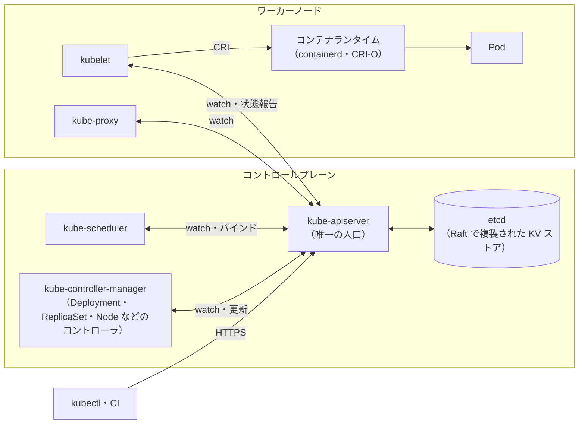
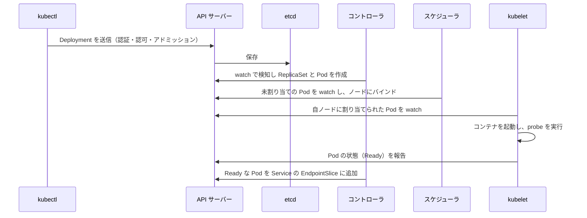
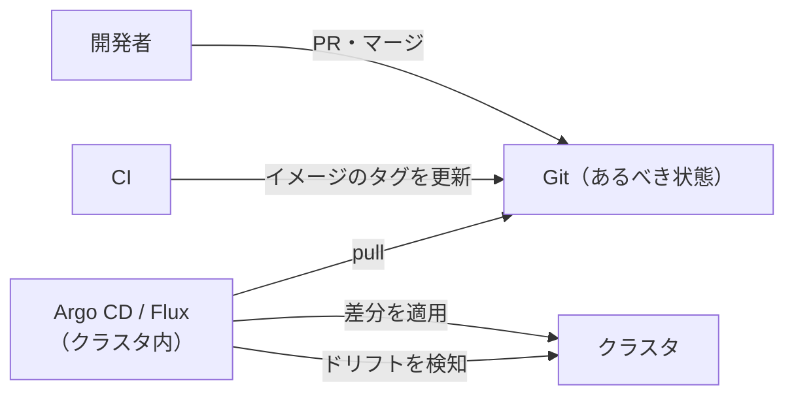

# 10.2 コンテナオーケストレーションとKubernetes

> コンテナを 1 つ動かすのは簡単です。しかし、数百のコンテナを数十台のサーバーに配置し、落ちたら立て直し、負荷に応じて増減させ、止めずに新しい版へ入れ替えるのは、まったく別の問題です。Kubernetes はこの問題を「あるべき状態を宣言すれば、コントローラが差を埋め続ける」という一つの考え方で解きました。この章では、その仕組みをスケジューラとコントローラを自作しながら理解し、設定の誤りが障害に変わる典型的な経路と、Kubernetes を使うべきでない場面を判断できるようになることを目指します。

| 項目 | 内容 |
|---|---|
| 学習時間の目安 | 本文 4h ＋ 演習 5h |
| 前提となる章 | [4.5 仮想化とコンテナ](../../04-operating-systems/05-virtualization-and-containers/README.md)、[10.1 クラウドコンピューティングとIaC](../01-cloud-and-iac/README.md)、[7.4 合意と協調](../../07-distributed-systems/04-consensus-and-coordination/README.md)（etcd と Raft） |
| 演習 | [exercises/](exercises/)（Python） |
| キーワード | コントロールプレーン, etcd, 調整ループ, Pod, Deployment, Service, Gateway API, requests/limits, QoS クラス, probe, ローリングアップデート, PDB, スケジューラ, taint/toleration, RBAC, Pod Security Standards, GitOps |

## この章のゴール

- [ ] オーケストレーションが解く問題と、Kubernetes の構成要素（API サーバー・etcd・スケジューラ・コントローラ・kubelet など）の役割を説明できる
- [ ] 宣言的 API と調整ループ（コントローラパターン）を説明し、ReplicaSet と Deployment のコントローラを実装できる
- [ ] 主要なリソース（Pod・Deployment・Service・Gateway API・ConfigMap・Secret・StatefulSet・DaemonSet・Job・HPA）を使い分け、マニフェストを読み書きできる
- [ ] requests/limits・QoS クラス・3 種類の probe・maxSurge/maxUnavailable・PodDisruptionBudget を正しく設定し、誤設定が障害になる経路を説明できる
- [ ] スケジューラのフィルタとスコアを実装し、Pod が Pending のままになる原因を診断できる
- [ ] Kubernetes を採用すべきか、サーバーレスのコンテナ実行基盤や PaaS で十分かを、チームと事業の状況から判断できる

## なぜ学ぶのか

Kubernetes は、コンテナを本番で動かすための事実上の標準になりました。CNCF（Cloud Native Computing Foundation）の年次調査でも、回答した組織の多くが本番環境で Kubernetes を使っていると報告されています。主要なクラウドはすべてマネージドの Kubernetes を提供し、データベース・機械学習・CI などのソフトウェアも Kubernetes 上で動かす前提のものが増えています。

一方で、Kubernetes は多くの設定項目を持つ複雑なシステムであり、**設定の誤りがそのまま障害になります**。

- 2023 年 3 月 14 日、Reddit は 314 分にわたる大規模な障害を起こしました。公開された振り返りによれば、Kubernetes クラスタを 1.23 から 1.24 へアップグレードした際、1.24 で廃止されたノードのラベル（`node-role.kubernetes.io/master`）を、ネットワーク（Calico）のルートリフレクタの配置指定がまだ参照しており、クラスタ内のネットワークが機能しなくなったことが原因でした。**ラベル 1 つの変更**が、アップグレードという定期作業を大障害に変えたのです。
- liveness probe（死活監視）でデータベースへの接続まで確かめていると、データベースが少し遅くなっただけで全 Pod が「死んでいる」と判定されて一斉に再起動し、復旧を遅らせる再起動の嵐が起きます。これは多くの組織で繰り返し報告されている典型的な事故です。
- メモリの上限を `512m` と書くと、Kubernetes はそれを「512 メガバイト」ではなく「0.512 バイト」と解釈します。単位の読み違いは 1.1 章で学んだ通りの落とし穴です。

Kubernetes を正しく使えれば、デプロイは日常の退屈な作業になり、サーバーの故障は誰も気づかないうちに回復します。そのためには、個々の設定の意味を暗記するのではなく、**コントローラが何を目標に、どういう順序で状態を変えるのか** を理解している必要があります。

## 1. なぜオーケストレーションが必要か

[4.5 仮想化とコンテナ](../../04-operating-systems/05-virtualization-and-containers/README.md) で学んだように、コンテナは名前空間と cgroups で隔離されたプロセスです。1 台のサーバーで `docker run` するだけなら簡単ですが、本番では次の問題が同時に発生します。

| 問題 | 手作業やスクリプトでの対応の限界 | Kubernetes の仕組み |
|---|---|---|
| どのサーバーで動かすか | 空き容量を人が見て決める | スケジューラがリソースと制約から自動で配置 |
| 落ちたら立て直す | 監視して手で再起動 | コントローラが「あるべき数」との差を埋め続ける |
| 負荷に合わせて増減 | ピークに合わせて常に多めに動かす | HPA が指標に応じて Pod 数を変える |
| 相手の居場所を知る | IP アドレスを設定ファイルに書く | Service が安定した名前と仮想 IP を与える |
| 止めずに入れ替える | 手順書に沿って 1 台ずつ | Deployment がローリングアップデートを管理 |
| 設定と秘密情報を配る | サーバーごとにファイルを配置 | ConfigMap と Secret |
| ディスクをつなぐ | 手でアタッチ・マウント | PersistentVolume と CSI ドライバ |

Kubernetes は Google の社内システム Borg と、その後継の研究（Omega）の経験をもとに設計され、2014 年に公開、2015 年に 1.0 がリリースされ、CNCF に寄贈されました。Borg の論文（2015 年）は、同じ考え方が大規模な実運用で機能してきたことを示しています。

## 2. アーキテクチャ

### 2.1 構成要素



| 構成要素 | 役割 |
|---|---|
| kube-apiserver | すべての操作の入口。認証・認可・アドミッション（検証と変更）を行い、etcd に保存する。**etcd と直接話すのは API サーバーだけ** |
| etcd | クラスタの状態を保存する分散キーバリューストア。Raft で合意を取るので、3 台や 5 台の奇数台で動かし、過半数が生きていれば書き込める（→ [7.4](../../07-distributed-systems/04-consensus-and-coordination/README.md)）。ディスクの遅延に敏感 |
| kube-scheduler | まだノードが決まっていない Pod を見つけ、置くノードを決めて API に書き込む（バインド） |
| kube-controller-manager | Deployment・ReplicaSet・Node・Job・EndpointSlice など多数のコントローラの集まり |
| kubelet | 各ノードで動き、自ノードに割り当てられた Pod のコンテナを、CRI（Container Runtime Interface）経由でランタイムに起動させる。probe を実行し、状態を報告する |
| kube-proxy | Service の仮想 IP への通信を、実際の Pod に振り分ける規則（iptables など）をノードに設定する。eBPF で置き換える CNI（Cilium など）もある |
| コンテナランタイム | containerd や CRI-O。Docker Engine を直接使う仕組み（dockershim）は 1.24（2022 年）で削除された |

### 2.2 `kubectl apply` から Pod が動くまで



注目すべきは、**どの構成要素も互いに直接命令していない** ことです。それぞれが API サーバーの状態を watch（変更の購読）し、自分の担当する差分を見つけて埋めるだけです。スケジューラが止まっていても既存の Pod は動き続け、再開すれば溜まった Pod を処理します。この疎結合さが、Kubernetes の耐障害性と拡張性の源です。

## 3. 宣言的 API と調整ループ

### 3.1 spec と status

Kubernetes のオブジェクトは、利用者が書く **spec（あるべき状態）** と、システムが書く **status（観測された状態）** を持ちます。コントローラの仕事は、status を spec に近づけることです。

```text
# 疑似コード: コントローラの基本形（調整ループ）
while True:
    desired  = spec を読む                # 例: replicas = 4
    observed = 実際の状態を観測する        # 例: 動いている Pod は 3 個
    for action in diff(desired, observed): # 例: Pod を 1 個作る
        実行する（失敗しても次の周回でやり直す）
    status を更新する
    変化を watch で待つ（一定時間ごとにも起きる）
```

これは [10.1](../01-cloud-and-iac/README.md) の IaC の plan/apply と同じ「差分を埋める」考え方ですが、1 回きりではなく **永遠に繰り返す** 点が違います。

### 3.2 レベルトリガーの強さ

「Pod が削除された」というイベントに反応して 1 つ作る方式（**エッジトリガー**）は、イベントを取りこぼすと永遠にずれたままになります。コントローラは「今あるべき数と、今ある数の差」を毎回計算する方式（**レベルトリガー**）なので、イベントを取りこぼしても、コントローラ自身が再起動しても、次の周回で正しい状態に収束します。操作は冪等（何度実行しても結果が同じ）に作ります。

複数のコントローラや利用者が同じオブジェクトを更新しても壊れないよう、API は **楽観的並行性制御** を使います。オブジェクトには `resourceVersion` があり、読んだ後に誰かが更新していたら書き込みは 409 Conflict で失敗し、コントローラは読み直してやり直します（[6.3](../../06-databases/03-transactions/README.md) の楽観的ロックと同じ考え方です）。

オブジェクトどうしの親子関係は `ownerReferences` で表され、Deployment を消すと ReplicaSet と Pod も自動で消されます（ガベージコレクション）。削除前に外部の後片付けが必要なリソースには `finalizers` を付けます。

### 3.3 Deployment と ReplicaSet

Deployment は直接 Pod を作りません。**Pod のテンプレートごとに ReplicaSet を作り、各 ReplicaSet の目標数を調整する** ことでローリングアップデートを実現します。ReplicaSet のコントローラは、自分の Pod の数を目標数に合わせるだけです。

```text
Deployment web（replicas: 4, image: v2）
 ├─ ReplicaSet web-7d9f…（image: v1）目標 1 → 0 に向けて減らされていく
 └─ ReplicaSet web-5c4b…（image: v2）目標 3 → 4 に向けて増やされていく
```

古い ReplicaSet は目標 0 のまま残るので、`kubectl rollout undo` によるロールバックは、古い ReplicaSet を再び増やすだけで済みます。演習 5・6 では、この 2 段のコントローラを実装します。

## 4. 主要なリソース

| リソース | 用途 | ひとこと |
|---|---|---|
| Pod | 1 つ以上のコンテナの実行単位。IP とボリュームを共有 | 直接作らず、上位のコントローラに作らせる |
| Deployment / ReplicaSet | ステートレスなアプリの複製とローリングアップデート | 最もよく使う |
| Service | Pod の集合に安定した名前と仮想 IP を与える | ラベルセレクタで対象の Pod を選ぶ |
| Ingress / Gateway API | 外部からの HTTP(S) を Service に振り分ける | 新規構築では Gateway API を第一候補に（2026 年時点） |
| ConfigMap / Secret | 設定値と秘密情報を Pod に渡す | Secret は既定では暗号化されない（後述） |
| StatefulSet | 安定した名前・順序・Pod ごとの永続ボリュームが必要なもの | DB やメッセージブローカーなど |
| DaemonSet | 各ノードに 1 つずつ動かす | ログ収集・監視エージェント・CNI |
| Job / CronJob | 完了するまで実行するバッチ / 定期実行 | 失敗時の再試行回数を設定する |
| Namespace | 名前の範囲と権限・クォータの単位 | 強いセキュリティ境界ではない |
| HorizontalPodAutoscaler | 指標に応じて replicas を変える | requests を基準に使用率を計算する |

典型的なステートレスなアプリケーションの定義を示します（Kubernetes に適用して使う設定の例です）。

```yaml
apiVersion: apps/v1
kind: Deployment
metadata:
  name: web
spec:
  replicas: 4
  selector:
    matchLabels: {app: web}
  strategy:
    type: RollingUpdate
    rollingUpdate: {maxSurge: 1, maxUnavailable: 0}   # 容量を減らさずに入れ替える
  template:
    metadata:
      labels: {app: web}
    spec:
      terminationGracePeriodSeconds: 30
      containers:
      - name: web
        image: registry.example.com/web:1.4.2          # latest のような可変タグは使わない
        ports:
        - containerPort: 8080
        resources:
          requests: {cpu: 250m, memory: 256Mi}          # スケジューリングの予約量
          limits: {memory: 256Mi}                       # メモリは requests と同じにすると予測しやすい
        startupProbe:                                   # 起動が終わるまで liveness を止める
          httpGet: {path: /healthz/live, port: 8080}
          periodSeconds: 5
          failureThreshold: 30                          # 最大 150 秒の起動を待つ
        readinessProbe:                                 # 失敗したら Service から外す（再起動しない）
          httpGet: {path: /healthz/ready, port: 8080}
          periodSeconds: 5
        livenessProbe:                                  # 失敗したら再起動する。自分自身の健全性だけを見る
          httpGet: {path: /healthz/live, port: 8080}
          periodSeconds: 10
          failureThreshold: 3
        securityContext:
          runAsNonRoot: true
          allowPrivilegeEscalation: false
          readOnlyRootFilesystem: true
---
apiVersion: v1
kind: Service
metadata:
  name: web
spec:
  selector: {app: web}          # このラベルを持つ Ready な Pod に振り分ける
  ports:
  - port: 80
    targetPort: 8080
```

外部からの HTTP の振り分けには、長く Ingress が使われてきましたが、機能の拡張は **Gateway API**（2023 年に v1.0）で進められています。Gateway API は、インフラ担当が管理する Gateway と、アプリ担当が管理する HTTPRoute のように、役割ごとにリソースを分けているのが特徴です。

```yaml
apiVersion: gateway.networking.k8s.io/v1
kind: HTTPRoute
metadata:
  name: web
spec:
  parentRefs:
  - name: public-gateway          # プラットフォームチームが用意した Gateway
  hostnames: ["www.example.com"]
  rules:
  - matches:
    - path: {type: PathPrefix, value: /}
    backendRefs:
    - name: web
      port: 80
```

## 5. リソース管理とスケジューリング

### 5.1 requests と limits

コンテナには CPU とメモリの **requests（要求量）** と **limits（上限）** を指定します。この 2 つは役割がまったく違います。

| | requests | limits |
|---|---|---|
| 使われる場面 | スケジューリング（ノードに置けるかの判定）と、資源が足りないときの配分の基準 | 実行時の強制 |
| CPU | ノードの CPU を requests の比率で分け合う | 超えると **スロットリング**（一定期間ごとに実行を止められ、遅延が増える） |
| メモリ | ノードのメモリの予約 | 超えると **OOMKilled**（コンテナが強制終了される） |

スケジューラは **実際の使用量ではなく requests の合計** で「空き」を判断します。requests を実際より大きく書けばノードは空いているのに Pod が置けず（費用の無駄）、小さく書けばノードに詰め込みすぎて、実際の使用量が増えたときにメモリ不足で Pod が追い出されます。

CPU の単位は「コア」で、`250m` は 0.25 コア（250 ミリコア）です。メモリは `256Mi`（2²⁰ の 256 倍）や `256M`（10⁶ の 256 倍）のように書きます。**`256m` と書くと 0.256 バイトの意味になる** ので注意してください（演習 1 のパーサはこれを誤りとして拒否します）。

requests と limits の組み合わせで、Pod の **QoS クラス** が決まります。

| QoS クラス | 条件 | ノードのメモリが足りなくなったとき |
|---|---|---|
| Guaranteed | すべてのコンテナで CPU とメモリの requests = limits | 最後まで守られる |
| Burstable | requests か limits が少なくとも 1 つ設定されている（Guaranteed 以外） | requests を超えて使っているものから追い出される |
| BestEffort | requests も limits もない | 最初に追い出される |

実務では、**メモリは requests = limits にして予測可能にし、CPU は requests を実測に基づいて設定する** のが一般的です。CPU の limits を付けるかどうかは議論があり、遅延に敏感なサービスではスロットリングを避けるために付けない運用もあります（その場合は、同じノードの他の Pod を圧迫しないよう requests を適切に設定することが前提です）。Java（JVM）や Go のようなランタイムでは、ランタイム側のメモリの設定（JVM のヒープの上限 `-Xmx` や `-XX:MaxRAMPercentage`、Go の `GOMEMLIMIT` など）をコンテナのメモリ上限と整合させる必要があります。ヒープ以外に使うメモリ（スレッドのスタック、ネイティブのメモリなど）を見込まずにヒープを上限近くまで広げると OOMKilled され、逆に小さすぎると与えたメモリを活かせずにガベージコレクションが頻発します。

### 5.2 スケジューラ: フィルタ → スコア → バインド

kube-scheduler は、未割り当ての Pod ごとに次の 3 段階を実行します。

1. **フィルタ（filter）**: 置けないノードを除く。資源（requests の合計が allocatable を超えないか）、nodeSelector やノードアフィニティ、taint と toleration、ボリュームの AZ などを調べる。
2. **スコア（score）**: 残ったノードに点数を付ける。既定では空きの多いノードを好み（LeastAllocated）、CPU とメモリの使用率の偏りが少ないノードを好む（BalancedAllocation）といった複数のプラグインの重み付き和。
3. **バインド（bind）**: 最高点のノードを Pod の `nodeName` に書き込む。

**taint と toleration** は「このノードには基本的に置かないで」という印とその例外です。GPU ノードに `dedicated=gpu:NoSchedule` という taint を付けておけば、その taint を許容する（toleration を持つ）機械学習の Pod だけが置かれます。`PreferNoSchedule` は「なるべく避ける」、`NoExecute` は「すでに動いている Pod も追い出す」という意味です。

置けるノードがないと Pod は Pending のままになり、イベントに理由が記録されます。演習 2 のスケジューラは、このメッセージの形式も再現しています。

```python
from kube_scheduler import Node, PodSpec, Taint, schedule

nodes = [
    Node("node-a", cpu="4", memory="8Gi", labels={"disk": "ssd"}),
    Node("node-b", cpu="4", memory="8Gi", pods=[PodSpec("batch", cpu="3", memory="2Gi")]),
    Node("gpu-1", cpu="8", memory="32Gi", taints=[Taint("dedicated", "gpu", "NoSchedule")]),
]
print(schedule(PodSpec("api", cpu="500m", memory="512Mi"), nodes).message)
print(schedule(PodSpec("db", cpu="2", memory="4Gi", node_selector={"disk": "nvme"}), nodes).message)
print(schedule(PodSpec("cache", cpu="1500m", memory="9Gi"), nodes).message)
```

```text
Successfully assigned api to node-a
0/3 nodes are available: 2 node(s) didn't match Pod's node affinity/selector, 1 node(s) had untolerated taint {dedicated: gpu}.
0/3 nodes are available: 1 Insufficient cpu, 2 Insufficient memory, 1 node(s) had untolerated taint {dedicated: gpu}.
```

3 行目では node-b が CPU とメモリの両方で不足しているので、理由の合計（4）がノード数（3）を超えています。**Pending の調査は、まずこのメッセージを読むことから始めます**。「Insufficient」なら requests を見直すかノードを増やす、「affinity/selector」ならラベルの綴りを、「untolerated taint」なら toleration の有無を確かめます。

実際のスケジューラには、ほかにも Pod 間のアフィニティ（同じノードに置きたい・置きたくない）や、**トポロジー分散制約**（`topologySpreadConstraints`: AZ やノードごとに Pod を均等に散らす）などがあります。レプリカが全部同じ AZ に置かれていると、AZ 障害で全滅します。可用性が重要なサービスでは、AZ ごとの分散を明示的に指定しましょう。

### 5.3 優先度とプリエンプション

PriorityClass で Pod に優先度を付けると、置き場所がないとき、スケジューラは **優先度の低い Pod を追い出して（プリエンプション）** 置き場所を作ります。演習 3 では、追い出す Pod をなるべく少なく、なるべく重要でないものにするアルゴリズムを実装します。バッチ処理を低優先度、オンラインのサービスを高優先度にしておけば、負荷の急増時にもサービスの Pod が置けます。逆に、全 Pod を最高優先度にすると、この仕組みは意味を失います。

### 5.4 オートスケーリング

**HPA（HorizontalPodAutoscaler）** の基本式は単純です。

```python
import math
def hpa_desired(current_replicas, current_utilization, target_utilization):
    # Kubernetes の HPA の基本式（許容誤差 10% などの細部は省略）
    return math.ceil(current_replicas * current_utilization / target_utilization)

print(hpa_desired(4, 90, 60))    # CPU 使用率 90%（requests 比）、目標 60%
print(hpa_desired(6, 45, 60))    # 負荷が下がった
```

```text
6
5
```

使用率は **requests に対する比率** で計算されるので、requests が不正確だとオートスケーリングも狂います。

スケールアウトには時間がかかることも忘れてはいけません。指標の収集 → HPA の判断 → Pod の作成 → （ノードが足りなければ）ノードの追加（Cluster Autoscaler や Karpenter で数分）→ イメージの取得 → アプリの起動 → readiness probe の成功、という連鎖を経て、ようやく負荷を受けられます。**急激な負荷の増加には HPA だけでは間に合わない** ので、目標使用率に余裕を持たせる、予測できるピークの前に増やしておく、といった対策を組み合わせます。キューの長さなどの外部指標でスケールさせたい場合は KEDA のようなツールも使われます。Pod の requests 自体を実測に合わせて調整する VPA（VerticalPodAutoscaler）もあります。

### 5.5 ビンパッキングとコスト

スケジューラの戦略は費用に直結します。演習のスケジューラで、同じ 6 つの Pod を 3 台のノードに置いてみます。

```python
from kube_scheduler import Node, PodSpec, schedule

for strategy in ("LeastAllocated", "MostAllocated"):
    nodes = [Node(f"n{i}", cpu="4", memory="8Gi") for i in range(3)]
    for i in range(6):
        schedule(PodSpec(f"p{i}", cpu="1", memory="1Gi"), nodes, strategy)
    print(f"{strategy:15}", {n.name: len(n.pods) for n in nodes})
```

```text
LeastAllocated  {'n0': 2, 'n1': 2, 'n2': 2}
MostAllocated   {'n0': 4, 'n1': 2, 'n2': 0}
```

分散配置（LeastAllocated）は 1 台の故障の影響を小さくし、詰め込み（MostAllocated, ビンパッキング）は空いたノードを削除して費用を下げられます。ノードの自動削除と組み合わせるなら詰め込み寄りに、可用性を優先するなら分散寄りにします。どちらにしても、**requests が実際の使用量とかけ離れていれば、どんな戦略も無駄を生みます**。requests と実測の使用量の比は、Kubernetes のコスト管理で最初に見るべき指標です（→ [10.6](../06-finops/README.md)）。

## 6. ヘルスチェックとデプロイ

### 6.1 3 種類の probe

| probe | 失敗したとき | 何を確かめるべきか |
|---|---|---|
| startupProbe | 規定回数失敗したら再起動。成功するまで他の probe を止める | 起動処理（設定の読み込み・キャッシュの温め）が終わったか |
| readinessProbe | Service の振り分け先から外す（再起動はしない） | 今リクエストを受けられるか。依存先の不調で一時的に外すのはここ |
| livenessProbe | コンテナを再起動する | **プロセス自身が回復不能な状態（デッドロックなど）か**。依存先は見ない |

**再起動の嵐（restart storm）** は、liveness probe で依存先（DB・キャッシュ・他のサービス）まで確かめたときに起きます。DB が一時的に遅くなる → 全 Pod の liveness が失敗 → 全 Pod が一斉に再起動 → 起動処理で DB にさらに負荷がかかる → DB がさらに遅くなる、という悪循環です。依存先の不調は readiness で扱い、しかも **全 Pod が同時に Not Ready になると Service の振り分け先がゼロになる** ことにも注意が必要です（その場合は、エラーを返しつつも受け付け続ける方が良いこともあります）。起動の遅いアプリで startup probe を使わず liveness の猶予だけで調整すると、起動が少し遅れた日に再起動を繰り返す（CrashLoopBackOff）原因になります。

### 6.2 ローリングアップデート

Deployment のローリングアップデートは 2 つのパラメータで制御します。

- **maxSurge**: 目標数を超えて一時的に作ってよい Pod の数（割合なら切り上げ）
- **maxUnavailable**: 目標数に対して Ready でなくてよい Pod の数（割合なら切り捨て）

既定値はどちらも 25% です。レプリカ数ごとの意味を、演習 4 の関数で計算してみます。

```python
from reconciler import resolve_fenceposts
for n in (1, 2, 3, 4, 10, 40):
    s, u = resolve_fenceposts("25%", "25%", n)
    print(f"replicas={n:>2}: maxSurge={s} maxUnavailable={u} → Pod は最大 {n + s}、Ready は最低 {n - u}")
```

```text
replicas= 1: maxSurge=1 maxUnavailable=0 → Pod は最大 2、Ready は最低 1
replicas= 2: maxSurge=1 maxUnavailable=0 → Pod は最大 3、Ready は最低 2
replicas= 3: maxSurge=1 maxUnavailable=0 → Pod は最大 4、Ready は最低 3
replicas= 4: maxSurge=1 maxUnavailable=1 → Pod は最大 5、Ready は最低 3
replicas=10: maxSurge=3 maxUnavailable=2 → Pod は最大 13、Ready は最低 8
replicas=40: maxSurge=10 maxUnavailable=10 → Pod は最大 50、Ready は最低 30
```

replicas が 4 以上になると、既定値では更新中に容量が最大 25% 減ります。ピーク時間帯にデプロイするサービスでは、`maxUnavailable: 0` にして容量を保つ（その分、一時的に余分なノード資源が要る）のが安全です。

演習 6 のコントローラで、replicas 4・maxSurge 1・maxUnavailable 1 の更新を 1 単位時間ずつ追ってみます（新しい Pod は Ready まで 2 単位時間かかる設定）。

```python
from reconciler import Cluster, Deployment

cluster = Cluster(startup={1: 1, 2: 2})          # 新リビジョンの Pod は Ready まで 2 単位時間
deploy = Deployment(cluster, 4, max_surge=1, max_unavailable=1)
for t in range(3):
    deploy.reconcile(t)                          # 初期の 4 Pod を作って Ready にする
deploy.rollout(2, now=3)                         # イメージを更新
print(" t  旧(Ready)  新(Ready)  合計  状態")
for t in range(3, 10):
    deploy.reconcile(t)
    old, new = cluster.pods_of(1), cluster.pods_of(2)
    print(f"{t:2}  {len(old)}({cluster.ready_count(t, 1)})       {len(new)}({cluster.ready_count(t, 2)})       "
          f"{len(cluster.pods)}     {deploy.status(t)}")
```

```text
 t  旧(Ready)  新(Ready)  合計  状態
 3  3(3)       1(0)       4     progressing
 4  3(3)       2(0)       5     progressing
 5  2(2)       2(1)       4     progressing
 6  1(1)       3(2)       4     progressing
 7  1(1)       4(2)       5     progressing
 8  0(0)       4(3)       4     progressing
 9  0(0)       4(4)       4     complete
```

どの時点でも合計は 5（= 4 + maxSurge）以下、Ready は 3（= 4 − maxUnavailable）以上に保たれています。t=3 では maxUnavailable の枠（1 つ）を使って古い Pod を 1 つ減らしましたが、t=4 では新しい Pod がまだ Ready でないので、それ以上は減らしていません。**古い Pod を減らせるのは、Ready な Pod の数が replicas − maxUnavailable を下回らない範囲だけ** です。新しい Pod が Ready になるたびに、その分だけ古い Pod を減らせるようになります。

この性質が、壊れたイメージをデプロイしたときに効きます。新しい Pod が永遠に Ready にならないと、ロールアウトは「旧 3 + 新 2（Ready でない）」の状態で止まり、サービスは 3 つの旧 Pod で動き続けます（演習のテスト `test_broken_revision_stalls_without_losing_capacity`）。Kubernetes は一定時間（`progressDeadlineSeconds`、既定 600 秒）進捗がないとロールアウトを「失敗（ProgressDeadlineExceeded）」と記録しますが、**自動でロールバックはしません**。CD パイプラインがこの状態を検知して `kubectl rollout undo` するか、Argo Rollouts のようなツールで指標に基づく自動ロールバックを組み込みます（→ [8.4](../../08-software-engineering/04-ci-cd-and-release/README.md) のプログレッシブデリバリー）。

### 6.3 PodDisruptionBudget

ノードの保守（`kubectl drain`）やクラスタのアップグレードでは、Pod が計画的に退避させられます。**PodDisruptionBudget（PDB）** は、このような **自発的な中断（voluntary disruption）** のときに「同時に止めてよい数」を制限します。

```yaml
apiVersion: policy/v1
kind: PodDisruptionBudget
metadata:
  name: web
spec:
  minAvailable: 3          # replicas 4 なら、同時に退避できるのは 1 つまで
  selector:
    matchLabels: {app: web}
```

PDB が守るのは退避の API を通した中断だけで、**ノードの故障のような非自発的な中断は防げません**。また `minAvailable` を replicas と同じ値にすると、1 つも退避できずにノードの保守が永遠に終わらなくなります。PDB は「レプリカを複数の AZ に分散し、1 つ失っても耐えられる数を動かす」設計と組み合わせて初めて意味を持ちます。

### 6.4 グレースフルシャットダウン

Pod を止めるとき、kubelet はコンテナに SIGTERM を送り、`terminationGracePeriodSeconds`（既定 30 秒）待ってから SIGKILL で強制終了します。同時に、Pod は Service の振り分け先から外されますが、この 2 つは **並行して進む** ため、振り分け先の更新が各ノードに行き渡る前にアプリが終了すると、終了済みの Pod にリクエストが届いてエラーになります。デプロイのたびに少数の 5xx が出るサービスは、たいていこれが原因です。

対策は、SIGTERM を受けても数秒間は新しいリクエストを受け付け続け（`preStop` フックで数秒待つのが定番）、処理中のリクエストを終えてから終了することです。長時間の処理（大きなファイルのアップロード、WebSocket）がある場合は、猶予時間を延ばすか、処理を中断・再開できる設計にします。

## 7. ネットワークとストレージ

### 7.1 ネットワーク

Kubernetes のネットワークモデルは、**すべての Pod が固有の IP アドレスを持ち、NAT なしで互いに通信できる** というものです。これを実装するのが CNI（Container Network Interface）プラグインで、Calico、Cilium、クラウドの VPC に Pod の IP を直接割り当てるもの（AWS VPC CNI など）があります。

| Service の種類 | 用途 |
|---|---|
| ClusterIP（既定） | クラスタ内部用の仮想 IP。`web.default.svc.cluster.local` のような DNS 名で引ける |
| NodePort | 全ノードの特定ポートで公開する（直接使うことは少ない） |
| LoadBalancer | クラウドのロードバランサを作って外部に公開する |
| Headless（`clusterIP: None`） | 仮想 IP を持たず、DNS で各 Pod の IP を返す。StatefulSet と組み合わせる |

既定では、**すべての Pod がすべての Pod と通信できます**。侵入された 1 つの Pod から、クラスタ内のデータベースに自由に接続できてしまうということです。**NetworkPolicy** で通信を許可制にしますが、NetworkPolicy を実際に強制するかどうかは CNI 次第なので、使っている CNI が対応しているか確認してください。

```yaml
apiVersion: networking.k8s.io/v1
kind: NetworkPolicy
metadata:
  name: web-ingress
spec:
  podSelector:
    matchLabels: {app: web}
  policyTypes: [Ingress]
  ingress:
  - from:
    - namespaceSelector:
        matchLabels: {kubernetes.io/metadata.name: gateway}   # gateway 名前空間からだけ
    ports:
    - port: 8080
```

### 7.2 ストレージ

コンテナのファイルシステムは Pod が消えると失われます。永続化には次の 3 つのリソースを使います。

- **PersistentVolumeClaim（PVC）**: 「10Gi の読み書き可能なディスクが欲しい」という要求。アプリ側が書く。
- **StorageClass**: ディスクの種類と作り方（クラウドのどのディスクを、どの性能で）。プラットフォーム側が用意する。
- **PersistentVolume（PV）**: 実際のディスク。PVC に応じて CSI（Container Storage Interface）ドライバが動的に作る。

クラウドのブロックストレージは **AZ に属する** ので、ディスクのある AZ のノードにしか Pod を置けません。StorageClass の `volumeBindingMode: WaitForFirstConsumer` は、Pod の配置が決まってからディスクを作ることで、ディスクと Pod の AZ の不一致を防ぎます。

StatefulSet は、Pod ごとに固定の名前（`db-0`, `db-1`）と専用の PVC を与えるので、データベースやメッセージブローカーを動かせます。ただし、**Kubernetes 上でデータベースを運用することは、Kubernetes とデータベースの両方の運用知識を要求します**。バックアップ・フェイルオーバー・アップグレードを自動化する Operator を使うとしても、多くの組織にとってはマネージドのデータベースサービスの方が安全で安上がりです。

## 8. セキュリティ

| 領域 | 基本の対策 |
|---|---|
| API の権限 | **RBAC**（Role・ClusterRole と RoleBinding）で、人と ServiceAccount に必要な権限だけを与える。`cluster-admin` を配らない。Secret の読み取り権限は特に強力 |
| Pod の権限 | **Pod Security Standards**（Privileged / Baseline / Restricted の 3 段階）を、名前空間のラベルで Pod Security Admission に強制させる。root での実行、特権コンテナ、ホストのファイルシステムのマウントを禁止する。旧来の PodSecurityPolicy は 1.25 で削除された |
| 秘密情報 | Secret は既定では **base64 で符号化されているだけで暗号化されていない**。etcd の暗号化（KMS 連携）を有効にし、クラウドのシークレット管理サービスと連携する（External Secrets Operator など） |
| イメージ | 信頼できるレジストリのイメージだけを許可し、署名（Sigstore の cosign など）を検証する。アドミッションのポリシー（Kyverno、OPA Gatekeeper、組み込みの ValidatingAdmissionPolicy）で強制する（→ [11.5](../../11-security/05-security-operations/README.md) のサプライチェーン） |
| クラウドの権限 | Pod に長期のアクセスキーを渡さず、ワークロード ID（EKS Pod Identity や IRSA、GKE の Workload Identity、AKS のワークロード ID）で ServiceAccount とクラウドのロールを結びつける（[10.1](../01-cloud-and-iac/README.md) の原則と同じ） |
| ネットワーク | NetworkPolicy で既定を拒否にし、必要な通信だけを許可する |

Namespace は名前と権限の範囲を分けますが、同じノードのカーネルを共有するので、**悪意のあるテナントどうしを隔離する強いセキュリティ境界ではありません**。信頼できない顧客のコードを動かす場合は、クラスタ（やノードプール）を分ける、gVisor や Kata Containers のようなより強い隔離を使う、といった設計が必要です。

## 9. エコシステムと運用

### 9.1 マニフェストの管理と GitOps

- **Helm**: テンプレートとパラメータでマニフェストを生成するパッケージマネージャ。外部のソフトウェア（監視ツールなど）の導入によく使う。テンプレートが複雑になると読みにくい。
- **Kustomize**: 共通のマニフェストに環境ごとの差分（overlay）を重ねる。`kubectl apply -k` で使える。
- **GitOps**: Git リポジトリを「あるべき状態」の唯一の置き場にし、クラスタ内のエージェント（Argo CD や Flux）が Git とクラスタの差分を埋め続ける。これも調整ループであり、手作業の変更（ドリフト）は自動で元に戻される。CI にクラスタの書き込み権限を渡さなくてよい点も利点。



### 9.2 Operator とカスタムリソース

Kubernetes の API は **CRD（CustomResourceDefinition）** で拡張できます。独自のリソース（例: `PostgresCluster`）と、それを調整するコントローラの組み合わせを **Operator** と呼びます。運用者の知識（フェイルオーバー、バックアップ、アップグレードの手順）をコントローラとしてコード化する考え方です。演習で書いたコントローラは、その最小の例です。便利な反面、Operator 自体の不具合やアップグレードも運用対象になることを忘れないでください。

### 9.3 サービスメッシュ

Istio や Linkerd のようなサービスメッシュは、サービス間の通信に mTLS による暗号化と相互認証、リトライ・タイムアウト、トラフィックの分割（カナリアリリース）、通信の可視化を、アプリケーションのコードを変えずに加えます。従来は各 Pod にプロキシ（サイドカー）を入れる方式でしたが、ノード単位のプロキシを使うサイドカーなしの方式も登場しています。得られる機能は大きいものの、構成要素と障害点が増えるので、「サービス間の mTLS が必須」「言語の異なる多数のサービスで通信制御を統一したい」といった明確な必要があるときに導入を検討します。

### 9.4 マネージド Kubernetes とアップグレード

Amazon EKS、Google Kubernetes Engine（GKE）、Azure Kubernetes Service（AKS）は、コントロールプレーン（API サーバーや etcd）の運用を肩代わりしてくれます。GKE Autopilot のように、ノードの管理まで任せられるモードもあります。自前でコントロールプレーンを運用する理由は、ほとんどの組織にはありません。

ただし、**アップグレードは利用者の仕事として残ります**。Kubernetes のマイナーバージョンは年に 3 回ほどリリースされ、各バージョンのサポート期間は約 1 年強です。マネージドサービスにも独自のサポート期間があり、期限を過ぎると延長サポートの追加料金や強制アップグレードの対象になることがあります（条件は 2026 年時点の各社の情報を確認してください）。アップグレードでは、廃止された API（古い `apiVersion`）を使うマニフェストが適用できなくなったり、Reddit の事例のようにラベルや既定値の変更が影響したりします。**アップグレードは年に数回の定常業務として計画し、ステージングのクラスタで先に試す** 体制が必要です。

## 10. Kubernetes を使うべきでないとき

Kubernetes は「コンテナを動かすための製品」ではなく、「コンテナの実行基盤を自分たちで作るための部品」です。その部品を組み立て、保守し続ける人と時間があるかが採用の分かれ目です。

| 状況 | 推奨 |
|---|---|
| 小さなチーム（エンジニア数人〜十数人）、サービス数が少ない、Web API とバッチが中心 | サーバーレスのコンテナ実行基盤（Cloud Run、Amazon ECS on Fargate、Azure Container Apps）や PaaS。クラスタの運用がない |
| サービス数が数十以上、複数チームが共通の基盤を使う、GPU や特殊なスケジューリングが必要、エコシステム（Operator、GitOps、メッシュ）を活用したい | マネージド Kubernetes と、それを整備・運用するプラットフォームチーム |
| 規制や接続性の理由でオンプレミスが必須、クラウド間での移植性が事業上の要件 | Kubernetes（ディストリビューションの選定と運用体制の確保が前提） |

Kubernetes を採用すると、アップグレード、アドオン（CNI・Ingress/Gateway・監視・証明書管理・オートスケーラ）の保守、セキュリティの基準の維持、利用者の支援が恒常的な仕事になります。これを片手間で担うと、上記の Reddit のような事故や、誰も全体を理解していないクラスタが生まれます。**Kubernetes は「プラットフォームを製品として提供するチーム」を持つ意思決定とセットで採用する** べきものです（→ [13.6 チームと組織の設計](../../13-technical-leadership/06-team-and-org-design/README.md) のプラットフォームチーム）。

費用の面でも、コントロールプレーンの料金、各ノードで動く DaemonSet（監視・ログ・CNI）の資源、requests の過大な見積もりによる空き容量が、小規模なうちは割高に効きます。

## よくある落とし穴

1. **requests を設定しない、または実測とかけ離れた値にする**。requests がなければ BestEffort になり、ノードの資源が足りなくなると真っ先に追い出される。過大なら費用の無駄、過小なら詰め込みすぎによる不安定化を招く。実測（p95 など）に基づいて設定し、定期的に見直す。
2. **liveness probe で依存先を確かめる**。依存先の一時的な遅延が全 Pod の一斉再起動に変わる。liveness はプロセス自身の健全性だけ、依存先の状態は readiness で扱い、起動の遅いアプリには startup probe を使う。
3. **`latest` のような可変のタグでイメージを指定する**。どのバージョンが動いているか分からず、ノードごとに違うイメージが動くこともあり、ロールバックもできない。不変のタグ（バージョン番号）かダイジェスト（`@sha256:...`）で指定する。
4. **グレースフルシャットダウンを実装しない**。デプロイやスケールインのたびに少数の 5xx が出る。SIGTERM を受けたら数秒は受け付け続け、処理中のリクエストを終えてから終了する。
5. **PDB を設定しない、または `minAvailable` を replicas と同じにする**。前者はノードの保守で全 Pod が同時に止まりうる。後者はノードの保守が永遠に終わらない。
6. **Secret を「暗号化されている」と思い込み、RBAC で広く読めるようにする**。Secret は base64 で符号化されているだけ。etcd の暗号化・外部のシークレット管理・Secret の読み取り権限の最小化を組み合わせる。
7. **アップグレードを「数年に 1 度の大仕事」にする**。サポート切れで追加料金を払うか、複数バージョンをまたぐ危険なアップグレードを強いられる。定常業務として年に数回計画し、廃止予定の API を CI で検出する。
8. **メモリの単位を書き間違える**。`512m` は 0.512 バイト。`512Mi` と書く。レビューと、ポリシーによる機械的なチェックで防ぐ。

## CTOの視点

1. **採用の判断は「プラットフォームチームを持つか」の判断**。Kubernetes を選ぶと、クラスタの運用・アップグレード・セキュリティ基準・利用者の支援が恒常的な仕事になります。エンジニアが 10 人前後の組織なら、サーバーレスのコンテナ実行基盤で始め、「サービス数が増え、共通基盤の価値が運用コストを上回った」と説明できる時点で移行を検討する方が合理的です。「将来に備えて」「採用に有利だから」は十分な理由になりません。
2. **資源の効率を見える化する**。クラスタの費用は「requests の合計」で決まり、実際の使用量ではありません。requests に対する実使用率、ノードの割り当て率、チームごとの requests の合計を定期的に報告させ、過大な requests を是正する仕組み（VPA の推奨値、FinOps のレビュー）を作りましょう（→ [10.6](../06-finops/README.md)）。
3. **アップグレードと互換性の方針を決める**。「サポート期間の残りが N か月を切ったらアップグレードする」「ステージングで 2 週間動かしてから本番」「廃止予定の API は CI で検出する」といった方針と、そのための工数を毎年の計画に組み込みます。障害の振り返りで「アップグレード」が原因に挙がることは珍しくありません。
4. **セキュリティの既定値を組織として決める**。Pod Security Standards の Restricted、NetworkPolicy の既定拒否、署名済みイメージのみの許可、ワークロード ID の利用を、プラットフォームの既定値として強制し、例外は申請制にします。一つ一つのチームに任せると、最も弱いチームの設定がクラスタ全体の安全性を決めてしまいます。
5. **採用・育成では「なぜそう動くか」を問う**。YAML を書けることより、「Pod が Pending のとき何を見るか」「CrashLoopBackOff と OOMKilled をどう切り分けるか」「maxUnavailable を 0 にするとロールアウト中に何が起きるか」を説明できるかの方が、障害対応力をよく表します。コントローラと調整ループを理解している人は、初めて見る Operator の挙動も推論できます。

## 演習

演習コードは [exercises/kube_scheduler.py](exercises/kube_scheduler.py) と [exercises/reconciler.py](exercises/reconciler.py) にあります。関数の docstring に仕様が書いてあるので、`raise NotImplementedError(...)` を実装に置き換えてください。解答例は [solutions/](solutions/) にあります。

```bash
python3 tools/check.py 10.2        # リポジトリのルートで実行
python3 tools/check.py -v 10.2     # 詳しい出力
```

| # | 難易度 | 内容 | 対象ファイル / 関数 |
|---|---|---|---|
| 1 | ★☆☆ | CPU（ミリコア）とメモリ（SI / 2 進接頭辞）の数量表記の解析。`512m` の書き間違いの検出 | `kube_scheduler.py`: `parse_cpu`, `parse_memory` |
| 2 | ★★☆ | スケジューラ: taint/toleration・nodeSelector・資源によるフィルタ、3 つのスコア戦略、バインドと Pending の理由のメッセージ | `kube_scheduler.py`: `tolerates`, `filter_node`, `score_node`, `schedule` |
| 3 | ★★★ | プリエンプション: 犠牲を最小化する追い出しの選択 | `kube_scheduler.py`: `preempt` |
| 4 | ★☆☆ | maxSurge / maxUnavailable の解決（切り上げ・切り捨て・両方 0 の扱い） | `reconciler.py`: `resolve_fenceposts` |
| 5 | ★★☆ | ReplicaSet の突き合わせ（どの Pod から消すか） | `reconciler.py`: `deletion_order`, `sync_replicaset` |
| 6 | ★★★ | Deployment コントローラ: ローリングアップデート、壊れたリビジョンでの停止、ロールバック、進捗の判定 | `reconciler.py`: `Deployment` |
| 7 | ★★☆ | 記述: マニフェストのレビュー（下記） | — |

演習 6 のテストは、時刻を 1 ずつ進めながら「Pod の総数 ≤ replicas + maxSurge」「Ready な Pod ≥ replicas − maxUnavailable」という不変条件を毎回確かめます。テストが通ったら、なぜ (B-1) の「Ready でない古い Pod の片付け」がないとロールバックが進まなくなるのか、自分の言葉で説明してみてください。

### 演習 7（記述）: マニフェストのレビュー

次のマニフェストは、ある決済 API の本番用として提出されたものです。問題点をできるだけ多く挙げ、それぞれ「何が起きうるか」と修正案を書いてください。

```yaml
apiVersion: apps/v1
kind: Deployment
metadata:
  name: payment-api
spec:
  replicas: 2
  selector:
    matchLabels: {app: payment-api}
  strategy:
    rollingUpdate: {maxSurge: 0, maxUnavailable: "100%"}
  template:
    metadata:
      labels: {app: payment-api}
    spec:
      containers:
      - name: api
        image: registry.example.com/payment-api:latest
        env:
        - name: DB_PASSWORD
          value: "s3cr3t-P@ss"
        resources:
          limits: {memory: 512m}
        livenessProbe:
          httpGet: {path: /health/db, port: 8080}
          initialDelaySeconds: 5
          periodSeconds: 5
          failureThreshold: 1
        securityContext:
          privileged: true
```

<details>
<summary>解答例</summary>

| 箇所 | 何が起きうるか | 修正案 |
|---|---|---|
| `maxUnavailable: "100%"`, `maxSurge: 0` | 更新時に全 Pod が同時に止まり、決済が完全に停止する | `maxSurge: 1, maxUnavailable: 0`（容量を保って入れ替える） |
| `replicas: 2`、PDB なし、分散の指定なし | 2 つが同じノード・同じ AZ に置かれると 1 つの故障で全滅。ノードの保守で同時に退避されうる | replicas を 3 以上にし、`topologySpreadConstraints` で AZ に分散、`minAvailable` を replicas − 1 にした PDB を付ける |
| `image: ...:latest` | どのバージョンが動いているか分からない。ノードごとに違うイメージになりうる。ロールバックできない | バージョン番号の不変タグかダイジェストで指定する |
| `DB_PASSWORD` を平文で記述 | マニフェストを読める人（Git のリポジトリも含む）全員にパスワードが漏れる | Secret（できれば外部のシークレット管理との連携）から注入する。漏れたパスワードは変更する |
| `limits: {memory: 512m}` | 0.512 バイトの意味になり、起動できない（または設定が拒否される） | `512Mi`。あわせて requests を設定する |
| requests がない | CPU の requests がなくスケジューリングの予約がされず、ノードの逼迫時に性能が不安定になる | 実測に基づき `requests: {cpu: ..., memory: 512Mi}` を設定。メモリは requests = limits |
| liveness で `/health/db` を確認、`failureThreshold: 1`, `initialDelaySeconds: 5` | DB の一時的な遅延で全 Pod が一斉に再起動する（再起動の嵐）。1 回の失敗で再起動し、起動が 5 秒を超えると起動中に殺される | liveness はプロセス自身の健全性のみ・失敗の閾値を 3 以上に。DB の状態は readiness で扱う。起動には startupProbe を使う |
| readinessProbe がない | 起動途中の Pod にも決済のリクエストが振り分けられる | readinessProbe を追加する |
| `privileged: true` | コンテナからホストのほぼすべてを操作できる。侵害されればノード全体、ひいてはクラスタが危険 | 削除し、`runAsNonRoot: true`、`allowPrivilegeEscalation: false`、`readOnlyRootFilesystem: true` などを設定。名前空間に Pod Security Standards の Restricted を強制する |
| （マニフェストの外）グレースフルシャットダウン | 決済の処理中にコンテナが止められると、二重決済や処理の欠落の原因になる | SIGTERM で新規の受付を止めて処理中のものを完了させる。`preStop` と `terminationGracePeriodSeconds` を調整し、決済 API 自体を冪等にする（→ [9.4](../../09-architecture/04-api-design/README.md)） |

採点の観点:

- `maxUnavailable: 100%`、`latest` タグ、平文のパスワード、`512m`、liveness の依存先チェック、`privileged` の 6 点を指摘できれば合格ライン。
- replicas と PDB・AZ 分散、requests の欠如、readiness・startup probe、グレースフルシャットダウンまで指摘し、それぞれ「何が起きるか」を具体的に書けていれば、本番のレビューを任せられる水準です。

</details>

## 理解度チェック

**Q1. `kubectl apply` で Deployment を作成してから、Pod がリクエストを受け付けるまでに、どの構成要素がどの順に関わりますか。**

<details>
<summary>解答</summary>

1. kubectl が API サーバーに Deployment を送り、API サーバーは認証・認可・アドミッションを経て etcd に保存する。
2. Deployment コントローラが変化を watch で検知し、ReplicaSet を作る。ReplicaSet コントローラが Pod を作る（この時点ではノード未割り当て）。
3. スケジューラが未割り当ての Pod を検知し、フィルタとスコアでノードを選んでバインドする。
4. そのノードの kubelet が Pod を検知し、コンテナランタイムにコンテナを起動させ、probe を実行する。
5. readiness probe が成功すると kubelet が Pod を Ready と報告し、EndpointSlice コントローラが Service の振り分け先に加え、kube-proxy（や CNI）が各ノードの転送規則を更新する。

どの構成要素も互いに直接命令せず、API サーバーの状態を watch して自分の担当の差分を埋めている点が重要です。

</details>

**Q2. コントローラが「イベントに反応して処理する」のではなく「あるべき状態と現在の状態の差を毎回計算する」方式（レベルトリガー）を採るのはなぜですか。**

<details>
<summary>解答</summary>

イベント駆動（エッジトリガー）では、イベントの取りこぼし・重複・順序の入れ替わりや、処理中のコントローラの再起動によって、状態が一度ずれると二度と戻らないからです。レベルトリガーなら、毎回「今あるべき数」と「今ある数」の差から操作を決めるので、途中で何が起きても次の周回で正しい状態に収束します。操作を冪等にしておけば、同じ操作を何度繰り返しても安全です。分散システムでは失敗が常態なので（→ [7.1](../../07-distributed-systems/01-fundamentals/README.md)）、「やり直せば正しくなる」設計が堅牢さの鍵になります。

</details>

**Q3. メモリの limits を超えたコンテナと、CPU の limits を超えたコンテナには、それぞれ何が起きますか。また、ノードのメモリが不足したとき、どの QoS クラスの Pod から追い出されますか。**

<details>
<summary>解答</summary>

メモリの limits を超えるとコンテナは OOMKilled（強制終了）され、再起動されます。CPU の limits を超えても終了はせず、スロットリング（一定期間ごとに実行を止められる）によって処理が遅くなります。メモリは「取り上げられない」資源、CPU は「時間で分け合える」資源だからです。

ノードのメモリ不足では、まず BestEffort（requests も limits もない）、次に requests を超えて使っている Burstable の Pod が追い出され、Guaranteed（requests = limits）は最後まで守られます。

</details>

**Q4. liveness probe で DB への接続を確認するのはなぜ危険ですか。DB の不調はどう扱うべきですか。**

<details>
<summary>解答</summary>

liveness probe が失敗するとコンテナが再起動されます。DB が一時的に遅くなっただけで全 Pod の liveness が同時に失敗し、全 Pod が一斉に再起動します。再起動しても DB は直らないうえ、起動処理が DB にさらに負荷をかけ、復旧を遅らせます（再起動の嵐）。liveness は「再起動すれば直る、プロセス自身の異常」（デッドロックなど）だけを検出すべきです。

DB の不調は readiness probe で扱い、一時的に振り分け先から外すか、あるいはアプリがエラーを返しつつ受け付け続ける（全 Pod が Not Ready になって振り分け先がゼロになるのを避ける）設計にします。タイムアウトやサーキットブレーカー（→ [9.5](../../09-architecture/05-scalability-and-performance/README.md)）と組み合わせます。

</details>

**Q5. replicas 10 の Deployment を既定の設定（maxSurge 25%, maxUnavailable 25%）で更新します。更新中の Pod の最大数と、Ready な Pod の最小数はいくつですか。また、新しいイメージが起動に失敗し続けるとどうなりますか。**

<details>
<summary>解答</summary>

maxSurge は切り上げで ⌈2.5⌉ = 3、maxUnavailable は切り捨てで ⌊2.5⌋ = 2 なので、Pod は最大 13、Ready は最低 8 です。

新しいイメージの Pod が Ready にならないと、古い Pod は「Ready な Pod が 8 を下回らない範囲」でしか減らされません。新しい Pod を 5（= 13 − 8）まで作ったところで、古い Pod 8 が Ready のまま残り、ロールアウトは止まります。サービスは容量を 2 割減らした状態で動き続けます。`progressDeadlineSeconds` を過ぎると失敗として記録されますが、自動ではロールバックしないので、CD パイプラインやツールで検知して `kubectl rollout undo` する必要があります。

</details>

**Q6. Pod が Pending のままで、イベントに「0/5 nodes are available: 3 Insufficient cpu, 2 node(s) had untolerated taint {dedicated: gpu}.」と出ています。何が起きていて、どんな対処が考えられますか。**

<details>
<summary>解答</summary>

5 台のうち 3 台は、既存の Pod の CPU requests の合計にこの Pod の requests を足すと、ノードの割り当て可能量を超えます。残り 2 台は GPU 専用の taint が付いていて、この Pod はそれを許容していません。

対処の候補:

- この Pod の CPU requests が過大でないか確認する（実測と比べる）。
- 既存の Pod の requests が過大で、実際には空いていないか確認する。
- ノードを追加する（Cluster Autoscaler などが動いていない、または上限に達していないかも確認）。
- 優先度の高い Pod なら、PriorityClass を設定してプリエンプションで場所を作る。
- GPU ノードに置くべきでない Pod なので、toleration を付けて GPU ノードに入れるのは通常は誤った対処。

</details>

**Q7. PodDisruptionBudget を設定していれば、ノードの故障時にも最低限の Pod 数が保証されますか。**

<details>
<summary>解答</summary>

保証されません。PDB が制限するのは、`kubectl drain` やクラスタのアップグレード、オートスケーラによるノードの削除のように、退避の API を通した **自発的な中断** だけです。ノードのハードウェア故障、カーネルパニック、AZ の障害のような **非自発的な中断** は防げません。非自発的な中断に備えるには、レプリカを複数のノードと AZ に分散させ（`topologySpreadConstraints`）、1 つの障害ドメインを失っても必要な容量が残る数を動かしておく必要があります。

</details>

**Q8. エンジニア 8 名のスタートアップで、「将来の拡張に備えて最初から Kubernetes を使いたい」という提案がありました。どう判断しますか。**

<details>
<summary>解答</summary>

多くの場合、最初は Cloud Run や ECS on Fargate のようなサーバーレスのコンテナ実行基盤を勧めます。理由は次の通りです。

- Kubernetes の運用（アップグレード、アドオンの保守、セキュリティの基準、障害対応）は恒常的な仕事で、8 名の組織では製品開発の時間を大きく削る。
- コンテナイメージ・12-factor 的な設定・ヘルスチェック・グレースフルシャットダウンといった「移植できる作り方」をしておけば、将来 Kubernetes に移るコストは大きくない。
- 小規模なうちは、コントロールプレーンの料金や DaemonSet の資源など、Kubernetes の固定費が割高に効く。

一方で、GPU ワークロードの細かなスケジューリングが必要、顧客のオンプレミス環境に同じ構成で提供する必要がある、といった具体的な要件があれば、マネージド Kubernetes を選ぶ理由になります。「なぜ今それが必要か」を具体的な要件で説明できるかが判断基準です。

</details>

## さらに学ぶために

- Kubernetes 公式ドキュメントの「Concepts」の章 — アーキテクチャ・ワークロード・サービス・ストレージ・セキュリティの一次資料。本章の用語の正確な定義はここで確認する。
- Brendan Burns, Joe Beda, Kelsey Hightower, Lachlan Evenson "Kubernetes: Up and Running"（O'Reilly）— Kubernetes の創始者たちによる入門書。リソースの使い方を設計思想とともに学べる。
- 青山真也『Kubernetes 完全ガイド』（インプレス）— 日本語で主要リソースを網羅的に解説した定番書。マニフェストの書き方を調べるときの辞書としても使える。
- Abhishek Verma ほか "Large-scale cluster management at Google with Borg"（EuroSys 2015）と Brendan Burns ほか "Borg, Omega, and Kubernetes"（ACM Queue, 2016）— Kubernetes の設計の源流。調整ループやラベルの設計がなぜ選ばれたのかが分かる。
- Kelsey Hightower "Kubernetes The Hard Way"（GitHub で公開）— 自動化ツールを使わずにクラスタを 1 つずつ組み立てる教材。構成要素の関係が体感できる。
- Michael Hausenblas, Stefan Schimanski "Programming Kubernetes"（O'Reilly）— コントローラと Operator を実際に書くための本。演習の続きとして、client-go による本物のコントローラの構造を学べる。
- Henning Jacobs がまとめた "Kubernetes Failure Stories"（k8s.af）— 各社が公開した Kubernetes の障害の振り返りの一覧。本章の落とし穴が現実にどう起きたかを学べる。

## まとめ

- Kubernetes は、配置・自己修復・スケーリング・サービス発見・ローリングアップデートを、**宣言的 API と調整ループ** という一つの考え方で解く。どの構成要素も API サーバーを watch し、自分の担当の差分を埋めるだけ。
- コントローラは **レベルトリガー** で冪等に作るので、イベントの取りこぼしや再起動があっても収束する。Deployment は ReplicaSet の目標数を調整することで、ローリングアップデートとロールバックを実現する。
- **requests はスケジューリングと費用を、limits は実行時の強制を決める**。メモリ超過は OOMKilled、CPU 超過はスロットリング。QoS クラスが追い出しの順序を決める。
- probe は役割で使い分ける: **liveness は自分自身だけ、依存先は readiness、起動は startup**。誤用は再起動の嵐を生む。
- ローリングアップデートは maxSurge（切り上げ）と maxUnavailable（切り捨て）の範囲で進み、壊れた版では可用性を保ったまま止まる。自動ロールバックはないので CD で検知する。PDB は自発的な中断だけを制限する。
- スケジューラはフィルタ → スコア → バインドで配置を決め、Pending の理由はイベントに残る。分散か詰め込みかは可用性と費用のトレードオフ。
- セキュリティは RBAC・Pod Security Standards・Secret の暗号化・署名済みイメージ・ワークロード ID・NetworkPolicy を既定値にする。**Kubernetes の採用はプラットフォームチームを持つ判断** であり、小さなチームにはサーバーレスのコンテナ実行基盤が合うことが多い。
