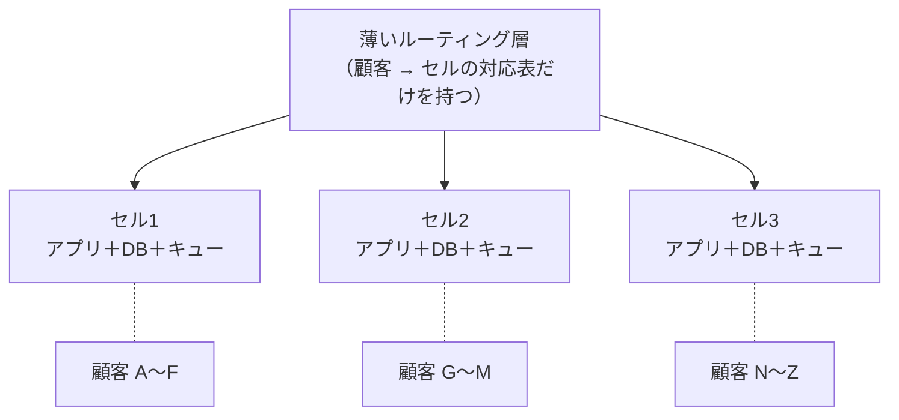

# 10.3 信頼性設計とSLO

> 「絶対に落ちないシステム」は作れませんし、目指すべきでもありません。100% の信頼性を追うと、費用は際限なく膨らみ、新機能は出せなくなり、それでも障害は起きます。問うべきは「どのくらい信頼できれば利用者にとって十分か」「それをどう測り、どう守り、余裕をどう使うか」です。この章では、Google が体系化した SRE（Site Reliability Engineering）の考え方を軸に、可用性の計算、SLI・SLO・エラーバジェット、SLO に基づくアラート、障害の影響範囲を小さくする設計、災害対策とバックアップを、手を動かしながら学びます。

| 項目 | 内容 |
|---|---|
| 学習時間の目安 | 本文 4h ＋ 演習 4h |
| 前提となる章 | [2.2 確率・統計と定量的思考](../../02-math-and-algorithms/02-probability-statistics/README.md)、[7.1 分散システムの本質](../../07-distributed-systems/01-fundamentals/README.md)、[9.5 スケーラビリティとパフォーマンス](../../09-architecture/05-scalability-and-performance/README.md)、[10.1 クラウドコンピューティングとIaC](../01-cloud-and-iac/README.md) |
| 演習 | [exercises/](exercises/)（Python） |
| キーワード | SRE, トイル, 可用性, ナイン, SLI, SLO, SLA, エラーバジェット, バーンレート, 多窓アラート, SPOF, 障害ドメイン, セル, シャッフルシャーディング, 縮退運転, RPO, RTO, DR, 3-2-1 バックアップ, カオスエンジニアリング |

## この章のゴール

- [ ] SRE の原則（リスクの受容・SLO・トイルの削減・自動化・単純さ）を説明できる
- [ ] 直列・並列・クォーラムの構造から可用性を計算し、依存関係が可用性の上限を決めることを説明できる
- [ ] 利用者の体験に基づく SLI を選び、SLO と SLA を区別して設定できる
- [ ] エラーバジェットとその運用ポリシーを設計し、多窓・多バーンレートのアラートを実装できる
- [ ] 冗長化・障害ドメイン・セル・シャッフルシャーディング・縮退運転を使って、障害の影響範囲を小さくする設計を説明できる
- [ ] RPO・RTO と費用・期待損失から DR 戦略を選び、バックアップの復元訓練とカオスエンジニアリングで備えを検証できる

## なぜ学ぶのか

信頼性は、利用者から見れば最も重要な機能です。どれほど優れた機能も、使いたいときに動かなければ価値がありません。一方で、Google の SRE 本の中で Ben Treynor Sloss は「100% は、ほぼあらゆるものにとって間違った信頼性の目標である」と述べています。理由は 3 つあります。

1. **利用者には違いが分からない**: 利用者のスマートフォン、Wi-Fi、通信事業者の回線は、あなたのサービスよりはるかに頻繁に失敗します。99.999% と 100% の差は、その雑音に埋もれて体験されません。
2. **費用が急増する**: ナインを 1 つ増やすたびに、冗長化・自動化・検証にかかる費用と手間は大きくなります。
3. **変化が止まる**: 障害の多くは変更によって起きます。Google の SRE 本は、稼働中のシステムの障害のおよそ 70% が変更によるものだと述べています。100% を目指すなら変更を止めるしかなく、それは製品の死を意味します。

では「どこまでなら十分か」を誰がどう決めるのか。SLO（サービスレベル目標）とエラーバジェットは、この問いに数字で答え、「もっと安定させろ」と「もっと速く出せ」という開発と運用の終わらない対立を、データに基づく合意に変える道具です。信頼性の設計は、技術の問題であると同時に、**事業としてどこにリスクを取るかの意思決定** なのです。

## 1. SRE とは何か

### 1.1 起源と原則

SRE は、2003 年ごろに Google で Ben Treynor Sloss が始めた取り組みで、彼の言葉では「ソフトウェアエンジニアに運用チームを設計させたときに起きること」です。運用を手作業の積み重ねではなく、ソフトウェアで解くべきエンジニアリングの問題として扱います。Google の SRE 本（2016 年）は、その原則を次のようにまとめています。

| 原則 | 意味 |
|---|---|
| リスクの受容（embracing risk） | 信頼性は費用と引き換えであり、目標以上の信頼性は無駄。リスクは管理するもので、ゼロにするものではない |
| サービスレベル目標（SLO） | 利用者にとって重要な指標で目標を決め、それに基づいて判断する |
| トイルの削減 | 手作業の繰り返しを自動化し、エンジニアリングに時間を使う |
| 監視 | 人が画面を見続けるのではなく、症状に基づいて人を呼ぶ（→ [10.4](../04-observability/README.md)） |
| 自動化 | 人の手順をソフトウェアに置き換え、一貫性と速度を得る |
| リリースエンジニアリング | 変更を小さく、段階的に、元に戻せる形で出す（→ [8.4](../../08-software-engineering/04-ci-cd-and-release/README.md)） |
| 単純さ | 複雑さは信頼性の敵。不要なコードや機能を削ることも信頼性の仕事 |

### 1.2 運用作業の上限とトイル

Google の SRE は、チケット対応・オンコール・手作業といった運用作業を **全体の 50% までに制限** し、残りを自動化やシステムの改善といったエンジニアリングに使うことを原則にしています。運用作業が上限を超えたら、あふれた分を開発チームに戻すなどして、改善の時間を確保します。

**トイル（toil）** は、SRE 本の定義では次の性質を持つ作業です: 手作業である、繰り返される、自動化できる、その場しのぎである（戦術的）、長期的な価値を残さない、サービスの成長に比例して増える。証明書の手動更新、ディスクがいっぱいになるたびのログの手動削除、定型的なアカウント発行などが典型です。トイルが問題なのは、サービスが 10 倍に成長すると 10 倍に増え、エンジニアの時間を食い尽くすからです。四半期ごとに「何にどれだけ時間を使ったか」を記録し、トイルの大きいものから自動化する、という地道な計測が出発点になります。

なお、「運用チームの名前を SRE に変える」だけでは何も変わりません。SRE を名乗るなら、運用作業の上限、エラーバジェットに基づく判断、開発チームとの責任分担が伴っている必要があります（組織の形は [13.6](../../13-technical-leadership/06-team-and-org-design/README.md) で扱います）。

## 2. 可用性の数学

### 2.1 ナインの感覚

可用性（availability）は「動いていた時間の割合」または「成功したリクエストの割合」です。目標の数字が、どれだけの停止を許すのかを体に覚えておきましょう。演習 2 の `allowed_downtime` で計算します。

```python
from datetime import timedelta
from slo_calc import allowed_downtime

print("SLO        30日あたり        1年あたり")
for slo in (0.99, 0.995, 0.999, 0.9995, 0.9999, 0.99999):
    print(f"{slo:<9}  {str(allowed_downtime(slo)):<16}  {allowed_downtime(slo, timedelta(days=365))}")
```

```text
SLO        30日あたり        1年あたり
0.99       7:12:00           3 days, 15:36:00
0.995      3:36:00           1 day, 19:48:00
0.999      0:43:12           8:45:36
0.9995     0:21:36           4:22:48
0.9999     0:04:19.200000    0:52:33.600000
0.99999    0:00:25.920000    0:05:15.360000
```

99.99% は 30 日で約 4 分です。人が呼び出されて PC を開き、状況を把握するだけで使い切ってしまいます。**99.99% 以上は、人の対応を前提にできず、自動的な検知と切り替えがなければ達成できない水準** だということが分かります。

可用性は、故障の間隔と復旧の速さでも表せます。平均故障間隔を MTBF、平均復旧時間を MTTR とすると、可用性 ≈ MTBF / (MTBF + MTTR) です。月に 1 回（約 43,200 分に 1 回）故障し、毎回 43 分で復旧するなら約 99.9% になります。**故障を半分に減らすことと、復旧時間を半分にすることは、可用性に対して同じ効果を持ちます**。故障をゼロにはできない以上、検知と復旧を速くする投資（監視、自動フェイルオーバー、素早いロールバック）は、しばしば最も費用対効果が高い投資です。

### 2.2 直列: 依存関係は可用性の上限を決める

あるサービスが、動くために複数の部品をすべて必要とする（直列）なら、全体の可用性は各部品の可用性の積です（故障が独立だと仮定）。

```python
from slo_calc import composite, parallel, quorum, serial

print(round(serial(0.9995, 0.9995, 0.999), 6))          # LB → アプリ → DB（直列）
print(round(parallel(0.99, 0.99), 6))                    # 独立な 2 台の冗長化
print(round(quorum(2, [0.99, 0.99, 0.99]), 6))           # 3 台中 2 台（Raft の過半数）
print(round(quorum(3, [0.99] * 5), 6))                   # 5 台中 3 台
```

```text
0.998001
0.9999
0.999702
0.99999
```

1 行目は、99.95% の部品 2 つと 99.9% の部品 1 つを直列につなぐと、全体は 99.8% になることを示しています。**直列の依存を増やすほど、全体は最も弱い部品よりもさらに弱くなります**。自分のサービスの可用性は、止まると自分も止まる依存先（ハードな依存）の可用性を超えられません。Google の論文 "The Calculus of Service Availability"（ACM Queue, 2017）は、重要な依存先には自分の目標より「ナイン 1 つ分」高い可用性を求めるという経験則を紹介しています。依存先がそれを満たせないなら、依存をなくすか、依存先が止まっても動き続ける設計（キャッシュ、縮退運転、非同期化）が必要です。

### 2.3 並列・冗長化・クォーラム

どれか 1 つが動いていればよい（並列）なら、全体が止まるのは全部が同時に止まるときだけなので、可用性は 1 − Π(1 − aᵢ) です。99% の部品 2 つで 99.99% になります。3 台中 2 台（過半数）が動いていればよいクォーラム型のシステム（Raft を使うデータベースなど、[7.4](../../07-distributed-systems/04-consensus-and-coordination/README.md)）では、99% のノード 3 台で約 99.97%、5 台で約 99.999% です。

### 2.4 独立性の仮定が崩れるとき

上の計算は **故障が互いに独立** だという仮定に立っています。現実には、次のような **共通原因の故障（common-mode failure）** が冗長化を無力にします。

- 同じソフトウェアの同じバグ（全レプリカが同じ入力で同時にクラッシュする）
- 同じ設定変更・同じデプロイ（全台に同時に配られる）
- 同じ証明書やライセンスの期限切れ、同じ時刻のうるう秒の処理
- 同じ AZ・同じ電源・同じネットワーク機器・同じ上流のサービス
- 負荷の連鎖（1 台が落ちると残りに負荷が集中し、次々に落ちる）

2 台の冗長化で「99.99%」と計算しても、両方が同じ変更で同時に壊れるなら意味がありません。**冗長化の計算値は楽観的な上限** だと考え、共通原因をどう断ち切るか（段階的なデプロイ、異なる AZ への分散、依存先の多様化）を合わせて設計します。

### 2.5 システム全体の見積もり

演習 1 の `composite` を使うと、入れ子の構造を持つシステム全体の可用性を見積もれます。

```python
system = ("serial", [
    0.9999,                                              # DNS / CDN
    ("parallel", [0.999, 0.999]),                        # 2 つの AZ のロードバランサ＋アプリ
    ("quorum", 2, [0.995, 0.995, 0.995]),                # 3 AZ に分散した DB クラスタ
    0.9995,                                              # 外部の決済 API（冗長化できない依存）
])
print(round(composite(system), 6))
```

```text
0.999324
```

冗長化した部分はほぼ 100% に近づき、全体の可用性を決めているのは **冗長化していない直列の依存**（ここでは外部の決済 API の 99.95%）だと分かります。可用性を上げたいとき、どこに投資すべきかは、この計算で見えてきます。

## 3. SLI・SLO・SLA

### 3.1 3 つの用語

| 用語 | 意味 | 例 |
|---|---|---|
| SLI（Service Level Indicator, サービスレベル指標） | サービスの水準を表す、測定できる指標 | 成功したリクエストの割合、300 ms 以内に返ったリクエストの割合 |
| SLO（Service Level Objective, サービスレベル目標） | SLI の目標値と期間。社内の約束 | 28 日間のローリング窓で、成功率 99.9% 以上 |
| SLA（Service Level Agreement, サービスレベル合意） | 顧客との契約。守れなかったときの補償（返金・クレジット）を伴う | 月間の稼働率が 99.9% を下回ったら、月額料金の 10% を返金 |

**SLA は SLO より緩く設定します**。SLO を内部の警報線として守ることで、契約違反（SLA 違反）に至る前に手を打てるようにするためです。SLA の返金の計算は [10.5](../05-incident-management/README.md) の演習で扱います。SLA は法務・営業が関わる契約なので、エンジニアリングの実力（過去の SLI の実績）を超える数字を約束させないことが重要です。

### 3.2 利用者の体験に基づく SLI を選ぶ

SLI の良し悪しは、**利用者が不満を感じるときに悪化し、満足しているときに良好であるか** で決まります。CPU 使用率やサーバーの死活は利用者の体験とずれることが多く、SLI には向きません。サービスの種類ごとの典型的な SLI は次の通りです。

| 種類 | 定義の例 | 向いているサービス |
|---|---|---|
| 可用性（availability） | 成功したリクエスト数 / 有効なリクエスト数 | ほぼすべての API・Web |
| レイテンシ（latency） | 閾値（例: 300 ms）以内に返ったリクエストの割合 | 対話的な API・画面 |
| 品質（quality） | 縮退せずに完全な結果を返した割合（おすすめ欄が欠けていないなど） | 縮退運転をするサービス |
| 鮮度（freshness） | 一定時間（例: 10 分）以内に更新されたデータの割合 | データパイプライン・検索インデックス |
| 正確性（correctness） | 正しい出力の割合（検算・突き合わせで判定） | 決済・集計・データ処理 |
| 耐久性（durability） | 書き込んだデータが失われずに読める割合 | ストレージ |

レイテンシは平均ではなく **割合（分位点）** で定義します。平均は少数の極端に遅いリクエストを隠し、また極端に遅いリクエストに引っ張られもします。「リクエストの 99% が 300 ms 以内」のように書きます（分位点の扱いは [10.4](../04-observability/README.md) で詳しく学びます）。

**どこで測るか** も重要です。

| 測定点 | 長所 | 短所 |
|---|---|---|
| アプリケーションのログ・メトリクス | 詳細で扱いやすい | アプリに届かなかった失敗（LB やネットワークの障害）が見えない |
| ロードバランサ | 多くの失敗を捉えられる | クライアント側の問題は見えない |
| 外形監視（synthetic） | 利用者の経路を模擬できる | 実際の利用者の分布とは違う |
| クライアント（RUM） | 利用者の体験そのもの | 雑音が多く、端末や回線の問題も混ざる |

**リクエストベース** の SLI（成功したリクエストの割合）と、**ウィンドウベース** の SLI（「良い分」の割合。例: エラー率が 0.1% 以下だった 1 分間の割合）の違いも押さえておきましょう。リクエストベースはトラフィックの多い時間帯の障害を重く数え、ウィンドウベースは深夜の障害も昼の障害も 1 分は 1 分として数えます。トラフィックの少ないサービスでは、1 件の失敗で 1 分が「悪い分」になるウィンドウベースは厳しすぎることがあります（演習 2 の `window_sli` で両者を比べられます）。

### 3.3 SLO を決める

- **利用者の期待から始める**。「決済の確定ボタンを押してから結果が出るまで」のような、利用者にとって重要な操作の流れ（クリティカル・ユーザー・ジャーニー）ごとに考える。
- **現在の実績を測ってから決める**。実績より高い目標は最初から破綻し、実績より大幅に低い目標は緊張感を失う。まず実績に近い値で始め、利用者の反応と費用を見ながら調整する。
- **100% にしない**。予算がゼロになり、どんな変更も許されなくなる。
- **数を絞る**。サービスごとに 2〜4 個程度。全部を測ると、どれも守られなくなる。
- **期間を決める**。28 日や 30 日のローリング窓が一般的。暦月の窓は月初に予算が回復するため、月末の判断が歪みやすい。
- **文書にし、合意する**。SLO は SRE だけのものではなく、プロダクトの責任者と合意した「どこまでの不安定さなら許容するか」の約束。

| 項目 | 例 |
|---|---|
| サービス | 決済 API |
| SLI（可用性） | ロードバランサで観測した、`/v1/payments` への有効なリクエスト（4xx のうちクライアントの誤りは除く）のうち、5xx と タイムアウト以外で応答した割合 |
| SLI（レイテンシ） | 同じリクエストのうち、ロードバランサで 500 ms 以内に応答した割合 |
| SLO | 28 日のローリング窓で、可用性 99.95%、レイテンシ 99% |
| 根拠 | 過去 90 日の実績は可用性 99.97%・レイテンシ 99.4%。主要顧客との SLA は 99.9% |
| 責任者 | 決済チームのプロダクトマネージャーとテックリード |

## 4. エラーバジェット

### 4.1 予算は「使ってよい不安定さ」

SLO が 99.9% なら、残りの 0.1% が **エラーバジェット**（許される失敗の量）です。28 日間に 1,000 万リクエストあるなら、1 万件までは失敗してよい、ということです。

```python
from slo_calc import error_budget

status = error_budget(0.999, good=9_994_000, total=10_000_000)
print(status.bad, round(status.allowed_bad), f"{status.consumed:.0%}", f"{status.remaining:.0%}")
```

```text
6000 10000 60% 40%
```

予算は、守るべき制約であると同時に **使ってよい資源** です。予算が余っているなら、リスクのある変更（大きな移行、新しいインフラへの切り替え、実験的な機能）に使えます。逆に、毎期間ほとんど使い切らずに終わるなら、SLO が緩すぎるか、変更を出すのに慎重すぎる可能性があります。

### 4.2 エラーバジェットポリシー

予算の数字だけでは行動は変わりません。**予算を使い切ったときに何をするかを、事前にプロダクトの責任者と合意しておく** のがエラーバジェットポリシーです。Google の SRE ワークブックに載っている例を参考に、典型的な内容を示します。

- 予算が残っている間は、SLO を理由にリリースを止めない。
- 28 日の窓で予算を使い切ったら、信頼性の改善とセキュリティの修正を除き、新機能のリリースを止める。予算が回復するまで、チームの時間を信頼性の改善（ポストモーテムの対策、テストの追加、自動化）に振り向ける。
- 1 回の障害で予算の一定割合（ワークブックの例では 20%）以上を消費したら、必ずポストモーテムを書き、優先度の最も高い対策を実施する。
- 依存先の障害や、SLO の定義の誤りが原因の場合の扱い（凍結の対象外にするか）。
- 意見が合わないときの判断者（例: CTO）。

ポリシーの価値は、障害のたびに「リリースを止めるか」を感情で議論しなくて済むことにあります。**数字が合意済みのルールを発動させる** ので、開発チームと運用チームは同じ目標（予算を守りつつ、できるだけ速く出す）を共有できます。

## 5. SLO に基づくアラート

### 5.1 素朴な方法とその限界

「直近 5 分のエラー率が 0.1% を超えたら呼び出す」という素朴なアラートは、SLO に対して敏感すぎます。短時間のわずかなエラーの増加は、予算をほとんど減らさないのに人を起こします。逆に「直近 24 時間」のような長い窓だけにすると、全面停止でも気づくのが遅れ、しかも回復した後もしばらく鳴り続けます。**知りたいのは「エラーがあるか」ではなく「このペースだと予算がいつ尽きるか」** です。

### 5.2 バーンレート

**バーンレート（burn rate）** は、エラー率が SLO の許すエラー率の何倍かを表します。

```text
バーンレート = 観測したエラー率 / (1 − SLO)
```

バーンレート 1 は「SLO の期間のちょうど終わりに予算を使い切る速さ」、バーンレート 14.4 は 30 日の予算を 30 × 24 ÷ 14.4 = 50 時間で使い切る速さです。「30 日の予算の 2% を 1 時間で消費した」はバーンレートで言えば 0.02 × 720 時間 ÷ 1 時間 = 14.4 です。

### 5.3 多窓・多バーンレートのアラート

Google の SRE ワークブックは、30 日の SLO に対して次の組み合わせを推奨しています。

| 重大度 | 予算の消費 | 長い窓 | 短い窓 | バーンレートの閾値 |
|---|---|---|---|---|
| 呼び出し（page） | 2% | 1 時間 | 5 分 | 14.4 |
| 呼び出し（page） | 5% | 6 時間 | 30 分 | 6 |
| チケット（ticket） | 10% | 3 日 | 6 時間 | 1 |

閾値が表の通りになることを確かめ、エラー率に直してみます（99.9% の SLO の場合）。

```python
from slo_calc import multiwindow_rules

slo = 0.999
for rule in multiwindow_rules():
    print(f"{rule.name:10} 長い窓 {rule.long_window:>4} 分 / 短い窓 {rule.short_window:>3} 分  閾値 {rule.threshold:5.1f}"
          f"  → エラー率 {rule.threshold * (1 - slo):.2%} 超で発火")
print()
page = multiwindow_rules()[0]
for error_ratio in (1.0, 0.1, 0.05, 0.02):
    burn = error_ratio / (1 - slo)
    # 平常時のエラーを無視すると、長い窓の平均が閾値を超えるまでの時間 = 窓 × 閾値 / バーンレート
    minutes = page.long_window * page.threshold / burn
    print(f"エラー率 {error_ratio:>6.2%}（バーンレート {burn:6.1f}）: page-1h の検知まで 約 {minutes:5.1f} 分")
```

```text
page-1h    長い窓   60 分 / 短い窓   5 分  閾値  14.4  → エラー率 1.44% 超で発火
page-6h    長い窓  360 分 / 短い窓  30 分  閾値   6.0  → エラー率 0.60% 超で発火
ticket-3d  長い窓 4320 分 / 短い窓 360 分  閾値   1.0  → エラー率 0.10% 超で発火

エラー率 100.00%（バーンレート 1000.0）: page-1h の検知まで 約   0.9 分
エラー率 10.00%（バーンレート  100.0）: page-1h の検知まで 約   8.6 分
エラー率  5.00%（バーンレート   50.0）: page-1h の検知まで 約  17.3 分
エラー率  2.00%（バーンレート   20.0）: page-1h の検知まで 約  43.2 分
```

深刻な障害ほど速く、軽い障害ほどゆっくり検知されます。これは欠点ではなく意図された性質です。エラー率 2% の障害は、予算を急速には減らさないので、43 分後に呼び出しても SLO は守れます。

**短い窓** は、アラートを素早く止めるためにあります。演習 3 の `evaluate_alerts` で、平常時のエラー率 0.05% のサービスに 60 分間のエラー率 10% の障害を起こし、各ルールが発火していた区間を障害の開始からの分で表示します。

```python
from slo_calc import AlertRule, evaluate_alerts, multiwindow_rules

WARMUP = 3 * 24 * 60
series = []
for t in range(WARMUP + 24 * 60):
    bad = 1 if t % 2 == 1 else 0                  # 平常時: エラー率 0.05%（バーンレート 0.5）
    if WARMUP + 600 <= t < WARMUP + 660:          # 60 分間、エラー率 10% の障害
        bad = 100
    series.append((1000 - bad, 1000))

rules = multiwindow_rules() + [AlertRule("long-only", 60, 60, 14.4)]
for name, intervals in evaluate_alerts(series, 0.999, rules).items():
    print(f"{name:10}", [(start - WARMUP - 600, end - WARMUP - 600) for start, end in intervals])
```

```text
page-1h    [(8, 64)]
page-6h    [(19, 88)]
ticket-3d  [(21, 418)]
long-only  [(8, 111)]
```

障害は 0〜60 分です。1 時間窓の呼び出し（page-1h）は 8 分後に鳴り、障害が終わった 4 分後に止まります。短い窓を持たない `long-only` は、回復してから 51 分も鳴り続けます。回復後も鳴り続けるアラートは、対応者に「まだ何か起きているのか」と無駄な調査をさせ、アラートへの信頼を損ないます。

実際の監視システムでは、Prometheus のクエリで同じ条件を書きます（ルールの例です。メトリクス名は環境によって異なります）。

```text
(
  sum(rate(http_requests_total{job="payments", code=~"5.."}[1h]))
    / sum(rate(http_requests_total{job="payments"}[1h]))
) > (14.4 * 0.001)
and
(
  sum(rate(http_requests_total{job="payments", code=~"5.."}[5m]))
    / sum(rate(http_requests_total{job="payments"}[5m]))
) > (14.4 * 0.001)
```

トラフィックがごく少ないサービスでは、数件の失敗でバーンレートが跳ね上がるため、合成リクエスト（外形監視）でトラフィックを補う、複数のサービスをまとめて SLO を設定する、といった工夫が必要になります。

## 6. 冗長化と障害ドメイン

### 6.1 単一障害点をなくす

**単一障害点（SPOF, Single Point of Failure）** は、それが止まると全体が止まる部品です。1 台しかない DB、1 つしかない NAT ゲートウェイ、1 人しか操作を知らない手順、期限切れで一斉に失効する 1 枚の証明書なども SPOF です。冗長化の基本は **N+1**（必要な数 N に 1 つ予備を足す）で、保守で 1 台止めている最中にもう 1 台が故障しても耐えるなら **N+2** にします。予備があるだけでなく、**予備に切り替わることを定期的に確かめる** ことが重要です。使ったことのないフェイルオーバーは、必要なときに動かないことがよくあります。

### 6.2 障害ドメインと影響範囲

**障害ドメイン（failure domain）** は、同じ原因で一緒に故障する範囲です。プロセス → ホスト → ラック → AZ → リージョン、そして「同じデプロイ」「同じ設定」「同じ顧客」も障害ドメインです。設計の目標は、1 つの障害ドメインの故障の **影響範囲（blast radius）** を小さく保つことです。

- 複数の AZ に分散し、1 つの AZ を失っても残りで処理できる容量を常に持つ（AWS はこれを「静的安定性（static stability）」と呼び、障害時に新しい資源を作らなくても動き続けられる設計を推奨しています）。
- デプロイと設定変更を、1 台 → 1 つの AZ → 1 つのリージョン → 全体、のように **障害ドメインの単位で段階的に** 進める。変更は最大の共通原因なので、これが最も効く。

### 6.3 セル型アーキテクチャ

システム全体を、同じ構成の独立した小さなコピー（**セル**）に分け、顧客をいずれかのセルに割り当てる設計です。1 つのセルの障害や、不正なリクエストによる過負荷は、そのセルの顧客にしか影響しません。AWS は、この考え方を解説するホワイトペーパーを公開しています。



セルの利点は影響範囲の限定だけではありません。セルの大きさに上限を設ければ、「1 セルで試験済みの規模」を超えることがなく、容量の増加はセルの追加で行えます。デプロイもセル単位で段階的に進められます。代償は、ルーティング層の設計、セルをまたぐ処理（全顧客の集計など）、セル間での顧客の移動の難しさです。

### 6.4 シャッフルシャーディング

顧客を固定のグループに分けるだけだと、あるグループの 1 顧客が「毒になるリクエスト」を送ると、同じグループの全顧客が巻き込まれます。**シャッフルシャーディング（shuffle sharding）** は、各顧客にワーカーの **組み合わせ** をランダムに割り当てることで、この巻き添えを劇的に減らします。AWS の Builders' Library の例と同じ設定で計算してみます。

```python
from itertools import combinations

workers = range(8)
shards = list(combinations(workers, 2))       # 各顧客に 8 台から 2 台を割り当てる
print(len(shards))                             # 組み合わせの数

poison = (0, 1)                                # 毒になるリクエストを送る顧客の割り当て
full = sum(1 for s in shards if set(s) == set(poison))
partial = sum(1 for s in shards if len(set(s) & set(poison)) == 1)
print(full, partial, len(shards) - full - partial)
```

```text
28
1 12 15
```

8 台を 2 台ずつの固定グループに分けると、毒の顧客と同じグループの顧客（全体の 1/4）は完全に止まります。シャッフルシャーディングでは、2 台とも同じ組み合わせを持つのは 28 通りのうち 1 通り（約 3.6%）だけで、1 台だけ重なる組み合わせ（12 通り）の顧客は、クライアントが残りの 1 台に再試行すれば処理を続けられます。ワーカーや 1 顧客あたりの台数を増やせば、完全に巻き込まれる確率はさらに急速に小さくなります。

### 6.5 縮退運転と依存関係の管理

全部が動くか全部が止まるか、の二択にしないことも重要です。

- **縮退運転（graceful degradation）**: おすすめ機能が止まっても商品ページは表示する、画像の変換が遅いときは元画像を返す、といった具合に、核となる機能を守って周辺の機能を落とす。
- **負荷制限（load shedding）**: 処理しきれない負荷は、早めに（安く）断る。すべてを受け付けて全員を遅くするより、一部を即座に断って残りを正常に処理する方がよい。優先度の低いリクエストから断る。
- **依存関係の分類**: 依存先を「止まると自分も止まる（ハード）」と「止まっても縮退して動ける（ソフト）」に分類し、ハードな依存を減らす。
- **タイムアウト・リトライ・サーキットブレーカー・バルクヘッド**: 遅い依存先に引きずられて全体が詰まるのを防ぐ。リトライは指数バックオフとジッターを付け、回数を制限する（リトライが負荷を増幅して障害を広げることがある）。詳しくは [9.5](../../09-architecture/05-scalability-and-performance/README.md) で扱います。

## 7. 災害対策（DR）とバックアップ

### 7.1 RPO と RTO

大規模な障害（リージョンの停止、データの破損、ランサムウェア）からの復旧の要件は、2 つの数字で表します。

```text
   最後に確実に保存・複製された時点         災害の発生               サービスの再開
 ────────────●──────────────────────────────●──────────────────────────────●────▶ 時間
             │←────────── RPO ────────────→│←─────────── RTO ────────────→│
             （失いうるデータの時間幅）         （停止していてよい時間）
```

- **RPO（Recovery Point Objective, 目標復旧時点）**: どこまでのデータを失ってよいか。1 日 1 回のバックアップなら RPO は最大 24 時間。
- **RTO（Recovery Time Objective, 目標復旧時間）**: 災害の発生から、どれだけの時間でサービスを再開すべきか。

RPO と RTO を小さくするほど費用は上がります。そして、**要件は技術者ではなく事業が決めるもの** です。「決済は 1 分以上のデータを失えない」「社内の分析基盤は 1 日止まってもよい」といった判断は、事業への影響から導きます。

### 7.2 4 つの DR 戦略

AWS の Well-Architected Framework などで紹介されている、代表的な 4 つの戦略です（RPO・RTO は典型的な目安で、実装によって大きく変わります）。

| 戦略 | 平常時の DR 側 | RPO の目安 | RTO の目安 | 費用 |
|---|---|---|---|---|
| バックアップと復元 | バックアップだけを別の場所に保存 | 時間〜1 日 | 時間〜日 | 低 |
| パイロットライト | データは常時複製。アプリのサーバーは止めておき、災害時に起動・拡張 | 分 | 数十分〜時間 | 中 |
| ウォームスタンバイ | 縮小した環境を常時稼働。災害時に拡張して切り替え | 秒〜分 | 分 | 中〜高 |
| マルチサイト（アクティブ・アクティブ） | 複数の拠点で本番を稼働 | ほぼゼロ | ほぼゼロ〜分 | 高 |

どの戦略でも、**切り替えの手順が訓練されていなければ RTO は守れません**。DR 環境への切り替えを年に 1 回も試していない組織の RTO は、紙の上の数字にすぎません。

### 7.3 費用と期待損失で選ぶ

DR の投資判断は、**年間期待損失（ALE, Annualized Loss Expectancy）** = 発生頻度 × 1 回あたりの損失 を使うと、費用と比較できる形になります。演習 4・5 では、架空の数値の戦略表を使って、サービスごとに「年間費用 + 年間期待損失」が最小の戦略を選びます。

```python
from dr_planner import EXAMPLE_STRATEGIES, Service, allocate_budget, best_strategy

for s in EXAMPLE_STRATEGIES:
    print(f"{s.name:15} RPO {s.rpo_minutes:>5} 分  RTO {s.rto_minutes:>5} 分  年間 {s.annual_cost:>5} 万円")
print()
services = [
    Service("payments", disasters_per_year=0.1, downtime_cost_per_hour=500, data_loss_cost_per_hour=300,
            max_rto_minutes=60),                                     # 契約上 RTO 60 分が必須
    Service("catalog", disasters_per_year=0.1, downtime_cost_per_hour=100, data_loss_cost_per_hour=20),
    Service("reports", disasters_per_year=0.1, downtime_cost_per_hour=5, data_loss_cost_per_hour=2),
]
for svc in services:
    strategy, total = best_strategy(EXAMPLE_STRATEGIES, svc)
    print(f"{svc.name:9} → {strategy.name:15} 費用＋期待損失 {total:7.1f} 万円/年")
print(allocate_budget(services, EXAMPLE_STRATEGIES, budget=1200))
```

```text
backup-restore  RPO  1440 分  RTO  1440 分  年間    60 万円
pilot-light     RPO    15 分  RTO   240 分  年間   300 万円
warm-standby    RPO     1 分  RTO    30 分  年間   900 万円
active-active   RPO     0 分  RTO     1 分  年間  2400 万円

payments  → warm-standby    費用＋期待損失   925.5 万円/年
catalog   → pilot-light     費用＋期待損失   340.5 万円/年
reports   → backup-restore  費用＋期待損失    76.8 万円/年
Allocation(choices={'payments': 'warm-standby', 'catalog': 'backup-restore', 'reports': 'backup-restore'}, annual_cost=1020, expected_total=1350.3)
```

損失の大きい決済には高価な戦略が、損失の小さいレポートには安い戦略が選ばれます。予算が 1,200 万円に制約されると、影響の小さい catalog を格下げして、契約上の要件がある決済を守ります。**すべてを最高の DR にするのでも、すべてを同じ水準にするのでもなく、事業への影響に応じて配分する** のが合理的な判断です。

ただし、この計算は発生頻度と損失の見積もりに強く依存します。発生頻度は小さく、見積もりの誤差は大きいので、数字は「議論の土台」として使い、事業側と前提を合意することが重要です。評判の毀損や規制上の制裁のように金額にしにくい損失は、必須の要件（この演習の `max_rto_minutes` など）として扱います。

### 7.4 バックアップ

レプリケーションはバックアップの代わりになりません。誤って実行した `DELETE` やデータを壊すバグは、数ミリ秒でレプリカにも複製されます。バックアップの原則は次の通りです。

- **3-2-1 ルール**: データのコピーを 3 つ持ち、2 種類の異なる媒体に保存し、1 つは別の場所（別リージョン・別アカウント）に置く。近年は、1 つを変更不可能（オフラインやイミュータブル）にし、復元の検証でエラーが 0 であることを確かめる「3-2-1-1-0」という拡張も語られます。
- **変更・削除できないバックアップ**: オブジェクトストレージの WORM（Write Once Read Many）機能（S3 の Object Lock など）や、バックアップ保管庫のロック機能で、保存期間中は管理者でも削除できないようにする。本番アカウントの管理者権限を奪われても、バックアップは守られる（[10.1](../01-cloud-and-iac/README.md) の Code Spaces の教訓）。
- **暗号鍵の管理**: バックアップを暗号化する鍵を失えば、バックアップも失ったのと同じ。鍵の保管とアクセス権も DR の対象にする。
- **定期的な復元訓練**: バックアップが取れていることではなく、**復元できることを定期的に確かめる**。復元にかかる時間も測り、RTO を満たせるか確認する。2017 年の GitLab.com のデータベースの障害では、複数のバックアップの仕組みが実は機能していなかったことが、障害対応の最中に判明しました（→ [10.5](../05-incident-management/README.md)）。
- **ポイントインタイムリカバリ**: DB のトランザクションログを保存しておけば、「誤操作の直前」の任意の時点に戻せる（[6.4](../../06-databases/04-storage-and-recovery/README.md) の WAL の応用）。

### 7.5 ランサムウェアへの備え

ランサムウェアの攻撃者は、暗号化の前に **バックアップを探して削除する** ことが知られています。本番と同じ認証情報で消せるバックアップは、ランサムウェアに対してはバックアップになりません。別アカウント・削除できない保存期間・鍵の分離に加えて、「どのバックアップが汚染されていない最後のものか」を判断するための監査ログと、隔離した環境で復元する手順を用意しておきます。セキュリティ事故としての対応は [14.6 危機管理](../../14-cto/06-crisis-management/README.md) で扱います。

## 8. 変更の管理とカオスエンジニアリング

### 8.1 変更が障害の主因

障害の多くが変更から生まれる以上、信頼性の中心的な仕事は **変更を安全にすること** です。

- **段階的な公開（プログレッシブデリバリー）**: カナリアリリース（一部の利用者・一部のサーバーから）、障害ドメインの単位での段階的な展開、フィーチャーフラグによる公開と実装の分離。
- **自動ロールバック**: カナリアの SLI が悪化したら、人の判断を待たずに戻す。
- **設定も変更**: 設定の変更、データの移行、証明書の更新、依存ライブラリの更新も、コードと同じように段階的に出す。

詳しい手法は [8.4 CI/CD とリリースエンジニアリング](../../08-software-engineering/04-ci-cd-and-release/README.md) で扱います。「障害が多いからリリースを止める」は短期的には効いても、変更が溜まって 1 回のリリースが大きくなり、かえって危険になります。エラーバジェットは、止めるべきときと進めてよいときを判断する基準です。

### 8.2 カオスエンジニアリング

冗長化やフェイルオーバーが本当に機能するかは、実際に壊してみないと分かりません。Netflix は 2010 年代初めに、本番環境のインスタンスを営業時間中にランダムに停止する Chaos Monkey を作り、エンジニアが「インスタンスはいつでも消えうる」前提で設計せざるを得ない状況を作りました。この実践は **カオスエンジニアリング** として体系化され、"Principles of Chaos Engineering" は次の原則を挙げています。

1. 定常状態（正常時の SLI など、測定できる出力）について仮説を立てる
2. 現実に起きうる事象（サーバーの停止、遅延、依存先の障害）を変数として注入する
3. 本番環境で実験する（ただし段階を踏んで）
4. 実験を自動化して継続的に実行する
5. 影響範囲を最小にする

実験は、仮説（「1 つの AZ のインスタンスを止めても、p99 レイテンシは 500 ms 以内、成功率は 99.9% 以上を保つ」）、影響範囲の限定（一部のトラフィック・一部のセル）、**中止の条件**（SLI が閾値を下回ったら即座に止める）を決めてから行います。最初はステージング環境で、次に本番の小さな範囲で始めます。目的は壊すことではなく、**自信を持てていない前提を、制御された状況で検証すること** です。

### 8.3 ゲームデー

**ゲームデー** は、障害のシナリオを計画的に再現し、チームで対応を訓練する日です。技術的な仕組み（フェイルオーバー、バックアップからの復元、DR 環境への切り替え）と、人の対応（検知、エスカレーション、コミュニケーション）の両方を検証します。机上で手順をたどる机上演習（テーブルトップ演習）から始めるのも有効です。インシデント対応の訓練としての側面は [10.5](../05-incident-management/README.md) で扱います。

## よくある落とし穴

1. **SLO を 100% や、実績より高い値にする**。予算がゼロかマイナスになり、ポリシーが常に発動して誰も守らなくなる。実績を測ってから、利用者の期待と費用に基づいて決める。
2. **CPU 使用率やサーバーの死活を SLI にする**。利用者の体験とずれ、障害を見逃したり無駄に呼び出したりする。利用者から見た成功率・レイテンシ・鮮度などを、なるべく利用者に近い場所で測る。
3. **レイテンシの SLO を平均値で定義する**。平均は一部の遅いリクエストを隠す。「99% が 300 ms 以内」のように割合で定義する。
4. **エラーバジェットポリシーを事前に合意しない**。予算を使い切った時点で「リリースを止めるか」の議論が始まり、結局止まらない。プロダクトの責任者と文書で合意し、判断者を決めておく。
5. **エラー率の閾値だけでアラートする**。短時間の揺らぎで夜中に起こされ、アラートが無視されるようになる。バーンレートに基づき、長い窓と短い窓を組み合わせる。
6. **冗長化の計算値をそのまま信じる**。同じデプロイ・同じバグ・同じ証明書といった共通原因で、冗長な部品が同時に止まる。段階的な変更と、障害ドメインへの分散を組み合わせる。
7. **レプリケーションをバックアップだと思う**。誤操作も破損もすぐに複製される。別アカウントの、削除できない、復元を訓練したバックアップを持つ。
8. **DR 環境への切り替えを一度も試さない**。手順は古くなり、権限や容量が足りず、必要なときに動かない。ゲームデーで定期的に切り替え、RTO を実測する。

## CTOの視点

1. **SLO は経営の言葉に翻訳できる**。「決済の SLO 99.95%、今月は予算の 60% を消費、主因は依存先の障害」という報告は、「サイトが何回か落ちました」よりはるかに建設的な議論を生みます。取締役会や顧客への説明でも、SLO と実績の推移は信頼性の状況を示す客観的な材料になります。重要なサービスの SLO と予算の消費状況を、経営のダッシュボードに載せましょう。
2. **信頼性への投資は「ナイン 1 つ分の費用」で判断する**。99.9% から 99.99% にするには、マルチ AZ の徹底、自動フェイルオーバー、段階的デプロイの整備、オンコールの強化などが必要で、費用も開発速度への影響も大きくなります。「その 0.09% の改善で、失わずに済む売上や顧客はどれだけか」を事業側と一緒に見積もり、投資するサービスと、しないサービスを決めるのが CTO の仕事です。
3. **SLA は営業ではなくエンジニアリングの実績で決める**。大口顧客の要求に合わせて実績以上の SLA を約束すると、返金と信頼の失墜の両方を招きます。SLA の数字を決めるときは、過去の SLI の実績と、SLO との余裕を必ず確認し、法務と一緒に「何を停止とみなすか」の定義まで詰めましょう。
4. **DR は保険であり、訓練していない保険は支払われない**。DR の方針（サービスごとの RPO/RTO と戦略）を事業側と合意して文書にし、年 1 回以上の切り替え訓練と、四半期ごとのバックアップの復元訓練を予算と計画に組み込みます。障害対応の場で「バックアップから戻せるはず」という言葉を聞いたら、「最後に復元を試したのはいつか」を問いましょう。
5. **設計レビューでは、影響範囲と依存関係を問う**。「この変更はどの単位で段階的に出すか」「この依存先が 1 時間止まったら何が起きるか」「1 つの AZ を失ったとき、残りで処理できるか」「1 顧客の異常なリクエストが全顧客に波及しないか」。これらに答えられない設計は、いずれ大きな障害を起こします。

## 演習

演習コードは [exercises/slo_calc.py](exercises/slo_calc.py) と [exercises/dr_planner.py](exercises/dr_planner.py) にあります。関数の docstring に仕様が書いてあるので、`raise NotImplementedError(...)` を実装に置き換えてください。解答例は [solutions/](solutions/) にあります。

```bash
python3 tools/check.py 10.3        # リポジトリのルートで実行
python3 tools/check.py -v 10.3     # 詳しい出力
```

| # | 難易度 | 内容 | 対象ファイル / 関数 |
|---|---|---|---|
| 1 | ★☆☆ | 直列・並列・クォーラム・入れ子の構造からの可用性の計算 | `slo_calc.py`: `serial`, `parallel`, `quorum`, `composite` |
| 2 | ★☆☆ | 許容ダウンタイム、ナイン、エラーバジェット、バーンレート、ウィンドウベースの SLI | `slo_calc.py`: `allowed_downtime`, `nines`, `error_budget`, `burn_rate`, `window_sli` |
| 3 | ★★★ | 多窓・多バーンレートのアラート評価（分単位の時系列、累積和による高速化） | `slo_calc.py`: `threshold_for`, `multiwindow_rules`, `evaluate_alerts` |
| 4 | ★★☆ | DR 戦略の選択（要件・費用・年間期待損失） | `dr_planner.py`: `meets`, `cheapest_strategy`, `expected_annual_loss`, `best_strategy` |
| 5 | ★★★ | 予算の制約の下での DR 戦略の配分（動的計画法） | `dr_planner.py`: `allocate_budget` |
| 6 | ★★☆ | 記述: SLO 文書とエラーバジェットポリシーの作成（下記） | — |

演習 3 のテストは、3 日分の助走をつけた数千分の時系列でアラートを評価します。窓の合計を毎回数え直すと遅いので、累積和を使いましょう。演習 5 のテストは、ランダムに作った問題で総当たりの答えと一致するかを確かめます。

### 演習 6（記述）: SLO とエラーバジェットポリシー

あなたは、日本の中小企業向けに勤怠管理 SaaS を提供する会社のテックリードです。サービスの特徴は次の通りです。

- 利用者は平日の 8〜10 時と 17〜19 時に打刻が集中する。月末の締め日には管理者が集計画面を使う。
- 打刻 API（スマホアプリと IC カード端末から呼ばれる）、管理画面、月次の給与データ出力（CSV）の 3 つの機能がある。
- 過去 90 日の実績: 打刻 API の成功率 99.96%、p99 レイテンシ 420 ms。管理画面の成功率 99.8%。給与データ出力は月に 1〜2 回失敗して手動で再実行している。
- 大口顧客との契約で「月間稼働率 99.5%」を SLA として約束している。

次の内容を含む SLO 文書とエラーバジェットポリシーを書いてください。

1. 機能ごとの SLI（何を、どこで測るか）と SLO（目標値と期間）、その根拠
2. SLO 違反を検知するアラートの設計（呼び出しとチケットの区別）
3. エラーバジェットポリシー（予算を使い切ったときの行動、例外、判断者）
4. SLA との関係についての注意点

<details>
<summary>解答例</summary>

**1. SLI と SLO**

| 機能 | SLI | SLO | 根拠 |
|---|---|---|---|
| 打刻 API（可用性） | ロードバランサで観測した有効なリクエストのうち、5xx とタイムアウト以外の割合 | 28 日のローリング窓で 99.9% | 実績 99.96%。打刻できないと労務管理に直結し、利用者の不満が大きい。端末側で再送できるなら 99.9% で十分 |
| 打刻 API（レイテンシ） | 同じリクエストのうち 1 秒以内に応答した割合 | 99% | 端末の前に人が並ぶので、秒単位の遅延は体験を損なう。p99 の実績 420 ms から余裕を持たせる |
| 管理画面 | 主要な画面の読み込みリクエストの成功率 | 99.5% | 実績 99.8%。打刻より重要度は低い |
| 給与データ出力 | 締め日の翌営業日の 9 時までに、正しい（件数と合計の突き合わせが一致した）ファイルが生成された割合（鮮度＋正確性） | 月次で 99%（実質的に全件） | 給与計算の遅れは顧客の業務と従業員の給与に影響するため、「成功率」より「期限内に正しく」を測る |

ピーク時間帯のトラフィックが多いので、リクエストベースの SLI にすると、ピーク時の障害が適切に重く数えられる。

**2. アラート**

- 打刻 API: 1 時間窓 / 5 分窓でバーンレート 14.4（呼び出し）、6 時間窓 / 30 分窓で 6（呼び出し）、3 日窓 / 6 時間窓で 1（チケット）。深夜はトラフィックが少なく誤報が出やすいので、外形監視の合成リクエストで補う。
- 給与データ出力: 締め日の処理の開始・完了・突き合わせの結果を監視し、期限の 3 時間前までに完了しなければ呼び出す（鮮度の SLI は事後にしか分からないので、予兆で呼ぶ）。

**3. エラーバジェットポリシー**

- 予算が残っている間は、SLO を理由にリリースを止めない。
- 打刻 API の 28 日の予算を使い切ったら、信頼性とセキュリティの修正以外のリリースを止め、予算が回復する（直近 28 日の消費が 100% を下回る）まで改善を優先する。
- 1 回の障害で予算の 20% 以上を消費したら、ポストモーテムを必須とし、最優先の対策を次のスプリントで実施する。
- 締め日の前後 2 営業日は、給与データ出力に関わる変更を原則として出さない（事前に合意した例外）。
- クラウド事業者の障害が原因でも予算の消費には数えるが、凍結の対象にするかは CTO が判断する。意見が合わない場合も CTO が判断する。

**4. SLA との関係**

- SLA の 99.5% は打刻 API の SLO 99.9% より緩く、SLO を守れば SLA も守れる関係になっている。SLA を引き上げる要求があっても、実績と SLO の余裕を超えて約束しない。
- SLA の「稼働率」の定義（何を停止とみなすか、計画メンテナンスの扱い、測定点）を、SLI の定義と揃えるよう法務と調整する。定義がずれていると、SLO は守れているのに SLA 違反を主張される（またはその逆の）事態になる。

採点の観点:

- 機能ごとに利用者の体験に基づく SLI（どこで測るかを含む）を選び、実績に基づいて 100% でない SLO を設定できていれば合格ライン。
- 給与データ出力に鮮度・正確性の SLI を選べていること、バーンレートによるアラート、事前に合意した例外と判断者を含むポリシー、SLA と SLO の関係まで書けていれば、実務で使える水準です。

</details>

## 理解度チェック

**Q1. SLO を 100% にすべきでない理由を 3 つ挙げてください。**

<details>
<summary>解答</summary>

- 利用者には区別できない: 利用者の端末や回線はサービスよりはるかに頻繁に失敗するので、極めて高い信頼性の差は体験されない。
- 費用が急増する: ナインを 1 つ増やすごとに冗長化・自動化・検証の費用が大きくなり、100% には到達できない。
- 変更ができなくなる: 障害の多くは変更で起きるため、100% を目指すと変更を止めるしかなく、製品の改善が止まる。エラーバジェットがゼロになり、どんな変更も許されない。

</details>

**Q2. API サーバーを 2 つの AZ に冗長化しています（各 AZ 側の可用性 99.9%、故障は独立と仮定）。この API は、可用性 99.9% の DB と 99.99% の認証サービスに直列に依存しています。全体の可用性を概算し、改善の優先順位を述べてください。**

<details>
<summary>解答</summary>

API サーバーの部分は並列で 1 − 0.001² = 0.999999 です。全体は 0.999999 × 0.999 × 0.9999 ≈ 0.99889、つまり約 99.89% になります。

全体を決めているのは直列の依存のうち最も弱い DB（99.9%）です。改善の優先順位は、DB の可用性を上げる（マルチ AZ のフェイルオーバー、クォーラム型の構成）ことが第一で、API サーバーのさらなる冗長化はほとんど効果がありません。また、故障の独立性の仮定が崩れる共通原因（同じデプロイで API サーバーの両 AZ が同時に壊れるなど）にも注意が必要です。

</details>

**Q3. SLI・SLO・SLA の違いと、SLA を SLO より緩く設定する理由を説明してください。**

<details>
<summary>解答</summary>

SLI はサービスの水準を表す測定できる指標（成功率など）、SLO はその目標値と期間（28 日で 99.9% など、社内の約束）、SLA は顧客との契約で、守れなかったときの補償（返金など）を伴うものです。

SLA を SLO より緩くするのは、SLO を内部の警報線として使うためです。SLO の予算を消費し始めた段階で改善に動けば、契約違反（SLA 違反）に至る前に手を打てます。SLA と SLO が同じだと、SLO を少しでも割った時点で即座に返金が発生し、対処の余地がありません。

</details>

**Q4. SLO が 99.9%（30 日）のサービスで、直近 1 時間のエラー率が 3% でした。バーンレートはいくつで、このペースが続くと予算を何時間で使い切りますか。**

<details>
<summary>解答</summary>

バーンレート = 0.03 / 0.001 = 30 です。30 日（720 時間）の予算を 30 倍の速さで消費するので、720 / 30 = 24 時間で使い切ります。1 時間窓のルール（閾値 14.4）を超えているので、短い窓（5 分）でもエラーが続いていれば呼び出しが発火します。

</details>

**Q5. 多窓・多バーンレートのアラートで「短い窓」が必要な理由を説明してください。**

<details>
<summary>解答</summary>

長い窓（例: 1 時間）だけでアラートを判定すると、障害が終わった後も窓の中に失敗が残るため、しばらくの間（最大で窓の長さ近く）アラートが鳴り続けます。対応者は「まだ何かが起きているのか」と無駄な調査をし、アラートへの信頼が損なわれます。短い窓（例: 5 分）でも閾値を超えていることを条件に加えると、「今もエラーが続いている」ときだけ発火するので、回復後すぐにアラートが止まります。長い窓は「予算を本当に削っているか」を、短い窓は「今も続いているか」を確かめる役割分担です。

</details>

**Q6. 8 台のワーカーを持つサービスで、顧客ごとに 2 台の組み合わせを割り当てるシャッフルシャーディングを採用しました。ある顧客のリクエストがワーカーをクラッシュさせるとき、他の顧客への影響を、固定の 4 グループ（2 台ずつ）に分ける方式と比べて説明してください。**

<details>
<summary>解答</summary>

固定のグループ分けでは、毒になる顧客と同じグループの顧客（全体の 1/4）が、2 台とも失って完全に止まります。

シャッフルシャーディングでは、組み合わせは C(8, 2) = 28 通りあり、2 台とも毒の顧客と同じ組み合わせを持つ顧客は 1/28（約 3.6%）だけです。1 台だけ重なる顧客（28 通り中 12 通り）は、クライアントがもう 1 台に再試行すれば処理を続けられます。残りの 15 通りの顧客はまったく影響を受けません。ワーカーの数や 1 顧客あたりの台数を増やすと、完全に巻き込まれる確率はさらに小さくなります。

</details>

**Q7. 「DB は同期レプリケーションで 3 つの AZ に複製しているので、バックアップは不要だ」という主張の問題点を説明してください。**

<details>
<summary>解答</summary>

レプリケーションは機器や AZ の故障には強いですが、論理的な破損には無力です。誤った `DELETE` や `UPDATE`、データを壊すアプリケーションのバグ、ランサムウェアによる暗号化や削除は、数ミリ秒ですべてのレプリカに複製されます。これらから復旧するには、過去の時点に戻せるバックアップ（ポイントインタイムリカバリを含む）が必要です。さらに、バックアップは本番とは別のアカウントに、削除できない設定で保管し、定期的に復元を試して、実際に戻せることと戻すのにかかる時間を確かめておく必要があります。

</details>

**Q8. カオスエンジニアリングの実験を本番環境で始めたいと相談されました。どんな条件を満たしていれば許可しますか。**

<details>
<summary>解答</summary>

- 定常状態の仮説が、測定できる SLI で書かれている（例: 「1 つの AZ のインスタンスを止めても成功率 99.9% 以上」）。
- 影響範囲が限定されている（一部のトラフィック、一部のセル、営業時間内で人が見ている時間帯）。
- 中止の条件と手順が決まっていて、すぐに止められる（SLI が閾値を下回ったら自動で停止するのが理想）。
- 同じ実験をステージング環境で先に行い、既知の問題を解消している。
- 関係者（オンコール担当、サポート、プロダクトの責任者）に事前に知らせ、エラーバジェットに余裕がある。
- 結果（仮説が崩れた場合の発見を含む）を記録し、改善につなげる計画がある。

</details>

## さらに学ぶために

- Betsy Beyer ほか編 "Site Reliability Engineering: How Google Runs Production Systems"（O'Reilly, 2016。邦訳『SRE サイトリライアビリティエンジニアリング』オライリー・ジャパン）— SRE の原典。リスクの受容・SLO・トイル・オンコールの章は必読。英語版は Google の SRE のサイトで無料公開されている。
- Betsy Beyer ほか編 "The Site Reliability Workbook"（O'Reilly, 2018。邦訳『サイトリライアビリティワークブック』オライリー・ジャパン）— SLO の実装、エラーバジェットポリシーの例、本章の多窓・多バーンレートのアラート（"Alerting on SLOs" の章）の一次資料。
- Alex Hidalgo "Implementing Service Level Objectives"（O'Reilly, 2020）— SLI の選び方から組織への導入まで、SLO だけを 1 冊かけて扱う実践書。
- Ben Treynor, Mike Dahlin, Vivek Rau, Betsy Beyer "The Calculus of Service Availability"（ACM Queue, 2017）— 依存関係と可用性の計算、「ナイン 1 つ分」の経験則を解説した短い論文。
- AWS Builders' Library の記事群（シャッフルシャーディング、静的安定性、タイムアウト・リトライ・ジッターなど）— 大規模なサービスの影響範囲を小さくする設計の実例を、設計者自身が解説している。
- AWS ホワイトペーパー "Disaster Recovery of Workloads on AWS: Recovery in the Cloud" — 4 つの DR 戦略と、その実装・訓練の方法を体系的に解説している。
- Casey Rosenthal, Nora Jones "Chaos Engineering: System Resiliency in Practice"（O'Reilly, 2020）と "Principles of Chaos Engineering" — カオスエンジニアリングの原則と、各社の実践例。

## まとめ

- SRE は運用をエンジニアリングの問題として扱い、**リスクを受容し、SLO で判断し、トイルを減らす**。100% は間違った目標であり、信頼性は事業としてリスクをどこで取るかの意思決定。
- 可用性は、直列なら積、並列なら 1 − Π(1 − aᵢ)、クォーラムなら「k 個以上が動く確率」で計算できる。**冗長化していない直列の依存が全体を決め**、計算値は独立性を仮定した楽観的な上限。
- SLI は利用者の体験に基づいて選び、どこで測るかを決める。**SLO は実績と期待から 100% 未満に設定し、SLA はそれより緩くする**。レイテンシは平均ではなく割合で定義する。
- エラーバジェットは使ってよい不安定さであり、**使い切ったときの行動を事前に合意したポリシー** が、開発速度と信頼性の対立をデータに基づく判断に変える。
- アラートはバーンレートで判断し、**長い窓（予算を削っているか）と短い窓（今も続いているか）を組み合わせる**。深刻な障害ほど速く検知し、回復後はすぐ止まる。
- 影響範囲を小さくするには、障害ドメインへの分散、段階的な変更、セル、シャッフルシャーディング、縮退運転、依存関係の分類を組み合わせる。
- DR は RPO・RTO の要件と、費用・年間期待損失で戦略を選び、**訓練していない DR と、復元を試していないバックアップは存在しないのと同じ**。変更を安全にする仕組みとカオスエンジニアリングで、備えを継続的に検証する。
