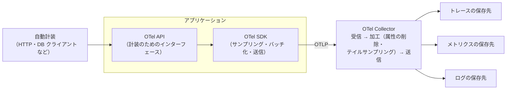

# 10.4 オブザーバビリティ

> 「サイトが遅い」という報告を受けたとき、あなたは何分で原因にたどり着けるでしょうか。数十のサービスが互いを呼び合うシステムでは、事前に用意したダッシュボードが答えを持っていない問いが毎日のように生まれます。この章では、ログ・メトリクス・トレースといったテレメトリの性質と正しい扱い方、分位点の集計の落とし穴、分散トレーシングの仕組み、そして「人を起こすに値するアラート」の設計を、ヒストグラムやトレースの解析器を実装しながら学びます。

| 項目 | 内容 |
|---|---|
| 学習時間の目安 | 本文 4h ＋ 演習 5h |
| 前提となる章 | [10.3 信頼性設計とSLO](../03-reliability-engineering/README.md)、[5.3 DNS・HTTP・TLS](../../05-networking/03-dns-http-tls/README.md)、[2.2 確率・統計と定量的思考](../../02-math-and-algorithms/02-probability-statistics/README.md)（分位点） |
| 演習 | [exercises/](exercises/)（Python） |
| キーワード | モニタリング, オブザーバビリティ, 構造化ログ, 相関 ID, カウンタ, ゲージ, ヒストグラム, Prometheus, PromQL, カーディナリティ, 分位点, 分散トレーシング, W3C Trace Context, サンプリング, OpenTelemetry, RED, USE, ゴールデンシグナル, アラート疲れ |

## この章のゴール

- [ ] モニタリングとオブザーバビリティの違いと、ログ・メトリクス・トレース・プロファイル・イベントの長所と費用を説明できる
- [ ] 構造化ログを設計し（相関 ID・レベル・個人情報の扱い）、ログから RED メトリクスを計算できる
- [ ] Prometheus のデータモデルと PromQL の基本を説明し、ヒストグラムから分位点を推定する仕組みと「分位点を平均してはいけない」理由を示せる
- [ ] W3C Trace Context によるトレースの伝播を実装し、スパンから自己時間とクリティカルパスを計算できる
- [ ] RED・USE・4 つのゴールデンシグナルを使い分け、症状に基づく、対応可能なアラートを設計できる
- [ ] サンプリング・保存期間・カーディナリティの管理で、テレメトリの費用を制御する方針を立てられる

## なぜ学ぶのか

システムが 1 つのプロセスだったころは、ログファイルを `grep` し、CPU とメモリのグラフを見れば、たいていの問題は分かりました。マイクロサービスとクラウドの時代には、1 つのリクエストが十数のサービス、キュー、外部 API を通り抜けます。「特定の顧客の決済だけが、火曜の夜だけ遅い」という問いに、事前に作ったダッシュボードは答えてくれません。**起きることを事前に全部は予想できない**という前提に立って、あとから自由に問いを立てられるようにテレメトリを設計しておく必要があります。

一方で、テレメトリは無料ではありません。ログとメトリクスの量はトラフィックとサービスの数に比例して増え、設計を誤ると監視の費用がインフラそのものの費用に迫ることもあります。ユーザー ID をメトリクスのラベルに入れた一行の変更が、監視基盤を止めることもあります。

そして、監視は障害に巻き込まれてはいけません。2017 年 2 月の Amazon S3 の大規模障害では、AWS 自身のサービス状況ダッシュボードの管理機能が S3 に依存していたため、障害の最初の段階では各サービスの状況を更新できなかったと、AWS の公式な報告に記されています（→ [10.5](../05-incident-management/README.md)）。**監視する側が、監視される側と運命を共にしない設計** も、この章のテーマの一つです。

## 1. モニタリングとオブザーバビリティ

**モニタリング（monitoring）** は、あらかじめ分かっている故障の兆候（ディスクの残量、エラー率、応答時間）を決まった方法で監視し、閾値を超えたら知らせることです。「既知の問い」に答える仕組みです。

**オブザーバビリティ（observability, 可観測性）** は、もとは制御理論（1960 年に Rudolf Kálmán が定式化）の用語で、「システムの外に出てくる出力から、内部の状態をどれだけ推定できるか」という性質を指します。ソフトウェアの世界では Honeycomb の Charity Majors らが広めた考え方で、**新しいコードを出荷しなくても、テレメトリに対して新しい問いを立てて、未知の問題（unknown unknowns）を調べられる性質** を意味します。

| | モニタリング | オブザーバビリティ |
|---|---|---|
| 問い | 事前に決めた問い（「エラー率は閾値を超えたか」） | その場で立てる問い（「遅いリクエストに共通する属性は何か」） |
| 必要なもの | 決まった指標とダッシュボード | 高いカーディナリティ（多くの異なる値）と多くの次元（属性）を持つ詳細なデータ |
| 典型的な場面 | 障害の検知 | 障害の原因の調査、性能の分析 |

両者は対立するものではありません。**アラートはモニタリング（しかも SLO に基づく症状の監視）で、調査はオブザーバビリティで** というのが実務の分担です。

## 2. テレメトリの種類

| 種類 | 何か | 得意なこと | 苦手なこと・費用の要因 |
|---|---|---|---|
| ログ | 個々の出来事の記録（構造化されたレコード） | 何が起きたかの詳細、監査 | 量に比例して費用が増える。集計は重い |
| メトリクス | 時系列の数値（カウンタ・ゲージ・ヒストグラム） | 長期の傾向、アラート、安価な集計 | 個々のリクエストの詳細は失われる。ラベルの組み合わせ（カーディナリティ）で費用が増える |
| トレース | 1 つのリクエストがたどった経路（スパンの木） | サービス間の遅延の内訳、依存関係 | 全件を保存すると高価。サンプリングが必要 |
| プロファイル | どの関数が CPU やメモリを使っているか | コードレベルの性能の分析 | 取得の負荷と、コードとの対応づけ |
| イベント | デプロイ・設定変更・スケールなどの出来事 | 変化と障害の相関（「何が変わったか」） | 記録し忘れると役に立たない |

信号どうしを **つなげる** ことが重要です。ログに `trace_id` を入れておけばログからトレースへ、メトリクスに代表例（exemplar: そのバケットに入ったリクエストのトレース ID）を付けておけばグラフの山からトレースへ、ダッシュボードにデプロイのイベントを重ねれば「どの変更の後に悪化したか」へ、すぐに移動できます。障害対応の速さは、この行き来の速さでほぼ決まります。

## 3. ログ

### 3.1 構造化ログ

`"User 42 paid 12800 yen in 212 ms"` のような自由な文章のログは、人間には読めても、集計するには正規表現で切り出すしかありません。**構造化ログ（structured logging）** では、1 行に 1 つの JSON のように、キーと値の組で記録します。

```python
import json
import logging
import sys

class JsonFormatter(logging.Formatter):
    """ログのレコードを 1 行の JSON にする（標準ライブラリだけで書いた最小の例）。"""
    def format(self, record):
        entry = {
            "ts": self.formatTime(record, "%Y-%m-%dT%H:%M:%S%z"),
            "level": record.levelname.lower(),
            "logger": record.name,
            "msg": record.getMessage(),
        }
        entry.update(getattr(record, "fields", {}))   # extra={"fields": {...}} で渡した構造化データ
        return json.dumps(entry, ensure_ascii=False)

handler = logging.StreamHandler(sys.stdout)
handler.setFormatter(JsonFormatter())
log = logging.getLogger("checkout")
log.addHandler(handler)
log.setLevel(logging.INFO)

log.info("payment authorized", extra={"fields": {
    "trace_id": "4bf92f3577b34da6a3ce929d0e0e4736", "order_id": "o-1029",
    "amount_jpy": 12800, "psp_latency_ms": 212.4}})
```

```text
{"ts": "2026-09-28T23:40:39+0000", "level": "info", "logger": "checkout", "msg": "payment authorized", "trace_id": "4bf92f3577b34da6a3ce929d0e0e4736", "order_id": "o-1029", "amount_jpy": 12800, "psp_latency_ms": 212.4}
```

（`ts` は実行した時刻になります。時刻は UTC かタイムゾーン付きで記録しましょう。）

設計の要点は次の通りです。

- **フィールド名と型を組織で統一する**。あるサービスは `duration_ms`、別のサービスは `latency`（秒）では横断的に集計できない。OpenTelemetry のセマンティック規約（後述）のような共通の命名に合わせるとよい。
- **メッセージは固定の文字列にし、変わる値はフィールドに入れる**。`msg` に ID や金額を埋め込むと、同じ種類の出来事を数えられない。
- **ログレベルの意味を決める**。ERROR は「人が対応すべき、または利用者に影響した失敗」、WARN は「異常だが自動で回復した」、INFO は「業務上の重要な出来事」、DEBUG は「開発時の詳細」。すべての例外を ERROR にすると、本当に重要なものが埋もれる。

### 3.2 相関 ID とトレース ID

リクエストの入口で ID を発行し、そのリクエストの処理で出るすべてのログに同じ ID を入れておけば、複数のサービスにまたがるログを 1 つのリクエストの物語として読めます。これを **相関 ID（correlation ID）** と呼びます。分散トレーシングを導入しているなら、トレース ID をそのまま相関 ID として使うのが最も便利です（ログからトレースへ直接移動できる）。非同期のメッセージ（キューやイベント）を経由する処理でも、メッセージのヘッダーに ID を入れて運ぶ必要があります。

### 3.3 個人情報と秘密情報

ログは多くの人とシステムに読まれ、長く保存され、外部の SaaS に送られることもあります。**ログに個人情報や秘密情報を書かない** ことは、セキュリティとプライバシーの基本です。

- パスワード・アクセストークン・API キー・クレジットカード番号は絶対に出力しない。リクエスト全体やヘッダー全体をそのままログに出す実装は、これらを漏らす典型的な経路。
- メールアドレス・電話番号・住所などは、必要なら仮名化（ハッシュ化や内部 ID への置き換え）する。
- ログの閲覧権限と保存期間を決める。個人データを含むログの扱いは、個人情報保護法などの法令や社内規程の対象になる（→ [11.5](../../11-security/05-security-operations/README.md)、[14.5](../../14-cto/05-governance-risk-compliance/README.md)）。

マスキングは出力の直前（ロガーのフィルタやログ収集のパイプライン）で機械的に行い、レビューで「ログに何を出しているか」を確認します。

### 3.4 ログから指標を作る

ログは、正規化と集計を経てはじめて判断に使える指標になります。演習 3・4 では、架空のアクセスログ（10 分間・約 1,000 行）から、エンドポイントごと・1 分ごとの RED メトリクスを計算します。

```python
# exercises/ ディレクトリで実行する（演習を解いた後に試せます）
from pathlib import Path
from logstats import parse_logs, per_minute, top_offenders, slowest

records, bad = parse_logs(Path("data/access.jsonl").read_text(encoding="utf-8").splitlines())
print(f"{len(records)} 行を読み込み、{bad} 行は不正")
print("分               件数  5xx   p95(ms)")
for minute, eps in per_minute(records).items():
    s = eps["POST /api/checkout"]
    print(f"{minute}  {s.count:4} {s.errors:4} {s.p95:9.1f}")
print(top_offenders(records, "client_ip", "client_errors", 2))
print(slowest(records, 1))
```

```text
1006 行を読み込み、6 行は不正
分               件数  5xx   p95(ms)
2026-09-01T10:00Z    10    0     257.8
2026-09-01T10:01Z     9    0     312.1
2026-09-01T10:02Z     9    0     244.9
2026-09-01T10:03Z    12    0     271.0
2026-09-01T10:04Z    10    3    2629.9
2026-09-01T10:05Z     9    1    2105.7
2026-09-01T10:06Z     9    4    2908.3
2026-09-01T10:07Z    11    0     306.7
2026-09-01T10:08Z     9    0     260.1
2026-09-01T10:09Z     8    0     338.9
[('198.51.100.23', 118.0), ('203.0.113.31', 3.0)]
[(2908.3, 'POST /api/checkout', '20d5f9613304bb84b9b4e8d8da0e395a')]
```

10:04〜10:06 に決済の 5xx と遅延が集中していること、別の問題として 1 つのクライアントが大量の 429（レート制限）を受けていること、そして最も遅いリクエストのトレース ID が分かります。ここで重要なのは、`/api/items/4209` のようなパスを `/api/items/{id}` に **正規化** してから集計していることです。ID をそのまま集計キーやメトリクスのラベルにすると、系列の数が ID の数だけ増えます（次節のカーディナリティの問題）。また、壊れた行で処理全体を止めず、**数を報告しながら読み飛ばす** ことも、実務のログ処理では欠かせません。

## 4. メトリクス

### 4.1 4 つの型

| 型 | 意味 | 例 | 注意 |
|---|---|---|---|
| カウンタ（counter） | 単調に増える累計値 | リクエスト数、エラー数、送信バイト数 | 値そのものではなく **増加率（rate）** を見る。再起動で 0 に戻る |
| ゲージ（gauge） | 上下する現在値 | 同時接続数、キューの長さ、メモリ使用量 | 取得の間隔の間の変化は見えない |
| ヒストグラム（histogram） | 値の分布をバケットごとの個数で記録 | 応答時間、リクエストのサイズ | バケットの境界の設計が精度を決める。**インスタンス間で足し合わせられる** |
| サマリー（summary） | クライアント側で計算した分位点 | 応答時間の p99 | **インスタンス間で集計できない**。新規ではヒストグラムを選ぶのが基本 |

### 4.2 Prometheus のデータモデルと PromQL

Prometheus（SoundCloud で生まれ、CNCF で開発されている監視システム）では、**メトリクス名とラベル（キーと値の組）の組み合わせ 1 つが、1 本の時系列** です。各サービスは現在値を HTTP で公開し、Prometheus が定期的に取りに行きます（pull 型）。

```text
# 公開される形式（テキスト形式の例）
http_requests_total{method="GET",route="/api/items/{id}",status="200"} 40211
http_requests_total{method="POST",route="/api/checkout",status="503"} 8
http_request_duration_seconds_bucket{route="/api/checkout",le="0.25"} 61
http_request_duration_seconds_bucket{route="/api/checkout",le="+Inf"} 96
```

問い合わせ言語 PromQL の基本形をいくつか示します（クエリの例です）。

```text
# 直近 5 分の 1 秒あたりのリクエスト数（カウンタは rate で見る）
sum by (route) (rate(http_requests_total[5m]))

# エラー率（5xx の割合）
sum(rate(http_requests_total{status=~"5.."}[5m])) / sum(rate(http_requests_total[5m]))

# 全インスタンスを合わせた p95。バケットを先に足し合わせてから分位点を計算する
histogram_quantile(0.95, sum by (le) (rate(http_request_duration_seconds_bucket[5m])))
```

カウンタは単調に増えますが、プロセスが再起動すると 0 に戻ります。`rate()` はこのリセットを検出して補正します（演習 1 で、外挿を省いた簡略版を実装します）。

### 4.3 カーディナリティ

時系列の数は、**各ラベルの値の種類の数の積** で増えます。

```text
method（5 種類）× route（50 種類）× status（10 種類）× instance（100 台）= 250,000 系列
                      ↓ ラベルに user_id（100 万人）を追加すると
250,000 × 1,000,000 = 2,500 億系列（現実には存在する組み合わせだけだが、それでも破滅的）
```

Prometheus のような時系列データベースは系列の数に比例してメモリと費用を使うので、**ユーザー ID・リクエスト ID・生の URL・メールアドレスのような上限のない値をラベルにしてはいけません**。そうした高いカーディナリティの情報はログやトレースの属性に入れ、メトリクスには上限の分かっている値（ルート、ステータスの種類、リージョン）だけを使います。ラベルの追加をコードレビューの確認項目にし、系列数を監視しておくと、事故を未然に防げます。

### 4.4 分位点は平均できない

レイテンシの p95 や p99 は、**平均できません**。インスタンス A が大量の速いリクエストを、インスタンス B が少量の遅いリクエストを処理しているとき、各インスタンスの p95 の平均は、全体の p95 とはまったく違う値になります。演習 2 のヒストグラムで確かめます。

```python
import random
from histo import Histogram, average_of_quantiles, exact_quantile, merge_all

rng = random.Random(42)
a, b, raw = Histogram(), Histogram(), []
for _ in range(9800):                       # インスタンス A: 大量の速いリクエスト（キャッシュが温まっている）
    v = rng.lognormvariate(-3.5, 0.4); a.observe(v); raw.append(v)
for _ in range(200):                        # インスタンス B: 少量の遅いリクエスト（起動直後でキャッシュが冷えている）
    v = rng.lognormvariate(-0.7, 0.4); b.observe(v); raw.append(v)

print(f"A の p95: {a.quantile(0.95):.3f} 秒  B の p95: {b.quantile(0.95):.3f} 秒")
print(f"p95 の平均（誤り）       : {average_of_quantiles([a, b], 0.95):.3f} 秒")
print(f"合算したヒストグラムの p95: {merge_all([a, b]).quantile(0.95):.3f} 秒")
print(f"生データから求めた p95   : {exact_quantile(raw, 0.95):.3f} 秒")
```

```text
A の p95: 0.077 秒  B の p95: 0.989 秒
p95 の平均（誤り）       : 0.533 秒
合算したヒストグラムの p95: 0.086 秒
生データから求めた p95   : 0.065 秒
```

p95 の平均（0.533 秒）は、実際の p95（0.065 秒）の 8 倍にもなりました。トラフィックの偏り方によっては逆に過小評価もします。正しい方法は、**バケットの個数を足し合わせてから分位点を計算する** ことで、PromQL の `histogram_quantile(0.95, sum by (le) (...))` がそれにあたります。サマリー型の分位点はクライアント側で計算済みなので、この足し合わせができません。これが、ヒストグラムを選ぶべき最大の理由です。

ヒストグラムからの推定値（0.086 秒）が生データの値（0.065 秒）とずれているのは、バケット（0.05〜0.1 秒）の中で値が一様に分布していると仮定して線形補間しているからです。**推定の精度はバケットの境界で決まる** ので、SLO の閾値（例: 300 ms）はバケットの境界に含めておきましょう。そうすれば「300 ms 以内の割合」は補間なしで正確に分かります。Prometheus の新しい「ネイティブヒストグラム」は、バケットを自動的に細かく持つことでこの問題を緩和する仕組みです（2026 年時点の対応状況は公式ドキュメントで確認してください）。

## 5. 分散トレーシング

### 5.1 スパンとトレース

Google の Dapper の論文（2010 年）以来、分散トレーシングは次のモデルで表されます。

- **スパン（span）**: 1 つの処理の単位（HTTP の呼び出し、DB のクエリ）。名前・開始と終了の時刻・属性・親のスパン ID を持つ。
- **トレース（trace）**: 1 つのリクエストに属するスパンの木。ルートのスパンがリクエスト全体。

```text
POST /checkout (frontend)   |=====================================================| 520 ms
  auth.verify               |==|                                                     30 ms
  cart.get                       |=======|                                           80 ms
    SELECT cart_items             |=====|                                            60 ms
  inventory.reserve                       |=================|                       175 ms
    UPDATE stock                            |==============|                        150 ms
  pricing.quote                           |=========|           ← inventory と並行   95 ms
  payment.charge                                            |==================|    195 ms
    POST psp/charges                                         |================|     170 ms
```

### 5.2 文脈の伝播: W3C Trace Context

スパンを 1 つのトレースにまとめるには、サービスを呼ぶたびに「どのトレースの、どのスパンから呼んだか」を相手に伝える必要があります。これを標準化したのが W3C の勧告 **Trace Context**（2020 年）で、HTTP ヘッダー `traceparent` を使います。

```text
traceparent: 00-4bf92f3577b34da6a3ce929d0e0e4736-00f067aa0ba902b7-01
             │  │                                │                │
             │  trace-id（32 桁の 16 進数）       parent-id        trace-flags（01 = sampled）
             version                              （呼び出し元のスパン ID、16 桁）
```

受け取った側は、同じ trace-id のまま自分のスパンを作り、次の呼び出しでは自分のスパン ID を parent-id として送ります。演習 5 で実装します。

```python
import random
from tracectx import child, format_traceparent, parse_traceparent

incoming = parse_traceparent("00-4bf92f3577b34da6a3ce929d0e0e4736-00f067aa0ba902b7-01")
outgoing = child(incoming, random.Random(1))
print(incoming)
print(format_traceparent(outgoing))
```

```text
TraceParent(version='00', trace_id='4bf92f3577b34da6a3ce929d0e0e4736', parent_id='00f067aa0ba902b7', flags=1)
00-4bf92f3577b34da6a3ce929d0e0e4736-91b7584a2265b1f5-01
```

仕様には細かな規則があります。16 進数は小文字のみ、trace-id や parent-id がすべて 0 のものは無効、バージョン `ff` は無効、将来のバージョンは読める部分だけを読む、などです。**不正なヘッダーは無視して新しいトレースを始める** のが正しい振る舞いで、外部から送られてきたヘッダーを信用しすぎない（検証する）ことも重要です。事業者固有の情報は `tracestate` ヘッダーで運びます。キューを経由する非同期の処理では、メッセージの属性に同じ情報を入れて伝播させます。

### 5.3 自己時間とクリティカルパス

トレースを見るときの 2 つの重要な量があります。

- **自己時間（self time）**: そのスパンが子を待たずに自分で使った時間。子どうしが並行している場合は、子の区間の **和集合** を引く。
- **クリティカルパス（critical path）**: リクエスト全体の終了時刻を決めている仕事の連なり。ここにない処理を速くしても、リクエストは速くならない。

演習 6 で、5.1 の例のクリティカルパスを計算します。

```python
from tracectx import Span, build_tree, critical_path, self_time_by_service

spans = [
    Span("a1", None, "POST /checkout", "frontend", 0, 520),
    Span("b1", "a1", "auth.verify", "auth", 5, 35),
    Span("c1", "a1", "cart.get", "cart", 40, 120),
    Span("c2", "c1", "SELECT cart_items", "cart-db", 50, 110),
    Span("d1", "a1", "inventory.reserve", "inventory", 125, 300),
    Span("d2", "d1", "UPDATE stock", "inventory-db", 140, 290),
    Span("e1", "a1", "pricing.quote", "pricing", 125, 220),     # inventory と並行
    Span("f1", "a1", "payment.charge", "payment", 305, 500),
    Span("f2", "f1", "POST psp/charges", "payment", 320, 490),
]
tree = build_tree(spans)
path = critical_path(tree)
on_path = {}
for span_id, start, end in path:
    on_path[span_id] = on_path.get(span_id, 0) + (end - start)
for span_id, ms in sorted(on_path.items(), key=lambda kv: -kv[1]):
    print(f"{tree.spans[span_id].name:20} {ms:5.0f} ms")
print("pricing.quote はクリティカルパス上にあるか:", "e1" in on_path)
print(self_time_by_service(tree))
```

```text
POST psp/charges       170 ms
UPDATE stock           150 ms
SELECT cart_items       60 ms
POST /checkout          40 ms
auth.verify             30 ms
inventory.reserve       25 ms
payment.charge          25 ms
cart.get                20 ms
pricing.quote はクリティカルパス上にあるか: False
{'payment': 195.0, 'inventory-db': 150.0, 'pricing': 95.0, 'cart-db': 60.0, 'frontend': 40.0, 'auth': 30.0, 'inventory': 25.0, 'cart': 20.0}
```

サービスごとの自己時間では pricing が 3 番目に大きいのに、クリティカルパスには現れません。inventory と並行して走り、先に終わっているからです。**「時間を多く使っているもの」と「遅延を決めているもの」は違う** ので、性能改善の優先順位はクリティカルパスで決めます。逆に、決済代行（PSP）の呼び出しと在庫の更新を並行にできないか、という改善の方向も見えてきます。

実際のトレースでは、サービスごとの時計のずれで子のスパンが親からはみ出すことがあります。解析ツールは子を親の区間に切り詰めて扱います（演習でも同様です）。

### 5.4 サンプリング

すべてのリクエストのトレースを保存すると、ストレージと転送の費用が膨大になります。そこで一部だけを残す **サンプリング** を行います。

| 方式 | 仕組み | 長所 | 短所 |
|---|---|---|---|
| ヘッドベース | リクエストの入口で残すかどうかを決め、`sampled` フラグで下流に伝える | 単純で安い。トレースが途中で欠けない | エラーや遅いリクエストかどうかは入口では分からないので、珍しい問題を取りこぼす |
| テイルベース | トレースが完了してから、全スパンを見て残すかを決める | エラーや遅いトレースを優先して残せる | 全スパンを一時的に集めて保持するため、収集側の資源と複雑さが増える |

「エラーのトレースは全部、遅いトレースは全部、残りは数 % 」のように、テイルベースで重要なものを優先して残す構成がよく使われます。サンプリングしたトレースから件数を数えるときは、サンプリング率で割り戻す必要があることにも注意してください（件数や率はメトリクスで正確に数え、トレースは代表例として使うのが基本です）。

## 6. OpenTelemetry

**OpenTelemetry（OTel）** は、トレース・メトリクス・ログを収集するための、ベンダーに依存しない標準と実装の集まりです。2019 年に OpenTracing と OpenCensus という 2 つのプロジェクトが統合されて生まれ、CNCF で開発されています。



| 構成要素 | 役割 |
|---|---|
| API | アプリケーションやライブラリが計装に使うインターフェース。SDK がなければ何もしない（ライブラリは API だけに依存できる） |
| SDK | API の実装。サンプリング、バッチ化、エクスポートを行う |
| 自動計装 | よく使われる HTTP サーバー・クライアントや DB ドライバを、コードを変えずに計装する |
| Collector | テレメトリを受け取り、加工し（個人情報の属性の削除、テイルサンプリング、属性の付与）、1 つまたは複数の保存先に送る独立したプロセス |
| OTLP | テレメトリを送るための標準プロトコル |
| セマンティック規約 | `http.request.method` のような属性名の標準。ツールをまたいで同じ意味で扱える |

OpenTelemetry を採用する最大の利点は、**計装と保存先を分離できる** ことです。アプリケーションのコードは OTel の API だけに依存し、保存先（監視 SaaS やセルフホストの基盤）は Collector の設定で切り替えられます。監視ベンダーの乗り換えで全サービスの計装を書き直す、という最悪のロックインを避けられます。Collector の設定は次のようになります（設定の例です。テイルサンプリングは contrib 版の Collector の機能です）。

```yaml
receivers:
  otlp:
    protocols:
      grpc:
        endpoint: 0.0.0.0:4317
      http:
        endpoint: 0.0.0.0:4318
processors:
  tail_sampling:
    decision_wait: 10s
    policies:
      - name: keep-errors
        type: status_code
        status_code: {status_codes: [ERROR]}
      - name: keep-slow
        type: latency
        latency: {threshold_ms: 1000}
      - name: sample-the-rest
        type: probabilistic
        probabilistic: {sampling_percentage: 5}
  batch: {}
exporters:
  otlp:
    endpoint: tracing-backend.example.com:4317
service:
  pipelines:
    traces:
      receivers: [otlp]
      processors: [tail_sampling, batch]
      exporters: [otlp]
```

仕様と実装の成熟度はシグナルや言語によって異なり、プロファイルは比較的新しいシグナルとして整備が進められている段階です（2026 年時点）。採用時には、使う言語の SDK の安定性を確認してください。

## 7. 何を見るか: RED・USE・4 つのゴールデンシグナル

指標の候補は無数にあります。何から見るべきかについて、よく使われる 3 つの枠組みがあります。

| 枠組み | 提唱 | 対象 | 指標 |
|---|---|---|---|
| RED | Tom Wilkie | リクエストを処理するサービス | Rate（リクエスト数/秒）、Errors（失敗の数・割合）、Duration（応答時間の分布） |
| USE | Brendan Gregg | 資源（CPU・メモリ・ディスク・ネットワーク・コネクションプール） | Utilization（使用率）、Saturation（飽和: 待ち行列の長さ）、Errors（エラー） |
| 4 つのゴールデンシグナル | Google の SRE 本 | 利用者に面したシステム | レイテンシ、トラフィック、エラー、飽和 |

RED は「利用者から見てサービスがどうか」、USE は「資源がボトルネックになっていないか」を問います。サービスのダッシュボードの最上段に RED を、その下に依存先と資源（USE）を並べるのが定番の構成です。**使用率が低くても飽和していることがある**（コネクションプールの待ち行列が伸びている、1 つのコアだけが 100% など）ので、使用率と飽和は別に見ます。

ダッシュボードの設計の原則:

- **問いから逆算する**: 「利用者は影響を受けているか」→「どこで」→「なぜ」の順に、上から下へ掘り下げられる並びにする。
- **SLO と結びつける**: 最上段に SLO とエラーバジェットの消費を置く（→ [10.3](../03-reliability-engineering/README.md)）。
- **平均ではなく分布を見る**: レイテンシは p50・p95・p99 を並べる。ヒートマップは分布の変化を見るのに適している。
- **変化を重ねる**: デプロイや設定変更のイベントをグラフに重ねる。
- **増やしすぎない**: 誰も見ないダッシュボードは、障害時に誤った手がかりを与える。所有者のいないものは定期的に削除する。

## 8. アラート設計

アラートの目的は、**人が今すぐ対応すべき事態を、確実に、そして必要なときだけ知らせること** です。Google の Rob Ewaschuk による文書 "My Philosophy on Alerting" や SRE 本の監視の章が示す原則は、今も有効です。

1. **原因ではなく症状でアラートする**: 「DB の CPU が 90%」ではなく「利用者のリクエストが失敗している・遅い」。CPU が 90% でも利用者が困っていなければ、夜中に人を起こす理由はない（チケットで十分）。原因の指標は、調査のためにダッシュボードに置く。
2. **対応可能であること**: 呼び出された人がすぐに取れる行動があるものだけを呼び出しにする。「様子を見る」しかないアラートは呼び出しにしない。
3. **SLO に基づく**: エラーバジェットのバーンレートでアラートすれば、利用者への影響と緊急度が自然に反映される（[10.3](../03-reliability-engineering/README.md) の多窓・多バーンレート）。
4. **呼び出しとチケットを分ける**: 今すぐ対応すべきもの（呼び出し）と、営業時間内でよいもの（チケット）を分ける。ディスクが 3 日後にいっぱいになる見込みはチケット。
5. **すべての呼び出しに手順書（ランブック）を付ける**: アラートの意味、影響、最初に確認すること、よくある原因と対処、エスカレーション先。アラートの本文からリンクする。

**アラート疲れ（alert fatigue）** は、呼び出しの大半が対応不要なものになり、人がアラートを無視し始める状態です。本当の障害の呼び出しも、そのうち無視されます。対策として、アラートそのものを計測します。

| 指標 | 見るべきこと |
|---|---|
| 1 回のオンコール当番あたりの呼び出し回数 | 多すぎないか（SRE 本は、1 回の 12 時間の当番で対応できるのは 2 件程度までとしている） |
| 対応不要だった呼び出しの割合 | 高ければ閾値や条件を見直すか、アラートを削除する |
| 夜間・休日の呼び出しの割合 | 当番の負担と、自動化の優先順位 |
| アラートが鳴らずに見つかった障害 | 利用者や他チームからの報告で気づいた障害は、検知の穴 |

呼び出しが多すぎるチームは、新しいアラートを足す前に、既存のアラートを見直すべきです。オンコールの設計そのものは [10.5](../05-incident-management/README.md) で扱います。

## 9. コストの管理

テレメトリの費用は、放っておくとサービスの成長より速く増えます。主な制御の手段は次の通りです。

| 手段 | 内容 |
|---|---|
| サンプリング | トレースはテイルベースで重要なものを優先。大量の成功したリクエストのログも一部だけ残す（件数はメトリクスで数える） |
| 保存期間の階層化 | 直近 7〜30 日は検索できる高価な保存、それ以降は安価なオブジェクトストレージに圧縮して保存、監査用は要件の期間だけ |
| カーディナリティの管理 | ラベルの許可リスト、系列数の上限と監視、上限のない値はログやトレースへ |
| 送る前に減らす | Collector やログの収集パイプラインで、不要なフィールドやデバッグログを落とす。ヘルスチェックのような大量で価値の低いログを捨てる |
| 集約してから保存 | 個々のログを保存する代わりに、分単位の集計（演習の per_minute のようなもの）だけを長く保存する |

監視 SaaS の料金体系は、取り込んだデータ量・ホスト数・カスタムメトリクスの系列数・保存期間などの組み合わせで、事業者によって大きく異なります（2026 年時点）。**料金体系のどの要素が自社の使い方で支配的になるか** を理解していないと、予想外の請求を受けます。自前で運用する（Prometheus や OpenTelemetry と、オープンソースの保存先）か、SaaS を買うかは、費用だけでなく運用に必要な人員も含めて比較します（→ [10.6](../06-finops/README.md)）。

## 10. 外形監視・RUM・継続的プロファイリング

- **外形監視（synthetic monitoring）**: 外部から定期的に、利用者と同じ経路でリクエストを送って確かめる。トラフィックの少ない深夜でも障害に気づけ、DNS や CDN、証明書の期限切れのような「サーバーのログには現れない」障害を検知できる。監視する側は、監視対象と別の基盤・別のリージョンに置く。
- **RUM（Real User Monitoring）**: 利用者のブラウザやアプリで実際の体験（ページの表示時間、操作への反応、JavaScript のエラー）を計測する。Web では、Google が定めた Core Web Vitals（LCP・INP・CLS）が代表的な指標で、2024 年 3 月に応答性の指標が FID から INP に置き換わった。
- **継続的プロファイリング**: 本番環境で低い負荷のサンプリングにより、常に CPU やメモリのプロファイルを取り続ける。「どの関数が CPU 時間を使っているか」を時系列で比較でき、性能の劣化やクラウドの費用の削減に直結する。
- **eBPF**: Linux カーネル内で安全に小さなプログラムを動かす仕組み。アプリケーションを変更せずに、ネットワークやシステムコール、関数の呼び出しを観測できるため、プロファイリングや、計装のないサービスの可視化に使われている。

## よくある落とし穴

1. **自由な文章のログを出す**。集計も検索もできない。構造化ログにし、フィールド名と型を組織で統一する。
2. **ユーザー ID や生の URL をメトリクスのラベルにする**。系列の数が爆発して、監視基盤が止まるか請求が跳ね上がる。上限のある値だけをラベルにし、ID はログとトレースの属性に入れる。
3. **インスタンスごとの p99 を平均する**。数字は意味を持たない。ヒストグラムのバケットを足し合わせてから分位点を計算する。サマリー型を新たに使わない。
4. **平均のレイテンシだけを見る**。遅いリクエストを受けている利用者の体験が隠れる。p50・p95・p99 や分布（ヒートマップ）を見る。
5. **原因の指標で人を呼び出す**。CPU やメモリの閾値のアラートは、利用者に影響がないのに夜中に人を起こし、アラート疲れを生む。呼び出しは症状（SLO のバーンレート）で行い、原因の指標はダッシュボードに置く。
6. **ログにトークンや個人情報を出す**。ログはあちこちにコピーされ、長く残る。出力の直前で機械的にマスキングし、レビューで確認する。
7. **監視を監視対象と同じ基盤に置く**。障害時に監視も一緒に止まる。外形監視やアラートの送信経路は、別の基盤・別のリージョンに置く。
8. **サンプリングしたトレースで件数を数える**。サンプリング率を考慮しないと数字が大きくずれる。件数と率はメトリクスで数え、トレースは代表例の調査に使う。

## CTOの視点

1. **テレメトリの標準を組織で決める**。ログのフィールド名、メトリクスの命名とラベルの規則、トレースの伝播方式（W3C Trace Context）、使う SDK（OpenTelemetry）を、プラットフォームの既定値として提供しましょう。サービスごとにばらばらだと、障害のたびにサービスをまたいだ調査ができず、ベンダーの乗り換えも不可能になります。
2. **監視の費用を「売上やトラフィックあたり」で管理する**。テレメトリの費用はトラフィックとサービス数に比例して増えます。リクエスト 100 万件あたりの監視費用のような単位あたりの指標を持ち、サンプリングと保存期間の方針を決めておきましょう。監視 SaaS との複数年契約の前には、データ量の見通しと、OpenTelemetry による出口を確認します（→ [10.6](../06-finops/README.md)）。
3. **障害の振り返りで「検知」を必ず問う**。「最初に気づいたのは誰か（顧客・サポート・アラート）」「アラートから原因の特定まで何分かかったか」「どのテレメトリが足りなかったか」。顧客からの報告で気づいた障害は、検知の仕組みの欠陥として扱い、対策を追跡します。
4. **オンコールの負荷を経営の指標として見る**。呼び出しの回数、夜間の呼び出し、対応不要な呼び出しの割合は、エンジニアの疲弊と離職の先行指標です。数字が悪化しているチームには、機能開発よりもアラートの整理と自動化に時間を使わせる判断が必要です。
5. **採用・育成では「調査の手順」を見る**。「p99 のレイテンシが急に悪化した。何をどの順に見るか」と問い、仮説を立て、メトリクス・トレース・ログを行き来して絞り込めるかを確かめます。ツールの操作に詳しいことより、分位点・サンプリング・カーディナリティの意味を理解していることの方が重要です。

## 演習

演習コードは [exercises/histo.py](exercises/histo.py)、[exercises/logstats.py](exercises/logstats.py)、[exercises/tracectx.py](exercises/tracectx.py) にあります。関数の docstring に仕様が書いてあるので、`raise NotImplementedError(...)` を実装に置き換えてください。ログの演習は [exercises/data/access.jsonl](exercises/data/access.jsonl) を使います。解答例は [solutions/](solutions/) にあります。

```bash
python3 tools/check.py 10.4        # リポジトリのルートで実行
python3 tools/check.py -v 10.4     # 詳しい出力
```

| # | 難易度 | 内容 | 対象ファイル / 関数 |
|---|---|---|---|
| 1 | ★☆☆ | カウンタの増分と rate（リセットの補正） | `histo.py`: `counter_increase`, `counter_rate` |
| 2 | ★★☆ | 累積バケットのヒストグラム、`histogram_quantile` と同じ補間、インスタンス間の合算、分位点の平均が誤りであることの確認 | `histo.py`: `histogram_quantile`, `Histogram`, `merge_all`, `average_of_quantiles` |
| 3 | ★★☆ | JSON Lines のログの解析（壊れた行の扱い）とパスの正規化 | `logstats.py`: `parse_line`, `parse_logs`, `normalize_path`, `endpoint_of` |
| 4 | ★★☆ | エンドポイントごと・1 分ごとの RED、上位の負荷元、最も遅いリクエストのトレース ID | `logstats.py`: `percentile`, `red_by_endpoint`, `per_minute`, `top_offenders`, `slowest` |
| 5 | ★★☆ | W3C traceparent の解析・検証・生成と、子スパンへの伝播 | `tracectx.py`: `parse_traceparent`, `format_traceparent`, `new_trace`, `child` |
| 6 | ★★★ | スパンの木の構築、自己時間、クリティカルパス | `tracectx.py`: `build_tree`, `self_times`, `self_time_by_service`, `critical_path` |
| 7 | ★★☆ | 記述: アラートルールのレビュー（下記） | — |

### 演習 7（記述）: アラートルールのレビュー

あるチームのオンコール担当は、先月 1 か月で 120 回呼び出され、そのうち対応が必要だったのは 9 回でした。現在のアラートルールは次の通りです。問題点を指摘し、改善したルールの一覧（呼び出しとチケットの区別を含む）を提案してください。

```text
A1: 各サーバーの CPU 使用率が 5 分間 80% を超えたら呼び出し
A2: 各サーバーのメモリ使用率が 90% を超えたら呼び出し
A3: 直近 1 分間に 5xx が 1 件でも出たら呼び出し
A4: API の平均応答時間が 1 分間 500 ms を超えたら呼び出し
A5: ディスク使用率が 85% を超えたら呼び出し
A6: 外形監視のトップページのチェックが 1 回失敗したら呼び出し
A7: 夜間バッチが 06:00 までに完了していなければ呼び出し
```

<details>
<summary>解答例</summary>

| ルール | 問題点 | 改善案 |
|---|---|---|
| A1 CPU 80% | 原因の指標であり、利用者への影響と無関係。オートスケールしている環境では正常な状態でも鳴る | 呼び出しから外す。ダッシュボードに置き、飽和（待ち行列・スロットリング）とあわせて調査に使う。キャパシティ計画のチケットにしてもよい |
| A2 メモリ 90% | 同上。キャッシュを使う多くのプロセスでは 90% は正常 | 呼び出しから外す。OOMKilled の発生や再起動の回数をチケットに |
| A3 5xx が 1 件 | 敏感すぎる。トラフィックの多いサービスでは常に鳴る | SLO のバーンレートによる多窓アラート（1 時間 / 5 分で 14.4、6 時間 / 30 分で 6 は呼び出し、3 日 / 6 時間で 1 はチケット） |
| A4 平均応答時間 | 平均は分布の裾を隠し、1 分の窓は揺らぎに弱い | レイテンシの SLO（例: 99% が 500 ms 以内）のバーンレートで評価する |
| A5 ディスク 85% | 静的な閾値は、増加の速さを考慮しない。85% で何年も安定しているディスクもあれば、数分で埋まるものもある | 「現在の増加速度で 4 時間以内に満杯」を呼び出し、「3 日以内」をチケットにする（予測に基づく） |
| A6 外形監視 1 回の失敗 | 1 回の失敗はネットワークの揺らぎで起きうる | 複数の地点から、連続 N 回（例: 3 地点中 2 地点で 3 回連続）の失敗で呼び出し。監視の基盤は本番と別にする |
| A7 夜間バッチ | 方向性は正しい（利用者への影響＝鮮度に基づく）。ただし 06:00 に気づいても間に合わない可能性 | 「業務開始の 09:00 までに給与データが必要」という鮮度の SLO から逆算し、進捗が遅れている時点（例: 04:00 に 50% 未満）で呼び出し。手順書を付ける |

共通の改善:

- すべての呼び出しにランブックへのリンクと、影響・最初の確認事項を書く。
- 呼び出しの回数・対応不要の割合を毎週レビューし、対応不要が続くルールは修正か削除する。
- 同じ原因で多数のアラートが同時に鳴る場合は、グループ化・抑制（上流の障害時に下流のアラートを止める）を設定する。

採点の観点:

- A1・A2 を「原因の指標なので呼び出しにしない」、A3・A4 を「SLO のバーンレートに置き換える」と指摘できれば合格ライン。
- 平均の問題、ディスクの予測型アラート、外形監視の多地点・連続失敗、鮮度の SLO、呼び出しとチケットの区別、ランブックとアラートの定期的な見直しまで書けていれば、オンコールの負荷を実際に減らせる水準です。

</details>

## 理解度チェック

**Q1. モニタリングとオブザーバビリティの違いを、障害対応の場面に即して説明してください。**

<details>
<summary>解答</summary>

モニタリングは、あらかじめ決めた指標と閾値で既知の故障を検知する仕組みで、「エラー率が SLO を脅かしている」のような事前に分かっている問いに答えます。オブザーバビリティは、テレメトリに対してその場で新しい問いを立て、未知の問題を調べられる性質です。障害対応では、モニタリング（SLO に基づくアラート）が「何かがおかしい」ことを知らせ、オブザーバビリティ（属性の豊富なトレースや構造化ログ）が「どの顧客の、どのリクエストの、どの処理が遅いのか」を、新しいコードを出荷せずに絞り込むことを可能にします。

</details>

**Q2. 4 台のインスタンスの p99 レイテンシがそれぞれ 100 ms、120 ms、110 ms、900 ms でした。サービス全体の p99 を「平均 307.5 ms」と報告するのはなぜ誤りですか。正しくはどうしますか。**

<details>
<summary>解答</summary>

分位点は平均できません。全体の p99 は、4 台のリクエストを合わせた分布の 99% 点であり、各インスタンスが処理したリクエストの数と分布の形に依存します。900 ms のインスタンスがごく少量しか処理していなければ全体の p99 はもっと小さく、大量に処理していれば全体の p99 は 900 ms 近くになります。平均値はそのどちらとも一致する保証がありません。正しくは、各インスタンスのヒストグラムのバケットの個数を足し合わせ（PromQL なら `sum by (le)`）、合算した分布から分位点を計算します。

</details>

**Q3. `http_requests_total` にラベル `customer_id` を追加したいという提案がありました。何が問題で、代わりにどうしますか。**

<details>
<summary>解答</summary>

時系列の数は各ラベルの値の種類の積で増えるため、顧客数（数万〜数百万）の分だけ系列が増え、時系列データベースのメモリと費用が爆発します。監視基盤が不安定になり、他のメトリクスまで失われる恐れがあります。

代わりに、顧客 ID はログやトレースの属性として記録し、顧客ごとの分析は構造化ログの集計やトレースの検索で行います。どうしても顧客ごとの指標が必要なら、上位の顧客だけに限る、プラン（無料・有料など）のような上限のある分類に置き換える、あるいは列指向のイベント分析基盤を使う、といった方法をとります。

</details>

**Q4. 受け取った `traceparent` が `00-4BF92F3577B34DA6A3CE929D0E0E4736-00F067AA0BA902B7-01` でした。どう扱うべきですか。**

<details>
<summary>解答</summary>

W3C Trace Context では 16 進数は小文字でなければならないので、このヘッダーは不正です。不正な `traceparent` は無視し、新しいトレース（新しい trace-id）を開始するのが仕様に沿った扱いです。受け取った値を修正して使う（小文字に変換する）と、送信側の実装の誤りを覆い隠し、異なる実装間で結果が食い違う原因になります。

</details>

**Q5. トレースのサンプリングで、ヘッドベースとテイルベースの違いと、それぞれが向いている状況を説明してください。**

<details>
<summary>解答</summary>

ヘッドベースは、リクエストの入口で残すかどうかを決め、`sampled` フラグで下流に伝えます。単純で安く、トレースが途中で欠けませんが、入口の時点ではエラーになるか遅くなるかが分からないため、珍しい問題のトレースを取りこぼします。トラフィックが多く、全体の傾向を知れば十分な場合に向いています。

テイルベースは、トレースが完了してから全スパンを見て残すかを決めるので、エラーや遅いトレースを優先して残せます。その代わり、判断までの間すべてのスパンを収集側（Collector など）に保持する必要があり、資源と運用の複雑さが増えます。障害調査の価値が高く、珍しい失敗を確実に残したい場合に向いています。

</details>

**Q6. あるリクエストのトレースで、並行して呼ばれる 2 つのサービス A（150 ms）と B（90 ms）があり、その後にサービス C（200 ms）が呼ばれています。どのサービスを改善すべきですか。**

<details>
<summary>解答</summary>

A と B は並行しているので、この区間の長さを決めているのは長い方の A（150 ms）です。B を速くしても、リクエスト全体は速くなりません。クリティカルパスは A → C なので、改善の候補は C（200 ms）と A（150 ms）です。A を 60 ms 以上速くすると、今度は B がクリティカルパスに現れる点にも注意します。また、C が A の結果を必要としないなら、A と並行に呼べないかという設計の改善も検討できます。

</details>

**Q7. 「DB サーバーの CPU 使用率が 90% を超えたら呼び出す」というアラートの問題点と、代わりのアラートを説明してください。**

<details>
<summary>解答</summary>

CPU 使用率は原因の指標であり、利用者への影響と直接は結びつきません。90% でも応答時間とエラー率が SLO の範囲内なら、夜中に人を起こす必要はありません。逆に、CPU が低いまま（ロックの待ちやコネクションの枯渇で）利用者に影響が出ている障害は見逃します。代わりに、利用者から見た症状（その DB に依存するサービスのエラー率やレイテンシの SLO のバーンレート）で呼び出し、CPU 使用率はダッシュボードで原因の調査に使うか、傾向に基づくキャパシティ計画のチケットにします。

</details>

**Q8. OpenTelemetry を採用する利点を、ベンダーとの関係の観点から説明してください。**

<details>
<summary>解答</summary>

アプリケーションの計装を OpenTelemetry の API（とセマンティック規約）に統一し、送信先の選択を Collector の設定に閉じ込めることで、監視ベンダーを変えるときに全サービスのコードを書き換える必要がなくなります。複数の保存先に同時に送って比較・移行することもできます。これにより、ベンダーとの価格交渉力が保たれ、計装への投資が特定の製品に縛られません。ただし、保存先ごとの機能（クエリ言語、ダッシュボード、アラート）への依存は残るので、出口を完全に保証するものではない点も理解しておく必要があります。

</details>

## さらに学ぶために

- Charity Majors, Liz Fong-Jones, George Miranda "Observability Engineering"（O'Reilly, 2022。邦訳『オブザーバビリティ・エンジニアリング』オライリー・ジャパン）— オブザーバビリティの考え方、高いカーディナリティのイベント、SLO との関係を体系的に論じた本。
- Betsy Beyer ほか編 "Site Reliability Engineering"（O'Reilly, 2016）の "Monitoring Distributed Systems" の章 — 4 つのゴールデンシグナルと、症状に基づくアラートの原典。
- Rob Ewaschuk "My Philosophy on Alerting" — 呼び出すべきアラートとは何かを論じた短い文書。アラートの見直しの前に読む価値がある。
- Brendan Gregg "Systems Performance"（第 2 版, Addison-Wesley, 2020）— USE メソッド、性能分析の方法論、eBPF による観測を詳しく解説した定番書。
- Benjamin H. Sigelman ほか "Dapper, a Large-Scale Distributed Systems Tracing Infrastructure"（Google Technical Report, 2010）— 分散トレーシングの基本設計（スパン、サンプリング、低い負荷）の源流。
- W3C Recommendation "Trace Context" — 演習 5 の `traceparent` の一次資料。解析と伝播の規則が簡潔に書かれている。
- Prometheus と OpenTelemetry の公式ドキュメント — PromQL、ヒストグラムとサマリーの違い、Collector の構成など、実装の詳細の一次資料。

## まとめ

- モニタリングは既知の問いに答え、オブザーバビリティは未知の問いを立てられる性質。**アラートは SLO に基づくモニタリングで、調査はオブザーバビリティで** 行う。
- ログ・メトリクス・トレース・プロファイル・イベントはそれぞれ得意と費用が違う。**trace_id や代表例（exemplar）で信号どうしをつなぐ** と、障害の調査が速くなる。
- ログは構造化し、フィールドの規約・相関 ID・レベルの意味を統一する。**個人情報と秘密情報は出力しない**。集計の前にパスを正規化する。
- メトリクスは名前とラベルの組が 1 系列で、**カーディナリティはラベルの値の種類の積**。上限のない値をラベルにしない。
- **分位点は平均できない**。ヒストグラムのバケットを足し合わせてから推定し、SLO の閾値はバケットの境界に含める。
- 分散トレーシングは W3C Trace Context で文脈を伝播し、**自己時間とクリティカルパス** で遅延の原因を特定する。サンプリングはヘッドとテイルの長所を使い分ける。
- OpenTelemetry で計装と保存先を分離し、ベンダーロックインを避ける。RED・USE・ゴールデンシグナルで何を見るかを決め、**症状に基づき、対応可能で、ランブックの付いたアラート** だけで人を呼ぶ。
